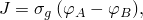
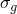
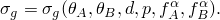

# 37.3.1 电气接触属性


**产品：** Abaqus/Standard  Abaqus/CAE  

##### **参考文献**

- ["接触相互作用分析：概述，" 第36.1.1节](pt09ch36s01abo33.md)
- ["热接触属性，" 第37.2.1节](pt09ch37s02aus174.md)
- ["GAPELECTR," Abaqus User Subroutines Reference Guide 第1.1.11节](../sub/sub-link.md#sub-rtn-ugapelectr)
- [*GAP ELECTRICAL CONDUCTANCE](../key/key-link.md#usb-kws-mgapelectconduct)
- [*SURFACE INTERACTION](../key/key-link.md#usb-kws-hsurfaceinteraction)
- ["在定义接触相互作用属性中指定间隙电导" in "定义接触相互作用属性，" Abaqus/CAE User's Guide 第15.14.1节](../usi/usi-link.md#usi-itn-help-prop-contact-elec-conductance)

### 概述

两个物体之间的电传导：
- 与跨界面电势差的平方成正比；
- 是表面之间间隙的函数；
- 可以是接触压力的函数；
- 可以是表面温度和/或表面上预定义场变量的函数；并且
- 可以在界面上产生热量。

有关耦合热-电和耦合热-电-结构分析的详细信息，请参见["耦合热-电分析，" 第6.7.3节](pt03ch06s07at22.md)，和["完全耦合热-电-结构分析，" 第6.7.4节](pt03ch06s07at23.md)。

### 在接触属性定义中包含间隙电导属性

您可以为基于表面的接触在接触属性定义中包含电导属性。

| **输入文件用法：** | 使用以下两个选项： |
| --- | --- |
|  | ``` [*SURFACE INTERACTION](../key/key-link.md#usb-kws-hsurfaceinteraction), NAME=*name* [*GAP ELECTRICAL CONDUCTANCE](../key/key-link.md#usb-kws-mgapelectconduct) ``` |

| **Abaqus/CAE用法：** | Interaction模块：接触属性编辑器：****Electrical****Electrical Conductance**** |
| --- | --- |

### 对表面之间的电导建模

Abaqus/Standard将两个表面之间流动的电流建模为 



其中*J*是跨界面从表面A上的点流向另一点*B*的电流密度，和是表面上相对点的电势，是间隙电导。点A对应于接触对从属表面上的节点。点B是与点A接触的主表面上的点。

您可以直接提供电导，也可以在用户子程序[`GAPELECTR`](../sub/sub-link.md#sub-xsl-gapelectr)中提供。

#### 直接定义*σg*

当直接定义间隙电导时，Abaqus/Standard假设 


其中


是*A*和*B*处表面温度的平均值，

*d*

是*A*和*B*之间的间隙，

*p*

是跨*A*和*B*之间界面传递的接触压力，以及


是*A*和*B*处任何预定义场变量的平均值。

##### 将间隙电导定义为间隙的函数

您可以创建一个数据表来定义对上述变量的依赖性。默认情况下，Abaqus使成为间隙*d*的函数。当是间隙*d*的函数时，表格数据必须从零间隙（闭合间隙）开始，并随着间隙的增加定义。的值在数据点定义的区间外保持不变。如果间隙电导也定义为接触压力的函数，将在所有压力下保持为零间隙值不变，如图37.3.1-1(a)所示。

**图37.3.1-1** 将间隙电导定义为间隙(a)或接触压力(b)的函数的示例。


| **输入文件用法：** | ``` [*GAP ELECTRICAL CONDUCTANCE](../key/key-link.md#usb-kws-mgapelectconduct) , ,  ``` |
| --- | --- |

| **Abaqus/CAE用法：** | Interaction模块：接触属性编辑器：****Electrical****Electrical Conductance****；**Definition: Tabular**；**Use only clearance-dependency data** |
| --- | --- |

##### 将间隙电导定义为接触压力的函数

 您可以将定义为接触压力*p*的函数。当是界面上接触压力的函数时，表格数据必须从零接触压力开始（或在可以承受拉力的接触情况下，从最负压力的数据点开始），并随着*p*的增加定义。的值在数据点定义的区间外保持不变。如果间隙电导也未定义为间隙的函数，在所有正间隙值下为零，在零间隙处不连续，如图37.3.1-1(b)所示。

| **输入文件用法：** | ``` [*GAP ELECTRICAL CONDUCTANCE](../key/key-link.md#usb-kws-mgapelectconduct), PRESSURE , ,  ``` |
| --- | --- |

| **Abaqus/CAE用法：** | Interaction模块：接触属性编辑器：****Electrical****Electrical Conductance****；**Definition: Tabular**；**Use only pressure-dependency data** |
| --- | --- |

##### 作为间隙和接触压力函数的间隙电导

	您可以定义同时依赖于间隙和压力。在和处允许不连续。一旦发生接触，电导始终基于定义压力依赖部分的曲线来评估。在数据点定义的区间外的接触压力下保持不变。的压力依赖性被扩展到负压力区域，即使未包含负压力的数据点。

| **输入文件用法：** | 使用以下两个选项： |
| --- | --- |
|  | ``` [*GAP ELECTRICAL CONDUCTANCE](../key/key-link.md#usb-kws-mgapelectconduct) , ,  [*GAP ELECTRICAL CONDUCTANCE](../key/key-link.md#usb-kws-mgapelectconduct), PRESSURE , ,  ``` |

| **Abaqus/CAE用法：** | Interaction模块：接触属性编辑器：****Electrical****Electrical Conductance****；**Definition: Tabular**；**Use both clearance- and pressure-dependency data** |
| --- | --- |

##### 将间隙电导定义为预定义场变量的函数

间隙电导可以依赖于任何数量的预定义场变量，。默认情况下，假定电导率仅取决于表面分离，可能还取决于平均界面温度。

| **输入文件用法：** | ``` [*GAP ELECTRICAL CONDUCTANCE](../key/key-link.md#usb-kws-mgapelectconduct), DEPENDENCIES=*n* ``` |
| --- | --- |

| **Abaqus/CAE用法：** | Interaction模块：接触属性编辑器：****Electrical****Electrical Conductance****；**Definition: Tabular**，**Clearance Dependency**和/或**Pressure Dependency**，**Number of field variables:** *n* |
| --- | --- |

#### 使用用户子程序[`GAPELECTR`](../sub/sub-link.md#sub-xsl-gapelectr)定义*σg*

当在用户子程序[`GAPELECTR`](../sub/sub-link.md#sub-xsl-gapelectr)中定义时，在指定的依赖性方面比直接表格输入具有更大的灵活性。例如，不再需要将定义为两个表面温度或场变量平均值的函数： 



| **输入文件用法：** | ``` [*GAP ELECTRICAL CONDUCTANCE](../key/key-link.md#usb-kws-mgapelectconduct), USER ``` |
| --- | --- |

| **Abaqus/CAE用法：** | Interaction模块：接触属性编辑器：****Electrical****Electrical Conductance****；**Definition: User-defined** |
| --- | --- |

### 对表面之间电传导产生的热量建模

Abaqus/Standard可以在耦合热-电和完全耦合热-电-结构分析中包含表面之间电传导产生的热量效果。默认情况下，所有耗散的电能都转换为热量并等量分布在两个表面之间。您可以修改转换为热量的电能耗散分数以及两个表面之间的分布；详细信息请参见["非热表面相互作用产生的热量建模" in "热接触属性，" 第37.2.1节](pt09ch37s02aus174.md#usb-cni-athermalinteraction-gapheatgen)。

### 电气接触属性模型的基于表面的输出变量

Abaqus/Standard提供与表面电气相互作用相关的以下输出变量： 

| ECD | 单位面积电流，离开从属表面。 |
| --- | --- |

| ECDA | ECD乘以与从属节点关联的面积。 |
| --- | --- |

| ECDT | ECD的时间积分。 |
| --- | --- |

| ECDTA | ECDA的时间积分。 |
| --- | --- |

这些变量的值始终在从属表面的节点上给出。它们可以请求作为表面输出到数据、结果或输出数据库文件（参见["Abaqus/Standard的表面输出" in "输出到数据和结果文件，" 第4.1.2节](pt02ch04s01aus39.md#usb-out-oprintfile-surface)，和["Abaqus/Standard和Abaqus/Explicit中的表面输出" in "输出到输出数据库，" 第4.1.3节](pt02ch04s01aus40.md#usb-out-odboutput-surface)）。

这些变量的等值线图也可以在Abaqus/CAE的可视化模块中显示（Abaqus/Viewer）。


