# 37.4.1 孔隙流体接触属性


**产品：** Abaqus/Standard  

##### **参考文献**

- ["接触相互作用分析：概述，" 第36.1.1节](pt09ch36s01abo33.md)
- [*CONTACT PERMEABILITY](../key/key-link.md#usb-kws-mcontactpermeability)
- [*SURFACE](../key/key-link.md#usb-kws-msurface)
- [*SURFACE INTERACTION](../key/key-link.md#usb-kws-hsurfaceinteraction)
- [*CONTACT PAIR](../key/key-link.md#usb-kws-hcontactpair)

### 概述

孔隙流体接触属性模型：
- 常用于岩土工程应用，其中必须保持界面两侧材料的孔隙压力连续性；
- 控制跨接触界面的孔隙流体流动以及附近接触表面的间隙区域的流动；
- 适用于接触界面两侧存在孔隙压力自由度的情况（如果仅在接触界面的一侧存在孔隙压力自由度，则表面被视为不可渗透）；
- 影响垂直于接触表面的孔隙流体流动；
- 可适用于小滑动和大滑动接触公式；并且
- 假设没有流体沿表面切向流动。

耦合孔隙流体扩散/应力分析中的接触涉及抵抗渗透的位移约束以及影响流体流动的孔隙流体接触属性。有关耦合孔隙流体扩散/应力分析的详细信息，请参见["耦合孔隙流体扩散和应力分析，" 第6.8.1节](pt03ch06s08at26.md)。有关使用孔隙压力内聚单元作为接触模型和孔隙流体接触属性的替代方案的详细信息，请参见["定义流体内聚单元间隙中的本构响应，" 第32.5.7节](pt06ch32s05alm46.md)。

### 孔隙流体相互作用中的接触压力

本节讨论的孔隙流体接触属性适用于接触界面两侧存在孔隙压力自由度的情况。在这种情况下，计算出的接触压力是有效的；它不包括孔隙流体压力贡献。 

如果接触界面的仅一侧包含孔隙压力自由度，则不会发生跨接触界面的流体流动。在这种情况下，报告的接触压力代表总压力，包括有效的结构和孔隙流体压力贡献；但仅有效的接触压力用于摩擦计算。

### 在接触属性定义中包含孔隙流体属性

Abaqus/Standard假设孔隙流体在接触界面沿法向流动，不沿界面切向流动。如图37.4.1-1所示，流入每个表面在接触界面的流体流动通常存在两个贡献。界面两侧对应点上流 入主表面和从表面的流体流量分别为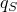和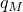。 
- 一个贡献（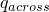）与跨界面的流动相关。的正值对应于从主表面流出并流入从表面的流动。
- 另一个贡献（从表面的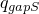和主表面的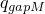）与在表面之间的区域移除或添加流体相关，同时间隙距离正在改变。符号约定使得当这些贡献流入各个表面时（同时间隙宽度减小），和为正。和之和（等于和之和）等于间隙宽度变化率的负值，直至["控制在孔隙流体接触属性有效的距离"](pt09ch37s04aus176.md#usb-cni-aporefluidinteraction-cutoff)中讨论的阈值距离。

在稳态分析中，表面分离率为零，因此流体流量贡献和为零；在稳态分析中，从一个表面流出的所有流体都流入另一个表面。

**图37.4.1-1** 界面接触单元中的流动模式。

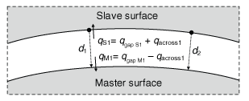

即使在接触属性定义中未明确指定接触渗透属性，接触界面上的孔隙流体流动通常也会发生。或者，您可以直接指定接触渗透属性，以更好地控制跨接触界面的流体流动。

| **输入文件用法：** | ``` [*SURFACE INTERACTION](../key/key-link.md#usb-kws-hsurfaceinteraction), NAME=*interaction_name* [*CONTACT PERMEABILITY](../key/key-link.md#usb-kws-mcontactpermeability) ``` |
| --- | --- |

### 控制在孔隙流体接触属性有效的距离

控制跨接触界面流体流动的模型最适用于接触或被相对较小间隙距离分开的两个表面。默认情况下，Abaqus/假设一旦表面分离距离超过基础表面的特征单元长度，就不会发生流体流动。或者，您可以直接指定一个截止间隙距离，超过该距离不会发生流体流动。分别为跨界面的流体流量贡献（）和流入界面的流体流量贡献（）： |
| --- | --- |
|  | [*CONTACT PERMEABILITY](../key/key-link.md#usb-kws-mcontactpermeability), CUTOFF FLOW ACROSS=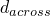 使用以下选项指定流入接触界面的流体流量贡献（）： [*CONTACT PERMEABILITY](../key/key-link.md#usb-kws-mcontactpermeability), CUTOFF GAP FILL=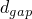 |

### 控制与跨接触界面流体流动相关的接触渗透性

如果您未指定接触渗透属性，默认模型确保在接触分离小于["控制在孔隙流体接触属性有效的距离"](pt09ch37s04aus176.md#usb-cni-aporefluidinteraction-cutoff)中讨论的阈值距离时，界面两侧的孔隙压力保持连续： 

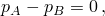

其中和是界面两侧点上的孔隙压力。此关系意味着跨界面的接触渗透性是无限的。

或者，您可以指定接触渗透性*k*，使得跨接触界面的流体流量（，如上所述在["在接触属性定义中包含孔隙流体属性"](pt09ch37s04aus176.md#usb-cni-aporefluidinteraction-including)中讨论）与跨界面的孔隙压力差成正比：

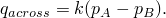

当直接定义*k*时，将其定义为 

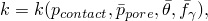

其中

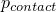

是跨*A*和*B*之间界面传递的接触压力，

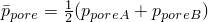

是*A*和*B*处孔隙压力的平均值，


是*A*和*B*处表面温度的平均值，以及


是*A*和*B*处任何预定义场变量的平均值。

图37.4.1-2显示了一个*k*取决于接触压力的示例。使用表格数据在接触压力增加时指定一个或多个接触压力下的*k*值。随着*p*的增加。*k*的值在数据点定义的区间外保持不变。一旦表面分离，*k*保持恒定值，直到表面之间的距离超过指定的流量截止距离（参见["控制在孔隙流体接触属性有效的距离"](pt09ch37s04aus176.md#usb-cni-aporefluidinteraction-cutoff)），此时*k*降至零。

**图37.4.1-2** 取决于接触压力的接触渗透性。

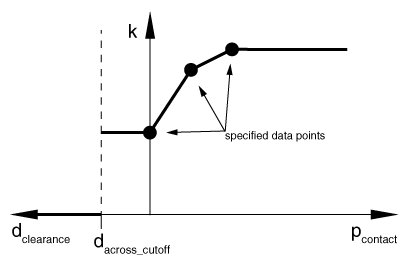

| **输入文件用法：** | ``` [*CONTACT PERMEABILITY](../key/key-link.md#usb-kws-mcontactpermeability) , , ,  ``` |
| --- | --- |

#### 定义间隙渗透性为预定义场变量的函数

除了前面提到的依赖性外，间隙渗透性可以依赖于任何数量的预定义场变量，。要使间隙渗透性依赖于场变量，每个场变量值至少需要两个数据点。

| **输入文件用法：** | ``` [*CONTACT PERMEABILITY](../key/key-link.md#usb-kws-mcontactpermeability), DEPENDENCIES=*n* , , , ,  ``` |
| --- | --- |

### 耦合热传递——孔隙流体接触属性

可以同时考虑热传递和孔隙流体流动，在这种情况下，跨接触界面的热流动可以与流体流动一起发生。这些各种接触属性方面作为单个接触属性定义的一部分进行定义，分配给接触相互作用；有关定义热传递属性的详细信息，请参见["热接触属性，" 第37.2.1节](pt09ch37s02aus174.md)。

### 输出

您可以将与接触对相互作用相关的接触表面变量写入Abaqus/Standard数据（`.dat`）、结果（`.fil`）和输出数据库（`.odb`）文件。除了与机械接触分析相关的表面变量（剪切应力、接触压力等）外，还可以报告几个孔隙流体相关变量（如单位面积孔隙流体体积流量）。这些输出请求的详细讨论可以在["Abaqus/Standard的表面输出" in "输出到数据和结果文件，" 第4.1.2节](pt02ch04s01aus39.md#usb-out-oprintfile-surface)，和["Abaqus/Standard和Abaqus/Explicit中的表面输出" in "输出到输出数据库，" 第4.1.3节](pt02ch04s01aus40.md#usb-out-odboutput-surface)中找到。 

Abaqus/Standard提供与表面孔隙流体相互作用相关的以下输出变量： 

| PFL | 单位面积孔隙体积流量，离开从属表面。 |
| --- | --- |

| PFLA | PFL乘以与从属节点关联的面积。 |
| --- | --- |

| PTL | PFL的时间积分。 |
| --- | --- |

| PTLA | PFLA的时间积分。 |
| --- | --- |

| TPFL | 离开从属表面的总孔隙体积流量。 |
| --- | --- |

| TPTL | TPFL的时间积分。 |
| --- | --- |


