# 38.1.1 Abaqus/Standard中的接触公式


**产品：** Abaqus/Standard  Abaqus/CAE  

##### **参考文献**

- ["表面：概述，" 第2.3.1节](pt01ch02s03aus16.md)
- ["在Abaqus/Standard中定义通用接触相互作用，" 第36.2.1节](pt09ch36s02aus139.md)
- ["在Abaqus/Standard中定义接触对，" 第36.3.1节](pt09ch36s03aus145.md)
- [*CONTACT](../key/key-link.md#usb-kws-hcontact)
- [*CONTACT PAIR](../key/key-link.md#usb-kws-hcontactpair)
- ["定义通用接触，" Abaqus/CAE User's Guide 第15.13.1节](../usi/usi-link.md#usi-itn-help-general)
- ["定义表面到表面接触，" Abaqus/CAE User's Guide 第15.13.7节](../usi/usi-link.md#usi-itn-help-surftosurf)
- ["定义自接触，" Abaqus/CAE User's Guide 第15.13.8节](../usi/usi-link.md#usi-itn-help-self)
- ["使用接触和约束检测，" Abaqus/CAE User's Guide 第15.16节](../usi/usi-link.md#usi-itn-detectioneditor)

### 概述

Abaqus/Standard提供了多种接触公式。每个公式基于接触离差、跟踪方法以及分配给接触表面的"主"和"从"角色的选择。对于通用接触相互作用，离差、跟踪方法和表面角色分配由Abaqus/Standard自动选择；对于接触对，您可以使用["在Abaqus/Standard中定义接触对，" 第36.3.1节](pt09ch36s03aus145.md)中描述的界面指定接触公式的这些方面。默认接触公式适用于大多数情况，但在某些情况下您可能希望选择其他公式。本节详细讨论Abaqus/Standard在接触模拟中使用的公式。

您选择的跟踪方法将对接触表面的交互方式产生相当大的影响。在Abaqus/Standard中，有两种跟踪方法可以解释机械接触模拟中两个相互作用表面的相对运动：
- 有限滑动，这是最通用的，允许表面之间任意运动（参见["变形体之间的有限滑动相互作用，" Abaqus Theory Guide 第5.1.2节](../stm/stm-link.md#stm-ifc-slidecontactelem)，和["变形体与刚性体之间的有限滑动相互作用，" Abaqus Theory Guide 第5.1.3节](../stm/stm-link.md#stm-ifc-defbodyrigidsurf)）；以及
- 小滑动，假设虽然两个物体可能发生大运动，但一个表面沿另一个表面的滑动相对较小（参见["体之间的小滑动相互作用，" Abaqus Theory Guide 第5.1.1节](../stm/stm-link.md#stm-ifc-smslidcontact)）。

对于上述每种跟踪方法，您可以在节点到表面接触离差和真正的表面到表面接触离差之间进行选择。

### 通用接触的公式

Abaqus/Standard中的通用接触始终使用有限滑动、表面到表面接触公式。此公式也可用于接触对，但不是默认的。本节中对有限滑动、表面到表面接触的讨论同样适用于通用接触和接触对。

在通用接触域中，主角色和从角色自动分配给表面，但可以覆盖这些默认分配。主表面和从表面的行为在通用接触和接触对相互作用中是一致的。通用接触域中主表面和从表面的规范在["Abaqus/Standard中通用接触的数值控制，" 第36.2.6节](pt09ch36s02aus144.md)中有详细说明。

### 接触对表面的离差

Abaqus/Standard在相互作用表面的各个位置应用条件约束来模拟接触条件。这些约束的位置和条件取决于整体接触公式中使用的接触离差。Abaqus/Standard提供两种接触离差选项：传统的"节点到表面"离差和真正的"表面到表面"离差。

#### 节点到表面接触离差

对于传统的节点到表面离差，接触条件被建立，使得接触界面的每一侧上的每个"从"节点有效地与对面接触界面上"主"表面的投影点相互作用（参见图38.1.1-1）。因此，每个接触条件涉及单个从属节点和一组附近的主节点，从中内插值到投影点。

**图38.1.1-1** 节点到表面接触离差。


传统节点到表面离差具有以下特征：
- 从属节点被约束不得穿透主表面；但是，主表面的节点原则上可以穿透从属表面（例如，参见图38.1.1-2右上角的情况）。**图38.1.1-2** 不同主-从分配下节点到表面和表面到表面接触离差的接触 enforcement比较。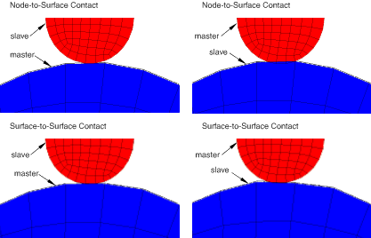
- 接触方向基于主表面法线。
- 从属表面唯一需要的信息是与每个节点关联的位置和表面积；从属表面法线方向和从属表面曲率不相关。因此，从属表面可以定义为一组节点——基于节点的表面。
- 即使接触对定义中未使用基于节点的表面，也可使用节点到表面离差。

#### 表面到表面接触离差

表面到表面离差考虑接触约束区域中从属和主表面两者的形状。表面到表面离差具有以下关键特征：
- 表面到表面公式以平均意义在从属节点附近区域而非仅在单个从属节点上强制执行接触条件。平均区域以从属节点为中心，因此每个接触约束将主要考虑一个从属节点，但也会考虑相邻从属节点。可以在单个节点处观察到一些渗透；然而，使用此离差，主节点穿透从属表面的大、未检测到的渗透不会发生。图38.1.1-2比较了具有不同网格精化的接触体上节点到表面和表面到表面的接触 enforcement。
- 接触方向基于围绕从属节点的从属表面区域的平均法线。
- 如果接触对定义中使用了基于节点的表面，则表面到表面离差不适用。

#### 选择接触离差

一般来说，如果表面几何形状被接触表面合理地表示，表面到表面离差比节点到表面离差提供更准确的应力和压力结果。图38.1.1-3显示了在表面到表面接触比节点到表面接触具有更好的接触压力精度的示例。 

**图38.1.1-3** 节点到表面和表面到表面接触离差的接触压力精度比较。


由于节点到表面离差仅抵抗从属节点穿透主表面，力倾向于集中在这些从属节点上。这种集中导致表面压力分布中的峰值和谷值。表面到表面离差以平均意义在从属表面的有限区域上抵抗渗透，这具有平滑效果。随着网格细化，离差之间的差异减小，但对于给定的网格精化，表面到表面方法往往提供更准确的应力。

使用表面到表面离差的接触也比节点到表面接触对主从表面指定不敏感（参见["在两表面接触对中选择主角色和从角色"](pt09ch38s01aus177.md#usb-cni-acontactpairform-masterslave)"下文）。图38.1.1-4显示了一个涉及具有不同网格密度的两个块的简单模型。 

**图38.1.1-4** 用于比较不同主从表面分配的测试模型。

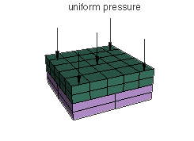

底块固定在地面上，均匀压力100 [Pa](../popups/usb-int-iconventions-unitsym.md)施加到顶块顶面。分析上，顶块应在整个接触界面上对底块施加均匀压力100 [Pa](../popups/usb-int-iconventions-unitsym.md)。表38.1.1-1比较了不同接触离差和从属表面组合的Abaqus分析结果。

**表38.1.1-1** 各种离差/从属表面组合的误差（与分析结果比较）。
| 接触离差 | 从属表面 | CPRESS最大误差 |
| --- | --- | --- |
| 节点到表面 | 顶块 | 13% |
| 底块 | 31% |
| 表面到表面 | 顶块 | ~1% |
| 底块 | ~1% |

如果由于使用粗糙网格，表面几何形状不能很好地表示，则无论使用表面到表面接触还是节点到表面接触，都可能存在显著的不准确。在某些情况下，表面到表面接触可用的表面平滑技术可以显著改善使用粗糙网格获得的结果。参见["Abaqus/Standard中的平滑接触表面，" 第38.1.3节](pt09ch38s01aus179.md)，了解表面到表面接触的表面平滑选项的讨论。

表面到表面离差通常每个约束涉及更多节点，因此可能增加求解成本。在大多数应用中，额外成本很小，但在某些情况下成本可能变得显著。以下因素（尤其是组合）可能导致表面到表面接触成本高昂：
- 模型的较大部分参与接触。
- 主表面比从属表面更精细。
- 多层壳参与接触，使得一个接触对的主表面充当另一个接触对的从属表面。

表面到表面公式主要用于接触表面法线大致相反的常见情况。节点到表面接触公式通常更适合处理涉及特征边缘或角落的接触（如果主动接触区域中各个从属和主面法线方向大致不相反）。

### 接触跟踪方法

在Abaqus/Standard中，有两种跟踪方法可以解释机械接触模拟中两个相互作用表面的相对运动。

#### 有限滑动跟踪方法

有限滑动接触是最通用的跟踪方法，允许接触表面之间任意分离、滑动和旋转。对于有限滑动接触，随着接触表面的相对切向运动， 当前活动接触约束的连通性会发生变化。有关Abaqus/Standard如何计算有限滑动接触的详细说明，请参见本节后面的["使用有限滑动跟踪方法"](pt09ch38s01aus177.md#usb-cni-acontactpairform-finite)。

#### 小滑动跟踪方法

小滑动接触假设一个表面沿另一个表面的滑动相对较小，基于主表面每个约束的线性化近似。对于小滑动接触，尽管约束的激活/停用状态通常可以在分析期间改变，但与各个接触约束关联的节点组在分析期间是固定的。如果近似值合理，应考虑使用小滑动接触，因为可以节省计算成本并提高稳健性。有关Abaqus/Standard如何计算小滑动接触的详细说明，请参见本节后面的["使用小滑动跟踪方法"](pt09ch38s01aus177.md#usb-cni-acontactpairform-smsliding)。

### 在两表面接触对中选择主角色和从角色

Abaqus/Standard强制执行以下与接触表面主角色和从角色分配相关的规则：
- 解析刚性表面和刚性单元的表面必须始终是主表面。
- 基于节点的表面只能作为从属表面，始终使用节点到表面接触。
- 从属表面必须始终连接到变形体或定义为变形的刚体。
- 接触对中的两个表面不能同时是刚性表面，但定义为变形的变形表面除外（参见["刚性体定义，" 第2.4.1节](pt01ch02s04aus22.md)）。

当接触对中的两个表面都是基于单元的并连接到变形体或定义为变形的刚体时，您必须选择哪个表面作为从属表面，哪个作为主表面。对于节点到表面接触，此选择尤其重要。一般来说，如果较小的表面接触较大的表面，最好选择较小的表面作为从属表面。如果无法做出区分，主表面应选择为较硬物体上的表面，或者如果两个表面具有相当刚度，则选择网格较粗的表面上的表面。在选择主从表面时应考虑结构的刚度，而不仅仅是材料。例如，薄金属板可能比大块橡胶更软，即使钢具有比橡胶材料更大的模量。如果两个表面上的刚度和网格密度相同，首选选择并不总是显而易见的。

主从角色的选择对表面到表面接触公式的结果的影响通常比对节点到表面接触公式的结果影响小。但是，如果两个表面具有不同的网格精化，则主从角色的分配对表面到表面接触的性能可能有显著影响；如果从属表面比主表面粗糙得多，求解可能会变得相当昂贵。

### 影响接触公式的基本选择

您对接触离差和跟踪方法的选择对分析有相当大的影响。除了已经讨论的特性外，某些离差和跟踪方法组合有其自己的特征和限制。这些特性总结在表38.1.1-2中。您还应考虑与各种接触公式相关的求解成本。

**表38.1.1-2** 接触公式特性比较。
| 特性 | 接触公式 |
| --- | --- |
| 节点到表面 | 表面到表面 |
| 有限滑动 | 小滑动 | 有限滑动 | 小滑动 |
| 默认情况下考虑壳厚度 | 否 | 是 | 是 | 是 |
| 允许自接触 | 是 | 否 | 是 | 否 |
| 允许双面表面 | 仅从属表面 | 仅从属表面 | 是1 | 是 |
| 默认表面平滑 | 主表面某些平滑 | 是（锚点）；每个约束使用主表面的平面近似 | 否 | 锚点否；每个约束使用主表面的平面近似 |
| 默认约束 enforcement方法 | 3D自接触使用增强拉格朗日方法；否则直接方法 | 直接方法 | 惩罚方法 | 直接方法 |
| 确保偏移参考表面的力矩平衡 | 否 | 否 | 是 | 是 |
| 1双面主表面仅在使用基于路径的跟踪算法时才允许（参见["基于路径与基于状态的跟踪算法"](pt09ch38s01aus177.md#usb-cni-acontactpairform-tracking)）。双面从属表面如果主表面不是用户定义的，则两种跟踪算法都允许。 |

#### 考虑壳厚度

大多数接触公式在计算接触约束时会考虑壳的表面厚度。但是，有限滑动、节点到表面公式不会考虑壳厚度。这些计算在["在Abaqus/Standard中为接触对分配表面属性，" 第36.3.2节](pt09ch36s03aus146.md#usb-cni-acontactpair-thickness)中的"考虑壳和膜厚度"下有更详细的讨论。

#### 允许自接触

自接触通常是模型中大变形的结果。通常很难预测哪些区域将参与接触，或者它们将如何相对移动。因此，自接触不能使用小滑动跟踪方法。

#### 允许双面表面

基于类壳单元的双面接触表面默认允许作为表面到表面接触公式的从属和/或主表面，允许作为节点到表面接触公式的从属表面。对于类壳表面，作为表面到表面公式的主表面与可选的基于状态的跟踪算法（参见下面的["基于路径与基于状态的跟踪算法"](pt09ch38s01aus177.md#usb-cni-acontactpairform-tracking)）或用于节点到表面接触公式，表面必须定义为单面（参见["基于单元的表面定义，" 第2.3.2节](pt01ch02s03aus17.md#usb-int-adeformablesurf-single-sided)中的"定义单面表面"，和["在Abaqus/Standard中定义接触对，" 第36.3.1节](pt09ch36s03aus145.md#usb-cni-acontactpair-orient)中的"壳状表面的方向考虑"，了解更多信息）。

#### 表面平滑

当使用节点到表面离差时，锯齿状主表面的角落或小突起允许穿透基于节点的表面中节点之间的空间。有时从属节点沿主表面滑动可能会被这些角落卡住。因此，Abaqus/Standard自动平滑用于节点到表面离差接触计算的主表面，以最小化这种现象。详情在["有限滑动、节点到表面公式的主表面平滑"](pt09ch38s01aus177.md#usb-cni-acontactpairform-smoothing)后面讨论。

使用表面到表面离差时，默认情况下不会进行表面平滑。表面到表面离差以平均意义在有限区域上考虑接触条件，这往往减轻了主表面的小突起穿透从属表面的问题，并在约束级别引入了一些固有的平滑特性。但是，这种固有平滑通常不能显著减轻在使用相对粗糙网格时曲表面的不良几何表示相关的误差。在某些情况下，表面到表面接触可用的非默认圆周或球形表面平滑方法可以显著改善使用粗糙网格获得的结果（参见["Abaqus/Standard中的平滑接触表面，" 第38.1.3节](pt09ch38s01aus179.md)）。

#### 约束 enforcement方法

在许多情况下，Abaqus/Standard默认严格强制执行先前讨论的接触约束。但是，严格强制执行接触约束有时可能导致过度约束问题（例如，参见["过度约束检查，" 第35.6.1节](pt08ch35s06aus138.md)）或收敛困难。为了解决这些问题并允许以通常对解精度影响最小的方式降低求解成本，Abaqus/Standard还提供了基于惩罚的约束 enforcement方法。数值约束 enforcement方法（和默认值）在["Abaqus/Standard中的接触约束 enforcement方法，" 第38.1.2节](pt09ch38s01aus178.md)中有详细讨论。

#### 力矩平衡

根据牛顿第三运动定律，接触力应该是自平衡的；也就是说，作用于各个表面上的每个活动接触约束的净接触力应该大小相等、方向相反，并有效地通过一个共同点。基于表面到表面接触离差的接触约束始终表现出此特性。基于节点到表面接触离差的接触约束始终产生零净力，但在某些情况下可能在数值解中产生净力矩。如果在从属表面和主表面的各个接触表面节点之间存在偏移，则与节点到表面接触约束相关的摩擦力将产生净力矩。以下因素可能导致在接触约束活动时各个接触表面的节点之间的法线方向偏移：
- 软化的压力-闭合行为（由于用户指定的软化压力-闭合模型或使用惩罚方法等表现出数值软化的约束 enforcement方法）。
- 考虑壳或膜厚度的接触计算（对于有限滑动、节点到表面公式不允许）。
- 用户指定的初始接触间隙（参见["在Abaqus/Standard接触对中调整初始表面位置和指定初始间隙，" 第36.3.5节](pt09ch36s03aus149.md#usb-cni-aadjustsurfaces-clearance)中的"为小滑动接触定义精确的初始间隙或过盈"）。
- 特殊用途接触单元的各种用法，例如管对管接触单元（参见["使用单元的接触建模，" 第40.1.1节](pt09ch40s01abo34.md)，和["管对管接触单元，" 第40.3.1节](pt09ch40s03alm65.md)），导致彼此相互作用的节点之间存在一些法线距离。

虽然这是不可取的，但节点到表面接触约束有时产生的净力矩通常不会对分析结果产生重大不利影响。

#### 接触离差方法对求解成本的影响

没有简单的方法可以预测哪种接触离差方法会导致更低的整体求解成本。基本趋势包括：
- 节点到表面接触离差每次迭代往往比表面到表面接触离差成本更低（因为表面到表面接触离差通常每个约束涉及更多节点）。
- 具有有限滑动接触的接触条件往往比节点到表面接触离差用更少的迭代次数收敛到表面到表面接触离差（因为表面到表面接触离差在滑动时具有更连续的行为）。

### 使用有限滑动跟踪方法

有限滑动跟踪方法允许表面之间任意分离、滑动和旋转。Abaqus/Standard接触对默认使用有限滑动、节点到表面接触公式。Abaqus/Standard中的通用接触始终使用有限滑动、表面到表面接触公式。

#### 示例

考虑图38.1.1-5所示的情况，表面`ASURF`作为有限滑动、节点到表面接触对中表面`BSURF`的从属表面。 

**图38.1.1-5** 接触体。

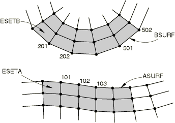

在此示例中，从属节点101可以在主表面`BSURF`上的任何位置接触。接触时，它被约束沿`BSURF`滑动，不管该表面的方向和变形。Abaqus/Standard跟踪节点101相对于主表面`BSURF`的位置，因为体会变形。这种行为是可能的。图38.1.1-6显示了节点101与其主表面`BSURF`之间接触的可能演变。 

**图38.1.1-6** 有限滑动接触中节点101的轨迹。


节点101在时间与具有端节点201和202的单元面接触。此时，载荷传递仅发生在节点101与节点201和202之间。后来，在时间，节点101可能发现自己与具有端节点501和502的单元面接触。然后，载荷传递将发生在节点101与节点501和502之间。

#### 基于路径与基于状态的跟踪算法

下面提供Abaqus/Standard中可用的跟踪算法的简要说明，以便您了解它们的特性和可用选项。

##### 基于路径的跟踪算法

"基于路径的"跟踪算法仔细考虑从属表面上的点相对于主表面在每个增量内的相对路径，并允许双面壳和膜主表面。基于路径的跟踪算法仅适用于涉及基于单元的主表面的有限滑动、表面到表面接触相互作用，是这些相互作用的默认选项。与基于状态的算法相比，基于路径的算法有时对涉及自接触或大增量相对运动的分析更有效。 

| **输入文件用法：** | 使用以下选项指定使用基于路径的跟踪算法： |
| --- | --- |
|  | ``` [*CONTACT PAIR](../key/key-link.md#usb-kws-hcontactpair), INTERACTION=*interaction_property_name*, TYPE=SURFACE TO SURFACE, TRACKING=PATH ``` |

| **Abaqus/CAE用法：** | Interaction模块：表面到表面接触或自接触相互作用编辑器：**Discretization method**: **Surface to surface**，**Contact tracking**: **Two configurations (path)** |
| --- | --- |

##### 基于状态的跟踪算法

 "基于状态的"跟踪算法基于增量开始时关联的跟踪状态以及与预测配置关联的几何信息来更新跟踪状态。此算法非常适合大多数有限滑动分析，但需要使用单面表面，偶尔在跟踪大增量运动方面有困难。如果增量相对运动超过主表面的尺寸，或者增量运动穿过主表面的角落，基于状态的跟踪可能会错过检测接触；指定增量大小的上限有助于避免这些问题。基于状态的跟踪算法是：
- 有限滑动、节点到表面接触对可用的唯一跟踪算法；
- 涉及解析刚性主表面的有限滑动接触相互作用可用的唯一跟踪算法；
- 涉及基于单元的主表面的有限滑动、表面到表面接触对的非默认选项。

| **输入文件用法：** | 使用以下选项指定使用基于状态的跟踪算法： |
| --- | --- |
|  | ``` [*CONTACT PAIR](../key/key-link.md#usb-kws-hcontactpair), INTERACTION=*interaction_property_name*, TYPE=SURFACE TO SURFACE, TRACKING=STATE ``` |

| **Abaqus/CAE用法：** | Interaction模块：表面到表面接触或自接触相互作用编辑器：**Discretization method**: **Surface to surface**，**Contact tracking**: **Single configuration (state)** |
| --- | --- |

#### 平滑有限滑动、节点到表面公式的主表面

有限滑动、节点到表面接触公式要求主表面在所有点具有连续的表面法线。如果主表面没有连续的表面法线，则使用有限滑动、节点到表面接触分析可能会导致收敛问题；从属节点往往会在主表面法线不连续的点"卡住"。Abaqus/Standard自动平滑基于单元的主表面的表面法线（参见下面的["平滑变形主表面和使用刚性单元定义的刚性表面"](pt09ch38s01aus177.md#usb-cni-acontactpairform-smooth)），用于有限滑动、节点到表面接触模拟，包括使用滑移线和接触单元建模的表面。您应该创建平滑的解析刚性表面（参见["解析刚性表面定义，" 第2.3.4节](pt01ch02s03aus19.md)）。使用有限滑动、表面到表面公式时，不需要对主表面法线进行这种平滑。

##### 平滑变形主表面和使用刚性单元定义的刚性表面

对于具有平面或轴对称变形主表面的有限滑动、节点到表面接触模拟，Abaqus/Standard将使用抛物线曲线平滑两个一阶单元面之间的不连续过渡。使用连接位于单元面上两点的三次曲线平滑两个二阶单元面之间的不连续过渡。此平滑如图38.1.1-7（对于一阶单元（线性段））和图38.1.1-8（对于二阶单元（抛物线段））所示。对于具有三维变形主表面和使用刚性单元的刚性主表面的有限滑动、节点到表面模拟，Abaqus/Standard将平滑主表面面之间不连续的表面法线过渡。

**图38.1.1-7** 线性段之间的平滑。

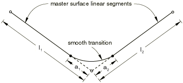

**图38.1.1-8** 二次段之间的平滑。


您可以通过指定分数*f*来控制节点到表面接触模拟中主表面的平滑程度。默认值*f*为0.2。

对于平面或轴对称变形主表面，，其中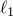和是连接到表面节点的两个单元面的长度，（参见图38.1.1-7和图38.1.1.8）。Abaqus/Standard将在不连续存在的节点两侧的距离和处构建抛物线或三次段；此平滑段将用于接触计算。因此，接触表面将与-faceted单元几何形状不同。平滑仅影响变形主表面法线在连接两个元素的节点处不连续的段；它不影响二阶单元面上邻近中间节点的两段。

对于三维、基于单元的主表面，*f*定义为面维度的一部分，如图38.1.1-9所示。边界虚线内区域点的法线向量计算为垂直于面。在该区域外，法线根据与相邻面的关系进行平滑，使用图38.1.1-7和图38.1.1-8所示二维方法的推广。物理三维面不进行平滑；只有与面关联的表面法线定义受平滑操作影响。用于刚性类型单元（参见["刚性单元，" 第30.3.1节](pt06ch30s03alm23.md)）的表面平滑算法的实现与其他单元类型略有不同。这种差异通常对收敛行为或求解结果影响最小；但是，例如，在一种情况下使用R3D4单元建模刚性体，另一种情况下使用分配给刚性体的S4R单元，可能会偶尔观察到不同的求解行为。

**图38.1.1-9** 三维主表面的平滑。

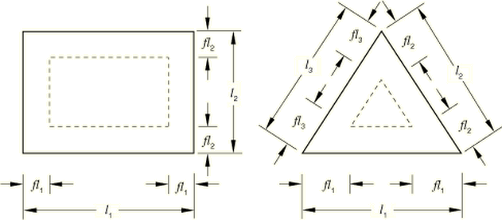

| **输入文件用法：** | 对节点到表面接触模拟使用以下选项： |
| --- | --- |
|  | ``` [*CONTACT PAIR](../key/key-link.md#usb-kws-hcontactpair), INTERACTION=*interaction_property_name*, SMOOTH=*f* ``` 对使用滑移线和接触单元使用以下选项： ``` [*SLIDE LINE](../key/key-link.md#usb-kws-mslideline), ELSET=*name*, SMOOTH=*f* ``` |

| **Abaqus/CAE用法：** | Interaction模块：****Interaction****Create****：**Surface-to-surface contact (Standard)**或**Self-contact (Standard)**：**Degree of smoothing for master surface:** *f* |
| --- | --- |

##### 沿对称边缘平滑变形主表面

当二维或轴对称变形主表面在对称平面处结束且使用节点到表面离差时，如果对称端处的边界条件以对称"类型"边界XSYMM或YSYMM指定，Abaqus/Standard将平滑并计算端段的正确表面法线和平面。此平滑程序通过关于对称平面反射端段并在端段和反射段之间构建抛物线或三次段来实现。因此，接触表面可能与靠近末端的-faceted单元几何形状不同。Abaqus/Standard将自动调整轴对称主表面在处的表面法线和平面，无论是否定义了对称边界条件。有限滑动、表面到表面公式对在对称平面处结束的表面没有特殊处理。参见["Abaqus/Standard中的接触公式，" 第38.1.1节](pt09ch38s01aus177.md#usb-cni-acontactpairform-symmssntos)，了解小滑动、节点到表面公式如何处理在对称平面处结束的主表面。参见["Abaqus/Standard中的接触公式，" 第38.1.1节](pt09ch38s01aus177.md#usb-cni-acontactpairform-ssstos)，了解小滑动、节点到表面公式如何处理在对称平面处结束的从属表面。

##### 覆盖有限滑动、节点到表面接触的默认平滑行为

为了在二维中建模带有角落的主表面（三维中的折叠线），将表面分成多个表面。此技术防止Abaqus/Standard平滑角落或折叠线，并允许Abaqus/Standard在从属节点接触主表面内部角落或折叠时引入与每个表面关联的约束。

为了准确建模图38.1.1-10所示的带有角落的主表面，必须定义两个接触对：第一个接触对将`ASURF`作为从属表面，将`BSURFA`作为主表面；第二个接触对将`ASURF`作为从属表面，将`BSURFB`作为主表面。

**图38.1.1-10** 带有角落的主表面。


#### 几何线性分析中的有限滑动

有限滑动模拟通常包括非线性几何效应，因为此类模拟通常涉及大变形和大旋转。但是，也可以在几何线性分析中使用有限滑动跟踪方法（参见["几何非线性" in "General and linear perturbation procedures，" 第6.1.3节](pt03ch06s01aus44.md#usb-anl-alinearnonlinear-nlgeom)）。在有限滑动、几何线性分析中更新表面之间的载荷传递路径和接触方向。此功能有助于分析不发生大旋转的两个刚体之间的有限滑动。

#### 有限滑动接触模拟中的非对称项

当三维faceted表面接触时，节点到表面离差产生的法向接触约束在方程组中产生非对称项。这些项在主表面面之间表面法线差异较大的区域对收敛率有很大影响。

表面到表面离差产生的法向接触约束在二维和三维情况下都产生非对称项。这些项在主表面和从属表面不彼此平行的区域对收敛率有很大影响。

在这两种情况下，您应该使用该步的非对称求解方案来提高模拟的收敛率（参见["在Abaqus/Standard中定义分析，" 第6.1.2节](pt03ch06s01abo05.md#usb-anl-unsymm)）。

涉及强摩擦效应的接触模拟也可能产生非对称项。详情请参见["摩擦行为，" 第37.1.5节](pt09ch37s01aus169.md#usb-cni-afriction-unsymmetric)中的"方程组中的非对称项"。

### 使用小滑动跟踪方法

对于一大类接触问题，即使需要考虑几何非线性，有限滑动方法的通用跟踪也是不必要的。Abaqus/Standard为这类问题提供小滑动跟踪方法。对于几何非线性分析，此公式假设表面可能发生任意大旋转，但从属节点将在整个分析过程中与主表面的同一局部区域相互作用。对于几何线性分析，小滑动方法退化为无穷小滑动和旋转方法，假设表面的相对运动和接触体的绝对运动都很小。

Abaqus/Standard尝试将主表面的平面近似与每个小滑动接触对的从属节点关联。接触相互作用考虑给定从属节点（或对于表面到表面公式在从属节点附近的区域）与关联的局部切平面之间的接触。图38.1.1-11显示了小滑动、节点到表面公式的示例（从属节点通常被约束不得穿透此局部切平面）。每个局部切平面（在二维中是一条线）由主表面上的锚点和该锚点处的方向向量定义（参见图38.1.1-11）。 

**图38.1.1-11** 小滑动、节点到表面公式用于节点103的锚点和局部切平面定义。


算法用于在下面描述。如果无法为特定从属节点确定锚点，则不会对该从属节点强制执行接触约束。

为每个从属节点提供局部切平面意味着对于小滑动跟踪方法，Abaqus/Standard不必在整个主表面上监视从属节点的可能接触。因此，小滑动接触通常在计算上比有限滑动接触便宜。成本节省在三维接触问题中通常最为显著。

#### 小滑动、节点到表面接触

对于节点到表面接触，Abaqus/Standard选择从属节点局部切平面的锚点，使得从锚点指向从属节点的向量与主表面上的平滑变化法线向量重合。锚点在分析开始前使用模型的初始配置选择。

##### 平滑变化的主表面法线

该算法要求主表面具有平滑变化的法线向量，其中是主表面上的任意点。定义的第一步是构建主表面每个节点的单位法线向量。Abaqus/Standard通过平均构成主表面的单元面的法线来形成这些节点法线；只有表面定义中的单元面才会对节点法线有贡献，因此对有贡献。Abaqus/Standard使用初始节点坐标计算这些法线。

图38.1.1-11显示了主表面的节点单位法线、锚点以及与从属节点103关联的局部切平面。Abaqus/Standard使用节点单位法线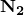和，以及包含两个节点的单元的形状函数，在2-3单元面上构建。Abaqus/Standard选择节点103的局部切平面的锚点，使得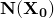通过节点103。是节点103的接触方向，定义局部切平面的方向。在此示例中，和在许多情况下一样，局部切平面只是实际网格几何形状的近似。

##### 修改主表面法线

在主表面上定义用户指定的节点法线（参见["节点处的法线定义，" 第2.1.4节](pt01ch02s01aus08.md)）将在某些情况下改善小滑动、节点到表面公式计算的局部切平面。例如，对应于相邻面平均值的默认节点法线可能在周长节点处导致与真实表面法线方向的显著偏差，如图38.1.1-12所示。节点法线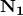不沿对称平面指向，这意味着从属节点100永远不会与主表面接触。在小滑动问题中，如果从属节点在分析开始时未能与主表面相交，它将自由穿透主表面，因为不会形成局部切平面。

**图38.1.1-12** 小滑动同心圆柱模型中节点1处的主表面法线。使用默认的，从属节点100永远不会接触`CSURF`。

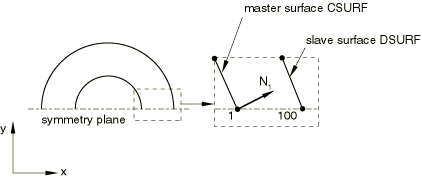

在主表面`CSURF`节点1处定义用户指定的法线(1.00E+00, 0.00E+00, 0.00E+00)将纠正问题，如图38.1.1-13所示。此方法允许从属节点100看到主表面，并将使用正确的接触法线方向。如果在这些节点上以对称"类型"格式（XSYMM、YSYMM或ZSYMM——参见["Abaqus/Standard和Abaqus/Explicit中的边界条件，" 第34.3.1节](pt07ch34s03aus118.md)）指定边界条件，则会自动调整周长节点处的主表面法线以沿对称平面放置。

**图38.1.1-13** 现在允许从属节点100接触`CSURF`的`CSURF`节点1处修改的主表面法线。


#### 小滑动、表面到表面接触

与表面到表面方法的一个关键区别是，每个接触约束涉及多个从属节点（除非从属表面基于垫圈单元，如下所述）。这与表面到表面公式以平均意义在从属节点附近区域而非仅在单个从属节点上强制执行接触条件的事实相关（参见上面的["表面到表面接触离差"](pt09ch38s01aus177.md#usb-cni-acontactpairform-stos)）。小滑动、表面到表面接触公式是有限滑动、表面到表面公式的极限情况，使用主表面每个从属表面平均区域的平面近似。从属节点的约束参与因子在小滑动接触中保持不变。每个接触约束的有效作用中心在从属表面上的位置可能与与约束关联的主要从属节点的位置略有不同。 

如果从属表面基于垫圈单元，则使用小滑动、表面到表面公式的特殊版本，以避免触发垫圈单元不稳定变形模式的趋势。此特殊公式每个接触约束只有一个从属节点，并保留表面到表面公式的精度优势，但不适合扩展到有限滑动，否则不如常规小滑动、表面到表面公式通用。（有限滑动、表面到表面公式始终在每个约束中使用多个从属节点，不推荐用于涉及垫圈单元的接触。）

小滑动、表面到表面接触公式以类似于小滑动、节点到表面接触公式的方式确定主锚点和法线方向；但是，存在一些差异。对于表面到表面方法，锚点大致对应于从属表面的平均区域投影到主表面上的主表面上的区域中心。此投影沿从属表面法线方向发生。此方法不使用平滑的主表面节点法线。锚点位置通常不显著取决于是否使用节点到表面或表面到表面离差，除非表面在初始配置中显著分离且不平行（在这种情况下，小滑动接触可能不合适）。

在以下情况下，Abaqus/Standard会自动为各个小滑动接触约束恢复到节点到表面方法，即使您指定了使用表面到表面方法：
- 如果从属表面是基于节点的表面；
- 如果沿从属表面法线方向的投影与主表面不相交（但可以使用上面为小滑动、节点到表面接触公式讨论的内插主表面法线方向算法找到锚点）；或者
- 如果单面从属和主表面具有大致相同方向的表面法线。

对于基于表面到表面离差的约束，不需要约束与对称平面上的节点关联的约束平行。因此，通常不需要指定特定的法线方向。与节点到表面接触一样，接触方向从锚点指向从属节点，切平面垂直于此方向。对于小滑动、表面到表面公式，接触法线会自动调整以沿对称平面放置，对于在对称"类型"格式（XSYMM、YSYMM或ZSYMM——参见["Abaqus/Standard和Abaqus/Explicit中的边界条件，" 第34.3.1节](pt07ch34s03aus118.md)）指定边界条件的从属节点，每个从属节点都是如此。

#### 局部切平面方向

局部切平面根据定义垂直于接触方向。您可以覆盖默认接触方向以指定具有空间变化间隙或过盈定义的方向（参见["在Abaqus/Standard接触对中调整初始表面位置和指定初始间隙，" 第36.3.5节](pt09ch36s03aus149.md#usb-cni-aadjustsurfaces-clearance-normal)中的"指定用于接触计算的表面法线"）。

一旦定义了接触方向，局部切平面相对于主表面facet的方向保持固定。因为小滑动接触考虑非线性几何效应，Abaqus/Standard持续更新局部切平面的方向以考虑主表面facet的旋转，并且假设主表面是变形的，主表面的变形。锚点相对于主表面facet上周围节点的位置不会随主表面变形而改变。

#### 载荷传递

在小滑动分析中，每个约束只能将载荷传递到主表面上有限数量的节点。主表面上与锚点初始邻近的节点基于在初始配置中到锚点的邻近性来选择。传递到每个主表面节点的载荷大小基于在当前、变形配置中到从属表面作用中心的邻近性（对应于节点到表面公式的从属节点）。例如，在图38.1.1-11中，如果使用节点到表面离差，节点103将传递载荷到主表面节点2和3（如果使用表面到表面离差，载荷可能传递到其他附近的主节点）。因此，如果节点103接触局部切平面，则更大份额的力将被传递到主表面节点中更靠近从属节点的节点2或3。

当从属表面的约束作用中心沿其局部切平面滑动时，Abaqus/Standard会更新主表面节点之间的载荷分布。但是，永远不会向给定小滑动约束的原始节点列表添加额外的主表面节点。约束将继续传递载荷到原始主表面节点列表，无论滑动距离如何。图38.1.1-14显示了小滑动使用但表面的相对切向运动不是"小"时可能出现的问题。它显示了图38.1.1-5中从属节点101与其主表面`BSURF`之间接触的可能演变。使用单位法线向量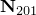和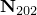，为从属节点101找到锚点；为了此示例的目的，假设它位于201-202面的中点。有了的位置，节点101的局部切平面与201-202面平行。载荷传递始终发生在节点101与节点201和202之间，无论节点101沿局部切平面滑动多远。因此，如果节点101如图38.1.1-14所示移动，它将继续传递载荷到节点201和202，而实际上它确实滑离了形成主表面`BSURF`的网格。

**图38.1.1-14** 小滑动接触分析中的过度滑动。

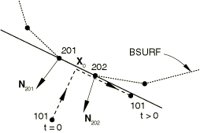

#### 什么可以被视为小滑动

小滑动接触模拟中的接触对应不应该严重违反上述任何假设或限制。遵守以下准则： 
- 从属节点应从其对应锚点滑动小于一个单元长度，并且仍应接触其局部切平面。如果主表面高度弯曲，从属节点应仅滑动一小部分单元长度。从属节点处的累积滑移（CSLIP）可以很好地估计从属节点移动了多远。
- Abaqus/Standard形成的局部切平面应该是网格几何形状的良好近似；如有必要，定义用户指定的法线（["节点处的法线定义，" 第2.1.4节](pt01ch02s01aus08.md)）以改善平滑变化的主表面法线。
- 主表面的旋转和变形不应导致局部切平面在分析过程中成为主表面的不良表示。

#### 在小滑动问题中选择主从表面

["在Abaqus/Standard中定义接触对，" 第36.3.1节](pt09ch36s03aus145.md)给出的基本准则在小滑动模拟中仍应遵循——从属表面应该是更精细的表面或更易变形物体上的表面。但是，在小滑动模拟中，在定义主表面时需要更多考虑。对于小滑动接触，每个从属节点将主表面视为平坦表面，这可能与表面真实形状显著不同，即使在锚点附近的局部区域也是如此。在某些情况下，局部切平面在初始配置中提供了对主表面的良好局部近似，但主表面的变形和旋转会使局部切平面变得成为主表面的不良表示。图38.1.1-15显示了一个示例，其中主表面的扭曲导致这种情况。 

**图38.1.1-15** 主表面变形在小滑动接触分析中可能导致局部切平面问题。


可以通过在主表面上使用更精细的网格来在一定程度上最小化此问题，从而提供更多单元面来控制切平面的运动。不需要过度网格细化，因为只应发生小滑动。

#### 无穷小滑动

如前所述，对于几何线性分析，小滑动跟踪方法退化为无穷小滑动跟踪方法。无穷小滑动假设表面的相对运动和模型的绝对运动都很小。局部切平面的方向不会更新，载荷传递路径和分配给每个主表面节点的权重在无穷小滑动模拟期间保持不变。

与小滑动一样，您可以在无穷小滑动跟踪方法中选择节点到表面和表面到表面离差。相同的用户界面适用，默认是节点到表面离差。

### 表面上的局部切方向

接触表面上的局部切方向是Abaqus计算接触相互作用中切向行为的参考方向。Abaqus/Standard默认计算两个局部切方向的初始方向。在几何非线性分析中，局部切方向随接触表面旋转。

#### 计算二维表面的初始局部切方向

二维和标准轴对称模型只有一个局部切方向，。Abaqus/Standard通过将指向模型平面的向量（0.，0.，1.0）与接触法线向量的叉乘来定义此方向的方向。

由广义轴对称体组成的模型具有第二个局部切方向，，以考虑接触体之间周向扭转相对差异的相关滑动分量。表面上任意点处的第一个局部切方向始终在局部*r-z*平面中与主表面相切。第二个局部切方向在此平面正交的局部周向方向上。有关广义轴对称模型的更多信息，请参见["广义轴对称应力/位移单元与扭转" in "选择单元的维度，" 第27.1.2节](pt06ch27s01aus111.md#usb-elm-edimension-axisymmetric-gen)。

#### 计算三维表面的初始局部切方向

默认情况下，Abaqus/Standard使用以下约定确定两个局部切方向和的初始方向：

**有限滑动、表面到表面公式**：两个局部切方向的默认初始方向基于从属表面法线，使用计算表面切线的标准约定（参见["约定，" 第1.2.2节](pt01ch01s02aus02.md)），并假设接触法线对应于从属表面的负法线。

**有限滑动、节点到表面公式**：对于涉及基于三维梁型单元的从属表面的接触，第一个和第二个局部切方向分别沿梁的长度和横方向定义。对于涉及解析刚性表面和不是基于三维梁型单元的从属表面的接触，第一个局部切方向沿用于生成解析刚性表面的横截面方向切向，第二个局部切方向在与接触发生的横截面平面正交的方向上。在其他情况下，两个局部切方向的默认初始方向通过首先计算试探性和方向来计算。对于基于单元的从属表面，试探性方向基于从属表面，使用计算表面切线的标准约定。对于基于节点的从属表面，试探性和方向在每个节点处设置为与全局*x*-和*y*轴重合。然后Abaqus构建、和（其中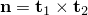）的正交 triad，然后旋转此 triad使得与主表面上跟踪点处的主表面法线对齐。

**小滑动、表面到表面公式**：两个局部切方向的默认初始方向基于从属表面法线，使用计算表面切线的标准约定，但对于涉及解析刚性表面的接触，局部切方向基于主表面法线。

**小滑动、节点到表面公式**：两个局部切方向的默认初始方向在主表面上每个点处基于主表面法线，使用计算表面切线的标准约定。

#### 为接触对表面定义替代初始局部切方向

如果默认局部切方向不便于规定各向异性摩擦模型或查看接触输出，您可以为三维接触对表面定义局部切方向。您不能为以下类型的表面重新定义局部切方向：
- 通用接触域中的表面
- 解析刚性表面
- 二维表面

您通过将方向定义（参见["方向，" 第2.2.5节](pt01ch02s02aus15.md)）与接触对表面关联来定义局部切方向。您只能将方向分配给接触对的一个表面。可以在其上定义方向的表面与将计算默认方向的方向相同（参见前面给出的约定）。例如，只能在为变形体对变形体有限滑动接触的从属表面上定义方向。如果还给出第二个方向，则会发出错误消息。因此，不可能为变形从属表面和解析刚性表面之间的有限滑动接触重新定义局部切方向。

如果接触对从属表面由三维桁架型单元或没有旋转自由度的节点列表生成，则在该从属表面经历有限运动时不会旋转方向。在这种情况下，在输入处理过程中会发出警告消息。

| **输入文件用法：** | ``` [*CONTACT PAIR](../key/key-link.md#usb-kws-hcontactpair), INTERACTION=*interaction_property_name* *slave surface name*, *master surface name*, *orientation for slave surface* *slave surface name*, *master surface name*, , *orientation for master surface* ``` |
| --- | --- |

| **Abaqus/CAE用法：** | 您不能在Abaqus/CAE中为接触对定义替代局部切方向。 |
| --- | --- |

#### 局部切方向的演变

对于几何非线性分析，局部切方向随着这些方向最初计算或使用上述方向定义重新定义而随表面旋转，但小滑动、表面到表面公式的局部切方向随主表面旋转。这些旋转的局部切方向进一步旋转以确保使用旋转的局部切方向叉乘计算的法线向量对应于从属节点接触时主表面上的法线向量。


