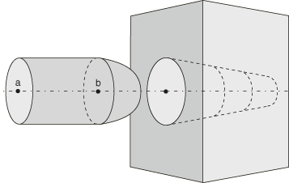

# 38.1.3 Abaqus/Standard中接触表面平滑化


**产品：** Abaqus/Standard  Abaqus/CAE  

##### **参考文献**

- ["在Abaqus/Standard中定义通用接触相互作用，" 第36.2.1节](pt09ch36s02aus139.md)
- ["在Abaqus/Standard中定义接触对，" 第36.3.1节](pt09ch36s03aus145.md)
- [*CONTACT](../key/key-link.md#usb-kws-hcontact)
- [*CONTACT PAIR](../key/key-link.md#usb-kws-hcontactpair)
- [*SURFACE PROPERTY ASSIGNMENT](../key/key-link.md#usb-kws-hsurfpropassign)
- [*SURFACE SMOOTHING](../key/key-link.md#usb-kws-msurfacesmoothing)

### 概述

使用有限元方法，曲面几何自然被近似为由连接元素面组成的面组。使用面元表面几何而不是真实表面几何可能会显著导致接触相互作用中的接触应力不准确，特别是当面元与真实表面之间的差异大小相对于接触部件的变形不小时。接触应力输出在许多Abaqus/Standard应用中至关重要；例如，接触压力分布可用于识别磨损模式和峰值压力值，以确定机器零件的相对寿命。此外，表面面元边界处表面法线方向的不连续性可能导致收敛困难。

Abaqus/Standard提供了克服与接触相互作用中面元表面相关的精度和收敛困难的技术。这些技术允许具有不连续表面法线的离散表面在分析期间更接近地近似具有连续法线的平滑表面的行为。节点-表面接触中使用的平滑技术与表面对表面和通用接触中使用的平滑技术不同：
- 节点-表面接触平滑默认应用，影响整个主表面。
- 表面对表面接触平滑默认不应用，但可应用于几何大致轴对称的任何表面区域。

表面对表面接触通常给出最准确的结果。

### 节点-表面接触对的表面平滑化

节点-表面接触对中的表面平滑化提高了数值稳定性，有时提高了解的准确性。沿主表面移动的从属节点往往会在尖锐拐角处"卡住"，导致收敛困难。由于这种行为，Abaqus/Standard自动平滑节点-表面接触对中的主表面。这种平滑技术重新计算面元边缘处的主表面法线，并根据表面类型可能影响表面几何。关于节点-表面接触公式的平滑化详细信息在["有限滑动、节点-表面公式的主表面平滑化" in "Abaqus/Standard中的接触公式，" 第38.1.1节](pt09ch38s01aus177.md#usb-cni-acontactpairform-smoothing)和["使用小滑动跟踪方法" in "Abaqus/Standard中的接触公式，" 第38.1.1节](pt09ch38s01aus177.md#usb-cni-acontactpairform-smsliding)中讨论。

### 表面对表面接触的接触表面平滑化

表面对表面接触中通常不需要平滑表面来确保分析收敛；因此，默认情况下不对这些表面应用平滑化。但是，可以使用可选的平滑技术来提高轴对称（或近似轴对称）表面在表面对表面接触相互作用中的接触应力和压力精度。

表面对表面接触平滑化可应用于特定表面区域。这些区域必须大致轴对称（表面上所有点关于单个轴近似对称）、大致球形（表面上所有点距单个点近似等距）或为圆环面的一部分。[图38.1.3-1](pt09ch38s01aus179.md#usb-cni-smooth-surfs)中的插针插入模型可以受益于表面对表面接触平滑化：插针的主体和孔是轴对称表面，插针的头部是球形表面。如果表面不是完全轴对称或球形的，表面对表面接触平滑化也是有效的；例如，如果插针主体略微椭圆形。

**图38.1.3-1** 具有表面平滑化的表面对表面接触模型。



#### 对表面对表面接触对应用接触平滑化

通过创建表面平滑化定义来启用表面对表面接触对的接触平滑化。接触对定义引用此平滑化定义以在接触公式中应用几何校正（不改变模型的物理几何）。

表面平滑化定义列出了接触对表面中必须平滑的所有面元区域，以及应应用于每个区域的几何校正方法。可以采用三种几何校正方法：
- 圆周平滑方法适用于近似二维圆的一部分或三维旋转曲面的一部分的表面。
- 球形平滑方法适用于近似三维球体一部分的表面。
- 圆环平滑方法适用于近似圆环面一部分的表面（即，围绕轴旋转的圆弧）。

每个表面对表面接触对引用单个平滑化定义；因此，平滑化定义必须列出接触对的所有平滑区域和适用于每个区域的几何校正方法。几何校正可以应用于主表面和从属表面；您也可以将校正应用于每个表面的选定区域。表面平滑化定义可以包括多个区域，每个区域使用不同的几何校正方法。对于每个区域，您必须指定适当的几何校正方法和近似旋转轴（对于圆周或圆环平滑）或近似球形中心（对于球形平滑）。对于圆环平滑，您还必须指定圆弧中心到旋转轴的距离，连接点(Xa, Ya, Za)和圆弧中心的连线应垂直于旋转轴。

| **输入文件用法：** | 使用以下两个选项来应用表面对表面接触平滑化： |
| --- | --- |
|  | ``` [*CONTACT PAIR](../key/key-link.md#usb-kws-hcontactpair), GEOMETRIC CORRECTION=*smoothing_name* [*SURFACE SMOOTHING](../key/key-link.md#usb-kws-msurfacesmoothing), NAME=*smoothing_name* *data lines to define smoothing regions (see below)* Use the following data line to apply circumferential smoothing to surface regions with an axis of symmetry passing through points (Xa, Ya, Za) and (Xb, Yb, Zb): *slave_region*, *master_region*, CIRCUMFERENTIAL, *Xa*, *Ya*, *Za*, *Xb*, *Yb*, *Zb* Use the following data line to apply spherical smoothing to surface regions with a spherical center at point (Xa, Ya, Za): *slave_region*, *master_region*, SPHERICAL, *Xa*, *Ya*, *Za* Use the following data line to apply toroidal smoothing to surface regions with an axis of symmetry passing through points (Xa, Ya, Za) and (Xb, Yb, Zb) with the center of the revolved circular arc at a distance *R* from the axis of symmetry: *slave_region*, *master_region*, TOROIDAL, *Xa*, *Ya*, *Za*, *Xb*, *Yb*, *Zb*, *R* Repeat the data lines as many times as necessary to define the appropriate geometry corrections for all surfaces in the contact pair. ``` |

| **Abaqus/CAE用法：** | Abaqus/CAE可以自动识别接触相互作用中将受益于接触平滑化的任何圆周、球形或圆环表面，并应用必要的几何校正方法。 |
| --- | --- |
|  | Interaction模块：接触相互作用编辑器： **Surface Smoothing**： **Automatically smooth 3D geometry surfaces when applicable** 表面对表面接触平滑化不能应用于孤立网格模型上的表面。 |

##### 示例

为了提高[图38.1.3-1](pt09ch38s01aus179.md#usb-cni-smooth-surfs)中模型的接触压力精度，可以对主表面和从属表面应用接触平滑化。插针（从属表面）需要两种不同的几何校正方法，因此定义了与从属表面区域对应的附加表面。为插针尖端定义了球形平滑。由于插针主体和孔共享旋转轴，因此对这两个表面应用了单个圆周平滑技术。即使插针和孔的横截面形状偏离完美圆形，此表面平滑化定义仍然适用。

```
[*CONTACT PAIR](../key/key-link.md#usb-kws-hcontactpair), TYPE=SURFACE TO SURFACE, INTERACTION=FRICTION1, 
   GEOMETRIC CORRECTION=SMOOTH1
PIN, HOLE
[*SURFACE INTERACTION](../key/key-link.md#usb-kws-hsurfaceinteraction), NAME=FRICTION1
[*SURFACE SMOOTHING](../key/key-link.md#usb-kws-msurfacesmoothing), NAME=SMOOTH1
PIN_TIP, , SPHERICAL, *X*b, *Y*b, *Z*b
PIN_BODY, HOLE, CIRCUMFERENTIAL, *X*a, *Y*a, *Z*a, *X*b, *Y*b, *Z*b
```

#### 对通用接触表面应用接触平滑化

可以使用表面属性分配为通用接触域中的表面指定接触平滑化。单个表面属性分配指定所有要平滑化的表面以及每个表面适当的几何校正方法。通用接触使用与接触对相同的几何校正方法：
- 圆周平滑方法适用于近似二维圆的一部分或三维旋转曲面的一部分的表面。
- 球形平滑方法适用于近似三维球体一部分的表面。
- 圆环平滑方法适用于近似圆环面一部分的表面（即，围绕轴旋转的圆弧）。

对于每个表面，您必须指定适当的几何校正方法和近似旋转轴（对于圆周或圆环平滑）或近似球形中心（对于球形平滑）。对于圆环平滑，您还必须指定圆弧中心到旋转轴的距离，连接点(Xa, Ya, Za)和圆弧中心的连线应垂直于旋转轴。

| **输入文件用法：** | ``` [*SURFACE PROPERTY ASSIGNMENT](../key/key-link.md#usb-kws-hsurfpropassign), PROPERTY=GEOMETRIC CORRECTION *data lines to define smoothing regions (see below)* Use the following data line to apply circumferential smoothing to a surface with an axis of symmetry passing through points (Xa, Ya, Za) and (Xb, Yb, Zb): *surface*, CIRCUMFERENTIAL, *Xa*, *Ya*, *Za*, *Xb*, *Yb*, *Zb* Use the following data line to apply spherical smoothing to a surface with a spherical center at point (Xa, Ya, Za): *surface*, SPHERICAL, *Xa*, *Ya*, *Za* Use the following data line to apply toroidal smoothing to a surface with an axis of symmetry passing through points (Xa, Ya, Za) and (Xb, Yb, Zb) with the center of the revolved circular arc at a distance *R* from the axis of symmetry: *surface*, TOROIDAL, *Xa*, *Ya*, *Za*, *Xb*, *Yb*, *Zb*, *R* Repeat the data lines as many times as necessary to define the appropriate geometry corrections for all surfaces in the contact domain. ``` |

| **Abaqus/CAE用法：** | 接触表面平滑化只能应用于Abaqus/CAE中的原生几何模型。默认情况下，Abaqus/CAE自动检测通用接触域中可平滑化的所有圆周、球形和圆环表面，并应用适当的平滑化。 |
| --- | --- |
|  | 使用以下选项防止模型的自动表面平滑化： Interaction模块： **Create Interaction**： **General contact (Standard)**： **Surface Properties**： **Surface smoothing assignments: Edit**： toggle off **Automatically assign smoothing for geometric faces** 使用以下选项手动对表面应用平滑化： Interaction模块： **Create Interaction**： **General contact (Standard)**： **Surface Properties**： **Surface smoothing assignments: Edit**： Select surface, click the arrows to transfer surface to list of smoothing assignments. 在 **Smoothing Option** 列中，选择 **REVOLUTION** 以应用圆周平滑，选择 **SPHERICAL** 以应用球形平滑，选择 **TOROIDAL** 以应用圆环平滑，或选择 **NONE** 以防止表面平滑化。 |

#### 使用表面对表面接触平滑化的注意事项

表面对表面接触平滑化技术假设表面节点的初始位置位于真实初始表面几何上，高阶元素的边中节点除外。即使高阶元素的边中节点不在真实初始几何上，此平滑化技术仍然有效（使用Abaqus/CAE网格化的模型始终将边中节点放置在真实初始几何上，但其他网格预处理程序可能不是这种情况）。

表面平滑化接触的效果在涉及小变形和接触区域一阶元素粗网格离散的分析中最为显著；但是，即使在网格相当细化或使用高阶元素时，接触应力解的显著改善也很常见。对于大变形的分析，这种平滑化技术通常对解的影响微乎其微。然而，在某些情况下，平滑化可能会在大幅变形后降低解的准确性；因此，不建议对大变形的分析使用表面对表面接触平滑化。表面对表面接触平滑化的有效性不会因接触表面之间的相对运动而降低；例如，平滑化技术对于涉及大滑动但小变形的情况效果很好。

### 接触表面平滑化的效果

接触表面平滑化的影响可以通过一个简单模型来证明，该模型涉及用不同大小的一阶元素建模的同心圆柱体之间的干涉配合，如图38.1.3-2所示。真实表面几何与面元表面几何之间的差异导致接触压力解中出现噪声。如果干涉距离和 resulting 变形距离相对于几何差异较小，则这种噪声可能对解的准确性产生重大影响。尽管表面对表面接触通常比节点-表面接触更好地处理这些差异，但最大偏差超过解析压力解的100%并不罕见。噪声的影响在较大变形中变得不那么明显，但永远不会完全消除。

**图38.1.3-2** 干涉配合模型的初始网格几何。


使用表面对表面接触对建模干涉配合并使用圆周接触平滑化始终产生低噪声压力结果，无论干涉距离如何，都在解析解的3%以内。效果在大变形分析中显著 noticeable，但即使对于较大的变形也能观察到改善。

对于节点-表面接触对，将平滑系数增加到最大值0.5会在二维模型中略微减少压力解中的噪声。在三维模型中增加平滑系数对精度影响很小，因为物理表面不会为三维节点-表面平滑化进行平滑；有关更多信息，请参见["有限滑动、节点-表面公式的主表面平滑化" in "Abaqus/Standard中的接触公式，" 第38.1.1节](pt09ch38s01aus177.md#usb-cni-acontactpairform-smoothing)。


