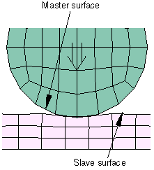
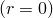
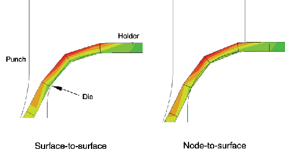
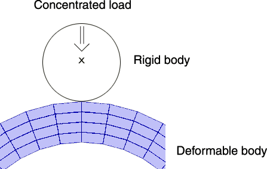
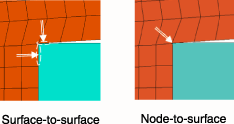

# 39.1.2 Abaqus/Standard中接触建模的常见困难


**产品：** Abaqus/Standard  Abaqus/CAE  

##### **参考文献**

- ["在Abaqus/Standard中定义通用接触相互作用，" 第36.2.1节](pt09ch36s02aus139.md)
- ["在Abaqus/Standard中定义接触对，" 第36.3.1节](pt09ch36s03aus145.md)
- [*CONTACT](../key/key-link.md#usb-kws-hcontact)
- [*CONTACT PAIR](../key/key-link.md#usb-kws-hcontactpair)
- [*CONTACT INITIALIZATION DATA](../key/key-link.md#usb-kws-hcontactinitdata)
- ["在Abaqus/CAE用户指南中定义通用接触，" 第15.13.1节](../usi/usi-link.md#usi-itn-help-general)
- ["在Abaqus/CAE用户指南中定义表面对表面接触，" 第15.13.7节](../usi/usi-link.md#usi-itn-help-surftosurf)
- ["在Abaqus/CAE用户指南中使用接触和约束检测，" 第15.16节](../usi/usi-link.md#usi-itn-detectioneditor)

### 概述

本节重点介绍使用Abaqus/Standard建模接触相互作用时最常遇到的困难。提出了规避这些问题的方法。

### 解决初始接触条件的困难

重要的是要了解Abaqus/Standard如何在步骤或分析开始时解释和解决接触条件。如有必要，您可以检查消息文件中的初始接触条件（参见["Abaqus/Standard消息文件" in "输出，" 第4.1.1节](pt02ch04s01aus38.md#usb-out-ooutput-message-std)）。无意的接触开口或过闭可能导致对表面几何的糟糕解释、模型中的无意运动以及分析不收敛。

#### 移除初始接触开口和过闭

当对两个面元表面之间的接触进行建模时，单个节点处可能出现小间隙或穿透的情况很常见。当两个表面具有不同的网格时，此问题尤其常见。Abaqus/Standard使用两种默认方法处理初始穿透：
- 在通用接触中，小初始过闭自动调整以移除穿透。
- 在接触对中，初始过闭被解释为干涉配合并相应解决（参见下面的["解决大干涉配合"](pt09ch39s01aus184.md#usb-cni-acontacttrouble-intfit)"）。

您可以通过让Abaqus/Standard调整从属表面位置来提高接触模拟的准确性，以确保所有应该最初与主表面接触的从属节点开始时接触而不进行任何穿透（参见["在Abaqus/Standard中控制初始接触状态，" 第36.2.4节](pt09ch36s02aus142.md)和["调整Abaqus/Standard接触对的初始表面位置和指定初始间隙，" 第36.3.5节](pt09ch36s03aus149.md)）。当预期的初始间隙或过闭相对于接触体中的典型尺寸较小且使用小滑动接触对时，您可以精确指定间隙或过闭（参见["为小滑动接触定义精确的初始间隙或过闭" in "调整Abaqus/Standard接触对的初始表面位置和指定初始间隙，" 第36.3.5节](pt09ch36s03aus149.md#usb-cni-aadjustsurfaces-clearance)）。

小滑动接触跟踪方法比有限滑动跟踪方法对接触界面初始局部间隙更敏感。在小滑动接触中，每个从属节点与其从有限元近似的 master surface 定义的接触平面相互作用，如["Abaqus/Standard中的接触公式，" 第38.1.1节](pt09ch38s01aus177.md)中所讨论。Abaqus/Standard仅当每个从属节点可以投影到主表面上时才能定义这些平面。让这些从属节点开始模拟时接触主表面 allows Abaqus/Standard为从属节点形成最准确的接触平面。

#### 大的意外初始过闭

接触初始化算法偶尔可能会推断出您不希望存在初始过闭的大初始过闭。例如，指定错误的表面法线可能导致接触初始化算法将物理间隙解释为穿透，如["类壳表面的方向考虑" in "在Abaqus/Standard中定义接触对，" 第36.3.1节](pt09ch36s03aus145.md#usb-cni-acontactpair-orient)中所讨论。表面或接触定义的微小变化通常会避免不必要的过闭，但这些情况通常需要一些诊断以确定如何避免问题。

##### 识别意外过闭的位置

解决大初始过闭的第一步是识别问题位置：
- 如果初始过闭被视为在第一个增量中解决的干涉配合（这是接触对的默认行为；参见["在Abaqus/Standard中建模接触干涉配合，" 第36.3.4节](pt09ch36s03aus148.md)），则初始输出帧的接触开口距离输出变量（COPEN）等值线图将显示哪些区域有初始过闭（穿透对应于COPEN的负值）。
- 如果初始过闭通过无应变调整解决，则初始输出帧的输出变量STRAINFREE等值线图将显示调整发生的位置（参见["Abaqus/Standard分析中的接触诊断，" 第39.1.1节](pt09ch39s01aus183.md)，获取有关此输出变量的进一步讨论）。但是，大的无应变调整可能导致网格变得高度扭曲，使诊断问题变得困难；在这种情况下，执行数据检查分析（参见["Abaqus/Standard、Abaqus/Explicit和Abaqus/CFD执行，" 第3.2.2节](pt01ch03s02abx02.md)），而是将初始过闭视为在第一个增量中解决的干涉配合以便于诊断（如上所述）。

一旦识别出意外初始过闭的位置，将Abaqus/CAE可视化模块中的显示限制在涉及初始过闭的相互作用的主表面和从属表面上，有助于识别意外初始过闭的原因（参见Abaqus/CAE用户指南第78.2节["管理显示组"](../usi/usi-link.md#usv-dgp-hlp)，获取有关显示组选项的讨论）。查看表面法线（参见Abaqus/CAE用户指南第55.7节["显示元素和表面法线"](../usi/usi-link.md#usv-custom-normals)）可能有助于确定意外过闭是否由于错误的表面法线。

##### 不连续表面上的过闭

[图39.1.2-1](pt09ch39s01aus184.md#acontact-unintended-penet-nls)显示了一个大意外初始过闭的示例。在这种情况下，具有不连续表面的单个接触对应在两个不同区域强制接触（[表36.3.1-1](pt09ch36s03aus145.md#table-connectivity-restrictions) ["类壳表面的方向考虑" in "在Abaqus/Standard中定义接触对，" 第36.3.1节](pt09ch36s03aus145.md#usb-cni-acontactpair-orient)显示了哪些接触公式允许不连续表面）。[图39.1.2-1](pt09ch39s01aus184.md#acontact-unintended-penet-nls)中的箭头显示每个表面区域的正法线方向。表面对表面接触公式沿从属表面法线方向（在正和负方向）搜索主表面上的潜在相互作用点。从点A发出的搜索识别点B作为点A在此示例中唯一的潜在相互作用点。接触对将其解释为有效穿透，因为没有找到更好的候选相互作用位置且点A和点B处的表面法线相对。避免此意外过闭的方法包括：
- 为两个不同的接触区域定义具有连续表面的单独接触对；
- 指定通用接触，它过滤掉几乎所有意外初始过闭。

**图39.1.2-1** 由于涉及不连续表面的建模错误导致的意外初始过闭示例。


##### 三维表面上的过闭

对于具有复杂表面的三维模型，意外初始过闭的原因可能不那么明显。克服此问题的最重要步骤是识别相应表面中涉及意外初始过闭的区域。对于没有无应变调整的表面对表面接触对，主表面的部分应该在从属表面后面明显可见（沿从属表面法线方向的相反方向），距离与报告的（负）COPEN值一致。对于节点-表面接触对，到主表面相互作用点的方向通常对应于从属和主表面之间的局部最小距离。

#### 解决大干涉配合

如前所述，Abaqus/Standard可以选择将初始过闭解释为干涉配合。您应该使用上述方法之一移除任何作为网格离散化错误或定义接触表面错误的无意结果导致的初始过闭。在某些情况下，干涉配合可能是预期的，但可能太大，无法使用Abaqus/Standard用于接触对的默认方法（在单个增量中解决过闭）稳健地解决。在这种情况下，您应该修改接触模型以允许在多个增量中解决过闭（有关更多信息，请参见["在Abaqus/Standard中建模接触干涉配合，" 第36.3.4节](pt09ch36s03aus148.md)）。如果选择让初始过闭被视为通用接触的干涉配合，它们会在多个增量中自动解决（参见["在Abaqus/Standard中控制初始接触状态，" 第36.2.4节](pt09ch36s02aus142.md)）。

#### 防止接触模拟中的刚体运动

在动态分析中，刚体运动通常不是问题。在静态问题中，当 body 受到充分约束时，会发生刚体运动。"数值奇异性"警告消息和非常大的位移表示静态分析中的无约束运动。因此，如果在静态问题中使用接触来约束刚体运动，请确保适当的表面配对最初处于接触状态（参见["在Abaqus/Standard中控制初始接触状态，" 第36.2.4节](pt09ch36s02aus142.md)和["调整Abaqus/Standard接触对的初始表面位置和指定初始间隙，" 第36.3.5节](pt09ch36s03aus149.md)）。如有必要，定义模型几何以为接触对提供小的初始过闭，或者使用边界条件在第一步中将结构移动到接触中。边界条件（在后续步骤中不必要）可以在 body 通过与其他组件的接触充分约束后移除。类似地，如果刚体仅用于平移，请约束其旋转自由度。

摩擦粘附可以约束刚体运动。但是，必须先 develop 接触压力才能产生摩擦。因此，当表面首次接触时，摩擦对约束刚体运动无效。您必须通过定义边界条件或用软弹簧或阻尼器接地 body 来临时消除刚体运动。

如果您无法通过建模技术防止刚体运动，Abaqus/Standard提供了一些工具来自动稳定接触模拟中的刚体。这些工具在["接触问题中刚体运动的自动稳定化" in "调整Abaqus/Standard中的接触控制，" 第36.3.6节](pt09ch36s03aus150.md#usb-cni-acontacttrouble-stabilize)中讨论。

### 定义不当的表面

在分析过程中，您可能会注意到接触表面之间的不良行为（过度穿透、意外开口、力应用不准确等）。这些行为通常会导致不收敛和分析终止。这些问题可能由与网格、元素选择和表面几何相关的一些原因引起。

#### 在主表面上定义重复节点

在为有限滑动应用定义三维表面时，避免使用相同坐标定义两个表面节点。这样的定义会在表面上产生裂缝或裂纹，如[图39.1.2-2](pt09ch39s01aus184.md#acontact-mesh-crack)所示。

**图39.1.2-2** 双重定义表面节点示例。


如果使用Abaqus/CAE中的默认绘图选项查看，此表面将看起来是有效的连续表面；但是，如果此表面用作有限滑动、节点-表面接触的主表面，沿表面滑动的从属节点可能会穿过此裂缝并"卡在"主表面后面。类似的问题可能发生在有限滑动、表面对表面接触上。通常，会产生收敛问题，可能导致Abaqus/Standard终止分析。

使用Abaqus/CAE可视化模块中的边缘显示选项来识别模型中表面上任何不需要的裂缝。裂缝将显示为表面内部的额外周长线条。重复节点可以通过在预处理程序中创建模型时等价节点来轻松避免。

#### 避免沿表面周长的接触问题

在为有限滑动接触建模时，确保主表面定义扩展得足够远，以考虑接触部件的所有预期运动。应该避免在主表面周长处进行接触， node-to-surface 接触公式 ..Abaqus/Standard假设配合从属表面节点可以从主表面自由边缘脱落，如果从属节点环绕并从后面接近其配合主表面，这可能导致问题。[图39.1.2-3](pt09ch39s01aus184.md#acontact-mast-surf-ext)说明适当和不适当的主表面定义。

**图39.1.2-3** 主表面扩展示例。


在一个迭代中从主表面脱落的从属节点可能在下一个迭代中发现自身与表面接触；这种现象称为跳动。如果跳动持续，Abaqus/Standard可能无法找到解决方案。使用表面对表面公式方法时，此问题不太可能发生，因为每个接触约束基于从属表面的区域而不是单个从属节点。请求详细接触打印到消息（`.msg`）文件以监视可能从主表面滑落的从属节点的历史（参见["Abaqus/Standard消息文件" in "输出，" 第4.1.1节](pt02ch04s01aus38.md#usb-out-ooutput-message-std)）。消息文件输出将显示从属节点处接触的循环打开和关闭，这将指示需要修改主表面的位置。

对于节点-表面接触，您可以扩展主表面 beyond the perimeter of the body it approximates 以避免跳动问题。某些接触元素（如滑动线和刚性表面接触元素）也可能发生跳动。也可以扩展滑动线接触元素。详见["扩展主表面和滑动线，" 第36.3.8节](pt09ch36s03aus152.md)。

##### 从小滑动主表面脱落

在小滑动接触问题中，从主表面边缘脱落不是问题，因为从属节点不在实际模型表面上滑动。相反，每个从属节点与一个平的、无限的接触平面相互作用。该平面与在未变形配置中最接近从属节点的主表面节点集关联。关于小滑动接触的详细信息，请参见["Abaqus/Standard中的接触公式，" 第38.1.1节](pt09ch38s01aus177.md)。

##### 从用界面元素建模的表面脱落

从用界面元素建模的表面边缘脱落不是问题，因为从属节点在一个平的、无限的接触平面上滑动。

#### 使用网格粗糙的表面

一些 problems caused by surfaces created on very coarse meshes. 其中一些问题取决于您对接触离散的 choice，如后面["接触公式之间的差异"](pt09ch39s01aus184.md#usb-cni-acontacttrouble-disc)中讨论的。

##### 粗糙网格从属表面的穿透

当粗糙网格化的表面用作节点-表面接触的从属表面时，主表面节点可以 gross 穿透从属表面而没有抵抗力（参见[图39.1.2-4](pt09ch39s01aus184.md#acontact-mast-surf-pen)）。这种情况在非匹配网格接触时很常见。细化从属表面往往可以缓解此问题。

**图39.1.2-4** 由于从属表面的粗网格导致主表面穿透从属表面（用于节点-表面接触）。


表面对表面接触通常会抵抗主节点穿透粗从属表面；但是，如果从属网格显著粗于主网格，则此公式可能增加显著的计算成本（参见["Abaqus/Standard中的接触公式，" 第38.1.1节](pt09ch38s01aus177.md)，获取进一步讨论）。

##### 在单个元素处发生的接触

如果表面上的网格太粗糙，接触相互作用可能完全发生在单个元素的边界内。这通常发生在两个接触表面具有不同的曲率时，如图39.1.2-5所示。

**图39.1.2-5** 主表面在单个元素面上接触从属表面。



这种相互作用的结果是不可靠的，通常不现实。如果[图39.1.2-5](pt09ch39s01aus184.md#usb-acontact-indent)中的模型使用节点-表面接触，主表面会毫无阻力地穿透从属表面，直到遇到从属节点，如上所述。如果主从 designation 相反，接触约束施加在单个从属节点上； this concentration 在接触压力的计算中产生不准确的高值。如果模型使用表面对表面接触，则不太可能发生过度穿透。然而，由于仅涉及少量约束点，用于强制表面对表面接触的平均算法表现不佳。产生不准确的接触应力和压力计算。

如果接触发生在单个元素上，则细化网格以将相互作用扩展到多个元素面。

##### 粗糙网格主表面和小滑动接触

小滑动模拟中粗糙网格化的弯曲主表面由于"主平面"的近似性质可能导致不可接受的解精度。使用更细化的网格定义主表面将改善小滑动问题的整体解精度。但是，除非使用完美匹配的网格，否则仍可能观察到局部振荡 in contact stress，即使在细化的模型中。

##### 具有二阶热传递元素的非匹配表面网格

如果二阶热传递元素用于建模热界面且表面之间的网格不匹配，则可能发生不准确的局部结果。当一个表面上的元素的边中节点最接近另一表面上元素的角节点时，会获得最差的结果。如果必须在模型中使用非匹配网格，请使用一阶元素或使用更细化的网格。

#### 具有二阶面和节点-表面公式的三维表面

二阶元素不仅提供更高的精度，而且还能更有效地捕获应力集中，比一阶元素更好地建模几何特征。基于二阶元素类型的表面与表面对表面接触公式配合良好，但 in some cases，与节点-表面公式配合不佳（参见["这些接触公式的讨论" in "Abaqus/Standard中的接触公式，" 第38.1.1节](pt09ch38s01aus177.md)）。

某些二阶元素类型不适合作为具有节点-表面接触公式和"硬"接触条件严格施加的从属表面，因为当压力作用在元素面上时，等效节点力的分布。如[图39.1.2-6](pt09ch39s01aus184.md#eq-nodal-loads-contacttrouble)所示，作用在没有面中节点的二阶元素面上的恒定压力在角节点处产生方向与压力相反的力。

**图39.1.2-6** "硬"接触模拟中二阶元素面上恒定压力产生的等效节点力。


Abaqus/Standard基于作用在单个从属节点上的接触力为节点-表面接触公式做出重要决定；二阶元素中节点力的模糊性可能导致Abaqus/Standard做出错误决定。为规避此问题，Abaqus/Standard自动转换 most three-dimensional second-order elements without a midface node (i.e., serendipity elements) that form a slave surface into elements with a midface node。对于三维18节点垫片元素，如果连接中未给出面中节点，也会自动生成面中节点。面中节点的存在导致对接触算法明确的节点力分布。

元素族C3D20(RH)、C3D15(H)、S8R5和M3D8分别转换为族C3D27(RH)、C3D15V(H)、S9R5和M3D9。由于Abaqus/Standard不转换二阶耦合温度-位移、耦合热-电-结构和耦合孔隙压力-位移元素，因此您应该指定罚或增强拉格朗日约束施加方法来近似硬压力-过盈行为（参见["Abaqus/Standard中的接触约束施加方法，" 第38.1.2节](pt09ch38s01aus178.md)）。当在任何用户定义节点处规定值时，Abaqus/Standard会在自动生成的面中节点处插值节点量（如温度和场变量）。如果从属表面用于绑定接触对，Abaqus/Standard不会转换二阶 serendipity 元素。

二阶四面体元素（C3D10和C3D10I）在其角节点处具有零接触力。二阶三角形从属面、节点-表面接触公式和"硬"接触条件严格施加的这种组合是不允许的，以避免与此组合一起使用时可能出现的收敛问题和接触压力预测不良的高可能性。要避免此组合，请使用以下至少一种替代方法：
- 使用表面对表面接触公式（通常建议）而不是节点-表面接触公式；
- 使用罚约束施加方法（通常建议）或增强拉格朗日约束施加方法，而不是"硬"接触条件的严格施加；或者
- 使用改进的10节点四面体元素（C3D10M）而不是二阶四面体元素。

### 接触模拟中的过度迭代

Abaqus/Standard提供了多种调整求解器迭代方案的方法，有时会以最小的精度影响实现更有效的分析。

#### 转换弱确定接触条件中的严重不连续迭代

默认情况下，Abaqus/Standard继续迭代，直到与接触状态变化相关的严重不连续足够小（或不发生严重不连续）且平衡（通量）容差满足。或者，您可以选择不同的方法，其中Abaqus/Standard继续迭代直到不发生严重不连续。这两种方法在["Abaqus/Standard中的严重不连续" in "定义分析，" 第6.1.2节](pt03ch06s01abo05.md#usb-anl-aover-sdiconvert)中有更详细的讨论。严重不连续迭代的默认处理减少了与接触状态之间跳动相关的过度迭代的可能性，这是弱确定接触条件区域的 example。这种弱确定接触条件区域的例子是接触薄板边缘的平冲头中心附近。

#### 在未收敛迭代中基于穿透距离控制增量大小

对于大多数接触类型，如果在迭代期间计算的任何接触对的穿透超过特定距离（），Abaqus/Standard放弃该增量并尝试使用较小的增量大小重新进行。对于有限滑动、表面对表面接触（包括通用接触）和几何线性分析中的小滑动接触，没有临界穿透距离。

的默认值是包围特征表面元素面的球体的半径。在计算默认值时，Abaqus/Standard仅使用接触对的从属表面。模型中每个接触对的值打印在数据（`.dat`）文件中。虽然的默认值应该对大多数接触模拟足够，但在某些情况下可能需要更改给定接触对的默认值。这些情况包括：
- 主表面高度弯曲的模型。的默认值有时可能导致[图39.1.2-7](pt09ch39s01aus184.md#hcrit)所示的情况。在迭代求解过程中，最初在点*a*的从属节点可能移动到点*b*，穿透主表面，过闭*h*小于。Abaqus/Standard可能尝试将从属节点移动到主表面上的点*c*。为避免这种情况，请为指定一个较小的值，以强制Abaqus/Standard放弃增量并尝试较小的增量大小。**图39.1.2-7** 高度弯曲主表面上临界穿透距离的影响。
- Abaqus/Standard无法计算合理的的模型，因为使用了基于节点的表面。如果模型中有其他具有表面的接触对，Abaqus/Standard使用所有从属表面元素面的平均尺寸。如果不存在其他接触对，Abaqus/Standard使用整个模型的特征元素尺寸。
- 从属表面中接触面尺寸变化很大的模型。
- 从属表面网格相对于典型表面尺寸非常细化 so that overclosures much larger than the default  can be resolved easily.
- 具有软化接触的接触对允许 significant penetration 的模型（参见["接触压力-过盈关系，" 第37.1.2节](pt09ch37s01aus166.md)）。

| **输入文件用法：** | ``` [*CONTACT PAIR](../key/key-link.md#usb-kws-hcontactpair), HCRIT= ``` |
| --- | --- |

| **Abaqus/CAE用法：** | 您无法在Abaqus/CAE中调整的默认值。 |
| --- | --- |

### 解释接触模拟结果的困难

尽管涉及接触的分析运行完成，但结果可能看起来不现实。这有时是由于建模错误，有时是由于某些接触公式的 specialized output format。除了降低接触输出外，以下因素也往往降低收敛行为，因此避免这些因素可以改善收敛行为。

#### 在"硬"接触模拟中使用二阶元素时振荡的接触压力

当组成接触相互作用的两个可变形表面使用非常不同的网格密度时，可能发生不均匀的接触压力分布。当"硬"接触建模且两个表面都用二阶元素（包括改进的二阶四面体元素）建模时，不均匀性可能尤其明显。在这种情况下，接触压力中可能发生振荡和"尖峰"。通过使用罚型接触约束施加，可以为用二阶元素建模的表面获得更平滑的接触压力（参见["Abaqus/Standard中的接触约束施加方法，" 第38.1.2节](pt09ch38s01aus178.md)）。

#### 在对称轴上使用二阶轴对称元素时的不准确接触应力

对于二阶轴对称元素，接触面积在位于对称轴上的节点处为零（）。为避免由零接触面积引起的数值奇异性问题，Abaqus/Standard计算接触面积时假设节点距离对称轴一小段距离。这可能导致在位于对称轴上的节点计算的局部接触应力不准确。

#### 自接触

表面与自身的接触（自接触）用于原始几何与接触发生时（变形）几何完全不同的情况。这样，您将很难预测表面的哪些部分会相互接触。在可能的情况下，声明表面的部分为主、部分为从 always computationally more economical。相同的不可预测性使得无法预先确定哪一侧将是主表面，哪一侧将是从表面。因此，Abaqus/Standard使用对称接触模型：表面的每个单个节点可以是 from node 并且可以同时相对于所有其他节点属于主 segment。

因为每个表面同时充当从属和主，所以对称接触分析的结果可能令人困惑且不一致。这些困难在["使用对称主-从接触对改善接触建模" in "在Abaqus/Standard中定义接触对，" 第36.3.1节](pt09ch36s03aus145.md#usb-cni-acontactpair-symm)中有更充分的讨论。

#### 过度约束模型

过度约束术语指的是多个运动学约束超过它们所作用的自由度的数量的情况。过度约束通常导致解不准确或无法获得收敛解。使用直接约束施加方法（使用拉格朗日乘子）严格施加的接触条件有时会涉及过度约束。参见["过度约束检查，" 第35.6.1节](pt08ch35s06aus138.md)，获取过度约束及其处理方式的详细讨论和示例，基于以下分类：
- 在模型预处理器中检测到的过度约束
- 在分析期间检测并解决的过度约束
- 在方程求解器中检测到的过度约束

Abaqus/Standard将自动解析许多类型的过度约束；但是，许多涉及接触的过度约束无法解析，并将暴露给方程求解器。方程求解器通常会因此发出"零主元"或"数值奇异性"警告消息；当发生这种情况时，Abaqus/Standard将提供包含信息的警告消息，有助于确定导致过度约束的原因，以便您可以解决它。偶尔，过度约束不会产生警告消息；这并不一定意味着过度约束没有对分析产生不利影响。

##### 涉及软化接触的过度约束

具有软化行为或使用罚或增强拉格朗日方法施加的接触条件不会与其他约束结合导致"严格过度约束"；但是，"软化过度约束"可以：
- 如果与接触相关的刚度贡献比典型元素的刚度贡献高出几个数量级，则在方程求解器中导致零主元或病态；
- 防止使用增强拉格朗日方法实现紧密穿透容差；和
- 导致接触应力解振荡，特别是如果接触刚度高的话。

由于冗余或"竞争"接触条件的普遍性，某些类型的接触默认使用罚或增强拉格朗日方法来近似硬压力-过盈行为。可用约束施加方法和默认行为的讨论请参见["Abaqus/Standard中的接触约束施加方法，" 第38.1.2节](pt09ch38s01aus178.md)。

##### 由于过度约束导致的不准确接触力

如果接触对中的节点被过度约束但方程求解器确实找到解，则接触力变得不确定，可能变得过高，特别是在绑定接触对中。检查消息文件中报告的时间平均力（或力矩，或通量），或使用Abaqus/CAE交互式查看诊断信息（更多信息请参见Abaqus/CAE用户指南第41章["查看诊断输出"](../usi/usi-link.md#usv-output)）。如果它比残差力（或力矩，或通量）大几个数量级，则可能发生了过度约束，不能保证Abaqus/Standard找到了正确的解。模型过度约束的另一个迹象是分析在每个增量中开始收敛 in a single iteration when the nonlinearities should require at least several iterations。过度约束只能通过更改涉及的接触定义或其他约束类型来避免。

##### 由于在单个节点处的多个表面相互作用定义导致的过度约束

接触过约束的自动解析有时取决于两个接触对是否引用相同的表面相互作用定义。例如，考虑两个接触对具有公共主表面并共享一些从属节点（可能在两个从属表面的公共边缘上）的情况。如果两个接触对引用不同的表面相互作用定义（即使表面相互作用等效），则在公共从属节点处会发生过度约束；但是，如果两个接触对引用相同的表面相互作用定义，Abaqus/Standard自动避免这些过度约束。（参见["在Abaqus/Standard中为接触对分配接触属性，" 第36.3.3节](pt09ch36s03aus147.md)，获取有关如何为接触对分配表面相互作用定义的讨论。）

### 接触公式之间的差异

Abaqus/Standard中可用的不同接触公式（参见["Abaqus/Standard中的接触公式，" 第38.1.1节](pt09ch38s01aus177.md)）在建模接触模拟时 allow for great flexibility。但是，两个仅在使用接触公式方面不同的几乎相同的模拟有时会产生不同的结果。这主要是因为接触公式解释接触条件的方式不同。某些公式更适合特定情况。

#### 穿透差异

节点-表面和表面对表面离散之间最显著的差异是表面之间发生的穿透量。这是因为节点-表面离散仅在从属节点处计算穿透，而表面对表面离散在有限区域上计算平均穿透。例如，当从属表面沿主表面的凸起部分滑动时，与节点-表面离散相比，从属表面 tend to ride a bit higher with surface-to-surface discretization（[图39.1.2-8](pt09ch39s01aus184.md#usb-cni-comparepenet1)）。两种离散都随着网格细化收敛到相同的行为。

**图39.1.2-8** 主表面凸起曲率示例中接触离散的比较（成形应用）。



计算穿透的差异有时可能 fundamentally affect the results of an analysis。在将模型从一种接触公式转换为另一种时要意识到这种可能性。预先存在的模型的各个方面，如摩擦系数或压力-过盈关系，可能已被无意中"调整"为特定接触公式的行为。

**图39.1.2-9** 从属表面围绕主表面角落包裹的相对灵活表面示例中接触离散的比较。


#### 单点接触

[图39.1.2-10](pt09ch39s01aus184.md#usb-cni-pointcontact)显示了一个圆形刚体被推入可变形体的示例。

**图39.1.2-10** 两个 body 最初在单点接触的示例。



在所示初始配置中，两个 body 在对应于从属节点位置的单点接触。以下场景可能分别针对此模型的节点-表面和表面对表面离散分析：
- 对于节点-表面离散，第一次迭代使用一个活动接触约束执行。以合理的迭代和增量次数获得收敛解。
- 对于表面对表面离散，穿透在表面区域的平均意义上计算，因此即使表面在其中一个从属节点处接触，对于所有潜在接触约束都计算正间隙距离。然而，有限滑动、表面对表面接触公式检测到表面最初接触， and by default automatically activates localized contact damping in the neighborhood where the gap distance is zero。如果没有这种阻尼，Abaqus/Standard可能由于无约束刚体模式而无法获得收敛解。这种接触阻尼通常对收敛解的影响微乎其微， and the damping is completely removed by the end of the step.

如果您停用有限滑动、表面对表面公式的自动局部阻尼——或者如果您使用的是小滑动、表面对表面公式——您应该使用上面["解决初始接触条件的困难"](pt09ch39s01aus184.md#usb-cni-acontacttrouble-initial)"中讨论的技术之一来移除表面之间感知到的初始间隙并防止分析中的刚体模式。

| **输入文件用法：** | 使用以下选项停用接触对定义的 artificial surface gaps 处的自动局部接触阻尼： |
| --- | --- |
|  | ``` [*CONTACT PAIR](../key/key-link.md#usb-kws-hcontactpair), MINIMUM DISTANCE=NO ``` 使用以下选项停用通用接触定义的 artificial surface gaps 处的自动局部接触阻尼： ``` [*CONTACT INITIALIZATION DATA](../key/key-link.md#usb-kws-hcontactinitdata), MINIMUM DISTANCE=NO ``` |

| **Abaqus/CAE用法：** | 您无法在Abaqus/CAE中停用 artificial surface gaps 处的自动局部接触阻尼。 |
| --- | --- |

#### 接触法线方向的差异

节点-表面离散使用基于主表面法线的接触法线方向，而表面对表面离散使用基于从属表面法线（在从属节点附近区域平均）的接触法线方向。对于大多数主动接触定义，从属和主表面几乎平行，因此主从法线近似对齐；在这种情况下，接触法线的确定方式差异不显著。然而，在某些情况下，接触法线差异可能显著。
- 在建模大干涉配合时，表面对表面离散有时会导致从属表面在解决过闭时的切向运动。这种切向运动可能对分析产生不良影响。详见["在Abaqus/Standard中控制初始接触状态，" 第36.2.4节](pt09ch36s02aus142.md)和["在Abaqus/Standard中建模接触干涉配合，" 第36.3.4节](pt09ch36s03aus148.md)。
- 涉及表面几何边缘的接触约束有时会根据使用的接触离散方法使用显著不同的接触法线，因为从属和主表面的法线可能 not directly oppose each other。
- 接触开口距离输出变量（COPEN）可以根据使用的接触公式类型大幅变化 if the contact surfaces are not parallel。对于节点-表面离散，报告的开口距离近似到主表面的最近距离；对于表面对表面离散，报告的开口距离对应于从从属表面到主表面沿从属法线方向的距离。如果从属表面发出的沿从属法线方向的线与主表面不相交，则表面对表面离散的开口距离未定义（如["使用小滑动跟踪方法" in "Abaqus/Standard中的接触公式，" 第38.1.1节](pt09ch38s01aus177.md#usb-cni-acontactpairform-smsliding)中所讨论，如果在这种情况下无法为小滑动、表面对表面公式形成小滑动约束，Abaqus/Standard自动为单个约束 rever to the node-to-surface approach)。

#### 角落处的接触

有限滑动、表面对表面公式通常比其他接触公式更适合建模角落附近的接触。在[图39.1.2-11](pt09ch39s01aus184.md#usb-cni-cornercontactcompare)所示的示例中，从属表面在"外部" body 上（即具有凹角的 body）。对于节点-表面离散，单个约束 act at the corner slave node in the "average" normal direction of the master surface，这通常导致接触的糟糕解析、非物理响应，甚至分析 early termination。然而，表面对表面离散生成两个约束 near the corner for the respective faces，如图所示，导致更稳定的接触行为。

**图39.1.2-11** 具有相应内部和外部角落的邻接表面的接触公式比较示例。




