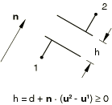
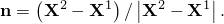
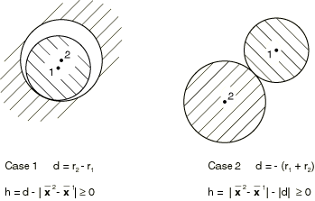
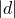
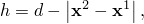

# 40.2.1 间隙接触单元


**产品：** Abaqus/Standard  

##### **参考文献**

- ["间隙单元库，" 第40.2.2节](pt09ch40s02ael49.md)
- [*GAP](../key/key-link.md#usb-kws-mgap)

### 概述

间隙单元：
- 允许两个节点之间的接触；
- 允许节点根据特定方向和分离条件接触（间隙闭合）或分离（间隙打开）；
- 始终在三维中定义，但也可用于二维和轴对称模型；
- 允许在任何类型的单元上定义接触，包括子结构和用户定义的单元；
- 可用于建模固定或旋转方向中的接触；
- 可用于在耦合温度-位移模拟中固定方向建模节点对节点接触和热相互作用；和
- 可用于热传递分析中的节点对节点热相互作用。

Abaqus/Standard中接触建模的详细讨论见[第36章，"定义接触相互作用"](pt09ch36.md)。

### 选择和定义间隙单元

GAPUNI单元在接触方向固定在空间中时建模两个节点之间的接触。GAPCYL单元在接触方向垂直于轴时建模两个节点之间的接触。GAPSPHER单元在接触方向在空间中任意时建模两个节点之间的接触。GAPUNIT单元在接触方向固定在空间中时建模两个节点之间的接触和热相互作用。DGAP单元在热传递分析中建模两个节点之间的热相互作用。

间隙单元通过指定形成间隙的两个节点并提供定义初始状态和必要时间隙方向的几何数据来定义。

### 定义间隙单元的属性

您必须将间隙行为与一组间隙单元关联。

| **输入文件用法：** | ``` [*GAP](../key/key-link.md#usb-kws-mgap), ELSET=*element_set_name* ``` |
| --- | --- |

#### GAPUNI和GAPUNIT单元

用GAPUNI和GAPUNIT单元建模的界面的接触行为由间隙的初始分离距离（间隙）*d*和接触方向定义。此外，GAPUNIT单元具有允许在耦合温度-位移分析中建模热相互作用的温度自由度。

##### GAPUNI节点之间的间隙

Abaqus/Standard将间隙两个节点之间的当前间隙定义为


其中和是形成GAPUNI单元的第一和第二个节点的 total 位移。[图40.2.1-1](pt09ch40s02alm64.md#egap-gapuni)显示了GAPUNI单元的配置。当*h*变为负时，间隙接触单元闭合，施加约束。

**图40.2.1-1** GAPUNI和GAPUNIT接触单元。



您指定*d*的值。如果提供正值，间隙最初打开。如果*d*=0，间隙最初闭合。如果*d*为负，则认为间隙在分析开始时过闭，并定义初始干涉配合问题。以下讨论了用间隙单元建模干涉配合问题的详细信息。

| **输入文件用法：** | ``` [*GAP](../key/key-link.md#usb-kws-mgap) *d* ``` |
| --- | --- |

##### 指定接触方向

您可以指定接触方向。否则，Abaqus/Standard将使用形成单元的两个节点的初始位置计算间隙方向：



如果（如果两个间隙单元节点具有相同的初始坐标），则发出错误消息。在这种情况下您必须定义。法线通常从单元的第一个节点指向第二个节点，除非间隙在分析开始时过闭。在这种情况下指定以使用正确的接触方向用于间隙单元。

如果您指定间隙方向而不是让Abaqus/Standard计算它，则接触计算仅考虑、间隙单元节点的位移和单元定义中节点的顺序：节点的初始坐标在计算中不起作用。

的方向在分析过程中不会改变。

| **输入文件用法：** | ``` [*GAP](../key/key-link.md#usb-kws-mgap) , *X**-direction cosine*, *Y**-direction cosine*, *Z**-direction cosine* ``` |
| --- | --- |

##### GAPUNI单元输出的局部基础系统

Abaqus/Standard报告作为GAPUNI单元的单元输出在间隙上传递的压力和垂直于接触方向的剪切应力。您必须提供与这些单元 associated 的接触面积，以便Abaqus/Standard计算压力和剪切应力值。它还报告间隙中的当前间隙*h*以及垂直于接触方向的GAPUNI节点的相对运动。相对运动和剪切应力在局部表面方向中报告，这些方向使用Abaqus关于在空间中定义表面方向的标准约定形成（参见["约定，" 第1.2.2节](pt01ch01s02aus02.md)）。接触方向定义了一个空间表面，局部轴形成于其上。

| **输入文件用法：** | ``` [*GAP](../key/key-link.md#usb-kws-mgap) , , , , *cross-sectional area* ``` |
| --- | --- |

#### GAPCYL单元

GAPCYL单元可用于建模两种非常不同的接触情况：两个刚性管之间的接触，其中较小的管在较大的管内部，以及沿其外部表面的两个刚性管之间的接触。两种情况如图40.2.1-2所示。

**图40.2.1-2** GAPCYL/GAPSPHER接触单元的间隙间隙。



GAPCYL单元的行为由节点之间的初始分离距离*d*、单元节点的当前位置和GAPCYL单元的轴定义。GAPCYL单元的轴定义了接触方向所在的平面。您指定*d*和GAPCYL轴的方向余弦。

不允许值：因为它会强制节点之间的距离始终保持为零，这与接触问题不对应。

| **输入文件用法：** | ``` [*GAP](../key/key-link.md#usb-kws-mgap) *d*, *X**-direction cosine*, *Y**-direction cosine*, *Z**-direction cosine* ``` |
| --- | --- |

##### 当*d*为正时定义间隙间隙（情况1）

如果*d*为正，GAPCYL单元建模两个不同直径的刚性管之间的接触，其中较小的管位于较大的管内部（参见情况1 in [图40.2.1-2](pt09ch40s02alm64.md#egap-gapcyl-gapspher)）。在这种情况下*d*是最大允许分离。每个管由其轴上的节点表示，axes connected by the GAPCYL element；*d*对应于管的半径差。当两个节点在任何方向上分离超过*d*时（在GAPCYL单元轴定义的平面中），间隙闭合。

Abaqus/Standard将GAPCYL单元的情况1的当前间隙开口定义为


其中是节点*N*的当前位置，*d*是指定的初始分离，*a*是GAPCYL单元的轴。

如果管轴的初始位置使得它们之间的距离小于*d*，则GAPCYL单元最初打开。如果距离等于*d*，则单元最初闭合；如果距离大于*d*，则定义初始过闭（干涉）。以下讨论了用间隙单元建模干涉配合问题的详细信息。

##### 当*d*为负时定义间隙间隙（情况2）

如果*d*为负，GAPCYL单元建模两个平行圆柱体之间的外部接触（参见情况2 in [图40.2.1-2](pt09ch40s02alm64.md#egap-gapcyl-gapspher)）。在这种情况下是节点之间最小允许分离。每个圆柱体由其轴上的节点表示，通过GAPCYL单元连接，对应于两个圆柱体的半径之和。当两个节点在GAPCYL单元轴定义的平面中以任何方向相互接近到within时，间隙闭合。

Abaqus/Standard将GAPCYL单元的情况2的当前间隙开口定义为


如果管轴的初始位置使得它们之间的距离大于，则GAPCYL单元最初打开。如果距离等于，则单元最初闭合；如果距离小于，则定义初始过闭（干涉）。以下讨论了用间隙单元建模干涉配合问题的详细信息。

##### GAPCYL单元输出的局部基础系统

Abaqus/Standard报告作为GAPCYL单元的单元输出在间隙上传递的压力和垂直于接触方向的剪切应力。您必须提供与这些单元 associated 的接触面积，以便Abaqus/Standard计算压力和剪切应力值。它还报告间隙中的当前间隙*h*以及单元节点垂直于接触方向的相对运动。相对运动和剪切应力在局部表面方向中报告，这些方向使用Abaqus关于在空间中定义表面方向的标准约定形成（参见["约定，" 第1.2.2节](pt01ch01s02aus02.md)）。接触方向定义了一个空间表面，局部轴形成于其上，滑移根据表面方向中的相对运动计算。

Abaqus/Standard根据形成单元的节点的运动更新GAPCYL单元的接触方向。但是，的方向在分析过程中不会更新。

| **输入文件用法：** | ``` [*GAP](../key/key-link.md#usb-kws-mgap) , , , , *cross-sectional area* ``` |
| --- | --- |

#### GAPSPHER单元

GAPSPHER单元可用于建模两种非常不同的接触情况：两个刚性球体之间的接触，其中较小的球体在较大的空心球体内部，以及两个球体沿其外部表面之间的接触。两种情况如图40.2.1-2所示。

GAPSPHER单元的行为由节点之间的最小或最大分离距离*d*和单元节点的当前位置定义。您指定最小或最大分离距离*d*。接触方向由节点的当前位置定义。

不允许值：因为它会强制节点之间的距离始终保持为零，这与接触问题不对应。

| **输入文件用法：** | ``` [*GAP](../key/key-link.md#usb-kws-mgap) *d* ``` |
| --- | --- |

##### 当*d*为正时定义间隙间隙（情况1）

如果*d*为正，GAPSPHER单元建模一个刚性球体在另一个（更大的）空心刚性球体内部的接触（参见情况1 in [图40.2.1-2](pt09ch40s02alm64.md#egap-gapcyl-gapspher)）。在这种情况下*d*是形成间隙的节点的最大允许分离。每个球体由其中心的一个节点表示，centers connected by the GAPSPHER element；*d*对应于球体的半径差。当两个节点分离超过*d*时，间隙闭合。

Abaqus/Standard将情况1的当前间隙开口定义为



其中是节点*N*的当前位置，*d*是指定的分离。

如果管轴的初始位置使得它们之间的距离小于*d*，则GAPSPHER单元最初打开。如果距离等于*d*，则单元最初闭合；如果距离大于*d*，则定义初始过闭（干涉）。以下讨论了用间隙单元建模干涉配合问题的详细信息。

##### 当*d*为负时定义间隙间隙（情况2）

如果*d*为负，GAPSPHER单元建模两个刚性球体之间的外部接触（参见情况2 in [图40.2.1-2](pt09ch40s02alm64.md#egap-gapcyl-gapspher)）。在这种情况下是形成间隙的节点的最小允许分离。每个球体由其中心的一个节点表示 connected by the GAPSPHER element；对应于两个球体的半径之和。当两个节点相互接近到within时，间隙闭合。

Abaqus/Standard将情况2的当前间隙开口定义为


如果管轴的初始位置使得它们之间的距离大于，则GAPSPHER单元最初打开。如果距离等于，则单元最初闭合；如果距离小于，则定义初始过闭（干涉）。以下讨论了用间隙单元建模干涉配合问题的详细信息。

##### GAPSPHER单元输出的局部基础系统

Abaqus/Standard报告作为GAPSPHER单元的单元输出在间隙上传递的压力和垂直于接触方向的剪切应力。您必须提供与这些单元 associated 的接触面积，以便Abaqus/Standard计算压力和剪切应力值。它还报告间隙中的当前间隙*h*以及单元节点垂直于接触方向的相对运动。相对运动和剪切应力在局部表面方向中报告，这些方向使用Abaqus关于在空间中定义表面方向的标准约定形成；见["约定，" 第1.2.2节](pt01ch01s02aus02.md)。接触方向定义了一个空间表面，局部轴形成于其上，滑移根据表面方向中的相对运动计算。

Abaqus/Standard根据形成单元的节点的运动更新GAPSPHER单元的接触方向。

| **输入文件用法：** | ``` [*GAP](../key/key-link.md#usb-kws-mgap) , , , , *cross-sectional area* ``` |
| --- | --- |

#### DGAP单元

DGAP单元用于在热传递分析中建模两个节点之间的热相互作用。建模的相互作用的行为由间隙的初始分离距离（间隙）*d*定义。

##### DGAP节点之间的间隙

Abaqus/Standard将间隙两个节点之间的间隙定义为


由于热传递分析中没有位移，间隙保持不变。间隙仅用于间隙相关热相互作用。

您指定*d*的值。如果提供正值，间隙最初打开。如果*d*=0，间隙最初闭合。如果*d*为负，则认为间隙过闭，但不执行干涉配合。接触方向不需要指定：在分析中忽略指定的任何接触方向。您必须提供与这些单元 associated 的接触面积，以便Abaqus/Standard计算热通量值每单位面积。

| **输入文件用法：** | ``` [*GAP](../key/key-link.md#usb-kws-mgap) *d*, , , , *cross-sectional area* ``` |
| --- | --- |

### 定义间隙单元的非默认机械相互作用

用间隙单元建模的问题的默认机械相互作用模型是"硬"、无摩擦接触。您可以分配可选的机械相互作用模型。以下机械相互作用模型可用：
- 摩擦。详见["摩擦行为，" 第37.1.5节](pt09ch37s01aus169.md)。
- 改进的"硬"接触、软化接触和粘性阻尼。详见["接触压力-过盈关系，" 第37.1.2节](pt09ch37s01aus166.md)和["接触阻尼，" 第37.1.3节](pt09ch37s01aus167.md)。

### 为GAPUNIT和DGAP单元定义热表面相互作用

您可以为这些单元分配热相互作用模型。以下热相互作用模型可用：
- 间隙传导。
- 间隙辐射。
- 间隙热产生。

这些热相互作用模型在["热接触属性，" 第37.2.1节](pt09ch37s02aus174.md)中讨论。

### 用间隙单元建模大初始干涉

指定大的负初始过闭（干涉）可能导致收敛困难，因为Abaqus/Standard尝试在单个增量中解决过闭。您可以规定允许的干涉，以允许Abaqus/Standard逐渐解决过闭。有关建模干涉配合问题的更多详细信息，请参见["在Abaqus/Standard中建模接触干涉配合，" 第36.3.4节](pt09ch36s03aus148.md)。

| **输入文件用法：** | ``` [*CONTACT INTERFERENCE](../key/key-link.md#usb-kws-hcontactinterfer), TYPE=ELEMENT ``` |
| --- | --- |


