# 37.1.5 摩擦行为


**产品：** Abaqus/Standard  Abaqus/Explicit  Abaqus/CAE

**参考资料**

- ["机械接触属性概述，" 第37.1.1节](pt09ch37s01aus165.md)
- ["FRIC，" Abaqus用户子程序参考指南第1.1.8节](../sub/sub-link.md#sub-rtn-ufric)
- ["FRIC_COEF，" Abaqus用户子程序参考指南第1.1.9节](../sub/sub-link.md#sub-rtn-ufriccoef)
- ["VFRIC，" Abaqus用户子程序参考指南第1.2.5节](../sub/sub-link.md#sub-rtn-uexpfric)
- ["VFRIC_COEF，" Abaqus用户子程序参考指南第1.2.6节](../sub/sub-link.md#sub-rtn-uexpfriccoef)
- ["VFRICTION，" Abaqus用户子程序参考指南第1.2.7节](../sub/sub-link.md#sub-rtn-uexpfriction)
- [*FRICTION](../key/key-link.md#usb-kws-hfriction)
- [*CHANGE FRICTION](../key/key-link.md#usb-kws-hchangefriction)
- ["创建相互作用属性，" Abaqus/CAE用户指南第15.12.2节](../usi/usi-link.md#usi-itn-helptopic-createprop)

### 概述

当表面处于接触状态时，它们通常会在其界面上传递剪切以及法向力。这两个力分量之间通常存在一种关系。这种关系被称为接触体之间的摩擦，通常用界面上应力的术语来表示。Abaqus中可用的摩擦模型：
- 包括经典的各向同性库仑摩擦模型（参见["库仑摩擦，" Abaqus理论指南第5.2.3节](../stm/stm-link.md#stm-ifc-coulombfric)），在Abaqus中：
  - 在其一般形式中，允许摩擦系数定义为滑移率、接触压力、接触点处的平均表面温度和场变量的函数；以及
  - 提供定义静摩擦系数和动摩擦系数的选项，由指数曲线定义平滑过渡区；
- 允许引入剪切应力极限，，这是在表面开始滑动之前界面可以承受的最大剪切应力值；
- 在Abaqus/Standard中包含基本库仑摩擦模型的各向异性扩展；
- 包含一个在表面接触时消除摩擦滑动的模型；
- 在Abaqus/Explicit中包含一个用于粘着摩擦的"软化"界面模型，其中剪切应力是弹性滑移的函数；
- 可以通过刚度（罚函数）方法、运动学方法（在Abaqus/Explicit中）或拉格朗日乘子方法（在Abaqus/Standard中）实现，取决于所使用的接触算法；以及
- 可以在用户子程序[`FRIC`](../sub/sub-link.md#sub-xsl-fric)或[`FRIC_COEF`](../sub/sub-link.md#sub-xsl-fric_coef)（在Abaqus/Standard中）或[`VFRIC`](../sub/sub-link.md#sub-xsl-vfric)、[`VFRICTION`](../sub/sub-link.md#sub-xsl-vfriction)或[`VFRIC_COEF`](../sub/sub-link.md#sub-xsl-vfric_coef)（在Abaqus/Explicit）中定义。

在Abaqus/Standard中，切向阻尼力可以与相对切向速度成正比引入，而在Abaqus/Explicit中，切向阻尼力可以与接触表面之间相对弹性滑移率成正比引入（更多信息请参见["接触阻尼，" 第37.1.3节"](pt09ch37s01aus167.md)）。

### 在接触属性定义中包含摩擦属性

默认情况下，Abaqus假设接触体之间的相互作用是无摩擦的。您可以在表面接触和单元接触的接触属性定义中包含摩擦模型。

| **输入文件用法：** | 对表面接触使用以下两个选项： |
| --- | --- |
| | ``` [*SURFACE INTERACTION](../key/key-link.md#usb-kws-hsurfaceinteraction), NAME=*interaction_property_name* [*FRICTION](../key/key-link.md#usb-kws-hfriction) ``` 对Abaqus/Standard中的单元接触使用以下两个选项： ``` [*INTERFACE](../key/key-link.md#usb-kws-minterface)或[*GAP](../key/key-link.md#usb-kws-mgap), ELSET=*name* [*FRICTION](../key/key-link.md#usb-kws-hfriction) ``` |

| **Abaqus/CAE用法：** | 相互作用模块：接触属性编辑器：**Mechanical****Tangential Behavior** |
| --- | --- |
| | Abaqus/CAE不支持单元接触。 |

### 在分析过程中更改摩擦属性

Abaqus/Standard和Abaqus/Explicit之间在分析过程中更改摩擦属性的方法不同。

#### 在Abaqus/Standard分析过程中更改摩擦属性

在Abaqus/Standard模拟的任何特定步骤中，可以从接触属性定义中移除、修改或添加不涉及用户子程序的摩擦模型。在某些模型中（如过盈配合接触干扰问题），摩擦不应在完成第一步之后才添加。在其他模型中，摩擦可能被移除或降低以表示在物体之间引入润滑剂。

您必须识别正在更改的接触属性定义或接触单元集。

| **输入文件用法：** | 对表面接触使用以下两个选项： |
| --- | --- |
| | ``` [*CHANGE FRICTION](../key/key-link.md#usb-kws-hchangefriction), INTERACTION=*name* [*FRICTION](../key/key-link.md#usb-kws-hfriction) ``` 对单元接触使用以下两个选项： ``` [*CHANGE FRICTION](../key/key-link.md#usb-kws-hchangefriction), ELSET=*name* [*FRICTION](../key/key-link.md#usb-kws-hfriction) ``` |

| **Abaqus/CAE用法：** | 使用新的摩擦定义定义接触属性。然后在特定步骤中更改分配给相互作用的接触属性。 |
| --- | --- |
| | 相互作用模块：接触属性编辑器：**Mechanical****Tangential Behavior** 相互作用编辑器：**Contact interaction property:** *new_interaction_property_name* Abaqus/CAE不支持单元接触。 |

##### 指定摩擦属性变化的时间变化

您可以指定一个幅值曲线（参见["幅值曲线，" 第34.1.2节"](pt07ch34s01aus115.md)）来定义摩擦系数和适用弹性滑移（如果适用）（参见["在Abaqus/Standard中施加摩擦约束的刚度方法"](pt09ch37s01aus169.md#usb-cni-afriction-stiffness-std)，下文）在整个步骤中的时间变化。如果您不指定幅值曲线，这些摩擦属性的变化将在步骤开始时立即应用，或根据分配给步骤的默认幅值变化在线性斜坡上逐渐应用（参见["定义分析，" 第6.1.2节"](pt03ch06s01abo05.md)），有一些例外情况如下。对于许多步骤类型，默认过渡类型是从旧值到新值的线性斜坡，这有助于避免摩擦属性突然变化时可能出现的收敛问题。

用于控制摩擦属性变化的幅值曲线受以下限制：
- 必须使用表格或平滑步骤幅值定义，
- 仅接受在0.0和1.0之间单调递增的幅值，并且
- 幅值必须用步骤时间定义并使用相对大小。

在给定时间生效的摩擦系数或允许弹性滑移的值通常等于步骤开始时属性的值加上当前幅值乘以步骤中属性预期变化的值。摩擦属性的变化必须考虑以下因素：
- 摩擦约束施加方法类型的变化（罚函数或拉格朗日乘子方法）、"粗糙"摩擦模型与有限摩擦系数之间的变化，以及摩擦属性（摩擦系数或允许弹性滑移除外）的变化始终在步骤开始时发生。
- 如果摩擦系数依赖于滑移率、接触压力、接触点处的平均表面温度或场变量，则用于计算步骤结束时的摩擦系数最终值（用于计算步骤中摩擦系数的预期变化）的估计假定当前滑移率、接触压力等将在步骤结束时保持不变。
- 如果在分析的第一步中更改摩擦系数，则计算中步骤开始时的值等于零，无论模型中原始摩擦定义如何。
- 当使用指数衰减摩擦模型或当初始一般步骤或前面不是稳态传输步骤的稳态传输步骤中更改摩擦属性时，允许弹性滑移的变化始终在步骤开始时发生。

| **输入文件用法：** | ``` [*CHANGE FRICTION](../key/key-link.md#usb-kws-hchangefriction), AMPLITUDE=*name* ``` |
| --- | --- |

| **Abaqus/CAE用法：** | Abaqus/CAE不支持摩擦属性的时间变化。 |
| --- | --- |

##### 将摩擦属性重置为其默认值

您可以将指定接触属性定义或单元集的摩擦属性重置为其原始值。

| **输入文件用法：** | 使用以下任一选项： |
| --- | --- |
| | ``` [*CHANGE FRICTION](../key/key-link.md#usb-kws-hchangefriction), RESET, INTERACTION=*name* [*CHANGE FRICTION](../key/key-link.md#usb-kws-hchangefriction), RESET, ELSET=*name* ``` 在这种情况下不需要[*FRICTION](../key/key-link.md#usb-kws-hfriction)选项。 |

| **Abaqus/CAE用法：** | 相互作用模块： |
| --- | --- |
| | 接触属性编辑器：**Mechanical****Tangential Behavior**：**Friction formulation: Frictionless** 相互作用编辑器：**Contact interaction property:** *default_interaction_property_name* |

#### 在Abaqus/Explicit分析过程中更改摩擦属性

在Abaqus/Explicit中，摩擦定义在通用接触分析的模型定义中指定，在接触对分析的历史定义中指定。有关在Abaqus/Explicit分析过程中更改任何接触属性定义方面的信息，请参见["在Abaqus/Explicit中为通用接触分配接触属性，" 第36.4.3节"](pt09ch36s04aus157.md)，和["在Abaqus/Explicit中为接触对分配接触属性，" 第36.5.3节"](pt09ch36s05aus162.md)。

### 使用基本库仑摩擦模型

库仑摩擦模型的基本概念是将界面上的最大允许摩擦（剪切）应力与接触体之间的接触压力联系起来。在库仑摩擦模型的基本形式中，两个接触表面可以在界面上承受高达一定大小的剪切应力，然后才开始相对滑动；这种状态称为粘着。库仑摩擦模型将此临界剪切应力，（即表面开始滑动的剪切应力）定义为接触表面之间接触压力*p*的一部分（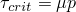）。粘着/滑移计算确定点何时从粘着转变为滑动或从滑动转变为粘着。该分数，，被称为摩擦系数。

对于从表面由基于节点的表面组成的情况，接触压力等于接触节点处的法向接触力除以接触节点处的横截面积。在Abaqus/Standard中，默认横截面积为1.0；您可以在定义表面时指定基于节点的表面中每个节点关联的横截面积，或者通过接触属性定义将相同的面积分配给每个节点。在Abaqus/Explicit中，横截面积始终为1.0，您无法更改。

基本摩擦模型假定在所有方向上相同（各向同性摩擦）。对于三维模拟，界面上有两个正交的剪切应力分量，和。这些分量作用于接触表面或接触单元的局部切向方向。接触表面的局部切向方向在["Abaqus/Standard中的接触公式，" 第38.1.1节"](pt09ch38s01aus177.md)中定义，接触单元的局部切向方向在与这些单元相关的接触建模章节中定义。

Abaqus将两个剪切应力分量合并为一个"等效剪切应力"，，用于粘着/滑移计算，其中。此外，Abaqus将两个滑移速度分量合并为一个等效滑移率，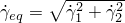。粘着/滑移计算在接触压力-剪切应力空间中定义了一个表面（对于二维表示，请参见[图37.1.5-1](pt09ch37s01aus169.md#afriction-default-slip)），沿该表面点从粘着转变为滑动。

**图37.1.5-1** 基本库仑摩擦模型的滑移区域。


在Abaqus中定义基本库仑摩擦模型有两种方法。在默认模型中，摩擦系数被定义为等效滑移率和接触压力的函数。或者，您可以直接指定静摩擦系数和动摩擦系数。

#### 使用默认模型

在默认模型中，您直接定义摩擦系数为

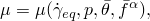

其中是等效滑移率，*p*是接触压力，是接触点处的平均温度，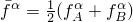是接触点处的平均预定义场变量。、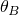、和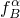是表面上点A和点B处的温度和预定义场变量。点A是从表面上的节点，点B对应于相对主表面上最近的点。温度和场变量沿点B处的表面插值。如果主表面由刚性体组成，则使用参考节点处的温度和场变量。

摩擦系数可以依赖于滑移率、接触压力、温度和场变量。默认情况下，假定摩擦系数不依赖于场变量。

摩擦系数可以设置为任何非负值。零摩擦系数意味着不会产生剪切力，接触表面可以自由滑动。对于这种情况，您不需要定义摩擦模型。

| **输入文件用法：** | ``` [*FRICTION](../key/key-link.md#usb-kws-hfriction), DEPENDENCIES=*n* , , *p*, ,  ``` |
| --- | --- |

| **Abaqus/CAE用法：** | 相互作用模块：接触属性编辑器：**Mechanical****Tangential Behavior**：**Friction formulation: Penalty**：**Friction** |
| --- | --- |
| | 如有必要，切换**Use slip-rate-dependent data**、**Use contact-pressure-dependent data**和/或**Use temperature-dependent data**；并指定除滑移率、接触压力和温度外的**Number of field variable**依赖项。 |

#### 指定静摩擦系数和动摩擦系数

实验数据表明，阻止从粘着状态开始滑动的摩擦系数与阻止已建立滑动的摩擦系数不同。前者通常称为"静"摩擦系数，后者称为"动"摩擦系数。通常，静摩擦系数高于动摩擦系数。

在默认模型中，静摩擦系数对应于零滑移率给出的值，动摩擦系数对应于最高滑移率给出的值。静摩擦和动摩擦之间的转变由中间滑移率给出的值定义。在这个模型中，静摩擦系数和动摩擦系数可以是接触压力、温度和场变量的函数。

Abaqus还提供了一个直接指定静摩擦系数和动摩擦系数的模型。在这个模型中，假定摩擦系数根据以下公式从静摩擦值指数衰减到动摩擦值：


其中是动摩擦系数，是静摩擦系数，是用户定义的衰减系数，是滑移率（参见Oden, J. T.和J. A. C. Martins, 1985）。此模型只能与各向同性摩擦一起使用，不允许依赖于接触压力、温度或场变量。有两种方法可以定义此模型。

##### 直接提供静摩擦系数、动摩擦系数和衰减系数

您可以直接提供静摩擦系数、动摩擦系数和衰减系数（参见[图37.1.5-2](pt09ch37s01aus169.md#afriction-exponential-decay)）。

**图37.1.5-2** 指数衰减摩擦模型。


| **输入文件用法：** | ``` [*FRICTION](../key/key-link.md#usb-kws-hfriction), EXPONENTIAL DECAY , ,  ``` |
| --- | --- |

| **Abaqus/CAE用法：** | 相互作用模块：接触属性编辑器：**Mechanical****Tangential Behavior**：**Friction formulation: Static-Kinetic Exponential Decay**：**Friction**，**Definition: Coefficients** |
| --- | --- |

##### 使用测试数据拟合指数模型

或者，您可以提供测试数据点来拟合指数模型。必须提供至少两个数据点。第一个点表示在处指定的静摩擦系数，第二个点（, ）（如图[图37.1.5-3](pt09ch37s01aus169.md#afriction-exponential-decay-data)所示）对应于在参考滑移率处进行的实验测量。可以指定一个额外的数据点来表征指数衰减。如果省略此额外数据点，Abaqus将自动提供一个第三个数据点（, ），以模拟无限速度下摩擦系数的假定渐近值。在这种情况下，选择使得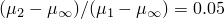。

| **输入文件用法：** | ``` [*FRICTION](../key/key-link.md#usb-kws-hfriction), EXPONENTIAL DECAY, TEST DATA  ,   ``` |
| --- | --- |

| **Abaqus/CAE用法：** | 相互作用模块：接触属性编辑器：**Mechanical****Tangential Behavior**：**Friction formulation: Static-Kinetic Exponential Decay**：**Friction**，**Definition: Test data** |
| --- | --- |

**图37.1.5-3** 用测试数据点指定的指数衰减摩擦模型。


### 使用可选剪切应力极限

您可以指定一个可选的等效剪切应力极限，，以便无论接触压力应力的大小如何，如果等效剪切应力的大小达到此值，将发生滑动（参见[图37.1.5-4](pt09ch37s01aus169.md#afriction-tau-max)）。不允许使用零值。

**图37.1.5-4** 具有临界剪切应力限制的摩擦模型的滑移区域。


通常在接触压力应力可能变得非常大的情况下（如某些制造过程中可能发生的那样）引入此剪切应力极限，因为这会导致库仑理论在界面处提供的临界剪切应力超过接触表面下方材料的屈服应力。的合理上限估计是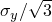，其中是 adjacent 表面材料的Mises屈服应力；但是，的最佳来源是经验数据。

| **输入文件用法：** | ``` [*FRICTION](../key/key-link.md#usb-kws-hfriction), TAUMAX= ``` |
| --- | --- |

| **Abaqus/CAE用法：** | 相互作用模块：接触属性编辑器：**Mechanical****Tangential Behavior**：**Friction formulation: Penalty**或**Lagrange Multiplier**：**Shear Stress**，**Shear stress limit: Specify:**  |
| --- | --- |

#### 剪切应力极限的限制

在Abaqus/Explicit中，当接触对使用基于节点的表面作为其中一个表面时，不能使用剪切应力极限。

### 在Abaqus/Standard中使用各向异性摩擦模型

Abaqus/Standard中可用的各向异性摩擦模型允许在接触表面上两个正交方向上使用不同的摩擦系数。这些正交方向与["Abaqus/Standard中的接触公式，" 第38.1.1节"](pt09ch38s01aus177.md)中定义的局部切向方向重合；接触单元的局部切向方向在与这些单元相关的接触建模章节中描述。局部切向方向的方向无法更改。

如果您指示应使用各向异性摩擦模型，则必须指定两个摩擦系数，其中是第一个局部切向方向上的摩擦系数，是第二个局部切向方向上的摩擦系数。

临界剪切应力曲面（参见[图37.1.5-5](pt09ch37s01aus169.md#afriction-anisotropic)）在–空间中是一个椭圆，两个极端点为和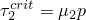。此椭圆的大小将随表面之间接触压力的变化而变化。滑移方向，，垂直于临界剪切应力曲面。

**图37.1.5-5** 各向异性摩擦模型的临界剪切应力曲面。

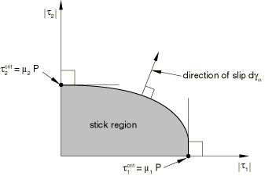

摩擦系数可以依赖于滑移率、接触压力、温度和场变量。默认情况下，假定摩擦系数不依赖于场变量。

| **输入文件用法：** | ``` [*FRICTION](../key/key-link.md#usb-kws-hfriction), ANISOTROPIC, DEPENDENCIES=*n* , , , *p*, ,  ``` |
| --- | --- |

| **Abaqus/CAE用法：** | 相互作用模块：接触属性编辑器：**Mechanical****Tangential Behavior**：**Friction formulation: Penalty**：**Friction**，**Directionality: Anisotropic** |
| --- | --- |
| | 如有必要，切换**Use slip-rate-dependent data**、**Use contact-pressure-dependent data**和/或**Use temperature-dependent data**；并指定除滑移率、接触压力和温度外的**Number of field variable**依赖项。 |

### 无论接触压力如何都防止滑动

Abaqus提供了指定无限摩擦系数（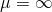）的选项。这种类型的表面相互作用称为"粗糙"摩擦，由此只要相应的法向接触约束处于活动状态，两个接触表面之间的所有相对滑动就会被阻止（罚函数施加相关的"弹性滑移"可能性除外）。在大多数情况下，Abaqus/Standard使用罚函数方法来施加这些切向约束；但是，如果在相应的法向约束具有直接施加的"硬接触"或指数压力-闭合行为的通用（非扰动）分析步骤中，则使用拉格朗日乘子方法。Abaqus/Explicit根据所选的接触公式使用运动学或罚函数方法。

粗糙摩擦适用于非间歇性接触；一旦表面闭合并经受粗糙摩擦，它们应保持闭合。如果具有粗糙摩擦的闭合接触界面打开，Abaqus/Standard可能会出现收敛困难，特别是在已形成大剪切应力的情况下。粗糙摩擦模型通常与用于表面法向运动的"无分离"接触压力-闭合关系结合使用（参见["使用无分离关系"在"接触压力-闭合关系，" 第37.1.2节"](pt09ch37s01aus166.md#usb-cni-anormalinteraction-nosep)），这禁止表面闭合后分离。

当在Abaqus/Explicit中同时使用硬接触（用运动学接触方法指定）和粗糙摩擦时，表面不会发生相对运动。对于在Abaqus/Explicit中用罚函数接触方法指定的硬接触，相对运动将限于与施加的罚函数力对接触约束的不精确满足相对应的弹性滑移和穿透。当在Abaqus/Explicit中指定软化切向行为时（参见["在Abaqus/Explicit中定义切向软化"](pt09ch37s01aus169.md#usb-cni-afriction-tangsoftening)"下文），相对表面运动将由指定的软化行为控制。

| **输入文件用法：** | ``` [*FRICTION](../key/key-link.md#usb-kws-hfriction), ROUGH ``` |
| --- | --- |

| **Abaqus/CAE用法：** | 相互作用模块：接触属性编辑器：**Mechanical****Tangential Behavior**：**Friction formulation: Rough** |
| --- | --- |

### 粘着时的剪切应力与弹性滑移

在某些情况下，即使摩擦模型确定当前摩擦状态为"粘着"，也可能发生一些增量滑移。换言之，在"粘着"状态下，剪切（摩擦）应力与总滑移关系曲线的斜率可能是有限的，如图[图37.1.5-6](pt09ch37s01aus169.md#aelasticslip)所示。

**图37.1.5-6** 粘着和滑动摩擦的弹性滑移与剪切牵引力关系。


此图中所示的关系类似于无硬化的弹塑性材料行为：对应于杨氏模量，对应于屈服应力；粘着摩擦对应于弹性状态，滑动摩擦对应于塑性状态。粘着刚度的有限值可能反映用户指定的物理行为，也可能是约束施加方法的特征。

在Abaqus/Standard中，摩擦约束默认使用刚度（罚函数方法）施加，对于Abaqus/Explicit中的通用接触算法也是如此；在这种情况下，粘着刚度将具有有限值。无限粘着刚度（其中弹性滑移始终为零）可以通过在Abaqus/Standard中施加摩擦约束的可选拉格朗日乘子方法或在Abaqus/Explicit中仅适用于接触对的运动学约束方法来实现。在Abaqus/Explicit中，默认情况下有一些切向接触阻尼作用于弹性滑移率，如["接触阻尼，" 第37.1.3节"](pt09ch37s01aus167.md)中所讨论的。切向软化以反映物理行为仅在Abaqus/Explicit中可用。

#### 在Abaqus/Explicit中定义切向软化

要在Abaqus/Explicit中激活软化切向行为，请指定剪切应力与弹性滑移关系曲线的斜率（所示）。用户子程序[`VFRIC`](../sub/sub-link.md#sub-xsl-vfric)不能与软化切向行为结合使用。

| **输入文件用法：** | ``` [*FRICTION](../key/key-link.md#usb-kws-hfriction), SHEAR TRACTION SLOPE= ``` |
| --- | --- |

| **Abaqus/CAE用法：** | 相互作用模块：接触属性编辑器：**Mechanical****Tangential Behavior**：**Friction formulation: Penalty**或**Static-Kinetic ** **Exponential Decay**：**Elastic Slip**，**Specify:**  |
| --- | --- |

#### 在Abaqus/Standard中施加摩擦约束的刚度方法

Abaqus/Standard中用于摩擦的刚度方法是一种罚函数方法，当表面应该粘着时，允许表面有一些相对运动（"弹性滑移"）（类似于在Abaqus/Explicit中用软化切向行为定义的允许弹性滑移）。当表面粘着时（即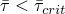），滑动的大小被限制在此弹性滑移范围内。Abaqus持续调整罚约束的大小以强制执行此条件。

Abaqus/Standard中的刚度方法需要选择允许的弹性滑移，。在模拟中使用较大的会加快收敛速度，但会牺牲解的准确性（当表面应该粘着时，相对运动更大）。通过仅允许较小的，可以更准确地近似粘着状态下不允许滑动的行为。如果选择得非常小，可能会出现收敛问题；在这种情况下，最好使用拉格朗日乘子方法来施加粘着约束（参见下文["在Abaqus/Standard中施加摩擦约束的拉格朗日乘子方法"](pt09ch37s01aus169.md#usb-cni-afriction-lagrangemult))。

Abaqus/Standard使用的允许弹性滑移的默认值通常效果很好，在效率和准确性之间提供了保守的平衡。Abaqus/Standard将的一小部分，并在计算时扫描所有从表面的所有面。如果请求接触约束信息的详细打印输出（参见["控制写入数据文件的分析输入文件处理器信息量"在"输出，" 第4.1.1节"](pt02ch04s01aus38.md#usb-out-ooutput-data-control)），Abaqus/Standard会在数据（`.dat`）文件中报告每个接触对使用的，其中是滑移容差；的默认值为0.005。

这种计算允许弹性滑移的方法用于Abaqus/Standard中的所有分析程序，稳态传输分析除外（["稳态传输分析，" 第6.4.1节"](pt03ch06s04at17.md)），其中罚约束基于最大允许滑移率，。最大滑移率计算为

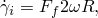

其中是自旋角速度，*R*是滚动结构的半径。

##### 默认弹性滑移值可能不合适的情况

在某些情况下，允许弹性滑移的默认值可能不合适。例如，由基于节点的表面或某些接触单元类型（如GAPUNI单元）定义的从表面没有物理尺寸，Abaqus/Standard无法估计并发出警告消息。如果模型不包含可以确定特征长度的单元（例如，如果它仅包含子结构），Abaqus/Standard没有信息来计算。因此，它使用1.0的值并发出警告消息。如果接触表面面尺寸变化很大，的平均值可能对某些接触表面不合理。 then应直接为具有更小"特征面尺寸"的表面指定弹性滑移。

修改允许弹性滑移有两种方法。一种方法是直接指定；另一种方法是指定滑移容差，或（参见上文["在Abaqus/Standard分析过程中更改摩擦属性"](pt09ch37s01aus169.md#usb-cni-afriction-change-std))。

##### 直接指定允许的弹性滑移

您可以直接提供的绝对大小。指定在表面实际开始滑动之前可能发生的相对位移的合理值。通常，允许的弹性滑移设置为"特征接触表面面尺寸"的一小部分（102–104）。在稳态传输分析中，可以定义最大允许粘性滑移率，。

指定的允许弹性滑移将仅用于引用包含摩擦定义的接触属性定义的接触对。例如，三个表面`ASURF`、`BSURF`和`CSURF`形成两个接触对，每个接触对引用自己的接触属性定义，如下所示。

| 接触对 | 接触属性 |  |
| --- | --- | --- |
| `ASURF, BSURF` | `DEFAULT` | 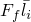 |
| `CSURF, BSURF` | `NONDEF` | 0.1 |

在`DEFAULT`接触属性定义中未指定的值，因此`ASURF`和`BSURF`之间摩擦相互作用的允许弹性滑移将是默认值。在`NONDEF`接触属性定义中为指定了0.1的值，这将是`CSURF`和`BSURF`之间摩擦相互作用的允许弹性滑移。

| **输入文件用法：** | ``` [*FRICTION](../key/key-link.md#usb-kws-hfriction), ELASTIC SLIP= ``` |
| --- | --- |

| **Abaqus/CAE用法：** | 相互作用模块：接触属性编辑器：**Mechanical****Tangential Behavior**：**Friction formulation: Penalty**或**Static-Kinetic ** **Exponential Decay**：**Elastic Slip**，**Absolute distance:**  |
| --- | --- |

##### 更改默认滑移容差

您可以更改滑移容差的默认值，。更改默认弹性滑移的此方法很方便，因为如果目标是提高计算效率，则给出大于默认值0.005的值；或者如果目标是提高准确性，则给出小于默认值的值。

| **输入文件用法：** | ``` [*FRICTION](../key/key-link.md#usb-kws-hfriction), SLIP TOLERANCE= ``` |
| --- | --- |

| **Abaqus/CAE用法：** | 相互作用模块：接触属性编辑器：**Mechanical****Tangential Behavior**：**Friction formulation: Penalty**或**Static-Kinetic ** **Exponential Decay**：**Elastic Slip**，**Fraction of characteristic surface dimension:**  |
| --- | --- |

#### 在Abaqus/Explicit中施加摩擦约束的刚度方法

Abaqus/Explicit中用于通用接触算法的摩擦刚度方法以及可选地用于Abaqus/Explicit中接触对方法的罚函数方法是一种罚函数方法，当表面应该粘着时，允许表面有一些相对运动（"弹性滑移"）（类似于在Abaqus/Explicit中用软化切向行为定义的允许弹性滑移）。当表面粘着时（即），滑动的大小被限制在此弹性滑移范围内。Abaqus持续调整罚约束的大小以强制执行此条件。

在Abaqus/Explicit中，您可以选择让接触对算法的接触约束用罚函数方法施加；通用接触算法始终使用罚函数方法（参见["Abaqus/Explicit中的接触约束施加方法，" 第38.2.3节"](pt09ch38s02aus182.md))。

默认罚函数刚度用于摩擦约束，由Abaqus/Explicit自动选择，与用于正常硬接触约束的罚函数刚度相同。法向软化不影响用于强制执行粘着条件的罚函数刚度。如果指定了切向软化（参见上文["在Abaqus/Explicit中定义切向软化"](pt09ch37s01aus169.md#usb-cni-afriction-tangsoftening))，罚函数刚度将等于为剪切应力与弹性滑移关系斜率指定的值。您可以指定一个比例因子来调整罚函数刚度，如["Abaqus/Explicit中通用接触的接触控制，" 第36.4.5节"](pt09ch36s04aus159.md)和["Abaqus/Explicit中接触对的接触控制，" 第36.5.5节"](pt09ch36s05aus164.md)中所讨论的。

#### 在Abaqus/Standard中施加摩擦约束的拉格朗日乘子方法

在Abaqus/Standard中，可以使用拉格朗日乘子实现精确施加两个表面之间界面处的粘着约束。使用此方法，在之前，闭合表面之间没有相对运动。然而，拉格朗日乘子通过向模型添加更多自由度并通常增加获得收敛解所需的迭代次数来增加分析的计算成本。拉格朗日乘子公式甚至可能阻止解的收敛，特别是在许多点在粘着和滑动条件之间迭代的情况下。这种效应可能特别发生在局部摩擦应力与接触压力之间存在强烈相互作用的情况下。

由于使用拉格朗日摩擦公式的额外成本，它应该仅在粘着/滑移行为的解析至关重要的问题中使用，例如两个物体之间的微动建模。在典型的金属成形应用或橡胶部件接触中，粘着/滑移行为的准确解析并不重要，不足以证明使用拉格朗日乘子公式的额外成本是合理的。

| **输入文件用法：** | ``` [*FRICTION](../key/key-link.md#usb-kws-hfriction), LAGRANGE ``` |
| --- | --- |

| **Abaqus/CAE用法：** | 相互作用模块：接触属性编辑器：**Mechanical****Tangential Behavior**：**Friction formulation: Lagrange Multiplier** |
| --- | --- |

#### 在Abaqus/Explicit中施加摩擦约束的运动学方法

默认情况下，Abaqus/Explicit中的接触对算法使用运动学方法施加摩擦约束（参见["Abaqus/Explicit中的接触约束施加方法，" 第38.2.3节"](pt09ch38s02aus182.md))。运动学方法以一种类似于Abaqus/Standard中可选拉格朗日乘子方法的方式施加粘着约束；但是，算法完全不同。首先使用与节点关联的质量、节点滑移的距离、时间增量以及对于软化接触还有弹性滑移的当前值和弹性滑移与剪切应力斜率来计算在节点处强制执行粘着所需的力值。对于硬接触，此粘着力是保持节点在其预测配置中位于对立表面上的位置所需的力。对于软化接触，此力与用户为剪切应力与弹性滑移关系斜率指定的值一致。使用与节点关联的质量、节点滑移的距离、切向剪切牵引力-弹性滑移斜率（如果指定了软化接触）和时间增量来计算每个节点的粘着力。如果使用此力计算的节点处剪切应力小于，则认为节点处于粘着状态，并将此力施加到每个表面，方向相反。如果剪切应力超过，则表面正在滑动，并施加与对应的力。在任一情况下，力都会导致从节点处沿表面切向的加速度校正，以及主表面面或接触的分析刚性表面上的节点。

### 用户定义的摩擦模型

当Abaqus提供的摩擦行为不足时，您可以通过用户子程序定义接触表面之间的剪切应力。剪切应力可以定义为滑移、滑移率、温度和场变量等变量的函数。您还可以引入许多解决方案相关的状态变量，您可以在摩擦用户子程序中更新和使用这些变量。您可以声明与摩擦模型关联的许多属性或常数，并在用户子程序中使用这些值。

除了摩擦用户子程序外，还提供了用于定义表面之间完整机械相互作用的子程序，包括法向相互租用以及切向摩擦行为；更多信息请参见["用户定义的界面本构行为，" 第37.1.6节"](pt09ch37s01aus170.md)。

#### 定义通用摩擦行为

您可以使用用户子程序[`FRIC`](../sub/sub-link.md#sub-xsl-fric)在Abaqus/Standard中定义接触表面之间的通用摩擦行为。在Abaqus/Explicit中，接触对的通用摩擦行为在用户子程序[`VFRIC`](../sub/sub-link.md#sub-xsl-vfric)中定义，而通用接触的通用摩擦行为在用户子程序[`VFRICTION`](../sub/sub-link.md#sub-xsl-vfriction)中定义。

| **输入文件用法：** | 使用以下选项通过用户子程序[`FRIC`](../sub/sub-link.md#sub-xsl-fric)或[`VFRIC`](../sub/sub-link.md#sub-xsl-vfric)定义摩擦行为： |
| --- | --- |
| | ``` [*FRICTION](../key/key-link.md#usb-kws-hfriction), USER, DEPVAR=*n*, PROPERTIES=*p* ``` 使用以下选项通过用户子程序[`VFRICTION`](../sub/sub-link.md#sub-xsl-vfriction)定义摩擦行为： ``` [*FRICTION](../key/key-link.md#usb-kws-hfriction), USER=FRICTION, DEPVAR=*n*, PROPERTIES=*p* ``` |

| **Abaqus/CAE用法：** | 使用以下选项通过用户子程序[`FRIC`](../sub/sub-link.md#sub-xsl-fric)或[`VFRIC`](../sub/sub-link.md#sub-xsl-vfric)定义摩擦行为： |
| --- | --- |
| | 相互作用模块：接触属性编辑器：**Mechanical****Tangential Behavior**：**Friction formulation: User-defined**，**Number of state-dependent variables:** *n*，**Friction Properties** Abaqus/CAE不支持用户子程序[`VFRICTION`](../sub/sub-link.md#sub-xsl-vfriction)。 |

#### 定义复杂各向同性摩擦

当摩擦系数的表达式可以明确表示时，Abaqus提供了一种指定复杂各向同性摩擦行为的方法。您只需指定摩擦系数，Abaqus将计算由此产生的摩擦力。Abaqus/Standard提供用户子程序[`FRIC_COEF`](../sub/sub-link.md#sub-xsl-fric_coef)，Abaqus/Explicit提供用户子程序[`VFRIC_COEF`](../sub/sub-link.md#sub-xsl-vfric_coef)。[`VFRIC_COEF`](../sub/sub-link.md#sub-xsl-vfric_coef)只能与通用接触一起使用。

| **输入文件用法：** | ``` [*FRICTION](../key/key-link.md#usb-kws-hfriction), USER=COEFFICIENT, PROPERTIES=*p* ``` |
| --- | --- |

| **Abaqus/CAE用法：** | Abaqus/CAE不支持用户子程序[`FRIC_COEF`](../sub/sub-link.md#sub-xsl-fric_coef)和[`VFRIC_COEF`](../sub/sub-link.md#sub-xsl-vfric_coef)。 |
| --- | --- |

### 在Abaqus/Explicit中考虑壳和梁厚度偏移的增量旋转

默认情况下，在Abaqus/Explicit中，摩擦的滑移增量计算不考虑壳和梁厚度偏移的增量旋转，摩擦约束不对由于壳或梁厚度而偏离接触界面的节点施加力矩。对于通用接触，可以修改此行为；详细信息请参见["Abaqus/Explicit中通用接触的接触控制，" 第36.4.5节"](pt09ch36s04aus159.md#usb-cni-acontactcontrolsassign-consider)中的"考虑壳和梁厚度偏移的增量旋转以进行摩擦接触"。

### 改进包含表面相互租用摩擦的Abaqus/Standard模拟

表面摩擦相互租用的几个特征可能对Abaqus/Standard模拟中的收敛速度有很大影响。

#### 方程组中的非对称项

当表面相对滑动时，摩擦约束会产生非对称项。如果摩擦应力对整体位移场有很大影响且摩擦应力的大小高度依赖于解决方案，则这些项对收敛速度有很大影响。如果或是压力相关的，Abaqus/Standard将自动使用非对称解决方案方案。如有需要，您可以关闭非对称解决方案方案；请参见["Abaqus/Standard中的矩阵存储和解决方案方案"在"定义分析，" 第6.1.2节"](pt03ch06s01abo05.md#usb-anl-unsymm)。

粗糙摩擦不会发生滑移；刚度贡献将是完全对称的，Abaqus/Standard默认使用对称解决方案方案。

### 表面摩擦相互作用产生的热量

在完全耦合温度-位移分析和完全耦合热-电-结构分析中，默认情况下，所有耗散的机械（摩擦）能量都被转换为热量并平等分配给两个表面。可以修改此行为；有关此热表面相互作用和其他热表面相互租用的详细信息，请参见["热接触属性，" 第37.2.1节"](pt09ch37s02aus174.md)。

### 结构单元摩擦属性的温度和场变量依赖性

梁和壳单元中的温度和场变量分布通常可以包括单元横截面内的梯度。这些单元之间的接触发生在参考表面上；因此，在确定依赖于这些变量的摩擦属性时，不考虑单元中的温度和场变量梯度。

### 与摩擦相关的表面相互作用变量

Abaqus提供在使用包含摩擦属性的表面相互作用模型的从表面上各点的剪切应力输出。剪切应力CSHEAR1和CSHEAR2以两个正交局部切向方向给出，这些方向在主表面上构造（参见["Abaqus/Standard中的接触公式，" 第38.1.1节"](pt09ch38s01aus177.md)）。在二维问题中只有一个局部切向方向。有关请求接触表面变量输出的详细信息，请参见["在Abaqus/Standard中定义接触对，" 第36.3.1节"](pt09ch36s03aus145.md)和["在Abaqus/Explicit中定义接触对，" 第36.5.1节"](pt09ch36s05aus160.md)。

也可以在Abaqus/CAE中绘制这些变量的等值线图。

#### 额外参考资料

- Oden, J. T., and J. A. C. Martins, "Models and Computational Methods for Dynamic Friction Phenomena," Computer Methods in Applied Mechanics and Engineering, vol. 52, pp. 527--634, 1985.

