# 1.2.1 Input syntax rules


**Products: **Abaqus/Standard  Abaqus/Explicit  

##### **Reference**

- ["Defining a model in Abaqus," Section 1.3.1](pt01ch01s03aus03.md)

### Overview

This section describes the syntax rules that govern an Abaqus input file.

All data definitions in Abaqus are accomplished with option blocks—sets of data describing a part of the problem definition. You choose those options that are relevant for a particular application. Options are defined by lines in the input file. Three types of input lines are used in an Abaqus input file: *keyword* lines, *data* lines, and *comment* lines. Only 7-bit ASCII characters are supported, and a carriage return is required at the end of each line in an input file.
- Keyword lines introduce options and often have *parameters*, which appear as words or phrases separated by commas on the keyword line. Parameters are used to define the behavior of an option. Parameters can stand alone or have a value, and they may be required or optional.
- Data lines, which are used to provide numeric or alphanumeric entries, follow most keyword lines.
- Any line that begins with stars in columns 1 and 2 (**) is a comment line. Such lines can be placed anywhere in the file. They are ignored by Abaqus, so they will be printed only in the initial listing of the file. There is no restriction on how many or where such lines occur in the file.

Relevant parameters and data lines (including the number of entries per data line) are described in the sections of the [Abaqus Keywords Reference Guide](../key/key-link.md#key) describing each option. This section describes the general rules that apply to all keyword and data lines.

### Keyword lines

The following rules apply when entering a keyword line:
- The first non-blank character of each keyword line must be a star (*).
- The keyword must be followed by a comma (,) if any parameters are given.
- Parameters must be separated by commas.
- Blanks on a keyword line are ignored.
- A line can include no more than 256 characters, including blanks.
- Keywords and parameters are not case sensitive.
- Parameter values usually are not case sensitive. The only exceptions to this rule are those imposed externally to Abaqus, such as file names on case-sensitive operating systems.
- Keywords, parameters, and, in most cases, parameter values need not be spelled out completely, but there must be enough characters given to distinguish them from other keywords, parameters, and parameter values that begin in the same way. Abaqus first searches each associated text string for an exact match. If an exact match is not found, Abaqus then searches based upon the minimum number of unique characters in each keyword, parameter, or parameter value, as the case may be. Embedded blanks can be omitted from any item in a keyword line. If a parameter value is used to provide a number or a file name, the complete value should be provided.
- If a parameter has a value, the equal sign (=) is used. The value can be an integer, a floating point number, or a character string, depending on the context. For example, ``` [*ELASTIC](../key/key-link.md#usb-kws-melastic), TYPE=ISOTROPIC, DEPENDENCIES=1 ```
- When the parameter value is a character string that represents the name of an item, you should not use case as a method of distinguishing values unless the values are enclosed within quotation marks. For example, Abaqus does not distinguish between the following definitions: ``` [*MATERIAL](../key/key-link.md#usb-kws-mmaterial), NAME=STEEL [*MATERIAL](../key/key-link.md#usb-kws-mmaterial), NAME=Steel ```
- The same parameter should not appear more than once on a single keyword line. If a parameter has multiple settings on a single keyword line, Abaqus ignores all but one of the settings.
- Continuation of a keyword line is sometimes necessary; for example, because of a large number of parameters. If the last character on a keyword line is a comma, the next line is interpreted as a continuation of the line. For example, the [*ELASTIC](../key/key-link.md#usb-kws-melastic) keyword line above could also be given as ``` [*ELASTIC](../key/key-link.md#usb-kws-melastic), TYPE=ISOTROPIC, DEPENDENCIES=1 ```
- Certain keywords must be used in conjunction with other keywords; for example, the [*ELASTIC](../key/key-link.md#usb-kws-melastic) and [*DENSITY](../key/key-link.md#usb-kws-mdensity) keywords must be used in conjunction with the [*MATERIAL](../key/key-link.md#usb-kws-mmaterial) keyword. These related keywords must be grouped in a block in the input file; unrelated keywords cannot be specified within this block.
- Some options allow the INPUT or FILE parameter to be set equal to the name of an alternate file. Such file names can include a full path name or a relative path name. Relative path names must be with respect to the directory from which the job was submitted. If no path is specified, the file is assumed to be in the directory from which the job was submitted. A substructure library must be in the same directory from which the job was submitted; a full path name cannot be used to specify a substructure library name. For files referenced by the INPUT parameter, the file name must include any extension (e.g., `elem.inp`). For files referenced by the FILE parameter, the name must be given without an extension in most cases since Abaqus assumes that the file to be read has the correct extension for the file type that is relevant to the option: `.res` for restart files (["Restarting an analysis," Section 9.1.1](pt04ch09s01aus53.md)) and `.fil` for results files (["Output," Section 4.1.1](pt02ch04s01aus38.md)). However, special rules may apply when a results file (`.fil`) or an output database file (`.odb`) is relevant for the option (see ["Initial conditions in Abaqus/Standard and Abaqus/Explicit," Section 34.2.1](pt07ch34s02aus116.md), and ["Sequentially coupled thermal-stress analysis," Section 16.1.2](pt04ch16s01at39.md), for details). The file or substructure library name must have the correct case on computers with case-sensitive operating systems. Regardless of whether the user specifies only a file name, a relative path name, or a full path name, the complete name including the path can have a maximum of 256 characters. All spaces within a file name, a relative path name, or a full path name are ignored unless the name is enclosed in quotation marks, in which case all spaces within the name are maintained.

### Data lines

Data lines are used to provide data that are more easily given in lists than as parameters on an option. Most options require one or more data lines; if they are required, the data lines must immediately follow the keyword line introducing the option. The following rules apply when entering a data line:
- A data line can include no more than 256 characters, including blanks. Trailing blanks are ignored.
- All data items must be separated by commas (,). An empty data field is specified by omitting data between commas. Abaqus will use values of zero for any required numeric data that are omitted unless a default value is specified.
- A line must contain only the number of items specified.
- Empty data fields at the end of a line can be ignored.
- Floating point numbers can occupy a maximum of 20 spaces including the sign, decimal point, and any exponential notation. Floating point numbers can be given with or without an exponent. Any exponent, if input, must be preceded by E or D and an optional () or (+). The following line shows four acceptable ways of entering the same floating point number: ``` -12.345 -1234.5E-2 -1234.5D-2 -1.2345E1 ```
- Integer data items can occupy a maximum of 9 digits.
- Character strings can be up to 80 characters long and are not case sensitive.
- Continuation lines are allowed in specific instances (see ["Element definition," Section 2.2.1](pt01ch02s02aus11.md)). If allowed, such lines are indicated by a comma as the last character of the preceding line. A single data item cannot be entered over multiple lines.

In many cases the choice of parameters used with an option determines the type of data lines required. For example, there are five different ways to define a linear elastic material (["Elastic behavior: overview," Section 22.1.1](pt05ch22s01abo19.md)). The data lines you specify must be consistent with the value of the TYPE parameter given on the [*ELASTIC](../key/key-link.md#usb-kws-melastic) option.

#### Sets

One of the most useful features of the Abaqus data definition method is the availability of *sets*. A set can be a set of nodes or a set of elements. You provide a name (1–80 characters, the first of which must be a letter) for each set. That name then provides a means of referencing all of the members of the set. As an example suppose that, for the structure shown in [Figure 1.2.1--1](pt01ch01s02aus01.md#iusing-set-exa), we wish to apply symmetry boundary conditions at all of the nodes in the set `MIDDLE` and that the edge `SUPPORT` is pinned. 

**Figure 1.2.1–1** Example of the use of sets.

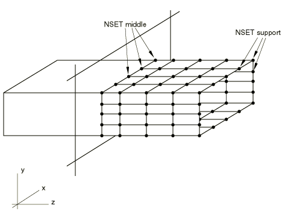

We assemble the relevant nodes into sets and specify the boundary conditions by
```
[*BOUNDARY](../key/key-link.md#usb-kws-hboundary)
 MIDDLE, ZSYMM
 SUPPORT, PINNED
```
Sets are the basic reference throughout Abaqus, and the use of sets is recommended. Choosing meaningful set names makes it simple to identify which data belong to which part of the model. Further discussion of sets is provided in ["Node definition," Section 2.1.1](pt01ch02s01aus05.md), and ["Element definition," Section 2.2.1](pt01ch02s02aus11.md).

#### Labels

Labels such as set names, surface names, and rebar names are case insensitive unless enclosed within quotation marks (except when they are accessed from user subroutines; see ["User subroutines: overview," Section 18.1.1](pt04ch18s01aus104.md)). Labels can be up to 80 characters long. All spaces within a label are ignored unless the label is enclosed in quotation marks, in which case all spaces within the label are maintained. A label that is not enclosed within quotation marks must begin with a letter, may not include a period (.), and should not contain characters such as commas and equal signs. These restrictions do not apply to labels enclosed within quotation marks except if the label is a material name. A material name must always start with a letter, even if the name is enclosed within quotation marks.

Labels cannot begin and end with a double underscore (e.g., __STEEL__). This label format is reserved for internal use by Abaqus.

The following are examples of labels entered with and without the use of quotation marks:

```
[*ELEMENT](../key/key-link.md#usb-kws-melement), TYPE=SPRINGA, ELSET="One element"
1,1,2
[*SPRING](../key/key-link.md#usb-kws-mspring), ELSET="One element"
1.0E-5,
[*NSET](../key/key-link.md#usb-kws-mnset), ELSET="One element", NSET=NODESET
[*BOUNDARY](../key/key-link.md#usb-kws-hboundary)
nodeset,1,2
```

#### Repeating data lines

Some options list only a single data line. In cases where only one data line is allowed, this is indicated by the data line title “First (and only) line.” An example of this is the [*DYNAMIC](../key/key-link.md#usb-kws-hdynamic) option. In many cases the single data line shown can be repeated to define one variable as a function of another; this choice is indicated by a note after the data line. For example, a table of biaxial test data can be given to define a hyperelastic material:

```
[*BIAXIAL TEST DATA](../key/key-link.md#usb-kws-mbitestdata) 
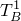,  
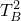, 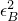 
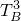,  
Etc.
```
There is no limit on the number of data lines allowed, but the data must be given in a certain order, as explained below.

Many options require more than one data line; these are indicated by the data line titles “First line:”, “Second line:”, etc. For example, exactly two data lines must be used to define a local orientation for a shell element ([*ORIENTATION](../key/key-link.md#usb-kws-morientation)), and at least three data lines are required to define anisotropic elasticity ([*ELASTIC](../key/key-link.md#usb-kws-melastic)).

In many cases the data lines can be repeated, which is indicated by a note after the data lines. As with repetition of a single data line, it is important that sets of data lines be given in the correct order so that Abaqus can interpolate the data properly.

##### Example: Multiple data lines due to field variable dependence

Any time an option can be defined as a function of field variables, you must determine the number of data lines required to define the option completely. (See ["Specifying field variable dependence" in "Material data definition," Section 21.1.2](pt05ch21s01aus109.md#usb-mat-cmaterialdata-fvdepen) for more information.) For example, two data lines are required if stress-based failure criteria ([*FAIL STRESS](../key/key-link.md#usb-kws-mefailstress)) are defined as a function of two field variables. This pair of data lines is repeated as often as necessary to define the failure criteria completely:


(In this example the last field on the first data line of each pair was omitted, which means that the stress-based failure criteria are not temperature dependent.)

If the stress-based failure criteria were defined as a function of nine field variables, a set of three data lines would be repeated as often as necessary:

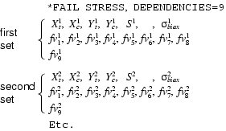

##### Ordering the data lines

Whenever one variable is defined as a function of another, the data must be given in the proper order so that Abaqus can interpolate for intermediate values correctly. The variable being defined is assumed to be constant outside the range of independent variables given, except for nonlinear elastic gasket thickness behavior involving damage where the data are extrapolated based on the last slope computed from the user-specified data.

If the property being defined is a function of only one variable (such as the [*BIAXIAL TEST DATA](../key/key-link.md#usb-kws-mbitestdata) shown above), the data should be given in the order of increasing value of the independent variable.

If the property being defined is a function of multiple independent variables, the variation of the property with respect to the first variable must be given at fixed values of the other variables, in ascending values of the second variable, then of the third variable, and so on. The data lines must always be ordered so that the independent variables are given increasing values. This process ensures that the value of the material property is completely and uniquely defined at any values of the independent variables upon which the property depends.

As an example, consider isotropic elasticity defined as a function of three field variables (but not of temperature):

```
[*ELASTIC](../key/key-link.md#usb-kws-melastic), DEPENDENCIES=3
 , 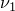,  , 1, 1, 1
 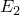, 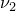,  , 2, 1, 1
 , ,  , 1, 2, 1
 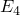, ,  , 2, 2, 1
 , 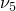,  , 1, 3, 1
 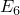, 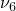,  , 2, 3, 1
 , 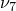,  , 1, 1, 2
 , ,  , 2, 1, 2
 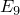, ,  , 1, 2, 2
 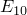, 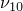, , 2, 2, 2
 , , , 1, 3, 2
 , , , 2, 3, 2
 , , , 1, 1, 3
 , , , 2, 1, 3
 , 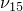, , 1, 2, 3
 , , , 2, 2, 3
 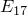, , , 1, 3, 3
 , , , 2, 3, 3
```


