# 1.2.2 Conventions


**Products: **Abaqus/Standard  Abaqus/Explicit  Abaqus/CFD  Abaqus/CAE  

##### **References**

- [Chapter 2, "Spatial Modeling](pt01ch02.md)"
- [Part II, "Output](pt02.md)"
- ["Boundary conditions in Abaqus/Standard and Abaqus/Explicit," Section 34.3.1](pt07ch34s03aus118.md)
- ["Boundary conditions in Abaqus/CFD," Section 34.3.2](pt07ch34s03aus119.md)

### Overview

The conventions that are used throughout Abaqus are defined in this section. The following topics are discussed:
- Degrees of freedom
- Coordinate systems
- Self-consistent units
- Time measures
- Local directions on surfaces in space
- Stress and strain conventions
- Stress and strain measures in geometrically nonlinear analysis
- Conventions for finite rotations
- Conventions for tabular data input

### Degrees of freedom

Except for axisymmetric elements, fluid continuum elements, and electromagnetic elements, the degrees of freedom are always referred to as follows:

| 1 | *x*-displacement |
| --- | --- |
| 2 | *y*-displacement |
| 3 | *z*-displacement |
| 4 | Rotation about the *x*-axis, in radians |
| 5 | Rotation about the *y*-axis, in radians |
| 6 | Rotation about the *z*-axis, in radians |
| 7 | Warping amplitude (for open-section beam elements) |
| 8 | Pore pressure, hydrostatic fluid pressure, or acoustic pressure |
| 9 | Electric potential |
| 10 | Connector material flow (units of length) |
| 11 | Temperature (or normalized concentration in mass diffusion analysis) |
| 12 | Second temperature (for shells or beams) |
| 13 | Third temperature (for shells or beams) |
| 14 | Etc. |

Here the *x*-, *y*-, and *z*-directions coincide with the global *X*-, *Y*-, and *Z*-directions, respectively; however, if a local transformation is defined at a node (see ["Transformed coordinate systems," Section 2.1.5](pt01ch02s01aus09.md)), they coincide with the local directions defined by the transformation.

A maximum of 20 temperature values (degrees of freedom 11 through 30) can be defined for shell or beam elements in Abaqus/Standard.

#### Axisymmetric elements

The displacement and rotation degrees of freedom in axisymmetric elements are referred to as follows:

| 1 | *r*-displacement |
| --- | --- |
| 2 | *z*-displacement |
| 5 | Rotation about the *z*-axis (for axisymmetric elements with twist), in radians |
| 6 | Rotation in the *r*--*z* plane (for axisymmetric shells), in radians |

Here the *r*- and *z*-directions coincide with the global *X*- and *Y*-directions, respectively; however, if a local transformation is defined at a node (see ["Transformed coordinate systems," Section 2.1.5](pt01ch02s01aus09.md)), they coincide with the local directions defined by the transformation.

#### Fluid continuum elements

Fluid continuum elements in Abaqus/CFD are used to define the element shape and to discretize the continuum. Degrees of freedom in a fluid flow analysis are not determined by the element type but by the analysis procedure and options specified (e.g., turbulence models and auxiliary transport equations).

#### Electromagnetic elements

Electromagnetic elements in Abaqus/Standard are used to define the element shape and to discretize the continuum. The eddy current and magnetostatic analyses formulations use magnetic vector potential as a degree of freedom (see ["Boundary conditions" in "Eddy current analysis," Section 6.7.5](pt03ch06s07at24.md#usb-anl-aeddycurrent-bc), and ["Boundary conditions" in "Magnetostatic analysis," Section 6.7.6](pt03ch06s07at25.md#usb-anl-amagnetostatic-bc)).

#### Activation of degrees of freedom

Abaqus/Standard and Abaqus/Explicit activate only those degrees of freedom needed at a node. Thus, some of the degrees of freedom listed above may not be used at all nodes in a model, because each element type uses only those degrees of freedom that are relevant. For example, two-dimensional solid (continuum) stress/displacement elements use only degrees of freedom 1 and 2. The degrees of freedom actually used at any node are the envelope of those needed in each element that shares the node.

In Abaqus/CFD the active degrees of freedom in a fluid flow analysis are determined by the analysis procedure and the options specified. For example, using the energy equation in conjunction with the incompressible flow procedure activates the velocity, pressure, and temperature degrees of freedom. For more information, see ["Active degrees of freedom" in "Boundary conditions in Abaqus/CFD," Section 34.3.2](pt07ch34s03aus119.md#usb-prc-pboundarycfd-dofs).

#### Internal variables in Abaqus/Standard

In addition to the degrees of freedom listed above, Abaqus/Standard uses internal variables (such as Lagrange multipliers to impose constraints) for some elements. Normally you need not be concerned with these variables, but they may appear in error and warning messages and are checked for satisfaction of nonlinear constraints during iteration. Internal variables are always associated with internal nodes, which have negative numbers to distinguish them from user-defined nodes.

### Coordinate systems

The basic coordinate system in Abaqus is a right-handed, rectangular Cartesian system. You can choose other systems locally for input (see ["Node definition," Section 2.1.1](pt01ch02s01aus05.md)), for output of nodal variables (displacements, velocities, etc.) and point load or boundary condition specification (see ["Transformed coordinate systems," Section 2.1.5](pt01ch02s01aus09.md)), and for material or kinematic joint specification (see ["Orientations," Section 2.2.5](pt01ch02s02aus15.md)). All coordinate systems must be right-handed.

### Units

Abaqus has no units built into it except for rotation and angle measures. Therefore, the units chosen must be self-consistent, which means that derived units of the chosen system can be expressed in terms of the fundamental units without conversion factors.

#### Rotation and angle measures

In Abaqus rotational degrees of freedom are expressed in radians, and all other angle measures are expressed in degrees (for example, phase angles).

#### International System of units (SI)

The International System of units (SI) is an example of a self-consistent set of units. The fundamental units in the SI system are length in meters (m), mass in kilograms (kg), time in seconds (s), temperature in degrees kelvin (K), and electric current in amperes (A). The units of secondary or derived quantities are based on these fundamental units. An example of a derived unit is the unit of force. A unit of force in the SI system is called a newton (N): 


Similarly, a unit of electrical charge in the SI system is called a coulomb (C): 

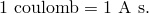

Another example is the unit of energy, called a joule (J): 

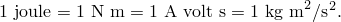

The unit of electrical potential in the SI system is the volt, which is chosen such that 

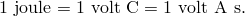

Sometimes the standard units are not convenient to work with. For example, Young's modulus is frequently specified in terms of megapascals (MPa) (or, equivalently, N/mm2), where 1 pascal = 1 N/m2. In this case the fundamental units could be tonnes (1 tonne = 1000 kilograms), millimeters, and seconds.

#### American or English units

American or English units can cause confusion since the naming conventions are not as clear as in the SI system. For example, 1 pound force (lbf) will give 1 pound mass (lbm) an acceleration of *g* ft/sec2, where *g* is the value of acceleration due to gravity. If pounds force, feet (ft), and seconds are taken as fundamental units, the derived unit of mass is lbf sec2/ft. Since density is commonly given in handbooks as lbm/in3, it must be converted to lbf sec2/ft4 by

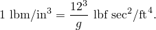

Frequently it is not made clear in handbooks whether  stands for lbm or lbf. You need to check that the values used make up a consistent set of units.

Two other units that cause difficulty are the slug, defined as the mass that will be accelerated at 1 ft/sec2 by 1 lbf, and the poundal, defined as the force required to accelerate 1 lbm at 1 ft/sec2. Useful conversions are 

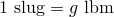

and 


where *g* is the magnitude of the acceleration due to gravity in ft/sec2.

#### Symbols used in Abaqus for units

Units are indicated for the value to be given on load and flux types as follows:

| Dimension | Indicator | Example (S.I. units) |
| --- | --- | --- |
| length | L | meter |
| mass | M | kilogram |
| time | T | second |
| temperature |  | degree Celsius |
| electric current | A | ampere |
| force | F | newton |
| energy | J | joule |
| electric charge | C | coulomb |
| electric potential |  | volt |
| mass concentration | P | Parts per million |

### Time

Abaqus has two measures of time—step time and total time. Except for certain linear perturbation procedures, step time is measured from the beginning of each step. Total time starts at zero and is the total accumulated time over all general analysis steps (including restart steps; see ["Restarting an analysis," Section 9.1.1](pt04ch09s01aus53.md)). Total time does not accumulate during linear perturbation steps.

### Local tangent directions on surfaces in space

Local tangent directions are needed on surfaces in space; for example, to provide a convention for describing components of slip on an element-based contact surface or components of stress and strain in a shell. The convention used in Abaqus for such directions is as follows.

The default local 1-direction is the projection of the global *x*-axis onto the surface. If the global *x*-axis is within 0.1 of being normal to the surface, the local 1-direction is the projection of the global *z*-axis onto the surface. The local 2-direction is then at right angles to the local 1-direction, so that the local 1-direction, local 2-direction, and the positive normal to the surface form a right-handed set (see [Figure 1.2.2--1](pt01ch01s02aus02.md#iconventions-local-surfaces)). The positive normal direction is defined in an element by the right-hand rotation rule going around the nodes of the element. The local surface directions can be redefined; see ["Orientations," Section 2.2.5](pt01ch02s02aus15.md).

**Figure 1.2.2–1** Default local surface directions.


The local 1- and 2-directions become local 2- and 3-directions, respectively, when considering gasket elements or the local systems associated with integrated output sections (["Integrated output section definition," Section 2.5.1](pt01ch02s05aus23.md)) or user-defined sections (["Section output from Abaqus/Standard" in "Output to the data and results files," Section 4.1.2](pt02ch04s01aus39.md#usb-out-oprintfile-section)).

For “line”-type surfaces defined on beam, pipe, or truss elements in space, the default local 1-direction and 2-direction are tangential and transverse to the elements. In this case the local surface directions can also be redefined as described in ["Orientations," Section 2.2.5](pt01ch02s02aus15.md).

#### Rotation of the local directions

For geometrically linear analysis, stress and strain components are given by default in the material directions in the reference (initial) configuration.

For geometrically nonlinear analysis, small-strain shell elements in Abaqus/Standard (S4R5, S8R, S8R5, S8RT, S9R5, STRI3, and STRI65) use a total Lagrangian strain, and the stress and strain components are given relative to material directions in the reference configuration. Gasket elements are small-strain small-displacement elements, and the components are output by default in the behavior directions in the reference configuration.

For finite-membrane-strain elements (all membrane elements, S3/S3R, S4, S4R, SAX, and SAXA elements) and for small-strain shell elements in Abaqus/Explicit, the material directions rotate with the average rigid body motion of the surface to form the material directions in the current configuration. Stress and strain components in these elements are given relative to these material directions in the current configuration.

For a more thorough discussion of the definition of the rotated coordinate directions in membrane elements; S3/S3R, S4, and S4R elements; S3RS, S4RS, and S4RSW elements; and SAXA elements, see: 
- ["Membrane elements," Section 3.4.1 of the Abaqus Theory Guide](../stm/stm-link.md#stm-elm-membranes),
- ["Finite-strain shell element formulation," Section 3.6.5 of the Abaqus Theory Guide](../stm/stm-link.md#stm-elm-finitestrainshells),
- ["Small-strain shell elements in Abaqus/Explicit," Section 3.6.6 of the Abaqus Theory Guide](../stm/stm-link.md#stm-elm-smallstrainshells), and
- ["Axisymmetric shell element allowing asymmetric loading," Section 3.6.7 of the Abaqus Theory Guide](../stm/stm-link.md#stm-elm-axiasymmshells).

You can determine whether the local system associated with a user-defined section is fixed or rotates with the average rigid body motion; see ["Section output from Abaqus/Standard" in "Output to the data and results files," Section 4.1.2](pt02ch04s01aus39.md#usb-out-oprintfile-section), for details.

You can determine whether the local system associated with an integrated output section is fixed, translates with average rigid body motion, or translates and rotates with the average rigid body motion; see ["Integrated output section definition," Section 2.5.1](pt01ch02s05aus23.md), for details.

See ["Contact formulations in Abaqus/Standard," Section 38.1.1](pt09ch38s01aus177.md), for information on how the local tangent directions evolve during an Abaqus/Standard contact analysis.

### Convention used for stress and strain components

When defining material properties, the convention used for stress and strain components in Abaqus is that they are ordered:

|  | Direct stress in the 1-direction |
| --- | --- |
|  | Direct stress in the 2-direction |
|  | Direct stress in the 3-direction |
|  | Shear stress in the 1--2 plane |
|  | Shear stress in the 1--3 plane |
| 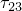 | Shear stress in the 2--3 plane |

For example, a fully anisotropic, linear elasticity matrix is 

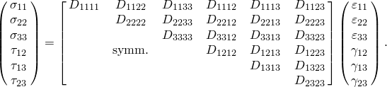

The 1-, 2-, and 3-directions depend on the element type chosen. For solid elements the defaults for these directions are the global spatial directions. For shell and membrane elements the defaults for the 1- and 2-directions are local directions in the surface of the shell or membrane, as defined in [Part VI, "Elements](pt06.md).” In both cases the 1-, 2-, and 3-directions can be changed as described in ["Orientations," Section 2.2.5](pt01ch02s02aus15.md).

For geometrically nonlinear analysis with solid elements, the default (global) directions do not rotate with the material. However, user-defined orientations do rotate with the material.

Abaqus/Explicit stores the stress and strain components internally in a different order: , , , , , . For geometrically nonlinear analysis, the internally stored components rotate with the material, regardless of whether or not a user-defined orientation is used. This distinction is important when a user subroutine (such as [`VUMAT`](../sub/sub-link.md#sub-xsl-vumat)) is used.

#### Nonisotropic material behavior

When nonisotropic material behavior is defined in continuum elements, a user-defined orientation is necessary for the anisotropic behavior to be associated with material directions. See ["State storage," Section 1.5.4 of the Abaqus Theory Guide](../stm/stm-link.md#stm-int-statestorage), for a description of how material directions rotate.

#### Zero-valued stress components

Stress components that are always zero are omitted from storage. For example, in plane stress Abaqus stores only the two direct components and one shear component of stress and strain in the plane where the stress values are nonzero.

#### Shear strains

Abaqus always reports shear strain as engineering shear strain, : 

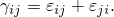

### Stress and strain measures

The stress measure used in Abaqus is Cauchy or “true” stress, which corresponds to the force per current area. See ["Stress measures," Section 1.5.2 of the Abaqus Theory Guide](../stm/stm-link.md#stm-int-stressmeas), and ["Stress rates," Section 1.5.3 of the Abaqus Theory Guide](../stm/stm-link.md#stm-int-stressrates), for more details on stress measures.

For geometrically nonlinear analysis, a large number of different strain measures exist. Unlike “true” stress, there is no clearly preferred “true” strain. For the same physical deformation different strain measures will report different values in large-strain analysis. The optimal choice of strain measure depends on analysis type, material behavior, and (to some degree) personal preference. See ["Strain measures," Section 1.4.2 of the Abaqus Theory Guide](../stm/stm-link.md#stm-int-strainmeas), for more details on strain measures.

By default, the strain output in Abaqus/Standard is the “integrated” total strain (output variable E). For large-strain shells, membranes, and solid elements in Abaqus/Standard two other measures of total strain can be requested: logarithmic strain (output variable LE) and nominal strain (output variable NE).

Logarithmic strain (output variable LE) is the default strain output in Abaqus/Explicit; nominal strain (output variable NE) can be requested as well. The “integrated” total strain is not available in Abaqus/Explicit.

#### Total (integrated) strain

The default “integrated” strain measure, E, output by Abaqus/Standard to the data (`.dat`) and results (`.fil`) files for all elements that can handle finite strain is obtained by integrating the strain rate numerically in a material frame of reference:


where 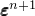 and 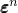 are the total strains at increments  and *n*, respectively;  is the incremental rotation tensor; and  is the total strain increment from increment *n* to . For elements that use a corotational coordinate system (finite-strain shells, membranes, and solid elements with user-defined orientations), the above equation simplifies to 


The strain increment is obtained by integration of the rate of deformation  over the time increment:


This strain measure is appropriate for elastic-(visco)plastic or elastic-creeping materials, because the plastic strains and creep strains are obtained by the same integration procedure. In such materials the elastic strains are small (because the yield stress is small compared to the elastic modulus), and the total strains can be compared directly with the plastic strains and creep strains.

If the principal directions of straining rotate with respect to the material axes, the resulting strain measure cannot be related to the total deformation, regardless whether a spatial or corotational coordinate system is used. If the principal directions remain fixed in the material axes, the strain is the integration of the rate of deformation, 

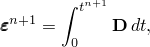

which is equivalent to the logarithmic strain discussed later.

#### Green's strain

For small-strain shells and beams in Abaqus/Standard, the default strain measure, E, is Green's strain:


where  is the deformation gradient and  is the identity tensor. This strain measure is appropriate for the small-strain, large-rotation approximation used in these elements. The components of 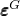 represent strain along directions in the original configuration. The small-strain shells and beams should not be used in finite-strain analysis with either elastic-plastic or hyperelastic material behavior, since incorrect analysis results may be obtained or program failure may occur.

#### Nominal strain

The nominal strain, NE, is 


where  is the left stretch tensor,  are the principal stretches, and 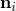 are the principal stretch directions in the current configuration. The principal values of nominal strain are, therefore, the ratios of change in length to length in the reference configuration in the principal directions, thus giving a direct measure of deformation.

#### Logarithmic strain

The logarithmic strain, LE, is 

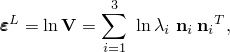

where the variables are as defined earlier for nominal strain. This is also the strain output for hyperelastic materials. For a hyper-viscoleastic material, the logarithmic elastic strain EE is computed from the current (relaxed) stress state, and the viscoelastic strain CE is computed as LE EE.

### Stress invariants

Many of the constitutive models in Abaqus are formulated in terms of stress invariants. These invariants are defined as the equivalent pressure stress, 


the Mises equivalent stress, 


and the third invariant of deviatoric stress, 


where  is the deviatoric stress, defined as 

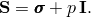

### Finite rotations

The following convention is used for finite rotations in space: Define , ,  as “rotations” about the global *X*, *Y*, and *Z*-axes (that is, degrees of freedom 4, 5, and 6 at a node). Then define 

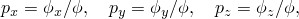

where 

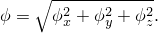

The direction 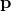 is then the axis of rotation, and  is the angular rotation (in radians) about the axis  according to the right-hand rule (see [Figure 1.2.2--2](pt01ch01s02aus02.md#iconvention-finite-rot)). 

**Figure 1.2.2–2** Definition of finite rotation.

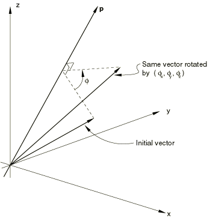

The value of  is not uniquely determined. In large-rotation problems where the overall rotation exceeds , any multiple of  can be added or subtracted, which may lead to discontinuous output values for the rotation components. If rotations larger than  about one axis occur in the positive (negative) direction in Abaqus/Standard, the rotation output varies discontinuously between *0* and  (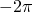). In Abaqus/Explicit the rotation output varies in all cases between  and .

This convention provides straightforward input of kinematic boundary conditions and moments in most cases and simple interpretation of the output. The rotations output by Abaqus represent a single rotation from the reference configuration to the current configuration about a fixed axis. The output does not follow the history of rotation at a node. In addition, this convention reduces to the usual convention for small rotations, even in the case of small rotations superposed on an initial finite rotation (such as might be considered in the study of small vibrations about a predeformed state).

#### Compound rotations

Because finite rotations are not additive, the way they must be specified is a bit different from the way other boundary conditions are specified: the increment in rotation specified over a step must be the rotation needed to rotate the node from the configuration at the beginning of the step to that desired at the end of the step. It is not enough to rotate the node over this step to a total rotation vector that would have taken the node into its final configuration if applied on the node in some other initial reference configuration. If an increment of rotation 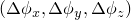 is needed to rotate from the rotation boundary condition 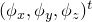 at the beginning of the step (and at the end of the previous step) to its final position at the end of the step, the boundary condition must be specified such that the rotation vector is  at the end of the step. If the direction of the rotation vector is constant, this method of specifying rotation boundary conditions and the total rotation vector will be the same.

##### Example

As an example of how to specify compound finite rotations and to interpret finite rotation output, consider the following example of the rotation of a beam.

The beam initially lies along the *x*-axis. We want to perform the compound rotation, where (Step 1) the beam is rotated by 60 about the *z*-axis, followed by (Step 2) a 90 spin of the beam about itself, followed by (Step 3) a 90 rotation of the beam about an axis perpendicular to the beam in the *x*–*y* plane, such that the beam finishes on the *z*-axis.

This compound rotation is achieved in three steps with applied rotation vectors , 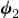, and 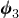, where 


For this example , , and . Here  represents the magnitude of each finite rotation about the (unit length) rotation axis. The rotation vectors above are applied in each of the three steps on the configuration at the beginning of that step. It is most straightforward to prescribe these rotations with velocity-type boundary conditions. For convenience, the default amplitude reference in Abaqus for a velocity-type boundary condition is a constant value of one.

A typical Abaqus step definition for this example, where node 1 is pinned at the origin and the rotation is applied to node 2, is as follows:

```
[*STEP](../key/key-link.md#usb-kws-hstep), NLGEOM
Step 1: Rotate 60 degrees about the z-axis 
[*STATIC](../key/key-link.md#usb-kws-hstatic)
[*BOUNDARY](../key/key-link.md#usb-kws-hboundary), TYPE=VELOCITY
 2, 4, 5 
 2, 6, 6, 1.047198 
[*END STEP](../key/key-link.md#usb-kws-hendstep)
** 
[*STEP](../key/key-link.md#usb-kws-hstep), NLGEOM
Step 2: Rotate 90 degrees about the beam axis 
[*STATIC](../key/key-link.md#usb-kws-hstatic)
[*BOUNDARY](../key/key-link.md#usb-kws-hboundary), TYPE=VELOCITY
 2, 4, 4, 0.785398 
 2, 5, 5, 1.36035 
 2, 6, 6 
[*END STEP](../key/key-link.md#usb-kws-hendstep)
** 
[*STEP](../key/key-link.md#usb-kws-hstep), NLGEOM
Step 3: Rotate beam onto z-axis 
[*STATIC](../key/key-link.md#usb-kws-hstatic)
[*BOUNDARY](../key/key-link.md#usb-kws-hboundary), TYPE=VELOCITY
 2, 4, 4, 1.36035 
 2, 5, 5, -0.785398 
 2, 6, 6 
[*END STEP](../key/key-link.md#usb-kws-hendstep)
```

The above method for applying finite-rotation boundary conditions (using a velocity-type boundary condition with the default constant amplitude definition) is strongly recommended. However, if the rotation boundary conditions are applied as displacement-type boundary conditions, the input syntax would change.

The Abaqus/Standard convention for boundary condition specification within a step is to specify the total or final boundary state. In such a case the specified boundary conditions from all of the previous steps must be added to the incremental rotation vector components. The Abaqus/Standard step definitions from above would change to:

```
[*STEP](../key/key-link.md#usb-kws-hstep), NLGEOM 
Step 1: Rotate 60 degrees about the z-axis 
[*STATIC](../key/key-link.md#usb-kws-hstatic)
[*BOUNDARY](../key/key-link.md#usb-kws-hboundary)
 2, 4, 5 
 2, 6, 6, 1.047198 
[*END STEP](../key/key-link.md#usb-kws-hendstep)
** 
[*STEP](../key/key-link.md#usb-kws-hstep), NLGEOM
Step 2: Rotate 90 degrees about the beam axis 
[*STATIC](../key/key-link.md#usb-kws-hstatic)
[*BOUNDARY](../key/key-link.md#usb-kws-hboundary)
 2, 4, 4, 0.785398 
 2, 5, 5, 1.36035 
 2, 6, 6, 1.047198 
[*END STEP](../key/key-link.md#usb-kws-hendstep)
** 
[*STEP](../key/key-link.md#usb-kws-hstep), NLGEOM
Step 3: Rotate beam onto z-axis 
[*STATIC](../key/key-link.md#usb-kws-hstatic)
[*BOUNDARY](../key/key-link.md#usb-kws-hboundary)
 2, 4, 4, 2.145748 
 2, 5, 5, 0.574952 
 2, 6, 6, 1.047198 
[*END STEP](../key/key-link.md#usb-kws-hendstep)
```
The boundary conditions in Steps 2 and 3 are the sum of the incremental rotation components plus the rotation boundary conditions specified in the previous steps.

In Abaqus/Explicit references to amplitude definitions should be used such that there are no jumps in displacement across the steps. It is often convenient to use amplitude definitions given in terms of total time for this purpose. The displacement boundary conditions will be applied incrementally based on the increment in the value of amplitude curve over the time increment. Therefore, any sudden jumps in displacement at the beginning of a step introduced either without the amplitude curves or with two amplitude curves will be ignored (see ["Boundary conditions in Abaqus/Standard and Abaqus/Explicit," Section 34.3.1](pt07ch34s03aus118.md)). The Abaqus/Explicit step definitions for the above example would change to:

```
[*AMPLITUDE](../key/key-link.md#usb-kws-mamplitude), TIME=TOTAL TIME, NAME=RAMPUR1
 0., 0., 0.001, 0., 0.002, 0.785398, 0.003, 2.145748
[*AMPLITUDE](../key/key-link.md#usb-kws-mamplitude), TIME=TOTAL TIME, NAME=RAMPUR2
 0., 0., 0.001, 0., 0.002, 1.36035, 0.003, 0.574952
[*AMPLITUDE](../key/key-link.md#usb-kws-mamplitude), TIME=TOTAL TIME, NAME=RAMPUR3
 0., 0., 0.001, 1.047198, 0.002, 1.047198, 0.003, 1.047198
[*STEP](../key/key-link.md#usb-kws-hstep)
Step 1: Rotate 60 degrees about the z-axis
[*DYNAMIC](../key/key-link.md#usb-kws-hdynamic), EXPLICIT
 , 0.001
[*BOUNDARY](../key/key-link.md#usb-kws-hboundary), AMP=RAMPUR1
 2, 4, 4, 1.0
[*BOUNDARY](../key/key-link.md#usb-kws-hboundary), AMP=RAMPUR2
 2, 5, 5, 1.0
[*BOUNDARY](../key/key-link.md#usb-kws-hboundary), AMP=RAMPUR3
 2, 6, 6, 1.0
[*END STEP](../key/key-link.md#usb-kws-hendstep)
**
[*STEP](../key/key-link.md#usb-kws-hstep)
Step 2: Rotate 90 degrees about the beam axis
[*DYNAMIC](../key/key-link.md#usb-kws-hdynamic), EXPLICIT
 , 0.001
[*END STEP](../key/key-link.md#usb-kws-hendstep)
**
[*STEP](../key/key-link.md#usb-kws-hstep)
Step 3: Rotate beam onto z-axis
[*DYNAMIC](../key/key-link.md#usb-kws-hdynamic), EXPLICIT
 , 0.001
[*END STEP](../key/key-link.md#usb-kws-hendstep)
```
The boundary conditions in Steps 2 and 3 are the sum of the incremental rotation components plus the rotation boundary conditions specified in the previous steps.

The Abaqus output of the rotation field at the end of Step 3 is 

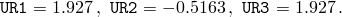

We see that none of the individual components of the specified boundary conditions appears in the final rotation output. The final rotation output represents the rotation vector required to obtain the final orientation in a single step.

Suppose that in Step 3 of the previous example we want to apply the rotation vector  at node 1 instead of at node 2. If the rotation is applied incrementally, the Abaqus/Standard step definition is as follows: 

```
[*STEP](../key/key-link.md#usb-kws-hstep), NLGEOM 
Step 3: Rotate beam onto z-axis 
[*STATIC](../key/key-link.md#usb-kws-hstatic)
[*BOUNDARY](../key/key-link.md#usb-kws-hboundary), TYPE=VELOCITY, OP=NEW
 1, 1, 3 
 1, 4, 4, 1.36035 
 1, 5, 5, -0.785398 
 1, 6, 6 
[*END STEP](../key/key-link.md#usb-kws-hendstep)
```
and the Abaqus/Explicit step definition is similar. It is necessary to remove the rotation boundary conditions that are in effect at node 2.

As mentioned previously, using velocity-type boundary conditions is the preferred method for applying finite-rotation boundary conditions. If the rotation boundary condition is to be applied as a displacement-type boundary condition, we must first retrieve the rotation field at node 1 at the end of Step 2. The Abaqus output of this rotation field is 


These rotation vector components must then be added to the incremental rotation vector components we wish to prescribe in Step 3. The Abaqus/Standard step definition would change to 
```
[*STEP](../key/key-link.md#usb-kws-hstep)
Step 3: Rotate beam onto z-axis 
[*STATIC](../key/key-link.md#usb-kws-hstatic)
[*BOUNDARY](../key/key-link.md#usb-kws-hboundary), OP=NEW
 1, 1, 3 
 1, 4, 4, 2.772 
 1, 5, 5, 0.0301 
 1, 6, 6, 0.8155 
[*END STEP](../key/key-link.md#usb-kws-hendstep)
```
and the Abaqus/Explicit step definition would change to:
```
[*STEP](../key/key-link.md#usb-kws-hstep)
Step 3: Rotate beam onto z-axis
[*DYNAMIC](../key/key-link.md#usb-kws-hdynamic), EXPLICIT
 , 0.001
[*AMPLITUDE](../key/key-link.md#usb-kws-mamplitude), TIME=STEP TIME, NAME=NODE1UR1
 0., 1.412, 0.001, 2.772
[*AMPLITUDE](../key/key-link.md#usb-kws-mamplitude), TIME=STEP TIME, NAME=NODE1UR2
 0., 0.8155, 0.001, 0.0301
[*AMPLITUDE](../key/key-link.md#usb-kws-mamplitude), TIME=STEP TIME, NAME=NODE1UR3
 0., 0.8155, 0.001, 0.8155
[*BOUNDARY](../key/key-link.md#usb-kws-hboundary), OP=NEW
 1, 1, 3
[*BOUNDARY](../key/key-link.md#usb-kws-hboundary), OP=NEW, AMP=NODE1UR1
 1, 4, 4, 1.
[*BOUNDARY](../key/key-link.md#usb-kws-hboundary), OP=NEW, AMP=NODE1UR2
 1, 5, 5, 1.
[*BOUNDARY](../key/key-link.md#usb-kws-hboundary), OP=NEW, AMP=NODE1UR3
 1, 6, 6, 1.
[*END STEP](../key/key-link.md#usb-kws-hendstep)
```
The boundary conditions are again specified in the Abaqus/Explicit input using amplitude curves to avoid any sudden jump in their values at the beginning of the step. As stated above and in ["Boundary conditions in Abaqus/Standard and Abaqus/Explicit," Section 34.3.1](pt07ch34s03aus118.md), any jumps in the displacement values will be ignored and the boundary will be maintained at the previous values.

As this last procedure clearly demonstrates, it is simpler to apply finite-rotation boundary conditions as velocity-type boundary conditions rather than as displacement-type boundary conditions. The recommended method of specifying finite-rotation boundary conditions is also described in ["Boundary conditions in Abaqus/Standard and Abaqus/Explicit," Section 34.3.1](pt07ch34s03aus118.md). For further discussion of how finite rotations are accumulated, see ["Rotation variables," Section 1.3.1 of the Abaqus Theory Guide](../stm/stm-link.md#stm-int-rotationvars).


