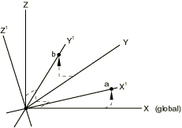
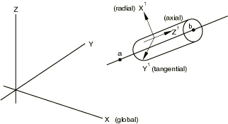

# 2.1.5 Transformed coordinate systems


**Products: **Abaqus/Standard  Abaqus/Explicit  Abaqus/CAE  

##### **References**

- ["Prescribed conditions: overview," Section 34.1.1](pt07ch34s01abo31.md)
- [*TRANSFORM](../key/key-link.md#usb-kws-mtransform)
- ["Transforming results into a new coordinate system," Section 42.6.8 of the Abaqus/CAE User's Guide](../usi/usi-link.md#usv-res-transform)
- ["An overview of the methods for creating a datum coordinate system," Section 62.5.4 of the Abaqus/CAE User's Guide](../usi/usi-link.md#usi-dtm-tool-csys)

### Overview

A nodal transformation is used to define a local coordinate system for:
- the definition of concentrated forces and moments;
- the definition of displacement and rotation boundary conditions;
- the definition of linear constraint equations; and
- the output of vector-valued quantities.

A nodal transformation cannot be used to specify a local coordinate system for defining:- nodal coordinates---see ["Specifying a local coordinate system in which to define nodes" in "Node definition," Section 2.1.1](pt01ch02s01aus05.md#usb-int-inode-system-option), or ["Specifying a local coordinate system for the nodal coordinates" in "Node definition," Section 2.1.1](pt01ch02s01aus05.md#usb-int-inode-define-csys), instead; or
- material properties or rebars---see ["Orientations," Section 2.2.5](pt01ch02s02aus15.md), instead.

### Defining a local coordinate system

Normally displacement and rotation components are associated with the global, rectangular Cartesian axis system. When a transformed coordinate system is associated with a node, all input data for concentrated forces and moments and for displacement and rotation boundary conditions at the node are given in the local system. The following transformations are available:
- Rectangular Cartesian
- Cylindrical
- Spherical

The coordinate transformation defined at a node must be consistent with the degrees of freedom that exist at the node. For example, a transformed coordinate system should not be defined at a node that is connected only to a SPRING1 or SPRING2 element, since these elements have only one active degree of freedom per node.

| **Input File Usage: ** | You must identify the node set for which the local transformed system is defined. |
| --- | --- |
|  | ``` [*TRANSFORM](../key/key-link.md#usb-kws-mtransform), NSET=*name* ``` |

| **Abaqus/CAE Usage: ** | In Abaqus/CAE you define a local coordinate system independent of its use and then refer to it when you apply a load or boundary condition at a node. |
| --- | --- |
|  | Any module: ****Tools****Datum****: **Type**: **CSYS** Interaction module: load or boundary condition editor: **CSYS: Edit**: select local coordinate system |

#### Defining a local coordinate system in a model that contains an assembly of part instances

In a model defined in terms of an assembly of part instances, you can define a nodal transformation at the part, part instance, or assembly level. A nodal transformation defined at the part or part instance level will be rotated according to the positioning data given for each instance of that part (or for the part instance). See ["Defining an assembly," Section 2.10.1](pt01ch02s10aus28.md). Multiple transformation definitions are not allowed at a node, even if one of them is at the part level and another is at the assembly level.

#### Large-displacement analysis

The transformed coordinate system is always a set of fixed Cartesian axes at a node (even for cylindrical or spherical transforms). These transformed directions are fixed in space; the directions do not rotate as the node moves. Therefore, even in large-displacement analysis, the displacement components must always be given with respect to these fixed directions in space.

#### Defining a rectangular Cartesian coordinate transformation

In a rectangular Cartesian transformation the transformed directions are parallel at all nodes of the set. The coordinates of two points must be given, as shown in [Figure 2.1.5--1](pt01ch02s01aus09.md#ktransform-cartesian).

**Figure 2.1.5–1** Cartesian transformation.



The first point, *a*, must be on a line through the global origin; this point defines the transformed -direction. The second point, *b*, must be in the plane containing the global origin and the transformed - and -directions. This second point should be on or near the positive -axis.

| **Input File Usage: ** | ``` [*TRANSFORM](../key/key-link.md#usb-kws-mtransform), NSET=*name*, TYPE=R (default) ``` |
| --- | --- |

| **Abaqus/CAE Usage: ** | Any module: ****Tools****Datum****: **Type**: **CSYS**: select any method, and click **OK**: **Rectangular** |
| --- | --- |

#### Defining a cylindrical coordinate transformation

The radial, tangential, and axial directions must be defined based on the original coordinates of each node in the node set for which the transformation is invoked. The global () coordinates of the two points defining the axis of the cylindrical system (points *a* and *b* as shown in [Figure 2.1.5--2](pt01ch02s01aus09.md#ktransform-cylindrical)) must be given.

**Figure 2.1.5–2** Cylindrical transformation.



The origin of the local coordinate system is at the node of interest. The local -axis is defined by a line through the node, perpendicular to the line through points *a* and *b*. The local -axis is defined by a line that is parallel to the line through points *a* and *b*. The local -axis forms a right-handed coordinate system with  and .

A cylindrical coordinate system cannot be defined for a node that lies along the line joining points *a* and *b*.

| **Input File Usage: ** | ``` [*TRANSFORM](../key/key-link.md#usb-kws-mtransform), NSET=*name*, TYPE=C ``` |
| --- | --- |

| **Abaqus/CAE Usage: ** | Any module: ****Tools****Datum****: **Type**: **CSYS**: select any method, and click **OK**: **Cylindrical** |
| --- | --- |

#### Defining a spherical coordinate transformation

The radial, circumferential, and meridional directions must be defined based on the original coordinates of each node in the node set for which the transformation is invoked. The global () coordinates of the center of the spherical system, *a*, and of a point on the polar axis, *b*, must be given as shown in [Figure 2.1.5--3](pt01ch02s01aus09.md#ktransform-spherical).

**Figure 2.1.5–3** Spherical transformation.


The origin of the local coordinate system is at the node of interest. The local -axis is defined by a line through the node and point *a*. The local -axis lies in a plane containing the polar axis (the line between points *a* and *b*) and is perpendicular to the local -axis. The local -axis forms a right-handed coordinate system with  and .

A spherical coordinate system cannot be defined for a node that lies along the line joining points *a* and *b*.

| **Input File Usage: ** | ``` [*TRANSFORM](../key/key-link.md#usb-kws-mtransform), NSET=*name*, TYPE=S ``` |
| --- | --- |

| **Abaqus/CAE Usage: ** | Any module: ****Tools****Datum****: **Type**: **CSYS**: select any method, and click **OK**: **Spherical** |
| --- | --- |

### Output at a node associated with a coordinate transformation

Printed and file output of vector-valued quantities from Abaqus/Standard at transformed nodes can be in the local or global system (see ["Specifying the directions for nodal output" in "Output to the data and results files," Section 4.1.2](pt02ch04s01aus39.md#usb-out-oprintfile-node-directions)). By default, the values are written to the data file in the local system, whereas the values are written to the results file in the global system (since this is more convenient for postprocessing). Consequently, reaction forces printed using the default will not appear to equilibrate loads applied in the global system. However, these reaction forces and loads should equilibrate if you output them to the data file in the global system.

File output from Abaqus/Explicit is always in the global system.

Output database output of field vector-valued quantities at transformed nodes is in the global system. The local transformations are also written to the output database. You can apply these transformations to the results in the Visualization module of Abaqus/CAE to view the vector components in the transformed systems.

Output database output of history vector-valued quantities at transformed nodes can be in the local or global system (see ["Output to the output database," Section 4.1.3](pt02ch04s01aus40.md)). By default, the values are written in the global system (since this is more convenient for postprocessing). 


