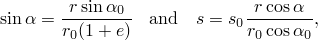
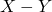
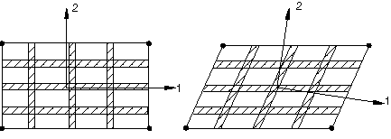
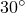

# 2.2.3 Defining reinforcement


**Products: **Abaqus/Standard  Abaqus/Explicit  Abaqus/CAE  

##### **References**

- [*EMBEDDED ELEMENT](../key/key-link.md#usb-kws-membeddedelement)
- [*MEMBRANE SECTION](../key/key-link.md#usb-kws-mmembranesection)
- [*PRESTRESS HOLD](../key/key-link.md#usb-kws-hprestresshold)
- [*REBAR](../key/key-link.md#usb-kws-mrebar)
- [*REBAR LAYER](../key/key-link.md#usb-kws-mrebarlayer)
- [*SHELL SECTION](../key/key-link.md#usb-kws-mshellsection)
- [*SURFACE SECTION](../key/key-link.md#usb-kws-msurfacesection)
- ["Defining rebar layers," Section 12.13.19 of the Abaqus/CAE User's Guide](../usi/usi-link.md#usi-prp-section-rebar)

### Overview

Rebar: 
- are used to define layers of uniaxial reinforcement in membrane, shell, and surface elements (such layers are treated as a smeared layer with a constant thickness equal to the area of each reinforcing bar divided by the reinforcing bar spacing);
- can be used to add layers of reinforcement in a solid by embedding reinforced surface or membrane elements in the "host" solid elements as described in ["Embedded elements," Section 35.4.1](pt08ch35s04aus136.md);
- can be used to add additional stiffness, volume, and mass to the model;
- can be used to add discrete axial reinforcement in beam elements in Abaqus/Standard;
- can be used in coupled temperature-displacement analysis but do not contribute to the thermal conductivity and specific heat;
- can be used in coupled thermal-electrical-structural analysis but do not contribute to the electrical conductivity, thermal conductivity and specific heat;
- cannot be used in heat transfer or mass diffusion analysis; and
- have material properties that are distinct from those of the underlying or host element.
- do not include the mass or volume of the underlying elements.

### Defining a rebar layer

You can specify one or multiple layers of reinforcement in membrane, shell, or surface elements. For each layer you specify the rebar properties including the rebar layer name; the cross-sectional area of each rebar; the rebar spacing in the plane of the membrane, shell, or surface element; the position of the rebars in the thickness direction (for shell elements only), measured from the midsurface of the shell (positive in the direction of the positive normal to the shell); the rebar material name; the initial angular orientation, in degrees, measured relative to the local 1-direction; and the isoparametric direction from which the rebar angle output will be measured.

You can model rebar layers in solid (continuum) elements by embedding a set of surface or membrane elements with rebar layers defined as discussed above in a set of host continuum elements.

| **Input File Usage: ** | Use the following options to define one or more rebar layers in membrane elements: |
| --- | --- |
|  | ``` [*MEMBRANE SECTION](../key/key-link.md#usb-kws-mmembranesection), ELSET=*memb_set_name* [*REBAR LAYER](../key/key-link.md#usb-kws-mrebarlayer) ``` Use the following options to define one or more rebar layers in shell elements: ``` [*SHELL SECTION](../key/key-link.md#usb-kws-mshellsection), ELSET=*shell_set_name* [*REBAR LAYER](../key/key-link.md#usb-kws-mrebarlayer) ``` Use the following options to define one or more rebar layers in surface elements: ``` [*SURFACE SECTION](../key/key-link.md#usb-kws-msurfacesection), ELSET=*surf_set_name* [*REBAR LAYER](../key/key-link.md#usb-kws-mrebarlayer) ``` Use the following option to model rebar layers in solid (continuum) elements: ``` [*EMBEDDED ELEMENT](../key/key-link.md#usb-kws-membeddedelement), HOST ELSET=*solid_set_name* *memb_set_name* or *surf_set_name* ``` |

| **Abaqus/CAE Usage: ** | Property module: membrane, shell, or surface section editor: **Rebar Layers** |
| --- | --- |
|  | Interaction module: **Create Constraint**: **Embedded region** |

#### Assigning a name to the rebar layer

You must assign each layer of rebar in a particular element or element set a separate name. This name can be used in defining rebar prestress and output requests.

| **Input File Usage: ** | ``` [*REBAR LAYER](../key/key-link.md#usb-kws-mrebarlayer) *rebar layer name* ``` |
| --- | --- |

| **Abaqus/CAE Usage: ** | Property module: membrane, shell, or surface section editor: **Rebar Layers**: **Layer Name** *rebar layer name* |
| --- | --- |

#### Specifying rebar geometry

The rebar geometry is always defined with respect to a local coordinate system. Defining an appropriate local system is described in the next section. The rebar geometry can be constant, vary as a function of radial position in a cylindrical coordinate system, or vary according to the tire “lift” equation. In each case you must specify the spacing, *s*, and the area, *A*, which are used to determine the thickness of the equivalent rebar layer, , as well as the angular orientation, , of the rebar with respect to this local system. 

In addition, for shell elements you must specify the position of the rebars in the shell thickness direction measured from the midsurface of the shell (positive in the direction of the positive normal to the shell). If the shell's thickness is defined by nodal thicknesses (["Nodal thicknesses," Section 2.1.3](pt01ch02s01aus07.md)), this distance will be scaled by the ratio of the thickness defined by the nodal thickness to the thickness defined by the section definition. If the shell's thickness is defined with a distribution (["Distribution definition," Section 2.8.1](pt01ch02s08aus26.md)), this distance is scaled by the ratio of the element thickness defined by the distribution to the default thickness.

##### Defining rebar with constant spacing

You can specify the geometry to be constant in the local rebar coordinate system. In this case the spacing, *s*, is specified as a length measure.

| **Input File Usage: ** | ``` [*REBAR LAYER](../key/key-link.md#usb-kws-mrebarlayer), GEOMETRY=CONSTANT ``` |
| --- | --- |

| **Abaqus/CAE Usage: ** | Property module: membrane, shell, or surface section editor: **Rebar Layers**: **Rebar geometry: Constant** |
| --- | --- |

##### Defining rebar spacing as a function of radial position

You can specify the spacing, *s*, in terms of angular spacing in degrees as shown in [Figure 2.2.3--1](pt01ch02s02aus13.md#erebarlayer-radial-axi-shell). 

**Figure 2.2.3–1** Example of radial rebars in axisymmetric shell elements.


Angular spacing values can also be used for non-radial rebars as well as for rebars having nonzero orientation angles from the meridional plane. In these cases the orientation angles of the rebars do not change. The angular spacing option is used only to compute the spacing between rebars in units of length by multiplying the angular spacing by the radial distance of the concerned point on the rebar from the axis of axisymmetry. A local cylindrical coordinate system must be defined for the rebar if the rebar is associated with three-dimensional elements.

| **Input File Usage: ** | ``` [*REBAR LAYER](../key/key-link.md#usb-kws-mrebarlayer), GEOMETRY=ANGULAR ``` |
| --- | --- |

| **Abaqus/CAE Usage: ** | Property module: membrane, shell, or surface section editor: **Rebar Layers**: **Rebar geometry: Angular** |
| --- | --- |

##### Defining rebar using the tire "lift" equation

Structural tire analysis is often performed using the cured tire geometry as the reference configuration for the finite element model. However, the cord geometry is more conveniently specified with respect to the “green,” or uncured, tire configuration. The tire lift equation provides mapping from the uncured geometry to the cured geometry (see [Figure 2.2.3--2](pt01ch02s02aus13.md#erebarlayer-liftequation)). 

**Figure 2.2.3–2** Mapping between uncured and cured tire rebar geometry.


You can specify the spacing and orientation of the rebar cords with respect to the uncured configuration and let Abaqus map these properties to the reference configuration of the cured tire. Using a cylindrical coordinate system, the spacing, *s*, and angular orientation, , in the cured tire are obtained from



where  *r* is the position of the rebar along the radial direction in the cured geometry,  is the position of the rebar in the uncured geometry,  is the spacing in the uncured geometry,  is the angle measured with respect to the projected local 1-direction in the uncured geometry, and *e* is the cord extension ratio.  In a tire *e* represents the pre-strain that occurs during the curing process; *e* =1 means a 100% extension. When  is equal to 90, the rebar is assumed to have a constant spacing of .

A local cylindrical coordinate system must be defined for the rebar if the rebar is associated with three-dimensional elements.

| **Input File Usage: ** | ``` [*REBAR LAYER](../key/key-link.md#usb-kws-mrebarlayer), GEOMETRY=LIFT EQUATION ``` |
| --- | --- |

| **Abaqus/CAE Usage: ** | Property module: membrane, shell, or surface section editor: **Rebar Layers**: **Rebar geometry: Lift equation--based** |
| --- | --- |

#### Local rebar orientation system

The rebar geometry, such as rebar orientation and spacing, is defined with respect to a local orientation system. This local rebar orientation system is entirely independent from the local orientation system used for the underlying  assignment.

The rebar angle is always defined with respect to the local 1-direction as shown in [Figure 2.2.3--3](pt01ch02s02aus13.md#erebarlayer-3d-shell-1storder). 

**Figure 2.2.3–3** Rebar in a three-dimensional shell, membrane, or surface element.


Rebar defined with either angular spacing or spacing defined by the tire lift equation is specified with respect to a cylindrical orientation system. For axisymmetric analysis the global coordinate system is used as the cylindrical system. For three-dimensional analysis you must provide a user-defined cylindrical orientation definition.

##### Local orientation system for three-dimensional elements

 You can define the local system by referring to a user-defined local coordinate system. See ["Orientations," Section 2.2.5](pt01ch02s02aus15.md), for a description of how the local coordinate system is calculated from the user-defined directions for definition of rebar in shell, membrane, and surface elements.

If you do not specify a user-defined orientation, the local 1-direction is based on the default projected local coordinate system. See ["Conventions," Section 1.2.2](pt01ch01s02aus02.md), for a definition of the default projected local directions on a surface in space.

A positive angle  defines a rotation from local direction 1 to local direction 2 around the element's normal direction or the user-defined normal direction. If the shell, membrane, or surface element is curved in space, the local 1-direction will vary across the element and the initial rebar angular orientation will also vary accordingly. The orientation definition that can optionally be associated with a shell or membrane section definition has no influence on the rebar angular orientation definitions. For example, in a membrane section, shell section, or surface section, the following data would result in the rebar layer definition shown in [Figure 2.2.3--4](pt01ch02s02aus13.md#erebarlayer-def-skew-orient): *A*=0.01; *s*=0.1; distance of rebar from the shell midsurface=0.0; =30.; and the rebar definition refers to a local rectangular orientation defined to have its *X*-axis go through the point (0.7071, 0.7071, 0.0), its  plane include the point (0.7071, 0.7071, 0.0), and an additional rotation of 0.0 degrees about the 3-direction. 

**Figure 2.2.3–4** Rebar defined relative to user-defined local coordinate directions.


The following data would result in the rebar layer definition shown in [Figure 2.2.3--5](pt01ch02s02aus13.md#erebarlayer-def-skew-local): *A*=0.01, *s*=0.1, distance of rebar from the shell midsurface=0.0, and =45.

**Figure 2.2.3–5** Rebar defined relative to default local coordinate directions.


| **Input File Usage: ** | Use the following options to define the local 1-direction for a rebar layer: |
| --- | --- |
|  | ``` [*ORIENTATION](../key/key-link.md#usb-kws-morientation), NAME=*name* [*REBAR LAYER](../key/key-link.md#usb-kws-mrebarlayer), ORIENTATION=*name* ``` |

| **Abaqus/CAE Usage: ** | Property module: ****Tools****Datum****: **Type**: **CSYS** ****Assign****Rebar Reference Orientation**** |
| --- | --- |

##### Local orientation system for axisymmetric elements

Rebars in an axisymmetric membrane element or an axisymmetric surface element must lie in the element reference surface, whereas rebars in an axisymmetric shell can lie in the shell reference surface or can be offset from the midsurface. Rebars in axisymmetric membrane, shell, and surface elements can be defined to have any angular orientation with respect to the *r*–*z* plane. See [Figure 2.2.3--6](pt01ch02s02aus13.md#erebarlayer-circ-axi-shell) for an example of circumferential rebars and [Figure 2.2.3--1](pt01ch02s02aus13.md#erebarlayer-radial-axi-shell) for an example of radial rebars in axisymmetric shells.

**Figure 2.2.3–6** Example of circumferential rebars in axisymmetric shell elements.


You cannot specify a user-defined orientation for rebar layers in axisymmetric membrane, shell, and surface elements. Instead, in the rebar layer definition you specify the angular orientation of the rebar layer, in degrees, with respect to the *r*–*z* plane; this orientation is measured positive about the positive normal to the membrane, shell, or surface element.

If you specify an orientation angle other than 0 or 90 for rebar in an axisymmetric membrane without twist, axisymmetric shell, or axisymmetric surface without twist, Abaqus assumes that the rebars are balanced (i.e., half the rebar lie at the specified angle  and the other half at an angle of ) and internal calculations are handled accordingly. Such a rebar definition should not be used with the symmetric model generation capability (["Symmetric model generation," Section 10.4.1](pt04ch10s04aus63.md)). The recommended modeling technique is to define unbalanced rebar in axisymmetric elements with twist. Balanced rebar, on the other hand, can be defined in regular axisymmetric elements or in axisymmetric elements with twist and should be defined by specifying half the rebar at the specified angle  and the other half at an angle of .

#### Large-displacement considerations

In geometrically nonlinear analyses as the rebar-reinforced element deforms, the initially defined geometric properties and orientation of the rebar layer can change as a result of finite-strain effects. The deformation of the rebar layer is determined from the deformation gradient of the underlying shell, membrane, or surface element. Rebars rotate with the actual deformation and not with the average rigid body rotation of the material point in the underlying element. See ["Rebar modeling in shell, membrane, and surface elements," Section 3.7.3 of the Abaqus Theory Guide](../stm/stm-link.md#stm-elm-rebarshell), for details.

For example, consider a plate modeled with a first-order element under large pure shear deformation as shown in [Figure 2.2.3--7](pt01ch02s02aus13.md#erebarlayer-ori-evol), where rebars are initially aligned with the element isoparametric directions. 

**Figure 2.2.3–7** Rebar orientation evolves in a geometrically nonlinear analysis.



As a result of finite-strain effects, rebars rotate but remain aligned with the element isoparametric directions. If the same problem is modeled using anisotropic material properties rather than rebars and the material directions (1 and 2) are initially aligned with the element isoparametric directions, under such large shear deformation the material directions rotate and are no longer aligned with the element isoparametric directions. The material directions in this case are determined based on the average rigid body rotation of the material point. Hence, if the material is not truly a continuum, the anisotropic behavior is better modeled with rebars.

### Defining rebar in Abaqus/Standard beam elements

You must use element-based rebar, described in ["Defining rebar as an element property," Section 2.2.4](pt01ch02s02aus14.md), to model discrete rebar in beam elements in Abaqus/Standard. You specify the elements that contain the rebar, the cross-sectional area of each rebar, and the location of each rebar with respect to the local beam section axis (see [Figure 2.2.3--8](pt01ch02s02aus13.md#krebar-beam)). 

**Figure 2.2.3–8** Rebar location in a beam section.


Each individual rebar must be assigned a separate name in a particular element or element set. This name can be used in defining rebar prestress and output requests. 

| **Input File Usage: ** | ``` [*REBAR](../key/key-link.md#usb-kws-mrebar), ELEMENT=BEAM, MATERIAL=*mat*, NAME=*name* ``` |
| --- | --- |

| **Abaqus/CAE Usage: ** | Rebar in Abaqus/Standard beam elements are not supported in Abaqus/CAE. |
| --- | --- |

### Defining the rebar material

The material properties of the rebars are distinct from those of the underlying element and are defined by a separate material definition (["Material data definition," Section 21.1.2](pt05ch21s01aus109.md)). You must associate each rebar layer (or, for beam elements in Abaqus/Standard, each rebar definition) with a set of material properties.

The following material behavior cannot be used in Abaqus/Standard to define rebar materials:
- ["Porous metal plasticity," Section 23.2.9](pt05ch23s02abm25.md).

The following material behaviors cannot be used in Abaqus/Explicit to define rebar materials:- ["Defining fully anisotropic elasticity" in "Linear elastic behavior," Section 22.2.1](pt05ch22s02abm02.md#usb-mat-clinearelastic-anisotropic);
- ["Defining orthotropic elasticity by specifying the terms in the elastic stiffness matrix" in "Linear elastic behavior," Section 22.2.1](pt05ch22s02abm02.md#usb-mat-clinearelastic-orthoterms);
- ["Equation of state," Section 25.2.1](pt05ch25s02abm50.md);
- ["Anisotropic yield/creep," Section 23.2.6](pt05ch23s02abm22.md);
- ["Porous metal plasticity," Section 23.2.9](pt05ch23s02abm25.md);
- ["Extended Drucker-Prager models," Section 23.3.1](pt05ch23s03abm30.md);
- ["Modified Drucker-Prager/Cap model," Section 23.3.2](pt05ch23s03abm31.md);
- ["Crushable foam plasticity models," Section 23.3.5](pt05ch23s03abm34.md); or
- ["Cracking model for concrete," Section 23.6.2](pt05ch23s06abm38.md).

Although Abaqus/Standard will allow for a rebar material to be defined with orthotropic elasticity (["Defining orthotropic elasticity by specifying the terms in the elastic stiffness matrix" in "Linear elastic behavior," Section 22.2.1](pt05ch22s02abm02.md#usb-mat-clinearelastic-orthoterms)) or anisotropic elasticity (["Defining fully anisotropic elasticity" in "Linear elastic behavior," Section 22.2.1](pt05ch22s02abm02.md#usb-mat-clinearelastic-anisotropic)),  is the only meaningful material constant in these definitions.  is used to compute the strain in the rebar direction, , using the corresponding stress component, , as discussed in ["Linear elastic behavior," Section 22.2.1](pt05ch22s02abm02.md); no other strain or stress components exist in rebars.

If a nonzero density is specified for the material in a rebar layer, the mass of the rebar is taken into account for dynamic analysis as well as for gravity, centrifugal, and rotary acceleration distributed loads.

The mass is not taken into account for rebar in beam elements (available only in Abaqus/Standard); you should adapt the density of the beam material to account for the rebar mass.

| **Input File Usage: ** | ``` [*REBAR LAYER](../key/key-link.md#usb-kws-mrebarlayer) *rebar layer name*, *A*, *s*, *distance of rebar from shell midsurface*, *rebar material name* ``` |
| --- | --- |

| **Abaqus/CAE Usage: ** | Property module: membrane, shell, or surface section editor: **Rebar Layers**: **Material** *rebar material name* |
| --- | --- |

### Initial conditions

Initial conditions (["Initial conditions in Abaqus/Standard and Abaqus/Explicit," Section 34.2.1](pt07ch34s02aus116.md)) can be used to define prestress or solution-dependent values for rebars.

#### Defining prestress in rebar

For structures in which reinforcing is defined (such as reinforced concrete structures), you can use initial conditions to define the prestress in the rebars.

In such cases in Abaqus/Standard the structure must be brought to a state of equilibrium before it is actively loaded by means of an initial static analysis step (["Static stress analysis," Section 6.2.2](pt03ch06s02at01.md)) with no external loads applied (or, perhaps, with the “dead” loads only)—see ["Initial conditions in Abaqus/Standard and Abaqus/Explicit," Section 34.2.1](pt07ch34s02aus116.md).

| **Input File Usage: ** | ``` [*INITIAL CONDITIONS](../key/key-link.md#usb-kws-minitialcond), TYPE=STRESS, REBAR *element number or element set name, rebar name, prestress value* ``` |
| --- | --- |

| **Abaqus/CAE Usage: ** | Rebar prestress is not supported in Abaqus/CAE. |
| --- | --- |

#### Holding prestress in rebar in Abaqus/Standard

If prestress is defined in the rebars and unless the prestress is held fixed, it will be allowed to change during an equilibrating static analysis step; this is a result of the straining of the structure as the self-equilibrating stress state establishes itself. An example is the pretension type of concrete prestressing in which reinforcing tendons are initially stretched to a desired tension before being covered by concrete. After the concrete cures and bonds to the rebar, release of the initial rebar tension transfers load to the concrete, introducing compressive stresses in the concrete. The resulting deformation in the concrete reduces the stress in the rebar.

Alternatively, you can keep the initial stress defined in some or all of the rebars constant during this initial equilibrium solution. An example is the post-tension type of concrete prestressing; the rebars are allowed to slide through the concrete (normally they are in conduits), and the prestress loading is maintained by some external source (prestressing jacks). The magnitude of the prestress in the rebar is normally part of the design requirements and must not be reduced as the concrete compresses under the loading of the prestressing. Normally, the prestress is held constant only in the first step of an analysis. This is generally the more common assumption for prestressing.

If the prestress is not held constant in analysis steps following the step in which it is held constant, the stress in the rebar will change due to additional deformation in the concrete. If there is no additional deformation, the stress in the rebar will remain at the level set by the initial conditions. If the loading history is such that no plastic deformation is induced in the concrete or rebar in steps subsequent to the steps in which the prestress is held constant, the stress in the rebar will return to the level set by the initial conditions upon removal of the loading applied in those steps.

| **Input File Usage: ** | ``` [*PRESTRESS HOLD](../key/key-link.md#usb-kws-hprestresshold) ``` |
| --- | --- |

| **Abaqus/CAE Usage: ** | Rebar prestress is not supported in Abaqus/CAE. |
| --- | --- |

#### Defining the initial values of solution-dependent state variables for rebars

You can define the initial values of solution-dependent state variables for rebars within elements. See ["Initial conditions in Abaqus/Standard and Abaqus/Explicit," Section 34.2.1](pt07ch34s02aus116.md), for details.

| **Input File Usage: ** | ``` [*INITIAL CONDITIONS](../key/key-link.md#usb-kws-minitialcond), TYPE=SOLUTION, REBAR ``` |
| --- | --- |

| **Abaqus/CAE Usage: ** | Initial solution-dependent state variables are not supported in Abaqus/CAE. |
| --- | --- |

### Output

Rebar force output is available at the rebar integration locations with output variable RBFOR. The rebar force is equal to the rebar stress times the current rebar cross-sectional area. The current cross-sectional area of the rebar is calculated by assuming the rebar is made of an incompressible material, regardless of the actual material definition. For rebars in membrane, shell, or surface elements output variables RBANG and RBROT identify the current orientation of rebar within the element and the relative rotation of the rebar as a result of finite deformation, respectively. These quantities are measured with respect to the user-specified isoparametric direction in the element, not the default local element system or the orientation-defined system. See ["Rebar modeling in shell, membrane, and surface elements," Section 3.7.3 of the Abaqus Theory Guide](../stm/stm-link.md#stm-elm-rebarshell).

See ["Abaqus/Standard output variable identifiers," Section 4.2.1](pt02ch04s02abv01.md), and ["Abaqus/Explicit output variable identifiers," Section 4.2.2](pt02ch04s02xbv01.md), for information on additional output quantities such as stress and strain. For rebars in membrane, shell, or surface elements with multiple integration points, output quantities are available at the integration points and at the centroid of the element.

#### Specifying the direction for rebar angle output

The output quantities RBANG and RBROT can be measured from either of the isoparametric directions in the plane of the membrane, shell, or surface elements. You can specify the desired isoparametric direction from which the rebar angle will be measured (1 or 2). The rebar angle is measured from the isoparametric direction to the rebar with a positive angle defined as a counterclockwise rotation around the element's normal direction. The default direction is the first isoparametric direction.

In axisymmetric shell, surface, and membrane elements the first isoparametric direction coincides with the meridional direction, and the second isoparametric direction coincides with the hoop direction. In triangular elements Abaqus defines the isoparametric directions as follows: for a 3-node triangle the first isoparametric direction is a straight line going from node 1 to the midpoint of the second element edge, and the second isoparametric direction is a straight line going from the midpoint of the first element edge to the midpoint of the third element edge; for a 6-node triangle the first isoparametric direction is a straight line going from node 1 to node 5, and the second isoparametric direction is a straight line going from node 4 to node 6 (see ["Element library: overview," Section 27.1.1](pt06ch27s01abo25.md), for the element node ordering).

| **Input File Usage: ** | ``` [*REBAR LAYER](../key/key-link.md#usb-kws-mrebarlayer) *rebar layer name*, *A*, *s*, *distance of rebar from shell midsurface*, *rebar material name*, *angular orientation of rebar*, *isoparametric direction* ``` |
| --- | --- |

| **Abaqus/CAE Usage: ** | You cannot specify the direction for rebar angle output in Abaqus/CAE; the first isoparametric direction is always used. |
| --- | --- |

##### Example

As an example, a user-defined local coordinate system is used to define rebar in a shell element ( = ), and the output value of RBANG is 75, as illustrated in [Figure 2.2.3--9](pt01ch02s02aus13.md#erebarlayer-rbang-skew):

```
[*REBAR LAYER](../key/key-link.md#usb-kws-mrebarlayer), ORIENTATION=ORIENT
 Rbname, 0.01, 0.1, 0.0, Rbmat, 30., 2
[*ORIENTATION](../key/key-link.md#usb-kws-morientation), SYSTEM=RECTANGULAR, NAME=ORIENT
 -0.7071, 0.7071, 0.0, -0.7071, -0.7071, 0.0
 3, 0.0
```

**Figure 2.2.3–9** RBANG measurement for rebar defined relative to user-defined local coordinate directions.


The rebars are located at the midsurface of the shell. Output variable RBANG is measured from the second isoparametric direction to the rebar. If the first isoparametric direction were chosen instead, output variable RBANG would report an angle of 165.

#### Visualizing rebar orientation and results in rebar

Abaqus/CAE supports visualization of rebar direction and results in rebar layers. Plots of rebar orientation are available only if you request element output for rebars (see ["Element output" in "Output to the output database," Section 4.1.3](pt02ch04s01aus40.md#usb-out-odboutput-elementoutput)). Element variables for rebar can be contoured as field output or plotted as history output in the Visualization module. Each rebar layer will have a unique name and represents one additional section point in a membrane, shell, or surface element. You can select a named rebar layer in a membrane, shell, or surface element to display its results in the Visualization module. Abaqus/CAE does not yet support rebar in beams.


