# 2.2.4 Defining rebar as an element property


**Products: **Abaqus/Standard  Abaqus/Explicit  

##### **References**

- [*PRESTRESS HOLD](../key/key-link.md#usb-kws-hprestresshold)
- [*REBAR](../key/key-link.md#usb-kws-mrebar)

### Overview

The preferred method for defining rebar in shell and membrane elements is defining layers of reinforcement as part of the element section definition (documented in ["Defining reinforcement," Section 2.2.3](pt01ch02s02aus13.md)). The preferred method for defining rebar in solids is embedding reinforced surface or membrane elements in “host” solid elements as described in ["Embedded elements," Section 35.4.1](pt08ch35s04aus136.md). This section describes an alternative method of defining rebar in shell, membrane, and continuum elements as an element property. This method is more cumbersome than the method described in ["Defining reinforcement," Section 2.2.3](pt01ch02s02aus13.md), and does not allow visualization of the rebar and rebar results in Abaqus/CAE.

Element-based rebars: 
- are used to define uniaxial reinforcement in solid, membrane, and shell elements;
- can be defined as individual reinforcing bars in solid elements;
- can be defined as layers of uniformly spaced reinforcing bars in shell, membrane, and solid elements (such layers are treated as a smeared layer with a constant thickness equal to the area of each reinforcing bar divided by the reinforcing bar spacing);
- can be used with coupled temperature-displacement elements but do not contribute to the thermal conductivity and specific heat;
- can be used with coupled thermal-electrical-structural elements but do not contribute to the electrical conductivity, thermal conductivity and specific heat;
- do not contribute to the mass of the model in Abaqus/Standard;
- cannot be used in elements intended for heat transfer or mass diffusion analysis;
- cannot be used with triangular shell and membrane elements or with triangular, triangular prism, and tetrahedral solid elements; and
- have material properties that are distinct from those of the underlying element.

### Assigning a name to the rebar set

You must assign a name to the rebar set. This name can be used in defining rebar prestress and output requests. Each layer of rebar must be assigned a separate name in a particular element or element set.

| **Input File Usage: ** | ``` [*REBAR](../key/key-link.md#usb-kws-mrebar), ELEMENT=*elem*, MATERIAL=*mat*, NAME=*name* ``` |
| --- | --- |

### Defining rebars in three-dimensional shell and membrane elements

Both isoparametric and skew rebars can be defined in three-dimensional shell and membrane elements. Rebars cannot be used with triangular shells or membranes.

If triangular-shaped shells or membranes are needed, collapsed quadrilateral shells or membranes can be used. The resulting rebar directions will depend on the type of rebar (isoparametric or skew) used. The rebar must be defined carefully since the element is distorted. This technique should be used only in regions of the mesh where results are not critical and stress gradients are not high.

The stiffness calculations for the rebars use the same integration points as the calculations for the underlying shell or membrane elements. See ["Shell elements: overview," Section 29.6.1](pt06ch29s06abo27.md), and ["Membrane elements," Section 29.1.1](pt06ch29s01alm05.md), for more information about shell and membrane elements.

#### Defining isoparametric rebars in three-dimensional shell and membrane elements

Isoparametric rebars are aligned along the mapping of constant isoparametric lines in the element (see [Figure 2.2.4--1](pt01ch02s02aus14.md#krebar-iso-shellmemb)). 

**Figure 2.2.4–1** “Isoparametric” rebar in an undistorted three-dimensional shell or membrane element.


If opposite edges of the element containing the rebar are not parallel, the rebar directions will be different at each of the integration points within an element (see [Figure 2.2.4--2](pt01ch02s02aus14.md#erebar-dir-distort)).

**Figure 2.2.4–2** “Isoparametric” rebar directions in a distorted three-dimensional shell or membrane element (dashed lines indicate rebar directions).


The spacing of the rebar will be fixed in physical space. The spacing, *s*, and the area of the rebar, *A*, are used to determine the thickness of the equivalent smeared layer, . If the edges of the element containing the rebar are not parallel, the number of actual rebar with this spacing passing through one edge will be different than the number passing through the opposite edge (opposite in isoparametric space).

You specify the elements that contain the rebars; the cross-sectional area, *A*, of each rebar; the rebar spacing in the plane of the shell, *s*; and the edge number to which the rebars are parallel when plotted in isoparametric space (see [Figure 2.2.4--1](pt01ch02s02aus14.md#krebar-iso-shellmemb)). In addition, for shell elements you specify the position of the rebars in the shell thickness direction measured from the midsurface of the shell (positive in the direction of the positive normal to the shell). If the shell's thickness is defined by nodal thicknesses (["Nodal thicknesses," Section 2.1.3](pt01ch02s01aus07.md)), this distance is scaled by the ratio of the thickness defined by the nodal thickness to the thickness defined by the section definition. If the shell's thickness is defined with a distribution (["Distribution definition," Section 2.8.1](pt01ch02s08aus26.md)), this distance is scaled by the ratio of the element thickness defined by the distribution to the default thickness. If the shell has a composite section whose layer thicknesses are defined with distributions (["Distribution definition," Section 2.8.1](pt01ch02s08aus26.md)), this distance is scaled by the ratio of the sum of the element layer thicknesses defined by the distributions to the sum of the default layer thicknesses.

| **Input File Usage: ** | Use the following option to define isoparametric rebars in three-dimensional shell elements: |
| --- | --- |
|  | ``` [*REBAR](../key/key-link.md#usb-kws-mrebar), ELEMENT=SHELL, MATERIAL=*mat*, GEOMETRY=ISOPARAMETRIC ``` Use the following option to define isoparametric rebars in general membrane elements: ``` [*REBAR](../key/key-link.md#usb-kws-mrebar), ELEMENT=MEMBRANE, MATERIAL=*mat*, GEOMETRY=ISOPARAMETRIC ``` |

#### Defining skew rebars in three-dimensional shell and membrane elements

Skew rebars need not be similar to an element edge; they can lie at any prescribed angle from the local 1-axis. The direction of the rebars must be defined in one of two ways, as indicated in [Figure 2.2.4--3](pt01ch02s02aus14.md#erebar-skew-3d-shell-memb):

**Figure 2.2.4–3** “Skew” rebar in a three-dimensional shell or membrane.

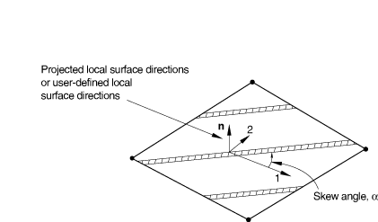

1. The rebars can be defined relative to the default projected local coordinate system (see ["Conventions," Section 1.2.2](pt01ch01s02aus02.md)).
2. The rebars can be defined relative to a user-defined local coordinate system (see ["Orientations," Section 2.2.5](pt01ch02s02aus15.md)).

The orientation definition that can optionally be associated with a shell or membrane section definition has no influence on the rebar angular orientation definitions. If the shell or membrane is curved in space, the local 1-direction will vary across the element and the skew rebar will also vary accordingly.

For shell elements the definition of a local coordinate system using distributions (["Distribution definition," Section 2.8.1](pt01ch02s08aus26.md)) has no influence on the rebar angular orientation definitions.

If the rebar cross-sectional area is *A*, the rebar spacing, *s*, should be given so that the thickness of the equivalent “smeared” layer of reinforcing is .

##### Defining skew rebars relative to the default projected local coordinate system

To define skew rebars relative to the default projected local coordinate system, you specify the elements that contain the rebars; the cross-sectional area, *A*, of each rebar; the rebar spacing in the plane of the shell, *s*; the position of the rebars in the thickness direction (for shell elements only), measured from the midsurface of the shell (positive in the direction of the positive normal to the shell); and the angle , in degrees, between the default local 1-direction and the rebars. See ["Conventions," Section 1.2.2](pt01ch01s02aus02.md), for a definition of the default projected local directions on a surface in space. If the shell's thickness is defined by nodal thicknesses (["Nodal thicknesses," Section 2.1.3](pt01ch02s01aus07.md)), the rebar position in the thickness direction will be scaled by the ratio of the thickness defined by the nodal thickness to the thickness defined by the section definition. If the shell's thickness is defined with a distribution (["Distribution definition," Section 2.8.1](pt01ch02s08aus26.md)), the rebar position in the thickness direction is scaled by the ratio of the element thickness defined by the distribution to the default thickness. A positive angle  defines a rotation from local direction 1 to local direction 2 around the element's normal direction. For example, in a membrane the following data would result in the rebar definition shown in [Figure 2.2.4--4](pt01ch02s02aus14.md#erebar-def-skew-local): *A*=0.05, *s*=0.1, and =45.

**Figure 2.2.4–4** Skew rebar defined relative to default local coordinate directions.

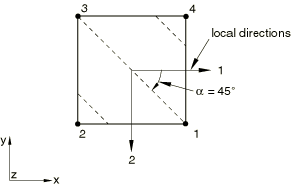

When a user-defined local orientation definition is not used to define the angular orientation of the rebar and the normal to the shell is nearly parallel to the global 1-axis, the local 1-axis may change significantly within an element or from one element to the next (see ["Conventions," Section 1.2.2](pt01ch01s02aus02.md)).

| **Input File Usage: ** | Use the following option to define skew rebars relative to the default projected local coordinate system in three-dimensional shell elements: |
| --- | --- |
|  | ``` [*REBAR](../key/key-link.md#usb-kws-mrebar), ELEMENT=SHELL, MATERIAL=*mat*, GEOMETRY=SKEW ``` Use the following option to define skew rebars relative to the default projected local coordinate system in general membrane elements: ``` [*REBAR](../key/key-link.md#usb-kws-mrebar), ELEMENT=MEMBRANE, MATERIAL=*mat*, GEOMETRY=SKEW ``` |

##### Defining skew rebars relative to a user-defined local coordinate system

To define skew rebars relative to a user-defined local coordinate system, you specify the elements that contain the rebars; the cross-sectional area, *A*, of each rebar; the rebar spacing in the plane, *s*; the position of the rebars in the thickness direction (for shell elements only), measured from the midsurface of the shell (positive in the direction of the positive normal to the shell); and the angle, , in degrees, between the user-defined 1-direction and the rebars. See ["Orientations," Section 2.2.5](pt01ch02s02aus15.md), for a description of how the local coordinate system is calculated from the user-defined directions for definition of rebar in shells and membranes. A positive angle  defines a rotation from local direction 1 to local direction 2 around the user-defined normal direction. For example, in a shell the following data would result in the skew rebar definition shown in [Figure 2.2.4--5](pt01ch02s02aus14.md#erebar-def-skew-orient): *A*=0.01; *s*=0.1; distance of rebar from the shell midsurface=0.0; =30.; and the rebar definition refers to a local rectangular orientation defined to have its *X*-axis go through the point (0.7071, 0.7071, 0.0), its *X*–*Y* plane include the point (0.7071, 0.7071, 0.0), and an additional rotation of 0.0 degrees about the 3-direction.

**Figure 2.2.4–5** Skew rebar defined relative to user-defined local coordinate directions.

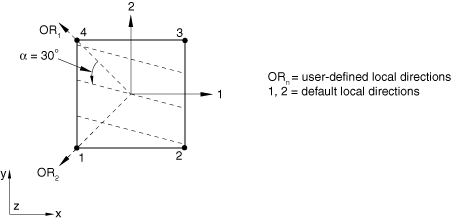

| **Input File Usage: ** | Use the following option to define skew rebars relative to a user-defined local coordinate system in three-dimensional shell elements: |
| --- | --- |
|  | ``` [*REBAR](../key/key-link.md#usb-kws-mrebar), ELEMENT=SHELL, MATERIAL=*mat*, GEOMETRY=SKEW, ORIENTATION=*name* ``` Use the following option to define skew rebars relative to a user-defined local coordinate system in general membrane elements: ``` [*REBAR](../key/key-link.md#usb-kws-mrebar), ELEMENT=MEMBRANE, MATERIAL=*mat*, GEOMETRY=SKEW, ORIENTATION=*name* ``` |

### Defining rebars in axisymmetric shell and membrane elements

Rebars in an axisymmetric membrane must lie in the membrane reference surface, whereas rebars in an axisymmetric shell can lie in the shell reference surface or can be offset from the midsurface. Rebars in axisymmetric shells and membranes can be defined to have any orientation with respect to the *r*–*z* plane. See [Figure 2.2.4--6](pt01ch02s02aus14.md#erebar-circ-axi-shell) for an example of circumferential rebars and [Figure 2.2.4--7](pt01ch02s02aus14.md#erebar-radial-axi-shell) for an example of radial rebars in axisymmetric shells.

**Figure 2.2.4–6** Example of circumferential rebars in axisymmetric shell elements.

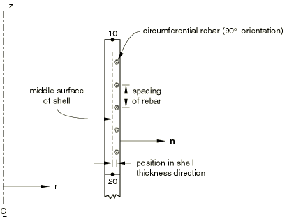

**Figure 2.2.4–7** Example of radial rebars in axisymmetric shell elements.

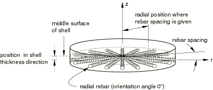

You specify the cross-sectional area, *A*, of each rebar; the rebar spacing, *s*; for shell elements the position of the rebars in the shell thickness direction, measured from the midsurface of the shell (positive in the direction of the positive normal to the shell); the angular orientation with respect to the *r*–*z* plane, , measured in degrees; and the radial position at which the rebar spacing is measured. The angular orientation is measured positive about the positive normal to the shell or membrane element. If the shell's thickness is defined by nodal thicknesses (["Nodal thicknesses," Section 2.1.3](pt01ch02s01aus07.md)), the distance from the midsurface will be scaled by the ratio of the thickness defined by the nodal thickness to the thickness defined by the section definition. If the shell's thickness is defined with a distribution (["Distribution definition," Section 2.8.1](pt01ch02s08aus26.md))  the distance from the midsurface will be scaled by the ratio of the element thickness defined by the distribution to the default thickness.

If an orientation angle other than 0 or 90 is specified for rebar in an axisymmetric shell or membrane without twist, Abaqus assumes that the rebars are balanced (i.e., half the rebar lie at the specified angle  and the other half at an angle of ) and internal calculations are handled accordingly. See ["Rebar modeling in two dimensions," Section 3.7.1 of the Abaqus Theory Guide](../stm/stm-link.md#stm-elm-rebars2d), for details. If the symmetric model generation capability (["Symmetric model generation," Section 10.4.1](pt04ch10s04aus63.md)) is used to create a three-dimensional model from an axisymmetric shell or membrane model, only balanced rebars will be translated appropriately. The definition of balanced rebars in the axisymmetric model will result in balanced rebars in the three-dimensional model; such a translation with unbalanced rebars is not available. Unbalanced rebars in generalized axisymmetric membranes with twist will be translated properly.

If the radial position for the rebar spacing is given, the total cross-sectional area of rebar will remain constant as the radial position changes; this behavior corresponds to the number of rebar in the circumferential direction remaining constant and implies that the thickness of the smeared layer of rebar decreases and that the spacing of the rebars increases as *r* increases (see [Figure 2.2.4--7](pt01ch02s02aus14.md#erebar-radial-axi-shell)). If the radial position for the rebar spacing is omitted (or is set to zero), Abaqus assumes that the spacing of the rebar remains constant; the thickness of the corresponding smeared layer is held fixed such that .

| **Input File Usage: ** | Use the following option to define rebars in an axisymmetric shell element: |
| --- | --- |
|  | ``` [*REBAR](../key/key-link.md#usb-kws-mrebar), ELEMENT=AXISHELL, MATERIAL=*mat* ``` Use the following option to define rebars in an axisymmetric membrane element: ``` [*REBAR](../key/key-link.md#usb-kws-mrebar), ELEMENT=AXIMEMBRANE, MATERIAL=*mat* ``` |

### Defining rebars in continuum elements

Two- or three-dimensional continuum (solid) elements can contain rebars; rebars cannot be defined in triangular, prism, tetrahedral, or infinite elements. If triangular or wedge-shaped elements are needed, collapsed quadrilateral or brick elements can be used. Be careful when collapsing elements that contain rebar. It is important to check that the location and orientation of the rebar are correct.

Rebars are defined as single bars or in layers. In the latter case the layer is a surface in each element; you provide the rebar orientation in the surface.

#### Defining layers of rebars in planar and axisymmetric continuum elements

By default, the rebars form a layer that lies in a surface that is at right angles to the plane of the model. You define the line where this rebar surface intersects the plane of the model, as described below.

The orientation of the rebars within the rebar surface is defined by giving an angle, in degrees, between the line of intersection in the plane of the model and the rebars. This angle is measured in physical three-dimensional space, not in isoparametric space. See ["Rebar modeling in two dimensions," Section 3.7.1 of the Abaqus Theory Guide](../stm/stm-link.md#stm-elm-rebars2d), for details. The positive direction along the line of intersection is from the lower to the higher numbered element edge that is intersected, and a positive angle indicates rebars oriented down into the plane of the model (where the plane is parallel to the *z*-axis in plane strain analysis or the -axis for axisymmetric analysis), as shown in [Figure 2.2.4--8](pt01ch02s02aus14.md#krebar-2d-solid).

**Figure 2.2.4–8** Orientation of rebars in plane and axisymmetric solid elements.


If an orientation angle other than 0 or 90 is specified for rebar in an axisymmetric element without twist, it is assumed that the rebar in the element are balanced (i.e., half the rebar lie at the specified angle  and the other half at the angle ).

##### Defining isoparametric rebars

For isoparametric rebars the intersection of the rebar layer with the plane of the model will lie along the mapping of a constant isoparametric line in the element. You specify the elements that contain the rebars; the cross-sectional area, *A*, of each rebar; the rebar spacing, *s*; the rebar orientation,  (as described above); the fractional distance *from* the edge, *f* (the ratio of the distance between the edge and the rebar to the distance across the element); and the edge number from which the rebars are defined. In addition, for axisymmetric elements you specify the radial position at which the rebar spacing is measured.

If the radial position for the rebar spacing is given for rebar in axisymmetric elements, the total cross-sectional area of rebar will remain constant as the radial position changes; this behavior corresponds to the number of rebar remaining constant as *r* increases; that is, the thickness of the smeared layer of rebar decreases as *r* increases. If the radial position for the rebar spacing is omitted (or is set to zero), Abaqus assumes that the spacing of the rebar remains constant; the thickness of the corresponding smeared layer is held fixed such that .

[Figure 2.2.4--9](pt01ch02s02aus14.md#krebar-iso-solid) shows an example of isoparametric rebar. 

**Figure 2.2.4–9** Isoparametric rebar layer definition in solid elements.


In the isoparametric mapping of the element, the line of rebars is parallel to one of the edges of the element. In this figure the line for rebar layer *A* can be defined using edges 1 or 3 and rebar layer *B* can be defined by edges 2 or 4. The fractional distance from edge 1 for rebar layer *A* is the ratio 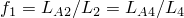; alternatively, layer *A* can be defined from edge 3, so that 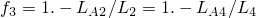.

| **Input File Usage: ** | Use the following option to define layers of isoparametric rebars in planar and axisymmetric continuum elements: |
| --- | --- |
|  | ``` [*REBAR](../key/key-link.md#usb-kws-mrebar), ELEMENT=CONTINUUM, MATERIAL=*mat*, GEOMETRY=ISOPARAMETRIC ``` |

##### Defining skew rebars

For skew rebars the intersection of the rebar layer with the plane of the model can intersect any two edges of an element. You specify the elements that contain the rebars; the cross-sectional area, *A*, of each rebar; the rebar spacing, *s*; and the rebar orientation,  (as described above). In addition, for axisymmetric elements you specify the radial position at which the rebar spacing is measured. You also specify the fractional distance *along* the element edge, from the first node of the edge (as listed in [Figure 2.2.4--10](pt01ch02s02aus14.md#krebar-skew-solid)) to where the rebar layer intersects the edge, for all edges. Only the two values corresponding to the two edges that the rebar intersects can be nonzero.

**Figure 2.2.4–10** Skew rebar layer definition in solid elements.

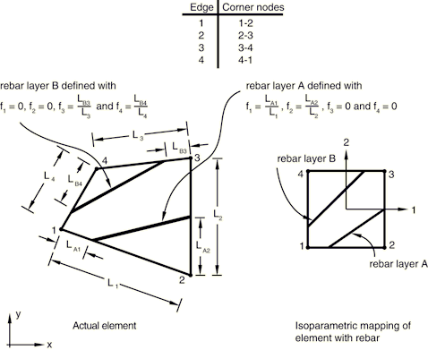

[Figure 2.2.4--10](pt01ch02s02aus14.md#krebar-skew-solid) shows an example of skew rebar. In the isoparametric mapping of the element, the line of rebars intersects two of the element edges. The intersection points are located by defining a fractional distance along each intersected edge. In this figure rebar layer *A* is defined by the ratio 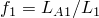 along edge 1 and the ratio 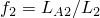 along edge 2. Rebar layer *B* is defined by the ratio 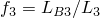 along edge 3 and the ratio  along edge 4.

Defining skew rebars in continuum elements can increase the run time for an Abaqus/Explicit analysis significantly. The element's stable time increment will, in most cases, be determined by the stable time increment of the rebar, which is proportional to the rebar length. The rebar length is determined by factors including the rebar surface position in the element, the rebar spacing, the rebar area, and the rebar orientation within the rebar surface. If a skew rebar in a continuum element is defined such that it intersects two adjacent element edges, the resulting rebar length could be considerably less than the average element edge length, thus resulting in a very small element stable time increment.

| **Input File Usage: ** | Use the following option to define layers of skew rebars in planar and axisymmetric continuum elements: |
| --- | --- |
|  | ``` [*REBAR](../key/key-link.md#usb-kws-mrebar), ELEMENT=CONTINUUM, MATERIAL=*mat*, GEOMETRY=SKEW ``` |

#### Defining single rebars in two-dimensional axisymmetric and generalized plane strain continuum elements

You can define single rebars in axisymmetric and generalized plane strain continuum elements. In this case the rebar is assumed to be at right angles with the plane of the model—in the thickness direction for generalized plane strain elements or the hoop direction for axisymmetric elements.

The intersection of the rebar with the plane of the model is defined by the fractional distances along edges 1 and 2 of the intersections of constant isoparametric lines that pass through the rebar location (see [Figure 2.2.4--11](pt01ch02s02aus14.md#krebar-single-solid)). The fractional distances are measured from the first edge node listed in [Figure 2.2.4--11](pt01ch02s02aus14.md#krebar-single-solid).

**Figure 2.2.4–11** Single rebar in a solid element.


You specify the elements that contain the rebars; the cross-sectional area, *A*, of each rebar; and the fractional distances locating the rebar's position in the element,  and .

| **Input File Usage: ** | Use the following option to define single rebars in axisymmetric and generalized plane strain continuum elements: |
| --- | --- |
|  | ``` [*REBAR](../key/key-link.md#usb-kws-mrebar), ELEMENT=CONTINUUM, MATERIAL=*mat*, SINGLE ``` |

#### Defining layers of rebars in three-dimensional continuum elements

By default, the rebars in three-dimensional continuum elements are defined as layers lying in surfaces. The surfaces are most easily defined with respect to the isoparametric mapped cube of the element. Therefore, you must consider how the rebar will be defined before generating the mesh; if the rebar surfaces are not taken into account in designing the mesh, the rebar definition can be very inefficient.

In the isoparametric mapped cube the rebar surface always has two edges (opposite to one another) that are parallel to an isoparametric direction. The isoparametric directions are defined in [Figure 2.2.4--12](pt01ch02s02aus14.md#krebar-3d-solid). You specify this isoparametric direction (1, 2, or 3).

**Figure 2.2.4–12** Isoparametric direction and edge definitions for three-dimensional elements.


A particular face of the element, which is perpendicular to this isoparametric direction in the isoparametric mapped cube, is used to define the position of the other two edges of the surface; the faces are defined in [Figure 2.2.4--12](pt01ch02s02aus14.md#krebar-3d-solid), where the edges of the faces are also defined.

If isoparametric rebars are defined, the two edges of the rebar surface that are not parallel to the user-specified isoparametric direction will be parallel to one of the other two isoparametric directions; in the isoparametric-mapped cube one isoparametric coordinate is constant on the rebar surface. [Figure 2.2.4--13](pt01ch02s02aus14.md#erebar-3d-2iso-layers) illustrates this concept with an element containing two layers of isoparametric rebars. 

**Figure 2.2.4–13** Element with two layers of isoparametric rebar.

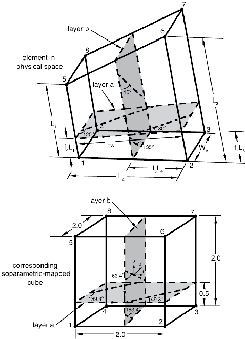

The position of each surface is given by the fractional distance *f* from an edge of the face defined in [Figure 2.2.4--12](pt01ch02s02aus14.md#krebar-3d-solid) for the isoparametric direction chosen; you must specify the edge from which the fractional distance is measured.

If skew rebars are defined, the two edges of the rebar surface, which are not parallel to the user-specified isoparametric direction, are generally not parallel to one of the other isoparametric directions. The positions of these two edges of the rebar surface are specified by the intersection of the rebar surface with edges of the intersecting face, defined in [Figure 2.2.4--12](pt01ch02s02aus14.md#krebar-3d-solid), for the isoparametric direction chosen; the intersections are given by the fractional distance *f* along each edge of the face. (Note that the fractional distance is *along* the edge for skew rebars; for isoparametric rebars the fractional distances are measured *from* an edge.) The fractional distance along an edge is measured from the first node of the edge. All four fractional distances must be given, but only two can be nonzero.

The orientation angle, , of the rebars within the rebar layer is defined in the isoparametric-mapped cube; it is measured in degrees and is the angle between the line of intersection of the rebar surface with the face for the isoparametric direction chosen and the rebar. The positive direction of the line of intersection is from the lower numbered edge to the higher numbered edge; the positive direction for the rebars points into the elements. An example is shown in [Figure 2.2.4--14](pt01ch02s02aus14.md#erebar-3d-geom-skew-exa). The orientation angle is defined in the rebar layer in the isoparametric-mapped cube; therefore, the definition is the same for isoparametric and skew rebar.

**Figure 2.2.4–14** Orientation example for three-dimensional skew rebar modeling, isoparametric direction 2. Shown in the mapped isoparametric element.


If the rebar layer is not flat in physical space, the orientation angle at each integration point may be different. Since it is possible to define only one orientation angle per element, an average value orientation angle for the element must be used; for reasonable meshes this approximation should not affect the results significantly.

##### Defining isoparametric rebars

You specify the elements that contain the rebars; the cross-sectional area, *A*, of each rebar; the rebar spacing, *s*; the rebar orientation,  (as described above); the fractional distance, *f*, from the edge; the number of the edge from which the fractional distance is measured; and the isoparametric direction of the rebar surface.

| **Input File Usage: ** | Use the following option to define layers of isoparametric rebars in three-dimensional continuum elements: |
| --- | --- |
|  | ``` [*REBAR](../key/key-link.md#usb-kws-mrebar), ELEMENT=CONTINUUM, MATERIAL=*mat*, GEOMETRY=ISOPARAMETRIC ``` |

##### Example: isoparametric rebar

For example, the following input defines the isoparametric rebar shown in [Figure 2.2.4--13](pt01ch02s02aus14.md#erebar-3d-2iso-layers):

```
[*HEADING](../key/key-link.md#usb-kws-mheading)
ISOPARAMETRIC REBAR
[*NODE](../key/key-link.md#usb-kws-mnode)
 1,  0.,  0.
 2, 10.,  0.
 3, 10.,  5.
 4,  0.,  5.
 5,  0.,  0.,  7.5
 6, 10.,  0., 12.5
 7, 10.,  5., 12.5
 8,  0.,  5., 7.5
[*ELEMENT](../key/key-link.md#usb-kws-melement), TYPE=C3D8R, ELSET=ONE
 1,1,2,3,4,5,6,7,8
[*REBAR](../key/key-link.md#usb-kws-mrebar), ELEMENT=CONTINUUM, MATERIAL=STEEL,
 GEOMETRY=ISOPARAMETRIC, NAME=LAYER_A
 ONE,.04,2.5,49.32628,0.25,4,2
[*REBAR](../key/key-link.md#usb-kws-mrebar), ELEMENT=CONTINUUM, MATERIAL=STEEL,
 GEOMETRY=ISOPARAMETRIC, NAME=LAYER_B
 ONE,.04,1.,63.43494,0.5,3,2
[*MATERIAL](../key/key-link.md#usb-kws-mmaterial), NAME=STEEL
[*ELASTIC](../key/key-link.md#usb-kws-melastic)
 30.E6,
 …
```

Rebar layers *A* and *B* are defined using isoparametric direction 2. From [Figure 2.2.4--12](pt01ch02s02aus14.md#krebar-3d-solid) the position of the layers must be given with respect to the face with nodes 1-5-6-2.

The fractional distance defining the position of intersection of layer *A* with this face can be measured from edge 4 (edge with nodes 2–1) along edge 3 (edge with nodes 6–2), as shown in [Figure 2.2.4--13](pt01ch02s02aus14.md#erebar-3d-2iso-layers). For layer *A*, 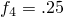. It could also be given from edge 2 (edge with nodes 5–6), so that 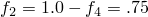.

The orientation of rebar for layer *A* in physical space is defined by an angle, , equal to 30 for layer *A*. This angle must be transformed into the corresponding angle in the isoparametric-mapped cube. This transformation can be done as follows: consider a single rebar that intersects the intersecting line (described above) and an adjacent edge (see [Figure 2.2.4--15](pt01ch02s02aus14.md#erebar-3d-iso-layer-a)). 

**Figure 2.2.4–15** Example defining isoparametric rebar.

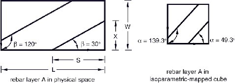

From the figure 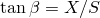. The length of the rebar layer along the intersecting line is *L*, and the length of the opposite edge is *W*. Consider the same rebar in the rebar layer in the isoparametric-mapped cube. The orientation angle, , is given by , where 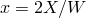 and 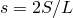. (The 2 is included because the isoparametric-mapped cube is a 2  2  2 cube.) This expression can be simplified to give 


For layer *A*, 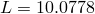, , 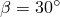, and 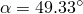, where  is the orientation angle that must be specified.

The fractional distance defining the position of the intersection of layer *B* with this face can be measured from edge 3 (edge with nodes 6–2); 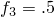. It could also be measured from edge 1 (edge with nodes 1–5), such that 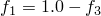. The orientation angle for layer *B* in the rebar layer is 45. In the isoparametric-mapped cube 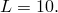, , 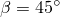, and 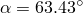.

Since an isoparametric rebar layer always lies in two of the isoparametric directions, an alternative but equivalent definition can be given. For example, layer *A* also lies in isoparametric direction 1, with the intersecting face having nodes 1-4-8-5. The fractional distance for layer *A*, measured from edge 1 (edge with nodes 1–4), is 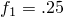. The positive sense of the line of intersection is from edge 2 (edge with nodes 4–8) to edge 4 (edge with nodes 5–1); therefore, 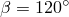, 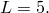, 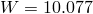, and 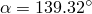.

Layer *B* also lies in isoparametric direction 3, with the intersecting face having nodes 1-2-3-4. The fractional distance for layer *B*, measured from edge 2 (edge with nodes 2–3), is 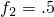. The positive sense of the intersecting line is from edge 1 (edge with nodes 1–2) to edge 3 (edge with nodes 3–4); therefore, the orientation angle of the rebar in physical space is 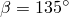, , 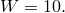, and in the isoparametric-mapped cube 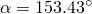.

##### Defining skew rebars

You specify the elements that contain the rebars; the cross-sectional area, *A*, of each rebar; the rebar spacing, *s*; the rebar orientation,  (as described above); and the isoparametric direction. In addition, you specify the fractional distance *f* *along* the element edge for each edge of the intersecting face defined in [Figure 2.2.4--12](pt01ch02s02aus14.md#krebar-3d-solid). Only the values corresponding to the two edges that the rebar intersects can be nonzero.

| **Input File Usage: ** | Use the following option to define layers of skew rebars in three-dimensional continuum elements: |
| --- | --- |
|  | ``` [*REBAR](../key/key-link.md#usb-kws-mrebar), ELEMENT=CONTINUUM, MATERIAL=*mat*, GEOMETRY=SKEW ``` |

##### Example: skew rebar

For example, the following input defines the skew rebar shown in [Figure 2.2.4--16](pt01ch02s02aus14.md#erebar-3d-skew-layer): 

**Figure 2.2.4–16** Example defining skew rebar.

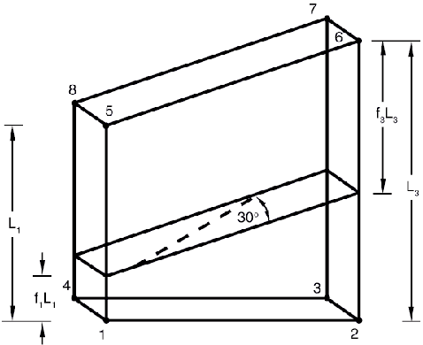

```
[*HEADING](../key/key-link.md#usb-kws-mheading)
[*NODE](../key/key-link.md#usb-kws-mnode)
 1,  0.,  0.
 2, 10.,  0.
 3, 10.,  5.
 4,  0.,  5.
 5,  0.,  0.,  7.5
 6, 10.,  0., 12.5
 7, 10.,  5., 12.5
 8,  0.,  5., 7.5
[*ELEMENT](../key/key-link.md#usb-kws-melement), TYPE=C3D8R, ELSET=ONE
 1,1,2,3,4,5,6,7,8
[*REBAR](../key/key-link.md#usb-kws-mrebar), ELEMENT=CONTINUUM, MATERIAL=STEEL, GEOMETRY=SKEW,
 NAME=LAYER_A
 ONE, .04, 2.5, 55.28, , 2
 .2, 0., .4, .0
[*MATERIAL](../key/key-link.md#usb-kws-mmaterial), NAME=STEEL
[*ELASTIC](../key/key-link.md#usb-kws-melastic)
 30.E6,
 …
```

The rebar layer is defined using isoparametric direction 2. The intersecting face is defined in [Figure 2.2.4--12](pt01ch02s02aus14.md#krebar-3d-solid) and has nodes 1-5-6-2. The position of the rebar layer is given by its intersection with the edges of this face; the fractional distances,  and , are shown in [Figure 2.2.4--16](pt01ch02s02aus14.md#erebar-3d-skew-layer). The orientation angle  of the rebar in physical space is 30. Following the same procedure for calculating  as was described for isoparametric rebar, 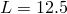, , and the orientation angle in the isoparametric-mapped cube  is 55.28.

#### Defining single rebars in three-dimensional continuum elements

You can define single rebars in three-dimensional continuum elements; in this case the rebar is assumed to be placed along one of the element's isoparametric directions. The rebar is then located by its intersection with the intersecting face (defined in [Figure 2.2.4--12](pt01ch02s02aus14.md#krebar-3d-solid)). The intersections of constant isoparametric lines with edges 1 and 2 of the intersecting face are given by fractional distances along edges 1 and 2, measured from the first node of each edge, as shown in [Figure 2.2.4--11](pt01ch02s02aus14.md#krebar-single-solid).

You specify the elements that contain the rebars; the cross-sectional area, *A*, of each rebar; the fractional distances locating the rebar's position in the element,  and ; and the isoparametric direction. Give the fractional distances with respect to edge 1 and edge 2 for the isoparametric direction chosen, as defined in [Figure 2.2.4--12](pt01ch02s02aus14.md#krebar-3d-solid).

| **Input File Usage: ** | Use the following option to define single rebars in three-dimensional continuum elements: |
| --- | --- |
|  | ``` [*REBAR](../key/key-link.md#usb-kws-mrebar), ELEMENT=CONTINUUM, MATERIAL=*mat*, SINGLE ``` |

### Defining the rebar material

The material properties of the rebars are distinct from those of the underlying element and are defined by a separate material definition (["Material data definition," Section 21.1.2](pt05ch21s01aus109.md)). You must associate each rebar definition with a set of material properties.

The following material behavior cannot be used in Abaqus/Standard to define rebar materials:
- ["Porous metal plasticity," Section 23.2.9](pt05ch23s02abm25.md).

The following material behaviors cannot be used in Abaqus/Explicit to define rebar materials:- ["Defining fully anisotropic elasticity" in "Linear elastic behavior," Section 22.2.1](pt05ch22s02abm02.md#usb-mat-clinearelastic-anisotropic);
- ["Defining orthotropic elasticity by specifying the terms in the elastic stiffness matrix" in "Linear elastic behavior," Section 22.2.1](pt05ch22s02abm02.md#usb-mat-clinearelastic-orthoterms);
- ["Equation of state," Section 25.2.1](pt05ch25s02abm50.md);
- ["Anisotropic yield/creep," Section 23.2.6](pt05ch23s02abm22.md);
- ["Porous metal plasticity," Section 23.2.9](pt05ch23s02abm25.md);
- ["Extended Drucker-Prager models," Section 23.3.1](pt05ch23s03abm30.md);
- ["Modified Drucker-Prager/Cap model," Section 23.3.2](pt05ch23s03abm31.md);
- ["Crushable foam plasticity models," Section 23.3.5](pt05ch23s03abm34.md); or
- ["Cracking model for concrete," Section 23.6.2](pt05ch23s06abm38.md).

Although Abaqus/Standard will allow for a rebar material to be defined with orthotropic elasticity (["Defining orthotropic elasticity by specifying the terms in the elastic stiffness matrix" in "Linear elastic behavior," Section 22.2.1](pt05ch22s02abm02.md#usb-mat-clinearelastic-orthoterms)) or anisotropic elasticity (["Defining fully anisotropic elasticity" in "Linear elastic behavior," Section 22.2.1](pt05ch22s02abm02.md#usb-mat-clinearelastic-anisotropic)),  is the only meaningful material constant in these definitions.  is used to compute the strain in the rebar direction, , using the corresponding stress component, , as discussed in ["Linear elastic behavior," Section 22.2.1](pt05ch22s02abm02.md); no other strain or stress components exist in rebars.

In Abaqus/Standard density is ignored for the rebar material properties. Hence, the mass of the rebar is neglected in eigenvalue extraction and implicit dynamic procedures and for gravity, centrifugal, and rotary acceleration distributed loads.

| **Input File Usage: ** | Use the following option to associate a material definition with a rebar definition: |
| --- | --- |
|  | ``` [*REBAR](../key/key-link.md#usb-kws-mrebar), ELEMENT=*elem*, MATERIAL=*mat* ``` |

### Initial conditions

Initial conditions (["Initial conditions in Abaqus/Standard and Abaqus/Explicit," Section 34.2.1](pt07ch34s02aus116.md)) can be used to define rebar prestress or solution-dependent values for rebars.

#### Defining prestress in rebar

For structures in which reinforcing is defined (such as reinforced concrete structures), you can use initial conditions to define the prestress in the rebars.

In such cases in Abaqus/Standard the structure must be brought to a state of equilibrium before it is actively loaded by means of an initial static analysis step (["Static stress analysis," Section 6.2.2](pt03ch06s02at01.md)) with no external loads applied (or, perhaps, with the “dead” loads only)—see ["Defining initial stresses" in "Initial conditions in Abaqus/Standard and Abaqus/Explicit," Section 34.2.1](pt07ch34s02aus116.md#usb-prc-pinitialcond-stress).

| **Input File Usage: ** | ``` [*INITIAL CONDITIONS](../key/key-link.md#usb-kws-minitialcond), TYPE=STRESS, REBAR *element number or element set name, rebar name, prestress value* ``` |
| --- | --- |

#### Holding prestress in rebar in Abaqus/Standard

If prestress is defined in the rebars and unless the prestress is held fixed, it will be allowed to change during an equilibrating static analysis step; this is a result of the straining of the structure as the self-equilibrating stress state establishes itself. An example is the pretension type of concrete prestressing in which reinforcing tendons are initially stretched to a desired tension before being covered by concrete. After the concrete cures and bonds to the rebar, release of the initial rebar tension transfers load to the concrete, introducing compressive stresses in the concrete. The resulting deformation in the concrete reduces the stress in the rebar.

Alternatively, you can keep the initial stress defined in some or all of the rebars  constant during this initial equilibrium solution. An example is the post-tension type of concrete prestressing; the rebars are allowed to slide through the concrete (normally they are in conduits), and the prestress loading is maintained by some external source (prestressing jacks). The magnitude of the prestress in the rebar is normally part of the design requirements and must not be reduced as the concrete compresses under the loading of the prestressing. Normally, the prestress is held constant only in the first step of an analysis. This is generally the more common assumption for prestressing.

If the prestress is not held constant in analysis steps following the step in which it is held constant, the stress in the rebar will change due to additional deformation in the concrete. If there is no additional deformation, the stress in the rebar will remain at the level set by the initial conditions. If the loading history is such that no plastic deformation is induced in the concrete or rebar in steps subsequent to the steps in which the prestress is held constant, the stress in the rebar will return to the level set by the initial conditions upon removal of the loading applied in those steps.

| **Input File Usage: ** | ``` [*PRESTRESS HOLD](../key/key-link.md#usb-kws-hprestresshold) ``` |
| --- | --- |

#### Defining the initial values of solution-dependent state variables for rebars

You can define the initial values of solution-dependent state variables for rebars within elements. See ["Initial conditions in Abaqus/Standard and Abaqus/Explicit," Section 34.2.1](pt07ch34s02aus116.md), for details.

| **Input File Usage: ** | ``` [*INITIAL CONDITIONS](../key/key-link.md#usb-kws-minitialcond), TYPE=SOLUTION, REBAR ``` |
| --- | --- |

### Output

Rebar force output is available at the rebar integration locations with output variable RBFOR. The rebar force is equal to the rebar stress times the current rebar cross-sectional area. The current cross-sectional area of the rebar is calculated by assuming the rebar is made of an incompressible material, regardless of the actual material definition. For rebars in membrane or shell elements output variables RBANG and RBROT identify the current orientation of isoparametric or skew rebar within the element and the relative rotation of the rebar as a result of finite deformation, respectively. These quantities are measured with respect to the user-specified isoparametric direction in the element, not the default local element system or the orientation-defined system. See ["Rebar modeling in shell, membrane, and surface elements," Section 3.7.3 of the Abaqus Theory Guide](../stm/stm-link.md#stm-elm-rebarshell).

See ["Abaqus/Standard output variable identifiers," Section 4.2.1](pt02ch04s02abv01.md), and ["Abaqus/Explicit output variable identifiers," Section 4.2.2](pt02ch04s02xbv01.md), for information on additional output quantities such as stress and strain. For rebars in membrane or shell elements with multiple integration points, output quantities are available at the integration points and at the centroid of the element.

#### Specifying the direction for rebar angle output in shell and membrane elements

The output quantities RBANG and RBROT can be measured from either of the isoparametric directions in the plane of the shell or the membrane. You can specify the desired isoparametric direction from which the rebar angle will be measured (1 or 2). In axisymmetric shells and membranes the first isoparametric direction coincides with the meridional direction, and the second isoparametric direction coincides with the hoop direction. The rebar angle is measured from the isoparametric direction to the rebar with a positive angle defined as a counterclockwise rotation around the element's normal direction. The default direction is the first isoparametric direction.

| **Input File Usage: ** | Use any of the following options: |
| --- | --- |
|  | ``` [*REBAR](../key/key-link.md#usb-kws-mrebar), ELEMENT=SHELL, MATERIAL=*mat*, ISODIRECTION=*n* [*REBAR](../key/key-link.md#usb-kws-mrebar), ELEMENT=AXISHELL, MATERIAL=*mat*, ISODIRECTION=*n* [*REBAR](../key/key-link.md#usb-kws-mrebar), ELEMENT=MEMBRANE, MATERIAL=*mat*, ISODIRECTION=*n* [*REBAR](../key/key-link.md#usb-kws-mrebar), ELEMENT=AXIMEMBRANE, MATERIAL=*mat*, ISODIRECTION=*n* ``` |

##### Example

As an example, a user-defined local coordinate system is used to define skewed rebar in a shell element (skew angle 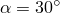), and the output value of RBANG is 75, as illustrated in [Figure 2.2.4--17](pt01ch02s02aus14.md#erebar-rbang-skew):

**Figure 2.2.4–17** RBANG measurement for skew rebar defined relative to user-defined local coordinate directions.

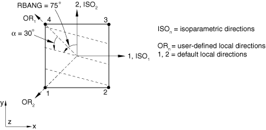

```
[*REBAR](../key/key-link.md#usb-kws-mrebar), ELEMENT=SHELL, MATERIAL=MAT1, NAME=REBARB,
 GEOMETRY=SKEW, ORIENTATION=ORIENT, ISODIRECTION=2
 ELSET1, 0.01, 0.1, 0.0, 30.
[*ORIENTATION](../key/key-link.md#usb-kws-morientation), SYSTEM=RECTANGULAR, NAME=ORIENT
 -0.7071, 0.7071, 0.0, -0.7071, -0.7071, 0.0
 3, 0.0
```

The rebars are located at the midsurface of the shell. Output variable RBANG is measured from the second isoparametric direction to the rebar. If the first isoparametric direction were chosen instead, output variable RBANG would report an angle of 165.

#### Visualizing rebar orientation and results in rebar

Abaqus/CAE does not support visualization of element-based rebar or rebar results. Abaqus/CAE does support visualization of rebar defined as described in ["Defining reinforcement," Section 2.2.3](pt01ch02s02aus13.md).


