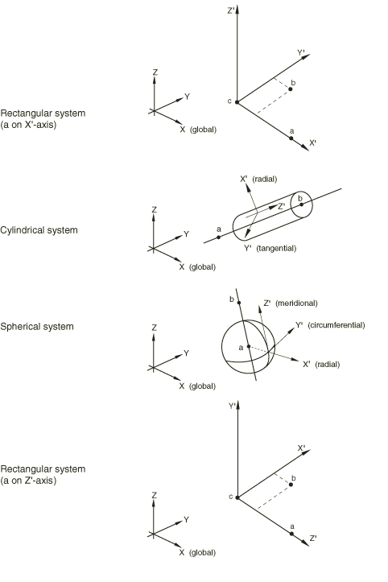
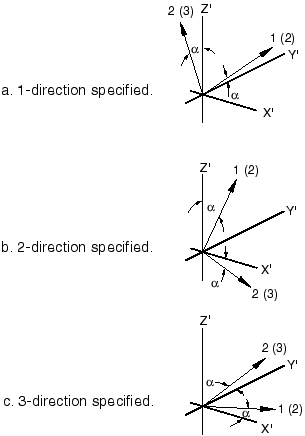
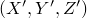
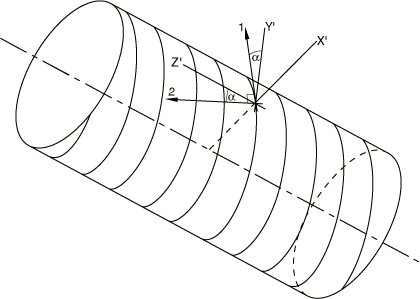

# 2.2.5 Orientations


**Products: **Abaqus/Standard  Abaqus/Explicit  Abaqus/CAE  

##### **References**

- ["Distribution definition," Section 2.8.1](pt01ch02s08aus26.md)
- ["Material library: overview," Section 21.1.1](pt05ch21s01abo18.md)
- ["Material data definition," Section 21.1.2](pt05ch21s01aus109.md)
- ["Fabric material behavior," Section 23.4.1](pt05ch23s04abm35.md)
- ["Distributed loads," Section 34.4.3](pt07ch34s04aus122.md)
- ["Kinematic coupling constraints," Section 35.2.3](pt08ch35s02aus131.md)
- ["Coupling constraints," Section 35.3.2](pt08ch35s03aus133.md)
- ["Inertia relief," Section 11.1.1](pt04ch11s01at37.md)
- [*ORIENTATION](../key/key-link.md#usb-kws-morientation)
- ["Creating datum coordinate systems," Section 62.9 of the Abaqus/CAE User's Guide](../usi/usi-link.md#usi-dtm-csys)

### Overview

A user-defined orientation is used to define a local coordinate system for:
- definition of material properties---for example, anisotropic materials or jointed materials (a local coordinate system must be defined if anisotropic material properties are defined for solid elements);
- definition of local material directions, such as the in-plane fill and warp yarn directions of a fabric material or the fiber directions of anisotropic hyperelastic materials;
- definition of rebars in shell, membrane, and surface elements;
- definition of rotary inertia and connector elements;
- definition of coupling constraints;
- definition of loading directions for distributed general tractions, shear tractions, and general edge loads;
- definition of local tangent directions for contact in Abaqus/Standard;
- material calculations at integration points;
- output of components of stress, strain, and element section force; and
- definition of a local system of rigid body motion directions for inertia relief in Abaqus/Standard.

A user-defined orientation cannot be used:- at points where the smeared crack concrete material behavior (["Concrete smeared cracking," Section 23.6.1](pt05ch23s06abm37.md)) is also used in Abaqus/Standard;
- to specify a local coordinate system for defining nodal coordinates---see ["Specifying a local coordinate system in which to define nodes" in "Node definition," Section 2.1.1](pt01ch02s01aus05.md#usb-int-inode-system-option), or ["Specifying a local coordinate system for the nodal coordinates" in "Node definition," Section 2.1.1](pt01ch02s01aus05.md#usb-int-inode-define-csys), instead; or
- to specify a local coordinate system for applying loads and boundary conditions---see ["Transformed coordinate systems," Section 2.1.5](pt01ch02s01aus09.md), instead.

Considerable generality is provided in the way the local system can be defined, since this system must often change from point to point because of the shape and construction of the structure being modeled. You can define the local orientation directly. The direct data methods provided in Abaqus are intended to give sufficient generality to model most cases easily: they are particularly useful for regular geometry. Distributions (["Distribution definition," Section 2.8.1](pt01ch02s08aus26.md)) can be used to define spatially varying local coordinate systems for solid continuum, shell, and membrane (in Abaqus/Standard) elements directly for arbitrary geometries.

 In Abaqus/Standard you can alternatively define the local orientation in user subroutine [`ORIENT`](../sub/sub-link.md#sub-xsl-orient).

### Assigning a name to an orientation

You must assign a name to each orientation definition. This name is used by various features to refer to the orientation definition.

| **Input File Usage: ** | ``` [*ORIENTATION](../key/key-link.md#usb-kws-morientation), NAME=*name* ``` |
| --- | --- |

| **Abaqus/CAE Usage: ** | Any module: ****Tools****Datum****: **Type**: **CSYS**: select any method, and click **OK**: **Name:** *name* |
| --- | --- |

### Defining a local coordinate system in a model that contains an assembly of part instances

In a model defined in terms of an assembly of part instances, you can define a local orientation at the part, part instance, or assembly level. An orientation defined at the part or part instance level is rotated according to the positioning data given for each instance of that part (or for the part instance). This includes the case when an orientation is defined using a distribution. See ["Defining an assembly," Section 2.10.1](pt01ch02s10aus28.md), and ["Distribution definition," Section 2.8.1](pt01ch02s08aus26.md).

### Defining a local coordinate system directly

A two-stage process is used to define the local system directly. 

1. You define the local coordinate system at the particular location at which it is required. You can select a rectangular, cylindrical, or spherical coordinate system. The coordinate system is defined in terms of points *a*, *b*, and *c*, as shown in [Figure 2.2.5--1](pt01ch02s02aus15.md#corientation-sys). You can select the method for defining points *a*, *b*, and *c*, as described below. **Figure 2.2.5--1** Orientation systems. 
2. Optionally, you can specify an additional rotation by identifying one of these local directions (, , or ) as a rotation axis and giving a rotation, in degrees, about that axis. The local system is then rotated through this angle about the specified axis. This method of defining a local system is required for contact surfaces in Abaqus/Standard, shells, membranes, gasket elements, and when the orientation is associated with a composite solid section. The additional rotation is illustrated in [Figure 2.2.5--2](pt01ch02s02aus15.md#corientation-rot-shell-memb). **Figure 2.2.5--2** Specifying rotation about a local axis for shell elements, membrane elements, gasket elements (in parentheses), composite solids (in parentheses), and contact surfaces in Abaqus/Standard.  The local coordinate system for composite solids is indicated by , , and . The local coordinate system for other element types is indicated by 1, 2, and 3; the axis labels in parentheses are oriented for gasket elements.

#### Available coordinate systems

Rectangular, cylindrical, and spherical coordinate systems are available.

##### Defining a rectangular coordinate system

A rectangular Cartesian coordinate system is shown in [Figure 2.2.5--1](pt01ch02s02aus15.md#corientation-sys)(a). The rectangular coordinate system is the default. Alternatively, you can define a rectangular Cartesian coordinate system as shown in [Figure 2.2.5--1](pt01ch02s02aus15.md#corientation-sys)(d).

| **Input File Usage: ** | ``` [*ORIENTATION](../key/key-link.md#usb-kws-morientation), NAME=*name*, SYSTEM=RECTANGULAR ``` |
| --- | --- |
|  | ``` [*ORIENTATION](../key/key-link.md#usb-kws-morientation), NAME=*name*, SYSTEM=Z RECTANGULAR ``` |

| **Abaqus/CAE Usage: ** | Any module: ****Tools****Datum****: **Type**: **CSYS**: select any method, and click **OK**: **Rectangular** |
| --- | --- |

##### Defining a cylindrical coordinate system

A cylindrical coordinate system is shown in [Figure 2.2.5--1](pt01ch02s02aus15.md#corientation-sys)(b). The local axes are =radial, =tangential, =axial.

| **Input File Usage: ** | ``` [*ORIENTATION](../key/key-link.md#usb-kws-morientation), NAME=*name*, SYSTEM=CYLINDRICAL ``` |
| --- | --- |

| **Abaqus/CAE Usage: ** | Any module: ****Tools****Datum****: **Type**: **CSYS**: select any method, and click **OK**: **Cylindrical** |
| --- | --- |

##### Defining a spherical coordinate system

A spherical coordinate system is shown in [Figure 2.2.5--1](pt01ch02s02aus15.md#corientation-sys)(c). The local axes are =radial, =circumferential, =meridional.

| **Input File Usage: ** | ``` [*ORIENTATION](../key/key-link.md#usb-kws-morientation), NAME=*name*, SYSTEM=SPHERICAL ``` |
| --- | --- |

| **Abaqus/CAE Usage: ** | Any module: ****Tools****Datum****: **Type**: **CSYS**: select any method, and click **OK**: **Spherical** |
| --- | --- |

#### Methods for defining a coordinate system

You can define a coordinate system by specifying the locations of points *a*, *b*, and *c* directly; by specifying the locations of points *a*, *b*, and *c* relative to global node numbers; by specifying the locations of points *a*, *b*, and *c* relative to local node numbers; by specifying an offset from another coordinate system; or by specifying two lines in the coordinate system.

##### Defining a coordinate system by specifying the locations of points *a*, *b*, and *c* directly

You can specify the coordinates of points *a*, *b*, and *c* directly. These coordinates should be appropriate to the system chosen. This method is the default.

You can define a rectangular Cartesian coordinate system  by specifying three points (*a*, *b*, and *c*) that lie on the - plane, as shown in [Figure 2.2.5--1](pt01ch02s02aus15.md#corientation-sys)(a). Point *c* is the origin of the system, point *a* must lie on the -axis, and point *b* must lie on the - plane. Although not necessary, it is intuitive to select point *b* such that it is on or near the local -axis.

Alternatively in Abaqus/Standard you can define a rectangular Cartesian coordinate system  by specifying three points (*a*, *b*, and *c*) that lie on the - plane, as shown in [Figure 2.2.5--1](pt01ch02s02aus15.md#corientation-sys)(d). Point *c* is the origin of the system, point *a* must lie on the  -axis, and point *b* must lie on the - plane. Although not necessary, it is intuitive to select point *b* such that it is on or near the local -axis.

For rectangular coordinate systems the default location of the origin (point *c*) is the global origin.

You define a cylindrical coordinate system by giving the two points, *a* and *b*, on the polar axis of the cylindrical system, as shown in [Figure 2.2.5--1](pt01ch02s02aus15.md#corientation-sys)(b). 

You define a spherical coordinate system by giving the center of the sphere, *a*, and point *b* on the polar axis, as shown in [Figure 2.2.5--1](pt01ch02s02aus15.md#corientation-sys)(c). 

To define a spatially varying local coordinate system directly on solid continuum and shell elements, you can specify the coordinates of points *a* and *b* on an element-by-element basis using a distribution. Using a distribution to define the coordinates of the optional point *c* is not currently supported.  See ["Distribution definition," Section 2.8.1](pt01ch02s08aus26.md). 

| **Input File Usage: ** | ``` [*ORIENTATION](../key/key-link.md#usb-kws-morientation), NAME=*name*, DEFINITION=COORDINATES ``` |
| --- | --- |

| **Abaqus/CAE Usage: ** | Any module: ****Tools****Datum****: **Type**: **CSYS**, **Method**: **3 points** |
| --- | --- |

##### Defining a coordinate system by giving global node numbers for points *a*, *b*, and *c*

You can locate points *a*, *b*, and *c* at nodes by specifying three global node numbers. For a rectangular coordinate system the default location of the origin (point *c*) is the global origin.

| **Input File Usage: ** | ``` [*ORIENTATION](../key/key-link.md#usb-kws-morientation), NAME=*name*, DEFINITION=NODES ``` |
| --- | --- |

| **Abaqus/CAE Usage: ** | You cannot define a coordinate system by giving global node numbers in Abaqus/CAE. |
| --- | --- |

##### Defining a coordinate system by giving local node numbers for points *a*, *b*, and *c*

You can locate points *a*, *b*, and *c* by specifying the local node numbers of an element. Local node numbers refer to the order in which nodes are specified in the element connectivity. For example, local node number 2 corresponds to the second node specified for the element definition. This definition method allows for variation of the local coordinate system on an element-by-element basis with a single orientation definition. For example, if local node number 2 is given as the location of point *c* and local node number 3 is given as the location of point *a*, the local -direction is defined to be parallel to the (2, 3) side of the element. By default, the origin (point *c*) of the local coordinate system is the first node of the element (local node number 1).

| **Input File Usage: ** | ``` [*ORIENTATION](../key/key-link.md#usb-kws-morientation), NAME=*name*, DEFINITION=OFFSET TO NODES ``` |
| --- | --- |

| **Abaqus/CAE Usage: ** | You cannot define a coordinate system by giving local node numbers in Abaqus/CAE. |
| --- | --- |

##### Defining a coordinate system by giving an offset from another coordinate system

You can define a coordinate system by specifying an offset from an existing coordinate system.

| **Input File Usage: ** | You cannot define a coordinate system by giving an offset from another coordinate system in the input file. |
| --- | --- |

| **Abaqus/CAE Usage: ** | Any module: ****Tools****Datum****: **Type**: **CSYS**: **Offset from CSYS** |
| --- | --- |

##### Defining a coordinate system by giving two edges

You can define a coordinate system by specifying two edges. The first edge defines the *X*- or *R*-axis, and the *X–Y* or  plane passes through the second.

| **Input File Usage: ** | You cannot define a coordinate system by giving two edges in the input file. |
| --- | --- |

| **Abaqus/CAE Usage: ** | Any module: ****Tools****Datum****: **Type**: **CSYS**: **2 lines** |
| --- | --- |

### Defining local material directions for anisotropic hyperelastic materials

 When modeling anisotropic hyperelastic materials with an invariant-based formulation (["Invariant-based formulation" in "Anisotropic hyperelastic behavior," Section 22.5.3](pt05ch22s05abm09.md#usb-mat-canisohyperelastic-invbased)) you must define the local directions that characterize each family of fibers. These directions need not be orthogonal in the initial configuration. You can specify these local directions with respect to an orthogonal orientation system at a material point. Up to three local directions can be specified as part of the definition of a local orientation system. The local directions can be output as field variables to the output database (see ["Output" in "Anisotropic hyperelastic behavior," Section 22.5.3](pt05ch22s05abm09.md#usb-mat-canisohyperelastic-output)).

| **Input File Usage: ** | Use the following option to define an orthogonal system and *N* local directions with respect to that system to identify the preferred directions of an anisotropic hyperelastic material: |
| --- | --- |
|  | ``` [*ORIENTATION](../key/key-link.md#usb-kws-morientation), LOCAL DIRECTIONS=*N* ``` |

| **Abaqus/CAE Usage: ** | Local material directions cannot be defined in Abaqus/CAE. |
| --- | --- |

### Defining yarn directions in the reference configuration for a fabric material

 In general, the yarn directions in a fabric material may not be orthogonal to each other in the reference configuration (see ["Fabric material behavior," Section 23.4.1](pt05ch23s04abm35.md)). You can specify these local directions with respect to the in-plane axes of an orthogonal orientation system at a material point. Both the local directions and the orthogonal system are defined together as a single orientation definition. If the local directions are not specified, these directions are assumed to match the in-plane axes of the orthogonal system defined. The local direction may not remain orthogonal with deformation. Abaqus updates the local directions with deformation and computes the nominal strains along these directions and the angle between them (the fabric shear strain). The constitutive behavior for the fabric defines the nominal stresses in the local system in terms of the fabric strain. The local directions can be output as field variables to the output database (see ["Output" in "Fabric material behavior," Section 23.4.1](pt05ch23s04abm35.md#usb-mat-cfabric-output)).

| **Input File Usage: ** | Use the following option to define an orthogonal system and the local directions with respect to that system to identify the yarn directions in the reference configuration: |
| --- | --- |
|  | ``` [*ORIENTATION](../key/key-link.md#usb-kws-morientation), LOCAL DIRECTIONS=2 ``` |

| **Abaqus/CAE Usage: ** | Yarn directions for fabric materials cannot be defined in Abaqus/CAE. |
| --- | --- |

### Defining a local coordinate system in Abaqus/Standard using a user subroutine

In some cases the simplest way to specify a local system is by means of a user subroutine. User subroutine [`ORIENT`](../sub/sub-link.md#sub-xsl-orient) is provided in Abaqus/Standard. In this case the user subroutine is called each time that an orientation definition is needed. In a model defined in terms of an assembly of part instances, the local directions defined by user subroutine [`ORIENT`](../sub/sub-link.md#sub-xsl-orient) must be defined relative to the coordinate system of the assembly.

| **Input File Usage: ** | ``` [*ORIENTATION](../key/key-link.md#usb-kws-morientation), NAME=*name*, SYSTEM=USER ``` |
| --- | --- |

| **Abaqus/CAE Usage: ** | You can enter the name of an orientation defined in user subroutine [`ORIENT`](../sub/sub-link.md#sub-xsl-orient) whenever a user-defined orientation is allowed. |
| --- | --- |

### Multiple references to an orientation definition

Because the orientation is independent of the material definition and they can both be referenced in any element property definition, the ability to describe complex structural components (such as laminated composite shells) is quite general and straightforward to use.

An orientation definition can be used as often as needed and with different material or element type definitions; for example, it can be used for different layers of a shell where the orientation is the same.

### Large-displacement considerations

In large-displacement analysis a user-defined orientation rotates with the average rigid body motion of the material point, the rigid body when the orientation is used with ROTARYI elements, the first node of the joint in JOINTC elements, the pipeline edge for pipe-soil interaction elements, the appropriate surface for contact in Abaqus/Standard, or the reference node when the orientation is used with coupling constraints. However, when an orientation is defined for spring, dashpot, or gasket elements in Abaqus/Standard, the local directions always remain fixed in space.

Because the material directions rotate with the average rigid body motion at a material point, using anisotropic elasticity to model a material that is not truly a continuum can give significant errors if shear deformation is large. For example, an individual fiber in a reinforcing belt of a tire can shear relatively easily with respect to fibers in other directions. The fibers rotate with the actual deformation of the material point and not with the average rigid body motion. In this case the anisotropic behavior is better modeled with rebars or as a fabric material. The fabric material model in Abaqus/Explicit tracks the current yarn directions as local directions with respect to the orthogonal coordinate system. 

### Use with two-dimensional solid elements

When a user-defined orientation is used with two-dimensional solid elements such as plane stress, plane strain, or torsionless axisymmetric elements, the orientation must redefine only the *X*- and *Y*-directions: the third direction must remain unchanged (*Z*-direction for plane strain and plane stress elements, -direction for axisymmetric elements). When a user-defined orientation is used for material behavior with axisymmetric elements with twist, all three directions can be redefined. For axisymmetric elements, including the CGAX and CAXA families of elements, the global 1-, 2-, and 3-directions are the radial, axial, and hoop directions, respectively. Cylindrical or spherical orientations may be appropriate for axisymmetric elements only if the local -direction is in the global 3-, or hoop, direction.

### Use with shell, membrane, or gasket elements or contact surfaces

When a user-defined orientation is used with shell, membrane, or gasket elements or with contact surfaces, Abaqus first rotates and then projects the orientation system onto the element or contact surface using the algorithm described in this section.

Abaqus first rotates (through the additional rotation angle) the user-defined local coordinate system about the specified rotation axis. If you do not specify a rotation axis or an additional angle, Abaqus will by default use the local 1-axis and a rotation of 0. After the rotation, Abaqus follows a cyclic permutation (1, 2, 3) of the axes and projects the axis following the axis for additional rotation onto the contact surface or onto the surface of the element to form the local material 1-direction (or the local material 2-direction for gaskets). The remaining material direction is then defined by the cross product of the element normal and the projected direction. Thus, for example: 

1. If you choose the user-defined 1-axis as the axis for additional rotation, Abaqus projects the 2-axis onto the element or contact surface. This will be local direction 1 for contact surfaces, shells, and membranes and local direction 2 for gaskets.
2. Abaqus takes the positive element or contact surface normal as the local 3-direction for contact surfaces, shells, and membranes and the local 1-direction for gaskets.
3. Abaqus computes the local 2-direction (3-direction for gaskets) by taking the cross product of the element or contact surface normal and the local 1-direction (2-direction for gaskets), such that the three local axes form an orthonormal, right-handed local coordinate system.

When the axis for additional rotation points in a direction that is opposite to the element or contact surface normal, the local 2-direction (3-direction for gaskets) is reversed with respect to the corresponding user-defined axis; see [Figure 2.2.5--3](pt01ch02s02aus15.md#corientation-local-3dir). This does not apply in the case of an orientation used to define rebars; see below.

**Figure 2.2.5–3** The local 3-direction (1-direction for gaskets) will be in the same direction as the element or contact surface normal.


As an example, the orientation of the spiral-wound layer of the cylindrical shell shown in [Figure 2.2.5--4](pt01ch02s02aus15.md#corientation-spiral-shell) would be given by defining a cylindrical coordinate system and then specifying the rotation axis as the 1-axis and giving the rotation angle  (in degrees). The local 1- and 2-directions for material property specification and material calculations are then those indicated in the figure.

**Figure 2.2.5–4** Spiral-wound cylindrical shell layer: material orientation example.



The projected directions are most easily understood when the axis for additional rotation is approximately perpendicular to the element or contact surface.

To define a spatially varying local coordinate system directly on solid continuum and shell elements, as well as membrane elements in Abaqus/Standard, you can specify the additional angle of rotation on an element-by-element basis using a distribution. See ["Distribution definition," Section 2.8.1](pt01ch02s08aus26.md). 

#### Defining rebars in shell, membrane, and surface elements

The orientation of skew rebars in shell, membrane, and surface elements can be defined relative to a user-defined orientation (see ["Defining reinforcement," Section 2.2.3](pt01ch02s02aus13.md)). In this case the local coordinate system is calculated as follows: 

1. The local 1-direction follows a cyclic permutation of the additional rotation direction; for example, if you choose the user-defined 1-axis as the axis for additional rotation, Abaqus projects the 2-axis onto the element. This will be the local 1-direction.
2. The axis for additional rotation is made orthogonal to the element to create the local 3-direction. This local 3-direction need not be in the same direction as the element normal; in fact it will be in the opposite direction when the dot product of the axis for additional rotation and the element normal is negative.
3. Abaqus computes the local 2-direction by taking the cross product of the local 3-direction and the local 1-direction, such that the three local axes form an orthonormal, right-handed local coordinate system.

Since the local 3-direction may be opposite to the element normal, the definition of rebars is independent of the element connectivity.

#### Special considerations when defining orientations on contact surfaces in Abaqus/Standard

When a user-defined orientation is used to define the local tangent directions on a surface of a three-dimensional contact pair in Abaqus/Standard (see ["Contact formulations in Abaqus/Standard," Section 38.1.1](pt09ch38s01aus177.md)), you cannot define points *a* and *b* by giving local node numbers (see [Figure 2.2.5--1](pt01ch02s02aus15.md#corientation-sys)).

For geometrically nonlinear analysis the local tangent directions of a contact pair rotate with the surface on which the directions were defined initially. These rotated local tangent directions are further rotated to ensure that the normal vector, computed using the cross product of the rotated local tangent directions, corresponds to the normal vector on the master surface when the slave node comes into contact.

Arbitrary local tangent directions can be defined for a “line”-type slave surface defined on three-dimensional beam, truss, or pipe elements. When this surface comes into contact with the master surface during a large-displacement analysis, the local tangent directions are projected onto the master surface.

### Use with laminated shells

There are two ways in which a user-defined orientation can be used in the section definition of a laminated shell. In each case the name referenced in the shell section definition is the name of the user-defined orientation.

The first is to associate the user-defined orientation with the entire composite shell section definition. Then each layer's orientation angle can be given relative to this section orientation (or the default shell coordinate directions if no section orientation is used). The angle is given as an additional rotation about the shell normal after the orientation directions have been projected onto the shell surface. Section forces (available only from Abaqus/Standard) are given in the local system specified for the section.

The second is to specify the name of each layer's orientation separately; this method allows different orientation definitions to be referenced for the different layers. Section forces and strains are still reported in the local orientation defined for the entire section (or the default shell coordinate directions if no section orientation is used). The individual layer orientations are used for material calculations and for output of stress and strain.

See ["Using a shell section integrated during the analysis to define the section behavior," Section 29.6.5](pt06ch29s06alm19.md), and ["Using a general shell section to define the section behavior," Section 29.6.6](pt06ch29s06alm20.md), for more information.

### Use with laminated three-dimensional solid elements

When a user-defined orientation is used with composite solid elements (available only in Abaqus/Standard), one of the local directions must be identified as the axis for additional rotation. There are two ways in which this orientation can be used with a composite solid section definition to specify the material orientation for individual layers. In each case the name referenced in the solid section definition is the name of the user-defined orientation.

The first is to associate the user-defined orientation with the entire composite solid section definition. Then each layer's orientation angle can be given relative to this section orientation. The angle is given as an additional rotation about the local direction defined as the axis for additional rotation.

The second is to specify the name of each layer's orientation separately; this method allows different orientation definitions to be referenced for the different layers. (In this case any user-defined orientation associated with the entire solid section will be ignored.)

See ["Defining the element's section properties" in "Solid (continuum) elements," Section 28.1.1](pt06ch28s01alm01.md#usb-elm-esolidcont-secprops), for more information.

### Use with pipe-soil interaction elements

An arbitrary user-defined orientation can be defined for pipe-soil interaction elements (available only in Abaqus/Standard). In a large-displacement analysis the local orientation system rotates with the rigid body motion of the underlying pipeline. In a small-displacement analysis the local system is defined by the initial geometry of the PSI element and remains fixed in space during the analysis.

### Use with beam, frame, and truss elements

See ["Beam element cross-section orientation," Section 29.3.4](pt06ch29s03alm09.md), for information on defining local material directions for beams, frames, or trusses.

### Use with the fabric material model

The fill and the warp yarn directions in the fabric plane are allowed to rotate with respect to each other under shear deformations (["Fabric material behavior," Section 23.4.1](pt05ch23s04abm35.md)). The current yarn directions are tracked with respect to the orthogonal coordinate system that also rotates with the material.

### Use with the jointed material model

When a user-defined orientation is used to define a joint system orientation for the jointed material model available in Abaqus/Standard (["Jointed material model," Section 23.5.1](pt05ch23s05abm36.md)), only the local coordinate system need be defined. It is assumed that the first direction is the direction normal to the plane of the joint and the other directions are in the plane of the joint. An additional axis of rotation cannot be used.

### Use with rotary inertia and connector elements

A user-defined orientation must be used to define the local directions for certain connection types used to define connector elements (see ["Connection-type library," Section 31.1.5](pt06ch31s01aus114.md)).

A user-defined orientation can be used with SPRING1, SPRING2, DASHPOT1, DASHPOT2, JOINTC, JOINT2D, JOINT3D, and ROTARYI elements to provide a local system for defining the direction of action of such elements. Points *a*, *b*, and *c* (see [Figure 2.2.5--1](pt01ch02s02aus15.md#corientation-sys)) cannot be defined by giving local node numbers when the orientation is used for these elements. If you do not specify an axis for additional rotation, the local 1-direction with no additional rotation will be chosen as the default.

### Use with the kinematic coupling constraint

User-defined orientations can be used in Abaqus/Standard to define the local coordinate systems in which constraint directions are specified for a kinematic coupling constraint (see ["Kinematic coupling constraints," Section 35.2.3](pt08ch35s02aus131.md)). In this case you cannot define points *a*, *b*, and *c* by giving local node numbers (see [Figure 2.2.5--1](pt01ch02s02aus15.md#corientation-sys)).

### Use with surface-based coupling constraints

User-defined orientations can be used to define the local coordinate systems in which surface-based coupling constraint directions are specified (see ["Coupling constraints," Section 35.3.2](pt08ch35s03aus133.md)). In this case you cannot define points *a*, *b*, and *c* by giving local node numbers (see [Figure 2.2.5--1](pt01ch02s02aus15.md#corientation-sys)).

### Use with inertia relief

A user-defined orientation can be used in Abaqus/Standard to define a local system of directions along which the inertia relief loads are computed (see ["Inertia relief," Section 11.1.1](pt04ch11s01at37.md)). In this case you cannot define points *a*, *b*, and *c* by giving local node numbers (see [Figure 2.2.5--1](pt01ch02s02aus15.md#corientation-sys)).

### Use with distributed general traction, shear traction, and general edge loads

User-defined orientations can be used in Abaqus to define the local coordinate systems in which the loading directions for distributed general tractions, shear tractions, and general edge loads are specified. See ["Distributed loads," Section 34.4.3](pt07ch34s04aus122.md).

### Orientations defined with distributions

Spatially varying local coordinate systems (for material definitions, material calculations, and output) defined with a distribution can be applied only to solid continuum, membrane (in Abaqus/Standard), and shell elements. See ["Solid (continuum) elements," Section 28.1.1](pt06ch28s01alm01.md); ["Membrane elements," Section 29.1.1](pt06ch29s01alm05.md); ["Using a shell section integrated during the analysis to define the section behavior," Section 29.6.5](pt06ch29s06alm19.md); and ["Using a general shell section to define the section behavior," Section 29.6.6](pt06ch29s06alm20.md).

### Output

When a user-defined orientation is used in an element section definition, the stress, the strain, and the element section force components are output in the local system.

For a fabric material the output of the regular material point tensors such as stress and strain are given in an orthogonal coordinate system even when the local yarn directions are non-orthogonal. However, the nominal fabric stress SFABRIC and the nominal fabric strain EFABRIC are also available for output (see ["Fabric material behavior," Section 23.4.1](pt05ch23s04abm35.md)).

This use of a local system is indicated by a footnote in the printed output tables from Abaqus/Standard. An orientation used with the jointed material model does not affect the output.

When a user-defined orientation is used in Abaqus/Standard with kinematic or distributing coupling constraints, the local system is indicated in the analysis input file processor output tables.

Local coordinate systems are written automatically to the output database with the exception of systems defined by specifying points *a* and *b* relative to local or global node numbers or systems defined through a user subroutine. Any additional rotations specified are ignored.

Material directions are written automatically to the output database. They can also be written to the Abaqus/Standard results file (with at least one output variable specified; see ["Output of local directions to the results file" in "Output to the data and results files," Section 4.1.2](pt02ch04s01aus39.md#usb-out-oprintfile-results-directions)). The material directions can be visualized in Abaqus/CAE by selecting ****Plot****Material Orientations**** in the Visualization module.


