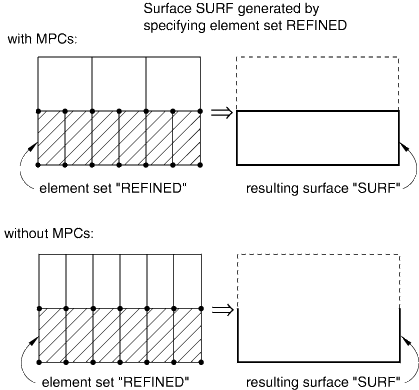

# 2.3.2 Element-based surface definition


**Products: **Abaqus/Standard  Abaqus/Explicit  Abaqus/CAE  

##### **References**

- ["Surfaces: overview," Section 2.3.1](pt01ch02s03aus16.md)
- ["Integrated output section definition," Section 2.5.1](pt01ch02s05aus23.md)
- ["Distributed loads," Section 34.4.3](pt07ch34s04aus122.md)
- ["Prescribed assembly loads," Section 34.5.1](pt07ch34s05aus127.md)
- ["Mesh tie constraints," Section 35.3.1](pt08ch35s03aus132.md)
- ["Coupling constraints," Section 35.3.2](pt08ch35s03aus133.md)
- ["Shell-to-solid coupling," Section 35.3.3](pt08ch35s03aus134.md)
- ["Contact interaction analysis: overview," Section 36.1.1](pt09ch36s01abo33.md)
- ["Cavity radiation," Section 41.1.1](pt09ch41s01aus187.md)
- [*SURFACE](../key/key-link.md#usb-kws-msurface)
- ["What is a surface?," Section 73.2.3 of the Abaqus/CAE User's Guide](../usi/usi-link.md#usi-set-conc-surface)

### Overview

An element-based surface:
- can be defined on solid, structural, rigid, surface, gasket, or acoustic elements;
- can be deformable or rigid;
- can be defined on any combination of elements in many cases;
- can be defined on the exterior of any body; and
- can be defined on the interior of any body that is modeled with continuum, shell, membrane, surface, beam, pipe, truss, or rigid elements (e.g., to define a cross-section through a body) either by simply cutting the body with a plane or by identifying the elements and the corresponding interior facets.

For details about defining node-based surfaces, see ["Node-based surface definition," Section 2.3.3](pt01ch02s03aus18.md). For details about defining analytical rigid surfaces, see ["Analytical rigid surface definition," Section 2.3.4](pt01ch02s03aus19.md). For details about defining surfaces using Boolean combinations of existing surfaces, see ["Operating on surfaces," Section 2.3.6](pt01ch02s03aus21.md).

### Defining element-based surfaces

You must assign a name to all element-based surfaces; this name can be used with various features to define a contact model, a surface-based load, or a surface-based constraint. In addition, you must specify the region of your model on which the surface is defined. In an input file you can define element-based surfaces on element faces, edges, or ends. In Abaqus/CAE you can define element-based surfaces on geometric or element faces, edges, or ends.  The methods for defining surfaces depend on the underlying element type and are discussed later in this section.

In an input file you need only specify an element number or element set name and all exposed element faces of these elements (or “contact edges” of beam, pipe, and truss elements) will be included in the surface. Optionally(and the only available method in Abaqus/CAE), you can specify individual faces, edges, or ends, which allows you direct control over which faces, edges, or ends are to be included in the surface.

For general contact in Abaqus/Explicit the surface perimeter edges are generated automatically from the surface facets for use in edge-to-edge contact constraints; you can specify that geometric feature edges should be included as well (see ["Defining general contact interactions in Abaqus/Explicit," Section 36.4.1](pt09ch36s04aus155.md), and ["Assigning surface properties for general contact in Abaqus/Explicit," Section 36.4.2](pt09ch36s04aus156.md), for more information).

| **Input File Usage: ** | ``` [*SURFACE](../key/key-link.md#usb-kws-msurface), NAME=*surface_name*, TYPE=ELEMENT (default) ``` |
| --- | --- |
|  | An element number or element set name is specified as the first entry of each data line. Optionally, an element face, edge, or end identifier can be specified as the second entry on a data line. The face and edge identifiers used in Abaqus are discussed later in this section. Multiple data lines can be used to define a surface. For example, `SURF_1` can be specified by the following input: ``` [*SURFACE](../key/key-link.md#usb-kws-msurface), NAME=SURF_1, TYPE=ELEMENT ELSET_1, ELSET_2, S2 ``` |

| **Abaqus/CAE Usage: ** | Any module except Sketch, Job, and Visualization: ****Tools****Surface****Create****: **Name:** *surface_name* |
| --- | --- |

### General restrictions on element-based surfaces

Elements defining a single surface must satisfy the following rules, regardless of how the surface is used in Abaqus: 
- Two-dimensional, axisymmetric, and three-dimensional elements cannot be mixed in the same surface definition.
- In Abaqus/Standard deformable elements cannot be combined with rigid elements to define a single surface, but can be combined with other deformable elements that are part of a rigid body (see ["Rigid body definition," Section 2.4.1](pt01ch02s04aus22.md)).
- The following element types cannot be mixed with other element types in the same surface definition: - Coupled thermal-electrical-structural elements - Coupled temperature-displacement elements - Heat transfer elements - Pore pressure elements - Coupled thermal-electrical elements - Acoustic finite or infinite elements
- The axisymmetric solid Fourier elements with nonlinear, asymmetric deformation (CAXA elements) cannot form element-based surfaces.

### Surface discretization

For element-based surfaces Abaqus uses a faceted geometry defined by the finite element mesh as the surface definition. The surface in a coarse finite element model may not be a very good approximation for contact modeling if the physical surface is curved. Therefore, sufficient mesh refinement must be used to ensure that the faceted surface is a reasonable approximation of the curved physical surface. Alternatively, some curved surface geometries may be more effectively modeled with analytical rigid surfaces (see ["Analytical rigid surface definition," Section 2.3.4](pt01ch02s03aus19.md)).

### Creating surfaces on solid, continuum shell, and cohesive elements

There are three ways to define the facets of an element-based surface on solid, continuum shell, and cohesive elements:

1. by instructing Abaqus to generate the "free surface" from the exposed faces of elements,
2. by specifying the particular faces for each element, and
3. in Abaqus/Explicit by instructing Abaqus to generate an interior surface from element faces that are not exposed (i.e., not part of the "free surface" of the model).

The automatic free surface generation approach is the simplest method of defining exterior surfaces on solid elements. Specifying the element faces gives you exact control over which element faces (any combination of exterior and interior faces) form the surface. Automatic generation of an interior surface is the simplest method of defining interior surfaces on solid elements (interior surfaces can be useful for modeling surface erosion due to element failure).

It is possible to use all three approaches in the same surface definition when creating a single surface.

#### Generating the free surface automatically

You can define the facets of a surface by specifying a series of elements. The faces of these elements that are on the exterior (free) surface of the model are included in the surface definition.

When the free surface generation method is used to define surfaces, the specified elements can be a mixture of continuum and structural elements.

Multi-point constraints (["General multi-point constraints," Section 35.2.2](pt08ch35s02aus130.md)) involving nodes on exposed surfaces are not taken into account during free surface generation, which can result in faces that are not on the exterior of a body being included in surface definitions. For example, the nodes of the elements in element set `REFINED` shown in [Figure 2.3.2--1](pt01ch02s03aus17.md#adefsurf-exp-mpc-auto) are used in linear, mesh-refinement constraints. The surfaces generated with and without multi-point constraints are shown in [Figure 2.3.2--1](pt01ch02s03aus17.md#adefsurf-exp-mpc-auto).

**Figure 2.3.2–1** Effect of multi-point constraints on automatic surface generation.



| **Input File Usage: ** | ``` [*SURFACE](../key/key-link.md#usb-kws-msurface), NAME=*surface_name*, TYPE=ELEMENT *element number or element set,* ``` |
| --- | --- |
|  | For example, if the name of the shaded element set in [Figure 2.3.2--2](pt01ch02s03aus17.md#adefsurf-auto-free-surf) is `ESETA`, the surface named `ASURF` is specified by ``` [*SURFACE](../key/key-link.md#usb-kws-msurface), NAME=ASURF, TYPE=ELEMENT ESETA, ``` |

| **Abaqus/CAE Usage: ** | The automatic free surface generation method is not supported in Abaqus/CAE. |
| --- | --- |

**Figure 2.3.2–2** Automatic free surface generation.


##### Special treatment of cohesive elements for automatic free surface generation

The definition of exposed faces of elements for the purpose of automatic free surface generation has the following unique aspects regarding cohesive elements:
- Faces of non-cohesive elements along an interface of shared nodes with cohesive elements are considered exposed.
- The top and bottom faces of all cohesive elements are considered exposed; side faces of cohesive elements are never considered exposed.

See ["Modeling with cohesive elements," Section 32.5.3](pt06ch32s05alm42.md), for examples of surfaces on or near cohesive elements.

#### Creating surface facets by specifying solid, continuum shell, and cohesive element faces

You can define the facets of a surface by identifying the element faces that should be included in the surface definition.

| **Input File Usage: ** | ``` [*SURFACE](../key/key-link.md#usb-kws-msurface), NAME=*surface_name*, TYPE=ELEMENT *element number or set, face identifier* ``` |
| --- | --- |
|  | Element face numbers are defined in [Part VI, "Elements](pt06.md)." [Table 2.3.2--1](pt01ch02s03aus17.md#table-adeformsurf-face-ids) contains a list of valid face identifiers for all solid, continuum shell, and cohesive elements. The face identifier can refer to individual elements or to entire element sets. When you specify the element faces to define surfaces, the specified elements cannot be a mixture of continuum and structural elements; however, each data line of the surface definition can refer to different element types. |

| **Abaqus/CAE Usage: ** | Any module except Sketch, Job, and Visualization: ****Tools****Surface****Create****: **Name:** *surface_name*, pick faces in viewport |
| --- | --- |

**Table 2.3.2–1** Surface definition face identifier labels for solid, continuum shell, and cohesive elements.
| Elements | Face Labels |
| --- | --- |
| DCCAX2(D) | SPOS, SNEG |
| CPEG3(H)(T)CPS3(T)CPE3(H)(T)CAX3(H)(T)CGAX3(H)AC2D3ACAX3 DC2D3(E)DCAX3(E) | CPEG6(M)(H)(T)CPS6M(T) CPE6(M)(H)(T) CAX6(M)(H)(T) CGAX6(M)(H)(T) AC2D6ACAX6 DC2D6(E)DCAX6(E) | S1, S2, S3 |
| CGAX4(R)(H)(T) CPEG4(H)(I)(R)(T) CPS4(I)(R)(T) CPE4(H)(I)(R)(T)(P) CAX4(H)(I)(R)(T)(P) C3D4(H)(T) AC2D4(R) ACAX4(R)AC3D4 DC2D4(E)DCAX4(E)DC3D4(E)DCC2D4(D)COH2D4 | CGAX8(R)(H) CPEG8(R)(H)(T) CPS8(R)(T) CPE8(H)(R)(T)(P) CAX8(R)(H)(T)(P)C3D10(M)(H)(I)(T)AC2D8 ACAX8AC3D10 DC2D8(E) DCAX8(E)DC3D10(E)DCCAX4(D)COHAX4 | S1, S2, S3, S4 |
| C3D6(H)(T) AC3D6CCL9(H) DC3D6(E) SC6R | C3D15(H)(V) AC3D15 CCL18(H) DC3D15(E) COH3D6 | S1, S2, S3, S4, S5 |
| C3D8(H)(I)(R)(T)(P) C3D27(R)(H)AC3D8(R) CCL12(H) DC3D8(E) DCC3D8(D)SC8R | C3D20(H)(R)(T)(P)AC3D20 CCL24(R)(H) DC3D20(E)COH3D8 | S1, S2, S3, S4, S5, S6 |

#### Generating an interior surface automatically

In Abaqus/Explicit you can define the facets of a surface on the interior of a solid element mesh. The faces of the specified elements that are not on the exterior (free) surface of the model will be included in the surface definition. For example, interior surfaces are used with the general contact algorithm in Abaqus/Explicit for modeling surface erosion due to element failure (see ["Defining general contact interactions in Abaqus/Explicit," Section 36.4.1](pt09ch36s04aus155.md)).

The automatic generation of an interior surface is equivalent to constructing a surface consisting of all faces of the elements and then subtracting the free surfaces of those elements. Shell elements, beam elements, pipe elements, membrane elements, etc. are ignored since they do not have any interior faces by definition. 

Multi-point constraints are not taken into account when generating interior surfaces. This can result in faces that are on the interior of a body being excluded from the surface definition.

| **Input File Usage: ** | ``` [*SURFACE](../key/key-link.md#usb-kws-msurface), NAME=*surface_name*, TYPE=ELEMENT *element number or element set*, INTERIOR ``` |
| --- | --- |
|  | For example, if the name of the shaded element set in [Figure 2.3.2--3](pt01ch02s03aus17.md#adefsurf-auto-interior-surf) is `ESETA`, the surface named `ASURFINTR` (the elements in the figure have been reduced in size to differentiate faces that share the same nodes) is specified by ``` [*SURFACE](../key/key-link.md#usb-kws-msurface), NAME=ASURFINTR, TYPE=ELEMENT ESETA, INTERIOR ``` |

| **Abaqus/CAE Usage: ** | Any module except Sketch, Job, and Visualization: ****Tools****Surface****Create****: **Name:** *surface_name*, **Type**: **Mesh**; pick element faces or edges from an interior surface |
| --- | --- |
|  | You can use the selection tools to select from an interior entity of a model; see ["Selecting interior surfaces," Section 6.2.12 of the Abaqus/CAE User's Guide](../usi/usi-link.md#uss-pic-interior). |

**Figure 2.3.2–3** Automatic interior surface generation.


### Creating surfaces on structural, surface, and rigid elements

There are five ways to define surfaces on structural, surface, and rigid elements:

1. You can create a single-sided surface with a well-defined orientation by indicating either the top or bottom surface of each specified element.
2. You can create a double-sided surface by specifying only the elements and letting Abaqus generate the "free surface" from the exposed faces.
3. You can create an edge-based surface.
4. You can create a cross-section surface on the ends of beam, pipe, and truss elements.
5. You can create a three-dimensional curve-type surface along the length of beam, pipe, and truss elements by specifying only the elements and letting Abaqus generate the "free surface."

It is possible to use any or all of the above approaches in the same surface definition as long as it makes sense in the use of that surface with other features in Abaqus. [Table 2.3.2--2](pt01ch02s03aus17.md#table-astructsurf-face-ids) contains a list of valid face and edge identifiers for structural, surface, and rigid elements.

**Table 2.3.2–2** Surface definition face and edge identifier labels for structural, surface, and rigid elements.
| Elements | Face and Edge Labels |
| --- | --- |
| SAX1 MAX1 MGAX1M3D6M3D9(R)MCL9 DS8 DSAX2SFMAX2 SFMGAX2SFM3D4(R) SFM3D8(R)SFMCL6 | SAX2(T) MAX2MGAX2M3D8(R) MCL6DS4 DSAX1SFMAX1 SFMGAX1SFM3D3SFM3D6SFMCL9 RAX2 | SPOS, SNEG |
| B21(H) B23(H)PIPE21(H) T2D2(H)(T) | B22(H) (Abaqus/Standard)PIPE22(H) T2D3(H)(T) | END1, END2 |
| B22 (Abaqus/Explicit) B32(H)(OS)ELBOW31(B)(C) PIPE31(H)T3D2(H)(T) | B31(H)(OS) B33(H)ELBOW32 PIPE32(H)T3D3(H)(T) | END1, END2; must use node-based surfaces with the contact pair algorithm in Abaqus/Explicit. |
| STRI3 S3(R)(S)M3D3 | STRI65 R3D3 | SPOS, SNEG,E1, E2, E3 |
| ACIN2D2ACINAX2 | ACIN2D3ACINAX3 | SPOS E1, E2 |
| S4(R)(S)(W)(5)S9R5M3D4(R) | S8R5(T) R3D4 | SPOS, SNEG,E1, E2, E3, E4 |
| ACIN3D3 | ACIN3D6 | SPOSE1, E2, E3 |
| ACIN3D4 | ACIN3D8 | SPOS E1, E2, E3, E4 |

#### Defining single-sided surfaces

You can define a single-sided surface on the positive or negative face of structural, surface, or rigid elements. The positive face is defined as the one in the direction of the positive element normal, and the negative face is defined as the one in the direction opposite to the element normal. The definition of the element normal for all elements is given in [Part VI, "Elements](pt06.md).” 

You must ensure that all of the specified elements have their normals oriented consistently. If they are oriented as shown in [Figure 2.3.2--4](pt01ch02s03aus17.md#adefsurf-bad-struct-norm), the surface normals will reverse direction as the surface is traversed and improper results may occur when the surface is used with features requiring an orientation such as distributed surface loads. 

**Figure 2.3.2–4** Inconsistent orientation of structural element normals can result in an invalid surface.


Further, an error message will be issued and the analysis will terminate if this condition is detected for surfaces used with mesh tie constraints in Abaqus/Standard or with contact pairs. To correct the surface orientations in this figure, two separate element sets with different face identifiers should be used.

| **Input File Usage: ** | Use the following option to define a surface on the positive face of a structural, surface, or rigid element: |
| --- | --- |
|  | ``` [*SURFACE](../key/key-link.md#usb-kws-msurface), NAME=*surface_name*, TYPE=ELEMENT *element number or element set*, SPOS ``` Use the following option to define a surface on the negative face of a structural, surface, or rigid element: ``` [*SURFACE](../key/key-link.md#usb-kws-msurface), NAME=*surface_name*, TYPE=ELEMENT *element number or element set*, SNEG ``` For example, single-sided surfaces on the positive faces of the elements in element set `SHELL` can be defined using input similar to ``` [*SURFACE](../key/key-link.md#usb-kws-msurface), NAME=BSURF, TYPE=ELEMENT SHELL, SPOS ``` |

| **Abaqus/CAE Usage: ** | Any module except Sketch, Job, and Visualization: ****Tools****Surface****Create****: **Name:** *surface_name*, pick face in viewport, click mouse button 2, and specify the side of the selected face |
| --- | --- |

#### Defining double-sided surfaces

You can create double-sided surface facets on three-dimensional shell, membrane, surface, and rigid elements using the automatic surface facet generation approach (i.e., specifying only the element numbers or sets). Some applications that refer to surfaces do not allow the use of double-sided surfaces: examples include contact pairs in Abaqus/Standard and features requiring an oriented surface such as distributed surface loads. When double-sided surfaces can be used, they are often preferred to single-sided surfaces. In some applications, such as when defining the contact domain for general contact, it does not matter whether single- or double-sided surfaces are used.

When double-sided surfaces are used with contact pairs in Abaqus/Explicit, the normals of all the underlying elements do not need to have a consistent positive orientation: Abaqus/Explicit will define the contact surface such that its facets have consistent normals, even if the underlying elements do not have consistent normals. The facet normals will be the same as the element normals if the element normals are all consistent; otherwise, an arbitrary positive orientation is chosen for the surface. The positive orientation is significant only with respect to the sign of the contact pressure output variable for the contact pair algorithm, CPRESS (see ["Output" in "Defining contact pairs in Abaqus/Explicit," Section 36.5.1](pt09ch36s05aus160.md#usb-cni-aexpcontactpair-output)). 

Although contact is enforced unconditionally on both sides of a surface when self-contact is used with contact pairs, contact is enforced on both sides of a surface used in two-body contact only when that surface is double-sided (if allowed). The use of single-sided surfaces with contact pairs is sometimes desirable: the resolution of large initial overclosures in contact pairs is more robust with single-sided surfaces than with double-sided surfaces (see ["Adjusting initial surface positions and specifying initial clearances for contact pairs in Abaqus/Explicit," Section 36.5.4](pt09ch36s05aus163.md)). However, single-sided contact is generally more limiting than double-sided contact; it may cause an analysis to fail due to excessive element distortion or not enforce the contact conditions realistically if a slave node unexpectedly moves behind a master surface. This condition can occur, for example, when large deformations or rigid-body motions are present or due to complex tool shapes in a forming analysis.

| **Input File Usage: ** | Use the following option to define a double-sided surface on three-dimensional shell, membrane, surface, or rigid elements in Abaqus/Explicit: |
| --- | --- |
|  | ``` [*SURFACE](../key/key-link.md#usb-kws-msurface), NAME=*surface_name*, TYPE=ELEMENT *element number or element set*, ``` For example, double-sided surfaces on the elements in element set `SHELL` can be defined using input similar to ``` [*SURFACE](../key/key-link.md#usb-kws-msurface), NAME=BSURF, TYPE=ELEMENT SHELL, ``` |

| **Abaqus/CAE Usage: ** | Any module except Sketch, Job, and Visualization: ****Tools****Surface****Create****: **Name:** *surface_name*, pick face in viewport, click mouse button 2, and choose **Both sides** |
| --- | --- |

#### Defining edge-based surfaces

You can define an edge-based surface on three-dimensional shell, membrane, surface, or rigid elements by specifying the individual edges. Alternatively, you can specify that all the edges of the elements that are on the exterior (free) surface of the model are used to form the surface; this method cannot be used to define edge-based surfaces that are in the interior of the model. It is possible to use both methods in the same surface definition when creating a single surface.

| **Input File Usage: ** | Use the following option to specify the individual edges that form the surface: |
| --- | --- |
|  | ``` [*SURFACE](../key/key-link.md#usb-kws-msurface), NAME=*surface_name*, TYPE=ELEMENT *element number or element set, edge identifier* ``` The individual edge identifiers used in Abaqus are listed in [Table 2.3.2--2](pt01ch02s03aus17.md#table-astructsurf-face-ids). Use the following option to specify that all the edges of the elements that are on the exterior (free) surface of the model are used to form the surface: ``` [*SURFACE](../key/key-link.md#usb-kws-msurface), NAME=*surface_name*, TYPE=ELEMENT *element number or element set*, EDGE ``` For example, if the shaded element set in [Figure 2.3.2--2](pt01ch02s03aus17.md#adefsurf-auto-free-surf) is composed of three-dimensional shell elements and is named `ESETA`, the surface named `ESURF` could be specified by the following input: ``` [*SURFACE](../key/key-link.md#usb-kws-msurface), NAME=ESURF, TYPE=ELEMENT ESETA, EDGE ``` |

| **Abaqus/CAE Usage: ** | Any module except Sketch, Job, and Visualization: ****Tools****Surface****Create****: **Name:** *surface_name*, pick edges in viewport |
| --- | --- |
|  | In Abaqus/CAE you can specify that all the edges of the elements that are on the exterior (free) surface of the model are used to form the surface by directly picking all the free edges in the viewport. |

#### Defining a surface over the cross-section at the ends of beam, pipe, and truss elements

To define a surface over the cross-section of beam, pipe, or truss elements, you must specify the end on which the surface is defined. Surfaces created on the ends of these elements can be used only for integrated output request (see ["Integrated output in Abaqus/Explicit" in "Output to the output database," Section 4.1.3](pt02ch04s01aus40.md#usb-out-odboutput-integrated)) and integrated output section (see ["Integrated output section definition," Section 2.5.1](pt01ch02s05aus23.md)) definitions.

| **Input File Usage: ** | Use the following option to define a surface over the cross-section of a beam, pipe, or truss element: |
| --- | --- |
|  | ``` [*SURFACE](../key/key-link.md#usb-kws-msurface), NAME=*surface_name*, TYPE=ELEMENT *element number or element set*, END1 or END2 ``` |

| **Abaqus/CAE Usage: ** | Any module except Sketch, Job, and Visualization: ****Tools****Surface****Create****: **Name:** *surface_name*, pick three-dimensional wire region in viewport, click mouse button 2, and choose **End (Magenta)** or **End (Yellow)** |
| --- | --- |

#### Defining a surface along the length of three-dimensional beam, pipe, and truss elements

You cannot specify the faces to define a surface along the length of three-dimensional beams, pipes, or trusses because their element connectivity cannot define a unique element or surface normal. Instead, you must specify that Abaqus should generate a surface for these elements. Therefore, the use of surfaces along the length of these elements is restricted.

In Abaqus/Standard element-based surfaces created along the length of three-dimensional beam, pipe, or truss elements can be used in tie constraints but can be used only as slave surfaces in contact interactions. However, there are several advantages to using an element-based surface rather than a node-based surface when modeling contact in Abaqus/Standard with three-dimensional beams, pipes, or trusses:

1. The default local tangent directions are parallel and orthogonal to the element axis.
2. Abaqus/Standard calculates the contact results as contact forces per unit length rather than just contact forces.
3. It can be easier to define an element-based surface than a node-based surface.

In Abaqus/Standard a surface definition is not allowed for cases where three or more three-dimensional beams, pipes, or trusses are joined at a common node because of the lack of uniquely defined element tangents.

In Abaqus/Explicit element-based surfaces created along the length of three-dimensional beam, pipe, or truss elements can be used only with the general contact algorithm or tie constraints. To define contact for these elements using the contact pair algorithm, the nodes forming the beam, pipe, or truss elements can be included in a node-based surface definition (["Node-based surface definition," Section 2.3.3](pt01ch02s03aus18.md)) and a contact pair can be defined for this node-based surface and a non-node-based surface.

Surfaces along the length of three-dimensional beam, pipe, or truss elements cannot be used to prescribe a distributed surface load since the loading direction is not unique.

| **Input File Usage: ** | Use the following option to define a surface along the length of a three-dimensional beam, pipe, or truss element: |
| --- | --- |
|  | ``` [*SURFACE](../key/key-link.md#usb-kws-msurface), NAME=*surface_name*, TYPE=ELEMENT *element number or element set*, ``` |

| **Abaqus/CAE Usage: ** | Any module except Sketch, Job, and Visualization: ****Tools****Surface****Create****: **Name:** *surface_name*, pick three-dimensional wire region in viewport, click mouse button 2, and choose **Circumferential** |
| --- | --- |

#### Surfaces along the length of two-dimensional beam, pipe, and truss elements

Surfaces created along the length of two-dimensional beam, pipe, and truss elements can be used as master surfaces in a contact pair simulation because the underlying elements have unique element normals that lie in the plane of the model. These surfaces can also be used to prescribe distributed surface loads.

#### Shell, membrane, or rigid element thickness and shell offset

Some applications that refer to surfaces will account for underlying element thicknesses and any offset of the midsurface relative to the reference surface for surfaces based on shell, membrane, or rigid elements. For example, all of the contact algorithms available in Abaqus/Explicit can account for these effects. Of the contact algorithms available in Abaqus/Standard, only the surface-to-surface small-sliding contact formulation can account for these effects. See the following sections for additional details on applications that can account for surface thickness and offset: 
- ["Mesh tie constraints," Section 35.3.1](pt08ch35s03aus132.md)
- ["Contact formulations in Abaqus/Standard," Section 38.1.1](pt09ch38s01aus177.md)
- ["Assigning surface properties for general contact in Abaqus/Explicit," Section 36.4.2](pt09ch36s04aus156.md)
- ["Assigning surface properties for contact pairs in Abaqus/Explicit," Section 36.5.2](pt09ch36s05aus161.md)

### Creating surfaces on gasket elements

When surfaces are defined on gasket elements, automatic surface facet generation cannot be used because only the top and bottom element faces can be used to create surfaces (see ["Gasket elements: overview," Section 32.6.1](pt06ch32s06abo30.md)). Abaqus/Standard cannot create surfaces on gasket link elements since the top and bottom surfaces are each reduced to a single node. For other gasket elements you must specify the top and bottom surfaces directly. The positive face of the element is in the thickness direction of the element. The definition of the thickness direction of all gasket elements is given in ["Defining the gasket element's initial geometry," Section 32.6.4](pt06ch32s06alm49.md). The negative face is defined as the face in the direction opposite to the thickness direction of the element.

| **Input File Usage: ** | Use the following option to define a surface on the positive face of a gasket element: |
| --- | --- |
|  | ``` [*SURFACE](../key/key-link.md#usb-kws-msurface), NAME=*surface_name*, TYPE=ELEMENT *element number or element set*, SPOS ``` Use the following option to define a surface on the negative face of a gasket element: ``` [*SURFACE](../key/key-link.md#usb-kws-msurface), NAME=*surface_name*, TYPE=ELEMENT *element number or element set*, SNEG ``` For example, single-sided surfaces on the positive faces of the elements in element set `GASKET` can be defined using input similar to ``` [*SURFACE](../key/key-link.md#usb-kws-msurface), NAME=BSURF, TYPE=ELEMENT GASKET, SPOS ``` |

| **Abaqus/CAE Usage: ** | Any module except Sketch, Job, and Visualization: ****Tools****Surface****Create****: **Name:** *surface_name*, pick top or bottom faces in viewport |
| --- | --- |

#### Surfaces on three-dimensional gasket line elements

There are several advantages to using an element-based surface rather than a node-based surface when modeling contact in Abaqus/Standard with three-dimensional gasket line elements:

1. The local tangent directions are parallel and orthogonal to the gasket line element, which is useful for output purposes and for anisotropic friction definition.
2. Abaqus/Standard calculates the contact results as contact forces per unit length rather than just contact forces.

Surfaces created on three-dimensional gasket line elements can be used only as slave surfaces because Abaqus/Standard cannot form unique normals for these surfaces.

### Creating interior cross-section surfaces

To study the “force-flow” through various paths in a model, you must create interior surfaces that cut through one or more components (similar to a cross-section) so that you can request integrated output of the total force transmitted across these surfaces (see ["Requesting integrated output for "force-flow" studies" in "Output to the output database," Section 4.1.3](pt02ch04s01aus40.md#usb-out-odboutput-forceflow)). Abaqus provides a simple method to create such an interior surface over the element facets, edges, or ends by cutting through a region of the model with a plane. The region can be identified using one or more element sets. If no element sets are specified, the region consists of the whole model. The cutting plane is defined by specifying the coordinates of a point on the plane and a vector normal to the plane. Alternatively, the cutting plane can be defined by specifying the global node numbers of point *a* on the plane and point *b* that lies off the cutting plane with the normal determined as the vector from point *a* to point *b*. Abaqus then automatically forms a surface close to the specified cutting plane by selecting the element facets, edges, or ends of the continuum solid, shell, membrane, surface, beam, pipe, truss, or rigid elements in the selected region. The surface generated in this manner is an approximation for the cutting plane.

Multi-point mesh constraints are ignored while generating the interior surface based on the cutting plane; therefore, the result may be a surface that is not continuous if these constraints stitch disjointed meshes together in a region that is cut by the cutting plane. When the cutting plane intersects a beam, pipe, or truss element, the entire element is shown in the Visualization module of Abaqus/CAE as being part of the surface. However, if this surface is used for integrated output, only the element nodal forces from the element end that lies on the positive side as defined by the normal to the cutting plane are included in the integrated output. Point mass and rotary elements, connector elements, spot welds, and spring elements will not be part of the generated surface even if they are cut by the cutting plane.

| **Input File Usage: ** | Use the following option to define the cutting surface by specifying coordinates of a point on the plane and a vector normal to the plane: |
| --- | --- |
|  | ``` [*SURFACE](../key/key-link.md#usb-kws-msurface), NAME=*surface_name*, TYPE=CUTTING SURFACE, DEFINITION=COORDINATES ``` Use the following option to define the cutting surface by specifying global node numbers of points *a* and *b*: ``` [*SURFACE](../key/key-link.md#usb-kws-msurface), NAME=*surface_name*, TYPE=CUTTING SURFACE, DEFINITION=NODES ``` |

| **Abaqus/CAE Usage: ** | Interior cross-section surfaces are not supported in Abaqus/CAE. |
| --- | --- |

### Whole-model free surface in an Abaqus/Explicit input file

In an Abaqus/Explicit input file you can create a surface containing the exposed faces of all elements (and “contact edges” of beam, pipe, and truss elements) in the model except cohesive elements by specifying a blank element set name and a blank face identifier. This “free” surface of the model can be used as the base surface for the cropping and combining operations; without modifications this surface is similar to the default all-inclusive surface commonly used in general contact (see ["Defining general contact interactions in Abaqus/Explicit," Section 36.4.1](pt09ch36s04aus155.md)).

| **Input File Usage: ** | ``` [*SURFACE](../key/key-link.md#usb-kws-msurface), NAME=*surface_name*, TYPE=ELEMENT , ``` |
| --- | --- |

| **Abaqus/CAE Usage: ** | The whole-model automatic free surface generation method is not supported in Abaqus/CAE. |
| --- | --- |

### Trimming the perimeter of an open surface

An “open” surface is one that has ends in two dimensions or an outside edge in three dimensions. The ends of a two-dimensional surface and the edge of a three-dimensional surface are called the surface's “perimeter.” Since Abaqus allows a surface to be defined as only a part of the surface of a body, it may have a perimeter even though it is defined on a closed body. Abaqus automatically performs surface “trimming” on solid element meshes. You can change the default setting when a surface is created, providing some basic control over the extent of surfaces.

Surface trimming:
- is a recursive procedure that removes undesirable convex corners near the perimeter of an open surface (see the example below for details);
- has no effect on closed surfaces (ones with no ends or edges);
- is performed automatically, unless the surface is used as a master surface in a finite-sliding simulation in Abaqus/Standard or the surface is used with the contact pair algorithm in Abaqus/Explicit;
- can be used only for external surfaces on solid element meshes (either specified surfaces or automatically generated free surfaces); and
- has no effect on surfaces used with the contact pair algorithm in Abaqus/Explicit.

| **Input File Usage: ** | Use the following option to suppress automatic surface trimming: |
| --- | --- |
|  | ``` [*SURFACE](../key/key-link.md#usb-kws-msurface), TYPE=ELEMENT, NAME=*surface_name*, TRIM=NO ``` |

| **Abaqus/CAE Usage: ** | Automatic surface trimming cannot be suppressed in Abaqus/CAE. |
| --- | --- |

#### The effect of surface trimming

The effect of surface trimming is best explained by means of an example. [Figure 2.3.2--5](pt01ch02s03aus17.md#adefsurf-trim-exa) illustrates the effect of trimming for two different surfaces defined on the same simple two-dimensional mesh.

**Figure 2.3.2–5** Case I: Faces *A* and *B* are removed when trimming is done since one node of each of the faces is an end node and the other is a corner node. Case II: Faces *A* and *B* are not removed when trimming is done since one node of each of the faces is an end node but the other is not a corner node.


In Case I the surface definition consists of a single layer of elements on the perimeter of the model. Using automatic surface facet generation, the resulting default surface (curve) includes the vertical element faces *A* and *B* since these faces lie on the perimeter of the model. Trimming the default surface created in Case I eliminates faces *A* and *B* since their presence results in the two spurious corners near the perimeter of the curve.

Abaqus uses a special criterion in deciding to remove faces *A* and *B* from the original open curve. A face is removed if one of its end nodes is an endpoint and either of the following is true: another face node is a node on an element corner belonging to the curve or the face normal differs by more than 30 from the normal of an adjacent face also belonging to the curve. To be a node on an element corner belonging to the curve means to be a node on two different faces of the same element, both of which are part of the curve. The face removal criterion is applied recursively to the curve definition until all corners on or near the perimeter of the curve have been removed. This procedure is generalized for three-dimensional surface definitions.

In Case II in [Figure 2.3.2--5](pt01ch02s03aus17.md#adefsurf-trim-exa) trimming would not result in the elimination of faces *A* and *B* because neither of the endpoints of these two faces meets the criterion described above.

#### Why Abaqus will, by default, trim most surfaces

Trimming of surfaces used for application of distributed loads is usually desired since loads are normally applied to specific sides of a body. Any surface that is used for application of a distributed load will, by default, be trimmed. 

In Abaqus/Standard trimming the slave surface in contact or interaction simulations results in more accurate estimates of the contact pressures, heat fluxes, and electrical current densities along the perimeter of the surface. Any surface that is used as a slave surface in a contact or interaction simulation will, by default, be trimmed. If the slave surface is left untrimmed, the nodes at the corners of the surface will be assigned additional contact area from the element faces around the corners that may never be involved in the interaction between the surfaces. This additional contact area introduces errors into the estimates of the contact output variables at those nodes. Master surfaces in small-sliding simulations will, by default, be trimmed; Abaqus/Standard will normally form a better approximate surface. However, master surfaces in finite-sliding contact simulations will, by default, be left untrimmed, and they should extend far enough away from all expected regions of contact. This practice protects against the possibility of the slave surface nodes sliding off the master surface (see ["Common difficulties associated with contact modeling in Abaqus/Standard," Section 39.1.2](pt09ch39s01aus184.md)).


