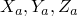
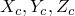
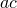
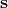
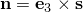
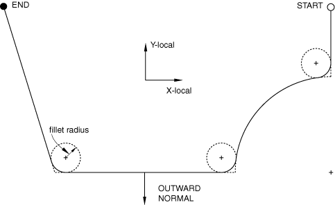
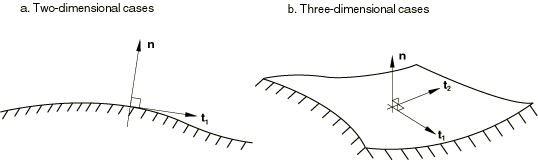

# 2.3.4 Analytical rigid surface definition


**Products: **Abaqus/Standard  Abaqus/Explicit  Abaqus/CAE  

##### **References**

- ["Surfaces: overview," Section 2.3.1](pt01ch02s03aus16.md)
- ["Contact interaction analysis: overview," Section 36.1.1](pt09ch36s01abo33.md)
- ["RSURFU," Section 1.1.16 of the Abaqus User Subroutines Reference Guide](../sub/sub-link.md#sub-rtn-ursurfu)
- [*RIGID BODY](../key/key-link.md#usb-kws-mrigidbody)
- [*SURFACE](../key/key-link.md#usb-kws-msurface)

### Overview

An analytical rigid surface:
- can be two-dimensional or three-dimensional;
- must be defined as model data;
- can be used with the infinitesimal-sliding, small-sliding, or finite-sliding mechanical contact formulations;
- should be oriented such that the analytical rigid surface's outward normal points toward any body it may contact; and
- is associated with a node, known as the rigid body reference node, whose motion governs the motion of the surface.

### What are analytical rigid surfaces and why use them?

Analytical rigid surfaces are geometric surfaces with profiles that can be described with straight and curved line segments. These profiles can be swept along a generator vector or rotated about an axis to form a three-dimensional surface. An analytical rigid surface is associated with a rigid body reference node, whose motion governs the motion of the surface. An analytical rigid surface does not contribute to the rigid body's mass or inertia properties (see ["Rigid body definition," Section 2.4.1](pt01ch02s04aus22.md)). The degrees of freedom of the rigid body reference node become active only when the analytical surface is used in a contact interaction or when an element (such as a spring element or a mass element) is connected to the rigid body reference node.

Analytical rigid surfaces are always single-sided with their orientation specified through their definition. Therefore, contact interaction is recognized only on the outer boundary of an analytical rigid surface. To model contact on both sides of a thin structure, use an analytical rigid surface that wraps around the boundary of the thin structure.

#### Advantages

Using analytical rigid surfaces instead of defining element-based rigid surfaces provides two important advantages in contact modeling.
- Many curved geometries can be modeled exactly with analytical rigid surfaces because of the ability to parameterize the surface with curved line segments. The result is a smoother surface description, which can reduce contact noise and provide a better approximation to the physical contact constraint.
- Using analytical rigid surfaces instead of rigid surfaces formed by element faces may result in decreased computational cost incurred by the contact algorithm. The use of curved line segments instead of many linear facets will decrease the time spent in contact tracking operations. Additional computational savings may be realized in three dimensions because of the intrinsic two-dimensional descriptions of the analytical surfaces.

#### Disadvantages

There are also some disadvantages to using analytical rigid surfaces for contact modeling.
- An analytical rigid surface must always act as a master surface in a contact interaction. Therefore, contact cannot be modeled between two analytical rigid surfaces.
- Contact forces and pressures cannot be contoured on an analytical rigid surface. However, contact forces and pressures can be plotted on the slave surface.
- The use of a very large number (thousands) of segments to define an analytical rigid surface can degrade performance. In most cases it is not necessary to use a large number of segments to define an analytical rigid surface, because curved segment types are allowed. In rare cases in which a very large number of segments would be necessary, the analysis may be more efficient if an element-based rigid surface is used instead (see ["Element-based surface definition," Section 2.3.2](pt01ch02s03aus17.md)).
- An analytical rigid surface does not contribute to the mass and rotary inertia properties of the rigid body with which it is associated. Therefore, if the mass distribution on an analytical rigid surface needs to be accounted for, equivalent mass and rotary inertia properties must be defined for the rigid body by using MASS and ROTARYI elements, or a finite element discretization of the surface should be used instead of an analytical rigid surface (see ["Rigid body definition," Section 2.4.1](pt01ch02s04aus22.md)).
- In Abaqus/Explicit reaction force output for a rigid body containing an analytical rigid surface is calculated only for constraints that are active at the reference node (e.g., constraints specified as boundary conditions). If the net contact force on the rigid body corresponding to an unconstrained degree of freedom is desired, it must be calculated from the rigid body's acceleration and mass.

### Creating an analytical rigid surface

You can define the following types of simple, two- or three-dimensional, geometric analytical surfaces:
- planar (two-dimensional) surfaces,
- three-dimensional cylindrical (swept) surfaces, and
- three-dimensional surfaces of revolution.

In Abaqus/Standard if none of these surfaces is adequate, you can define a more general analytical surface with user subroutine [`RSURFU`](../sub/sub-link.md#sub-xsl-rsurfu).

Analytical rigid surfaces are useful when the cross-sections of the surfaces can be represented by straight and curved line segments. The curved segments can be either circular or parabolic arcs. In two-dimensional simulations the line segments are defined in the global coordinate system of the deformable model. In three-dimensional simulations a local, two-dimensional coordinate system must be created, and the line segments are then defined in that system. The two standard types of three-dimensional analytical rigid surfaces available are shown in [Figure 2.3.4--1](pt01ch02s03aus19.md#arigsurf-3d-analytic-exa).

**Figure 2.3.4–1** Examples of three-dimensional rigid surfaces.


You must indicate which type of analytical surface (planar, cylindrical, or revolution) is being created and assign a name to the surface. In addition, you must define the analytical surface as part of a rigid body by specifying the name of the analytical surface and the rigid body reference node that will control the motion of the surface in a rigid body definition.

An Abaqus model can be defined in terms of an assembly of part instances (see ["Defining an assembly," Section 2.10.1](pt01ch02s10aus28.md)). A part can contain only one analytical surface. A part containing an analytical surface definition cannot also contain elements.

| **Input File Usage: ** | Use both of the following options to create an analytical rigid surface: |
| --- | --- |
|  | ``` [*SURFACE](../key/key-link.md#usb-kws-msurface), TYPE=*analytical_surface_type*, NAME=*name* [*RIGID BODY](../key/key-link.md#usb-kws-mrigidbody), ANALYTICAL SURFACE=*name*, REF NODE=*n* ``` |

| **Abaqus/CAE Usage: ** | Part module: **Create Part**: **Name:** *analytical_rigid_part*: select **Analytical rigid** as the **Type** |
| --- | --- |
|  | Then do one of the following: Any module except Sketch, Job, and Visualization: ****Tools****Surface****Create****: select *analytical_rigid_part* Interaction module: **Create Constraint**: **Rigid body**: **Analytical Surface**: **Edit**: select *analytical_rigid_part* Interaction module: **Create Interaction**: *any valid type*: select *analytical_rigid_part* as one of the regions involved in contact |

#### Defining a surface profile

The surface profile is the collection of line segments defining the cross-section of the surface. The surface type determines whether the profile is swept (cylindrical surfaces), revolved (surfaces of revolution), or, in the two-dimensional case, used as is (planar surfaces).

You construct a profile by providing the endpoint of each line segment in the profile; the starting point is always the endpoint of the previous segment, or, in the case of the first segment, the point specified as the starting point. The center points of circular arcs must be given. Abaqus can define only arcs that are less than 179.74; thus, it will use the shorter arc defined by the data provided (use two adjacent arcs to define a longer arc). For parabolic arcs you must give a third point that lies on the parabola and within the arc.

#### Two-dimensional rigid surfaces

To define a planar rigid surface, specify the line segments forming the rigid surface's profile in the global coordinate system. If the analytical surface is being defined inside a part, specify the line segments in the local part coordinate system.

| **Input File Usage: ** | ``` [*SURFACE](../key/key-link.md#usb-kws-msurface), TYPE=SEGMENTS, NAME=*name* *data lines to define the line segments forming the surface* ``` |
| --- | --- |
|  | For example, the definition of the two-dimensional rigid surface depicted in [Figure 2.3.4--2](pt01ch02s03aus19.md#arigsurf-2d-analytic-exa) is ``` [*SURFACE](../key/key-link.md#usb-kws-msurface), TYPE=SEGMENTS, NAME=BSURF START, ,  CIRCL, , , ,  LINE, ,  CIRCL, , , ,  [*RIGID BODY](../key/key-link.md#usb-kws-mrigidbody), ANALYTICAL SURFACE=BSURF, REF NODE=101 ``` where  and  are the global coordinates of the points shown in [Figure 2.3.4--2](pt01ch02s03aus19.md#arigsurf-2d-analytic-exa). |

| **Abaqus/CAE Usage: ** | Part module: **Create Part**: **Name:** *analytical_rigid_part*: select **2D Planar** or **Axisymmetric** as the **Modeling Space** and **Analytical rigid** as the **Type** |
| --- | --- |

**Figure 2.3.4–2** Two-dimensional analytical rigid surface contacting a deformable body.


#### Three-dimensional cylindrical rigid surfaces

To define a cylindrical rigid surface in a model that is not defined in terms of an assembly of part instances, specify the points *a*, *b*, and *c* shown in [Figure 2.3.4--3](pt01ch02s03aus19.md#krigidsurface-cylinder) that define the local coordinate system. 

**Figure 2.3.4–3** Cylindrical rigid surface.


Give the coordinates of these points—(), (), and ()—in the default global coordinate system. As shown in [Figure 2.3.4--3](pt01ch02s03aus19.md#krigidsurface-cylinder), point *a* defines the origin of the local system; point *b* defines the local *x*-axis; and point *c* defines the generator vector, which is the *negative* local *z*-axis. If the segment  is not perpendicular to , Abaqus will automatically adjust point *c* within the plane defined by points *a*, *b*, and *c*, such that they become perpendicular. The line segments forming the profile of the rigid surface are defined in the local *x*–*y* plane. The three-dimensional surface is formed by sweeping this profile along the generator vector. The resulting surface extends to infinity in both the positive and negative directions of the generator vector.

To define a cylindrical rigid surface within a part, specify the line segments forming the profile of the rigid surface in the part coordinate system. For an analytical surface defined within a part (or part instance), point *a* is located at the origin of the part coordinate system, point *b* is located on the part *x*-axis, and point *c* is located on the negative part *z*-axis. If the segment  is not perpendicular to , Abaqus will automatically adjust point *c* within the plane defined by points *a*, *b*, and *c*, such that they become perpendicular. You cannot redefine this analytical surface coordinate system; instead, you can position the surface in the model by giving positioning data when you instance the part (see ["Defining an assembly," Section 2.10.1](pt01ch02s10aus28.md)).

| **Input File Usage: ** | ``` [*SURFACE](../key/key-link.md#usb-kws-msurface), TYPE=CYLINDER, NAME=*name*   *data lines to define the line segments forming the surface* ``` |
| --- | --- |
|  | For example, the following input, where  and  are points in the local coordinate system, would define the rigid surface shown in [Figure 2.3.4--3](pt01ch02s03aus19.md#krigidsurface-cylinder) in a model that is not defined in terms of an assembly of part instances (the reference node is not shown in the figure): ``` [*SURFACE](../key/key-link.md#usb-kws-msurface), TYPE=CYLINDER, NAME=CSURF , , , , ,  , ,  START, ,  LINE, ,  CIRCL, … … [*RIGID BODY](../key/key-link.md#usb-kws-mrigidbody), ANALYTICAL SURFACE=CSURF, REF NODE=*n* ``` Leave the first two data lines blank to define a cylindrical rigid surface within a part. |

| **Abaqus/CAE Usage: ** | Part module: **Create Part**: **Name:** *analytical_rigid_part*: select **3D** as the **Modeling Space**, **Analytical rigid** as the **Type**, and **Extruded shell** as the **Base Feature** |
| --- | --- |

#### Three-dimensional surfaces of revolution

To define a rigid surface of revolution in a model that is not defined in terms of an assembly of part instances, specify the two points *a* and *b* shown in [Figure 2.3.4--4](pt01ch02s03aus19.md#krigidsurface-rev) that define the local coordinate system. 

**Figure 2.3.4–4** Rigid surface of revolution.


Give the coordinates of these points—() and ()—in the default global coordinate system. As shown in [Figure 2.3.4--4](pt01ch02s03aus19.md#krigidsurface-rev), point *a* defines the origin of the local system, and the vector from *a* to *b* defines the local *z*-axis, which is the axis of a cylindrical coordinate system. The line segments forming the profile of the surface of revolution are defined in the local *r*–*z* plane, where the local *r*-axis aligns with the radial axis of the cylindrical coordinate system. The three-dimensional surface is formed by revolving this profile about the axis of the cylindrical system, the local *z*-axis.

To define a rigid surface of revolution within a part, specify the line segments forming the cross-section of the rigid surface in the local part coordinate system. For an analytical surface defined within a part (or part instance), point *a* is located at the origin of the part coordinate system, the part *x*-axis aligns with the radial axis of the cylindrical coordinate system, and point *b* is located on the part *y*-axis. You cannot redefine this local axis; instead, you can position the surface in the model by giving positioning data when you instance the part (see ["Defining an assembly," Section 2.10.1](pt01ch02s10aus28.md)).

| **Input File Usage: ** | ``` [*SURFACE](../key/key-link.md#usb-kws-msurface), TYPE=REVOLUTION, NAME=*name*  *data lines to define the line segments forming the surface* ``` |
| --- | --- |
|  | For example, the following input would define the rigid surface shown in [Figure 2.3.4--4](pt01ch02s03aus19.md#krigidsurface-rev) (the reference node is not shown in the figure): ``` [*SURFACE](../key/key-link.md#usb-kws-msurface), TYPE=REVOLUTION, NAME=REVSURF , , , , ,  START, ,  LINE, … CIRCL, … … [*RIGID BODY](../key/key-link.md#usb-kws-mrigidbody), ANALYTICAL SURFACE=REVSURF, REF NODE=999 ``` Leave the first data line blank to define a rigid surface of revolution within a part. |

| **Abaqus/CAE Usage: ** | Part module: **Create Part**: **Name:** *analytical_rigid_part*: select **3D** as the **Modeling Space**, **Analytical rigid** as the **Type**, and **Revolved shell** as the **Base Feature** |
| --- | --- |

#### Defining the surface normals

The outward surface normal for analytical rigid surfaces is determined by the direction of the line segments forming the profile of the surface. The sequence of line segments defines a vector  along the rigid surface from the starting point of the first segment to the ending point of the last segment. The outward surface normal is created by taking the cross product of the vector , the unit normal to the plane in which the surface is defined, and the vector , the tangent to the surface: . [Figure 2.3.4--5](pt01ch02s03aus19.md#arigsurf-2d-normals) shows the vector  in the definition plane of an analytical rigid surface. 

**Figure 2.3.4–5** Orientation of surface normals for a rigid surface.


The unit vector  is defined such that , , and  form a right-handed orthonormal coordinate system. In-plane coordinate directions  and  depend on the type of analytical rigid surface being defined. For two-dimensional analytical rigid surfaces they correspond to the global *X*- and *Y*-axes in planar models and the *r*- and *z*-axes in axisymmetric models. For cylindrical rigid surfaces they correspond to the local *x*- and *y*-axes, and for rigid surfaces of revolution they correspond to the local *r*- and *z*-axes. The outward normals for a cylindrical rigid surface and rigid surface of revolution are shown in [Figure 2.3.4--3](pt01ch02s03aus19.md#krigidsurface-cylinder) and [Figure 2.3.4--4](pt01ch02s03aus19.md#krigidsurface-rev), respectively.

If the line segments are specified in the wrong order, the surface normals of a rigid surface will appear in exactly the opposite direction to what was intended. Such a mistake can be corrected only by specifying the line segments in the opposite sequence.

#### Smoothing analytical rigid surfaces

In many cases it can be beneficial to smooth surfaces to more accurately represent the surface geometry. In particular, it can be very difficult to obtain a converged solution in a finite-sliding Abaqus/Standard simulation if the master surface does not have continuous normal and surface tangent vectors (see ["Contact formulations in Abaqus/Standard," Section 38.1.1](pt09ch38s01aus177.md)); therefore, it is important to smooth any sharp corners on the master surface so that discontinuities in these vectors are eliminated.

By default, Abaqus does not smooth master surfaces that are analytical rigid surfaces. Smooth transitions between adjacent line segments can always be created by manually inserting additional curved line segments. Alternatively, smooth surfaces can be generated automatically by Abaqus. You specify the radius of curvature, *r*, in the units of length used in the model, that Abaqus will use to construct a smooth transition between any discontinuous line segments forming the rigid surface. The default value of zero provides no smoothing of the surface.

The effect of a fillet radius on adjoining line segments and on adjoining line and circular arc segments is illustrated in [Figure 2.3.4--6](pt01ch02s03aus19.md#arigsurf-fillet-radius). 

**Figure 2.3.4–6** Effect of fillet radius on an analytical rigid surface.



The sharp corners have been smoothed using the fillet radius so that the normal and tangent surface vectors are continuous along the entire master surface. Any value *r* can be used in a model. However, if *r* is greater than the length of either of the two adjacent segments, no smoothing will occur. Therefore, a practical limit on the size of *r* is the length of the smallest line segment forming the surface.

| **Input File Usage: ** | ``` [*SURFACE](../key/key-link.md#usb-kws-msurface), TYPE=*analytical_surface_type*, NAME=*name*, FILLET RADIUS=*r* ``` |
| --- | --- |

| **Abaqus/CAE Usage: ** | When you create an analytical rigid part in Abaqus/CAE, you can create a fillet radius between segments or join the segments using arcs. See ["Sketching simple objects," Section 20.10 of the Abaqus/CAE User's Guide](../usi/usi-link.md#usi-ske-drawing). |
| --- | --- |

#### Surface tangent conventions

Abaqus forms analytical rigid surfaces such that the first surface tangent, , is always along the direction of the line segments forming the surface . The second surface tangent, , is defined such that the outward surface normal and the two surface tangents form a right-handed orthonormal system, as shown in [Figure 2.3.4--7](pt01ch02s03aus19.md#arigsurf-3d-tang-norm). 

**Figure 2.3.4–7** Surface tangent and outward normal definitions for analytical rigid surfaces.



### Creating an analytical rigid surface in a user subroutine

More complicated analytical rigid surfaces can be defined in Abaqus/Standard by user subroutine [`RSURFU`](../sub/sub-link.md#sub-xsl-rsurfu). Writing subroutine [`RSURFU`](../sub/sub-link.md#sub-xsl-rsurfu) to create a smooth surface is usually difficult, and convergence problems are often caused by inadequate surface definition in this subroutine. When using [`RSURFU`](../sub/sub-link.md#sub-xsl-rsurfu), ensure that the outward surface normal and the two surface tangents form a right-handed orthonormal system. In two-dimensional cases the second surface tangent is always (0, 0, 1). You must also ensure that the surface is smooth in finite-sliding simulations and that the orientation of the rigid surface relative to the deformable surface is reasonable (i.e., the rigid surface cannot be inside the deformable surface).

| **Input File Usage: ** | ``` [*SURFACE](../key/key-link.md#usb-kws-msurface), TYPE=USER, NAME=*name* ``` |
| --- | --- |

| **Abaqus/CAE Usage: ** | User subroutine [`RSURFU`](../sub/sub-link.md#sub-xsl-rsurfu) is not supported in Abaqus/CAE. |
| --- | --- |

### Defining analytical rigid surfaces when drag chain or rigid surface elements are used

An alternative method of defining analytical rigid surfaces must be used to define the surface of the seabed when three-dimensional drag chain elements (available only in Abaqus/Standard) are used. This alternative method must also be used when rigid surface elements are used; these elements are required only when CAXA or SAXA elements contact a rigid surface. For this method the rigid surface must be flat and parallel to the *x*–*y* plane.

In a model defined in terms of an assembly of part instances, the rigid surface definition must appear inside the same part definition as the drag chain or rigid surface elements.

You must indicate which type of analytical surface (planar, cylindrical, or user-defined) is being created. Cylindrical rigid surfaces are not valid for use with CAXA or SAXA elements. In addition, you must assign a name to the surface and identify the rigid body reference node that will control the motion of the surface.

| **Input File Usage: ** | ``` [*RIGID SURFACE](../key/key-link.md#usb-kws-mrigidsurf), TYPE=*surface_type*, NAME=*name*, REF NODE=*n* ``` |
| --- | --- |

| **Abaqus/CAE Usage: ** | Drag chain and rigid surface elements are not supported in Abaqus/CAE. |
| --- | --- |

#### Two-dimensional rigid surfaces

To define a planar rigid surface, define the line segments forming the rigid surface's cross-section in the global coordinate system. You must provide the endpoint of each line segment; the starting point is always the endpoint of the previous segment, or, in the case of the first segment, the point specified as the starting point. The centers of the circular arcs, points *c* and *f* in [Figure 2.3.4--2](pt01ch02s03aus19.md#arigsurf-2d-analytic-exa), must be given. Abaqus can define only arcs that are less than, but not equal to, 179.74; thus, it will use the shorter arc defined by the data provided (use two adjacent arcs to define a longer arc). For parabolic arcs you must give a third point that lies on the parabola and within the arc.

| **Input File Usage: ** | ``` [*RIGID SURFACE](../key/key-link.md#usb-kws-mrigidsurf), TYPE=SEGMENTS, NAME=*name*, REF NODE=*n* START, *starting point **X**- or **r**-coordinate, starting point **Y**- or **z**-coordinate* *data lines to define the endpoints of the line segments forming the surface, beginning with the word LINE (for straight line segments), CIRCL (for circular arc segments), or PARAB (for parabolic arc segments)* ``` |
| --- | --- |

| **Abaqus/CAE Usage: ** | Drag chain and rigid surface elements are not supported in Abaqus/CAE. |
| --- | --- |

#### Three-dimensional cylindrical rigid surfaces

To define a cylindrical rigid surface, specify the points *a*, *b*, and *c* shown in [Figure 2.3.4--3](pt01ch02s03aus19.md#krigidsurface-cylinder) that define the local coordinate system. Give the coordinates of these points—(), (), and ()—in the default global coordinate system. As shown in [Figure 2.3.4--3](pt01ch02s03aus19.md#krigidsurface-cylinder), point *a* defines the origin of the local system; point *b* defines the local *x*-axis; and point *c* defines the generator vector, which is the *negative* local *z*-axis. The line segments forming the cross-section of the rigid surface are defined in the local *x*–*y* plane. The three-dimensional surface is formed by sweeping this cross-section along the generator vector. The resulting surface extends to infinity in both the positive and negative directions of the generator vector.

| **Input File Usage: ** | ``` [*RIGID SURFACE](../key/key-link.md#usb-kws-mrigidsurf), TYPE=CYLINDER, NAME=*name*, REF NODE=*n*   START, *starting point **x**-coordinate, starting point **y**-coordinate* *data lines to define the endpoints of the line segments forming the surface, beginning with the word LINE (for straight line segments), CIRCL (for circular arc segments), or PARAB (for parabolic arc segments)* ``` |
| --- | --- |

| **Abaqus/CAE Usage: ** | Drag chain and rigid surface elements are not supported in Abaqus/CAE. |
| --- | --- |


