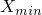
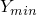
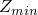
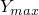

# 2.3.6 Operating on surfaces


**Products: **Abaqus/Standard  Abaqus/Explicit  

##### **References**

- ["Surfaces: overview," Section 2.3.1](pt01ch02s03aus16.md)
- ["Coupling constraints," Section 35.3.2](pt08ch35s03aus133.md)
- ["Mesh-independent fasteners," Section 35.3.4](pt08ch35s03aus135.md)
- ["Defining general contact interactions in Abaqus/Explicit," Section 36.4.1](pt09ch36s04aus155.md)
- [*SURFACE](../key/key-link.md#usb-kws-msurface)

### Overview

Combined surfaces:
- are created by performing a Boolean operation (union, intersection, or difference) on existing surfaces;
- can be formed from element-based or node-based surfaces;
- cannot be formed from Eulerian surfaces;
- can be used in the same way as other element-based or mode-based surfaces in Abaqus/Standard; and
- cannot be used with contact pairs in Abaqus/Explicit (but can be used with general contact in Abaqus/Explicit).

Cropped surfaces:- are created by cropping an existing surface and keeping only that part of the surface that is enclosed in a specified rectangular box;
- can be formed from element-based or node-based surfaces;
- cannot be formed from Eulerian surfaces;
- can be used in the same way as other element-based or mode-based surfaces in Abaqus/Standard; and
- cannot be used with contact pairs in Abaqus/Explicit (but can be used with general contact in Abaqus/Explicit).

### Creating a combined surface

You must assign a name to the combined surface; this name can be used with other features that refer to surfaces.

In models that are defined in terms of an assembly of part instances, all surfaces must belong to a part, part instance, or the assembly. Surfaces can be created at the part level and combined at the assembly level. Additional rules are given in ["Defining an assembly," Section 2.10.1](pt01ch02s10aus28.md).

The surfaces being combined must be the same type; i.e., an element-based surface can be combined with another element-based surface but not with a node-based surface. Combined surfaces can be used to create another combined surface.

#### Union of existing surfaces

Any number of existing surfaces can be combined to create a new surface. If the surfaces being combined are element-based surfaces, the new surface will also be an element-based surface and any overlap among the surfaces will be merged. Similarly, if the surfaces being combined are node-based surfaces, the new surface will be a node-based surface and any overlap among the surfaces will be merged.

| **Input File Usage: ** | ``` [*SURFACE](../key/key-link.md#usb-kws-msurface), NAME=*name*, COMBINE=UNION *list of surface names* ``` |
| --- | --- |

#### Intersection or difference of existing surfaces

The intersection or difference of two existing surfaces can be used to create a new surface. The difference operation subtracts the second surface from the first surface. When the intersection or difference operations are performed on element-based surfaces, they act only on the facets. A warning message is issued if the intersection operation results in an empty surface.

| **Input File Usage: ** | Use the following option to create a new surface based on the intersection of two existing surfaces: |
| --- | --- |
|  | ``` [*SURFACE](../key/key-link.md#usb-kws-msurface), NAME=*name*, COMBINE=INTERSECTION *first surface name, second surface name* ``` Use the following option to create a new surface based on the difference of two existing surfaces: ``` [*SURFACE](../key/key-link.md#usb-kws-msurface), NAME=*name*, COMBINE=DIFFERENCE *first surface name, second surface name* ``` |

### Creating a cropped surface

You can create a new surface that will contain only those faces of an existing surface that have nodes inside a specified cropping box. For a node-based surface the new surface will contain only those nodes that are enclosed inside the cropping box. If the face has at least one node inside the box, the entire face is accepted as valid. You must assign a name to the new surface and specify the name of the existing surface from which the new surface is to be generated. Only one surface can be specified.

To define the location of the box, specify the coordinates of the lower corner of the box (, , ) and the coordinates of the opposite (upper) corner of the box (, , ). The cutting box can be rotated about the lower corner (, , ) if an optional rotation is defined. The coordinates of the two points, *a* and *b*, that define the rotation are given in the unrotated system. These points should be defined such that point *a* lies on the rotated *X*-axis and point *b* lies on the *X*–*Y* plane and close to the *Y*-axis.

| **Input File Usage: ** | ``` [*SURFACE](../key/key-link.md#usb-kws-msurface), NAME=*name*, CROP *old_surface_name* *, , , , , * *, , , , , * ``` |
| --- | --- |
|  | For example, to crop the surface that contains all exposed faces in the model, use the following input: ``` [*SURFACE](../key/key-link.md#usb-kws-msurface), TYPE=ELEMENT, NAME=*entire_surface* , [*SURFACE](../key/key-link.md#usb-kws-msurface), NAME=*name*, CROP *entire_surface* , , , , ,  , , , , ,  ``` |


