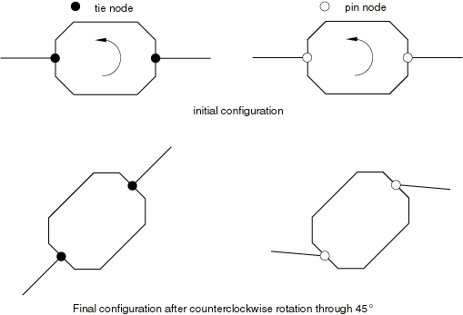
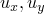
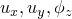
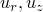
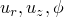
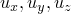
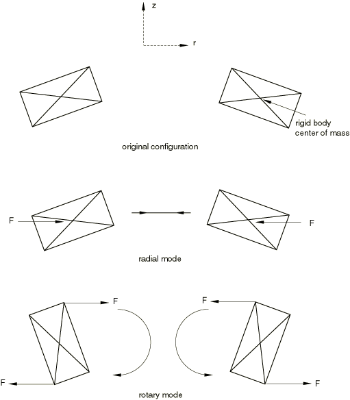
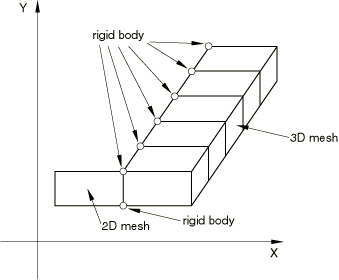

# 2.4.1 Rigid body definition


**Products: **Abaqus/Standard  Abaqus/Explicit  Abaqus/CAE  

##### **References**

- ["Surfaces: overview," Section 2.3.1](pt01ch02s03aus16.md)
- ["Element-based surface definition," Section 2.3.2](pt01ch02s03aus17.md)
- ["Analytical rigid surface definition," Section 2.3.4](pt01ch02s03aus19.md)
- ["Rigid elements," Section 30.3.1](pt06ch30s03alm23.md)
- [*RIGID BODY](../key/key-link.md#usb-kws-mrigidbody)
- ["Defining rigid body constraints," Section 15.15.2 of the Abaqus/CAE User's Guide](../usi/usi-link.md#usi-itn-helptopic-rigid)

### Overview

A rigid body:
- can be two-dimensional planar, axisymmetric, or three-dimensional;
- is associated with a node, called the rigid body reference node, whose motion governs the motion of the entire rigid body;
- can consist of nodes, elements, and surfaces;
- can act as a method of constraint;
- can be used with connector elements in multibody dynamic simulations;
- can be used to prescribe the motion of a rigid surface for contact modeling;
- can be computationally efficient and, in Abaqus/Explicit, does not affect the global time increment; and
- can have temperature gradients or be isothermal in a fully coupled temperature-displacement analysis where thermal interactions are considered.

### What is a rigid body?

A rigid body is a collection of nodes, elements, and/or surfaces whose motion is governed by the motion of a single node, called the rigid body reference node. The relative positions of the nodes and elements that are part of the rigid body remain constant throughout a simulation. Therefore, the constituent elements do not deform but can undergo large rigid body motions. The mass and inertia of a rigid body can be calculated based on contributions from its elements or can be assigned specifically. Analytical surfaces can also be made part of the rigid body, whereas any surfaces based on the nodes or elements of a rigid body are associated automatically with the rigid body.

The motion of a rigid body can be prescribed by applying boundary conditions at the rigid body reference node. Loads on a rigid body are generated from concentrated loads applied to nodes and from distributed loads applied to elements that are part of the rigid body. Rigid bodies interact with the remainder of the model in several ways. Rigid bodies can connect at the nodes to deformable elements, and surfaces defined on rigid bodies can continue on these deformable elements, provided that compatible element types are used. Rigid bodies can also be connected to other rigid bodies by connector elements (see ["Connectors: overview," Section 31.1.1](pt06ch31s01abo28.md)). Surfaces defined on rigid bodies can contact surfaces defined on other bodies in the model.

### Determining when to use a rigid body

Rigid bodies can be used to model very stiff components, either fixed or undergoing large motions. For example, rigid bodies are ideally suited for modeling tooling (i.e., punch, die, drawbead, blank holder, roller, etc.). They can also be used to model constraints between deformable components, and they provide a convenient method of specifying certain contact interactions. Rigid bodies can be used with connector elements to model a wide variety of multibody dynamic problems.

It may be useful to make parts of a model rigid for model verification purposes. For example, in complex models elements far away from the particular region of interest could be included as part of a rigid body, resulting in faster run times at the model development stage. When you are satisfied with the model, you can remove the rigid body definitions and incorporate an accurate deformable finite element representation throughout.

In multibody dynamic simulations rigid bodies are useful for many reasons. Although the motion of the rigid body is governed by the six degrees of freedom at the reference node, rigid bodies allow accurate representation of the geometry, mass, and rotary inertia of the rigid body. Furthermore, rigid bodies provide accurate visualization and postprocessing of the model.

The principal advantage to representing portions of a model with rigid bodies rather than deformable finite elements is computational efficiency. Element-level calculations are not performed for elements that are part of a rigid body. Although some computational effort is required to update the motion of the nodes of the rigid body and to assemble concentrated and distributed loads, the motion of the rigid body is determined completely by a maximum of six degrees of freedom at the reference node.

Rigid bodies are particularly effective for modeling relatively stiff parts of a model in Abaqus/Explicit for which tracking waves and stress distributions are not important. Element stable time increment estimates in the stiff region can result in a very small global time increment. Since rigid bodies and elements that are part of a rigid body do not affect the global time increment, using a rigid body instead of a deformable finite element representation in a stiff region can result in a much larger global time increment, without significantly affecting the overall accuracy of the solution.

### Creating a rigid body

You must assign a rigid body reference node to the rigid body.

| **Input File Usage: ** | ``` [*RIGID BODY](../key/key-link.md#usb-kws-mrigidbody), REF NODE=*n* ``` |
| --- | --- |

| **Abaqus/CAE Usage: ** | Interaction module: ****Tools****Reference Point****: select a point to act as a reference point **Create Constraint**: **Rigid body**: **Point: Edit**: select reference point region |
| --- | --- |

#### The rigid body reference node

A rigid body reference node has both translational and rotational degrees of freedom and must be defined for every rigid body. If the reference node has not been assigned coordinates, Abaqus will assign it the coordinates of the global origin by default. Alternatively, you can specify that the reference node should be placed at the center of mass of the rigid body. In fully coupled temperature-displacement analysis where a rigid body is considered as isothermal, a single temperature degree of freedom describing the temperature of the rigid body exists at the rigid body reference node. The rigid body reference node:
- can be connected to mass, rotary inertia, capacitance, or deformable elements;
- cannot be a rigid body reference node for another rigid body; and
- can have a temperature degree of freedom if the body is an isothermal rigid body.

##### Positioning the reference node at the center of mass

The specific location of the rigid body reference node relative to the rest of the rigid body or to its center of mass is important if nonzero boundary conditions are to be applied to the rigid body or concentrated loads are to be applied at the reference node. In many problems of rigid body dynamics, it may be desirable to apply loads and boundary conditions to the rigid body at its center of mass. In addition, it may be useful to monitor the configuration of the rigid body at its center of mass for output purposes. However, it may be difficult to locate the center of mass a priori when the rigid body mass and inertia properties (discussed below) contain contributions from a finite element discretization or a complex arrangement of MASS and ROTARYI elements.

By default, the rigid body reference node will not be repositioned. You can specify that it should be repositioned at the calculated center of mass. In this case if a MASS element is defined at the rigid body reference node, the calculated center of mass used for repositioning includes all mass contributions except the mass at the reference node. The MASS element is then repositioned at the center of mass and included in the mass properties of the rigid body. If the only mass contribution to the rigid body is from a MASS element defined at the rigid body reference node, the reference node will not be repositioned.

| **Input File Usage: ** | Use the following option to indicate that the reference node should not be repositioned (the default): |
| --- | --- |
|  | ``` [*RIGID BODY](../key/key-link.md#usb-kws-mrigidbody), REF NODE=*n*, POSITION=INPUT ``` Use the following option to specify that the rigid body reference node should be repositioned at the calculated center of mass: ``` [*RIGID BODY](../key/key-link.md#usb-kws-mrigidbody), REF NODE=*n*, POSITION=CENTER OF MASS ``` |

| **Abaqus/CAE Usage: ** | Interaction module: **Create Constraint**: **Rigid body**: toggle **Adjust point to center of mass at start of analysis** |
| --- | --- |

#### The collection of nodes that constitute the rigid body

In addition to the rigid body reference node, rigid bodies consist of a collection of nodes that is generated by assigning elements and nodes to the rigid body. These nodes provide a connection to other elements. Nodes that are part of a rigid body are one of two types:
- pin nodes, which have only translational degrees of freedom associated with the rigid body, or
- tie nodes, which have both translational and rotational degrees of freedom associated with the rigid body.

The rigid body node type is determined by the type of elements on the rigid body to which the node is attached. You can also specify the node type when you assign nodes directly to a rigid body. For pin nodes only the translational degrees of freedom are part of the rigid body, and the motion of these degrees of freedom is constrained by the motion of the rigid body reference node. For tie nodes both the translational and rotational degrees of freedom are part of the rigid body and are constrained by the motion of the rigid body reference node.

The node type has important implications when the node is connected to rotary inertia elements, deformable structural elements, or connector elements or when the node has concentrated moments or follower loads applied to it. Rotary inertia elements and applied concentrated moments affect the rigid body only when associated with a tie node. Rigid body connections to deformable elements always involve the translational degrees of freedom; rigid body connections to deformable shell, beam, pipe, and connector elements also involve the rotational degrees of freedom if the connection is at a tie node. The behavior of the two types of connections is illustrated in [Figure 2.4.1--1](pt01ch02s04aus22.md#arigidbody-tie-pin), which shows an octagonal rigid body connected to two deformable shell elements through nodes at opposite ends subjected to an applied rotational velocity. 

**Figure 2.4.1–1** Rigid body with tie node and pin node connections.



The shell elements are assumed to be stiff (negligible bending is shown in the figure). When the nodes common to the rigid body and the shell elements are tie nodes, the rotation applied to the rigid body is transmitted directly to the shell elements. When the common nodes are pin nodes, the rigid body rotation is not transmitted directly to the shell elements, which can result in large relative motions between the rigid body and the adjacent shell structure.

#### Assigning elements to a rigid body

To include elements in the rigid body definition, you specify the region of your model containing all of the elements that are part of the rigid body. Elements in this region or nodes connected to the elements in this region cannot be part of any other rigid body. [Table 2.4.1--1](pt01ch02s04aus22.md#table-arigidoverview-valid-elems) lists the continuum, structural, and rigid element types that can be included in a rigid body and the respective node types generated in the rigid body.

**Table 2.4.1–1** List of valid elements that can be included in a rigid body (* indicates all elements beginning with the preceding label).
| Rigid Body Geometry | Elements | Nodal Degrees of Freedom |
| --- | --- | --- |
| Generate Pin Nodes | Generate Tie Nodes | Pin Nodes | Tie Nodes |
| Planar | CPE3*, CPE4*, CPE6*, CPE8*, CPS3, CPS4*, CPS6*, CPS8*, GK2D2, GKPS*, GKPE*, R2D2, T2D2* | B21*, B22*, B23*, FRAME2D, PIPE2*, RB2D2 |  |  |
| Axisymmetric | CAX3, CAX4*, CAX6*, CAX8*, GKAX*, MAX*, RAX2 | CGAX*, MGAX*, SAX1, SAX2* |  |  |
| Three-dimensional | C3D4*, C3D6*, C3D8*, C3D10*, C3D15*, C3D20*, C3D27*, GK3D*, M3D3, M3D4*, M3D6, M3D8*, M3D9*, SFM3D*, SFMAX*, SFMGAX*, R3D3, R3D4, T3D2*, CCL*, MCL*, SFMCL* | B31*, B32*, B33*, FRAME3D, PIPE*, RB3D2, S3*, S4*, S8*, S9* |  |   |

When connector elements are included in the rigid body, the type of generated nodes depends on whether the rotational degrees of freedom are active for their connection type. If connector elements that activate material flow degree of freedom at nodes are included in the rigid body, the material and flow through the rigid body as that degree of freedom is constrained to the motion of the rigid body.

The following elements cannot be declared as rigid:
- Acoustic elements
- Axisymmetric-asymmetric continuum and shell elements
- Coupled thermal-electrical elements
- Diffusive heat transfer/mass diffusion elements and forced convection/diffusion elements
- Eulerian elements
- Generalized plane strain elements
- Gasket elements with thickness-direction behavior
- Heat capacitance elements
- Inertial elements (mass and rotary inertia)
- Infinite elements
- Piezoelectric elements
- Special-purpose elements
- Substructures
- Thermal-electrical-structural elements
- User-defined elements

If elements of more than one type or section definition are part of a rigid body, the specified region will contain elements with different section definitions. When continuum or structural elements are assigned to a rigid body, they are no longer deformable and their motion is governed by the motion of the rigid body reference node. Element stiffness calculations are not performed for these elements, and they do not affect the global time increment in Abaqus/Explicit. However, the mass and inertia of the rigid body includes contributions from these elements as calculated from their section and material density definitions (see [Part VI, "Elements](pt06.md)”). Mass and rotary inertia elements, as well as point heat capacitance elements, should not be included in the specified region. Contributions to a rigid body from mass, rotary inertia, and heat capacitance elements are accounted for automatically when these elements are connected to nodes that are part of the rigid body.

A list of nodes that are part of a rigid body is generated automatically when you assign elements to a rigid body. The node list is constructed as a unique list including all the nodes that are connected to elements in the specified region. Nodes in this list cannot be part of any other rigid body. The type of each node, pin or tie, is determined by the type of elements on the rigid body to which it is connected. Shell, beam, pipe, and rigid beam elements generate tie nodes; solid, membrane, truss, and rigid (other than beam) elements generate pin nodes (see [Table 2.4.1--1](pt01ch02s04aus22.md#table-arigidoverview-valid-elems)). For nodes that are connected to both elements that generate pin nodes and elements that generate tie nodes, the common node is defined as the tie type.

All elements that are part of a rigid body must be of like geometry. Therefore, elements contained in the specified region must be either planar, axisymmetric, or three-dimensional. The geometry of the elements determines the geometry of the rigid body as shown in [Table 2.4.1--1](pt01ch02s04aus22.md#table-arigidoverview-valid-elems).

| **Input File Usage: ** | Use the following option to assign elements to a rigid body: |
| --- | --- |
|  | ``` [*RIGID BODY](../key/key-link.md#usb-kws-mrigidbody), REF NODE=*n*, ELSET=*name* ``` |

| **Abaqus/CAE Usage: ** | Interaction module: **Create Constraint**: **Rigid body**: **Body (elements)**: **Edit**: select body regions |
| --- | --- |

#### Assigning nodes to a rigid body

To assign nodes directly to a rigid body, you specify all the desired pin nodes and all the tie nodes separately. These nodes become part of the rigid body in addition to any nodes that have been generated from elements assigned to the rigid body. The following rules apply when assigning nodes directly to a rigid body:
- The rigid body reference node cannot be contained in either the set of pin nodes or the set of tie nodes.
- Nodes that are part of the set of pin nodes cannot also be contained in the set of tie nodes.
- Nodes that are contained in the set of pin nodes or the set of tie nodes cannot be part of any other rigid body definition.
- Nodes that are generated automatically from elements assigned to the rigid body that are also contained in the set of pin nodes are classified as pin nodes, regardless of their element connections.
- Nodes that are generated automatically from elements assigned to the rigid body that are also contained in the set of tie nodes are classified as tie nodes, regardless of their element connections.

The types of nodes generated by elements included in a rigid body can, therefore, be overridden by assigning the nodes directly to the rigid body, thereby allowing you greater flexibility to define a constraint with a rigid body by easily specifying the type of connection the rigid body makes with its attached deformable finite elements.

| **Input File Usage: ** | Use the following option to assign nodes to a rigid body: |
| --- | --- |
|  | ``` [*RIGID BODY](../key/key-link.md#usb-kws-mrigidbody), REF NODE=*n*, PIN NSET=*name*, TIE NSET=*name* ``` |

| **Abaqus/CAE Usage: ** | Interaction module: **Create Constraint**: **Rigid body**: **Pin (nodes)**: **Edit**: select pin regions, and **Tie (nodes)**: **Edit**: select tie regions |
| --- | --- |

#### Assigning analytical surfaces to a rigid body

You can assign an analytical surface to a rigid body. The procedure for creating and naming an analytical rigid surface is described in ["Analytical rigid surface definition," Section 2.3.4](pt01ch02s03aus19.md). Only one analytical surface can be defined as part of the rigid body definition.

| **Input File Usage: ** | Use the following option to assign an analytical rigid surface to a rigid body: |
| --- | --- |
|  | ``` [*RIGID BODY](../key/key-link.md#usb-kws-mrigidbody), REF NODE=*n* or *name*, ANALYTICAL SURFACE=*name* ``` |

| **Abaqus/CAE Usage: ** | Interaction module: **Create Constraint**: **Rigid body**: **Analytical Surface**: **Edit**: select analytical surface regions |
| --- | --- |

#### Defining a rigid body in a model that is defined in terms of an assembly of part instances

An Abaqus model can be defined in terms of an assembly of part instances (see ["Defining an assembly," Section 2.10.1](pt01ch02s10aus28.md)). A rigid body in such a model can be created from deformable elements at either the part level or the assembly level. In either case all node and element definitions must belong to one or more parts. If all nodes making up the rigid body belong to the same part, create a rigid part by defining the rigid body at the part level.

Multiple deformable part instances can be combined into a single rigid body by creating an assembly-level node or element set that spans the part instances, then defining the rigid body at the assembly level to refer to that set. The rigid body reference node can also be defined at the assembly level, if necessary.

### Rigid body mass and inertial properties

When a rigid body is not constrained fully, the mass and inertia properties of the rigid body are important to its dynamic response. In Abaqus/Explicit an error message will be issued if there is no mass (or rotary inertia) corresponding to an unconstrained degree of freedom. Abaqus automatically calculates the mass, center of mass, and rotary inertia of each rigid body and prints the results to the data (`.dat`) file if model definition data are requested (see ["Controlling the amount of analysis input file processor information written to the data file" in "Output," Section 4.1.1](pt02ch04s01aus38.md#usb-out-ooutput-data-control)). The following rules are used to determine the mass and inertia of a rigid body:
- The mass of each continuum, structural, and rigid element that is part of the rigid body contributes to the rigid body's mass, center of mass, and rotary inertia properties.
- Point mass elements that are connected to any node that is part of a rigid body or to the rigid body reference node contribute to the rigid body's mass, center of mass, and rotary inertia properties.
- Rotary inertia elements that are connected to any tie node or to the rigid body reference node contribute to the rigid body's rotary inertia properties.

Since the rotational degrees of freedom at a pin node are not part of a rigid body, rotary inertia elements connected to a pin node do not contribute to the rigid body inertia but are rather associated with the independent rotation of the node.

#### Defining mass and inertia properties by discretization

In many cases it is desirable to model rigid components for which the mass, center of mass, and rotary inertia are not readily available. In Abaqus it is not necessary to define the mass and inertia properties of the rigid body directly. Instead, a finite element discretization can be used to model the rigid components, and Abaqus will automatically calculate the properties from the discretization. Rigid structures with one-dimensional rod or beam geometries can be modeled with beam or truss elements, structures containing two-dimensional surface geometries can be modeled with shell or membrane elements, and solid geometries can be modeled with solid elements. The mass contributions to the rigid body for each of these elements are based on that element's section properties (see [Part VI, "Elements](pt06.md)”) and the material density (see ["Density," Section 21.2.1](pt05ch21s02abm01.md)). Although both shell and membrane elements in a rigid body can yield similar mass contributions given similar section and density definitions, they will generate different node types (tie nodes for shells and pin nodes for membranes), which may affect the overall results. The same holds true for beam and truss elements.

In situations where one portion of a rigid component can be modeled with a finite element discretization but it is not convenient to do so for other portions, point mass and rotary inertia elements can be used to represent the mass distribution of these other portions. The mass, center of mass, and rotary inertia for the rigid body will then include the contributions from both the finite elements and the point mass and rotary inertia elements.

Abaqus uses the lumped mass formulation for low-order elements. As a consequence, the second mass moments of inertia can deviate from the theoretical values, especially for coarse meshes. This inaccuracy can be circumvented by adding point mass and rotary inertia elements with the correct inertia properties and eliminating the mass contribution from the solid elements. Alternatively, second-order elements could be used in Abaqus/Standard.

#### Defining mass and inertia properties directly

When the mass, center of mass, and rotary inertia properties of the actual rigid component are known or can be approximated, it is not necessary to use a finite element discretization or to use an array of point masses to generate the rigid body properties. You can assign these properties directly by locating the rigid body reference node at the center of mass (see ["Positioning the reference node at the center of mass](pt01ch02s04aus22.md#usb-int-arigidoverview-refnode-centerofmass)”) and by specifying the rigid body mass and rotary inertia at the reference node (see ["Point masses," Section 30.1.1](pt06ch30s01alm21.md), and ["Rotary inertia," Section 30.2.1](pt06ch30s02alm22.md)).

It may also be desirable to input mass properties directly at the center of mass but to specify boundary conditions at a location other than the center of mass. In this case you should place the rigid body reference node at the desired boundary condition location. In addition, you must define a tie node at the center of mass of the rigid body by correctly specifying its coordinates to coincide with the coordinates of the center of mass of the rigid body and then assigning it to a tie node set in the rigid body definition. You can then define the rigid body mass and rotary inertia at the tie node.

For most applications where mass properties are input directly, it may be necessary to assign additional elements or nodes to a rigid body so that the rigid body can interact with the rest of the model. For example, contact pair definitions could require rigid surfaces formed with element faces on the rigid body and additional pin or tie nodes may be necessary to provide the desired constraints with deformable elements attached to the rigid body. Abaqus will account for the mass and rotary inertia contributions from all elements on a rigid body; therefore, if you want to assign the rigid body mass properties directly, you should take care to ensure that contributions from other element types that are part of the rigid body do not affect the desired input mass properties. If rigid elements are part of the rigid body definition, you can set their mass contribution to zero by not specifying a density for these elements in the rigid body definition. If other element types are used to define the rigid body, you should set their density to zero.

### Kinematics of a rigid body

The motion of a rigid body is defined entirely by the motion of its reference node. The active degrees of freedom at the reference node depend on the geometry of the rigid body (see ["Conventions," Section 1.2.2](pt01ch01s02aus02.md)). The geometry of a rigid body is planar, axisymmetric, or three-dimensional and is determined by the type of elements that are assigned to the rigid body. In the case where no elements are assigned to a rigid body, the geometry of the rigid body is assumed to be three-dimensional.

The calculated mass and rotary inertia properties for each of the active degrees of freedom for all rigid bodies are printed to the data (`.dat`) file if model definition data are requested (see ["Controlling the amount of analysis input file processor information written to the data file" in "Output," Section 4.1.1](pt02ch04s01aus38.md#usb-out-ooutput-data-control)). These properties include the contributions from elements that are part of the rigid body, as well as point mass and rotary inertia elements at the nodes of the rigid body.

Although this calculated mass represents the true mass of the rigid body, Abaqus/Explicit actually uses an augmented mass in the integration of the equation of motion, which is conceptually similar to an added mass formulation. Essentially, the calculated mass and rotary inertia of the rigid body is augmented with the mass contributions of all of its attached deformable elements to create a larger, augmented mass and rotary inertia. Rotary inertia contributions from adjacent deformable elements are also included in the augmented rotary inertia if the nodal connection is at a tie node.

#### Rigid body motions

A rigid body can undergo free rigid body motion in each of its active translational degrees of freedom, as well as each of its active rotational degrees of freedom.

#### Boundary conditions

Boundary conditions for rigid bodies should be defined as described in ["Boundary conditions in Abaqus/Standard and Abaqus/Explicit," Section 34.3.1](pt07ch34s03aus118.md), at the rigid body reference node. Reaction forces and moments can be recovered for all degrees of freedom that are constrained at the reference node. If a nodal transformation is defined at the rigid body reference node, boundary conditions are applied in the local system (see ["Transformed coordinate systems," Section 2.1.5](pt01ch02s01aus09.md)).

In Abaqus/Standard, if boundary conditions are applied to any nodes on a rigid body other than the rigid body reference node, Abaqus will attempt to transfer these boundary conditions to the reference node. If successful, you are warned that this transfer has taken place. Otherwise, an error message is produced (see ["Overconstraint checks," Section 35.6.1](pt08ch35s06aus138.md), for more details).

In Abaqus/Explicit, if boundary conditions are applied to any nodes on a rigid body other than the rigid body reference node, these boundary conditions are ignored with the exception of the symmetry-type boundary conditions that can affect the contact logic at the perimeter of a surface in the Abaqus/Explicit contact pair algorithm (see ["Contact formulations for contact pairs in Abaqus/Explicit," Section 38.2.2](pt09ch38s02aus181.md), and ["Common difficulties associated with contact modeling using contact pairs in Abaqus/Explicit," Section 39.2.2](pt09ch39s02aus186.md)). 

#### Constraints

In Abaqus/Standard nodes on a rigid body, excluding the rigid body reference node, cannot be used in a multi-point constraint or linear constraint equation definition.

In Abaqus/Explicit a multi-point constraint or linear constraint equation can be defined for any node on a rigid body, including the reference node.

#### Connector elements

Connector elements can be used at any node of a rigid body, including the reference node, to define a connection between rigid bodies, between a rigid body and a deformable body, or from a rigid body to ground. Connector elements are convenient for providing multiple points of attachment on rigid bodies; modeling complex nonlinear kinematic constraints; specifying zero or nonzero boundary conditions at a point on a rigid body that is not the rigid body reference node; applying force actuation; and modeling discrete interactions, such as spring, dashpot, node-to-node contact, friction, locking mechanisms, and failure joints. Unlike multi-point constraints or linear constraint equations, connector elements retain degrees of freedom in the connection, thereby allowing output of information related to the connection (such as constraint forces and moments, relative displacements, velocities, accelerations, etc.). See ["Connector elements," Section 31.1.2](pt06ch31s01alm25.md), for a detailed description of connector elements.

#### Planar rigid body

A rigid body with a planar geometry has three active degrees of freedom: 1, 2, and 6 (, , and ). Here, the *x*- and *y*-directions coincide with the global *X*- and *Y*-directions, respectively. If a nodal transformation is defined at the rigid body reference node, the *x*- and *y*-directions coincide with the user-defined local directions. The coordinate transformation defined at the reference node must be consistent with the geometry; the local directions must remain in the global *X*–*Y* plane. All nodes and elements that are part of a planar rigid body should lie in the global *X*–*Y* plane.

Planar rigid bodies should be connected only to planar deformable elements. To model the connection of a rigid component with a planar geometry to three-dimensional deformable elements, model the planar rigid component as a three-dimensional rigid body consisting of the appropriate three-dimensional elements.

#### Axisymmetric rigid body

A rigid body with an axisymmetric geometry has three active degrees of freedom in Abaqus: 1, 2, and 6 (, , ). Classical axisymmetric theory admits only one rigid body mode, which is displacement in the *z*-direction. To maximize the flexibility of using rigid bodies for axisymmetric analysis, Abaqus allows for three active degrees of freedom, although only the axial displacement is a rigid body mode.

The *r*- and *z*-directions coincide with the global *X*- and *Y*-directions, respectively. If a nodal transformation is defined at the rigid body reference node, the *r*- and *z*-directions coincide with the user-defined local directions. The coordinate transformation defined at the reference node must be consistent with the geometry; the local directions must remain in the global *X*–*Y* plane. All nodes and elements that are part of an axisymmetric rigid body should lie in the global *X*–*Y* plane.

Translation in the *r*-direction is associated with a radial mode, and rotation in the *r*–*z* plane is associated with a rotary mode (see [Figure 2.4.1--2](pt01ch02s04aus22.md#arigidbody-axi-modes)). For an axisymmetric rigid body in Abaqus each of these modes develop no hoop stress, but mass and inertia computed for these degrees of freedom represent the modal mass associated with their modal motion. The mass properties for an axisymmetric rigid body are, therefore, calculated based on the initial configuration assuming the following:
- Point masses defined on nodes of the rigid body (see ["Point masses," Section 30.1.1](pt06ch30s01alm21.md)) are assumed to account for the entire mass around the circumference of the body.
- Mass contributions from axisymmetric elements assigned to the rigid body include the integrated value around the circumference.
- The center of mass of the rigid body is located at the center of mass of the circumferential slice, as shown in [Figure 2.4.1--2](pt01ch02s04aus22.md#arigidbody-axi-modes). **Figure 2.4.1--2** Axisymmetric rigid body modes. 

If the rigid body reference node is positioned at the center of mass, the reference node for an axisymmetric rigid body will, thus, be repositioned at the center of mass of the circumferential slice.

These assumptions are consistent with the manner in which Abaqus handles other axisymmetric features but are noted here because of the deviation from classical rigid body theory.

Axisymmetric rigid bodies should be connected only to axisymmetric deformable elements. To model the connection of a rigid component with an axisymmetric geometry to three-dimensional deformable elements, model the axisymmetric rigid component as a three-dimensional rigid body consisting of the appropriate three-dimensional elements.

#### Three-dimensional rigid body

A rigid body with a three-dimensional geometry has six active degrees of freedom: 1, 2, 3, 4, 5, and 6 (, , , , , ). Here, the *x*-, *y*-, and *z*-directions coincide with the global *X*-, *Y*- and *Z*-directions, respectively. If a nodal transformation is defined at the rigid body reference node, the *x*-, *y*-, and *z*-directions coincide with the user-defined local directions.

In general, three-dimensional rigid bodies will possess a full, nonisotropic inertia tensor and can behave in a nonintuitive manner when they are spun about an axis that is not one of the principal inertia axes. Classical phenomena of rigid body dynamics (e.g., precession, gyroscopic moments, etc.) can be simulated using three-dimensional rigid bodies in Abaqus.

In most cases three-dimensional rigid bodies should be connected only to three-dimensional deformable elements. If it is physically relevant, a three-dimensional rigid body can be connected to two-dimensional plane stress, plane strain, or axisymmetric elements; however, you should always constrain the *z*-displacement, *x*-axis rotation, and *y*-axis rotation of the rigid body. The above procedure is useful when incorporating a two-dimensional plane strain approximation in one region of a model and a three-dimensional discretization in another. Rigid bodies can be used to constrain the two finite element geometries at their interface as shown in [Figure 2.4.1--3](pt01ch02s04aus22.md#arigidbody-2d-3d). A unique rigid body should be used at each node in the plane along the interface to handle the constraint properly.

**Figure 2.4.1–3** Rigid body nodes used to connect a two-dimensional and three-dimensional mesh.



### Defining loads on rigid bodies

Loads on a rigid body are assembled from contributions of all of the loads on nodes and elements that are part of the rigid body. Loads are defined on nodes and elements that are part of a rigid body in the same manner that they are specified if the nodes and elements are not part of a rigid body. Contributions include:
- applied concentrated forces on pin nodes, tie nodes, and the rigid body reference node;
- applied concentrated moments on tie nodes and the rigid body reference node; and
- applied distributed loads on all elements and surfaces that are part of the rigid body.

Unless the point of action is through the rigid body center of mass, each of these loads will create both a force at and a torque about the center of mass, which will tend to rotate an unconstrained rigid body. If a nodal transformation is defined at any rigid body nodes, concentrated loads defined at these nodes are interpreted in the local system. The local system defined by the nodal transformation does not rotate with the rigid body.

Concentrated moments defined on rigid body pin nodes do not contribute load to the rigid body but are rather associated with the independent rotation of that node. Independent rotation of a pin node exists only if it is connected to a deformable element with rotational degrees of freedom or a rotary inertia element. Follower forces (see ["Specifying concentrated follower forces" in "Concentrated loads," Section 34.4.2](pt07ch34s04aus121.md#usb-prc-ploadgeneral-follow)) can be defined at pin nodes if the independent rotation exists. However, the results may be nonintuitive since the direction of the force is determined by the independent rotation even though the follower force acts on the rigid body.

### Rigid bodies with temperature degrees of freedom

Only rigid bodies that contain coupled temperature-displacement elements have temperature degrees of freedom. If it is reasonable to assume that a rigid body used in a fully coupled temperature-displacement analysis has a uniform temperature, you can define the rigid body as isothermal. A transient heat transfer process involving an isothermal rigid body assumes that the internal resistance of the body to heat is negligible in comparison with the external resistance. Thus, the body temperature can be a function of time but cannot be a function of position. The temperature degree of freedom that is created at the rigid body reference node describes the temperature of the body.

Thermal interactions for rigid bodies with analytical rigid surfaces are available only in Abaqus/Explicit and are activated by specifying that the rigid body is isothermal.

By default, rigid bodies are not considered isothermal and all nodes on a rigid body connected to coupled temperature-displacement elements will have independent temperature degrees of freedom. The fact that the nodes are part of a rigid body does not affect the ability of the coupled elements to conduct heat within the rigid body. However, the mechanical response will be rigid.

The lumped heat capacitance associated with the rigid body reference node of an isothermal body is calculated automatically if the rigid body is composed of coupled temperature-displacement elements for which a specific heat and a density property are defined. Otherwise, you should specify a point heat capacitance for the rigid body (see ["Point capacitance," Section 30.4.1](pt06ch30s04alm24.md)). An error message will be issued in Abaqus/Explicit if no heat capacitance is associated with an isothermal rigid body for which temperature is not prescribed at the reference node.
- The capacitance of each coupled temperature-displacement element that is part of the rigid body contributes to the isothermal rigid body's capacitance. For an axisymmetric isothermal rigid body, capacitance contributions from axisymmetric elements assigned to the rigid body include the integrated value around the circumference.
- HEATCAP elements that are connected to any node that is part of a rigid body or the rigid body reference node contribute to the isothermal rigid body's capacitance. For an axisymmetric isothermal rigid body the point capacitances defined on nodes of the rigid body are assumed to account for the capacitance integrated around the circumference of the body.

Thermal loads acting on the reference node of an isothermal body are assembled from contributions of all the thermal loads on nodes and elements that are part of the rigid body. Heat transfer between a deformable body and an isothermal rigid body can occur during contact, as well as when the bodies are not in contact if gap conductance and gap radiation are defined (see ["Thermal contact properties," Section 37.2.1](pt09ch37s02aus174.md)). Heat transfer between two isothermal rigid bodies can occur only via gap conduction and gap radiation.

| **Input File Usage: ** | ``` [*RIGID BODY](../key/key-link.md#usb-kws-mrigidbody), ISOTHERMAL=YES ``` |
| --- | --- |

| **Abaqus/CAE Usage: ** | Interaction module: **Create Constraint**: **Rigid body**: toggle on **Constrain selected regions to be isothermal** |
| --- | --- |

### Modeling contact with a rigid body

Contact with a rigid body is modeled by specifying a contact interaction formed with a rigid surface and with a surface defined on another body (see ["Defining contact pairs in Abaqus/Standard," Section 36.3.1](pt09ch36s03aus145.md); ["Defining general contact interactions in Abaqus/Explicit," Section 36.4.1](pt09ch36s04aus155.md); or ["Defining contact pairs in Abaqus/Explicit," Section 36.5.1](pt09ch36s05aus160.md)). A rigid surface can be formed by nodes, element faces, or an analytical surface (see ["Node-based surface definition," Section 2.3.3](pt01ch02s03aus18.md); ["Element-based surface definition," Section 2.3.2](pt01ch02s03aus17.md); and ["Analytical rigid surface definition," Section 2.3.4](pt01ch02s03aus19.md)).

Contact modeling can be a primary factor when choosing the appropriate rigid body geometry. Contact interactions should be formed with surfaces of like geometry. For example, a planar rigid body should be used to model contact either with deformable surfaces formed by two-dimensional plane stress or plane strain elements or via node-based surfaces with two-dimensional beam, pipe, or truss elements. Similarly, an axisymmetric rigid body should be used to model contact with surfaces formed by axisymmetric elements, and a three-dimensional rigid body should be used to model contact either with surfaces formed by three-dimensional element faces or via node-based surfaces with three-dimensional beam, pipe, or truss elements.

A rigid body must contain only two-dimensional or only three-dimensional elements. Nodes cannot be shared between two rigid bodies. Contact between two analytical rigid surfaces or between an analytical rigid surface and itself cannot be modeled.

#### Limitations in Abaqus/Standard

Contact between rigid bodies is allowed if the slave surface belongs to an elastic body that has been declared as rigid. In this case softened contact should be prescribed to avoid possible overconstraints.

Contact between two rigid surfaces defined using rigid elements is not allowed.

Rigid beams and trusses cannot be included in a contact pair definition because surfaces from beams and trusses can be node-based surfaces only. A node-based surface must be a slave surface, and elements that are part of a rigid body should be part of the master surface in a contact pair.

#### Limitations in Abaqus/Explicit

Contact between two rigid surfaces can be modeled in Abaqus/Explicit only if the penalty contact pair algorithm or the general contact algorithm is used; kinematic contact pairs cannot be used for rigid-to-rigid contact. Therefore, when converting two deformable regions of a model to two distinct rigid bodies for the purpose of model development, any contact interaction definitions between these rigid bodies must use penalty contact pairs or general contact. 

For rigid-to-rigid contact involving analytical rigid surfaces, at least one of the rigid surfaces must be formed by element faces since contact between two analytical rigid surfaces cannot be modeled in Abaqus.

The penalty contact pair algorithm, which introduces numerical softening to the contact enforcement through the use of penalty springs, or the general contact algorithm must be used for all contact interactions involving a rigid body if an equation constraint, a multi-point constraint, a tie constraint, or a connector element is defined for a node on the rigid body.

Rigid beams and trusses cannot be included in a kinematic contact pair definition because surfaces from beams and trusses can be node-based surfaces only. A node-based surface must be a slave surface, and elements that are part of a rigid body must be part of the master surface in a kinematic contact pair.

When a rigid surface acts as a slave surface in a penalty contact pair or in general contact, initial penetrations of the rigid slave nodes into the master surface will not be corrected with strain-free corrections (see ["Adjusting initial surface positions and specifying initial clearances for contact pairs in Abaqus/Explicit," Section 36.5.4](pt09ch36s05aus163.md), and ["Controlling initial contact status for general contact in Abaqus/Explicit," Section 36.4.4](pt09ch36s04aus158.md)). For contact pairs any initial penetrations of this type may cause artificially large contact forces in the initial increments. For general contact these initial penetrations are stored as contact offsets.

### Using rigid bodies in geometrically linear Abaqus/Standard analysis

If rigid bodies are used in a geometrically linear Abaqus/Standard analysis (see ["General and linear perturbation procedures," Section 6.1.3](pt03ch06s01aus44.md)), the rigid body constraints are linearized. Consequently, except for analytical rigid surfaces, the distance between any two nodes belonging to the rigid body may not remain constant during the analysis if the magnitudes of the rotations are not small.


