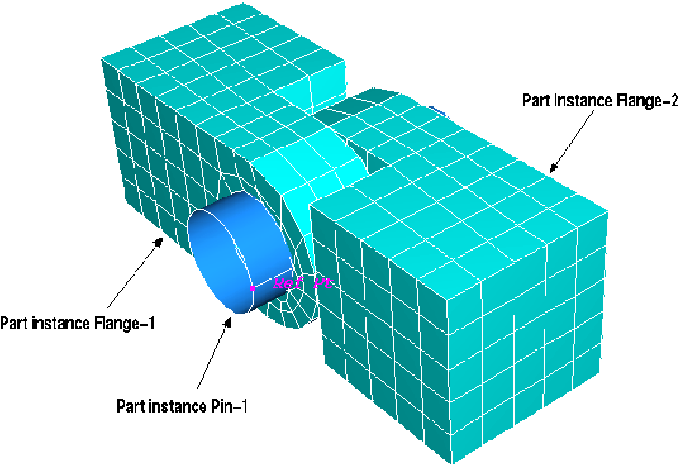

# 2.10.1 Defining an assembly


**Products: **Abaqus/Standard  Abaqus/Explicit  

##### **References**

- [*ASSEMBLY](../key/key-link.md#usb-kws-massembly)
- [*INSTANCE](../key/key-link.md#usb-kws-minstance)
- [*PART](../key/key-link.md#usb-kws-mpart)

### Overview

A finite element model in Abaqus can be defined as an assembly of part instances. The organization of such a model:
- is consistent with models generated by Abaqus/CAE and displayed in the Visualization module (Abaqus/Viewer); and
- allows reuse of part definitions, which is valuable for creating large, complex models.

By default, input files written by Abaqus/CAE are written in terms of an assembly of part instances. For input files not written by Abaqus/CAE, the use of part and assembly definitions in the input file is currently optional. However, since the Visualization module displays results in terms of an assembly of part instances, an assembly and at least one part instance will be created automatically by the analysis input file processor if they are not defined in the input file.

### Introduction

A physical model is typically created by assembling various components. The assembly interface in Abaqus allows analysts to create a finite element mesh using an organizational scheme that parallels the physical assembly. In Abaqus the components that are assembled together are called *part instances*. This section explains how to organize an Abaqus finite element model in terms of an assembly of part instances.

The mesh is created by defining parts, then assembling instances of each part. Each part can be used (instanced) one or more times, and each part instance has its own position within the assembly. This organization of the model definition matches the way models are created in Abaqus/CAE, where the assembly can be created interactively or imported from an input file (see the [Abaqus/CAE User's Guide](../usi/usi-link.md#usi)).

#### Terminology

**

Assembly
**

An assembly is a collection of positioned part instances. An analysis is conducted by defining boundary conditions, constraints, interactions, and a loading history for the assembly.

**

Part
**

A part is a finite element idealization of an object. Parts are the building blocks of an assembly and can be either rigid or deformable. Parts are reusable; they can be instanced multiple times in the assembly. Parts are not analyzed directly; a part is like a blueprint for its instances.

**

Part instance
**

A part instance is a usage of a part within the assembly. All characteristics (such as mesh and section definitions) defined for a part become characteristics for each instance of that part—they are *inherited* by the part instances. Each part instance is positioned independently within the assembly.

#### Example

A hinge can be modeled using two flanges and a pin, as shown in [Figure 2.10.1--1](pt01ch02s10aus28.md#ipartassy-hinge). The flange geometry is defined by creating a part, which is instanced twice inside the hinge assembly. Another part, the pin, is created and instanced once. The pin is modeled as a rigid body created from an analytical surface (see ["Analytical rigid surface definition," Section 2.3.4](pt01ch02s03aus19.md)).

**Figure 2.10.1–1** The hinge assembly.



This hinge example is used throughout this section to illustrate the keyword interface for parts and assemblies. This example is also used to illustrate the interactive assembly process (see [Getting Started with Abaqus: Interactive Edition](../gsa/gsa-link.md#gsa)).

### Defining parts, part instances, and the assembly

Everything defined within a part, instance, or the assembly is local to that part, instance, or the assembly. This means that node/element identifiers and names (like set and surface names) need not be unique throughout a model; they need only be unique within the part, instance, or assembly where they are being defined (see ["Viewing part and assembly information in the data file" in "Output," Section 4.1.1](pt02ch04s01aus38.md#usb-out-ooutput-dat-partassy)). Names should not use an underscore to join part instance names to element set, node set, orientation names, or distribution names because the names may conflict with internal names used by Abaqus.

For example, consider [Figure 2.10.1--2](pt01ch02s10aus28.md#ipartassy-hinge-hierarchy). In this model the assembly (`Hinge`) contains three part instances (`Flange-1`, `Flange-2`, and `Pin-1`). Multiple sets named `top` can be defined: in this case one is defined within the assembly and one is defined within each of the `Flange` part instances. The set name `top` can be reused, and each set named `top` is independent from the others.

**Figure 2.10.1–2** The organization of the `Hinge` assembly.


| **Input File Usage: ** | Use the following options to begin and end each part, instance, and assembly definition: |
| --- | --- |
|  | ``` [*PART](../key/key-link.md#usb-kws-mpart)/[*END PART](../key/key-link.md#usb-kws-mendpart) [*INSTANCE](../key/key-link.md#usb-kws-minstance)/[*END INSTANCE](../key/key-link.md#usb-kws-mendinstance) [*ASSEMBLY](../key/key-link.md#usb-kws-massembly)/[*END ASSEMBLY](../key/key-link.md#usb-kws-mendassembly) ``` If any one of these options appears in an input file, they must all appear except when you import a part instance from a previous analysis; in this case [*PART](../key/key-link.md#usb-kws-mpart) and [*END PART](../key/key-link.md#usb-kws-mendpart) are not required. The model must be consistently defined as an assembly of part instances. |

#### Defining a part

A part definition must appear outside the assembly definition. Multiple parts can be defined in a model; each part must have a unique name.

| **Input File Usage: ** | Use the following options to define a part: |
| --- | --- |
|  | ``` [*PART](../key/key-link.md#usb-kws-mpart), NAME=*PartName* *Node, element, section, set, and surface definitions* [*END PART](../key/key-link.md#usb-kws-mendpart) ``` |

#### Defining part instances

A part instance definition must appear within the assembly definition. If the part instance is not imported from a previous analysis, each part instance must have a unique name and refer to a part name. A part instance name of `Assembly` is not allowed. In addition, you can specify data that are used to position the instance within the assembly. Give a translation and rotation for the part instance relative to the origin of the assembly (global) coordinate system.

If the part instance is to be imported from a previous analysis, each part instance must specify the name of the instance to be imported. For more information on defining part instances for use with the import capability, see ["Transferring results between Abaqus analyses: overview," Section 9.2.1](pt04ch09s02aus54.md).

Additional sets and surfaces can be defined at the instance level, as explained later in this section.

| **Input File Usage: ** | Use the following options to instance a part that is not imported from a previous analysis: |
| --- | --- |
|  | ``` [*INSTANCE](../key/key-link.md#usb-kws-minstance), NAME=*InstanceName*, PART=*PartName* * <positioning data>* * Additional set and surface definitions (optional)* [*END INSTANCE](../key/key-link.md#usb-kws-mendinstance) ``` Repeat these options, each time referring to the same part name, to instance a part multiple times. Use the following options to import a part instance from a previous analysis: ``` [*INSTANCE](../key/key-link.md#usb-kws-minstance), INSTANCE=*instance-name* * Additional set and surface definitions (optional)* [*IMPORT](../key/key-link.md#usb-kws-mimport) [*END INSTANCE](../key/key-link.md#usb-kws-mendinstance) ``` |

#### Defining the assembly

Only one assembly can be defined in a model. All part instance definitions must appear within the assembly definition.

Sets and surfaces can be defined at the assembly level by including the appropriate definitions within the assembly definition.

| **Input File Usage: ** | Use the following options to create an assembly: |
| --- | --- |
|  | ``` [*ASSEMBLY](../key/key-link.md#usb-kws-massembly), NAME=*name* *Part instance definitions* *Set and surface definitions* *Connector and constraint definitions* *Rigid body definitions* [*END ASSEMBLY](../key/key-link.md#usb-kws-mendassembly) ``` |

#### Example

The hinge assembly shown in [Figure 2.10.1--1](pt01ch02s10aus28.md#ipartassy-hinge) can be defined using the following syntax in the input file:

```
[*PART](../key/key-link.md#usb-kws-mpart), NAME=Flange
   [*NODE](../key/key-link.md#usb-kws-mnode), NSET=Flange
    1, ...
    2, ...
    ...
    360, ...
   [*ELEMENT](../key/key-link.md#usb-kws-melement), ELSET=Flange
    1, ...
    2, ...
    ...
    200, ...
   [*SOLID SECTION](../key/key-link.md#usb-kws-msolidsection), ELSET=Flange, MATERIAL=Steel
   [*ELSET](../key/key-link.md#usb-kws-melset), ELSET=Flat, GENERATE
    176, 200, 1
   [*SURFACE](../key/key-link.md#usb-kws-msurface), NAME=Flat
    Flat, S1
[*END PART](../key/key-link.md#usb-kws-mendpart)
[*PART](../key/key-link.md#usb-kws-mpart), NAME=Pin
   [*NODE](../key/key-link.md#usb-kws-mnode), NSET=RefPt
    1, ...
   [*SURFACE](../key/key-link.md#usb-kws-msurface), TYPE=REVOLUTION, NAME=Pin
    ...
   [*RIGID BODY](../key/key-link.md#usb-kws-mrigidbody), REF NODE=1, ANALYTICAL SURFACE=Pin
[*END PART](../key/key-link.md#usb-kws-mendpart)
[*ASSEMBLY](../key/key-link.md#usb-kws-massembly), NAME=Hinge
   [*INSTANCE](../key/key-link.md#usb-kws-minstance), NAME=Flange-1, PART=Flange
    *<positioning data>*
   [*END INSTANCE](../key/key-link.md#usb-kws-mendinstance)
   [*INSTANCE](../key/key-link.md#usb-kws-minstance), NAME=Flange-2, PART=Flange
    *<positioning data>*
   [*END INSTANCE](../key/key-link.md#usb-kws-mendinstance)
   [*INSTANCE](../key/key-link.md#usb-kws-minstance), NAME=Pin-1, PART=Pin
    *<positioning data>*
   [*END INSTANCE](../key/key-link.md#usb-kws-mendinstance)
   [*ELSET](../key/key-link.md#usb-kws-melset), ELSET=Top
    ...
   [*NSET](../key/key-link.md#usb-kws-mnset), NSET=Output
    ...
[*END ASSEMBLY](../key/key-link.md#usb-kws-mendassembly)
[*MATERIAL](../key/key-link.md#usb-kws-mmaterial), NAME=Steel
 ...
```

##### Notes

- All of the nodes and elements that describe the `Flange` part are defined between the [*PART](../key/key-link.md#usb-kws-mpart) and [*END PART](../key/key-link.md#usb-kws-mendpart) options. The section definition ([*SOLID SECTION](../key/key-link.md#usb-kws-msolidsection)) must also appear within the part definition.
- At least one element set must be defined within the `Flange` part so that the section definition can refer to it. Additional node and element sets can also be defined in the part.
- The `Flange` part is instanced twice in the `Hinge` assembly. Therefore, the model contains two element sets named `Flat`: one belongs to part instance `Flange-1`, and the other belongs to part instance `Flange-2`.
- When a meshed part is instanced, the node and element numbers are repeated in each part instance.
- The `Pin` part is instanced once. It is a rigid body created from an analytical surface (see ["Analytical rigid surface definition," Section 2.3.4](pt01ch02s03aus19.md)).
- Keywords can be indented to help clarify the definition of each part, part instance, and assembly.

### Organizing the model definition

In a traditional Abaqus model without an assembly definition, the components of the model fall into one of two categories: model data (step independent) and history data (step dependent). In an Abaqus model that is organized into an assembly of part instances, all components are further categorized and must fall within the proper level: part, assembly, instance, step, or model. Step-level components correspond to history data; all step-dependent component definitions must appear within a step definition (see ["Defining an analysis," Section 6.1.2](pt03ch06s01abo05.md)). Model-level data include everything that does not fall into part-, assembly-, instance-, or step-level data (for example, material definitions; see [Figure 2.10.1--3](pt01ch02s10aus28.md#ipartassy-data-model)). The proper level within which a keyword option must appear in the input file is indicated at the top of each section in the [Abaqus Keywords Reference Guide](../key/key-link.md#key).

**Figure 2.10.1–3** Organization of a model defined in terms of an assembly of part instances.


### Rules for defining an assembly

The organization shown in [Figure 2.10.1--3](pt01ch02s10aus28.md#ipartassy-data-model) is achieved by following a few basic rules. 

#### Referring to items between levels

When creating a model, it is often necessary to refer to something outside of the current level; for example, a section definition within a part must refer to a material, which is defined at the model level. Loads defined within a step must refer to sets within the assembly. But some references between levels are not allowed; for example, a set in one part instance cannot refer to nodes in another part instance. The following references are allowed:

| A definition within: | Can refer to items within: |
| --- | --- |
| the assembly | an instance |
| the model |
| an instance | the model |
| a part | the model |
| a step | the assembly |
| an instance |
| the model |

These rules are illustrated in [Figure 2.10.1--4](pt01ch02s10aus28.md#ipartassy-scope).

**Figure 2.10.1–4** Allowable references between levels.


#### Naming conventions

The Abaqus naming conventions allow for a model that contains an assembly. When something is defined within a part, instance, or the assembly and is referred to from outside its level, the complete name must be used to identify it (set `Flat` of instance `Flange-2` in assembly `Hinge`, for example). A complete name is given in the input file using “dot” notation: each name in the hierarchy is separated by a “.” (period). For example, some complete names in the `Hinge` assembly are

| `Hinge.Flange-2.Flat` | An element set that belongs to part instance `Flange-2`. |
| --- | --- |
| `Hinge.Output` | A node set that belongs to assembly `Hinge`. |

Such names would be used to refer to the sets from outside the assembly. The same syntax is used to refer to individual nodes or elements.

| `Hinge.Flange-1.3` | A node or element that belongs to part instance `Flange-1`. |
| --- | --- |
| `Hinge.Flange-2.11` | A node or element that belongs to part instance `Flange-2`. |

As always, the context determines whether a node or element is being referred to. The “.” has special meaning; it is used to separate the individual names in a complete name. Therefore, the “.” cannot be used in labels such as set and surface names. For example, 

| `[*ELSET](../key/key-link.md#usb-kws-melset), ELSET=Set.1` | Error |
| --- | --- |
| `[*ELSET](../key/key-link.md#usb-kws-melset), ELSET=Set1` | OK |

Complete names are limited to 80 characters, including the periods.

However, when referring to a name in an input file that is not defined in terms of an assembly of part instances, the “.” in the name should be replaced by underscores. Such a situation can occur, for example, when an element set from a previous analysis is referred to by the current analysis but the current input file is not defined in terms of an assembly of part instances.

##### Quoted labels

Labels for set and surface names can be defined by enclosing the label in quotation marks (see ["Input syntax rules," Section 1.2.1](pt01ch01s02aus01.md)). Any subsequent use of the label in a complete name must be enclosed in quotation marks as well. For example,

```
[*PART](../key/key-link.md#usb-kws-mpart), NAME=Flange
 ...
[*ELSET](../key/key-link.md#usb-kws-melset), ELSET="Set 1"
 ...
[*END PART](../key/key-link.md#usb-kws-mendpart)
 ...
[*ELEMENT OUTPUT](../key/key-link.md#usb-kws-helementoutput), ELSET=Hinge.Flange-1."Set 1"
```

##### Example

An assembly node set `Top` can be defined by the following syntax:

```
[*ASSEMBLY](../key/key-link.md#usb-kws-massembly), NAME=Hinge
   ...
   [*NSET](../key/key-link.md#usb-kws-mnset), NSET=Top
    Flange-1.2, Flange-1.5, ...
    Flange-2.1, Flange-2.4, ...
[*END ASSEMBLY](../key/key-link.md#usb-kws-mendassembly)
```
Since the node set is defined within the assembly level, `Hinge.` is not part of the complete names given on the data lines. However, the prefix `Hinge.` would be required to request output for this node set, since the output request exists within the step definition, which is outside the assembly level.
```
[*STEP](../key/key-link.md#usb-kws-hstep)
     ...
     [*NODE OUTPUT](../key/key-link.md#usb-kws-hnodeoutput), NSET=Hinge.Top
[*END STEP](../key/key-link.md#usb-kws-hendstep)
```
Similarly, a boundary condition could be applied to a set defined for part instance `Flange-2`.
```
[*STEP](../key/key-link.md#usb-kws-hstep)
     ...
     [*BOUNDARY](../key/key-link.md#usb-kws-hboundary)
      Hinge.Flange-2.FixedEnd, 1, 3
[*END STEP](../key/key-link.md#usb-kws-hendstep)
```

#### The mesh (nodes and elements)

- The mesh can be defined either on a part or on an instance of that part (not both). Typically, parts are meshed and instances inherit that mesh, but it is not required. If, for example, you want to use fully integrated elements for one part instance and reduced-integration elements for another, or if you want to define a more refined mesh on one part instance than on another, you must mesh the instances separately. - If the mesh is defined on a part, it is inherited by every instance of that part. - If the mesh is defined on a part, it cannot be redefined (overridden) on an instance of that part. In other words, if the node and element definitions appear within the part definition, they cannot appear within the instance definition for that part. - If a mesh is not defined on a part, it must be defined on every instance of that part.
- A part definition is required even if no mesh is defined on it. In such cases the empty part definition is used only to relate various instances to each other via the instance definitions. This allows the Visualization module to group information by part.
- Rebar must be defined within a part along with the elements that are being reinforced.
- Reference nodes can be created at the assembly level.
- Only mass, rotary inertia, capacitance, connector, spring, and dashpot elements can be created at the part or the assembly level. All other element types must be defined within a part (or part instance). To define assembly-level elements that refer to part-level nodes, include the part instance name when defining the element connectivity. For example: ``` [*ELEMENT](../key/key-link.md#usb-kws-melement), TYPE=MASS 1, Instance-1.10 ```

#### Section definitions

- Sections must be assigned where the mesh is defined (either within a part definition or within each instance of the part).
- If a part is meshed, all instances of that part have the same element types and are made of the same materials.
- The set referred to by a section definition must be created at the same level as the mesh and section definition.
- If the part is meshed, the section assignment cannot be overridden at the instance level.

#### Sets and surfaces

- Sets and surfaces (rigid or deformable) can be created within a part, part instance, or the assembly. - Sets and surfaces can be created on a part if a mesh is defined on the part. - Sets and surfaces defined on a part are inherited by each instance of that part. - Assembly-level sets and, in Abaqus/Standard, slave surfaces can span part instances.
- If an element set or node set definition with the same name appears more than once at the same level, the new members are appended to the set.
- A surface definition cannot appear more than once with the same surface name within the same level.
- New sets and surfaces can be created on a part instance. If a set or surface is defined on a part instance and a set or surface with that name was not defined on the part, the set or surface is added to the instance.
- Sets and surfaces cannot be redefined on a part instance. If a set or surface is defined on a part instance and a set or surface with that name was also defined on the part, an error will be generated.
- Sets and surfaces are not step dependent. All sets and surfaces must be defined within a part, part instance, or the assembly.

##### Defining assembly-level sets

You can refer to a part instance from an element set or node set definition as a shortcut to using the complete name when defining assembly-level sets. Specify the name of the instance that contains the specified elements or nodes. To add elements or nodes from more than one instance to the set, repeat the element set or node set definition (see ["Node definition," Section 2.1.1](pt01ch02s01aus05.md), and ["Element definition," Section 2.2.1](pt01ch02s02aus11.md), for more details). 

| **Input File Usage: ** | Use the following options to define assembly-level sets: |
| --- | --- |
|  | ``` [*NSET](../key/key-link.md#usb-kws-mnset), NSET=*NsetName*, INSTANCE=*InstanceName* [*ELSET](../key/key-link.md#usb-kws-melset), ELSET=*ElsetName*, INSTANCE=*InstanceName* ``` |

##### Adding sets and surfaces on restart

- Existing sets and surfaces cannot be redefined on restart.
- Analytical surfaces cannot be created on restart.
- New sets and surfaces (excluding analytical surfaces) can be added to part instances or the assembly on restart. To add a set or surface, give the complete name. As in the original analysis, you can refer to the part instance name from the element set or node set definition to define an assembly-level set in the restart analysis. For example, ``` [*HEADING](../key/key-link.md#usb-kws-mheading) [*RESTART](../key/key-link.md#usb-kws-mrestart), READ, STEP=1 ** Add element set "Bottom" to assembly "Hinge": [*ELSET](../key/key-link.md#usb-kws-melset), ELSET=Hinge.Bottom Flange-1.40, Flange-2.99 ** Add node set "Top" to assembly "Hinge": [*NSET](../key/key-link.md#usb-kws-mnset), NSET=Hinge.Top, Instance=Flange-1 21, 22, 23, 24, 26, 28, 31 [*NSET](../key/key-link.md#usb-kws-mnset), NSET=Hinge.Top, Instance=Flange-2 21, 22, 23, 24, 26, 28, 31 ** ** Add element set "Right" to part instance "Flange-2": [*ELSET](../key/key-link.md#usb-kws-melset), ELSET=Hinge.Flange-2.Right 16, 18, 20, 29 ** ** Add surface "surfR" to part instance "Flange-2": [*SURFACE](../key/key-link.md#usb-kws-msurface), TYPE=ELEMENT, NAME=Hinge.Flange-2.surfR Right, S1 ** [*STEP](../key/key-link.md#usb-kws-hstep) ... [*END STEP](../key/key-link.md#usb-kws-hendstep) ```

#### Rigid bodies

Rigid bodies can be defined at the part or assembly level. 
- To define a rigid body at the part level, include the rigid body and rigid body reference node definitions within the part definition. - Rigid elements, deformable elements, and analytical surfaces cannot be combined within a part. - If a rigid body is defined within a part, all deformable, rigid, or connector elements in the part must belong to the rigid body. - Mass, rotary inertia, spring, dashpot, and heat capacitance elements can be included in a part that contains a rigid body definition, but these elements cannot belong to the rigid body. - To create a part-level rigid body from an analytical surface, include the surface definition within the part definition. Only one analytical surface is allowed per part.
- To define a rigid body at the assembly level, include the rigid body and reference node definitions within the assembly definition. - A rigid body can be created at the assembly level from any combination of rigid elements, deformable elements, and up to one analytical surface. - The rigid body definition can refer to assembly-level or part-level sets. - A part that contains a rigid body definition cannot be included in an assembly-level rigid body.
- You can define a discrete surface at the part or assembly level independent from the rigid body definition.
- An analytical surface definition can appear only within a part definition, even if the rigid body is defined at the assembly level.

#### Materials

- Materials are defined at the model level so that they can be reused. The material definition cannot appear within a part, part instance, or the assembly.
- All materials in a model must have unique names.

#### Interactions

An interaction is a relationship between surfaces or between a surface and its environment. Interactions in Abaqus include contact, radiation, film conditions, and element foundations.
- Interactions are defined at the model level in Abaqus/Standard and at the model level or within steps in Abaqus/Explicit; they cannot be defined within a part, assembly, or instance.

#### Constraints

Constraints are inflexible coupling mechanisms such as MPCs and equations (see ["Kinematic constraints: overview," Section 35.1.1](pt08ch35s01abo32.md)). 
- Constraints can be defined within a part or the assembly. They can be defined within a part instance if the mesh is defined within the part instance. Constraints should be defined at the assembly level if they constrain the motion of one part instance relative to another.
- Constraints are translated and rotated according to the positioning data given for a part instance.

#### Distributions

Distributions are used to specify arbitrary spatial variations of selected element properties, material properties, local coordinate systems, and spatial variations of initial contact clearances (see ["Distribution definition," Section 2.8.1](pt01ch02s08aus26.md)). 
- Distributions should be defined at the level at which they are used. For example, if a distribution is used to define shell thicknesses, the distribution should be defined at the same level as the section definition that refers to it. If a distribution is used to define a material property, it should be defined at the model level with the material definition.

#### Examples

In the following examples most parameters and data lines are omitted for clarity.

| Example 1 |  | Notes |
| --- | --- | --- |
| [*PART](../key/key-link.md#usb-kws-mpart), NAME=PartA |  |  |
| [*NODE](../key/key-link.md#usb-kws-mnode) ... |  | The mesh is defined on the part. |
| [*ELEMENT](../key/key-link.md#usb-kws-melement) ... |
| [*SOLID SECTION](../key/key-link.md#usb-kws-msolidsection), ELSET=setA, MATERIAL=Mat1 |  | Section assignment must appear within the part level if the mesh is defined on the part. |
| [*SURFACE](../key/key-link.md#usb-kws-msurface), NAME=surf1 setB, ... | error | Element set `setB` is not defined at the part level. |
| [*ELSET](../key/key-link.md#usb-kws-melset), ELSET=setA |  | Sets and surfaces can be defined on the part since the mesh is defined on the part. |
| [*NSET](../key/key-link.md#usb-kws-mnset), NSET=setA |
| [*SURFACE](../key/key-link.md#usb-kws-msurface), NAME=surf2 setA, ... |
| [*END PART](../key/key-link.md#usb-kws-mendpart) |  |  |
| [*ASSEMBLY](../key/key-link.md#usb-kws-massembly), NAME=Assembly-1 |  |  |
| [*INSTANCE](../key/key-link.md#usb-kws-minstance), NAME=I1, PART=PartA |  |  |
| [*NODE](../key/key-link.md#usb-kws-mnode) | error | Mesh and section assignment cannot be defined on the instance if they are defined on the part. |
| [*ELEMENT](../key/key-link.md#usb-kws-melement) | error |
| [*SOLID SECTION](../key/key-link.md#usb-kws-msolidsection) | error |
| [*ELSET](../key/key-link.md#usb-kws-melset), ELSET=setA | error | Sets and surfaces cannot be redefined on the instance. |
| [*NSET](../key/key-link.md#usb-kws-mnset), NSET=setA | error |
| [*SURFACE](../key/key-link.md#usb-kws-msurface), NAME=surf2 | error |
| [*ELSET](../key/key-link.md#usb-kws-melset), ELSET=setB |  | New sets and surfaces can be defined on the instance. |
| [*NSET](../key/key-link.md#usb-kws-mnset), NSET=setB |
| [*SURFACE](../key/key-link.md#usb-kws-msurface), NAME=surf3 setA, ... |  | Set and surface definitions can refer to inherited sets. |
| [*END INSTANCE](../key/key-link.md#usb-kws-mendinstance) |  |  |
| [*END ASSEMBLY](../key/key-link.md#usb-kws-mendassembly) |  |  |

In the second example the instances are meshed.

| Example 2 |  | Notes |
| --- | --- | --- |
| [*PART](../key/key-link.md#usb-kws-mpart), NAME=PartB |  | The [*PART](../key/key-link.md#usb-kws-mpart) and [*END PART](../key/key-link.md#usb-kws-mendpart) options are required, even when the instance is meshed. |
| [*END PART](../key/key-link.md#usb-kws-mendpart) |
| [*PART](../key/key-link.md#usb-kws-mpart), NAME=PartC |  | Section cannot be defined on the part if mesh is not defined on the part. |
| [*SOLID SECTION](../key/key-link.md#usb-kws-msolidsection), ... | error |
| [*END PART](../key/key-link.md#usb-kws-mendpart) |  |
| [*ASSEMBLY](../key/key-link.md#usb-kws-massembly), NAME=Assembly-1 |  |  |
| [*INSTANCE](../key/key-link.md#usb-kws-minstance), NAME=I1, PART=PartB |  |  |
| [*NODE](../key/key-link.md#usb-kws-mnode) ... |  | The mesh is defined on the part instance. |
| [*ELEMENT](../key/key-link.md#usb-kws-melement) ... |
| [*SOLID SECTION](../key/key-link.md#usb-kws-msolidsection), ELSET=setA, MATERIAL=Mat1 |  | Section assignment must appear within the same level as the mesh definition. |
| [*ELSET](../key/key-link.md#usb-kws-melset), ELSET=setA |  | Sets and surfaces are defined on the instance since the mesh is defined on the instance. |
| [*NSET](../key/key-link.md#usb-kws-mnset), NSET=setA |
| [*SURFACE](../key/key-link.md#usb-kws-msurface), NAME=surf2 setA, ... |
| [*END INSTANCE](../key/key-link.md#usb-kws-mendinstance) |  |  |
| [*INSTANCE](../key/key-link.md#usb-kws-minstance), NAME=I3, PART=PartC *<positioning data>* | error | The mesh and section must be defined for each instance since the part is not meshed. |
| [*END INSTANCE](../key/key-link.md#usb-kws-mendinstance) |
| [*END ASSEMBLY](../key/key-link.md#usb-kws-mendassembly) |  |  |

### Coordinate system definitions

Abaqus provides several methods for defining local coordinate systems.

**Nodal coordinate systems**

You can define nodal coordinates in a local coordinate system (see ["Specifying a local coordinate system in which to define nodes" in "Node definition," Section 2.1.1](pt01ch02s01aus05.md#usb-int-inode-system-option)). The coordinate system can be defined within a part definition to define the nodes in that part. The nodal coordinate system definition remains in effect until another nodal coordinate system is defined within the same level or until the level ends.

**Nodal transformations**

A nodal transformation is used for applying loads and boundary conditions (see ["Transformed coordinate systems," Section 2.1.5](pt01ch02s01aus09.md)). It can be defined at the part or assembly level to define a local coordinate system for application of loads and boundary conditions or for the definition of linear constraint equations.

**User-defined orientations**

A user-defined orientation is used for defining material properties, coupling, connectors, and rebar (see ["Orientations," Section 2.2.5](pt01ch02s02aus15.md)). It can be defined at the part level for reference from a section, connector, rebar, or coupling definition. An orientation definition can also be used at the assembly level for reference from a connector or coupling definition.

**Distributions**

Distributions can be used to specify arbitrary spatial variations of local coordinate systems for continuum and shell elements (see ["Orientations," Section 2.2.5](pt01ch02s02aus15.md)). A distribution used by an orientation should be defined at the level in which the orientation is defined. 

**Normal definitions at nodes**

Normals can be defined at nodes as part of the node definition for beam, pipe, and shell elements or with a user-specified normal definition (see ["Normal definitions at nodes," Section 2.1.4](pt01ch02s01aus08.md)). These normals can be defined at the part or assembly level.

A local coordinate system defined for a part using any of these methods is inherited by all instances of the part.

#### Translating and rotating a part instance

The assembly's coordinate system is the global coordinate system. You can position part instances within the assembly by giving a translation and/or rotation relative to the global origin. Specify a translation by giving a translation vector. Specify a rotation by giving two points, *a* and *b*, to define a rotation axis plus a right-handed angular rotation around that axis.

Local coordinate systems defined within a part or part instance will be translated and rotated according to the specified positioning data, as shown in [Figure 2.10.1--5](pt01ch02s10aus28.md#ipartassy-coord-systems). (In this figure details such as element and section definitions are omitted for clarity.) Results given in a local coordinate system are output in the transformed local system. Equations will also be translated and rotated according to the positioning data for an instance. All data within a part (or part instance) definition are defined relative to the part's local coordinate system; positioning data are applied to a part instance after everything within that instance is defined.

**Figure 2.10.1–5** Defining local coordinate systems.


### Limitations

The following capabilities are not supported in a model defined in terms of an assembly of part instances:
- ["Mapping a set of nodes from one coordinate system to another" in "Node definition," Section 2.1.1](pt01ch02s01aus05.md#usb-int-inode-nmap)
- ["Using auxiliary analyses to generate shape variations" in "Parametric shape variation," Section 2.1.2](pt01ch02s01aus06.md#usb-int-iparshapevar-auxanal)
- ["Symmetric model generation," Section 10.4.1](pt04ch10s04aus63.md)
- ["Transferring results from a symmetric mesh or a partial three-dimensional mesh to a full three-dimensional mesh," Section 10.4.2](pt04ch10s04aus64.md)
- ["Reading the element matrices from an Abaqus/Standard results file" in "User-defined elements," Section 32.15.1](pt06ch32s15alm60.md#usb-elm-euserelem-linear-resultsfile)

The substructure library is not organized in terms of an assembly of part instances, so substructures cannot be generated from models that have an assembly defined. None of the substructure options are supported in models that have an assembly defined.

### Input file template

This template shows an input file that is written in terms of parts and assemblies with the part instances defined in this analysis. For templates that show how to import a part instance from a previous analysis to transfer model data and results, see ["Transferring results between Abaqus/Explicit and Abaqus/Standard," Section 9.2.2](pt04ch09s02aus55.md), and ["Transferring results from one Abaqus/Standard analysis to another," Section 9.2.3](pt04ch09s02aus56.md).

```
[*HEADING](../key/key-link.md#usb-kws-mheading)
[*PART](../key/key-link.md#usb-kws-mpart), NAME=Part-1
   *Node, element, section, set, and surface definitions*
   *Connector and constraint definitions*
[*END PART](../key/key-link.md#usb-kws-mendpart)
[*PART](../key/key-link.md#usb-kws-mpart), NAME=Part-2
   **The instance is meshed, so the part definition is empty
[*END PART](../key/key-link.md#usb-kws-mendpart)
[*MATERIAL](../key/key-link.md#usb-kws-mmaterial), NAME=mat1
   *Suboptions and data lines to define this material*
[*ASSEMBLY](../key/key-link.md#usb-kws-massembly), NAME=Assembly-1
   [*INSTANCE](../key/key-link.md#usb-kws-minstance), NAME=i1, PART=Part-1
    *<positioning data>*
      *Additional set and surface definitions (optional)*
   [*END INSTANCE](../key/key-link.md#usb-kws-mendinstance)
   [*INSTANCE](../key/key-link.md#usb-kws-minstance), NAME=i2, PART=Part-2
    *<positioning data>*
      *Node, element, section, set, and surface definitions*
      *Connector and constraint definitions*
   [*END INSTANCE](../key/key-link.md#usb-kws-mendinstance)
   *Assembly-level set and surface definitions*
   *Assembly-level connectors and constraints*
   *Assembly-level reference node definitions*
   *Assembly-level rigid body definitions*
[*END ASSEMBLY](../key/key-link.md#usb-kws-mendassembly)
[*MATERIAL](../key/key-link.md#usb-kws-mmaterial), NAME=mat2
   *Suboptions and data lines to define this material*
[*AMPLITUDE](../key/key-link.md#usb-kws-mamplitude)
[*INITIAL CONDITIONS](../key/key-link.md#usb-kws-minitialcond)
[*BOUNDARY](../key/key-link.md#usb-kws-hboundary)
   *Zero-valued boundary conditions*
[*PHYSICAL CONSTANTS](../key/key-link.md#usb-kws-mphysicalconsts)
[*CONNECTOR BEHAVIOR](../key/key-link.md#usb-kws-mconnectorbehavior)
   *Suboptions and data lines to define this connector behavior*
*Interaction and interaction property definitions in Abaqus/Standard or Abaqus/Explicit*
[*STEP](../key/key-link.md#usb-kws-hstep)
   *Loads and boundary conditions*
   *Predefined field definitions*
   *Output requests*
   *Contact interaction definitions in Abaqus/Explicit*
[*END STEP](../key/key-link.md#usb-kws-hendstep)
```


