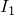

# 3.2.28 Translating Nastran bulk data files to Abaqus input files


**Products: **Abaqus/Standard  Abaqus/Explicit  

##### **References**

- ["Execution procedure for Abaqus: overview," Section 3.1.1](pt01ch03s01abo02.md)
- ["Translating Abaqus files to Nastran bulk data files," Section 3.2.29](pt01ch03s02abx29.md)
- ["Importing a model from a Nastran input file," Section 10.5.4 of the Abaqus/CAE User's Guide](../usi/usi-link.md#usi-imp-nastran)

### Overview

The translator from Nastran to Abaqus converts certain entities in a Nastran input file into their equivalent in Abaqus.

### Using the translator

The Nastran data must be in a file with the extension `.bdf`, `.dat`, `.nas`, `.nastran`, `.blk`, or `.bulk`. The Nastran data entries that are translated are listed in the tables below. Other valid Nastran data are skipped over and noted in the log file.

The translator is designed to translate a complete Nastran input file. If only bulk data are present, the first two lines in the file should be the terminators for the executive control and case control sections, namely:

```
CEND 
BEGIN BULK
```
For normal termination, end the Nastran input data with the line
```
ENDDATA
```
Nastran solution sequences are translated to the Abaqus procedures listed in [Table 3.2.28--1](pt01ch03s02abx28.md#table-execcontroldata). The translator attempts to create a history section based on the contents of the case control data in the Nastran file. 

### Summary of Nastran entities translated

**Table 3.2.28–1** Executive control data.
| Nastran Statement | Abaqus Equivalent |
| --- | --- |
| SOL |  |
| 1 | (STATICS1) | [*STATIC](../key/key-link.md#usb-kws-hstatic) |
| 24 | (STATICS) |
| 101 | (SESTATIC) |
| 106 | (NLSTATIC) |
| 3 | (MODES) | [*FREQUENCY](../key/key-link.md#usb-kws-hfrequency) |
| 25 | (OLDMODES) |
| 103 | (SEMODES) |
| 5 | (BUCKLING) | [*BUCKLE](../key/key-link.md#usb-kws-hbuckle) |
| 105 | (SEBUCKL) |
| 26 | (DFREQ) | [*STEADY STATE DYNAMICS](../key/key-link.md#usb-kws-hsteadystdyn), DIRECT |
| 108 | (SEDFREQ) |
| 27 | (DTRAN) | [*DYNAMIC](../key/key-link.md#usb-kws-hdynamic) |
| 109 | (SEDTRAN) |
| 107 | (SEDCEIG) | [*COMPLEX FREQUENCY](../key/key-link.md#usb-kws-hcomplexfrequency) |
| 110 | (SEMCEIG) |
| 30 | (DFREQ) | [*FREQUENCY](../key/key-link.md#usb-kws-hfrequency) and [*STEADY STATE DYNAMICS](../key/key-link.md#usb-kws-hsteadystdyn) |
| 111 | (SEMFREQ) |
| 31 | (MTRAN) | [*FREQUENCY](../key/key-link.md#usb-kws-hfrequency) and [*MODAL DYNAMIC](../key/key-link.md#usb-kws-hmodaldyn) |
| 112 | (SEMTRAN) |

**Table 3.2.28–2** Case control data.
| Nastran Command | Comment |
| --- | --- |
| SPC | Selects SPC sets alone or in combinations |
| LOAD | Selects individual loads and load combinations |
| METHOD | Selects EIGRL, EIGR, or EIGB from bulk data for eigenfrequency extraction and eigenvalue buckling prediction procedures |
| SUBCASE | Delimiter for steps or load cases; optional if there is only one step |
| TITLE | Echoed as comment at top of input file and for each step |
| SUBTITLE | Echoed as comment for the step to which it applies |
| LABEL | Used as text following the [*STEP](../key/key-link.md#usb-kws-hstep) option |
| DLOAD | Selects dynamic loads from bulk data |
| LOADSET |
| FREQUENCY | Selects forcing frequencies from bulk data |
| MPC | Selects MPCADD and MPC from bulk data if referenced in the first SUBCASE |
| SUPORT1 | Selects SUPORT1 from bulk data |
| TSTEP | Selects TSTEP from bulk data |
| K2GG | Selects DMIG from bulk data using the matrix name from the first SUBCASE |
| K2PP |
| M2GG |
| M2PP |
| B2GG |
| B2PP |
| K42GG |
| TEMPERATURE | Selects nodal temperatures from bulk data |
| SET | Selects nodal quantities for output |
| DISPLACEMENT |
| VELOCITY |
| ACCELERATION |
| SPCFORCES |
| PRESSURE |

**Table 3.2.28–3** Bulk data.
| Nastran Data Entry | Comment |
| --- | --- |
| PARAM | Ignored except for:1. WTMASS, which can be used to modify density, mass, and rotary inertia values if the **wtmass_fixup** command line parameter is used2. INREL, which if equal to 1 or 2 will create inertia relief loads3. G, which is translated to [*GLOBAL DAMPING](../key/key-link.md#usb-kws-hglobaldamping), STRUCTURAL, FIELD=MECHANICAL4. GFL, which is translated to [*GLOBAL DAMPING](../key/key-link.md#usb-kws-hglobaldamping), STRUCTURAL, FIELD=ACOUSTIC |
| CDAMP1 | DASHPOT1/DASHPOT2 and [*DASHPOT](../key/key-link.md#usb-kws-mdashpot) |
| CDAMP2 |
| PDAMP |
| PDAMPT |
| CELAS1 | SPRING1/SPRING2 and [*SPRING](../key/key-link.md#usb-kws-mspring)(CELAS2 at SPOINTs are translated to [*MATRIX INPUT](../key/key-link.md#usb-kws-mmatrixinput), stiffness, and/or structural damping terms.) |
| CELAS2 |
| PELAS |
| PELAST |
| CMASS2 | [*MATRIX INPUT](../key/key-link.md#usb-kws-mmatrixinput) mass terms |
| CBUSH | CONN3D2 and [*CONNECTOR SECTION](../key/key-link.md#usb-kws-mconnectorsection) |
| PBUSH |
| PBUSHT |
| CWELD | [*FASTENER](../key/key-link.md#usb-kws-mfastener) and [*FASTENER PROPERTY](../key/key-link.md#usb-kws-mfastenerproperty) |
| PWELD |
| CONM1 | MASS and/or ROTARY INERTIA and/or UEL |
| CONM2 | MASS and/or ROTARY INERTIA |
| CHEXA | C3D8I/C3D20R/C3D6/C3D15/C3D4/C3D10 and [*SOLID SECTION](../key/key-link.md#usb-kws-msolidsection) |
| CPENTA |
| CTETRA |
| PSOLID |
| PLSOLID |
| CQUAD4 | S4/S3R/S8R/STRI65, and [*SHELL SECTION](../key/key-link.md#usb-kws-mshellsection), [*SHELL GENERAL SECTION](../key/key-link.md#usb-kws-mshellgensect), or [*MEMBRANE SECTION](../key/key-link.md#usb-kws-mmembranesection). |
| CTRIA3 |
| CQUAD8 |
| CTRIA6 |
| CQUADR |
| CTRIAR |
| PSHELL |
| PCOMP |
| PCOMPG |
| CSHEAR | [*USER ELEMENT](../key/key-link.md#usb-kws-muserelement), LINEAR and [*MATRIX](../key/key-link.md#usb-kws-mmatrix), TYPE=STIFFNESS and TYPE=MASS |
| PSHEAR |
| CBAR | B31 and [*BEAM SECTION](../key/key-link.md#usb-kws-mbeamsection) or [*BEAM GENERAL SECTION](../key/key-link.md#usb-kws-mbeamgensect) |
| CBEAM |
| PBAR |
| PBARL |
| PBEAM |
| PBEAML |
| CROD | T3D2 and [*SOLID SECTION](../key/key-link.md#usb-kws-msolidsection) |
| CONROD |
| PROD |
| CGAP | GAPUNI and [*GAP](../key/key-link.md#usb-kws-mgap) |
| PGAP |
| RBAR | [*COUPLING](../key/key-link.md#usb-kws-mcoupling) or [*MPC](../key/key-link.md#usb-kws-mmpc), type BEAM |
| MAT1 | [*ELASTIC](../key/key-link.md#usb-kws-melastic), TYPE=ISO; [*EXPANSION](../key/key-link.md#usb-kws-mexpansion), TYPE=ISO; [*DENSITY](../key/key-link.md#usb-kws-mdensity); and [*DAMPING](../key/key-link.md#usb-kws-mdamping) (G is used only for [*BEAM GENERAL SECTION](../key/key-link.md#usb-kws-mbeamgensect)) |
| MAT2 | When used alone in a PSHELL, MAT2 is translated to [*ELASTIC](../key/key-link.md#usb-kws-melastic), TYPE=LAMINA or [*ELASTIC](../key/key-link.md#usb-kws-melastic), TYPE=ANISOTROPIC. When used in combination with other materials, the coefficients relating midsurface strains and curvatures to section forces and moments are computed and entered following the [*SHELL GENERAL SECTION](../key/key-link.md#usb-kws-mshellgensect) option. |
| MAT8 | [*ELASTIC](../key/key-link.md#usb-kws-melastic), TYPE=LAMINA; [*EXPANSION](../key/key-link.md#usb-kws-mexpansion), TYPE=ORTHO; [*DENSITY](../key/key-link.md#usb-kws-mdensity); and [*DAMPING](../key/key-link.md#usb-kws-mdamping) |
| MAT9 | [*ELASTIC](../key/key-link.md#usb-kws-melastic), TYPE=ANISOTROPIC unless the data are found to be orthotropic, in which case the data are analyzed to create [*ELASTIC](../key/key-link.md#usb-kws-melastic), TYPE=ENGINEERING CONSTANTS. Also [*DENSITY](../key/key-link.md#usb-kws-mdensity); [*EXPANSION](../key/key-link.md#usb-kws-mexpansion), TYPE=ANISO or ORTHO; and [*DAMPING](../key/key-link.md#usb-kws-mdamping). |
| MAT10 | [*ACOUSTIC MEDIUM](../key/key-link.md#usb-kws-macousticmed) and [*DENSITY](../key/key-link.md#usb-kws-mdensity) |
| ACMODL | [*TIE](../key/key-link.md#usb-kws-mtie) between a [*SURFACE](../key/key-link.md#usb-kws-msurface), TYPE=ELEMENT defining the exterior surfaces of all acoustic solid elements and a [*SURFACE](../key/key-link.md#usb-kws-msurface), TYPE=NODE defined by the SET1 referenced by the SSID. |
| NSM | [*NONSTRUCTURAL MASS](../key/key-link.md#usb-kws-mnonstructuralmass) |
| NSM1 |
| NSML |
| NSML1 |
| NSMADD |
| GRID | [*NODE](../key/key-link.md#usb-kws-mnode) and [*SYSTEM](../key/key-link.md#usb-kws-msystem) |
| CORD1R | [*SYSTEM](../key/key-link.md#usb-kws-msystem) for nodes; [*TRANSFORM](../key/key-link.md#usb-kws-mtransform) if referred to on GRID; [*ORIENTATION](../key/key-link.md#usb-kws-morientation) for some elements |
| CORD1C |
| CORD1S |
| CORD2R |
| CORD2C |
| CORD2S |
| RBE2 | [*COUPLING](../key/key-link.md#usb-kws-mcoupling) and [*KINEMATIC](../key/key-link.md#usb-kws-mkinematic); or [*KINEMATIC COUPLING](../key/key-link.md#usb-kws-mkinematiccoupling)(If the RBE2 has only two nodes and neither node has rotational stiffness, the RBE2 is translated to [*MPC](../key/key-link.md#usb-kws-mmpc), type LINK) |
| RBE3 | [*COUPLING](../key/key-link.md#usb-kws-mcoupling) and [*DISTRIBUTING](../key/key-link.md#usb-kws-mdistributing); or DCOUP3D and [*DISTRIBUTING COUPLING](../key/key-link.md#usb-kws-mdistcoupling) |
| SPCADD | Used to combine SPC/SPC1/SPCD data into a new set |
| SPC | [*BOUNDARY](../key/key-link.md#usb-kws-hboundary) |
| SPC1 |
| SPCD |
| LOAD | Used to combine FORCE, MOMENT, etc. data into a new set |
| FORCE | [*CLOAD](../key/key-link.md#usb-kws-hcload) |
| FORCE1 |
| FORCE2 |
| MOMENT |
| MOMENT1 |
| MOMENT2 |
| PLOAD | [*DLOAD](../key/key-link.md#usb-kws-hdload) |
| PLOAD1 |
| PLOAD2 |
| PLOAD4 |
| RFORCE |
| DLOAD | Dynamic loads as functions of time or frequency |
| DAREA |
| LSEQ |
| RLOAD1 |
| RLOAD2 |
| TLOAD1 |
| TABLED1 |
| TABLED2 |
| TABLED4 |
| DELAY |
| DPHASE |
| TEMP | [*INITIAL CONDITIONS](../key/key-link.md#usb-kws-minitialcond), TYPE=TEMPERATURE and [*TEMPERATURE](../key/key-link.md#usb-kws-htemperature) |
| TEMPD |
| TSTEP | Time step size for dynamic and modal dynamic procedures |
| EIGB | [*BUCKLE](../key/key-link.md#usb-kws-hbuckle) |
| EIGR | [*FREQUENCY](../key/key-link.md#usb-kws-hfrequency) |
| EIGRL |
| EIGC | [*COMPLEX FREQUENCY](../key/key-link.md#usb-kws-hcomplexfrequency) |
| TABDMP1 | [*MODAL DAMPING](../key/key-link.md#usb-kws-hmodaldamp) |
| FREQ | Forcing frequencies for steady-state dynamic procedures |
| FREQ1 |
| FREQ2 |
| FREQ3 |
| FREQ4 |
| FREQ5 |
| MPCADD | [*EQUATION](../key/key-link.md#usb-kws-mequation) |
| MPC |
| SUPORT | [*INERTIA RELIEF](../key/key-link.md#usb-kws-hinertiareliefload) and [*BOUNDARY](../key/key-link.md#usb-kws-hboundary) |
| SUPORT1 |
| DMIG | [*MATRIX INPUT](../key/key-link.md#usb-kws-mmatrixinput) and [*MATRIX ASSEMBLE](../key/key-link.md#usb-kws-mmatrixassemble) |
| GENEL | [*USER ELEMENT](../key/key-link.md#usb-kws-muserelement), LINEAR and [*MATRIX](../key/key-link.md#usb-kws-mmatrix), TYPE=STIFFNESS |
| PLOTEL | Ignored unless the command line option **plotel**=`ON`. |

### Command summary

| **abaqus fromnastran** | [**job**](pt01ch03s02abx28.md#job1-usb-int-dnasabaproc)=*job-name* |
| --- | --- |
|  | **[**[**input**](pt01ch03s02abx28.md#input2-usb-int-dnasabaproc)=*input-file***]** **[**[**wtmass_fixup**](pt01ch03s02abx28.md#wtmass_fixup3-usb-int-dnasabaproc)=**{**`OFF`** | ** `ON`**}****]** **[**[**loadcases**](pt01ch03s02abx28.md#loadcases4-usb-int-dnasabaproc)=**{**`OFF`** | ** `ON`**}****]** **[**[**pbar_zero_reset**](pt01ch03s02abx28.md#pbar_zero_reset5-usb-int-dnasabaproc)=[*small-real-number*]**]** **[**[**distribution**](pt01ch03s02abx28.md#distribution6-usb-int-dnasabaproc)=**{**`OFF`** | ** `preservePID`** | **`ON`**}****]** **[**[**surface_based_coupling**](pt01ch03s02abx28.md#surface_based_coupling7-usb-int-dnasabaproc)=**{**`OFF`** | **`ON`**}****]** **[**[**beam_offset_coupling**](pt01ch03s02abx28.md#beam_offset_coupling8-usb-int-dnasabaproc)=**{**`OFF`** | ** `ON`**}****]** **[**[**beam_orientation_vector**](pt01ch03s02abx28.md#beam_orientation_vector9-usb-int-dnasabaproc)=**{**`OFF`** | **`ON`**}****]** **[**[**cbar**](pt01ch03s02abx28.md#cbar10-usb-int-dnasabaproc)=*2-node-beam-element***]** **[**[**cquad4**](pt01ch03s02abx28.md#cquad411-usb-int-dnasabaproc)=*4-node-shell-element***]** **[**[**chexa**](pt01ch03s02abx28.md#chexa12-usb-int-dnasabaproc)=*8-node-brick-element***]** **[**[**ctetra**](pt01ch03s02abx28.md#ctetra13-usb-int-dnasabaproc)=*10-node-tetrahedron-element***]** **[**[**plotel**](pt01ch03s02abx28.md#plotel14-usb-int-dnasabaproc)=**{**`OFF`** | **`ON`**}****]** **[**[**cdh_weld**](pt01ch03s02abx28.md#cdh_weld15-usb-int-dnasabaproc)=**{**`OFF`** | **`RIGID`** | **`COMPLIANT`**}****]** |

### Command line options

**job**

This option is used to specify the name of the Abaqus input file to be output by the translator. It is also the default name of the file containing the Nastran data. Diagnostics created by the translator will be written to a file named `*job-name*.log`.

**input**

This option is used to specify the name of the file containing the Nastran data if it is different from *job-name*.

**wtmass_fixup**

If **wtmass_fixup**=`ON`, the value on the Nastran data line `PARAM, WTMASS, *value*` is used as a multiplier for all density, mass, and rotary inertia values created in the Abaqus input file.

This option can be defined in the Abaqus environment file as follows:

```
fromnastran_wtmass_fixup={OFF | ON}
```

**loadcases**

By default, each `SUBCASE` is translated to a [*STEP](../key/key-link.md#usb-kws-hstep) option in Abaqus. If **loadcases**=`ON`, this behavior is altered for linear static analyses: each `SUBCASE` is translated to a [*LOAD CASE](../key/key-link.md#usb-kws-hloadcase) option, and all such [*LOAD CASE](../key/key-link.md#usb-kws-hloadcase) options are grouped in a single [*STEP](../key/key-link.md#usb-kws-hstep) option.

This option can be defined in the Abaqus environment file as follows:

```
fromnastran_loadcases={OFF | ON}
```

**pbar_zero_reset**

Nastran allows beams to have zero values for cross-sectional area or moments of inertia; Abaqus does not. Set this option equal to a small real number to reset any zero values for *A*, , , or *J* to the specified small real number. If this option is omitted or present without a value, the default value of 1.0  1020 is used in place of the zeros. To retain the zeros in the translated Abaqus input file, set **pbar_zero_reset**=`0`.

This option can be defined in the Abaqus environment file as follows:

```
fromnastran_pbar_zero_reset=*small-real-number*
```

**distribution**

This option determines how shell and membrane sections in Nastran data are translated to Abaqus. If **distribution**=`OFF`, a separate section is created for each combination of orientation, material offset, and/or thickness. If **distribution**=`preservePID` or `ON`, element orientations and offsets are written using the [*DISTRIBUTION](../key/key-link.md#usb-kws-mdistribution) option. If **distribution**=`preservePID`, an Abaqus section is created corresponding to each PSHELL or PCOMP property ID. If **distribution**=`ON`, a single Abaqus section is created for all homogeneous elements referencing the same material. 

This option can be defined in the Abaqus environment file as follows:

```
fromnastran_distribution={OFF | preservePID | ON}
```

**surface_based_coupling**

Certain Nastran rigid elements have more than one equivalent in Abaqus. If **surface_based_coupling**=`ON`, RBE2 and RBE3 elements translate to [*COUPLING](../key/key-link.md#usb-kws-mcoupling) with the appropriate parameters. Otherwise, RBE2 elements translate to [*KINEMATIC COUPLING](../key/key-link.md#usb-kws-mkinematiccoupling) and RBE3 elements translate to [*DISTRIBUTING COUPLING](../key/key-link.md#usb-kws-mdistcoupling). This translation behavior also applies to “implied” RBE2-type rigid elements used for offsets on CBAR, CBEAM, and CONM2 elements.

For input files created with **surface_based_coupling**=`ON`, the translated elements can be visualized and manipulated in Abaqus/CAE. However, large numbers of these elements may cause slower performance. 

This option can be defined in the Abaqus environment file as follows:

```
fromnastran_surface_based_coupling={OFF | ON}
```

**beam_offset_coupling**

If **beam_offset_coupling**=`ON`, beam element offsets are translated by creating new nodes at the offset locations, changing the beam connectivity to the new nodes, and rigidly coupling the new and original nodes.

If **beam_offset_coupling**=`OFF`, beam element offsets are translated to the [*CENTROID](../key/key-link.md#usb-kws-mcentroid) and [*SHEAR CENTER](../key/key-link.md#usb-kws-mshearcenter) options, which are suboptions of the [*BEAM GENERAL SECTION](../key/key-link.md#usb-kws-mbeamgensect) option.

The setting for this parameter is ignored if the beam element references a PBARL or PBEAML property or if the beam offset has a significant component in the direction of the beam axis. In these situations the beam offsets are always translated as if **beam_offset_coupling**=`ON`.

This option can be defined in the Abaqus environment file as follows:

```
fromnastran_beam_offset_coupling={OFF | ON}
```

**beam_orientation_vector**

If **beam_orientation_vector**=`OFF`, beam cross-section orientations are translated by creating new nodes at the tips of vectors defining the first principal direction of the cross-section and changing the beam connectivity to the new nodes.

If **beam_orientation_vector**=`ON`, beam cross-sections are translated by defining vectors on the [*BEAM SECTION](../key/key-link.md#usb-kws-mbeamsection) and [*BEAM GENERAL SECTION](../key/key-link.md#usb-kws-mbeamgensect) options.

This option can be defined in the Abaqus environment file as follows:

```
fromnastran_beam_orientation_vector={OFF | ON}
```

**cbar**

This option is used to define the 2-node beam that is created from CBAR and CBEAM elements. The default is B31.

This option can be defined in the Abaqus environment file as follows:

```
fromnastran_cbar=*2-node-beam-element*
```

**cquad4**

This option is used to define the 4-node shell that is created from CQUAD4 elements. The default is S4R. If a reduced-integration element is chosen, the enhanced hourglass formulation is applied automatically.

This option can be defined in the Abaqus environment file as follows:

```
fromnastran_cquad4=*4-node-shell-element*
```

**chexa**

This option is used to define the 8-node brick that is created from CHEXA elements. The default is C3D8I. If a reduced-integration element is chosen, the enhanced hourglass formulation is applied automatically.

This option can be defined in the Abaqus environment file as follows:

```
fromnastran_chexa=*8-node-brick-element*
```

**ctetra**

This option is used to define the 10-node tetrahedron that is created from CTETRA elements. The default is C3D10.

This option can be defined in the Abaqus environment file as follows:

```
fromnastran_ctetra=*10-node-tetrahedron-element*
```

**plotel**

By default, PLOTEL elements are not translated. If **plotel**=`ON`, PLOTEL elements are translated to T3D2 truss elements in an element set named PLOTEL_TRUSSES. The cross-sectional area of the trusses is the value entered for **pbar_zero_reset**, and the material has a Young's modulus, *E*, equal to 1.0.

**cdh_weld**

By default, CHEXA elements with RBE3 elements at all eight corner nodes are translated to the type of 8-node element specified in the **chexa** parameter. If **cdh_weld**=`RIGID`, CHEXA elements with RBE3 elements at all eight corner nodes are translated to rigid fasteners in Abaqus. If **cdh_weld**=`COMPLIANT`, CHEXA elements with RBE3 elements at all eight corner nodes are translated to compliant fasteners in Abaqus.


