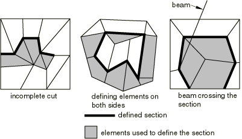
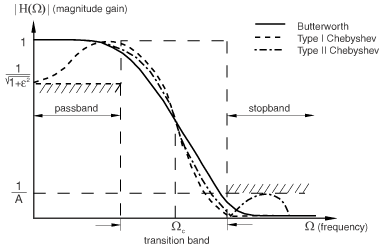

# 4.1.3 Output to the output database


**Products: **Abaqus/Standard  Abaqus/Explicit  Abaqus/CFD  Abaqus/CAE  

##### **References**

- ["Element-based surface definition," Section 2.3.2](pt01ch02s03aus17.md)
- ["Integrated output section definition," Section 2.5.1](pt01ch02s05aus23.md)
- ["Output," Section 4.1.1](pt02ch04s01aus38.md)
- ["The postprocessing calculator," Section 4.3.1](pt02ch04s03aus42.md)
- [*OUTPUT](../key/key-link.md#usb-kws-houtput)
- [*FILTER](../key/key-link.md#usb-kws-mfilter)
- [*CONTACT OUTPUT](../key/key-link.md#usb-kws-hcontactoutput)
- [*ELEMENT OUTPUT](../key/key-link.md#usb-kws-helementoutput)
- [*ENERGY OUTPUT](../key/key-link.md#usb-kws-henergyoutput)
- [*INTEGRATED OUTPUT](../key/key-link.md#usb-kws-hintegratedoutput)
- [*INCREMENTATION OUTPUT](../key/key-link.md#usb-kws-hincrementationoutput)
- [*MODAL OUTPUT](../key/key-link.md#usb-kws-hmodaloutput)
- [*NODE OUTPUT](../key/key-link.md#usb-kws-hnodeoutput)
- [*RADIATION OUTPUT](../key/key-link.md#usb-kws-hradiationoutput)
- [*SURFACE OUTPUT](../key/key-link.md#usb-kws-hsurfaceoutput)
- ["Understanding output requests," Section 14.4 of the Abaqus/CAE User's Guide](../usi/usi-link.md#usi-sim-concepts-output)

### Overview

Output variables are available for:
- element integration points, element section points, whole elements, and element sets;
- surfaces in Abaqus/Explicit and Abaqus/CFD;
- integrated output sections in Abaqus/Explicit;
- nodes; and
- the whole model.

All the output variables are defined in ["Abaqus/Standard output variable identifiers," Section 4.2.1](pt02ch04s02abv01.md), ["Abaqus/Explicit output variable identifiers," Section 4.2.2](pt02ch04s02xbv01.md), and ["Abaqus/CFD output variable identifiers," Section 4.2.3](pt02ch04s02cbv01.md).

Model information and analysis results are stored in terms of an assembly of part instances (see ["Defining an assembly," Section 2.10.1](pt01ch02s10aus28.md)).

See the [Abaqus Scripting User's Guide](../cmd/cmd-link.md#cmd) for a description of how to use the Abaqus Scripting Interface or C++ to access an output database.

### Requesting output to the output database

Three types of information are stored in the output database in Abaqus/Standard and Abaqus/Explicit: “field” output, “history” output, and diagnostic information. In Abaqus/CFD four types of information are stored in the output database: nodal field output, surface field output, element history output, and surface history output. Field output and history output are controlled by output database requests as described in this section. A subset of the diagnostic information that is written to the message file for Abaqus/Standard analyses and to the status and message files for Abaqus/Explicit analyses is included in the output database. 
- Field output is intended for infrequent requests for a large portion of the model and can be used to generate contour plots, animations, symbol plots, *X--Y* plots, and displaced shape plots in Abaqus/CAE. Only complete sets of basic variables (for example, all the stress or strain components) can be requested as field output.
- History output is intended for relatively frequent output requests for small portions of the model and is displayed in *X--Y* data plots in Abaqus/CAE. Individual variables (such as a particular stress component) can be requested.
- Diagnostic information in Abaqus/Standard and Abaqus/Explicit is intended to provide analysis warning and/or error information as well as convergence information for use in Abaqus/CAE.

Output database requests can be repeated as often as necessary within a step to produce both field and history output at multiple frequencies.

#### Requesting field output

Contact surface output, element output, nodal output, and radiation output are available as field output in Abaqus/Standard and Abaqus/Explicit. Nodal, element, and surface output are available as field output in Abaqus/CFD.

| **Input File Usage: ** | Use the first option in conjunction with one or more of the subsequent options to request field output to the output database: |
| --- | --- |
|  | ``` [*OUTPUT](../key/key-link.md#usb-kws-houtput), FIELD [*CONTACT OUTPUT](../key/key-link.md#usb-kws-hcontactoutput) [*ELEMENT OUTPUT](../key/key-link.md#usb-kws-helementoutput) [*NODE OUTPUT](../key/key-link.md#usb-kws-hnodeoutput) [*RADIATION OUTPUT](../key/key-link.md#usb-kws-hradiationoutput) [*SURFACE OUTPUT](../key/key-link.md#usb-kws-hsurfaceoutput) ``` These options are discussed in detail below. |

| **Abaqus/CAE Usage: ** | Step module: field output request editor |
| --- | --- |

#### Requesting history output

Contact surface output, element output, energy output, integrated output, time incrementation output, modal output, nodal output, and radiation output are available as history output in Abaqus/Standard and Abaqus/Explicit. Both element output and surface output are available as history output in Abaqus/CFD.

Requesting large amounts of history output (more than 1000 output requests) may cause performance to degrade in Abaqus/Standard and will cause performance to degrade in Abaqus/Explicit and Abaqus/CFD. For vector- or tensor-valued output variables each component is considered to be a single request. In the case of element variables history output will be generated at each integration point. For example, requesting history output of the tensor variable S (stress) for a C3D10M element will generate 24 history output requests: (6 components)  (4 integration points). When requesting history output of vector- and tensor-valued variables, it is recommended that individual components be selected where available.

| **Input File Usage: ** | Use the first option in conjunction with one or more of the subsequent options to request history output to the output database: |
| --- | --- |
|  | ``` [*OUTPUT](../key/key-link.md#usb-kws-houtput), HISTORY [*CONTACT OUTPUT](../key/key-link.md#usb-kws-hcontactoutput) [*ELEMENT OUTPUT](../key/key-link.md#usb-kws-helementoutput) [*ENERGY OUTPUT](../key/key-link.md#usb-kws-henergyoutput) [*INTEGRATED OUTPUT](../key/key-link.md#usb-kws-hintegratedoutput) [*INCREMENTATION OUTPUT](../key/key-link.md#usb-kws-hincrementationoutput) [*MODAL OUTPUT](../key/key-link.md#usb-kws-hmodaloutput) [*NODE OUTPUT](../key/key-link.md#usb-kws-hnodeoutput) [*RADIATION OUTPUT](../key/key-link.md#usb-kws-hradiationoutput) [*SURFACE OUTPUT](../key/key-link.md#usb-kws-hsurfaceoutput) ``` These options are discussed in detail below. |

| **Abaqus/CAE Usage: ** | Step module: history output request editor |
| --- | --- |

#### Requesting diagnostic information in Abaqus/Standard and Abaqus/Explicit

By default, a subset of the diagnostic information that is written to the message file for Abaqus/Standard analyses and to the status and message files for Abaqus/Explicit analyses is also written to the output database. You can use the Visualization module of Abaqus/CAE to view this diagnostic information interactively, highlighting problematic areas on a view of the model and using them to resolve errors and warnings in the analysis. For more information, see ["The message file in Abaqus/Standard and Abaqus/Explicit" in "Output," Section 4.1.1](pt02ch04s01aus38.md#usb-out-ooutput-message), and [Chapter 41, "Viewing diagnostic output," of the Abaqus/CAE User's Guide](../usi/usi-link.md#usv-output).

| **Input File Usage: ** | Use the following option to write diagnostic information to the output database: |
| --- | --- |
|  | ``` [*OUTPUT](../key/key-link.md#usb-kws-houtput), DIAGNOSTICS=YES ``` Use the following option to exclude diagnostic information: ``` [*OUTPUT](../key/key-link.md#usb-kws-houtput), DIAGNOSTICS=NO ``` |

| **Abaqus/CAE Usage: ** | You cannot exclude diagnostic information from the output database from within Abaqus/CAE. Use the following option to view the saved diagnostic information: |
| --- | --- |
|  | Visualization module: ****Tools****Job Diagnostics**** |

### Controlling the output frequency

The frequency of output to the output database is controlled differently in Abaqus/Standard, Abaqus/Explicit, and Abaqus/CFD. Control of the output frequency in Abaqus/Explicit depends upon whether field or history output was selected.

#### Controlling the output frequency in Abaqus/Standard

Abaqus/Standard provides several options for controlling the output frequency, depending on whether the analysis is in the time domain (e.g., general statics), frequency domain (e.g., steady state dynamics), or mode domain (e.g., natural frequency extraction). These options can be used to reduce the amount of output written and hence improve performance and disk space use as compared to the default output.

History output in Abaqus/Standard is buffered and is written to disk only after every 10 increments of history data output or when a step has completed. Therefore, history results may not be available immediately for postprocessing.

##### Default output frequency

If you do not specify the output frequency, field and history output will be written at every increment of the analysis for all procedure types except dynamic and modal dynamic analyses for which output will be written every 10 increments.

##### Controlling output frequency in a frequency domain analysis

In frequency domain procedures, you only can control the frequency of output by specifying the frequency of output in increments. The data will be written at this frequency as well as at the end of each step of the analysis. Specify an output frequency of zero to suppress output.

| **Input File Usage: ** | ``` [*OUTPUT](../key/key-link.md#usb-kws-houtput), FREQUENCY=*n* ``` |
| --- | --- |

| **Abaqus/CAE Usage: ** | Step module: field or history output request editor: **Frequency**: **Every *n* increments**: *n* |
| --- | --- |

##### Controlling output frequency in a mode domain analysis

In an eigenvalue extraction or eigenvalue buckling analysis, you can select the modes at which output is desired. If you do not specify a list of modes, output is produced for all of the modes.

| **Input File Usage: ** | ``` [*OUTPUT](../key/key-link.md#usb-kws-houtput), FIELD, MODE LIST ``` |
| --- | --- |

| **Abaqus/CAE Usage: ** | Step module: field output request editor: **Frequency**: **Specify modes**: *list of modes* |
| --- | --- |

##### Controlling output frequency in a time domain analysis

In time domain analyses, you can control the frequency of output by specifying the output frequency in terms of increments, the number of intervals during the step, the size of regular time intervals throughout the step, or time points throughout the step. The different options are described in more detail below.

Whichever option is chosen, the output will always be written at the zero-increment and last increment of the analysis and, for a low-cycle fatigue analysis, at the end of each cycle. The zero-increment output represents the initial conditions for the current analysis step and is essential for sequential thermal-stress analyses and analyses involving submodeling, for which a complete solution history (including the solution state at the beginning of the step) is needed to ensure proper interpolation in time. The zero-increment state is written at the beginning of the step, before the solution of the incremental nonlinear finite-element equations for the step commences, and is therefore in general not an equilibrium solution. Particular examples where the solution is not in equilibrium include the first step of an analysis in which an initial stress state is defined and when loads or boundary condition changes are discontinuous between steps.

Usually, the zero-increment output in any step corresponds to the base state, which is the state of the model at the end of the last general step. The exception to this is modal transient dynamic analysis, where the zero-increment output represents the linear perturbation response at time zero.

By default, when convergence difficulties are encountered in a general step, output is written for the last converged increment. To recover the requested results variables for this last converged increment, a new attempt is performed. There is no message written to the status file or the message file to show this additional attempt. In the output database (`.odb`) file you will see an extra attempt and an additional frame. If the previous increment was written to the output database and convergence difficulties are encountered during the current increment, the last converged increment is still written to the output database, which will result in a duplicate output frame at the end of the analysis.

##### Time domain analysis: specifying output frequency in increments

You can specify how frequently you want output in terms of increments. Specify an output frequency of zero to suppress output.

| **Input File Usage: ** | ``` [*OUTPUT](../key/key-link.md#usb-kws-houtput), FREQUENCY=*n* ``` |
| --- | --- |

| **Abaqus/CAE Usage: ** | Step module: field or history output request editor: **Frequency**: **Every *n* increments**: *n* |
| --- | --- |

##### Time domain analysis: specifying output frequency in number of intervals

You can specify the output frequency in number of intervals, *n*. The specified number of intervals must be a positive integer. 

By default, Abaqus/Standard adjusts the time increment  (in some cases Abaqus/Standard might violate the minimum time increment specified) to ensure that data are written at the exact times calculated by dividing the step into *n* equal intervals. Alternatively, you can specify that the data be written immediately after each time mark. In this case no adjustment of the time increment is necessary.

| **Input File Usage: ** | Use the following option to request results at the exact time intervals: |
| --- | --- |
|  | ``` [*OUTPUT](../key/key-link.md#usb-kws-houtput), NUMBER INTERVAL=*n*, TIME MARKS=YES ``` Use the following option to request results at the increments ending immediately after each time interval: ``` [*OUTPUT](../key/key-link.md#usb-kws-houtput), NUMBER INTERVAL=*n*, TIME MARKS=NO ``` |

| **Abaqus/CAE Usage: ** | Use the following option to request results at the exact time intervals: |
| --- | --- |
|  | Step module: field or history output request editor: **Frequency**: **Evenly spaced time intervals**, **Interval**: *n*, **Timing**: **Output at exact times** Use the following option to request results at the increments ending immediately after each time interval: Step module: field or history output request editor: **Frequency**: **Evenly spaced time intervals**, **Interval**: *n*, **Timing**: **Output at approximate times** |

##### Time domain analysis: specifying output frequency in regular time interval size

You can write the results at specified regular intervals throughout the step as well as at the end of the step.

By default, Abaqus/Standard will adjust the time increment  (in some cases Abaqus/Standard might violate the minimum time increment specified) to ensure that data will be written at the exact times, as defined by multiples of the time interval, *t*. Alternatively, the data can be written immediately after each time mark. In this case no adjustment of the time increment is necessary.

| **Input File Usage: ** | Use the following option to request results at the exact time intervals: |
| --- | --- |
|  | ``` [*OUTPUT](../key/key-link.md#usb-kws-houtput), TIME INTERVAL=*t* , TIME MARKS=YES ``` Use the following option to request results at the increments ending immediately after each time interval: ``` [*OUTPUT](../key/key-link.md#usb-kws-houtput), TIME INTERVAL=*t* , TIME MARKS=NO ``` |

| **Abaqus/CAE Usage: ** | Use the following option to request results at the exact time intervals: |
| --- | --- |
|  | Step module: field or history output request editor: **Frequency**: **Every *x* units of time**: *t*, **Timing**: **Output at exact times** Use the following option to request results at the increments ending immediately after each time interval: Step module: field or history output request editor: **Frequency**: **Every *x* units of time**: *t*, **Timing**: **Output at approximate times** |

##### Time domain analysis: specifying output frequency in time points

You can write the results at specified time points throughout the step.

By default, Abaqus/Standard adjusts the time increment  (in some cases Abaqus/Standard might violate the minimum time increment specified) to ensure that data are written at the exact time points specified. Alternatively, you can specify that the data be written immediately after each time point. In this case no adjustment of the time increment is necessary.

| **Input File Usage: ** | Use the following options to request results at the exact time points: |
| --- | --- |
|  | ``` [*TIME POINTS](../key/key-link.md#usb-kws-htimepoints), NAME=*time points name* [*OUTPUT](../key/key-link.md#usb-kws-houtput), TIME POINTS=*time points name*, TIME MARKS=YES ``` Use the following options to request results at the increments ending immediately after each time point: ``` [*TIME POINTS](../key/key-link.md#usb-kws-htimepoints), NAME=*time points name* [*OUTPUT](../key/key-link.md#usb-kws-houtput), TIME POINTS=*time points name*, TIME MARKS=NO ``` |

| **Abaqus/CAE Usage: ** | Use the following option to request results at the exact time points: |
| --- | --- |
|  | Step module: field or history output request editor: **From time points**, **Name**: *time points name*, **Timing**: **Output at exact times** Use the following option to request results at the increments ending immediately after each time point: Step module: field or history output request editor: **From time points**, **Name**: *time points name*, **Timing**: **Output at approximate times** |

##### Time domain analysis: time incrementation

 If the output frequency is specified at exact times and in terms of the number of intervals, in regular time intervals, or in time points, Abaqus/Standard adjusts the time increments to ensure that data are written at the exact time points. In some cases Abaqus may use a time increment smaller than the minimum time increment allowed in the step in the increment directly before a time point. However, Abaqus will not violate the minimum time increment allowed for consolidation, transient mass diffusion, transient heat transfer, transient couple thermal-electrical, transient coupled temperature-displacement, and transient coupled thermal-electrical-structural analyses. For these procedures if a time increment smaller than the minimum time increment is required, Abaqus will use the minimum time increment allowed in the step and will write output data at the first increment after the time point.  

When the output frequency is specified at exact times and in terms of the number of intervals, in regular time intervals, or in time points, the number of increments necessary to complete the analysis might increase, which might adversely affect performance.

#### Controlling the output frequency for field output in Abaqus/Explicit

Field output data are always written at the start and end of each step in which the output request is active. In addition, you can specify the output frequency in terms of the number of intervals during the step, the size of regular time intervals throughout the step, or time points throughout the step. The times at which the results are written are referred to as time marks.

##### Specifying field output frequency in number of intervals

You can specify the output frequency in number of intervals, *n*. The specified number of intervals must be a positive integer. For example, if the specified number of intervals is 10, Abaqus/Explicit will write field data 11 times: the values at the beginning of the step and at the end of 10 equal time intervals throughout the step.

By default, field data will be written at the increment ending immediately after each time mark. Alternatively, when you specify the output frequency in number of intervals, you can choose to have the time increment size adjusted so that an increment will end exactly at each of the time marks calculated by dividing the step into *n* equal intervals.

| **Input File Usage: ** | Use the following option to request results at the increments ending immediately after each time interval: |
| --- | --- |
|  | ``` [*OUTPUT](../key/key-link.md#usb-kws-houtput), FIELD, NUMBER INTERVAL=*n*, TIME MARKS=NO ``` Use the following option to request results at the exact time intervals: ``` [*OUTPUT](../key/key-link.md#usb-kws-houtput), FIELD, NUMBER INTERVAL=*n*, TIME MARKS=YES ``` |

| **Abaqus/CAE Usage: ** | Use the following option to request results at the increments ending immediately after each time interval: |
| --- | --- |
|  | Step module: field output request editor: **Frequency**: **Evenly spaced time intervals**, **Interval**: *n*, **Timing**: **Output at approximate times** Use the following option to request results at the exact time intervals: Step module: field output request editor: **Frequency**: **Evenly spaced time intervals**, **Interval**: *n*, **Timing**: **Output at exact times** |

##### Specifying field output frequency in regular time interval size

Alternatively, you can write the results at specified regular intervals throughout the step as well as at the beginning and end of the step. The time increment size will not be adjusted to meet the specified time marks; results will be written at the increment ending immediately after each time mark, as defined by multiples of the time interval, *t*.

| **Input File Usage: ** | ``` [*OUTPUT](../key/key-link.md#usb-kws-houtput), FIELD, TIME INTERVAL=*t* ``` |
| --- | --- |

| **Abaqus/CAE Usage: ** | Step module: field output request editor: **Frequency**: **Every *x* units of time**: *t* |
| --- | --- |

##### Specifying field output frequency in time points

You can write the results at specified time points throughout the step. Regular time intervals between time points are not required; you can specify any desired time points at which the field output is to be written.

| **Input File Usage: ** | Use the following option to request results at the exact time points: |
| --- | --- |
|  | ``` [*TIME POINTS](../key/key-link.md#usb-kws-htimepoints), NAME=*time points name* [*OUTPUT](../key/key-link.md#usb-kws-houtput), FIELD, TIME POINTS=*time points name*, TIME MARKS=YES ``` Use the following option to request results at the increments ending immediately after each time point: ``` [*TIME POINTS](../key/key-link.md#usb-kws-htimepoints), NAME=*time points name* [*OUTPUT](../key/key-link.md#usb-kws-houtput), FIELD, TIME POINTS=*time points name*, TIME MARKS=NO ``` |

| **Abaqus/CAE Usage: ** | Use the following option to request results at the exact time points: |
| --- | --- |
|  | Step module: field output request editor: **Frequency**: **From time points**, **Name**: *time points name*, **Timing**: **Output at exact times** Use the following option to request results at the increments ending immediately after each time point: Step module: field output request editor: **Frequency**: **From time points**, **Name**: *time points name*, **Timing**: **Output at approximate times** |

##### Default field output

If you do not specify the output frequency (in either number of intervals, time interval size, or time points), field output will be written at 20 equally spaced intervals throughout the step.

#### Controlling the output frequency for history output in Abaqus/Explicit

If history output is selected, you can specify the output frequency in terms of either increments or regular intervals throughout the step.

##### Specifying history output frequency in increments

You can specify the output frequency in increments. The data will be written at this frequency as well as at the end of each step of the analysis.

| **Input File Usage: ** | ``` [*OUTPUT](../key/key-link.md#usb-kws-houtput), HISTORY, FREQUENCY=*n* ``` |
| --- | --- |

| **Abaqus/CAE Usage: ** | Step module: history output request editor: **Frequency**: **Every *n* time increments**: *n* |
| --- | --- |

##### Specifying history output frequency in regular time interval size

Alternatively, you can write the results at specified regular intervals throughout the step as well as at the end of the step. The time increment size will not be adjusted to meet the specified time marks; results will be written at the increment ending immediately after each time mark, as defined by multiples of the time interval, *t*.

| **Input File Usage: ** | ``` [*OUTPUT](../key/key-link.md#usb-kws-houtput), HISTORY, TIME INTERVAL=*t* ``` |
| --- | --- |

| **Abaqus/CAE Usage: ** | Step module: history output request editor: **Frequency**: **Every *x* units of time**: *t* |
| --- | --- |

##### Default history output

If you do not specify the output frequency (in either increments or time interval size), history output will be written at 200 equally spaced intervals throughout the step.

#### Controlling the output frequency for field output in Abaqus/CFD

Field output data are always written at the start and end of each step in which the output request is active. In addition, you can specify the output frequency in terms of increments, the number of intervals during the step, or the size of regular time intervals throughout the step. By default, field output will be written at 20 equally spaced intervals throughout the step.

##### Specifying field output frequency in increments

You can specify the output frequency in increments. The data will be written at this frequency as well as at the beginning and end of each step of the analysis. 

| **Input File Usage: ** | ``` [*OUTPUT](../key/key-link.md#usb-kws-houtput), FIELD, FREQUENCY=*n* ``` |
| --- | --- |

| **Abaqus/CAE Usage: ** | Step module: field output request editor: **Frequency**: **Every *n* time increments**: *n* |
| --- | --- |

##### Specifying field output frequency in number of intervals

You can specify the output frequency in number of intervals, *n*. The specified number of intervals must be a positive integer. For example, if the specified number of intervals is 10, Abaqus/CFD will write field data 11 times: the values at the beginning of the step and at the end of 10 equal time intervals throughout the step.

| **Input File Usage: ** | ``` [*OUTPUT](../key/key-link.md#usb-kws-houtput), FIELD, NUMBER INTERVAL=*n* ``` |
| --- | --- |

| **Abaqus/CAE Usage: ** | Step module: field output request editor: **Frequency**: **Evenly spaced time intervals**, **Interval**: *n* |
| --- | --- |

##### Specifying field output frequency in regular time interval size

Alternatively, you can write the results at specified regular intervals throughout the step as well as at the beginning and end of the step. The time increment size will not be adjusted to meet the specified time marks; results will be written at the increment ending immediately after each time mark, as defined by multiples of the time interval, *t*.

| **Input File Usage: ** | ``` [*OUTPUT](../key/key-link.md#usb-kws-houtput), FIELD, TIME INTERVAL=*t* ``` |
| --- | --- |

| **Abaqus/CAE Usage: ** | Step module: field output request editor: **Frequency**: **Every *x* units of time**: *t* |
| --- | --- |

#### Controlling the output frequency for history output in Abaqus/CFD

You can specify the output frequency in terms of increments, the number of intervals during the step, or regular intervals throughout the step. By default, no history output is automatically written to the output database.

##### Specifying history output frequency in increments

You can specify the output frequency in increments. The data will be written at this frequency as well as at the beginning and end of each step of the analysis.

| **Input File Usage: ** | ``` [*OUTPUT](../key/key-link.md#usb-kws-houtput), HISTORY, FREQUENCY=*n* ``` |
| --- | --- |

| **Abaqus/CAE Usage: ** | Step module: history output request editor: **Frequency**: **Every *n* time increments**: *n* |
| --- | --- |

##### Specifying history output frequency in number of intervals

You can specify the output frequency in number of intervals, *n*. The specified number of intervals must be a positive integer. For example, if the specified number of intervals is 10, Abaqus/CFD will write history data 11 times: the values at the beginning of the step and at the end of 10 equal time intervals throughout the step.

| **Input File Usage: ** | ``` [*OUTPUT](../key/key-link.md#usb-kws-houtput), HISTORY, NUMBER INTERVAL=*n* ``` |
| --- | --- |

| **Abaqus/CAE Usage: ** | Step module: history output request editor: **Frequency**: **Evenly spaced time intervals**, **Interval**: *n* |
| --- | --- |

##### Specifying history output frequency in regular time interval size

Alternatively, you can write the results at specified regular intervals throughout the step as well as at the end of the step. The time increment size will not be adjusted to meet the specified time marks; results will be written at the increment ending immediately after each time mark, as defined by multiples of the time interval, *t*.

| **Input File Usage: ** | ``` [*OUTPUT](../key/key-link.md#usb-kws-houtput), HISTORY, TIME INTERVAL=*n* ``` |
| --- | --- |

| **Abaqus/CAE Usage: ** | Step module: history output request editor: **Frequency**: **Every *x* units of time**: *t* |
| --- | --- |

### Requesting output in multiple steps

Output requests apply to the step in which they are defined and to all subsequent steps until they are respecified.

The only exception occurs when the step type changes from general to linear perturbation (available only in Abaqus/Standard). Output requests defined in general steps apply only to subsequent general steps; output requests defined in linear perturbation steps apply only to subsequent consecutive linear perturbation steps. In other words, output defined in a general step is independent of output defined in a linear perturbation step. Propagation between linear perturbation steps occurs only for consecutive linear perturbation steps. If a general analysis step occurs between perturbation steps, output defined in the first perturbation step will not propagate to the next perturbation step.

In any given step you can add or selectively replace the output requests that are continued from previous steps. Alternatively, you can discontinue all requests from previous steps and request a completely new set of output. The preselected field variables and preselected history output variables (see ["Preselected output requests](pt02ch04s01aus40.md#usb-out-odboutput-preselect)” below) are requested by default for the first step of an analysis; you can modify this request as in any other step.

#### Specifying new output requests

By default, all output requests defined in previous steps are removed when new requests are defined, regardless of the type of output request being defined. In other words, a new field output request in a step removes all field and history output requests defined in previous steps.

Because all existing output requests are removed when a new request is defined in a step, all output requests within the same step are treated as new (i.e., additional output requests or replacement output requests are treated as equivalent to new output requests).

| **Input File Usage: ** | Use one of the following options to remove all existing output requests and to specify new requests: |
| --- | --- |
|  | ``` [*OUTPUT](../key/key-link.md#usb-kws-houtput), FIELD, OP=NEW [*OUTPUT](../key/key-link.md#usb-kws-houtput), HISTORY, OP=NEW ``` |

| **Abaqus/CAE Usage: ** | Step module: **Create Field Output Request** or **Create History Output Request** |
| --- | --- |
|  | Abaqus/CAE automatically respecifies all previously defined output requests when you create a new request. |

#### Specifying additional output requests

Alternatively, you can specify additional output requests without removing all default and previously defined output requests.

| **Input File Usage: ** | Use one of the following options to specify additional output requests without removing all default and previously defined output requests: |
| --- | --- |
|  | ``` [*OUTPUT](../key/key-link.md#usb-kws-houtput), FIELD, OP=ADD [*OUTPUT](../key/key-link.md#usb-kws-houtput), HISTORY, OP=ADD ``` |

| **Abaqus/CAE Usage: ** | Step module: **Create Field Output Request** or **Create History Output Request** |
| --- | --- |
|  | Abaqus/CAE automatically respecifies all previously defined output requests when you create a new request. |

#### Replacing or removing an output request

You can replace an output request of the same type (e.g., field or history) and frequency with a new request. No other previously defined requests will be affected.

You cannot replace an output request to change its frequency. If no matching request is found, the request specified is simply added to the step.

To remove a previously defined request, you can replace the output request without specifying any new output variables.

| **Input File Usage: ** | Use one of the following options to replace an output request with a new request: |
| --- | --- |
|  | ``` [*OUTPUT](../key/key-link.md#usb-kws-houtput), FIELD, OP=REPLACE [*OUTPUT](../key/key-link.md#usb-kws-houtput), HISTORY, OP=REPLACE ``` |

| **Abaqus/CAE Usage: ** | Step module: **Field Output Requests Manager** or **History Output Requests Manager**: **Edit** or **Delete** |
| --- | --- |

#### Suppressing output requests defined in previous steps

To suppress completely all output requests that have been defined in previous steps, you can specify an output frequency of 0.

### Preselected output requests

There are two ways to define output variable requests quickly and easily. Both methods are available for field and history output requests and for the individual output requests used for requesting specific variable types (e.g., nodal, element). There are no preselected output variables for surface output requests in Abaqus/CFD. The use of these methods with individual output requests for specific variable types is explained in detail later in this section.

#### Requesting procedure-specific preselected output requests

You can activate a procedure-specific set of commonly requested output variables. See [Table 4.1.3--1](pt02ch04s01aus40.md#table-odboutput-defaults) for a list of procedure types and their accompanying preselected variables. The variables written to the output database may change if the procedure type changes between steps.

If you request preselected field or history output and request additional output variables using individual output requests for specific variable types, the variables requested will be appended to the variables contained in the preselected list.

For geometrically nonlinear analysis in Abaqus/Standard, E is not available for output and LE is output by default. For linear perturbation analyses and geometrically linear analyses in Abaqus/Standard, LE and NE strain output requests yield the same output as E. For geometrically linear analysis in Abaqus/Explicit, LE is output.

Abaqus may omit some preselected variables from the analysis results. Abaqus omits preselected output variables if they are not applicable for the element type used to mesh the model or if other factors make the variables unsuitable for the analysis. No preselected variables are available for surface output in an Abaqus/CFD analysis.

| **Input File Usage: ** | Use one of the following options: |
| --- | --- |
|  | ``` [*OUTPUT](../key/key-link.md#usb-kws-houtput), FIELD, VARIABLE=PRESELECT [*OUTPUT](../key/key-link.md#usb-kws-houtput), HISTORY, VARIABLE=PRESELECT ``` |

| **Abaqus/CAE Usage: ** | Step module: field or history output request editor: **Preselected defaults** |
| --- | --- |

**Table 4.1.3–1** List of preselected variables for various procedure types.
| Procedure type | Preselected element variables (field; history for Abaqus/CFD) | Preselected nodal and surface variables (field) | Preselected energy variables (history) |
| --- | --- | --- | --- |
| Annealing | none | none | none |
| Complex frequency extraction | none | U | none |
| Coupled pore fluid diffusion/stress | S, E, VOIDR, SAT, POR | U, RF, CF, PFL, PFLA, PTL, PTLA, TPFL, TPTL | ALLAE, ALLCCDW, ALLCCE, ALLCCEN, ALLCCET, ALLCCSD, ALLCCSDN, ALLCCSDT, ALLCD, ALLFD, ALLIE, ALLKE, ALLPD, ALLSE, ALLVD, ALLDMD, ALLWK, ALLKL, ALLQB, ALLEE, ALLJD, ALLSD, ETOTAL |
| Coupled thermal-electric | HFL, EPG | NT, RFL, EPOT | ALLAE, ALLCCDW, ALLCCE, ALLCCEN, ALLCCET, ALLCCSD, ALLCCSDN, ALLCCSDT, ALLCD, ALLFD, ALLIE, ALLKE, ALLPD, ALLSE, ALLVD, ALLDMD, ALLWK, ALLKL, ALLQB, ALLEE, ALLJD, ALLSD, ETOTAL |
| Direct cyclic | S, E, PE, PEEQ, PEMAG | U, RF, CF | ALLAE, ALLCCDW, ALLCCE, ALLCCEN, ALLCCET, ALLCCSD, ALLCCSDN, ALLCCSDT, ALLCD, ALLFD, ALLIE, ALLKE, ALLPD, ALLSE, ALLVD, ALLDMD, ALLWK, ALLKL, ALLQB, ALLEE, ALLJD, ALLSD, ETOTAL |
| Direct-integration implicit dynamic (with an output frequency of 10) | S, E, PE, PEEQ, PEMAG | U, V, A, RF, CF, CSTRESS, CDISP | ALLAE, ALLCCDW, ALLCCE, ALLCCEN, ALLCCET, ALLCCSD, ALLCCSDN, ALLCCSDT, ALLCD, ALLFD, ALLIE, ALLKE, ALLPD, ALLSE, ALLVD, ALLDMD, ALLWK, ALLKL, ALLQB, ALLEE, ALLJD, ALLSD, ETOTAL |
| Direct-solution steady-state dynamic | S, E | U, V, A, RF, CF | ALLKE, ALLSE, ALLVD, ALLWK |
| Eigenfrequency extraction | none | U | none |
| Eigenvalue buckling prediction | none | U | none |
| Explicit dynamic | S, LE, PE, PEEQ, EVF, SVAVG, PEVAVG, PEEQVAVG | U, V, A, RF, CSTRESS | ALLKE, ALLSE, ALLWK, ALLPD, ALLCD, ALLVD, ALLDMD, ALLAE, ALLIE, ALLFD, ETOTAL |
| Fully coupled thermal-electrical-structural in Abaqus/Standard | S, E, PE, PEEQ, PEMAG, HFL, EPG | U, RF, CF, NT, RFL, CSTRESS, CDISP, EPOT | ALLAE, ALLCCDW, ALLCCE, ALLCCEN, ALLCCET, ALLCCSD, ALLCCSDN, ALLCCSDT, ALLCD, ALLFD, ALLIE, ALLKE, ALLPD, ALLSE, ALLVD, ALLDMD, ALLWK, ALLKL, ALLQB, ALLEE, ALLJD, ALLSD, ETOTAL |
| Fully coupled thermal-stress in Abaqus/Standard | S, E, PE, PEEQ, PEMAG, HFL | U, RF, CF, NT, RFL, CSTRESS, CDISP | ALLAE, ALLCCDW, ALLCCE, ALLCCEN, ALLCCET, ALLCCSD, ALLCCSDN, ALLCCSDT, ALLCD, ALLFD, ALLIE, ALLKE, ALLPD, ALLSE, ALLVD, ALLDMD, ALLWK, ALLKL, ALLQB, ALLEE, ALLJD, ALLSD, ETOTAL |
| Fully coupled thermal-stress in Abaqus/Explicit | S, LE, PE, PEEQ, HFL | U, V, A, RF, CSTRESS, NT, RFL | ALLKE, ALLSE, ALLWK, ALLPD, ALLCD, ALLVD, ALLDMD, ALLAE, ALLIE, ALLFD, ALLIHE, ALLHF, ETOTAL |
| Geostatic stress field | S, E, POR, SAT, VOIDR | U, RF, CF, CSTRESS, CDISP | ALLAE, ALLCCDW, ALLCCE, ALLCCEN, ALLCCET, ALLCCSD, ALLCCSDN, ALLCCSDT, ALLCD, ALLFD, ALLIE, ALLKE, ALLPD, ALLSE, ALLVD, ALLDMD, ALLWK, ALLKL, ALLQB, ALLEE, ALLJD, ALLSD, ETOTAL |
| Heat transfer | HFL | NT, RFL | none |
| Incompressible fluid dynamics in Abaqus/CFD | V, PRESSURE, TEMP, TURBNU | U, V, PRESSURE, TEMP, TURBNU | none |
| Linear static perturbation | S, E | U, RF, CF | ALLAE, ALLCCDW, ALLCCE, ALLCCEN, ALLCCET, ALLCCSD, ALLCCSDN, ALLCCSDT, ALLCD, ALLFD, ALLIE, ALLKE, ALLPD, ALLSE, ALLVD, ALLDMD, ALLWK, ALLKL, ALLQB, ALLEE, ALLJD, ALLSD, ETOTAL |
| Mass diffusion | CONC, MFL | NNC, RFL | none |
| Modal dynamic (with an output frequency of 10) | S, E | U, V, A, RF, CF | ALLAE, ALLCD, ALLFD, ALLIE, ALLKE, ALLPD, ALLSE, ALLVD, ALLDMD, ALLWK, ALLKL, ALLQB, ALLEE, ALLJD, ALLSD, ETOTAL |
| SIM-based modal dynamic | none | none | none |
| Quasi-static | S, E, PE, PEEQ, PEMAG, CE, CEEQ, CEMAG | U, RF, CF, CSTRESS, CDISP | ALLAE, ALLCCDW, ALLCCE, ALLCCEN, ALLCCET, ALLCCSD, ALLCCSDN, ALLCCSDT, ALLCD, ALLFD, ALLIE, ALLKE, ALLPD, ALLSE, ALLVD, ALLDMD, ALLWK, ALLKL, ALLQB, ALLEE, ALLJD, ALLSD, ETOTAL |
| Random response | S, E | U, V, A | none |
| Response spectrum | S, E | U, RF, CF | ALLKE, ALLSE, ALLWK |
| Static | S, E, PE, PEEQ, PEMAG | U, RF, CF, CSTRESS, CDISP | ALLAE, ALLCCDW, ALLCCE, ALLCCEN, ALLCCET, ALLCCSD, ALLCCSDN, ALLCCSDT, ALLCD, ALLFD, ALLIE, ALLKE, ALLPD, ALLSE, ALLVD, ALLDMD, ALLWK, ALLKL, ALLQB, ALLEE, ALLJD, ALLSD, ETOTAL |
| Steady-state dynamic | S, E | U, V, A, RF, CF | ALLKE, ALLSE, ALLWK |
| SIM-based steady-state dynamic | none | none | none |
| Steady-state transport | S, E | U, RF, CF, CSTRESS, CDISP | ALLAE, ALLCCDW, ALLCCE, ALLCCEN, ALLCCET, ALLCCSD, ALLCCSDN, ALLCCSDT, ALLCD, ALLFD, ALLIE, ALLKE, ALLPD, ALLSE, ALLVD, ALLDMD, ALLWK, ALLKL, ALLQB, ALLEE, ALLJD, ALLSD, ETOTAL |
| Subspace-based steady-state dynamic | S, E | U, V, A, RF, CF | ALLKE, ALLSE, ALLVD, ALLWK |

#### Requesting all variables applicable to the current procedure and material type in Abaqus/Standard and Abaqus/Explicit

You can request all variables applicable to the current procedure and material type. Any individual output requests for specific variable types are ignored in this case.

| **Input File Usage: ** | Use one of the following options: |
| --- | --- |
|  | ``` [*OUTPUT](../key/key-link.md#usb-kws-houtput), FIELD, VARIABLE=ALL [*OUTPUT](../key/key-link.md#usb-kws-houtput), HISTORY, VARIABLE=ALL ``` |

| **Abaqus/CAE Usage: ** | Step module: field or history output request editor: **All** |
| --- | --- |

### Default output

In Abaqus/Standard and Abaqus/Explicit, if no output database requests are specified, the preselected field and history output variables are written automatically to the output database. In Abaqus/Standard the default variables are written at every increment for both field and history output for all procedure types except dynamic and modal dynamic analyses; the default frequency for field and history output for these procedure types is every 10 increments. In Abaqus/Explicit the default variables are written at 20 intervals for field output and 200 intervals for history output. In Abaqus/CFD the default variables are written at 20 intervals for field output.

You can turn these defaults off for an analysis in Abaqus/Standard and Abaqus/Explicit by using the **odb_output_by_default** environment file parameter; see ["Using the Abaqus environment settings," Section 3.3.1](pt01ch03s03aus30.md), for details. Furthermore, specifying new output database requests in a step (see ["Specifying new output requests](pt02ch04s01aus40.md#usb-out-odboutput-new)”) overrides the default field and history output requests for that step. For large models the default output to the output database may increase the solution time and required disk space considerably. In such cases you are encouraged to review carefully the relevance of the default output variables for the proposed analysis. A C++ program is available that creates a smaller copy of a large output database by copying data from only selected frames; for more information, see ["Decreasing the amount of data in an output database by retaining data at specific frames," Section 10.15.4 of the Abaqus Scripting User's Guide](../cmd/cmd-link.md#cmd-odb-intro-exa-odbfilter-cpp).

The **odb_output_by_default** environment file parameter is ignored in a restart analysis. If no output requests are defined in a restart analysis, the output requests are those that propagate from the original analysis.

#### Abaqus/Explicit output as a result of analysis termination

When an Abaqus/Explicit analysis encounters a fatal error in an increment, the preselected variables applicable to the current procedure are written automatically to the output database as field data. The analysis will go through an additional increment with a zero time increment size before writing these data.

### Element output

You can request that element variables (stresses, strains, section forces, element energies, etc.) be written to the output database. The output request can be repeated as often as necessary to define output for different types of element variables, different element sets, etc. The same element (or element set) can appear in several output requests. Element output to the output database is not supported for user elements.

#### Selecting the element output variables

The following types of element variables are recognized for the purpose of defining output:
- "Element integration point" variables are associated with the integration points at which material calculations are performed (for example, components of stress and strain).
- "Element section point" variables are associated with the cross-section of a beam, pipe, or a shell (for example, bending moments and membrane forces on the section); these variables are not available in Abaqus/CFD.
- "Element face" variables are associated with the faces of a shell or a solid (for example, uniformly distributed pressure load on the face).
- "Whole element" variables are attributes of an entire element (for example, the total energy content of the element).
- "Whole element set" variables are attributes of an entire element set (for example, the current coordinates of the center of mass); these variables are available in Abaqus/Standard and Abaqus/Explicit.

The element variables that can be written to the output database are defined in ["Abaqus/Standard output variable identifiers," Section 4.2.1](pt02ch04s02abv01.md), ["Abaqus/Explicit output variable identifiers," Section 4.2.2](pt02ch04s02xbv01.md), and ["Abaqus/CFD output variable identifiers," Section 4.2.3](pt02ch04s02cbv01.md).

| **Input File Usage: ** | ``` [*ELEMENT OUTPUT](../key/key-link.md#usb-kws-helementoutput) *list of output variables* ``` |
| --- | --- |

| **Abaqus/CAE Usage: ** | Step module: field or history output request editor: **Select from list below** |
| --- | --- |

#### Selecting elements for which output is required

For history output you must specify the element set (or, in Abaqus/Explicit, the tracer set) for which output is being requested. For field output specifying the element set or tracer set is optional; if you do not specify an element set or tracer set, the output will be written for all the elements in the model.

| **Input File Usage: ** | ``` [*ELEMENT OUTPUT](../key/key-link.md#usb-kws-helementoutput), ELSET=*element_set_name* ``` |
| --- | --- |

| **Abaqus/CAE Usage: ** | Step module: field or history output request editor: **Domain: Set:** *set_name* |
| --- | --- |

##### Requesting field output for the exterior elements in the model in Abaqus/Standard and Abaqus/Explicit

You can select output on the element set consisting of all the exterior three-dimensional elements in the model. This element set is generated internally by Abaqus.

| **Input File Usage: ** | ``` [*ELEMENT OUTPUT](../key/key-link.md#usb-kws-helementoutput), EXTERIOR ``` |
| --- | --- |

| **Abaqus/CAE Usage: ** | Step module: field output request editor: **Domain**: **Whole model**; toggle on **Exterior only** |
| --- | --- |

##### Specifying the section point in beam, pipe, shell, and layered solid elements in Abaqus/Standard and Abaqus/Explicit

For beams, pipes, shells, or layered solids output is provided at the default section points. You can specify nondefault output points.

| **Input File Usage: ** | ``` [*ELEMENT OUTPUT](../key/key-link.md#usb-kws-helementoutput) *list of output points* *list of output variables* ``` |
| --- | --- |

| **Abaqus/CAE Usage: ** | Step module: field or history output request editor: **Output at shell, beam, and layered section points: Specify:** *list of output points* |
| --- | --- |

##### Requesting output for rebars in a reinforced model in Abaqus/Standard and Abaqus/Explicit

You can request output for rebars (["Defining reinforcement," Section 2.2.3](pt01ch02s02aus13.md)). If you do not explicitly request rebar output in a model with rebars, the element output requests govern the output for the matrix material only (except for section forces, where the forces in the rebar are included in the force calculation). You can request output for a particular rebar. If you do not specify the name of a rebar, output will be given for all rebars in the specified element set (or in the whole model, if you have not specified an element set).

Rebar output is available only in membrane, shell, or surface elements at the integration points and at the centroid of the element.

| **Input File Usage: ** | Use the following options: |
| --- | --- |
|  | ``` [*OUTPUT](../key/key-link.md#usb-kws-houtput), FIELD [*ELEMENT OUTPUT](../key/key-link.md#usb-kws-helementoutput), REBAR=*rebar_name*, ELSET=*element_set_name* [*OUTPUT](../key/key-link.md#usb-kws-houtput), HISTORY [*ELEMENT OUTPUT](../key/key-link.md#usb-kws-helementoutput), REBAR=*rebar_name*, ELSET=*element_set_name* ``` |

| **Abaqus/CAE Usage: ** | Use the following option to request output for rebar in addition to output for the matrix material: |
| --- | --- |
|  | Step module: field or history output request editor: **Output for rebar: Include** Use the following option to request output only for rebar: Step module: field or history output request editor: **Output for rebar: Only** You cannot request output for a particular rebar in Abaqus/CAE; if you request rebar output, it is given for all rebars in the specified output domain. |

#### Selecting the position of element integration point and section point output

Integration point variables and section variables in Abaqus/Standard and Abaqus/Explicit can be written as field output to the output database in three different positions: the integration points, the centroid, or the nodes. By default, output is provided at the integration points. 

In most cases Abaqus writes only integration point data to the output database. Transferring of results from the integration points to the user-specified position in Abaqus/Standard and Abaqus/Explicit is done by the postprocessing calculator. See ["The postprocessing calculator," Section 4.3.1](pt02ch04s03aus42.md), for details. 

In Abaqus/Standard an alternative procedure is available for three commonly requested output variables: stress components, Mises equivalent stress, and equivalent pressure stress. To activate this alternate procedure for Mises equivalent stress and equivalent pressure stress, output variables MISESONLY and PRESSONLY, respectively, must be requested. If output variables, MISES and PRESS, are used instead, the old procedure is invoked. If output at the nodes or at the centroid is requested for any of these variables, the interpolation and extrapolation are performed during the analysis as soon as stresses are available at the integration points. This eliminates the need to store stress components at the integration points and reduces the size of the output database. This procedure is invoked automatically when output is requested for any of the supported variables. 

Element history output to the output database is always provided at the integration points.

##### Obtaining output at the integration points in Abaqus/Standard and Abaqus/Explicit

By default, the variables are output at the integration points where they are calculated. In Abaqus/Standard you can obtain the position of the integration points by using output variable COORD (see ["Abaqus/Standard output variable identifiers," Section 4.2.1](pt02ch04s02abv01.md)).

| **Input File Usage: ** | ``` [*ELEMENT OUTPUT](../key/key-link.md#usb-kws-helementoutput), POSITION=INTEGRATION POINTS ``` |
| --- | --- |

| **Abaqus/CAE Usage: ** | You cannot select the position of element output in Abaqus/CAE; it is always given at the integration points. |
| --- | --- |

##### Obtaining output at the centroid of each element in Abaqus/Standard and Abaqus/Explicit

You can choose to output the variables at the centroid of each element (the midpoint between the end nodes of a beam or a pipe element). Centroidal values are obtained through the postprocessing calculator by interpolation of the integration point values if the integration scheme for the element does not include a centroidal integration point. Element output of the element centroidal values is not available for recovering results within substructures; for more information, see ["Using substructures," Section 10.1.1](pt04ch10s01aus58.md).

| **Input File Usage: ** | ``` [*ELEMENT OUTPUT](../key/key-link.md#usb-kws-helementoutput), POSITION=CENTROIDAL ``` |
| --- | --- |

| **Abaqus/CAE Usage: ** | You cannot select the position of element output in Abaqus/CAE; it is always given at the integration points. |
| --- | --- |

##### Obtaining element output extrapolated to the nodes in Abaqus/Standard and Abaqus/Explicit

You can choose to extrapolate the element integration point variables to the nodes of each element independently, without averaging the results from adjoining elements. Element output at the element nodes is not available for recovering results within substructures; for more information, see ["Using substructures," Section 10.1.1](pt04ch10s01aus58.md).

| **Input File Usage: ** | ``` [*ELEMENT OUTPUT](../key/key-link.md#usb-kws-helementoutput), POSITION=NODES ``` |
| --- | --- |

| **Abaqus/CAE Usage: ** | You cannot select the position of element output in Abaqus/CAE; it is always given at the integration points. |
| --- | --- |

##### Extrapolation and interpolation of element output variables in Abaqus/Standard and Abaqus/Explicit

The shape functions of the element are used by the postprocessing calculator for purposes of extrapolation and interpolation of output variables. Extrapolated values are generally not as accurate as the values calculated at the integration points in the areas of high stress gradients, particularly in the case of modified triangles and tetrahedra. Therefore, adequately detailed meshing is necessary around nodes where accurate nodal values of such element results are needed. If a cylindrical or spherical coordinate system is defined for the element (see ["Orientations," Section 2.2.5](pt01ch02s02aus15.md)), the orientation at each integration point may be different. When the values at the integration points are extrapolated to the nodes, the difference in the orientation is not taken into account; therefore, if the orientation varies significantly over the elements connected to a node, the extrapolated values are not very accurate. If the material orientation undergoes significant spatial variation in a region of the model where the material behavior is truly anisotropic, a finer mesh is required to obtain accurate results even at the integration points. In that situation once the overall solution has converged with respect to the mesh density, the interpolation or extrapolation away from the integration points can also be assumed to be reasonably accurate. You should also be particularly careful when interpreting output variables extrapolated to the nodes for second-order elements with midside nodes outside the quarter-point region, such as when one edge is collapsed in two dimensions or one face is collapsed in three dimensions.

For derived variables, such as Mises equivalent stress, the components are first extrapolated or interpolated. The derived value is then calculated from the extrapolated or interpolated components. However, in linear mode-based dynamic analysis procedures where derived values are obtained as nonlinear combinations of modal response magnitudes (["Random response analysis," Section 6.3.11](pt03ch06s03at16.md), and ["Response spectrum analysis," Section 6.3.10](pt03ch06s03at15.md)), the nonlinear combinations are first calculated at the integration points. These derived values are then extrapolated to the nodes or interpolated to the centroid.

#### Controlling the output frequency

The frequency of element output is controlled as described above in ["Controlling the output frequency](pt02ch04s01aus40.md#usb-out-odboutput-frequency).”

#### Requesting preselected output

You can request the preselected, procedure-specific element output variables described in [Table 4.1.3--1](pt02ch04s01aus40.md#table-odboutput-defaults). In this case you can specify additional variables as part of the output request.

Alternatively, you can request all element variables applicable to the current procedure and material type. In this case any additional variables you specify are ignored.

| **Input File Usage: ** | Use the following option to request the preselected element output variables: |
| --- | --- |
|  | ``` [*ELEMENT OUTPUT](../key/key-link.md#usb-kws-helementoutput), VARIABLE=PRESELECT ``` Use the following option to request all applicable element output variables: ``` [*ELEMENT OUTPUT](../key/key-link.md#usb-kws-helementoutput), VARIABLE=ALL ``` |

| **Abaqus/CAE Usage: ** | Step module: field or history output request editor: **Preselected defaults** or **All** |
| --- | --- |

#### Specifying the directions for element output in Abaqus/Standard and Abaqus/Explicit

For components of stress, strain, and similar material variables 1, 2, and 3 refer to the directions for an orthogonal coordinate system. If a local orientation is not defined for the element, the stress/strain components are in the default directions defined by the convention given in ["Orientations," Section 2.2.5](pt01ch02s02aus15.md): global directions for solid elements, surface directions for shell and membrane elements, and axial and transverse directions for beam and pipe elements.

By default, the element material directions for element field output are written to the output database. If a local orientation is associated with the element, by default the results displayed in Abaqus/CAE are in the directions defined by the local orientation. These directions can be visualized in Abaqus/CAE by selecting ****Plot****Material Orientations**** in the Visualization module. You can choose to suppress the direction output to the output database.

| **Input File Usage: ** | Use the following option to indicate that the element material directions should not be written to the output database: |
| --- | --- |
|  | ``` [*ELEMENT OUTPUT](../key/key-link.md#usb-kws-helementoutput), DIRECTIONS=NO ``` |

| **Abaqus/CAE Usage: ** | Step module: field output request editor: toggle off **Include local coordinate directions when available** |
| --- | --- |

### Node output

You can output nodal variables (displacements, reaction forces, etc.) to the output database. The output request can be repeated as often as necessary to define output for different node sets. The same node (or node set) can appear in several output requests.

#### Selecting the nodal output variables

The nodal variables that can be written to the output database are defined in the “Nodal variables” section of ["Abaqus/Standard output variable identifiers," Section 4.2.1](pt02ch04s02abv01.md), ["Abaqus/Explicit output variable identifiers," Section 4.2.2](pt02ch04s02xbv01.md), and ["Abaqus/CFD output variable identifiers," Section 4.2.3](pt02ch04s02cbv01.md).

| **Input File Usage: ** | ``` [*NODE OUTPUT](../key/key-link.md#usb-kws-hnodeoutput) *list of output variables* ``` |
| --- | --- |

| **Abaqus/CAE Usage: ** | Step module: field or history output request editor: **Select from list below** |
| --- | --- |

#### Selecting the nodes for which output is required

For history output you must specify the node set (or, in Abaqus/Explicit, the tracer set) for which output is being requested. For field output the specification of the node set or tracer set is optional; if you do not specify a node set or tracer set, the output will be written for all the nodes in the model.

| **Input File Usage: ** | ``` [*NODE OUTPUT](../key/key-link.md#usb-kws-hnodeoutput), NSET=*node_set_name* ``` |
| --- | --- |

| **Abaqus/CAE Usage: ** | Step module: field or history output request editor: **Domain: Set:** *set_name* |
| --- | --- |

##### Requesting field output for the exterior nodes in the model in Abaqus/Standard and Abaqus/Explicit

You can select output on the node set consisting of all the exterior nodes in the model. This node set is generated internally by Abaqus and includes all the nodes that belong to the exterior three-dimensional elements.

| **Input File Usage: ** | ``` [*NODE OUTPUT](../key/key-link.md#usb-kws-hnodeoutput), EXTERIOR ``` |
| --- | --- |

| **Abaqus/CAE Usage: ** | Step module: field output request editor: **Domain**: **Whole model**; toggle on **Exterior only** |
| --- | --- |

#### Controlling the output frequency

The frequency of nodal output is controlled as described above in ["Controlling the output frequency](pt02ch04s01aus40.md#usb-out-odboutput-frequency).”

#### Controlling the precision in Abaqus/Standard and Abaqus/Explicit

You can control the precision of nodal output for an analysis.

| **Input File Usage: ** | Use the following command line option to request single-precision nodal output: |
| --- | --- |
|  | **abaqus** **job**=*job-name* **output_precision**=`single` Use the following command line option to request double-precision nodal output: **abaqus** **job**=*job-name* **output_precision**=`full` |

| **Abaqus/CAE Usage: ** | Job module: job editor: **Precision**: **Nodal output precision: Single** or **Full** |
| --- | --- |

#### Requesting preselected output

You can request the preselected, procedure-specific nodal output variables described in [Table 4.1.3--1](pt02ch04s01aus40.md#table-odboutput-defaults). In this case you can specify additional variables as part of the output request.

Alternatively, you can request all nodal variables applicable to the current procedure type. In this case any additional variables you specify are ignored.

| **Input File Usage: ** | Use the following option to request the preselected nodal output variables: |
| --- | --- |
|  | ``` [*NODE OUTPUT](../key/key-link.md#usb-kws-hnodeoutput), VARIABLE=PRESELECT ``` Use the following option to request all applicable nodal output variables: ``` [*NODE OUTPUT](../key/key-link.md#usb-kws-hnodeoutput), VARIABLE=ALL ``` |

| **Abaqus/CAE Usage: ** | Step module: field or history output request editor: **Preselected defaults** or **All** |
| --- | --- |

#### Specifying the directions for nodal field output in Abaqus/Standard and Abaqus/Explicit

For nodal variables 1, 2, and 3 refer to the global directions *X*, *Y*, and *Z*, respectively. For axisymmetric elements 1 and 2 refer to the global directions *r* and *z*. Nodal field results are written to the output database in the global directions. If a local coordinate system is defined at a node (see ["Transformed coordinate systems," Section 2.1.5](pt01ch02s01aus09.md)), the local nodal transformations are written to the output database as well. You can apply these transformations to the results in the Visualization module of Abaqus/CAE to view components in the local systems.

#### Specifying the directions for nodal history output in Abaqus/Standard and Abaqus/Explicit

For nodal variables 1, 2, and 3 refer to the global directions *X*, *Y*, and *Z*, respectively. For axisymmetric elements 1 and 2 refer to the global directions *r* and *z*. Nodal history results are written to the output database in the global directions unless a local coordinate system has been defined at a node (see ["Transformed coordinate systems," Section 2.1.5](pt01ch02s01aus09.md)). In this case you can specify whether output is desired in global or local directions. 

##### Obtaining nodal history output in the global directions

You can request vector-valued nodal variables in the global directions, which is the default for nodal history output requests to the output database since most postprocessors assume that components are given in the global system.

| **Input File Usage: ** | ``` [*NODE OUTPUT](../key/key-link.md#usb-kws-hnodeoutput), GLOBAL=YES ``` |
| --- | --- |

| **Abaqus/CAE Usage: ** | Step module: history output request editor: **Domain**: **Set**: toggle on **Use global directions for vector-valued output** |
| --- | --- |

##### Obtaining nodal history output in the local directions defined by nodal transformations

You can request vector-valued nodal variables in the local directions defined by nodal transformations.

| **Input File Usage: ** | ``` [*NODE OUTPUT](../key/key-link.md#usb-kws-hnodeoutput), GLOBAL=NO ``` |
| --- | --- |

| **Abaqus/CAE Usage: ** | Step module: history output request editor: **Domain**: **Set**: toggle off **Use global directions for vector-valued output** |
| --- | --- |

#### Visualizing boundary conditions

Boundary conditions can be visualized in the Visualization module of Abaqus/CAE by selecting ****View****ODB Display Options****. Click the **Entity Display** tab in the dialog box that appears.

In an Abaqus/Standard analysis boundary condition information is written to the output database only when some nodal output variables are requested as field output.

### Tracer particle output from Abaqus/Explicit

In Abaqus/Explicit tracer particles can be used to obtain output at specific material points that may not correspond to a fixed location in the mesh if adaptive meshing is used. Tracer particles follow the material motion throughout an analysis regardless of the mesh motion, which makes them ideal for use with adaptive meshing (see ["Defining ALE adaptive mesh domains in Abaqus/Explicit," Section 12.2.2](pt04ch12s02aus78.md)). Both nodal and element output can be obtained at tracer particles.

#### Defining tracer particles

You define the initial location of each tracer particle to be coincident with a node, called the “parent node.” These parent nodes are grouped into a tracer set; you must assign a name to the tracer set when you define the tracer particles.

| **Input File Usage: ** | ``` [*TRACER PARTICLE](../key/key-link.md#usb-kws-htracerparticle), TRACER SET=*tracer_set_name* *list of parent nodes (either node numbers or node set labels)* ``` |
| --- | --- |

| **Abaqus/CAE Usage: ** | Tracer particles are not supported in Abaqus/CAE. |
| --- | --- |

#### Particle birth stages

Sets of tracer particles can be released from the current locations of the parent nodes at multiple times during a step. Each release of tracer particles is referred to as a “particle birth.” After particle birth the tracer particles follow the motion of the associated material regardless of the motion of the mesh. You can indicate the number of particle birth stages in a step, *n*. One particle birth will occur at the beginning of the step, and the rest of the stages will be evenly spaced throughout the step. If you do not specify a number of particle birth stages, a single particle birth will occur at the beginning of the step.

| **Input File Usage: ** | ``` [*TRACER PARTICLE](../key/key-link.md#usb-kws-htracerparticle), TRACER SET=*tracer_set_name*, PARTICLE BIRTH STAGES=*n* ``` |
| --- | --- |

| **Abaqus/CAE Usage: ** | Tracer particles are not supported in Abaqus/CAE. |
| --- | --- |

#### Tracer particles in the output database

Tracer sets will appear as both node and element sets in the output database. If a tracer set has multiple birth stages, additional node and element sets will be created that group all the tracer particles associated with a given birth stage. These subsets are named by appending the birth stage number to the tracer set name. For example, if a tracer set with the name `INLET` is defined with two particle birth stages, three node sets and three element sets will be created in the output database: `INLET Stage 1`, `INLET Stage 2`, and `INLET` (which contains all the nodes/elements from both `INLET Stage 1` and `INLET Stage 2`).

Internal field output requests are generated automatically for the requested output variables for all the elements or nodes in the domain that completely defines the space of possible tracer particle locations. This region is determined by Abaqus/Explicit and typically corresponds to the elements attached to the parent nodes and any intersecting adaptive mesh domains. The postprocessing calculator (see ["The postprocessing calculator," Section 4.3.1](pt02ch04s03aus42.md)) will compute the value of any requested output quantity at a tracer particle by interpolating the results from the element that encompasses the particle at the time of output.

#### Requesting output at tracer particles

You can request element or nodal output for a particular tracer set. Output will be given for all tracer particles that are associated with the specified tracer set name.

| **Input File Usage: ** | Use one of the following options: |
| --- | --- |
|  | ``` [*NODE OUTPUT](../key/key-link.md#usb-kws-hnodeoutput), TRACER SET=*tracer_set_name* [*ELEMENT OUTPUT](../key/key-link.md#usb-kws-helementoutput), TRACER SET=*tracer_set_name* ``` |

| **Abaqus/CAE Usage: ** | Tracer particle output is not supported in Abaqus/CAE. |
| --- | --- |

##### Field output at tracer particles

Displacement is the only valid field request for tracer particles. You can obtain the positions of the tracer particles in a specific tracer set by requesting displacements as nodal field output. Tracer particle displacements are output automatically if displacement output is requested for the entire model. You can use the node and element sets created for tracer particles in the output database to control the display of tracer particles in the Visualization module of Abaqus/CAE.

| **Input File Usage: ** | Use both of the following options: |
| --- | --- |
|  | ``` [*OUTPUT](../key/key-link.md#usb-kws-houtput), FIELD [*NODE OUTPUT](../key/key-link.md#usb-kws-hnodeoutput), TRACER SET=*tracer_set_name* U ``` |

| **Abaqus/CAE Usage: ** | Tracer particle output is not supported in Abaqus/CAE. |
| --- | --- |

##### History output at tracer particles

Requesting history output for tracer particles is similar to requesting history output for elements and nodes. Any valid element integration point variable can be requested. U, V, A, and COORD are the only valid nodal requests. Whole element variables and element section variables cannot be requested. History data are available for a tracer particle only after its birth.

A tracer particle history output request triggers an internal field output request for the desired variables for all the elements or nodes in the domain that completely defines the space of possible tracer particle locations.

| **Input File Usage: ** | Use the following options: |
| --- | --- |
|  | ``` [*OUTPUT](../key/key-link.md#usb-kws-houtput), HISTORY [*NODE OUTPUT](../key/key-link.md#usb-kws-hnodeoutput), TRACER SET=*tracer_set_name* [*ELEMENT OUTPUT](../key/key-link.md#usb-kws-helementoutput), TRACER SET=*tracer_set_name* ``` |

| **Abaqus/CAE Usage: ** | Tracer particle output is not supported in Abaqus/CAE. |
| --- | --- |

#### Tracer particle propagation in multiple steps

Once defined, all tracer particles remain active in subsequent steps. However, no further particle births occur in the steps that follow the tracer set definition. You can define new tracer particles in subsequent steps by specifying a new tracer set name. The same tracer set name cannot be used more than once within an analysis.

#### Tracer particle deactivation

Individual tracer particles are deactivated if they flow out of the mesh across an Eulerian boundary or are currently tracking material points inside a failed element that has been deleted from the mesh. History data for tracer particles are zero at all times after deactivation.

#### Controlling the output frequency at tracer particles

The frequency of tracer particle output is controlled as described above in ["Controlling the output frequency](pt02ch04s01aus40.md#usb-out-odboutput-frequency).”

**Warning:**Requesting tracer set history output at a high frequency may cause the output database (`.odb`) to become large. The disk space required to store the field data is directly proportional to the size of the adaptive mesh domain and the number of tracer sets. The disk space usage is independent of the number of tracer particles in a tracer set. The output database file size is reduced after the postanalysis calculation is performed.

### Integrated output in Abaqus/Explicit

Integrated output can be requested either over a surface or over an element set. An integrated output request is used to write the time history of variables such as the total force transmitted across a surface, the total mass of an element set, or the percentage change of the total mass of an element set.

#### Selecting the integrated output variables

The integrated variables that can be written to the output database are defined in the “Integrated variables” section of ["Abaqus/Explicit output variable identifiers," Section 4.2.2](pt02ch04s02xbv01.md).

| **Input File Usage: ** | ``` [*INTEGRATED OUTPUT](../key/key-link.md#usb-kws-hintegratedoutput) *list of output variables* ``` |
| --- | --- |

| **Abaqus/CAE Usage: ** | Step module: history output request editor: **Select from list below** |
| --- | --- |

#### Selecting the surface over which integrated output is required

You can specify the surface directly for an integrated output request. Alternatively, you can associate an integrated output section that identifies the surface (see ["Integrated output section definition," Section 2.5.1](pt01ch02s05aus23.md)) with the integrated output request. 

Integrated output can be requested for a surface that includes facets, edges, or ends of various types of deformable elements. The surface can include facets of three-dimensional solid elements and continuum shell elements; edges of two-dimensional solid elements, membrane elements, conventional shell, and surface elements; and ends of beam elements, pipe elements, and truss elements.

##### Specifying the surface for integrated output directly

If you specify the surface for an integrated output request directly, any vector output variables are given with respect to a fixed global coordinate system and the total moment transmitted across the surface, SOM, is computed about the fixed global origin. See ["Element-based surface definition," Section 2.3.2](pt01ch02s03aus17.md), for information on defining element-based surfaces.

| **Input File Usage: ** | Use both of the following options: |
| --- | --- |
|  | ``` [*SURFACE](../key/key-link.md#usb-kws-msurface), NAME=*surface_name*, TYPE=ELEMENT [*INTEGRATED OUTPUT](../key/key-link.md#usb-kws-hintegratedoutput), SURFACE=*surface_name* ``` |

| **Abaqus/CAE Usage: ** | You cannot specify the surface for an integrated output request directly in Abaqus/CAE; you must create an integrated output section as described below. |
| --- | --- |

##### Specifying the surface through an integrated output section definition

If you associate an integrated output section definition with an integrated output request, the integrated output variables can be obtained in a local coordinate system that can translate and/or rotate with the deformation (see [Figure 4.1.3--1](pt02ch04s01aus40.md#odbintegrated-localsys)). In addition, the total moment transmitted across the surface, SOM, can be computed about a moving location.

**Figure 4.1.3–1** A user-defined local coordinate system.


| **Input File Usage: ** | Use both of the following options: |
| --- | --- |
|  | ``` [*INTEGRATED OUTPUT SECTION](../key/key-link.md#usb-kws-mintegratedoutputsect), NAME=*section_name*, SURFACE=*surface_name* [*INTEGRATED OUTPUT](../key/key-link.md#usb-kws-hintegratedoutput), SECTION=*section_name* ``` |

| **Abaqus/CAE Usage: ** | Step module: |
| --- | --- |
|  | ****Output****Integrated Output Sections****Create****: **Name:** *section_name*: select regions for the surface History output request editor: **Domain: Integrated output section:** *section_name* |

#### Requesting integrated output for "force-flow" studies

To study the “force-flow” through various paths in a model, you must create interior surfaces that cut through one or more regions (similar to a cross-section) so that you can request integrated output of the total force transmitted across these surfaces. You can create such interior surfaces over the element facets, edges, or ends by simply cutting through one or more regions of the model with a plane; see ["Creating interior cross-section surfaces" in "Element-based surface definition," Section 2.3.2](pt01ch02s03aus17.md#usb-int-adeformablesurf-intsect), for more information.

| **Input File Usage: ** | Use both of the following options: |
| --- | --- |
|  | ``` [*SURFACE](../key/key-link.md#usb-kws-msurface), NAME=*surface_name*, TYPE=CUTTING SURFACE [*INTEGRATED OUTPUT](../key/key-link.md#usb-kws-hintegratedoutput), SURFACE=*surface_name* ``` |

| **Abaqus/CAE Usage: ** | You cannot specify the surface for an integrated output request directly in Abaqus/CAE; you must create an integrated output section as described above. |
| --- | --- |

#### Requesting integrated output over an element set

You can request integrated output over an element set to output its total mass, the percentage change of its total mass, its average rigid body motion or any combination of these variables. The element set must have been defined previously, and it can include any type of elements.

| **Input File Usage: ** | Use the following option to request integrated output over an element set: |
| --- | --- |
|  | ``` [*INTEGRATED OUTPUT](../key/key-link.md#usb-kws-hintegratedoutput), ELSET=*element set name* ``` |

| **Abaqus/CAE Usage: ** | Requesting integrated output over an element set is not supported in Abaqus/CAE. |
| --- | --- |

#### Controlling the output frequency

The frequency of integrated output is controlled as described above in ["Controlling the output frequency for history output in Abaqus/Explicit](pt02ch04s01aus40.md#usb-out-odboutput-freq-exp-hist).”

#### Requesting preselected output

Preselected output variables are available only when the integrated output is requested over a surface. If integrated output is requested over an element set, you must specify the variables on the data line.

If the integrated output is requested over a surface, you can request the preselected integrated output variables SOF and SOM. In this case you can also specify additional variables as part of the output request. Alternatively, you can request all integrated variables applicable to the current procedure type. In this case any additional variables that you specify are ignored. If you do not request the preselected variables or all variables, you must specify the variables individually.

| **Input File Usage: ** | Use the following option to request the preselected integrated output variables: |
| --- | --- |
|  | ``` [*INTEGRATED OUTPUT](../key/key-link.md#usb-kws-hintegratedoutput), VARIABLE=PRESELECT *optional additional variables* ``` Use the following option to request all integrated output variables relevant to the current procedure type: ``` [*INTEGRATED OUTPUT](../key/key-link.md#usb-kws-hintegratedoutput), VARIABLE=ALL ``` Use the following option to specify individual integrated output variables: ``` [*INTEGRATED OUTPUT](../key/key-link.md#usb-kws-hintegratedoutput) *individual variables* ``` |

| **Abaqus/CAE Usage: ** | Step module: history output request editor: **Preselected defaults** or **All** |
| --- | --- |

#### Limitations when using integrated output requests

Integrated output requests over a surface are subject to the following limitations:
- Integrated output can be requested over a surface that includes facets, edges, or ends of various types of deformable elements. The surface can include facets of three-dimensional solid elements and continuum shell elements; edges of two-dimensional solid elements, membrane elements, conventional shell, and surface elements; and ends of beam elements, pipe elements, and truss elements. The surface should not contain facets of axisymmetric elements or facets of rigid elements.
- When defining the surface, elements on only one side of the surface must be used. Abaqus/Explicit computes the integrated output variables using the stresses and hourglass-mode forces in elements underlying the surface as in a free-body diagram.
- The defined surface must cut completely through the mesh, form a closed surface, or be on the exterior of the body. [Figure 4.1.3--2](pt02ch04s01aus40.md#odbintegrated-valid) presents some typical cases of valid surfaces. If the surface cuts only partially through the mesh, a valid free-body diagram cannot be isolated (see [Figure 4.1.3--3](pt02ch04s01aus40.md#odbintegrated-invalid)) and incorrect answers may be computed. **Figure 4.1.3--2** Valid section definitions.  **Figure 4.1.3--3** Invalid section definitions. 
- Elements attached to the surface can be on either side of the surface but must not cross the defined surface. [Figure 4.1.3--3](pt02ch04s01aus40.md#odbintegrated-invalid) presents a few invalid cases.
- The total force and the total moment in the section are computed based only on the stresses (internal forces) in the identified elements. Thus, inaccurate results may be obtained if distributed body loads are present in these elements since their effect on the total force in the section is not included. Common examples are the inertial loading in dynamic analyses, gravity loads, distributed body forces, and centrifugal loads. In these cases the total force in the section may depend on the choice of elements used to define the section as illustrated in [Figure 4.1.3--4](pt02ch04s01aus40.md#odbintegrated-distload)(a). **Figure 4.1.3--4** Total force in the section.  Assuming that gravity loading is the only active load, the element stresses will be different in the two elements. Hence, if the same surface is defined first using element 1 and then using element 2, different answers for the total force will be obtained. In a similar way the effects of any distributed body fluxes (heat, electrical, etc.) prescribed in the identified elements are not included.
- Depending on which side of the surface is used to define the section, different answers will be obtained in analyses similar to the case illustrated in [Figure 4.1.3--4](pt02ch04s01aus40.md#odbintegrated-distload)(b). Assuming a quasi-static analysis with the concentrated loads shown in the figure being the only active loads, a zero total force is reported if the surface is defined using element 1 and a nonzero force equal to the sum of the concentrated loads is obtained if the surface is defined using element 2.

### Total energy output

You can output the total energy of the model or of a specific element set to the output database. Energy output is available only as history output. Energy output requests are not available for the following procedures:
- ["Eigenvalue buckling prediction," Section 6.2.3](pt03ch06s02at02.md)
- ["Natural frequency extraction," Section 6.3.5](pt03ch06s03at10.md)
- ["Complex eigenvalue extraction," Section 6.3.6](pt03ch06s03at11.md)

#### Selecting the energy output variables

The energy variables that can be written to the output database are defined in the “Total energy output quantities” section of ["Abaqus/Standard output variable identifiers," Section 4.2.1](pt02ch04s02abv01.md); ["Abaqus/Explicit output variable identifiers," Section 4.2.2](pt02ch04s02xbv01.md); and ["Abaqus/CFD output variable identifiers," Section 4.2.3](pt02ch04s02cbv01.md).

| **Input File Usage: ** | ``` [*ENERGY OUTPUT](../key/key-link.md#usb-kws-henergyoutput) *list of output variables* ``` |
| --- | --- |

| **Abaqus/CAE Usage: ** | Step module: history output request editor: **Select from list below** |
| --- | --- |

#### Selecting the element set for which total energy output is required

You can specify the element set for which total energy output is being requested. In this case the energies are summed for all the elements in the specified set. You cannot specify an element set for the following procedures:
- ["Transient modal dynamic analysis," Section 6.3.7](pt03ch06s03at12.md)
- ["Mode-based steady-state dynamic analysis," Section 6.3.8](pt03ch06s03at13.md)
- ["Response spectrum analysis," Section 6.3.10](pt03ch06s03at15.md)
- ["Random response analysis," Section 6.3.11](pt03ch06s03at16.md)

 The following energies are not available as element set quantities: ALLCCDW, ALLCCE, ALLCCEN, ALLCCET, ALLCCSD, ALLCCSDN, ALLCCSDT, ALLFC, ALLFD, ALLKL, ALLQB, ALLWK, and ETOTAL.

If you do not specify an element set, the total energies for the whole model will be output. If total energy output for both the whole model and for different element sets is desired, the energy output requests must be repeated: once without a specified element set to request energy output for the whole model and once for each specified element set.

| **Input File Usage: ** | ``` [*ENERGY OUTPUT](../key/key-link.md#usb-kws-henergyoutput), ELSET=*element_set_name* ``` |
| --- | --- |

| **Abaqus/CAE Usage: ** | Step module: history output request editor: **Domain: Set:** *set_name* |
| --- | --- |

#### Controlling the output frequency

The frequency of energy output is controlled as described above in ["Controlling the output frequency](pt02ch04s01aus40.md#usb-out-odboutput-frequency).”

#### Requesting preselected output

You can request the preselected, procedure-specific energy output variables described in [Table 4.1.3--1](pt02ch04s01aus40.md#table-odboutput-defaults). In this case you can specify additional variables as part of the output request.

Alternatively, you can request all energy variables applicable to the current procedure and material type. In this case any additional variables you specify are ignored.

| **Input File Usage: ** | Use the following option to request the preselected energy output variables: |
| --- | --- |
|  | ``` [*ENERGY OUTPUT](../key/key-link.md#usb-kws-henergyoutput), VARIABLE=PRESELECT ``` Use the following option to request all applicable energy output variables: ``` [*ENERGY OUTPUT](../key/key-link.md#usb-kws-henergyoutput), VARIABLE=ALL ``` |

| **Abaqus/CAE Usage: ** | Step module: history output request editor: **Preselected defaults** or **All** |
| --- | --- |

### Sensor definition in Abaqus/Standard and Abaqus/Explicit

For nodal and connector element output variables, history output requests can be used to define sensors. Sensors are named entities that are intended to be used to model physical sensors such as the total force or displacement of a hydraulic piston, the motion of a given point on a structure, or the acceleration as measured by an accelerometer. Sensor values can be fed back into the model to produce actuation that is a function of the sensed quantity thus allowing for modeling of control engineering aspects of your system. 

You can use sensors in user subroutine [`UAMP`](../sub/sub-link.md#sub-xsl-uamp) or [`VUAMP`](../sub/sub-link.md#sub-xsl-vuamp) to define a customized amplitude that is a function of sensor values at the end of the previous increment as shown in ["VUAMP," Section 1.2.8 of the Abaqus User Subroutines Reference Guide](../sub/sub-link.md#sub-rtn-uexpamp), and illustrated in the example in ["Crank mechanism," Section 4.1.2 of the Abaqus Example Problems Guide](../exa/exa-link.md#exa-mec-crank). Alternatively, you can use sensor values in a co-simulation analysis with the logical modeling program Dymola. Abaqus exports sensor information to Dymola and imports computed actuation information; i.e., the current amplitude value of an amplitude function (see ["Structural-to-logical co-simulation," Section 17.4.1](pt04ch17s04aus103.md)). In these cases the amplitude function can be used to actuate any Abaqus feature that can reference an amplitude, such as concentrated loads, boundary conditions, connector motion/load, distributed pressure, and material properties via field variables. 

A sensor must be uniquely associated with a particular scalar output variable (U1, CTF3, etc.) and can be defined using history output requests by following some simple rules. The sensor name is specified in the history output definition, and one and only one nodal output or element output request can be specified for each sensor definition. Since the named sensor must point to a unique real number at a given time, the node set or element set used in the definition must contain only one member. Moreover, regardless of the user-specified output frequency, sensors are computed at every increment during the analysis. However, they are written to the output database according to the user-specified frequency.

| **Input File Usage: ** | Use the following options to specify a sensor definition using element output: |
| --- | --- |
|  | ``` [*OUTPUT](../key/key-link.md#usb-kws-houtput), HISTORY, SENSOR, NAME=*name* [*ELEMENT OUTPUT](../key/key-link.md#usb-kws-helementoutput) *element output variable* ``` Use the following options to specify a sensor definition using nodal output: ``` [*OUTPUT](../key/key-link.md#usb-kws-houtput), HISTORY, SENSOR, NAME=*name* [*NODE OUTPUT](../key/key-link.md#usb-kws-hnodeoutput) *nodal output variable* ``` |

| **Abaqus/CAE Usage: ** | Step module: history output request editor: **Domain: Set:** *name*, toggle on **Include sensor when available** |
| --- | --- |

### Filtering output and operating on output in Abaqus/Explicit

You can pre-filter element and nodal field output and element, nodal, contact, integrated, and fastener interaction history output before it is written to the output database. You can also operate on filtered or unfiltered (raw) output data to extract the maximum, minimum, or absolute maximum of the output variables over time. In addition, you can set a limit value for the output variables, and you can stop the analysis at the time this limit is reached. For field output the time at which the maximum, minimum, and absolute maximum were reached or the time when the limit was reached is output by default for each output variable.

If you filter a field output request that includes many output variables and applies to the entire model, the memory requirements and the running time will both increase. For common output requests consisting of a few element output variables and a few nodal output variables the memory requirements and the running time will not increase substantially. 

#### Defining a low-pass Infinite Impulse Response digital filter

You can define three types of low-pass Infinite Impulse Response filters as part of the model definition. Typical magnitude curves for analog type filters are presented in [Figure 4.1.3--5](pt02ch04s01aus40.md#filter-magnitude-curves), where  represents the normalized cutoff frequency, which is the ratio of the cutoff frequency to the sampling frequency (the sampling frequency is the inverse of the time increment). 

**Figure 4.1.3–5** Typical magnitude curves for low-pass filters.



The Butterworth filter is very common; its response in the pass band is known as maximally flat. The Type I Chebyshev filter has a sharper transition between the pass band and the stop band, but it has a ripple in the pass band. The Type II Chebyshev filter also has a sharper transition between the pass band and the stop band than a Butterworth filter of the same order, but it has a ripple in the stop band. The higher the order of the filter, the narrower the transition band. However, the computational cost increases as the order increases. In addition, for high-order filters the phase lag, which is the time delay between the filtered and unfiltered signal, may become significant. For most applications filter orders of two or four are sufficiently accurate.

To define a Butterworth filter, you must specify the cutoff frequency,  , and the filter order, *N*. Since the implementation of the filters is done using cascades of second-order sections, Abaqus expects an even number for the filter order. If you specify an odd number for the order, the order will be increased internally to the next even number. The default value for the order is two, and the highest order that can be prescribed is twenty. For the Chebyshev filters you must also specify an additional parameter, the ripple factor. The ripple factor is equal to  for a Type I Chebyshev filter and is equal to  for a Type II Chebyshev filter (see [Figure 4.1.3--5](pt02ch04s01aus40.md#filter-magnitude-curves)).

No checks are performed to ensure that the cutoff frequency is appropriate; for example, Abaqus does not check that only the noise of the signal is eliminated. You need to know the range of the physical frequencies that are expected in the solution, and you must prescribe a cutoff frequency greater than these frequencies. In addition, the cutoff frequency should be less than half the sampling frequency; otherwise, no filtering is performed. Abaqus internally remaps (using a quadratic interpolation) the output raw data so that the filtering can satisfy the constant time-increment (sampling) requirement.

You must assign each filter definition a name that can be used to refer to the filter from an output request.

| **Input File Usage: ** | Use one of the following options to define a filter: |
| --- | --- |
|  | ``` [*FILTER](../key/key-link.md#usb-kws-mfilter), NAME=*filter_name*, TYPE=BUTTERWORTH [*FILTER](../key/key-link.md#usb-kws-mfilter), NAME=*filter_name*, TYPE=CHEBYS1 [*FILTER](../key/key-link.md#usb-kws-mfilter), NAME=*filter_name*, TYPE=CHEBYS2 ``` |

| **Abaqus/CAE Usage: ** | Step module: ****Tools****Filter****Create****: **Name:** *filter_name*; **Butterworth**, **Type I Chebyshev**, or **Type II Chebyshev** |
| --- | --- |

##### Start-up conditions for the filter

By default, the values of the variables at time zero (zero increment) are used as the initial conditions (or start-up conditions); however, you can change this initial value. 

| **Input File Usage: ** | Use the following option to use the default initial conditions: |
| --- | --- |
|  | ``` [*FILTER](../key/key-link.md#usb-kws-mfilter), NAME=*filter_name*, TYPE=*filter_type*, START CONDITION=DC ``` Use the following option to specify the initial variable values: ``` [*FILTER](../key/key-link.md#usb-kws-mfilter), NAME=*filter_name*, TYPE=*filter_type*, START CONDITION=USER DEFINED ``` |

| **Abaqus/CAE Usage: ** | You cannot specify the initial variable values in Abaqus/CAE. |
| --- | --- |

#### Filtering using the low-pass Infinite Impulse Response filters

To pre-filter element, nodal, contact, or integrated history output or element and nodal field output based on one of the low-pass Infinite Impulse Response filters that you defined, you refer to this filter by name from the output request.

| **Input File Usage: ** | Use the following option to apply a filter to an output request: |
| --- | --- |
|  | ``` [*OUTPUT](../key/key-link.md#usb-kws-houtput), FILTER=*filter_name* ``` |

| **Abaqus/CAE Usage: ** | Step module: field or history output request editor: **Apply filter:** *filter_name* |
| --- | --- |

#### Filtering the output based on the time interval

For history output you can request that Abaqus/Explicit create an antialiasing filter that is internally based on the time interval specified in the output request. The cutoff frequency is set internally to one-sixth of the time frequency (the time frequency is the inverse of the time interval, *t*, used for history output). If no time intervals are specified, the default number of history output intervals is used to create the cutoff frequency of the filter. You can also use antialiasing filters for a field output request, but in this case the cutoff frequency is set to one-sixth of a time frequency corresponding to two hundred time intervals per step if less than two hundred field frames are requested. If more than two hundred field frames are requested, the cutoff frequency is set to one-sixth of the requested time frequency. The antialiasing filter is a second-order Butterworth type and a filter definition is not required.

Abaqus/Explicit does not check whether the specified time interval for history output provides an appropriate cutoff frequency to build the internal filter. You should know approximately how many data points are required to describe your history curve (or signal) accurately, and Abaqus/Explicit will give you the most physical (un-aliased) representation of the signal for that number of points. Similarly for field output Abaqus/Explicit does not check whether the cutoff corresponding to two hundred sampling intervals or more (if you request more than two hundred frames) is appropriate for your analysis. If a lower (or higher) cutoff frequency is needed, you should define the filter in the model data. 

##### Filtering field output or history output written at time intervals

You can apply a filter to a field output request or a history output request written at intervals of time in your analysis.

| **Input File Usage: ** | Use one of the following options: |
| --- | --- |
|  | ``` [*OUTPUT](../key/key-link.md#usb-kws-houtput), FIELD, FILTER=ANTIALIASING, TIME INTERVAL=*t* ``` ``` [*OUTPUT](../key/key-link.md#usb-kws-houtput), HISTORY, FILTER=ANTIALIASING, TIME INTERVAL=*t* ``` |

| **Abaqus/CAE Usage: ** | Step module: field or history output request editor: **Frequency**: **Every *x* units of time**: *t*, **Apply filter**: **Antialiasing** |
| --- | --- |

##### Filtering field output written at evenly spaced intervals of time

You can apply a filter to a field output request written at evenly spaced time intervals in your analysis.

| **Input File Usage: ** | ``` [*OUTPUT](../key/key-link.md#usb-kws-houtput), FIELD, FILTER=ANTIALIASING, NUMBER INTERVAL=*n* ``` |
| --- | --- |

| **Abaqus/CAE Usage: ** | Step module: field output request editor: **Frequency**: **Evenly spaced time intervals**, **Interval**: *n*, **Apply filter**: **Antialiasing** |
| --- | --- |

#### Requesting maximum, minimum, or absolute maximum values for an output request

You can apply a filter to a field output request or a history output request to obtain the maximum, minimum, or absolute maximum values for each variable in the output request. The absolute maximum option enables you to obtain the largest absolute value, negative or positive, for each variable in the output request. Abaqus evaluates maximum, minimum, or absolute maximum values at every increment during the analysis and reports these values at the time given by the output interval specified in the output request. For field output requests the last output frame will contain the maximum (or absolute maximum) value and minimum value over the entire step; the intermediate frames will show the maximum, minimum, or absolute maximum value up to the frame time. An additional output variable containing the time when the maximum, minimum, or absolute maximum occurred is output automatically for each output variable requested. This time output is written by default (and it cannot be suppressed).

For field output requests Abaqus filters by default each component of tensor and vector quantities of output variable independently and provides separate maximum, minimum, or absolute maximum values for each component of the variable. You can, however, request the maximum or minimum value or apply a limit value to an invariant such as Mises stress for element output or magnitude for nodal output (see ["Applying bounding values to invariants](pt02ch04s01aus40.md#usb-out-odboutput-invariant),” below).

##### Requesting maximum, minimum, or absolute maximum values for filtered output

You can define a low-pass digital filter that returns the maximum, minimum, or absolute maximum value for output requests to which it is applied.

| **Input File Usage: ** | Use one of the following options: |
| --- | --- |
|  | ``` [*FILTER](../key/key-link.md#usb-kws-mfilter), TYPE=*filter_type*, OPERATOR=MAX [*FILTER](../key/key-link.md#usb-kws-mfilter), TYPE=*filter_type*, OPERATOR=MIN [*FILTER](../key/key-link.md#usb-kws-mfilter), TYPE=*filter_type*, OPERATOR=ABSMAX ``` |

| **Abaqus/CAE Usage: ** | Step module: ****Tools****Filter****Create****: **Butterworth**, **Type I Chebyshev**, or **Type II Chebyshev**: **Determine bounding value**: **Maximum**, **Minimum**, or **Absolute maximum** |
| --- | --- |

##### Requesting maximum, minimum, or absolute maximum values for unfiltered output

You can define a filter that returns the maximum, minimum, or absolute maximum value for output requests to which it is applied without performing any digital filtering of the data.

| **Input File Usage: ** | Use one of the following options: |
| --- | --- |
|  | ``` [*FILTER](../key/key-link.md#usb-kws-mfilter), OPERATOR=MAX [*FILTER](../key/key-link.md#usb-kws-mfilter), OPERATOR=MIN [*FILTER](../key/key-link.md#usb-kws-mfilter), OPERATOR=ABSMAX ``` |

| **Abaqus/CAE Usage: ** | Step module: ****Tools****Filter****Create****: **Type**: **Operator**: **Determine bounding value:** **Maximum**, **Minimum**, or **Absolute maximum** |
| --- | --- |

#### Setting an upper or lower limit on variables in an output request

You can apply a filter to a field output request or a history output request to prescribe a bounding value for the variables in the output request. If any of the variables in the output request reach a value higher than the maximum limit, lower than the minimum limit, or greater than the absolute maximum limit, Abaqus returns the limiting value. The time at which the limit was reached is output separately for each requested variable. This time output is written by default (and it cannot be suppressed).

##### Setting an upper limit or a lower limit for filtered output

You can define a low-pass digital filter that enforces an upper or lower bound for the variables in the output requests to which it is applied.

| **Input File Usage: ** | ``` [*FILTER](../key/key-link.md#usb-kws-mfilter), TYPE=*filter_type*, OPERATOR=*operator_type*, LIMIT=*value* ``` |
| --- | --- |

| **Abaqus/CAE Usage: ** | Step module: ****Tools****Filter****Create****: **Type**: **Butterworth**, **Type I Chebyshev**, or **Type II Chebyshev**: **Determine bounding value:** **Maximum**, **Minimum**, or **Absolute maximum**: toggle on **Bounding value limit:** *value* |
| --- | --- |

##### Setting an upper limit or a lower limit for unfiltered output

You can define a filter that enforces an upper or lower bound for the variables in the output requests to which it is applied but that does not perform any Butterworth or Chebyshev filtering of the data.

| **Input File Usage: ** | ``` [*FILTER](../key/key-link.md#usb-kws-mfilter), OPERATOR=*operator_type*, LIMIT=*value* ``` |
| --- | --- |

| **Abaqus/CAE Usage: ** | Step module: ****Tools****Filter****Create****: **Type**: **Operator**: **Determine bounding value:** **Maximum**, **Minimum**, or **Absolute maximum**: toggle on **Bounding value limit:** *value* |
| --- | --- |

#### Stopping an analysis when an output variable reaches a prescribed limit

You can apply a filter to a field output request or a history output request that stops the analysis when the value of any variable in the output request reaches a specified upper bound or lower bound. 

##### Stopping an analysis of filtered output when a variable reaches a prescribed limit

You can define a low-pass digital filter that stops the analysis if any of the variables in the output requests to which it is applied reach a prescribed limit.

| **Input File Usage: ** | ``` [*FILTER](../key/key-link.md#usb-kws-mfilter), TYPE=*filter_type*, OPERATOR=*operator_type*, LIMIT=*value*, HALT ``` |
| --- | --- |

| **Abaqus/CAE Usage: ** | Step module: ****Tools****Filter****Create****: **Butterworth**, **Type I Chebyshev**, or **Type II Chebyshev**: **Determine bounding value:** **Maximum**, **Minimum**, or **Absolute maximum**: toggle on **Bounding value limit**: *value*: toggle on **Stop analysis upon reaching limit** |
| --- | --- |

##### Stopping an analysis of unfiltered output when a variable reaches a prescribed limit

You can define a filter that does not perform any Butterworth or Chebyshev filtering of your output data and stops the analysis if any of the variables in the output requests to which it is applied reach a prescribed limit.

| **Input File Usage: ** | ``` [*FILTER](../key/key-link.md#usb-kws-mfilter), OPERATOR=*operator_type*, LIMIT=*value*, HALT ``` |
| --- | --- |

| **Abaqus/CAE Usage: ** | Step module: ****Tools****Filter****Create****: **Type**: **Operator**: **Determine bounding value:** **Maximum**, **Minimum**, or **Absolute maximum**: toggle on **Bounding value limit**: *value*: toggle on **Stop analysis upon reaching limit** |
| --- | --- |

#### Applying bounding values to invariants

By default, each component of a tensor or vector quantity is filtered individually and the maximum, minimum, or absolute maximum value and the limiting values are reported separately for each component. You can, however, apply a filter directly to an invariant. In this case Abaqus internally monitors the invariant you specified. Abaqus still writes the components to the output database, but these components correspond to the maximum, minimum, or limiting values of the invariant. [Table 4.1.3--2](pt02ch04s01aus40.md#table-odboutput-filter-invariant) shows which invariants are available for output variable categories.

**Table 4.1.3–2** Invariants available for output variable categories.
| Category | First invariant | Second invariant | MaxP | IntermP | MinP |
| --- | --- | --- | --- | --- | --- |
| All nodal vector output | Magnitude | -- | --- | --- | --- |
| Stress element output | Mises | Press | SP3 | SP2 | SP1 |

##### Applying bounding values to invariants of filtered output

You can define a low-pass digital filter that filters the invariant.

| **Input File Usage: ** | ``` [*FILTER](../key/key-link.md#usb-kws-mfilter), TYPE=*filter_type*, OPERATOR=*operator_type*, LIMIT=*value*, INVARIANT=FIRST, SECOND, MAXP, INTERMP, or MINP ``` |
| --- | --- |

| **Abaqus/CAE Usage: ** | Step module: ****Tools****Filter****Create****: **Type**: **Butterworth**, **Type I Chebyshev**, or **Type II Chebyshev**; toggle on **Bounding value limit**: *value*: **Invariant**: **First** or **Second** |
| --- | --- |
|  | You cannot request maximum, intermediate, and minimum principal stresses for invariants in Abaqus/CAE. |

##### Applying bounding values to invariants of unfiltered output

You can define a filter that does not perform any Butterworth or Chebyshev filtering of your output data and filters the invariant.

| **Input File Usage: ** | ``` [*FILTER](../key/key-link.md#usb-kws-mfilter), OPERATOR=*operator_type*, LIMIT=*value*, INVARIANT= FIRST or SECOND ``` |
| --- | --- |

| **Abaqus/CAE Usage: ** | Step module: ****Tools****Filter****Create****: **Type**: **Operator**; toggle on **Bounding value limit**: *value*: **Invariant**: **First** or **Second** |
| --- | --- |

#### Output variables available for filtering

Low-pass Infinite Impulse Response filters such as Butterworth and Chebyshev filters are intended for filtering of output variables susceptible to noise, such as accelerations and reaction forces or, to a lesser degree, stress and strain. However, digital filtering is allowed for most element and nodal output variables, and you can apply bounding values on unfiltered data for nearly all element and nodal output variables. [Table 4.1.3--3](pt02ch04s01aus40.md#table-odboutput-filter-operatoronly) shows the set of output variables that cannot be digitally filtered but to which you can apply bounding values, and [Table 4.1.3--4](pt02ch04s01aus40.md#table-odboutput-nofilter) shows the set of output variables for which neither digital filtering nor application of bounding values are allowed.

**Table 4.1.3–3** Output variables to which bounding values can be applied but digital filtering cannot be applied.
| Category | Output variables |
| --- | --- |
| Tensors and invariants | PEEQ |
| State and field variables | TEMP, FV |
| Energy densities | ENER, SENER, PENER, CENER, VENER, DMENER |
| Additional plasticity quantities | PEQC |
| Cracking model quantities | CKSTAT |
| Whole element variables | EDT, EMSF, ELEDEN, ESEDEN, EPDDEN, ECDDEN, EVDDEN, EASEDEN, EIHEDEN, EDMDDEN, ELEN, ELSE, ELCD, ELPD, ELVD, ELASE, ELIHE, ELDMD, ELDC, STATUS |
| Nodal output variables | NT, COORD |

**Table 4.1.3–4** Output variables that cannot be digitally filtered or modified with bounding values.
| Category | Output variables |
| --- | --- |
| Cracking model quantities | CRACK |
| Element face variables | STAGP, TRNOR, TRSHR |
| Whole element variables | GRAV, BF, SBF, P |
| Nodal output variables | CF |

### Modal output from Abaqus/Standard

You can output generalized coordinate (modal amplitude and phase) values during modal dynamic procedures (see ["Dynamic analysis procedures: overview," Section 6.3.1](pt03ch06s03abo07.md), for an overview of the modal dynamic procedures available in Abaqus/Standard) to the output database. Modal output is available only as history output.

#### Controlling the frequency of output

The frequency of modal output is controlled as described above in ["Controlling the output frequency in Abaqus/Standard](pt02ch04s01aus40.md#usb-out-odboutput-freq-std).”

#### Requesting output

You can choose to request all modal variables applicable to the current procedure and material type. In this case any additional variables you specify are ignored.

| **Input File Usage: ** | ``` [*MODAL OUTPUT](../key/key-link.md#usb-kws-hmodaloutput), VARIABLE=ALL ``` |
| --- | --- |

| **Abaqus/CAE Usage: ** | Step module: history output request editor: **All** |
| --- | --- |

### Surface output in Abaqus/Standard and Abaqus/Explicit

You can write variables associated with surfaces in contact, coupled thermal-electrical-structural (Abaqus/Standard only), coupled temperature-displacement (Abaqus/Standard only), coupled thermal-electrical, and crack propagation problems to the output database. Multiple output requests can be used to customize requests among interactions, surfaces, or node sets.

For surface variables associated with cavity radiation, see ["Cavity radiation output in Abaqus/Standard](pt02ch04s01aus40.md#usb-out-odboutput-radiation)” below.

Use element output requests (see ["Element output](pt02ch04s01aus40.md#usb-out-odboutput-elementoutput)”) to obtain database output for contact elements (such as gap elements; see ["Gap contact elements," Section 40.2.1](pt09ch40s02alm64.md)).

In Abaqus/Standard contact history output cannot be saved in a linear perturbation step with frequency extraction.

Displacement nodal output is generated automatically in Abaqus/Explicit when requesting surface output.

#### Selecting the surface output variables

The surface variables that can be written to the output database are listed in the “Surface variables” section of ["Abaqus/Standard output variable identifiers," Section 4.2.1](pt02ch04s02abv01.md), and ["Abaqus/Explicit output variable identifiers," Section 4.2.2](pt02ch04s02xbv01.md).

| **Input File Usage: ** | ``` [*CONTACT OUTPUT](../key/key-link.md#usb-kws-hcontactoutput) *list of output variables* ``` |
| --- | --- |

| **Abaqus/CAE Usage: ** | Step module: field or history output request editor: **Select from list below** |
| --- | --- |

#### Limiting the extent of a surface output request in Abaqus/Standard

Output requests apply to general contact and all contact pair interactions in a model by default in Abaqus/Standard. Options to limit an output request to certain interactions are discussed below.

##### Limiting output to a node set in Abaqus/Standard

You can limit a surface output request to apply to a subset of surface nodes involved in contact pairs or general contact in Abaqus/Standard.

| **Input File Usage: ** | ``` [*CONTACT OUTPUT](../key/key-link.md#usb-kws-hcontactoutput), NSET=*node_set_name* ``` |
| --- | --- |

| **Abaqus/CAE Usage: ** | Step module: field or history output request editor: **Domain:** **Interaction:** *contact_interaction_name* |
| --- | --- |

##### Limiting output for contact pairs based on slave and master surface names in Abaqus/Standard

You can limit output to certain contact pairs based on surface names. If you specify both the slave and master surface names, the output request is limited to a specific contact pair. If you specify the slave surface but not the master surface, output is written for all contact pairs that involve the specified slave surface. If you also specify a node set, the applicability of an output request is further limited (i.e., the output request will generate output only for certain nodes of a certain contact pair (or pairs). Output requests with a specific slave and/or master surface role specified will not generate output for general contact.

| **Input File Usage: ** | ``` [*CONTACT OUTPUT](../key/key-link.md#usb-kws-hcontactoutput), MASTER=*master*, SLAVE=*slave*, NSET=*node_set_name* ``` |
| --- | --- |

| **Abaqus/CAE Usage: ** | Step module: field or history output request editor: **Domain:** **Interaction:** *contact_interaction_name* |
| --- | --- |

##### Limiting output for cracked surfaces in enriched elements based on surface name in Abaqus/Standard

You can limit output requests to certain cracked surfaces in enriched elements based on surface names.

| **Input File Usage: ** | ``` [*CONTACT OUTPUT](../key/key-link.md#usb-kws-hcontactoutput), SURFACE=*surface_name* ``` |
| --- | --- |

| **Abaqus/CAE Usage: ** | You cannot limit surface field output for cracked surfaces in enriched elements in Abaqus/CAE. |
| --- | --- |

#### Limiting the extent of a surface field output request in Abaqus/Explicit

Field output requests apply to general contact and all contact pair interactions in a model by default in Abaqus/Explicit. Options to limit a surface field output request to certain interactions are discussed below.

##### Limiting surface field output to a contact pair set in Abaqus/Explicit

In Abaqus/Explicit you can select the contact pairs for which surface field output is desired. Surface output is contact pair-specific, so that contact output for a particular surface involved in a selected contact pair will include only the contributions from that contact pair if the surface is involved in multiple contact pairs. Surface output is available only for discrete (node-based or element-based) surfaces; it is not available for any analytical surfaces within a contact pair.

| **Input File Usage: ** | Use the following option to request surface field output for a particular contact pair set: |
| --- | --- |
|  | ``` [*CONTACT OUTPUT](../key/key-link.md#usb-kws-hcontactoutput), CPSET=*contact_pair_set_name* ``` |

| **Abaqus/CAE Usage: ** | Step module: field output request editor: **Domain:** **Interaction:** *contact_interaction_name* |
| --- | --- |

##### Limiting surface field output to general contact in Abaqus/Explicit

You can limit surface field output requests to apply only to general contact in Abaqus/Explicit, but you cannot further limit this output to a subset of the general contact domain.

| **Input File Usage: ** | ``` [*CONTACT OUTPUT](../key/key-link.md#usb-kws-hcontactoutput), GENERAL CONTACT ``` |
| --- | --- |

| **Abaqus/CAE Usage: ** | You cannot limit surface field output to general contact in Abaqus/CAE. |
| --- | --- |

##### Limiting surface field output to a single surface in Abaqus/Explicit

You can limit surface field output requests to a single surface in the general contact domain in Abaqus/Explicit. The contact output for the specified surface will include all the contributions from other contact surfaces interacting with the surface.

| **Input File Usage: ** | ``` [*CONTACT OUTPUT](../key/key-link.md#usb-kws-hcontactoutput), SURFACE=*surface_name* ``` |
| --- | --- |

| **Abaqus/CAE Usage: ** | You cannot limit a single surface output to general contact in Abaqus/CAE. |
| --- | --- |

##### Limiting surface field output to pairwise surfaces in Abaqus/Explicit

You can specify a pair of surfaces in the general contact domain in Abaqus/Explicit for which the interactions on one surface due to the contact with another surface will be output. This type of output cannot be used for surfaces involving Eulerian regions.

| **Input File Usage: ** | ``` [*CONTACT OUTPUT](../key/key-link.md#usb-kws-hcontactoutput), SURFACE=*first_surface_name*, SECOND SURFACE=*second_surface_name* ``` |
| --- | --- |

| **Abaqus/CAE Usage: ** | You cannot limit pairwise surface output to general contact in Abaqus/CAE. |
| --- | --- |

#### Specifying surface history output regions in Abaqus/Explicit

You must specify an interaction to which a surface history output request applies with one of the methods discussed below.

##### Specifying surface history output by contact pair set in Abaqus/Explicit

In Abaqus/Explicit you can select the contact pairs for which surface history output is desired. Surface output is contact pair-specific, so that contact output for a particular surface involved in a selected contact pair will include only the contributions from that contact pair if the surface is involved in multiple contact pairs. Surface output is available only for discrete (node-based or element-based) surfaces; it is not available for any analytical surfaces within a contact pair.

| **Input File Usage: ** | Use the following option to request surface history output for a particular contact pair: |
| --- | --- |
|  | ``` [*CONTACT OUTPUT](../key/key-link.md#usb-kws-hcontactoutput), CPSET=*contact_pair_set_name* ``` |

| **Abaqus/CAE Usage: ** | Step module: history output request editor: **Domain:** **Interaction:** *contact_interaction_name* |
| --- | --- |

##### Specifying whole surface history output in Abaqus/Explicit

You can specify a surface in the general contact domain for which whole surface contact force resultants will be output. Whole surface contact force resultants for a surface in the general contact domain are available only as history output.

| **Input File Usage: ** | ``` [*CONTACT OUTPUT](../key/key-link.md#usb-kws-hcontactoutput), SURFACE=*surface_name* ``` |
| --- | --- |

| **Abaqus/CAE Usage: ** | Step module: history output request editor: **Domain: General contact surface:** *surface_name* |
| --- | --- |

##### Specifying pairwise surface history output in Abaqus/Explicit

You can specify a pair of surfaces in the general contact domain for which the resultant contact forces on one surface due to the contact with another surface will be output. The contact force resultants in this case consider only the contact interactions between the two specified surfaces. This type of output cannot be requested for surfaces involving Eulerian regions.

| **Input File Usage: ** | ``` [*CONTACT OUTPUT](../key/key-link.md#usb-kws-hcontactoutput), SURFACE=*first_surface_name*, SECOND SURFACE=*second_surface_name* ``` |
| --- | --- |

| **Abaqus/CAE Usage: ** | You cannot request surface history output for a pair of surfaces in Abaqus/CAE. |
| --- | --- |

##### Specifying surface history output by fastened node set in Abaqus/Explicit

You can select a fastened node set for which bond history output is desired:

| **Input File Usage: ** | Use the following option to request surface history output for a particular fastened node set: |
| --- | --- |
|  | ``` [*CONTACT OUTPUT](../key/key-link.md#usb-kws-hcontactoutput), NSET=*node_set_name* ``` |

| **Abaqus/CAE Usage: ** | You cannot request surface history output for a particular fastened node set in Abaqus/CAE. |
| --- | --- |

#### Controlling the output frequency

The frequency of surface output is controlled as described above in ["Controlling the output frequency](pt02ch04s01aus40.md#usb-out-odboutput-frequency).”

#### Requesting preselected output

You can request the preselected, procedure-specific surface output variables described in [Table 4.1.3--1](pt02ch04s01aus40.md#table-odboutput-defaults). In this case you can specify additional variables as part of the output request.

Alternatively, you can request all surface variables applicable to the current procedure. In this case any additional variables you specify are ignored.

| **Input File Usage: ** | Use the following option to request the preselected surface output variables: |
| --- | --- |
|  | ``` [*CONTACT OUTPUT](../key/key-link.md#usb-kws-hcontactoutput), VARIABLE=PRESELECT ``` Use the following option to request all applicable surface output variables: ``` [*CONTACT OUTPUT](../key/key-link.md#usb-kws-hcontactoutput), VARIABLE=ALL ``` |

| **Abaqus/CAE Usage: ** | Step module: field or history output request editor: **Preselected defaults** or **All** |
| --- | --- |

### Surface output in Abaqus/CFD

You can write field and history output variables associated with surfaces in an Abaqus/CFD analysis to the output database.

#### Selecting the surface output variables

The surface variables that can be written to the output database are listed in the “Surface variables” section of ["Abaqus/CFD output variable identifiers," Section 4.2.3](pt02ch04s02cbv01.md).

| **Input File Usage: ** | ``` [*SURFACE OUTPUT](../key/key-link.md#usb-kws-hsurfaceoutput), SURFACE=*surface_set_name* *list of output variables* ``` |
| --- | --- |

| **Abaqus/CAE Usage: ** | You cannot request surface output in Abaqus/CAE. |
| --- | --- |

#### Controlling the output frequency

The frequency of surface output is controlled as described above in ["Controlling the output frequency](pt02ch04s01aus40.md#usb-out-odboutput-frequency).”

### Time incrementation output in Abaqus/Explicit

You can output incrementation variables for an Abaqus/Explicit analysis to the output database. Incrementation output is available only as history output.

#### Selecting the incrementation output variables

The available incrementation output variables are the Abaqus/Explicit time increment size, DT; the percent change in mass of the model due to mass scaling, DMASS; and the steady-state detection variables SSPEEQ, SSSPRD, SSFORC, and SSTORQ.

| **Input File Usage: ** | ``` [*INCREMENTATION OUTPUT](../key/key-link.md#usb-kws-hincrementationoutput) *list of output variables* ``` |
| --- | --- |

| **Abaqus/CAE Usage: ** | Step module: history output request editor: **Select from list below** |
| --- | --- |

#### Controlling the output frequency

The frequency of incrementation output is controlled as described above in ["Controlling the output frequency for history output in Abaqus/Explicit](pt02ch04s01aus40.md#usb-out-odboutput-freq-exp-hist).”

#### Requesting preselected output

You can request the preselected, procedure-specific incrementation output variables. In this case you can specify additional variables as part of the output request.

Alternatively, you can request all incrementation variables applicable to the current procedure type. In this case any additional variables you specify are ignored.

| **Input File Usage: ** | Use the following option to request the preselected incrementation output variables: |
| --- | --- |
|  | ``` [*INCREMENTATION OUTPUT](../key/key-link.md#usb-kws-hincrementationoutput), VARIABLE=PRESELECT ``` Use the following option to request all applicable incrementation output variables: ``` [*INCREMENTATION OUTPUT](../key/key-link.md#usb-kws-hincrementationoutput), VARIABLE=ALL ``` |

| **Abaqus/CAE Usage: ** | Step module: history output request editor: **Preselected defaults** or **All** |
| --- | --- |

### Cavity radiation output in Abaqus/Standard

You can request that cavity-, element-, or surface-based output such as radiation fluxes, view factor totals for a facet, and facet temperatures from an Abaqus/Standard analysis be written to the output database. The output request can be repeated as often as necessary to define output for different variables, different cavities, different element sets, different surfaces, etc.

#### Selecting the radiation output variables

The radiation output variables that can be written to the output database are listed in the “Cavity radiation variables” section of ["Abaqus/Standard output variable identifiers," Section 4.2.1](pt02ch04s02abv01.md).

| **Input File Usage: ** | ``` [*RADIATION OUTPUT](../key/key-link.md#usb-kws-hradiationoutput) *list of output variables* ``` |
| --- | --- |

| **Abaqus/CAE Usage: ** | Cavity radiation output requests are not supported in Abaqus/CAE. |
| --- | --- |

#### Selecting the region of the model for which radiation output is required

You can specify the cavity, element set, or surface for which radiation output is required. Each radiation output request can apply to only one type of region. If you do not specify a region of the model, radiation variables are output for all the cavities in the model.

| **Input File Usage: ** | Use one of the following options: |
| --- | --- |
|  | ``` [*RADIATION OUTPUT](../key/key-link.md#usb-kws-hradiationoutput), CAVITY=*cavity_name* [*RADIATION OUTPUT](../key/key-link.md#usb-kws-hradiationoutput), ELSET=*element_set_name* [*RADIATION OUTPUT](../key/key-link.md#usb-kws-hradiationoutput), SURFACE=*surface_name* ``` |

| **Abaqus/CAE Usage: ** | Cavity radiation output requests are not supported in Abaqus/CAE. |
| --- | --- |

#### Controlling the output frequency

The frequency of radiation output is controlled as described above in ["Controlling the output frequency](pt02ch04s01aus40.md#usb-out-odboutput-frequency).”

#### Requesting output

You can request all radiation variables applicable to the current procedure. In this case any additional variables you specify are ignored.

| **Input File Usage: ** | ``` [*RADIATION OUTPUT](../key/key-link.md#usb-kws-hradiationoutput), VARIABLE=ALL ``` |
| --- | --- |

| **Abaqus/CAE Usage: ** | Cavity radiation output requests are not supported in Abaqus/CAE. |
| --- | --- |

### Examples

The examples that follow illustrate how to request multiple types of output over multiple steps in both Abaqus/Standard and Abaqus/Explicit.

#### Abaqus/Standard example

The input listing below will produce both field and history output for Step 1. Field output will be written every 2 increments. This field output request consists of preselected element variables for the whole model, as well as the variable PEQC. In addition, plastic strains will be written out for element set `SMALL`, and the nodal variables U and RF will be written to the output database for node set `NSMALL`. History output will be written every increment. The variables ALLKE, ALLSE, and ALLWK will be written for the whole model. In addition, ALLPD will be written for element set `SMALL`.

In Step 2 the history output request defined in Step 1 is replaced by a request for the energy variables ALLKE, ALLPD, and ALLSE for element set `SMALL`. The history output request defined in Step 1 is removed. The field output request defined in Step 1 is passed into Step 2 unchanged, but another field output request for element energies at every increment is added.

```
[*STEP](../key/key-link.md#usb-kws-hstep)
[*STATIC](../key/key-link.md#usb-kws-hstatic)
...
...
[*OUTPUT](../key/key-link.md#usb-kws-houtput), FIELD, FREQUENCY=2
[*ELEMENT OUTPUT](../key/key-link.md#usb-kws-helementoutput), VARIABLE=PRESELECT
PEQC,
[*ELEMENT OUTPUT](../key/key-link.md#usb-kws-helementoutput), ELSET=SMALL
PE,
[*NODE OUTPUT](../key/key-link.md#usb-kws-hnodeoutput), NSET=NSMALL
U, RF
[*OUTPUT](../key/key-link.md#usb-kws-houtput), HISTORY, FREQUENCY=1
[*ENERGY OUTPUT](../key/key-link.md#usb-kws-henergyoutput)
ALLKE, ALLSE, ALLWK
[*ENERGY OUTPUT](../key/key-link.md#usb-kws-henergyoutput), ELSET=SMALL
ALLPD
[*END STEP](../key/key-link.md#usb-kws-hendstep)
[*STEP](../key/key-link.md#usb-kws-hstep)
[*STATIC](../key/key-link.md#usb-kws-hstatic)
...
...
[*OUTPUT](../key/key-link.md#usb-kws-houtput), HISTORY, OP=REPLACE, FREQUENCY=1
[*ENERGY OUTPUT](../key/key-link.md#usb-kws-henergyoutput), ELSET=SMALL
ALLKE, ALLPD, ALLSE
[*OUTPUT](../key/key-link.md#usb-kws-houtput), FIELD, OP=ADD, FREQUENCY=1
[*ELEMENT OUTPUT](../key/key-link.md#usb-kws-helementoutput)
ELEN
[*END STEP](../key/key-link.md#usb-kws-hendstep)
```

#### Abaqus/Explicit example

The input listing below will produce both field and history output for Step 1. Field output will be written at 5 equally spaced intervals, and the time marks will be hit exactly. This field output request consists of preselected element variables for the whole model, as well as the variable PEQC. In addition, plastic strains will be written out for element set `SMALL`, and the nodal variables U and RF will be written to the output database for node set `NSMALL`. History output will be written at a time interval of 0.005. The Abaqus/Explicit time step, DT, will be written, along with the variables ALLKE, ALLSE, and ALLWK for the whole model. The output variables SOAREA and SOF integrated over the surface `CROSS_SECTION1` will be written. The preselected variables SOF and SOM integrated over the surface `CROSS_SECTION2` defined by the integrated output section `SECTION1` will be written in the local coordinate system `LOCALSYSTEM`. In addition, ALLPD will be written for element set `SMALL`.

In Step 2 the history output request defined in Step 1 is replaced by a request for the energy variables ALLKE, ALLPD, and ALLSE for element set `SMALL`. The history output request defined in Step 1 is removed. The field output request defined in Step 1 is passed into Step 2 unchanged, but another field output request for element energies at 10 equally spaced intervals is added.

```
[*STEP](../key/key-link.md#usb-kws-hstep)
[*DYNAMIC](../key/key-link.md#usb-kws-hdynamic), EXPLICIT,.1...
...
[*OUTPUT](../key/key-link.md#usb-kws-houtput), FIELD, NUMBER INTERVAL=5, TIME MARKS=YES
[*ELEMENT OUTPUT](../key/key-link.md#usb-kws-helementoutput), VARIABLE=PRESELECT
PEQC,
[*ELEMENT OUTPUT](../key/key-link.md#usb-kws-helementoutput), ELSET=SMALL
PE,
[*NODE OUTPUT](../key/key-link.md#usb-kws-hnodeoutput), NSET=NSMALL
U, RF
[*OUTPUT](../key/key-link.md#usb-kws-houtput), HISTORY, TIME INTERVAL=0.005
[*INCREMENTATION OUTPUT](../key/key-link.md#usb-kws-hincrementationoutput)
DT
[*ENERGY OUTPUT](../key/key-link.md#usb-kws-henergyoutput)
ALLKE, ALLSE, ALLWK
[*ENERGY OUTPUT](../key/key-link.md#usb-kws-henergyoutput), ELSET=SMALL
ALLPD
[*INTEGRATED OUTPUT](../key/key-link.md#usb-kws-hintegratedoutput), SURFACE=CROSS_SECTION1
SOF, SOAREA
[*INTEGRATED OUTPUT SECTION](../key/key-link.md#usb-kws-mintegratedoutputsect), NAME=SECTION1, 
SURFACE=CROSS_SECTION2, ORIENTATION=LOCALSYSTEM 
[*INTEGRATED OUTPUT](../key/key-link.md#usb-kws-hintegratedoutput), SECTION=SECTION1, VARIABLE=PRESELECT 
[*END STEP](../key/key-link.md#usb-kws-hendstep)
[*STEP](../key/key-link.md#usb-kws-hstep)
[*DYNAMIC](../key/key-link.md#usb-kws-hdynamic), EXPLICIT,.1...
...
[*OUTPUT](../key/key-link.md#usb-kws-houtput), HISTORY, OP=REPLACE, TIME INTERVAL=0.005
[*ENERGY OUTPUT](../key/key-link.md#usb-kws-henergyoutput), ELSET=SMALL
ALLKE, ALLPD, ALLSE
[*OUTPUT](../key/key-link.md#usb-kws-houtput), FIELD, OP=ADD, NUMBER INTERVAL=10
[*ELEMENT OUTPUT](../key/key-link.md#usb-kws-helementoutput)
ELEN
[*END STEP](../key/key-link.md#usb-kws-hendstep)
```


