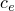
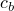
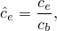

# 4.1.4 Error indicator output


**Products: **Abaqus/Standard  Abaqus/CAE  

**Warning:**Error indicator output variables are approximate and do not represent an accurate or conservative estimate of your solution error.  The quality of an error indicator can be particularly poor if your mesh is coarse. The error indicator quality improves as you refine the mesh; however, you should never interpret these variables as indicating what the value of a solution variable would be upon further refinement of the mesh.

##### **References**

- ["Abaqus/Standard output variable identifiers," Section 4.2.1](pt02ch04s02abv01.md)
- ["Adaptive remeshing: overview," Section 12.3.1](pt04ch12s03abo15.md)
- ["Selection of error indicators influencing adaptive remeshing," Section 12.3.2](pt04ch12s03aus84.md)
- [*CONTACT OUTPUT](../key/key-link.md#usb-kws-hcontactoutput)
- [*ELEMENT OUTPUT](../key/key-link.md#usb-kws-helementoutput)

### Overview

Error indicator output variables:
- indicate discretization error in a solution quantity (the base solution) and have units of the base solution;
- can be requested with element output or contact output options or as part of an adaptive remeshing rule;
- can be normalized by forms of the base solution to obtain nondimensional, such as percentage, indicators of error;
- can increase your analysis solution time significantly in some cases; and
- are available in Abaqus/Standard but not Abaqus/Explicit.

### Solution accuracy

The ability of a finite element analysis to make useful predictions of physical behavior depends on many factors, including:
- representation of geometry, material behavior, load history, and various other modeling aspects associated with describing the problem posed;
- spatial and temporal discretization (mesh refinement and incrementation); and
- convergence tolerances.

The primary focus of this section is spacial discretization error. Discussion to help understand and control other potential sources of error appears in ["Convergence criteria for nonlinear problems," Section 7.2.3](pt03ch07s02aus51.md), ["Time integration accuracy in transient problems," Section 7.2.4](pt03ch07s02aus52.md), ["Evaluating hyperelastic and viscoelastic material behavior," Section 12.4.7 of the Abaqus/CAE User's Guide](../usi/usi-link.md#usi-prp-editor-evaluate), and other portions of the Abaqus documentation. You should perform a detailed study of your analysis methods and assumptions as part of any error assessment. 

#### Spatial discretization error

The finite element discretization of a model domain results in an approximation to the exact solution for all but trivial analyses. To aid you in understanding the extent and spatial distribution of the discretization error in a finite element solution, Abaqus/Standard provides a set of error indicator output variables. Ideally, error indicator output variables should be supplemented by other techniques, such as a mesh refinement study, to gain confidence that discretization error is not significantly degrading the ability of the finite element analysis to make useful predictions. In fact, error indicators can help automate a mesh refinement study through the adaptive remeshing functionality of Abaqus/CAE; error indicators variables are used by this functionality to determine where to refine or coarsen a mesh (see ["Adaptive remeshing: overview," Section 12.3.1](pt04ch12s03abo15.md)).

### Error indicator and base solution variables available in Abaqus/Standard

Abaqus error indicator variables provide a measure of the local error resulting from mesh discretization. Each error indicator, , provides an indication of error in a particular base solution variable, . For example, the Mises stress error indicator, MISESERI, provides an indicator of error in the Mises stress variable MISESAVG. [Table 4.1.4--1](pt02ch04s01aus41.md#usb-anl-aadperrorindicators-table) shows the available error indicator variables and the corresponding base solution variables.

**Table 4.1.4–1** Error indicator variables and their corresponding base solution variables.
| Solution Quantity | Error indicator variable () | Base solution variable () |
| --- | --- | --- |
| Element energy density | ENDENERI | ENDEN |
| Mises stress | MISESERI | MISESAVG |
| Contact pressure | CPRESSERI | CPRESS |
| Contact shear stress | CSHEARERI | CSHEAR |
| Equivalent plastic strain | PEEQERI | PEEQAVG |
| Plastic strain | PEERI | PEAVG |
| Creep strain | CEERI | CEAVG |
| Heat flux | HFLERI | HFLAVG |
| Electric flux | EFLERI | EFLAVG |
| Electric potential gradient | EPGERI | EPGAVG |

The algorithms used by Abaqus/CAE to modify mesh seed sizes for the adaptive remeshing capability consider error indicator values and corresponding base solution values together. When you create a remeshing rule and request a particular error indicator, Abaqus automatically writes the error indicator and corresponding base solution variable to the output database.

| **Input File Usage: ** | ``` [*OUTPUT](../key/key-link.md#usb-kws-houtput), FIELD, ELSET=*ElsetName* [*ELEMENT OUTPUT](../key/key-link.md#usb-kws-helementoutput) [*CONTACT OUTPUT](../key/key-link.md#usb-kws-hcontactoutput) ``` |
| --- | --- |

| **Abaqus/CAE Usage: ** | Step module: ****Output****Field Output Request**** |
| --- | --- |
|  | Or, if you use the following option to specify an adaptive remeshing rule, the associated error indicator and base solution output will occur by default: Mesh module: **Create Remeshing Rule**: **Step and Indicator** |

#### Effect of error indicator output requests on solution time

Abaqus/Standard determines error indicator variables based on the difference between a smoothed and unsmoothed distribution of the base solution, using a smoothing technique such as the patch recovery technique of Zienkiewicz and Zhu, (1987). The smoothing calculations occasionally noticeably increase analysis time. If you find that adding an error indicator output request significantly increases analysis time, strategies for reducing this effect include reducing the output frequency and limiting the output request to a particular region of interest. Computations for most error indicator variables only occur just prior to writing the error indicator variable to the output database, so reducing the output frequency will tend to reduce the computation time; however this is not the case for the element energy density error indicator, because contributions to this error indicator are accumulated each increment regardless of whether this error indicator is output for a given increment. 

#### Additional considerations for extent of output requests for element error indicator variables

When you request element error indicator output, the request should only apply to elements supported for error indicator output.

The patch recovery technique used to compute element error indicator variables assumes that the solution should be continuous over the element set specified. Abaqus/Standard confirms that your error indicator output specification is consistent with this assumption by checking section property references within the error indicator domain and issues a warning message if the elements in the provided element set refer to distinct section definitions. You can safely ignore this warning if the sections are identical in their properties.

### Interpreting error indicator output

When interpreting error indicator output, you should remember that the error indicators are approximate measures of the local error in the base solution and are, themselves, subject to discretization error. The accuracy of the error estimates tends to improve as the mesh is refined. Each error indicator variable has the same units has the corresponding base solution variable, which facilitates comparison of local estimates of the error magnitude with local estimates of the base solution.

#### Regions of interest of a base solution and corresponding error indicator

Viewing contour plots of a base solution variable and corresponding error indicator variable side-by-side can provide a useful perspective on the solution accuracy. For example, if the base solution is expressed in units of stress, the corresponding error indicator is also expressed in units of stress. [Figure 4.1.4--1](pt02ch04s01aus41.md#aerror-hertz-cpress) shows contour plots of CPRESS and CPRESSERI for an analysis of a sphere pressed into a rigid plate. These plots can be interpreted as follows:
- The contact pressure solution is quite accurate near the center of the active contact region, where the contact pressure is largest, because the error indicator is a small fraction of the base solution in that region.
- The contact pressure solution is less accurate near the perimeter of the active contact region, where local variations in the contact pressure solution are largest (but the contact pressure is significantly less than the maximum value), because the error indicator is quite large compared to the base solution in that region.

The analyst may judge that the level of mesh refinement is adequate if the maximum contact pressure is of primary interest in such a case. Local mesh refinement would be needed to accurately predict the maximum contact pressure if the active contact region was significantly smaller than that shown in [Figure 4.1.4--1](pt02ch04s01aus41.md#aerror-hertz-cpress).

**Figure 4.1.4–1** Contour plots of CPRESS and CPRESSERI for contact between a deformable sphere and a rigid plate.


An error indicator tends to give a crude, non-conservative approximation of the deviation from the exact solution if the mesh is coarse relative to local solution variations or the exact solution to the problem posed involves a stress singularity. The following qualitative interpretations of error indicator results exceeding approximately 10% of base solution results are often appropriate:
- "Significant potential for solution inaccuracy exists in this region."
- "The mesh may be too coarse to give a good estimate of solution error in this region."
- "Perhaps a stress singularity exists at this corner."

#### Calculating normalized measures of solution error

You can use corresponding error indicator and base solution variables,  and , respectively, to compute a field of local, normalized error indicators:



where  is a normalized error measure. For example, 


 provides a percentage form of the Mises stress-based error indicator; however this normalized error measure may not be particularly useful, because it:- will tend to draw attention to regions where base solution values are small, which typically are not critical regions of a design; and
- will have divide-by-zero issues where the base solution value is zero.

Other normalization approaches, such as normalizing based on a global norm of the base solution variable or a constant value that you choose (such as the maximum value of the base solution allowed in a design), may be more effective.

Normalized forms of an error indicator are not available directly through the error indicator output variables; however, you can calculate normalized measures using the Visualization module of Abaqus/CAE (Abaqus/Viewer) to operate on field output data. For more information, see ["Building valid field output expressions," Section 42.7.1 of the Abaqus/CAE User's Guide](../usi/usi-link.md#usv-res-validexpression). Alternatively, you can use the Abaqus Scripting Interface to read the error indicator and the base solution from the output database and calculate normalized forms. For more information, see [Chapter 9, "Using the Abaqus Scripting Interface to access an output database," of the Abaqus Scripting User's Guide](../cmd/cmd-link.md#cmd-odb-api-pyc).

### Limitations

Only the following element types are supported for error indicator computations:
- Planar continuum triangles and quadrilaterals
- Shell triangles and quadrilaterals
- Tetrahedrals
- Hexahedrals

Elements with variable nodes are not supported.

Error indicator output is not supported in the following cases:
- Import analysis
- Restart analysis
- Post output analysis
- Map solution analysis
- Symmetric model generation analysis

#### Additional reference

- Zienkiewicz, O. C., and J. Z. Zhu, "A Simple Error Estimator and Adaptive Procedure for Practical Engineering Analysis," International Journal for Numerical Methods in Engineering, vol. 24, pp. 337--357, 1987.


