# 4.2.1 Abaqus/Standard output variable identifiers

**Product: **Abaqus/Standard  

##### **References**

- ["Output," Section 4.1.1](pt02ch04s01aus38.md)
- ["Output to the data and results files," Section 4.1.2](pt02ch04s01aus39.md)
- ["Output to the output database," Section 4.1.3](pt02ch04s01aus40.md)

### Overview

The tables in this section list all of the output variables that are available in Abaqus/Standard. These output variables can be requested for output to the data (`.dat`) and results (`.fil`) files (see ["Output to the data and results files," Section 4.1.2](pt02ch04s01aus39.md)) or as either field- or history-type output to the output database (`.odb`) file (see ["Output to the output database," Section 4.1.3](pt02ch04s01aus40.md)). In general, output variables that can be requested as field- or history-type output to an output database in ODB format can also be requested as output in SIM format (see ["The output database" in "Output," Section 4.1.1](pt02ch04s01aus38.md#usb-out-ooutput-formats)). As noted specifically in the tables, a few of the output variables are written only to the output database and restart (`.res`) files (they are not available for output to the data or results files). These variables can be accessed only in the Visualization module of Abaqus/CAE (Abaqus/Viewer). Each table contains one variable type:
- Element integration point variables
- Element centroidal variables
- Element section variables
- Whole element variables
- Whole element energy density variables
- Nodal variables
- Modal variables
- Surface variables
- Cavity radiation variables
- Section variables
- Whole and partial model variables
- Solution-dependent amplitude variables
- Structural optimization variables

### Notation used in the output variable descriptions

The words `.dat`, `.fil`, `.odb` Field, and `.odb` History following the variable's description indicate the availability of the output variable. `.dat` refers to a data file output selection, `.fil` refers to a results file output selection, `.odb` "Field" refers to a field-type output selection to the output database, and `.odb` "History" refers to a history-type output selection to the output database. The output variable can be written to the respective file if the word "yes" appears after the category name; "no" means that the variable is not available to that file.

If the word "automatic" appears after a category name, the variable cannot be requested by name; it will be written to the respective files according to the conditions specified in the text.

### Requesting output of components

Variable identifiers of the form *ABC**n* can be used with 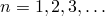 (*ABC*1, *ABC*2, …), where the highest value of *n* is determined by the type of variable. Similarly, variable identifiers of the form *DEF* can be used for the ranges of *i* and *j* indicated (*DEF*11, *DEF*12, ).

Individual components cannot be requested in the results (`.fil`) file. For postprocessing of a particular component of a variable, request file output for all components of the variable. Output for individual variables can be requested during postprocessing.

Individual components of variables can be requested as history-type output in the output database for *X–Y* plotting in Abaqus/CAE. Individual component requests to the output database are not available for field-type output, with the exception of state, field, and user-defined variables (SDV*n*, FV*n*, and UVARM*n*). If a particular component is desired for contouring in Abaqus/CAE, request field output of the generic variable (e.g., S for stress). Output for individual components of field output can be requested within the Visualization module of Abaqus/CAE.

### Direction definitions

The direction definitions depend on the variable type.

#### Direction definitions for element variables

For components of stress, strain, and other tensor quantities 1, 2, and 3 refer to the directions in an orthogonal coordinate system. These directions are global directions for solid elements, surface directions for shell and membrane elements, and axial and transverse directions for beam elements. For finite-membrane-strain shell elements, membrane elements, and continuum elements associated with a local orientation (see ["Orientations," Section 2.2.5](pt01ch02s02aus15.md)), the local output directions rotate with the average rotation of the element (integral with respect to time of the spin—see ["Stress rates," Section 1.5.3 of the Abaqus Theory Guide](../stm/stm-link.md#stm-int-stressrates)). Tensor components in these cases are output in the rotating local directions.

In some cases the local output directions may differ from one integration point to the next within an element. Abaqus/Standard does not take this variation into account when extrapolating output variables to the nodes, which affects output such as element quantities averaged at the nodes or contour plots of individual tensor components. Invariant quantities at the integration points will not be influenced by the local output directions.

You can control writing the local directions to the output database file or to the results file (see ["Specifying the directions for element output in Abaqus/Standard and Abaqus/Explicit" in "Output to the output database," Section 4.1.3](pt02ch04s01aus40.md#usb-out-odboutput-element-directions), and ["Output of local directions to the results file" in "Output to the data and results files," Section 4.1.2](pt02ch04s01aus39.md#usb-out-oprintfile-results-directions)). By default, the local directions are written to the output database for all frames that include element field output. The local (material) directions (averaged at the nodes) can be visualized in Abaqus/CAE by selecting ****Plot****Material Orientations**** in the Visualization module. The directions can be printed to the data file by using user subroutine [`UVARM`](../sub/sub-link.md#sub-xsl-uvarm).

#### Direction definitions for equivalent rigid body variables

For all equivalent rigid body variables 1, 2, and 3 refer to global directions.

#### Direction definitions for nodal variables

For nodal variables 1, 2, and 3 are global directions (1=*X*, 2=*Y*, and 3=*Z*; or for axisymmetric elements, 1=*r* and 2=*z*). If a local coordinate system is defined at a node (see ["Transformed coordinate systems," Section 2.1.5](pt01ch02s01aus09.md)), you can specify whether output to the data or results file of vector-valued quantities at these nodes is in the local or global system (see ["Specifying the directions for nodal output" in "Output to the data and results files," Section 4.1.2](pt02ch04s01aus39.md#usb-out-oprintfile-node-directions)). By default, nodal output is written to the data file in the local system, whereas it is written to the results file in the global system (since this is more convenient for postprocessing).

If nodal field output is requested for a node that has a local coordinate system defined, a quaternion representing the rotation from the global directions is written to the output database. Abaqus/CAE automatically uses this quaternion to transform the nodal results into the local directions. Nodal history data written to the output database are always stored in the global directions.

#### Direction definitions for integrated variables

For components of total force, total moment, and similar variables obtained through integration over a surface, the directions 1, 2, and 3 refer to directions in an orthogonal coordinate system. A fixed global coordinate system is used if the surface is specified directly for the integrated output request. If the surface is identified by an integrated output section definition (see ["Integrated output section definition," Section 2.5.1](pt01ch02s05aus23.md)) that is associated with the integrated output request, a local coordinate system in the initial configuration can be specified and can translate or rotate with the deformation.

### Distributed load output

You need to be aware of limitations that may be encountered when distributed load output is requested.

#### Distributed load output and user subroutines

Output can be requested for many of the distributed loads discussed in ["Loads," Section 34.4](pt07ch34s04.md). However, contributions to these loads defined through user subroutines (see ["Abaqus/Standard subroutines," Section 1.1 of the Abaqus User Subroutines Reference Guide](../sub/sub-link.md#sub-rtn-standard)) are not displayed, except for the variables FILMCOEF and SINKTEMP.

#### Distributed load output with modal procedures

For modal procedures only the magnitude of the load is written to the output database.

### Strain output

The total strain E is composed of the elastic strain EE, the inelastic strain IE, and the thermal strain THE. The inelastic strain IE consists of the plastic strain PE and the creep strain CE.

For geometrically nonlinear analysis Abaqus/Standard makes it possible to output different strain measures as well as elastic and various inelastic strains. The various total strain measures (integrated strain measure E, nominal strain measure NE, and logarithmic strain measure LE) are described in ["Conventions," Section 1.2.2](pt01ch01s02aus02.md). The default strain measure for output to the data (`.dat`) and results (`.fil`) files is E. However, for geometrically nonlinear analysis using element formulations that support finite strains, E is not available for output to the output database (`.odb`) file, and LE is the default strain measure.

### Temperature output

In Abaqus temperature can either be a field variable (stress analysis, mass diffusion, …) or a degree of freedom (heat transfer analysis, fully coupled temperature-displacement analysis, …). For any analysis that involves temperature, you can request the temperature either at nodes (variable NT) or in elements (variable TEMP). If element temperature output is requested at the nodes, the integration point values are extrapolated and, if requested, averaged. These extrapolated values are generally not as accurate as the nodal temperatures themselves. An exception to this is adiabatic analysis, in which the element temperatures change due to plastic heat generation but the nodal temperatures are not updated. In that case the current nodal temperatures are obtained only if element temperature output is requested at the nodes.

For continuum elements there is only one temperature value per node (NT11). For shells and beams more than one temperature is available for each node (NT11, NT12, …) since a temperature gradient can exist through the thickness of a shell or across the cross-section of a beam. In general, variables NT12, NT13, etc. contain temperature values. However, when temperature is defined by specifying temperature gradients, nodal temperatures for a given section point can be obtained only by using the variable TEMP. See ["Specifying temperature and field variables" in "Using a beam section integrated during the analysis to define the section behavior," Section 29.3.6](pt06ch29s03alm11.md#usb-elm-eusingbeamsection-temp), and ["Specifying temperature and field variables" in "Using a shell section integrated during the analysis to define the section behavior," Section 29.6.5](pt06ch29s06alm19.md#usb-elm-eusingshellsection-temp), for discussions on specifying temperatures in beams and shells.

### Principal value output

Output of the principal values can be requested for stresses, strains, and other material tensors. Either all principal values or the minimum, maximum, or intermediate values can be obtained. All principal values of tensor *ABC* are obtained with the request *ABC*P. The minimum, intermediate, and maximum principal values are obtained with the requests *ABC*P1, *ABC*P2, and *ABC*P3.

For three-dimensional, (generalized) plane strain, and axisymmetric elements all three principal values are obtained. For plane stress, membrane, and shell elements, the out-of-plane principal value cannot be requested for history-type output. For field-type output, Abaqus/CAE always reports the out-of-plane principal value as zero. Principal values cannot be obtained for truss elements or for any beam elements other than the three-dimensional beam elements with torsional shear stresses.

If a principal value or an invariant is requested for field-type output, the output request is replaced with an output request for the components of the corresponding tensor. Abaqus/CAE calculates all principal values and invariants from these components. If a principal value is desired as history-type output, it must be explicitly requested since Abaqus/CAE does no calculations on history data.

### Tensor output

Tensor variables that are written to the output database as field-type output are written as components in either the default directions defined by the convention given in ["Orientations," Section 2.2.5](pt01ch02s02aus15.md) (global directions for solid elements, surface directions for shell and membrane elements, and axial and transverse directions for beam elements), or the user-defined local system. Abaqus/CAE calculates all principal values and invariants from these components. See ["Writing field output data," Section 9.6.4 of the Abaqus Scripting User's Guide](../cmd/cmd-link.md#cmd-odb-intro-write-field-pyc), for a description of the different types of tensor variables. 

For plane stress, membrane, and shell elements, only the in-plane tensor components (11, 22, and 12 components) are stored by Abaqus/Standard. The out-of-plane direct component for stress (S33) is reported as zero to the output database as expected, and the out-of-plane component of strain (E33) is reported as zero even though it is not. This is because the thickness direction is computed based on section properties rather than at the material level. The out-of-plane components can be requested for field-type output and cannot be requested for history-type output. The out-of-plane stress components are not reported to the data (.`dat`) file or to the results (.`fil`) file. 

For three-dimensional beam elements with torsional shear stresses, only the axial and the torsional components (the 11 and 12 components) are stored by Abaqus/Standard. The other direct component (the 22 component) is reported as zero for field-type output and cannot be requested for history-type output.

The components for tensor variables are written to the output database in single precision. Therefore, a small amount of precision roundoff error may occur when calculating the variables' principal values. Such roundoff error may be observed, for example, when analytically zero values are calculated as relatively small nonzero values.

### Element integration point variables

You can request element integration point variable output to the data, results, or output database file (see ["Element output" in "Output to the data and results files," Section 4.1.2](pt02ch04s01aus39.md#usb-out-oprintfile-elementoutput), and ["Element output" in "Output to the output database," Section 4.1.3](pt02ch04s01aus40.md#usb-out-odboutput-elementoutput)).

#### Tensors and associated principal values and invariants

**S**

All stress components.
.dat: yes    .fil: yes    .odb Field: yes    .odb History: yes    
**S*ij***

-component of stress ().
.dat: yes    .fil: no    .odb Field: no    .odb History: yes    
**SP**

All principal stresses.
.dat: yes    .fil: yes    .odb Field: yes    .odb History: yes    
**SP*n***

Minimum, intermediate, and maximum principal stresses (SP1  SP2  SP3).
.dat: yes    .fil: no    .odb Field: no    .odb History: yes    
**SINV**

All stress invariant components (MISES, TRESC, PRESS, INV3). For field output SINV is converted to a request for the generic variable S. 
.dat: yes    .fil: yes    .odb Field: yes    .odb History: yes    
**MISES**

Mises equivalent stress, defined as

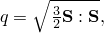

where  is the deviatoric stress tensor, defined as 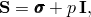 where  is the stress, *p* is the equivalent pressure stress (defined below), and  is a unit matrix. In index notation

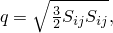
where 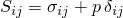, 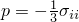, and 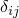 is the Kronecker delta.
.dat: yes    .fil: no    .odb Field: no    .odb History: yes    
**MISESMAX**

Maximum Mises stress among all of the section points. For a shell element it represents the maximum Mises value among all the section points in the layer, for a beam element it is the maximum Mises stress among all the section points in the cross-section, and for a solid element it represents the Mises stress at the integration points. 
.dat: no    .fil: no    .odb Field: yes    .odb History: no    
**MISESONLY**

Mises equivalent stress. When MISESONLY is used instead of MISES, the stress components are not written to the output database; consequently, the size of the database is reduced.
.dat: no    .fil: no    .odb Field: yes    .odb History: no    
**TRESC**

Tresca equivalent stress, defined as the maximum difference between principal stresses.
.dat: yes    .fil: no    .odb Field: no    .odb History: yes    
**PRESS**

Equivalent pressure stress, defined as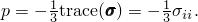
.dat: yes    .fil: no    .odb Field: no    .odb History: yes    
**PRESSONLY**

Equivalent pressure stress. When PRESSONLY is used instead of PRESS, the stress components are not written to the output database; consequently, the size of the database is reduced.
.dat: no    .fil: no    .odb Field: yes    .odb History: no    
**INV3**

Third stress invariant, defined as

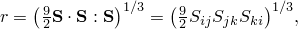
where  is the deviatoric stress defined in the context of Mises equivalent stress, above.
.dat: yes    .fil: no    .odb Field: no    .odb History: yes    
**TRIAX**

Stress triaxiality, .
.dat: no    .fil: no    .odb Field: yes    .odb History: yes    
**YIELDS**

Yield stress, , available for Mises, Johnson-Cook, and Hill plasticity material models.
.dat: no    .fil: no    .odb Field: yes    .odb History: yes    
**ALPHA**

All total kinematic hardening shift tensor components.
.dat: yes    .fil: yes    .odb Field: yes    .odb History: yes    
**ALPHA*ij***

-component of the total shift tensor ().
.dat: yes    .fil: no    .odb Field: no    .odb History: yes    
**ALPHA*k***

All  kinematic hardening shift tensor components ().
.dat: no    .fil: no    .odb Field: yes    .odb History: yes    
**ALPHA*k_ij***

-component of the  kinematic hardening shift tensor ( and ).
.dat: no    .fil: no    .odb Field: no    .odb History: yes    
**ALPHAN**

All tensor components of all the kinematic hardening shift tensors, except the total shift tensor, ALPHA.
.dat: no    .fil: no    .odb Field: yes    .odb History: yes    
**ALPHAP**

All principal values of the total shift tensor.
.dat: yes    .fil: yes    .odb Field: yes    .odb History: yes    
**ALPHAP*n***

Minimum, intermediate, and maximum principal values of the total shift tensor (ALPHAP1  ALPHAP2  ALPHAP3).
.dat: yes    .fil: no    .odb Field: no    .odb History: yes    
**E**

All strain components. For geometrically nonlinear analysis using element formulations that support finite strains, E is not available for output to the output database (`.odb`) file.
.dat: yes    .fil: yes    .odb Field: yes    .odb History: yes    
**E*ij***

-component of strain ().
.dat: yes    .fil: no    .odb Field: no    .odb History: yes    
**EP**

All principal strains.
.dat: yes    .fil: yes    .odb Field: yes    .odb History: yes    
**EP*n***

Minimum, intermediate, and maximum principal strains (EP1  EP2  EP3).
.dat: yes    .fil: no    .odb Field: no    .odb History: yes    
**NE**

All nominal strain components.
.dat: yes    .fil: yes    .odb Field: yes    .odb History: yes    
**NE*ij***

-component of nominal strain ().
.dat: yes    .fil: no    .odb Field: no    .odb History: yes    
**NEP**

All principal nominal strains.
.dat: yes    .fil: yes    .odb Field: yes    .odb History: yes    
**NEP*n***

Minimum, intermediate, and maximum principal nominal strains (NEP1  NEP2  NEP3).
.dat: yes    .fil: no    .odb Field: no    .odb History: yes    
**LE**

All logarithmic strain components. For geometrically nonlinear analysis using element formulations that support finite strains, LE is the default strain measure for output to the output database (`.odb`) file.
.dat: yes    .fil: yes    .odb Field: yes    .odb History: yes    
**LE*ij***

-component of logarithmic strain ().
.dat: yes    .fil: no    .odb Field: no    .odb History: yes    
**LEP**

All principal logarithmic strains.
.dat: yes    .fil: yes    .odb Field: yes    .odb History: yes    
**LEP*n***

Minimum, intermediate, and maximum principal logarithmic strains (LEP1  LEP2  LEP3).
.dat: yes    .fil: no    .odb Field: no    .odb History: yes    
**ER**

All mechanical strain rate components.
.dat: yes    .fil: yes    .odb Field: yes    .odb History: yes    
**ER*ij***

-component of strain rate ().
.dat: yes    .fil: no    .odb Field: no    .odb History: yes    
**ERP**

All principal mechanical strain rates.
.dat: yes    .fil: yes    .odb Field: yes    .odb History: yes    
**ERP*n***

Minimum, intermediate, and maximum principal mechanical strain rates (ERP1  ERP2  ERP3).
.dat: yes    .fil: no    .odb Field: no    .odb History: yes    
**DG**

All components of the total deformation gradient. Available only for hyperelasticity, hyperfoam, and material models defined in user subroutine [`UMAT`](../sub/sub-link.md#sub-xsl-umat). For fully integrated first-order quadrilaterals and hexahedra, the selectively reduced integration technique is used. A modified deformation gradient is output for these elements.
.dat: yes    .fil: yes    .odb Field: no    .odb History: no    
**DG*ij***

-component of the total deformation gradient (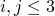).
.dat: yes    .fil: no    .odb Field: no    .odb History: no    
**DGP**

Principal stretches.
.dat: yes    .fil: yes    .odb Field: no    .odb History: no    
**DGP*n***

Minimum, intermediate, and maximum values of principal stretches (DGP1  DGP2  DGP3).
.dat: yes    .fil: no    .odb Field: no    .odb History: no    
**EE**

All elastic strain components.
.dat: yes    .fil: yes    .odb Field: yes    .odb History: yes    
**EE*ij***

-component of elastic strain ().
.dat: yes    .fil: no    .odb Field: no    .odb History: yes    
**EEP**

All principal elastic strains.
.dat: yes    .fil: yes    .odb Field: yes    .odb History: yes    
**EEP*n***

Minimum, intermediate, and maximum principal elastic strains (EEP1  EEP2  EEP3).
.dat: yes    .fil: no    .odb Field: no    .odb History: yes    
**IE**

All inelastic strain components.
.dat: yes    .fil: yes    .odb Field: yes    .odb History: yes    
**IE*ij***

-component of inelastic strain ().
.dat: yes    .fil: no    .odb Field: no    .odb History: yes    
**IEP**

All principal inelastic strains.
.dat: yes    .fil: yes    .odb Field: yes    .odb History: yes    
**IEP*n***

Minimum, intermediate, and maximum principal inelastic strains (IEP1  IEP2  IEP3).
.dat: yes    .fil: no    .odb Field: no    .odb History: yes    
**THE**

All thermal strain components.
.dat: yes    .fil: yes    .odb Field: yes    .odb History: yes    
**THE*ij***

-component of thermal strain ().
.dat: yes    .fil: no    .odb Field: no    .odb History: yes    
**THEP**

All principal thermal strains.
.dat: yes    .fil: yes    .odb Field: yes    .odb History: yes    
**THEP*n***

Minimum, intermediate, and maximum principal thermal strains (THEP1  THEP2  THEP3).
.dat: yes    .fil: no    .odb Field: no    .odb History: yes    
**PE**

All plastic strain components. This identifier also provides PEEQ, a yes/no flag telling if the material is currently yielding or not (AC YIELD: “actively yielding”; that is, the plastic strain changed during the increment), and PEMAG when PE is requested for the data or results files. When PE is requested for field output to the output database, PEEQ is also provided.
.dat: yes    .fil: yes    .odb Field: yes    .odb History: yes    
**PE*ij***

-component of plastic strain ().
.dat: yes    .fil: no    .odb Field: no    .odb History: yes    
**PEEQ**

Equivalent plastic strain. This identifier also provides a yes/no flag (1/0 on the output database) telling if the material is currently yielding or not (AC YIELD: “actively yielding”; that is, the plastic strain changed during the increment). 

The equivalent plastic strain is defined as 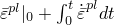, where  is the initial equivalent plastic strain.

The definition of  depends on the material model. For classical metal (Mises) plasticity . For other plasticity models, see the appropriate section in [Part V, "Materials](pt05.md).”
When plasticity occurs in the thickness direction to a gasket element whose plastic behavior is specified as part of a gasket behavior definition, PEEQ is PE11.
.dat: yes    .fil: no    .odb Field: yes    .odb History: yes    
**PEEQMAX**

Maximum equivalent plastic strain, PEEQ, among all of the section points. For a shell element it represents the maximumPEEQ value among all the section points in the layer, for a beam element it is the maximum PEEQ among all the section points in the cross-section, and for a solid element it represents thePEEQ at the integration points. 
.dat: no    .fil: no    .odb Field: yes    .odb History: no    
**PEEQT**

Equivalent plastic strain in uniaxial tension for cast iron, Mohr-Coulomb tension cutoff, and concrete damaged plasticity, which is defined as 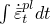. This identifier also provides a yes/no flag (1/0 on the output database) telling if the material is currently yielding or not (AC YIELDT: “actively yielding”; that is, the plastic strain changed during the increment). 
.dat: yes    .fil: yes    .odb Field: yes    .odb History: yes    
**PEMAG**

Plastic strain magnitude, defined as 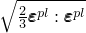.For most materials, PEEQ and PEMAG are equal only for proportional loading. When plasticity occurs in the thickness direction to a gasket element whose plastic behavior is specified as part of a gasket behavior definition, PEMAG is PE11.
.dat: yes    .fil: no    .odb Field: yes    .odb History: yes    
**PEP**

All principal plastic strains.
.dat: yes    .fil: yes    .odb Field: yes    .odb History: yes    
**PEP*n***

Minimum, intermediate, and maximum principal plastic strains (PEP1  PEP2  PEP3).
.dat: yes    .fil: no    .odb Field: no    .odb History: yes    
**CE**

All creep strain components. This identifier also provides CEEQ, CESW, and CEMAG when CE is requested for the data or results files.
.dat: yes    .fil: yes    .odb Field: yes    .odb History: yes    
**CE*ij***

-component of creep strain ().
.dat: yes    .fil: no    .odb Field: no    .odb History: yes    
**CEEQ**

Equivalent creep strain, defined as .

The definition of  depends on the material model. For classical metal (Mises) creep 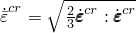. For other creep models, see the appropriate section in [Part V, "Materials](pt05.md).”
When creep occurs in the thickness direction to a gasket element whose creep behavior is specified as part of a gasket behavior definition, CEEQ is CE11.
.dat: yes    .fil: no    .odb Field: yes    .odb History: yes    
**CESW**

Magnitude of swelling strain.For cap creep CESW gives the equivalent creep strain produced by the consolidation creep mechanism, defined as 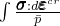, where  is the equivalent creep pressure, 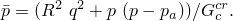
.dat: yes    .fil: no    .odb Field: yes    .odb History: yes    
**CEMAG**

Magnitude of creep strain (defined by the same formula given above for PEMAG, applied to the creep strains).
.dat: yes    .fil: no    .odb Field: yes    .odb History: yes    
**CEP**

All principal creep strains.
.dat: yes    .fil: yes    .odb Field: yes    .odb History: yes    
**CEP*n***

Minimum, intermediate, and maximum principal creep strains (CEP1  CEP2  CEP3).
.dat: yes    .fil: no    .odb Field: no    .odb History: yes    

#### Additional element stresses

**CS11**

Average contact pressure for link and three-dimensional line gasket elements. Available only if the gasket contact area is specified; see ["Defining the contact area for average contact pressure output" in "Defining the gasket behavior directly using a gasket behavior model," Section 32.6.6](pt06ch32s06alm51.md#usb-elm-egasketbehavior-contactarea).
.dat: yes    .fil: yes    .odb Field: yes    .odb History: yes    
**TSHR**

All transverse shear stress components. Available only for thick shell elements such as S3R, S4R, S8R, and S8RT. Contouring of this variable is supported in the Visualization module of Abaqus/CAE.
.dat: yes    .fil: yes    .odb Field: yes    .odb History: yes    
**TSHR*i*3**

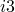-component of transverse shear stress (). Available only for thick shell elements such as S3R, S4R, S8R, and S8RT.
.dat: yes    .fil: no    .odb Field: no    .odb History: yes    
**CTSHR**

Transverse shear stress components for stacked continuum shell elements. Available only for SC6R and SC8R elements. Contouring of this variable is supported in the Visualization module of Abaqus/CAE.
.dat: yes    .fil: no    .odb Field: yes    .odb History: yes    
**CTSHR*i*3**

-component of transverse shear stress (). Available only for SC6R and SC8R elements.
.dat: yes    .fil: no    .odb Field: no    .odb History: yes    
**SS**

All substresses. Available only for ITS elements.
.dat: yes    .fil: yes    .odb Field: no    .odb History: no    
**SS*n***

*n*th substress (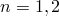). Available only for ITS elements.
.dat: yes    .fil: no    .odb Field: no    .odb History: no    

#### Vibration and acoustic quantities

**INTEN**

Vibration intensity. Available only for the steady-state dynamics procedure. For real-only steady-state dynamics analyses, the intensity is a pure imaginary vector, but it is stored as real on the output database. Available for structural, solid, and acoustic elements and for rebar.
.dat: no    .fil: no    .odb Field: yes    .odb History: yes    
**ACV**

Acoustic particle velocity. Available only if the steady-state dynamic procedure is used, and available only for acoustic finite elements.
.dat: no    .fil: no    .odb Field: yes    .odb History: yes    
**ACV*n***

Component *n* of the acoustic particle velocity vector (*n* = 1, 2, 3). Available only if the steady-state dynamic procedure is used, and available only for acoustic finite elements.
.dat: no    .fil: no    .odb Field: no    .odb History: yes    
**GRADP**

Acoustic pressure gradient. Available only if the steady-state dynamic procedure is used, and available only for acoustic finite elements.
.dat: no    .fil: no    .odb Field: yes    .odb History: yes    

#### Energy densities

**ENER**

All energy densities. None of the energy densities are available in mode-based procedures; a limited number of them are available for direct-solution steady-state dynamic and subspace-based steady-state dynamic analyses. In steady-state dynamics all energy quantities are net per-cycle values, unless otherwise noted (see ["Energy balance," Section 1.5.5 of the Abaqus Theory Guide](../stm/stm-link.md#stm-int-energybalance)).
.dat: yes    .fil: yes    .odb Field: yes    .odb History: yes    
**SENER**

Elastic strain energy density (with respect to current volume). When the Mullins effect is modeled with hyperelastic materials, this quantity represents only the recoverable part of energy per unit volume. This is the only energy density available in the data file for eigenvalue extraction procedures; to obtain this quantity for eigenvalue extraction procedures in the results file or as field output in the output database, request ENER. In steady-state dynamic analysis this is the cyclic mean value.
.dat: yes    .fil: no    .odb Field: yes    .odb History: yes    
**PENER**

Energy dissipated by rate-independent and rate-dependent plasticity, per unit volume. Not available for steady-state dynamic analysis.
.dat: yes    .fil: no    .odb Field: yes    .odb History: yes    
**CENER**

Energy dissipated by creep, swelling, and viscoelasticity, per unit volume. Not available for steady-state dynamic analysis.
.dat: yes    .fil: no    .odb Field: yes    .odb History: yes    
**VENER**

Energy dissipated by viscous effects (except those from viscoelasticity and static dissipation), per unit volume.
.dat: yes    .fil: no    .odb Field: yes    .odb History: yes    
**EENER**

Electrostatic energy density. Not available for steady-state dynamic analysis.
.dat: yes    .fil: no    .odb Field: yes    .odb History: yes    
**JENER**

Electrical energy dissipated as a result of the flow of current, per unit volume. Not available for steady-state dynamic analysis.
.dat: yes    .fil: no    .odb Field: yes    .odb History: yes    
**DMENER**

Energy dissipated by damage, per unit volume. Not available for steady-state dynamic analysis.
.dat: yes    .fil: no    .odb Field: yes    .odb History: yes    

#### State, field, and user-defined output variables

**SDV**

Solution-dependent state variables.
.dat: yes    .fil: yes    .odb Field: yes    .odb History: yes    
**SDV*n***

Solution-dependent state variable *n*.
.dat: yes    .fil: no    .odb Field: yes    .odb History: yes    
**TEMP**

Temperature.
.dat: yes    .fil: yes    .odb Field: yes    .odb History: yes    
**FV**

Predefined field variables, including those imported using the FV*i* co-simulation field ID.
.dat: yes    .fil: yes    .odb Field: yes    .odb History: yes    
**FV*n***

Predefined field variable *n*.
.dat: yes    .fil: no    .odb Field: yes    .odb History: yes    
**MFR**

Predefined mass flow rates.
.dat: yes    .fil: yes    .odb Field: yes    .odb History: yes    
**MFR*n***

Component *n* of predefined mass flow rate ().
.dat: yes    .fil: no    .odb Field: no    .odb History: yes    
**UVARM**

User-defined output variables.
.dat: yes    .fil: yes    .odb Field: yes    .odb History: yes    
**UVARM*n***

User-defined output variable *n*.
.dat: yes    .fil: no    .odb Field: yes    .odb History: yes    

#### Composite failure measures

**CFAILURE**

All failure measure components.
.dat: yes    .fil: yes    .odb Field: yes    .odb History: yes    
**MSTRS**

Maximum stress theory failure measure.
.dat: yes    .fil: no    .odb Field: yes    .odb History: yes    
**TSAIH**

Tsai-Hill theory failure measure.
.dat: yes    .fil: no    .odb Field: yes    .odb History: yes    
**TSAIW**

Tsai-Wu theory failure measure.
.dat: yes    .fil: no    .odb Field: yes    .odb History: yes    
**AZZIT**

Azzi-Tsai-Hill theory failure measure.
.dat: yes    .fil: no    .odb Field: yes    .odb History: yes    
**MSTRN**

Maximum strain theory failure measure.
.dat: yes    .fil: no    .odb Field: yes    .odb History: yes    

#### Fluid link quantities

**MFL**

Current value of the mass flow rate.
.dat: yes    .fil: yes    .odb Field: yes    .odb History: yes    
**MFLT**

Current value of the total mass flow.
.dat: yes    .fil: yes    .odb Field: yes    .odb History: yes    

#### Fracture mechanics quantities

**JK**

 *J*-integral, stress intensity factors. Available only for line spring elements. Output is in the following order for LS3S elements: *J*, *K*, , and . Output is in the following order for LS6 elements: *J*, , , , , and .
.dat: yes    .fil: yes    .odb Field: yes    .odb History: yes    

#### Concrete cracking and additional plasticity

**CRACK**

Unit normal to cracks in concrete.
.dat: yes    .fil: yes    .odb Field: no    .odb History: no    
**CONF**

Number of cracks at a concrete material point.
.dat: yes    .fil: yes    .odb Field: no    .odb History: no    
**PEQC**

All equivalent plastic strains when the model has more than one yield/failure surface.
.dat: yes    .fil: yes    .odb Field: yes    .odb History: yes    
**PEQC*n***

*n*th equivalent plastic strain ().

For jointed materials: PEQC provides equivalent plastic strains for all four possible systems (three joints - PEQC1, PEQC2, PEQC3, and bulk material - PEQC4). This identifier also provides a yes/no flag (1/0 on the output database) telling if each individual system is currently yielding or not (AC YIELD: “actively yielding”; that is, the plastic strain changed during the increment).

For cap plasticity: PEQC provides equivalent plastic strains for all three possible yield/failure surfaces (Drucker-Prager failure surface - PEQC1, cap surface - PEQC2, and transition surface - PEQC3) and the total volumetric inelastic strain (PEQC4). All identifiers also provide a yes/no flag (1/0 on the output database) telling whether the yield surface is currently active or not (AC YIELD: “actively yielding”, that is, the plastic strain changed during the increment).
When PEQC is requested as output to the output database, the active yield flags for each component are named AC YIELD1, AC YIELD2, etc. and take the value 1 or 0.
.dat: yes    .fil: no    .odb Field: no    .odb History: yes    

#### Concrete damaged plasticity

**DAMAGEC**

Compressive damage variable, .
.dat: yes    .fil: no    .odb Field: yes    .odb History: yes    
**DAMAGET**

Tensile damage variable, .
.dat: yes    .fil: no    .odb Field: yes    .odb History: yes    
**SDEG**

Scalar stiffness degradation variable, *d*.
.dat: yes    .fil: no    .odb Field: yes    .odb History: yes    
**PEEQ**

Equivalent plastic strain in uniaxial compression, which is defined as . This identifier also provides a yes/no flag (1/0 on the output database) telling if the material is currently undergoing compressive failure or not (AC YIELD: “actively yielding”; that is, the plastic strain changed during the increment). 
.dat: yes    .fil: yes    .odb Field: yes    .odb History: yes    

#### Rebar quantities

**RBFOR**

Force in rebar.
.dat: yes    .fil: yes    .odb Field: yes    .odb History: yes    
**RBANG**

Angle in degrees between rebar and the user-specified isoparametric direction. Available only for shell, membrane, and surface elements.
.dat: yes    .fil: yes    .odb Field: yes    .odb History: yes    
**RBROT**

Change in angle in degrees between rebar and the user-specified isoparametric direction. Available only for shell, membrane, and surface elements.
.dat: yes    .fil: yes    .odb Field: yes    .odb History: yes    

#### Heat transfer analysis

**HFL**

Current magnitude and components of the heat flux per unit area vector. The integration points for these values are located at the Gauss points.
.dat: yes    .fil: yes    .odb Field: yes    .odb History: yes    
**HFLM**

Current magnitude of heat flux per unit area vector.
.dat: yes    .fil: no    .odb Field: no    .odb History: yes    
**HFL*n***

Component *n* of the heat flux vector ().
.dat: yes    .fil: no    .odb Field: no    .odb History: yes    

#### Mass diffusion analysis

**CONC**

Mass concentration.
.dat: yes    .fil: yes    .odb Field: yes    .odb History: yes    
**ISOL**

Amount of solute at an integration point, calculated as the product of the mass concentration (CONC) and the integration point volume (IVOL).
.dat: yes    .fil: yes    .odb Field: yes    .odb History: yes    
**MFL**

Current magnitude and components of the concentration flux vector.
.dat: yes    .fil: yes    .odb Field: yes    .odb History: yes    
**MFLM**

Current magnitude of the concentration flux vector.
.dat: yes    .fil: no    .odb Field: no    .odb History: yes    
**MFL*n***

Component *n* of the concentration flux vector ().
.dat: yes    .fil: no    .odb Field: no    .odb History: yes    

#### Elements with electrical potential degrees of freedom

**EPG**

Current magnitude and components of the electrical potential gradient vector for a coupled thermal-electrical analysis or a fully coupled thermal-electrical-structural analysis. Current magnitude and components of the negative of the electrical potential gradient vector for a piezoelectric analysis. 
.dat: yes    .fil: yes    .odb Field: yes    .odb History: yes    
**EPGM**

Current magnitude of the electrical potential gradient vector.
.dat: yes    .fil: no    .odb Field: no    .odb History: yes    
**EPG*n***

Component *n* of the electrical potential gradient vector for a coupled thermal-electrical analysis or a fully coupled thermal-electrical-structural analysis. Component *n* of the negative of the electrical potential gradient vector for a piezoelectric analysis. () .
.dat: yes    .fil: no    .odb Field: no    .odb History: yes    

#### Piezoelectric analysis

**EFLX**

Current magnitude and components of the electrical flux vector.
.dat: yes    .fil: yes    .odb Field: yes    .odb History: yes    
**EFLXM**

Current magnitude of the electrical flux vector.
.dat: yes    .fil: no    .odb Field: no    .odb History: yes    
**EFLX*n***

Component *n* of the electrical flux vector ().
.dat: yes    .fil: no    .odb Field: no    .odb History: yes    

#### Coupled thermal-electrical elements

**ECD**

Current magnitude and components of the electrical current density.
.dat: yes    .fil: yes    .odb Field: yes    .odb History: yes    
**ECDM**

Current magnitude of the electrical current density.
.dat: yes    .fil: no    .odb Field: no    .odb History: yes    
**ECD*n***

Component *n* of the electrical current density vector ().
.dat: yes    .fil: no    .odb Field: no    .odb History: yes    

#### Cohesive elements

**MAXSCRT**

Maximum nominal stress damage initiation criterion.
.dat: yes    .fil: no    .odb Field: yes    .odb History: yes    
**MAXECRT**

Maximum nominal strain damage initiation criterion.
.dat: yes    .fil: no    .odb Field: yes    .odb History: yes    
**QUADSCRT**

Quadratic nominal stress damage initiation criterion.
.dat: yes    .fil: no    .odb Field: yes    .odb History: yes    
**QUADECRT**

Quadratic nominal strain damage initiation criterion.
.dat: yes    .fil: no    .odb Field: yes    .odb History: yes    
**DMICRT**

All active components of the damage initiation criteria.
.dat: yes    .fil: yes    .odb Field: yes    .odb History: yes    
**SDEG**

Overall scalar stiffness degradation.
.dat: yes    .fil: yes    .odb Field: yes    .odb History: yes    
**STATUS**

Status of the element (the status of an element is 1.0 if the element is active, 0.0 if the element is not).
.dat: yes    .fil: yes    .odb Field: yes    .odb History: yes    
**MMIXDME**

Mode mix ratio during damage evolution. It has a value of  before initiation of damage.
.dat: no    .fil: no    .odb Field: yes    .odb History: yes    
**MMIXDMI**

Mode mix ratio at damage initiation. It has a value of  before initiation of damage.
.dat: no    .fil: no    .odb Field: yes    .odb History: yes    

#### Low-cycle fatigue analysis

**CYCLEINI**

Number of cycles to initialize the damage at the material point.
.dat: no    .fil: no    .odb Field: yes    .odb History: yes    
**SDEG**

Overall scalar stiffness degradation.
.dat: yes    .fil: yes    .odb Field: yes    .odb History: yes    
**STATUS**

Status of the element (the status of an element is 1.0 if the element is active, 0.0 if the element is not).
.dat: yes    .fil: yes    .odb Field: yes    .odb History: yes    

#### Pore pressure analysis

**VOIDR**

Void ratio.
.dat: yes    .fil: yes    .odb Field: yes    .odb History: yes    
**POR**

Pore pressure.
.dat: yes    .fil: yes    .odb Field: yes    .odb History: yes    
**SAT**

Saturation.
.dat: yes    .fil: yes    .odb Field: yes    .odb History: yes    
**GELVR**

Gel volume ratio.
.dat: yes    .fil: yes    .odb Field: yes    .odb History: yes    
**FLUVR**

Total fluid volume ratio.
.dat: yes    .fil: yes    .odb Field: yes    .odb History: yes    
**FLVEL**

Current magnitude and components of the pore fluid effective velocity vector.
.dat: yes    .fil: yes    .odb Field: yes    .odb History: yes    
**FLVELM**

Current magnitude of the pore fluid effective velocity vector.
.dat: yes    .fil: no    .odb Field: no    .odb History: yes    
**FLVEL*n***

Component *n* of the pore fluid effective velocity vector ().
.dat: yes    .fil: no    .odb Field: no    .odb History: yes    

#### Pore pressure cohesive elements

**GFVR**

Gap flow volume rate.
.dat: yes    .fil: yes    .odb Field: yes    .odb History: yes    
**PFOPEN**

Pore pressure fracture opening.
.dat: yes    .fil: yes    .odb Field: yes    .odb History: yes    
**LEAKVRT**

Leak-off flow rate at the top of the element.
.dat: yes    .fil: yes    .odb Field: yes    .odb History: yes    
**LEAKVRB**

Leak-off flow rate at the bottom of the element.
.dat: yes    .fil: yes    .odb Field: yes    .odb History: yes    
**ALEAKVRT**

Accumulated leak-off volume at the top of the element.
.dat: yes    .fil: yes    .odb Field: yes    .odb History: yes    
**ALEAKVRB**

Accumulated leak-off volume at the bottom of the element.
.dat: yes    .fil: yes    .odb Field: yes    .odb History: yes    

#### Porous metal plasticity quantities

**RD**

Relative density.
.dat: yes    .fil: yes    .odb Field: yes    .odb History: yes    
**VVF**

Void volume fraction.
.dat: yes    .fil: yes    .odb Field: yes    .odb History: yes    
**VVFG**

Void volume fraction due to void growth.
.dat: yes    .fil: yes    .odb Field: yes    .odb History: yes    
**VVFN**

Void volume fraction due to void nucleation.
.dat: yes    .fil: yes    .odb Field: yes    .odb History: yes    

#### Two-layer viscoplasticity quantities

**VS**

Stress in the elastic-viscous network.
.dat: yes    .fil: yes    .odb Field: yes    .odb History: yes    
**VS*ij***

-component of stress in the elastic-viscous network ().
.dat: yes    .fil: no    .odb Field: no    .odb History: yes    
**PS**

Stress in the elastic-plastic network.
.dat: yes    .fil: yes    .odb Field: yes    .odb History: yes    
**PS*ij***

-component of stress in the elastic-plastic network ().
.dat: yes    .fil: no    .odb Field: no    .odb History: yes    
**VE**

Viscous strain in the elastic-viscous network.
.dat: yes    .fil: yes    .odb Field: yes    .odb History: yes    
**VE*ij***

-component of viscous strain in the elastic-viscous network ().
.dat: yes    .fil: no    .odb Field: no    .odb History: yes    
**PE**

Plastic strain in the elastic-plastic network.
.dat: yes    .fil: yes    .odb Field: yes    .odb History: yes    
**PE*ij***

-component of plastic strain in the elastic-plastic network ().
.dat: yes    .fil: no    .odb Field: no    .odb History: yes    
**VEEQ**

Equivalent viscous strain in the elastic-viscous network, defined as 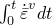.
.dat: yes    .fil: no    .odb Field: yes    .odb History: yes    
**PEEQ**

Equivalent plastic strain in the elastic-plastic network, defined as 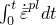.
.dat: yes    .fil: no    .odb Field: yes    .odb History: yes    

#### Geometric quantities

**COORD**

Coordinates of the integration point for solid elements and rebar. These are the current coordinates if the large-displacement formulation is being used.
.dat: yes    .fil: yes    .odb Field: yes    .odb History: yes    
**IVOL**

Integration point volume. Section point volume in the case of beams and shells. (Not available for eigenfrequency extraction, eigenvalue buckling prediction, complex eigenfrequency extraction, or linear dynamics procedures. Available only for continuum and structural elements not using general beam or shell section definitions.)
.dat: yes    .fil: yes    .odb Field: yes    .odb History: yes    
**LOCALDIR*n***

Direction cosines of the local material directions for an anisotropic hyperelastic material model. This variable is output automatically if any other element field output is requested for an anisotropic hyperelastic material (see ["Output" in "Anisotropic hyperelastic behavior," Section 22.5.3](pt05ch22s05abm09.md#usb-mat-canisohyperelastic-output)).
.dat: no    .fil: no    .odb Field: automatic    .odb History: no    

#### Accuracy indicators

**SJP**

Strain jumps at nodes.
.dat: yes    .fil: yes    .odb Field: no    .odb History: no    

#### Random response analysis

The following variables (beginning with R) are available only for random response dynamic analysis:
**RS**

Root mean square of all stress components.
.dat: yes    .fil: yes    .odb Field: yes    .odb History: yes    
**RS*ij***

Root mean square of -component of stress ().
.dat: yes    .fil: no    .odb Field: no    .odb History: yes    
**RMISES**

Root mean square of Mises equivalent stress.
.dat: no    .fil: no    .odb Field: yes    .odb History: yes    
**RE**

Root mean square of all strain components.
.dat: yes    .fil: yes    .odb Field: yes    .odb History: yes    
**RE*ij***

Root mean square of -component of strain ().
.dat: yes    .fil: no    .odb Field: no    .odb History: yes    
**RCTF**

RMS values of all components of connector total forces and moments.
.dat: yes    .fil: yes    .odb Field: no    .odb History: yes    
**RCTF*n***

RMS value of connector total force component *n* (). 
.dat: yes    .fil: no    .odb Field: no    .odb History: yes    
**RCTM*n***

RMS value of connector total moment component *n* ().
.dat: yes    .fil: no    .odb Field: no    .odb History: yes    
**RCEF**

RMS values of all components of connector elastic forces and moments.
.dat: yes    .fil: yes    .odb Field: no    .odb History: yes    
**RCEF*n***

RMS value of connector elastic force component *n* (). 
.dat: yes    .fil: no    .odb Field: no    .odb History: yes    
**RCEM*n***

RMS value of connector elastic moment component *n* ().
.dat: yes    .fil: no    .odb Field: no    .odb History: yes    
**RCVF**

RMS values of all components of connector viscous forces and moments.
.dat: yes    .fil: yes    .odb Field: no    .odb History: yes    
**RCVF*n***

RMS value of connector viscous force component *n* (). 
.dat: yes    .fil: no    .odb Field: no    .odb History: yes    
**RCVM*n***

RMS value of connector viscous moment component *n* ().
.dat: yes    .fil: no    .odb Field: no    .odb History: yes    
**RCRF**

RMS values of all components of connector reaction forces and moments.
.dat: yes    .fil: yes    .odb Field: no    .odb History: yes    
**RCRF*n***

RMS value of connector reaction force component *n* (). 
.dat: yes    .fil: no    .odb Field: no    .odb History: yes    
**RCRM*n***

RMS value of connector reaction moment component *n* ().
.dat: yes    .fil: no    .odb Field: no    .odb History: yes    
**RCSF**

RMS values of all components of connector friction forces and moments.
.dat: yes    .fil: yes    .odb Field: no    .odb History: yes    
**RCSF*n***

RMS value of connector friction force component *n* (). 
.dat: yes    .fil: no    .odb Field: no    .odb History: yes    
**RCSM*n***

RMS value of connector friction moment component *n* ().
.dat: yes    .fil: no    .odb Field: no    .odb History: yes    
**RCSFC**

RMS value of connector friction force in the direction of the instantaneous slip direction. Available only if friction is defined in the slip direction.
.dat: yes    .fil: no    .odb Field: no    .odb History: yes    
**RCU**

RMS values of all components of connector relative displacements and rotations.
.dat: yes    .fil: yes    .odb Field: no    .odb History: yes    
**RCU*n***

RMS value of connector relative displacement in the *n*-direction (). 
.dat: yes    .fil: no    .odb Field: no    .odb History: yes    
**RCUR*n***

RMS value of connector relative rotation in the *n*-direction ().
.dat: yes    .fil: no    .odb Field: no    .odb History: yes    
**RCCU**

RMS values of all components of connector constitutive displacements and rotations.
.dat: yes    .fil: yes    .odb Field: no    .odb History: yes    
**RCCU*n***

RMS value of connector constitutive displacement in the *n*-direction (). 
.dat: yes    .fil: no    .odb Field: no    .odb History: yes    
**RCCUR*n***

RMS value of connector constitutive rotation in the *n*-direction ().
.dat: yes    .fil: no    .odb Field: no    .odb History: yes    
**RCNF**

RMS values of all components of connector friction-generating contact forces and moments.
.dat: yes    .fil: yes    .odb Field: no    .odb History: yes    
**RCNF*n***

RMS value of connector friction-generating contact force component *n* ().
.dat: yes    .fil: no    .odb Field: no    .odb History: yes    
**RCNM*n***

RMS value of connector friction-generating contact moment component *n* ().
.dat: yes    .fil: no    .odb Field: no    .odb History: yes    
**RCNFC**

RMS values of connector friction-generating contact force components in the instantaneous slip direction. Available only if friction is defined in the slip direction.
.dat: yes    .fil: no    .odb Field: no    .odb History: yes    

#### Steady-state dynamic analysis

The following variables (beginning with P) are available only for steady-state (frequency domain) dynamic analysis. These variables include both the magnitude and phase angle for all components. Phase angles are given in degrees. In the data file there are two lines of output for each request. The first line contains the magnitude, and the second line (indicated by the SSD footnote) contains the phase angle. In the results file the magnitudes of all components are first, followed by the phase angles of all components. 
**PHS**

Magnitude and phase angle of all stress components.
.dat: yes    .fil: yes    .odb Field: no    .odb History: no    
**PHS*ij***

Magnitude and phase angle of -component of stress ().
.dat: yes    .fil: no    .odb Field: no    .odb History: no    
**PHE**

Magnitude and phase angle of all strain components.
.dat: yes    .fil: yes    .odb Field: no    .odb History: no    
**PHE*ij***

Magnitude and phase angle of -component of strain ().
.dat: yes    .fil: no    .odb Field: no    .odb History: no    
**PHEPG**

Magnitude and phase angles of the electrical potential gradient vector.
.dat: yes    .fil: yes    .odb Field: no    .odb History: no    
**PHEPG*n***

Magnitude and phase angle of component *n* of the electrical potential gradient ().
.dat: yes    .fil: no    .odb Field: no    .odb History: no    
**PHEFL**

Magnitude and phase angles of the electrical flux vector.
.dat: yes    .fil: yes    .odb Field: no    .odb History: no    
**PHEFL*n***

Magnitude and phase angle of component *n* of the electrical flux vector ().
.dat: yes    .fil: no    .odb Field: no    .odb History: no    
**PHMFL**

Magnitude and phase angle of mass flow rate. Available only for fluid link elements.
.dat: yes    .fil: yes    .odb Field: no    .odb History: no    
**PHMFT**

Magnitude and phase angle of total mass flow. Available only for fluid link elements.
.dat: yes    .fil: yes    .odb Field: no    .odb History: no    
**PHCTF**

Magnitude and phase of all components of connector total forces and moments.
.dat: yes    .fil: yes    .odb Field: no    .odb History: no    
**PHCTF*n***

Magnitude and phase of connector total force component *n* (). 
.dat: yes    .fil: no    .odb Field: no    .odb History: no    
**PHCTM*n***

Magnitude and phase of connector total moment component *n* ().
.dat: yes    .fil: no    .odb Field: no    .odb History: no    
**PHCEF**

Magnitude and phase of all components of connector elastic forces and moments.
.dat: yes    .fil: yes    .odb Field: no    .odb History: no    
**PHCEF*n***

Magnitude and phase of connector elastic force component *n* (). 
.dat: yes    .fil: no    .odb Field: no    .odb History: no    
**PHCEM*n***

Magnitude and phase of connector elastic moment component *n* ().
.dat: yes    .fil: no    .odb Field: no    .odb History: no    
**PHCVF**

Magnitude and phase of all components of connector viscous forces and moments.
.dat: yes    .fil: yes    .odb Field: no    .odb History: no    
**PHCVF*n***

Magnitude and phase of connector viscous force component *n* (). 
.dat: yes    .fil: no    .odb Field: no    .odb History: no    
**PHCVM*n***

Magnitude and phase of connector viscous moment component *n* ().
.dat: yes    .fil: no    .odb Field: no    .odb History: no    
**PHCRF**

Magnitude and phase of all components of connector reaction forces and moments.
.dat: yes    .fil: yes    .odb Field: no    .odb History: no    
**PHCRF*n***

Magnitude and phase of connector reaction force component *n* (). 
.dat: yes    .fil: no    .odb Field: no    .odb History: no    
**PHCRM*n***

Magnitude and phase of connector reaction moment component *n* ().
.dat: yes    .fil: no    .odb Field: no    .odb History: no    
**PHCSF**

Magnitude and phase of all components of connector friction forces and moments.
.dat: yes    .fil: yes    .odb Field: no    .odb History: no    
**PHCSF*n***

Magnitude and phase of connector friction force component *n* (). 
.dat: yes    .fil: no    .odb Field: no    .odb History: no    
**PHCSM*n***

Magnitude and phase of connector friction moment component *n* ().
.dat: yes    .fil: no    .odb Field: no    .odb History: no    
**PHCSFC**

Magnitude and phase of connector friction force in the direction of the instantaneous slip direction. Available only if friction is defined in the slip direction.
.dat: yes    .fil: no    .odb Field: no    .odb History: no    
**PHCU**

Magnitude and phase of all components of connector relative displacements and rotations.
.dat: yes    .fil: yes    .odb Field: no    .odb History: no    
**PHCU*n***

Magnitude and phase of connector relative displacement in the *n*-direction (). 
.dat: yes    .fil: no    .odb Field: no    .odb History: no    
**PHCUR*n***

Magnitude and phase of connector relative rotation in the *n*-direction ().
.dat: yes    .fil: no    .odb Field: no    .odb History: no    
**PHCCU**

Magnitude and phase of all components of connector constitutive displacements and rotations.
.dat: yes    .fil: yes    .odb Field: no    .odb History: no    
**PHCCU*n***

Magnitude and phase of connector constitutive displacement in the *n*-direction (). 
.dat: yes    .fil: no    .odb Field: no    .odb History: no    
**PHCCUR*n***

Magnitude and phase of connector constitutive rotation in the *n*-direction ().
.dat: yes    .fil: no    .odb Field: no    .odb History: no    
**PHCV**

Magnitude and phase of all components of connector relative velocities.
.dat: yes    .fil: yes    .odb Field: no    .odb History: no    
**PHCV*n***

Magnitude and phase of connector relative velocity in the *n*-direction (). 
.dat: yes    .fil: no    .odb Field: no    .odb History: no    
**PHCVR*n***

Magnitude and phase of connector relative angular velocity in the *n*-direction ().
.dat: yes    .fil: no    .odb Field: no    .odb History: no    
**PHCA**

Magnitude and phase of all components of connector relative accelerations.
.dat: yes    .fil: yes    .odb Field: no    .odb History: no    
**PHCA*n***

Magnitude and phase of connector relative acceleration in the *n*-direction (). 
.dat: yes    .fil: no    .odb Field: no    .odb History: no    
**PHCAR*n***

Magnitude and phase of connector relative angular acceleration in the *n*-direction ().
.dat: yes    .fil: no    .odb Field: no    .odb History: no    
**PHCNF**

Magnitude and phase of all components of connector friction-generating contact forces and moments.
.dat: yes    .fil: yes    .odb Field: no    .odb History: no    
**PHCNF*n***

Magnitude and phase of connector friction-generating contact force component *n* ().
.dat: yes    .fil: no    .odb Field: no    .odb History: no    
**PHCNM*n***

Magnitude and phase of connector friction-generating contact moment component *n* ().
.dat: yes    .fil: no    .odb Field: no    .odb History: no    
**PHCNFC**

Magnitude and phase of connector friction-generating contact force in the instantaneous slip direction. Available only if friction is defined in the slip direction.
.dat: yes    .fil: no    .odb Field: no    .odb History: no    
**PHCIVC**

Magnitude and phase of connector instantaneous velocity in the slip direction. Available only if friction is defined in the slip direction.
.dat: yes    .fil: yes    .odb Field: no    .odb History: no    

#### Failure with progressive damage

**SDEG**

Scalar stiffness degradation variable.
.dat: no    .fil: no    .odb Field: yes    .odb History: yes    
**DMICRT**

All active components of the damage initiation criteria.
.dat: no    .fil: no    .odb Field: yes    .odb History: yes    
**DUCTCRT**

Ductile damage initiation criterion.
.dat: no    .fil: no    .odb Field: no    .odb History: yes    
**SHRCRT**

Shear damage initiation criterion.
.dat: no    .fil: no    .odb Field: no    .odb History: yes    
**FLDCRT**

Forming limit diagram (FLD) damage initiation criterion.
.dat: no    .fil: no    .odb Field: no    .odb History: yes    
**FLSDCRT**

Forming limit stress diagram (FLSD) damage initiation criterion.
.dat: no    .fil: no    .odb Field: no    .odb History: yes    
**MSFLDCRT**

Mschenborn-Sonne forming limit stress diagram (MSFLD) damage initiation criterion.
.dat: no    .fil: no    .odb Field: no    .odb History: yes    
**ERPRATIO**

Ratio of principal strain rates, , used for the MSFLD damage initiation criterion.
.dat: no    .fil: no    .odb Field: yes    .odb History: yes    
**SHRRATIO**

Shear stress ratio, , used for the shear damage initiation criterion.
.dat: no    .fil: no    .odb Field: yes    .odb History: yes    

#### Fiber-reinforced materials damage

**HSNFTCRT**

Hashin's fiber tensile damage initiation criterion.
.dat: yes    .fil: no    .odb Field: yes    .odb History: yes    
**HSNFCCRT**

Hashin's fiber compressive damage initiation criterion.
.dat: yes    .fil: no    .odb Field: yes    .odb History: yes    
**HSNMTCRT**

Hashin's matrix tensile damage initiation criterion.
.dat: yes    .fil: no    .odb Field: yes    .odb History: yes    
**HSNMCCRT**

Hashin's matrix compressive damage initiation criterion.
.dat: yes    .fil: no    .odb Field: yes    .odb History: yes    
**DMICRT**

All active components of the damage initiation criteria.
.dat: yes    .fil: yes    .odb Field: yes    .odb History: yes    
**DAMAGEFT**

Fiber tensile damage variable.
.dat: yes    .fil: yes    .odb Field: yes    .odb History: yes    
**DAMAGEFC**

Fiber compressive damage variable.
.dat: yes    .fil: yes    .odb Field: yes    .odb History: yes    
**DAMAGEMT**

Matrix tensile damage variable.
.dat: yes    .fil: yes    .odb Field: yes    .odb History: yes    
**DAMAGEMC**

Matrix compressive damage variable.
.dat: yes    .fil: yes    .odb Field: yes    .odb History: yes    
**DAMAGESHR**

Shear damage variable.
.dat: yes    .fil: yes    .odb Field: yes    .odb History: yes    
**STATUS**

Status of the element (the status of an element is 1.0 if the element is active, 0.0 if the element is not).
.dat: yes    .fil: yes    .odb Field: yes    .odb History: yes    

### Element centroidal variables

For electromagnetic elements, the element output is at the centroid of the element instead of at the integration points. These variables are defined for electromagnetic elements in the element descriptions in [Part VI, "Elements](pt06.md),” and in ["Eddy current analysis," Section 6.7.5](pt03ch06s07at24.md), and ["Magnetostatic analysis," Section 6.7.6](pt03ch06s07at25.md).

**EMB**

All components of the magnetic flux density vector.
.dat: no    .fil: no    .odb Field: yes    .odb History: yes    
**EMH**

All components of the magnetic field vector.
.dat: no    .fil: no    .odb Field: yes    .odb History: yes    
**EME**

All components of the electric field vector.
.dat: no    .fil: no    .odb Field: yes    .odb History: yes    
**EMCD**

All components of the eddy current density vector in conducting regions.
.dat: no    .fil: no    .odb Field: yes    .odb History: yes    
**EMCDA**

Magnitude and components of the applied volume current density vector.
.dat: no    .fil: no    .odb Field: yes    .odb History: yes    
**EMJH**

Rate of Joule heat dissipation (amount of heat dissipated per unit volume per unit time) in conductor regions.
.dat: no    .fil: no    .odb Field: yes    .odb History: yes    
**EMBF**

Magnetic body force intensity (force per unit volume) vector in conductor regions.
.dat: no    .fil: no    .odb Field: yes    .odb History: yes    
**EMBFC**

Complex magnetic body force intensity (force per unit volume) vector in conductor regions in a time-harmonic eddy current analysis.
.dat: no    .fil: no    .odb Field: yes    .odb History: yes    

### Element section variables

You can request element section variable output to the data, results, or output database file (see ["Element output" in "Output to the data and results files," Section 4.1.2](pt02ch04s01aus39.md#usb-out-oprintfile-elementoutput), and ["Element output" in "Output to the output database," Section 4.1.3](pt02ch04s01aus40.md#usb-out-odboutput-elementoutput)). These variables are available only for beam and shell elements with the exception of STH, which is also available for membrane elements. They are defined for particular elements in the element descriptions in [Part VI, "Elements](pt06.md).”

**SF**

All section force and moment components.
.dat: yes    .fil: yes    .odb Field: yes    .odb History: yes    
**SF*n***

Section force per unit width of component *n* ( for conventional shells;  for continuum shells;  for beams).
.dat: yes    .fil: no    .odb Field: no    .odb History: yes    
**SM*n***

Section moment per unit width of component *n* ().
.dat: yes    .fil: no    .odb Field: no    .odb History: yes    
**SORIENT**

Composite shell section orientations.
.dat: no    .fil: no    .odb Field: yes    .odb History: no    
**BIMOM**

Bimoment of beam cross-section. Available only for open-section beam elements.
.dat: yes    .fil: no    .odb Field: no    .odb History: yes    
**ESF1**

Effective axial force for beams and pipes subjected to pressure loading. Available for all stress/displacement procedure types except response spectrum and random response.
.dat: yes    .fil: yes    .odb Field: yes    .odb History: yes    
**SSAVG**

All average shell section stress components.
.dat: yes    .fil: yes    .odb Field: yes    .odb History: no    
**SSAVG*n***

Average shell section stress component *n* ().
.dat: yes    .fil: no    .odb Field: no    .odb History: yes    
**SE**

All section strain, curvature change, and twist components.
.dat: yes    .fil: yes    .odb Field: yes    .odb History: yes    
**SE*n***

Section strain component *n* ( for shells;  for beams).
.dat: yes    .fil: no    .odb Field: no    .odb History: yes    
**SK*n***

Section curvature change or twist *n* ().
.dat: yes    .fil: no    .odb Field: no    .odb History: yes    
**BICURV**

Bicurvature of beam cross-section. Available only for open-section beam elements.
.dat: yes    .fil: no    .odb Field: no    .odb History: yes    
**MAXSS**

Maximum axial stress on the section. (This variable can be used with the following types of general beam section definitions: standard library cross-sections, linear generalized cross-sections, or meshed cross-sections with specified output section points. If the output section points are specified, the MAXSS output will be the maximum of the stresses at the user-specified points.)
.dat: yes    .fil: yes    .odb Field: no    .odb History: no    
**COORD**

Coordinates of the section point. These are the current coordinates if the large-displacement formulation is being used.
.dat: yes    .fil: yes    .odb Field: yes    .odb History: yes    
**STH**

Section thickness (current thickness for SAX1, SAX2, SAX2T, S3/S3R, S4, S4R, SAXA1*N*, SAXA2*N*, and all membrane elements if the large-displacement formulation is used; initial thickness for all other cases).
.dat: yes    .fil: yes    .odb Field: yes    .odb History: yes    
**SVOL**

Integrated section volume. (Not available for eigenfrequency extraction, eigenvalue buckling prediction, complex eigenfrequency extraction, or linear dynamics procedures. Available only for continuum and structural elements not using general beam or shell section definitions.)
.dat: yes    .fil: yes    .odb Field: yes    .odb History: yes    
**SPE**

All generalized plastic strain components. Available only for inelastic nonlinear response in a general beam section.
.dat: yes    .fil: yes    .odb Field: yes    .odb History: yes    
**SPE*n***

Generalized plastic strain component *n* (). Representing axial plastic strain, curvature change about the local 1-axis, curvature change about the local 2-axis, and twist of the beam. Available only for inelastic nonlinear response in a general beam section.
.dat: yes    .fil: no    .odb Field: no    .odb History: yes    
**SEPE**

All equivalent plastic strains. Available only for inelastic nonlinear response in a general beam section.
.dat: yes    .fil: yes    .odb Field: yes    .odb History: yes    
**SEPE*n***

Equivalent plastic strain component *n* (). Representing axial plastic strain, curvature change about the local 1-axis, curvature change about the local 2-axis, and twist of the beam. Available only for inelastic nonlinear response in a general beam section.
.dat: yes    .fil: no    .odb Field: no    .odb History: yes    

#### Frame elements

**SEE**

All elastic section axial, curvature, and twist strain components.
.dat: yes    .fil: yes    .odb Field: yes    .odb History: yes    
**SEE1**

Elastic axial strain component.
.dat: yes    .fil: no    .odb Field: no    .odb History: yes    
**SKE*n***

Elastic section curvature or twist strain component ().
.dat: yes    .fil: no    .odb Field: no    .odb History: yes    
**SEP**

All plastic axial displacements and rotations at the element's ends. This identifier also provides a yes/no flag telling if the frame element's end section is currently yielding or not (AC YIELD: “actively yielding”; that is, the plastic strain changed during the increment) and a yes/no/na flag telling if buckling occurred in the strut response (AC BUCKL) or is not applicable. AC YIELD and AC BUCKL are not available in the output database.
.dat: yes    .fil: yes    .odb Field: yes    .odb History: yes    
**SEP1**

Plastic axial displacement at the element's ends.
.dat: yes    .fil: no    .odb Field: no    .odb History: yes    
**SKP*n***

Plastic rotations, either bending or twisting, at the element's ends (). 
.dat: yes    .fil: no    .odb Field: no    .odb History: yes    
**SALPHA**

All generalized backstress components at the element's ends.
.dat: yes    .fil: yes    .odb Field: yes    .odb History: yes    
**SALPHA*n***

Generalized backstress at the element's ends (). The first component is the axial section backstress, followed by two bending backstress components and the twist backstress component.
.dat: yes    .fil: no    .odb Field: no    .odb History: yes    

### Whole element variables

You can request whole element variable output to the data, results, or output database file (see ["Element output" in "Output to the data and results files," Section 4.1.2](pt02ch04s01aus39.md#usb-out-oprintfile-elementoutput), and ["Element output" in "Output to the output database," Section 4.1.3](pt02ch04s01aus40.md#usb-out-odboutput-elementoutput)).

**LOADS**

Current values of distributed loads (not available for nonuniform loads).
.dat: yes    .fil: yes    .odb Field: no    .odb History: no    
**FOUND**

Current values of foundation pressures.
.dat: yes    .fil: yes    .odb Field: no    .odb History: no    
**FLUXS**

Current values of distributed (heat or concentration) fluxes (not available for nonuniform fluxes), including those imported using the HFL co-simulation field ID.
.dat: yes    .fil: yes    .odb Field: yes    .odb History: no    
**CHRGS**

Current values of distributed electrical charges.
.dat: yes    .fil: yes    .odb Field: no    .odb History: no    
**ECURS**

Current values of distributed electrical currents.
.dat: yes    .fil: yes    .odb Field: no    .odb History: no    
**ELEN**

All energy magnitudes in the element.  None of the energies are available in mode-based procedures; a limited number of them are available for direct-solution steady-state dynamic and subspace-based steady-state dynamic analyses. In steady-state dynamics all energy quantities are net per-cycle values, unless otherwise noted.
.dat: yes    .fil: yes    .odb Field: yes    .odb History: yes    
**ELKE**

Total kinetic energy in the element. In steady-state dynamic analysis this is the cyclic mean value.
.dat: yes    .fil: no    .odb Field: yes    .odb History: yes    
**ELSE**

Total elastic strain energy in the element. When the Mullins effect is modeled with hyperelastic materials, this quantity represents only the recoverable part of energy in the element. This is the only energy request available in the data file for eigenvalue extraction procedures; to obtain this quantity for eigenvalue extraction procedures in the results file or as field output in the output database, request ELEN. In steady-state dynamic analysis this is the cyclic mean value.
.dat: yes    .fil: no    .odb Field: yes    .odb History: yes    
**ELPD**

Total energy dissipated in the element by rate-independent and rate-dependent plastic deformation. Not available for steady-state dynamic analysis.
.dat: yes    .fil: no    .odb Field: yes    .odb History: yes    
**ELCD**

Total energy dissipated in the element by creep, swelling, and viscoelasticity. Not available for steady-state dynamic analysis.
.dat: yes    .fil: no    .odb Field: yes    .odb History: yes    
**ELVD**

Total energy dissipated in the element by viscous effects, not including energy dissipated by static stabilization or viscoelasticity.
.dat: yes    .fil: no    .odb Field: yes    .odb History: yes    
**ELSD**

Total energy dissipated in the element resulting from automatic static stabilization. Not available for steady-state dynamic analysis.
.dat: yes    .fil: no    .odb Field: yes    .odb History: yes    
**ELCTE**

Total electrostatic energy in the element. Not available for steady-state dynamic analysis.
.dat: yes    .fil: no    .odb Field: yes    .odb History: yes    
**ELJD**

Total electrical energy dissipated due to flow of current. Not available for steady-state dynamic analysis.
.dat: yes    .fil: no    .odb Field: yes    .odb History: yes    
**ELASE**

Total “artificial” strain energy in the element (energy associated with constraints used to remove singular modes, such as hourglass control, and with constraints used to make the drill rotation follow the in-plane rotation of the shell element). Not available for steady-state dynamic analysis.
.dat: yes    .fil: no    .odb Field: yes    .odb History: yes    
**ELDMD**

Total energy dissipated in the element by damage. Not available for steady-state dynamic analysis.
.dat: yes    .fil: no    .odb Field: yes    .odb History: yes    
**NFORC**

Forces at the nodes of an element from both the hourglass and the regular deformation modes of that element (negative of the internal forces in the global coordinate system). The specified position in data and results file requests is ignored.
.dat: yes    .fil: yes    .odb Field: yes    .odb History: yes    
**NFORCSO**

Forces at the nodes of a beam element caused by the stress resultants in the element (internal forces in the beam section orientation coordinate system). 
.dat: no    .fil: no    .odb Field: yes    .odb History: yes    
**GRAV**

Uniformly distributed gravity load.
.dat: no    .fil: no    .odb Field: yes    .odb History: no    
**BF**

Uniformly distributed body force.
.dat: no    .fil: no    .odb Field: yes    .odb History: no    
**CORIOMAG**

Magnitude of Coriolis load.
.dat: no    .fil: no    .odb Field: yes    .odb History: no    
**ROTAMAG**

Magnitude of rotary acceleration load.
.dat: no    .fil: no    .odb Field: yes    .odb History: no    
**CENTMAG**

Magnitude of centrifugal load (measured as , where  is the mass density per unit volume and  is the angular velocity).
.dat: no    .fil: no    .odb Field: yes    .odb History: no    
**CENTRIFMAG**

Magnitude of centrifugal load (measured as , where  is the angular velocity).
.dat: no    .fil: no    .odb Field: yes    .odb History: no    
**HBF**

Heat body flux.
.dat: no    .fil: no    .odb Field: yes    .odb History: no    
**NFLUX**

Fluxes at the nodes of the element caused by the heat conduction or mass diffusion in the element (internal fluxes). (The specified position for data and output database file requests is ignored.)
.dat: yes    .fil: yes    .odb Field: yes    .odb History: yes    
**NFL*n***

Flux *n* at the nodes of the element (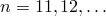) caused by the heat conduction or mass diffusion in the element (internal fluxes). (The specified position for data and output database file requests is ignored.)
.dat: yes    .fil: no    .odb Field: no    .odb History: yes    
**NCURS**

Electrical current at the nodes due to electrical conduction in the element.
.dat: yes    .fil: yes    .odb Field: yes    .odb History: yes    
**FILM**

Current values of film conditions (not available for nonuniform films).
.dat: yes    .fil: yes    .odb Field: no    .odb History: no    
**RAD**

Current values of radiation conditions.
.dat: yes    .fil: yes    .odb Field: no    .odb History: no    
**EVOL**

Current element volume. (Not available for eigenfrequency extraction, eigenvalue buckling prediction, complex eigenfrequency extraction, or linear dynamics procedures. Available only for continuum and structural elements not using general beam or shell section definitions.)
.dat: yes    .fil: yes    .odb Field: yes    .odb History: yes    
**ESOL**

Amount of solute in an element, calculated as the sum of ISOL (amount of solute at an integration point) over all the integration points in the element.
.dat: yes    .fil: yes    .odb Field: yes    .odb History: yes    

#### Enriched elements

**STATUSXFEM**

Status of the enriched element. (The status of an enriched element is 1.0 if the element is completely cracked; 0.0 if the element is not. If the element is partially cracked, the value lies between 1.0 and 0.0.)
.dat: no    .fil: no    .odb Field: yes    .odb History: yes    

**LOADSXFEM**

Distributed pressure loads applied to the XFEM-based crack surface.
.dat: no    .fil: no    .odb Field: yes    .odb History: yes    

#### Enriched elements when the XFEM-based LEFM approach is used

**ENRRTXFEM**

All components of strain energy release rate.
.dat: no    .fil: no    .odb Field: yes    .odb History: yes    

#### Enriched elements in low-cycle fatigue analysis

**CYCLEINIXFEM**

Number of cycles to initialize the crack at the enriched element.
.dat: no    .fil: no    .odb Field: yes    .odb History: yes    

#### Enriched elements with pore-pressure degrees of freedom

**GFVRXFEM**

Gap fluid volume rate of the enriched element.
.dat: no    .fil: no    .odb Field: yes    .odb History: yes    
**PFOPENXFEM**

Fracture opening of the enriched element.
.dat: no    .fil: no    .odb Field: yes    .odb History: yes    
**PORPRES**

Fluid pressure of the enriched element.
.dat: no    .fil: no    .odb Field: yes    .odb History: yes    
**LEAKVRTXFEM**

Leak-off flow rate at the top cracked surface of the enriched element.
.dat: no    .fil: no    .odb Field: yes    .odb History: yes    
**LEAKVRBXFEM**

Leak-off flow rate at the bottom cracked surface of the enriched element.
.dat: no    .fil: no    .odb Field: yes    .odb History: yes    
**ALEAKVRTXFEM**

Accumulated leak-off flow volume at the top cracked surface of the enriched element.
.dat: no    .fil: no    .odb Field: yes    .odb History: yes    
**ALEAKVRBXFEM**

Accumulated leak-off flow volume at the bottom cracked surface of the enriched element.
.dat: no    .fil: no    .odb Field: yes    .odb History: yes    

#### Connector elements

**CTF**

All components of connector total forces and moments.
.dat: yes    .fil: yes    .odb Field: yes    .odb History: yes    
**CTF*n***

Connector total force component *n* ().
.dat: yes    .fil: no    .odb Field: no    .odb History: yes    
**CTM*n***

Connector total moment component *n* ().
.dat: yes    .fil: no    .odb Field: no    .odb History: yes    
**CEF**

All components of connector elastic forces and moments.
.dat: yes    .fil: yes    .odb Field: yes    .odb History: yes    
**CEF*n***

Connector elastic force component *n* ().
.dat: yes    .fil: no    .odb Field: no    .odb History: yes    
**CEM*n***

Connector elastic moment component *n* ().
.dat: yes    .fil: no    .odb Field: no    .odb History: yes    
**CUE**

Elastic displacements and rotations in all directions.
.dat: yes    .fil: yes    .odb Field: yes    .odb History: yes    
**CUE*n***

Elastic displacement in the *n*-direction ().
.dat: yes    .fil: no    .odb Field: no    .odb History: yes    
**CURE*n***

Elastic rotation in the *n*-direction ().
.dat: yes    .fil: no    .odb Field: no    .odb History: yes    
**CUP**

Plastic relative displacements and rotations in all directions.
.dat: yes    .fil: yes    .odb Field: yes    .odb History: yes    
**CUP*n***

Plastic relative displacement in the *n*-direction ().
.dat: yes    .fil: no    .odb Field: no    .odb History: yes    
**CURP*n***

Plastic relative rotation in the *n*-direction ().
.dat: yes    .fil: no    .odb Field: no    .odb History: yes    
**CUPEQ**

Equivalent plastic relative displacements and rotations in all directions.
.dat: yes    .fil: yes    .odb Field: no    .odb History: yes    
**CUPEQ*n***

Equivalent plastic relative displacement in the *n*-direction ().
.dat: yes    .fil: no    .odb Field: no    .odb History: yes    
**CURPEQ*n***

Equivalent plastic relative rotation in the *n*-direction ().
.dat: yes    .fil: no    .odb Field: no    .odb History: yes    
**CUPEQC**

Equivalent plastic relative motion for a coupled plasticity definition.
.dat: yes    .fil: no    .odb Field: no    .odb History: yes    
**CALPHAF**

All components of connector kinematic hardening shift forces and moments.
.dat: yes    .fil: yes    .odb Field: no    .odb History: yes    
**CALPHAF*n***

Connector kinematic hardening shift force component *n* ().
.dat: yes    .fil: no    .odb Field: no    .odb History: yes    
**CALPHAM*n***

Connector kinematic hardening shift moment component *n* ().
.dat: yes    .fil: no    .odb Field: no    .odb History: yes    
**CVF**

All components of connector viscous forces and moments.
.dat: yes    .fil: yes    .odb Field: no    .odb History: yes    
**CVF*n***

Connector viscous force component *n* ().
.dat: yes    .fil: no    .odb Field: no    .odb History: yes    
**CVM*n***

Connector viscous moment component *n* ().
.dat: yes    .fil: no    .odb Field: no    .odb History: yes    
**CSF**

All components of connector friction forces and moments.
.dat: yes    .fil: yes    .odb Field: no    .odb History: yes    
**CSF*n***

Connector friction force component *n* ().
.dat: yes    .fil: no    .odb Field: no    .odb History: yes    
**CSM*n***

Connector friction moment component *n* ().
.dat: yes    .fil: no    .odb Field: no    .odb History: yes    
**CSFC**

Connector friction force in the instantaneous slip direction. Available only if friction is defined in the slip direction.
.dat: yes    .fil: no    .odb Field: no    .odb History: yes    
**CNF**

All components of connector friction-generating contact forces and moments.
.dat: yes    .fil: yes    .odb Field: no    .odb History: yes    
**CNF*n***

Connector friction-generating contact force component *n* ().
.dat: yes    .fil: no    .odb Field: no    .odb History: yes    
**CNM*n***

Connector friction-generating contact moment component *n* ().
.dat: yes    .fil: no    .odb Field: no    .odb History: yes    
**CNFC**

Connector friction-generating contact force in the instantaneous slip direction. Available only if friction is defined in the slip direction.
.dat: yes    .fil: no    .odb Field: no    .odb History: yes    
**CDMG**

All components of the overall damage variable.
.dat: yes    .fil: yes    .odb Field: no    .odb History: yes    
**CDMG*n***

Overall damage variable component *n* ().
.dat: yes    .fil: no    .odb Field: no    .odb History: yes    
**CDMGR*n***

Overall damage variable component *n* ().
.dat: yes    .fil: no    .odb Field: no    .odb History: yes    
**CDIF**

Components of connector force-based damage initiation criterion in all directions.
.dat: yes    .fil: yes    .odb Field: no    .odb History: yes    
**CDIF*n***

Connector force-based damage initiation criterion in the *n*-translation direction ().
.dat: yes    .fil: no    .odb Field: no    .odb History: yes    
**CDIFR*n***

Connector force-based damage initiation criterion in the *n*-rotation direction  ().
.dat: yes    .fil: no    .odb Field: no    .odb History: yes    
**CDIFC**

Connector force-based damage initiation criterion in the instantaneous slip direction.
.dat: yes    .fil: no    .odb Field: no    .odb History: yes    
**CDIM**

Components of connector motion-based damage initiation criterion in all directions.
.dat: yes    .fil: yes    .odb Field: no    .odb History: yes    
**CDIM*n***

Connector motion-based damage initiation criterion in the *n*-translation direction ().
.dat: yes    .fil: no    .odb Field: no    .odb History: yes    
**CDIMR*n***

Connector motion-based damage initiation criterion in the *n*-rotation direction  ().
.dat: yes    .fil: no    .odb Field: no    .odb History: yes    
**CDIMC**

Connector motion-based damage initiation criterion in the instantaneous slip direction.
.dat: yes    .fil: no    .odb Field: no    .odb History: yes    
**CDIP**

Components of connector plastic motion-based damage initiation criterion in all directions.
.dat: yes    .fil: yes    .odb Field: no    .odb History: yes    
**CDIP*n***

Connector plastic motion-based damage initiation criterion in the *n*-translation direction ().
.dat: yes    .fil: no    .odb Field: no    .odb History: yes    
**CDIPR*n***

Connector plastic motion-based damage initiation criterion in the *n*-rotation direction  ().
.dat: yes    .fil: no    .odb Field: no    .odb History: yes    
**CDIPC**

Connector plastic motion-based damage initiation criterion in the instantaneous slip direction.
.dat: yes    .fil: no    .odb Field: no    .odb History: yes    
**CSLST**

All flags for connector stop and connector lock status.
.dat: yes    .fil: yes    .odb Field: no    .odb History: yes    
**CSLST*i***

Flag for connector stop and connector lock status in the *i*-direction ().
.dat: yes    .fil: no    .odb Field: no    .odb History: yes    
**CASU**

Components of accumulated slip in all directions.
.dat: yes    .fil: yes    .odb Field: no    .odb History: yes    
**CASU*n***

Connector accumulated slip in the *n*-direction ().
.dat: yes    .fil: no    .odb Field: no    .odb History: yes    
**CASUR*n***

Connector angular accumulated slip in the *n*-direction  ().
.dat: yes    .fil: no    .odb Field: no    .odb History: yes    
**CASUC**

Connector accumulated slip in the instantaneous slip direction. Available only if friction is defined in the slip direction.
.dat: yes    .fil: no    .odb Field: no    .odb History: yes    
**CIVC**

Connector instantaneous velocity in the slip direction. Available only if friction is defined in the slip direction.
.dat: yes    .fil: yes    .odb Field: no    .odb History: yes    
**CRF**

All components of connector reaction forces and moments.
.dat: yes    .fil: yes    .odb Field: no    .odb History: yes    
**CRF*n***

Connector reaction force component *n* ().
.dat: yes    .fil: no    .odb Field: no    .odb History: yes    
**CRM*n***

Connector reaction moment component *n* ().
.dat: yes    .fil: no    .odb Field: no    .odb History: yes    
**CCF**

All components of connector concentrated forces and moments.
.dat: yes    .fil: yes    .odb Field: no    .odb History: yes    
**CCF*n***

Connector concentrated force component *n* ().
.dat: yes    .fil: no    .odb Field: no    .odb History: yes    
**CCM*n***

Connector concentrated moment component *n* ().
.dat: yes    .fil: no    .odb Field: no    .odb History: yes    
**CP**

Relative positions in all directions.
.dat: yes    .fil: yes    .odb Field: no    .odb History: yes    
**CP*n***

Relative position in the *n*-direction ().
.dat: yes    .fil: no    .odb Field: no    .odb History: yes    
**CPR*n***

Relative angular position in the *n*-direction ().
.dat: yes    .fil: no    .odb Field: no    .odb History: yes    
**CU**

Relative displacements and rotations in all directions.
.dat: yes    .fil: yes    .odb Field: yes    .odb History: yes    
**CU*n***

Relative displacement in the *n*-direction ().
.dat: yes    .fil: no    .odb Field: no    .odb History: yes    
**CUR*n***

Relative rotation in the *n*-direction ().
.dat: yes    .fil: no    .odb Field: no    .odb History: yes    
**CCU**

Constitutive displacements and rotations in all directions.
.dat: yes    .fil: yes    .odb Field: no    .odb History: yes    
**CCU*n***

Constitutive displacement in the *n*-direction ().
.dat: yes    .fil: no    .odb Field: no    .odb History: yes    
**CCUR*n***

Constitutive rotation in the *n*-direction ().
.dat: yes    .fil: no    .odb Field: no    .odb History: yes    
**CV**

Relative velocities in all directions.
.dat: yes    .fil: yes    .odb Field: no    .odb History: yes    
**CV*n***

Relative velocity in the *n*-direction ().
.dat: yes    .fil: no    .odb Field: no    .odb History: yes    
**CVR*n***

Relative angular velocity in the *n*-direction ().
.dat: yes    .fil: no    .odb Field: no    .odb History: yes    
**CA**

Relative accelerations in all directions.
.dat: yes    .fil: yes    .odb Field: no    .odb History: yes    
**CA*n***

Relative acceleration in the *n*-direction ().
.dat: yes    .fil: no    .odb Field: no    .odb History: yes    
**CAR*n***

Relative angular acceleration in the *n*-direction ().
.dat: yes    .fil: no    .odb Field: no    .odb History: yes    
**CFAILST**

All flags for connector failure status.
.dat: yes    .fil: yes    .odb Field: no    .odb History: yes    
**CFAILST*i***

Flag for connector failure status in the *i*-direction ().
.dat: yes    .fil: no    .odb Field: no    .odb History: yes    

### Element face variables

You can request element face variable output to the output database (see ["Element output" in "Output to the output database," Section 4.1.3](pt02ch04s01aus40.md#usb-out-odboutput-elementoutput)). These variables are available only for shell, membrane, and solid elements.

**P**

Uniformly distributed pressure load on element faces, including those imported using the PRESS co-simulation field ID. When the pressure is defined using [*DLOAD](../key/key-link.md#usb-kws-hdload), the variable name is changed automatically to PDLOAD. When the pressure is defined using [*DLOAD](../key/key-link.md#usb-kws-hdload) on shell or membrane elements, Abaqus changes the sign of its value to make it consistent with the pressure defined using [*DSLOAD](../key/key-link.md#usb-kws-hdsload).
.dat: no    .fil: no    .odb Field: yes    .odb History: no    
**HP**

Hydrostatic pressure load on element faces. When the pressure is defined using [*DLOAD](../key/key-link.md#usb-kws-hdload), the variable name is changed automatically to HPDLOAD. When the pressure is defined using [*DLOAD](../key/key-link.md#usb-kws-hdload) on shell or membrane elements, Abaqus changes the sign of its value to make it consistent with the pressure defined using [*DSLOAD](../key/key-link.md#usb-kws-hdsload).
.dat: no    .fil: no    .odb Field: yes    .odb History: no    
**TRNOR**

Normal component (component along face normal) of traction load on element faces.
.dat: no    .fil: no    .odb Field: yes    .odb History: no    
**TRSHR**

Shear component (component along face tangent) of traction load on element faces.
.dat: no    .fil: no    .odb Field: yes    .odb History: no    
**FLUXS**

Uniformly distributed heat fluxes on element faces.
.dat: no    .fil: no    .odb Field: yes    .odb History: no    
**FILMCOEF**

 Reference film coefficient value on element faces.
.dat: no    .fil: no    .odb Field: yes    .odb History: no    
**SINKTEMP**

 Reference sink temperature on element faces.
.dat: no    .fil: no    .odb Field: yes    .odb History: no    

### Whole element energy density variables

The following energy density output variables are written to the restart (`.res`) file and the output database (`.odb`) file (see ["Energy balance," Section 1.5.5 of the Abaqus Theory Guide](../stm/stm-link.md#stm-int-energybalance)):

**ELEDEN**

All energy density components. None of the energies are available in mode-based procedures; a limited number of them are available for direct-solution steady-state dynamic and subspace-based steady-state dynamic analyses. In steady-state dynamics all energy quantities are net per-cycle values, unless otherwise noted.
.dat: no    .fil: no    .odb Field: yes    .odb History: no    
**EKEDEN**

Kinetic energy density in the element. In steady-state dynamic analysis this is the cyclic mean value.
.dat: no    .fil: no    .odb Field: yes    .odb History: yes    
**ESEDEN**

Total elastic strain energy density in the element. When the Mullins effect is modeled with hyperelastic materials, this quantity represents only the recoverable part of energy density in the element. This variable is not available in eigenvalue extraction procedures. In steady-state dynamic analysis this is the cyclic mean value.
.dat: no    .fil: no    .odb Field: yes    .odb History: yes    
**EPDDEN**

Total energy dissipated per unit volume in the element by rate-independent and rate-dependent plastic deformation. Not available for steady-state dynamic analysis.
.dat: no    .fil: no    .odb Field: yes    .odb History: yes    
**ECDDEN**

Total energy dissipated per unit volume in the element by creep, swelling, and viscoelasticity. Not available for steady-state dynamic analysis.
.dat: no    .fil: no    .odb Field: yes    .odb History: yes    
**EVDDEN**

Total energy dissipated per unit volume in the element by viscous effects, not inclusive of energy dissipated through static stabilization or viscoelasticity.
.dat: no    .fil: no    .odb Field: yes    .odb History: yes    
**ESDDEN**

Total energy dissipated per unit volume in the element resulting from static stabilization. Not available for steady-state dynamic analysis.
.dat: no    .fil: no    .odb Field: yes    .odb History: yes    
**ECTEDEN**

Total electrostatic energy density in the element. Not available for steady-state dynamic analysis.
.dat: no    .fil: no    .odb Field: yes    .odb History: yes    
**EASEDEN**

Total “artificial” strain energy density in the element (energy associated with constraints used to remove singular modes, such as hourglass control, and with constraints used to make the drill rotation follow the in-plane rotation of the shell element). Not available for steady-state dynamic analysis.
.dat: no    .fil: no    .odb Field: yes    .odb History: yes    
**EDMDDEN**

Total energy dissipated per unit volume in the element by damage. Not available for steady-state dynamic analysis.
.dat: no    .fil: no    .odb Field: yes    .odb History: yes    

### Whole element error indicator variables

You can request that the following error indicator variables and element average variables be output only to the output database (`.odb`) file (see ["Selection of error indicators influencing adaptive remeshing," Section 12.3.2](pt04ch12s03aus84.md)).

**ENDEN**

Element energy density, including plastic dissipation and creep dissipation if present.
.dat: no    .fil: no    .odb Field: yes    .odb History: no    
**ENDENERI**

Element energy density error indicator, including plastic dissipation error and creep dissipation error if present.
.dat: no    .fil: no    .odb Field: yes    .odb History: no    
**MISESAVG**

Element average Mises equivalent stress.
.dat: no    .fil: no    .odb Field: yes    .odb History: no    
**MISESERI**

Element Mises equivalent stress error indicator.
.dat: no    .fil: no    .odb Field: yes    .odb History: no    
**PEEQAVG**

Element average equivalent plastic strain.
.dat: no    .fil: no    .odb Field: yes    .odb History: no    
**PEEQERI**

Element equivalent plastic strain error indicator.
.dat: no    .fil: no    .odb Field: yes    .odb History: no    
**PEAVG**

Element average plastic strain.
.dat: no    .fil: no    .odb Field: yes    .odb History: no    
**PEERI**

Element plastic strain error indicator.
.dat: no    .fil: no    .odb Field: yes    .odb History: no    
**CEAVG**

Element average creep strain.
.dat: no    .fil: no    .odb Field: yes    .odb History: no    
**CEERI**

Element creep strain error indicator.
.dat: no    .fil: no    .odb Field: yes    .odb History: no    
**HFLAVG**

Element average heat flux.
.dat: no    .fil: no    .odb Field: yes    .odb History: no    
**HFLERI**

Element heat flux error indicator.
.dat: no    .fil: no    .odb Field: yes    .odb History: no    
**EFLAVG**

Element average electric flux.
.dat: no    .fil: no    .odb Field: yes    .odb History: no    
**EFLERI**

Element electric flux error indicator.
.dat: no    .fil: no    .odb Field: yes    .odb History: no    
**EPGAVG**

Element average electric potential gradient.
.dat: no    .fil: no    .odb Field: yes    .odb History: no    
**EPGERI**

Element electric potential gradient error indicator.
.dat: no    .fil: no    .odb Field: yes    .odb History: no    

### Nodal variables

You can request nodal variable output to the data, results, or output database file (see ["Node output" in "Output to the data and results files," Section 4.1.2](pt02ch04s01aus39.md#usb-out-oprintfile-nodaloutput), and ["Node output" in "Output to the output database," Section 4.1.3](pt02ch04s01aus40.md#usb-out-odboutput-nodaloutput)).

**U**

All physical displacement components, including rotations at nodes with rotational degrees of freedom (for output to the output database, only field-type output includes the rotations).
.dat: yes    .fil: yes    .odb Field: yes    .odb History: yes    
**UT**

All translational displacement components.
.dat: no    .fil: no    .odb Field: yes    .odb History: yes    
**UR**

All rotational displacement components.
.dat: no    .fil: no    .odb Field: yes    .odb History: yes    
**U*n***

 displacement component ().
.dat: yes    .fil: no    .odb Field: no    .odb History: yes    
**UR*n***

 rotation component ().
.dat: yes    .fil: no    .odb Field: no    .odb History: yes    
**WARP**

Warping magnitude. Available only for open-section beam elements.
.dat: yes    .fil: no    .odb Field: no    .odb History: yes    
**V**

All velocity components, including rotational velocities at nodes with rotational degrees of freedom (for output to the output database, only field-type output includes the rotational velocities).
.dat: yes    .fil: yes    .odb Field: yes    .odb History: yes    
**VT**

All translational velocity components.
.dat: no    .fil: no    .odb Field: yes    .odb History: yes    
**VR**

All rotational velocity components.
.dat: no    .fil: no    .odb Field: yes    .odb History: yes    
**V*n***

 velocity component ().
.dat: yes    .fil: no    .odb Field: no    .odb History: yes    
**VR*n***

 rotational velocity component ().
.dat: yes    .fil: no    .odb Field: no    .odb History: yes    
**A**

All acceleration components, including rotational accelerations at nodes with rotational degrees of freedom (for output to the output database, only field-type output includes the rotational accelerations).
.dat: yes    .fil: yes    .odb Field: yes    .odb History: yes    
**AT**

All translational acceleration components.
.dat: no    .fil: no    .odb Field: yes    .odb History: yes    
**AR**

All rotational acceleration components.
.dat: no    .fil: no    .odb Field: yes    .odb History: yes    
**A*n***

 acceleration component ().
.dat: yes    .fil: no    .odb Field: no    .odb History: yes    
**AR*n***

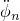 rotational acceleration component ().
.dat: yes    .fil: no    .odb Field: no    .odb History: yes    
**POR**

Pore or acoustic pressure at a node.
.dat: yes    .fil: yes    .odb Field: yes    .odb History: yes    
**CFF**

Concentrated fluid flow at a node, including those imported using the CFLOW co-simulation field ID.
.dat: yes    .fil: yes    .odb Field: yes    .odb History: yes    
**NT**

All temperature values at a node, including those imported using the TEMP co-simulation field ID. These will be the temperatures defined as degrees of freedom if heat transfer elements are connected to the node, or predefined temperatures if the node is connected only to stress or mass diffusion elements without temperature degrees of freedom.
.dat: yes    .fil: yes    .odb Field: yes    .odb History: yes    
**NT*n***

Temperature degree of freedom *n* at a node ().
.dat: yes    .fil: no    .odb Field: no    .odb History: yes    
**EPOT**

All electrical potential degrees of freedom at a node.
.dat: yes    .fil: yes    .odb Field: yes    .odb History: yes    
**NNC**

All normalized concentration values at a node.
.dat: yes    .fil: yes    .odb Field: yes    .odb History: yes    
**NNC*n***

Normalized concentration degree of freedom *n* at a node ().
.dat: yes    .fil: no    .odb Field: no    .odb History: yes    
**RF**

All components of reaction forces, including components of reaction moments at nodes with rotational degrees of freedom (conjugate to prescribed displacements and rotations). For output to the output database, only the field-type output includes the components of reaction moments at nodes with rotational degrees of freedom.
.dat: yes    .fil: yes    .odb Field: yes    .odb History: yes    
**RT**

All reaction force components.
.dat: no    .fil: no    .odb Field: yes    .odb History: yes    
**RM**

All reaction moment components.
.dat: no    .fil: no    .odb Field: yes    .odb History: yes    
**RF*n***

Reaction force component *n* () (conjugate to prescribed displacement ).
.dat: yes    .fil: no    .odb Field: no    .odb History: yes    
**RM*n***

Reaction moment component *n* () (conjugate to prescribed rotation ).
.dat: yes    .fil: no    .odb Field: no    .odb History: yes    
**RWM**

Reaction bimoment in degree of freedom 7, conjugate to prescribed warping amplitude. Available only for open-section beam elements.
.dat: yes    .fil: no    .odb Field: no    .odb History: yes    
**CF**

All components of point loads and concentrated moments, including loads imported using the CF co-simulation field ID.
.dat: yes    .fil: yes    .odb Field: yes    .odb History: yes    
**CF*n***

Point load component *n* ().
.dat: yes    .fil: no    .odb Field: no    .odb History: yes    
**CM*n***

Point moment component *n* ().
.dat: yes    .fil: no    .odb Field: no    .odb History: yes    
**CW**

Load component in degree of freedom 7. Available only for open-section beam elements.
.dat: yes    .fil: no    .odb Field: no    .odb History: yes    
**TF**

All components of total forces, including components of total moments at nodes with rotational degrees of freedom. Total force is the sum of the reaction force and point loads. For output to the output database, only the field-type output includes the components of total moments at nodes with rotational degrees of freedom.
.dat: yes    .fil: yes    .odb Field: yes    .odb History: yes    
**TF*n***

Total force component *n* ().
.dat: yes    .fil: no    .odb Field: no    .odb History: yes    
**TM*n***

Total moment component *n* ().
.dat: yes    .fil: no    .odb Field: no    .odb History: yes    
**VF**

All components of viscous forces and moments due to static stabilization.
.dat: yes    .fil: yes    .odb Field: yes    .odb History: yes    
**VF*n***

 Stabilization viscous force component *n* ().
.dat: yes    .fil: no    .odb Field: no    .odb History: yes    
**VM*n***

 Stabilization viscous moment component *n* ().
.dat: yes    .fil: no    .odb Field: no    .odb History: yes    
**COORD**

Coordinates of the node. These are the current coordinates if the large-displacement formulation is being used.
.dat: yes    .fil: yes    .odb Field: yes    .odb History: yes    
**COOR*n***

Coordinate *n* ().
.dat: yes    .fil: no    .odb Field: no    .odb History: yes    
**STRAINFREE**

Strain-free adjustments to initial nodal positions (adjusted position minus unadjusted position; only written to the output database (.`odb`) file for the original field output frame at zero time).
.dat: no    .fil: no    .odb Field: yes    .odb History: no    
**RCHG**

Reactive electrical nodal charge (conjugate to prescribed electrical potential).
.dat: yes    .fil: yes    .odb Field: yes    .odb History: yes    
**CECHG**

Concentrated electrical nodal charge.
.dat: yes    .fil: yes    .odb Field: yes    .odb History: yes    
**RECUR**

Reactive electrical nodal current (conjugate to prescribed electrical potential).
.dat: yes    .fil: yes    .odb Field: yes    .odb History: yes    
**CECUR**

Concentrated electrical nodal current.
.dat: yes    .fil: yes    .odb Field: yes    .odb History: yes    
**PCAV**

Hydrostatic fluid gauge pressure (total pressure = ambient pressure + hydrostatic fluid gauge pressure).
.dat: yes    .fil: yes    .odb Field: no    .odb History: yes    
**CVOL**

Hydrostatic fluid cavity volume.
.dat: yes    .fil: yes    .odb Field: no    .odb History: yes    
**MOT**

All components of motion in cavity radiation heat transfer analysis.
.dat: yes    .fil: yes    .odb Field: yes    .odb History: yes    
**MOT*n***

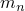 motion component () in cavity radiation heat transfer analysis.
.dat: yes    .fil: no    .odb Field: no    .odb History: yes    

#### Acoustic quantities

**POR**

Acoustic pressure.
.dat: yes    .fil: yes    .odb Field: yes    .odb History: yes    
**INFR**

Acoustic infinite element “radius,” used in the coordinate map for these elements. Available only if the steady-state dynamic procedure is used, and available only for nodes attached to acoustic infinite elements.
.dat: no    .fil: no    .odb Field: yes    .odb History: no    
**INFC**

Acoustic infinite element “cosine,” used in the coordinate map for these elements. Available only if the steady-state dynamic procedure is used, and available only for nodes attached to acoustic infinite elements.
.dat: no    .fil: no    .odb Field: yes    .odb History: no    
**INFN**

Acoustic infinite element normal vector. Available only if the steady-state dynamic procedure is used, and available only for nodes attached to acoustic infinite elements.
.dat: no    .fil: no    .odb Field: yes    .odb History: no    
**PINF**

Acoustic pressure coefficients for the higher-order basis functions in acoustic infinite elements. Available only if the steady-state dynamic procedure is used, and available only for acoustic infinite elements.
.dat: no    .fil: no    .odb Field: yes    .odb History: no    
**SPL**

Acoustic sound pressure level at a node.
.dat: no    .fil: no    .odb Field: yes    .odb History: yes    

#### Enriched element quantities

**PHILSM**

Signed distance function to describe the crack surface.
.dat: no    .fil: no    .odb Field: yes    .odb History: yes    
**PSILSM**

Signed distance function to describe the initial crack front.
.dat: no    .fil: no    .odb Field: yes    .odb History: yes    

#### Heat or mass flux

The following variables correspond to heat flux in temperature analyses or concentration volumetric flux in mass diffusion analysis:
**RFL**

All reaction flux values (conjugate to prescribed temperature or normalized concentration).
.dat: yes    .fil: yes    .odb Field: yes    .odb History: yes    
**RFL*n***

Reaction flux value *n* at a node () (conjugate to prescribed temperature or normalized concentration).
.dat: yes    .fil: no    .odb Field: no    .odb History: yes    
**CFL**

All concentrated flux values, including those imported using the CFL co-simulation field ID.
.dat: yes    .fil: yes    .odb Field: yes    .odb History: yes    
**CFL*n***

Concentrated flux values *n* at a node ().
.dat: yes    .fil: no    .odb Field: no    .odb History: yes    
**RFLE**

The total flux at the node (including flux convected through the node in convection elements), excluding external fluxes (due to concentrated fluxes, distributed fluxes, film conditions, radiation conditions, and radiation view factors). The value of RFLE is, thus, equal and opposite to the sum of all applied fluxes.
.dat: yes    .fil: yes    .odb Field: yes    .odb History: yes    
**RFLE*n***

Flux value *n* excluding externally applied flux loads at a node ().
.dat: yes    .fil: no    .odb Field: no    .odb History: yes    

#### Steady-state dynamic analysis

The following variables are available only for steady-state (frequency domain) dynamic analyses (modal and direct). These variables include both magnitude and phase angle for all components. Phase angles are given in degrees. In the data file there are two lines of output for each request. The first line contains the magnitude, and the second line (indicated by the SSD footnote) contains the phase angle. In the results file, the magnitudes of all components are first, followed by the phase angles of all components. 
**PU**

Magnitude and phase angle of all displacement components at the node and magnitude and phase angle of the rotations at nodes with rotational degrees of freedom.
.dat: yes    .fil: yes    .odb Field: no    .odb History: no    
**PU*n***

Magnitude and phase angle of component *n* of the displacement ().
.dat: yes    .fil: no    .odb Field: no    .odb History: no    
**PUR*n***

Magnitude and phase angle of component *n* of the rotation ().
.dat: yes    .fil: no    .odb Field: no    .odb History: no    
**PPOR**

Magnitude and phase angle of the fluid, pore, or acoustic pressure at the node.
.dat: yes    .fil: yes    .odb Field: no    .odb History: no    
**PHPOT**

Magnitude and phase angle of the electrical potential at the node.
.dat: yes    .fil: yes    .odb Field: no    .odb History: no    
**PRF**

Magnitude and phase angle of the reaction forces at the node and of the reaction moments at nodes with rotational degrees of freedom.
.dat: yes    .fil: yes    .odb Field: no    .odb History: no    
**PRF*n***

Magnitude and phase angle of component *n* of the reaction force ().
.dat: yes    .fil: no    .odb Field: no    .odb History: no    
**PRM*n***

Magnitude and phase angle of component *n* of the reaction moment ().
.dat: yes    .fil: no    .odb Field: no    .odb History: no    
**PHCHG**

Magnitude and phase angle of the reactive charge at the node.
.dat: yes    .fil: yes    .odb Field: no    .odb History: no    

#### Modal dynamic, steady-state, and random response analysis

The following variables are available only for modal dynamic, steady-state (frequency domain), and random response analyses. “Relative” values are measured relative to the motion of the primary base and are obtained with the identifiers *U*, *V*, and *A*; “Total” values include the motion of the primary base. For steady-state dynamic output printed to the data file, there are two lines printed for each request; the first line contains the real part of the variable, and the second line (indicated by the SSD footnote) contains the imaginary part.
**TU**

All components of the total displacements at the node and of the total rotations at nodes with rotational degrees of freedom.
.dat: yes    .fil: yes    .odb Field: yes    .odb History: yes    
**TU*n***

Component *n* of the total displacement ().
.dat: yes    .fil: no    .odb Field: no    .odb History: yes    
**TUR*n***

Component *n* of the total rotation ().
.dat: yes    .fil: no    .odb Field: no    .odb History: yes    
**TV**

All components of the total velocity at the node, including rotational velocities at nodes with rotational degrees of freedom.
.dat: yes    .fil: yes    .odb Field: yes    .odb History: yes    
**TV*n***

Component *n* of the total velocity ().
.dat: yes    .fil: no    .odb Field: no    .odb History: yes    
**TVR*n***

Component *n* of the total rate of rotation ().
.dat: yes    .fil: no    .odb Field: no    .odb History: yes    
**TA**

All components of the total acceleration at the node, including rotational accelerations at nodes with rotational degrees of freedom.
.dat: yes    .fil: yes    .odb Field: yes    .odb History: yes    
**TA*n***

Component *n* of the total acceleration ().
.dat: yes    .fil: no    .odb Field: no    .odb History: yes    
**TAR*n***

Component *n* of the total rotational acceleration ().
.dat: yes    .fil: no    .odb Field: no    .odb History: yes    

#### Mode-based steady-state dynamic analysis

The following variables are available only for steady-state (frequency domain) dynamic analysis based on modal superposition. “Total” values include the base motion.
**PTU**

Magnitude and phase angle of the total displacement components at the node and magnitude and phase angle of the total rotations at nodes with rotational degrees of freedom.
.dat: yes    .fil: yes    .odb Field: no    .odb History: no    
**PTU*n***

Magnitude and phase angle of component *n* of the total displacement ().
.dat: yes    .fil: no    .odb Field: no    .odb History: no    
**PTUR*n***

Magnitude and phase angle of component *n* of the total rotation ().
.dat: yes    .fil: no    .odb Field: no    .odb History: no    

#### Pore pressure analysis

The following variables correspond to fluid volume flux in pore pressure analyses.
**RVF**

Reaction fluid volume flux due to prescribed pressure. This flux is the rate at which fluid volume is entering or leaving the model through the node to maintain the prescribed pressure boundary condition. A positive value of RVF indicates fluid is entering the model.
.dat: yes    .fil: yes    .odb Field: yes    .odb History: yes    
**RVT**

Reaction total fluid volume (computed only in a transient coupled pore fluid diffusion/stress analysis). This value is the time integrated value of RVF.
.dat: yes    .fil: yes    .odb Field: yes    .odb History: yes    

#### Random response analysis

The following variables are available only for random response dynamic analysis. “Relative” values are measured relative to the base motion; “Total” values include the base motion.
**RU**

Root mean square values of all components of the relative displacement at the node and of the components of rotation at nodes with rotational degrees of freedom.
.dat: yes    .fil: yes    .odb Field: yes    .odb History: yes    
**RU*n***

Root mean square value of component *n* of the relative displacement ().
.dat: yes    .fil: no    .odb Field: no    .odb History: yes    
**RUR*n***

Root mean square value of component *n* of the relative rotation ().
.dat: yes    .fil: no    .odb Field: no    .odb History: yes    
**RTU**

Root mean square values of all components of the total displacement at the node and of the components of total rotation at nodes with rotational degrees of freedom.
.dat: yes    .fil: yes    .odb Field: yes    .odb History: yes    
**RTU*n***

Root mean square value of component *n* of the total displacement ().
.dat: yes    .fil: no    .odb Field: no    .odb History: yes    
**RTUR*n***

Root mean square value of component *n* of the total rotation ().
.dat: yes    .fil: no    .odb Field: no    .odb History: yes    
**RV**

Root mean square values of all components of the relative velocity at the node and of the components of the rate of rotation at nodes with rotational degrees of freedom.
.dat: yes    .fil: yes    .odb Field: yes    .odb History: yes    
**RV*n***

Root mean square value of component *n* of the relative velocity ().
.dat: yes    .fil: no    .odb Field: no    .odb History: yes    
**RVR*n***

Root mean square value of component *n* of the relative rate of rotation ().
.dat: yes    .fil: no    .odb Field: no    .odb History: yes    
**RTV**

Root mean square values of all components of the total velocity at the node and of the components of total rotation at nodes with rotational degrees of freedom.
.dat: yes    .fil: yes    .odb Field: yes    .odb History: yes    
**RTV*n***

Root mean square value of component *n* of the total velocity ().
.dat: yes    .fil: no    .odb Field: no    .odb History: yes    
**RTVR*n***

Root mean square value of component *n* of the total rate of rotation ().
.dat: yes    .fil: no    .odb Field: no    .odb History: yes    
**RA**

Root mean square values of all components of the relative acceleration at the node and of the components of rotational acceleration at nodes with rotational degrees of freedom.
.dat: yes    .fil: yes    .odb Field: yes    .odb History: yes    
**RA*n***

Root mean square value of component *n* of the relative acceleration ().
.dat: yes    .fil: no    .odb Field: no    .odb History: yes    
**RAR*n***

Root mean square value of component *n* of the relative rotational acceleration ().
.dat: yes    .fil: no    .odb Field: no    .odb History: yes    
**RTA**

Root mean square values of all components of the total acceleration at the node and of the components of rotational acceleration at nodes with rotational degrees of freedom.
.dat: yes    .fil: yes    .odb Field: yes    .odb History: yes    
**RTA*n***

Root mean square value of component *n* of the total value of acceleration ().
.dat: yes    .fil: no    .odb Field: no    .odb History: yes    
**RTAR*n***

Root mean square value of component *n* of the total rotational acceleration ().
.dat: yes    .fil: no    .odb Field: no    .odb History: yes    
**RRF**

Root mean square values of all components of the reaction forces and of reaction moments at nodes with rotational degrees of freedom.
.dat: yes    .fil: yes    .odb Field: yes    .odb History: yes    
**RRF*n***

Root mean square value of component *n* of the reaction force ().
.dat: yes    .fil: no    .odb Field: no    .odb History: yes    
**RRM*n***

Root mean square value of component *n* of the reaction moment ().
.dat: yes    .fil: no    .odb Field: no    .odb History: yes    

### Modal variables

You can request modal variable output to the data, results, or output database file (see ["Modal output from Abaqus/Standard" in "Output to the data and results files," Section 4.1.2](pt02ch04s01aus39.md#usb-out-oprintfile-modal), and ["Modal output from Abaqus/Standard" in "Output to the output database," Section 4.1.3](pt02ch04s01aus40.md#usb-out-odboutput-modal)). In steady-state dynamics GU, etc. provide the amplitude of the mode.

**GU**

Generalized displacements for all modes.
.dat: yes    .fil: yes    .odb Field: no    .odb History: yes    
**GU*n***

Generalized displacement for mode *n*.
.dat: yes    .fil: no    .odb Field: no    .odb History: yes    
**GV**

Generalized velocities for all modes.
.dat: yes    .fil: yes    .odb Field: no    .odb History: yes    
**GV*n***

Generalized velocity for mode *n*.
.dat: yes    .fil: no    .odb Field: no    .odb History: yes    
**GA**

Generalized acceleration for all modes.
.dat: yes    .fil: yes    .odb Field: no    .odb History: yes    
**GA*n***

Generalized acceleration for mode *n*.
.dat: yes    .fil: no    .odb Field: no    .odb History: yes    
**GPU**

Phase angle of generalized displacements for all modes.
.dat: yes    .fil: yes    .odb Field: no    .odb History: yes    
**GPU*n***

Phase angle of generalized displacement for mode *n*.
.dat: yes    .fil: no    .odb Field: no    .odb History: yes    
**GPV**

Phase angle of generalized velocities for all modes.
.dat: yes    .fil: yes    .odb Field: no    .odb History: yes    
**GPV*n***

Phase angle of generalized velocity for mode *n*.
.dat: yes    .fil: no    .odb Field: no    .odb History: yes    
**GPA**

Phase angle of generalized acceleration for all modes.
.dat: yes    .fil: yes    .odb Field: no    .odb History: yes    
**GPA*n***

Phase angle of generalized acceleration for mode *n*.
.dat: yes    .fil: no    .odb Field: no    .odb History: yes    
**SNE**

Elastic strain energy for the entire model per each mode (not available for random response analysis).
.dat: yes    .fil: yes    .odb Field: no    .odb History: yes    
**SNE*n***

Elastic strain energy for the entire model for mode *n* (not available for random response analysis).
.dat: yes    .fil: no    .odb Field: no    .odb History: yes    
**KE**

Kinetic energy for the entire model per each mode (not available for random response analysis).
.dat: yes    .fil: yes    .odb Field: no    .odb History: yes    
**KE*n***

Kinetic energy for the entire model for mode *n* (not available for random response analysis).
.dat: yes    .fil: no    .odb Field: no    .odb History: yes    
**T**

External work for the entire model per each mode (not available for random response analysis).
.dat: yes    .fil: yes    .odb Field: no    .odb History: yes    
**T*n***

External work for the entire model for mode *n* (not available for random response analysis).
.dat: yes    .fil: no    .odb Field: no    .odb History: yes    
**BM**

Base motion (not available for random response or response spectrum analyses).
.dat: yes    .fil: yes    .odb Field: no    .odb History: yes    

### Surface variables

You can request surface variable output to the data, results, or output database file (see ["Surface output from Abaqus/Standard" in "Output to the data and results files," Section 4.1.2](pt02ch04s01aus39.md#usb-out-oprintfile-surface), and ["Surface output in Abaqus/Standard and Abaqus/Explicit" in "Output to the output database," Section 4.1.3](pt02ch04s01aus40.md#usb-out-odboutput-surface)). Additional information on these variables is provided in ["Defining contact pairs in Abaqus/Standard," Section 36.3.1](pt09ch36s03aus145.md), and [Chapter 37, "Contact Property Models](pt09ch37.md).” The letter “M” at the end of an output variable identifier designates the magnitude of the variable. Those variables that are output on both master and slave surfaces in a single master-slave contact pair are designated below. For exceptions to output on the master surface, see ["Defining contact pairs in Abaqus/Standard," Section 36.3.1](pt09ch36s03aus145.md). 

#### Mechanical analysis--nodal quantities

**CSTRESS**

Contact pressure (CPRESS) and frictional shear stresses (CSHEAR). Output is also available on the master surface to the `.odb` file in a single master-slave setting.
.dat: yes    .fil: yes    .odb Field: yes    .odb History: yes    
**CSTRESSETOS**

Contact pressure (CPRESSETOS) and frictional shear stresses (CSHEARETOS) due to edge-to-surface contact constraints. Output is also available on the master surface to the `.odb` file in a single master-slave setting.
.dat: no    .fil: no    .odb Field: yes    .odb History: no    
**CSTRESSERI**

Error indicators for the contact pressure (CPRESSERI) and frictional shear stresses (CSHEARERI). Output is also available on the master surface to the `.odb` file in a single master-slave setting.
.dat: no    .fil: no    .odb Field: yes    .odb History: no    
**CDSTRESS**

Viscous pressure (CDPRESS) and viscous shear stresses (CDSHEAR). Output is also available on the master surface to the `.odb` file in a single master-slave setting.
.dat: yes    .fil: yes    .odb Field: yes    .odb History: yes    
**CDISP**

Contact opening (COPEN) and relative tangential motions (CSLIP).
.dat: yes    .fil: yes    .odb Field: yes    .odb History: yes    
**CDISPETOS**

Contact opening (COPENETOS) and relative tangential motions (CSLIPETOS) for edge-to-surface contact constraints.
.dat: no    .fil: no    .odb Field: yes    .odb History: no    
**CFORCE**

Contact normal force (CNORMF) and frictional shear force (CSHEARF). Output is also available on the master surface to the `.odb` file in a single master-slave setting.
.dat: no    .fil: no    .odb Field: yes    .odb History: no    
**CLINELOAD**

Contact load due to line contact from edge-to-surface and radial edge-to-edge constraints in units of force per length. The normal (CLINELOADN) and frictional shear (CLINELOADT) components are available only for general contact to the `.odb` file.
.dat: no    .fil: no    .odb Field: yes    .odb History: no    
**CNAREA**

Contact nodal area. Output is also available on the master surface to the `.odb` file in a single master-slave setting.
.dat: no    .fil: no    .odb Field: yes    .odb History: no    
**CPOINTLOAD**

Contact load in units of force due to point contact from edge-to-edge constraints using the cross formulation. The normal (CPOINTLOADN) and frictional shear (CPOINTLOADT) components are available only for general contact to the `.odb` file.
.dat: no    .fil: no    .odb Field: yes    .odb History: no    
**CRKDISP**

Crack opening and relative tangential motions on cracked surfaces in enriched elements.
.dat: no    .fil: no    .odb Field: yes    .odb History: yes    
**CSTATUS**

Contact status. Output is also available on the master surface to the `.odb` file in a single master-slave setting.
.dat: no    .fil: no    .odb Field: yes    .odb History: no    
**CSMAXSCRT**

Maximum stress-based damage initiation criterion for cohesive surfaces. 
.dat: no    .fil: no    .odb Field: yes    .odb History: yes    
**CSQUADSCRT**

Quadratic stress-based damage initiation criterion for cohesive surfaces. 
.dat: no    .fil: no    .odb Field: yes    .odb History: yes    
**CSMAXUCRT**

Maximum separation-based damage initiation criterion for cohesive surfaces. 
.dat: no    .fil: no    .odb Field: yes    .odb History: yes    
**CSQUADUCRT**

Quadratic separation-based damage initiation criterion for cohesive surfaces. 
.dat: no    .fil: no    .odb Field: yes    .odb History: yes    
**CSDMG**

Damage variable for cohesive surfaces or for cracked surfaces in enriched elements.
.dat: no    .fil: no    .odb Field: yes    .odb History: yes    
**PPRESS**

Fluid pressure for pressure penetration analysis.
.dat: yes    .fil: yes    .odb Field: yes    .odb History: yes    
**SDV**

Solution-dependent state variables.
.dat: yes    .fil: yes    .odb Field: yes    .odb History: yes    

#### Mechanical analysis--whole surface quantities

**CFN**

Total force due to contact pressure (CFN*n*, *n* = 1, 2, 3).
.dat: yes    .fil: yes    .odb Field: no    .odb History: yes    
**CFNM**

Magnitude of total force due to contact pressure.
.dat: no    .fil: no    .odb Field: no    .odb History: yes    
**CFS**

Total force due to frictional stress (CFS*n*, *n* = 1, 2, 3).
.dat: yes    .fil: yes    .odb Field: no    .odb History: yes    
**CFSM**

Magnitude of total force due to frictional stress.
.dat: no    .fil: no    .odb Field: no    .odb History: yes    
**CFT**

Total force due to contact pressure and frictional stress (CFT*n*, * n* = 1, 2, 3).
.dat: yes    .fil: yes    .odb Field: no    .odb History: yes    
**CFTM**

Magnitude of total force due to contact pressure and frictional stress.
.dat: no    .fil: no    .odb Field: no    .odb History: yes    
**CMN**

Total moment about the origin due to contact pressure (CMN*n*, *n* = 1, 2, 3).
.dat: yes    .fil: yes    .odb Field: no    .odb History: yes    
**CMNM**

Magnitude of total moment about origin due to contact pressure.
.dat: no    .fil: no    .odb Field: no    .odb History: yes    
**CMS**

Total moment about the origin due to frictional stress (CMS*n*, *n* = 1, 2, 3).
.dat: yes    .fil: yes    .odb Field: no    .odb History: yes    
**CMSM**

Magnitude of total moment about the origin due to frictional stress.
.dat: no    .fil: no    .odb Field: no    .odb History: yes    
**CMT**

Total moment about the origin due to contact pressure and frictional stress (CMT*n*, *n* = 1, 2, 3).
.dat: yes    .fil: yes    .odb Field: no    .odb History: yes    
**CMTM**

Magnitude of total moment about the origin due to contact pressure and frictional stress.
.dat: no    .fil: no    .odb Field: no    .odb History: yes    
**CAREA**

Total area in contact.
.dat: yes    .fil: yes    .odb Field: no    .odb History: yes    
**CTRQ**

Maximum torque that can be transmitted about the *z*-axis by a contact surface in an axisymmetric analysis with a friction coefficient of unity.
.dat: yes    .fil: yes    .odb Field: no    .odb History: yes    
**XN**

Center of the total force due to contact pressure (XN*n*, *n* = 1, 2, 3).
.dat: yes    .fil: yes    .odb Field: no    .odb History: yes    
**XS**

Center of the total force due to frictional stress (XS*n*, *n* = 1, 2, 3).
.dat: yes    .fil: yes    .odb Field: no    .odb History: yes    
**XT**

Center of the total force due to contact pressure and frictional stress (XT*n*, *n* = 1, 2, 3).
.dat: yes    .fil: yes    .odb Field: no    .odb History: yes    

#### Heat transfer analysis

**HFL**

Heat flux per unit area leaving the slave surface.
.dat: yes    .fil: yes    .odb Field: yes    .odb History: yes    
**HFLA**

HFL multiplied by the nodal area.
.dat: yes    .fil: yes    .odb Field: yes    .odb History: yes    
**HTL**

Time integrated HFL.
.dat: yes    .fil: yes    .odb Field: yes    .odb History: yes    
**HTLA**

Time integrated HFLA.
.dat: yes    .fil: yes    .odb Field: yes    .odb History: yes    

#### Coupled thermal-electrical analysis

**ECD**

Electrical current per unit area.
.dat: yes    .fil: yes    .odb Field: yes    .odb History: yes    
**ECDA**

ECD multiplied by the nodal area.
.dat: yes    .fil: yes    .odb Field: yes    .odb History: yes    
**ECDT**

Time integrated ECD.
.dat: yes    .fil: yes    .odb Field: yes    .odb History: yes    
**ECDTA**

Time integrated ECDA.
.dat: yes    .fil: yes    .odb Field: yes    .odb History: yes    
**HFL**

Heat flux per unit area leaving the slave surface.
.dat: yes    .fil: yes    .odb Field: yes    .odb History: yes    
**HFLA**

HFL multiplied by the nodal area.
.dat: yes    .fil: yes    .odb Field: yes    .odb History: yes    
**HTL**

Time integrated HFL.
.dat: yes    .fil: yes    .odb Field: yes    .odb History: yes    
**HTLA**

Time integrated HFLA.
.dat: yes    .fil: yes    .odb Field: yes    .odb History: yes    
**SJD**

Heat flux per unit area due to electrical current.
.dat: yes    .fil: yes    .odb Field: yes    .odb History: yes    
**SJDA**

SJD multiplied by the nodal area.
.dat: yes    .fil: yes    .odb Field: yes    .odb History: yes    
**SJDT**

Time integrated SJD.
.dat: yes    .fil: yes    .odb Field: yes    .odb History: yes    
**SJDTA**

Time integrated SJDA.
.dat: yes    .fil: yes    .odb Field: yes    .odb History: yes    
**WEIGHT**

Weighting factor for heat distribution between the interface surfaces.
.dat: yes    .fil: yes    .odb Field: yes    .odb History: yes    

#### Fully coupled temperature-displacement analysis

**HFL**

Heat flux per unit area leaving the slave surface.
.dat: yes    .fil: yes    .odb Field: yes    .odb History: yes    
**HFLA**

HFL multiplied by the nodal area.
.dat: yes    .fil: yes    .odb Field: yes    .odb History: yes    
**HTL**

Time integrated HFL.
.dat: yes    .fil: yes    .odb Field: yes    .odb History: yes    
**HTLA**

Time integrated HFLA.
.dat: yes    .fil: yes    .odb Field: yes    .odb History: yes    
**SFDR**

Heat flux per unit area due to frictional dissipation.
.dat: yes    .fil: yes    .odb Field: yes    .odb History: yes    
**SFDRA**

SFDR multiplied by the nodal area.
.dat: yes    .fil: yes    .odb Field: yes    .odb History: yes    
**SFDRT**

Time integrated SFDR.
.dat: yes    .fil: yes    .odb Field: yes    .odb History: yes    
**SFDRTA**

Time integrated SFDRA.
.dat: yes    .fil: yes    .odb Field: yes    .odb History: yes    
**WEIGHT**

Weighting factor for heat distribution between the interface surfaces.
.dat: yes    .fil: yes    .odb Field: yes    .odb History: yes    

#### Fully coupled thermal-electrical-structural analysis

**ECD**

Electrical current per unit area.
.dat: yes    .fil: yes    .odb Field: yes    .odb History: yes    
**ECDA**

ECD multiplied by the nodal area.
.dat: yes    .fil: yes    .odb Field: yes    .odb History: yes    
**ECDT**

Time integrated ECD.
.dat: yes    .fil: yes    .odb Field: yes    .odb History: yes    
**ECDTA**

Time integrated ECDA.
.dat: yes    .fil: yes    .odb Field: yes    .odb History: yes    
**HFL**

Heat flux per unit area leaving the slave surface.
.dat: yes    .fil: yes    .odb Field: yes    .odb History: yes    
**HFLA**

HFL multiplied by the nodal area.
.dat: yes    .fil: yes    .odb Field: yes    .odb History: yes    
**HTL**

Time integrated HFL.
.dat: yes    .fil: yes    .odb Field: yes    .odb History: yes    
**HTLA**

Time integrated HFLA.
.dat: yes    .fil: yes    .odb Field: yes    .odb History: yes    
**SFDR**

Heat flux per unit area due to frictional dissipation.
.dat: yes    .fil: yes    .odb Field: yes    .odb History: yes    
**SFDRA**

SFDR multiplied by the nodal area.
.dat: yes    .fil: yes    .odb Field: yes    .odb History: yes    
**SFDRT**

Time integrated SFDR.
.dat: yes    .fil: yes    .odb Field: yes    .odb History: yes    
**SFDRTA**

Time integrated SFDRA.
.dat: yes    .fil: yes    .odb Field: yes    .odb History: yes    
**SJD**

Heat flux per unit area due to electrical current.
.dat: yes    .fil: yes    .odb Field: yes    .odb History: yes    
**SJDA**

SJD multiplied by the nodal area.
.dat: yes    .fil: yes    .odb Field: yes    .odb History: yes    
**SJDT**

Time integrated SJD.
.dat: yes    .fil: yes    .odb Field: yes    .odb History: yes    
**SJDTA**

Time integrated SJDA.
.dat: yes    .fil: yes    .odb Field: yes    .odb History: yes    
**WEIGHT**

Weighting factor for heat distribution between the interface surfaces.
.dat: yes    .fil: yes    .odb Field: yes    .odb History: yes    

#### Coupled pore fluid-mechanical analysis--nodal quantities

**PFL**

Pore fluid volume flux per unit area leaving the slave surface.
.dat: yes    .fil: yes    .odb Field: yes    .odb History: yes    
**PFLA**

PFL multiplied by the nodal area.
.dat: yes    .fil: yes    .odb Field: yes    .odb History: yes    
**PTL**

Time integrated PFL.
.dat: yes    .fil: yes    .odb Field: yes    .odb History: yes    
**PTLA**

Time integrated PFLA.
.dat: yes    .fil: yes    .odb Field: yes    .odb History: yes    

#### Coupled pore fluid-mechanical analysis--whole surface quantities

**TPFL**

Total pore fluid volume flux leaving the slave surface.
.dat: yes    .fil: yes    .odb Field: no    .odb History: no    
**TPTL**

Time integrated TPFL.
.dat: yes    .fil: yes    .odb Field: no    .odb History: no    

#### Bond failure quantities

**DBT**

Time when bond failure occurs.
.dat: yes    .fil: yes    .odb Field: yes    .odb History: yes    
**DBS**

All components of remaining stress in the failed bond.
.dat: yes    .fil: yes    .odb Field: yes    .odb History: yes    
**DBSF**

Fraction of stress that remains at bond failure.
.dat: yes    .fil: yes    .odb Field: yes    .odb History: yes    
**BDSTAT**

Bond state (varies from 1.0 to 0.0).
.dat: yes    .fil: yes    .odb Field: yes    .odb History: yes    
**CSDMG**

Damage variable.
.dat: yes    .fil: yes    .odb Field: yes    .odb History: yes    
**OPENBC**

Relative displacement behind crack when fracture criterion is met.
.dat: yes    .fil: yes    .odb Field: yes    .odb History: yes    
**CRSTS**

All components of critical stress at failure.
.dat: yes    .fil: yes    .odb Field: yes    .odb History: yes    
**ENRRT**

All components of strain energy release rate.
.dat: yes    .fil: yes    .odb Field: yes    .odb History: yes    
**EFENRRTR**

Effective energy release rate ratio.
.dat: yes    .fil: yes    .odb Field: yes    .odb History: yes    

### Cavity radiation variables

The following variables are associated with facets (sides of elements) composing cavities in radiation heat transfer and include contributions due to exchanges with the ambient. You can request cavity radiation variable output to the data, results, or output database file (see ["Requesting surface variable output" in "Cavity radiation," Section 41.1.1](pt09ch41s01aus187.md#usb-cni-acavityradiation-outputvars), and ["Cavity radiation output in Abaqus/Standard" in "Output to the output database," Section 4.1.3](pt02ch04s01aus40.md#usb-out-odboutput-radiation)).

**RADFL**

Radiation flux per unit area.
.dat: yes    .fil: yes    .odb Field: yes    .odb History: yes    
**RADFLA**

Radiation flux over the facet.
.dat: yes    .fil: yes    .odb Field: yes    .odb History: yes    
**RADTL**

Time integrated radiation per unit area.
.dat: yes    .fil: yes    .odb Field: yes    .odb History: yes    
**RADTLA**

Time integrated radiation over the facet.
.dat: yes    .fil: yes    .odb Field: yes    .odb History: yes    
**VFTOT**

Total view factor for the facet (sum of view factor values in the row of view factor matrix corresponding to the facet).
.dat: yes    .fil: yes    .odb Field: yes    .odb History: yes    
**FTEMP**

Facet temperature.
.dat: yes    .fil: yes    .odb Field: yes    .odb History: yes    

### Section variables

You can request section variable output to the data or results file (see ["Section output from Abaqus/Standard" in "Output to the data and results files," Section 4.1.2](pt02ch04s01aus39.md#usb-out-oprintfile-section)). By default, all components of forces and moments are given with respect to the global system. If a local coordinate system is defined for the section output request, all components are given with respect to the local system. 

Different output variables are available depending on the type of analysis. For coupled analyses the appropriate combination of variables can be requested. For example, in a coupled thermal-electrical analysis both SOH and SOE are valid output requests. Section output variables are not available for random response analysis.

#### All analysis types

**SOAREA**

Area of the defined section.
.dat: yes    .fil: yes    .odb Field: no    .odb History: no    

#### Stress/displacement analysis

**SOF**

Total force in the section.
.dat: yes    .fil: yes    .odb Field: no    .odb History: no    
**SOM**

Total moment in the section.
.dat: yes    .fil: yes    .odb Field: no    .odb History: no    
**SOCF**

Center of the total force in the section.
.dat: yes    .fil: yes    .odb Field: no    .odb History: no    

#### Heat transfer analysis

**SOH**

Total heat flux associated with the section.
.dat: yes    .fil: yes    .odb Field: no    .odb History: no    

#### Electrical analysis

**SOE**

Total current associated with the section.
.dat: yes    .fil: yes    .odb Field: no    .odb History: no    

#### Mass diffusion analysis

**SOD**

Total mass flow associated with the section.
.dat: yes    .fil: yes    .odb Field: no    .odb History: no    

#### Coupled pore fluid diffusion-stress analysis

**SOP**

Total pore fluid volume flux associated with the section.
.dat: yes    .fil: yes    .odb Field: no    .odb History: no    

### Whole and partial model variables

The output variables listed below are available for part of the model as well as the whole model.

#### Adaptive mesh domains

The following variable is available only for adaptive domains (see ["Defining ALE adaptive mesh domains in Abaqus/Standard," Section 12.2.6](pt04ch12s02aus82.md)).
**VOLC**

Change in area or change in volume of an element set solely due to adaptive meshing.
.dat: yes    .fil: yes    .odb Field: no    .odb History: yes    

#### Equivalent rigid body motion variables

You can request equivalent rigid body motion whole element set variable output to the data, results, or output database file (see ["Element output" in "Output to the data and results files," Section 4.1.2](pt02ch04s01aus39.md#usb-out-oprintfile-elementoutput), and ["Element output" in "Output to the output database," Section 4.1.3](pt02ch04s01aus40.md#usb-out-odboutput-elementoutput)). The variables listed are available only for implicit dynamic analyses using direct integration except where indicated.
**XC**

Current coordinates of the center of mass for the entire set or the entire model. Not available for eigenfrequency extraction, eigenvalue buckling prediction, complex eigenfrequency extraction, or linear dynamics procedures. Available also for static analyses but only from the output database.
.dat: yes    .fil: yes    .odb Field: no    .odb History: yes    
**XC*n***

Coordinate *n* of the center of mass for the entire set or the entire model ().
.dat: yes    .fil: no    .odb Field: no    .odb History: yes    
**UC**

Current displacement of the center of mass for the entire set or the entire model. Available also for static analyses but only from the output database.
.dat: yes    .fil: yes    .odb Field: no    .odb History: yes    
**UC*n***

Displacement component *n* of the center of mass for the entire set or the entire model ().
.dat: yes    .fil: no    .odb Field: no    .odb History: yes    
**URC*n***

Rotation component *n* of the center of mass for the entire set or the entire model ().
.dat: yes    .fil: no    .odb Field: no    .odb History: yes    
**VC**

Equivalent rigid body velocity components summed over the entire set or the entire model.
.dat: yes    .fil: yes    .odb Field: no    .odb History: yes    
**VC*n***

Component *n* of the equivalent rigid body velocity summed over the entire set or the entire model ().
.dat: yes    .fil: no    .odb Field: no    .odb History: yes    
**VRC*n***

Component *n* of the equivalent rigid body angular velocity summed over the entire set or the entire model ().
.dat: yes    .fil: no    .odb Field: no    .odb History: yes    
**HC**

Current angular momentum about the center of mass for the entire set or the entire model.
.dat: yes    .fil: yes    .odb Field: no    .odb History: yes    
**HC*n***

Component *n* of the angular momentum about the center of mass for the entire set or the entire model ().
.dat: yes    .fil: no    .odb Field: no    .odb History: yes    
**HO**

Current angular momentum about the origin for the entire set or the entire model.
.dat: yes    .fil: yes    .odb Field: no    .odb History: yes    
**HO*n***

Component *n* of the angular momentum about the origin for the entire set or the entire model ().
.dat: yes    .fil: no    .odb Field: no    .odb History: yes    
**RI**

Current rotary inertia about the origin of the entire set or the entire model. Not available for eigenfrequency extraction, eigenvalue buckling prediction, complex eigenfrequency extraction, or linear dynamics procedures. Available also for static analyses but only from the output database.
.dat: yes    .fil: yes    .odb Field: no    .odb History: yes    
**RI*ij***

-component of the rotary inertia about the origin of the entire set or the entire model ().
.dat: yes    .fil: no    .odb Field: no    .odb History: yes    
**MASS**

Current mass of the entire set or the entire model. Available also for static analyses but only from the output database.
.dat: yes    .fil: yes    .odb Field: no    .odb History: yes    
**VOL**

Current volume of the entire set or the entire model. Available also for static analyses but only from the output database. (Available only for continuum and structural elements that do not use general beam or shell section definitions.)
.dat: yes    .fil: yes    .odb Field: no    .odb History: yes    

#### Inertia relief output variables

You can request inertia relief whole model variable output to the data or output database file (see ["Element output" in "Output to the data and results files," Section 4.1.2](pt02ch04s01aus39.md#usb-out-oprintfile-elementoutput), and ["Element output" in "Output to the output database," Section 4.1.3](pt02ch04s01aus40.md#usb-out-odboutput-elementoutput)). Since these variables have unique values for the entire model, the variable output is independent of the specified region. The variables listed are available only for those analyses that include inertia relief loading (see ["Inertia relief," Section 11.1.1](pt04ch11s01at37.md)).
**IRX**

Current coordinates of the reference point.
.dat: yes    .fil: no    .odb Field: no    .odb History: yes    
**IRX*n***

Coordinate *n* of the reference point ().
.dat: yes    .fil: no    .odb Field: no    .odb History: yes    
**IRA**

Equivalent rigid body acceleration components.
.dat: yes    .fil: no    .odb Field: no    .odb History: yes    
**IRA*n***

Component *n* of the equivalent rigid body acceleration ().
.dat: yes    .fil: no    .odb Field: no    .odb History: yes    
**IRAR*n***

Component *n* of the equivalent rigid body angular acceleration with respect to the reference point ().
.dat: yes    .fil: no    .odb Field: no    .odb History: yes    
**IRF**

Inertia relief load corresponding to the equivalent rigid body acceleration.
.dat: yes    .fil: no    .odb Field: no    .odb History: yes    
**IRF*n***

Component *n* of the inertia relief load corresponding to the equivalent rigid body acceleration ().
.dat: yes    .fil: no    .odb Field: no    .odb History: yes    
**IRM*n***

Component *n* of the inertia relief moment corresponding to the equivalent rigid body angular acceleration with respect to the reference point ().
.dat: yes    .fil: no    .odb Field: no    .odb History: yes    
**IRRI**

Rotary inertia about the reference point.
.dat: yes    .fil: no    .odb Field: no    .odb History: yes    
**IRRI*ij***

-component of the rotary inertia about the reference point ().
.dat: yes    .fil: no    .odb Field: no    .odb History: yes    
**IRMASS**

Whole model mass.
.dat: yes    .fil: no    .odb Field: no    .odb History: yes    

#### Mass diffusion analysis

You can request variable output from a mass diffusion analysis (["Mass diffusion analysis," Section 6.9.1](pt03ch06s09at28.md)) to the data, results, or output database file (see ["Element output" in "Output to the data and results files," Section 4.1.2](pt02ch04s01aus39.md#usb-out-oprintfile-elementoutput), and ["Element output" in "Output to the output database," Section 4.1.3](pt02ch04s01aus40.md#usb-out-odboutput-elementoutput)). If you specify an output region, the variable is calculated over the user-specified region. If you do not specify an output region, the variable is calculated as the total over the entire model.
**SOL**

Amount of solute in an element set, calculated as the sum of ESOL (amount of solute in each element) over all the elements in the set.
.dat: yes    .fil: yes    .odb Field: no    .odb History: yes    

#### Analyses with time-dependent material behavior

**CRPTIME**

 Creep time, which is equal to the total time in procedures with time-dependent material behavior (see ["Rate-dependent plasticity: creep and swelling," Section 23.2.4](pt05ch23s02abm20.md)).
.dat: no    .fil: no    .odb Field: no    .odb History: yes    

#### Eigenvalue extraction

The following variables are output automatically during a frequency extraction analysis (["Natural frequency extraction," Section 6.3.5](pt03ch06s03at10.md)).
**EIGVAL**

Eigenvalues.
.dat: automatic    .fil: no    .odb Field: no    .odb History: automatic    
**EIGFREQ**

Eigenfrequencies.
.dat: automatic    .fil: no    .odb Field: no    .odb History: automatic    
**GM**

Generalized masses.
.dat: automatic    .fil: no    .odb Field: no    .odb History: automatic    
**CD**

Composite damping factors.
.dat: automatic    .fil: no    .odb Field: no    .odb History: automatic    
**PF*n***

Modal participation factors 1–7 ( corresponding to displacements,  for the rotations, and  for acoustic pressure).
.dat: automatic    .fil: no    .odb Field: no    .odb History: automatic    
**EM*n***

Modal effective masses 1–7 ( corresponding to displacements,  for the rotations, and  for acoustic pressure).
.dat: automatic    .fil: no    .odb Field: no    .odb History: automatic    

#### Complex eigenvalue extraction

The following variables are output automatically during a complex frequency extraction analysis (["Complex eigenvalue extraction," Section 6.3.6](pt03ch06s03at11.md)).
**EIGREAL**

Real parts of the eigenvalues.
.dat: automatic    .fil: no    .odb Field: no    .odb History: automatic    
**EIGIMAG**

Imaginary parts of the eigenvalues.
.dat: automatic    .fil: no    .odb Field: no    .odb History: automatic    
**EIGFREQ**

Eigenfrequencies.
.dat: automatic    .fil: no    .odb Field: no    .odb History: automatic    
**DAMPRATIO**

Damping ratios.
.dat: automatic    .fil: no    .odb Field: no    .odb History: automatic    

#### Total energy output quantities

If the following whole model variables are relevant for a particular analysis, you can request them as output to the data, results, or output database file (see ["Total energy output" in "Output to the data and results files," Section 4.1.2](pt02ch04s01aus39.md#usb-out-oprintfile-energy), and ["Total energy output" in "Output to the output database," Section 4.1.3](pt02ch04s01aus40.md#usb-out-odboutput-energy)). If you do not specify an output region, whole model variables are calculated. When you specify an output region, the relevant energy totals are calculated over the user-specified region.

These variables are not available for eigenvalue buckling prediction, eigenfrequency extraction, or complex frequency extraction analysis. You cannot specify an output region for modal dynamic, random response, response spectrum, or steady-state dynamic analysis.

See ["Energy balance," Section 1.5.5 of the Abaqus Theory Guide](../stm/stm-link.md#stm-int-energybalance) and ["Energy computations in a contact analysis," Section 1.1.25 of the Abaqus Example Problems Guide](../exa/exa-link.md#exa-sta-contactenergy), for details of the energy definitions.
**ALLAE**

“Artificial” strain energy associated with constraints used to remove singular modes (such as hourglass control), and with constraints used to make the drill rotation follow the in-plane rotation of the shell elements.
.dat: automatic    .fil: automatic    .odb Field: no    .odb History: yes    
**ALLCCDW**

Contact constraint discontinuity work.
.dat: automatic    .fil: no    .odb Field: no    .odb History: yes    
**ALLCCEN**

Contact constraint elastic energy in normal direction due to penalty constraint enforcement.
.dat: automatic    .fil: no    .odb Field: no    .odb History: yes    
**ALLCCET**

Contact constraint elastic energy in tangential direction due to friction penalty constraint enforcement.
.dat: automatic    .fil: no    .odb Field: no    .odb History: yes    
**ALLCCE**

The sum of ALLCCEN and ALLCCET.
.dat: automatic    .fil: no    .odb Field: no    .odb History: yes    
**ALLCCSDN**

Contact constraint stabilization dissipation in normal direction.
.dat: automatic    .fil: no    .odb Field: no    .odb History: yes    
**ALLCCSDT**

Contact constraint stabilization dissipation in tangential direction.
.dat: automatic    .fil: no    .odb Field: no    .odb History: yes    
**ALLCCSD**

The sum of ALLCCSDN and ALLCCSDT.
.dat: automatic    .fil: no    .odb Field: no    .odb History: yes    
**ALLCD**

Energy dissipated by creep, swelling, viscoelasticity, and energy associated with viscous regularization for cohesive elements.
.dat: automatic    .fil: automatic    .odb Field: no    .odb History: yes    
**ALLEE**

Electrostatic energy.
.dat: automatic    .fil: automatic    .odb Field: no    .odb History: yes    
**ALLFD**

Total energy dissipated through frictional effects. (Available only for the whole model.)
.dat: automatic    .fil: automatic    .odb Field: no    .odb History: yes    
**ALLIE**

Total strain energy. (ALLIE = ALLSE + ALLPD + ALLCD + ALLAE + ALLQB + ALLEE + ALLDMD.)
.dat: automatic    .fil: automatic    .odb Field: no    .odb History: yes    
**ALLJD**

Electrical energy dissipated due to flow of electrical current.
.dat: automatic    .fil: automatic    .odb Field: no    .odb History: yes    
**ALLKE**

Kinetic energy.
.dat: automatic    .fil: automatic    .odb Field: no    .odb History: yes    
**ALLKL**

Loss of kinetic energy at impact. (Available only for the whole model.)
.dat: automatic    .fil: automatic    .odb Field: no    .odb History: yes    
**ALLPD**

Energy dissipated by rate-independent and rate-dependent plastic deformation.
.dat: automatic    .fil: automatic    .odb Field: no    .odb History: yes    
**ALLQB**

Energy dissipated through quiet boundaries (infinite elements). (Available only for the whole model.)
.dat: automatic    .fil: automatic    .odb Field: no    .odb History: yes    
**ALLSD**

Energy dissipated by automatic stabilization. This includes both volumetric static stabilization and automatic approach of contact pairs (the latter part included only for the whole model).
.dat: automatic    .fil: automatic    .odb Field: no    .odb History: yes    
**ALLSE**

Recoverable strain energy.
.dat: automatic    .fil: automatic    .odb Field: no    .odb History: yes    
**ALLVD**

Energy dissipated by viscous effects including viscous regularization (except for cohesive elements), not inclusive of energy dissipated by automatic stabilization and viscoelasticity.
.dat: automatic    .fil: automatic    .odb Field: no    .odb History: yes    
**ALLDMD**

Energy dissipated by damage.
.dat: automatic    .fil: automatic    .odb Field: no    .odb History: yes    
**ALLWK**

External work. (Available only for the whole model.)
.dat: automatic    .fil: automatic    .odb Field: no    .odb History: yes    
**ETOTAL**

Total energy balance  (available only for the whole model).  (ETOTAL =  ALLKE + ALLIE + ALLVD + ALLSD +  ALLKL + ALLFD + ALLJD + ALLCCE ALLWK ALLCCDW.)
.dat: automatic    .fil: automatic    .odb Field: no    .odb History: yes    

### Solution-dependent amplitude variables

Solution-dependent amplitude variables are given automatically with any file output or output database request.

**LPF**

Load proportionality factor in a static Riks analysis.
.dat: no    .fil: automatic    .odb Field: no    .odb History: automatic    
**AMPCU**

Current value of the solution-dependent amplitude.
.dat: no    .fil: automatic    .odb Field: no    .odb History: automatic    
**RATIO**

Current maximum ratio of creep strain rate and target creep strain rate.
.dat: no    .fil: automatic    .odb Field: no    .odb History: automatic    

### Structural optimization variables

Structural optimization output variables are requested by the Optimization Module during each design cycle. For more information, see [Chapter 13, "Optimization Techniques](pt04ch13.md).”

#### Toplogy optimization

The following variable is output automatically during topology optimization (see ["Topology optimization" in "Structural optimization: overview," Section 13.1.1](pt04ch13s01abo16.md#usb-anl-aoptover-topo)).
**MAT_PROP_NORMALIZED**

Element-based normalized material value.
.dat: no    .fil: no    .odb Field: automatic    .odb History: no    

#### Shape optimization

The following variables are output automatically during shape optimization (see ["Shape optimization" in "Structural optimization: overview," Section 13.1.1](pt04ch13s01abo16.md#usb-anl-aoptover-shape)).
**CTRL_INPUT(OPT)**

Material scaling coefficient.
.dat: no    .fil: no    .odb Field: automatic    .odb History: no    
**DISP_OPT_VAL**

The value of the optimization displacement.
.dat: no    .fil: no    .odb Field: automatic    .odb History: no    
**DISP_OPT**

A vector representing the optimization displacement.
.dat: no    .fil: no    .odb Field: automatic    .odb History: no    

