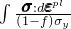
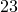
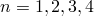
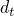
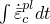
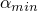
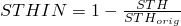
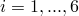
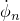
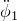

# 4.2.2 Abaqus/Explicit output variable identifiers

**Product: **Abaqus/Explicit  

##### **References**

- ["Output," Section 4.1.1](pt02ch04s01aus38.md)
- ["Output to the data and results files," Section 4.1.2](pt02ch04s01aus39.md)
- ["Output to the output database," Section 4.1.3](pt02ch04s01aus40.md)

### Overview

Except for the information in the status file, results can be obtained from Abaqus/Explicit only by postprocessing.

The tables in this section list all of the output variables that are available in Abaqus/Explicit. These output variables can be requested for output to the results (`.fil`) file (see ["Output to the data and results files," Section 4.1.2](pt02ch04s01aus39.md)) or as either field- or history-type output to the output database (`.odb`) file (see ["Output to the output database," Section 4.1.3](pt02ch04s01aus40.md)). In general, output variables that can be requested as field- or history-type output to an output database in ODB format can also be requested as output in SIM format (see ["The output database" in "Output," Section 4.1.1](pt02ch04s01aus38.md#usb-out-ooutput-formats)). When the output variables are requested for output to the results file, Abaqus/Explicit will first output these variables to the selected results  (`.sel`) file and will then convert the selected results file to the results file after the analysis completes.

### Notation used in the output variable descriptions

The words `.fil`, `.odb` Field, and `.odb` History following the variable's description indicate the availability of the output variable. `.fil` refers to output to the results file. The output variable can be written to the respective file if the word "yes" appears after the category name; "no" means that the variable is not available to that file.

### Direction definitions

The direction definitions depend on the variable type.

#### Direction definitions for element variables

For components of stress, strain, and similar material variables, 1, 2, and 3 refer to the directions in an orthogonal coordinate system. These are global directions for solid elements, surface directions for shell and membrane elements, and axial and transverse directions for beam and pipe elements. However, if a local orientation (["Orientations," Section 2.2.5](pt01ch02s02aus15.md)) is associated with the elements for which output is being requested, 1, 2, and 3 are local directions.

#### Direction definitions for nodal variables

For nodal variables, 1, 2, and 3 refer to the global directions (1=*X*, 2=*Y*, 3=*Z* except for axisymmetric elements, in which case 1=*R*, 2=*Z*). Even if a local coordinate system has been defined at a node (["Transformed coordinate systems," Section 2.1.5](pt01ch02s01aus09.md)), the data in the results file and the selected results file are still output in the global directions.

If nodal field output is requested for a node that has a local coordinate system defined, a quaternion representing the rotation from the global directions is written to the output database. Abaqus/CAE automatically uses this quaternion to transform the nodal results into the local directions. Nodal history data written to the output database are always stored in the global directions.

#### Direction definitions for integrated variables

For components of total force, total moment, and similar variables obtained through integration over a surface, the directions 1, 2, and 3 refer to directions in an orthogonal coordinate system. A fixed global coordinate system is used if the surface is specified directly for the integrated output request. If the surface is identified by an integrated output section definition (see ["Integrated output section definition," Section 2.5.1](pt01ch02s05aus23.md)) that is associated with the integrated output request, a local coordinate system in the initial configuration can be specified and can translate or rotate with the deformation.

### Distributed load output and user subroutines

Output can be requested for many of the distributed loads discussed in ["Loads," Section 34.4](pt07ch34s04.md). However, contributions to these loads defined through user subroutines (see ["Abaqus/Explicit subroutines," Section 1.2 of the Abaqus User Subroutines Reference Guide](../sub/sub-link.md#sub-rtn-explicit)) are not displayed.

### Principal value output

Output of the principal values can be requested for stresses, logarithmic strains, and nominal strains. Either all principal values or the minimum, intermediate, or maximum values can be obtained. All principal values of tensor *ABC* are obtained with the request *ABC*P, and the minimum, intermediate, and maximum principal values are obtained with the requests *ABC*P1, *ABC*P2, and *ABC*P3, respectively. For three-dimensional, plane strain, and axisymmetric elements all three principal values are obtained. For plane stress, membrane, and shell elements only the in-plane principal values are obtained for history-type output, and the out-of-plane principal value cannot be requested. For field-type output, all three principal values are obtained through Abaqus/CAE. Principal values cannot be obtained for beam, pipe, and truss elements, and principal values of plastic strains cannot be requested.

If a principal value or an invariant is requested for field-type output, the output request is replaced with an output request for the components of the corresponding tensor. Abaqus/CAE calculates all principal values and invariants from these components. If a principal value is desired as history-type output, it must be requested explicitly since Abaqus/CAE does no calculations on history data.

### Tensor output

Tensor variables that are written to the output database as field-type output are written as components in either the default directions defined by the convention given in ["Orientations," Section 2.2.5](pt01ch02s02aus15.md) (global directions for solid elements, surface directions for shell and membrane elements, and axial and transverse directions for beam and pipe elements), or the user-defined local system. Abaqus/CAE calculates all principal values and invariants from these components. See ["Writing field output data," Section 9.6.4 of the Abaqus Scripting User's Guide](../cmd/cmd-link.md#cmd-odb-intro-write-field-pyc), for a description of the different types of tensor variables.

The components for tensor variables are written to the output database in single precision. Therefore, a small amount of precision roundoff error may occur when calculating the variables' principal values. Such roundoff error may be observed, for example, when analytically zero values are calculated as relatively small yet nonzero values.

### Requesting output of components

Individual components of variables can be requested as history-type output in the output database for *X–Y* plotting in Abaqus/CAE. Individual component requests are not available for field-type output. If a particular component is desired for contouring in Abaqus/CAE, request field output of the generic variable (e.g., S for stress). Output for individual components of this field output can be requested within the Visualization module of Abaqus/CAE.

### Element integration point variables

You can request element integration point variable output to the results or output database file (see ["Element output" in "Output to the data and results files," Section 4.1.2](pt02ch04s01aus39.md#usb-out-oprintfile-elementoutput), and ["Element output" in "Output to the output database," Section 4.1.3](pt02ch04s01aus40.md#usb-out-odboutput-elementoutput)).

#### Tensors and invariants

**S**

All stress components.
.fil: yes    .odb Field: yes    .odb History: yes    
**MISESMAX**

Maximum Mises stress among all of the section points. For a shell element it represents the maximum Mises value among all the section points in the layer, for a beam or pipe element it is the maximum Mises stress among all the section points in the cross-section, and for a solid element it represents the Mises stress at the integration points. 
.fil: no    .odb Field: yes    .odb History: no    
**S*ij***

-component of stress ().
.fil: no    .odb Field: no    .odb History: yes    
**SP**

All principal stress components.
.fil: yes    .odb Field: yes    .odb History: yes    
**SP*n***

Minimum, intermediate, and maximum principal stress components (SP1  SP2  SP3).
.fil: no    .odb Field: no    .odb History: yes    
**E**

All infinitesimal strain components for geometrically linear analysis.
.fil: yes    .odb Field: yes    .odb History: yes    
**E*ij***

-component of infinitesimal strain ().
.fil: no    .odb Field: no    .odb History: yes    
**LE**

All logarithmic strain components.
.fil: yes    .odb Field: yes    .odb History: yes    
**LE*ij***

-component of logarithmic strain ().
.fil: no    .odb Field: no    .odb History: yes    
**LEP**

All principal logarithmic strain components.
.fil: yes    .odb Field: yes    .odb History: yes    
**LEP*n***

Minimum, intermediate, and maximum principal logarithmic strain components (LEP1  LEP2  LEP3).
.fil: no    .odb Field: no    .odb History: yes    
**ER**

All logarithmic strain rate components.
.fil: yes    .odb Field: yes    .odb History: yes    
**ER*ij***

-component of logarithmic strain rate().
.fil: no    .odb Field: no    .odb History: yes    
**ERP**

All principal logarithmic strain rate components.
.fil: yes    .odb Field: yes    .odb History: yes    
**ERP*n***

Minimum, intermediate, and maximum principal strain rate components (ERP1  ERP2  ERP3).
.fil: no    .odb Field: no    .odb History: yes    
**NE**

All nominal strain components.
.fil: yes    .odb Field: yes    .odb History: yes    
**NE*ij***

-component of nominal strain ().
.fil: no    .odb Field: no    .odb History: yes    
**NEP**

All principal nominal strain components.
.fil: yes    .odb Field: yes    .odb History: yes    
**NEP*n***

Minimum, intermediate, and maximum principal nominal strain components (NEP1  NEP2  NEP3).
.fil: no    .odb Field: no    .odb History: yes    
**PE**

All plastic strain components.
.fil: yes    .odb Field: yes    .odb History: yes    
**PE*ij***

-component of plastic strain ().
.fil: no    .odb Field: no    .odb History: yes    
**PEP**

All principal plastic strains.
.fil: no    .odb Field: yes    .odb History: yes    
**PEP*n***

Minimum, intermediate, and maximum principal plastic strains.
.fil: no    .odb Field: no    .odb History: yes    
**ERV**

Volumetric strain rate.
.fil: yes    .odb Field: yes    .odb History: yes    
**MISES**

Mises equivalent stress, defined as , where  is the deviatoric stress tensor, defined as , where  is the stress and  is the equivalent pressure stress.
.fil: yes    .odb Field: yes    .odb History: yes    
**PRESS**

Equivalent pressure stress,  .
.fil: yes    .odb Field: yes    .odb History: yes    
**TRIAX**

Stress triaxiality, .
.fil: no    .odb Field: yes    .odb History: yes    
**YIELDS**

Yield stress, , available for Mises, Johnson-Cook, and Hill plasticity material models.
.fil: no    .odb Field: yes    .odb History: yes    
**MASSADJUST**

Adjusted or redistributed mass in each element that is included in the element sets used with mass adjustment.  This output is available only in the first output frame of the first analysis step.
.fil: no    .odb Field: yes    .odb History: no    
**ALPHA**

All total kinematic hardening shift tensor components.
.fil: yes    .odb Field: yes    .odb History: yes    
**ALPHA*ij***

-component of the total shift tensor ().
.fil: no    .odb Field: no    .odb History: yes    
**ALPHAP**

All principal values of the total shift tensor.
.fil: yes    .odb Field: yes    .odb History: yes    
**ALPHAP*n***

Minimum, intermediate, and maximum principal values of the total shift tensor (ALPHAP1  ALPHAP2  ALPHAP3).
.fil: no    .odb Field: no    .odb History: yes    
**PEEQ**

Equivalent plastic strain.

For porous metal plasticity PEEQ is the equivalent plastic strain in the matrix material defined as . 

For cap plasticity PEEQ gives  (the cap position).

For crushable foam plasticity with volumetric hardening PEEQ gives the volumetric compacting plastic strain defined as .
For crushable foam plasticity with isotropic hardening PEEQ gives the equivalent plastic strain defined as , where  is the uniaxial compression yield stress.
.fil: yes    .odb Field: yes    .odb History: yes    
**PEEQT**

Equivalent plastic strain in uniaxial tension for cast iron, Mohr-Coulomb tension cutoff, and concrete damaged plasticity, which is defined as . 
.fil: no    .odb Field: yes    .odb History: yes    
**PEEQR**

Equivalent plastic strain rate.
.fil: no    .odb Field: yes    .odb History: yes    
**PEEQMAX**

Maximum equivalent plastic strain, PEEQ, among all of the section points. For a shell element it represents the maximum PEEQ value among all the section points in the layer, for a beam or a pipe element it is the maximum PEEQ among all the section points in the cross-section, and for a solid element it represents the PEEQ at the integration points. 
.fil: no    .odb Field: yes    .odb History: no    
**DMICRTMAX**

Maximum damage initiation among all of the section points and all of the damage initiation criteria. 

This output variable generates three output quantities as follows:

DMICRTMAXVAL outputs the maximum damage initiation value.

DMICRTPOS outputs the section point in the layer in which the maximum damage initiation value occurred. For solid elements, the output value is one.

DMICRTTYPE outputs a value that represents the damage initiation criteria type that reached the maximum value in the element as follows: 

For elements that have failure with progressive damage: 1-DUCTCRT, 2-SHRCRT, 3-JCCRT, 4-FLDCRT, 5-MSFLDCRT, 6-FLSDCRT, and 7-MKCRT. 

For elements that have fiber-reinforced material damage: 11-HSNFTCRT, 12-HSNFCCRT, 13-HSNMTCRT, and 14-HSNMCCRT. 

For cohesive elements with traction-separation behavior: 21-MAXSCRT, 22-MAXECRT, 23-QUADSCRT, and 24-QUADECRT. 
The maximum damage initiation output values are retained across the requested output frames until a higher maximum damage initiation value is computed.
.fil: no    .odb Field: yes    .odb History: no    

#### Geometric quantities

**COORD**

Coordinates of the integration point for solid elements. These are the current coordinates if the large-displacement formulation is being used.
.fil: no    .odb Field: yes    .odb History: yes    
**LOCALDIR*n***

Direction cosines of the local material directions for an anisotropic hyperelastic material model, or yarn direction cosines for a fabric material model. This variable is output automatically if any other element field output is requested for anisotropic hyperelastic or fabric material (see ["Output" in "Anisotropic hyperelastic behavior," Section 22.5.3](pt05ch22s05abm09.md#usb-mat-canisohyperelastic-output), and ["Output" in "Fabric material behavior," Section 23.4.1](pt05ch23s04abm35.md#usb-mat-cfabric-output)).
.fil: no    .odb Field: automatic    .odb History: no    

#### Additional element stresses

**TSHR**

All transverse shear stress components for three-dimensional conventional shell elements.
.fil: yes    .odb Field: yes    .odb History: yes    
**TSHR13**

-component of transverse shear stress.
.fil: no    .odb Field: no    .odb History: yes    
**TSHR23**

-component of transverse shear stress.
.fil: no    .odb Field: no    .odb History: yes    

#### Energy densities

**ENER**

All energy densities.
.fil: yes    .odb Field: yes    .odb History: yes    
**SENER**

Elastic strain energy density, per unit volume.
.fil: no    .odb Field: yes    .odb History: yes    
**PENER**

Energy dissipated by rate-independent and rate-dependent plasticity, per unit volume.
.fil: no    .odb Field: yes    .odb History: yes    
**CENER**

Energy dissipated by viscoelasticity, per unit volume. (Not supported for hyperelastic and hyperfoam material models with linear viscoelasticity.)
.fil: no    .odb Field: yes    .odb History: yes    
**VENER**

Energy dissipated by viscous effects, per unit volume.
.fil: no    .odb Field: yes    .odb History: yes    
**DMENER**

Energy dissipated by damage, per unit volume.
.fil: no    .odb Field: yes    .odb History: yes    

#### State and field variables

**SDV**

Solution-dependent state variables.
.fil: yes    .odb Field: yes    .odb History: yes    
**SDV*n***

Solution-dependent state variable *n*.
.fil: no    .odb Field: yes    .odb History: yes    
**TEMP**

Temperature.
.fil: yes    .odb Field: yes    .odb History: yes    
**DENSITY**

Material density.
.fil: no    .odb Field: yes    .odb History: yes    
**FV**

Field variables.
.fil: no    .odb Field: yes    .odb History: yes    
**FV*n***

Field variable *n*.
.fil: no    .odb Field: no    .odb History: yes    

#### Composite failure measures

**CFAILURE**

All failure measure components.
.fil: no    .odb Field: yes    .odb History: no    
**MSTRS**

Maximum stress theory failure measure.
.fil: no    .odb Field: no    .odb History: no    
**TSAIH**

Tsai-Hill theory failure measure.
.fil: no    .odb Field: no    .odb History: no    
**TSAIW**

Tsai-Wu theory failure measure.
.fil: no    .odb Field: no    .odb History: no    
**AZZIT**

Azzi-Tsai-Hill theory failure measure.
.fil: no    .odb Field: no    .odb History: no    
**MSTRN**

Maximum strain theory failure measure.
.fil: no    .odb Field: no    .odb History: no    

#### Additional plasticity quantities

**PEQC**

All equivalent plastic strains, when the model has more than one yield/failure surface.
.fil: yes    .odb Field: yes    .odb History: yes    
**PEQC*n***

*n*th equivalent plastic strain ().

For cap plasticity: PEQC provides equivalent plastic strains for all three possible yield/failure surfaces (Drucker-Prager failure surface - PEQC1, cap surface - PEQC2, and transition surface - PEQC3) and the total volumetric plastic strain (PEQC4). All identifiers also provide a yes/no flag (1/0 in the output database), telling whether the yield surface is currently active or not (AC YIELD: “actively yielding”).
When PEQC is requested as output to the output database, the active yield flags for each component are named AC YIELD1, AC YIELD2, etc.
.fil: no    .odb Field: no    .odb History: yes    

#### Porous metal plasticity quantities

**VVF**

Void volume fraction (porous metal plasticity).
.fil: yes    .odb Field: yes    .odb History: yes    
**VVFG**

Void volume fraction due to growth (porous metal plasticity).
.fil: yes    .odb Field: yes    .odb History: yes    
**VVFN**

Void volume fraction due to nucleation (porous metal plasticity).
.fil: yes    .odb Field: yes    .odb History: yes    

#### Concrete damaged plasticity

**DAMAGEC**

Compressive damage variable, .
.fil: no    .odb Field: yes    .odb History: yes    
**DAMAGET**

Tensile damage variable, .
.fil: no    .odb Field: yes    .odb History: yes    
**SDEG**

Scalar stiffness degradation variable, *d*.
.fil: no    .odb Field: yes    .odb History: yes    
**PEEQ**

Equivalent plastic strain in uniaxial compression, which is defined as . 
.fil: no    .odb Field: yes    .odb History: yes    
**PEEQR**

Equivalent plastic strain rate. 
.fil: no    .odb Field: yes    .odb History: yes    

#### Cracking model quantities

**CKE**

All cracking strain components.
.fil: yes    .odb Field: no    .odb History: no    
**CKE*ij***

-component of cracking strain.
.fil: no    .odb Field: no    .odb History: no    
**CKLE**

All cracking strain components in local crack axes.
.fil: yes    .odb Field: no    .odb History: no    
**CKLE*ij***

-component of cracking strain in local crack axes.
.fil: no    .odb Field: no    .odb History: no    
**CKEMAG**

Cracking strain magnitude, defined as .
.fil: yes    .odb Field: no    .odb History: no    
**CKLS**

All stress components in local crack axes.
.fil: yes    .odb Field: no    .odb History: no    
**CKLS*ij***

-component of stress in local crack axes.
.fil: no    .odb Field: no    .odb History: no    
**CRACK**

Crack orientations.
.fil: yes    .odb Field: no    .odb History: no    
**CKSTAT**

Crack status of each crack. CKSTAT can have the following values for each crack: 0.0=uncracked, 1.0=closed crack, 2.0=actively cracking, 3.0=crack closing/reopening.
.fil: yes    .odb Field: no    .odb History: no    

#### Failure with progressive damage

**DMICRT**

All active components of the damage initiation criteria.
.fil: no    .odb Field: yes    .odb History: yes    
**DUCTCRT**

Ductile damage initiation criterion.
.fil: no    .odb Field: no    .odb History: yes    
**JCCRT**

Johnson-Cook damage initiation criterion.
.fil: no    .odb Field: no    .odb History: yes    
**SHRCRT**

Shear damage initiation criterion.
.fil: no    .odb Field: no    .odb History: yes    
**FLDCRT**

Forming limit diagram (FLD) damage initiation criterion.
.fil: no    .odb Field: no    .odb History: yes    
**FLSDCRT**

Forming limit stress diagram (FLSD) damage initiation criterion.
.fil: no    .odb Field: no    .odb History: yes    
**MSFLDCRT**

Mschenborn-Sonne forming limit stress diagram (MSFLD) damage initiation criterion.
.fil: no    .odb Field: no    .odb History: yes    
**MKCRT**

Marciniak-Kuczynski (M-K) damage initiation criterion.
.fil: no    .odb Field: no    .odb History: yes    
**SDEG**

Overall scalar stiffness degradation.
.fil: no    .odb Field: yes    .odb History: yes    
**ERPRATIO**

Ratio of principal strain rates, , used for the MSFLD damage initiation criterion.
.fil: no    .odb Field: yes    .odb History: yes    
**SHRRATIO**

Shear stress ratio, , used for the shear damage initiation criterion.
.fil: no    .odb Field: yes    .odb History: yes    

#### Fiber-reinforced materials damage

**DMICRT**

All active components of the damage initiation criteria.
.fil: no    .odb Field: yes    .odb History: yes    
**HSNFTCRT**

Hashin's fiber tensile damage initiation criterion.
.fil: no    .odb Field: no    .odb History: yes    
**HSNFCCRT**

Hashin's fiber compressive damage initiation criterion.
.fil: no    .odb Field: no    .odb History: yes    
**HSNMTCRT**

Hashin's matrix tensile damage initiation criterion.
.fil: no    .odb Field: no    .odb History: yes    
**HSNMCCRT**

Hashin's matrix compressive damage initiation criterion.
.fil: no    .odb Field: no    .odb History: yes    
**DAMAGEFT**

Fiber tensile damage variable.
.fil: no    .odb Field: yes    .odb History: yes    
**DAMAGEFC**

Fiber compressive damage variable.
.fil: no    .odb Field: yes    .odb History: yes    
**DAMAGEMT**

Matrix tensile damage variable.
.fil: no    .odb Field: yes    .odb History: yes    
**DAMAGEMC**

Matrix compressive damage variable.
.fil: no    .odb Field: yes    .odb History: yes    
**DAMAGESHR**

Shear damage variable.
.fil: no    .odb Field: yes    .odb History: yes    

#### Fabric material

Output variable LOCALDIR (described above) is output automatically for fabric materials.
**SFABRIC**

All fabric stress components.
.fil: no    .odb Field: yes    .odb History: yes    
**EFABRIC**

All fabric strain components.
.fil: no    .odb Field: yes    .odb History: yes    
**SFABRIC*ij***

-component of fabric stress ().
.fil: no    .odb Field: no    .odb History: yes    
**EFABRIC*ij***

-component of fabric strain ().
.fil: no    .odb Field: no    .odb History: yes    

#### Equation of state

**BURNF**

Burn fraction of the ignition and growth material.
.fil: no    .odb Field: yes    .odb History: yes    
**DBURNF**

Reaction rate of the ignition and growth material.
.fil: no    .odb Field: yes    .odb History: yes    
**RHOE**

Density of the unreacted explosive in the ignition and growth material.
.fil: no    .odb Field: yes    .odb History: yes    
**RHOP**

Density of the reacted gas product in the ignition and growth material.
.fil: no    .odb Field: yes    .odb History: yes    
**PALPH**

Distension, , of the  porous material.
.fil: no    .odb Field: yes    .odb History: yes    
**PALPHMIN**

Minimum value, , of the distension attained during plastic compaction of the  porous material.
.fil: no    .odb Field: yes    .odb History: yes    

#### Rebar quantities

**RBFOR**

Force in rebar.
.fil: yes    .odb Field: yes    .odb History: yes    
**RBANG**

Angle, in degrees, between rebar and the user-specified isoparametric direction. Available only for shell and membrane elements.
.fil: yes    .odb Field: yes    .odb History: yes    
**RBROT**

Change in angle, in degrees, between rebar and the user-specified isoparametric direction. Available only for shell and membrane elements.
.fil: yes    .odb Field: yes    .odb History: yes    

#### Integration point coordinates

**COORD**

Coordinates of element integration point.
.fil: no    .odb Field: yes    .odb History: yes    

#### Coupled thermal-stress elements

**HFL**

Current magnitude and components of the heat flux per unit area vector.
.fil: yes    .odb Field: yes    .odb History: yes    
**HFLM**

Current magnitude of the heat flux per unit area vector.
.fil: no    .odb Field: no    .odb History: yes    
**HFL*n***

Component *n* of the heat flux vector ().
.fil: no    .odb Field: no    .odb History: yes    

#### Cohesive elements

**MAXSCRT**

Maximum nominal stress damage initiation criterion.
.fil: no    .odb Field: no    .odb History: yes    
**MAXECRT**

Maximum nominal strain damage initiation criterion.
.fil: no    .odb Field: no    .odb History: yes    
**QUADSCRT**

Quadratic nominal stress damage initiation criterion.
.fil: no    .odb Field: no    .odb History: yes    
**QUADECRT**

Quadratic nominal strain damage initiation criterion.
.fil: no    .odb Field: no    .odb History: yes    
**DMICRT**

All active components of the damage initiation criteria.
.fil: no    .odb Field: yes    .odb History: yes    
**SDEG**

Overall scalar stiffness degradation.
.fil: no    .odb Field: yes    .odb History: yes    
**STATUS**

Status of the element (the status of an element is 1.0 if the element is active, 0.0 if the element is not).
.fil: no    .odb Field: yes    .odb History: yes    
**MMIXDME**

Mode mix ratio during damage evolution.  It has a value of  before initiation of damage.
.fil: no    .odb Field: yes    .odb History: yes    
**MMIXDMI**

Mode mix ratio at damage initiation. It has a value of  before initiation of damage.
.fil: no    .odb Field: yes    .odb History: yes    

#### Eulerian elements

**EVF**

Eulerian volume fraction. Output includes volume fraction data for each material defined in the Eulerian section, plus the volume fraction of void.
.fil: no    .odb Field: yes    .odb History: yes    
**DENSITYVAVG**

Density, computed as a volume fraction weighted average of all materials in the element.
.fil: no    .odb Field: yes    .odb History: no    
**MISESVAVG**

Mises stress, computed as a volume fraction weighted average of all materials in the element.
.fil: no    .odb Field: yes    .odb History: no    
**PEVAVG**

Plastic strain components, computed as a volume fraction weighted average of all materials in the element.
.fil: no    .odb Field: yes    .odb History: no    
**PEEQVAVG**

Equivalent plastic strain, computed as a volume fraction weighted average of all materials in the element.
.fil: no    .odb Field: yes    .odb History: no    
**PRESSVAVG**

Equivalent pressure stress, computed as a volume fraction weighted average of all materials in the element.
.fil: no    .odb Field: yes    .odb History: no    
**SVAVG**

Stress components, computed as a volume fraction weighted average of all materials in the element.
.fil: no    .odb Field: yes    .odb History: no    
**TEMPMAVG**

Temperature, computed as a mass fraction weighted average of all materials in the element.
.fil: no    .odb Field: yes    .odb History: no    

### Element section variables

You can request element section variable output to the results or output database file (see ["Element output" in "Output to the data and results files," Section 4.1.2](pt02ch04s01aus39.md#usb-out-oprintfile-elementoutput), and ["Element output" in "Output to the output database," Section 4.1.3](pt02ch04s01aus40.md#usb-out-odboutput-elementoutput)). These variables are available only for beam, pipe, and shell elements with the exception of STH, which is also available for membrane and plane stress elements. They are defined for particular elements in the element descriptions in [Part VI, "Elements](pt06.md).”

**STH**

Section thickness (shell, membrane, and plane stress elements only).
.fil: yes    .odb Field: yes    .odb History: yes    
**STHIN**

Section thinning or thickening is defined as  , where   is the original thickness specified on the section definition for shell, membrane, and plane stress elements.
.fil: yes    .odb Field: yes    .odb History: yes    
**SF**

All section resultant components, both translational (forces) and rotational (moments).
.fil: yes    .odb Field: yes    .odb History: yes    
**SF*n***

Section force per unit width of component *n*,  for conventional shells;  for continuum shells;  for beams and pipes.
.fil: no    .odb Field: no    .odb History: yes    
**SM*n***

Section moment per unit width of component *n*, .
.fil: no    .odb Field: no    .odb History: yes    
**SORIENT**

Composite shell section orientations.
.fil: no    .odb Field: yes    .odb History: no    
**SE**

All section nominal strains, both translational and rotational (e.g., midplane strain and curvature in shells).
.fil: yes    .odb Field: yes    .odb History: yes    
**SE*n***

Section nominal strain component *n*,  for shells;  for beams and pipes.
.fil: no    .odb Field: no    .odb History: yes    
**SK*n***

Section curvature change or twist *n*, .
.fil: no    .odb Field: no    .odb History: yes    
**SSAVG**

All average membrane and transverse shear stress components (shell elements only).
.fil: yes    .odb Field: yes    .odb History: no    
**SSAVG*n***

Average membrane or transverse shear stress component *n*,  (shell elements only).
.fil: no    .odb Field: no    .odb History: yes    

### Whole element variables

You can request whole element variable output to the results or output database file (see ["Element output" in "Output to the data and results files," Section 4.1.2](pt02ch04s01aus39.md#usb-out-oprintfile-elementoutput), and ["Element output" in "Output to the output database," Section 4.1.3](pt02ch04s01aus40.md#usb-out-odboutput-elementoutput)).

**ELEN**

All energy magnitudes in the element.
.fil: yes    .odb Field: yes    .odb History: yes    
**ELSE**

Total elastic strain energy in the element (includes energy in transverse shear deformation in shells).
.fil: no    .odb Field: yes    .odb History: yes    
**ELCD**

Total energy dissipated in the element by viscoelastic deformation. (Not supported for hyperelastic and hyperfoam material models with linear viscoelasticity.)
.fil: no    .odb Field: yes    .odb History: yes    
**ELPD**

Total energy dissipated in the element by rate-independent and rate-dependent plastic deformation.
.fil: no    .odb Field: yes    .odb History: yes    
**ELVD**

Total energy dissipated in the element by viscous effects. This includes bulk viscosity and material damping.
.fil: no    .odb Field: yes    .odb History: yes    
**ELASE**

Total “artificial” strain energy in the element. This includes hourglass energy and drilling stiffness energy in shells.
.fil: no    .odb Field: yes    .odb History: yes    
**ELIHE**

Internal heat energy in the element.
.fil: no    .odb Field: yes    .odb History: yes    
**ELDMD**

Total energy dissipated in the element by damage.
.fil: no    .odb Field: yes    .odb History: yes    
**ELDC**

Total energy dissipated in the element by distortion control.
.fil: no    .odb Field: yes    .odb History: yes    
**ELEDEN**

All element energy density components.
.fil: no    .odb Field: yes    .odb History: no    
**ESEDEN**

Total elastic strain energy density in the element.
.fil: no    .odb Field: yes    .odb History: no    
**EPDDEN**

Total energy dissipated per unit volume in the element by rate-independent and rate-dependent plastic deformation.
.fil: no    .odb Field: yes    .odb History: no    
**ECDDEN**

Total energy dissipated per unit volume in the element by viscoelasticity.
.fil: no    .odb Field: yes    .odb History: no    
**EVDDEN**

Total energy dissipated per unit volume in the element by viscous effects.
.fil: no    .odb Field: yes    .odb History: no    
**EASEDEN**

Total “artificial” strain energy density in the element (energy associated with constraints used to remove singular modes, such as hourglass control).
.fil: no    .odb Field: yes    .odb History: no    
**EIHEDEN**

Internal heat energy density in the element.
.fil: no    .odb Field: yes    .odb History: no    
**EDMDDEN**

Total energy dissipated per unit volume in the element by damage.
.fil: no    .odb Field: yes    .odb History: no    
**EDCDEN**

Total energy dissipated per unit volume in the element by distortion control.
.fil: no    .odb Field: yes    .odb History: no    
**EDT**

Element stable time increment.
.fil: yes    .odb Field: yes    .odb History: yes    
**EMSF**

Element mass scaling factor.
.fil: yes    .odb Field: yes    .odb History: yes    
**STATUS**

Status of element (material failure with progressive damage, shear failure model, tensile failure model, porous failure criterion, brittle failure model, Johnson-Cook plasticity model, and [`VUMAT`](../sub/sub-link.md#sub-xsl-vumat)). The status of an element is 1.0 if the element is active, 0.0 if the element is not.
.fil: yes    .odb Field: yes    .odb History: yes    
**EVOL**

Current element volume. (Only available for continuum and structural elements not using general beam or shell section definitions.)
.fil: no    .odb Field: yes    .odb History: no    
**NFORC**

Forces at the nodes of an element from both the hourglass and the regular deformation modes of that element (negative of the internal forces in the global coordinate system).
.fil: no    .odb Field: yes    .odb History: yes    
**GRAV**

Uniformly distributed gravity load.
.fil: no    .odb Field: yes    .odb History: no    
**SBF**

Stagnation body force.
.fil: no    .odb Field: yes    .odb History: no    
**BF**

Uniformly distributed body force, including viscous body force.
.fil: no    .odb Field: yes    .odb History: no    
**EDMICRTMAX**

Whole shell element maximum damage initiation output among all of the layers, all of the damage initiation criteria, and for fully integrated elements across all of the integration points. 

This output variable is the same as DMICRTMAX output for solid and beam elements but complements the DMICRTMAX output variable for composite shell elements because it extracts the maximum damage initiation across all of the layers. 

This output variable generates four element output quantities as follows:

EDMICRTMAXVAL outputs the maximum damage initiation value in the entire element.

EDMICRTLAYER outputs the layer number in which the maximum damage initiation value occurred.

EDMICRTTYPE outputs a value that represents the damage initiation criteria type that reached the maximum value in the element, as described in the DMICRTMAX output variable description. 

EDMICRTINTP outputs the integration point number for which the maximum damage value occurred. For reduced-integration elements, the output value is one. 
The maximum damage initiation output values are retained across the requested output frames until a higher maximum damage initiation value is computed.
.fil: no    .odb Field: yes    .odb History: no    

#### Connector elements

**CTF**

All components of connector total forces and moments.
.fil: yes    .odb Field: yes    .odb History: yes    
**CTF*n***

Connector total force component *n* ().
.fil: no    .odb Field: no    .odb History: yes    
**CTM*n***

Connector total moment component *n* ().
.fil: no    .odb Field: no    .odb History: yes    
**CEF**

All components of connector elastic forces and moments.
.fil: yes    .odb Field: yes    .odb History: yes    
**CEF*n***

Connector elastic force component *n* ().
.fil: no    .odb Field: no    .odb History: yes    
**CEM*n***

Connector elastic moment component *n* ().
.fil: no    .odb Field: no    .odb History: yes    
**CUE**

Elastic displacements and rotations in all directions.
.fil: yes    .odb Field: yes    .odb History: yes    
**CUE*n***

Elastic displacement in the *n*-direction ().
.fil: no    .odb Field: no    .odb History: yes    
**CURE*n***

Elastic rotation in the *n*-direction ().
.fil: no    .odb Field: no    .odb History: yes    
**CUP**

Plastic relative displacements and rotations in all directions.
.fil: yes    .odb Field: yes    .odb History: yes    
**CUP*n***

Plastic relative displacement in the *n*-direction ().
.fil: no    .odb Field: no    .odb History: yes    
**CURP*n***

Plastic relative rotation in the *n*-direction ().
.fil: no    .odb Field: no    .odb History: yes    
**CUPEQ**

Equivalent plastic relative displacements and rotations in all directions, and equivalent plastic relative motion for a coupled plasticity definition.
.fil: yes    .odb Field: yes    .odb History: yes    
**CUPEQ*n***

Equivalent plastic relative displacement in the *n*-direction ().
.fil: no    .odb Field: no    .odb History: yes    
**CURPEQ*n***

Equivalent plastic relative rotation in the *n*-direction ().
.fil: no    .odb Field: no    .odb History: yes    
**CUPEQC**

Equivalent plastic relative motion for a coupled plasticity definition.
.fil: no    .odb Field: no    .odb History: yes    
**CALPHAF**

All components of connector kinematic hardening shift forces and moments.
.fil: yes    .odb Field: no    .odb History: yes    
**CALPHAF*n***

Connector kinematic hardening shift force component *n* ().
.fil: no    .odb Field: no    .odb History: yes    
**CALPHAM*n***

Connector kinematic hardening shift moment component *n* ().
.fil: no    .odb Field: no    .odb History: yes    
**CVF**

All components of connector viscous forces and moments.
.fil: yes    .odb Field: yes    .odb History: yes    
**CVF*n***

Connector viscous force component *n* ().
.fil: no    .odb Field: no    .odb History: yes    
**CVM*n***

Connector viscous moment component *n* ().
.fil: no    .odb Field: no    .odb History: yes    
**CUF**

All components of connector uniaxial forces and moments.
.fil: no    .odb Field: yes    .odb History: yes    
**CUF*n***

Connector uniaxial force component *n* ().
.fil: no    .odb Field: no    .odb History: yes    
**CUM*n***

Connector uniaxial moment component *n* ().
.fil: no    .odb Field: no    .odb History: yes    
**CSF**

All components of connector friction forces and moments.
.fil: yes    .odb Field: no    .odb History: yes    
**CSF*n***

Connector friction force component *n* ().
.fil: no    .odb Field: no    .odb History: yes    
**CSM*n***

Connector friction moment component *n* ().
.fil: no    .odb Field: no    .odb History: yes    
**CSFC**

Connector friction force in the instantaneous slip direction. Available only if friction is defined in the slip direction.
.fil: no    .odb Field: no    .odb History: yes    
**CNF**

All components of connector friction-generating contact forces and moments.
.fil: yes    .odb Field: no    .odb History: yes    
**CNF*n***

Connector friction-generating contact force component *n* (*n* = 1, 2, 3).
.fil: no    .odb Field: no    .odb History: yes    
**CNM*n***

Connector friction-generating contact moment component *n* (*n* = 1, 2, 3).
.fil: no    .odb Field: no    .odb History: yes    
**CNFC**

Connector friction-generating contact force in the instantaneous slip direction. Available only if friction is defined in the slip direction.
.fil: no    .odb Field: no    .odb History: yes    
**CDMG**

All components of the overall damage variable.
.fil: yes    .odb Field: yes    .odb History: yes    
**CDMG*n***

Overall damage variable component *n* ().
.fil: no    .odb Field: no    .odb History: yes    
**CDMGR*n***

Overall damage variable component *n* ().
.fil: no    .odb Field: no    .odb History: yes    
**CDIF**

Components of connector force-based damage initiation criterion in all directions.
.fil: yes    .odb Field: no    .odb History: yes    
**CDIF*n***

Connector force-based damage initiation criterion in the *n*-translation direction ().
.fil: no    .odb Field: no    .odb History: yes    
**CDIFR*n***

Connector force-based damage initiation criterion in the *n*-rotation direction ().
.fil: no    .odb Field: no    .odb History: yes    
**CDIFC**

Connector force-based damage initiation criterion in the instantaneous slip direction.
.fil: no    .odb Field: no    .odb History: yes    
**CDIM**

Components of connector motion-based damage initiation criterion in all directions.
.fil: yes    .odb Field: no    .odb History: yes    
**CDIM*n***

Connector motion-based damage initiation criterion in the *n*-translation direction ().
.fil: no    .odb Field: no    .odb History: yes    
**CDIMR*n***

Connector motion-based damage initiation criterion in the *n*-rotation direction ().
.fil: no    .odb Field: no    .odb History: yes    
**CDIMC**

Connector motion-based damage initiation criterion in the instantaneous slip direction.
.fil: no    .odb Field: no    .odb History: yes    
**CDIP**

Components of connector plastic motion-based damage initiation criterion in all directions (including the instantaneous slip direction).
.fil: yes    .odb Field: yes    .odb History: yes    
**CDIP*n***

Connector plastic motion-based damage initiation criterion in the *n*-translation direction ().
.fil: no    .odb Field: no    .odb History: yes    
**CDIPR*n***

Connector plastic motion-based damage initiation criterion in the *n*-rotation direction ().
.fil: no    .odb Field: no    .odb History: yes    
**CDIPC**

Connector plastic motion-based damage initiation criterion in the instantaneous slip direction.
.fil: no    .odb Field: no    .odb History: yes    
**CSLST**

All flags for connector stop and connector lock status.
.fil: yes    .odb Field: no    .odb History: yes    
**CSLST*i***

Flag for connector stop and connector lock status in the *i*-direction ().
.fil: no    .odb Field: no    .odb History: yes    
**CASU**

Components of accumulated slip in all directions.
.fil: yes    .odb Field: no    .odb History: yes    
**CASU*n***

Connector accumulated slip in the *n*-direction (*n* = 1, 2, 3).
.fil: no    .odb Field: no    .odb History: yes    
**CASUR*n***

Connector angular accumulated slip in the *n*-direction (*n* = 1, 2, 3).
.fil: no    .odb Field: no    .odb History: yes    
**CASUC**

Connector accumulated slip in the instantaneous slip direction. Available only if friction is defined in the slip direction.
.fil: no    .odb Field: no    .odb History: yes    
**CIVC**

Connector instantaneous velocity in the slip direction. Available only if friction is defined in the slip direction.
.fil: yes    .odb Field: no    .odb History: yes    
**CRF**

All components of connector reaction forces and moments.
.fil: yes    .odb Field: no    .odb History: yes    
**CRF*n***

Connector reaction force component *n* ().
.fil: no    .odb Field: no    .odb History: yes    
**CRM*n***

Connector reaction moment component *n* ().
.fil: no    .odb Field: no    .odb History: yes    
**CCF**

All components of connector concentrated forces and moments.
.fil: yes    .odb Field: no    .odb History: yes    
**CCF*n***

Connector concentrated force component *n* ().
.fil: no    .odb Field: no    .odb History: yes    
**CCM*n***

Connector concentrated moment component *n* ().
.fil: no    .odb Field: no    .odb History: yes    
**CP**

Relative positions in all directions.
.fil: yes    .odb Field: yes    .odb History: yes    
**CP*n***

Relative position in the *n*-direction ().
.fil: no    .odb Field: no    .odb History: yes    
**CPR*n***

Relative angular position in the *n*-direction ().
.fil: no    .odb Field: no    .odb History: yes    
**CU**

Relative displacements and rotations in all directions.
.fil: yes    .odb Field: yes    .odb History: yes    
**CU*n***

Relative displacement in the *n*-direction ().
.fil: no    .odb Field: no    .odb History: yes    
**CUR*n***

Relative rotation in the *n*-direction ().
.fil: no    .odb Field: no    .odb History: yes    
**CCU**

Constitutive displacements and rotations in all directions.
.fil: yes    .odb Field: no    .odb History: yes    
**CCU*n***

Constitutive displacement in the *n*-direction ().
.fil: no    .odb Field: no    .odb History: yes    
**CCUR*n***

Constitutive rotation in the *n*-direction ().
.fil: no    .odb Field: no    .odb History: yes    
**CV**

Relative velocities in all directions.
.fil: yes    .odb Field: yes    .odb History: yes    
**CV*n***

Relative velocity in the *n*-direction ().
.fil: no    .odb Field: no    .odb History: yes    
**CVR*n***

Relative angular velocity in the *n*-direction ().
.fil: no    .odb Field: no    .odb History: yes    
**CA**

Relative accelerations in all directions.
.fil: yes    .odb Field: yes    .odb History: yes    
**CA*n***

Relative acceleration in the *n*-direction ().
.fil: no    .odb Field: no    .odb History: yes    
**CAR*n***

Relative angular acceleration in the *n*-direction ().
.fil: no    .odb Field: no    .odb History: yes    
**CFAILST**

All flags for connector failure status.
.fil: yes    .odb Field: yes    .odb History: yes    
**CFAILST*i***

Flag for connector failure status in the *i*-direction ().
.fil: no    .odb Field: no    .odb History: yes    
**CDERU**

Connector derived displacement.
.fil: no    .odb Field: yes    .odb History: yes    
**CDERF**

Connector derived force.
.fil: no    .odb Field: yes    .odb History: yes    

### Element face variables

You can request element face variable output to the output database file (see ["Element output" in "Output to the output database," Section 4.1.3](pt02ch04s01aus40.md#usb-out-odboutput-elementoutput)). These variables are available only for shell, membrane, and solid elements.

**P**

Uniformly distributed pressure load on element faces. When the pressure is defined using [*DLOAD](../key/key-link.md#usb-kws-hdload), the variable name is changed automatically to PDLOAD.
.fil: no    .odb Field: yes    .odb History: no    
**STAGP**

Stagnation pressure load on element faces.
.fil: no    .odb Field: yes    .odb History: no    
**VP**

Viscous pressure load on element faces.
.fil: no    .odb Field: yes    .odb History: no    
**IWCONWEP**

Air blast pressure load from the CONWEP model on element faces.
.fil: no    .odb Field: yes    .odb History: no    
**TRNOR**

Normal component (component along face normal) of traction load on element faces.
.fil: no    .odb Field: yes    .odb History: no    
**TRSHR**

Shear component (component along face tangent) of traction load on element faces.
.fil: no    .odb Field: yes    .odb History: no    

### Nodal variables

You can request nodal variable output to the results or output database file (see ["Node output" in "Output to the data and results files," Section 4.1.2](pt02ch04s01aus39.md#usb-out-oprintfile-nodaloutput), and ["Node output" in "Output to the output database," Section 4.1.3](pt02ch04s01aus40.md#usb-out-odboutput-nodaloutput)).

**COORD**

Coordinates of the node. These are the current coordinates if the large-displacement formulation is being used.
.fil: yes    .odb Field: yes    .odb History: yes    
**COOR*n***

Coordinate *n* ().
.fil: no    .odb Field: no    .odb History: yes    
**U**

Displacement components.

Results file and field-type output: both translation and rotation.
History-type output: translation only. Rotation results should be requested by components.
.fil: yes    .odb Field: yes    .odb History: yes    
**UT**

Translational displacement components.
.fil: no    .odb Field: yes    .odb History: yes    
**UMAG**

Magnitude of translational displacements.
.fil: no    .odb Field: no    .odb History: yes    
**UR**

Rotational displacement components.
.fil: no    .odb Field: yes    .odb History: yes    
**U*n***

 displacement component ().
.fil: no    .odb Field: no    .odb History: yes    
**UR*n***

 rotation component ().
.fil: no    .odb Field: no    .odb History: yes    
**V**

Velocity components (both translation and rotation).

Results file and field-type output: both translation and rotation.
History-type output: translation only. Rotation results should be requested by components.
.fil: yes    .odb Field: yes    .odb History: yes    
**VT**

Translational velocity components.
.fil: no    .odb Field: yes    .odb History: yes    
**VMAG**

Magnitude of translational velocities.
.fil: no    .odb Field: no    .odb History: yes    
**VR**

Rotational velocity components.
.fil: no    .odb Field: yes    .odb History: yes    
**V*n***

 velocity component ().
.fil: no    .odb Field: no    .odb History: yes    
**VR*n***

 rotational velocity component ().
.fil: no    .odb Field: no    .odb History: yes    
**A**

Acceleration components (both translation and rotation).

Results file and field-type output: both translation and rotation.
History-type output: translation only. Rotation results should be requested by components.
.fil: yes    .odb Field: yes    .odb History: yes    
**AT**

Translational acceleration components.
.fil: no    .odb Field: yes    .odb History: yes    
**AMAG**

Magnitude of translational accelerations.
.fil: no    .odb Field: no    .odb History: yes    
**AR**

Rotational acceleration components.
.fil: no    .odb Field: yes    .odb History: yes    
**A*n***

 acceleration component ().
.fil: no    .odb Field: no    .odb History: yes    
**AR*n***

 rotational acceleration component ().
.fil: no    .odb Field: no    .odb History: yes    
**POR**

Acoustic pressure at a node.
.fil: yes    .odb Field: yes    .odb History: yes    
**PABS**

Acoustic absolute pressure at a node.
.fil: yes    .odb Field: yes    .odb History: yes    
**NT**

All temperature values at a node. Available only for coupled thermal-stress analysis.
.fil: yes    .odb Field: yes    .odb History: yes    
**NT*n***

Temperature degree of freedom *n* at a node (). Available only for coupled thermal-stress analysis.
.fil: no    .odb Field: no    .odb History: yes    
**RF**

Reaction force and moment components.

Results file and field-type output: both translation and rotation.
History-type output: translation only. Rotation results should be requested by components.
.fil: yes    .odb Field: yes    .odb History: yes    
**RT**

Reaction force components.
.fil: no    .odb Field: yes    .odb History: yes    
**RFMAG**

Magnitude of reaction forces.
.fil: no    .odb Field: no    .odb History: yes    
**RM**

Reaction moment components.
.fil: no    .odb Field: yes    .odb History: yes    
**RF*n***

Reaction force component *n* () (conjugate to prescribed displacement ).
.fil: no    .odb Field: no    .odb History: yes    
**RFL**

All reaction flux values. Available only for coupled thermal-stress analysis.
.fil: yes    .odb Field: yes    .odb History: yes    
**RFL*n***

Reaction flux value *n* at a node (). Available only for coupled thermal-stress analysis.
.fil: no    .odb Field: yes    .odb History: yes    
**RM*n***

Reaction moment component *n* () (conjugate to prescribed rotation ).
.fil: no    .odb Field: no    .odb History: yes    
**CF**

All components of point loads and concentrated moments.
.fil: no    .odb Field: yes    .odb History: yes    
**CF*n***

Point load component *n* ().
.fil: no    .odb Field: no    .odb History: yes    
**CM*n***

Point moment component *n* ().
.fil: no    .odb Field: no    .odb History: yes    
**NVF**

Nodal volume fraction.
.fil: no    .odb Field: yes    .odb History: no    
**STRAINFREE**

Strain-free adjustments to initial positions (adjusted position minus unadjusted position). Only written to the output database (.`odb`) file for the original field output frame at zero time.
.fil: no    .odb Field: yes    .odb History: no    
**TIEDSTATUS**

Status of the tied slave nodes (the status of a slave node is 2 if the slave node is not tied, 1 if the slave node is tied, and 0 for nodes that do not participate in a tie constraint).
.fil: no    .odb Field: yes    .odb History: no    
**TIEADJUST**

Position adjustment vector components of the tied slave nodes. Only written to the output database (.`odb`) file for the original field output frame at zero time. 
.fil: no    .odb Field: yes    .odb History: no    

#### Fluid cavity variables

**PCAV**

Fluid cavity gauge pressure.
.fil: yes    .odb Field: no    .odb History: yes    
**CVOL**

Fluid cavity volume.
.fil: yes    .odb Field: no    .odb History: yes    
**CTEMP**

Fluid cavity temperature for an ideal gas model used under adiabatic conditions. 
.fil: no    .odb Field: no    .odb History: yes    
**CSAREA**

Fluid cavity surface area. 
.fil: no    .odb Field: no    .odb History: yes    
**CLAREA**

Fluid cavity unblocked leakage area. 
.fil: no    .odb Field: no    .odb History: yes    
**CBLARAT**

Ratio of the blocked leakage area to the unblocked leakage area. 
.fil: no    .odb Field: no    .odb History: yes    
**CMASS**

Mass of the fluid contained in a fluid cavity. 
.fil: no    .odb Field: no    .odb History: yes    
**APCAV**

Average gauge pressures for multiple fluid cavities.
.fil: no    .odb Field: no    .odb History: yes    
**TCVOL**

Total volume of multiple fluid cavities.
.fil: no    .odb Field: no    .odb History: yes    
**ACTEMP**

Average fluid cavity temperature for an ideal gas model used under adiabatic conditions for multiple fluid cavities. 
.fil: no    .odb Field: no    .odb History: yes    
**TCSAREA**

Total surface area of multiple fluid cavities. 
.fil: no    .odb Field: no    .odb History: yes    
**TCMASS**

Total mass of the fluid contained in the multiple fluid cavities. 
.fil: no    .odb Field: no    .odb History: yes    
**CMF**

Molecular mass fraction of fluid species  contained in a fluid cavity.
.fil: no    .odb Field: no    .odb History: yes    
**CMFL**

Mass flow rate out of a fluid cavity. 
.fil: no    .odb Field: no    .odb History: yes    
**CMFLT**

Accumulated mass flow out of a fluid cavity.
.fil: no    .odb Field: no    .odb History: yes    
**CEFL**

Heat energy flow rate out of a fluid cavity. 
.fil: no    .odb Field: no    .odb History: yes    
**CEFLT**

Accumulated heat energy flow out of a fluid cavity.
.fil: no    .odb Field: no    .odb History: yes    
**MINFL**

Inflator mass flow rate into a fluid cavity.
.fil: no    .odb Field: no    .odb History: yes    
**MINFLT**

Accumulated inflator mass flow into a fluid cavity.
.fil: no    .odb Field: no    .odb History: yes    
**TINFL**

Inflator temperature.
.fil: no    .odb Field: no    .odb History: yes    

### Surface variables

You can request surface variable output to the output database file (see ["Surface output in Abaqus/Standard and Abaqus/Explicit" in "Output to the output database," Section 4.1.3](pt02ch04s01aus40.md#usb-out-odboutput-surface)); additional information on these variables is provided in ["Defining general contact interactions in Abaqus/Explicit," Section 36.4.1](pt09ch36s04aus155.md); ["Defining contact pairs in Abaqus/Explicit," Section 36.5.1](pt09ch36s05aus160.md); and ["Thermal contact properties," Section 37.2.1](pt09ch37s02aus174.md).

#### Mechanical analysis--nodal quantities

**CFORCE**

Contact normal force (CNORMF) and frictional shear force (CSHEARF).
.fil: no    .odb Field: yes    .odb History: no    
**CSTRESS**

Contact pressure (CPRESS) and frictional shear stress (CSHEAR). CSHEAR is not available for general contact analyses.
.fil: no    .odb Field: yes    .odb History: no    
**CTHICK**

Contact thickness in general contact or contact pairs.
.fil: no    .odb Field: yes    .odb History: no    
**CSMAXSCRT**

Maximum stress-based damage initiation criterion for cohesive surfaces in general contact.
.fil: no    .odb Field: yes    .odb History: no    
**CSQUADSCRT**

Quadratic stress-based damage initiation criterion for cohesive surfaces in general contact.
.fil: no    .odb Field: yes    .odb History: no    
**CSMAXUCRT**

Maximum separation-based damage initiation criterion for cohesive surfaces in general contact.
.fil: no    .odb Field: yes    .odb History: no    
**CSQUADUCRT**

Quadratic separation-based damage initiation criterion for cohesive surfaces in general contact.
.fil: no    .odb Field: yes    .odb History: no    
**CSDMG**

Damage variable for cohesive surfaces in general contact.
.fil: no    .odb Field: yes    .odb History: no    
**FSLIP**

Length of contact slip path at slave nodes during contact (FSLIPEQ) and in some cases (see ["Defining contact pairs in Abaqus/Explicit," Section 36.5.1](pt09ch36s05aus160.md)) components of net contact slip in local tangent directions (FSLIP1 and FSLIP2). These variables remain constant while a slave node is not in contact.
.fil: no    .odb Field: yes    .odb History: no    
**FSLIPR**

Magnitude of contact slip rate at slave nodes during contact (FSLIPR) and in some cases (see ["Defining contact pairs in Abaqus/Explicit," Section 36.5.1](pt09ch36s05aus160.md)) components of contact slip rate in local tangent directions (FSLIPR1 and FSLIPR2). These variables are set to zero while a slave node is not in contact.
.fil: no    .odb Field: yes    .odb History: no    
**BONDSTAT**

Spot weld bond status.
.fil: no    .odb Field: no    .odb History: yes    
**BONDLOAD**

Spot weld bond load.
.fil: no    .odb Field: no    .odb History: yes    

#### Crack bond failure quantities

**DBT**

Time when bond failure occurs.
.fil: no    .odb Field: yes    .odb History: no    
**DBS**

All components of remaining stress in the failed bond.
.fil: no    .odb Field: yes    .odb History: no    
**DBSF**

Fraction of stress that remains at bond failure.
.fil: no    .odb Field: yes    .odb History: no    
**BDSTAT**

Bond state (the state is 1.0 if bonded, 0.0 if unbonded).
.fil: no    .odb Field: yes    .odb History: no    
**OPENBC**

Relative displacement behind crack when fracture criterion is met.
.fil: no    .odb Field: yes    .odb History: no    
**CRSTS**

All components of critical stress at failure.
.fil: no    .odb Field: yes    .odb History: no    
**ENRRT**

All components of strain energy release rate.
.fil: no    .odb Field: yes    .odb History: no    
**EFENRRTR**

Effective energy release rate ratio.
.fil: no    .odb Field: yes    .odb History: no    

#### Mechanical analysis--whole surface quantities

**CFN**

Total force due to contact pressure (CFN*n*, *n* = 1, 2, 3).
.fil: no    .odb Field: no    .odb History: yes    
**CFNM**

Magnitude of total force due to contact pressure.
.fil: no    .odb Field: no    .odb History: yes    
**CFS**

Total force due to frictional stress (CFS*n*, *n* = 1, 2, 3).
.fil: no    .odb Field: no    .odb History: yes    
**CFSM**

Magnitude of total force due to frictional stress.
.fil: no    .odb Field: no    .odb History: yes    
**CFT**

Total force due to contact pressure and frictional stress (CFT*n*, * n* = 1, 2, 3).
.fil: no    .odb Field: no    .odb History: yes    
**CFTM**

Magnitude of total force due to contact pressure and frictional stress.
.fil: no    .odb Field: no    .odb History: yes    
**CMN**

Total moment about the origin due to contact pressure (CMN*n*, *n* = 1, 2, 3).
.fil: no    .odb Field: no    .odb History: yes    
**CMNM**

Magnitude of total moment about the origin due to contact pressure.
.fil: no    .odb Field: no    .odb History: yes    
**CMS**

Total moment about the origin due to frictional stress (CMS*n*, *n* = 1, 2, 3).
.fil: no    .odb Field: no    .odb History: yes    
**CMSM**

Magnitude of total moment about the origin due to frictional stress.
.fil: no    .odb Field: no    .odb History: yes    
**CMT**

Total moment about the origin due to contact pressure and frictional stress (CMT*n*, *n* = 1, 2, 3).
.fil: no    .odb Field: no    .odb History: yes    
**CMTM**

Magnitude of total moment about the origin due to contact pressure and frictional stress.
.fil: no    .odb Field: no    .odb History: yes    
**CAREA**

Total area in contact.
.fil: no    .odb Field: no    .odb History: yes    
**XN**

Center of the total force due to contact pressure (XN*n*, *n* = 1, 2, 3).
.fil: no    .odb Field: no    .odb History: yes    
**XS**

Center of the total force due to frictional stress (XS*n*, *n* = 1, 2, 3).
.fil: no    .odb Field: no    .odb History: yes    
**XT**

Center of the total force due to contact pressure and frictional stress (XT*n*, *n* = 1, 2, 3).
.fil: no    .odb Field: no    .odb History: yes    

#### Fully coupled temperature-displacement analysis

**HFL**

Heat flux per unit area leaving the surface.
.fil: no    .odb Field: yes    .odb History: no    
**HFLA**

HFL multiplied by the nodal area.
.fil: no    .odb Field: yes    .odb History: no    
**HTL**

Time integrated HFL.
.fil: no    .odb Field: yes    .odb History: no    
**HTLA**

HTL multiplied by the nodal area.
.fil: no    .odb Field: yes    .odb History: no    
**SFDR**

Heat flux per unit area due to frictional dissipation.
.fil: no    .odb Field: yes    .odb History: no    
**SFDRA**

SFDR multiplied by the nodal area.
.fil: no    .odb Field: yes    .odb History: no    
**SFDRT**

Time integrated SFDR.
.fil: no    .odb Field: yes    .odb History: no    
**SFDRTA**

SFDRT multiplied by the nodal area.
.fil: no    .odb Field: yes    .odb History: no    

### Integrated variables

You can request integrated variable output to the output database (see ["Integrated output in Abaqus/Explicit" in "Output to the output database," Section 4.1.3](pt02ch04s01aus40.md#usb-out-odboutput-integrated)). The output quantity is computed by integration over a surface or an element set that is specified either directly in the integrated output request or by associating an integrated output section definition (see ["Integrated output section definition," Section 2.5.1](pt01ch02s05aus23.md)) or an element set definition with the integrated output request.

The components of the vector output variables are given with respect to a global coordinate system when no integrated output section definition is associated with the integrated output request. When an integrated output section is associated with the integrated output request and a local coordinate system is defined for the integrated output section, the components are given in the local system. The local system will rotate with the deformation if a reference node with rotation degrees of freedom is associated with the section definition.

**SOAREA**

Area of the surface as projected onto a plane normal to the average surface normal.
.fil: no    .odb Field: no    .odb History: yes    
**SOF**

Total force transmitted through the surface.
.fil: no    .odb Field: no    .odb History: yes    
**SOM**

Total moment transmitted through the surface. The moment of the forces transmitted through the surface is taken about the current location of the reference node if one is specified on an integrated output section and is associated with the integrated output request. The moment is taken about the global origin either if no section definition is associated with the integrated output request or if there is no reference node defined in the associated section definition.
.fil: no    .odb Field: no    .odb History: yes    
**MASS**

Total mass of the element set.
.fil: no    .odb Field: no    .odb History: yes    
**DMASS**

Total mass change in percentage of the element set due to mass scaling.
.fil: no    .odb Field: no    .odb History: yes    
**UCOM**

Equivalent rigid-body translational displacement of the element set.
.fil: no    .odb Field: no    .odb History: yes    
**VCOM**

Equivalent rigid-body translational velocity of the element set.
.fil: no    .odb Field: no    .odb History: yes    
**ACOM**

Equivalent rigid-body translational acceleration of the element set.
.fil: no    .odb Field: no    .odb History: yes    
**COORDCOM**

Coordinates of the center of mass of the element set.
.fil: no    .odb Field: no    .odb History: yes    
**MASSEUL**

Total mass of each Eulerian material instance in the element set.
.fil: no    .odb Field: no    .odb History: yes    
**VOLEUL**

Total volume of each Eulerian material instance in the element set.
.fil: no    .odb Field: no    .odb History: yes    

### Total energy output

You can request total energy variable output to the results or output database file (see ["Total energy output" in "Output to the data and results files," Section 4.1.2](pt02ch04s01aus39.md#usb-out-oprintfile-energy), and ["Total energy output" in "Output to the output database," Section 4.1.3](pt02ch04s01aus40.md#usb-out-odboutput-energy)). All of these variables are written when total energy output is requested. Energy history totals can be requested to the output database for part of the model as well as the whole model.

**ALLAE**

“Artificial” strain energy associated with constraints used to remove singular modes (such as hourglass control) and with constraints used to make the drill rotation follow the in-plane rotation of the shell elements.
.fil: yes    .odb Field: no    .odb History: yes    
**ALLCD**

Energy dissipated by viscoelasticity. (Not supported for hyperelastic and hyperfoam material models with linear viscoelasticity.)
.fil: yes    .odb Field: no    .odb History: yes    
**ALLFD**

Total energy dissipated through frictional effects. (Available only for the whole model).
.fil: yes    .odb Field: no    .odb History: yes    
**ALLIE**

Total strain energy. (ALLIE=ALLSE + ALLPD + ALLCD + ALLAE + ALLDMD+ ALLDC+ ALLFC.)
.fil: yes    .odb Field: no    .odb History: yes    
**ALLKE**

Kinetic energy.
.fil: yes    .odb Field: no    .odb History: yes    
**ALLPD**

Energy dissipated by rate-independent and rate-dependent plastic deformation.
.fil: yes    .odb Field: no    .odb History: yes    
**ALLSE**

Recoverable strain energy.
.fil: yes    .odb Field: no    .odb History: yes    
**ALLVD**

Energy dissipated by viscous effects.
.fil: yes    .odb Field: no    .odb History: yes    
**ALLWK**

External work. (Available only for the whole model).
.fil: yes    .odb Field: no    .odb History: yes    
**ALLIHE**

Internal heat energy.
.fil: yes    .odb Field: no    .odb History: yes    
**ALLHF**

External heat energy through external fluxes.
.fil: yes    .odb Field: no    .odb History: yes    
**ALLDMD**

Energy dissipated by damage.
.fil: yes    .odb Field: no    .odb History: yes    
**ALLDC**

Energy dissipated by distortion control.
.fil: yes    .odb Field: no    .odb History: yes    
**ALLFC**

Fluid cavity energy, defined as the negative of the work done by all fluid cavities. (Available only for the whole model.)
.fil: no    .odb Field: no    .odb History: yes    
**ALLPW**

Work done by contact penalties, including general contact and penalty/kinematic contact pairs. (Available only for the whole model.)
.fil: no    .odb Field: no    .odb History: yes    
**ALLCW**

Work done by constraint penalties. (Available only for the whole model.)
.fil: no    .odb Field: no    .odb History: yes    
**ALLMW**

Work done in propelling mass added in mass scaling. (Available only for the whole model.)
.fil: no    .odb Field: no    .odb History: yes    
**ETOTAL**

Energy balance defined as: ALLKE + ALLIE + ALLVD + ALLFD + ALLIHE ALLWK ALLPW ALLCW ALLMW ALLHF. (Available only for the whole model.)
.fil: yes    .odb Field: no    .odb History: yes    

### Time increment and mass output

The DT and DMASS variables are always written when any results file output is requested (see ["Output to the Abaqus/Explicit results file" in "Output to the data and results files," Section 4.1.2](pt02ch04s01aus39.md#usb-out-oprintfile-results-exp)). You can request output of the time increment and the steady-state detection variables SSPEEQ, SSSPRD, SSFORC, and SSTORQ to the output database (see ["Time incrementation output in Abaqus/Explicit" in "Output to the output database," Section 4.1.3](pt02ch04s01aus40.md#usb-out-odboutput-incrementation)).

**DT**

Time increment.
.fil: yes    .odb Field: no    .odb History: yes    
**DMASS**

Percent change in mass of the model due to mass scaling.
.fil: yes    .odb Field: no    .odb History: yes    
**SSPEEQ**

Steady-state equivalent plastic strain norms.
.fil: no    .odb Field: no    .odb History: yes    
**SSPEEQ*n***

Steady-state equivalent plastic strain norm *n*.
.fil: no    .odb Field: no    .odb History: yes    
**SSSPRD**

Steady-state spread strain norms.
.fil: no    .odb Field: no    .odb History: yes    
**SSSPRD*n***

Steady-state spread norm *n*.
.fil: no    .odb Field: no    .odb History: yes    
**SSFORC**

Steady-state force norms.
.fil: no    .odb Field: no    .odb History: yes    
**SSFORC*n***

Steady-state force norm *n*.
.fil: no    .odb Field: no    .odb History: yes    
**SSTORQ**

Steady-state torque norms.
.fil: no    .odb Field: no    .odb History: yes    
**SSTORQ*n***

Steady-state torque norm *n*.
.fil: no    .odb Field: no    .odb History: yes    

