# 5.1.2 Results file output format

**Products: **Abaqus/Standard  Abaqus/Explicit  

##### **References**

- ["Accessing the results file: overview," Section 5.1.1](pt02ch05s01abo03.md)
- ["Abaqus/Standard output variable identifiers," Section 4.2.1](pt02ch04s02abv01.md)
- ["Abaqus/Explicit output variable identifiers," Section 4.2.2](pt02ch04s02xbv01.md)

### Overview

This section describes the format of the individual records in the Abaqus results file. Where applicable, the output variable identifier used in writing a given value to the file is printed below the corresponding record type description. Records that are available only in Abaqus/Standard are designated with an (S); records that are available only in Abaqus/Explicit are designated with an (E). The record key for a particular record may differ between Abaqus/Standard and Abaqus/Explicit.

### Record format

The results file is written as a sequential file. Each record has the following format:

| Location | Length | Description |
| --- | --- | --- |
| 1 | 1 | Record length (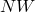) |
| 2 | 1 | Record type key |
| 3, 4... | (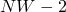) | Attributes |

All words in the results file are of the same length, whether they contain integer, floating point number, or character string data. The word length is that of a double precision floating point number (8 bytes).

The attributes in a given record may depend on the element type being considered. For example, the stress components associated with three-dimensional shell elements are , , and  (in local directions), while those associated with three-dimensional solids are , , , , 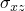, and 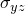 (in global directions if no local orientation is specified). Thus, care must be used in interpreting the data when postprocessing the file output. Refer to [Part VI, "Elements](pt06.md),” for a definition of the ordering of element-dependent attributes.

In steady-state dynamic analyses, complex values are stored as the real components followed by the imaginary components. For example, the stress components associated with three-dimensional shell elements are 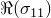, 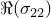, and 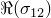 followed by 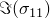, 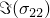, and 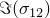.

In models that are defined in terms of an assembly of part instances, the results file contains internal (global) node and element numbers, as explained in ["Output," Section 4.1.1](pt02ch04s01aus38.md). Part and assembly records are not included in the results file.

### Local coordinate system

If the components of an element quantity are in local directions, a record of type 85 defining these directions is generated for each point at which component output is requested if the local coordinate directions were requested in Abaqus/Standard (see ["Output of local directions to the results file" in "Output to the data and results files," Section 4.1.2](pt02ch04s01aus39.md#usb-out-oprintfile-results-directions)) and automatically in Abaqus/Explicit. The local coordinate system may be inherent to the element, as is the case in shells and membranes, or may have been defined by a local orientation (see ["Orientations," Section 2.2.5](pt01ch02s02aus15.md)).

For shell elements a direction record is written for every material point in the section for which component output is requested, and a separate direction record is written for section forces and section strains. For geometrically nonlinear analysis in Abaqus/Standard the record contains the current, updated directions, except for small-strain shells, in which case the original directions are given. Direction output is not provided for trusses, two-dimensional beams, axisymmetric shells or membranes, or for values averaged at nodes.

### Label record

Some record types include labels, such as element and node set names, written in A8 format. If a label exceeds 8 characters, an integer identifier will be written instead. This identifier can then be used to cross-reference the actual label stored in 10A8 format on record type 1940.

#### Records written for any file output request

| **Record key: 1900** | **Record type: **Element definitions |
| --- | --- |
| | **Attributes: ** | **1 -- **Element number. | | --- | --- | | | **2 -- **Element type (characters, A8 format, left justified). | | | **3 -- **First node on the element. | | | **4 -- **Second node on the element. | | | **5 -- **Etc. | | **Attributes: ** | **1 -- **Element number. |  | **2 -- **Element type (characters, A8 format, left justified). |  | **3 -- **First node on the element. |  | **4 -- **Second node on the element. |  | **5 -- **Etc. |
| **Attributes: ** | **1 -- **Element number. |
|  | **2 -- **Element type (characters, A8 format, left justified). |
|  | **3 -- **First node on the element. |
|  | **4 -- **Second node on the element. |
|  | **5 -- **Etc. |

| **Record key: 1990**(S) | **Record type: **Element definition continuation |
| --- | --- |
| | **Attributes: ** | **1 -- **Node on the element in the previous 1900 record. | | --- | --- | | | **2 -- **Etc. | | **Attributes: ** | **1 -- **Node on the element in the previous 1900 record. |  | **2 -- **Etc. |
| **Attributes: ** | **1 -- **Node on the element in the previous 1900 record. |
|  | **2 -- **Etc. |

| In Abaqus/Explicit quadrilateral/brick elements that are degenerate (i.e., possessing identical nodes) are written out in record 1900 as corresponding triangular/tetrahedral/wedge elements. For example, a CPE4R element with two identical nodes is written as a CPE3 element, and a C3D8R element with identical third and fourth nodes and identical seventh and eighth nodes is written as a C3D6 element. |
| --- |
| **Record key: 1901** | **Record type: **Node definitions |
| | **Attributes: ** | **1 -- **Node number. | | --- | --- | | | **2 -- **First coordinate. | | | **3 -- **Second coordinate. | | | **4 -- **Etc. | | **Attributes: ** | **1 -- **Node number. |  | **2 -- **First coordinate. |  | **3 -- **Second coordinate. |  | **4 -- **Etc. |
| **Attributes: ** | **1 -- **Node number. |
|  | **2 -- **First coordinate. |
|  | **3 -- **Second coordinate. |
|  | **4 -- **Etc. |

| Record key 1902 (below) defines the location of each active degree of freedom. For example, if the model contains only two-dimensional beam elements, the only active degrees of freedom are 1, 2, and 6. Therefore, this record would have the attributes (1, 2, 0, 0, 0, 3), meaning that degree of freedom 1 () is the first active variable at each node; degree of freedom 2 () is the second active variable at each node; degrees of freedom 3, 4, and 5 are not active in the model; and degree of freedom 6 is the third active variable at each node. |
| --- |
| **Record key: 1902** | **Record type: **Active degrees of freedom |
| | **Attributes: ** | **1 -- **Location in nodal arrays of degree of freedom 1 (0 if DOF 1 is not active in the model). | | --- | --- | | | **2 -- **Location in nodal arrays of degree of freedom 2 (0 if DOF 2 is not active in the model). | | | **3 -- **Etc. | | **Attributes: ** | **1 -- **Location in nodal arrays of degree of freedom 1 (0 if DOF 1 is not active in the model). |  | **2 -- **Location in nodal arrays of degree of freedom 2 (0 if DOF 2 is not active in the model). |  | **3 -- **Etc. |
| **Attributes: ** | **1 -- **Location in nodal arrays of degree of freedom 1 (0 if DOF 1 is not active in the model). |
|  | **2 -- **Location in nodal arrays of degree of freedom 2 (0 if DOF 2 is not active in the model). |
|  | **3 -- **Etc. |

| **Record key: 1910**(S) | **Record type: **Substructure path |
| --- | --- |
| | **Attributes: ** | **1 -- **0 substructure enter record; 1 substructure leave record. | | --- | --- | | | **2 -- **Element number on usage level. | | | **3 -- **Substructure type identifier (Z*n*). | | | **4 -- **Element number at the previous level if it is not the usage level. | | | **5 -- **Etc. | | **Attributes: ** | **1 -- **0 substructure enter record; 1 substructure leave record. |  | **2 -- **Element number on usage level. |  | **3 -- **Substructure type identifier (Z*n*). |  | **4 -- **Element number at the previous level if it is not the usage level. |  | **5 -- **Etc. |
| **Attributes: ** | **1 -- **0 substructure enter record; 1 substructure leave record. |
|  | **2 -- **Element number on usage level. |
|  | **3 -- **Substructure type identifier (Z*n*). |
|  | **4 -- **Element number at the previous level if it is not the usage level. |
|  | **5 -- **Etc. |

| **Record key: 1911** | **Record type: **Output request definition |
| --- | --- |
| | **Attributes: ** | **1 -- **Flag for element-based output (0), nodal output (1), modal output (2), or element set energy output (3). | | --- | --- | | | **2 -- **Set name (node or element set) used in the request (A8 format). This attribute is blank if no set was specified. | | | **3 -- **Element type (only for element output, A8 format). | | **Attributes: ** | **1 -- **Flag for element-based output (0), nodal output (1), modal output (2), or element set energy output (3). |  | **2 -- **Set name (node or element set) used in the request (A8 format). This attribute is blank if no set was specified. |  | **3 -- **Element type (only for element output, A8 format). |
| **Attributes: ** | **1 -- **Flag for element-based output (0), nodal output (1), modal output (2), or element set energy output (3). |
|  | **2 -- **Set name (node or element set) used in the request (A8 format). This attribute is blank if no set was specified. |
|  | **3 -- **Element type (only for element output, A8 format). |

| **Record key: 1921** | **Record type: **Abaqus release, etc. |
| --- | --- |
| | **Attributes: ** | **1 -- **Abaqus release number (A8 format). | | --- | --- | | | **2 -- **Date (2A8 format). | | | **3 -- **Date cont'd. | | | **4 -- **Time (A8 format). | | | **5 -- **Number of elements in the model. | | | **6 -- **Number of nodes in the model. | | | **7 -- **Typical element length in the model. | | **Attributes: ** | **1 -- **Abaqus release number (A8 format). |  | **2 -- **Date (2A8 format). |  | **3 -- **Date cont'd. |  | **4 -- **Time (A8 format). |  | **5 -- **Number of elements in the model. |  | **6 -- **Number of nodes in the model. |  | **7 -- **Typical element length in the model. |
| **Attributes: ** | **1 -- **Abaqus release number (A8 format). |
|  | **2 -- **Date (2A8 format). |
|  | **3 -- **Date cont'd. |
|  | **4 -- **Time (A8 format). |
|  | **5 -- **Number of elements in the model. |
|  | **6 -- **Number of nodes in the model. |
|  | **7 -- **Typical element length in the model. |

| **Record key: 1922** | **Record type: **Heading |
| --- | --- |
| | **Attribute: ** | **1 -- **Attributes 1--10. The heading entered as the first data line of the [*HEADING](../key/key-link.md#usb-kws-mheading) option (A8 format). Equivalent to the job description in Abaqus/CAE. | | --- | --- | | **Attribute: ** | **1 -- **Attributes 1--10. The heading entered as the first data line of the [*HEADING](../key/key-link.md#usb-kws-mheading) option (A8 format). Equivalent to the job description in Abaqus/CAE. |
| **Attribute: ** | **1 -- **Attributes 1--10. The heading entered as the first data line of the [*HEADING](../key/key-link.md#usb-kws-mheading) option (A8 format). Equivalent to the job description in Abaqus/CAE. |

| **Record key: 1931** | **Record type: **Node set |
| --- | --- |
| | **Attributes: ** | **1 -- **Node set name (A8 format). In Abaqus/Explicit only node sets defined as part of the model definition are written. | | --- | --- | | | **2 -- **First node in the node set. | | | **3 -- **Second node in the node set. | | | **4 -- **Etc. | | **Attributes: ** | **1 -- **Node set name (A8 format). In Abaqus/Explicit only node sets defined as part of the model definition are written. |  | **2 -- **First node in the node set. |  | **3 -- **Second node in the node set. |  | **4 -- **Etc. |
| **Attributes: ** | **1 -- **Node set name (A8 format). In Abaqus/Explicit only node sets defined as part of the model definition are written. |
|  | **2 -- **First node in the node set. |
|  | **3 -- **Second node in the node set. |
|  | **4 -- **Etc. |

| **Record key: 1932** | **Record type: **Node set continuation |
| --- | --- |
| | **Attributes: ** | **1 -- **Node number in the node set of the previous 1931 record. | | --- | --- | | | **2 -- **Etc. | | **Attributes: ** | **1 -- **Node number in the node set of the previous 1931 record. |  | **2 -- **Etc. |
| **Attributes: ** | **1 -- **Node number in the node set of the previous 1931 record. |
|  | **2 -- **Etc. |

| **Record key: 1933** | **Record type: **Element set |
| --- | --- |
| | **Attributes: ** | **1 -- **Element set name (A8 format). In Abaqus/Explicit only element sets defined as part of the model definition are written. | | --- | --- | | | **2 -- **First element in the element set. | | | **3 -- **Second element in the element set. | | | **4 -- **Etc. | | **Attributes: ** | **1 -- **Element set name (A8 format). In Abaqus/Explicit only element sets defined as part of the model definition are written. |  | **2 -- **First element in the element set. |  | **3 -- **Second element in the element set. |  | **4 -- **Etc. |
| **Attributes: ** | **1 -- **Element set name (A8 format). In Abaqus/Explicit only element sets defined as part of the model definition are written. |
|  | **2 -- **First element in the element set. |
|  | **3 -- **Second element in the element set. |
|  | **4 -- **Etc. |

| **Record key: 1934** | **Record type: **Element set continuation |
| --- | --- |
| | **Attributes: ** | **1 -- **Element number in the element set of the previous 1933 record. | | --- | --- | | | **2 -- **Etc. | | **Attributes: ** | **1 -- **Element number in the element set of the previous 1933 record. |  | **2 -- **Etc. |
| **Attributes: ** | **1 -- **Element number in the element set of the previous 1933 record. |
|  | **2 -- **Etc. |

| **Record key: 1940** | **Record type: **Label cross-reference |
| --- | --- |
| | **Attributes: ** | **1 -- **Integer reference. | | --- | --- | | | **2 -- **Label (10A8 format). | | **Attributes: ** | **1 -- **Integer reference. |  | **2 -- **Label (10A8 format). |
| **Attributes: ** | **1 -- **Integer reference. |
|  | **2 -- **Label (10A8 format). |

#### Record written once per eigenvalue in natural frequency extraction

| **Record key: 1980**(S) | **Record type: **Modal |
| --- | --- |
| | **Attributes: ** | **1 -- **Eigenvalue number. | | --- | --- | | | **2 -- **Eigenvalue. | | | **3 -- **Generalized mass. | | | **4 -- **Composite damping. | | | **5 -- **Participation factor for degree of freedom 1. | | | **6 -- **Effective mass for degree of freedom 1. | | | **7 -- **Participation factor for degree of freedom 2. | | | **8 -- **Effective mass for degree of freedom 2. | | | **9 -- **Etc. | | **Attributes: ** | **1 -- **Eigenvalue number. |  | **2 -- **Eigenvalue. |  | **3 -- **Generalized mass. |  | **4 -- **Composite damping. |  | **5 -- **Participation factor for degree of freedom 1. |  | **6 -- **Effective mass for degree of freedom 1. |  | **7 -- **Participation factor for degree of freedom 2. |  | **8 -- **Effective mass for degree of freedom 2. |  | **9 -- **Etc. |
| **Attributes: ** | **1 -- **Eigenvalue number. |
|  | **2 -- **Eigenvalue. |
|  | **3 -- **Generalized mass. |
|  | **4 -- **Composite damping. |
|  | **5 -- **Participation factor for degree of freedom 1. |
|  | **6 -- **Effective mass for degree of freedom 1. |
|  | **7 -- **Participation factor for degree of freedom 2. |
|  | **8 -- **Effective mass for degree of freedom 2. |
|  | **9 -- **Etc. |

Any nodal or element data after this record refer to the eigenvector, until a new record key 1980 or a record key 2001 is encountered. Eigenvalue output for substructures (see ["Writing the recovery matrix, reduced stiffness matrix, mass matrix, load case vectors, and gravity vectors to a file" in "Defining substructures," Section 10.1.2](pt04ch10s01aus59.md#usb-anl-asuperelementdef-output)) also uses these records to divide up elemental and nodal results. This record is written if there are any results file output requests for an eigenvalue buckling prediction or eigenfrequency extraction step. The generalized mass, etc. are not written for an eigenvalue buckling prediction step. This record is not written for a complex eigenfrequency extraction step.

#### Records written once per increment

| **Record key: 2000** | **Record type: **Increment start record |
| --- | --- |
| | **Attributes: ** | **1 -- **Total time. | | --- | --- | | | **2 -- **Step time. | | | **3 -- **Maximum creep strain-rate ratio (control of solution-dependent amplitude) in Abaqus/Standard; currently not used in Abaqus/Explicit. | | | **4 -- **Solution-dependent amplitude in Abaqus/Standard; currently not used in Abaqus/Explicit. | | | **5 -- **Procedure type: gives a key to the step type. See [Table 5.1.2--1](pt02ch05s01afi01.md#usb-out-fformat-tableprockey) at the end of this section. | | | **6 -- **Step number. | | | **7 -- **Increment number. | | | **8 -- **Linear perturbation flag in Abaqus/Standard: 0 if general step, 1 if linear perturbation step; currently not used in Abaqus/Explicit. | | | **9 -- **Load proportionality factor: nonzero only in static Riks steps; currently not used in Abaqus/Explicit. | | | **10 -- **Frequency (cycles/time) in a steady-state dynamic response analysis or steady-state transport angular velocity (rad/time) in a steady-state transport analysis; currently not used in Abaqus/Explicit. | | | **11 -- **Time increment. | | | **12 -- **Attributes 12--21. The step subheading entered as the first data line of the [*STEP](../key/key-link.md#usb-kws-hstep) option (A8 format). Equivalent to the step description in Abaqus/CAE. | | **Attributes: ** | **1 -- **Total time. |  | **2 -- **Step time. |  | **3 -- **Maximum creep strain-rate ratio (control of solution-dependent amplitude) in Abaqus/Standard; currently not used in Abaqus/Explicit. |  | **4 -- **Solution-dependent amplitude in Abaqus/Standard; currently not used in Abaqus/Explicit. |  | **5 -- **Procedure type: gives a key to the step type. See [Table 5.1.2--1](pt02ch05s01afi01.md#usb-out-fformat-tableprockey) at the end of this section. |  | **6 -- **Step number. |  | **7 -- **Increment number. |  | **8 -- **Linear perturbation flag in Abaqus/Standard: 0 if general step, 1 if linear perturbation step; currently not used in Abaqus/Explicit. |  | **9 -- **Load proportionality factor: nonzero only in static Riks steps; currently not used in Abaqus/Explicit. |  | **10 -- **Frequency (cycles/time) in a steady-state dynamic response analysis or steady-state transport angular velocity (rad/time) in a steady-state transport analysis; currently not used in Abaqus/Explicit. |  | **11 -- **Time increment. |  | **12 -- **Attributes 12--21. The step subheading entered as the first data line of the [*STEP](../key/key-link.md#usb-kws-hstep) option (A8 format). Equivalent to the step description in Abaqus/CAE. |
| **Attributes: ** | **1 -- **Total time. |
|  | **2 -- **Step time. |
|  | **3 -- **Maximum creep strain-rate ratio (control of solution-dependent amplitude) in Abaqus/Standard; currently not used in Abaqus/Explicit. |
|  | **4 -- **Solution-dependent amplitude in Abaqus/Standard; currently not used in Abaqus/Explicit. |
|  | **5 -- **Procedure type: gives a key to the step type. See [Table 5.1.2--1](pt02ch05s01afi01.md#usb-out-fformat-tableprockey) at the end of this section. |
|  | **6 -- **Step number. |
|  | **7 -- **Increment number. |
|  | **8 -- **Linear perturbation flag in Abaqus/Standard: 0 if general step, 1 if linear perturbation step; currently not used in Abaqus/Explicit. |
|  | **9 -- **Load proportionality factor: nonzero only in static Riks steps; currently not used in Abaqus/Explicit. |
|  | **10 -- **Frequency (cycles/time) in a steady-state dynamic response analysis or steady-state transport angular velocity (rad/time) in a steady-state transport analysis; currently not used in Abaqus/Explicit. |
|  | **11 -- **Time increment. |
|  | **12 -- **Attributes 12--21. The step subheading entered as the first data line of the [*STEP](../key/key-link.md#usb-kws-hstep) option (A8 format). Equivalent to the step description in Abaqus/CAE. |

| The following record is written once per increment, after all data records have been written for that increment. |
| --- |
| **Record key: 2001** | **Record type: **Increment end record |
| | **Attribute: ** | **1 -- **No attributes. | | --- | --- | | **Attribute: ** | **1 -- **No attributes. |
| **Attribute: ** | **1 -- **No attributes. |

**Note:**When binary format is used, the results file is written in blocks of 512 words for each increment. If there are fewer than 512 words in the last block of the current increment, record 2001 has zeros appended to it so that the total length of the block is 512. Hence, the length of record 2001 is 2 + the number of zeros appended. For an ASCII format results file record 2001 is extended to complete an 80 character logical record, and a logical record of 80 blank characters is added after this record. See ["Accessing the results file information," Section 5.1.3](pt02ch05s01aus43.md).

#### Records written for any element file output request

These records contain data about element variables at integration points within the elements, at the centroid of elements, or at the nodes of an element.

| **Record key: 1** | **Record type: **Element header record |
| --- | --- |
| | **Attributes: ** | **1 -- **Element number or the node number if the subsequent records contain nodal averaged element values. | | --- | --- | | | **2 -- **Integration point number if the subsequent records contain integration point data. Node number if the subsequent records contain data at the nodes of the element. Integration plane number if the subsequent records contain centroidal values for CAXA and SAXA elements. 0 if the subsequent records contain centroidal values or nodal averaged values. | | | **3 -- **Section point number if this is a shell, beam, or layered solid element and the subsequent records contain data at a section point through the thickness. 0 for continuum elements and for section values in beams and shell elements. | | | **4 -- **Location identification. 0 if the subsequent records contain data at an integration point; 1 if the subsequent records contain values at the centroid of the element; 2 if the subsequent records contain data at the nodes of the element; 3 if the subsequent records contain data associated with rebar within an element; 4 if the subsequent records contain nodal averaged values; 5 if the subsequent records contain values associated with the whole element. | | | **5 -- **Rebar name if the subsequent records contain values associated with a named rebar. | | | **6 -- **Number of direct stresses at a point (`NDI`). | | | **7 -- **Number of shear stresses at a point (`NSHR`). | | | **8 -- **0, currently not used in Abaqus/Standard; number of directions in which displacement or temperature gradients are computed in the element (`NDIR`) in Abaqus/Explicit. | | | **9 -- **Number of section force or section strain components (`NSFC`). | | **Attributes: ** | **1 -- **Element number or the node number if the subsequent records contain nodal averaged element values. |  | **2 -- **Integration point number if the subsequent records contain integration point data. Node number if the subsequent records contain data at the nodes of the element. Integration plane number if the subsequent records contain centroidal values for CAXA and SAXA elements. 0 if the subsequent records contain centroidal values or nodal averaged values. |  | **3 -- **Section point number if this is a shell, beam, or layered solid element and the subsequent records contain data at a section point through the thickness. 0 for continuum elements and for section values in beams and shell elements. |  | **4 -- **Location identification. 0 if the subsequent records contain data at an integration point; 1 if the subsequent records contain values at the centroid of the element; 2 if the subsequent records contain data at the nodes of the element; 3 if the subsequent records contain data associated with rebar within an element; 4 if the subsequent records contain nodal averaged values; 5 if the subsequent records contain values associated with the whole element. |  | **5 -- **Rebar name if the subsequent records contain values associated with a named rebar. |  | **6 -- **Number of direct stresses at a point (`NDI`). |  | **7 -- **Number of shear stresses at a point (`NSHR`). |  | **8 -- **0, currently not used in Abaqus/Standard; number of directions in which displacement or temperature gradients are computed in the element (`NDIR`) in Abaqus/Explicit. |  | **9 -- **Number of section force or section strain components (`NSFC`). |
| **Attributes: ** | **1 -- **Element number or the node number if the subsequent records contain nodal averaged element values. |
|  | **2 -- **Integration point number if the subsequent records contain integration point data. Node number if the subsequent records contain data at the nodes of the element. Integration plane number if the subsequent records contain centroidal values for CAXA and SAXA elements. 0 if the subsequent records contain centroidal values or nodal averaged values. |
|  | **3 -- **Section point number if this is a shell, beam, or layered solid element and the subsequent records contain data at a section point through the thickness. 0 for continuum elements and for section values in beams and shell elements. |
|  | **4 -- **Location identification. 0 if the subsequent records contain data at an integration point; 1 if the subsequent records contain values at the centroid of the element; 2 if the subsequent records contain data at the nodes of the element; 3 if the subsequent records contain data associated with rebar within an element; 4 if the subsequent records contain nodal averaged values; 5 if the subsequent records contain values associated with the whole element. |
|  | **5 -- **Rebar name if the subsequent records contain values associated with a named rebar. |
|  | **6 -- **Number of direct stresses at a point (`NDI`). |
|  | **7 -- **Number of shear stresses at a point (`NSHR`). |
|  | **8 -- **0, currently not used in Abaqus/Standard; number of directions in which displacement or temperature gradients are computed in the element (`NDIR`) in Abaqus/Explicit. |
|  | **9 -- **Number of section force or section strain components (`NSFC`). |

| **Record key: 2** | **Output variable identifier: **TEMP |
| --- | --- |
| **Record type: **Temperature| **Attribute: ** | **1 -- **Temperature. | | --- | --- | | **Attribute: ** | **1 -- **Temperature. |
| **Attribute: ** | **1 -- **Temperature. |

| **Record key: 3**(S) | **Output variable identifier: **LOADS |
| --- | --- |
| **Record type: **Distributed load| **Attributes: ** | **1 -- **Load type. | | --- | --- | | | **2 -- **Magnitude. | | **Attributes: ** | **1 -- **Load type. |  | **2 -- **Magnitude. |
| **Attributes: ** | **1 -- **Load type. |
|  | **2 -- **Magnitude. |

| **Record key: 4**(S) | **Output variable identifier: **FLUXS |
| --- | --- |
| **Record type: **Distributed flux| **Attributes: ** | **1 -- **Flux type. | | --- | --- | | | **2 -- **Magnitude. | | **Attributes: ** | **1 -- **Flux type. |  | **2 -- **Magnitude. |
| **Attributes: ** | **1 -- **Flux type. |
|  | **2 -- **Magnitude. |

| **Record key: 5** | **Output variable identifier: **SDV |
| --- | --- |
| **Record type: **Solution-dependent state variables| **Attributes: ** | **1 -- **State variable 1. | | --- | --- | | | **2 -- **State variable 2. | | | **3 -- **Etc. The record can have up to 80 words in ASCII format or 512 words in binary format. Repeat this record as often as necessary to output all active state variables in the model. | | **Attributes: ** | **1 -- **State variable 1. |  | **2 -- **State variable 2. |  | **3 -- **Etc. The record can have up to 80 words in ASCII format or 512 words in binary format. Repeat this record as often as necessary to output all active state variables in the model. |
| **Attributes: ** | **1 -- **State variable 1. |
|  | **2 -- **State variable 2. |
|  | **3 -- **Etc. The record can have up to 80 words in ASCII format or 512 words in binary format. Repeat this record as often as necessary to output all active state variables in the model. |

| **Record key: 6**(S) | **Output variable identifier: **VOIDR |
| --- | --- |
| **Record type: **Void ratio| **Attribute: ** | **1 -- **Void ratio. | | --- | --- | | **Attribute: ** | **1 -- **Void ratio. |
| **Attribute: ** | **1 -- **Void ratio. |

| **Record key: 7**(S) | **Output variable identifier: **FOUND |
| --- | --- |
| **Record type: **Foundation pressure| **Attributes: ** | **1 -- **Foundation type. | | --- | --- | | | **2 -- **Magnitude. | | **Attributes: ** | **1 -- **Foundation type. |  | **2 -- **Magnitude. |
| **Attributes: ** | **1 -- **Foundation type. |
|  | **2 -- **Magnitude. |

| **Record key: 8**(S) | **Output variable identifier: **COORD |
| --- | --- |
| **Record type: **Coordinates| **Attributes: ** | **1 -- **First coordinate. | | --- | --- | | | **2 -- **Etc. | | **Attributes: ** | **1 -- **First coordinate. |  | **2 -- **Etc. |
| **Attributes: ** | **1 -- **First coordinate. |
|  | **2 -- **Etc. |

| **Record key: 9**(S) | **Output variable identifier: **FV |
| --- | --- |
| **Record type: **Field variables| **Attributes: ** | **1 -- **First field variable. | | --- | --- | | | **2 -- **Etc. | | **Attributes: ** | **1 -- **First field variable. |  | **2 -- **Etc. |
| **Attributes: ** | **1 -- **First field variable. |
|  | **2 -- **Etc. |

| **Record key: 10**(S) | **Output variable identifier: **NFLUX |
| --- | --- |
| **Record type: **Nodal flux caused by heat| **Attributes: ** | **1 -- **Node number. | | --- | --- | | | **2 -- **First flux component. | | | **3 -- **Etc. | | **Attributes: ** | **1 -- **Node number. |  | **2 -- **First flux component. |  | **3 -- **Etc. |
| **Attributes: ** | **1 -- **Node number. |
|  | **2 -- **First flux component. |
|  | **3 -- **Etc. |

| **Record key: 11** | **Output variable identifier: **S |
| --- | --- |
| **Record type: **Stresses| **Attributes: ** | **1 -- **First stress component. | | --- | --- | | | **2 -- **Second stress component. | | | **3 -- **Etc. (See the element description in [Part VI, "Elements](pt06.md)," for a definition of the number and type of the components for the element type.) | | **Attributes: ** | **1 -- **First stress component. |  | **2 -- **Second stress component. |  | **3 -- **Etc. (See the element description in [Part VI, "Elements](pt06.md)," for a definition of the number and type of the components for the element type.) |
| **Attributes: ** | **1 -- **First stress component. |
|  | **2 -- **Second stress component. |
|  | **3 -- **Etc. (See the element description in [Part VI, "Elements](pt06.md)," for a definition of the number and type of the components for the element type.) |

| **Record key: 475**(S) | **Output variable identifier: **CS11 |
| --- | --- |
| **Record type: **Average contact pressure (for link and three-dimensional line gasket elements)| **Attribute: ** | **1 -- **Magnitude (available only when the gasket contact area is specified; see ["Defining the contact area for average contact pressure output" in "Defining the gasket behavior directly using a gasket behavior model," Section 32.6.6](pt06ch32s06alm51.md#usb-elm-egasketbehavior-contactarea)). | | --- | --- | | **Attribute: ** | **1 -- **Magnitude (available only when the gasket contact area is specified; see ["Defining the contact area for average contact pressure output" in "Defining the gasket behavior directly using a gasket behavior model," Section 32.6.6](pt06ch32s06alm51.md#usb-elm-egasketbehavior-contactarea)). |
| **Attribute: ** | **1 -- **Magnitude (available only when the gasket contact area is specified; see ["Defining the contact area for average contact pressure output" in "Defining the gasket behavior directly using a gasket behavior model," Section 32.6.6](pt06ch32s06alm51.md#usb-elm-egasketbehavior-contactarea)). |

| **Record key: 12**(S) | **Output variable identifier: **SINV |
| --- | --- |
| **Record type: **Stress invariants| **Attributes: ** | **1 -- **Mises stress. | | --- | --- | | | **2 -- **Tresca stress. | | | **3 -- **Hydrostatic pressure. | | | **4 -- **Currently not used. | | | **5 -- **Currently not used. | | | **6 -- **Currently not used. | | | **7 -- **Third stress invariant. | | **Attributes: ** | **1 -- **Mises stress. |  | **2 -- **Tresca stress. |  | **3 -- **Hydrostatic pressure. |  | **4 -- **Currently not used. |  | **5 -- **Currently not used. |  | **6 -- **Currently not used. |  | **7 -- **Third stress invariant. |
| **Attributes: ** | **1 -- **Mises stress. |
|  | **2 -- **Tresca stress. |
|  | **3 -- **Hydrostatic pressure. |
|  | **4 -- **Currently not used. |
|  | **5 -- **Currently not used. |
|  | **6 -- **Currently not used. |
|  | **7 -- **Third stress invariant. |

| **Record key: 13** | **Output variable identifier: **SF |
| --- | --- |
| **Record type: **Section forces and moments| **Attributes: ** | **1 -- **First section force. | | --- | --- | | | **2 -- **Second section force. | | | **3 -- **Etc. (See [Part VI, "Elements](pt06.md)," for a description of which section forces are available for each beam or shell element type.) | | **Attributes: ** | **1 -- **First section force. |  | **2 -- **Second section force. |  | **3 -- **Etc. (See [Part VI, "Elements](pt06.md)," for a description of which section forces are available for each beam or shell element type.) |
| **Attributes: ** | **1 -- **First section force. |
|  | **2 -- **Second section force. |
|  | **3 -- **Etc. (See [Part VI, "Elements](pt06.md)," for a description of which section forces are available for each beam or shell element type.) |

| **Record key: 449**(S) | **Output variable identifier: **ESF1 |
| --- | --- |
| **Record type: **Effective axial section force| **Attribute: ** | **1 -- **Effective axial section force for beams and pipes subjected to pressure loading. | | --- | --- | | **Attribute: ** | **1 -- **Effective axial section force for beams and pipes subjected to pressure loading. |
| **Attribute: ** | **1 -- **Effective axial section force for beams and pipes subjected to pressure loading. |

| **Record key: 14**(S) | **Output variable identifier: **ENER |
| --- | --- |
| **Record type: **Energy densities| **Attributes: ** | **1 -- **Strain energy. Elastic strain energy is the only energy density request available in eigenvalue extractions. None of the energy densities are available in modal procedures or direct-solution steady-state dynamics analyses. | | --- | --- | | | **2 -- **Plastic dissipation. | | | **3 -- **Creep dissipation. | | | **4 -- **Viscous dissipation. | | | **5 -- **Electrostatic energy. | | | **6 -- **Energy dissipated due to electrical conduction. | | | **7 -- **Damage dissipation. | | **Attributes: ** | **1 -- **Strain energy. Elastic strain energy is the only energy density request available in eigenvalue extractions. None of the energy densities are available in modal procedures or direct-solution steady-state dynamics analyses. |  | **2 -- **Plastic dissipation. |  | **3 -- **Creep dissipation. |  | **4 -- **Viscous dissipation. |  | **5 -- **Electrostatic energy. |  | **6 -- **Energy dissipated due to electrical conduction. |  | **7 -- **Damage dissipation. |
| **Attributes: ** | **1 -- **Strain energy. Elastic strain energy is the only energy density request available in eigenvalue extractions. None of the energy densities are available in modal procedures or direct-solution steady-state dynamics analyses. |
|  | **2 -- **Plastic dissipation. |
|  | **3 -- **Creep dissipation. |
|  | **4 -- **Viscous dissipation. |
|  | **5 -- **Electrostatic energy. |
|  | **6 -- **Energy dissipated due to electrical conduction. |
|  | **7 -- **Damage dissipation. |

| **Record key: 14**(E) | **Output variable identifier: **ENER |
| --- | --- |
| **Record type: **Energy densities| **Attributes: ** | **1 -- **Elastic strain energy. | | --- | --- | | | **2 -- **Plastic dissipation. | | | **3 -- **Viscoelastic dissipation (not supported for hyperelastic and hyperfoam material models). | | | **4 -- **Viscous dissipation. | | | **5 -- **Currently not used. | | | **6 -- **Currently not used. | | | **7 -- **Damage dissipation. | | **Attributes: ** | **1 -- **Elastic strain energy. |  | **2 -- **Plastic dissipation. |  | **3 -- **Viscoelastic dissipation (not supported for hyperelastic and hyperfoam material models). |  | **4 -- **Viscous dissipation. |  | **5 -- **Currently not used. |  | **6 -- **Currently not used. |  | **7 -- **Damage dissipation. |
| **Attributes: ** | **1 -- **Elastic strain energy. |
|  | **2 -- **Plastic dissipation. |
|  | **3 -- **Viscoelastic dissipation (not supported for hyperelastic and hyperfoam material models). |
|  | **4 -- **Viscous dissipation. |
|  | **5 -- **Currently not used. |
|  | **6 -- **Currently not used. |
|  | **7 -- **Damage dissipation. |

| **Record key: 15**(S) | **Output variable identifier: **NFORC |
| --- | --- |
| **Record type: **Nodal forces caused by stress| **Attributes: ** | **1 -- **Node number. | | --- | --- | | | **2 -- **First force component. | | | **3 -- **Etc. | | **Attributes: ** | **1 -- **Node number. |  | **2 -- **First force component. |  | **3 -- **Etc. |
| **Attributes: ** | **1 -- **Node number. |
|  | **2 -- **First force component. |
|  | **3 -- **Etc. |

| **Record key: 16**(S) | **Record type: **Maximum section stresses |
| --- | --- |
| | **Attribute: ** | **1 -- **Maximum stress on section. | | --- | --- | | **Attribute: ** | **1 -- **Maximum stress on section. |
| **Attribute: ** | **1 -- **Maximum stress on section. |

| The order of the data and the number of data items for record 17 depends on the element type. For LS3S elements: |
| --- |
| **Record key: 17**(S) | **Output variable identifier: **JK |
| **Record type: ***J*s, *K* for LS3S line springs| **Attributes: ** | **1 -- ***J* (*J*-integral). | | --- | --- | | | **2 -- ***K* (stress intensity). | | | **3 -- ** (elastic part of *J*-integral). | | | **4 -- ** (plastic part of *J*-integral). | | **Attributes: ** | **1 -- ***J* (*J*-integral). |  | **2 -- ***K* (stress intensity). |  | **3 -- ** (elastic part of *J*-integral). |  | **4 -- ** (plastic part of *J*-integral). |
| **Attributes: ** | **1 -- ***J* (*J*-integral). |
|  | **2 -- ***K* (stress intensity). |
|  | **3 -- ** (elastic part of *J*-integral). |
|  | **4 -- ** (plastic part of *J*-integral). |

| For LS6 elements: |
| --- |
| **Record key: 17**(S) | **Output variable identifier: **JK |
| **Record type: ***J*s, *K*s for LS6 line springs| **Attributes: ** | **1 -- ***J* (*J*-integral). | | --- | --- | | | **2 -- ** (elastic part of *J*-integral). | | | **3 -- ** (plastic part of *J*-integral). | | | **4 -- ** (Mode I stress intensity factor). | | | **5 -- ** (Mode II stress intensity factor). | | | **6 -- **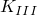 (Mode III stress intensity factor). | | **Attributes: ** | **1 -- ***J* (*J*-integral). |  | **2 -- ** (elastic part of *J*-integral). |  | **3 -- ** (plastic part of *J*-integral). |  | **4 -- ** (Mode I stress intensity factor). |  | **5 -- ** (Mode II stress intensity factor). |  | **6 -- ** (Mode III stress intensity factor). |
| **Attributes: ** | **1 -- ***J* (*J*-integral). |
|  | **2 -- ** (elastic part of *J*-integral). |
|  | **3 -- ** (plastic part of *J*-integral). |
|  | **4 -- ** (Mode I stress intensity factor). |
|  | **5 -- ** (Mode II stress intensity factor). |
|  | **6 -- ** (Mode III stress intensity factor). |

| **Record key: 18**(S) | **Output variable identifier: **POR |
| --- | --- |
| **Record type: **Pore or acoustic pressure| **Attribute: ** | **1 -- **Liquid pressure. | | --- | --- | | **Attribute: ** | **1 -- **Liquid pressure. |
| **Attribute: ** | **1 -- **Liquid pressure. |

| **Record key: 19**(S) | **Output variable identifier: **ELEN |
| --- | --- |
| **Record type: **Energy summed over element| **Attributes: ** | **1 -- **Kinetic energy. | | --- | --- | | | **2 -- **Strain energy. Elastic strain energy is the only whole element energy request available in eigenvalue extractions. None of the element energies are available in modal procedures or direct-solution steady-state dynamics analyses. | | | **3 -- **Plastic dissipation. | | | **4 -- **Creep dissipation. | | | **5 -- **Viscous dissipation, not including dissipation due to stabilization. | | | **6 -- **Static dissipation (due to stabilization). | | | **7 -- **Artificial strain energy. | | | **8 -- **Electrostatic energy. | | | **9 -- **Electrical energy dissipated in a conductor. | | | **10 -- **Damage dissipation. | | **Attributes: ** | **1 -- **Kinetic energy. |  | **2 -- **Strain energy. Elastic strain energy is the only whole element energy request available in eigenvalue extractions. None of the element energies are available in modal procedures or direct-solution steady-state dynamics analyses. |  | **3 -- **Plastic dissipation. |  | **4 -- **Creep dissipation. |  | **5 -- **Viscous dissipation, not including dissipation due to stabilization. |  | **6 -- **Static dissipation (due to stabilization). |  | **7 -- **Artificial strain energy. |  | **8 -- **Electrostatic energy. |  | **9 -- **Electrical energy dissipated in a conductor. |  | **10 -- **Damage dissipation. |
| **Attributes: ** | **1 -- **Kinetic energy. |
|  | **2 -- **Strain energy. Elastic strain energy is the only whole element energy request available in eigenvalue extractions. None of the element energies are available in modal procedures or direct-solution steady-state dynamics analyses. |
|  | **3 -- **Plastic dissipation. |
|  | **4 -- **Creep dissipation. |
|  | **5 -- **Viscous dissipation, not including dissipation due to stabilization. |
|  | **6 -- **Static dissipation (due to stabilization). |
|  | **7 -- **Artificial strain energy. |
|  | **8 -- **Electrostatic energy. |
|  | **9 -- **Electrical energy dissipated in a conductor. |
|  | **10 -- **Damage dissipation. |

| **Record key: 19**(E) | **Output variable identifier: **ELEN |
| --- | --- |
| **Record type: **Energy summed over element| **Attributes: ** | **1 -- **Currently not used. | | --- | --- | | | **2 -- **Strain energy. | | | **3 -- **Plastic dissipation. | | | **4 -- **Viscoelastic dissipation (not supported for hyperelastic and hyperfoam material models). | | | **5 -- **Viscous dissipation. | | | **6 -- **Artificial strain energy. | | | **7 -- **Distortion control dissipation. | | | **8 -- **Currently not used. | | | **9 -- **Internal heat energy. | | | **10 -- **Damage dissipation. | | **Attributes: ** | **1 -- **Currently not used. |  | **2 -- **Strain energy. |  | **3 -- **Plastic dissipation. |  | **4 -- **Viscoelastic dissipation (not supported for hyperelastic and hyperfoam material models). |  | **5 -- **Viscous dissipation. |  | **6 -- **Artificial strain energy. |  | **7 -- **Distortion control dissipation. |  | **8 -- **Currently not used. |  | **9 -- **Internal heat energy. |  | **10 -- **Damage dissipation. |
| **Attributes: ** | **1 -- **Currently not used. |
|  | **2 -- **Strain energy. |
|  | **3 -- **Plastic dissipation. |
|  | **4 -- **Viscoelastic dissipation (not supported for hyperelastic and hyperfoam material models). |
|  | **5 -- **Viscous dissipation. |
|  | **6 -- **Artificial strain energy. |
|  | **7 -- **Distortion control dissipation. |
|  | **8 -- **Currently not used. |
|  | **9 -- **Internal heat energy. |
|  | **10 -- **Damage dissipation. |

| **Record key: 21** | **Output variable identifier: **E |
| --- | --- |
| **Record type: **Total strain in Abaqus/Standard; infinitesimal strain in Abaqus/Explicit| **Attributes: ** | **1 -- **First strain component. | | --- | --- | | | **2 -- **Second strain component. | | | **3 -- **Etc. (See [Part VI, "Elements](pt06.md)," for a definition of the components for a given element type.) | | **Attributes: ** | **1 -- **First strain component. |  | **2 -- **Second strain component. |  | **3 -- **Etc. (See [Part VI, "Elements](pt06.md)," for a definition of the components for a given element type.) |
| **Attributes: ** | **1 -- **First strain component. |
|  | **2 -- **Second strain component. |
|  | **3 -- **Etc. (See [Part VI, "Elements](pt06.md)," for a definition of the components for a given element type.) |

| **Record key: 22** | **Output variable identifier: **PE |
| --- | --- |
| **Record type: **Plastic strains| **Attributes: ** | **1 -- **First plastic strain component. | | --- | --- | | | **2 -- **Second plastic strain component. | | | **3 -- **Etc; followed by the equivalent plastic strain, actively yielding flag (yes or no, A8 format), and magnitude of plastic strain in Abaqus/Standard; followed by "0.0, UNUSED, 0.0" in Abaqus/Explicit for consistency with the length of the Abaqus/Standard record. (See [Part VI, "Elements](pt06.md)," for a definition of the components for a given element type.) | | **Attributes: ** | **1 -- **First plastic strain component. |  | **2 -- **Second plastic strain component. |  | **3 -- **Etc; followed by the equivalent plastic strain, actively yielding flag (yes or no, A8 format), and magnitude of plastic strain in Abaqus/Standard; followed by "0.0, UNUSED, 0.0" in Abaqus/Explicit for consistency with the length of the Abaqus/Standard record. (See [Part VI, "Elements](pt06.md)," for a definition of the components for a given element type.) |
| **Attributes: ** | **1 -- **First plastic strain component. |
|  | **2 -- **Second plastic strain component. |
|  | **3 -- **Etc; followed by the equivalent plastic strain, actively yielding flag (yes or no, A8 format), and magnitude of plastic strain in Abaqus/Standard; followed by "0.0, UNUSED, 0.0" in Abaqus/Explicit for consistency with the length of the Abaqus/Standard record. (See [Part VI, "Elements](pt06.md)," for a definition of the components for a given element type.) |

| **Record key: 23**(S) | **Output variable identifier: **CE |
| --- | --- |
| **Record type: **Creep strains (including swelling)| **Attributes: ** | **1 -- **First creep strain component. | | --- | --- | | | **2 -- **Second creep strain component. | | | **3 -- **Etc; followed by the equivalent creep strain, volumetric swelling strain, and magnitude of creep strain. | | **Attributes: ** | **1 -- **First creep strain component. |  | **2 -- **Second creep strain component. |  | **3 -- **Etc; followed by the equivalent creep strain, volumetric swelling strain, and magnitude of creep strain. |
| **Attributes: ** | **1 -- **First creep strain component. |
|  | **2 -- **Second creep strain component. |
|  | **3 -- **Etc; followed by the equivalent creep strain, volumetric swelling strain, and magnitude of creep strain. |

| **Record key: 24**(S) | **Output variable identifier: **IE |
| --- | --- |
| **Record type: **Total inelastic strains| **Attributes: ** | **1 -- **First inelastic strain component. | | --- | --- | | | **2 -- **Second inelastic strain component. | | | **3 -- **Etc. (See the element description in [Part VI, "Elements](pt06.md)," for a definition of the number and type of the components for the element type.) | | **Attributes: ** | **1 -- **First inelastic strain component. |  | **2 -- **Second inelastic strain component. |  | **3 -- **Etc. (See the element description in [Part VI, "Elements](pt06.md)," for a definition of the number and type of the components for the element type.) |
| **Attributes: ** | **1 -- **First inelastic strain component. |
|  | **2 -- **Second inelastic strain component. |
|  | **3 -- **Etc. (See the element description in [Part VI, "Elements](pt06.md)," for a definition of the number and type of the components for the element type.) |

| **Record key: 25**(S) | **Output variable identifier: **EE |
| --- | --- |
| **Record type: **Total elastic strains| **Attributes: ** | **1 -- **First elastic strain component. | | --- | --- | | | **2 -- **Second elastic strain component. | | | **3 -- **Etc. (See the element description in [Part VI, "Elements](pt06.md)," for a definition of the number and type of the components for the element type.) | | **Attributes: ** | **1 -- **First elastic strain component. |  | **2 -- **Second elastic strain component. |  | **3 -- **Etc. (See the element description in [Part VI, "Elements](pt06.md)," for a definition of the number and type of the components for the element type.) |
| **Attributes: ** | **1 -- **First elastic strain component. |
|  | **2 -- **Second elastic strain component. |
|  | **3 -- **Etc. (See the element description in [Part VI, "Elements](pt06.md)," for a definition of the number and type of the components for the element type.) |

| **Record key: 26** | **Output variable identifier: **CRACK |
| --- | --- |
| **Record type: **Unit normal to crack in concrete| **Attributes: ** | **1 -- **11-component (if a 1D, 2D, or 3D analysis). | | --- | --- | | | **2 -- **12-component (if a 2D or 3D analysis). | | | **3 -- **13-component (if a 3D analysis). | | | **4 -- **21-component (if a 2D or 3D analysis). | | | **5 -- **22-component (if a 2D or 3D analysis). | | | **6 -- **23-component (if a 3D analysis). | | | **7 -- **31-component (if a 3D analysis). | | | **8 -- **32-component (if a 3D analysis). | | | **9 -- **33-component (if a 3D analysis). | | **Attributes: ** | **1 -- **11-component (if a 1D, 2D, or 3D analysis). |  | **2 -- **12-component (if a 2D or 3D analysis). |  | **3 -- **13-component (if a 3D analysis). |  | **4 -- **21-component (if a 2D or 3D analysis). |  | **5 -- **22-component (if a 2D or 3D analysis). |  | **6 -- **23-component (if a 3D analysis). |  | **7 -- **31-component (if a 3D analysis). |  | **8 -- **32-component (if a 3D analysis). |  | **9 -- **33-component (if a 3D analysis). |
| **Attributes: ** | **1 -- **11-component (if a 1D, 2D, or 3D analysis). |
|  | **2 -- **12-component (if a 2D or 3D analysis). |
|  | **3 -- **13-component (if a 3D analysis). |
|  | **4 -- **21-component (if a 2D or 3D analysis). |
|  | **5 -- **22-component (if a 2D or 3D analysis). |
|  | **6 -- **23-component (if a 3D analysis). |
|  | **7 -- **31-component (if a 3D analysis). |
|  | **8 -- **32-component (if a 3D analysis). |
|  | **9 -- **33-component (if a 3D analysis). |

| **Record key: 27** | **Output variable identifier: **STH |
| --- | --- |
| **Record type: **Section thickness| **Attribute: ** | **1 -- **Current section thickness for membranes and finite-strain shells in Abaqus/Standard and for plane stress elements, membranes, and all shells in Abaqus/Explicit. | | --- | --- | | **Attribute: ** | **1 -- **Current section thickness for membranes and finite-strain shells in Abaqus/Standard and for plane stress elements, membranes, and all shells in Abaqus/Explicit. |
| **Attribute: ** | **1 -- **Current section thickness for membranes and finite-strain shells in Abaqus/Standard and for plane stress elements, membranes, and all shells in Abaqus/Explicit. |

| **Record key: 28** | **Output variable identifier: **HFL |
| --- | --- |
| **Record type: **Heat flux vector| **Attributes: ** | **1 -- **Magnitude. | | --- | --- | | | **2 -- **First component. | | | **3 -- **Second component. | | | **4 -- **Etc. | | **Attributes: ** | **1 -- **Magnitude. |  | **2 -- **First component. |  | **3 -- **Second component. |  | **4 -- **Etc. |
| **Attributes: ** | **1 -- **Magnitude. |
|  | **2 -- **First component. |
|  | **3 -- **Second component. |
|  | **4 -- **Etc. |

| **Record key: 29** | **Output variable identifier: **SE |
| --- | --- |
| **Record type: **Section strains and curvatures| **Attributes: ** | **1 -- **First section strain. | | --- | --- | | | **2 -- **Second section strain. | | | **3 -- **Etc. (See the element description in [Part VI, "Elements](pt06.md)," for a definition of what section strains are available for each beam or shell element type.) | | **Attributes: ** | **1 -- **First section strain. |  | **2 -- **Second section strain. |  | **3 -- **Etc. (See the element description in [Part VI, "Elements](pt06.md)," for a definition of what section strains are available for each beam or shell element type.) |
| **Attributes: ** | **1 -- **First section strain. |
|  | **2 -- **Second section strain. |
|  | **3 -- **Etc. (See the element description in [Part VI, "Elements](pt06.md)," for a definition of what section strains are available for each beam or shell element type.) |

| **Record key: 30**(S) | **Output variable identifier: **DG |
| --- | --- |
| **Record type: **Deformation gradient| **Attributes: ** | **1 -- **. | | --- | --- | | | **2 -- **Etc. The record will have `NDI` diagonal components of , then `NSHR` above diagonal components (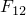, 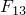, 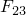), then `NSHR` below diagonal components (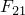, 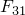, 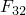), where `NDI` and `NSHR` are given in the element header record (record key 1). Available only for hyperelasticity, hyperfoam, and material models defined in user subroutine [`UMAT`](../sub/sub-link.md#sub-xsl-umat). | | **Attributes: ** | **1 -- **. |  | **2 -- **Etc. The record will have `NDI` diagonal components of , then `NSHR` above diagonal components (, , ), then `NSHR` below diagonal components (, , ), where `NDI` and `NSHR` are given in the element header record (record key 1). Available only for hyperelasticity, hyperfoam, and material models defined in user subroutine [`UMAT`](../sub/sub-link.md#sub-xsl-umat). |
| **Attributes: ** | **1 -- **. |
|  | **2 -- **Etc. The record will have `NDI` diagonal components of , then `NSHR` above diagonal components (, , ), then `NSHR` below diagonal components (, , ), where `NDI` and `NSHR` are given in the element header record (record key 1). Available only for hyperelasticity, hyperfoam, and material models defined in user subroutine [`UMAT`](../sub/sub-link.md#sub-xsl-umat). |

| **Record key: 31**(S) | **Output variable identifier: **CONF |
| --- | --- |
| **Record type: **Concrete failure| **Attribute: ** | **1 -- **Summary of the state of a concrete material point. This is the number of cracks or 1 if the concrete has crushed. | | --- | --- | | **Attribute: ** | **1 -- **Summary of the state of a concrete material point. This is the number of cracks or 1 if the concrete has crushed. |
| **Attribute: ** | **1 -- **Summary of the state of a concrete material point. This is the number of cracks or 1 if the concrete has crushed. |

| **Record key: 32**(S) | **Output variable identifier: **SJP |
| --- | --- |
| **Record type: **Strain jumps at nodes| **Attributes: ** | **1 -- **First strain jump component. | | --- | --- | | | **2 -- **Second strain jump component. | | | **3 -- **Etc. (See the element description in [Part VI, "Elements](pt06.md)," for a definition of the number and type of the components for the element type.) | | **Attributes: ** | **1 -- **First strain jump component. |  | **2 -- **Second strain jump component. |  | **3 -- **Etc. (See the element description in [Part VI, "Elements](pt06.md)," for a definition of the number and type of the components for the element type.) |
| **Attributes: ** | **1 -- **First strain jump component. |
|  | **2 -- **Second strain jump component. |
|  | **3 -- **Etc. (See the element description in [Part VI, "Elements](pt06.md)," for a definition of the number and type of the components for the element type.) |

| **Record key: 33**(S) | **Output variable identifier: **FILM |
| --- | --- |
| **Record type: **Film| **Attributes: ** | **1 -- **Type. | | --- | --- | | | **2 -- **Sink temperature. | | | **3 -- **Film coefficient. | | **Attributes: ** | **1 -- **Type. |  | **2 -- **Sink temperature. |  | **3 -- **Film coefficient. |
| **Attributes: ** | **1 -- **Type. |
|  | **2 -- **Sink temperature. |
|  | **3 -- **Film coefficient. |

| **Record key: 34**(S) | **Output variable identifier: **RAD |
| --- | --- |
| **Record type: **Radiation| **Attributes: ** | **1 -- **Type. | | --- | --- | | | **2 -- **Sink temperature. | | | **3 -- **Radiation constant. | | **Attributes: ** | **1 -- **Type. |  | **2 -- **Sink temperature. |  | **3 -- **Radiation constant. |
| **Attributes: ** | **1 -- **Type. |
|  | **2 -- **Sink temperature. |
|  | **3 -- **Radiation constant. |

| **Record key: 35**(S) | **Output variable identifier: **SAT |
| --- | --- |
| **Record type: **Saturation (pore pressure analysis)| **Attribute: ** | **1 -- **Saturation. | | --- | --- | | **Attribute: ** | **1 -- **Saturation. |
| **Attribute: ** | **1 -- **Saturation. |

| **Record key: 36**(S) | **Output variable identifier: **SS |
| --- | --- |
| **Record type: **Substresses (for ITT elements)| **Attributes: ** | **1 -- **First substress. | | --- | --- | | | **2 -- **Second substress. | | **Attributes: ** | **1 -- **First substress. |  | **2 -- **Second substress. |
| **Attributes: ** | **1 -- **First substress. |
|  | **2 -- **Second substress. |

| **Record key: 38**(S) | **Output variable identifier: **CONC |
| --- | --- |
| **Record type: **Mass concentration (mass diffusion analysis)| **Attribute: ** | **1 -- **Concentration. | | --- | --- | | **Attribute: ** | **1 -- **Concentration. |
| **Attribute: ** | **1 -- **Concentration. |

| **Record key: 446**(S) | **Output variable identifier: **ISOL |
| --- | --- |
| **Record type: **Amount of solute at the integration point (mass diffusion analysis)| **Attribute: ** | **1 -- **Amount of solute. | | --- | --- | | **Attribute: ** | **1 -- **Amount of solute. |
| **Attribute: ** | **1 -- **Amount of solute. |

| **Record key: 447**(S) | **Output variable identifier: **ESOL |
| --- | --- |
| **Record type: **Amount of solute in the current element (mass diffusion analysis)| **Attribute: ** | **1 -- **Amount of solute. | | --- | --- | | **Attribute: ** | **1 -- **Amount of solute. |
| **Attribute: ** | **1 -- **Amount of solute. |

| **Record key: 448**(S) | **Output variable identifier: **SOL |
| --- | --- |
| **Record type: **Amount of solute in the element set or model (mass diffusion analysis)| **Attribute: ** | **1 -- **Amount of solute. | | --- | --- | | **Attribute: ** | **1 -- **Amount of solute. |
| **Attribute: ** | **1 -- **Amount of solute. |

| The number of data items for record 39 depends on the element type. For pore pressure elements and mass diffusion analysis: |
| --- |
| **Record key: 39**(S) | **Output variable identifier: **MFL |
| **Record type: **Mass concentration flux vector| **Attributes: ** | **1 -- **Magnitude. | | --- | --- | | | **2 -- **First component. | | | **3 -- **Second component. | | | **4 -- **Etc. | | **Attributes: ** | **1 -- **Magnitude. |  | **2 -- **First component. |  | **3 -- **Second component. |  | **4 -- **Etc. |
| **Attributes: ** | **1 -- **Magnitude. |
|  | **2 -- **First component. |
|  | **3 -- **Second component. |
|  | **4 -- **Etc. |

| For fluid link elements: |
| --- |
| **Record key: 39**(S) | **Output variable identifier: **MFL |
| **Record type: **Mass flow rate| **Attribute: ** | **1 -- **Current flow rate. | | --- | --- | | **Attribute: ** | **1 -- **Current flow rate. |
| **Attribute: ** | **1 -- **Current flow rate. |

| **Record key: 40**(S) | **Output variable identifier: **GELVR |
| --- | --- |
| **Record type: **Gel (pore pressure analysis)| **Attribute: ** | **1 -- **Gel volume ratio. | | --- | --- | | **Attribute: ** | **1 -- **Gel volume ratio. |
| **Attribute: ** | **1 -- **Gel volume ratio. |

| **Record key: 43**(S) | **Output variable identifier: **FLUVR |
| --- | --- |
| **Record type: **Total fluid volume ratio| **Attribute: ** | **1 -- **Total fluid volume ratio. | | --- | --- | | **Attribute: ** | **1 -- **Total fluid volume ratio. |
| **Attribute: ** | **1 -- **Total fluid volume ratio. |

| **Record key: 61**(E) | **Output variable identifier: **STATUS |
| --- | --- |
| **Record type: **Element status| **Attribute: ** | **1 -- **Status of element (shear failure model, tensile failure model, porous failure criterion, brittle failure model, Johnson-Cook plasticity model, and [`VUMAT`](../sub/sub-link.md#sub-xsl-vumat)). The status of an element is 1.0 if the element is active, 0.0 if the element is not. | | --- | --- | | **Attribute: ** | **1 -- **Status of element (shear failure model, tensile failure model, porous failure criterion, brittle failure model, Johnson-Cook plasticity model, and [`VUMAT`](../sub/sub-link.md#sub-xsl-vumat)). The status of an element is 1.0 if the element is active, 0.0 if the element is not. |
| **Attribute: ** | **1 -- **Status of element (shear failure model, tensile failure model, porous failure criterion, brittle failure model, Johnson-Cook plasticity model, and [`VUMAT`](../sub/sub-link.md#sub-xsl-vumat)). The status of an element is 1.0 if the element is active, 0.0 if the element is not. |

| **Record key: 73**(E) | **Output variable identifier: **PEEQ |
| --- | --- |
| **Record type: **Equivalent plastic strain| **Attribute: ** | **1 -- **Equivalent plastic strain. For crushable foam plasticity with volumetric hardening, it is the volumetric compacting plastic strain. For cap plasticity it is  (the cap position). | | --- | --- | | **Attribute: ** | **1 -- **Equivalent plastic strain. For crushable foam plasticity with volumetric hardening, it is the volumetric compacting plastic strain. For cap plasticity it is  (the cap position). |
| **Attribute: ** | **1 -- **Equivalent plastic strain. For crushable foam plasticity with volumetric hardening, it is the volumetric compacting plastic strain. For cap plasticity it is  (the cap position). |

| **Record key: 74**(E) | **Output variable identifier: **PRESS |
| --- | --- |
| **Record type: **Mean pressure stress| **Attribute: ** | **1 -- **Mean pressure stress. | | --- | --- | | **Attribute: ** | **1 -- **Mean pressure stress. |
| **Attribute: ** | **1 -- **Mean pressure stress. |

| **Record key: 75**(E) | **Output variable identifier: **MISES |
| --- | --- |
| **Record type: **Mises equivalent stress| **Attribute: ** | **1 -- **Mises stress. | | --- | --- | | **Attribute: ** | **1 -- **Mises stress. |
| **Attribute: ** | **1 -- **Mises stress. |

| **Record key: 79**(S) | **Output variable identifier: **RATIO |
| --- | --- |
| **Record type: **Creep strain rate ratio| **Attribute: ** | **1 -- **Current maximum ratio of creep strain rate and target creep strain rate. | | --- | --- | | **Attribute: ** | **1 -- **Current maximum ratio of creep strain rate and target creep strain rate. |
| **Attribute: ** | **1 -- **Current maximum ratio of creep strain rate and target creep strain rate. |

| **Record key: 79**(E) | **Output variable identifier: **ERV |
| --- | --- |
| **Record type: **Volumetric strain rate| **Attribute: ** | **1 -- **Volumetric strain rate. | | --- | --- | | **Attribute: ** | **1 -- **Volumetric strain rate. |
| **Attribute: ** | **1 -- **Volumetric strain rate. |

| **Record key: 80**(S) | **Output variable identifier: **AMPCU |
| --- | --- |
| **Record type: **Solution-dependent amplitude value| **Attribute: ** | **1 -- **Current value of the solution-dependent amplitude. | | --- | --- | | **Attribute: ** | **1 -- **Current value of the solution-dependent amplitude. |
| **Attribute: ** | **1 -- **Current value of the solution-dependent amplitude. |

| **Record key: 83**(S) | **Output variable identifier: **SSAVG |
| --- | --- |
| **Record type: **Average shell section stresses| **Attributes: ** | **1 -- **First section stress. | | --- | --- | | | **2 -- **Second section stress. | | | **3 -- **Etc. (See [Part VI, "Elements](pt06.md)," for a description of which section stresses are available for each shell element type.) | | **Attributes: ** | **1 -- **First section stress. |  | **2 -- **Second section stress. |  | **3 -- **Etc. (See [Part VI, "Elements](pt06.md)," for a description of which section stresses are available for each shell element type.) |
| **Attributes: ** | **1 -- **First section stress. |
|  | **2 -- **Second section stress. |
|  | **3 -- **Etc. (See [Part VI, "Elements](pt06.md)," for a description of which section stresses are available for each shell element type.) |

| The following record is generated in Abaqus/Standard when the local coordinate directions are requested, component output is requested for a material or section point, and the components are given in a local coordinate system (see ["Output of local directions to the results file" in "Output to the data and results files," Section 4.1.2](pt02ch04s01aus39.md#usb-out-oprintfile-results-directions)); it is generated automatically in Abaqus/Explicit when component output is requested for a material or a section point and the components are given in a local coordinate system. Only the first two directions are given; if needed, the third direction can be obtained as the cross product of the first two. The direction record is not generated for trusses, two-dimensional beams, axisymmetric shells or membranes, or for values averaged at nodes. |
| --- |
| **Record key: 85** | **Record type: **Local coordinate directions |
| | **Attributes: ** | **1 -- **First component of the first direction. | | --- | --- | | | **2 -- **Second component of the first direction. | | | **3 -- **Third component of the first direction. | | | **4 -- **First component of the second direction. | | | **5 -- **Second component of the second direction. | | | **6 -- **Third component of the second direction. | | **Attributes: ** | **1 -- **First component of the first direction. |  | **2 -- **Second component of the first direction. |  | **3 -- **Third component of the first direction. |  | **4 -- **First component of the second direction. |  | **5 -- **Second component of the second direction. |  | **6 -- **Third component of the second direction. |
| **Attributes: ** | **1 -- **First component of the first direction. |
|  | **2 -- **Second component of the first direction. |
|  | **3 -- **Third component of the first direction. |
|  | **4 -- **First component of the second direction. |
|  | **5 -- **Second component of the second direction. |
|  | **6 -- **Third component of the second direction. |

| **Record key: 86** | **Output variable identifier: **ALPHA |
| --- | --- |
| **Record type: **Backstress for kinematic hardening plasticity| **Attributes: ** | **1 -- **First  component. | | --- | --- | | | **2 -- **Second  component. | | | **3 -- **Etc. (The number of components is equal to the number of stress components; see the element description in [Part VI, "Elements](pt06.md).") | | **Attributes: ** | **1 -- **First  component. |  | **2 -- **Second  component. |  | **3 -- **Etc. (The number of components is equal to the number of stress components; see the element description in [Part VI, "Elements](pt06.md).") |
| **Attributes: ** | **1 -- **First  component. |
|  | **2 -- **Second  component. |
|  | **3 -- **Etc. (The number of components is equal to the number of stress components; see the element description in [Part VI, "Elements](pt06.md).") |

| **Record key: 87**(S) | **Output variable identifier: **UVARM |
| --- | --- |
| **Record type: **User-defined output variables| **Attributes: ** | **1 -- **Output variable 1. | | --- | --- | | | **2 -- **Output variable 2. | | | **3 -- **Etc. | | **Attributes: ** | **1 -- **Output variable 1. |  | **2 -- **Output variable 2. |  | **3 -- **Etc. |
| **Attributes: ** | **1 -- **Output variable 1. |
|  | **2 -- **Output variable 2. |
|  | **3 -- **Etc. |

| **Record key: 88**(S) | **Output variable identifier: **THE |
| --- | --- |
| **Record type: **Thermal strains| **Attributes: ** | **1 -- **First thermal strain component. | | --- | --- | | | **2 -- **Second thermal strain component. | | | **3 -- **Etc. (See the element description in [Part VI, "Elements](pt06.md)," for a definition of the number and type of the components for the element type.) | | **Attributes: ** | **1 -- **First thermal strain component. |  | **2 -- **Second thermal strain component. |  | **3 -- **Etc. (See the element description in [Part VI, "Elements](pt06.md)," for a definition of the number and type of the components for the element type.) |
| **Attributes: ** | **1 -- **First thermal strain component. |
|  | **2 -- **Second thermal strain component. |
|  | **3 -- **Etc. (See the element description in [Part VI, "Elements](pt06.md)," for a definition of the number and type of the components for the element type.) |

| **Record key: 89** | **Output variable identifier: **LE |
| --- | --- |
| **Record type: **Logarithmic strains| **Attributes: ** | **1 -- **First logarithmic strain component. | | --- | --- | | | **2 -- **Second logarithmic strain component. | | | **3 -- **Etc. (See the element description in [Part VI, "Elements](pt06.md)," for a definition of the number and type of the components for the element type.) | | **Attributes: ** | **1 -- **First logarithmic strain component. |  | **2 -- **Second logarithmic strain component. |  | **3 -- **Etc. (See the element description in [Part VI, "Elements](pt06.md)," for a definition of the number and type of the components for the element type.) |
| **Attributes: ** | **1 -- **First logarithmic strain component. |
|  | **2 -- **Second logarithmic strain component. |
|  | **3 -- **Etc. (See the element description in [Part VI, "Elements](pt06.md)," for a definition of the number and type of the components for the element type.) |

| **Record key: 90** | **Output variable identifier: **NE |
| --- | --- |
| **Record type: **Nominal strains| **Attributes: ** | **1 -- **First nominal strain component. | | --- | --- | | | **2 -- **Second nominal strain component. | | | **3 -- **Etc. (See the element description in [Part VI, "Elements](pt06.md)," for a definition of the number and type of the components for the element type.) | | **Attributes: ** | **1 -- **First nominal strain component. |  | **2 -- **Second nominal strain component. |  | **3 -- **Etc. (See the element description in [Part VI, "Elements](pt06.md)," for a definition of the number and type of the components for the element type.) |
| **Attributes: ** | **1 -- **First nominal strain component. |
|  | **2 -- **Second nominal strain component. |
|  | **3 -- **Etc. (See the element description in [Part VI, "Elements](pt06.md)," for a definition of the number and type of the components for the element type.) |

| **Record key: 91**(S) | **Output variable identifier: **ER |
| --- | --- |
| **Record type: **Mechanical strain rates| **Attributes: ** | **1 -- **First strain rate component. | | --- | --- | | | **2 -- **Second strain rate component. | | | **3 -- **Etc. (See the element description in [Part VI, "Elements](pt06.md)," for a definition of the number and type of the components for the element type.) | | **Attributes: ** | **1 -- **First strain rate component. |  | **2 -- **Second strain rate component. |  | **3 -- **Etc. (See the element description in [Part VI, "Elements](pt06.md)," for a definition of the number and type of the components for the element type.) |
| **Attributes: ** | **1 -- **First strain rate component. |
|  | **2 -- **Second strain rate component. |
|  | **3 -- **Etc. (See the element description in [Part VI, "Elements](pt06.md)," for a definition of the number and type of the components for the element type.) |

| **Record key: 96**(S) | **Output variable identifier: **MFLT |
| --- | --- |
| **Record type: **Total mass flow through fluid link| **Attribute: ** | **1 -- **Magnitude. | | --- | --- | | **Attribute: ** | **1 -- **Magnitude. |
| **Attribute: ** | **1 -- **Magnitude. |

| **Record key: 97**(S) | **Output variable identifier: **FLVEL |
| --- | --- |
| **Record type: **Pore fluid effective velocity vector| **Attributes: ** | **1 -- **Magnitude. | | --- | --- | | | **2 -- **First component. | | | **3 -- **Second component. | | | **4 -- **Etc. | | **Attributes: ** | **1 -- **Magnitude. |  | **2 -- **First component. |  | **3 -- **Second component. |  | **4 -- **Etc. |
| **Attributes: ** | **1 -- **Magnitude. |
|  | **2 -- **First component. |
|  | **3 -- **Second component. |
|  | **4 -- **Etc. |

| **Record key: 476**(E) | **Output variable identifier: **EMSF |
| --- | --- |
| **Record type: **Scaling factor| **Attribute: ** | **1 -- **Element mass scaling factor. | | --- | --- | | **Attribute: ** | **1 -- **Element mass scaling factor. |
| **Attribute: ** | **1 -- **Element mass scaling factor. |

| **Record key: 477**(E) | **Output variable identifier: **EDT |
| --- | --- |
| **Record type: **Element time increment| **Attribute: ** | **1 -- **Element stable time increment. | | --- | --- | | **Attribute: ** | **1 -- **Element stable time increment. |
| **Attribute: ** | **1 -- **Element stable time increment. |

##### **Principal value records**

For all principal values, the number of components equals `NDI` unless `NDI` equals 1, in which case the number of components equals `NDI` plus `NSHR`, where `NDI` and `NSHR` are given on the element header record. In the cases where `NDI` equals 2, only the in-plane values are given.

| **Record key: 401** | **Output variable identifier: **SP |
| --- | --- |
| **Record type: **Principal stresses| **Attributes: ** | **1 -- **Minimum principal stress. | | --- | --- | | | **2 -- **Etc. | | **Attributes: ** | **1 -- **Minimum principal stress. |  | **2 -- **Etc. |
| **Attributes: ** | **1 -- **Minimum principal stress. |
|  | **2 -- **Etc. |

| **Record key: 402** | **Output variable identifier: **ALPHAP |
| --- | --- |
| **Record type: **Principal values of backstress tensor for kinematic hardening plasticity| **Attributes: ** | **1 -- **Minimum principal value. | | --- | --- | | | **2 -- **Etc. | | **Attributes: ** | **1 -- **Minimum principal value. |  | **2 -- **Etc. |
| **Attributes: ** | **1 -- **Minimum principal value. |
|  | **2 -- **Etc. |

| **Record key: 403** | **Output variable identifier: **EP |
| --- | --- |
| **Record type: **Principal strains| **Attributes: ** | **1 -- **Minimum principal strain. | | --- | --- | | | **2 -- **Etc. | | **Attributes: ** | **1 -- **Minimum principal strain. |  | **2 -- **Etc. |
| **Attributes: ** | **1 -- **Minimum principal strain. |
|  | **2 -- **Etc. |

| **Record key: 404** | **Output variable identifier: **NEP |
| --- | --- |
| **Record type: **Principal nominal strains| **Attributes: ** | **1 -- **Minimum principal nominal strain. | | --- | --- | | | **2 -- **Etc. | | **Attributes: ** | **1 -- **Minimum principal nominal strain. |  | **2 -- **Etc. |
| **Attributes: ** | **1 -- **Minimum principal nominal strain. |
|  | **2 -- **Etc. |

| **Record key: 405** | **Output variable identifier: **LEP |
| --- | --- |
| **Record type: **Principal logarithmic strains| **Attributes: ** | **1 -- **Minimum principal logarithmic strain. | | --- | --- | | | **2 -- **Etc. | | **Attributes: ** | **1 -- **Minimum principal logarithmic strain. |  | **2 -- **Etc. |
| **Attributes: ** | **1 -- **Minimum principal logarithmic strain. |
|  | **2 -- **Etc. |

| **Record key: 406**(S) | **Output variable identifier: **ERP |
| --- | --- |
| **Record type: **Principal mechanical strain rates| **Attributes: ** | **1 -- **Minimum principal strain rate. | | --- | --- | | | **2 -- **Etc. | | **Attributes: ** | **1 -- **Minimum principal strain rate. |  | **2 -- **Etc. |
| **Attributes: ** | **1 -- **Minimum principal strain rate. |
|  | **2 -- **Etc. |

| **Record key: 407**(S) | **Output variable identifier: **DGP |
| --- | --- |
| **Record type: **Principal values of deformation gradient| **Attributes: ** | **1 -- **Minimum principal value. | | --- | --- | | | **2 -- **Etc. | | **Attributes: ** | **1 -- **Minimum principal value. |  | **2 -- **Etc. |
| **Attributes: ** | **1 -- **Minimum principal value. |
|  | **2 -- **Etc. |

| **Record key: 408**(S) | **Output variable identifier: **EEP |
| --- | --- |
| **Record type: **Principal elastic strains| **Attributes: ** | **1 -- **Minimum principal elastic strain. | | --- | --- | | | **2 -- **Etc. | | **Attributes: ** | **1 -- **Minimum principal elastic strain. |  | **2 -- **Etc. |
| **Attributes: ** | **1 -- **Minimum principal elastic strain. |
|  | **2 -- **Etc. |

| **Record key: 409**(S) | **Output variable identifier: **IEP |
| --- | --- |
| **Record type: **Principal inelastic strains| **Attributes: ** | **1 -- **Minimum principal inelastic strain. | | --- | --- | | | **2 -- **Etc. | | **Attributes: ** | **1 -- **Minimum principal inelastic strain. |  | **2 -- **Etc. |
| **Attributes: ** | **1 -- **Minimum principal inelastic strain. |
|  | **2 -- **Etc. |

| **Record key: 410**(S) | **Output variable identifier: **THEP |
| --- | --- |
| **Record type: **Principal thermal strains| **Attributes: ** | **1 -- **Minimum principal thermal strain. | | --- | --- | | | **2 -- **Etc. | | **Attributes: ** | **1 -- **Minimum principal thermal strain. |  | **2 -- **Etc. |
| **Attributes: ** | **1 -- **Minimum principal thermal strain. |
|  | **2 -- **Etc. |

| **Record key: 411**(S) | **Output variable identifier: **PEP |
| --- | --- |
| **Record type: **Principal plastic strains| **Attributes: ** | **1 -- **Minimum principal plastic strain. | | --- | --- | | | **2 -- **Etc. | | **Attributes: ** | **1 -- **Minimum principal plastic strain. |  | **2 -- **Etc. |
| **Attributes: ** | **1 -- **Minimum principal plastic strain. |
|  | **2 -- **Etc. |

| **Record key: 412**(S) | **Output variable identifier: **CEP |
| --- | --- |
| **Record type: **Principal creep strains| **Attributes: ** | **1 -- **Minimum principal creep strain. | | --- | --- | | | **2 -- **Etc. | | **Attributes: ** | **1 -- **Minimum principal creep strain. |  | **2 -- **Etc. |
| **Attributes: ** | **1 -- **Minimum principal creep strain. |
|  | **2 -- **Etc. |

##### **Records for porous metal plasticity**

| **Record key: 413** | **Output variable identifier: **VVF |
| --- | --- |
| **Record type: **Void volume fraction| **Attribute: ** | **1 -- ***f*. | | --- | --- | | **Attribute: ** | **1 -- ***f*. |
| **Attribute: ** | **1 -- ***f*. |

| **Record key: 414** | **Output variable identifier: **VVFG |
| --- | --- |
| **Record type: **Void volume fraction (growth)| **Attribute: ** | **1 -- **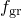. | | --- | --- | | **Attribute: ** | **1 -- **. |
| **Attribute: ** | **1 -- **. |

| **Record key: 415** | **Output variable identifier: **VVFN |
| --- | --- |
| **Record type: **Void volume fraction (nucleation)| **Attribute: ** | **1 -- **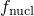. | | --- | --- | | **Attribute: ** | **1 -- **. |
| **Attribute: ** | **1 -- **. |

| **Record key: 416**(S) | **Output variable identifier: **RD |
| --- | --- |
| **Record type: **Relative density| **Attribute: ** | **1 -- **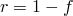 | | --- | --- | | **Attribute: ** | **1 -- ** |
| **Attribute: ** | **1 -- ** |

##### **Records for brittle cracking**

| **Record key: 421**(E) | **Output variable identifier: **CKE |
| --- | --- |
| **Record type: **Cracking strains| **Attributes: ** | **1 -- **First cracking strain component. | | --- | --- | | | **2 -- **Second cracking strain component. | | | **3 -- **Etc. (See [Part VI, "Elements](pt06.md)," for a definition of the number and the type of the components for the element type.) | | **Attributes: ** | **1 -- **First cracking strain component. |  | **2 -- **Second cracking strain component. |  | **3 -- **Etc. (See [Part VI, "Elements](pt06.md)," for a definition of the number and the type of the components for the element type.) |
| **Attributes: ** | **1 -- **First cracking strain component. |
|  | **2 -- **Second cracking strain component. |
|  | **3 -- **Etc. (See [Part VI, "Elements](pt06.md)," for a definition of the number and the type of the components for the element type.) |

| **Record key: 422**(E) | **Output variable identifier: **CKLE |
| --- | --- |
| **Record type: **Local cracking strains| **Attributes: ** | **1 -- **First strain component in local crack directions. | | --- | --- | | | **2 -- **Second strain component in local crack directions. | | | **3 -- **Etc. (See [Part VI, "Elements](pt06.md)," for a definition of the number and the type of the components for the element type.) | | **Attributes: ** | **1 -- **First strain component in local crack directions. |  | **2 -- **Second strain component in local crack directions. |  | **3 -- **Etc. (See [Part VI, "Elements](pt06.md)," for a definition of the number and the type of the components for the element type.) |
| **Attributes: ** | **1 -- **First strain component in local crack directions. |
|  | **2 -- **Second strain component in local crack directions. |
|  | **3 -- **Etc. (See [Part VI, "Elements](pt06.md)," for a definition of the number and the type of the components for the element type.) |

| **Record key: 423**(E) | **Output variable identifier: **CKLS |
| --- | --- |
| **Record type: **Local cracking stresses| **Attributes: ** | **1 -- **First stress component in local crack directions. | | --- | --- | | | **2 -- **Second stress component in local crack directions. | | | **3 -- **Etc. (See [Part VI, "Elements](pt06.md)," for a definition of the number and the type of the components for the element type.) | | **Attributes: ** | **1 -- **First stress component in local crack directions. |  | **2 -- **Second stress component in local crack directions. |  | **3 -- **Etc. (See [Part VI, "Elements](pt06.md)," for a definition of the number and the type of the components for the element type.) |
| **Attributes: ** | **1 -- **First stress component in local crack directions. |
|  | **2 -- **Second stress component in local crack directions. |
|  | **3 -- **Etc. (See [Part VI, "Elements](pt06.md)," for a definition of the number and the type of the components for the element type.) |

| **Record key: 424**(E) | **Output variable identifier: **CKSTAT |
| --- | --- |
| **Record type: **Status of cracks| **Attributes: ** | **1 -- **Status of first crack (if a 1D, 2D, or 3D analysis). CKSTAT can have the following values: 0.0=uncracked, 1.0=closed crack, 2.0=actively cracking, 3.0=crack closing/reopening. | | --- | --- | | | **2 -- **Status of second crack (if a 2D or 3D analysis). | | | **3 -- **Status of third crack (if a 3D analysis). | | **Attributes: ** | **1 -- **Status of first crack (if a 1D, 2D, or 3D analysis). CKSTAT can have the following values: 0.0=uncracked, 1.0=closed crack, 2.0=actively cracking, 3.0=crack closing/reopening. |  | **2 -- **Status of second crack (if a 2D or 3D analysis). |  | **3 -- **Status of third crack (if a 3D analysis). |
| **Attributes: ** | **1 -- **Status of first crack (if a 1D, 2D, or 3D analysis). CKSTAT can have the following values: 0.0=uncracked, 1.0=closed crack, 2.0=actively cracking, 3.0=crack closing/reopening. |
|  | **2 -- **Status of second crack (if a 2D or 3D analysis). |
|  | **3 -- **Status of third crack (if a 3D analysis). |

| **Record key: 441**(E) | **Output variable identifier: **CKEMAG |
| --- | --- |
| **Record type: **Cracking strain magnitude| **Attribute: ** | **1 -- **Magnitude of cracking strain. | | --- | --- | | **Attribute: ** | **1 -- **Magnitude of cracking strain. |
| **Attribute: ** | **1 -- **Magnitude of cracking strain. |

##### **Records for inelastic nonlinear response in a beam general section**

| **Record key: 42**(S) | **Output variable identifier: **SPE |
| --- | --- |
| **Record type: **Plastic strain components| **Attributes: ** | **1 -- **Axial plastic strain. | | --- | --- | | | **2 -- **Curvature change about the local 1-axis. | | | **3 -- **Curvature change about the local 2-axis (available only for 3D beams). | | | **4 -- **Twist of the beam (available only for 3D beams). | | **Attributes: ** | **1 -- **Axial plastic strain. |  | **2 -- **Curvature change about the local 1-axis. |  | **3 -- **Curvature change about the local 2-axis (available only for 3D beams). |  | **4 -- **Twist of the beam (available only for 3D beams). |
| **Attributes: ** | **1 -- **Axial plastic strain. |
|  | **2 -- **Curvature change about the local 1-axis. |
|  | **3 -- **Curvature change about the local 2-axis (available only for 3D beams). |
|  | **4 -- **Twist of the beam (available only for 3D beams). |

| **Record key: 47**(S) | **Output variable identifier: **SEPE |
| --- | --- |
| **Record type: **Equivalent plastic strains| **Attributes: ** | **1 -- **Axial equivalent plastic strain. | | --- | --- | | | **2 -- **Curvature change about the local 1-axis. | | | **3 -- **Curvature change about the local 2-axis (available only for 3D beams). | | | **4 -- **Twist of the beam (available only for 3D beams). | | **Attributes: ** | **1 -- **Axial equivalent plastic strain. |  | **2 -- **Curvature change about the local 1-axis. |  | **3 -- **Curvature change about the local 2-axis (available only for 3D beams). |  | **4 -- **Twist of the beam (available only for 3D beams). |
| **Attributes: ** | **1 -- **Axial equivalent plastic strain. |
|  | **2 -- **Curvature change about the local 1-axis. |
|  | **3 -- **Curvature change about the local 2-axis (available only for 3D beams). |
|  | **4 -- **Twist of the beam (available only for 3D beams). |

##### **Records for elastic-plastic response in frame elements**

| **Record key: 462**(S) | **Output variable identifier: **SEE |
| --- | --- |
| **Record type: **Elastic section strain components| **Attributes: ** | **1 -- **Elastic axial strain. | | --- | --- | | | **2 -- **Elastic curvature change about the local 1-axis. | | | **3 -- **Elastic curvature change about the local 2-axis (available only for 3D frame elements). | | | **4 -- **Elastic twist of the beam (available only for 3D frame elements). | | **Attributes: ** | **1 -- **Elastic axial strain. |  | **2 -- **Elastic curvature change about the local 1-axis. |  | **3 -- **Elastic curvature change about the local 2-axis (available only for 3D frame elements). |  | **4 -- **Elastic twist of the beam (available only for 3D frame elements). |
| **Attributes: ** | **1 -- **Elastic axial strain. |
|  | **2 -- **Elastic curvature change about the local 1-axis. |
|  | **3 -- **Elastic curvature change about the local 2-axis (available only for 3D frame elements). |
|  | **4 -- **Elastic twist of the beam (available only for 3D frame elements). |

| **Record key: 463**(S) | **Output variable identifier: **SEP |
| --- | --- |
| **Record type: **Plastic displacements at frame element's ends| **Attributes: ** | **1 -- **Plastic axial displacement. | | --- | --- | | | **2 -- **Plastic rotation about the local 1-axis. | | | **3 -- **Plastic rotation about the local 2-axis (available only for 3D frame elements). | | | **4 -- **Plastic rotation about the element axis (available only for 3D frame elements). | | | **5 -- **Actively yielding flag (yes or no, A8 format) for frame element's end sections. | | | **6 -- **Buckling flag (yes, no, or na; A8 format) for frame element's end sections. | | **Attributes: ** | **1 -- **Plastic axial displacement. |  | **2 -- **Plastic rotation about the local 1-axis. |  | **3 -- **Plastic rotation about the local 2-axis (available only for 3D frame elements). |  | **4 -- **Plastic rotation about the element axis (available only for 3D frame elements). |  | **5 -- **Actively yielding flag (yes or no, A8 format) for frame element's end sections. |  | **6 -- **Buckling flag (yes, no, or na; A8 format) for frame element's end sections. |
| **Attributes: ** | **1 -- **Plastic axial displacement. |
|  | **2 -- **Plastic rotation about the local 1-axis. |
|  | **3 -- **Plastic rotation about the local 2-axis (available only for 3D frame elements). |
|  | **4 -- **Plastic rotation about the element axis (available only for 3D frame elements). |
|  | **5 -- **Actively yielding flag (yes or no, A8 format) for frame element's end sections. |
|  | **6 -- **Buckling flag (yes, no, or na; A8 format) for frame element's end sections. |

| **Record key: 464**(S) | **Output variable identifier: **SALPHA |
| --- | --- |
| **Record type: **Generalized backstress components| **Attributes: ** | **1 -- **Axial backstress component. | | --- | --- | | | **2 -- **Bending backstress about the local 1-axis. | | | **3 -- **Bending backstress about the local 2-axis (available only for 3D frame elements). | | | **4 -- **Twist backstress of the beam (available only for 3D frame elements). | | **Attributes: ** | **1 -- **Axial backstress component. |  | **2 -- **Bending backstress about the local 1-axis. |  | **3 -- **Bending backstress about the local 2-axis (available only for 3D frame elements). |  | **4 -- **Twist backstress of the beam (available only for 3D frame elements). |
| **Attributes: ** | **1 -- **Axial backstress component. |
|  | **2 -- **Bending backstress about the local 1-axis. |
|  | **3 -- **Bending backstress about the local 2-axis (available only for 3D frame elements). |
|  | **4 -- **Twist backstress of the beam (available only for 3D frame elements). |

##### **Records for connector elements**

| **Record key: 495** | **Output variable identifier: **CTF |
| --- | --- |
| **Record type: **Connector total force| **Attributes: ** | **1 -- **First component of total force. | | --- | --- | | | **2 -- **Second component of total force. | | | **3 -- **Etc. | | **Attributes: ** | **1 -- **First component of total force. |  | **2 -- **Second component of total force. |  | **3 -- **Etc. |
| **Attributes: ** | **1 -- **First component of total force. |
|  | **2 -- **Second component of total force. |
|  | **3 -- **Etc. |

| **Record key: 496** | **Output variable identifier: **CEF |
| --- | --- |
| **Record type: **Connector elastic force| **Attributes: ** | **1 -- **First component of elastic force. | | --- | --- | | | **2 -- **Second component of elastic force. | | | **3 -- **Etc. | | **Attributes: ** | **1 -- **First component of elastic force. |  | **2 -- **Second component of elastic force. |  | **3 -- **Etc. |
| **Attributes: ** | **1 -- **First component of elastic force. |
|  | **2 -- **Second component of elastic force. |
|  | **3 -- **Etc. |

| **Record key: 497** | **Output variable identifier: **CVF |
| --- | --- |
| **Record type: **Connector viscous force| **Attributes: ** | **1 -- **First component of viscous force. | | --- | --- | | | **2 -- **Second component of viscous force. | | | **3 -- **Etc. | | **Attributes: ** | **1 -- **First component of viscous force. |  | **2 -- **Second component of viscous force. |  | **3 -- **Etc. |
| **Attributes: ** | **1 -- **First component of viscous force. |
|  | **2 -- **Second component of viscous force. |
|  | **3 -- **Etc. |

| **Record key: 498** | **Output variable identifier: **CSF |
| --- | --- |
| **Record type: **Connector friction force| **Attributes: ** | **1 -- **First component of friction force. | | --- | --- | | | **2 -- **Second component of friction force. | | | **3 -- **Etc. | | **Attributes: ** | **1 -- **First component of friction force. |  | **2 -- **Second component of friction force. |  | **3 -- **Etc. |
| **Attributes: ** | **1 -- **First component of friction force. |
|  | **2 -- **Second component of friction force. |
|  | **3 -- **Etc. |

| **Record key: 499** | **Output variable identifier: **CSLST |
| --- | --- |
| **Record type: **Connector lock and connector stop status flags| **Attributes: ** | **1 -- **Flag in the 1-direction. | | --- | --- | | | **2 -- **Flag in the 2-direction. | | | **3 -- **Etc. | | **Attributes: ** | **1 -- **Flag in the 1-direction. |  | **2 -- **Flag in the 2-direction. |  | **3 -- **Etc. |
| **Attributes: ** | **1 -- **Flag in the 1-direction. |
|  | **2 -- **Flag in the 2-direction. |
|  | **3 -- **Etc. |

| **Record key: 500** | **Output variable identifier: **CRF |
| --- | --- |
| **Record type: **Connector reaction force| **Attributes: ** | **1 -- **First component of reaction force. | | --- | --- | | | **2 -- **Second component of reaction force. | | | **3 -- **Etc. | | **Attributes: ** | **1 -- **First component of reaction force. |  | **2 -- **Second component of reaction force. |  | **3 -- **Etc. |
| **Attributes: ** | **1 -- **First component of reaction force. |
|  | **2 -- **Second component of reaction force. |
|  | **3 -- **Etc. |

| **Record key: 501** | **Output variable identifier: **CCF |
| --- | --- |
| **Record type: **Connector concentrated force| **Attributes: ** | **1 -- **First component of concentrated force. | | --- | --- | | | **2 -- **Second component of concentrated force. | | | **3 -- **Etc. | | **Attributes: ** | **1 -- **First component of concentrated force. |  | **2 -- **Second component of concentrated force. |  | **3 -- **Etc. |
| **Attributes: ** | **1 -- **First component of concentrated force. |
|  | **2 -- **Second component of concentrated force. |
|  | **3 -- **Etc. |

| **Record key: 502** | **Output variable identifier: **CP |
| --- | --- |
| **Record type: **Connector relative position| **Attributes: ** | **1 -- **First component of relative position. | | --- | --- | | | **2 -- **Second component of relative position. | | | **3 -- **Etc. | | **Attributes: ** | **1 -- **First component of relative position. |  | **2 -- **Second component of relative position. |  | **3 -- **Etc. |
| **Attributes: ** | **1 -- **First component of relative position. |
|  | **2 -- **Second component of relative position. |
|  | **3 -- **Etc. |

| **Record key: 503** | **Output variable identifier: **CU |
| --- | --- |
| **Record type: **Connector relative displacement| **Attributes: ** | **1 -- **First component of relative displacement. | | --- | --- | | | **2 -- **Second component of relative displacement. | | | **3 -- **Etc. | | **Attributes: ** | **1 -- **First component of relative displacement. |  | **2 -- **Second component of relative displacement. |  | **3 -- **Etc. |
| **Attributes: ** | **1 -- **First component of relative displacement. |
|  | **2 -- **Second component of relative displacement. |
|  | **3 -- **Etc. |

| **Record key: 504** | **Output variable identifier: **CCU |
| --- | --- |
| **Record type: **Connector constitutive displacement| **Attributes: ** | **1 -- **First component of constitutive displacement. | | --- | --- | | | **2 -- **Second component of constitutive displacement. | | | **3 -- **Etc. | | **Attributes: ** | **1 -- **First component of constitutive displacement. |  | **2 -- **Second component of constitutive displacement. |  | **3 -- **Etc. |
| **Attributes: ** | **1 -- **First component of constitutive displacement. |
|  | **2 -- **Second component of constitutive displacement. |
|  | **3 -- **Etc. |

| **Record key: 505** | **Output variable identifier: **CV |
| --- | --- |
| **Record type: **Connector relative velocity| **Attributes: ** | **1 -- **First component of relative velocity. | | --- | --- | | | **2 -- **Second component of relative velocity. | | | **3 -- **Etc. | | **Attributes: ** | **1 -- **First component of relative velocity. |  | **2 -- **Second component of relative velocity. |  | **3 -- **Etc. |
| **Attributes: ** | **1 -- **First component of relative velocity. |
|  | **2 -- **Second component of relative velocity. |
|  | **3 -- **Etc. |

| **Record key: 506** | **Output variable identifier: **CA |
| --- | --- |
| **Record type: **Connector relative acceleration| **Attributes: ** | **1 -- **First component of relative acceleration. | | --- | --- | | | **2 -- **Second component of relative acceleration. | | | **3 -- **Etc. | | **Attributes: ** | **1 -- **First component of relative acceleration. |  | **2 -- **Second component of relative acceleration. |  | **3 -- **Etc. |
| **Attributes: ** | **1 -- **First component of relative acceleration. |
|  | **2 -- **Second component of relative acceleration. |
|  | **3 -- **Etc. |

| **Record key: 507**(E) | **Output variable identifier: **CFAILST |
| --- | --- |
| **Record type: **Connector failure status flags| **Attributes: ** | **1 -- **Flag in the 1-direction. | | --- | --- | | | **2 -- **Flag in the 2-direction. | | | **3 -- **Etc. | | **Attributes: ** | **1 -- **Flag in the 1-direction. |  | **2 -- **Flag in the 2-direction. |  | **3 -- **Etc. |
| **Attributes: ** | **1 -- **Flag in the 1-direction. |
|  | **2 -- **Flag in the 2-direction. |
|  | **3 -- **Etc. |

| **Record key: 542** | **Output variable identifier: **CNF |
| --- | --- |
| **Record type: **Connector friction-generating contact force| **Attributes: ** | **1 -- **First component of friction-generating force. | | --- | --- | | | **2 -- **Second component of friction-generating force. | | | **3 -- **Etc. | | **Attributes: ** | **1 -- **First component of friction-generating force. |  | **2 -- **Second component of friction-generating force. |  | **3 -- **Etc. |
| **Attributes: ** | **1 -- **First component of friction-generating force. |
|  | **2 -- **Second component of friction-generating force. |
|  | **3 -- **Etc. |

| **Record key: 546** | **Output variable identifier: **CIVC |
| --- | --- |
| **Record type: **Connector relative velocity in the direction of instantaneous slip| **Attribute: ** | **1 -- **Relative velocity in the direction of instantaneous slip. | | --- | --- | | **Attribute: ** | **1 -- **Relative velocity in the direction of instantaneous slip. |
| **Attribute: ** | **1 -- **Relative velocity in the direction of instantaneous slip. |

| **Record key: 548** | **Output variable identifier: **CASU |
| --- | --- |
| **Record type: **Accumulated frictional slip| **Attributes: ** | **1 -- **First component of accumulated frictional slip. | | --- | --- | | | **2 -- **Second component of accumulated frictional slip. | | | **3 -- **Etc. | | **Attributes: ** | **1 -- **First component of accumulated frictional slip. |  | **2 -- **Second component of accumulated frictional slip. |  | **3 -- **Etc. |
| **Attributes: ** | **1 -- **First component of accumulated frictional slip. |
|  | **2 -- **Second component of accumulated frictional slip. |
|  | **3 -- **Etc. |

| **Record key: 556** | **Output variable identifier: **CUE |
| --- | --- |
| **Record type: **Connector elastic displacement| **Attributes: ** | **1 -- **First component of elastic displacement. | | --- | --- | | | **2 -- **Second component of elastic displacement. | | | **3 -- **Etc. | | **Attributes: ** | **1 -- **First component of elastic displacement. |  | **2 -- **Second component of elastic displacement. |  | **3 -- **Etc. |
| **Attributes: ** | **1 -- **First component of elastic displacement. |
|  | **2 -- **Second component of elastic displacement. |
|  | **3 -- **Etc. |

| **Record key: 557** | **Output variable identifier: **CUP |
| --- | --- |
| **Record type: **Connector plastic relative displacement| **Attributes: ** | **1 -- **First component of plastic relative displacement. | | --- | --- | | | **2 -- **Second component of plastic relative displacement. | | | **3 -- **Etc. | | **Attributes: ** | **1 -- **First component of plastic relative displacement. |  | **2 -- **Second component of plastic relative displacement. |  | **3 -- **Etc. |
| **Attributes: ** | **1 -- **First component of plastic relative displacement. |
|  | **2 -- **Second component of plastic relative displacement. |
|  | **3 -- **Etc. |

| **Record key: 558** | **Output variable identifier: **CUPEQ |
| --- | --- |
| **Record type: **Connector equivalent plastic relative displacement| **Attributes: ** | **1 -- **First component of equivalent plastic relative displacement. | | --- | --- | | | **2 -- **Second component of equivalent plastic relative displacement. | | | **3 -- **Etc. | | **Attributes: ** | **1 -- **First component of equivalent plastic relative displacement. |  | **2 -- **Second component of equivalent plastic relative displacement. |  | **3 -- **Etc. |
| **Attributes: ** | **1 -- **First component of equivalent plastic relative displacement. |
|  | **2 -- **Second component of equivalent plastic relative displacement. |
|  | **3 -- **Etc. |

| **Record key: 559**(E) | **Output variable identifier: **CDMG |
| --- | --- |
| **Record type: **Connector overall damage variable| **Attributes: ** | **1 -- **First component of overall damage variable. | | --- | --- | | | **2 -- **Second component of overall damage variable. | | | **3 -- **Etc. | | **Attributes: ** | **1 -- **First component of overall damage variable. |  | **2 -- **Second component of overall damage variable. |  | **3 -- **Etc. |
| **Attributes: ** | **1 -- **First component of overall damage variable. |
|  | **2 -- **Second component of overall damage variable. |
|  | **3 -- **Etc. |

| **Record key: 560**(E) | **Output variable identifier: **CDIF |
| --- | --- |
| **Record type: **Connector force-based damage initiation criterion| **Attributes: ** | **1 -- **First component of connector force-based damage initiation criterion. | | --- | --- | | | **2 -- **Second component of connector force-based damage initiation criterion. | | | **3 -- **Etc. | | **Attributes: ** | **1 -- **First component of connector force-based damage initiation criterion. |  | **2 -- **Second component of connector force-based damage initiation criterion. |  | **3 -- **Etc. |
| **Attributes: ** | **1 -- **First component of connector force-based damage initiation criterion. |
|  | **2 -- **Second component of connector force-based damage initiation criterion. |
|  | **3 -- **Etc. |

| **Record key: 561**(E) | **Output variable identifier: **CDIM |
| --- | --- |
| **Record type: **Connector motion-based damage initiation criterion| **Attributes: ** | **1 -- **First component of connector motion-based damage initiation criterion. | | --- | --- | | | **2 -- **Second component of connector motion-based damage initiation criterion. | | | **3 -- **Etc. | | **Attributes: ** | **1 -- **First component of connector motion-based damage initiation criterion. |  | **2 -- **Second component of connector motion-based damage initiation criterion. |  | **3 -- **Etc. |
| **Attributes: ** | **1 -- **First component of connector motion-based damage initiation criterion. |
|  | **2 -- **Second component of connector motion-based damage initiation criterion. |
|  | **3 -- **Etc. |

| **Record key: 562**(E) | **Output variable identifier: **CDIP |
| --- | --- |
| **Record type: **Connector plastic motion-based damage initiation criterion| **Attributes: ** | **1 -- **First component of connector plastic motion-based damage initiation criterion. | | --- | --- | | | **2 -- **Second component of connector plastic motion-based damage initiation criterion. | | | **3 -- **Etc. | | **Attributes: ** | **1 -- **First component of connector plastic motion-based damage initiation criterion. |  | **2 -- **Second component of connector plastic motion-based damage initiation criterion. |  | **3 -- **Etc. |
| **Attributes: ** | **1 -- **First component of connector plastic motion-based damage initiation criterion. |
|  | **2 -- **Second component of connector plastic motion-based damage initiation criterion. |
|  | **3 -- **Etc. |

| **Record key: 563** | **Output variable identifier: **CALPHAF |
| --- | --- |
| **Record type: **Connector kinematic hardening shift force| **Attributes: ** | **1 -- **First component of connector kinematic hardening shift force. | | --- | --- | | | **2 -- **Second component of connector kinematic hardening shift force. | | | **3 -- **Etc. | | **Attributes: ** | **1 -- **First component of connector kinematic hardening shift force. |  | **2 -- **Second component of connector kinematic hardening shift force. |  | **3 -- **Etc. |
| **Attributes: ** | **1 -- **First component of connector kinematic hardening shift force. |
|  | **2 -- **Second component of connector kinematic hardening shift force. |
|  | **3 -- **Etc. |

##### **Record for plane stress orthotropic failure measures**

| **Record key: 44**(S) | **Output variable identifier: **CFAILURE |
| --- | --- |
| **Record type: **Failure measures| **Attributes: ** | **1 -- **Maximum stress theory. | | --- | --- | | | **2 -- **Tsai-Hill theory. | | | **3 -- **Tsai-Wu theory. | | | **4 -- **Azzi-Tsai-Hill theory. | | | **5 -- **Maximum strain theory. | | **Attributes: ** | **1 -- **Maximum stress theory. |  | **2 -- **Tsai-Hill theory. |  | **3 -- **Tsai-Wu theory. |  | **4 -- **Azzi-Tsai-Hill theory. |  | **5 -- **Maximum strain theory. |
| **Attributes: ** | **1 -- **Maximum stress theory. |
|  | **2 -- **Tsai-Hill theory. |
|  | **3 -- **Tsai-Wu theory. |
|  | **4 -- **Azzi-Tsai-Hill theory. |
|  | **5 -- **Maximum strain theory. |

##### **Record for equivalent plastic strain components for cap plasticity**

| **Record key: 45** | **Output variable identifier: **PEQC |
| --- | --- |
| **Record type: **Equivalent plastic strain components| **Attributes: ** | **1 -- **Equivalent plastic strain for Drucker-Prager failure surface. | | --- | --- | | | **2 -- **Actively yielding flag (yes or no, A8 format) for Drucker-Prager failure surface. | | | **3 -- **Equivalent plastic strain for cap surface. | | | **4 -- **Actively yielding flag (yes or no, A8 format) for cap surface. | | | **5 -- **Equivalent plastic strain for transition surface. | | | **6 -- **Actively yielding flag (yes or no, A8 format) for transition surface. | | | **7 -- **Total volumetric inelastic strain. | | | **8 -- **Actively yielding flag (yes or no, A8 format). | | **Attributes: ** | **1 -- **Equivalent plastic strain for Drucker-Prager failure surface. |  | **2 -- **Actively yielding flag (yes or no, A8 format) for Drucker-Prager failure surface. |  | **3 -- **Equivalent plastic strain for cap surface. |  | **4 -- **Actively yielding flag (yes or no, A8 format) for cap surface. |  | **5 -- **Equivalent plastic strain for transition surface. |  | **6 -- **Actively yielding flag (yes or no, A8 format) for transition surface. |  | **7 -- **Total volumetric inelastic strain. |  | **8 -- **Actively yielding flag (yes or no, A8 format). |
| **Attributes: ** | **1 -- **Equivalent plastic strain for Drucker-Prager failure surface. |
|  | **2 -- **Actively yielding flag (yes or no, A8 format) for Drucker-Prager failure surface. |
|  | **3 -- **Equivalent plastic strain for cap surface. |
|  | **4 -- **Actively yielding flag (yes or no, A8 format) for cap surface. |
|  | **5 -- **Equivalent plastic strain for transition surface. |
|  | **6 -- **Actively yielding flag (yes or no, A8 format) for transition surface. |
|  | **7 -- **Total volumetric inelastic strain. |
|  | **8 -- **Actively yielding flag (yes or no, A8 format). |

##### **Record for equivalent plastic strain components for jointed materials**

| **Record key: 45**(S) | **Output variable identifier: **PEQC |
| --- | --- |
| **Record type: **Equivalent plastic strain components| **Attributes: ** | **1 -- **Equivalent plastic strain for joint 1. | | --- | --- | | | **2 -- **Actively yielding flag (yes or no, A8 format) for joint 1. | | | **3 -- **Equivalent plastic strain for joint 2. | | | **4 -- **Actively yielding flag (yes or no, A8 format) for joint 2. | | | **5 -- **Equivalent plastic strain for joint 3. | | | **6 -- **Actively yielding flag (yes or no, A8 format) for joint 3. | | | **7 -- **Equivalent plastic strain for bulk material. | | | **8 -- **Actively yielding flag (yes or no, A8 format) for bulk material. | | **Attributes: ** | **1 -- **Equivalent plastic strain for joint 1. |  | **2 -- **Actively yielding flag (yes or no, A8 format) for joint 1. |  | **3 -- **Equivalent plastic strain for joint 2. |  | **4 -- **Actively yielding flag (yes or no, A8 format) for joint 2. |  | **5 -- **Equivalent plastic strain for joint 3. |  | **6 -- **Actively yielding flag (yes or no, A8 format) for joint 3. |  | **7 -- **Equivalent plastic strain for bulk material. |  | **8 -- **Actively yielding flag (yes or no, A8 format) for bulk material. |
| **Attributes: ** | **1 -- **Equivalent plastic strain for joint 1. |
|  | **2 -- **Actively yielding flag (yes or no, A8 format) for joint 1. |
|  | **3 -- **Equivalent plastic strain for joint 2. |
|  | **4 -- **Actively yielding flag (yes or no, A8 format) for joint 2. |
|  | **5 -- **Equivalent plastic strain for joint 3. |
|  | **6 -- **Actively yielding flag (yes or no, A8 format) for joint 3. |
|  | **7 -- **Equivalent plastic strain for bulk material. |
|  | **8 -- **Actively yielding flag (yes or no, A8 format) for bulk material. |

##### **Record for equivalent plastic strain in uniaxial tension for cast iron plasticity**

| **Record key: 473**(S) | **Output variable identifier: **PEEQT |
| --- | --- |
| **Record type: **Equivalent plastic strain in uniaxial tension| **Attributes: ** | **1 -- **Equivalent plastic strain in uniaxial tension for cast iron plasticity model. | | --- | --- | | | **2 -- **Actively yielding flag (yes or no, A8 format). | | **Attributes: ** | **1 -- **Equivalent plastic strain in uniaxial tension for cast iron plasticity model. |  | **2 -- **Actively yielding flag (yes or no, A8 format). |
| **Attributes: ** | **1 -- **Equivalent plastic strain in uniaxial tension for cast iron plasticity model. |
|  | **2 -- **Actively yielding flag (yes or no, A8 format). |

##### **Records for two-layer viscoplasticity**

| **Record key: 22**(S) | **Output variable identifier: **PE |
| --- | --- |
| **Record type: **Plastic strains in the elastic-plastic network| **Attributes: ** | **1 -- **First plastic strain component. | | --- | --- | | | **2 -- **Second plastic strain component. | | | **3 -- **Etc.; followed by the equivalent plastic strain, actively yielding flag (yes or no, A8 format), and magnitude of plastic strain. (See [Part VI, "Elements](pt06.md)," for a definition of the components for a given element type.) | | **Attributes: ** | **1 -- **First plastic strain component. |  | **2 -- **Second plastic strain component. |  | **3 -- **Etc.; followed by the equivalent plastic strain, actively yielding flag (yes or no, A8 format), and magnitude of plastic strain. (See [Part VI, "Elements](pt06.md)," for a definition of the components for a given element type.) |
| **Attributes: ** | **1 -- **First plastic strain component. |
|  | **2 -- **Second plastic strain component. |
|  | **3 -- **Etc.; followed by the equivalent plastic strain, actively yielding flag (yes or no, A8 format), and magnitude of plastic strain. (See [Part VI, "Elements](pt06.md)," for a definition of the components for a given element type.) |

| **Record key: 524**(S) | **Output variable identifier: **VS |
| --- | --- |
| **Record type: **Stresses in the elastic-viscous network| **Attributes: ** | **1 -- **First stress component. | | --- | --- | | | **2 -- **Second stress component. | | | **3 -- **Etc. (See the element description in [Part VI, "Elements](pt06.md)," for a definition of the number and type of the components for the element type.) | | **Attributes: ** | **1 -- **First stress component. |  | **2 -- **Second stress component. |  | **3 -- **Etc. (See the element description in [Part VI, "Elements](pt06.md)," for a definition of the number and type of the components for the element type.) |
| **Attributes: ** | **1 -- **First stress component. |
|  | **2 -- **Second stress component. |
|  | **3 -- **Etc. (See the element description in [Part VI, "Elements](pt06.md)," for a definition of the number and type of the components for the element type.) |

| **Record key: 525**(S) | **Output variable identifier: **PS |
| --- | --- |
| **Record type: **Stresses in the elastic-plastic network| **Attributes: ** | **1 -- **First stress component. | | --- | --- | | | **2 -- **Second stress component. | | | **3 -- **Etc. (See the element description in [Part VI, "Elements](pt06.md)," for a definition of the number and type of the components for the element type.) | | **Attributes: ** | **1 -- **First stress component. |  | **2 -- **Second stress component. |  | **3 -- **Etc. (See the element description in [Part VI, "Elements](pt06.md)," for a definition of the number and type of the components for the element type.) |
| **Attributes: ** | **1 -- **First stress component. |
|  | **2 -- **Second stress component. |
|  | **3 -- **Etc. (See the element description in [Part VI, "Elements](pt06.md)," for a definition of the number and type of the components for the element type.) |

| **Record key: 526**(S) | **Output variable identifier: **VE |
| --- | --- |
| **Record type: **Viscous strains in the elastic-viscous network| **Attributes: ** | **1 -- **First viscous strain component. | | --- | --- | | | **2 -- **Second viscous strain component. | | | **3 -- **Etc.; followed by the equivalent viscous strain. | | **Attributes: ** | **1 -- **First viscous strain component. |  | **2 -- **Second viscous strain component. |  | **3 -- **Etc.; followed by the equivalent viscous strain. |
| **Attributes: ** | **1 -- **First viscous strain component. |
|  | **2 -- **Second viscous strain component. |
|  | **3 -- **Etc.; followed by the equivalent viscous strain. |

##### **Record for elements with electric potential degrees of freedom**

| **Record key: 50**(S) | **Output variable identifier: **EPG |
| --- | --- |
| **Record type: **Electrical potential gradients| **Attributes: ** | **1 -- **Magnitude. | | --- | --- | | | **2 -- **First potential gradient. | | | **3 -- **Etc. (See the element description in [Part VI, "Elements](pt06.md)," for a definition of the number and type of the components for the element type.) | | **Attributes: ** | **1 -- **Magnitude. |  | **2 -- **First potential gradient. |  | **3 -- **Etc. (See the element description in [Part VI, "Elements](pt06.md)," for a definition of the number and type of the components for the element type.) |
| **Attributes: ** | **1 -- **Magnitude. |
|  | **2 -- **First potential gradient. |
|  | **3 -- **Etc. (See the element description in [Part VI, "Elements](pt06.md)," for a definition of the number and type of the components for the element type.) |

##### **Records for rebar quantities**

| **Record key: 442** | **Output variable identifier: **RBFOR |
| --- | --- |
| **Record type: **Force in rebar| **Attribute: ** | **1 -- **Magnitude. | | --- | --- | | **Attribute: ** | **1 -- **Magnitude. |
| **Attribute: ** | **1 -- **Magnitude. |

| **Record key: 443** | **Output variable identifier: **RBANG |
| --- | --- |
| **Record type: **Rebar angle| **Attribute: ** | **1 -- **Angle in degrees between the reinforcing and the user-specified isoparametric direction. Available only for membrane, shell, and surface elements. | | --- | --- | | **Attribute: ** | **1 -- **Angle in degrees between the reinforcing and the user-specified isoparametric direction. Available only for membrane, shell, and surface elements. |
| **Attribute: ** | **1 -- **Angle in degrees between the reinforcing and the user-specified isoparametric direction. Available only for membrane, shell, and surface elements. |

| **Record key: 444** | **Output variable identifier: **RBROT |
| --- | --- |
| **Record type: **Change in rebar angle| **Attribute: ** | **1 -- **Change in angle in degrees between the reinforcing and the user-specified isoparametric direction. Available only for membrane, shell, and surface elements. | | --- | --- | | **Attribute: ** | **1 -- **Change in angle in degrees between the reinforcing and the user-specified isoparametric direction. Available only for membrane, shell, and surface elements. |
| **Attribute: ** | **1 -- **Change in angle in degrees between the reinforcing and the user-specified isoparametric direction. Available only for membrane, shell, and surface elements. |

##### **Record for forced convection/diffusion heat transfer elements**

| **Record key: 445**(S) | **Output variable identifier: **MFR |
| --- | --- |
| **Record type: **Mass flow rates| **Attributes: ** | **1 -- **First mass flow rate. | | --- | --- | | | **2 -- **Etc. | | **Attributes: ** | **1 -- **First mass flow rate. |  | **2 -- **Etc. |
| **Attributes: ** | **1 -- **First mass flow rate. |
|  | **2 -- **Etc. |

##### **Records for piezoelectric materials**

| **Record key: 46**(S) | **Output variable identifier: **PHEPG |
| --- | --- |
| **Record type: **Magnitudes and phases of potential gradients (linear dynamics only)| **Attributes: ** | **1 -- **Magnitude of first electrical potential gradient. | | --- | --- | | | **2 -- **Magnitude of second electrical potential gradient. | | | **3 -- **Etc. (See the element description in [Part VI, "Elements](pt06.md)," for a definition of the number and type of the components for the element type.) | | | **4 -- **Phase angle of first electrical potential gradient. | | | **5 -- **Phase angle of second electrical potential gradient. | | | **6 -- **Etc. | | **Attributes: ** | **1 -- **Magnitude of first electrical potential gradient. |  | **2 -- **Magnitude of second electrical potential gradient. |  | **3 -- **Etc. (See the element description in [Part VI, "Elements](pt06.md)," for a definition of the number and type of the components for the element type.) |  | **4 -- **Phase angle of first electrical potential gradient. |  | **5 -- **Phase angle of second electrical potential gradient. |  | **6 -- **Etc. |
| **Attributes: ** | **1 -- **Magnitude of first electrical potential gradient. |
|  | **2 -- **Magnitude of second electrical potential gradient. |
|  | **3 -- **Etc. (See the element description in [Part VI, "Elements](pt06.md)," for a definition of the number and type of the components for the element type.) |
|  | **4 -- **Phase angle of first electrical potential gradient. |
|  | **5 -- **Phase angle of second electrical potential gradient. |
|  | **6 -- **Etc. |

| **Record key: 49**(S) | **Output variable identifier: **PHEFL |
| --- | --- |
| **Record type: **Magnitudes and phases of electrical charge fluxes (linear dynamics only)| **Attributes: ** | **1 -- **Magnitude of first charge flux. | | --- | --- | | | **2 -- **Magnitude of second charge flux. | | | **3 -- **Etc. (See the element description in [Part VI, "Elements](pt06.md)," for a definition of the number and type of the components for the element type.) | | | **4 -- **Phase angle of first charge flux. | | | **5 -- **Phase angle of second charge flux. | | | **6 -- **Etc. | | **Attributes: ** | **1 -- **Magnitude of first charge flux. |  | **2 -- **Magnitude of second charge flux. |  | **3 -- **Etc. (See the element description in [Part VI, "Elements](pt06.md)," for a definition of the number and type of the components for the element type.) |  | **4 -- **Phase angle of first charge flux. |  | **5 -- **Phase angle of second charge flux. |  | **6 -- **Etc. |
| **Attributes: ** | **1 -- **Magnitude of first charge flux. |
|  | **2 -- **Magnitude of second charge flux. |
|  | **3 -- **Etc. (See the element description in [Part VI, "Elements](pt06.md)," for a definition of the number and type of the components for the element type.) |
|  | **4 -- **Phase angle of first charge flux. |
|  | **5 -- **Phase angle of second charge flux. |
|  | **6 -- **Etc. |

| **Record key: 51**(S) | **Output variable identifier: **EFLX |
| --- | --- |
| **Record type: **Electrical charge fluxes| **Attributes: ** | **1 -- **Magnitude. | | --- | --- | | | **2 -- **First charge flux. | | | **3 -- **Etc. (See the element description in [Part VI, "Elements](pt06.md)," for a definition of the number and type of the components for the element type.) | | **Attributes: ** | **1 -- **Magnitude. |  | **2 -- **First charge flux. |  | **3 -- **Etc. (See the element description in [Part VI, "Elements](pt06.md)," for a definition of the number and type of the components for the element type.) |
| **Attributes: ** | **1 -- **Magnitude. |
|  | **2 -- **First charge flux. |
|  | **3 -- **Etc. (See the element description in [Part VI, "Elements](pt06.md)," for a definition of the number and type of the components for the element type.) |

| **Record key: 60**(S) | **Output variable identifier: **CHRGS |
| --- | --- |
| **Record type: **Distributed electrical charges| **Attributes: ** | **1 -- **Charge type. | | --- | --- | | | **2 -- **Magnitude. | | **Attributes: ** | **1 -- **Charge type. |  | **2 -- **Magnitude. |
| **Attributes: ** | **1 -- **Charge type. |
|  | **2 -- **Magnitude. |

##### **Records for coupled thermal-electric elements**

| **Record key: 425**(S) | **Output variable identifier: **ECD |
| --- | --- |
| **Record type: **Electrical current density| **Attributes: ** | **1 -- **Magnitude. | | --- | --- | | | **2 -- **First current density. | | | **3 -- **Etc. (See the element description in [Part VI, "Elements](pt06.md)," for a definition of the number and type of the components for the element type.) | | **Attributes: ** | **1 -- **Magnitude. |  | **2 -- **First current density. |  | **3 -- **Etc. (See the element description in [Part VI, "Elements](pt06.md)," for a definition of the number and type of the components for the element type.) |
| **Attributes: ** | **1 -- **Magnitude. |
|  | **2 -- **First current density. |
|  | **3 -- **Etc. (See the element description in [Part VI, "Elements](pt06.md)," for a definition of the number and type of the components for the element type.) |

| **Record key: 426**(S) | **Output variable identifier: **ECURS |
| --- | --- |
| **Record type: **Distributed electrical current density| **Attributes: ** | **1 -- **Electrical current type. | | --- | --- | | | **2 -- **Magnitude. | | **Attributes: ** | **1 -- **Electrical current type. |  | **2 -- **Magnitude. |
| **Attributes: ** | **1 -- **Electrical current type. |
|  | **2 -- **Magnitude. |

| **Record key: 427**(S) | **Output variable identifier: **NCURS |
| --- | --- |
| **Record type: **Nodal current due to electric conduction| **Attributes: ** | **1 -- **Node number. | | --- | --- | | | **2 -- **Magnitude. | | **Attributes: ** | **1 -- **Node number. |  | **2 -- **Magnitude. |
| **Attributes: ** | **1 -- **Node number. |
|  | **2 -- **Magnitude. |

##### **Records for cohesive elements**

| **Record key: 252**(S) | **Output variable identifier: **DMICRT |
| --- | --- |
| **Record type: **All active components of the damage initiation criteria| **Attributes: ** | **1 -- **MAXSCRT, maximum nominal stress damage initiation criterion. | | --- | --- | | | **2 -- **MAXECRT, maximum nominal strain damage initiation criterion. | | | **3 -- **QUADSCRT, quadratic nominal stress damage initiation criterion. | | | **4 -- **QUADECRT, quadratic nominal strain damage initiation criterion. | | **Attributes: ** | **1 -- **MAXSCRT, maximum nominal stress damage initiation criterion. |  | **2 -- **MAXECRT, maximum nominal strain damage initiation criterion. |  | **3 -- **QUADSCRT, quadratic nominal stress damage initiation criterion. |  | **4 -- **QUADECRT, quadratic nominal strain damage initiation criterion. |
| **Attributes: ** | **1 -- **MAXSCRT, maximum nominal stress damage initiation criterion. |
|  | **2 -- **MAXECRT, maximum nominal strain damage initiation criterion. |
|  | **3 -- **QUADSCRT, quadratic nominal stress damage initiation criterion. |
|  | **4 -- **QUADECRT, quadratic nominal strain damage initiation criterion. |

| **Record key: 235**(S) | **Output variable identifier: **SDEG |
| --- | --- |
| **Record type: **Overall scalar stiffness degradation| **Attribute: ** | **1 -- **Magnitude. | | --- | --- | | **Attribute: ** | **1 -- **Magnitude. |
| **Attribute: ** | **1 -- **Magnitude. |

| **Record key: 61**(S) | **Output variable identifier: **STATUS |
| --- | --- |
| **Record type: **Element status| **Attribute: ** | **1 -- **Status of the element (the status of an element is 1.0 if the element is active, 0.0 if the element is not). | | --- | --- | | **Attribute: ** | **1 -- **Status of the element (the status of an element is 1.0 if the element is active, 0.0 if the element is not). |
| **Attribute: ** | **1 -- **Status of the element (the status of an element is 1.0 if the element is active, 0.0 if the element is not). |

##### **Records for equivalent rigid body variables in direct-integration implicit dynamic analyses**

Records 52–59 provide values summed over an element set. These variables are available only in direct-integration implicit dynamic analyses (see ["Implicit dynamic analysis using direct integration," Section 6.3.2](pt03ch06s03at07.md)).

| **Record key: 52**(S) | **Output variable identifier: **XC |
| --- | --- |
| **Record type: **Current coordinates of center of mass| **Attributes: ** | **1 -- **Coordinate 1. | | --- | --- | | | **2 -- **Coordinate 2. | | | **3 -- **Etc. (The number of components depends upon the overall dimensionality of the element set.) | | **Attributes: ** | **1 -- **Coordinate 1. |  | **2 -- **Coordinate 2. |  | **3 -- **Etc. (The number of components depends upon the overall dimensionality of the element set.) |
| **Attributes: ** | **1 -- **Coordinate 1. |
|  | **2 -- **Coordinate 2. |
|  | **3 -- **Etc. (The number of components depends upon the overall dimensionality of the element set.) |

| **Record key: 53**(S) | **Output variable identifier: **UC |
| --- | --- |
| **Record type: **Displacement of the center of mass| **Attributes: ** | **1 -- **Displacement 1. | | --- | --- | | | **2 -- **Displacement 2. | | | **3 -- **Etc. (The number of components depends upon the overall dimensionality of the element set.) | | **Attributes: ** | **1 -- **Displacement 1. |  | **2 -- **Displacement 2. |  | **3 -- **Etc. (The number of components depends upon the overall dimensionality of the element set.) |
| **Attributes: ** | **1 -- **Displacement 1. |
|  | **2 -- **Displacement 2. |
|  | **3 -- **Etc. (The number of components depends upon the overall dimensionality of the element set.) |

| **Record key: 54**(S) | **Output variable identifier: **VC |
| --- | --- |
| **Record type: **Equivalent rigid body velocity| **Attributes: ** | **1 -- **Component 1. | | --- | --- | | | **2 -- **Component 2. | | | **3 -- **Etc. (The number of components depends upon the overall dimensionality of the element set.) | | **Attributes: ** | **1 -- **Component 1. |  | **2 -- **Component 2. |  | **3 -- **Etc. (The number of components depends upon the overall dimensionality of the element set.) |
| **Attributes: ** | **1 -- **Component 1. |
|  | **2 -- **Component 2. |
|  | **3 -- **Etc. (The number of components depends upon the overall dimensionality of the element set.) |

| **Record key: 55**(S) | **Output variable identifier: **HC |
| --- | --- |
| **Record type: **Angular momentum about center of mass| **Attributes: ** | **1 -- **Component 1. | | --- | --- | | | **2 -- **Component 2. | | | **3 -- **Etc. (The number of components depends upon the overall dimensionality of the element set.) | | **Attributes: ** | **1 -- **Component 1. |  | **2 -- **Component 2. |  | **3 -- **Etc. (The number of components depends upon the overall dimensionality of the element set.) |
| **Attributes: ** | **1 -- **Component 1. |
|  | **2 -- **Component 2. |
|  | **3 -- **Etc. (The number of components depends upon the overall dimensionality of the element set.) |

| **Record key: 56**(S) | **Output variable identifier: **HO |
| --- | --- |
| **Record type: **Angular momentum about origin| **Attributes: ** | **1 -- **Component 1. | | --- | --- | | | **2 -- **Component 2. | | | **3 -- **Etc. (The number of components depends upon the overall dimensionality of the element set.) | | **Attributes: ** | **1 -- **Component 1. |  | **2 -- **Component 2. |  | **3 -- **Etc. (The number of components depends upon the overall dimensionality of the element set.) |
| **Attributes: ** | **1 -- **Component 1. |
|  | **2 -- **Component 2. |
|  | **3 -- **Etc. (The number of components depends upon the overall dimensionality of the element set.) |

| **Record key: 57**(S) | **Output variable identifier: **RI |
| --- | --- |
| **Record type: **Rotary inertia about the origin| **Attributes: ** | **1 -- **Component 11. | | --- | --- | | | **2 -- **Component 22. | | | **3 -- **Etc. (The number of components depends upon the overall dimensionality of the element set.) | | **Attributes: ** | **1 -- **Component 11. |  | **2 -- **Component 22. |  | **3 -- **Etc. (The number of components depends upon the overall dimensionality of the element set.) |
| **Attributes: ** | **1 -- **Component 11. |
|  | **2 -- **Component 22. |
|  | **3 -- **Etc. (The number of components depends upon the overall dimensionality of the element set.) |

| **Record key: 58**(S) | **Output variable identifier: **MASS |
| --- | --- |
| **Record type: **Current mass of element set| **Attribute: ** | **1 -- **Mass. | | --- | --- | | **Attribute: ** | **1 -- **Mass. |
| **Attribute: ** | **1 -- **Mass. |

| **Record key: 59**(S) | **Output variable identifier: **VOL |
| --- | --- |
| **Record type: **Current volume of element set| **Attribute: ** | **1 -- **Volume. (Only available for continuum and structural elements not using general beam or shell section definitions.) | | --- | --- | | **Attribute: ** | **1 -- **Volume. (Only available for continuum and structural elements not using general beam or shell section definitions.) |
| **Attribute: ** | **1 -- **Volume. (Only available for continuum and structural elements not using general beam or shell section definitions.) |

##### **Record for transverse shear stress in thick shell elements such as S3R, S4R, S8R, and S8RT**

| **Record key: 48** | **Output variable identifier: **TSHR |
| --- | --- |
| **Record type: **Transverse shear stresses in 13 and 23 planes| **Attributes: ** | **1 -- **Component 13. | | --- | --- | | | **2 -- **Component 23. | | **Attributes: ** | **1 -- **Component 13. |  | **2 -- **Component 23. |
| **Attributes: ** | **1 -- **Component 13. |
|  | **2 -- **Component 23. |

##### **Records for linear dynamics**

| **Record key: 62**(S) | **Output variable identifier: **PHS |
| --- | --- |
| **Record type: **Magnitude and phase angle of stress components| **Attributes: ** | **1 -- **Magnitude of first stress component. | | --- | --- | | | **2 -- **Magnutude of second stress component. | | | **3 -- **Etc. | | | **4 -- **Phase angle of first stress component. | | | **5 -- **Phase angle of second stress component. | | | **6 -- **Etc. | | **Attributes: ** | **1 -- **Magnitude of first stress component. |  | **2 -- **Magnutude of second stress component. |  | **3 -- **Etc. |  | **4 -- **Phase angle of first stress component. |  | **5 -- **Phase angle of second stress component. |  | **6 -- **Etc. |
| **Attributes: ** | **1 -- **Magnitude of first stress component. |
|  | **2 -- **Magnutude of second stress component. |
|  | **3 -- **Etc. |
|  | **4 -- **Phase angle of first stress component. |
|  | **5 -- **Phase angle of second stress component. |
|  | **6 -- **Etc. |

| **Record key: 63**(S) | **Output variable identifier: **RS |
| --- | --- |
| **Record type: **RMS values of stress components| **Attributes: ** | **1 -- **First component of stress. | | --- | --- | | | **2 -- **Second component of stress. | | | **3 -- **Etc. | | **Attributes: ** | **1 -- **First component of stress. |  | **2 -- **Second component of stress. |  | **3 -- **Etc. |
| **Attributes: ** | **1 -- **First component of stress. |
|  | **2 -- **Second component of stress. |
|  | **3 -- **Etc. |

| **Record key: 65**(S) | **Output variable identifier: **PHE |
| --- | --- |
| **Record type: **Magnitude and phase angle of strain components| **Attributes: ** | **1 -- **Magnitude of first strain component. | | --- | --- | | | **2 -- **Magnitude of second strain component. | | | **3 -- **Etc. | | | **4 -- **Phase angle of first strain component. | | | **5 -- **Phase angle of second strain component. | | | **6 -- **Etc. | | **Attributes: ** | **1 -- **Magnitude of first strain component. |  | **2 -- **Magnitude of second strain component. |  | **3 -- **Etc. |  | **4 -- **Phase angle of first strain component. |  | **5 -- **Phase angle of second strain component. |  | **6 -- **Etc. |
| **Attributes: ** | **1 -- **Magnitude of first strain component. |
|  | **2 -- **Magnitude of second strain component. |
|  | **3 -- **Etc. |
|  | **4 -- **Phase angle of first strain component. |
|  | **5 -- **Phase angle of second strain component. |
|  | **6 -- **Etc. |

| **Record key: 66**(S) | **Output variable identifier: **RE |
| --- | --- |
| **Record type: **RMS values of strain components| **Attributes: ** | **1 -- **First component of strain. | | --- | --- | | | **2 -- **Second component of strain. | | | **3 -- **Etc. | | **Attributes: ** | **1 -- **First component of strain. |  | **2 -- **Second component of strain. |  | **3 -- **Etc. |
| **Attributes: ** | **1 -- **First component of strain. |
|  | **2 -- **Second component of strain. |
|  | **3 -- **Etc. |

##### **Records for connector elements (available only for linear dynamics)**

| **Record key: 508**(S) | **Output variable identifier: **PHCTF |
| --- | --- |
| **Record type: **Magnitude and phase angle of connector total forces| **Attributes: ** | **1 -- **Magnitude of the first component. | | --- | --- | | | **2 -- **Magnitude of the second component. | | | **3 -- **Etc. | | | **4 -- **Phase angle of the first component. | | | **5 -- **Phase angle of the second component. | | | **6 -- **Etc. | | **Attributes: ** | **1 -- **Magnitude of the first component. |  | **2 -- **Magnitude of the second component. |  | **3 -- **Etc. |  | **4 -- **Phase angle of the first component. |  | **5 -- **Phase angle of the second component. |  | **6 -- **Etc. |
| **Attributes: ** | **1 -- **Magnitude of the first component. |
|  | **2 -- **Magnitude of the second component. |
|  | **3 -- **Etc. |
|  | **4 -- **Phase angle of the first component. |
|  | **5 -- **Phase angle of the second component. |
|  | **6 -- **Etc. |

| **Record key: 509**(S) | **Output variable identifier: **PHCEF |
| --- | --- |
| **Record type: **Magnitude and phase angle of connector elastic forces| **Attributes: ** | **1 -- **Magnitude of the first component. | | --- | --- | | | **2 -- **Magnitude of the second component. | | | **3 -- **Etc. | | | **4 -- **Phase angle of the first component. | | | **5 -- **Phase angle of the second component. | | | **6 -- **Etc. | | **Attributes: ** | **1 -- **Magnitude of the first component. |  | **2 -- **Magnitude of the second component. |  | **3 -- **Etc. |  | **4 -- **Phase angle of the first component. |  | **5 -- **Phase angle of the second component. |  | **6 -- **Etc. |
| **Attributes: ** | **1 -- **Magnitude of the first component. |
|  | **2 -- **Magnitude of the second component. |
|  | **3 -- **Etc. |
|  | **4 -- **Phase angle of the first component. |
|  | **5 -- **Phase angle of the second component. |
|  | **6 -- **Etc. |

| **Record key: 510**(S) | **Output variable identifier: **PHCVF |
| --- | --- |
| **Record type: **Magnitude and phase angle of connector viscous forces| **Attributes: ** | **1 -- **Magnitude of the first component. | | --- | --- | | | **2 -- **Magnitude of the second component. | | | **3 -- **Etc. | | | **4 -- **Phase angle of the first component. | | | **5 -- **Phase angle of the second component. | | | **6 -- **Etc. | | **Attributes: ** | **1 -- **Magnitude of the first component. |  | **2 -- **Magnitude of the second component. |  | **3 -- **Etc. |  | **4 -- **Phase angle of the first component. |  | **5 -- **Phase angle of the second component. |  | **6 -- **Etc. |
| **Attributes: ** | **1 -- **Magnitude of the first component. |
|  | **2 -- **Magnitude of the second component. |
|  | **3 -- **Etc. |
|  | **4 -- **Phase angle of the first component. |
|  | **5 -- **Phase angle of the second component. |
|  | **6 -- **Etc. |

| **Record key: 511**(S) | **Output variable identifier: **PHCRF |
| --- | --- |
| **Record type: **Magnitude and phase angle of connector reaction forces| **Attributes: ** | **1 -- **Magnitude of the first component. | | --- | --- | | | **2 -- **Magnitude of the second component. | | | **3 -- **Etc. | | | **4 -- **Phase angle of the first component. | | | **5 -- **Phase angle of the second component. | | | **6 -- **Etc. | | **Attributes: ** | **1 -- **Magnitude of the first component. |  | **2 -- **Magnitude of the second component. |  | **3 -- **Etc. |  | **4 -- **Phase angle of the first component. |  | **5 -- **Phase angle of the second component. |  | **6 -- **Etc. |
| **Attributes: ** | **1 -- **Magnitude of the first component. |
|  | **2 -- **Magnitude of the second component. |
|  | **3 -- **Etc. |
|  | **4 -- **Phase angle of the first component. |
|  | **5 -- **Phase angle of the second component. |
|  | **6 -- **Etc. |

| **Record key: 520**(S) | **Output variable identifier: **PHCSF |
| --- | --- |
| **Record type: **Magnitude and phase angle of connector friction forces| **Attributes: ** | **1 -- **Magnitude of the first component. | | --- | --- | | | **2 -- **Magnitude of the second component. | | | **3 -- **Etc. | | | **4 -- **Phase angle of the first component. | | | **5 -- **Phase angle of the second component. | | | **6 -- **Etc. | | **Attributes: ** | **1 -- **Magnitude of the first component. |  | **2 -- **Magnitude of the second component. |  | **3 -- **Etc. |  | **4 -- **Phase angle of the first component. |  | **5 -- **Phase angle of the second component. |  | **6 -- **Etc. |
| **Attributes: ** | **1 -- **Magnitude of the first component. |
|  | **2 -- **Magnitude of the second component. |
|  | **3 -- **Etc. |
|  | **4 -- **Phase angle of the first component. |
|  | **5 -- **Phase angle of the second component. |
|  | **6 -- **Etc. |

| **Record key: 512**(S) | **Output variable identifier: **PHCU |
| --- | --- |
| **Record type: **Magnitude and phase angle of connector relative displacements| **Attributes: ** | **1 -- **Magnitude of the first component. | | --- | --- | | | **2 -- **Magnitude of the second component. | | | **3 -- **Etc. | | | **4 -- **Phase angle of the first component. | | | **5 -- **Phase angle of the second component. | | | **6 -- **Etc. | | **Attributes: ** | **1 -- **Magnitude of the first component. |  | **2 -- **Magnitude of the second component. |  | **3 -- **Etc. |  | **4 -- **Phase angle of the first component. |  | **5 -- **Phase angle of the second component. |  | **6 -- **Etc. |
| **Attributes: ** | **1 -- **Magnitude of the first component. |
|  | **2 -- **Magnitude of the second component. |
|  | **3 -- **Etc. |
|  | **4 -- **Phase angle of the first component. |
|  | **5 -- **Phase angle of the second component. |
|  | **6 -- **Etc. |

| **Record key: 513**(S) | **Output variable identifier: **PHCCU |
| --- | --- |
| **Record type: **Magnitude and phase angle of connector constitutive displacements| **Attributes: ** | **1 -- **Magnitude of the first component. | | --- | --- | | | **2 -- **Magnitude of the second component. | | | **3 -- **Etc. | | | **4 -- **Phase angle of the first component. | | | **5 -- **Phase angle of the second component. | | | **6 -- **Etc. | | **Attributes: ** | **1 -- **Magnitude of the first component. |  | **2 -- **Magnitude of the second component. |  | **3 -- **Etc. |  | **4 -- **Phase angle of the first component. |  | **5 -- **Phase angle of the second component. |  | **6 -- **Etc. |
| **Attributes: ** | **1 -- **Magnitude of the first component. |
|  | **2 -- **Magnitude of the second component. |
|  | **3 -- **Etc. |
|  | **4 -- **Phase angle of the first component. |
|  | **5 -- **Phase angle of the second component. |
|  | **6 -- **Etc. |

| **Record key: 522**(S) | **Output variable identifier: **PHCV |
| --- | --- |
| **Record type: **Magnitude and phase angle of connector relative velocities| **Attributes: ** | **1 -- **Magnitude of the first component. | | --- | --- | | | **2 -- **Magnitude of the second component. | | | **3 -- **Etc. | | | **4 -- **Phase angle of the first component. | | | **5 -- **Phase angle of the second component. | | | **6 -- **Etc. | | **Attributes: ** | **1 -- **Magnitude of the first component. |  | **2 -- **Magnitude of the second component. |  | **3 -- **Etc. |  | **4 -- **Phase angle of the first component. |  | **5 -- **Phase angle of the second component. |  | **6 -- **Etc. |
| **Attributes: ** | **1 -- **Magnitude of the first component. |
|  | **2 -- **Magnitude of the second component. |
|  | **3 -- **Etc. |
|  | **4 -- **Phase angle of the first component. |
|  | **5 -- **Phase angle of the second component. |
|  | **6 -- **Etc. |

| **Record key: 523**(S) | **Output variable identifier: **PHCA |
| --- | --- |
| **Record type: **Magnitude and phase angle of connector relative accelerations| **Attributes: ** | **1 -- **Magnitude of the first component. | | --- | --- | | | **2 -- **Magnitude of the second component. | | | **3 -- **Etc. | | | **4 -- **Phase angle of the first component. | | | **5 -- **Phase angle of the second component. | | | **6 -- **Etc. | | **Attributes: ** | **1 -- **Magnitude of the first component. |  | **2 -- **Magnitude of the second component. |  | **3 -- **Etc. |  | **4 -- **Phase angle of the first component. |  | **5 -- **Phase angle of the second component. |  | **6 -- **Etc. |
| **Attributes: ** | **1 -- **Magnitude of the first component. |
|  | **2 -- **Magnitude of the second component. |
|  | **3 -- **Etc. |
|  | **4 -- **Phase angle of the first component. |
|  | **5 -- **Phase angle of the second component. |
|  | **6 -- **Etc. |

| **Record key: 543**(S) | **Output variable identifier: **PHCNF |
| --- | --- |
| **Record type: **Magnitude and phase angle of friction-generating connector force| **Attributes: ** | **1 -- **Magnitude of the first component of friction-generating connector force. | | --- | --- | | | **2 -- **Magnitude of the second component of friction-generating connector force. | | | **3 -- **Etc. | | | **4 -- **Phase angle of the first component of friction-generating connector force. | | | **5 -- **Phase angle of the second component of friction-generating connector force. | | | **6 -- **Etc. | | **Attributes: ** | **1 -- **Magnitude of the first component of friction-generating connector force. |  | **2 -- **Magnitude of the second component of friction-generating connector force. |  | **3 -- **Etc. |  | **4 -- **Phase angle of the first component of friction-generating connector force. |  | **5 -- **Phase angle of the second component of friction-generating connector force. |  | **6 -- **Etc. |
| **Attributes: ** | **1 -- **Magnitude of the first component of friction-generating connector force. |
|  | **2 -- **Magnitude of the second component of friction-generating connector force. |
|  | **3 -- **Etc. |
|  | **4 -- **Phase angle of the first component of friction-generating connector force. |
|  | **5 -- **Phase angle of the second component of friction-generating connector force. |
|  | **6 -- **Etc. |

| **Record key: 547**(S) | **Output variable identifier: **PHCIVSL |
| --- | --- |
| **Record type: **Magnitude and phase angle of connector relative velocity in the direction of instantaneous slip| **Attributes: ** | **1 -- **Magnitude of connector relative velocity in the direction of instantaneous slip. | | --- | --- | | | **2 -- **Phase angle of connector relative velocity in the direction of instantaneous slip. | | **Attributes: ** | **1 -- **Magnitude of connector relative velocity in the direction of instantaneous slip. |  | **2 -- **Phase angle of connector relative velocity in the direction of instantaneous slip. |
| **Attributes: ** | **1 -- **Magnitude of connector relative velocity in the direction of instantaneous slip. |
|  | **2 -- **Phase angle of connector relative velocity in the direction of instantaneous slip. |

| **Record key: 514**(S) | **Output variable identifier: **RCTF |
| --- | --- |
| **Record type: **RMS values of connector total forces| **Attributes: ** | **1 -- **First component of force. | | --- | --- | | | **2 -- **Second component of force. | | | **3 -- **Etc. | | **Attributes: ** | **1 -- **First component of force. |  | **2 -- **Second component of force. |  | **3 -- **Etc. |
| **Attributes: ** | **1 -- **First component of force. |
|  | **2 -- **Second component of force. |
|  | **3 -- **Etc. |

| **Record key: 515**(S) | **Output variable identifier: **RCEF |
| --- | --- |
| **Record type: **RMS values of connector elastic forces| **Attributes: ** | **1 -- **First component of force. | | --- | --- | | | **2 -- **Second component of force. | | | **3 -- **Etc. | | **Attributes: ** | **1 -- **First component of force. |  | **2 -- **Second component of force. |  | **3 -- **Etc. |
| **Attributes: ** | **1 -- **First component of force. |
|  | **2 -- **Second component of force. |
|  | **3 -- **Etc. |

| **Record key: 516**(S) | **Output variable identifier: **RCVF |
| --- | --- |
| **Record type: **RMS values of connector viscous forces| **Attributes: ** | **1 -- **First component of force. | | --- | --- | | | **2 -- **Second component of force. | | | **3 -- **Etc. | | **Attributes: ** | **1 -- **First component of force. |  | **2 -- **Second component of force. |  | **3 -- **Etc. |
| **Attributes: ** | **1 -- **First component of force. |
|  | **2 -- **Second component of force. |
|  | **3 -- **Etc. |

| **Record key: 517**(S) | **Output variable identifier: **RCRF |
| --- | --- |
| **Record type: **RMS values of connector reaction forces| **Attributes: ** | **1 -- **First component of force. | | --- | --- | | | **2 -- **Second component of force. | | | **3 -- **Etc. | | **Attributes: ** | **1 -- **First component of force. |  | **2 -- **Second component of force. |  | **3 -- **Etc. |
| **Attributes: ** | **1 -- **First component of force. |
|  | **2 -- **Second component of force. |
|  | **3 -- **Etc. |

| **Record key: 521**(S) | **Output variable identifier: **RCSF |
| --- | --- |
| **Record type: **RMS values of connector friction forces| **Attributes: ** | **1 -- **First component of force. | | --- | --- | | | **2 -- **Second component of force. | | | **3 -- **Etc. | | **Attributes: ** | **1 -- **First component of force. |  | **2 -- **Second component of force. |  | **3 -- **Etc. |
| **Attributes: ** | **1 -- **First component of force. |
|  | **2 -- **Second component of force. |
|  | **3 -- **Etc. |

| **Record key: 518**(S) | **Output variable identifier: **RCU |
| --- | --- |
| **Record type: **RMS values of connector relative displacements| **Attributes: ** | **1 -- **First component of relative displacements. | | --- | --- | | | **2 -- **Second component of relative displacements. | | | **3 -- **Etc. | | **Attributes: ** | **1 -- **First component of relative displacements. |  | **2 -- **Second component of relative displacements. |  | **3 -- **Etc. |
| **Attributes: ** | **1 -- **First component of relative displacements. |
|  | **2 -- **Second component of relative displacements. |
|  | **3 -- **Etc. |

| **Record key: 519**(S) | **Output variable identifier: **RCCU |
| --- | --- |
| **Record type: **RMS values of connector constitutive displacements| **Attributes: ** | **1 -- **First component of constitutive displacements. | | --- | --- | | | **2 -- **Second component of constitutive displacements. | | | **3 -- **Etc. | | **Attributes: ** | **1 -- **First component of constitutive displacements. |  | **2 -- **Second component of constitutive displacements. |  | **3 -- **Etc. |
| **Attributes: ** | **1 -- **First component of constitutive displacements. |
|  | **2 -- **Second component of constitutive displacements. |
|  | **3 -- **Etc. |

| **Record key: 544**(S) | **Output variable identifier: **RCNF |
| --- | --- |
| **Record type: **RMS values of connector force generating friction| **Attributes: ** | **1 -- **RMS values of first component of friction-generating connector force. | | --- | --- | | | **2 -- **RMS values of second component of friction-generating connector force. | | | **3 -- **Etc. | | **Attributes: ** | **1 -- **RMS values of first component of friction-generating connector force. |  | **2 -- **RMS values of second component of friction-generating connector force. |  | **3 -- **Etc. |
| **Attributes: ** | **1 -- **RMS values of first component of friction-generating connector force. |
|  | **2 -- **RMS values of second component of friction-generating connector force. |
|  | **3 -- **Etc. |

##### **Records for fluid link elements (available only for linear dynamics)**

| **Record key: 94**(S) | **Output variable identifier: **PHMFL |
| --- | --- |
| **Record type: **Magnitude and phase angle of mass flow rate| **Attributes: ** | **1 -- **Magnitude. | | --- | --- | | | **2 -- **Phase angle. | | **Attributes: ** | **1 -- **Magnitude. |  | **2 -- **Phase angle. |
| **Attributes: ** | **1 -- **Magnitude. |
|  | **2 -- **Phase angle. |

| **Record key: 95**(S) | **Output variable identifier: **PHMFT |
| --- | --- |
| **Record type: **Magnitude and phase angle of total mass flow| **Attributes: ** | **1 -- **Magnitude. | | --- | --- | | | **2 -- **Phase angle. | | **Attributes: ** | **1 -- **Magnitude. |  | **2 -- **Phase angle. |
| **Attributes: ** | **1 -- **Magnitude. |
|  | **2 -- **Phase angle. |

##### **Records for output of element volumes**

The following three variables are not available for eigenfrequency extraction, complex eigenfrequency extraction, eigenvalue buckling prediction, or linear dynamics procedures. They are available only for continuum and structural elements not using general beam or shell section definitions.

| **Record key: 76**(S) | **Output variable identifier: **IVOL |
| --- | --- |
| **Record type: **Integration point volume| **Attribute: ** | **1 -- **Current integration point volume. Section point volume in the case of beams and shells. | | --- | --- | | **Attribute: ** | **1 -- **Current integration point volume. Section point volume in the case of beams and shells. |
| **Attribute: ** | **1 -- **Current integration point volume. Section point volume in the case of beams and shells. |

| **Record key: 77**(S) | **Output variable identifier: **SVOL |
| --- | --- |
| **Record type: **Section volume| **Attribute: ** | **1 -- **Current section volume. | | --- | --- | | **Attribute: ** | **1 -- **Current section volume. |
| **Attribute: ** | **1 -- **Current section volume. |

| **Record key: 78**(S) | **Output variable identifier: **EVOL |
| --- | --- |
| **Record type: **Whole element volume| **Attribute: ** | **1 -- **Current element volume. | | --- | --- | | **Attribute: ** | **1 -- **Current element volume. |
| **Attribute: ** | **1 -- **Current element volume. |

##### **Record for solid elements in an adaptive mesh domain in Abaqus/Standard**

| **Record key: 264**(S) | **Output variable identifier: **VOLC |
| --- | --- |
| **Record type: **Change in volume.| **Attribute: ** | **1 -- **Change in area or volume of an element set solely due to adaptive meshing. | | --- | --- | | **Attribute: ** | **1 -- **Change in area or volume of an element set solely due to adaptive meshing. |
| **Attribute: ** | **1 -- **Change in area or volume of an element set solely due to adaptive meshing. |

#### Records written for any node file output request

| **Record key: 101** | **Output variable identifier: **U |
| --- | --- |
| **Record type: **Displacements| **Attributes: ** | **1 -- **Node number. | | --- | --- | | | **2 -- **First component of displacement. | | | **3 -- **Second component of displacement. | | | **4 -- **Etc. | | **Attributes: ** | **1 -- **Node number. |  | **2 -- **First component of displacement. |  | **3 -- **Second component of displacement. |  | **4 -- **Etc. |
| **Attributes: ** | **1 -- **Node number. |
|  | **2 -- **First component of displacement. |
|  | **3 -- **Second component of displacement. |
|  | **4 -- **Etc. |

| **Record key: 102** | **Output variable identifier: **V |
| --- | --- |
| **Record type: **Velocities| **Attributes: ** | **1 -- **Node number. | | --- | --- | | | **2 -- **First component of velocity. | | | **3 -- **Second component of velocity. | | | **4 -- **Etc. | | **Attributes: ** | **1 -- **Node number. |  | **2 -- **First component of velocity. |  | **3 -- **Second component of velocity. |  | **4 -- **Etc. |
| **Attributes: ** | **1 -- **Node number. |
|  | **2 -- **First component of velocity. |
|  | **3 -- **Second component of velocity. |
|  | **4 -- **Etc. |

| **Record key: 103** | **Output variable identifier: **A |
| --- | --- |
| **Record type: **Accelerations| **Attributes: ** | **1 -- **Node number. | | --- | --- | | | **2 -- **First component of acceleration. | | | **3 -- **Second component of acceleration. | | | **4 -- **Etc. | | **Attributes: ** | **1 -- **Node number. |  | **2 -- **First component of acceleration. |  | **3 -- **Second component of acceleration. |  | **4 -- **Etc. |
| **Attributes: ** | **1 -- **Node number. |
|  | **2 -- **First component of acceleration. |
|  | **3 -- **Second component of acceleration. |
|  | **4 -- **Etc. |

| **Record key: 104** | **Output variable identifier: **RF |
| --- | --- |
| **Record type: **Reaction forces| **Attributes: ** | **1 -- **Node number. | | --- | --- | | | **2 -- **First component of reaction force. | | | **3 -- **Second component of reaction force. | | | **4 -- **Etc. | | **Attributes: ** | **1 -- **Node number. |  | **2 -- **First component of reaction force. |  | **3 -- **Second component of reaction force. |  | **4 -- **Etc. |
| **Attributes: ** | **1 -- **Node number. |
|  | **2 -- **First component of reaction force. |
|  | **3 -- **Second component of reaction force. |
|  | **4 -- **Etc. |

| **Record key: 105**(S) | **Output variable identifier: **EPOT |
| --- | --- |
| **Record type: **Electrical potential| **Attributes: ** | **1 -- **Node number. | | --- | --- | | | **2 -- **Magnitude. | | **Attributes: ** | **1 -- **Node number. |  | **2 -- **Magnitude. |
| **Attributes: ** | **1 -- **Node number. |
|  | **2 -- **Magnitude. |

| **Record key: 106**(S) | **Output variable identifier: **CF |
| --- | --- |
| **Record type: **Point loads, moments, fluxes| **Attributes: ** | **1 -- **Node number. | | --- | --- | | | **2 -- **First component of load or flux. | | | **3 -- **Second component of load or flux. | | | **4 -- **Etc. | | **Attributes: ** | **1 -- **Node number. |  | **2 -- **First component of load or flux. |  | **3 -- **Second component of load or flux. |  | **4 -- **Etc. |
| **Attributes: ** | **1 -- **Node number. |
|  | **2 -- **First component of load or flux. |
|  | **3 -- **Second component of load or flux. |
|  | **4 -- **Etc. |

| **Record key: 107** | **Output variable identifier: **COORD |
| --- | --- |
| **Record type: **Coordinates| **Attributes: ** | **1 -- **Node number. | | --- | --- | | | **2 -- **First coordinate. | | | **3 -- **Second coordinate. | | | **4 -- **Etc. | | **Attributes: ** | **1 -- **Node number. |  | **2 -- **First coordinate. |  | **3 -- **Second coordinate. |  | **4 -- **Etc. |
| **Attributes: ** | **1 -- **Node number. |
|  | **2 -- **First coordinate. |
|  | **3 -- **Second coordinate. |
|  | **4 -- **Etc. |

| **Record key: 108** | **Output variable identifier: **POR |
| --- | --- |
| **Record type: **Pore or acoustic pressure| **Attributes: ** | **1 -- **Node number. | | --- | --- | | | **2 -- **Pressure. | | **Attributes: ** | **1 -- **Node number. |  | **2 -- **Pressure. |
| **Attributes: ** | **1 -- **Node number. |
|  | **2 -- **Pressure. |

| **Record key: 109**(S) | **Output variable identifier: **RVF |
| --- | --- |
| **Record type: **Reactive fluid volume flux| **Attributes: ** | **1 -- **Node number. | | --- | --- | | | **2 -- **Reaction fluid volume flux. | | **Attributes: ** | **1 -- **Node number. |  | **2 -- **Reaction fluid volume flux. |
| **Attributes: ** | **1 -- **Node number. |
|  | **2 -- **Reaction fluid volume flux. |

| **Record key: 110**(S) | **Output variable identifier: **RVT |
| --- | --- |
| **Record type: **Reactive fluid total volume| **Attributes: ** | **1 -- **Node number. | | --- | --- | | | **2 -- **Reaction fluid total volume. | | **Attributes: ** | **1 -- **Node number. |  | **2 -- **Reaction fluid total volume. |
| **Attributes: ** | **1 -- **Node number. |
|  | **2 -- **Reaction fluid total volume. |

| **Record key: 119**(S) | **Output variable identifier: **RCHG |
| --- | --- |
| **Record type: **Electrical reaction charges| **Attributes: ** | **1 -- **Node number. | | --- | --- | | | **2 -- **Charge scalar value. | | **Attributes: ** | **1 -- **Node number. |  | **2 -- **Charge scalar value. |
| **Attributes: ** | **1 -- **Node number. |
|  | **2 -- **Charge scalar value. |

| **Record key: 120**(S) | **Output variable identifier: **CECHG |
| --- | --- |
| **Record type: **Concentrated electrical nodal charges| **Attributes: ** | **1 -- **Node number. | | --- | --- | | | **2 -- **Current scalar value. | | **Attributes: ** | **1 -- **Node number. |  | **2 -- **Current scalar value. |
| **Attributes: ** | **1 -- **Node number. |
|  | **2 -- **Current scalar value. |

| **Record key: 136** | **Output variable identifier: **PCAV |
| --- | --- |
| **Record type: **Fluid cavity pressure| **Attributes: ** | **1 -- **Fluid cavity reference node number. | | --- | --- | | | **2 -- **Pressure. | | **Attributes: ** | **1 -- **Fluid cavity reference node number. |  | **2 -- **Pressure. |
| **Attributes: ** | **1 -- **Fluid cavity reference node number. |
|  | **2 -- **Pressure. |

| **Record key: 137** | **Output variable identifier: **CVOL |
| --- | --- |
| **Record type: **Fluid cavity volume| **Attributes: ** | **1 -- **Fluid cavity reference node number. | | --- | --- | | | **2 -- **Volume. | | **Attributes: ** | **1 -- **Fluid cavity reference node number. |  | **2 -- **Volume. |
| **Attributes: ** | **1 -- **Fluid cavity reference node number. |
|  | **2 -- **Volume. |

| **Record key: 138**(S) | **Output variable identifier: **RECUR |
| --- | --- |
| **Record type: **Electrical reaction current| **Attributes: ** | **1 -- **Node number. | | --- | --- | | | **2 -- **Electrical current. | | **Attributes: ** | **1 -- **Node number. |  | **2 -- **Electrical current. |
| **Attributes: ** | **1 -- **Node number. |
|  | **2 -- **Electrical current. |

| **Record key: 139**(S) | **Output variable identifier: **CECUR |
| --- | --- |
| **Record type: **Concentrated electrical nodal current| **Attributes: ** | **1 -- **Node number. | | --- | --- | | | **2 -- **Electrical current. | | **Attributes: ** | **1 -- **Node number. |  | **2 -- **Electrical current. |
| **Attributes: ** | **1 -- **Node number. |
|  | **2 -- **Electrical current. |

| **Record key: 145**(S) | **Output variable identifier: **VF |
| --- | --- |
| **Record type: **Viscous forces due to static stabilization| **Attributes: ** | **1 -- **Node number. | | --- | --- | | | **2 -- **First component of viscous force. | | | **3 -- **Second component of viscous force. | | | **4 -- **Etc. | | **Attributes: ** | **1 -- **Node number. |  | **2 -- **First component of viscous force. |  | **3 -- **Second component of viscous force. |  | **4 -- **Etc. |
| **Attributes: ** | **1 -- **Node number. |
|  | **2 -- **First component of viscous force. |
|  | **3 -- **Second component of viscous force. |
|  | **4 -- **Etc. |

| **Record key: 146**(S) | **Output variable identifier: **TF |
| --- | --- |
| **Record type: **Total forces| **Attributes: ** | **1 -- **Node number. | | --- | --- | | | **2 -- **First component of total force. | | | **3 -- **Second component of total force. | | | **4 -- **Etc. | | **Attributes: ** | **1 -- **Node number. |  | **2 -- **First component of total force. |  | **3 -- **Second component of total force. |  | **4 -- **Etc. |
| **Attributes: ** | **1 -- **Node number. |
|  | **2 -- **First component of total force. |
|  | **3 -- **Second component of total force. |
|  | **4 -- **Etc. |

| **Record key: 151**(E) | **Output variable identifier: **PABS |
| --- | --- |
| **Record type: **Acoustic absolute pressure| **Attributes: ** | **1 -- **Node number. | | --- | --- | | | **2 -- **Absolute pressure. | | **Attributes: ** | **1 -- **Node number. |  | **2 -- **Absolute pressure. |
| **Attributes: ** | **1 -- **Node number. |
|  | **2 -- **Absolute pressure. |

| **Record key: 201** | **Output variable identifier: **NT |
| --- | --- |
| **Record type: **Temperatures| **Attributes: ** | **1 -- **Node number. | | --- | --- | | | **2 -- **Temperature. | | | **3 -- **Etc. (for heat shells) | | **Attributes: ** | **1 -- **Node number. |  | **2 -- **Temperature. |  | **3 -- **Etc. (for heat shells) |
| **Attributes: ** | **1 -- **Node number. |
|  | **2 -- **Temperature. |
|  | **3 -- **Etc. (for heat shells) |

| **Record key: 204**(S) | **Output variable identifier: **RFL |
| --- | --- |
| **Record type: **Residual fluxes| **Attributes: ** | **1 -- **Node number. | | --- | --- | | | **2 -- **Residual flux. | | | **3 -- **Etc. (for heat shells) | | **Attributes: ** | **1 -- **Node number. |  | **2 -- **Residual flux. |  | **3 -- **Etc. (for heat shells) |
| **Attributes: ** | **1 -- **Node number. |
|  | **2 -- **Residual flux. |
|  | **3 -- **Etc. (for heat shells) |

| **Record key: 204**(E) | **Output variable identifier: **RFL |
| --- | --- |
| **Record type: **Reaction fluxes| **Attributes: ** | **1 -- **Node number. | | --- | --- | | | **2 -- **First component of reaction flux. | | | **3 -- **Second component of reaction flux. | | | **4 -- **Etc. | | **Attributes: ** | **1 -- **Node number. |  | **2 -- **First component of reaction flux. |  | **3 -- **Second component of reaction flux. |  | **4 -- **Etc. |
| **Attributes: ** | **1 -- **Node number. |
|  | **2 -- **First component of reaction flux. |
|  | **3 -- **Second component of reaction flux. |
|  | **4 -- **Etc. |

| **Record key: 206**(S) | **Output variable identifier: **CFL |
| --- | --- |
| **Record type: **Concentrated fluxes| **Attributes: ** | **1 -- **Node number. | | --- | --- | | | **2 -- **Concentrated flux. | | | **3 -- **Etc. (for heat shells) | | **Attributes: ** | **1 -- **Node number. |  | **2 -- **Concentrated flux. |  | **3 -- **Etc. (for heat shells) |
| **Attributes: ** | **1 -- **Node number. |
|  | **2 -- **Concentrated flux. |
|  | **3 -- **Etc. (for heat shells) |

| **Record key: 214**(S) | **Output variable identifier: **RFLE |
| --- | --- |
| **Record type: **Internal fluxes| **Attributes: ** | **1 -- **Node number. | | --- | --- | | | **2 -- **Flux, excluding external flux. | | | **3 -- **Etc. (for heat shells) | | **Attributes: ** | **1 -- **Node number. |  | **2 -- **Flux, excluding external flux. |  | **3 -- **Etc. (for heat shells) |
| **Attributes: ** | **1 -- **Node number. |
|  | **2 -- **Flux, excluding external flux. |
|  | **3 -- **Etc. (for heat shells) |

| **Record key: 221**(S) | **Output variable identifier: **NNC |
| --- | --- |
| **Record type: **Normalized concentration (mass diffusion analysis)| **Attributes: ** | **1 -- **Node number. | | --- | --- | | | **2 -- **Concentration. | | **Attributes: ** | **1 -- **Node number. |  | **2 -- **Concentration. |
| **Attributes: ** | **1 -- **Node number. |
|  | **2 -- **Concentration. |

| **Record key: 237**(S) | **Output variable identifier: **MOT |
| --- | --- |
| **Record type: **Motions (in cavity radiation analysis)| **Attributes: ** | **1 -- **Node number. | | --- | --- | | | **2 -- **First component of motion. | | | **3 -- **Second component of motion. | | | **4 -- **Etc. | | **Attributes: ** | **1 -- **Node number. |  | **2 -- **First component of motion. |  | **3 -- **Second component of motion. |  | **4 -- **Etc. |
| **Attributes: ** | **1 -- **Node number. |
|  | **2 -- **First component of motion. |
|  | **3 -- **Second component of motion. |
|  | **4 -- **Etc. |

| **Record key: 320**(S) | **Output variable identifier: **CFF |
| --- | --- |
| **Record type: **Concentrated fluid flow| **Attributes: ** | **1 -- **Node number. | | --- | --- | | | **2 -- **Magnitude of fluid flow. | | **Attributes: ** | **1 -- **Node number. |  | **2 -- **Magnitude of fluid flow. |
| **Attributes: ** | **1 -- **Node number. |
|  | **2 -- **Magnitude of fluid flow. |

##### **Records for linear dynamics**

| **Record key: 111**(S) | **Output variable identifier: **PU |
| --- | --- |
| **Record type: **Magnitude and phase angle of relative displacement| **Attributes: ** | **1 -- **Node number. | | --- | --- | | | **2 -- **Magnitude of first displacement component. | | | **3 -- **Magnitude of second displacement component. | | | **4 -- **Etc. | | | **5 -- **Phase angle of first displacement component. | | | **6 -- **Phase angle of second displacement component. | | | **7 -- **Etc. | | **Attributes: ** | **1 -- **Node number. |  | **2 -- **Magnitude of first displacement component. |  | **3 -- **Magnitude of second displacement component. |  | **4 -- **Etc. |  | **5 -- **Phase angle of first displacement component. |  | **6 -- **Phase angle of second displacement component. |  | **7 -- **Etc. |
| **Attributes: ** | **1 -- **Node number. |
|  | **2 -- **Magnitude of first displacement component. |
|  | **3 -- **Magnitude of second displacement component. |
|  | **4 -- **Etc. |
|  | **5 -- **Phase angle of first displacement component. |
|  | **6 -- **Phase angle of second displacement component. |
|  | **7 -- **Etc. |

| **Record key: 112**(S) | **Output variable identifier: **PTU |
| --- | --- |
| **Record type: **Magnitude and phase angle of total displacement| **Attributes: ** | **1 -- **Node number. | | --- | --- | | | **2 -- **Magnitude of first displacement component. | | | **3 -- **Magnitude of second displacement component. | | | **4 -- **Etc. | | | **5 -- **Phase angle of first displacement component. | | | **6 -- **Phase angle of second displacement component. | | | **7 -- **Etc. | | **Attributes: ** | **1 -- **Node number. |  | **2 -- **Magnitude of first displacement component. |  | **3 -- **Magnitude of second displacement component. |  | **4 -- **Etc. |  | **5 -- **Phase angle of first displacement component. |  | **6 -- **Phase angle of second displacement component. |  | **7 -- **Etc. |
| **Attributes: ** | **1 -- **Node number. |
|  | **2 -- **Magnitude of first displacement component. |
|  | **3 -- **Magnitude of second displacement component. |
|  | **4 -- **Etc. |
|  | **5 -- **Phase angle of first displacement component. |
|  | **6 -- **Phase angle of second displacement component. |
|  | **7 -- **Etc. |

| **Record key: 113**(S) | **Output variable identifier: **TU |
| --- | --- |
| **Record type: **Total displacement| **Attributes: ** | **1 -- **Node number. | | --- | --- | | | **2 -- **First component of displacement. | | | **3 -- **Second component of displacement. | | | **4 -- **Etc. | | **Attributes: ** | **1 -- **Node number. |  | **2 -- **First component of displacement. |  | **3 -- **Second component of displacement. |  | **4 -- **Etc. |
| **Attributes: ** | **1 -- **Node number. |
|  | **2 -- **First component of displacement. |
|  | **3 -- **Second component of displacement. |
|  | **4 -- **Etc. |

| **Record key: 114**(S) | **Output variable identifier: **TV |
| --- | --- |
| **Record type: **Total velocity| **Attributes: ** | **1 -- **Node number. | | --- | --- | | | **2 -- **First component of velocity. | | | **3 -- **Second component of velocity. | | | **4 -- **Etc. | | **Attributes: ** | **1 -- **Node number. |  | **2 -- **First component of velocity. |  | **3 -- **Second component of velocity. |  | **4 -- **Etc. |
| **Attributes: ** | **1 -- **Node number. |
|  | **2 -- **First component of velocity. |
|  | **3 -- **Second component of velocity. |
|  | **4 -- **Etc. |

| **Record key: 115**(S) | **Output variable identifier: **TA |
| --- | --- |
| **Record type: **Total acceleration| **Attributes: ** | **1 -- **Node number. | | --- | --- | | | **2 -- **First component of acceleration. | | | **3 -- **Second component of acceleration. | | | **4 -- **Etc. | | **Attributes: ** | **1 -- **Node number. |  | **2 -- **First component of acceleration. |  | **3 -- **Second component of acceleration. |  | **4 -- **Etc. |
| **Attributes: ** | **1 -- **Node number. |
|  | **2 -- **First component of acceleration. |
|  | **3 -- **Second component of acceleration. |
|  | **4 -- **Etc. |

| **Record key: 116**(S) | **Output variable identifier: **PPOR |
| --- | --- |
| **Record type: **Magnitude and phase angle of acoustic or fluid cavity pressure| **Attributes: ** | **1 -- **Node number. | | --- | --- | | | **2 -- **Magnitude of pressure. | | | **3 -- **Phase angle of pressure. | | **Attributes: ** | **1 -- **Node number. |  | **2 -- **Magnitude of pressure. |  | **3 -- **Phase angle of pressure. |
| **Attributes: ** | **1 -- **Node number. |
|  | **2 -- **Magnitude of pressure. |
|  | **3 -- **Phase angle of pressure. |

| **Record key: 117**(S) | **Output variable identifier: **PHPOT |
| --- | --- |
| **Record type: **Magnitude and phase angle of electrical potential| **Attributes: ** | **1 -- **Node number. | | --- | --- | | | **2 -- **Magnitude of potential. | | | **3 -- **Phase angle of potential. | | **Attributes: ** | **1 -- **Node number. |  | **2 -- **Magnitude of potential. |  | **3 -- **Phase angle of potential. |
| **Attributes: ** | **1 -- **Node number. |
|  | **2 -- **Magnitude of potential. |
|  | **3 -- **Phase angle of potential. |

| **Record key: 118**(S) | **Output variable identifier: **PHCHG |
| --- | --- |
| **Record type: **Magnitude and phase angle of reactive charge (piezoelectric analysis)| **Attributes: ** | **1 -- **Node number. | | --- | --- | | | **2 -- **Magnitude of charge. | | | **3 -- **Phase angle of charge. | | **Attributes: ** | **1 -- **Node number. |  | **2 -- **Magnitude of charge. |  | **3 -- **Phase angle of charge. |
| **Attributes: ** | **1 -- **Node number. |
|  | **2 -- **Magnitude of charge. |
|  | **3 -- **Phase angle of charge. |

| **Record key: 123**(S) | **Output variable identifier: **RU |
| --- | --- |
| **Record type: **RMS values of relative displacement| **Attributes: ** | **1 -- **Node number. | | --- | --- | | | **2 -- **First component of displacement. | | | **3 -- **Second component of displacement. | | | **4 -- **Etc. | | **Attributes: ** | **1 -- **Node number. |  | **2 -- **First component of displacement. |  | **3 -- **Second component of displacement. |  | **4 -- **Etc. |
| **Attributes: ** | **1 -- **Node number. |
|  | **2 -- **First component of displacement. |
|  | **3 -- **Second component of displacement. |
|  | **4 -- **Etc. |

| **Record key: 124**(S) | **Output variable identifier: **RTU |
| --- | --- |
| **Record type: **RMS values of total displacement| **Attributes: ** | **1 -- **Node number. | | --- | --- | | | **2 -- **First component of displacement. | | | **3 -- **Second component of displacement. | | | **4 -- **Etc. | | **Attributes: ** | **1 -- **Node number. |  | **2 -- **First component of displacement. |  | **3 -- **Second component of displacement. |  | **4 -- **Etc. |
| **Attributes: ** | **1 -- **Node number. |
|  | **2 -- **First component of displacement. |
|  | **3 -- **Second component of displacement. |
|  | **4 -- **Etc. |

| **Record key: 127**(S) | **Output variable identifier: **RV |
| --- | --- |
| **Record type: **RMS values of relative velocity| **Attributes: ** | **1 -- **Node number. | | --- | --- | | | **2 -- **First component of velocity. | | | **3 -- **Second component of velocity. | | | **4 -- **Etc. | | **Attributes: ** | **1 -- **Node number. |  | **2 -- **First component of velocity. |  | **3 -- **Second component of velocity. |  | **4 -- **Etc. |
| **Attributes: ** | **1 -- **Node number. |
|  | **2 -- **First component of velocity. |
|  | **3 -- **Second component of velocity. |
|  | **4 -- **Etc. |

| **Record key: 128**(S) | **Output variable identifier: **RTV |
| --- | --- |
| **Record type: **RMS values of total velocity| **Attributes: ** | **1 -- **Node number. | | --- | --- | | | **2 -- **First component of velocity. | | | **3 -- **Second component of velocity. | | | **4 -- **Etc. | | **Attributes: ** | **1 -- **Node number. |  | **2 -- **First component of velocity. |  | **3 -- **Second component of velocity. |  | **4 -- **Etc. |
| **Attributes: ** | **1 -- **Node number. |
|  | **2 -- **First component of velocity. |
|  | **3 -- **Second component of velocity. |
|  | **4 -- **Etc. |

| **Record key: 131**(S) | **Output variable identifier: **RA |
| --- | --- |
| **Record type: **RMS values of relative acceleration| **Attributes: ** | **1 -- **Node number. | | --- | --- | | | **2 -- **First component of acceleration. | | | **3 -- **Second component of acceleration. | | | **4 -- **Etc. | | **Attributes: ** | **1 -- **Node number. |  | **2 -- **First component of acceleration. |  | **3 -- **Second component of acceleration. |  | **4 -- **Etc. |
| **Attributes: ** | **1 -- **Node number. |
|  | **2 -- **First component of acceleration. |
|  | **3 -- **Second component of acceleration. |
|  | **4 -- **Etc. |

| **Record key: 132**(S) | **Output variable identifier: **RTA |
| --- | --- |
| **Record type: **RMS values of total acceleration| **Attributes: ** | **1 -- **Node number. | | --- | --- | | | **2 -- **First component of acceleration. | | | **3 -- **Second component of acceleration. | | | **4 -- **Etc. | | **Attributes: ** | **1 -- **Node number. |  | **2 -- **First component of acceleration. |  | **3 -- **Second component of acceleration. |  | **4 -- **Etc. |
| **Attributes: ** | **1 -- **Node number. |
|  | **2 -- **First component of acceleration. |
|  | **3 -- **Second component of acceleration. |
|  | **4 -- **Etc. |

| **Record key: 134**(S) | **Output variable identifier: **RRF |
| --- | --- |
| **Record type: **RMS values of reaction forces| **Attributes: ** | **1 -- **Node number. | | --- | --- | | | **2 -- **First component of reaction force. | | | **3 -- **Second component of reaction force. | | | **4 -- **Etc. | | **Attributes: ** | **1 -- **Node number. |  | **2 -- **First component of reaction force. |  | **3 -- **Second component of reaction force. |  | **4 -- **Etc. |
| **Attributes: ** | **1 -- **Node number. |
|  | **2 -- **First component of reaction force. |
|  | **3 -- **Second component of reaction force. |
|  | **4 -- **Etc. |

| **Record key: 135**(S) | **Output variable identifier: **PRF |
| --- | --- |
| **Record type: **Magnitude and phase angle of reaction force| **Attributes: ** | **1 -- **Node number. | | --- | --- | | | **2 -- **Magnitude of first component of reaction force. | | | **3 -- **Magnitude of second component of reaction force. | | | **4 -- **Etc. | | | **5 -- **Phase angle of first component of reaction force. | | | **6 -- **Phase angle of second component of reaction force. | | | **7 -- **Etc. | | **Attributes: ** | **1 -- **Node number. |  | **2 -- **Magnitude of first component of reaction force. |  | **3 -- **Magnitude of second component of reaction force. |  | **4 -- **Etc. |  | **5 -- **Phase angle of first component of reaction force. |  | **6 -- **Phase angle of second component of reaction force. |  | **7 -- **Etc. |
| **Attributes: ** | **1 -- **Node number. |
|  | **2 -- **Magnitude of first component of reaction force. |
|  | **3 -- **Magnitude of second component of reaction force. |
|  | **4 -- **Etc. |
|  | **5 -- **Phase angle of first component of reaction force. |
|  | **6 -- **Phase angle of second component of reaction force. |
|  | **7 -- **Etc. |

#### Records written for any modal file output request during mode-based dynamic analysis

| **Record key: 301**(S) | **Output variable identifier: **GU |
| --- | --- |
| **Record type: **Generalized displacements| **Attributes: ** | **1 -- **First generalized displacement. | | --- | --- | | | **2 -- **Second generalized displacement. | | | **3 -- **Etc. | | **Attributes: ** | **1 -- **First generalized displacement. |  | **2 -- **Second generalized displacement. |  | **3 -- **Etc. |
| **Attributes: ** | **1 -- **First generalized displacement. |
|  | **2 -- **Second generalized displacement. |
|  | **3 -- **Etc. |

| **Record key: 302**(S) | **Output variable identifier: **GV |
| --- | --- |
| **Record type: **Generalized velocities| **Attributes: ** | **1 -- **First generalized velocity. | | --- | --- | | | **2 -- **Second generalized velocity. | | | **3 -- **Etc. | | **Attributes: ** | **1 -- **First generalized velocity. |  | **2 -- **Second generalized velocity. |  | **3 -- **Etc. |
| **Attributes: ** | **1 -- **First generalized velocity. |
|  | **2 -- **Second generalized velocity. |
|  | **3 -- **Etc. |

| **Record key: 303**(S) | **Output variable identifier: **GA |
| --- | --- |
| **Record type: **Generalized accelerations| **Attributes: ** | **1 -- **First generalized acceleration. | | --- | --- | | | **2 -- **Second generalized acceleration. | | | **3 -- **Etc. | | **Attributes: ** | **1 -- **First generalized acceleration. |  | **2 -- **Second generalized acceleration. |  | **3 -- **Etc. |
| **Attributes: ** | **1 -- **First generalized acceleration. |
|  | **2 -- **Second generalized acceleration. |
|  | **3 -- **Etc. |

| **Record key: 304**(S) | **Output variable identifier: **BM |
| --- | --- |
| **Record type: **Base motions| **Attributes: ** | **1 -- **1 if displacement, 2 if velocity, 3 if acceleration. | | --- | --- | | | **2 -- ***x*-direction component. | | | **3 -- ***y*-direction component. | | | **4 -- ***z*-direction component. | | | **5 -- ***x*-rotation component. | | | **6 -- ***y*-rotation component. | | | **7 -- ***z*-rotation component. | | | **8 -- **Base name. | | **Attributes: ** | **1 -- **1 if displacement, 2 if velocity, 3 if acceleration. |  | **2 -- ***x*-direction component. |  | **3 -- ***y*-direction component. |  | **4 -- ***z*-direction component. |  | **5 -- ***x*-rotation component. |  | **6 -- ***y*-rotation component. |  | **7 -- ***z*-rotation component. |  | **8 -- **Base name. |
| **Attributes: ** | **1 -- **1 if displacement, 2 if velocity, 3 if acceleration. |
|  | **2 -- ***x*-direction component. |
|  | **3 -- ***y*-direction component. |
|  | **4 -- ***z*-direction component. |
|  | **5 -- ***x*-rotation component. |
|  | **6 -- ***y*-rotation component. |
|  | **7 -- ***z*-rotation component. |
|  | **8 -- **Base name. |

| **Record key: 305**(S) | **Output variable identifier: **GPU |
| --- | --- |
| **Record type: **Phase angle of generalized displacement| **Attributes: ** | **1 -- **Phase angle of generalized displacement for first mode. | | --- | --- | | | **2 -- **Phase angle of generalized displacement for second mode. | | | **3 -- **Etc. | | **Attributes: ** | **1 -- **Phase angle of generalized displacement for first mode. |  | **2 -- **Phase angle of generalized displacement for second mode. |  | **3 -- **Etc. |
| **Attributes: ** | **1 -- **Phase angle of generalized displacement for first mode. |
|  | **2 -- **Phase angle of generalized displacement for second mode. |
|  | **3 -- **Etc. |

| **Record key: 306**(S) | **Output variable identifier: **GPV |
| --- | --- |
| **Record type: **Phase angle of generalized velocity| **Attributes: ** | **1 -- **Phase angle of generalized velocity for first mode. | | --- | --- | | | **2 -- **Phase angle of generalized velocity for second mode. | | | **3 -- **Etc. | | **Attributes: ** | **1 -- **Phase angle of generalized velocity for first mode. |  | **2 -- **Phase angle of generalized velocity for second mode. |  | **3 -- **Etc. |
| **Attributes: ** | **1 -- **Phase angle of generalized velocity for first mode. |
|  | **2 -- **Phase angle of generalized velocity for second mode. |
|  | **3 -- **Etc. |

| **Record key: 307**(S) | **Output variable identifier: **GPA |
| --- | --- |
| **Record type: **Phase angle of generalized acceleration| **Attributes: ** | **1 -- **Phase angle of generalized acceleration for first mode. | | --- | --- | | | **2 -- **Phase angle of generalized acceleration for second mode. | | | **3 -- **Etc. | | **Attributes: ** | **1 -- **Phase angle of generalized acceleration for first mode. |  | **2 -- **Phase angle of generalized acceleration for second mode. |  | **3 -- **Etc. |
| **Attributes: ** | **1 -- **Phase angle of generalized acceleration for first mode. |
|  | **2 -- **Phase angle of generalized acceleration for second mode. |
|  | **3 -- **Etc. |

| **Record key: 308**(S) | **Output variable identifier: **SNE |
| --- | --- |
| **Record type: **Strain energy per mode| **Attributes: ** | **1 -- **Strain energy for first mode. | | --- | --- | | | **2 -- **Strain energy for second mode. | | | **3 -- **Etc. | | **Attributes: ** | **1 -- **Strain energy for first mode. |  | **2 -- **Strain energy for second mode. |  | **3 -- **Etc. |
| **Attributes: ** | **1 -- **Strain energy for first mode. |
|  | **2 -- **Strain energy for second mode. |
|  | **3 -- **Etc. |

| **Record key: 309**(S) | **Output variable identifier: **KE |
| --- | --- |
| **Record type: **Kinetic energy per mode| **Attributes: ** | **1 -- **Kinetic energy for first mode. | | --- | --- | | | **2 -- **Kinetic energy for second mode. | | | **3 -- **Etc. | | **Attributes: ** | **1 -- **Kinetic energy for first mode. |  | **2 -- **Kinetic energy for second mode. |  | **3 -- **Etc. |
| **Attributes: ** | **1 -- **Kinetic energy for first mode. |
|  | **2 -- **Kinetic energy for second mode. |
|  | **3 -- **Etc. |

| **Record key: 310**(S) | **Output variable identifier: **T |
| --- | --- |
| **Record type: **External work per mode| **Attributes: ** | **1 -- **External work for first mode. | | --- | --- | | | **2 -- **External work for second mode. | | | **3 -- **Etc. | | **Attributes: ** | **1 -- **External work for first mode. |  | **2 -- **External work for second mode. |  | **3 -- **Etc. |
| **Attributes: ** | **1 -- **External work for first mode. |
|  | **2 -- **External work for second mode. |
|  | **3 -- **Etc. |

#### Records written for any element matrix or substructure matrix file output request

The ordering of variables on element matrices is the same as that used for user elements (see ["User-defined elements," Section 32.15.1](pt06ch32s15alm60.md)): first the variables at the element's first node, then those at its second node, etc. Abaqus allows elements to have repeated nodes.

| **Record key: 1001**(S) | **Record type: **Element matrix header record |
| --- | --- |
| | **Attributes: ** | **1 -- **Element number (zero if this is a substructure). | | --- | --- | | | **2 -- **Element or substructure type in A8 format. | | | **3 -- **Number of nodes on the element. | | | **4 -- **Node number of the element's first node. | | | **5 -- **Node number of the element's second node. | | | **6 -- **Etc. | | **Attributes: ** | **1 -- **Element number (zero if this is a substructure). |  | **2 -- **Element or substructure type in A8 format. |  | **3 -- **Number of nodes on the element. |  | **4 -- **Node number of the element's first node. |  | **5 -- **Node number of the element's second node. |  | **6 -- **Etc. |
| **Attributes: ** | **1 -- **Element number (zero if this is a substructure). |
|  | **2 -- **Element or substructure type in A8 format. |
|  | **3 -- **Number of nodes on the element. |
|  | **4 -- **Node number of the element's first node. |
|  | **5 -- **Node number of the element's second node. |
|  | **6 -- **Etc. |

| **Record key: 1002**(S) | **Record type: **Element or substructure recovery matrix nodal DOF |
| --- | --- |
| | **Attributes: ** | **1 -- **First DOF at the element's or at the recovery matrix's first retained node. | | --- | --- | | | **2 -- **Second DOF at the element's or at the recovery matrix's first retained node. | | | **3 -- **Etc. | | **Attributes: ** | **1 -- **First DOF at the element's or at the recovery matrix's first retained node. |  | **2 -- **Second DOF at the element's or at the recovery matrix's first retained node. |  | **3 -- **Etc. |
| **Attributes: ** | **1 -- **First DOF at the element's or at the recovery matrix's first retained node. |
|  | **2 -- **Second DOF at the element's or at the recovery matrix's first retained node. |
|  | **3 -- **Etc. |

| **Record key: 1003**(S) | **Record type: **Element or substructure recovery matrix nodal DOF change |
| --- | --- |
| | **Attributes: ** | **1 -- **Node where the DOFs change. | | --- | --- | | | **2 -- **First DOF at this node. | | | **3 -- **Second DOF at this node. | | | **4 -- **Etc. | | **Attributes: ** | **1 -- **Node where the DOFs change. |  | **2 -- **First DOF at this node. |  | **3 -- **Second DOF at this node. |  | **4 -- **Etc. |
| **Attributes: ** | **1 -- **Node where the DOFs change. |
|  | **2 -- **First DOF at this node. |
|  | **3 -- **Second DOF at this node. |
|  | **4 -- **Etc. |

| **Record key: 1004**(S) | **Record type: **Element matrix record size |
| --- | --- |
| | **Attribute: ** | **1 -- **Maximum record length (including the record length and record key words) for element matrix and load vector records that follow. The matrix or load vector records will be subdivided into multiple records as needed to fit within this maximum length. The record key for any continuation record will be the same as for the first record. | | --- | --- | | **Attribute: ** | **1 -- **Maximum record length (including the record length and record key words) for element matrix and load vector records that follow. The matrix or load vector records will be subdivided into multiple records as needed to fit within this maximum length. The record key for any continuation record will be the same as for the first record. |
| **Attribute: ** | **1 -- **Maximum record length (including the record length and record key words) for element matrix and load vector records that follow. The matrix or load vector records will be subdivided into multiple records as needed to fit within this maximum length. The record key for any continuation record will be the same as for the first record. |

| **Record key: 1005**(S) | **Record type: **Element matrix header (continued) |
| --- | --- |
| | **Attributes: ** | **1 -- **Element node number continued from record 1001 (if necessary). | | --- | --- | | | **2 -- **Etc. | | **Attributes: ** | **1 -- **Element node number continued from record 1001 (if necessary). |  | **2 -- **Etc. |
| **Attributes: ** | **1 -- **Element node number continued from record 1001 (if necessary). |
|  | **2 -- **Etc. |

| **Record key: 1011**(S) | **Record type: **Symmetric element stiffness matrix |
| --- | --- |
| | **Attributes: ** | **1 -- **(1, 1) stiffness. | | --- | --- | | | **2 -- **(1, 2) stiffness. | | | **3 -- **(2, 2) stiffness. | | | **4 -- **Etc., stored in columns, from the first row to the diagonal term of each column. | | **Attributes: ** | **1 -- **(1, 1) stiffness. |  | **2 -- **(1, 2) stiffness. |  | **3 -- **(2, 2) stiffness. |  | **4 -- **Etc., stored in columns, from the first row to the diagonal term of each column. |
| **Attributes: ** | **1 -- **(1, 1) stiffness. |
|  | **2 -- **(1, 2) stiffness. |
|  | **3 -- **(2, 2) stiffness. |
|  | **4 -- **Etc., stored in columns, from the first row to the diagonal term of each column. |

| **Record key: 1012**(S) | **Record type: **Nonsymmetric element stiffness matrix |
| --- | --- |
| | **Attributes: ** | **1 -- **(1, 1) stiffness. | | --- | --- | | | **2 -- **(2, 1) stiffness. | | | **3 -- **(3, 1) stiffness. | | | **4 -- **Etc., stored in columns. | | **Attributes: ** | **1 -- **(1, 1) stiffness. |  | **2 -- **(2, 1) stiffness. |  | **3 -- **(3, 1) stiffness. |  | **4 -- **Etc., stored in columns. |
| **Attributes: ** | **1 -- **(1, 1) stiffness. |
|  | **2 -- **(2, 1) stiffness. |
|  | **3 -- **(3, 1) stiffness. |
|  | **4 -- **Etc., stored in columns. |

| **Record key: 1021**(S) | **Record type: **Symmetric element mass matrix |
| --- | --- |
| | **Attributes: ** | **1 -- **(1, 1) mass. | | --- | --- | | | **2 -- **(1, 2) mass. | | | **3 -- **(2, 2) mass. | | | **4 -- **Etc., stored in columns, from the first row to the diagonal term of each column. | | **Attributes: ** | **1 -- **(1, 1) mass. |  | **2 -- **(1, 2) mass. |  | **3 -- **(2, 2) mass. |  | **4 -- **Etc., stored in columns, from the first row to the diagonal term of each column. |
| **Attributes: ** | **1 -- **(1, 1) mass. |
|  | **2 -- **(1, 2) mass. |
|  | **3 -- **(2, 2) mass. |
|  | **4 -- **Etc., stored in columns, from the first row to the diagonal term of each column. |

| **Record key: 1022**(S) | **Record type: **Nonsymmetric element mass matrix |
| --- | --- |
| | **Attributes: ** | **1 -- **(1, 1) mass. | | --- | --- | | | **2 -- **(2, 1) mass. | | | **3 -- **(3, 1) mass. | | | **4 -- **Etc., stored in columns. | | **Attributes: ** | **1 -- **(1, 1) mass. |  | **2 -- **(2, 1) mass. |  | **3 -- **(3, 1) mass. |  | **4 -- **Etc., stored in columns. |
| **Attributes: ** | **1 -- **(1, 1) mass. |
|  | **2 -- **(2, 1) mass. |
|  | **3 -- **(3, 1) mass. |
|  | **4 -- **Etc., stored in columns. |

| **Record key: 1031**(S) | **Record type: **Load vector |
| --- | --- |
| | **Attributes: ** | **1 -- **Load case. | | --- | --- | | | **2 -- **Load on first DOF. | | | **3 -- **Load on second DOF. | | | **4 -- **Etc. | | **Attributes: ** | **1 -- **Load case. |  | **2 -- **Load on first DOF. |  | **3 -- **Load on second DOF. |  | **4 -- **Etc. |
| **Attributes: ** | **1 -- **Load case. |
|  | **2 -- **Load on first DOF. |
|  | **3 -- **Load on second DOF. |
|  | **4 -- **Etc. |

| **Record key: 1032**(S) | **Record type: **Substructure load case vector |
| --- | --- |
| | **Attributes: ** | **1 -- **Load case name (A8 format). | | --- | --- | | | **2 -- **Load on first DOF. | | | **3 -- **Load on second DOF. | | | **4 -- **Etc. | | **Attributes: ** | **1 -- **Load case name (A8 format). |  | **2 -- **Load on first DOF. |  | **3 -- **Load on second DOF. |  | **4 -- **Etc. |
| **Attributes: ** | **1 -- **Load case name (A8 format). |
|  | **2 -- **Load on first DOF. |
|  | **3 -- **Load on second DOF. |
|  | **4 -- **Etc. |

| **Record key: 1041**(S) | **Record type: **Substructure recovery matrix header record |
| --- | --- |
| | **Attributes: ** | **1 -- **Zero. | | --- | --- | | | **2 -- **Element or substructure type in A8 format. | | | **3 -- **Number of eliminated nodes. | | | **4 -- **Node number of the first eliminated node. | | | **5 -- **Node number of the second eliminated node. | | | **6 -- **Etc. | | **Attributes: ** | **1 -- **Zero. |  | **2 -- **Element or substructure type in A8 format. |  | **3 -- **Number of eliminated nodes. |  | **4 -- **Node number of the first eliminated node. |  | **5 -- **Node number of the second eliminated node. |  | **6 -- **Etc. |
| **Attributes: ** | **1 -- **Zero. |
|  | **2 -- **Element or substructure type in A8 format. |
|  | **3 -- **Number of eliminated nodes. |
|  | **4 -- **Node number of the first eliminated node. |
|  | **5 -- **Node number of the second eliminated node. |
|  | **6 -- **Etc. |

| **Record key: 1042**(S) | **Record type: **Substructure recovery matrix |
| --- | --- |
| | **Attributes: ** | **1 -- **Column number corresponding to the retained DOFs list. | | --- | --- | | | **2 -- **Coefficient of first eliminated DOF. | | | **3 -- **Coefficient of second eliminated DOF. | | | **4 -- **Etc. | | **Attributes: ** | **1 -- **Column number corresponding to the retained DOFs list. |  | **2 -- **Coefficient of first eliminated DOF. |  | **3 -- **Coefficient of second eliminated DOF. |  | **4 -- **Etc. |
| **Attributes: ** | **1 -- **Column number corresponding to the retained DOFs list. |
|  | **2 -- **Coefficient of first eliminated DOF. |
|  | **3 -- **Coefficient of second eliminated DOF. |
|  | **4 -- **Etc. |

| **Record key: 1043**(S) | **Record type: **Substructure recovery matrix header (continued) |
| --- | --- |
| | **Attributes: ** | **1 -- **Node number continued from record 1041 (if necessary). | | --- | --- | | | **2 -- **Etc. | | **Attributes: ** | **1 -- **Node number continued from record 1041 (if necessary). |  | **2 -- **Etc. |
| **Attributes: ** | **1 -- **Node number continued from record 1041 (if necessary). |
|  | **2 -- **Etc. |

#### Record written for any energy file output request

When you do not specify an element set for which energy output is being requested in Abaqus/Standard, record 1999 provides values summed over the entire model; when you specify an element set for energy output, record 1999 provides values summed over all the elements in the specified element set. You can distinguish between a whole model 1999 energy record and an element set 1999 energy record by searching for a 1911 output request definition record containing the element set name; this 1911 record will be written just before the element set 1999 energy record. This 1911 record also has the first attribute set to 3 to indicate element set output. In Abaqus/Explicit you cannot specify selected element sets for an energy output request; record 1999 provides the total energies for the whole model.

| **Record key: 1999**(S) | **Record type: **Total energies record |
| --- | --- |
| | **Attributes: ** | **1 -- **Total kinetic energy (ALLKE). | | --- | --- | | | **2 -- **Total recoverable (elastic) strain energy (ALLSE). | | | **3 -- **Total external work (ALLWK, available only for the whole model.) | | | **4 -- **Total plastic dissipation (ALLPD). | | | **5 -- **Total creep dissipation (ALLCD). | | | **6 -- **Total viscous dissipation, not including dissipation due to stabilization (ALLVD). | | | **7 -- **Total loss of kinetic energy at impacts (ALLKL, available only for the whole model). | | | **8 -- **Total artificial strain energy (ALLAE). | | | **9 -- **Total energy dissipated through quiet boundaries (ALLQB, available only for the whole model). | | | **10 -- **Total electrostatic energy (ALLEE). | | | **11 -- **Total strain energy (ALLIE). | | | **12 -- **Total energy balance (ETOTAL, available only for the whole model). | | | **13 -- **Total energy dissipated through frictional effects (ALLFD, available only for the whole model). | | | **14 -- **Total electrical energy dissipated in conductors (ALLJD). | | | **15 -- **Total static dissipation (due to stabilization, ALLSD). | | | **16 -- **Total damage dissipation (ALLDMD). | | | **17 -- **Currently not used. | | | **18 -- **Currently not used. | | **Attributes: ** | **1 -- **Total kinetic energy (ALLKE). |  | **2 -- **Total recoverable (elastic) strain energy (ALLSE). |  | **3 -- **Total external work (ALLWK, available only for the whole model.) |  | **4 -- **Total plastic dissipation (ALLPD). |  | **5 -- **Total creep dissipation (ALLCD). |  | **6 -- **Total viscous dissipation, not including dissipation due to stabilization (ALLVD). |  | **7 -- **Total loss of kinetic energy at impacts (ALLKL, available only for the whole model). |  | **8 -- **Total artificial strain energy (ALLAE). |  | **9 -- **Total energy dissipated through quiet boundaries (ALLQB, available only for the whole model). |  | **10 -- **Total electrostatic energy (ALLEE). |  | **11 -- **Total strain energy (ALLIE). |  | **12 -- **Total energy balance (ETOTAL, available only for the whole model). |  | **13 -- **Total energy dissipated through frictional effects (ALLFD, available only for the whole model). |  | **14 -- **Total electrical energy dissipated in conductors (ALLJD). |  | **15 -- **Total static dissipation (due to stabilization, ALLSD). |  | **16 -- **Total damage dissipation (ALLDMD). |  | **17 -- **Currently not used. |  | **18 -- **Currently not used. |
| **Attributes: ** | **1 -- **Total kinetic energy (ALLKE). |
|  | **2 -- **Total recoverable (elastic) strain energy (ALLSE). |
|  | **3 -- **Total external work (ALLWK, available only for the whole model.) |
|  | **4 -- **Total plastic dissipation (ALLPD). |
|  | **5 -- **Total creep dissipation (ALLCD). |
|  | **6 -- **Total viscous dissipation, not including dissipation due to stabilization (ALLVD). |
|  | **7 -- **Total loss of kinetic energy at impacts (ALLKL, available only for the whole model). |
|  | **8 -- **Total artificial strain energy (ALLAE). |
|  | **9 -- **Total energy dissipated through quiet boundaries (ALLQB, available only for the whole model). |
|  | **10 -- **Total electrostatic energy (ALLEE). |
|  | **11 -- **Total strain energy (ALLIE). |
|  | **12 -- **Total energy balance (ETOTAL, available only for the whole model). |
|  | **13 -- **Total energy dissipated through frictional effects (ALLFD, available only for the whole model). |
|  | **14 -- **Total electrical energy dissipated in conductors (ALLJD). |
|  | **15 -- **Total static dissipation (due to stabilization, ALLSD). |
|  | **16 -- **Total damage dissipation (ALLDMD). |
|  | **17 -- **Currently not used. |
|  | **18 -- **Currently not used. |

| **Record key: 1999**(E) | **Record type: **Total energies record |
| --- | --- |
| | **Attributes: ** | **1 -- **Total kinetic energy (ALLKE). | | --- | --- | | | **2 -- **Total recoverable (elastic) strain energy (ALLSE). | | | **3 -- **Total external work (ALLWK). | | | **4 -- **Total plastic dissipation (ALLPD). | | | **5 -- **Total viscoelastic dissipation (ALLCD). | | | **6 -- **Total viscous dissipation (ALLVD, not supported for hyperelastic and hyperfoam material models). | | | **7 -- **Currently not used. | | | **8 -- **Total artificial strain energy (ALLAE). | | | **9 -- **Total distortion control dissipation energy (ALLDC). | | | **10 -- **Currently not used. | | | **11 -- **Total strain energy (ALLIE). | | | **12 -- **Total energy balance (ETOTAL). | | | **13 -- **Total energy dissipated through frictional effects (ALLFD). | | | **14 -- **Currently not used. | | | **15 -- **Percent change in mass (DMASS). | | | **16 -- **Total damage dissipation (ALLDMD). | | | **17 -- **Internal heat energy (ALLIHE). | | | **18 -- **External heat energy (ALLHF). | | **Attributes: ** | **1 -- **Total kinetic energy (ALLKE). |  | **2 -- **Total recoverable (elastic) strain energy (ALLSE). |  | **3 -- **Total external work (ALLWK). |  | **4 -- **Total plastic dissipation (ALLPD). |  | **5 -- **Total viscoelastic dissipation (ALLCD). |  | **6 -- **Total viscous dissipation (ALLVD, not supported for hyperelastic and hyperfoam material models). |  | **7 -- **Currently not used. |  | **8 -- **Total artificial strain energy (ALLAE). |  | **9 -- **Total distortion control dissipation energy (ALLDC). |  | **10 -- **Currently not used. |  | **11 -- **Total strain energy (ALLIE). |  | **12 -- **Total energy balance (ETOTAL). |  | **13 -- **Total energy dissipated through frictional effects (ALLFD). |  | **14 -- **Currently not used. |  | **15 -- **Percent change in mass (DMASS). |  | **16 -- **Total damage dissipation (ALLDMD). |  | **17 -- **Internal heat energy (ALLIHE). |  | **18 -- **External heat energy (ALLHF). |
| **Attributes: ** | **1 -- **Total kinetic energy (ALLKE). |
|  | **2 -- **Total recoverable (elastic) strain energy (ALLSE). |
|  | **3 -- **Total external work (ALLWK). |
|  | **4 -- **Total plastic dissipation (ALLPD). |
|  | **5 -- **Total viscoelastic dissipation (ALLCD). |
|  | **6 -- **Total viscous dissipation (ALLVD, not supported for hyperelastic and hyperfoam material models). |
|  | **7 -- **Currently not used. |
|  | **8 -- **Total artificial strain energy (ALLAE). |
|  | **9 -- **Total distortion control dissipation energy (ALLDC). |
|  | **10 -- **Currently not used. |
|  | **11 -- **Total strain energy (ALLIE). |
|  | **12 -- **Total energy balance (ETOTAL). |
|  | **13 -- **Total energy dissipated through frictional effects (ALLFD). |
|  | **14 -- **Currently not used. |
|  | **15 -- **Percent change in mass (DMASS). |
|  | **16 -- **Total damage dissipation (ALLDMD). |
|  | **17 -- **Internal heat energy (ALLIHE). |
|  | **18 -- **External heat energy (ALLHF). |

#### Records written for contour integrals

Calculations of the  *J*-integral and the C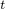-integral, the stress intensity factors, the crack propagation direction, and the *T*-stress can be requested. The record is written for each crack, one record per crack front location. See record key 17 for *J*-integral values for line spring elements.

| **Record key: 1991**(S) | **Record type: ***J*-integral values |
| --- | --- |
| | **Attributes: ** | **1 -- **Crack number. | | --- | --- | | | **2 -- **Node set (A8 format). | | | **3 -- **Number of contours. | | | **4 -- ***J*-integral value estimated by first contour. | | | **5 -- ***J*-integral value estimated by second contour. | | | **6 -- **Etc. | | **Attributes: ** | **1 -- **Crack number. |  | **2 -- **Node set (A8 format). |  | **3 -- **Number of contours. |  | **4 -- ***J*-integral value estimated by first contour. |  | **5 -- ***J*-integral value estimated by second contour. |  | **6 -- **Etc. |
| **Attributes: ** | **1 -- **Crack number. |
|  | **2 -- **Node set (A8 format). |
|  | **3 -- **Number of contours. |
|  | **4 -- ***J*-integral value estimated by first contour. |
|  | **5 -- ***J*-integral value estimated by second contour. |
|  | **6 -- **Etc. |

| **Record key: 1992**(S) | **Record type: **C-integral values |
| --- | --- |
| | **Attributes: ** | **1 -- **Crack number. | | --- | --- | | | **2 -- **Node set (A8 format). | | | **3 -- **Number of contours. | | | **4 -- **C-integral value estimated by first contour. | | | **5 -- **C-integral value estimated by second contour. | | | **6 -- **Etc. | | **Attributes: ** | **1 -- **Crack number. |  | **2 -- **Node set (A8 format). |  | **3 -- **Number of contours. |  | **4 -- **C-integral value estimated by first contour. |  | **5 -- **C-integral value estimated by second contour. |  | **6 -- **Etc. |
| **Attributes: ** | **1 -- **Crack number. |
|  | **2 -- **Node set (A8 format). |
|  | **3 -- **Number of contours. |
|  | **4 -- **C-integral value estimated by first contour. |
|  | **5 -- **C-integral value estimated by second contour. |
|  | **6 -- **Etc. |

| **Record key: 1995**(S) | **Record type: **Stress intensity factors |
| --- | --- |
| | **Attributes: ** | **1 -- **Crack number. | | --- | --- | | | **2 -- **Node set (A8 format). | | | **3 -- **Number of contours. | | | **4 -- ** (Mode I stress intensity factor) estimated by first contour. | | | **5 -- ** (Mode II stress intensity factor) estimated by first contour. | | | **6 -- ** (Mode III stress intensity factor) estimated by first contour (available only for 3D elements). | | | **7 -- **Crack propagation direction (in degrees) estimated by first contour (available only for homogeneous, isotropic elastic materials). | | | **8 -- ***J*-integral value estimated from stress intensity factors of first contour. | | | **9 -- ** (Mode I stress intensity factor) estimated by second contour. | | | **10 -- ** (Mode II stress intensity factor) estimated by second contour. | | | **11 -- ** (Mode III stress intensity factor) estimated by second contour (available only for 3D elements). | | | **12 -- **Crack propagation direction (in degrees) estimated by second contour (available only for homogeneous, isotropic elastic materials). | | | **13 -- ***J*-integral value estimated from stress intensity factors of second contour. | | | **14 -- **Etc. | | **Attributes: ** | **1 -- **Crack number. |  | **2 -- **Node set (A8 format). |  | **3 -- **Number of contours. |  | **4 -- ** (Mode I stress intensity factor) estimated by first contour. |  | **5 -- ** (Mode II stress intensity factor) estimated by first contour. |  | **6 -- ** (Mode III stress intensity factor) estimated by first contour (available only for 3D elements). |  | **7 -- **Crack propagation direction (in degrees) estimated by first contour (available only for homogeneous, isotropic elastic materials). |  | **8 -- ***J*-integral value estimated from stress intensity factors of first contour. |  | **9 -- ** (Mode I stress intensity factor) estimated by second contour. |  | **10 -- ** (Mode II stress intensity factor) estimated by second contour. |  | **11 -- ** (Mode III stress intensity factor) estimated by second contour (available only for 3D elements). |  | **12 -- **Crack propagation direction (in degrees) estimated by second contour (available only for homogeneous, isotropic elastic materials). |  | **13 -- ***J*-integral value estimated from stress intensity factors of second contour. |  | **14 -- **Etc. |
| **Attributes: ** | **1 -- **Crack number. |
|  | **2 -- **Node set (A8 format). |
|  | **3 -- **Number of contours. |
|  | **4 -- ** (Mode I stress intensity factor) estimated by first contour. |
|  | **5 -- ** (Mode II stress intensity factor) estimated by first contour. |
|  | **6 -- ** (Mode III stress intensity factor) estimated by first contour (available only for 3D elements). |
|  | **7 -- **Crack propagation direction (in degrees) estimated by first contour (available only for homogeneous, isotropic elastic materials). |
|  | **8 -- ***J*-integral value estimated from stress intensity factors of first contour. |
|  | **9 -- ** (Mode I stress intensity factor) estimated by second contour. |
|  | **10 -- ** (Mode II stress intensity factor) estimated by second contour. |
|  | **11 -- ** (Mode III stress intensity factor) estimated by second contour (available only for 3D elements). |
|  | **12 -- **Crack propagation direction (in degrees) estimated by second contour (available only for homogeneous, isotropic elastic materials). |
|  | **13 -- ***J*-integral value estimated from stress intensity factors of second contour. |
|  | **14 -- **Etc. |

| **Record key: 1996**(S) | **Record type: ***T*-stress values |
| --- | --- |
| | **Attributes: ** | **1 -- **Crack number. | | --- | --- | | | **2 -- **Node set (A8 format). | | | **3 -- **Number of contours. | | | **4 -- ***T*-stress value estimated by first contour. | | | **5 -- ***T*-stress value estimated by second contour. | | | **6 -- **Etc. | | **Attributes: ** | **1 -- **Crack number. |  | **2 -- **Node set (A8 format). |  | **3 -- **Number of contours. |  | **4 -- ***T*-stress value estimated by first contour. |  | **5 -- ***T*-stress value estimated by second contour. |  | **6 -- **Etc. |
| **Attributes: ** | **1 -- **Crack number. |
|  | **2 -- **Node set (A8 format). |
|  | **3 -- **Number of contours. |
|  | **4 -- ***T*-stress value estimated by first contour. |
|  | **5 -- ***T*-stress value estimated by second contour. |
|  | **6 -- **Etc. |

#### Record written for crack propagation analysis

The following record is written for each crack that is identified in the crack propagation analysis:

| **Record key: 1993**(S) | **Record type: **Crack tip location and associated quantities |
| --- | --- |
| | **Attributes: ** | **1 -- **Crack number. | | --- | --- | | | **2 -- **Slave surface (A8 format). | | | **3 -- **Master surface (A8 format). | | | **4 -- **Initial crack-tip node number. | | | **5 -- **Current crack-tip node number. | | | **6 -- **Flag to indicate crack propagation criterion. 1 for crack length criterion. 2 for critical stress criterion. 3 for crack opening displacement criterion. 5 for VCCT criterion. | | | **7 -- **Cumulative incremental crack length. | | | **8 -- **Value of 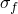 if critical stress criterion is used. Current value of critical crack opening displacement if crack opening displacement criterion is used. | | | **9 -- **Value of 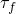 if critical stress criterion is used. | | **Attributes: ** | **1 -- **Crack number. |  | **2 -- **Slave surface (A8 format). |  | **3 -- **Master surface (A8 format). |  | **4 -- **Initial crack-tip node number. |  | **5 -- **Current crack-tip node number. |  | **6 -- **Flag to indicate crack propagation criterion. 1 for crack length criterion. 2 for critical stress criterion. 3 for crack opening displacement criterion. 5 for VCCT criterion. |  | **7 -- **Cumulative incremental crack length. |  | **8 -- **Value of  if critical stress criterion is used. Current value of critical crack opening displacement if crack opening displacement criterion is used. |  | **9 -- **Value of  if critical stress criterion is used. |
| **Attributes: ** | **1 -- **Crack number. |
|  | **2 -- **Slave surface (A8 format). |
|  | **3 -- **Master surface (A8 format). |
|  | **4 -- **Initial crack-tip node number. |
|  | **5 -- **Current crack-tip node number. |
|  | **6 -- **Flag to indicate crack propagation criterion. 1 for crack length criterion. 2 for critical stress criterion. 3 for crack opening displacement criterion. 5 for VCCT criterion. |
|  | **7 -- **Cumulative incremental crack length. |
|  | **8 -- **Value of  if critical stress criterion is used. Current value of critical crack opening displacement if crack opening displacement criterion is used. |
|  | **9 -- **Value of  if critical stress criterion is used. |

#### Records written once for any file output request when surfaces are defined in Abaqus/Standard

The number of data items for the following record depends on the type of surface being defined.

##### **Rigid surfaces**

| **Record key: 1501**(S) | **Record type: **Surface definition header |
| --- | --- |
| | **Attributes: ** | **1 -- **Surface name. | | --- | --- | | | **2 -- **Dimension key (1-1D, 2-2D, 3-3D, 4-Axisymmetric). | | | **3 -- **Type key (1-Deformable, 2-Rigid). | | | **4 -- **Number of facets making up the surface. | | | **5 -- **Reference node label. | | **Attributes: ** | **1 -- **Surface name. |  | **2 -- **Dimension key (1-1D, 2-2D, 3-3D, 4-Axisymmetric). |  | **3 -- **Type key (1-Deformable, 2-Rigid). |  | **4 -- **Number of facets making up the surface. |  | **5 -- **Reference node label. |
| **Attributes: ** | **1 -- **Surface name. |
|  | **2 -- **Dimension key (1-1D, 2-2D, 3-3D, 4-Axisymmetric). |
|  | **3 -- **Type key (1-Deformable, 2-Rigid). |
|  | **4 -- **Number of facets making up the surface. |
|  | **5 -- **Reference node label. |

##### **Deformable surfaces**

| **Record key: 1501**(S) | **Record type: **Surface definition header |
| --- | --- |
| | **Attributes: ** | **1 -- **Surface name. | | --- | --- | | | **2 -- **Dimension key (1-1D, 2-2D, 3-3D, 4-Axisymmetric). | | | **3 -- **Type key (1-Deformable, 2-Rigid). | | | **4 -- **Number of facets making up the surface. | | | **5 -- **Number of contact master surfaces associated with this surface through contact pairing (0 if this surface is a master surface). | | | **6 -- **First master surface name. | | | **7 -- **Second master surface name. | | | **8 -- **Etc. | | **Attributes: ** | **1 -- **Surface name. |  | **2 -- **Dimension key (1-1D, 2-2D, 3-3D, 4-Axisymmetric). |  | **3 -- **Type key (1-Deformable, 2-Rigid). |  | **4 -- **Number of facets making up the surface. |  | **5 -- **Number of contact master surfaces associated with this surface through contact pairing (0 if this surface is a master surface). |  | **6 -- **First master surface name. |  | **7 -- **Second master surface name. |  | **8 -- **Etc. |
| **Attributes: ** | **1 -- **Surface name. |
|  | **2 -- **Dimension key (1-1D, 2-2D, 3-3D, 4-Axisymmetric). |
|  | **3 -- **Type key (1-Deformable, 2-Rigid). |
|  | **4 -- **Number of facets making up the surface. |
|  | **5 -- **Number of contact master surfaces associated with this surface through contact pairing (0 if this surface is a master surface). |
|  | **6 -- **First master surface name. |
|  | **7 -- **Second master surface name. |
|  | **8 -- **Etc. |

| **Record key: 1502**(S) | **Record type: **Surface facet |
| --- | --- |
| | **Attributes: ** | **1 -- **Underlying element number. | | --- | --- | | | **2 -- **Element face key (1--S1, 2--S2, 3--S3, 4--S4, 5--S5, 6--S6, 7--SPOS, 8--SNEG). | | | **3 -- **Number of nodes in facet. | | | **4 -- **Node number of the facet's first node. | | | **5 -- **Node number of the facet's second node. | | | **6 -- **Etc. | | **Attributes: ** | **1 -- **Underlying element number. |  | **2 -- **Element face key (1--S1, 2--S2, 3--S3, 4--S4, 5--S5, 6--S6, 7--SPOS, 8--SNEG). |  | **3 -- **Number of nodes in facet. |  | **4 -- **Node number of the facet's first node. |  | **5 -- **Node number of the facet's second node. |  | **6 -- **Etc. |
| **Attributes: ** | **1 -- **Underlying element number. |
|  | **2 -- **Element face key (1--S1, 2--S2, 3--S3, 4--S4, 5--S5, 6--S6, 7--SPOS, 8--SNEG). |
|  | **3 -- **Number of nodes in facet. |
|  | **4 -- **Node number of the facet's first node. |
|  | **5 -- **Node number of the facet's second node. |
|  | **6 -- **Etc. |

#### Records written for any contact surface file output request

| **Record key: 5**(S) | **Output variable identifier: **SDV |
| --- | --- |
| **Record type: **Solution-dependent state variables| **Attributes: ** | **1 -- **State variable 1. | | --- | --- | | | **2 -- **State variable 2. | | | **3 -- **Etc. The record can have up to 80 words in ASCII format or 512 words in binary format. Repeat this record as often as necessary to output all active state variables in the model. | | **Attributes: ** | **1 -- **State variable 1. |  | **2 -- **State variable 2. |  | **3 -- **Etc. The record can have up to 80 words in ASCII format or 512 words in binary format. Repeat this record as often as necessary to output all active state variables in the model. |
| **Attributes: ** | **1 -- **State variable 1. |
|  | **2 -- **State variable 2. |
|  | **3 -- **Etc. The record can have up to 80 words in ASCII format or 512 words in binary format. Repeat this record as often as necessary to output all active state variables in the model. |

| **Record key: 1503**(S) | **Record type: **Output request definition |
| --- | --- |
| | **Attributes: ** | **1 -- **Contact file output (0). | | --- | --- | | | **2 -- **Slave surface name. | | | **3 -- **Master surface name. | | | **4 -- **Node set containing a subset of the nodes making up the slave surface. | | **Attributes: ** | **1 -- **Contact file output (0). |  | **2 -- **Slave surface name. |  | **3 -- **Master surface name. |  | **4 -- **Node set containing a subset of the nodes making up the slave surface. |
| **Attributes: ** | **1 -- **Contact file output (0). |
|  | **2 -- **Slave surface name. |
|  | **3 -- **Master surface name. |
|  | **4 -- **Node set containing a subset of the nodes making up the slave surface. |

| **Record key: 1504**(S) | **Record type: **Node header |
| --- | --- |
| | **Attributes: ** | **1 -- **Node number. | | --- | --- | | | **2 -- **Number of traction components (2 for 2D or axisymmetric cases, 3 for 3D cases). | | **Attributes: ** | **1 -- **Node number. |  | **2 -- **Number of traction components (2 for 2D or axisymmetric cases, 3 for 3D cases). |
| **Attributes: ** | **1 -- **Node number. |
|  | **2 -- **Number of traction components (2 for 2D or axisymmetric cases, 3 for 3D cases). |

| **Record key: 1511**(S) | **Output variable identifier: **CSTRESS |
| --- | --- |
| **Record type: **Contact tractions| **Attributes: ** | **1 -- **Contact pressure between the node on the slave surface and the master surface with which it interacts. | | --- | --- | | | **2 -- **Frictional shear traction component in the local 1-direction on the master surface. | | | **3 -- **Frictional shear traction component in the local 2-direction on the master surface for 3D. | | **Attributes: ** | **1 -- **Contact pressure between the node on the slave surface and the master surface with which it interacts. |  | **2 -- **Frictional shear traction component in the local 1-direction on the master surface. |  | **3 -- **Frictional shear traction component in the local 2-direction on the master surface for 3D. |
| **Attributes: ** | **1 -- **Contact pressure between the node on the slave surface and the master surface with which it interacts. |
|  | **2 -- **Frictional shear traction component in the local 1-direction on the master surface. |
|  | **3 -- **Frictional shear traction component in the local 2-direction on the master surface for 3D. |

| **Record key: 1512**(S) | **Output variable identifier: **CDSTRESS |
| --- | --- |
| **Record type: **Viscous tractions| **Attributes: ** | **1 -- **Viscous pressure between the node on the slave surface and the master surface with which it interacts. | | --- | --- | | | **2 -- **Viscous shear traction component in the local 1-direction on the master surface. | | | **3 -- **Viscous shear traction component in the local 2-direction on the master surface for 3D. | | **Attributes: ** | **1 -- **Viscous pressure between the node on the slave surface and the master surface with which it interacts. |  | **2 -- **Viscous shear traction component in the local 1-direction on the master surface. |  | **3 -- **Viscous shear traction component in the local 2-direction on the master surface for 3D. |
| **Attributes: ** | **1 -- **Viscous pressure between the node on the slave surface and the master surface with which it interacts. |
|  | **2 -- **Viscous shear traction component in the local 1-direction on the master surface. |
|  | **3 -- **Viscous shear traction component in the local 2-direction on the master surface for 3D. |

| **Record key: 1521**(S) | **Output variable identifier: **CDISP |
| --- | --- |
| **Record type: **Contact clearances| **Attributes: ** | **1 -- **Separation of the surfaces in the direction of the normal to the master surface. | | --- | --- | | | **2 -- **Accumulated relative tangential displacement of the surfaces in the local 1-direction on the master surface. | | | **3 -- **Accumulated relative tangential displacement of the surfaces in the local 2-direction on the master surface for 3D. | | **Attributes: ** | **1 -- **Separation of the surfaces in the direction of the normal to the master surface. |  | **2 -- **Accumulated relative tangential displacement of the surfaces in the local 1-direction on the master surface. |  | **3 -- **Accumulated relative tangential displacement of the surfaces in the local 2-direction on the master surface for 3D. |
| **Attributes: ** | **1 -- **Separation of the surfaces in the direction of the normal to the master surface. |
|  | **2 -- **Accumulated relative tangential displacement of the surfaces in the local 1-direction on the master surface. |
|  | **3 -- **Accumulated relative tangential displacement of the surfaces in the local 2-direction on the master surface for 3D. |

| **Record key: 1522**(S) | **Output variable identifier: **CFN |
| --- | --- |
| **Record type: **Total force due to contact pressure| **Attributes: ** | **1 -- **Magnitude. | | --- | --- | | | **2 -- **Force component in the global 1-direction. | | | **3 -- **Force component in the global 2-direction. | | | **4 -- **Force component in the global 3-direction. | | **Attributes: ** | **1 -- **Magnitude. |  | **2 -- **Force component in the global 1-direction. |  | **3 -- **Force component in the global 2-direction. |  | **4 -- **Force component in the global 3-direction. |
| **Attributes: ** | **1 -- **Magnitude. |
|  | **2 -- **Force component in the global 1-direction. |
|  | **3 -- **Force component in the global 2-direction. |
|  | **4 -- **Force component in the global 3-direction. |

| **Record key: 1523**(S) | **Output variable identifier: **CFS |
| --- | --- |
| **Record type: **Total force due to frictional stress| **Attributes: ** | **1 -- **Magnitude. | | --- | --- | | | **2 -- **Force component in the global 1-direction. | | | **3 -- **Force component in the global 2-direction. | | | **4 -- **Force component in the global 3-direction. | | **Attributes: ** | **1 -- **Magnitude. |  | **2 -- **Force component in the global 1-direction. |  | **3 -- **Force component in the global 2-direction. |  | **4 -- **Force component in the global 3-direction. |
| **Attributes: ** | **1 -- **Magnitude. |
|  | **2 -- **Force component in the global 1-direction. |
|  | **3 -- **Force component in the global 2-direction. |
|  | **4 -- **Force component in the global 3-direction. |

| **Record key: 1575**(S) | **Output variable identifier: **CFT |
| --- | --- |
| **Record type: **Total force due to contact pressure and frictional stress| **Attributes: ** | **1 -- **Magnitude. | | --- | --- | | | **2 -- **Force component in the global 1-direction. | | | **3 -- **Force component in the global 2-direction. | | | **4 -- **Force component in the global 3-direction. | | **Attributes: ** | **1 -- **Magnitude. |  | **2 -- **Force component in the global 1-direction. |  | **3 -- **Force component in the global 2-direction. |  | **4 -- **Force component in the global 3-direction. |
| **Attributes: ** | **1 -- **Magnitude. |
|  | **2 -- **Force component in the global 1-direction. |
|  | **3 -- **Force component in the global 2-direction. |
|  | **4 -- **Force component in the global 3-direction. |

| **Record key: 1524**(S) | **Output variable identifier: **CAREA |
| --- | --- |
| **Record type: **Total area in contact| **Attribute: ** | **1 -- **Magnitude. | | --- | --- | | **Attribute: ** | **1 -- **Magnitude. |
| **Attribute: ** | **1 -- **Magnitude. |

| **Record key: 1526**(S) | **Output variable identifier: **CMN |
| --- | --- |
| **Record type: **Total moment about the origin due to contact pressure| **Attributes: ** | **1 -- **Magnitude. | | --- | --- | | | **2 -- **Moment component about the global 1-axis. | | | **3 -- **Moment component about the global 2-axis. | | | **4 -- **Moment component about the global 3-axis. | | **Attributes: ** | **1 -- **Magnitude. |  | **2 -- **Moment component about the global 1-axis. |  | **3 -- **Moment component about the global 2-axis. |  | **4 -- **Moment component about the global 3-axis. |
| **Attributes: ** | **1 -- **Magnitude. |
|  | **2 -- **Moment component about the global 1-axis. |
|  | **3 -- **Moment component about the global 2-axis. |
|  | **4 -- **Moment component about the global 3-axis. |

| **Record key: 1527**(S) | **Output variable identifier: **CMS |
| --- | --- |
| **Record type: **Total moment about the origin due to frictional stress| **Attributes: ** | **1 -- **Magnitude. | | --- | --- | | | **2 -- **Moment component about the global 1-axis. | | | **3 -- **Moment component about the global 2-axis. | | | **4 -- **Moment component about the global 3-axis. | | **Attributes: ** | **1 -- **Magnitude. |  | **2 -- **Moment component about the global 1-axis. |  | **3 -- **Moment component about the global 2-axis. |  | **4 -- **Moment component about the global 3-axis. |
| **Attributes: ** | **1 -- **Magnitude. |
|  | **2 -- **Moment component about the global 1-axis. |
|  | **3 -- **Moment component about the global 2-axis. |
|  | **4 -- **Moment component about the global 3-axis. |

| **Record key: 1576**(S) | **Output variable identifier: **CMT |
| --- | --- |
| **Record type: **Total moment about the origin due to contact pressure and frictional stress| **Attributes: ** | **1 -- **Magnitude. | | --- | --- | | | **2 -- **Moment component about the global 1-axis. | | | **3 -- **Moment component about the global 2-axis. | | | **4 -- **Moment component about the global 3-axis. | | **Attributes: ** | **1 -- **Magnitude. |  | **2 -- **Moment component about the global 1-axis. |  | **3 -- **Moment component about the global 2-axis. |  | **4 -- **Moment component about the global 3-axis. |
| **Attributes: ** | **1 -- **Magnitude. |
|  | **2 -- **Moment component about the global 1-axis. |
|  | **3 -- **Moment component about the global 2-axis. |
|  | **4 -- **Moment component about the global 3-axis. |

| **Record key: 1578**(S) | **Output variable identifier: **CTRQ |
| --- | --- |
| **Record type: **Maximum torque that can be transmitted about the *z*-axis by a contact surface in an axisymmetric analysis with a friction coefficient of unity| **Attribute: ** | **1 -- **Magnitude. | | --- | --- | | **Attribute: ** | **1 -- **Magnitude. |
| **Attribute: ** | **1 -- **Magnitude. |

| **Record key: 1573**(S) | **Output variable identifier: **XN |
| --- | --- |
| **Record type: **Coordinates of the center of the force due to contact pressure| **Attributes: ** | **1 -- **Coordinate in the global 1-direction. | | --- | --- | | | **2 -- **Coordinate in the global 2-direction. | | | **3 -- **Coordinate in the global 3-direction. | | **Attributes: ** | **1 -- **Coordinate in the global 1-direction. |  | **2 -- **Coordinate in the global 2-direction. |  | **3 -- **Coordinate in the global 3-direction. |
| **Attributes: ** | **1 -- **Coordinate in the global 1-direction. |
|  | **2 -- **Coordinate in the global 2-direction. |
|  | **3 -- **Coordinate in the global 3-direction. |

| **Record key: 1574**(S) | **Output variable identifier: **XS |
| --- | --- |
| **Record type: **Coordinates of the center of the force due to frictional stress| **Attributes: ** | **1 -- **Coordinate in the global 1-direction. | | --- | --- | | | **2 -- **Coordinate in the global 2-direction. | | | **3 -- **Coordinate in the global 3-direction. | | **Attributes: ** | **1 -- **Coordinate in the global 1-direction. |  | **2 -- **Coordinate in the global 2-direction. |  | **3 -- **Coordinate in the global 3-direction. |
| **Attributes: ** | **1 -- **Coordinate in the global 1-direction. |
|  | **2 -- **Coordinate in the global 2-direction. |
|  | **3 -- **Coordinate in the global 3-direction. |

| **Record key: 1577**(S) | **Output variable identifier: **XT |
| --- | --- |
| **Record type: **Coordinates of the center of the force due to contact pressure and frictional stress| **Attributes: ** | **1 -- **Coordinate in the global 1-direction. | | --- | --- | | | **2 -- **Coordinate in the global 2-direction. | | | **3 -- **Coordinate in the global 3-direction. | | **Attributes: ** | **1 -- **Coordinate in the global 1-direction. |  | **2 -- **Coordinate in the global 2-direction. |  | **3 -- **Coordinate in the global 3-direction. |
| **Attributes: ** | **1 -- **Coordinate in the global 1-direction. |
|  | **2 -- **Coordinate in the global 2-direction. |
|  | **3 -- **Coordinate in the global 3-direction. |

| **Record key: 1528**(S) | **Output variable identifier: **HFL |
| --- | --- |
| **Record type: **Heat flux density| **Attribute: ** | **1 -- **Magnitude. | | --- | --- | | **Attribute: ** | **1 -- **Magnitude. |
| **Attribute: ** | **1 -- **Magnitude. |

| **Record key: 1529**(S) | **Output variable identifier: **HFLA |
| --- | --- |
| **Record type: **HFL multiplied by the nodal area| **Attribute: ** | **1 -- **Magnitude. | | --- | --- | | **Attribute: ** | **1 -- **Magnitude. |
| **Attribute: ** | **1 -- **Magnitude. |

| **Record key: 1530**(S) | **Output variable identifier: **HTL |
| --- | --- |
| **Record type: **Time integrated HFL| **Attribute: ** | **1 -- **Magnitude. | | --- | --- | | **Attribute: ** | **1 -- **Magnitude. |
| **Attribute: ** | **1 -- **Magnitude. |

| **Record key: 1531**(S) | **Output variable identifier: **HTLA |
| --- | --- |
| **Record type: **Time integrated HFLA| **Attribute: ** | **1 -- **Magnitude. | | --- | --- | | **Attribute: ** | **1 -- **Magnitude. |
| **Attribute: ** | **1 -- **Magnitude. |

| **Record key: 1532**(S) | **Output variable identifier: **SFDR |
| --- | --- |
| **Record type: **Heat flux density due to frictional dissipation| **Attribute: ** | **1 -- **Magnitude. | | --- | --- | | **Attribute: ** | **1 -- **Magnitude. |
| **Attribute: ** | **1 -- **Magnitude. |

| **Record key: 1533**(S) | **Output variable identifier: **SFDRA |
| --- | --- |
| **Record type: **SFDR multiplied by the nodal area| **Attribute: ** | **1 -- **Magnitude. | | --- | --- | | **Attribute: ** | **1 -- **Magnitude. |
| **Attribute: ** | **1 -- **Magnitude. |

| **Record key: 1534**(S) | **Output variable identifier: **SFDRT |
| --- | --- |
| **Record type: **Time integrated SFDR| **Attribute: ** | **1 -- **Magnitude. | | --- | --- | | **Attribute: ** | **1 -- **Magnitude. |
| **Attribute: ** | **1 -- **Magnitude. |

| **Record key: 1535**(S) | **Output variable identifier: **SFDRTA |
| --- | --- |
| **Record type: **Time integrated SFDRA| **Attribute: ** | **1 -- **Magnitude. | | --- | --- | | **Attribute: ** | **1 -- **Magnitude. |
| **Attribute: ** | **1 -- **Magnitude. |

| **Record key: 1536**(S) | **Output variable identifier: **WEIGHT |
| --- | --- |
| **Record type: **Weighting factor| **Attribute: ** | **1 -- **Magnitude. | | --- | --- | | **Attribute: ** | **1 -- **Magnitude. |
| **Attribute: ** | **1 -- **Magnitude. |

| **Record key: 1537**(S) | **Output variable identifier: **SJD |
| --- | --- |
| **Record type: **Heat flux density due to electrical current| **Attribute: ** | **1 -- **Magnitude. | | --- | --- | | **Attribute: ** | **1 -- **Magnitude. |
| **Attribute: ** | **1 -- **Magnitude. |

| **Record key: 1538**(S) | **Output variable identifier: **SJDA |
| --- | --- |
| **Record type: **SJD multiplied by the nodal area| **Attribute: ** | **1 -- **Magnitude. | | --- | --- | | **Attribute: ** | **1 -- **Magnitude. |
| **Attribute: ** | **1 -- **Magnitude. |

| **Record key: 1539**(S) | **Output variable identifier: **SJDT |
| --- | --- |
| **Record type: **Time integrated SJD| **Attribute: ** | **1 -- **Magnitude. | | --- | --- | | **Attribute: ** | **1 -- **Magnitude. |
| **Attribute: ** | **1 -- **Magnitude. |

| **Record key: 1540**(S) | **Output variable identifier: **SJDTA |
| --- | --- |
| **Record type: **Time integrated SJDA| **Attribute: ** | **1 -- **Magnitude. | | --- | --- | | **Attribute: ** | **1 -- **Magnitude. |
| **Attribute: ** | **1 -- **Magnitude. |

| **Record key: 1541**(S) | **Output variable identifier: **ECD |
| --- | --- |
| **Record type: **Electrical current density| **Attribute: ** | **1 -- **Magnitude. | | --- | --- | | **Attribute: ** | **1 -- **Magnitude. |
| **Attribute: ** | **1 -- **Magnitude. |

| **Record key: 1542**(S) | **Output variable identifier: **ECDA |
| --- | --- |
| **Record type: **ECD multiplied by area| **Attribute: ** | **1 -- **Magnitude. | | --- | --- | | **Attribute: ** | **1 -- **Magnitude. |
| **Attribute: ** | **1 -- **Magnitude. |

| **Record key: 1543**(S) | **Output variable identifier: **ECDT |
| --- | --- |
| **Record type: **Time integrated ECD| **Attribute: ** | **1 -- **Magnitude. | | --- | --- | | **Attribute: ** | **1 -- **Magnitude. |
| **Attribute: ** | **1 -- **Magnitude. |

| **Record key: 1544**(S) | **Output variable identifier: **ECDTA |
| --- | --- |
| **Record type: **Time integrated ECDA| **Attribute: ** | **1 -- **Magnitude. | | --- | --- | | **Attribute: ** | **1 -- **Magnitude. |
| **Attribute: ** | **1 -- **Magnitude. |

| **Record key: 1545**(S) | **Output variable identifier: **PFL |
| --- | --- |
| **Record type: **Pore fluid volume flux per unit area| **Attribute: ** | **1 -- **Magnitude. | | --- | --- | | **Attribute: ** | **1 -- **Magnitude. |
| **Attribute: ** | **1 -- **Magnitude. |

| **Record key: 1546**(S) | **Output variable identifier: **PFLA |
| --- | --- |
| **Record type: **PFL multiplied by the nodal area| **Attribute: ** | **1 -- **Magnitude. | | --- | --- | | **Attribute: ** | **1 -- **Magnitude. |
| **Attribute: ** | **1 -- **Magnitude. |

| **Record key: 1547**(S) | **Output variable identifier: **PTL |
| --- | --- |
| **Record type: **Time integrated PFL| **Attribute: ** | **1 -- **Magnitude. | | --- | --- | | **Attribute: ** | **1 -- **Magnitude. |
| **Attribute: ** | **1 -- **Magnitude. |

| **Record key: 1548**(S) | **Output variable identifier: **PTLA |
| --- | --- |
| **Record type: **Time integrated PFLA| **Attribute: ** | **1 -- **Magnitude. | | --- | --- | | **Attribute: ** | **1 -- **Magnitude. |
| **Attribute: ** | **1 -- **Magnitude. |

| **Record key: 1549**(S) | **Output variable identifier: **TPFL |
| --- | --- |
| **Record type: **Total pore fluid volume flux leaving the slave surface| **Attribute: ** | **1 -- **Magnitude. | | --- | --- | | **Attribute: ** | **1 -- **Magnitude. |
| **Attribute: ** | **1 -- **Magnitude. |

| **Record key: 1550**(S) | **Output variable identifier: **TPTL |
| --- | --- |
| **Record type: **Time integrated TPFL| **Attribute: ** | **1 -- **Magnitude. | | --- | --- | | **Attribute: ** | **1 -- **Magnitude. |
| **Attribute: ** | **1 -- **Magnitude. |

##### **Records for bond failure quantities from crack propagation analysis**

| **Record key: 1570**(S) | **Output variable identifier: **DBT |
| --- | --- |
| **Record type: **Time when bond failure occurs| **Attribute: ** | **1 -- **Magnitude. | | --- | --- | | **Attribute: ** | **1 -- **Magnitude. |
| **Attribute: ** | **1 -- **Magnitude. |

| **Record key: 1571**(S) | **Output variable identifier: **DBSF |
| --- | --- |
| **Record type: **Fraction of stress that remains at bond failure| **Attribute: ** | **1 -- **Magnitude. | | --- | --- | | **Attribute: ** | **1 -- **Magnitude. |
| **Attribute: ** | **1 -- **Magnitude. |

| **Record key: 1572**(S) | **Output variable identifier: **DBS |
| --- | --- |
| **Record type: **Remaining stress in the failed bond| **Attributes: ** | **1 -- **11-component of debond stress. | | --- | --- | | | **2 -- **12-component of debond stress. | | **Attributes: ** | **1 -- **11-component of debond stress. |  | **2 -- **12-component of debond stress. |
| **Attributes: ** | **1 -- **11-component of debond stress. |
|  | **2 -- **12-component of debond stress. |

| **Record key: 290**(S) | **Output variable identifier: **OPENBC |
| --- | --- |
| **Record type: **Relative displacement behind crack when fracture criterion is met| **Attribute: ** | **1 -- **Magnitude. | | --- | --- | | **Attribute: ** | **1 -- **Magnitude. |
| **Attribute: ** | **1 -- **Magnitude. |

| **Record key: 293**(S) | **Output variable identifier: **EFENRRTR |
| --- | --- |
| **Record type: **Effective energy release rate ratio| **Attribute: ** | **1 -- **Magnitude. | | --- | --- | | **Attribute: ** | **1 -- **Magnitude. |
| **Attribute: ** | **1 -- **Magnitude. |

| **Record key: 294**(S) | **Output variable identifier: **BDSTAT |
| --- | --- |
| **Record type: **Bond state (varies from 1.0 to 0.0)| **Attribute: ** | **1 -- **Magnitude. | | --- | --- | | **Attribute: ** | **1 -- **Magnitude. |
| **Attribute: ** | **1 -- **Magnitude. |

| **Record key: 235**(S) | **Output variable identifier: **CSDMG |
| --- | --- |
| **Record type: **Damage variable| **Attribute: ** | **1 -- **Magnitude. | | --- | --- | | **Attribute: ** | **1 -- **Magnitude. |
| **Attribute: ** | **1 -- **Magnitude. |

| **Record key: 295**(S) | **Output variable identifier: **CRSTS |
| --- | --- |
| **Record type: **Critical stress at failure| **Attributes: ** | **1 -- **11-component of critical stress. | | --- | --- | | | **2 -- **12-component of critical stress. | | | **3 -- **13-component of critical stress (only available to three-dimensional models). | | **Attributes: ** | **1 -- **11-component of critical stress. |  | **2 -- **12-component of critical stress. |  | **3 -- **13-component of critical stress (only available to three-dimensional models). |
| **Attributes: ** | **1 -- **11-component of critical stress. |
|  | **2 -- **12-component of critical stress. |
|  | **3 -- **13-component of critical stress (only available to three-dimensional models). |

| **Record key: 296**(S) | **Output variable identifier: **ENRRT |
| --- | --- |
| **Record type: **Strain energy release rate| **Attributes: ** | **1 -- **11-component of strain energy release rate. | | --- | --- | | | **2 -- **12-component of strain energy release rate. | | | **3 -- **13-component of strain energy release rate (only available to three-dimensional models). | | **Attributes: ** | **1 -- **11-component of strain energy release rate. |  | **2 -- **12-component of strain energy release rate. |  | **3 -- **13-component of strain energy release rate (only available to three-dimensional models). |
| **Attributes: ** | **1 -- **11-component of strain energy release rate. |
|  | **2 -- **12-component of strain energy release rate. |
|  | **3 -- **13-component of strain energy release rate (only available to three-dimensional models). |

##### **Record for surface-based pressure penetration analysis**

| **Record key: 1592**(S) | **Output variable identifier: **PPRESS |
| --- | --- |
| **Record type: **Fluid pressure for surface-based pressure penetration analysis| **Attribute: ** | **1 -- **Magnitude. | | --- | --- | | **Attribute: ** | **1 -- **Magnitude. |
| **Attribute: ** | **1 -- **Magnitude. |

##### **Records for surface-based cohesive behavior with damage**

| **Record key: 253**(S) | **Output variable identifier: **CSDMG |
| --- | --- |
| **Record type: **Overall value of the scalar damage variable| **Attribute: ** | **1 -- **Magnitude. | | --- | --- | | **Attribute: ** | **1 -- **Magnitude. |
| **Attribute: ** | **1 -- **Magnitude. |

| **Record key: 345**(S) | **Output variable identifier: **CSMAXSCRT |
| --- | --- |
| **Record type: **Maximum contact stress damage initiation criterion| **Attribute: ** | **1 -- **Magnitude. | | --- | --- | | **Attribute: ** | **1 -- **Magnitude. |
| **Attribute: ** | **1 -- **Magnitude. |

| **Record key: 346**(S) | **Output variable identifier: **CSMAXUCRT |
| --- | --- |
| **Record type: **Maximum separation damage initiation criterion| **Attribute: ** | **1 -- **Magnitude. | | --- | --- | | **Attribute: ** | **1 -- **Magnitude. |
| **Attribute: ** | **1 -- **Magnitude. |

| **Record key: 347**(S) | **Output variable identifier: **CSQUADSCRT |
| --- | --- |
| **Record type: **Quadratic contact stress damage initiation criterion| **Attribute: ** | **1 -- **Magnitude. | | --- | --- | | **Attribute: ** | **1 -- **Magnitude. |
| **Attribute: ** | **1 -- **Magnitude. |

| **Record key: 348**(S) | **Output variable identifier: **CSQUADUCRT |
| --- | --- |
| **Record type: **Quadratic separation damage initiation criterion| **Attribute: ** | **1 -- **Magnitude. | | --- | --- | | **Attribute: ** | **1 -- **Magnitude. |
| **Attribute: ** | **1 -- **Magnitude. |

#### Records written once for any file output request when cavities are defined

| **Record key: 1601**(S) | **Record type: **Cavity definition header |
| --- | --- |
| | **Attributes: ** | **1 -- **Number of surfaces making up the cavity. | | --- | --- | | | **2 -- **Cavity name. | | | **3 -- **Name of cavity's first surface. | | | **4 -- **Name of cavity's second surface. | | | **5 -- **Etc. | | **Attributes: ** | **1 -- **Number of surfaces making up the cavity. |  | **2 -- **Cavity name. |  | **3 -- **Name of cavity's first surface. |  | **4 -- **Name of cavity's second surface. |  | **5 -- **Etc. |
| **Attributes: ** | **1 -- **Number of surfaces making up the cavity. |
|  | **2 -- **Cavity name. |
|  | **3 -- **Name of cavity's first surface. |
|  | **4 -- **Name of cavity's second surface. |
|  | **5 -- **Etc. |

| **Record key: 1610**(S) | **Record type: **Facet order record size |
| --- | --- |
| | **Attribute: ** | **1 -- **Maximum record length (including the record length and record key words) for cavity facet order records that follow. The cavity facet order data will be subdivided into multiple records as needed to fit within this maximum length. The record key for any continuation record will be the same as for the first record. | | --- | --- | | **Attribute: ** | **1 -- **Maximum record length (including the record length and record key words) for cavity facet order records that follow. The cavity facet order data will be subdivided into multiple records as needed to fit within this maximum length. The record key for any continuation record will be the same as for the first record. |
| **Attribute: ** | **1 -- **Maximum record length (including the record length and record key words) for cavity facet order records that follow. The cavity facet order data will be subdivided into multiple records as needed to fit within this maximum length. The record key for any continuation record will be the same as for the first record. |

| **Record key: 1602**(S) | **Record type: **Cavity facet order |
| --- | --- |
| | **Attributes: ** | **1 -- **Number of facets making up the cavity. | | --- | --- | | | **2 -- **Cavity name. | | | **3 -- **Cavity's first (underlying) element number. | | | **4 -- **First element face key (1-S1, 2--S2, 3--S3, 4--S4, 5--S5, 6--S6, 7--SPOS, 8--SNEG) | | | **5 -- **Cavity's second (underlying) element number. | | | **6 -- **Second element face key (1--S1, 2--S2, 3--S3, 4--S4, 5--S5, 6--S6, 7--SPOS, 8--SNEG) | | | **7 -- **Etc. | | **Attributes: ** | **1 -- **Number of facets making up the cavity. |  | **2 -- **Cavity name. |  | **3 -- **Cavity's first (underlying) element number. |  | **4 -- **First element face key (1-S1, 2--S2, 3--S3, 4--S4, 5--S5, 6--S6, 7--SPOS, 8--SNEG) |  | **5 -- **Cavity's second (underlying) element number. |  | **6 -- **Second element face key (1--S1, 2--S2, 3--S3, 4--S4, 5--S5, 6--S6, 7--SPOS, 8--SNEG) |  | **7 -- **Etc. |
| **Attributes: ** | **1 -- **Number of facets making up the cavity. |
|  | **2 -- **Cavity name. |
|  | **3 -- **Cavity's first (underlying) element number. |
|  | **4 -- **First element face key (1-S1, 2--S2, 3--S3, 4--S4, 5--S5, 6--S6, 7--SPOS, 8--SNEG) |
|  | **5 -- **Cavity's second (underlying) element number. |
|  | **6 -- **Second element face key (1--S1, 2--S2, 3--S3, 4--S4, 5--S5, 6--S6, 7--SPOS, 8--SNEG) |
|  | **7 -- **Etc. |

#### Records written for any view factor matrix output request

The ordering of the facets (each facet corresponds to one row of the view factor matrix) is that appearing in the cavity facet order record 1602.

| **Record key: 1608**(S) | **Record type: **Output request definition |
| --- | --- |
| | **Attributes: ** | **1 -- **View factor output (0). | | --- | --- | | | **2 -- **Cavity name. | | **Attributes: ** | **1 -- **View factor output (0). |  | **2 -- **Cavity name. |
| **Attributes: ** | **1 -- **View factor output (0). |
|  | **2 -- **Cavity name. |

| **Record key: 1605**(S) | **Record type: **View factor matrix header |
| --- | --- |
| | **Attributes: ** | **1 -- **Number of facets in the cavity. | | --- | --- | | | **2 -- **Cavity name. | | **Attributes: ** | **1 -- **Number of facets in the cavity. |  | **2 -- **Cavity name. |
| **Attributes: ** | **1 -- **Number of facets in the cavity. |
|  | **2 -- **Cavity name. |

| **Record key: 1609**(S) | **Record type: **View factor matrix record size |
| --- | --- |
| | **Attribute: ** | **1 -- **Maximum record length (including the record length and record key words) for view factor matrix and facet area records that follow. The matrix or facet area records will be subdivided into multiple records as needed to fit within this maximum length. The record key for any continuation record will be the same as for the first record. | | --- | --- | | **Attribute: ** | **1 -- **Maximum record length (including the record length and record key words) for view factor matrix and facet area records that follow. The matrix or facet area records will be subdivided into multiple records as needed to fit within this maximum length. The record key for any continuation record will be the same as for the first record. |
| **Attribute: ** | **1 -- **Maximum record length (including the record length and record key words) for view factor matrix and facet area records that follow. The matrix or facet area records will be subdivided into multiple records as needed to fit within this maximum length. The record key for any continuation record will be the same as for the first record. |

| **Record key: 1606**(S) | **Record type: **Nonsymmetric view factor matrix |
| --- | --- |
| | **Attributes: ** | **1 -- **(1, 1) dimensionless view factor. | | --- | --- | | | **2 -- **(1, 2) dimensionless view factor. | | | **3 -- **(1, 3) dimensionless view factor. | | | **4 -- **Etc., stored in rows. | | **Attributes: ** | **1 -- **(1, 1) dimensionless view factor. |  | **2 -- **(1, 2) dimensionless view factor. |  | **3 -- **(1, 3) dimensionless view factor. |  | **4 -- **Etc., stored in rows. |
| **Attributes: ** | **1 -- **(1, 1) dimensionless view factor. |
|  | **2 -- **(1, 2) dimensionless view factor. |
|  | **3 -- **(1, 3) dimensionless view factor. |
|  | **4 -- **Etc., stored in rows. |

| **Record key: 1607**(S) | **Record type: **Facet areas |
| --- | --- |
| | **Attributes: ** | **1 -- **Area of first facet. | | --- | --- | | | **2 -- **Area of second facet. | | | **3 -- **Area of third facet. | | | **4 -- **Etc. | | **Attributes: ** | **1 -- **Area of first facet. |  | **2 -- **Area of second facet. |  | **3 -- **Area of third facet. |  | **4 -- **Etc. |
| **Attributes: ** | **1 -- **Area of first facet. |
|  | **2 -- **Area of second facet. |
|  | **3 -- **Area of third facet. |
|  | **4 -- **Etc. |

#### Records written for any radiation file output request

| **Record key: 1603**(S) | **Record type: **Output request definition |
| --- | --- |
| | **Attributes: ** | **1 -- **Radiation file output (1). | | --- | --- | | | **2 -- **Cavity name. | | | **3 -- **Surface name. | | | **4 -- **Element set name. | | **Attributes: ** | **1 -- **Radiation file output (1). |  | **2 -- **Cavity name. |  | **3 -- **Surface name. |  | **4 -- **Element set name. |
| **Attributes: ** | **1 -- **Radiation file output (1). |
|  | **2 -- **Cavity name. |
|  | **3 -- **Surface name. |
|  | **4 -- **Element set name. |

| **Record key: 1604**(S) | **Record type: **Facet header record |
| --- | --- |
| | **Attributes: ** | **1 -- **(Underlying) user element number. | | --- | --- | | | **2 -- **Element face key (1--S1, 2--S2, 3--S3, 4--S4, 5--S5, 6--S6, 7--SPOS, 8--SNEG) | | | **3 -- **Facet area. | | **Attributes: ** | **1 -- **(Underlying) user element number. |  | **2 -- **Element face key (1--S1, 2--S2, 3--S3, 4--S4, 5--S5, 6--S6, 7--SPOS, 8--SNEG) |  | **3 -- **Facet area. |
| **Attributes: ** | **1 -- **(Underlying) user element number. |
|  | **2 -- **Element face key (1--S1, 2--S2, 3--S3, 4--S4, 5--S5, 6--S6, 7--SPOS, 8--SNEG) |
|  | **3 -- **Facet area. |

| **Record key: 231**(S) | **Record type: **Radiation flux density |
| --- | --- |
| | **Attribute: ** | **1 -- **Magnitude. | | --- | --- | | **Attribute: ** | **1 -- **Magnitude. |
| **Attribute: ** | **1 -- **Magnitude. |

| **Record key: 232**(S) | **Record type: **Radiation flux |
| --- | --- |
| | **Attribute: ** | **1 -- **Magnitude. | | --- | --- | | **Attribute: ** | **1 -- **Magnitude. |
| **Attribute: ** | **1 -- **Magnitude. |

| **Record key: 233**(S) | **Record type: **Time integrated radiation flux density |
| --- | --- |
| | **Attribute: ** | **1 -- **Magnitude. | | --- | --- | | **Attribute: ** | **1 -- **Magnitude. |
| **Attribute: ** | **1 -- **Magnitude. |

| **Record key: 234**(S) | **Record type: **Time integrated radiation flux |
| --- | --- |
| | **Attribute: ** | **1 -- **Magnitude. | | --- | --- | | **Attribute: ** | **1 -- **Magnitude. |
| **Attribute: ** | **1 -- **Magnitude. |

| **Record key: 235**(S) | **Record type: **Total view factor (sum of view factor matrix row) |
| --- | --- |
| | **Attribute: ** | **1 -- **Magnitude. | | --- | --- | | **Attribute: ** | **1 -- **Magnitude. |
| **Attribute: ** | **1 -- **Magnitude. |

| **Record key: 236**(S) | **Record type: **Facet temperature |
| --- | --- |
| | **Attribute: ** | **1 -- **Magnitude. | | --- | --- | | **Attribute: ** | **1 -- **Magnitude. |
| **Attribute: ** | **1 -- **Magnitude. |

#### Records written for any section file output request

The output variables described below are not available for random response analysis.

| **Record key: 1580**(S) | **Record type: **Output request definition |
| --- | --- |
| | **Attributes: ** | **1 -- **Surface section output (1). | | --- | --- | | | **2 -- **Section name. | | **Attributes: ** | **1 -- **Surface section output (1). |  | **2 -- **Section name. |
| **Attributes: ** | **1 -- **Surface section output (1). |
|  | **2 -- **Section name. |

| **Record key: 1581**(S) | **Record type: **Section output header record |
| --- | --- |
| | **Attributes: ** | **1 -- **Surface name. | | --- | --- | | | **2 -- **System of coordinates used for output (1--Global, 2--Local). | | | **3 -- **Flag to indicate whether or not the local coordinate system and the output are updated during the analysis (1--Yes, 2--No). | | **Attributes: ** | **1 -- **Surface name. |  | **2 -- **System of coordinates used for output (1--Global, 2--Local). |  | **3 -- **Flag to indicate whether or not the local coordinate system and the output are updated during the analysis (1--Yes, 2--No). |
| **Attributes: ** | **1 -- **Surface name. |
|  | **2 -- **System of coordinates used for output (1--Global, 2--Local). |
|  | **3 -- **Flag to indicate whether or not the local coordinate system and the output are updated during the analysis (1--Yes, 2--No). |

##### **For all analysis types**

| The following two records are generated only when section output is requested in a local coordinate system. In that case all components of forces and moments are given with respect to the local system. Only the first two directions of the local coordinate system are given; if needed, the third direction can be calculated as the cross product of the first two. |
| --- |
| **Record key: 1582**(S) | **Record type: **Global coordinates of the anchor point |
| | **Attributes: ** | **1 -- **First coordinate. | | --- | --- | | | **2 -- **Etc. | | **Attributes: ** | **1 -- **First coordinate. |  | **2 -- **Etc. |
| **Attributes: ** | **1 -- **First coordinate. |
|  | **2 -- **Etc. |

| **Record key: 1583**(S) | **Record type: **Direction cosines of the local coordinate system |
| --- | --- |
| | **Attributes: ** | **1 -- **First component of the first direction. | | --- | --- | | | **2 -- **Second component of the first direction. | | | **3 -- **Third component of the first direction. | | | **4 -- **First component of the second direction. | | | **5 -- **Second component of the second direction. | | | **6 -- **Third component of the second direction. | | **Attributes: ** | **1 -- **First component of the first direction. |  | **2 -- **Second component of the first direction. |  | **3 -- **Third component of the first direction. |  | **4 -- **First component of the second direction. |  | **5 -- **Second component of the second direction. |  | **6 -- **Third component of the second direction. |
| **Attributes: ** | **1 -- **First component of the first direction. |
|  | **2 -- **Second component of the first direction. |
|  | **3 -- **Third component of the first direction. |
|  | **4 -- **First component of the second direction. |
|  | **5 -- **Second component of the second direction. |
|  | **6 -- **Third component of the second direction. |

| **Record key: 1584**(S) | **Output variable identifier: **SOAREA |
| --- | --- |
| **Record type: **Area of the defined section| **Attribute: ** | **1 -- **Magnitude. | | --- | --- | | **Attribute: ** | **1 -- **Magnitude. |
| **Attribute: ** | **1 -- **Magnitude. |

##### **For stress/displacement analyses**

| **Record key: 1585**(S) | **Output variable identifier: **SOF |
| --- | --- |
| **Record type: **Total force in the section in the selected system| **Attributes: ** | **1 -- **Magnitude. | | --- | --- | | | **2 -- **First force component. | | | **3 -- **Etc. | | **Attributes: ** | **1 -- **Magnitude. |  | **2 -- **First force component. |  | **3 -- **Etc. |
| **Attributes: ** | **1 -- **Magnitude. |
|  | **2 -- **First force component. |
|  | **3 -- **Etc. |

| **Record key: 1586**(S) | **Output variable identifier: **SOM |
| --- | --- |
| **Record type: **Total moment in the section about the origin of the selected system| **Attributes: ** | **1 -- **Magnitude. | | --- | --- | | | **2 -- **First moment component. | | | **3 -- **Etc. | | **Attributes: ** | **1 -- **Magnitude. |  | **2 -- **First moment component. |  | **3 -- **Etc. |
| **Attributes: ** | **1 -- **Magnitude. |
|  | **2 -- **First moment component. |
|  | **3 -- **Etc. |

| **Record key: 1587**(S) | **Output variable identifier: **SOCF |
| --- | --- |
| **Record type: **Global coordinates of the center of the total force in the section | **Attributes: ** | **1 -- **First coordinate. | | --- | --- | | | **2 -- **Etc. | | **Attributes: ** | **1 -- **First coordinate. |  | **2 -- **Etc. |
| **Attributes: ** | **1 -- **First coordinate. |
|  | **2 -- **Etc. |

##### **For heat transfer analyses**

| **Record key: 1588**(S) | **Output variable identifier: **SOH |
| --- | --- |
| **Record type: **Total heat flux across the section| **Attribute: ** | **1 -- **Magnitude. | | --- | --- | | **Attribute: ** | **1 -- **Magnitude. |
| **Attribute: ** | **1 -- **Magnitude. |

##### **For electrical analyses**

| **Record key: 1589**(S) | **Output variable identifier: **SOE |
| --- | --- |
| **Record type: **Total current across the section| **Attribute: ** | **1 -- **Magnitude. | | --- | --- | | **Attribute: ** | **1 -- **Magnitude. |
| **Attribute: ** | **1 -- **Magnitude. |

##### **For mass diffusion analyses**

| **Record key: 1590**(S) | **Output variable identifier: **SOD |
| --- | --- |
| **Record type: **Total mass flow across the section| **Attribute: ** | **1 -- **Magnitude. | | --- | --- | | **Attribute: ** | **1 -- **Magnitude. |
| **Attribute: ** | **1 -- **Magnitude. |

##### **For coupled pore fluid diffusion-stress analyses**

| **Record key: 1591**(S) | **Output variable identifier: **SOP |
| --- | --- |
| **Record type: **Total pore fluid volume flux across the section| **Attribute: ** | **1 -- **Magnitude. | | --- | --- | | **Attribute: ** | **1 -- **Magnitude. |
| **Attribute: ** | **1 -- **Magnitude. |

For coupled analyses the appropriate combination of records is available. For example, in a thermal-electrical analysis both SOH and SOE are valid output requests.

### Procedure type keys

**Table 5.1.2–1** Keys to procedure types.
| Key | Description |
| --- | --- |
| 1 | Static, automatic incrementation |
| 2 | Static, direct incrementation |
| 4 | Direct cyclic, automatic time incrementation |
| 5 | Direct cyclic, fixed time incrementation |
| 11 | Implicit dynamic, half-increment residual tolerance given |
| 12 | Implicit dynamic, fixed time increments |
| 13 | Implicit dynamic, subspace projection |
| 17 | Explicit dynamic |
| 21 | Quasi-static, explicit time integration |
| 22 | Quasi-static, implicit integration |
| 31 | Heat transfer, steady-state |
| 32 | Heat transfer, transient, fixed time increments |
| 33 | Heat transfer, transient, maximum allowable nodal temperature change given |
| 34 | Mass diffusion, steady-state |
| 35 | Mass diffusion, transient, fixed time increments |
| 36 | Mass diffusion, transient, maximum allowable normalized concentration change given |
| 41 | Eigenvalue frequency extraction |
| 42 | Eigenvalue buckling prediction |
| 51 | Substructure generation |
| 61 | Geostatic stress field |
| 62 | Coupled pore fluid diffusion/stress, steady-state, fixed time incrementation |
| 63 | Coupled pore fluid diffusion/stress, steady-state, automatic time incrementation |
| 64 | Coupled pore fluid diffusion/stress, transient, fixed time incrementation |
| 65 | Coupled pore fluid diffusion/stress, transient, automatic time incrementation |
| 71 | Coupled thermal-stress, steady-state |
| 72 | Coupled thermal-stress, transient, fixed time increments |
| 73 | Coupled thermal-stress, transient, maximum allowable nodal temperature change and/or accuracy tolerance parameter given |
| 74 | Explicit dynamic coupled thermal-stress |
| 75 | Coupled thermal-electrical, steady-state |
| 76 | Coupled thermal-electrical, transient analysis, fixed time increments |
| 77 | Coupled thermal-electrical, transient analysis, maximum allowable nodal temperature change given |
| 85 | Steady-state transport, automatic incrementation |
| 86 | Steady-state transport, direct incrementation |
| 91 | Response spectrum |
| 92 | Modal dynamic |
| 93 | Steady-state dynamic |
| 94 | Random response |
| 95 | Direct-solution steady-state dynamic |
| 98 | Annealing |
| 101 | Time harmonic electromagnetic |
| 102 | Coupled electrical-temperature-displacement, steady-state |
| 103 | Coupled electrical-temperature-displacement, transient, fixed time increments |
| 104 | Coupled electrical-temperature-displacement, transient, automatic incrementation |

