# 6.2.3 Eigenvalue buckling prediction


**Products: **Abaqus/Standard  Abaqus/CAE  

##### **References**

- ["Defining an analysis," Section 6.1.2](pt03ch06s01abo05.md)
- ["General and linear perturbation procedures," Section 6.1.3](pt03ch06s01aus44.md)
- ["Static stress analysis procedures: overview," Section 6.2.1](pt03ch06s02abo06.md)
- [*BUCKLE](../key/key-link.md#usb-kws-hbuckle)
- ["Configuring a buckling procedure" in "Configuring linear perturbation analysis procedures," Section 14.11.2 of the Abaqus/CAE User's Guide](../usi/usi-link.md#usi-sim-configure-buckle)
- ["Creating and modifying prescribed conditions," Section 16.4 of the Abaqus/CAE User's Guide](../usi/usi-link.md#usi-lbi-edit-editors)

### Overview

Eigenvalue buckling analysis:
- is generally used to estimate the critical (bifurcation) load of "stiff" structures;
- is a linear perturbation procedure;
- can be the first step in an analysis of an unloaded structure, or it can be performed after the structure has been preloaded---if the structure has been preloaded, the buckling load from the preloaded state is calculated;
- can be used in the investigation of the imperfection sensitivity of a structure;
- works only with symmetric matrices (hence, unsymmetric stiffness contributions such as the load stiffness associated with follower loads are symmetrized); and
- cannot be used in a model containing substructures.

### General eigenvalue buckling

In an eigenvalue buckling problem we look for the loads for which the model stiffness matrix becomes singular, so that the problem 

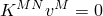

has nontrivial solutions. 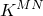 is the tangent stiffness matrix when the loads are applied, and the  are nontrivial displacement solutions. The applied loads can consist of pressures, concentrated forces, nonzero prescribed displacements, and/or thermal loading.

Eigenvalue buckling is generally used to estimate the critical buckling loads of stiff structures (classical eigenvalue buckling). Stiff structures carry their design loads primarily by axial or membrane action, rather than by bending action. Their response usually involves very little deformation prior to buckling. A simple example of a stiff structure is the Euler column, which responds very stiffly to a compressive axial load until a critical load is reached, when it bends suddenly and exhibits a much lower stiffness. However, even when the response of a structure is nonlinear before collapse, a general eigenvalue buckling analysis can provide useful estimates of collapse mode shapes.

#### The base state

The buckling loads are calculated relative to the base state of the structure. If the eigenvalue buckling procedure is the first step in an analysis, the initial conditions form the base state; otherwise, the base state is the current state of the model at the end of the last general analysis step (see ["General and linear perturbation procedures," Section 6.1.3](pt03ch06s01aus44.md)). Thus, the base state can include preloads (“dead” loads), . The preloads are often zero in classical eigenvalue buckling problems.

If geometric nonlinearity was included in the general analysis steps prior to the eigenvalue buckling analysis (see ["General and linear perturbation procedures," Section 6.1.3](pt03ch06s01aus44.md)), the base state geometry is the deformed geometry at the end of the last general analysis step. If geometric nonlinearity was omitted, the base state geometry is the original configuration of the body.

### The eigenvalue problem

An incremental loading pattern, 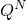, is defined in the eigenvalue buckling prediction step. The magnitude of this loading is not important; it will be scaled by the load multipliers, , found in the eigenvalue problem: 

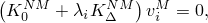

where


is the stiffness matrix corresponding to the base state, which includes the effects of the preloads,  (if any);

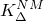

is the differential initial stress and load stiffness matrix due to the incremental loading pattern, ;


are the eigenvalues;

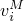

are the buckling mode shapes (eigenvectors);

*M* and *N*

refer to degrees of freedom *M* and *N* of the whole model; and

*i*

refers to the *i*th buckling mode.

The critical buckling loads are then . Normally, the lowest value of  is of interest. The preload pattern, , and perturbation load pattern, , may be different. For example,  might be thermal loading caused by temperature changes, while  is caused by application of pressure.

The buckling mode shapes, , are normalized vectors and do not represent actual magnitudes of deformation at critical load. They are normalized so that the maximum displacement component is 1.0. If all displacement components are zero, the maximum rotation component is normalized to 1.0. These buckling mode shapes are often the most useful outcome of the eigenvalue analysis, since they predict the likely failure mode of the structure.

Abaqus/Standard can extract eigenvalues and eigenvectors for symmetric matrices only; therefore,  and  are symmetrized. If the matrices have significant unsymmetric parts, the eigenproblem may not be exactly what you expected to solve.

#### Selecting the eigenvalue extraction method

Abaqus/Standard offers the Lanczos and the subspace iteration eigenvalue extraction methods. The Lanczos method is generally faster when a large number of eigenmodes is required for a system with many degrees of freedom. The subspace iteration method may be faster when only a few (less than 20) eigenmodes are needed.

By default, the subspace iteration eigensolver is employed. Subspace iteration and the Lanczos solver can be used for different steps in the same analysis; there is no requirement that the same eigensolver be used for all appropriate steps.

For both eigensolvers you specify the desired number of eigenvalues; Abaqus/Standard will choose a suitable number of vectors for the subspace iteration procedure or a suitable block size for the Lanczos method (although you can override this choice, if needed). Significant overestimation of the actual number of eigenvalues can create very large files. If the actual number of eigenvalues is underestimated, Abaqus/Standard will issue a corresponding warning message.

In general, the block size for the Lanczos method should be as large as the largest expected multiplicity of eigenvalues (that is, the largest number of modes with the same eigenvalue). A block size larger than 10 is not recommended. If the number of eigenvalues requested is *n*, the default block size is the minimum of (7, *n*). The number of block Lanczos steps is usually determined by Abaqus/Standard, but you can change it when you define the eigenvalue buckling prediction step. In general, if a particular type of eigenproblem converges slowly, providing more block Lanczos steps will reduce the analysis cost. On the other hand, if you know that a particular type of problem converges quickly, providing fewer block Lanczos steps will reduce the amount of in-core memory used. If the number of eigenvalues requested is *n*, the default is

| Block size | *n* ≤ 10 | *n* > 10 |
| --- | --- | --- |
| 1 | 40 | 70 |
| 2 | 40 | 60 |
| 3 | 30 | 60 |
| ≥ 4 | 30 | 30 |

If the subspace iteration technique is requested, you can also specify the maximum eigenvalue of interest; Abaqus/Standard will extract eigenvalues until either the requested number of eigenvalues has been extracted or the last eigenvalue extracted exceeds the maximum eigenvalue of interest.

If the Lanczos eigensolver is requested, you can also specify the minimum and/or maximum eigenvalues of interest; Abaqus/Standard will extract eigenvalues until either the requested number of eigenvalues has been extracted in the given range or all the eigenvalues in the given range have been extracted.

| **Input File Usage: ** | Use the following option to perform an eigenvalue buckling analysis using the subspace iteration method: |
| --- | --- |
|  | ``` [*BUCKLE](../key/key-link.md#usb-kws-hbuckle), EIGENSOLVER=SUBSPACE (default) ``` Use the following option to perform an eigenvalue buckling analysis using the Lanczos method: ``` [*BUCKLE](../key/key-link.md#usb-kws-hbuckle), EIGENSOLVER=LANCZOS ``` |

| **Abaqus/CAE Usage: ** | Step module: **Create Step**: **Linear perturbation**: **Buckle**: **Eigensolver: Lanczos** or **Subspace** |
| --- | --- |

##### Limitations associated with applying the Lanczos eigensolver to a buckling analysis

The Lanczos eigensolver cannot be used for buckling analyses in which the stiffness matrix is indefinite, as in the following cases:
- A model containing hybrid elements or connector elements.
- A model containing distributing coupling constraints, defined either directly (["Coupling constraints," Section 35.3.2](pt08ch35s03aus133.md); ["Shell-to-solid coupling," Section 35.3.3](pt08ch35s03aus134.md); or ["Mesh-independent fasteners," Section 35.3.4](pt08ch35s03aus135.md)) or by the distributing coupling elements (DCOUP2D and DCOUP3D).
- A model containing contact pairs or contact elements.
- A model that has been preloaded above the bifurcation (buckling) load.
- A model that has rigid body modes.

In such cases Abaqus/Standard will issue an error message and terminate the analysis.

#### Order of calculation and formation of the stiffness matrices

In an eigenvalue buckling prediction step Abaqus/Standard first does a static perturbation analysis to determine the incremental stresses, 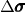, due to . If the base state did not include geometric nonlinearity, the stiffness matrix used in this static perturbation analysis is the tangent elastic stiffness. If the base state did include geometric nonlinearity, initial stress and load stiffness terms (due to the preload, ) are included. The stiffness matrix  corresponding to  and  is then formed.

In the eigenvalue extraction portion of the buckling step, the stiffness matrix  corresponding to the base state geometry is formed. Initial stress and the load stiffness terms due to the preload, , are always included regardless of whether or not geometric nonlinearity is included and are calculated based on the geometry of the base state.

When forming the stiffness matrices  and , all contact conditions are fixed in the base state.

#### Buckling modes with closely spaced eigenvalues

Some structures have many buckling modes with closely spaced eigenvalues, which can cause numerical problems. In these cases it often helps to apply enough preload, , to load the structure to just below the buckling load before performing the eigenvalue extraction.

If 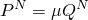—where  is a scalar constant and the structure is “stiff” and elastic—and if the problem is linear, the structural stiffness changes to 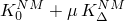 and the buckling loads are given by 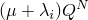. The process is equivalent to a dynamic eigenfrequency extraction with shift . The structure should not be preloaded above the buckling load. In that case the subspace iteration process may fail to converge or produce incorrect results; the Lanczos eigensolver cannot be used (as discussed earlier).

In many cases a series of closely spaced eigenvalues indicates that the structure is imperfection sensitive. An eigenvalue buckling analysis will not give accurate predictions of the buckling load for imperfection-sensitive structures; the static Riks procedure should be used instead (see ["Unstable collapse and postbuckling analysis," Section 6.2.4](pt03ch06s02at03.md)).

### Understanding negative eigenvalues

Sometimes, negative eigenvalues are reported in an eigenvalue buckling analysis. In most cases such negative eigenvalues indicate that the structure would buckle if the load were applied in the opposite direction. A classical example is a plate under shear loading; the plate will buckle at the same value for positive and negative applied shear load. Buckling under reverse loading can also occur in situations where it may not be expected. For example, a pressure vessel under external pressure may exhibit a negative eigenvalue (buckling under internal pressure) due to local buckling of a stiffener. Such “physical” negative buckling modes are usually readily understood once they are displayed and can usually be avoided by applying a preload before the buckling analysis.

Negative eigenvalues sometimes correspond to buckling modes that cannot be understood readily in terms of physical behavior, particularly if a preload is applied that causes significant geometric nonlinearity. In this case a geometrically nonlinear load-displacement analysis should be performed (["Unstable collapse and postbuckling analysis," Section 6.2.4](pt03ch06s02at03.md)).

### Including large geometry changes in a buckling analysis

Because buckling analysis is usually done for “stiff” structures, it is not usually necessary to include the effects of geometry change in establishing equilibrium for the base state. However, if significant geometry change is involved in the base state and this effect is considered to be important, it can be included by specifying that geometric nonlinearity should be considered for the base state step (see ["General and linear perturbation procedures," Section 6.1.3](pt03ch06s01aus44.md)). In such cases it is probably more realistic to perform a geometrically nonlinear load-displacement analysis (Riks analysis) to determine the collapse loads, especially for imperfection-sensitive structures.

While large deformation can be included in the preload, the eigenvalue buckling theory relies on there being little geometric change due to the “live” buckling load, 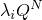. If the live load produces significant geometric change, a nonlinear collapse (Riks) analysis must be used. The total buckling load predicted by the eigenvalue analysis, , may be a good estimate for the limit load in the nonlinear buckling analysis. The Riks method is described in ["Unstable collapse and postbuckling analysis," Section 6.2.4](pt03ch06s02at03.md).

### Initial conditions

The initial values of quantities such as stress, temperature, field variables, and solution-dependent variables can be specified for an eigenvalue buckling analysis. If the buckling step is the first step in the analysis, these initial conditions form the base state of the structure. ["Initial conditions in Abaqus/Standard and Abaqus/Explicit," Section 34.2.1](pt07ch34s02aus116.md), describes all of the available initial conditions.

### Boundary conditions

Boundary conditions can be applied to any of the displacement or rotation degrees of freedom (1–6) or to warping degree of freedom 7 in open-section beam elements (["Boundary conditions in Abaqus/Standard and Abaqus/Explicit," Section 34.3.1](pt07ch34s03aus118.md)). A nonzero prescribed boundary condition in a general analysis step preceding the eigenvalue buckling analysis can be used to preload the structure. Nonzero boundary conditions prescribed in an eigenvalue buckling step will contribute to the incremental stress  and, thus, will contribute to the differential initial stress stiffness. When prescribing nonzero boundary conditions, you must interpret the resulting eigenproblem carefully. Nonzero prescribed boundary conditions will be treated as constraints (i.e., as if they were fixed) during the eigenvalue extraction. Therefore, unless the prescribed boundary conditions are removed for the eigenvalue extraction by specifying buckling mode boundary conditions (see the discussion below), the mode shapes may be altered by these boundary conditions.

Amplitude definitions (["Amplitude curves," Section 34.1.2](pt07ch34s01aus115.md)) cannot be used to vary the magnitudes of prescribed boundary conditions during an eigenvalue buckling analysis.

You can define perturbation load and buckling mode boundary conditions in an eigenvalue buckling prediction step.

| **Input File Usage: ** | Use either of the following two options to define perturbation load boundary conditions: |
| --- | --- |
|  | ``` [*BOUNDARY](../key/key-link.md#usb-kws-hboundary) [*BOUNDARY](../key/key-link.md#usb-kws-hboundary), LOAD CASE=1 ``` Use the following option to define buckling mode boundary conditions: ``` [*BOUNDARY](../key/key-link.md#usb-kws-hboundary), LOAD CASE=2, OP=NEW ``` The OP=NEW parameter is required when you define buckling mode boundary conditions in an eigenvalue buckling prediction step; however, the perturbation load boundary conditions in the step can use either OP=NEW or OP=MOD. |

| **Abaqus/CAE Usage: ** | Load module: **Create Boundary Condition**: choose **Mechanical** for the **Category** and **Symmetry/Antisymmetry/Encastre** for the **Types for Selected Step**: select region: toggle on **Stress perturbation only** to define a perturbation load boundary condition; toggle on **Buckling mode calculation only** to define a buckling mode boundary condition; toggle on **Stress perturbation and buckling mode calculation** to define both types of boundary conditions |
| --- | --- |

#### Combining boundary conditions

The buckling mode shapes depend on the stresses in the base state as well as the incremental stresses due to the perturbation loading in the buckling step. These stresses are influenced by the boundary conditions used in each step. In a general eigenvalue buckling analysis the following types of boundary conditions can influence the stresses:

1. The boundary conditions in the base state.
2. The boundary conditions used to calculate the linear perturbation stresses, . These boundary conditions will be: 1. the perturbation load boundary conditions specified in the eigenvalue buckling step; or 2. the base-state boundary conditions if no perturbation load boundary conditions are specified in the eigenvalue buckling step; or 3. the buckling mode boundary conditions if neither perturbation load boundary conditions nor base-state boundary conditions exist.
3. The boundary conditions used for the eigenvalue extraction. These boundary conditions will be: 1. the buckling mode boundary conditions; or 2. the perturbation load boundary conditions if buckling mode boundary conditions are not specified in the eigenvalue buckling step; or 3. the base-state boundary conditions if no boundary condition definition is used in the eigenvalue buckling step.

[Table 6.2.3--1](pt03ch06s02at02.md#aeigenbuckling-bc-table) summarizes the use of boundary conditions during an eigenvalue buckling step. When buckling mode boundary conditions are specified, *all* boundary conditions to be imposed during eigenvalue extraction must be specified.

#### Buckling of symmetric structures

The buckling mode shapes of symmetric structures subjected to symmetric loadings are either symmetric or antisymmetric. In such cases it is often more efficient to model only part of the structure and then perform the buckling analysis twice for each symmetry plane: once with symmetric boundary conditions and once with antisymmetric boundary conditions.

The live load pattern is usually symmetric, so symmetric boundary conditions are required for the calculation of the perturbation stresses used in the formation of the initial stress stiffness matrix. The boundary conditions must be switched to antisymmetric for the eigenvalue extraction to obtain the antisymmetric modes. ["Buckling of a cylindrical shell under uniform axial pressure," Section 1.2.3 of the Abaqus Benchmarks Guide](../bmk/bmk-link.md#bmk-anl-bucklecylshell), illustrates such a case.

If the model includes more than one symmetry plane, it may be necessary to study all permutations of symmetric and antisymmetric boundary conditions for each symmetry plane.

**Table 6.2.3–1** Boundary conditions in effect during the different portions of an eigenvalue buckling analysis.
| User-defined boundary conditions | Boundary conditions used by Abaqus |
| --- | --- |
| Base state | Eigenvalue buckling prediction step | Linear perturbation | Eigenvalue extraction |
| B | 0 | B | B |
| 0 | 1 | 1 | 1 |
| 0 | 2 | 2 | 2 |
| B | 1 | 1 | 1 |
| B | 2 | B | 2 |
| 0 | 1, 2 | 1 | 2 |
| B | 1, 2 | 1 | 2 |
| B = base-state boundary conditions; 0 = no boundary conditions specified |
| 1 = perturbation load boundary conditions |
| 2 = buckling mode boundary conditions |

##### Asymmetric buckling of axisymmetric structures

Axisymmetric structures subjected to compressive loading often collapse in nonaxisymmetric modes. These modes cannot be found with purely axisymmetric modeling such as that provided by shell elements SAX1 and SAX2 (["Axisymmetric shell element library," Section 29.6.9](pt06ch29s06ael19.md)) or continuum elements CAX4 or CAX8 (["Axisymmetric solid element library," Section 28.1.6](pt06ch28s01ael05.md)). Such analyses must be done with three-dimensional shell or continuum elements.

### Loads

The following types of loading can be prescribed in an eigenvalue buckling analysis:
- Concentrated nodal forces can be applied to the displacement degrees of freedom (1--6); see ["Concentrated loads," Section 34.4.2](pt07ch34s04aus121.md).
- Distributed pressure forces or body forces can be applied; see ["Distributed loads," Section 34.4.3](pt07ch34s04aus122.md). The distributed load types available with particular elements are described in [Part VI, "Elements](pt06.md)."

The load stiffness can have a significant effect on the critical buckling load; therefore, Abaqus/Standard will take the load stiffness due to preloads into account when solving the eigenvalue buckling problem. It is important that the structure not be preloaded above the critical buckling load.

Any load applied during the eigenvalue buckling analysis is called a “live” load. This incremental load, , describes the load pattern for which buckling sensitivity is being investigated; its magnitude is not important. This incremental loading definition represents linear perturbation loads, as described in ["Applying loads: overview," Section 34.4.1](pt07ch34s04aus120.md).

Follower forces (such as concentrated loads assumed to rotate with the nodal rotation or pressure loads) lead to an unsymmetric load stiffness. Since eigenvalue extraction in Abaqus/Standard can be performed only on symmetric matrices, eigenvalue analysis with follower loads may not yield correct results.

Amplitude definitions cannot be used during an eigenvalue buckling analysis. ["Applying loads: overview," Section 34.4.1](pt07ch34s04aus120.md), describes all of the available loads.

Prescribed boundary conditions can also be used to load the structure in an eigenvalue buckling analysis, as discussed earlier.

### Predefined fields

In an eigenvalue buckling prediction step, nodal temperatures can be specified (see ["Predefined fields," Section 34.6.1](pt07ch34s06aus128.md)). The specified temperatures will cause thermal strain during the static perturbation analysis if a thermal expansion coefficient is given for the material (["Thermal expansion," Section 26.1.2](pt05ch26s01abm52.md)), and incremental stresses  will be generated. Hence, Abaqus/Standard can analyze buckling due to thermal stress. The specified temperature will not affect temperature-dependent material properties during the eigenvalue buckling prediction step; the material properties are based on the temperature in the base state. Amplitude definitions cannot be used to vary the magnitudes of prescribed temperatures during an eigenvalue buckling analysis.

### Material options

During an eigenvalue buckling analysis, the model's response is defined by its linear elastic stiffness in the base state. All nonlinear and/or inelastic material properties, as well as effects involving time or strain rate, are ignored during an eigenvalue buckling analysis. In classical eigenvalue buckling the response in the base state is also linear.

If temperature-dependent elastic properties are used, the eigenvalue buckling analysis will not account for changes in the stiffness matrix due to temperature changes. The material properties of the base state will be used.

Acoustic properties, thermal properties (except for thermal expansion), mass diffusion properties, electrical properties, and pore fluid flow properties are not active during an eigenvalue buckling analysis.

### Elements

Any of the stress/displacement elements in Abaqus/Standard (including those with temperature or pressure degrees of freedom) can be used in an eigenvalue buckling analysis, with the exception that hybrid and contact elements cannot be used with the Lanczos eigensolver (as discussed earlier). See ["Choosing the appropriate element for an analysis type," Section 27.1.3](pt06ch27s01aus112.md).

### Output

The values of the eigenvalues, , will be listed in the printed output file. If output of stresses, strains, reaction forces, etc. is requested, this information will be printed for each eigenvalue; these quantities are perturbation values and represent mode shapes, not absolute values. All of the output variable identifiers are outlined in ["Abaqus/Standard output variable identifiers," Section 4.2.1](pt02ch04s02abv01.md).

Buckling mode shapes can be plotted in the Visualization module of Abaqus/CAE.

### Input file template

The following template describes a very general eigenvalue buckling problem, where as many eigenvalue buckling prediction steps as needed can be specified.

Symmetric boundary conditions are specified in the model definition part of the Abaqus/Standard input and, therefore, belong to the base state (see ["General and linear perturbation procedures," Section 6.1.3](pt03ch06s01aus44.md)). In the first buckling step Abaqus/Standard uses the base-state boundary conditions to solve for the perturbation stresses as well as for the eigenvalue extraction.

In the second buckling step the boundary conditions for the base state, the initial stress calculation, and the eigenvalue extraction are all different. Abaqus/Standard uses the specified symmetry boundary conditions to solve for the perturbation stresses but uses the specified antisymmetry boundary conditions for the eigenvalue extraction.

```
[*HEADING](../key/key-link.md#usb-kws-mheading)
…
[*BOUNDARY](../key/key-link.md#usb-kws-hboundary)
*Data lines to specify zero-valued boundary conditions contributing to the base state*
**
[*STEP](../key/key-link.md#usb-kws-hstep), NLGEOM
*The load stiffness terms will be included in the eigenvalue buckling steps*
*since the NLGEOM parameter is used in this (optional) preload step*
[*STATIC](../key/key-link.md#usb-kws-hstatic)
*Data line to control incrementation*
[*BOUNDARY](../key/key-link.md#usb-kws-hboundary)
*Data lines to specify nonzero boundary conditions (dead loads)*
[*CLOAD](../key/key-link.md#usb-kws-hcload) and/or [*DLOAD](../key/key-link.md#usb-kws-hdload) and/or [*TEMPERATURE](../key/key-link.md#usb-kws-htemperature)
*Data lines to specify dead loads*,  
[*END STEP](../key/key-link.md#usb-kws-hendstep)
**
[*STEP](../key/key-link.md#usb-kws-hstep)
[*BUCKLE](../key/key-link.md#usb-kws-hbuckle)
*Data line to request the desired number of symmetric modes*
[*CLOAD](../key/key-link.md#usb-kws-hcload) and/or [*DLOAD](../key/key-link.md#usb-kws-hdload) and/or [*TEMPERATURE](../key/key-link.md#usb-kws-htemperature)
*Data lines to specify perturbation loading*,  
[*END STEP](../key/key-link.md#usb-kws-hendstep)
**
[*STEP](../key/key-link.md#usb-kws-hstep)
[*BUCKLE](../key/key-link.md#usb-kws-hbuckle)
*Data line to request the desired number of antisymmetric modes*
[*CLOAD](../key/key-link.md#usb-kws-hcload) and/or [*DLOAD](../key/key-link.md#usb-kws-hdload) and/or [*TEMPERATURE](../key/key-link.md#usb-kws-htemperature)
*Data lines to specify perturbation loading*,  
[*BOUNDARY](../key/key-link.md#usb-kws-hboundary), LOAD CASE=1
*Data lines to specify all boundary conditions for perturbation loading*
[*BOUNDARY](../key/key-link.md#usb-kws-hboundary), LOAD CASE=2, OP=NEW
*Data lines to specify all antisymmetric boundary conditions for eigenvalue extraction*
[*END STEP](../key/key-link.md#usb-kws-hendstep)
```


