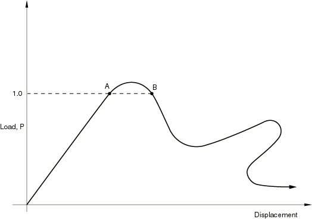
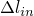
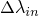
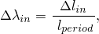
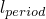
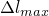
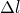
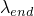

# 6.2.4 Unstable collapse and postbuckling analysis


**Products: **Abaqus/Standard  Abaqus/CAE  

##### **References**

- ["Defining an analysis," Section 6.1.2](pt03ch06s01abo05.md)
- ["Static stress analysis procedures: overview," Section 6.2.1](pt03ch06s02abo06.md)
- ["Introducing a geometric imperfection into a model," Section 11.3.1](pt04ch11s03aus67.md)
- [*STATIC](../key/key-link.md#usb-kws-hstatic)
- [*IMPERFECTION](../key/key-link.md#usb-kws-mimperfection)
- ["Configuring a static, Riks procedure" in "Configuring general analysis procedures," Section 14.11.1 of the Abaqus/CAE User's Guide](../usi/usi-link.md#usi-sim-configure-riks)

### Overview

The Riks method:
- is generally used to predict unstable, geometrically nonlinear collapse of a structure;
- can include nonlinear materials and boundary conditions;
- often follows an eigenvalue buckling analysis to provide complete information about a structure's collapse; and
- can be used to speed convergence of ill-conditioned or snap-through problems that do not exhibit instability.

### Unstable response

Geometrically nonlinear static problems sometimes involve buckling or collapse behavior, where the load-displacement response shows a negative stiffness and the structure must release strain energy to remain in equilibrium. Several approaches are possible for modeling such behavior. One is to treat the buckling response dynamically, thus actually modeling the response with inertia effects included as the structure snaps. This approach is easily accomplished by restarting the terminated static procedure (["Restarting an analysis," Section 9.1.1](pt04ch09s01aus53.md)) and switching to a dynamic procedure (["Implicit dynamic analysis using direct integration," Section 6.3.2](pt03ch06s03at07.md)) when the static solution becomes unstable. In some simple cases displacement control can provide a solution, even when the conjugate load (the reaction force) is decreasing as the displacement increases. Another approach would be to use dashpots to stabilize the structure during a static analysis. Abaqus/Standard offers an automated version of this stabilization approach for the static analysis procedures (see ["Static stress analysis," Section 6.2.2](pt03ch06s02at01.md); ["Quasi-static analysis," Section 6.2.5](pt03ch06s02at04.md); ["Fully coupled thermal-stress analysis," Section 6.5.3](pt03ch06s05at19.md); or ["Coupled pore fluid diffusion and stress analysis," Section 6.8.1](pt03ch06s08at26.md)).

Alternatively, static equilibrium states during the unstable phase of the response can be found by using the “modified Riks method.” This method is used for cases where the loading is proportional; that is, where the load magnitudes are governed by a single scalar parameter. The method can provide solutions even in cases of complex, unstable response such as that shown in [Figure 6.2.4--1](pt03ch06s02at03.md#apostbuckling-prop-load).

**Figure 6.2.4–1** Proportional loading with unstable response.



The Riks method is also useful for solving ill-conditioned problems such as limit load problems or almost unstable problems that exhibit softening.

### The Riks method

In simple cases linear eigenvalue analysis (["Eigenvalue buckling prediction," Section 6.2.3](pt03ch06s02at02.md)) may be sufficient for design evaluation; but if there is concern about material nonlinearity, geometric nonlinearity prior to buckling, or unstable postbuckling response, a load-deflection (Riks) analysis must be performed to investigate the problem further.

The Riks method uses the load magnitude as an additional unknown; it solves simultaneously for loads and displacements. Therefore, another quantity must be used to measure the progress of the solution; Abaqus/Standard uses the “arc length,” *l*, along the static equilibrium path in load-displacement space. This approach provides solutions regardless of whether the response is stable or unstable. See the ["Modified Riks algorithm," Section 2.3.2 of the Abaqus Theory Guide](../stm/stm-link.md#stm-anl-modifiedriks), for a detailed description of the method.

#### Proportional loading

If the Riks step is a continuation of a previous history, any loads that exist at the beginning of the step and are not redefined are treated as “dead” loads with constant magnitude. A load whose magnitude is defined in the Riks step is referred to as a “reference” load. All prescribed loads are ramped from the initial (dead load) value to the reference values specified.

The loading during a Riks step is always proportional. The current load magnitude, , is defined by 


where  is the “dead load,”  is the reference load vector, and  is the “load proportionality factor.” The load proportionality factor is found as part of the solution. Abaqus/Standard prints out the current value of the load proportionality factor at each increment.

#### Incrementation

Abaqus/Standard uses Newton's method (as described in ["Static stress analysis," Section 6.2.2](pt03ch06s02at01.md)) to solve the nonlinear equilibrium equations. The Riks procedure uses only a 1% extrapolation of the strain increment.

You provide an initial increment in arc length along the static equilibrium path, , when you define the step. The initial load proportionality factor, , is computed as 



where  is a user-specified total arc length scale factor (typically set equal to 1). This value of  is used during the first iteration of a Riks step. For subsequent iterations and increments the value of  is computed automatically, so you have no control over the load magnitude. The value of  is part of the solution. Minimum and maximum arc length increments,  and , can be used to control the automatic incrementation.

| **Input File Usage: ** | ``` [*STATIC](../key/key-link.md#usb-kws-hstatic), RIKS ``` |
| --- | --- |

| **Abaqus/CAE Usage: ** | Step module: **Create Step**: **General**: **Static, Riks** |
| --- | --- |

Direct user control of the increment size is also provided; in this case the incremental arc length, , is kept constant. This method is not recommended for a Riks analysis since it prevents Abaqus/Standard from reducing the arc length when a severe nonlinearity is encountered.

| **Input File Usage: ** | ``` [*STATIC](../key/key-link.md#usb-kws-hstatic), RIKS, DIRECT ``` |
| --- | --- |

| **Abaqus/CAE Usage: ** | Step module: **Create Step**: **General**: **Static, Riks**: **Incrementation**: **Type: Fixed** |
| --- | --- |

### Ending a Riks analysis step

Since the loading magnitude is part of the solution, you need a method to specify when the step is completed. You can specify a maximum value of the load proportionality factor, , or a maximum displacement value at a specified degree of freedom. The step will terminate when either value is crossed. If neither of these finishing conditions is specified, the analysis will continue for the number of increments specified in the step definition (see ["Defining an analysis," Section 6.1.2](pt03ch06s01abo05.md)).

### Bifurcation

The Riks method works well in snap-through problems—those in which the equilibrium path in load-displacement space is smooth and does not branch. Generally you do not need take any special precautions in problems that do not exhibit branching (bifurcation). ["Snap-through buckling analysis of circular arches," Section 1.2.1 of the Abaqus Example Problems Guide](../exa/exa-link.md#exa-sta-snapbuckling), is an example of a smooth snap-through problem.

The Riks method can also be used to solve postbuckling problems, both with stable and unstable postbuckling behavior. However, the exact postbuckling problem cannot be analyzed directly due to the discontinuous response at the point of buckling. To analyze a postbuckling problem, it must be turned into a problem with continuous response instead of bifurcation. This effect can be accomplished by introducing an initial imperfection into a “perfect” geometry so that there is some response in the buckling mode before the critical load is reached.

#### Introducing geometric imperfections

Imperfections are usually introduced by perturbations in the geometry. Unless the precise shape of an imperfection is known, an imperfection consisting of multiple superimposed buckling modes must be introduced (["Eigenvalue buckling prediction," Section 6.2.3](pt03ch06s02at02.md)). Abaqus allows you to define imperfections; see ["Introducing a geometric imperfection into a model," Section 11.3.1](pt04ch11s03aus67.md).

In this way the Riks method can be used to perform postbuckling analyses of structures that show linear behavior prior to (bifurcation) buckling. An example of this method of introducing geometric imperfections is presented in ["Buckling of a cylindrical shell under uniform axial pressure," Section 1.2.3 of the Abaqus Benchmarks Guide](../bmk/bmk-link.md#bmk-anl-bucklecylshell).

By performing a load-displacement analysis, other important nonlinear effects, such as material inelasticity or contact, can be included. In contrast, all inelastic effects are ignored in a linear eigenvalue buckling analysis and all contact conditions are fixed in the base state. Imperfections based on linear buckling modes can also be useful for the analysis of structures that behave inelastically prior to reaching peak load.

#### Introducing loading imperfections

Perturbations in loads or boundary conditions can also be used to introduce initial imperfections. In this case fictitious “trigger” loads can be used to initiate the instability. The trigger loads should perturb the structure in the expected buckling modes. Typically, these loads are applied as dead loads prior to the Riks step so that they have fixed magnitudes. The magnitudes of trigger loads must be sufficiently small so that they do not affect the overall postbuckling solution. It is your responsibility to choose appropriate magnitudes and locations for such fictitious loads; Abaqus/Standard does not check that they are reasonable.

### Obtaining a solution at a particular load or displacement value

The Riks algorithm cannot obtain a solution at a given load or displacement value since these are treated as unknowns—termination occurs at the first solution that satisfies the step termination criterion. To obtain solutions at exact values of load or displacement, the solution must be restarted at the desired point in the step (["Restarting an analysis," Section 9.1.1](pt04ch09s01aus53.md)) and a new, non-Riks step must be defined. Since the subsequent step is a continuation of the Riks analysis, the load magnitude in that step must be given appropriately so that the step begins with the loading continuing to increase or decrease according to its behavior at the point of restart. For example, if the load was increasing at the restart point and was positive, a larger load magnitude than the current magnitude should be given in the restart step to continue this behavior. If the load was decreasing but positive, a smaller magnitude than the current magnitude should be specified.

### Restrictions

A Riks analysis is subject to the following restrictions:
- A Riks step cannot be followed by another step in the same analysis. Subsequent steps must be analyzed by using the restart capability.
- If a Riks analysis includes irreversible deformation such as plasticity and a restart using another Riks step is attempted while the magnitude of the load on the structure is decreasing, Abaqus/Standard will find the elastic unloading solution. Therefore, restart should occur at a point in the analysis where the load magnitude is increasing if plasticity is present.
- For postbuckling problems involving loss of contact, the Riks method will usually not work; inertia or viscous damping forces (such as those provided by dashpots) must be introduced in a dynamic or static analysis to stabilize the solution.

### Initial conditions

Initial values of stresses, temperatures, field variables, solution-dependent state variables, etc. can be specified; ["Initial conditions in Abaqus/Standard and Abaqus/Explicit," Section 34.2.1](pt07ch34s02aus116.md), describes all of the available initial conditions.

### Boundary conditions

Boundary conditions can be applied to any of the displacement or rotation degrees of freedom (1–6) or to warping degree of freedom 7 in open-section beam elements (["Boundary conditions in Abaqus/Standard and Abaqus/Explicit," Section 34.3.1](pt07ch34s03aus118.md)). Amplitude definitions (["Amplitude curves," Section 34.1.2](pt07ch34s01aus115.md)) cannot be used to vary the magnitudes of prescribed boundary conditions during a Riks analysis.

### Loads

The following loads can be prescribed in a Riks analysis:
- Concentrated nodal forces can be applied to the displacement degrees of freedom (1--6); see ["Concentrated loads," Section 34.4.2](pt07ch34s04aus121.md).
- Distributed pressure forces or body forces can be applied; see ["Distributed loads," Section 34.4.3](pt07ch34s04aus122.md). The distributed load types available with particular elements are described in [Part VI, "Elements](pt06.md)."

Since Abaqus/Standard scales loading magnitudes proportionally based on the user-specified magnitudes, amplitude references are ignored when the Riks method is chosen.

If follower loads are prescribed, their contribution to the stiffness matrix may be unsymmetric; the unsymmetric matrix storage and solution scheme can be used to improve computational efficiency in such cases (see ["Defining an analysis," Section 6.1.2](pt03ch06s01abo05.md)).

### Predefined fields

Nodal temperatures can be specified (see ["Predefined fields," Section 34.6.1](pt07ch34s06aus128.md)). Any difference between the applied and initial temperatures will cause thermal strain if a thermal expansion coefficient is given for the material (["Thermal expansion," Section 26.1.2](pt05ch26s01abm52.md)). The loads generated by the thermal strain contribute to the “reference” load specified for the Riks analysis and are ramped up with the load proportionality factor. Hence, the Riks procedure can analyze postbuckling and collapse due to thermal straining.

The values of other user-defined field variables can be specified. These values affect only field-variable-dependent material properties, if any. Since the concept of time is replaced by arc length in a Riks analysis, the use of properties that change due to changes in temperatures and/or field variables is not recommended.

### Material options

Most material models that describe mechanical behavior are available for use in a Riks analysis. The following material properties are not active during a Riks analysis: acoustic properties, thermal properties (except for thermal expansion), mass diffusion properties, electrical properties, and pore fluid flow properties. Materials with history dependence can be used; however, it should be realized that the results will depend on the loading history, which is not known in advance.

The concept of time is replaced by arc length in a Riks analysis. Therefore, any effects involving time or strain rate (such as viscous damping or rate-dependent plasticity) are no longer treated correctly and should not be used.

See [Part V, "Materials](pt05.md),” for details on the material models available in Abaqus/Standard.

### Elements

Any of the stress/displacement elements in Abaqus/Standard (including those with temperature or pressure degrees of freedom) can be used in a Riks analysis (see ["Choosing the appropriate element for an analysis type," Section 27.1.3](pt06ch27s01aus112.md)). Dashpots should not be used since velocities will be calculated as displacement increments divided by arc length, which is meaningless.

### Output

Output options are provided to allow the magnitudes of individual load components (pressure, point loads, etc.) to be printed or to be written to the results file. The current value of the load proportionality factor, LPF, will be given automatically with any results or output database file output request. These output options are recommended when the Riks method is used so that load magnitudes can be seen directly. All of the output variable identifiers are outlined in ["Abaqus/Standard output variable identifiers," Section 4.2.1](pt02ch04s02abv01.md).

### Input file template

```
[*HEADING](../key/key-link.md#usb-kws-mheading)
…
[*INITIAL CONDITIONS](../key/key-link.md#usb-kws-minitialcond)
*Data lines to define initial conditions*
[*BOUNDARY](../key/key-link.md#usb-kws-hboundary)
*Data lines to specify zero-valued boundary conditions*
**
[*STEP](../key/key-link.md#usb-kws-hstep), NLGEOM
[*STATIC](../key/key-link.md#usb-kws-hstatic)
[*CLOAD](../key/key-link.md#usb-kws-hcload) and/or [*DLOAD](../key/key-link.md#usb-kws-hdload) and/or [*TEMPERATURE](../key/key-link.md#usb-kws-htemperature)
*Data lines to specify preload (dead load), *
[*END STEP](../key/key-link.md#usb-kws-hendstep)
**
[*STEP](../key/key-link.md#usb-kws-hstep), NLGEOM
[*STATIC](../key/key-link.md#usb-kws-hstatic), RIKS
*Data line to define incrementation and stopping criteria*
[*CLOAD](../key/key-link.md#usb-kws-hcload) and/or [*DLOAD](../key/key-link.md#usb-kws-hdload) and/or [*TEMPERATURE](../key/key-link.md#usb-kws-htemperature)
*Data lines to specify reference loading*,  
[*END STEP](../key/key-link.md#usb-kws-hendstep)
```


