# 6.2.6 Direct cyclic analysis


**Products: **Abaqus/Standard  Abaqus/CAE  

##### **References**

- ["Defining an analysis," Section 6.1.2](pt03ch06s01abo05.md)
- [*DIRECT CYCLIC](../key/key-link.md#usb-kws-hdirectcyclic)
- [*TIME POINTS](../key/key-link.md#usb-kws-htimepoints)
- [*CONTROLS](../key/key-link.md#usb-kws-hcontrols)
- ["Configuring a direct cyclic procedure" in "Configuring general analysis procedures," Section 14.11.1 of the Abaqus/CAE User's Guide](../usi/usi-link.md#usi-sim-configure-directcyclic)

### Overview

A direct cyclic analysis: 
- is a quasi-static analysis;
- uses a combination of Fourier series and time integration of the nonlinear material behavior to obtain the stabilized cyclic response of the structure iteratively;
- avoids the considerable numerical expense associated with a transient analysis;
- is ideally suited for very large problems in which many load cycles must be applied to obtain the stabilized response if transient analysis is performed;
- can be performed with linear or nonlinear material with localized plastic deformation;
- can be used to predict the likelihood of plastic ratchetting;
- assumes geometrically linear behavior and fixed contact conditions;
- uses the elastic stiffness, so the equation system is inverted only once; and
- can also be used to predict progressive damage and failure for ductile bulk materials and/or to predict delamination/debonding growth at the interfaces in laminated composites in a low-cycle fatigue analysis.

### Introduction

It is well known that after a number of repetitive loading cycles, the response of an elastic-plastic structure, such as an automobile exhaust manifold subjected to large temperature fluctuations and clamping loads, may lead to a stabilized state in which the stress-strain relationship in each successive cycle is the same as in the previous one. The classical approach to obtain the response of such a structure is to apply the periodic loading repetitively to the structure until a stabilized state is obtained. This approach can be quite expensive, since it may require the application of many loading cycles before the stabilized response is obtained. To avoid the considerable numerical expense associated with a transient analysis, a direct cyclic analysis can be used to calculate the cyclic response of the structure directly. The basis of this method is to construct a displacement function  that describes the response of the structure at all times *t* during a load cycle with period *T* as shown in [Figure 6.2.6--1](pt03ch06s02at05.md#usb-anl-direct-cyclic-iter). 

**Figure 6.2.6–1** A displacement function at all times *t* during a load cycle with period *T* at different iterations.


A truncated Fourier series is used for this purpose,

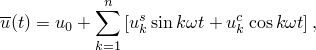

where *n* stands for the number of terms in the Fourier series,  is the angular frequency, and , and  are unknown displacement coefficients associated with each degree of freedom in the problem. Abaqus/Standard solves for the unknown displacement coefficients by using a modified Newton method, with the elastic stiffness matrix at the beginning of the analysis step serving as the Jacobian in the scheme. We expand the residual vector in the modified Newton method using a Fourier series of the same form as the displacement solution: 

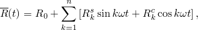

where each residual vector coefficient , 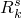, and   in the Fourier series corresponds to a displacement coefficient , and , respectively. The residual coefficients are obtained by tracking through the entire load cycle. At each instant in time in the cycle Abaqus/Standard obtains the residual vector  by using standard element-by-element calculations, which—when integrated over the entire cycle—provide the Fourier coefficients


The displacement solution is obtained by solving for corrections to the displacement Fourier coefficients corresponding to each residual coefficient. The updated displacement solution is used in the next iteration to obtain the displacements at each instant in time. This process is repeated until convergence is obtained. Each pass through the complete load cycle can, therefore, be thought of as a single iteration of the solution to the nonlinear problem. Convergence is measured by ensuring that all entries of the residual coefficients are small. 

The algorithm to obtain a stabilized cycle is described in detail in ["Direct cyclic algorithm," Section 2.2.3 of the Abaqus Theory Guide](../stm/stm-link.md#stm-anl-directcyclic).

### Direct cyclic analysis

A direct cyclic step can be the only step in an analysis, can follow a general or linear perturbation step, or can be followed by a general or linear perturbation step. If a direct cyclic step is followed by a general step, the solution at the end of the direct cyclic step will be the initial state of the general step. If a direct cyclic step follows a general or linear perturbation step, the elastic stiffness matrix at the end of the last general analysis step prior to the direct cyclic step will serve as the Jacobian in the direct cyclic procedure. Any prior (non-cyclic) loads are simply included in the constant part of the Fourier expansion of the residual vectors, and the plastic strains at the end of the preloading step are used as initial conditions for the direct cyclic step. 

Multiple direct cyclic analysis steps can be included in a single analysis. In such a case the Fourier series coefficients obtained in the previous step can be used as starting values in the current step. By default, the Fourier coefficients are reset to zero, thus allowing application of cyclic loading conditions that are very different from those defined in the previous direct cyclic step.

You can specify that a direct cyclic step in a restart analysis should use the Fourier coefficients from the previous step, thus allowing continuation of an analysis that has not reached a stabilized cycle. In a direct cyclic analysis a restart file is written at the end of the cycle or time period. Consequently, a restart analysis that is a continuation of a previous direct cyclic analysis will start with a new iteration at  (see ["Restarting an analysis," Section 9.1.1](pt04ch09s01aus53.md)).

| **Input File Usage: ** | Use the following option to reset the Fourier series coefficients to zero: |
| --- | --- |
|  | ``` [*DIRECT CYCLIC](../key/key-link.md#usb-kws-hdirectcyclic), CONTINUE=NO (default) ``` Use the following option to specify that the current step is a continuation of the previous direct cyclic step: ``` [*DIRECT CYCLIC](../key/key-link.md#usb-kws-hdirectcyclic), CONTINUE=YES ``` |

| **Abaqus/CAE Usage: ** | Use the following option to reset the Fourier series coefficients to zero (default): |
| --- | --- |
|  | Step module: **Create Step**: **General**: **Direct cyclic** Use the following option to specify that the current step is a continuation of the previous direct cyclic step: Step module: **Create Step**: **General**: **Direct cyclic**; **Basic:** **Use displacement Fourier coefficients from previous direct cyclic step** |

#### Using the direct cyclic approach to perform low-cycle fatigue analysis

The direct cyclic procedure can also be used in conjunction with the damage extrapolation technique to predict progressive damage and failure for ductile bulk materials and/or to predict delamination/debonding at the interfaces in laminated composites in a low-cycle fatigue analysis. In this case multiple cycles can be included in a single direct cyclic analysis, as described in ["Low-cycle fatigue analysis using the direct cyclic approach," Section 6.2.7](pt03ch06s02at06.md). 

| **Input File Usage: ** | ``` [*DIRECT CYCLIC](../key/key-link.md#usb-kws-hdirectcyclic), FATIGUE ``` |
| --- | --- |

| **Abaqus/CAE Usage: ** | Step module: **Create Step**: **General**: **Direct cyclic**; **Fatigue:** **Include low-cycle fatigue analysis** |
| --- | --- |

### Controlling the solution accuracy

Direct cyclic analysis combines a Fourier series approximation with time integration of the nonlinear material behavior to obtain the stabilized cyclic solution iteratively using a modified Newton method. The accuracy of the algorithm depends on the number of Fourier terms used, the number of iterations taken to obtain the stabilized solution, and the number of time points within the load period at which the material response and residual vector are evaluated. Abaqus/Standard allows you to control the solution in several ways, as described below.

#### Controlling the iterations in the modified Newton method

In the direct cyclic method global Newton iterations are performed to determine corrections to the displacement Fourier coefficients. During each global iteration Abaqus/Standard tracks through the entire time cycle to compute the residual vector at a suitable number of time points. This involves standard element-by-element finite element calculations in which history-dependent material variables are integrated. The residual vector is integrated over the period to obtain the Fourier residual coefficients, which in turn yield corrections in displacement coefficients when the system of equations is solved. Abaqus/Standard will continue with the iterative process until convergence is obtained or until the maximum number of iterations allowed has been reached. You can specify the maximum number of iterations when you define the direct cyclic step; the default is 200 iterations.

| **Input File Usage: ** | ``` [*DIRECT CYCLIC](../key/key-link.md#usb-kws-hdirectcyclic) , , , , , , , *max number of iterations* ``` |
| --- | --- |

| **Abaqus/CAE Usage: ** | Step module: **Create Step**: **General**: **Direct cyclic**; **Incrementation:** **Maximum number of iterations:** *max number of iterations* |
| --- | --- |

##### Specifying convergence criteria

Convergence is best measured by ensuring that all the residual coefficients are sufficiently small compared to the time averaged force and that all the corrections to displacement Fourier coefficients are sufficiently small compared to the displacement Fourier coefficients. The time averaged force is defined in ["Convergence criteria for nonlinear problems," Section 7.2.3](pt03ch07s02aus51.md). Abaqus/Standard requires that the ratio of the maximum residual coefficient to the time averaged force, 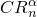, and the ratio of the maximum correction to the displacement coefficients to the largest displacement coefficient, 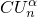, are less than the tolerances. The default values are  = 0.005 and  = 0.005. To change these values, you must define direct cyclic controls.

When a stabilized cyclic response does not exist, the method will not converge. In the case where plastic ratchetting occurs, the displacement and residual coefficients of all the periodic terms (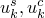, and 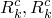) in the Fourier series converge. However, the displacement and the residual coefficients of the constant term ( and ) in the Fourier series continue to grow from one iteration to another iteration. The user-specified tolerances 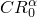 and  are used to detect the plastic ratchetting. The default values are  = 0.005 and  = 0.005. For more information, see ["Controlling the solution accuracy in direct cyclic analysis" in "Commonly used control parameters," Section 7.2.2](pt03ch07s02aus50.md#usb-anl-aconvergecontrol-directcyclic).

| **Input File Usage: ** | ``` [*CONTROLS](../key/key-link.md#usb-kws-hcontrols), TYPE=DIRECT CYCLIC ``` |
| --- | --- |

| **Abaqus/CAE Usage: ** | Step module: ****Other****General Solution Controls****Edit****; **Specify:** **Direct Cyclic** |
| --- | --- |

#### Controlling the Fourier representations

The number of Fourier terms required to obtain an accurate solution depends on the variation of the load as well as the variation of the structural response over the period. In determining the number of terms, keep in mind that the objective of this kind of analysis is to make low-cycle fatigue predictions. Hence, the goal is to obtain good approximation of the plastic strain cycle at each point; local inaccuracies in the stresses are less important. More Fourier terms usually provide a more accurate solution but at the expense of additional data storage and computational time. In addition, an accurate integration of the Fourier residual coefficients requires that the residual vector be evaluated at an adequate number of time points during the cycle. Abaqus/Standard uses a trapezoidal rule, which assumes a linear variation of the residual over a time increment, to integrate the residual coefficients. For accurate integration the number of time points must be larger than the number of Fourier coefficients (which is equal to , where *n* represents the number of Fourier terms). Abaqus/Standard will automatically reduce the number of Fourier coefficients used for the next iteration if it is found to be greater than the number of increments taken to complete an iteration.

Abaqus/Standard uses an adaptive algorithm to determine the number of Fourier terms. By default, Abaqus/Standard starts with 11 terms and determines the response of the structure by using the iterative method described before. Once convergence is obtained (which is measured by ensuring that all the residual vector coefficients and all the corrections to displacement coefficients in the Fourier series are sufficiently small), Abaqus/Standard evaluates if a sufficient number of Fourier terms are used by determining if equilibrium was satisfied at all the time points during the cycle. If equilibrium is satisfied at all time points, the solution is accepted. Otherwise, Abaqus/Standard increases the number of Fourier terms (by default, 5 terms are added) and continues with the iterative scheme until convergence with the new number of Fourier terms is obtained. This process is repeated until equilibrium is reached or until the maximum number of Fourier terms has been used. This scheme is best illustrated in [Figure 6.2.6--2](pt03ch06s02at05.md#usb-anl-direct-cyclic-converg), where both local equilibrium and overall convergence are obtained when the number of Fourier terms is equal to 21. A maximum number of 25 Fourier terms is used by default. You can specify the initial and maximum number of Fourier terms and the increment in the number of terms when you define the direct cyclic step.

**Figure 6.2.6–2** Stabilized iterations with different Fourier terms.


You can also define the convergence criteria for determining convergence and for determining whether equilibrium is achieved at all time points through the period (see ["Commonly used control parameters," Section 7.2.2](pt03ch07s02aus50.md)), with suitable defaults set by Abaqus/Standard.

In a direct cyclic analysis that has not reached a stabilized cycle, you can increase the number of iterations or Fourier terms upon restart, thus allowing continuation of an analysis.

Abaqus/Standard provides detailed output of the maximum residual at each time point, the maximum residual coefficient, the maximum displacement coefficient, the maximum correction to displacement coefficients, and the number of Fourier terms at the end of each iteration in the message (`.msg`) file. This output is described in more detail below.

| **Input File Usage: ** | ``` [*DIRECT CYCLIC](../key/key-link.md#usb-kws-hdirectcyclic) , , , , *initial number of terms*, *max number of terms*, *increment in number of terms* ``` |
| --- | --- |

| **Abaqus/CAE Usage: ** | Step module: **Create Step**: **General**: **Direct cyclic**; **Incrementation:** **Number of Fourier terms:** **Initial:** *initial number of terms*, **Maximum:** *max number of terms*, **Increment:** *increment in number of terms* |
| --- | --- |

#### Controlling the incrementation during the cyclic time period

To ensure an accurate solution, the material history as well as the residual vector must be evaluated at a sufficient number of time points during the cycle. The number of time points, , at which the response is computed must be larger than the number of Fourier coefficients; i.e., 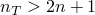. Abaqus/Standard will automatically adjust the number of Fourier coefficients if such a condition is not satisfied. You can specify the time incrementation over the cycle directly, or it can be determined automatically by Abaqus/Standard.

You should specify the maximum number of increments allowed in the time period as part of the step definition. The default is 100.

##### Automatic incrementation

There are several ways to choose the automatic incrementation scheme. If you specify only the maximum allowable nodal temperature change in an increment, the time increments are selected automatically based on this value. Abaqus/Standard will restrict the time increments to ensure that the maximum temperature change is not exceeded at any node during any increment of the analysis.

For rate-dependent constitutive equations you can limit the size of the time increment by the accuracy of the integration. The user-specified accuracy tolerance parameter limits the maximum inelastic strain rate change allowed over an increment:


where *t* is the time at the beginning of the increment,  is the time increment (so that  is the time at the end of the increment), and  is the equivalent creep strain rate. To achieve sufficient accuracy, the value chosen for the accuracy tolerance parameter should be on the order of 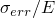 for creep problems, where 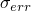 is an acceptable level of error in the stress and *E* is a typical elastic modulus, or on the order of the elastic strains for viscoelasticity problems.

If rate-dependent constitutive equations are used in combination with a varying temperature, both controls can be used simultaneously. Abaqus/Standard will then choose the increments that satisfy both criteria.

If the time integration accuracy measure specified by either or both of the above controls is satisfied after 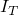 consecutive increments without cutbacks, the next time increment will be increased by a factor of . Both  and  are user-defined parameters (see ["Increasing the time increment size" in "Time integration accuracy in transient problems," Section 7.2.4](pt03ch07s02aus52.md#usb-anl-aautomaticinc-increasedeltat)). The defaults are  = 3 and  = 1.5.

| **Input File Usage: ** | Use the following option to specify the maximum allowable nodal temperature change: |
| --- | --- |
|  | ``` [*DIRECT CYCLIC](../key/key-link.md#usb-kws-hdirectcyclic), DELTMX= ``` Use the following option to specify the accuracy tolerance parameter: ``` [*DIRECT CYCLIC](../key/key-link.md#usb-kws-hdirectcyclic), CETOL=*tolerance* ``` |

| **Abaqus/CAE Usage: ** | Use the following option to specify the maximum allowable nodal temperature change: |
| --- | --- |
|  | Step module: **Create Step**: **General**: **Direct cyclic**; **Incrementation:** **Max. allowable temperature change per increment:**  Use the following option to specify the accuracy tolerance parameter: Step module: **Create Step**: **General**: **Direct cyclic**; **Incrementation:** **Creep/swelling/viscoelastic strain error tolerance:** *tolerance* |

##### Fixed time incrementation

If neither the accuracy tolerance parameter nor the maximum allowable nodal temperature change is specified, the size of the time increment is fixed. You must specify the time increment  and the time period *T*.

| **Input File Usage: ** | ``` [*DIRECT CYCLIC](../key/key-link.md#usb-kws-hdirectcyclic) , *T* ``` |
| --- | --- |

| **Abaqus/CAE Usage: ** | Step module: **Create Step**: **General**: **Direct cyclic**; **Basic:** **Cycle time period:** *T*; **Incrementation:** **Type:** **Fixed**, **Increment size:**  |
| --- | --- |

##### Defining the time points at which the response must be evaluated

The user-defined time incrementation for a direct cyclic step can be augmented or superseded by specifying particular time points in the loading history at which the response of the structure should be evaluated. This feature is particularly useful if you know prior to the analysis at which time points in the analysis the load reaches a maximum and/or minimum value or when the response will change rapidly. An example is the analysis of the heating/cooling thermal cycle of an engine component where you typically know when the temperature reaches a maximum value.

When time points are used with fixed time incrementation, the time incrementation specified for the direct cyclic step is ignored and instead the time incrementation precisely follows the specified time points. If time points are used with automatic incrementation, the time incrementation is variable; but the response of the structure will be evaluated at the specified time points.

The time points can be listed individually, or they can be generated automatically by specifying the starting time point, ending time point, and increment in time between the two specified time points.

| **Input File Usage: ** | Use the following options to list time points individually: |
| --- | --- |
|  | ``` [*TIME POINTS](../key/key-link.md#usb-kws-htimepoints), NAME=*time points name* [*DIRECT CYCLIC](../key/key-link.md#usb-kws-hdirectcyclic), TIME POINTS=*time points name* ``` Use the following options to generate time points automatically: ``` [*TIME POINTS](../key/key-link.md#usb-kws-htimepoints), NAME=*time points name*, GENERATE [*DIRECT CYCLIC](../key/key-link.md#usb-kws-hdirectcyclic), TIME POINTS=*time points name* ``` |

| **Abaqus/CAE Usage: ** | Use the following options to list time points individually: |
| --- | --- |
|  | Step module: **Create Step**: **General**: **Direct cyclic**; **Incrementation:** **Evaluate structure response at time points:** *time points name* Use the following options to generate time points automatically: Step module: **Create Step**: **General**: **Direct cyclic**; **Incrementation:** **Evaluate structure response at time points:** **Create**; **Edit Time Points:** **Specify using delimiters:** **Start**, **End**, **Increment** |

#### Controlling the application of periodicity conditions

By default, Abaqus/Standard imposes periodic conditions during the iterative solution process by using the state obtained at the end of the previous iteration as the starting state for the current iteration; i.e., 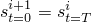, where *s* is a solution variable such as plastic strain.

In cases where the periodic solution is not easily found (for example, when the loading is close to causing ratchetting), the state around which the periodic solution is obtained may show considerably more “drift” than would be obtained in a transient analysis. In such cases you may wish to delay the application of periodic conditions as an artificial method to reduce this drift. [Figure 6.2.6--3](pt03ch06s02at05.md#usb-anl-direct-cyclic-periodi) compares the response of two identical structures subjected to the same set of cyclic loads and boundary conditions, where each structure experienced a different loading history prior to the application of the cyclic loads. [Figure 6.2.6--3](pt03ch06s02at05.md#usb-anl-direct-cyclic-periodi) shows that the prior loading history only affects the mean value of stress and strain; it does not affect the shape of the stress-strain curves or the amount of energy dissipated during the cycle. 

**Figure 6.2.6–3** Influence of periodicity condition on mean value of the strains over a stabilized cycle.

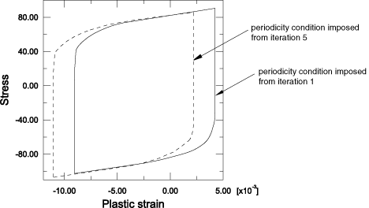

By delaying the application of periodicity conditions, you can influence the mean stress and strain level. However, this is rarely necessary since the average stress and strain levels are usually not needed for low-cycle fatigue life predictions.

You can control when the periodicity conditions are applied by defining direct cyclic controls to specify the variable . This variable defines from which iteration onward the application of periodic conditions will be activated. For example, setting 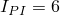 means that the periodicity conditions are applied from iteration 6 onwards. The default is , which is appropriate for most analyses.

| **Input File Usage: ** | ``` [*CONTROLS](../key/key-link.md#usb-kws-hcontrols), TYPE=DIRECT CYCLIC  ``` |
| --- | --- |

| **Abaqus/CAE Usage: ** | Step module: ****Other****General Solution Controls****Edit****; **Direct Cyclic:**  |
| --- | --- |

### Initial conditions

Initial values of stresses, temperatures, field variables, solution-dependent state variables, etc. can be specified (see ["Initial conditions in Abaqus/Standard and Abaqus/Explicit," Section 34.2.1](pt07ch34s02aus116.md)).

### Boundary conditions

Boundary conditions can be applied to any of the displacement or rotation degrees of freedom. During the analysis, prescribed boundary conditions must have an amplitude definition that is cyclic over the step: the start value must be equal to the end value (see ["Amplitude curves," Section 34.1.2](pt07ch34s01aus115.md)). If the analysis consists of several steps, the usual rules apply (see ["Boundary conditions in Abaqus/Standard and Abaqus/Explicit," Section 34.3.1](pt07ch34s03aus118.md)). At each new step the boundary condition can either be modified or completely defined. All boundary conditions defined in previous steps remain unchanged unless they are redefined. 

### Loads

The following loads can be prescribed in a direct cyclic analysis:
- Concentrated nodal forces can be applied to the displacement degrees of freedom (1--6); see ["Concentrated loads," Section 34.4.2](pt07ch34s04aus121.md).
- Distributed pressure forces or body forces can be applied; see ["Distributed loads," Section 34.4.3](pt07ch34s04aus122.md). The distributed load types available with particular elements are described in [Part VI, "Elements](pt06.md)."

During the analysis each load must have an amplitude definition that is cyclic over the step where the start value must be equal to the end value (see ["Amplitude curves," Section 34.1.2](pt07ch34s01aus115.md)). If the analysis consists of several steps, the usual rules apply (see ["Applying loads: overview," Section 34.4.1](pt07ch34s04aus120.md)). At each new step the loading can either be modified or completely defined. All loads defined in previous steps remain unchanged unless they are redefined. 

### Predefined fields

The following predefined fields can be specified in a direct cyclic analysis, as described in ["Predefined fields," Section 34.6.1](pt07ch34s06aus128.md):
- Temperature is not a degree of freedom in a direct cyclic analysis, but nodal temperatures can be specified as a predefined field. The temperature values specified must be cyclic over the step: the start value must be equal to the end value (see ["Amplitude curves," Section 34.1.2](pt07ch34s01aus115.md)). If the temperatures are read from the results file, you should specify initial temperature conditions equal to the temperature values at the end of the step (see ["Initial conditions in Abaqus/Standard and Abaqus/Explicit," Section 34.2.1](pt07ch34s02aus116.md)). Alternatively, you can ramp the temperatures back to their initial condition values, as described in ["Predefined fields," Section 34.6.1](pt07ch34s06aus128.md). Any difference between the applied and initial temperatures will cause thermal strain if a thermal expansion coefficient is given for the material (["Thermal expansion," Section 26.1.2](pt05ch26s01abm52.md)). The specified temperature also affects temperature-dependent material properties, if any.
- The values of user-defined field variables can be specified. These values affect only field-variable-dependent material properties, if any. The field variable values specified must be cyclic over the step.

### Material options

Most material models, including user-defined materials (defined using user subroutine [`UMAT`](../sub/sub-link.md#sub-xsl-umat)), that describe mechanical behavior are available for use in a direct cyclic analysis.

The following material properties are not active during a direct cyclic analysis: acoustic properties, thermal properties (except for thermal expansion), mass diffusion properties, electrical conductivity properties, piezoelectric properties, and pore fluid flow properties.

Rate-dependent yield (["Rate-dependent yield," Section 23.2.3](pt05ch23s02abm19.md)), rate-dependent creep (["Rate-dependent plasticity: creep and swelling," Section 23.2.4](pt05ch23s02abm20.md)), and two-layer viscoplasticity (["Two-layer viscoplasticity," Section 23.2.11](pt05ch23s02abm27.md)) can also be used during a direct cyclic analysis.

### Elements

Any of the stress/displacement elements in Abaqus/Standard can be used in a direct cyclic analysis (see ["Choosing the appropriate element for an analysis type," Section 27.1.3](pt06ch27s01aus112.md)).

### Output

Different types of output are available for postprocessing and for monitoring a direct cyclic analysis. 

#### Message file information

Abaqus/Standard prints the residual force, time average force, and a flag to indicate if equilibrium was satisfied in the message (`.msg`) file at different time increments for each iteration. You can control the frequency in increments at which information is printed to the message file, and you can suppress the output; the default is to print output every 10 increments (see ["The Abaqus/Standard message file" in "Output," Section 4.1.1](pt02ch04s01aus38.md#usb-out-ooutput-message-std), for more information).

Abaqus/Standard also prints the number of Fourier terms used, the maximum residual coefficient, the maximum correction to displacement coefficients, and the maximum displacement coefficient in the Fourier series in the message file at the end of each iteration. An example of the output is shown below:

```
 									           ITERATION    26 STARTS
 INC     TIME        STEP       LARG. RESI.   TIME AVG.   FORCE
         INC         TIME       FORCE         FORCE       EQUV.
 10      0.250       2.50       1.008E+01     50.9         N
 20      0.250       5.00       1.622E+01     76.8         N
 30      0.250       7.50       4.622E-02     99.8         Y

                     ITERATION    26 SUMMARY
 NUMBER OF FOURIER TERMS USED 40, TOTAL NUMBER OF INCREMENTS  120
 CYCLE/STEP TIME   30.0,    TOTAL TIME COMPLETED       31.0
 AVERAGE FORCE     21.2     TIME AVG. FORCE     25.7

 MAX. COEFFICIENT OF DISP.                   0.142  AT NODE 24 DOF 2
 MAX. COEFF. OF RESI. FORCE ON CONST. TERM    31.7  AT NODE 44 DOF 1
 MAX. COEFF. OF RESI. FORCE ON PERI. TERMS    0.82  AT NODE  6 DOF 3
 MAX. CORR. TO COEFF. OF DISP. ON CONST. TERM 0.002 AT NODE 50 DOF 3
 MAX. CORR. TO COEFF. OF DISP. ON PERI. TERMS 0.015 AT NODE 50 DOF 3
```

#### Results output

Element and nodal output are written only when the stabilized cycle is reached. If a stabilized cycle has not been reached at the end of an analysis, output is written for the last iteration of the step. The element output available for a direct cyclic analysis includes stress; strain; energies; and the values of state, field, and user-defined variables. All the energies are set equal to zero at the beginning of each iteration since energies dissipated over an entire stabilized cycle are of interest in making fatigue life predictions in direct cyclic analysis. The nodal output available includes displacements, reaction forces, and coordinates. All of the output variable identifiers are outlined in ["Abaqus/Standard output variable identifiers," Section 4.2.1](pt02ch04s02abv01.md). 

#### Recovering additional results for an iteration

You may want to recover additional results for an iteration rather than for the stabilized cycle. You can extract these results from the restart data (see ["Recovering additional results output from restart data in Abaqus/Standard" in "Output," Section 4.1.1](pt02ch04s01aus38.md#usb-out-ooutput-postoutput)). This feature is particularly useful if you want to evaluate the shift of the strain from one iteration to another iteration when plastic ratchetting occurs.

| **Input File Usage: ** | ``` [*POST OUTPUT](../key/key-link.md#usb-kws-hpostoutput), ITERATION=*n* ``` |
| --- | --- |

| **Abaqus/CAE Usage: ** | Recovering additional results for an iteration is not supported in Abaqus/CAE. |
| --- | --- |

#### Specifying output at exact times

Output at exact times is not supported for direct cyclic analysis. If output at exact times is requested, Abaqus will issue a warning message and change the output to an output at approximate times.

### Limitations

A direct cyclic analysis is subject to the following limitations:
- Contact conditions cannot change during a direct cyclic analysis; they remain as they were defined at the beginning of the analysis or at the end of any general step prior to the direct cyclic step. Frictional slipping is not allowed during direct cyclic analyses; all points in contact are assumed to be sticking if friction is present.
- Geometric nonlinearity can be included only in any general step prior to a direct cyclic step; however, only small displacements and strains will be considered during the cyclic step.

### Input file template

```
[*HEADING](../key/key-link.md#usb-kws-mheading)
…
[*BOUNDARY](../key/key-link.md#usb-kws-hboundary)
*Data lines to specify zero-valued boundary conditions*
[*INITIAL CONDITIONS](../key/key-link.md#usb-kws-minitialcond)
*Data lines to specify initial conditions*
[*AMPLITUDE](../key/key-link.md#usb-kws-mamplitude)
*Data lines to define amplitude variations*
**
[*STEP](../key/key-link.md#usb-kws-hstep) (,INC=)
*Set  INC equal to the maximum number of increments in a single loading cycle*
[*DIRECT CYCLIC](../key/key-link.md#usb-kws-hdirectcyclic)
*Data line to define time increment, cycle time, initial number of Fourier terms, 
maximum number of Fourier terms, increment in number of Fourier terms,  
and maximum number of iterations*
[*TIME POINTS](../key/key-link.md#usb-kws-htimepoints)
*Data lines to list time points*
[*BOUNDARY](../key/key-link.md#usb-kws-hboundary), AMPLITUDE=
*Data lines to prescribe zero-valued or nonzero boundary conditions*
[*CLOAD](../key/key-link.md#usb-kws-hcload) and/or [*DLOAD](../key/key-link.md#usb-kws-hdload), AMPLITUDE=
*Data lines to specify loads*
[*TEMPERATURE](../key/key-link.md#usb-kws-htemperature) and/or [*FIELD](../key/key-link.md#usb-kws-hfield), AMPLITUDE=
*Data lines to specify values of predefined fields*
[*END STEP](../key/key-link.md#usb-kws-hendstep)
**
[*STEP](../key/key-link.md#usb-kws-hstep)(,INC=)
[*DIRECT CYCLIC](../key/key-link.md#usb-kws-hdirectcyclic), DELTMX
*Data line to control automatic time incrementation and Fourier representations*
[*BOUNDARY](../key/key-link.md#usb-kws-hboundary), OP=MOD,AMPLITUDE= 
*Data lines to modify or add zero-valued or nonzero boundary conditions*
[*CLOAD](../key/key-link.md#usb-kws-hcload), OP=NEW, AMPLITUDE=
*Data lines to specify new concentrated loads; all previous concentrated
loads will be removed*
[*DLOAD](../key/key-link.md#usb-kws-hdload), OP=MOD, AMPLITUDE=
*Data lines to specify additional or modified distributed loads*
[*TEMPERATURE](../key/key-link.md#usb-kws-htemperature) and/or [*FIELD](../key/key-link.md#usb-kws-hfield), AMPLITUDE=
*Data lines to specify additional or modified values of predefined fields*
[*END STEP](../key/key-link.md#usb-kws-hendstep)
```


