# 6.3.3 Explicit dynamic analysis


**Products: **Abaqus/Explicit  Abaqus/CAE  

##### **References**

- ["Defining an analysis," Section 6.1.2](pt03ch06s01abo05.md)
- [*DYNAMIC](../key/key-link.md#usb-kws-hdynamic)
- ["Configuring a dynamic, explicit procedure" in "Configuring general analysis procedures," Section 14.11.1 of the Abaqus/CAE User's Guide](../usi/usi-link.md#usi-sim-configure-dynamicexplicit)

### Overview

An explicit dynamic analysis:
- is computationally efficient for the analysis of large models with relatively short dynamic response times and for the analysis of extremely discontinuous events or processes;
- allows for the definition of very general contact conditions (["Contact interaction analysis: overview," Section 36.1.1](pt09ch36s01abo33.md));
- uses a consistent, large-deformation theory---models can undergo large rotations and large deformation;
- can use a geometrically linear deformation theory---strains and rotations are assumed to be small (see ["Defining an analysis," Section 6.1.2](pt03ch06s01abo05.md));
- can be used to perform an adiabatic stress analysis if inelastic dissipation is expected to generate heat in the material (see ["Adiabatic analysis," Section 6.5.4](pt03ch06s05at20.md));
- can be used to perform quasi-static analyses with complicated contact conditions; and
- allows for either automatic or fixed time incrementation to be used---by default, Abaqus/Explicit uses automatic time incrementation with the global time estimator.

### Explicit dynamic analysis

The explicit dynamics procedure performs a large number of small time increments efficiently. An explicit central-difference time integration rule is used; each increment is relatively inexpensive (compared to the direct-integration dynamic analysis procedure available in Abaqus/Standard) because there is no solution for a set of simultaneous equations. The explicit central-difference operator satisfies the dynamic equilibrium equations at the beginning of the increment, *t*; the accelerations calculated at time *t* are used to advance the velocity solution to time  and the displacement solution to time .

| **Input File Usage: ** | ``` [*DYNAMIC](../key/key-link.md#usb-kws-hdynamic), EXPLICIT ``` |
| --- | --- |

| **Abaqus/CAE Usage: ** | Step module: **Create Step**: **General**: **Dynamic, Explicit** |
| --- | --- |

### Numerical implementation

The explicit dynamics analysis procedure is based upon the implementation of an explicit integration rule together with the use of diagonal (“lumped”) element mass matrices. The equations of motion for the body are integrated using the explicit central-difference integration rule 


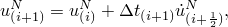

where  is a degree of freedom (a displacement or rotation component) and the subscript *i* refers to the increment number in an explicit dynamics step. The central-difference integration operator is explicit in the sense that the kinematic state is advanced using known values of 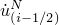 and 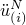 from the previous increment.

The explicit integration rule is quite simple but by itself does not provide the computational efficiency associated with the explicit dynamics procedure. The key to the computational efficiency of the explicit procedure is the use of diagonal element mass matrices because the accelerations at the beginning of the increment are computed by 

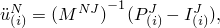

where  is the mass matrix,  is the applied load vector, and 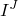 is the internal force vector. A lumped mass matrix is used because its inverse is simple to compute and because the vector multiplication of the mass inverse by the inertial force requires only *n* operations, where *n* is the number of degrees of freedom in the model. The explicit procedure requires no iterations and no tangent stiffness matrix. The internal force vector, , is assembled from contributions from the individual elements such that a global stiffness matrix need not be formed.

### Nodal mass and inertia

The explicit integration scheme in Abaqus/Explicit requires nodal mass or inertia to exist at all activated degrees of freedom (see ["Conventions," Section 1.2.2](pt01ch01s02aus02.md)) unless constraints are applied using boundary conditions. More precisely, a nonzero nodal mass must exist unless all activated translational degrees of freedom are constrained and nonzero rotary inertia must exist unless all activated rotational degrees of freedom are constrained. Nodes that are part of a rigid body do not require mass, but the entire rigid body must possess mass and inertia unless constraints are used. Nodes that belong to Eulerian elements also do not require mass, since the surrounding Eulerian elements may be void at some time during the simulation.

When degrees of freedom at a node are activated by elements with a nonzero mass density (e.g., solid, shell, beam) or mass and inertia elements, a nonzero nodal mass or inertia occurs naturally from the assemblage of lumped mass contributions.

When degrees of freedom at a node are activated by elements with no mass (e.g., spring, dashpot, or connector elements), care must be taken either to constrain the node or to add mass and inertia as appropriate.

### Stability

The explicit procedure integrates through time by using many small time increments. The central-difference operator is conditionally stable, and the stability limit for the operator (with no damping) is given in terms of the highest frequency of the system as 

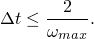

With damping, the stable time increment is given by

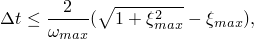

where 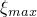 is the fraction of critical damping in the mode with the highest frequency. Contrary to our usual engineering intuition, introducing damping to the solution reduces the stable time increment. In Abaqus/Explicit a small amount of damping is introduced in the form of bulk viscosity to control high frequency oscillations. Physical forms of damping, such as dashpots or material damping, can also be introduced. Bulk viscosity and material damping are discussed below.

#### Estimating the stable time increment size

An approximation to the stability limit is often written as the smallest transit time of a dilatational wave across any of the elements in the mesh 

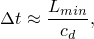

where 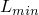 is the smallest element dimension in the mesh and  is the dilatational wave speed in terms of 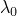 and , defined below.

In general, for beams, conventional shells, and membranes the element thickness or cross-sectional dimensions are not considered in determining the smallest element dimension; the stability limit is based upon the midplane or membrane dimensions only. When the transverse shear stiffness is defined for shell elements (see ["Shell section behavior," Section 29.6.4](pt06ch29s06alm18.md)), the stable time increment will also be based on the transverse shear behavior.

This estimate for  is only approximate and in most cases is not a conservative (safe) estimate. In general, the actual stable time increment chosen by Abaqus/Explicit will be less than this estimate by a factor between 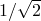 and 1 in a two-dimensional model and between  and 1 in a three-dimensional model. The time increment chosen by Abaqus/Explicit also accounts for any stiffness behavior in a model associated with penalty contact. For further discussion, see ["Computational cost](pt03ch06s03at08.md#usb-anl-aexpdynamic-compcost)” below.

#### Stable time increment report

Abaqus/Explicit writes a report to the status (`.sta`) file during the data check phase of the analysis that contains an estimate of the minimum stable time increment and a listing of the elements with the smallest stable time increments and their values. The initial stable time increments listed do not include damping (bulk viscosity), mass scaling, or penalty contact effects. 

This listing is provided because often a few elements have much smaller stability limits than the rest of the elements in the mesh. The stable time increment can be increased by modifying the mesh to increase the size of the controlling element or by using appropriate mass scaling.

### Dilatational wave speed

The current dilatational wave speed, , is determined in Abaqus/Explicit by calculating the effective hypoelastic material moduli from the material's constitutive response. Effective Lam's constants,  and 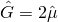, are determined in the following manner. Define  as the increment in the mean stress, 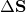 as the increment in the deviatoric stress, 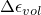 as the increment of volumetric strain, and  as the deviatoric strain increment. We assume a hypoelastic stress-strain rule of the form 

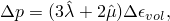

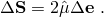

The effective moduli can then be computed as 

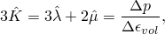

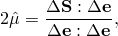

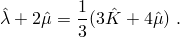

For shell elements defined by a shell cross-section that requires numerical integration (see ["Using a shell section integrated during the analysis to define the section behavior," Section 29.6.5](pt06ch29s06alm19.md)), the effective moduli for the section are computed by integrating the effective moduli at the section points through the thickness. These effective moduli represent the element stiffness and determine the current dilatational wave speed in the element as 

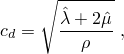

where  is the density of the material.

In an isotropic, elastic material the effective Lam's constants can be defined in terms of Young's modulus, *E*, and Poisson's ratio, , by 

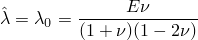

and 

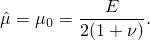

### Time incrementation

The time increment used in an analysis must be smaller than the stability limit of the central-difference operator. Failure to use a small enough time increment will result in an unstable solution. When the solution becomes unstable, the time history response of solution variables such as displacements will usually oscillate with increasing amplitudes. The total energy balance will also change significantly.

If the model contains only one material type, the initial time increment is directly proportional to the size of the smallest element in the mesh. If the mesh contains uniform size elements but contains multiple material descriptions, the element with the highest wave speed will determine the initial time increment.

In nonlinear problems—those with large deformations and/or nonlinear material response—the highest frequency of the model will continually change, which consequently changes the stability limit. Abaqus/Explicit has two strategies for time incrementation control: fully automatic time incrementation (where the code accounts for changes in the stability limit) and fixed time incrementation.

#### Scaling the time increment

To reduce the chance of a solution going unstable, you can adjust the stable time increment computed by Abaqus/Explicit by a constant scaling factor. This factor can be used to scale the default global time estimate, the element-by-element estimate, or the fixed time increment based on the initial element-by-element estimate; it cannot be used to scale a fixed time increment specified directly by you.

| **Input File Usage: ** | Use the following option to scale the stable time increment based on the global time estimate: |
| --- | --- |
|  | ``` [*DYNAMIC](../key/key-link.md#usb-kws-hdynamic), EXPLICIT, SCALE FACTOR=*f* ``` Use the following option to scale the stable time increment based on the element-by-element estimate: ``` [*DYNAMIC](../key/key-link.md#usb-kws-hdynamic), EXPLICIT, ELEMENT BY ELEMENT, SCALE FACTOR=*f* ``` Use the following option to scale the stable time increment based on the fixed time increment on the initial element-by-element estimate: ``` [*DYNAMIC](../key/key-link.md#usb-kws-hdynamic), EXPLICIT, FIXED TIME INCREMENTATION, SCALE FACTOR=*f* ``` |

| **Abaqus/CAE Usage: ** | Step module: **Create Step**: **General**: **Dynamic, Explicit**: **Incrementation**: **Time scaling factor**: *f* |
| --- | --- |

#### Automatic time incrementation

The default time incrementation scheme in Abaqus/Explicit is fully automatic and requires no user intervention. Two types of estimates are used to determine the stability limit: element by element and global. An analysis always starts by using the element-by-element estimation method and may switch to the global estimation method under certain circumstances, as explained below.

##### Element-by-element estimation

In an analysis Abaqus/Explicit initially uses a stability limit based on the highest element frequency in the whole model. This element-by-element estimate is determined using the current dilatational wave speed in each element.

The element-by-element estimate is conservative; it will give a smaller stable time increment than the true stability limit that is based upon the maximum frequency of the entire model. In general, constraints such as boundary conditions and kinematic contact have the effect of compressing the eigenvalue spectrum, and the element-by-element estimates do not take this into account.

The concept of the stable time increment as the time required to propagate a dilatational wave across the smallest element dimension is useful for interpreting how the explicit procedure chooses the time increment when element-by-element stability estimation controls the time increment. As the step proceeds, the global stability estimate, if used, will make the time increment less sensitive to element size.

| **Input File Usage: ** | ``` [*DYNAMIC](../key/key-link.md#usb-kws-hdynamic), EXPLICIT, ELEMENT BY ELEMENT ``` |
| --- | --- |

| **Abaqus/CAE Usage: ** | Step module: **Create Step**: **General**: **Dynamic, Explicit**: **Incrementation**: **Stable increment estimator**: **Element-by-element** |
| --- | --- |

##### Global estimation

The stability limit will be determined by the global estimator as the step proceeds unless the element-by-element estimation method is specified, fixed time incrementation is specified, or one of the conditions explained below prevents the use of global estimation. The switch to the global estimation method occurs once the algorithm determines that the accuracy of the global estimation method is acceptable.

The adaptive, global estimation algorithm determines the maximum frequency of the entire model using the current dilatational wave speed. This algorithm continuously updates the estimate for the maximum frequency. The global estimator will usually allow time increments that exceed the element-by-element values.

Abaqus/Explicit monitors the effectiveness of the global estimation algorithm. If the cost for computing the global time estimate is more than its benefit, the code will turn off the global estimation algorithm and simply use the element-by-element estimates to save computation time.

##### Conditions that will prevent the use of the global time estimator

The global estimation algorithm will not be used when any of the following capabilities are included in the model:
- Fluid elements
- Infinite elements
- Dashpots
- Thick shells (thickness to characteristic length ratio larger than 0.92)
- Thick beams (thickness to length ratio larger than 1.0)
- The JWL equation of state
- Material damping
- Nonisotropic elastic materials with temperature and field variable dependency
- Distortion control
- Adaptive meshing
- Subcycling

##### "Improved" stable time increment for three-dimensional continuum elements and elements with plane stress formulations

 For three-dimensional continuum elements and elements with plane stress formulations (shell, membrane, and two-dimensional plane stress elements) an “improved” estimate of the element characteristic length is used by default. This “improved” method usually results in a larger element stable time increment than a more traditional method. For analyses using variable mass scaling, the total mass added to achieve a given stable time increment will be less with the improved estimate. 

| **Input File Usage: ** | Use the following option to activate the "improved" element time estimation method: |
| --- | --- |
|  | ``` [*DYNAMIC](../key/key-link.md#usb-kws-hdynamic), EXPLICIT, IMPROVED DT METHOD=YES ``` Use the following option to deactivate the "improved" element time estimation method: ``` [*DYNAMIC](../key/key-link.md#usb-kws-hdynamic), EXPLICIT, IMPROVED DT METHOD=NO ``` |

| **Abaqus/CAE Usage: ** | The ability to deactivate the "improved" element time estimation method is not supported in Abaqus/CAE. |
| --- | --- |

#### Fixed time incrementation

A fixed time incrementation scheme is also available in Abaqus/Explicit. The fixed time increment size is determined either by the initial element-by-element stability estimate for the step or by a user-specified time increment.

Fixed time incrementation may be useful when a more accurate representation of the higher mode response of a problem is required. In this case a time increment size smaller than the element-by-element estimates may be used. The element-by-element estimate can be obtained simply by running a data check analysis (see ["Abaqus/Standard, Abaqus/Explicit, and Abaqus/CFD execution," Section 3.2.2](pt01ch03s02abx02.md)).

When fixed time incrementation is used, Abaqus/Explicit will not check that the computed response is stable during the step. You should ensure that a valid response has been obtained by carefully checking the energy history and other response variables.

##### Basing the fixed time increment size on the initial element-by-element stability limit

You can use time increments the size of the initial element-by-element stability limit throughout a step. The dilatational wave speed in each element at the beginning of the step is used to compute the fixed time increment size.

| **Input File Usage: ** | ``` [*DYNAMIC](../key/key-link.md#usb-kws-hdynamic), EXPLICIT, FIXED TIME INCREMENTATION ``` |
| --- | --- |

| **Abaqus/CAE Usage: ** | Step module: **Create Step**: **General**: **Dynamic, Explicit**: **Incrementation**: **Type: Fixed**: **Use element-by-element time increment estimator** |
| --- | --- |

##### Specifying the fixed time increment size directly

Alternatively, you can specify a time increment size directly.

| **Input File Usage: ** | ``` [*DYNAMIC](../key/key-link.md#usb-kws-hdynamic), EXPLICIT, DIRECT USER CONTROL ``` |
| --- | --- |

| **Abaqus/CAE Usage: ** | Step module: **Create Step**: **General**: **Dynamic, Explicit**: **Incrementation**: **Type: Fixed**: **User-defined time increment** |
| --- | --- |

### Advantages of the explicit method

The use of small increments (dictated by the stability limit) is advantageous because it allows the solution to proceed without iterations and without requiring tangent stiffness matrices to be formed. It also simplifies the treatment of contact.

The explicit dynamics procedure is ideally suited for analyzing high-speed dynamic events, but many of the advantages of the explicit procedure also apply to the analysis of slower (quasi-static) processes. A good example is sheet metal forming, where contact dominates the solution and local instabilities may form due to wrinkling of the sheet.

The results in an explicit dynamics analysis are not automatically checked for accuracy as they are in Abaqus/Standard (Abaqus/Standard uses the half-increment residual). In most cases this is not of concern because the stability condition imposes a small time increment such that the solution changes only slightly in any one time increment, which simplifies the incremental calculations. While the analysis may take an extremely large number of increments, each increment is relatively inexpensive, often resulting in an economical solution. It is not uncommon for Abaqus/Explicit to take over 105 increments for an analysis. The method is, therefore, computationally attractive for problems where the total dynamic response time that must be modeled is only a few orders of magnitude longer than the stability limit; for example, wave propagation studies or some “event and response” applications.

### Computational cost

The computer time involved in running a simulation using explicit time integration with a given mesh is proportional to the time period of the event. The time increment based on the element-by-element stability estimate can be rewritten (ignoring damping) in the form 

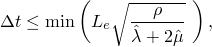

where the minimum is taken over all elements in the mesh,  is a characteristic length associated with an element (see ["Explicit dynamic analysis," Section 2.4.5 of the Abaqus Theory Guide](../stm/stm-link.md#stm-anl-expdynamic)),  is the density of the material in the element, and  and 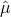 are the effective Lam's constants for the material in the element (defined above).

The time increment from the global stability estimate may be somewhat larger, but for this discussion we will assume that the above inequality always holds (when the inequality does not hold, the solution time will be somewhat faster).

For linear, nonisotropic elastic materials this stability limit is further scaled down by the square root of the ratio of the effective material stiffness to the maximum material stiffness in one particular direction. Since this effectively means that the time increment can be no larger than the time required to propagate a stress wave across an element, the computer time involved in running a quasi-static analysis can be very large: the cost of the simulation is directly proportional to the number of time increments required.

The number of increments, *n*, required is  if  remains constant, where *T* is the time period of the event being simulated. (Even the element-by-element approximation of  will not remain constant in general, since element distortion will change  and nonlinear material response will change the effective Lam constants. But the assumption is sufficiently accurate for the purposes of this discussion.) Thus, 

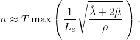

In a two-dimensional analysis refining the mesh by a factor of two in each direction will increase the run time in the explicit procedure by a factor of eight—four times as many elements and half the original time increment size. Similarly, in a three-dimensional analysis refining the mesh by a factor of two in each direction will increase the run time by a factor of sixteen.

In a quasi-static analysis it is expedient to reduce the computational cost by either speeding up the simulation or by scaling the mass. In either case the kinetic energy should be monitored to ensure that the ratio of kinetic energy to internal energy does not get too large—typically less than 10%.

#### Reducing the computational cost by speeding up the simulation

To reduce the number of increments required, *n*, we can speed up the simulation compared to the time of the actual process—that is, we can artificially reduce the time period of the event, *T*. This will introduce two possible errors. If the simulation speed is increased too much, the increased inertia forces will change the predicted response (in an extreme case the problem will exhibit wave propagation response). The only way to avoid this error is to choose a speed-up that is not too large.

The other error is that some aspects of the problem other than inertia forces—for example, material behavior—may also be rate dependent. In this case the actual time period of the event being modeled cannot be changed.

#### Reducing the computational cost by using mass scaling

Artificially increasing the material density, , by a factor  reduces *n* to , just like decreasing *T* to 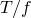. This concept, called “mass scaling,” reduces the ratio of the event time to the time for wave propagation across an element while leaving the event time fixed, which allows rate-dependent behavior to be included in the analysis. Mass scaling has exactly the same effect on inertia forces as speeding up the time of simulation.

Mass scaling is attractive because it can be used in rate-dependent problems, but it must be used with care to ensure that the inertia forces do not dominate and change the solution. Either fixed or variable mass scaling can be invoked (see ["Mass scaling," Section 11.6.1](pt04ch11s06aus74.md)).

Mass scaling can also be accomplished by altering the density; however, the fixed and variable mass scaling capabilities provide more versatile methods of scaling the mass of the entire model or specific element sets in the model.

#### Reducing the computational cost by using selective subcycling

One disadvantage in an explicit dynamic analysis is that a few very small elements will force the entire model to be integrated with a small time increment. You can use mixed time integration or “subcycling” methods to reduce this problem. In these methods the equations of motion for the body are still integrated using the explicit central-difference integration rule as shown above, but the different time increments are allowed for different groups of nodes in the finite element model. If most nodes are integrated with a large stable time increment and only a few nodes are integrated with a small time increment, the computational cost may be reduced significantly. 

Selective subcycling can be invoked by defining the subcycling zones. See ["Selective subcycling," Section 11.7.1](pt04ch11s07aus75.md) for details.

### Bulk viscosity

Bulk viscosity introduces damping associated with volumetric straining. Its purpose is to improve the modeling of high-speed dynamic events (see ["Stability](pt03ch06s03at08.md#usb-anl-aexpdynamic-stability)” above for a discussion of the effect of damping on the stable time increment). Abaqus/Explicit contains two forms of bulk viscosity: linear and quadratic. Linear bulk viscosity is included by default in an Abaqus/Explicit analysis.

The bulk viscosity parameters  and  defined below can be redefined and can be changed from step to step. If the default values are changed in a step, the new values will be used in subsequent steps until they are redefined. Bulk viscosities defined this way apply to the whole model. For an individual element set the linear and quadratic bulk viscosities can be scaled by a factor by defining section controls (see ["Section controls," Section 27.1.4](pt06ch27s01aus113.md)).

| **Input File Usage: ** | Use the following option to define bulk viscosity for the entire model: |
| --- | --- |
|  | ``` [*BULK VISCOSITY](../key/key-link.md#usb-kws-hbulkvisco) ``` Use the following options to define bulk viscosity for an individual element set: ``` [*BULK VISCOSITY](../key/key-link.md#usb-kws-hbulkvisco) [*SECTION CONTROLS](../key/key-link.md#usb-kws-msectioncontrols) ``` |

| **Abaqus/CAE Usage: ** | Use the following option to define bulk viscosity for the entire model: |
| --- | --- |
|  | Step module: **Create Step**: **General**: **Dynamic, Explicit**: **Other**: **Linear bulk viscosity parameter** and **Quadratic bulk viscosity parameter** Defining bulk viscosity for an individual element set is not supported in Abaqus/CAE. |

#### Linear bulk viscosity

Linear bulk viscosity is found in all elements and is introduced to damp “ringing” in the highest element frequency. This damping is sometimes referred to as truncation frequency damping. It generates a bulk viscosity pressure that is linear in the volumetric strain rate 


where  is a damping coefficient (default=.06),  is the current material density,  is the current dilatational wave speed, 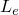 is an element characteristic length, and  is the volumetric strain rate.

For acoustic elements, the bulk viscosity pressure can be obtained from the above equation by using the relationship of the fluid particle velocity and the pressure rate (see ["Coupled acoustic-structural medium analysis," Section 2.9.1 of the Abaqus Theory Guide](../stm/stm-link.md#stm-anl-acouststruct)) as 

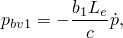

where 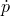 and *c* are the pressure rate and the speed of sound in the fluid, respectively.

#### Quadratic bulk viscosity

The second form of bulk viscosity pressure is found only in solid continuum elements (except the plane stress element CPS4R). This form is quadratic in the volumetric strain rate 

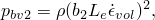

where  is a damping coefficient (default=1.2) and all other quantities are as defined for the linear bulk viscosity. Quadratic bulk viscosity is applied only if the volumetric strain rate is compressive.

The quadratic bulk viscosity pressure will smear a shock front across several elements and is introduced to prevent elements from collapsing under extremely high velocity gradients. Consider a simple one-element problem in which the nodes on one side of the element are fixed and the nodes on the other side have an initial velocity in the direction of the fixed nodes. If the initial velocity is equal to the dilatational wave speed of the material, without the quadratic bulk viscosity, the element would collapse to zero volume in one time increment (because the stable time increment size is precisely the transit time of a dilatational wave across the element). The quadratic bulk viscosity pressure will introduce a resisting pressure that will prevent the element from collapsing.

#### Fraction of critical damping due to bulk viscosity

The bulk viscosity pressure is not included in the material point stresses because it is intended as a numerical effect only—it is not considered part of the material's constitutive response. The bulk viscosity pressures are based upon the dilatational mode of each element. The fraction of critical damping in the dilatational mode of each element is given by 


#### Rotational bulk viscosity for shell elements

For the displacement degrees of freedom, bulk viscosity introduces damping associated with volumetric straining. Linear bulk viscosity or truncation frequency damping is used to damp the high frequency ringing that leads to unwanted noise in the solution or spurious overshoot in the response amplitude. For the same reason, in shells the high frequency ringing in the rotational degrees of freedom is damped with linear bulk viscosity acting on the mean curvature strain rate. This damping generates a bulk viscosity “pressure moment,” *m*, which is linear in the mean curvature strain rate 

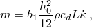

where  is a damping coefficient (default = 0.06), 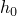 is the original thickness,  is the mass density,  is the current dilatational wave speed, *L* is the characteristic length used for rotary inertia and transverse shear stiffness scaling (see ["Finite-strain shell element formulation," Section 3.6.5 of the Abaqus Theory Guide](../stm/stm-link.md#stm-elm-finitestrainshells)), and 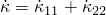 is twice the mean curvature strain rate. The resultant pressure moment , where *h* is the current thickness, is added to the direct components of the moment resultant.

### Material damping

Defining inelastic material behavior, dashpots, etc. will introduce energy dissipation into a model. In addition to these mechanisms, general (“Rayleigh”) material damping can be introduced (see ["Material damping," Section 26.1.1](pt05ch26s01abm51.md)). Adding damping to a model, especially stiffness proportional damping, , may significantly reduce the stable time increment.

| **Input File Usage: ** | ``` [*DAMPING](../key/key-link.md#usb-kws-mdamping), ALPHA=, BETA= ``` |
| --- | --- |

| **Abaqus/CAE Usage: ** | Property module: material editor: ****Mechanical****Damping****: **Alpha** and **Beta** |
| --- | --- |

### Obtaining diagnostic information about critical elements

Abaqus/Explicit writes critical elements (elements with the smallest stable time increments) and their stable time increment values to the output database at each summary increment for visualization in Abaqus/CAE. By default, the number of critical elements written to the output database is 10.

| **Input File Usage: ** | ``` [*DIAGNOSTICS](../key/key-link.md#usb-kws-hdiagnostics), CRITICAL ELEMENTS=*value* ``` |
| --- | --- |

| **Abaqus/CAE Usage: ** | The ability to control the number of critical elements written to the output database is not supported in Abaqus/CAE. |
| --- | --- |

### Obtaining diagnostic information about the deformation speed

The deformation speed in an element is defined as the largest absolute value of all the deformation rate components of an element times the element characteristic length, . You can request diagnostic information about the deformation speed within a step definition, as described below. In a multistep analysis diagnostic requests remain in effect until they are explicitly redefined.

#### Deformation speed warnings

By default, Abaqus/Explicit will check for a relatively large deformation speed in all the elements since too high a value may cause the element to deform or collapse unrealistically. A warning message is issued if the ratio of deformation speed versus dilatational wave speed in an element reaches the value specified for the “warning ratio.” By default, the warning ratio is 0.3. You can redefine this limit.

The first occurrence of the warning message is written to the status (`.sta`) file; subsequent occurrences are written to the message (`.msg`) file. See ["Output," Section 4.1.1](pt02ch04s01aus38.md), for a description of these output files.

Generally when the ratio of deformation speed to dilatational wave speed is greater than 0.3, it is an indication that the purely mechanical material constitutive relationship is no longer valid and that a thermo-mechanical equation of state material is required.

| **Input File Usage: ** | ``` [*DIAGNOSTICS](../key/key-link.md#usb-kws-hdiagnostics), WARNING RATIO=*ratio* ``` |
| --- | --- |

| **Abaqus/CAE Usage: ** | The ability to redefine the warning ratio limit is not supported in Abaqus/CAE. |
| --- | --- |

#### Deformation speed errors

An error message is issued and the analysis is terminated when the maximum ratio of deformation speed versus current dilatational wave speed for any element is greater than the “cutoff ratio.” By default, the cutoff ratio is 1.0. You can redefine this limit.

The check for this cutoff ratio is not applied to any model that has an equation of state material (see ["Equation of state," Section 25.2.1](pt05ch25s02abm50.md)) or a user-defined material (see ["User-defined mechanical material behavior," Section 26.7.1](pt05ch26s07abm69.md)).

| **Input File Usage: ** | ``` [*DIAGNOSTICS](../key/key-link.md#usb-kws-hdiagnostics), CUTOFF RATIO=*ratio* ``` |
| --- | --- |

| **Abaqus/CAE Usage: ** | The ability to redefine the cutoff ratio limit is not supported in Abaqus/CAE. |
| --- | --- |

#### Obtaining a summary of the deformation speed information

You can request summary diagnostic information to obtain warning and error messages for only the element with the largest ratio of deformation speed to dilatational wave speed.

| **Input File Usage: ** | ``` [*DIAGNOSTICS](../key/key-link.md#usb-kws-hdiagnostics), DEFORMATION SPEED CHECK=SUMMARY ``` |
| --- | --- |

| **Abaqus/CAE Usage: ** | A summary of the deformation speed diagnostic information is output by default in Abaqus/CAE. |
| --- | --- |

#### Obtaining detailed deformation speed information

You can request detailed diagnostic information to obtain warning and error messages for all elements with large deformation speed to dilatational wave speed ratios.

| **Input File Usage: ** | ``` [*DIAGNOSTICS](../key/key-link.md#usb-kws-hdiagnostics), DEFORMATION SPEED CHECK=DETAIL ``` |
| --- | --- |

| **Abaqus/CAE Usage: ** | You cannot output detailed diagnostic information about the deformation speed in Abaqus/CAE. |
| --- | --- |

#### Disabling deformation speed checks

You can choose to completely bypass the checks for large deformation speed.

| **Input File Usage: ** | ``` [*DIAGNOSTICS](../key/key-link.md#usb-kws-hdiagnostics), DEFORMATION SPEED CHECK=OFF ``` |
| --- | --- |

| **Abaqus/CAE Usage: ** | You cannot disable the deformation speed checks in Abaqus/CAE. |
| --- | --- |

### Monitoring output variables for extreme values

There are some analyses in which it is useful to monitor the value of a variable at every increment. For example, in a force-driven analysis such as hydro-forming, the simulation time that is sufficient to model the completion of the physical process may depend on the magnitude of the displacement of a node or a group of nodes in the model. Another example is a drop test simulation where the postfailure response is not of interest. Monitoring the values of critical variables and halting the analysis when those variables exceed a given criterion can reduce computational expense and turnaround time.

For such problems Abaqus/Explicit allows output variables to be monitored during an analysis to verify whether or not their values have exceeded or fallen below user-specified values in specified element or node sets. Comparisons of specified element integration point variables, element section variables, or nodal variables with user-specified values are performed at every increment. At the first occurrence of a variable exceeding the user-specified bounds, the variable name, the associated element or node number, and the increment number are written to the status (`.sta`) file. In addition, you can request that the analysis be stopped and/or the output state be written in the increment following the one in which the variable has exceeded the user-specified bound. At the end of each step in which variables are monitored, the maximum, minimum, or absolute maximum value that each variable attains during the course of the analysis, along with the number of the element or node where the extreme value occurred, will be written to the status file.

#### Defining the element and nodal variables to be monitored

The element output variables that can be monitored include all the element integration point variables and element section point variables that are available for history-type output to the output database. Similarly, the nodal output variables that can be monitored include all the nodal variables that are available for history output to the output database. The keys identifying the output variables are defined in ["Abaqus/Explicit output variable identifiers," Section 4.2.2](pt02ch04s02xbv01.md). 

| **Input File Usage: ** | Use the first option with one or both of the following options in the history portion of the input file: |
| --- | --- |
|  | ``` [*EXTREME VALUE](../key/key-link.md#usb-kws-hextremevalue) [*EXTREME ELEMENT VALUE](../key/key-link.md#usb-kws-hextremeelementvalue), ELSET=*element_set_name* [*EXTREME NODE VALUE](../key/key-link.md#usb-kws-hextremenodevalue), NSET=*nset_set_name* ``` The [*EXTREME VALUE](../key/key-link.md#usb-kws-hextremevalue) option can be repeated in the same step, and the [*EXTREME ELEMENT VALUE](../key/key-link.md#usb-kws-hextremeelementvalue) and [*EXTREME NODE VALUE](../key/key-link.md#usb-kws-hextremenodevalue) options can be repeated as many times as necessary. |

| **Abaqus/CAE Usage: ** | Extreme value output monitoring is not supported in Abaqus/CAE. |
| --- | --- |

#### Halting the analysis when the extreme value criterion is met

You can choose to halt the analysis when the extreme value criterion is met. The analysis will stop at the end of the increment following the one in which any of the specified element or nodal variables exceeded the prescribed bounds.

| **Input File Usage: ** | Use the following options: |
| --- | --- |
|  | ``` [*EXTREME VALUE](../key/key-link.md#usb-kws-hextremevalue), HALT=YES [*EXTREME ELEMENT VALUE](../key/key-link.md#usb-kws-hextremeelementvalue) *and/or* [*EXTREME NODE VALUE](../key/key-link.md#usb-kws-hextremenodevalue) ``` |

| **Abaqus/CAE Usage: ** | Extreme value output monitoring is not supported in Abaqus/CAE. |
| --- | --- |

#### Obtaining output when the extreme value criterion is met

You can obtain field-type output to the output database and an additional restart state when any of the selected variables fall outside the specified bounds for the first time during the analysis. The output will be written in the increment following the one in which such an occurrence took place. Since output is automatically written when the analysis terminates, this request has an effect only if you have not chosen to halt the analysis when the extreme value criterion is met as described above.

| **Input File Usage: ** | Use either or both of the following options in conjunction with the [*EXTREME VALUE](../key/key-link.md#usb-kws-hextremevalue) option: |
| --- | --- |
|  | ``` [*EXTREME ELEMENT VALUE](../key/key-link.md#usb-kws-hextremeelementvalue), ELSET=*element_set_name*, OUTPUT=YES [*EXTREME NODE VALUE](../key/key-link.md#usb-kws-hextremenodevalue), NSET=*node_set_name*, OUTPUT=YES ``` |

| **Abaqus/CAE Usage: ** | Extreme value output monitoring is not supported in Abaqus/CAE. |
| --- | --- |

#### Monitoring variables in a multistep analysis

In a multistep analysis the monitoring requests you specify remain in effect until they are redefined. You must redefine all requests to add or change any variables, element or node sets, or maxima or minima.

#### Stopping the monitoring of variables in a new step

You can stop monitoring variables in a new step.

| **Input File Usage: ** | Use the [*EXTREME VALUE](../key/key-link.md#usb-kws-hextremevalue) option without the [*EXTREME ELEMENT VALUE](../key/key-link.md#usb-kws-hextremeelementvalue) and [*EXTREME NODE VALUE](../key/key-link.md#usb-kws-hextremenodevalue) options. |
| --- | --- |

| **Abaqus/CAE Usage: ** | Extreme value output monitoring is not supported in Abaqus/CAE. |
| --- | --- |

### Initial conditions

["Initial conditions in Abaqus/Standard and Abaqus/Explicit," Section 34.2.1](pt07ch34s02aus116.md), describes all of the initial conditions that are available for an explicit dynamic analysis.

### Boundary conditions

Boundary conditions can be defined as explained in ["Boundary conditions in Abaqus/Standard and Abaqus/Explicit," Section 34.3.1](pt07ch34s03aus118.md). Boundary conditions applied during an explicit dynamic response step should use appropriate amplitude references (["Amplitude curves," Section 34.1.2](pt07ch34s01aus115.md)). If boundary conditions are specified for the step without amplitude references, they are applied instantaneously at the beginning of the step. Since Abaqus/Explicit does not admit jumps in displacement, the value of a nonzero displacement boundary condition that is specified without an amplitude reference will be ignored, and a zero velocity boundary condition will be enforced.

### Loads

The loading types available for an explicit dynamic analysis are explained in ["Applying loads: overview," Section 34.4.1](pt07ch34s04aus120.md). Concentrated nodal forces or moments can be applied to the displacement or rotation degrees of freedom (1–6). Distributed pressure forces or body forces can also be applied; the distributed load types available with particular elements are described in [Part VI, "Elements](pt06.md).”

As with boundary conditions, loads applied during a dynamic response step should use appropriate amplitude references (["Amplitude curves," Section 34.1.2](pt07ch34s01aus115.md)). If loads are specified for the step without amplitude references, they are applied instantaneously at the beginning of the step.

### Predefined fields

The following predefined fields can be specified, as described in ["Predefined fields," Section 34.6.1](pt07ch34s06aus128.md):
- Although temperature is not a degree of freedom in explicit dynamic analysis, nodal temperatures can be specified. Any difference between the applied and initial temperatures will cause thermal strain if a thermal expansion coefficient is given for the material (["Thermal expansion," Section 26.1.2](pt05ch26s01abm52.md)). The specified temperature also affects temperature-dependent material properties, if any.
- The values of user-defined field variables can be specified. These values affect only field-variable-dependent material properties, if any.

### Material options

Any of the material models in Abaqus/Explicit can be used in a general explicit dynamic analysis (see ["Combining material behaviors," Section 21.1.3](pt05ch21s01aus110.md)).

### Elements

All of the elements available in Abaqus/Explicit can be used in an explicit dynamic analysis. The elements are listed in [Part VI, "Elements](pt06.md).”

If coupled temperature-displacement elements are used in an explicit dynamic analysis, the temperature degrees of freedom will be ignored.

### Output

The element output available for a dynamic analysis includes stress; strain; energies; and the values of state, field, and user-defined variables. The nodal output available includes displacements, velocities, accelerations, reaction forces, and coordinates. All of the output variable identifiers are outlined in ["Abaqus/Explicit output variable identifiers," Section 4.2.2](pt02ch04s02xbv01.md). The types of output available are described in ["Output," Section 4.1.1](pt02ch04s01aus38.md).

When an Abaqus/Explicit analysis encounters a fatal error, the preselected variables applicable to the current procedure are added automatically to the output database as field data for the last increment. 

Energy output is particularly important in checking the accuracy of the solution in an explicit dynamic analysis. In general, the total energy (ETOTAL) should be a constant or close to a constant; the “artificial” energies, such as the artificial strain energy (ALLAE), the damping dissipation (ALLVD), and the mass scaling work (ALLMW) should be negligible compared to “real” energies such as the strain energy (ALLSE) and the kinetic energy (ALLKE).

In a quasi-static analysis the value of the kinetic energy (ALLKE) should not exceed a small fraction of the value of the strain energy (ALLIE).

It is a good practice to output the constraint penalty work (ALLCW) and the contact penalty work (ALLPW) in analyses involving constraints (such as ties and fasteners) and contact. The value of these energies should be close to zero.

### Input file template

```
[*HEADING](../key/key-link.md#usb-kws-mheading)
 …
[*MATERIAL](../key/key-link.md#usb-kws-mmaterial), NAME=*name*
[*ELASTIC](../key/key-link.md#usb-kws-melastic)
 …
[*DENSITY](../key/key-link.md#usb-kws-mdensity)
*Data lines to define density*
[*DAMPING](../key/key-link.md#usb-kws-mdamping), ALPHA =, BETA= 
*Data lines to define Rayleigh damping*
 …
[*BOUNDARY](../key/key-link.md#usb-kws-hboundary)
*Data lines to specify zero-valued boundary conditions*
[*INITIAL CONDITIONS](../key/key-link.md#usb-kws-minitialcond), TYPE=*type*
*Data lines to specify initial conditions*
[*AMPLITUDE](../key/key-link.md#usb-kws-mamplitude), NAME=*name*
*Data lines to define amplitude variations*
*************************
[*STEP](../key/key-link.md#usb-kws-hstep)
[*DYNAMIC](../key/key-link.md#usb-kws-hdynamic), EXPLICIT
*Data line to specify the time period of the step*
[*DIAGNOSTICS](../key/key-link.md#usb-kws-hdiagnostics), DEFORMATION SPEED CHECK=SUMMARY
[*BOUNDARY](../key/key-link.md#usb-kws-hboundary), AMPLITUDE=*name*
*Data lines to describe zero-valued or nonzero boundary conditions*
[*CLOAD](../key/key-link.md#usb-kws-hcload) and/or [*DLOAD](../key/key-link.md#usb-kws-hdload)
*Data lines to specify loading*
[*TEMPERATURE](../key/key-link.md#usb-kws-htemperature) and/or [*FIELD](../key/key-link.md#usb-kws-hfield)
*Data lines to specify predefined fields*
[*FILE OUTPUT](../key/key-link.md#usb-kws-hexpfileoutput), NUMBER INTERVAL=*n*
[*EL FILE](../key/key-link.md#usb-kws-helfile)
*Data line specifying element output variables*
[*NODE FILE](../key/key-link.md#usb-kws-hnodefile)
*Data line specifying node output variables*
[*ENERGY FILE](../key/key-link.md#usb-kws-henergyfile)
[*OUTPUT](../key/key-link.md#usb-kws-houtput), FIELD, NUMBER INTERVAL=*n*
[*ELEMENT OUTPUT](../key/key-link.md#usb-kws-helementoutput)
*Data line specifying element output variables*
[*NODE OUTPUT](../key/key-link.md#usb-kws-hnodeoutput)
*Data line specifying node output variables*
[*OUTPUT](../key/key-link.md#usb-kws-houtput), HISTORY, TIME INTERVAL=*t*
[*ELEMENT OUTPUT](../key/key-link.md#usb-kws-helementoutput), ELSET=*element set name*
*Data line specifying element output variables*
[*NODE OUTPUT](../key/key-link.md#usb-kws-hnodeoutput), NSET=*node set name*
*Data line specifying node output variables*
[*ENERGY OUTPUT](../key/key-link.md#usb-kws-henergyoutput)
*Data line specifying energy output variables*
[*END STEP](../key/key-link.md#usb-kws-hendstep)
*************************
[*STEP](../key/key-link.md#usb-kws-hstep)
[*DYNAMIC](../key/key-link.md#usb-kws-hdynamic), EXPLICIT, ELEMENT BY ELEMENT
 …
[*BULK VISCOSITY](../key/key-link.md#usb-kws-hbulkvisco)
*Data line to define linear and/or quadratic bulk viscosity in this step*
 …
[*END STEP](../key/key-link.md#usb-kws-hendstep)
```


