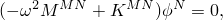
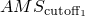
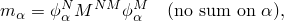
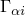
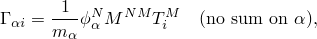
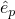
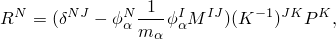
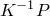
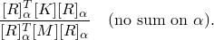

# 6.3.5 Natural frequency extraction


**Products: **Abaqus/Standard  Abaqus/CAE  Abaqus/AMS  

##### **References**

- ["Defining an analysis," Section 6.1.2](pt03ch06s01abo05.md)
- ["General and linear perturbation procedures," Section 6.1.3](pt03ch06s01aus44.md)
- ["Dynamic analysis procedures: overview," Section 6.3.1](pt03ch06s03abo07.md)
- [*FREQUENCY](../key/key-link.md#usb-kws-hfrequency)
- ["Configuring a frequency procedure" in "Configuring linear perturbation analysis procedures," Section 14.11.2 of the Abaqus/CAE User's Guide](../usi/usi-link.md#usi-sim-configure-frequency)

### Overview

The frequency extraction procedure:
- performs eigenvalue extraction to calculate the natural frequencies and the corresponding mode shapes of a system;
- will include initial stress and load stiffness effects due to preloads and initial conditions if geometric nonlinearity is accounted for in the base state, so that small vibrations of a preloaded structure can be modeled;
- will compute residual modes if requested;
- is a linear perturbation procedure;
- can be performed using the traditional Abaqus software architecture or, if appropriate, the high-performance SIM architecture (see ["Using the SIM architecture for modal superposition dynamic analyses" in "Dynamic analysis procedures: overview," Section 6.3.1](pt03ch06s03abo07.md#usb-anl-alineardynamics)); and
- solves the eigenfrequency problem only for symmetric mass and stiffness matrices; the complex eigenfrequency solver must be used if unsymmetric contributions, such as the load stiffness, are needed.

### Eigenvalue extraction

The eigenvalue problem for the natural frequencies of an undamped finite element model is



where


is the mass matrix (which is symmetric and positive definite);


is the stiffness matrix (which includes initial stiffness effects if the base state included the effects of nonlinear geometry);


is the eigenvector (the mode of vibration); and

*M* and *N*

are degrees of freedom.

When  is positive definite, all eigenvalues are positive. Rigid body modes and instabilities cause  to be indefinite. Rigid body modes produce zero eigenvalues. Instabilities produce negative eigenvalues and occur when you include initial stress effects. Abaqus/Standard solves the eigenfrequency problem only for symmetric matrices.

### Selecting the eigenvalue extraction method

Abaqus/Standard provides three eigenvalue extraction methods:
- Lanczos
- Automatic multi-level substructuring (AMS), an add-on analysis capability for Abaqus/Standard
- Subspace iteration

In addition, you must consider the software architecture that will be used for the subsequent modal superposition procedures. The choice of architecture has minimal impact on the frequency extraction procedure, but the SIM architecture can offer significant performance improvements over the traditional architecture for subsequent mode-based steady-state or transient dynamic procedures (see ["Using the SIM architecture for modal superposition dynamic analyses" in "Dynamic analysis procedures: overview," Section 6.3.1](pt03ch06s03abo07.md#usb-anl-alineardynamics)). The architecture that you use for the frequency extraction procedure is used for all subsequent mode-based linear dynamic procedures; you cannot switch architectures during an analysis. The software architectures used by the different eigensolvers are outlined in [Table 6.3.5--1](pt03ch06s03at10.md#usb-anl-afreqextraction-arch).

**Table 6.3.5–1** Software architectures available with different eigensolvers.
| Software Architecture | Eigensolver |
| --- | --- |
| Lanczos | AMS | Subspace Iteration |
| Traditional |  |  |  |
| SIM |  |  |  |

The Lanczos solver with the traditional architecture is the default eigenvalue extraction method because it has the most general capabilities. However, the Lanczos method is generally slower than the AMS method. The increased speed of the AMS eigensolver is particularly evident when you require a large number of eigenmodes for a system with many degrees of freedom. However, the AMS method has the following limitations:
- All restrictions imposed on SIM-based linear dynamic procedures also apply to mode-based linear dynamic analyses based on mode shapes computed by the AMS eigensolver. See ["Using the SIM architecture for modal superposition dynamic analyses" in "Dynamic analysis procedures: overview," Section 6.3.1](pt03ch06s03abo07.md#usb-anl-alineardynamics), for details.
- The AMS eigensolver does not compute composite modal damping factors, participation factors, or modal effective masses. However, if participation factors are needed for primary base motions, they will be computed but are not written to the printed data (`.dat`) file.
- You cannot use the AMS eigensolver in an analysis that contains piezoelectric elements.
- You cannot request output to the results (`.fil`) file in an AMS frequency extraction step.

If your model has many degrees of freedom and these limitations are acceptable, you should use the AMS eigensolver. Otherwise, you should use the Lanczos eigensolver. The Lanczos eigensolver and the subspace iteration method are described in ["Eigenvalue extraction," Section 2.5.1 of the Abaqus Theory Guide](../stm/stm-link.md#stm-anl-eigenextract).

#### Lanczos eigensolver

For the Lanczos method you need to provide the maximum frequency of interest or the number of eigenvalues required; Abaqus/Standard will determine a suitable block size (although you can override this choice, if needed). If you specify both the maximum frequency of interest and the number of eigenvalues required and the actual number of eigenvalues is underestimated, Abaqus/Standard will issue a corresponding warning message; the remaining eigenmodes can be found by restarting the frequency extraction.

You can also specify the minimum frequencies of interest; Abaqus/Standard will extract eigenvalues until either the requested number of eigenvalues has been extracted in the given range or all the frequencies in the given range have been extracted.

See ["Using the SIM architecture for modal superposition dynamic analyses" in "Dynamic analysis procedures: overview," Section 6.3.1](pt03ch06s03abo07.md#usb-anl-alineardynamics), for information on using the SIM architecture with the Lanczos eigensolver.

| **Input File Usage: ** | ``` [*FREQUENCY](../key/key-link.md#usb-kws-hfrequency), EIGENSOLVER=LANCZOS ``` |
| --- | --- |

| **Abaqus/CAE Usage: ** | Step module: ****Step****Create****: **Frequency**: **Basic**: **Eigensolver**: ** Lanczos** |
| --- | --- |

##### Choosing a block size for the Lanczos method

In general, the block size for the Lanczos method should be as large as the largest expected multiplicity of eigenvalues (that is, the largest number of modes with the same frequency). A block size larger than 10 is not recommended. If the number of eigenvalues requested is *n*, the default block size is the minimum of (7, *n*). The choice of 7 for block size proves to be efficient for problems with rigid body modes. The number of block Lanczos steps within each Lanczos run is usually determined by Abaqus/Standard but can be changed by you. In general, if a particular type of eigenproblem converges slowly, providing more block Lanczos steps will reduce the analysis cost. On the other hand, if you know that a particular type of problem converges quickly, providing fewer block Lanczos steps will reduce the amount of in-core memory used. The default values are

| Block size | Maximum number of block Lanczos steps |
| --- | --- |
| 1 | 80 |
| 2 | 50 |
| 3 | 45 |
| ≥ 4 | 35 |

#### Automatic multi-level substructuring (AMS) eigensolver

For the AMS method you need only specify the maximum frequency of interest (the global frequency), and Abaqus/Standard will extract all the modes up to this frequency. You can also specify the minimum frequencies of interest and/or the number of requested modes. However, specifying these values will not affect the number of modes extracted by the eigensolver; it will affect only the number of modes that are stored for output or for a subsequent modal analysis. 

The execution of the AMS eigensolver can be controlled by specifying three parameters: , , and . These three parameters multiplied by the maximum frequency of interest define three cutoff frequencies.  (default value of 5) controls the cutoff frequency for substructure eigenproblems in the reduction phase, while  and  (default values of 1.7 and 1.1, respectively) control the cutoff frequencies used to define a starting subspace in the reduced eigensolution phase. Generally, increasing the value of  and  improves the accuracy of the results but may affect the performance of the analysis.

##### Requesting eigenvectors at all nodes

By default, the AMS eigensolver computes eigenvectors at every node of the model. 

| **Input File Usage: ** | ``` [*FREQUENCY](../key/key-link.md#usb-kws-hfrequency), EIGENSOLVER=AMS ``` |
| --- | --- |

| **Abaqus/CAE Usage: ** | Step module: ****Step****Create****: **Frequency**: **Basic**: **Eigensolver**: **AMS** |
| --- | --- |

##### Requesting eigenvectors only at specified nodes

Alternatively, you can specify a node set, and eigenvectors will be computed and stored only at the nodes that belong to that node set. The node set that you specify must include all nodes at which loads are applied or output is requested in any subsequent modal analysis (this includes any restarted analysis). If element output is requested or element-based loading is applied, the nodes attached to the associated elements must also be included in this node set. Computing eigenvectors at only selected nodes improves performance and reduces the amount of stored data. Therefore, it is recommended that you use this option for large problems. Abaqus/Standard can automatically select all the nodes that need to be included in the node set. These nodes are
- nodes at which a concentrated load is applied in the following mode-based procedures,
- nodes at which output is requested in the eigenvalue extraction analysis or in the following mode-based procedures,
- nodes at which residual vectors are requested,
- nodes of elements at which a distributed load is applied,
- nodes of elements with frequency-dependent material properties, and
- nodes of elements at which output is requested in the eigenvalue extraction analysis or in the following mode-based procedures.

| **Input File Usage: ** | Use the following option to specify a node set: |
| --- | --- |
|  | ``` [*FREQUENCY](../key/key-link.md#usb-kws-hfrequency), EIGENSOLVER=AMS, NSET=*name* ``` Use the following option to allow Abaqus/Standard to select the nodes automatically: ``` [*FREQUENCY](../key/key-link.md#usb-kws-hfrequency), EIGENSOLVER=AMS, NSET ``` |

| **Abaqus/CAE Usage: ** | You can only request eigenvectors at specific nodes by specifying a node set in Abaqus/CAE. |
| --- | --- |
|  | Step module: ****Step****Create****: **Frequency**: **Basic**: **Eigensolver**: **AMS**: **Limit region of saved eigenvectors**, select node set |

##### Controlling the AMS eigensolver

The AMS method consists of the following three phases:

**Reduction phase**: In this phase Abaqus/Standard uses a multi-level substructuring technique to reduce the full system in a way that allows a very efficient eigensolution of the reduced system. The approach combines a sparse factorization based on a multi-level supernode elimination tree and a local eigensolution at each supernode. Starting from the lowest level supernodes, we use a Craig-Bampton substructure reduction technique to successively reduce the size of the system as we progress upward in the elimination tree. At each supernode a local eigensolution is obtained based on fixing the degrees of freedom connected to the next higher level supernode (these are the local retained or “fixed-interface” degrees of freedom). At the end of the reduction phase the full system has been reduced such that the reduced stiffness matrix is diagonal and the reduced mass matrix has unit diagonal values but contains off-diagonal blocks of nonzero values representing the coupling between the supernodes.The cost of the reduction phase depends on the system size and the number of eigenvalues extracted (the number of eigenvalues extracted is controlled indirectly by specifying the highest eigenfrequency desired). You can make trade-offs between cost and accuracy during the reduction phase through the  parameter. This parameter multiplied by the highest eigenfrequency specified for the full model yields the highest eigenfrequency that is extracted in the local supernode eigensolutions. Increasing the value of  increases the accuracy of the reduction since more local eigenmodes are retained. However, increasing the number of retained modes also increases the cost of the reduced eigensolution phase, which is discussed next.

**Reduced eigensolution phase**: In this phase Abaqus/Standard computes the eigensolution of the reduced system that comes from the previous phase. Although the reduced system typically is two orders of magnitude smaller in size than the original system, generally it still is too large to solve directly. Thus, the system is further reduced mainly by truncating the retained eigenmodes and then solved using a single subspace iteration step. The two AMS parameters,  and , define a starting subspace of the subspace iteration step. The default values of these parameters are carefully chosen and provide accurate results in most cases. When a more accurate solution is needed, the recommended procedure is to increase both parameters proportionally from their respective default values.

**Recovery phase**: In this phase the eigenvectors of the original system are recovered using eigenvectors of the reduced problem and local substructure modes. If you request recovery at specified nodes, the eigenvectors are computed only at those nodes.

#### Subspace iteration method

For the subspace iteration procedure you need only specify the number of eigenvalues required; Abaqus/Standard chooses a suitable number of vectors for the iteration. If the subspace iteration technique is requested, you can also specify the maximum frequency of interest; Abaqus/Standard extracts eigenvalues until either the requested number of eigenvalues has been extracted or the last frequency extracted exceeds the maximum frequency of interest.

| **Input File Usage: ** | ``` [*FREQUENCY](../key/key-link.md#usb-kws-hfrequency), EIGENSOLVER=SUBSPACE ``` |
| --- | --- |

| **Abaqus/CAE Usage: ** | Step module: ****Step****Create****: **Frequency**: **Basic**: **Eigensolver**: **Subspace** |
| --- | --- |

### Structural-acoustic coupling

Structural-acoustic coupling affects the natural frequency response of systems. In Abaqus the AMS eigensolver and the Lanczos eigensolver can extract coupled modes to fully include this effect. The subspace eigensolver neglects the effect of coupling for the purpose of computing the modes and frequencies; the modes and frequencies are computed using natural boundary conditions at the structural-acoustic coupling surface. By default, the same is done for the AMS eigensolver; the coupling is projected onto the modal space and stored for later use.

#### Structural-acoustic coupling using the Lanczos eigensolver

 If structural-acoustic coupling is present in the model and the Lanczos method is used, Abaqus/Standard extracts the coupled modes by default. Because these modes fully account for coupling, they represent the mathematically optimal basis for subsequent modal procedures. The effect is most noticeable in strongly coupled systems such as steel shells and water. However, coupled structural-acoustic modes cannot be used in subsequent random response or response spectrum analyses. You can define the coupling using either acoustic-structural interaction elements (see ["Acoustic interface elements," Section 32.13.1](pt06ch32s13alm58.md)) or the surface-based tie constraint (see ["Acoustic, shock, and coupled acoustic-structural analysis," Section 6.10.1](pt03ch06s10at29.md)). It is possible to ignore coupling when extracting acoustic and structural modes; in this case the coupling boundary is treated as traction-free on the structural side and rigid on the acoustic side.

For frequency extractions that use the Lanczos eigensolver based on the SIM architecture, it is also possible to project structural-acoustic coupling operators onto the subspace of eigenvectors. The modes are computed using traction-free boundary conditions on the structural side of the coupling boundary and rigid boundary conditions on the acoustic side. Structural-acoustic coupling operators (see ["Acoustic, shock, and coupled acoustic-structural analysis," Section 6.10.1](pt03ch06s10at29.md)) are projected by default onto the subspace of eigenvectors. Contributions to these global operators, which come from surface-based tie constraints defined between structural and acoustic surfaces, are assembled into global matrices that are projected onto the mode shapes and used in subsequent SIM-based modal dynamic procedures.

| **Input File Usage: ** | Use the following option to account for structural-acoustic coupling during the frequency extraction: |
| --- | --- |
|  | ``` [*FREQUENCY](../key/key-link.md#usb-kws-hfrequency), EIGENSOLVER=LANCZOS, ACOUSTIC COUPLING=ON (default) ``` Use the following option to project structural-acoustic coupling on the uncoupled eigenmodes during the frequency extraction: ``` [*FREQUENCY](../key/key-link.md#usb-kws-hfrequency), EIGENSOLVER=LANCZOS, SIM, ACOUSTIC COUPLING=PROJECTION (only if the Lanczos eigensolver is based on the SIM architecture) ``` Use the following option to ignore structural-acoustic coupling during the frequency extraction: ``` [*FREQUENCY](../key/key-link.md#usb-kws-hfrequency), EIGENSOLVER=LANCZOS, ACOUSTIC COUPLING=OFF ``` |

| **Abaqus/CAE Usage: ** | Use the following option to account for structural-acoustic coupling during the frequency extraction: |
| --- | --- |
|  | Step module: ****Step****Create****: **Frequency**: **Basic**: **Eigensolver: Lanczos**, toggle on **Include acoustic-structural coupling where applicable** Use the following option to project structural-acoustic coupling on the uncoupled eigenmodes during the frequency extraction: Step module: ****Step****Create****: **Frequency**: **Basic**: **Eigensolver: Lanczos**, toggle on **Use SIM-based linear dynamics procedures**, toggle on **Project acoustic-structural coupling where applicable** Use the following option to ignore structural-acoustic coupling during the frequency extraction: Step module: ****Step****Create****: **Frequency**: **Basic**: **Eigensolver: Lanczos**, toggle off **Include acoustic-structural coupling where applicable** |

#### Structural-acoustic coupling using the AMS eigensolver

For frequency extractions that use the AMS eigensolver, the modes are computed by default using traction-free boundary conditions on the structural side of the coupling boundary and rigid boundary conditions on the acoustic side. Structural-acoustic coupling operators (see ["Acoustic, shock, and coupled acoustic-structural analysis," Section 6.10.1](pt03ch06s10at29.md)) are projected by default onto the subspace of eigenvectors. Contributions to these global operators, which come from surface-based tie constraints defined between structural and acoustic surfaces, are assembled into global matrices that are projected onto the mode shapes and used in subsequent SIM-based modal dynamic procedures.

 For frequency extractions that use the AMS eigensolver, Abaqus/Standard can also extract the coupled modes. Because these modes fully account for coupling, they represent the mathematically optimal basis for subsequent modal procedures. The effect is most noticeable in strongly coupled systems such as steel shells and water. However, extracting the coupled structural-acoustic modes using the AMS eigensolver is computationally more expensive than the default option, where the coupling operators are projected onto the subspace of uncoupled eigenvectors.

User-defined acoustic-structural interaction elements (see ["Acoustic interface elements," Section 32.13.1](pt06ch32s13alm58.md)) cannot be used in an AMS eigenvalue extraction analysis.

| **Input File Usage: ** | Use the following option to project structural-acoustic coupling operators onto the subspace of eigenvectors: |
| --- | --- |
|  | ``` [*FREQUENCY](../key/key-link.md#usb-kws-hfrequency), EIGENSOLVER=AMS, ACOUSTIC COUPLING=PROJECTION (default) ``` Use the following option to disable the projection of structural-acoustic coupling operators: ``` [*FREQUENCY](../key/key-link.md#usb-kws-hfrequency), EIGENSOLVER=AMS, ACOUSTIC COUPLING=OFF ``` Use the following option to extract coupled structural-acoustic eigenmodes: ``` [*FREQUENCY](../key/key-link.md#usb-kws-hfrequency), EIGENSOLVER=AMS, ACOUSTIC COUPLING=ON ``` |

| **Abaqus/CAE Usage: ** | Use the following option to project structural-acoustic coupling operators onto the subspace of eigenvectors: |
| --- | --- |
|  | Step module: ****Step****Create****: **Frequency**: **Basic**: **Eigensolver: AMS**, toggle on **Project acoustic-structural coupling where applicable** Use the following option to disable the projection of structural-acoustic coupling operators: Step module: ****Step****Create****: **Frequency**: **Basic**: **Eigensolver: AMS**, toggle off **Project acoustic-structural coupling where applicable** Requesting the coupled structural-acoustic modes during the AMS eigenanalysis is not supported in Abaqus/CAE. |

#### Specifying a frequency range for the acoustic modes

Because structural-acoustic coupling can be ignored during the AMS and SIM-based Lanczos eigenanalysis, the computed resonances will, in principle, be higher than those of the fully coupled system. This may be understood as a consequence of neglecting the mass of the fluid in the structural phase and vice versa. For the common metal and air case, the structural resonances may be relatively unaffected; however, some acoustic modes that are significant in the coupled response may be omitted due to the air's upward frequency shift during eigenanalysis. Therefore, Abaqus allows you to specify a multiplier, so that the maximum acoustic frequency in the analysis is taken to be higher than the structural maximum.

| **Input File Usage: ** | Use either of the following options: |
| --- | --- |
|  | ``` [*FREQUENCY](../key/key-link.md#usb-kws-hfrequency), EIGENSOLVER=AMS , , , , , , *acoustic range factor* ``` or ``` [*FREQUENCY](../key/key-link.md#usb-kws-hfrequency), EIGENSOLVER=LANCZOS, SIM, ACOUSTIC COUPLING=PROJECTION , , , , , , *acoustic range factor* ``` |

| **Abaqus/CAE Usage: ** | Step module: ****Step****Create****: **Frequency**: **Basic**: **Eigensolver: AMS**, **Acoustic range factor**: *acoustic range factor* |
| --- | --- |
|  | Specifying a frequency range for the acoustic modes during Lanczos eigenanalysis is not supported in Abaqus/CAE. |

#### Effects of fluid motion on natural frequency analysis of acoustic systems

To extract natural frequencies from an acoustic-only or coupled structural-acoustic system in which fluid motion is prescribed using an acoustic flow velocity, either the Lanczos method or the complex eigenvalue extraction procedure can be used. In the former case Abaqus extracts real-only eigenvalues and considers the fluid motion's effects only on the acoustic stiffness matrix. Thus, these results are of primary interest as a basis for subsequent linear perturbation procedures. When the complex eigenvalue extraction procedure is used, the fluid motion effects are included in their entirety; that is, the acoustic stiffness and damping matrices are included in the analysis.

### Frequency shift

For the Lanczos and subspace iteration eigensolvers you can specify a positive or negative shifted squared frequency, *S*. This feature is useful when a particular frequency is of concern or when the natural frequencies of an unrestrained structure or a structure that uses secondary base motions (large mass approach) are needed. In the latter case a shift from zero (the frequency of the rigid body modes) will avoid singularity problems or round-off errors for the large mass approach; a negative frequency shift is normally used. The default is no shift.

If the Lanczos eigensolver is in use and the user-specified shift is outside the requested frequency range, the shift will be adjusted automatically to a value close to the requested range.

### Normalization

For the Lanczos and subspace iteration eigensolvers both displacement and mass eigenvector normalization are available. Displacement normalization is the default. Mass normalization is the only option available for SIM-based natural frequency extraction.

The choice of eigenvector normalization type has no influence on the results of subsequent modal dynamic steps (see ["Linear analysis of a rod under dynamic loading," Section 1.4.9 of the Abaqus Benchmarks Guide](../bmk/bmk-link.md#bmk-anl-rodlindynamic)). The normalization type determines only the manner in which the eigenvectors are represented.

In addition to extracting the natural frequencies and mode shapes, the Lanczos and subspace iteration eigensolvers automatically calculate the generalized mass, the participation factor, the effective mass, and the composite modal damping for each mode; therefore, these variables are available for use in subsequent linear dynamic analyses. The AMS eigensolver computes only the generalized mass.

#### Displacement normalization

If displacement normalization is selected, the eigenvectors are normalized so that the largest displacement entry in each vector is unity. If the displacements are negligible, as in a torsional mode, the eigenvectors are normalized so that the largest rotation entry in each vector is unity. In a coupled acoustic-structural extraction, if the displacements and rotations in a particular eigenvector are small when compared to the acoustic pressures, the eigenvector is normalized so that the largest acoustic pressure in the eigenvector is unity. The normalization is done before the recovery of dependent degrees of freedom that have been previously eliminated with multi-point constraints or equation constraints. Therefore, it is possible that such degrees of freedom may have values greater than unity.

| **Input File Usage: ** | ``` [*FREQUENCY](../key/key-link.md#usb-kws-hfrequency), NORMALIZATION=DISPLACEMENT ``` |
| --- | --- |

| **Abaqus/CAE Usage: ** | Step module: ****Step****Create****: **Frequency**: **Other**: **Normalize eigenvectors by**: **Displacement** |
| --- | --- |

#### Mass normalization

Alternatively, the eigenvectors can be normalized so that the generalized mass for each vector is unity. 

The “generalized mass” associated with mode  is



where  is the structure's mass matrix and  is the eigenvector for mode . The superscripts *N* and *M* refer to degrees of freedom of the finite element model.

If the eigenvectors are normalized with respect to mass, all the eigenvectors are scaled so that =1. For coupled acoustic-structural analyses, an acoustic contribution fraction to the generalized mass is computed as well.

| **Input File Usage: ** | ``` [*FREQUENCY](../key/key-link.md#usb-kws-hfrequency), NORMALIZATION=MASS ``` |
| --- | --- |

| **Abaqus/CAE Usage: ** | Step module: ****Step****Create****: **Frequency**: **Other**: **Normalize eigenvectors by**: **Mass** |
| --- | --- |

#### Modal participation factors

The participation factor for mode  in direction *i*, , is a variable that indicates how strongly motion in the global *x*-, *y*-, or *z*-direction or rigid body rotation about one of these axes is represented in the eigenvector of that mode. The six possible rigid body motions are indicated by , *2*, , *6*. The participation factor is defined as 



where  defines the magnitude of the rigid body response of degree of freedom *N* in the model to imposed rigid body motion (displacement or infinitesimal rotation) of type *i*. For example, at a node with three displacement and three rotation components,  is 


where  is unity and all other  are zero; *x*, *y*, and *z* are the coordinates of the node; and , , and  represent the coordinates of the center of rotation. The participation factors are, thus, defined for the translational degrees of freedom and for rotation around the center of rotation. For coupled acoustic-structural eigenfrequency analysis, an additional acoustic participation factor is computed as outlined in ["Coupled acoustic-structural medium analysis," Section 2.9.1 of the Abaqus Theory Guide](../stm/stm-link.md#stm-anl-acouststruct).

#### Modal effective mass

The effective mass for mode  associated with kinematic direction *i* (, *2*, , *6*) is defined as 


If the effective masses of all modes are added in any global translational direction, the sum should give the total mass of the model (except for mass at kinematically restrained degrees of freedom). Thus, if the effective masses of the modes used in the analysis add up to a value that is significantly less than the model's total mass, this result suggests that modes that have significant participation in a certain excitation direction have not been extracted.

For coupled acoustic-structural eigenfrequency analysis, an additional acoustic effective mass is computed as outlined in ["Coupled acoustic-structural medium analysis," Section 2.9.1 of the Abaqus Theory Guide](../stm/stm-link.md#stm-anl-acouststruct).

#### Composite modal damping

Composite modal damping allows you to define a damping factor for each material or element in the model as a fraction of critical damping. These factors are then combined into a damping factor for each mode as weighted averages of the mass matrix associated with each material or element; when using the SIM architecture, you can also include the weighted averages of the stiffness matrix. For more information, see ["Defining composite modal damping" in "Dynamic analysis procedures: overview," Section 6.3.1](pt03ch06s03abo07.md#usb-anl-adynamicproc-comp-damp).

### Obtaining residual modes for use in mode-based procedures

Several analysis types in Abaqus/Standard are based on the eigenmodes and eigenvalues of the system. For example, in a mode-based steady-state dynamic analysis the mass and stiffness matrices and load vector of the physical system are projected onto a set of eigenmodes resulting in a diagonal system in terms of modal amplitudes (or generalized degrees of freedom). The solution to the physical system is obtained by scaling each eigenmode by its corresponding modal amplitude and superimposing the results (for more information, see ["Linear dynamic analysis using modal superposition," Section 2.5.3 of the Abaqus Theory Guide](../stm/stm-link.md#stm-anl-lindynmodal)). 

Due to cost, usually only a small subset of the total possible eigenmodes of the system are extracted, with the subset consisting of eigenmodes corresponding to eigenfrequencies that are close to the excitation frequency. Since excitation frequencies typically fall in the range of the lower modes, it is usually the higher frequency modes that are left out. Depending on the nature of the loading, the accuracy of the modal solution may suffer if too few higher frequency modes are used. Thus, a trade-off exists between accuracy and cost. To minimize the number of modes required for a sufficient degree of accuracy, the set of eigenmodes used in the projection and superposition can be augmented with additional modes known as *residual modes*. The residual modes help correct for errors introduced by mode truncation. In Abaqus/Standard a residual mode, *R*, represents the static response of the structure subjected to a nominal (or unit) load, *P*, corresponding to the actual load that will be used in the mode-based analysis orthogonalized against the extracted eigenmodes,



followed by an orthogonalization of the residual modes against each other.

This orthogonalization is required to retain the orthogonality properties of the modes (residual and eigen) with respect to mass and stiffness. As a consequence of the mass and stiffness matrices being available, the orthogonalization can be done efficiently during the frequency extraction. Hence, if you wish to include residual modes in subsequent mode-based procedures, you must activate the residual mode calculations in the frequency extraction step. If the static responses are linearly dependent on each other or on the extracted eigenmodes, Abaqus/Standard automatically eliminates the redundant responses for the purpose of computing the residual modes.

For the Lanczos eigensolver you must ensure that the static perturbation response of the load that will be applied in the subsequent mode-based analysis (i.e., ) is available by specifying that load in a static perturbation step immediately preceding the frequency extraction step. If multiple load cases are specified in this static perturbation analysis, one residual mode is calculated for each load case; otherwise, it is assumed that all loads are part of a single load case, and only one residual mode will be calculated. When residual modes are requested, the boundary conditions applied in the frequency extraction step must match those applied in the preceding static perturbation step. In addition, in the immediately preceding static perturbation step Abaqus/Standard requires that (1) if multiple load cases are used, the boundary conditions applied in each load case must be identical, and (2) the boundary condition magnitudes are zero. When generating dynamic substructures (see ["Generating a reduced structural damping matrix for a substructure" in "Defining substructures," Section 10.1.2](pt04ch10s01aus59.md#usb-anl-asuperelementdef-genreducedmassmatrix)), residual modes usually will provide the most benefit if the loading patterns defined in each of the load cases in the preceding static perturbation step match the loading patterns defined under the corresponding substructure load cases in the substructure generation step.

If you use the AMS eigensolver, you do not need to specify the loads in a preceding static perturbation step. Residual modes are computed at all degrees of freedom at which a concentrated load is applied in the following mode-based procedures. You can request additional residual modes by specifying degrees of freedom. One residual mode is computed for every requested degree of freedom.

As an outcome of the orthogonalization process, a pseudo-eigenvalue corresponding to each residual mode, , is computed and given by



Henceforth, and in other Abaqus/Standard documentation, the term eigenvalue is used generally to refer to actual eigenvalues and pseudo-eigenvalues. All data (e.g., participation factors, etc.; see ["Output](pt03ch06s03at10.md#usb-anl-afreqextraction-output)”) associated with the modes (eigenmodes and residual modes) are ordered by increasing eigenvalue. Therefore, both eigenmodes and residual modes are assigned mode numbers. In the printed output file Abaqus/Standard clearly identifies which modes are eigenmodes and which modes are residual modes so that you can easily distinguish between them. By default, if you activate residual modes, all the calculated eigenmodes and residual modes will be used in subsequent mode-based procedures, unless:- You choose to obtain a new set of eigenmodes and residual modes in a new frequency extraction step.
- You choose to select a subset of the available eigenmodes and residual modes in the mode-based procedure (selection of modes is described in each of the mode-based analysis type sections).

Residual modes cannot be calculated if the cyclic symmetric modeling capability is used. In addition, the Lanczos or AMS eigensolver must be used if you wish to activate residual mode calculations.

| **Input File Usage: ** | ``` [*FREQUENCY](../key/key-link.md#usb-kws-hfrequency), RESIDUAL MODES ``` |
| --- | --- |

| **Abaqus/CAE Usage: ** | Step module: ****Step****Create****: **Frequency**: **Basic**: **Include residual modes** |
| --- | --- |

### Evaluating frequency-dependent material properties

When frequency-dependent material properties are specified, Abaqus/Standard offers the option of choosing the frequency at which these properties are evaluated for use in the frequency extraction procedure. This evaluation is necessary because the stiffness cannot be modified during the eigenvalue extraction procedure. If you do not choose the frequency, Abaqus/Standard evaluates the stiffness associated with frequency-dependent springs and dashpots at zero frequency and does not consider the stiffness contributions from frequency domain viscoelasticity. If you do specify a frequency, only the real part of the stiffness contributions from frequency domain viscoelasticity is considered.

Evaluating the properties at a specified frequency is particularly useful in analyses in which the eigenfrequency extraction step is followed by a subspace projection steady-state dynamic step (see ["Subspace-based steady-state dynamic analysis," Section 6.3.9](pt03ch06s03at14.md)). In these analyses the eigenmodes extracted in the frequency extraction step are used as global basis functions to compute the steady-state dynamic response of a system subjected to harmonic excitation at a number of output frequencies. The accuracy of the results in the subspace projection steady-state dynamic step is improved if you choose to evaluate the material properties at a frequency in the vicinity of the center of the range spanned by the frequencies specified for the steady-state dynamic step.

| **Input File Usage: ** | ``` [*FREQUENCY](../key/key-link.md#usb-kws-hfrequency), PROPERTY EVALUATION=*frequency* ``` |
| --- | --- |

| **Abaqus/CAE Usage: ** | Step module: ****Step****Create****: **Frequency**: **Other**: **Evaluate dependent properties at frequency** |
| --- | --- |

### Initial conditions

If the frequency extraction procedure is the first step in an analysis, the initial conditions form the *base state* for the procedure (except for initial stresses, which cannot be included in the frequency extraction if it is the first step). Otherwise, the base state is the current state of the model at the end of the last general analysis step (["General and linear perturbation procedures," Section 6.1.3](pt03ch06s01aus44.md)). Initial stress stiffness effects (specified either through defining initial stresses or through loading in a general analysis step) will be included in the eigenvalue extraction only if geometric nonlinearity is considered in a general analysis procedure prior to the frequency extraction procedure.

If initial stresses must be included in the frequency extraction and there is not a general nonlinear step prior to the frequency extraction step, a “dummy” static step—which includes geometric nonlinearity and which maintains the initial stresses with appropriate boundary conditions and loads—must be included before the frequency extraction step.

["Initial conditions in Abaqus/Standard and Abaqus/Explicit," Section 34.2.1](pt07ch34s02aus116.md), describes all of the available initial conditions.

### Boundary conditions

Nonzero magnitudes of boundary conditions in a frequency extraction step will be ignored; the degrees of freedom specified will be fixed (["Boundary conditions in Abaqus/Standard and Abaqus/Explicit," Section 34.3.1](pt07ch34s03aus118.md)).

Boundary conditions defined in a frequency extraction step will not be used in subsequent general analysis steps (unless they are respecified).

In a frequency extraction step involving piezoelectric elements, the electric potential degree of freedom must be constrained at least at one node to remove numerical singularities arising from the dielectric part of the element operator.

#### Defining primary and secondary bases for modal superposition procedures

If displacements or rotations are to be prescribed in subsequent dynamic modal superposition procedures, boundary conditions must be applied in the frequency extraction step; these degrees of freedom are grouped into “bases.” The bases are then used for prescribing motion in the modal superposition procedure—see ["Transient modal dynamic analysis," Section 6.3.7](pt03ch06s03at12.md).

Boundary conditions defined in the frequency extraction step supersede boundary conditions defined in previous steps. Hence, degrees of freedom that were fixed prior to the frequency extraction step will be associated with a specific base if they are redefined with reference to such a base in the frequency extraction step.

##### The primary base

By default, all degrees of freedom listed for a boundary condition will be assigned to an unnamed “primary” base. If the same motion will be prescribed at all fixed points, the boundary condition is defined only once; and all prescribed degrees of freedom belong to the primary base.

Unless removed in the frequency extraction step, boundary conditions from the last general analysis step become fixed boundary conditions for the frequency step and belong to the primary base.

If all rigid body motions are not suppressed by the boundary conditions that make up the primary base, you must apply a suitable frequency shift to avoid numerical problems.

| **Input File Usage: ** | ``` [*BOUNDARY](../key/key-link.md#usb-kws-hboundary) ``` |
| --- | --- |
|  | The [*BOUNDARY](../key/key-link.md#usb-kws-hboundary) option without the BASE NAME parameter can appear only once in a frequency extraction step. |

| **Abaqus/CAE Usage: ** | Load module: **Create Boundary Condition** |
| --- | --- |

##### Secondary bases

If the modal superposition procedure will have more than one independent base motion, the driven nodes must be grouped together into “secondary” bases in addition to the primary base. The secondary bases must be named. (See ["Base motions in modal-based procedures," Section 2.5.9 of the Abaqus Theory Guide](../stm/stm-link.md#stm-anl-basemotions).) Secondary bases are used only in modal dynamic and steady-state dynamic (not direct) procedures.

The degrees of freedom associated with secondary bases are not suppressed; instead, a “big” mass is added to each of them. To provide six digits of numerical accuracy, Abaqus/Standard sets each “big” mass equal to 106 times the total mass of the structure and each “big” rotary inertia equal to 106 times the total moment of inertia of the structure. Hence, an artificial low frequency mode is introduced for every degree of freedom in a secondary base. To keep the requested range of frequencies unchanged, Abaqus/Standard automatically increases the number of eigenvalues extracted. Consequently, the cost of the eigenvalue extraction step will increase as more degrees of freedom are included in the secondary bases. To reduce the analysis cost, keep the number of degrees of freedom associated with secondary bases to a minimum. This can sometimes be done by reducing several secondary bases that all have the same prescribed motion to a single node by using BEAM type MPCs (["General multi-point constraints," Section 35.2.2](pt08ch35s02aus130.md)).

For the Lanczos and subspace iteration methods a negative shift must be used with either the rigid body modes or secondary bases.

The “big” masses are not included in the model statistics, and the total mass of the structure and the printed messages about masses and inertia for the entire model are not affected. However, the presence of the masses will be noticeable in the output tables printed for the eigenvalue extraction step, as well as in the information for the generalized masses and effective masses. See ["Double cantilever subjected to multiple base motions," Section 1.4.12 of the Abaqus Benchmarks Guide](../bmk/bmk-link.md#bmk-anl-multibasemotion), for an example of the use of the base motion feature.

More than one secondary base can be defined by repeating the boundary condition definition and assigning different base names.

| **Input File Usage: ** | ``` [*BOUNDARY](../key/key-link.md#usb-kws-hboundary), BASE NAME=*name* ``` |
| --- | --- |

| **Abaqus/CAE Usage: ** | Load module; **Create Boundary Condition**; **Step:** *frequency_step*; **Category: Mechanical**; **Types for Selected Step:** **Secondary base**; **Constrained degrees-of-freedom**: **Region**: *select region*, **U1**, **U2**, **U3**, **UR1**, **UR2**, and/or **UR3** |
| --- | --- |

### Loads

Applied loads (["Applying loads: overview," Section 34.4.1](pt07ch34s04aus120.md)) are ignored during a frequency extraction analysis. If loads were applied in a previous general analysis step and geometric nonlinearity was considered for that prior step, the load stiffness determined at the end of the previous general analysis step is included in the eigenvalue extraction (["General and linear perturbation procedures," Section 6.1.3](pt03ch06s01aus44.md)).

### Predefined fields

Predefined fields cannot be prescribed during natural frequency extraction.

### Material options

The density of the material must be defined (["Density," Section 21.2.1](pt05ch21s02abm01.md)). The following material properties are not active during a frequency extraction: plasticity and other inelastic effects, rate-dependent material properties, thermal properties, mass diffusion properties, electrical properties (although piezoelectric materials are active), and pore fluid flow properties—see ["General and linear perturbation procedures," Section 6.1.3](pt03ch06s01aus44.md).

### Elements

Other than generalized axisymmetric elements with twist, any of the stress/displacement or acoustic elements in Abaqus/Standard (including those with temperature, pressure, or electrical degrees of freedom) can be used in a frequency extraction procedure.

### Output

The eigenvalues (EIGVAL), eigenfrequencies in cycles/time (EIGFREQ), generalized masses (GM), composite modal damping factors (CD), participation factors for displacement degrees of freedom 1–6 (PF1–PF6) and acoustic pressure (PF7), and modal effective masses for displacement degrees of freedom 1–6 (EM1–EM6) and acoustic pressure (EM7) are written automatically to the output database as history data. Output variables such as stress, strain, and displacement (which represent mode shapes) are also available for each eigenvalue; these quantities are perturbation values and represent mode shapes, not absolute values.

The eigenvalues and corresponding frequencies (in both radians/time and cycles/time) will also be automatically listed in the printed output file, along with the generalized masses, composite modal damping factors, participation factors, and modal effective masses.

The only energy density available in eigenvalue extraction procedures is the elastic strain energy density, SENER. All of the output variable identifiers are outlined in ["Abaqus/Standard output variable identifiers," Section 4.2.1](pt02ch04s02abv01.md).

The AMS eigensolver does not compute composite modal damping factors, participation factors, or modal effective masses. In addition, you cannot request output to the results   (`.fil`) file.

You can restrict output to the results, data, and output database files by selecting the modes for which output is desired (see ["Output to the data and results files," Section 4.1.2](pt02ch04s01aus39.md), and ["Output to the output database," Section 4.1.3](pt02ch04s01aus40.md)).

| **Input File Usage: ** | Use one of the following options: |
| --- | --- |
|  | ``` [*EL FILE](../key/key-link.md#usb-kws-helfile), MODE, LAST MODE [*EL PRINT](../key/key-link.md#usb-kws-helprint), MODE, LAST MODE [*OUTPUT](../key/key-link.md#usb-kws-houtput), MODE LIST ``` |

| **Abaqus/CAE Usage: ** | Step module: ****Output****Field Output Requests****Create****: **Frequency**: **Specify modes** |
| --- | --- |

### Input file template

```
[*HEADING](../key/key-link.md#usb-kws-mheading)
…
[*BOUNDARY](../key/key-link.md#usb-kws-hboundary)
*Data lines to specify zero-valued boundary conditions*
[*INITIAL CONDITIONS](../key/key-link.md#usb-kws-minitialcond)
*Data lines to specify initial conditions*
**
[*STEP](../key/key-link.md#usb-kws-hstep) (,NLGEOM)
*If NLGEOM is used, initial stress and preload stiffness effects
will be included in the frequency extraction step*
[*STATIC](../key/key-link.md#usb-kws-hstatic)
…
[*CLOAD](../key/key-link.md#usb-kws-hcload) and/or [*DLOAD](../key/key-link.md#usb-kws-hdload)
*Data lines to specify loads*
[*TEMPERATURE](../key/key-link.md#usb-kws-htemperature) and/or [*FIELD](../key/key-link.md#usb-kws-hfield)
*Data lines to specify values of predefined fields*
[*BOUNDARY](../key/key-link.md#usb-kws-hboundary)
*Data lines to specify zero-valued or nonzero boundary conditions*
[*END STEP](../key/key-link.md#usb-kws-hendstep)
**
[*STEP](../key/key-link.md#usb-kws-hstep), PERTURBATION
[*STATIC](../key/key-link.md#usb-kws-hstatic)
…
[*LOAD CASE](../key/key-link.md#usb-kws-hloadcase), NAME=*load case name*
*Keywords and data lines to define loading  for this load case*
[*END LOAD CASE](../key/key-link.md#usb-kws-hendloadcase)
…
[*END STEP](../key/key-link.md#usb-kws-hendstep)
**
[*STEP](../key/key-link.md#usb-kws-hstep)
[*FREQUENCY](../key/key-link.md#usb-kws-hfrequency), EIGENSOLVER=LANCZOS, RESIDUAL MODES
*Data line to control eigenvalue extraction*
[*BOUNDARY](../key/key-link.md#usb-kws-hboundary)

[*BOUNDARY](../key/key-link.md#usb-kws-hboundary), BASE NAME=*name*
*Data lines to assign degrees of freedom to a secondary base*
[*END STEP](../key/key-link.md#usb-kws-hendstep)
```


