# 6.3.10 Response spectrum analysis


**Products: **Abaqus/Standard  Abaqus/CAE  

##### **References**

- ["Dynamic analysis procedures: overview," Section 6.3.1](pt03ch06s03abo07.md)
- ["Defining an analysis," Section 6.1.2](pt03ch06s01abo05.md)
- ["General and linear perturbation procedures," Section 6.1.3](pt03ch06s01aus44.md)
- [*RESPONSE SPECTRUM](../key/key-link.md#usb-kws-hresponspec)
- [*SPECTRUM](../key/key-link.md#usb-kws-mspectrum)
- ["Configuring a response spectrum procedure" in "Configuring linear perturbation analysis procedures," Section 14.11.2 of the Abaqus/CAE User's Guide](../usi/usi-link.md#usi-sim-configure-responsespectrum)
- ["Defining a spectrum," Section 57.11 of the Abaqus/CAE User's Guide](../usi/usi-link.md#usi-amp-spectrum)

### Overview

A response spectrum analysis:
- provides an estimate of the peak linear response of a structure to dynamic motion of fixed points ("base motion") or dynamic force;
- is typically used to analyze response to a seismic event;
- assumes that the system's response is linear so that it can be analyzed in the frequency domain using its natural modes, which must be extracted in a previous eigenfrequency extraction step (["Natural frequency extraction," Section 6.3.5](pt03ch06s03at10.md));
- can use the high-performance SIM software architecture (see ["Using the SIM architecture for modal superposition dynamic analyses" in "Dynamic analysis procedures: overview," Section 6.3.1](pt03ch06s03abo07.md#usb-anl-alineardynamics)); and
- is a linear perturbation procedure and is, therefore, not appropriate if the excitation is so severe that nonlinear effects in the system are important.

### Response spectrum analysis

Response spectrum analysis can be used to estimate the peak response (displacement, stress, etc.) of a structure to a particular base motion or force. The method is only approximate, but it is often a useful, inexpensive method for preliminary design studies.

The response spectrum procedure is based on using a subset of the modes of the system, which must first be extracted by using the eigenfrequency extraction procedure. The modes will include eigenmodes and, if activated in the eigenfrequency extraction step, residual modes. The number of modes extracted must be sufficient to model the dynamic response of the system adequately, which is a matter of judgment on your part.

In cases with repeated eigenvalues and eigenvectors, the modal summation results must be interpreted with care. You should add insignificant mass to the structure or perturb the symmetric geometry such that the eigenvalues become unique.

While the response in the response spectrum procedure is for linear vibrations, the prior response may be nonlinear. Initial stress effects (stress stiffening) will be included in the response spectrum analysis if nonlinear geometric effects (["General and linear perturbation procedures," Section 6.1.3](pt03ch06s01aus44.md)) were included in a general analysis step prior to the eigenfrequency extraction step.

The problem to be solved can be stated as follows: given a set of base motions, 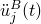 (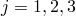), specified in orthogonal directions defined by direction cosines 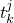 (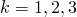), estimate the peak value over all time of the response of any variable in a finite element model that is simultaneously subjected to these multiple base motions. The peak response is first computed independently for each direction of excitation for each natural mode of the system as a function of frequency and damping. These independent responses are then combined to create an estimate of the actual peak response of any variable chosen for output, as a function of frequency and damping.

The acceleration history (base motion) is not given directly in a response spectrum analysis; it must first be converted into a spectrum.

### Specifying a spectrum

The response spectrum method is based on first finding the peak response to each base motion excitation of a one degree of freedom system that has a natural frequency equal to the frequency of interest. The single degree of freedom system is characterized by its undamped natural frequency, , and the fraction of critical damping present in the system, , at each mode . The equations of motion of the system are integrated through time to find peak values of relative displacement, relative velocity, and relative or absolute acceleration for the linear, one degree of freedom system. This process is repeated for all frequency and damping values in the range of interest. Plots of these responses are known as displacement, velocity, and acceleration spectra: 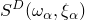, 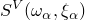, and 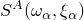. The response spectrum can be obtained directly from measured data, as described in ["Defining a spectrum using values of *S* as a function of frequency and damping](pt03ch06s03at15.md#usb-anl-aresponsespectrum-define),” below. You can also use a FORTRAN program to define a spectrum; an example of defining a spectrum from an acceleration record in this way is provided in ["Analysis of a cantilever subject to earthquake motion," Section 1.4.13 of the Abaqus Benchmarks Guide](../bmk/bmk-link.md#bmk-anl-cantilever).

Alternatively, you can create the required spectrum by specifying an amplitude (time history record), the frequency range, and the damping values for which the spectrum will be built, as described in ["Creating a spectrum from a given time history record](pt03ch06s03at15.md#usb-anl-aresponsespectrum-create),” below. The spectrum can be used in the subsequent response spectrum analysis, or it can be written to a file for future use.

For each damping value the magnitude of the response spectrum must be given over the entire range of frequencies needed, in ascending value of frequency. Abaqus/Standard interpolates linearly between the values given on a log-log scale. Outside the extremes of the frequency range given, the magnitude is assumed to be constant, corresponding to the end value given. (See ["Material data definition," Section 21.1.2](pt05ch21s01aus109.md), for an explanation of data interpolation.)

Any number of spectra can be defined, and each spectrum must be named. The response spectrum procedure allows up to three spectra to be applied simultaneously to the model in orthogonal physical directions defined by their direction cosines.

#### Defining a spectrum using values of *S* as a function of frequency and damping

You can define a spectrum by specifying values for the magnitude of the spectrum; frequency, in cycles per time, at which the magnitude is used; and associated damping, given as a ratio of critical damping.

| **Input File Usage: ** | To define the spectrum on the data lines: |
| --- | --- |
|  | ``` [*SPECTRUM](../key/key-link.md#usb-kws-mspectrum), NAME=*spectrum name* ``` Repeat this option to define multiple spectra for an analysis. |

| **Abaqus/CAE Usage: ** | To define a spectrum, do the following: |
| --- | --- |
|  | Step, Interaction, or Load module: ****Tools****Amplitude****Create****; **Name**: *spectrum name*, **Type**: **Spectrum** To apply a spectrum to the model, do the following: Step module: **Create Step**: **Linear perturbation**: **Response spectrum**: **Use response spectrum**: select spectrum name for each physical direction in which it should be applied |

##### Specifying the type of spectrum

You can indicate whether a displacement, velocity, or acceleration spectrum is given. The default is an acceleration spectrum. 

Alternatively, an acceleration spectrum can be given in *g*-units. In this case you must also specify the value of the acceleration of gravity.

| **Input File Usage: ** | Use one of the following options to define a displacement, velocity, or acceleration spectrum: |
| --- | --- |
|  | ``` [*SPECTRUM](../key/key-link.md#usb-kws-mspectrum), NAME=*name*, TYPE=DISPLACEMENT [*SPECTRUM](../key/key-link.md#usb-kws-mspectrum), NAME=*name*, TYPE=VELOCITY [*SPECTRUM](../key/key-link.md#usb-kws-mspectrum), NAME=*name*, TYPE=ACCELERATION ``` Use the following option to define an acceleration spectrum given in *g*-units: ``` [*SPECTRUM](../key/key-link.md#usb-kws-mspectrum), NAME=*name*, TYPE=G, G=*g* ``` |

| **Abaqus/CAE Usage: ** | Use one of the following options to define a displacement, velocity, or acceleration spectrum: |
| --- | --- |
|  | Step, Interaction, or Load module: ****Tools****Amplitude****Create****; **Type**: **Spectrum**; **Specification units**: **Displacement**, **Velocity**, or **Acceleration** Use the following option to define an acceleration spectrum given in *g*-units: Step, Interaction, or Load module: ****Tools****Amplitude****Create****; **Type**: **Spectrum**; **Specification units**: **Gravity**, **Gravity**: *g* |

##### Reading the data defining the spectrum from an alternate input file

The data for the spectrum can be specified in an alternate input file and read into the Abaqus/Standard input file.

| **Input File Usage: ** | ``` [*SPECTRUM](../key/key-link.md#usb-kws-mspectrum), NAME=*name*, INPUT=*file name* ``` |
| --- | --- |

| **Abaqus/CAE Usage: ** | Step, Interaction, or Load module: ****Tools****Amplitude****Create****; **Type**: **Spectrum**; click mouse button 3 while holding the cursor over the data table, and select **Read from File** |
| --- | --- |

#### Creating a spectrum from a given time history record

If you have a time history of a dynamic event (e.g., acceleration, velocity, displacement), you can build your own spectrum by specifying the record type and the amplitude name that this record represents. If the amplitude record is given with an arbitrarily changing time increment, linear interpolation will be needed for the implicit integration scheme for the dynamic equation of motion for a single degree of freedom system subjected to this record. You can specify the frequency range for the integration scheme and the frequency increment. You can build a spectrum for every fraction of critical damping indicated in the list of damping values.

| **Input File Usage: ** | ``` [*SPECTRUM](../key/key-link.md#usb-kws-mspectrum), CREATE, AMPLITUDE=*amplitude name*, NAME=*spectrum name*, TIME INCREMENT=*dt* ``` |
| --- | --- |

| **Abaqus/CAE Usage: ** | Creating a spectrum from a given time history record is not supported in Abaqus/CAE. |
| --- | --- |

##### Specifying the type of spectrum to be created

You can indicate whether a displacement, velocity, or acceleration spectrum is to be created. The default is an acceleration spectrum. 

Alternatively, an acceleration spectrum can be created in *g*-units. In this case you must also specify the value of the acceleration of gravity.

| **Input File Usage: ** | Use one of the following options to create a displacement, velocity, or acceleration spectrum: |
| --- | --- |
|  | ``` [*SPECTRUM](../key/key-link.md#usb-kws-mspectrum), CREATE, TYPE=DISPLACEMENT [*SPECTRUM](../key/key-link.md#usb-kws-mspectrum), CREATE, TYPE=VELOCITY [*SPECTRUM](../key/key-link.md#usb-kws-mspectrum), CREATE, TYPE=ACCELERATION ``` Use the following option to create an acceleration spectrum in *g*-units: ``` [*SPECTRUM](../key/key-link.md#usb-kws-mspectrum), CREATE, TYPE=G, G=*g* ``` |

| **Abaqus/CAE Usage: ** | Creating a spectrum from a given time history record is not supported in Abaqus/CAE. |
| --- | --- |

##### Specifying the record type that the time history represents

You can indicate whether a displacement, velocity, or acceleration amplitude is specified. The default is an acceleration amplitude. 

Alternatively, an acceleration amplitude can be given in *g*-units. In this case you must also specify the value of the acceleration of gravity.

| **Input File Usage: ** | Use one of the following options to indicate that the amplitude is defined in displacement, velocity, or acceleration units: |
| --- | --- |
|  | ``` [*SPECTRUM](../key/key-link.md#usb-kws-mspectrum), CREATE, EVENT TYPE=DISPLACEMENT [*SPECTRUM](../key/key-link.md#usb-kws-mspectrum), CREATE, EVENT TYPE=VELOCITY [*SPECTRUM](../key/key-link.md#usb-kws-mspectrum), CREATE, EVENT TYPE=ACCELERATION ``` Use the following option to indicate that an acceleration amplitude is given in *g*-units: ``` [*SPECTRUM](../key/key-link.md#usb-kws-mspectrum), CREATE, EVENT TYPE=G, G=*g* ``` |

| **Abaqus/CAE Usage: ** | Creating a spectrum from a given time history record is not supported in Abaqus/CAE. |
| --- | --- |

##### Creating an absolute or relative acceleration spectrum

When you create an acceleration spectrum from a given time history record, you can create an absolute or relative response spectrum. The default is an absolute spectrum.

| **Input File Usage: ** | ``` [*SPECTRUM](../key/key-link.md#usb-kws-mspectrum), CREATE, TYPE=ACCELERATION, ABSOLUTE [*SPECTRUM](../key/key-link.md#usb-kws-mspectrum), CREATE, TYPE=ACCELERATION, RELATIVE ``` |
| --- | --- |

| **Abaqus/CAE Usage: ** | Creating a spectrum from a given time history record is not supported in Abaqus/CAE. |
| --- | --- |

##### Generating the list of damping values for the fraction of critical damping

You must provide a list of damping values for the fraction of critical damping to create a spectrum. However, if the damping is evenly spaced between its lower and upper bound, you can automatically generate the list of damping values by providing the start value, end value, and increment for the fraction of critical damping.

| **Input File Usage: ** | ``` [*SPECTRUM](../key/key-link.md#usb-kws-mspectrum), CREATE, DAMPING GENERATE ``` |
| --- | --- |

| **Abaqus/CAE Usage: ** | Creating a spectrum from a given time history record is not supported in Abaqus/CAE. |
| --- | --- |

##### Writing the generated spectra to an independent file

You can write the generated spectra to an independent file. Otherwise, the generated spectra can be used only within the currently submitted job in subsequent response spectra procedures. You can inspect the generated spectra if you request that model definition data be printed to the data file (see ["Model and history definition summaries" in "Output," Section 4.1.1](pt02ch04s01aus38.md#usb-out-ooutput-modelhist-sum)).

| **Input File Usage: ** | ``` [*SPECTRUM](../key/key-link.md#usb-kws-mspectrum), CREATE, FILE=*file name* ``` |
| --- | --- |

| **Abaqus/CAE Usage: ** | Creating a spectrum from a given time history record is not supported in Abaqus/CAE. |
| --- | --- |

### Estimating the peak values of the modal responses

Since the response spectrum procedure uses modal methods to define a model's response, the value of any physical variable is defined from the amplitudes of the modal responses (the “generalized coordinates”), . The first stage in the response spectrum procedure is to estimate the peak values of these modal responses. For mode  and spectrum *k* this is

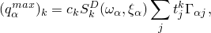

where


is the modal amplitude for mode ;


is a scaling parameter introduced as part of the response spectrum procedure definition for spectrum 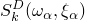;


is the user-defined value of the spectrum (see ["Specifying a spectrum](pt03ch06s03at15.md#usb-anl-aresponsespectrum-spec)”) in direction *k* interpolated, if necessary, at natural frequency  and the fraction of critical damping  in mode ;


is the *j*th direction cosine for the *k*th spectrum; and


is the participation factor for mode  in direction *j* (see ["Natural frequency extraction," Section 6.3.5](pt03ch06s03at10.md)).

Similar expressions for 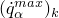 and 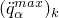 can be obtained by substituting velocity or acceleration spectra in the above equation.

### Combining the individual peak responses

The individual peak responses to the excitations in different directions will occur at different times and, therefore, must be combined into an overall peak response. Two combinations must be performed, and both introduce approximations into the results:

1. The multidirectional excitations must be combined into one overall response. This combination is controlled by the directional summation method, as described below in ["Directional summation methods](pt03ch06s03at15.md#usb-anl-aresponsespectrum-directsum)."
2. The peak modal responses must be combined to estimate the peak physical response. This combination is controlled by the modal summation method, as described below in ["Modal summation methods](pt03ch06s03at15.md#usb-anl-aresponsespectrum-modalsum)."

Depending on the type of base excitation, either modal responses or directional responses are combined first.

#### Directional summation methods

You choose the method for combining the multidirectional excitations depending on the nature of the excitations.

##### The algebraic method

If the input spectra in the different directions are components of a base excitation that is approximately in a single direction in space, then for each mode the peak responses in the different spatial directions are summed algebraically by

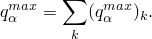

After this summation is performed, the modal responses are summed. (Choosing the method used for modal summation is described below in ["Modal summation methods](pt03ch06s03at15.md#usb-anl-aresponsespectrum-modalsum).”) Since the directional components are summed first, the subscript *k* is not relevant and can be ignored in the modal summation equations that follow.

| **Input File Usage: ** | ``` [*RESPONSE SPECTRUM](../key/key-link.md#usb-kws-hresponspec), COMP=ALGEBRAIC, SUM=*sum* ``` |
| --- | --- |

| **Abaqus/CAE Usage: ** | Step module: **Create Step**: **Linear perturbation**: **Response spectrum**: **Excitations: Single direction** or **Multiple direction absolute sum** |
| --- | --- |

##### The square root of the sum of the squares directional summation method

If the spectra in different directions represent independent excitations, the modal summation is performed first, as explained below in ["Modal summation methods](pt03ch06s03at15.md#usb-anl-aresponsespectrum-modalsum).” Then, the responses in different excitation directions are combined by 

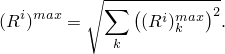

| **Input File Usage: ** | ``` [*RESPONSE SPECTRUM](../key/key-link.md#usb-kws-hresponspec), COMP=SRSS, SUM=*sum* ``` |
| --- | --- |

| **Abaqus/CAE Usage: ** | Step module: **Create Step**: **Linear perturbation**: **Response spectrum**: **Excitations: Multiple direction square root of the sum of squares** |
| --- | --- |

##### The forty-percent method

If the spectra in different directions represent independent excitations, the modal summation is performed first, as explained below in ["Modal summation methods](pt03ch06s03at15.md#usb-anl-aresponsespectrum-modalsum).” Then, the responses in different excitation directions are combined by the 40% rule recommended by the ASCE 4–98 standard for Seismic Analysis of Safety-Related Nuclear Structures and Commentary, Section 3.2.7.1.2. This method combines the response for all possible combinations of the three components, including variations in sign (plus/minus), assuming that when the maximum response from one component occurs, the response from the other two components is 40% of their maximum value, using one of the following:

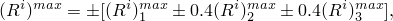

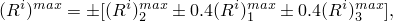

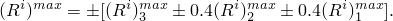

| **Input File Usage: ** | ``` [*RESPONSE SPECTRUM](../key/key-link.md#usb-kws-hresponspec), COMP=R40, SUM=*sum* ``` |
| --- | --- |

| **Abaqus/CAE Usage: ** | Step module: **Create Step**: **Linear perturbation**: **Response spectrum**: **Excitations: Multiple direction forty percent rule** |
| --- | --- |

##### The thirty-percent method

If the spectra in different directions represent independent excitations, the modal summation is performed first, as explained below in ["Modal summation methods](pt03ch06s03at15.md#usb-anl-aresponsespectrum-modalsum).” Then, the responses in different excitation directions are combined by the 30% rule recommended by the ASCE 4–98 standard for Seismic Analysis of Safety-Related Nuclear Structures and Commentary, Section 3.2.7.1.2. This method combines the response for all possible combinations of the three components, including variations in sign (plus/minus), assuming that when the maximum response from one component occurs, the response from the other two components is 30% of their maximum value, using one of the following:

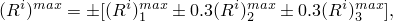


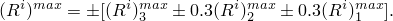

| **Input File Usage: ** | ``` [*RESPONSE SPECTRUM](../key/key-link.md#usb-kws-hresponspec), COMP=R30, SUM=*sum* ``` |
| --- | --- |

| **Abaqus/CAE Usage: ** | Step module: **Create Step**: **Linear perturbation**: **Response spectrum**: **Excitations: Multiple direction thirty percent rule** |
| --- | --- |

#### Modal summation methods

The peak response of some physical variable  (a component *i* of displacement, stress, section force, reaction force, etc.) caused by the motion in the th natural mode excited by the given response spectra in direction *k* at frequency  with damping  is given by

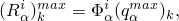

where  is the *i*th component of mode , and there is no sum on . (In the case of algebraic summation the subscript *k* is not relevant and can be ignored in this equation and in those that follow.)

There are several methods for combining these peak physical responses in the individual modes, 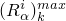, into estimates of the total peak response, 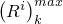. Most of the methods implemented in Abaqus/Standard follow the ASCE 4–98 standard for Seismic Analysis of Safety Related Nuclear Structures and Commentary. The updated documents, “Reevaluation of Regulatory Guidance on Modal Response Combination Methods for Seismic Response Spectrum Analysis” issued in 1999 (NUREG/CR-6645, BNL-NUREG-52276) and “Draft Regulatory Guide” (DG-1127) issued in 2005 contain new recommendations. You are advised to read the new recommendations before choosing a modal summation method from among those described below.

##### The absolute value method

The absolute value method is the most conservative method for combining the modal responses. It is obtained by summing the absolute values resulting from each mode: 

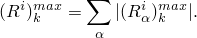

This method implies that all of the responses peak simultaneously. It will overpredict the peak response of most systems; therefore, it may be too conservative to help in design.

| **Input File Usage: ** | ``` [*RESPONSE SPECTRUM](../key/key-link.md#usb-kws-hresponspec), COMP=*comp*, SUM=ABS ``` |
| --- | --- |

| **Abaqus/CAE Usage: ** | Step module: **Create Step**: **Linear perturbation**: **Response spectrum**: **Summations: Absolute values** |
| --- | --- |

##### The square root of the sum of the squares modal summation method

The square root of the sum of the squares method is less conservative than the absolute value method. It is also usually more accurate if the natural frequencies of the system are well separated. It uses the square root of the sum of the squares to combine the modal responses: 

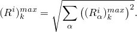

| **Input File Usage: ** | ``` [*RESPONSE SPECTRUM](../key/key-link.md#usb-kws-hresponspec), COMP=*comp*, SUM=SRSS ``` |
| --- | --- |

| **Abaqus/CAE Usage: ** | Step module: **Create Step**: **Linear perturbation**: **Response spectrum**: **Summations: Square root of the sum of squares** |
| --- | --- |

##### The Naval Research Laboratory method

The absolute value and square root of the sum of the squares methods can be combined to yield the Naval Research Laboratory method. It distinguishes the mode, , in which the physical variable has its maximum response and adds the square root of the sum of squares of the peak responses in all other modes to the absolute value of the peak response of that mode. This method gives the estimate: 

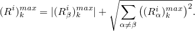

| **Input File Usage: ** | ``` [*RESPONSE SPECTRUM](../key/key-link.md#usb-kws-hresponspec), COMP=*comp*, SUM=NRL ``` |
| --- | --- |

| **Abaqus/CAE Usage: ** | Step module: **Create Step**: **Linear perturbation**: **Response spectrum**: **Summations: Naval Research Laboratory** |
| --- | --- |

##### The ten-percent method

The ten-percent method recommended by Regulatory Guide 1.92 (1976) is no longer recommended according to the “Reevaluation of Regulatory Guidance on Modal Response Combination Methods for Seismic Response Spectrum Analysis” document issued in 1999. It is retained here because of its extensive prior use. The ten-percent method modifies the square root of the sum of the squares method by adding a contribution from all pairs of modes  and  whose frequencies are within 10% of each other, giving the estimate: 

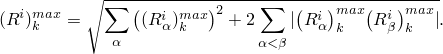

The frequencies of modes  and  are considered to be within 10% of each other whenever 


The ten-percent method reduces to the square root of the sum of the squares method if the modes are well separated with no coupling between them.

| **Input File Usage: ** | ``` [*RESPONSE SPECTRUM](../key/key-link.md#usb-kws-hresponspec), COMP=*comp*, SUM=TENP ``` |
| --- | --- |

| **Abaqus/CAE Usage: ** | Step module: **Create Step**: **Linear perturbation**: **Response spectrum**: **Summations: Ten percent** |
| --- | --- |

##### The complete quadratic combination method

Like the ten-percent method, the complete quadratic combination method improves the estimation for structures with closely spaced eigenvalues. The complete quadratic combination method combines the modal response with the formula 

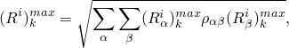

where 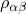 are cross-correlation coefficients between modes  and , which depend on the ratio of frequencies and modal damping between the two modes: 

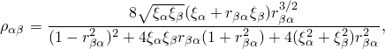

where 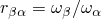.

If the modes are well spaced, their cross-correlation coefficient will be small () and the method will give the same results as the square root of the sum of the squares method.

This method is usually recommended for asymmetrical building systems since, in such cases, other methods can underestimate the response in the direction of motion and overestimate the response in the transverse direction.

| **Input File Usage: ** | ``` [*RESPONSE SPECTRUM](../key/key-link.md#usb-kws-hresponspec), COMP=*comp*, SUM=CQC ``` |
| --- | --- |

| **Abaqus/CAE Usage: ** | Step module: **Create Step**: **Linear perturbation**: **Response spectrum**: **Summations: Complete quadratic combination** |
| --- | --- |

##### The grouping method

This method, also known as the NRC grouping method, improves the response estimation for structures with closely spaced eigenvalues. The modal responses are grouped such that the lowest and highest frequency modes in a group are within 10% and no mode is in more than one group. The modal responses are summed absolutely within groups before performing a SRSS combination of the groups. Within the group responses are summed as

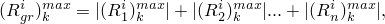

 for “n” frequencies within any “gr” group and then performing

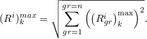

 The above expression includes all the groups; in addition, the group can consist of just one frequency response if this frequency does not have another member that is within the 10% limit. 

The ten-percent method will always produce results higher in value than the grouping method.

| **Input File Usage: ** | ``` [*RESPONSE SPECTRUM](../key/key-link.md#usb-kws-hresponspec), COMP=*comp*, SUM=GRP ``` |
| --- | --- |

| **Abaqus/CAE Usage: ** | Step module: **Create Step**: **Linear perturbation**: **Response spectrum**: **Summations: Grouping method** |
| --- | --- |

##### Double sum combination

This method, also known as Rosenblueth's double sum combination ([Rosenblueth and Elorduy, 1969](pt03ch06s03at15.md#aresponsespectrum-rosenblueth-1969)), is the first attempt to evaluate modal correlation based on random vibration theory. It utilizes the time duration  of strong earthquake motion. The mode correlation coefficients , which depend also on the frequencies and damping coefficient , lead to the following mode combination:


where

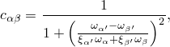

where 


| **Input File Usage: ** | ``` [*RESPONSE SPECTRUM](../key/key-link.md#usb-kws-hresponspec), COMP=*comp*, SUM=DSC ``` |
| --- | --- |

| **Abaqus/CAE Usage: ** | Step module: **Create Step**: **Linear perturbation**: **Response spectrum**: **Summations: Double sum combination** |
| --- | --- |

### Selecting the modes and specifying damping

You can select the modes to be used in modal superposition and specify damping values for all selected modes.

#### Selecting the modes

You can select modes by specifying the mode numbers individually, by requesting that Abaqus/Standard generate the mode numbers automatically, or by requesting the modes that belong to specified frequency ranges. If you do not select the modes, all modes extracted in the prior eigenfrequency extraction step, including residual modes if they were activated, are used in the modal superposition.

| **Input File Usage: ** | Use one of the following options to select the modes by specifying mode numbers: |
| --- | --- |
|  | ``` [*SELECT EIGENMODES](../key/key-link.md#usb-kws-hselecteigenmodes), DEFINITION=MODE NUMBERS [*SELECT EIGENMODES](../key/key-link.md#usb-kws-hselecteigenmodes), GENERATE, DEFINITION=MODE NUMBERS ``` Use the following option to select the modes by specifying a frequency range: ``` [*SELECT EIGENMODES](../key/key-link.md#usb-kws-hselecteigenmodes), DEFINITION=FREQUENCY RANGE ``` |

| **Abaqus/CAE Usage: ** | You cannot select the modes in Abaqus/CAE; all modes extracted are used in the modal superposition. |
| --- | --- |

#### Specifying damping

Damping is almost always specified for a mode-based procedure; see ["Material damping," Section 26.1.1](pt05ch26s01abm51.md). You can define a damping coefficient for all or some of the modes used in the response calculation. The damping coefficient can be given for a specified mode number or for a specified frequency range. When damping is defined by specifying a frequency range, the damping coefficient for an mode is interpolated linearly between the specified frequencies. The frequency range can be discontinuous; the average damping value will be applied for an eigenfrequency at a discontinuity. The damping coefficients are assumed to be constant outside the range of specified frequencies.

| **Input File Usage: ** | Use the following option to define damping by specifying mode numbers: |
| --- | --- |
|  | ``` [*MODAL DAMPING](../key/key-link.md#usb-kws-hmodaldamp), DEFINITION=MODE NUMBERS ``` Use the following option to define damping by specifying a frequency range: ``` [*MODAL DAMPING](../key/key-link.md#usb-kws-hmodaldamp), DEFINITION=FREQUENCY RANGE ``` |

| **Abaqus/CAE Usage: ** | Use the following input to define damping by specifying mode numbers: |
| --- | --- |
|  | Step module: **Create Step**: **Linear perturbation**: **Response spectrum**: **Damping**: **Specify damping over ranges of**: **Modes** Use the following input to define damping by specifying a frequency range: Step module: **Create Step**: **Linear perturbation**: **Response spectrum**: **Damping**: **Specify damping over ranges of**: **Frequencies** |

##### Example of specifying damping

[Figure 6.3.10--1](pt03ch06s03at15.md#amodaldynamics-damprules-2) illustrates how the damping coefficients at different eigenfrequencies are determined for the following input:

**Figure 6.3.10–1** Damping values specified by frequency range.


```
[*MODAL DAMPING](../key/key-link.md#usb-kws-hmodaldamp), DEFINITION=FREQUENCY RANGE


```

#### Rules for selecting modes and specifying damping coefficients

The following rules apply for selecting modes and specifying modal damping coefficients:
- No modal damping is included by default.
- Mode selection and modal damping must be specified in the same way, using either mode numbers or a frequency range.
- If you do not select any modes, all modes extracted in the prior frequency analysis, including residual modes if they were activated, will be used in the superposition.
- If you do not specify damping coefficients for modes that you have selected, zero damping values will be used for these modes.
- Damping is applied only to the modes that are selected.
- Damping coefficients for selected modes that are beyond the specified frequency range are constant and equal to the damping coefficient specified for the first or the last frequency (depending which one is closer). This is consistent with the way Abaqus interprets amplitude definitions.

### Initial conditions

It is not appropriate to specify initial conditions in a response spectrum analysis.

### Boundary conditions

All points constrained by boundary conditions and the ground nodes of connector elements are assumed to move in phase in any one direction. This base motion can use a different input spectrum in each of three orthogonal directions (two directions in a two-dimensional model). You define the input spectra, 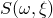, as functions of frequency, , for different values of critical damping, , as described earlier in ["Specifying a spectrum](pt03ch06s03at15.md#usb-anl-aresponsespectrum-spec).” Secondary bases cannot be used in a response spectrum analysis.

### Loads

The only “loading” that can be defined in a response spectrum analysis is that defined by the input spectra, as described earlier. No other loads can be prescribed in a response spectrum analysis.

### Predefined fields

Predefined fields, including temperature, cannot be used in response spectrum analysis.

### Material options

The density of the material must be defined (["Density," Section 21.2.1](pt05ch21s02abm01.md)). The following material properties are not active during a response spectrum analysis: plasticity and other inelastic effects, rate-dependent material properties, thermal properties, mass diffusion properties, electrical properties, and pore fluid flow properties—see ["General and linear perturbation procedures," Section 6.1.3](pt03ch06s01aus44.md).

### Elements

Other than generalized axisymmetric elements with twist, any of the stress/displacement elements in Abaqus/Standard can be used in a response spectrum analysis—see ["Choosing the appropriate element for an analysis type," Section 27.1.3](pt06ch27s01aus112.md).

### Output

All the output variables in Abaqus/Standard are listed in ["Abaqus/Standard output variable identifiers," Section 4.2.1](pt02ch04s02abv01.md). The value of an output variable such as strain, E; stress, S; or displacement, U, is its peak magnitude.

In addition to the usual output variables available, the following modal variables are available for response spectrum analysis and can be output to the data and/or results files (see ["Output to the data and results files," Section 4.1.2](pt02ch04s01aus39.md)):

| GU | Generalized displacements for all modes. |
| --- | --- |

| GV | Generalized velocities for all modes. |
| --- | --- |

| GA | Generalized accelerations for all modes. |
| --- | --- |

| SNE | Elastic strain energy for the entire model per each mode. |
| --- | --- |

| KE | Kinetic energy for the entire model per each mode. |
| --- | --- |

| T | External work for the entire model per each mode. |
| --- | --- |

Neither element energy densities (such as the elastic strain energy density, SENER) nor whole element energies (such as the total kinetic energy of an element, ELKE) are available for output in response spectrum analysis. However, whole model variables such as ALLIE (total strain energy) are available for modal-based procedures as output to the data and/or results files (see ["Output to the data and results files," Section 4.1.2](pt02ch04s01aus39.md)).

Reaction force output is not supported for response spectrum analysis using eigenmodes extracted using a SIM-based frequency extraction procedure with either the AMS or Lanczos eigensolver. Reaction force output in response spectrum analysis using eigenmodes extracted with the default Lanczos eigensolver provides directional combinations of so-called, modal reaction forces weighted with maximal absolute values of corresponding generalized displacements. Directional and modal combination rules used for the reaction force calculation are the same as for other nodal output variables.  Modal reaction forces are calculated in the frequency extraction procedure. They represent static reaction forces calculated for the normal mode shapes. Generally, they cannot adequately represent reaction force in dynamic analysis. For models with diagonal mass and diagonal damping matrices the superposition of the modal reaction forces can provide a reasonable approximation of a nodal reaction force in mode-based analyses other than response spectrum analysis. In response spectrum analysis the model response can be better represented by requesting section stresses and section forces in structural elements containing supported nodes. 

### Input file template

```
[*HEADING](../key/key-link.md#usb-kws-mheading)
…
[*BOUNDARY](../key/key-link.md#usb-kws-hboundary)
*Data lines to define points to be excited by the base motion controlled by the input spectra*
[*SPECTRUM](../key/key-link.md#usb-kws-mspectrum), NAME=*name1*, TYPE=*type*
*Data lines to define spectrum “name1” as a function of frequency, , and
fraction of critical damping, *
[*SPECTRUM](../key/key-link.md#usb-kws-mspectrum), NAME=*name2*, TYPE=*type*
*Data lines to define spectrum “name2” as a function of frequency, , and
fraction of critical damping, *
**
[*STEP](../key/key-link.md#usb-kws-hstep)
[*FREQUENCY](../key/key-link.md#usb-kws-hfrequency)
*Data line to specify number of modes to be extracted*
[*END STEP](../key/key-link.md#usb-kws-hendstep)
**
[*STEP](../key/key-link.md#usb-kws-hstep)
[*RESPONSE SPECTRUM](../key/key-link.md#usb-kws-hresponspec), COMP=*comp*, SUM=*sum*
*Data lines referring to response spectra and defining direction cosines*
[*SELECT EIGENMODES](../key/key-link.md#usb-kws-hselecteigenmodes)
*Data lines to define the applicable mode ranges*
[*MODAL DAMPING](../key/key-link.md#usb-kws-hmodaldamp)
*Data lines to define modal damping*
[*END STEP](../key/key-link.md#usb-kws-hendstep)
```

#### Additional reference

- Rosenblueth, E., and J. Elorduy, "Response of Linear Systems to Certain Transient Disturbances," Proceedings of the Fourth World Conference on Earthquake Engineering, Santiago, Chile, 1969.


