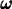
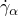
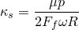
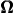
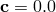
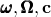

# 6.4.1 Steady-state transport analysis


**Product: **Abaqus/Standard  

##### **References**

- ["Defining an analysis," Section 6.1.2](pt03ch06s01abo05.md)
- ["Symmetric model generation," Section 10.4.1](pt04ch10s04aus63.md)
- [*STEADY STATE TRANSPORT](../key/key-link.md#usb-kws-hsteadystatetransport)
- [*SYMMETRIC MODEL GENERATION](../key/key-link.md#usb-kws-maximodelgen)
- [*MOTION](../key/key-link.md#usb-kws-hmotion)
- [*TRANSPORT VELOCITY](../key/key-link.md#usb-kws-htransportvelocity)
- [*ACOUSTIC FLOW VELOCITY](../key/key-link.md#usb-kws-hacousticflowvelocity)

### Overview

A steady-state transport analysis:
- allows for steady-state rolling and sliding solutions including frictional effects and inertia effects;
- allows for steady-state solutions to be obtained directly or by using a quasi-steady-state (pass-by-pass) technique;
- is used to model the interaction between a deformable rolling object and one or more flat, convex, or concave surfaces;
- is based on a specialized analysis capability where the rigid body motion is described in a spatial or Eulerian manner and the deformation in a material or Lagrangian manner;
- allows for one element set in a model to be described in an Eulerian manner while the rest of the elements in the model are treated in a classical Lagrangian manner;
- can be preceded by a static stress analysis or followed by a natural frequency extraction or a complex eigenvalue extraction step;
- uses regular stress/displacement elements and special steady-state rolling and sliding contact pairs;
- is currently available only for three-dimensional analysis with an axisymmetric geometry or a periodic geometry; and
- allows rate-independent, rate-dependent, or history-dependent material behavior.

### Steady-state transport analysis

It is cumbersome to model rolling and sliding contact, such as a tire rolling along a rigid surface or a disc rotating relative to a brake assembly, using a traditional Lagrangian formulation since the frame of reference in which motion is described is attached to the material. An observer in this reference frame views even steady-state rolling as a time-dependent process since each point undergoes a repeated history of deformation. Such an analysis is computationally expensive since a transient analysis must be performed and fine meshing is required along the entire surface of the cylinder.

The steady-state transport analysis capability in Abaqus/Standard uses a reference frame that is attached to the axle of the rotating cylinder. An observer in this frame sees the cylinder as points that are not moving, although the material of which the cylinder is made is moving through those points. This removes the explicit time dependence from the problem—the observer sees a fixed point anywhere, with material moving through it. Thus, the finite element mesh describing the cylinder in this frame of reference does not undergo the large rigid body spinning motion. This means that a fine mesh is required only near the contact zone.

This description can be viewed as a mixed Lagrangian/Eulerian method, where rigid body rotation is described in a spatial or Eulerian manner, and deformation, which is now measured relative to the rotating rigid body, is described in a material or Lagrangian manner. It is this kinematic description that converts the steady-state moving contact problem into a purely spatially dependent simulation.

The steady-state rolling and sliding analysis capability provides solutions that include frictional effects, inertia effects, and material convection for most rate-independent, rate-dependent, and history-dependent material models.

The theory is described in detail in ["Steady-state transport analysis," Section 2.7.1 of the Abaqus Theory Guide](../stm/stm-link.md#stm-anl-steadystatetransport).

| **Input File Usage: ** | ``` [*STEADY STATE TRANSPORT](../key/key-link.md#usb-kws-hsteadystatetransport) ``` |
| --- | --- |

#### Pass-by-pass analysis technique

By default, the steady-state transport analysis procedure in Abaqus/Standard solves for a steady-state rolling and sliding solution directly as a series of increments, with iterations to obtain equilibrium within each increment. The solution in each increment is a steady-state solution corresponding to the loads acting on the structure at that instant. The steady-state transport analysis procedure also provides an alternative technique to obtain a quasi-steady-state rolling and sliding solution as a series of increments, with iterations to obtain equilibrium within each increment. However, the solution in each increment is usually not a steady-state solution corresponding to the loads acting on the structure at that instant. A steady-state solution is generally obtained in several increments, with each increment corresponding to a loading pass through the structure. Each loading pass through the structure can have a different magnitude.

The pass-by-pass analysis technique is relevant only when used with plasticity/creep models. It has no effect on a viscoelastic material model.

| **Input File Usage: ** | ``` [*STEADY STATE TRANSPORT](../key/key-link.md#usb-kws-hsteadystatetransport), PASS BY PASS ``` |
| --- | --- |

#### Unstable problems

Local instabilities (e.g., surface wrinkling, material instability, or local buckling), can occur in a steady-state transport analysis. Abaqus/Standard offers the option to stabilize this class of problems by applying damping throughout the model in such a way that the viscous forces introduced are sufficiently large to prevent instantaneous buckling or collapse but small enough not to affect the behavior significantly while the problem is stable. The available automatic stabilization schemes are described in detail in ["Automatic stabilization of unstable problems" in "Solving nonlinear problems," Section 7.1.1](pt03ch07s01aus49.md#usb-anl-anonlineareqns-stabilize-over).

### Defining the model

A steady-state transport analysis requires the definition of streamlines. The streamlines are the trajectories that the material follows during transport through the mesh. To meet this requirement, the mesh must be generated using the symmetric model generation capability, which is described in detail in ["Symmetric model generation," Section 10.4.1](pt04ch10s04aus63.md). The three-dimensional model can be created either by revolving an axisymmetric model about its axis of revolution or by revolving a single three-dimensional repetitive sector about its axis of symmetry.

#### Revolving an axisymmetric cross-section to create a three-dimensional model

You can generate a three-dimensional mesh by revolving a two-dimensional cross-section about a symmetry axis, so that the streamlines follow the mesh lines. In this case the symmetric model generation capability requires a two-dimensional cross-section of the body as a starting point. The cross-section, which must be discretized with axisymmetric finite elements, is defined in a separate input file. A data check analysis must be performed to write the model information to a restart file. The restart file is read in a subsequent run, and a three-dimensional model is generated by Abaqus/Standard by revolving the cross-section about the symmetry axis, starting at a reference plane. Both the symmetry axis and reference plane of the new three-dimensional model can be oriented in any direction in the global coordinate system. The symmetry axis also defines the axis of the spinning body. A nonuniform discretization in the circumferential direction can be specified to allow a finer mesh in the contact region than elsewhere in the model.

| **Input File Usage: ** | ``` [*SYMMETRIC MODEL GENERATION](../key/key-link.md#usb-kws-maximodelgen), REVOLVE ``` |
| --- | --- |

#### Revolving a single three-dimensional sector to create a periodic model

Alternatively, you can generate a periodic three-dimensional mesh by revolving a single three-dimensional sector about its axis of symmetry. To accurately account for the material convection when the streamline integration is performed, the segment angle for the repetitive three-dimensional sector must be chosen small enough. 

In this case the symmetric model generation capability requires a single three-dimensional sector as a starting point. The original three-dimensional sector is defined in a separate input file. A data check analysis must be performed to write the model information to a restart file. The restart file is read in a subsequent run, and a three-dimensional periodic model is generated by Abaqus/Standard by revolving the original three-dimensional sector about the symmetry axis. Both the symmetry axis and the original three-dimensional repetitive sector can be oriented in any direction in the global coordinate system. The symmetry axis also defines the axis of the spinning body. There is no restriction that the meshes on the two symmetry surfaces of the repetitive sector match in any way. If the surface meshes on either side of the original sector are not matched completely, constraints will be generated automatically to couple the opposing neighboring surfaces when revolving the original sector to create a periodic model.

| **Input File Usage: ** | ``` [*SYMMETRIC MODEL GENERATION](../key/key-link.md#usb-kws-maximodelgen), PERIODIC ``` |
| --- | --- |

#### Identifying the elements being treated in an Eulerian manner

By default, the rigid body motion in the whole model will be described in a spatial or Eulerian manner. In some cases you may want only part of the model to be treated with the Eulerian method while the rest should be treated with the classical Lagrangian method. One typical example is a disc brake where the disc itself can be treated with the Eulerian method while the brake assembly (brake pads and caliper) is treated with the Lagrangian method. In this case you can specify the name of an element set for which the rigid body motion will be described in an Eulerian manner. The elements that are not included in the element set will be treated with the classical Lagrangian method. Only one Eulerian element set can be specified in the whole model. In a new steady-state transport step or upon restart (see ["Restarting an analysis," Section 9.1.1](pt04ch09s01aus53.md)) you can respecify a set of elements to be treated with the Eulerian method even after it has previously been treated with the Lagrangian method and vice versa. Elements treated with the Eulerian method and elements treated with the Lagrangian method cannot be mixed along a streamline.

| **Input File Usage: ** | ``` [*STEADY STATE TRANSPORT](../key/key-link.md#usb-kws-hsteadystatetransport), ELSET=*name* ``` |
| --- | --- |

### Defining reference frame motions

The deformable and rigid bodies can each be defined in their own moving reference frame in a steady-state rolling and sliding analysis. The motion of these reference frames can be defined quite generally and provides modeling of a spinning deformable body traveling along a straight line, or “cornering” or “precessing” around an axis such as shown in [Figure 6.4.1--1](pt03ch06s04at17.md#sstrefframemotion). It is also possible to define reference frame motions for rigid bodies, including translations and rotations. The rigid body can be flat, convex, or concave, which allows for modeling of a deformable body in contact with a rotating drum, such as a tire rolling on a drum, or for modeling a tire mounted on a rigid rim.

**Figure 6.4.1–1** Constant cornering example showing conventions for defining reference frame motions.


When defining different reference frame motions for bodies that interact, you must make sure that the interactions are indeed steady. For example, for a planar rigid surface the relative reference frame motion must be tangential to the rigid surface, and for a body of revolution the relative reference frame motion must be rotation around its axis. Convergence difficulties will persist if the interactions are not steady.

#### Spinning motion

The spinning motion of the deformable body around its own axis is described by a user-specified angular velocity,  (see [Figure 6.4.1--1](pt03ch06s04at17.md#sstrefframemotion)). This angular velocity defines the transport of material through the mesh; you define the magnitude of the spinning rotation, . The axis of revolution is the symmetry axis used for generating the mesh as described in ["Defining the model](pt03ch06s04at17.md#usb-anl-asteadystatetransport-define).” The transport velocity must be defined for all nodes on the spinning body. The magnitude of the angular velocity can also be defined with user subroutine [`UMOTION`](../sub/sub-link.md#sub-xsl-umotion).

The transport velocity can also be applied to a rigid body based on a three-dimensional surface of revolution. In that case the velocity is applied to the rigid body reference node to describe the transport of the (rigid) material relative to the reference node. Abaqus/Standard assumes that the rigid body spins around the axis of revolution of the rigid body. This option can, for example, be applied to the rigid body representing the rim on which a tire is mounted.

Abaqus/Standard will automatically update the position and orientation of the rotation axis to the current configuration in a large-displacement analysis, such as in the case where a prescribed load applied to the reference node of a rotating rigid drum maintains the contact pressure between the tire and drum or the case where a camber angle is applied to the axle of the deformable body.

| **Input File Usage: ** | Use either of the following options: |
| --- | --- |
|  | ``` [*TRANSPORT VELOCITY](../key/key-link.md#usb-kws-htransportvelocity) [*TRANSPORT VELOCITY](../key/key-link.md#usb-kws-htransportvelocity), USER ``` |

#### Defining a reference frame for translational or rotational motion

The rotating deformable body is also associated with a reference frame. This reference frame can either translate or rotate with respect to the fixed global reference frame. Similarly, each rigid body must be defined in a reference frame that is either fixed, translates, or rotates. For example, to associate straight line travel at ground velocity, , with a spinning deformable body, the deformable body can be defined in a reference frame translating at velocity  and the rigid surface can be defined in a fixed reference frame. Alternatively, the deformable body can be defined in a reference frame that does not translate and the rigid body can be defined in a frame translating at velocity . Another example is a deformable body precessing along a circular path such as shown in [Figure 6.4.1--1](pt03ch06s04at17.md#sstrefframemotion). In such a case a rotating frame is associated with the deformable body that defines the precession axis and angular velocity, while the rigid body is defined in a fixed reference frame. All components of the reference frame motion are zero unless otherwise specified; components of the reference frame motion cannot be treated as unknowns to be determined by the simulation.

You can apply a specified motion of the reference frame to all nodes of the deformable body or to the reference node of a rigid body. A translating reference frame is defined by specifying the components of the velocity vector, . A rotating reference frame is defined by specifying the magnitude of an angular rotation velocity, , and the position and orientation of the axis of rotation in the current configuration. The position and orientation of the axis are applied at the beginning of the step and remain fixed during the step. 

| **Input File Usage: ** | Use the following option to define the motion of a translating reference frame: |
| --- | --- |
|  | ``` [*MOTION](../key/key-link.md#usb-kws-hmotion), TRANSLATION ``` Use the following option to define the motion of a rotating reference frame: ``` [*MOTION](../key/key-link.md#usb-kws-hmotion), ROTATION ``` |

### Contact conditions

Abaqus/Standard provides contact between a rigid surface and deformable body moving with different velocities, such as contact between a rolling tire and the ground, as well as contact between surfaces moving with the same velocity, such as the contact between the bead and rim in a tire analysis. Abaqus/Standard also provides contact between two deformable bodies moving with the same velocity, such as the contact between the tread blocks on a tire surface, as well as contact between two deformable bodies moving with different velocities, such as the contact between a disc and brake assembly.

#### Contact between a rigid surface and a deformable body moving with different velocities

The rigid surface can be either an analytical surface or made from rigid elements. When the master and slave surfaces move with different velocities, you will normally select to use a Coulomb friction law that assumes that slip occurs if the frictional stress


is equal to the critical stress , where  and  are the shear stresses on the contact plane,  is the friction coefficient, and *p* is the contact pressure. No slip occurs when . For steady-state transport the condition of no slip is approximated in Abaqus/Standard by stiff “viscous” behavior 


where  are the tangential slip velocities that depend on deformation along a streamline and



is the “stick viscosity,” *R* is the radius of the cylinder, and  is a user-defined slip tolerance for which the default is 0.005. Using a larger slip tolerance makes convergence of the solution more rapid at the expense of solution accuracy. Using a smaller slip tolerance imposes the “no relative motion” constraint more accurately but may slow convergence. The default value provides a conservative balance between efficiency and accuracy for rolling contact problems.

Since this frictional model used for steady-state rolling is different from the frictional models used with other analysis procedures in Abaqus/Standard, discontinuities may arise in the solutions between a steady-state transport analysis and any other analysis procedure, such as a static footprint analysis. To ensure a smooth transition in the solution, it is recommended that all analysis steps prior to a steady-state rolling analysis use a zero coefficient of friction. You can then modify the friction properties in the steady-state transport analysis step to use the desired friction coefficient (see ["Changing friction properties during an Abaqus/Standard analysis" in "Frictional behavior," Section 37.1.5](pt09ch37s01aus169.md#usb-cni-afriction-change-std)).

This frictional model is more relevant in a tire analysis since the velocity of the rotating tire strongly depends on the deformation gradients along a streamline on the contact surface. The solution state at a material point depends on the solution of neighboring points, and convective effects must be considered. However, since the deformation gradients along a streamline on the contact surface are small in a disc brake analysis, a simplified frictional model, which ignores the convective effect on the contact surface, can be used. Such a frictional model is discussed in the following section.

#### Contact between two deformable bodies moving with different velocities

When the slave and master surfaces rotate with different velocities, such as contact between a disc and brake assembly, slip will develop between the two deformable surfaces. The transport velocity (["Spinning motion](pt03ch06s04at17.md#usb-anl-asteadystatetransport-spin)”) and the motion of a reference frame (["Defining a reference frame for translational or rotational motion](pt03ch06s04at17.md#usb-anl-asteadystatetransport-ref-frame)”) can be defined in a steady-state transport analysis procedure to model the steady-state frictional sliding between two deformable bodies that are moving with different velocities. In this case it is assumed that the slip rate simply follows from the difference in velocities specified by the transport velocity and the motion of the reference frame and is independent of the deformation gradient along a streamline or the nodal displacements on the contact surface. No convective effects are considered between the contact surfaces, and the frictional stress does not depend on any history effects. Hence, the frictional stress is given by


where  is the friction coefficient, *p* is the contact pressure,  are the local tangent directions, and  are the slip velocities that are defined by the transport velocity and the motion of the reference frame. If no velocity or the same velocity are defined at contact nodes with friction, sticking conditions are applied automatically. The friction model is described in detail in ["Coulomb friction," Section 5.2.3 of the Abaqus Theory Guide](../stm/stm-link.md#stm-ifc-coulombfric).

Such a simplified frictional model is relevant only in a disc brake analysis. It should be used with care in a rolling tire analysis where deformation gradients on the contact surface are significant.

Since this frictional behavior is different from the frictional models used with other analysis procedures in Abaqus/Standard, discontinuities may arise in the solutions between a steady-state transport analysis and any other analysis procedure. An example is the discontinuity that occurs between the initial preloading of the disc pads in a disc brake system and the subsequent braking analysis where the disc spins with a prescribed rotation. To ensure a smooth transition in the solution, it is recommended that all analysis steps prior to a steady-state analysis use a zero coefficient of friction (see ["Including friction properties in a contact property definition" in "Frictional behavior," Section 37.1.5](pt09ch37s01aus169.md#usb-cni-afriction-define)). You can then increase the friction coefficient to the desired value in the steady-state transport analysis (see ["Changing friction properties during an Abaqus/Standard analysis" in "Frictional behavior," Section 37.1.5](pt09ch37s01aus169.md#usb-cni-afriction-change-std)).

#### Contact between surfaces spinning with the same angular velocity

When the slave and master surfaces rotate with the same angular velocity, such as the surface between the bead and rim in a tire analysis, no relative velocity develops between the surfaces. In such a case, frictional stresses develop as a reaction between the bodies. Abaqus/Standard will automatically determine that the slave and master surface rotate with the same speed and apply the standard Coulomb friction model, which is described in detail in ["Frictional behavior," Section 37.1.5](pt09ch37s01aus169.md).

When the standard Coulomb friction model is used in a reference frame that implies flow of material through the mesh, convective effects must be considered. However, Abaqus/Standard assumes that no convective effects are present between surfaces during steady-state transport analysis. In other words, Abaqus/Standard assumes that the frictional stress at a point depends on the history of deformation in the Lagrangian reference frame and ignores any history effects that may occur as a result of the deformation that the point experiences during the spinning motion. The assumption that the frictional stress does not depend on history effects during rolling is valid for modeling contact between a tire bead and rim where relative slip occurs only during rim mounting in a static analysis prior to the steady-state transport analysis. When slip occurs during the steady-state transport analysis, the solution obtained is no longer the correct steady-state solution because convective effects are ignored. To ensure that no slip takes place between the surfaces during steady-state rolling, it is recommended that you modify the friction properties in the steady-state transport analysis step to activate rough friction (see ["Changing friction properties during an Abaqus/Standard analysis" in "Frictional behavior," Section 37.1.5](pt09ch37s01aus169.md#usb-cni-afriction-change-std)).

### Incrementation

Abaqus/Standard uses Newton's method to solve the nonlinear equilibrium equations. The nonlinearities in a steady-state transport analysis arise from large-displacement effects, material nonlinearity, and boundary nonlinearities such as contact and friction. If geometrically nonlinear behavior is expected other than the large rigid body rotation associated with the steady-state motion, the step definition should include nonlinear geometric effects.

The steady-state rolling and sliding solution must often be obtained as a series of increments, with iterations to obtain equilibrium within each increment. If the direct steady-state solution technique is used, the solution in each increment is a steady-state solution corresponding to the loads acting on the structure at that instant. If the pass-by-pass steady-state solution technique is used, the solution in each increment is usually not a steady-state solution corresponding to the loads acting on the structure at that instant. In this case a steady-state solution is generally obtained in several increments, with each increment corresponding to a loading pass through the structure.

Since Newton's method has a finite radius of convergence, too large an increment in the applied load can prevent any solution from being obtained because the current steady-state solution is too far away from the new steady-state equilibrium solution that is being sought: it is outside the radius of convergence. Thus, there is an algorithmic restriction on the increment size.

#### Automatic incrementation

In most cases the default automatic incrementation scheme is preferred because it will select increment sizes based on computational efficiency.

| **Input File Usage: ** | ``` [*STEADY STATE TRANSPORT](../key/key-link.md#usb-kws-hsteadystatetransport) ``` |
| --- | --- |

#### Direct incrementation

Direct user control of the increment size is also provided because if you have considerable experience with a particular problem, you may be able to select a more economical approach.

| **Input File Usage: ** | ``` [*STEADY STATE TRANSPORT](../key/key-link.md#usb-kws-hsteadystatetransport), DIRECT ``` |
| --- | --- |

##### Using the maximum number of iterations to determine the increment size

The solution to an increment can be accepted after the maximum number of iterations allowed has been completed (as defined in ["Commonly used control parameters," Section 7.2.2](pt03ch07s02aus50.md)), even if the equilibrium tolerances are not satisfied. This approach is not recommended; it should be used only in special cases when you have a thorough understanding of how to interpret results obtained in this way. Very small increments and a minimum of two iterations are usually necessary in this case.

| **Input File Usage: ** | ``` [*STEADY STATE TRANSPORT](../key/key-link.md#usb-kws-hsteadystatetransport), DIRECT=NO STOP ``` |
| --- | --- |

### Convergence in a steady-state transport analysis

The steady-state transport procedure may experience convergence difficulties in certain situations that are described below.

#### Convergence issues with friction

The frictional forces that develop on the contact surface as a result of steady-state rolling are functions of the spinning angular velocity, , and the traveling straight line velocity, , or cornering velocity, . When these frictional forces are large, convergence of Newton's method becomes difficult. Convergence problems in Abaqus/Standard are usually resolved by taking a smaller load increment. However, contact forces due to steady-state rolling usually do not reduce when the magnitudes of the velocities are reduced. For example, if a spinning object is prevented from moving (), full slipping conditions will develop over the entire contact zone for all values of spinning angular velocity . Consequently, the frictional force remains constant for all  (provided that the normal force remains constant), so that smaller increments in the velocities () do not reduce the magnitude of the frictional forces and, hence, do not overcome convergence difficulties.

To provide for convergence through the use of smaller increments in such cases, the friction coefficient can be increased from zero to the desired value over the analysis step. This is accomplished by setting the initial friction coefficient for the model to zero (see ["Including friction properties in a contact property definition" in "Frictional behavior," Section 37.1.5](pt09ch37s01aus169.md#usb-cni-afriction-define)), then increasing the friction coefficient to its final value in the steady-state transport analysis step (see ["Changing friction properties during an Abaqus/Standard analysis" in "Frictional behavior," Section 37.1.5](pt09ch37s01aus169.md#usb-cni-afriction-change-std)).

#### Convergence issues with the Mullins effect material model

If the Mullins effect material model is included in the material definition (see ["Mullins effect," Section 22.6.1](pt05ch22s06abm10.md)), there could be a strong discontinuity in the response of a structure in transitioning from a static (non-rolling) state to a steady-state rolling state. This discontinuity is due to the damage that occurs during the transient response (such as the damage that occurs as the structure undergoes its first revolution after static preloading). Since the transient response is not modeled during a steady-state transport analysis, the resulting discontinuity in the response can lead to convergence problems. The damage associated with the Mullins effect is independent of the angular speed of rotation: as a result, time increment cutbacks do not resolve the convergence problems. The Mullins effect can be ramped up over the time period of the step in these situations to obtain a converged solution. In such a case the change in response due to damage is applied gradually over the step. The solution at the end of the step corresponds to the fully damaged material; solutions during the step correspond to a partially damaged material and are, therefore, physically meaningless. Thus, it is recommended that in going from a static to a steady-state rolling solution, a do-nothing step at a low angular speed of rotation be first carried out with the Mullins effect ramped on. This facilitates resolution of the discontinuity in a gradual manner. The do-nothing step can then be followed by the regular steady-state transport step with the Mullins effect applied instantaneously at the beginning of the step. This approach is illustrated in ["Analysis of a solid disc with Mullins effect and permanent set," Section 3.1.7 of the Abaqus Example Problems Guide](../exa/exa-link.md#exa-veh-mullinstire).

| **Input File Usage: ** | ``` [*STEADY STATE TRANSPORT](../key/key-link.md#usb-kws-hsteadystatetransport), MULLINS=RAMP *or* STEP (default) ``` |
| --- | --- |

#### Convergence issues with streamline integration in plasticity/creep models

Although in principle any material point along a streamline can be used as a starting point for the streamline integration when material convective calculations are performed, Abaqus/Standard always uses the material points in the original sector or the material points in the original cross-section as starting points for the streamline integration in a model with periodic geometry or axisymmetric geometry, respectively.

If the pass-by-pass solution technique is used, after an increment has been performed for all the streamlines, Abaqus/Standard will automatically use the state obtained at the end of the streamline as the starting state for the streamline integration in the subsequent increment. This iterative process is repeated for each increment until a steady-state solution is reached.

If the direct steady-state solution technique is used, several local iterations are usually required for each streamline, with a local iteration corresponding to an integration over a closed loop streamline. After a local iteration has been performed for a streamline, Abaqus/Standard will check to see if the steady-state condition is satisfied for the streamline. This is best measured by ensuring the differences between the stresses/strains at the starting point of the streamline obtained before and after the iteration are sufficiently small. If the steady-state condition is not satisfied for the streamline, Abaqus/Standard will automatically use the state obtained at the end of the previous local iteration as the starting state for the streamline integration in the subsequent local iteration. This iterative process is repeated until a steady-state solution is reached for all the streamlines.

 To improve the rate of convergence, it is recommended that you apply loads on elements or nodes away from the starting points of the streamlines.

#### Convergence issues with unconstrained mesh motion

Unconstrained rigid body modes of the mesh motion will cause convergence problems for a steady-state transport analysis, similar to convergence problems for unconstrained rigid body modes in a static analysis. Friction cannot be relied on to restrict rigid body modes in a steady-state transport analysis, because frictional stresses depend on relative material velocities rather than relative nodal displacements for steady-state transport. Restricting the (steady-state) material velocity does not restrict nodal displacements for steady-state transport analyses. The material velocity includes effects of material flowing through the mesh and is governed by the spinning motion (see ["Spinning motion](pt03ch06s04at17.md#usb-anl-asteadystatetransport-spin)”), reference frame motions (see ["Defining a reference frame for translational or rotational motion](pt03ch06s04at17.md#usb-anl-asteadystatetransport-ref-frame)”), and nodal positions relative to the spinning axis.

Consider the examples shown in [Figure 6.4.1--2](pt03ch06s04at17.md#steady-state-transport-bc-cload). End-on views are shown in [Figure 6.4.1--2](pt03ch06s04at17.md#steady-state-transport-bc-cload), so the axial direction (spinning axis) is horizontal in this figure. The axial component of the reference frame motion is zero for all three of these cases (either by explicit specification or implicitly by default). Since the material velocity in the axial direction at steady state is zero for both bodies (according to the reference frame motion), the frictional force in the axial direction will remain zero for all three of these cases, which may not be intuitive. The first case shown in [Figure 6.4.1--2](pt03ch06s04at17.md#steady-state-transport-bc-cload) (a) involves a planar interface and a boundary condition in the axial direction. At the time the rolling body reaches steady state, the axial motion has stopped, the axial friction force is zero, and the reaction force associated with the boundary condition is zero (which also may not be intuitive).

The second case  in [Figure 6.4.1--2](pt03ch06s04at17.md#steady-state-transport-bc-cload) (b) has a planar interface and an applied force in the axial direction. The axial frictional force for the steady-state solution remains zero, as already discussed, so no axial force arises to counter the applied force. Therefore, Abaqus/Standard will not provide a converged solution in this case, which is an example of unconstrained rigid body mesh motion. The third case shown in [Figure 6.4.1--2](pt03ch06s04at17.md#steady-state-transport-bc-cload) (c) is like the second case, except a “curb” has been added to the rigid surface. In this case, a contact force in the normal direction occurs at the location of the “curb,” which counters the applied force, so the analysis is able to converge.

**Figure 6.4.1–2** Displacement boundary condition versus concentrated force.


As a real world example, consider a car traveling along a straight planar road with a truck moving parallel to the car, applying a constant concentrated force that pushes the car sideways. With zero toe angle on the car’s front wheels (that is, the wheels are exactly aligned with the longitudinal axis of the car), steady-state motion is impossible, and the car will eventually slip off the road. To resist the push in steady-state motion, the car wheels need to be aligned with the proper toe angle.

### Initial conditions

Initial values of stresses, temperatures, field variables, solution-dependent state variables, etc. can be specified. ["Initial conditions in Abaqus/Standard and Abaqus/Explicit," Section 34.2.1](pt07ch34s02aus116.md), describes all of the available initial conditions.

### Boundary conditions

Boundary conditions can be applied to any of the displacement or rotation degrees of freedom (1–6). (See ["Boundary conditions in Abaqus/Standard and Abaqus/Explicit," Section 34.3.1](pt07ch34s03aus118.md), for details of applying boundary conditions to rotation degrees of freedom when large rotation will occur.) During the analysis prescribed boundary conditions can be varied using an amplitude definition (see ["Amplitude curves," Section 34.1.2](pt07ch34s01aus115.md)). Boundary conditions restrict the mesh motion but do not restrict the transport of material through the mesh (due to the spinning motion discussed in ["Spinning motion](pt03ch06s04at17.md#usb-anl-asteadystatetransport-spin)”).

### Loads

Loading in a steady-state transport analysis includes the motion of the structure, inertia (d'Alembert) forces due to motion, concentrated loads, distributed pressures, and body forces.

#### Inertia effects

The motion of the deformable body gives rise to inertia (d'Alembert) forces that can be included. These forces include centrifugal and Coriolis effects.

The density of the material must be defined in the material description. At higher rotational velocities, inertia forces can give rise to instabilities in the form of standing waves, which are likely to prevent convergence of the Newton algorithm.

| **Input File Usage: ** | Use the following option to include inertia forces: |
| --- | --- |
|  | ``` [*STEADY STATE TRANSPORT](../key/key-link.md#usb-kws-hsteadystatetransport), INERTIA=YES ``` |

##### Inertia loads for tetrahedral elements

Inertia loads for tetrahedral elements C3D4, C3D10, C3D10I, and C3D10M are not taken into account in a steady-state transport analysis. Tetrahedral elements will appear only in a periodic model created by revolving a three-dimensional sector that contains tetrahedral elements. Tetrahedral elements will not appear in an axisymmetric model created by revolving a two-dimensional cross-section about a symmetry axis. See ["Symmetric model generation," Section 10.4.1](pt04ch10s04aus63.md), for details.

#### Other prescribed loads

The following loads can be prescribed in a steady-state transport analysis, as described in ["Concentrated loads," Section 34.4.2](pt07ch34s04aus121.md): 
- Concentrated nodal forces can be applied to the displacement degrees of freedom (1--6).
- Distributed pressure forces or body forces can be applied; the distributed load types available with particular elements are described in [Part VI, "Elements](pt06.md)."

In most cases such loads should be applied around the whole circumference of the body; a load on a single point or element corresponds to a spatially fixed load, which in most cases is not realistic.

### Predefined fields

The following predefined fields can be specified in a steady-state transport analysis, as described in ["Predefined fields," Section 34.6.1](pt07ch34s06aus128.md): 
- Although temperature is not a degree of freedom in a steady-state transport analysis, nodal temperatures can be specified as a predefined field. Any difference between the applied and initial temperatures will cause thermal strain if a thermal expansion coefficient is given for the material (["Thermal expansion," Section 26.1.2](pt05ch26s01abm52.md)). The specified temperature also affects temperature-dependent material properties, if any.
- The values of user-defined field variables can be specified. These values only affect field-variable-dependent material properties, if any.

### Material options

Since the steady-state transport capability uses a kinematic description that implies flow of material through the mesh, convective effects must be considered for the material response. Most material models that describe mechanical behavior (including user-defined materials) are available for use in a steady-state transport analysis. In particular, history-dependent viscoelasticity (["Time domain viscoelasticity," Section 22.7.1](pt05ch22s07abm12.md)), history-dependent Mullins effect (["Mullins effect," Section 22.6.1](pt05ch22s06abm10.md)), classical metal plasticity (["Classical metal plasticity," Section 23.2.1](pt05ch23s02abm17.md)), rate-dependent yield (["Rate-dependent yield," Section 23.2.3](pt05ch23s02abm19.md)), rate-dependent creep (["Rate-dependent plasticity: creep and swelling," Section 23.2.4](pt05ch23s02abm20.md)), and two-layer viscoplasticity (["Two-layer viscoplasticity," Section 23.2.11](pt05ch23s02abm27.md)) can all be used during a steady-state transport analysis.

The following material properties are not active during a steady-state transport analysis: thermal properties (except for thermal expansion), mass diffusion properties, electrical properties, and pore fluid flow properties.

Abaqus/Standard also provides the ability to obtain the fully relaxed long-term elastic or elastic-plastic solution during a steady-state transport analysis if the material description includes viscoelastic or viscoplastic material properties. If the material description includes viscoelastic material properties, the long-term solution will ignore the material convection calculations. If the two-layer viscoplastic material model is used, the long-term solution will include only the material convection calculations based on the long-term response of the elastic-plastic network.

| **Input File Usage: ** | ``` [*STEADY STATE TRANSPORT](../key/key-link.md#usb-kws-hsteadystatetransport), LONG TERM ``` |
| --- | --- |

#### Choosing an appropriate material model

Since material points in a spinning and sliding body undergo repeated loading/unloading cycles, an appropriate material model must be chosen to characterize the response correctly under such loading conditions. The use of plasticity material models with isotropic type hardening is generally not recommended since they will continue to harden during cyclic loading, which may lead to a large number of iterations until the steady-state solution is reached. Kinematic hardening plasticity models should be used to model the inelastic behavior of materials that are subjected to repeated loading. 

For rate-dependent creep, the two-layer viscoplasticity model is recommended (["Two-layer viscoplasticity," Section 23.2.11](pt05ch23s02abm27.md)) for modeling the response of materials with significant time-dependent behavior as well as plasticity at elevated temperatures.

 For history-dependent viscoelasticity, it is more appropriate to use cyclic (frequency domain) test data to calibrate the time-domain viscoelastic material model for steady-state transport analysis. The cyclic experiments should be performed in the frequency range anticipated in the rolling simulation. Abaqus/Standard internally converts the frequency domain storage and loss modulus data into a time-domain (Prony series) representation. This data conversion capability is described in detail in ["Time domain viscoelasticity," Section 22.7.1](pt05ch22s07abm12.md).

#### Analysis steps prior to a steady-state transport analysis

It is recommended that the solutions in any analysis step prior to a steady-state transport analysis, such as a static footprint or preloading solution, be based on the long-term elastic moduli or the long-term elastic-plastic response if viscoelastic or viscoplastic material properties are used (for example, see ["Static stress analysis," Section 6.2.2](pt03ch06s02at01.md)). The long-term solution provides a smooth transition between a static analysis and a slow rolling or sliding steady-state transport analysis.

#### Material convection in nonlinear analysis

When material convection is included in the steady-state transport solution, Abaqus/Standard uses an approximate Jacobian matrix in the Newton solution of the nonlinear equilibrium equations. The rate of convergence in such a case is no longer quadratic but depends strongly on the severity of the nonlinearities. It is often necessary to adjust the default solution controls (["Commonly used control parameters," Section 7.2.2](pt03ch07s02aus50.md)) to obtain a steady-state transport solution when material convection is considered.

### Elements

Most of the three-dimensional stress/displacement elements in Abaqus/Standard can be used in a steady-state transport analysis (see ["Choosing the appropriate element for an analysis type," Section 27.1.3](pt06ch27s01aus112.md)). When the three-dimensional model is generated from an axisymmetric cross-section, the element type used in the two-dimensional model determines the element type in the three-dimensional model. The correspondence between the two-dimensional and three-dimensional element types is described in ["Symmetric model generation," Section 10.4.1](pt04ch10s04aus63.md). If the three-dimensional periodic model is generated from a single three-dimensional sector, any of the stress/displacement elements in Abaqus/Standard can be used.

### Output

The element output available for a steady-state transport analysis includes stress, strain, energies, and the values of state, field, and user-defined variables. The nodal output available includes displacements, velocities, reaction forces, and coordinates. The contact output variable CSLIP contains steady-state slip rates for the steady-state transport procedure, unlike the usual definition of this variable. All of the output variable identifiers are outlined in ["Abaqus/Standard output variable identifiers," Section 4.2.1](pt02ch04s02abv01.md).

### Limitations

The steady-state transport analysis capability has several limitations.
- The deformable structure must be a full 360 cylindrical body of revolution. Convective boundary conditions are not available to model segments of a cylinder.
- The capability is not available in two dimensions.
- Only one deformable spinning body is permitted. The symmetric model generation capability must be used to generate the deformable body (["Symmetric model generation," Section 10.4.1](pt04ch10s04aus63.md)).

### Input file template

```
[*HEADING](../key/key-link.md#usb-kws-mheading)
…
[*SYMMETRIC MODEL GENERATION](../key/key-link.md#usb-kws-maximodelgen), REVOLVE
*Data lines to define model generation*
[*SURFACE INTERACTION](../key/key-link.md#usb-kws-hsurfaceinteraction)
[*FRICTION](../key/key-link.md#usb-kws-hfriction)
*Specify zero friction coefficient*
**
[*STEP](../key/key-link.md#usb-kws-hstep)
[*STATIC](../key/key-link.md#usb-kws-hstatic)
*Data lines to define analysis steps prior to transport analysis*
[*END STEP](../key/key-link.md#usb-kws-hendstep)
…
[*STEP](../key/key-link.md#usb-kws-hstep)
[*STEADY STATE TRANSPORT](../key/key-link.md#usb-kws-hsteadystatetransport)
*Data line to define incrementation*
[*CHANGE FRICTION](../key/key-link.md#usb-kws-hchangefriction)
[*FRICTION](../key/key-link.md#usb-kws-hfriction)
*Data lines to redefine friction coefficient*
[*BOUNDARY](../key/key-link.md#usb-kws-hboundary)
*Data lines to define boundary conditions*
[*TRANSPORT VELOCITY](../key/key-link.md#usb-kws-htransportvelocity)
*Data lines to define spinning angular velocity*
[*MOTION](../key/key-link.md#usb-kws-hmotion), TRANSLATION or ROTATION
*Data lines to define traveling velocity or cornering rotational velocity*
[*EL PRINT](../key/key-link.md#usb-kws-helprint) and/or [*NODE PRINT](../key/key-link.md#usb-kws-hnodeprint)
*Data lines to request output variables*
[*END STEP](../key/key-link.md#usb-kws-hendstep)
```


