# 6.5.3 Fully coupled thermal-stress analysis


**Products: **Abaqus/Standard  Abaqus/Explicit  Abaqus/CAE  

##### **References**

- ["Defining an analysis," Section 6.1.2](pt03ch06s01abo05.md)
- ["Heat transfer analysis procedures: overview," Section 6.5.1](pt03ch06s05abo08.md)
- [*COUPLED TEMPERATURE-DISPLACEMENT](../key/key-link.md#usb-kws-hcouptempdisp)
- [*DYNAMIC TEMPERATURE-DISPLACEMENT](../key/key-link.md#usb-kws-hexpdynamicthermal)
- ["Specifying an inelastic heat fraction," Section 12.10.3 of the Abaqus/CAE User's Guide](../usi/usi-link.md#usi-prp-thermal-inelasticheatfraction)
- ["Configuring a fully coupled, simultaneous heat transfer and stress procedure" in "Configuring general analysis procedures," Section 14.11.1 of the Abaqus/CAE User's Guide](../usi/usi-link.md#usi-sim-configure-coupledheatstress)
- ["Configuring a dynamic fully coupled thermal-stress procedure using explicit integration" in "Configuring general analysis procedures," Section 14.11.1 of the Abaqus/CAE User's Guide](../usi/usi-link.md#usi-sim-configure-coupledheatstressexplicit)

### Overview

A fully coupled thermal-stress analysis:
- is performed when the mechanical and thermal solutions affect each other strongly and, therefore, must be obtained simultaneously;
- requires the existence of elements with both temperature and displacement degrees of freedom in the model;
- can be used to analyze time-dependent material response;
- cannot include cavity radiation effects but may include average-temperature radiation conditions (see ["Thermal loads," Section 34.4.4](pt07ch34s04aus123.md)); and
- takes into account temperature dependence of material properties only for the properties that are assigned to elements with temperature degrees of freedom.

In Abaqus/Standard a fully coupled thermal-stress analysis:- neglects inertia effects; and
- can be transient or steady-state.

In Abaqus/Explicit a fully coupled thermal-stress analysis:- includes inertia effects; and
- models transient thermal response.

### Fully coupled thermal-stress analysis

Fully coupled thermal-stress analysis is needed when the stress analysis is dependent on the temperature distribution and the temperature distribution depends on the stress solution. For example, metalworking problems may include significant heating due to inelastic deformation of the material which, in turn, changes the material properties. In addition, contact conditions exist in some problems where the heat conducted between surfaces may depend strongly on the separation of the surfaces or the pressure transmitted across the surfaces (see ["Thermal contact properties," Section 37.2.1](pt09ch37s02aus174.md)). For such cases the thermal and mechanical solutions must be obtained simultaneously rather than sequentially. Coupled temperature-displacement elements are provided for this purpose in both Abaqus/Standard and Abaqus/Explicit; however, each program uses different algorithms to solve coupled thermal-stress problems.

### Fully coupled thermal-stress analysis in Abaqus/Standard

In Abaqus/Standard the temperatures are integrated using a backward-difference scheme, and the nonlinear coupled system is solved using Newton's method. Abaqus/Standard offers an exact as well as an approximate implementation of Newton's method for fully coupled temperature-displacement analysis.

#### Exact implementation

An exact implementation of Newton's method involves a nonsymmetric Jacobian matrix as is illustrated in the following matrix representation of the coupled equations:

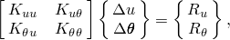

where 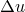 and  are the respective corrections to the incremental displacement and temperature, 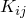 are submatrices of the fully coupled Jacobian matrix, and 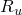and 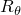 are the mechanical and thermal residual vectors, respectively.

Solving this system of equations requires the use of the unsymmetric matrix storage and solution scheme. Furthermore, the mechanical and thermal equations must be solved simultaneously. The method provides quadratic convergence when the solution estimate is within the radius of convergence of the algorithm. The exact implementation is used by default.

#### Approximate implementation

Some problems require a fully coupled analysis in the sense that the mechanical and thermal solutions evolve simultaneously, but with a weak coupling between the two solutions. In other words, the components in the off-diagonal submatrices 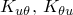 are small compared to the components in the diagonal submatrices 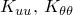. An example of such a situation is the disc brake problem (["Thermal-stress analysis of a disc brake," Section 5.1.1 of the Abaqus Example Problems Guide](../exa/exa-link.md#exa-htr-discbrake)). For these problems a less costly solution may be obtained by setting the off-diagonal submatrices to zero so that we obtain an approximate set of equations:

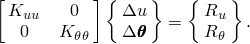

As a result of this approximation the thermal and mechanical equations can be solved separately, with fewer equations to consider in each subproblem. The savings due to this approximation, measured as solver time per iteration, will be of the order of a factor of two, with similar significant savings in solver storage of the factored stiffness matrix. Further, in many situations the subproblems may be fully symmetric or approximated as symmetric, so that the less costly symmetric storage and solution scheme can be used. The solver time savings for a symmetric solution is an additional factor of two. Unless you explicitly choose the unsymmetric matrix storage and solution scheme, selection of the scheme will depend on other details of the problem (see ["Defining an analysis," Section 6.1.2](pt03ch06s01abo05.md)).

This modified form of Newton's method does not affect solution accuracy since the fully coupled effect is considered through the residual vector 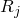 at each increment in time. However, the rate of convergence is no longer quadratic and depends strongly on the magnitude of the coupling effect, so more iterations are generally needed to achieve equilibrium than with the exact implementation of Newton's method. When the coupling is significant, the convergence rate becomes very slow and may prohibit obtaining a solution. In such cases the exact implementation of Newton's method is required. In cases where it is possible to use this approximation, the convergence in an increment will depend strongly on the quality of the first guess to the incremental solution, which you can control by selecting the extrapolation method used for the step (see ["Defining an analysis," Section 6.1.2](pt03ch06s01abo05.md)).

| **Input File Usage: ** | Use the following option to specify a separated solution scheme: |
| --- | --- |
|  | ``` [*SOLUTION TECHNIQUE](../key/key-link.md#usb-kws-hsolutiontech), TYPE=SEPARATED ``` |

| **Abaqus/CAE Usage: ** | Step module: **Create Step**: **General**: **Coupled temp-displacement**: **Other**: **Solution technique: Separated** |
| --- | --- |

#### Steady-state analysis

A steady-state coupled temperature-displacement analysis can be performed in Abaqus/Standard. In steady-state cases you should assign an arbitrary “time” scale to the step: you specify a “time” period and “time” incrementation parameters. This time scale is convenient for changing loads and boundary conditions through the step and for obtaining solutions to highly nonlinear (but steady-state) cases; however, for the latter purpose, transient analysis often provides a natural way of coping with the nonlinearity.

Frictional slip heat generation is normally neglected in for the steady-state case. However, it can still be accounted for if motions are used to specify translational or rotational nodal velocities in disk brake-type problems or if user subroutine [`FRIC`](../sub/sub-link.md#sub-xsl-fric) provides the incremental frictional dissipation through the variable `SFD`. If frictional heat generation is present, the heat flux into the two contact surfaces depends on the slip rate of the surfaces. The “time” scale in this case cannot be described as arbitrary, and a transient analysis should be performed.

| **Input File Usage: ** | ``` [*COUPLED TEMPERATURE-DISPLACEMENT](../key/key-link.md#usb-kws-hcouptempdisp), STEADY STATE ``` |
| --- | --- |

| **Abaqus/CAE Usage: ** | Step module: **Create Step**: **General**: **Coupled temp-displacement**: **Basic**: **Response: Steady state** |
| --- | --- |

#### Transient analysis

Alternatively, you can perform a transient coupled temperature-displacement analysis. You can control the time incrementation in a transient analysis directly, or Abaqus/Standard can control it automatically. Automatic time incrementation is generally preferred.

##### Automatic incrementation controlled by a maximum allowable temperature change

The time increments can be selected automatically based on a user-prescribed maximum allowable nodal temperature change in an increment, . Abaqus/Standard will restrict the time increments to ensure that this value is not exceeded at any node (except nodes with boundary conditions) during any increment of the analysis (see ["Time integration accuracy in transient problems," Section 7.2.4](pt03ch07s02aus52.md)).

| **Input File Usage: ** | ``` [*COUPLED TEMPERATURE-DISPLACEMENT](../key/key-link.md#usb-kws-hcouptempdisp), DELTMX= ``` |
| --- | --- |

| **Abaqus/CAE Usage: ** | Step module: **Create Step**: **General**: **Coupled temp-displacement**: **Basic**: **Response: Transient**; **Incrementation**: **Type: Automatic**, **Max. allowable temperature change per increment:**  |
| --- | --- |

##### Fixed incrementation

If you do not specify , fixed time increments equal to the user-specified initial time increment, , will be used throughout the analysis.

| **Input File Usage: ** | ``` [*COUPLED TEMPERATURE-DISPLACEMENT](../key/key-link.md#usb-kws-hcouptempdisp)  ``` |
| --- | --- |

| **Abaqus/CAE Usage: ** | Step module: **Create Step**: **General**: **Coupled temp-displacement**: **Basic**: **Response: Transient**; **Incrementation**: **Type: Fixed**: **Increment size:**  |
| --- | --- |

##### Spurious oscillations due to small time increments

In transient analysis with second-order elements there is a relationship between the minimum usable time increment and the element size. A simple guideline is 


where  is the time increment,  is the density, *c* is the specific heat, *k* is the thermal conductivity, and  is a typical element dimension (such as the length of a side of an element). If time increments smaller than this value are used in a mesh of second-order elements, spurious oscillations can appear in the solution, in particular in the vicinity of boundaries with rapid temperature changes. These oscillations are nonphysical and may cause problems if temperature-dependent material properties are present. In transient analyses using first-order elements the heat capacity terms are lumped, which eliminates such oscillations but can lead to locally inaccurate solutions for small time increments. If smaller time increments are required, a finer mesh should be used in regions where the temperature changes rapidly.

There is no upper limit on the time increment size (the integration procedure is unconditionally stable) unless nonlinearities cause convergence problems.

##### Automatic incrementation controlled by the creep response

The accuracy of the integration of time-dependent (creep) material behavior is governed by the user-specified accuracy tolerance parameter, . This parameter is used to prescribe the maximum strain rate change allowed at any point during an increment, as described in ["Rate-dependent plasticity: creep and swelling," Section 23.2.4](pt05ch23s02abm20.md). The accuracy tolerance parameter can be specified together with the maximum allowable nodal temperature change in an increment,  (described above); however, specifying the accuracy tolerance parameter activates automatic incrementation even if  is not specified.

| **Input File Usage: ** | ``` [*COUPLED TEMPERATURE-DISPLACEMENT](../key/key-link.md#usb-kws-hcouptempdisp), DELTMX=, CETOL=*tolerance* ``` |
| --- | --- |

| **Abaqus/CAE Usage: ** | Step module: **Create Step**: **General**: **Coupled temp-displacement**: **Basic**: **Response: Transient**, **Include creep/swelling/viscoelastic behavior**; **Incrementation**: **Type: Automatic**, **Max. allowable temperature change per increment:** , **Creep/swelling/viscoelastic strain error tolerance:** *tolerance* |
| --- | --- |

##### Selecting explicit creep integration

Nonlinear creep problems (["Rate-dependent plasticity: creep and swelling," Section 23.2.4](pt05ch23s02abm20.md)) that exhibit no other nonlinearities can be solved efficiently by forward-difference integration of the inelastic strains if the inelastic strain increments are smaller than the elastic strains. This explicit method is efficient computationally because, unlike implicit methods, iteration is not required as long as no other nonlinearities are present. Although this method is only conditionally stable, the numerical stability limit of the explicit operator is in many cases sufficiently large to allow the solution to be developed in a reasonable number of time increments.

For most coupled thermal-stress analyses, however, the unconditional stability of the backward difference operator (implicit method) is desirable. In such cases the implicit integration scheme may be invoked automatically by Abaqus/Standard.

Explicit integration can be less expensive computationally and simplifies implementation of user-defined creep laws in user subroutine [`CREEP`](../sub/sub-link.md#sub-xsl-creep); you can restrict Abaqus/Standard to using this method for creep problems (with or without geometric nonlinearity included). See ["Rate-dependent plasticity: creep and swelling," Section 23.2.4](pt05ch23s02abm20.md), for further details.

| **Input File Usage: ** | ``` [*COUPLED TEMPERATURE-DISPLACEMENT](../key/key-link.md#usb-kws-hcouptempdisp), CETOL=*tolerance*, CREEP=EXPLICIT ``` |
| --- | --- |

| **Abaqus/CAE Usage: ** | Step module: **Create Step**: **General**: **Coupled temp-displacement**: **Basic**: **Response: Transient**, **Include creep/swelling/viscoelastic behavior**; **Incrementation**: **Type: Automatic**, **Creep/swelling/viscoelastic strain error tolerance:** *tolerance*, **Creep/swelling/viscoelastic integration: Explicit** |
| --- | --- |

##### Excluding creep and viscoelastic response

You can specify that no creep or viscoelastic response will occur during a step even if creep or viscoelastic material properties have been defined.

| **Input File Usage: ** | ``` [*COUPLED TEMPERATURE-DISPLACEMENT](../key/key-link.md#usb-kws-hcouptempdisp), DELTMX=, CREEP=NONE ``` |
| --- | --- |

| **Abaqus/CAE Usage: ** | Step module: **Create Step**: **General**: **Coupled temp-displacement**: **Basic**: **Response: Transient**, toggle off **Include creep/swelling/viscoelastic behavior** |
| --- | --- |

##### Unstable problems

Some types of analyses may develop local instabilities, such as surface wrinkling, material instability, or local buckling. In such cases it may not be possible to obtain a quasi-static solution, even with the aid of automatic incrementation. Abaqus/Standard offers a method of stabilizing this class of problems by applying damping throughout the model in such a way that the viscous forces introduced are sufficiently large to prevent instantaneous buckling or collapse but small enough not to affect the behavior significantly while the problem is stable. The available automatic stabilization schemes are described in detail in ["Automatic stabilization of unstable problems" in "Solving nonlinear problems," Section 7.1.1](pt03ch07s01aus49.md#usb-anl-anonlineareqns-stabilize-over).

#### Units

In coupled problems where two different fields are active, take care when choosing the units of the problem. If the choice of units is such that the terms generated by the equations for each field are different by many orders of magnitude, the precision on some computers may be insufficient to resolve the numerical ill-conditioning of the coupled equations. Therefore, choose units that avoid ill-conditioned matrices. For example, consider using units of Mpascal instead of pascal for the stress equilibrium equations to reduce the disparity between the magnitudes of the stress equilibrium equations and the heat flux continuity equations.

### Fully coupled thermal-stress analysis in Abaqus/Explicit

In Abaqus/Explicit the heat transfer equations are integrated using the explicit forward-difference time integration rule 

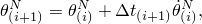

where  is the temperature at node *N* and the subscript *i* refers to the increment number in an explicit dynamic step. The forward-difference integration is explicit in the sense that no equations need to be solved when a lumped capacitance matrix is used. The current temperatures are obtained using known values of 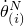 from the previous increment. The values of  are computed at the beginning of the increment by

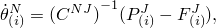

where  is the lumped capacitance matrix,  is the applied nodal source vector, and  is the internal flux vector. 

The mechanical solution response is obtained using the explicit central-difference integration rule with a lumped mass matrix as described in ["Explicit dynamic analysis," Section 6.3.3](pt03ch06s03at08.md). Since both the forward-difference and central-difference integrations are explicit, the heat transfer and mechanical solutions are obtained simultaneously by an explicit coupling. Therefore, no iterations or tangent stiffness matrices are required.

Explicit integration can be less expensive computationally and simplifies the treatment of contact. For a comparison of explicit and implicit direct-integration procedures, see ["Dynamic analysis procedures: overview," Section 6.3.1](pt03ch06s03abo07.md).

#### Stability

The explicit procedure integrates through time by using many small time increments. The central-difference and forward-difference operators are conditionally stable. The stability limit for both operators (with no damping in the mechanical solution response) is obtained by choosing

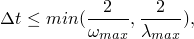

where 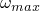 is the highest frequency in the system of equations of the mechanical solution response and 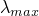 is the largest eigenvalue in the system of equations of the thermal solution response.

##### Estimating the time increment size

An approximation to the stability limit for the forward-difference operator in the thermal solution response is given by

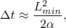

where  is the smallest element dimension in the mesh and 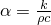 is the thermal diffusivity of the material. The parameters *k*, , and *c* represent the material's thermal conductivity, density, and specific heat, respectively.

In most applications of explicit analysis the mechanical response will govern the stability limit. The thermal response may govern the stability limit when material parameter values are non-physical or a very large amount of mass scaling is used. The calculation of the time increment size for the mechanical solution response is discussed in ["Explicit dynamic analysis," Section 6.3.3](pt03ch06s03at08.md).

##### Stable time increment report

Abaqus/Explicit writes a report to the status (`.sta`) file during the data check phase of the analysis that contains an estimate of the minimum stable time increment and a listing of the elements with the smallest stable time increments and their values. The initial minimum stable time increment accounts for the stability requirements of both the thermal and mechanical solution responses. The initial stable time increments listed do not include damping (bulk viscosity), mass scaling, or penalty contact effects in the mechanical solution response. 

This listing is provided because often a few elements have much smaller stability limits than the rest of the elements in the mesh. The stable time increment can be increased by modifying the mesh to increase the size of the controlling element or by using appropriate mass scaling.

#### Time incrementation

The time increment used in an analysis must be smaller than the stability limits of the central- and forward-difference operators. Failure to use such a time increment will result in an unstable solution. When the solution becomes unstable, the time history response of solution variables, such as displacements, will usually oscillate with increasing amplitudes. The total energy balance will also change significantly.

Abaqus/Explicit has two strategies for time incrementation control: fully automatic time incrementation (where the code accounts for changes in the stability limit) and fixed time incrementation.

##### Scaling the time increment

To reduce the chance of a solution going unstable, the stable time increment computed by Abaqus/Explicit can be adjusted by a constant scaling factor. This factor can be used to scale the default global time estimate, the element-by-element estimate, or the fixed time increment based on the initial element-by-element estimate; it cannot be used to scale a fixed time increment that you specified directly.

| **Input File Usage: ** | Use any of the following options: |
| --- | --- |
|  | ``` [*DYNAMIC TEMPERATURE-DISPLACEMENT](../key/key-link.md#usb-kws-hexpdynamicthermal), EXPLICIT, SCALE FACTOR=*f* [*DYNAMIC TEMPERATURE-DISPLACEMENT](../key/key-link.md#usb-kws-hexpdynamicthermal), EXPLICIT, ELEMENT BY ELEMENT, SCALE FACTOR=*f* [*DYNAMIC TEMPERATURE-DISPLACEMENT](../key/key-link.md#usb-kws-hexpdynamicthermal), EXPLICIT, FIXED TIME INCREMENTATION, SCALE FACTOR=*f* ``` |

| **Abaqus/CAE Usage: ** | Step module: **Create Step**: **General**: **Dynamic, Temp-disp, Explicit**: **Incrementation**: **Time scaling factor:** *f* |
| --- | --- |

##### Automatic time incrementation

The default time incrementation scheme in Abaqus/Explicit is fully automatic and requires no user intervention. Two types of estimates are used to determine the stability limit: element-by-element for both the thermal and mechanical solution responses and global for the mechanical solution response. An analysis always starts by using the element-by-element estimation method and may switch to the global estimation method under certain circumstances, as explained in ["Explicit dynamic analysis," Section 6.3.3](pt03ch06s03at08.md).

In an analysis Abaqus/Explicit initially uses a stability limit based on the thermal and mechanical solution responses in the whole model. This element-by-element estimate is determined using the smallest time increment size due to the thermal and mechanical solution responses in each element.

The element-by-element estimate is conservative; it will give a smaller stable time increment than the true stability limit, which is based upon the maximum frequency of the entire model. In general, constraints such as boundary conditions and kinematic contact have the effect of compressing the eigenvalue spectrum, and the element-by-element estimates do not take this into account (see ["Explicit dynamic analysis," Section 6.3.3](pt03ch06s03at08.md))

The stable time increment size due to the mechanical solution response will be determined by the global estimator as the step proceeds unless the element-by-element estimator is chosen, fixed time incrementation is specified, or one of the conditions explained in ["Explicit dynamic analysis," Section 6.3.3](pt03ch06s03at08.md), prevents the use of global estimation. The stable time increment size due to the thermal solution response will always be determined by using an element-by-element estimation method. The switch to the global estimation method in mechanical solution response occurs once the algorithm determines that the accuracy of the global estimation method is acceptable. For details, see ["Explicit dynamic analysis," Section 6.3.3](pt03ch06s03at08.md)

For three-dimensional continuum elements and elements with plane stress formulations (shell, membrane, and two-dimensional plane stress elements) an “improved” estimate of the element characteristic length is used by default. This “improved” method usually results in a larger element stable time increment than a more traditional method. For analyses using variable mass scaling, the total mass added to achieve a given stable time increment will be less with the improved estimate. 

| **Input File Usage: ** | Use the following option to specify the element-by-element estimation method: |
| --- | --- |
|  | ``` [*DYNAMIC TEMPERATURE-DISPLACEMENT](../key/key-link.md#usb-kws-hexpdynamicthermal), EXPLICIT, ELEMENT BY ELEMENT ``` Use the following option to activate the "improved" element time estimation method: ``` [*DYNAMIC TEMPERATURE-DISPLACEMENT](../key/key-link.md#usb-kws-hexpdynamicthermal), EXPLICIT, IMPROVED DT METHOD=YES ``` Use the following option to deactivate the "improved" element time estimation method: ``` [*DYNAMIC TEMPERATURE-DISPLACEMENT](../key/key-link.md#usb-kws-hexpdynamicthermal), EXPLICIT, IMPROVED DT METHOD=NO ``` |

| **Abaqus/CAE Usage: ** | Step module: **Create Step**: **General**: **Dynamic, Temp-disp, Explicit**: **Incrementation**: **Type: Automatic**, **Stable increment estimator: Element-by-element** |
| --- | --- |
|  | The ability to deactivate the "improved" element time estimation method is not supported in Abaqus/CAE. |

##### Fixed time incrementation

A fixed time incrementation scheme is also available in Abaqus/Explicit. The fixed time increment size is determined either by the initial element-by-element stability estimate for the step or by a user-specified time increment.

Fixed time incrementation may be useful when a more accurate representation of the higher mode response of a problem is required. In this case a time increment size smaller than the element-by-element estimates may be used. The element-by-element estimate can be obtained simply by running a data check analysis (see ["Abaqus/Standard, Abaqus/Explicit, and Abaqus/CFD execution," Section 3.2.2](pt01ch03s02abx02.md)).

When fixed time incrementation is used, Abaqus/Explicit will not check that the computed response is stable during the step. You should ensure that a valid response has been obtained by carefully checking the energy history and other response variables.

If you choose to use time increments the size of the initial element-by-element stability limit throughout a step, the dilatational wave speed and the thermal diffusivity in each element at the beginning of the step are used to compute the fixed time increment size. To reduce the chance of a solution going unstable, the initial stable time increment that Abaqus/Explicit computes can be adjusted by a constant scaling factor, as described above in ["Scaling the time increment](pt03ch06s05at19.md#usb-anl-acouptempdisp-expscaleinc).” Alternatively, you can specify a time increment size directly.

| **Input File Usage: ** | Use the following option to request time increments the size of the element-by-element stability limit: |
| --- | --- |
|  | ``` [*DYNAMIC TEMPERATURE-DISPLACEMENT](../key/key-link.md#usb-kws-hexpdynamicthermal), EXPLICIT, FIXED TIME INCREMENTATION ``` Use the following option to specify the time increment size directly: ``` [*DYNAMIC TEMPERATURE-DISPLACEMENT](../key/key-link.md#usb-kws-hexpdynamicthermal), EXPLICIT, DIRECT USER CONTROL  ``` |

| **Abaqus/CAE Usage: ** | Step module: **Create Step**: **General**: **Dynamic, Temp-disp, Explicit**: **Incrementation**: **Type: Fixed**, **Use element-by-element time increment estimator** or **User-defined time increment**:  |
| --- | --- |

#### Reducing the computational cost by using selective subcycling

The selective subcycling method can be used in a coupled thermal-stress analysis exactly as in a pure mechanical analysis, as described in ["Explicit dynamic analysis," Section 6.3.3](pt03ch06s03at08.md) and ["Selective subcycling," Section 11.7.1](pt04ch11s07aus75.md).

#### Monitoring output variables for extreme values

The extreme values defined as the element and nodal variables in a coupled thermal-stress analysis can be monitored exactly as described in ["Explicit dynamic analysis," Section 6.3.3](pt03ch06s03at08.md), for a pure mechanical analysis.

### Initial conditions

By default, the initial temperature of all nodes is zero. You can specify nonzero initial temperatures. Initial stresses, field variables, etc. can also be defined; ["Initial conditions in Abaqus/Standard and Abaqus/Explicit," Section 34.2.1](pt07ch34s02aus116.md), describes all of the initial conditions that are available for a fully coupled thermal-stress analysis.

### Boundary conditions

Boundary conditions can be used to prescribe both temperatures (degree of freedom 11) and displacements/rotations (degrees of freedom 1–6) at nodes in fully coupled thermal-stress analysis (see ["Boundary conditions in Abaqus/Standard and Abaqus/Explicit," Section 34.3.1](pt07ch34s03aus118.md)). Shell elements in Abaqus/Standard have additional temperature degrees of freedom 12, 13, etc. through the thickness (see ["Conventions," Section 1.2.2](pt01ch01s02aus02.md)).

Boundary conditions can be specified as functions of time by referring to amplitude curves (["Amplitude curves," Section 34.1.2](pt07ch34s01aus115.md)).

Boundary conditions applied during a dynamic coupled temperature-displacement response step should use appropriate amplitude references (["Amplitude curves," Section 34.1.2](pt07ch34s01aus115.md)). If boundary conditions are specified for the step without amplitude references, they are applied instantaneously at the beginning of the step. Since Abaqus/Explicit does not admit jumps in displacement, the value of a nonzero displacement boundary condition that is specified without an amplitude reference will be ignored, and a zero velocity boundary condition will be enforced.

### Loads

The following types of thermal loads can be prescribed in a fully coupled thermal-stress analysis, as described in ["Thermal loads," Section 34.4.4](pt07ch34s04aus123.md):
- Concentrated heat fluxes.
- Body fluxes and distributed surface fluxes.
- Node-based film and radiation conditions.
- Average-temperature radiation conditions.
- Element and surface-based film and radiation conditions.

The following types of mechanical loads can be prescribed:- Concentrated nodal forces can be applied to the displacement degrees of freedom (1--6); see ["Concentrated loads," Section 34.4.2](pt07ch34s04aus121.md).
- Distributed pressure forces or body forces can be applied; see ["Distributed loads," Section 34.4.3](pt07ch34s04aus122.md). The distributed load types available with particular elements are described in [Part VI, "Elements](pt06.md)."

### Predefined fields

Predefined temperature fields are not allowed in a fully coupled thermal-stress analysis. Boundary conditions should be used instead to prescribe temperature degree of freedom 11 (and 12, 13, etc. in Abaqus/Standard shell elements), as described earlier.

Other predefined field variables can be specified in a fully coupled thermal-stress analysis. These values will affect only field-variable-dependent material properties, if any. See ["Predefined fields," Section 34.6.1](pt07ch34s06aus128.md).

### Material options

The materials in a fully coupled thermal-stress analysis must have both thermal properties, such as conductivity, and mechanical properties, such as elasticity, defined. See [Part V, "Materials](pt05.md),” for details on the material models available in Abaqus.

In Abaqus/Standard internal heat generation can be specified; see ["Uncoupled heat transfer analysis," Section 6.5.2](pt03ch06s05at18.md).

Thermal strain will arise if thermal expansion (["Thermal expansion," Section 26.1.2](pt05ch26s01abm52.md)) is included in the material property definition.

In Abaqus/Standard a fully coupled temperature-displacement analysis can be used to analyze static creep and swelling problems, which generally occur over fairly long time periods (["Rate-dependent plasticity: creep and swelling," Section 23.2.4](pt05ch23s02abm20.md)); viscoelastic materials (["Time domain viscoelasticity," Section 22.7.1](pt05ch22s07abm12.md)); or viscoplastic materials (["Rate-dependent yield," Section 23.2.3](pt05ch23s02abm19.md)).

#### Inelastic energy dissipation as a heat source

You can specify an inelastic heat fraction in a fully coupled thermal-stress analysis to provide for inelastic energy dissipation as a heat source. Plastic straining gives rise to a heat flux per unit volume of


where  is the heat flux that is added into the thermal energy balance,  is a user-defined factor (assumed constant),  is the stress, and  is the rate of plastic straining.

Inelastic heat fractions are typically used in the simulation of high-speed manufacturing processes involving large amounts of inelastic strain, where the heating of the material caused by its deformation significantly influences temperature-dependent material properties. The generated heat is treated as a volumetric heat flux source term in the heat balance equation.

An inelastic heat fraction can be specified for materials with plastic behavior that use the Mises or Hill yield surface (["Inelastic behavior," Section 23.1.1](pt05ch23s01abo20.md)). It cannot be used with the combined isotropic/kinematic hardening model. The inelastic heat fraction can be specified for user-defined material behavior in Abaqus/Explicit and will be multiplied by the inelastic energy dissipation coded in the user subroutine to obtain the heat flux. In Abaqus/Standard the inelastic heat fraction cannot be used with user-defined material behavior; in this case the heat flux that must be added to the thermal energy balance is computed directly in the user subroutine.

An inelastic heat fraction can also be specified for material definitions that include time-domain linear viscoelasticity (["Time domain viscoelasticity," Section 22.7.1](pt05ch22s07abm12.md)) and time-domain nonlinear viscoelasticity defined within the parallel rheological framework (["Parallel rheological framework," Section 22.8.2](pt05ch22s08abm15.md)), except in Abaqus/Explicit for large-strain linear viscoelasticity. For large-strain linear viscoelasticity in Abaqus/Standard (["Time domain viscoelasticity," Section 22.7.1](pt05ch22s07abm12.md)), the energy dissipation is computed only approximately. Hence, the fraction of the dissipated energy converted into heat can be computed only approximately.

The default value of the inelastic heat fraction is 0.9. If you do not include the inelastic heat fraction behavior in the material definition, the heat generated by inelastic deformation is not included in the analysis.

| **Input File Usage: ** | ``` [*INELASTIC HEAT FRACTION](../key/key-link.md#usb-kws-minelastheatfrac)  ``` |
| --- | --- |

| **Abaqus/CAE Usage: ** | Property module: material editor: **Thermal**: **Inelastic Heat Fraction**: **Fraction:**  |
| --- | --- |

### Elements

Coupled temperature-displacement elements that have both displacements and temperatures as nodal variables are available in both Abaqus/Standard and Abaqus/Explicit (see ["Choosing the appropriate element for an analysis type," Section 27.1.3](pt06ch27s01aus112.md)). In Abaqus/Standard simultaneous temperature/displacement solution requires the use of such elements; pure displacement elements can be used in part of the model in the fully coupled thermal-stress procedure, but pure heat transfer elements cannot be used. In Abaqus/Explicit any of the available elements can be used in the fully coupled thermal-stress procedure; however, the thermal solution will be obtained only at nodes where the temperature degree of freedom has been activated (i.e., at nodes attached to coupled temperature-displacement elements). 

The first-order coupled temperature-displacement elements in Abaqus use a constant temperature over the element to calculate thermal expansion. The second-order coupled temperature-displacement elements in Abaqus/Standard use a lower-order interpolation for temperature than for displacement (parabolic variation of displacements and linear variation of temperature) to obtain a compatible variation of thermal and mechanical strain.

### Output

See ["Abaqus/Standard output variable identifiers," Section 4.2.1](pt02ch04s02abv01.md), and ["Abaqus/Explicit output variable identifiers," Section 4.2.2](pt02ch04s02xbv01.md), for a complete list of output variables. The types of output available are described in ["Output," Section 4.1.1](pt02ch04s01aus38.md).

### Input file template

```
[*HEADING](../key/key-link.md#usb-kws-mheading)
…
** Specify the coupled temperature-displacement element type
[*ELEMENT](../key/key-link.md#usb-kws-melement), TYPE=CPS4T
…
**
[*STEP](../key/key-link.md#usb-kws-hstep)
[*COUPLED TEMPERATURE-DISPLACEMENT](../key/key-link.md#usb-kws-hcouptempdisp) or
[*DYNAMIC TEMPERATURE-DISPLACEMENT](../key/key-link.md#usb-kws-hexpdynamicthermal), EXPLICIT
*Data line to define incrementation*
[*BOUNDARY](../key/key-link.md#usb-kws-hboundary)
*Data lines to define nonzero boundary conditions on displacement or
temperature degrees of freedom*
[*CFLUX](../key/key-link.md#usb-kws-hcflux) and/or [*CFILM](../key/key-link.md#usb-kws-hcfilm) and/or 
[*CRADIATE](../key/key-link.md#usb-kws-hcradiate) and/or [*DFLUX](../key/key-link.md#usb-kws-hdflux) and/or 
[*DSFLUX](../key/key-link.md#usb-kws-hdsflux) and/or [*FILM](../key/key-link.md#usb-kws-hfilm) and/or 
[*SFILM](../key/key-link.md#usb-kws-hsfilm) and/or [*RADIATE](../key/key-link.md#usb-kws-hradiate) and/or 
[*SRADIATE](../key/key-link.md#usb-kws-hsradiate)
*Data lines to define thermal loads*
[*CLOAD](../key/key-link.md#usb-kws-hcload) and/or [*DLOAD](../key/key-link.md#usb-kws-hdload) and/or [*DSLOAD](../key/key-link.md#usb-kws-hdsload)
*Data lines to define mechanical loads*
[*FIELD](../key/key-link.md#usb-kws-hfield)
*Data lines to define field variable values*
[*END STEP](../key/key-link.md#usb-kws-hendstep)
```


