# 6.6.2 Incompressible fluid dynamic analysis


**Products: **Abaqus/CFD  Abaqus/CAE  

##### **References**

- ["Defining an analysis," Section 6.1.2](pt03ch06s01abo05.md)
- ["Fluid dynamic analysis procedures: overview," Section 6.6.1](pt03ch06s06abo09.md)

### Overview

An incompressible fluid dynamics analysis:
- is one where the velocity field is divergence-free and the pressure does not contain a thermodynamic component;
- is one where the energy contained in acoustic waves is small relative to the energy transported by advection (i.e., when the Mach number is in the range );
- can be either laminar or turbulent, steady or time-dependent;
- can be used to study either internal or external flows;
- can include energy transport and buoyancy forces;
- can be used with a deforming mesh for ALE calculations; and
- can be performed with conjugate heat transfer or fluid-structure interaction.

### Incompressible fluid dynamic analysis

Incompressible flow is one of the most frequently encountered flow regimes encompassing a diverse set of problems that include: atmospheric dispersal, food processing, aerodynamic design of automobiles, biomedical flows, electronics cooling, and manufacturing processes such as chemical vapor deposition, mold filling, and casting. 

You can perform a transient or steady-state incompressible flow analysis.

| **Input File Usage: ** | Use the following option for a transient incompressible flow analysis: |
| --- | --- |
|  | ``` [*CFD](../key/key-link.md#usb-kws-hcfd), INCOMPRESSIBLE NAVIER STOKES ``` Use the following option for a steady-state incompressible flow analysis: ``` [*CFD](../key/key-link.md#usb-kws-hcfd), INCOMPRESSIBLE NAVIER STOKES, STEADY STATE ``` |

| **Abaqus/CAE Usage: ** | In Abaqus/CAE you can only define a transient incompressible flow analysis. |
| --- | --- |
|  | Step module: **Create Step**: **General**: **Flow**; **Flow type**: **Incompressible** |

### Governing equations

The unsteady momentum equations in integral form for an arbitrary control volume can be written as 


For steady state the integral form of the momentum conservation equation becomes


where 


is an arbitrary control volume with surface area ,


is the outward normal to ,


is the fluid density,


is the pressure,


is the velocity vector,


is the velocity of the moving mesh,


is the body force, and


is the viscous shear stress.

The viscous shear stress, , is also referred to as the deviatoric stress, , where . For more information, see ["Viscosity," Section 26.1.4](pt05ch26s01abm54.md).

Incompressibility requires a solenoidal velocity field expressed by


### Numerical implementation

The solution of the incompressible Navier-Stokes equations poses a number of algorithmic issues due to the divergence-free velocity condition and the concomitant spatial and temporal resolution required to achieve solutions in complex geometries for engineering applications. The Abaqus/CFD incompressible solver uses the integral form of the conservation equations. For time-dependent problems, an advanced second-order projection method is used for an arbitrary deforming domain. For steady state the solution approach is based on a SIMPLE algorithm on a fixed mesh. For both the projection and SIMPLE algorithms, a node-centered finite-element discretization for the pressure and a cell-centered finite volume discretization of all the other transported variables (such as velocity, temperature, turbulence, etc.) are adopted. This hybrid approach guarantees accurate solutions and eliminates the possibility of spurious pressure modes (without the need for any artificial dissipation) while retaining the local conservation properties associated with traditional finite volume methods. An edge-based implementation is used for all transport equations permitting a single implementation that spans a broad variety of element topologies ranging from simple tetrahedral and hexahedral elements to arbitrary polyhedral. In Abaqus/CFD tetrahedral, wedge, and hexahedral elements are supported.

#### Projection method (for transient analysis)

The basic concept for projection methods is the legitimate segregation of pressure and velocity fields for efficient solution of the incompressible Navier-Stokes equations. Over the past two decades, projection methods have found broad application for problems involving laminar and turbulent fluid dynamics, large density variations, chemical reactions, free surfaces, mold filling, and non-Newtonian behavior.

In practice, the projection is used to remove the part of the velocity field that is not divergence-free (“div-free”). The projection is achieved by splitting the velocity field into div-free and curl-free components using a Helmholtz decomposition. The projection operators are constructed so that they satisfy prescribed boundary conditions and are norm-reducing, resulting in a robust solution algorithm for incompressible flows.

#### SIMPLE method (for steady-state analysis)

The SIMPLE (Semi-Implicit Method for Pressure Linked Equations) method is a pressure-based method developed to efficiently simulate steady-state flows.

The primary idea behind the SIMPLE method is to create a discrete pressure correction equation by enforcing mass continuity over each cell. The divergence-free velocity field is then obtained by relating the discrete pressure correction (and, hence, the discrete pressure) field with the discrete form of the momentum equations.

#### Least-squares gradient estimation

The solution methods in Abaqus/CFD use a linearly complete second-order accurate least-squares gradient estimation. This permits accurate evaluation of dual-edge fluxes for both advective and diffusive processes. All transport equations in Abaqus/CFD make use of the second-order least-squares operators.

#### Advection methods

The advection treatment in Abaqus/CFD is edge-based, monotonicity-preserving, and preserves smooth variations to second order in space. The advection algorithm relies on a least-squares gradient estimation with unstructured-grid slope limiters that are topology independent. Sharp gradients are captured within approximately 2–3 elements; i.e., , and the use of slope limiting in conjunction with a local diffusive limiter precludes over-/under-shoots in advected fields. For the transient solver, the advection terms in the momentum and transport equations can be treated either explicitly or implicitly (see the discussion in ["Time incrementation](pt03ch06s06aus48.md#usb-anl-aifluiddyn-incrementation)” below).

### Energy equation

The energy transport equation is optionally activated in Abaqus/CFD for non-isothermal flows. For small density variations, the Boussinesq approximation provides the coupling between momentum and energy equations. In turbulent flows, the energy transport includes a turbulent heat flux based on the turbulent eddy viscosity and turbulent Prandtl number. Abaqus/CFD provides a temperature-based energy equation.

The transient form of the energy equation, in temperature form, can be obtained from the first law of thermodynamics and is given by 


For steady state it is given by 


where  is the constant pressure specific heat,  is the temperature,  is heat flux due to conduction defined by Fourier's law, and  is the heat supplied externally into the body per unit volume. The energy equation is solved in terms of temperature in Abaqus/CFD.

| **Input File Usage: ** | Use the following option to specify an isothermal flow problem (default): |
| --- | --- |
|  | ``` [*CFD](../key/key-link.md#usb-kws-hcfd), ENERGY EQUATION=NO ENERGY ``` Use the following option to specify a thermal (heat) transport problem with temperature as the primary transport scalar variable: ``` [*CFD](../key/key-link.md#usb-kws-hcfd), ENERGY EQUATION=TEMPERATURE ``` |

| **Abaqus/CAE Usage: ** | Use the following option to specify an isothermal flow problem: |
| --- | --- |
|  | Step module: **Create Step**: **General**: **Flow**; **Basic** tabbed page: **Energy equation**: **None** Use the following option to specify a thermal (heat) transport problem with temperature as the primary transport scalar variable: Step module: **Create Step**: **General**: **Flow**; **Basic** tabbed page: **Energy equation**: **Temperature** |

### Turbulence models

Turbulence modeling is a pacing technology for computational fluid dynamics. There is no single universal turbulence model that can adequately handle all possible flow conditions and geometrical configurations. This is complicated by the plethora of turbulence models and modeling approaches that are currently available; e.g., Reynolds Averaged Navier-Stokes (RANS), Unsteady Reynolds Averaged Navier-Stokes (URANS), Large-Eddy Simulation (LES), Implicit Large-Eddy Simulation (ILES), and hybrid RANS/LES (HRLES). Ultimately, you must ensure that the approximations made in a given turbulence model are consistent with the physical problem being modeled. 

The following turbulent flow models are available in Abaqus/CFD: ILES, Spalart-Allmaras (SA), *k*– RNG, *k*– realizable, and *k*– SST. These models span a relatively broad set of flow problems that include steady-state and time-dependent flows, fluid-structure interaction (FSI), and conjugate heat transfer (CHT).

#### Implicit Large-Eddy Simulation (ILES) (for transient analysis only)

Large-eddy simulation relies on a segregation of length and time scales in turbulent flows and a modeling approach that permits the direct simulation of grid-resolved flow structures and the modeling of unresolved subgrid features. Implicit LES is a methodology for modeling high Reynolds number flows that combines computational efficiency and ease of implementation with predictive calculations and flexible application. In Abaqus/CFD, ILES relies on the discrete monotonicity-preserving form of the advective operator to implicitly define the subgrid-scale model. This model is inherently time-dependent requiring time-accurate solutions to the incompressible Navier-Stokes equations where the time scale is approximately that of an eddy-turnover time for resolve-scale flow features. In addition, this model must be run in three dimensions, which typically imposes larger grid densities and stringent grid resolution criteria relative to more traditional steady-state RANS simulations. However, this approach is extremely flexible and can be applied to a broad range of flows and FSI problems. 

| **Input File Usage: ** | Use the [*CFD](../key/key-link.md#usb-kws-hcfd) option without the [*TURBULENCE MODEL](../key/key-link.md#usb-kws-hturbulence) option. |
| --- | --- |

| **Abaqus/CAE Usage: ** | Step module: **Create Step**: **General**: **Flow**; **Turbulence** tabbed page: **None** |
| --- | --- |

#### Spalart-Allmaras (SA) turbulence model

The Spalart-Allmaras (SA) model is a one-equation turbulence model that uses an eddy-viscosity variable with a nonlinear transport equation. The model was developed based on empiricism, dimensional analysis, and a requirement for Galilean invariance. The model has found broad use and has been calibrated for two-dimensional mixing layers, wakes, and flat-plate boundary layers. The model produces reasonably accurate predictions of turbulent flows in the presence of adverse pressure gradients and can be used for flows where separation occurs. This model is spatially local and requires only moderate resolution in boundary layers. Although initially designed for external and free-shear flows, the Spalart-Allmaras model can also be used for internal flows.

The basic form of the one-equation Spalart-Allmaras model consists of one transport equation for the turbulent eddy viscosity, . The model requires the normal distance from the wall used in the damping functions needed to control the turbulent viscosity in the near-wall region. Abaqus/CFD automatically computes the normal distance function, permitting simple specification of the model boundary conditions. 

The transient form of the turbulent viscosity transport equation for the Spalart-Allmaras model is given by 


 The steady-state form of the equation is given by


The damping functions and model coefficients used in the above two equations are defined as:


where  is the normal distance from the wall, and the effective turbulent viscosity is defined as


The Spalart-Allmaras model coefficients are shown in [Table 6.6.2--1](pt03ch06s06aus48.md#table-spalartproperties). In addition, a turbulent Prandtl number, , can be specified.

**Table 6.6.2–1** Spalart-Allmaras model coefficients.
|  |  |  |  |  |  |  |  |  |
| --- | --- | --- | --- | --- | --- | --- | --- | --- |
| 0.1355 | 0.622 | 7.1 | 0.6667 |  | 0.3 | 2 | 0.41 | 5 |

The Spalart-Allmaras model can provide very accurate boundary layer results if the near-wall region is resolved (near-wall resolution such that the nondimensional wall distance is approximately 3). However, the implementation of boundary conditions for the Spalart-Allmaras model in Abaqus/CFD permits the use of coarser meshes as well.

| **Input File Usage: ** | Use both of the following options: |
| --- | --- |
|  | ``` [*CFD](../key/key-link.md#usb-kws-hcfd) [*TURBULENCE MODEL](../key/key-link.md#usb-kws-hturbulence), TYPE=SPALART ALLMARAS ``` |

| **Abaqus/CAE Usage: ** | Step module: **Create Step**: **General**: **Flow**; **Turbulence** tabbed page: **Spalart-Allmaras** |
| --- | --- |

##### Wall functions

The Spalart-Allmaras turbulence model can be integrated throughout the inner layer of the turbulent boundary layer due to its built-in low Reynolds number damping functions. However, the model usually requires extremely fine near-wall resolutions on the order of  to accurately predict the eddy viscosity in the entire boundary layer. In general, the  near-wall resolution requirement is a very stringent constraint to enforce in complex high Reynolds number flow problems. Consequently, a wall-function approach is implemented to relax the near-wall resolution required by the Spalart-Allmaras model.

The conventional wall-function approach is based on the law-of-the-wall, which is a semi-empirical universal velocity profile obtained in equilibrium wall-bounded flows when the flow velocity, , and wall-normal distance, , are normalized with the kinematic viscosity, , and friction velocity,  (known as viscous units or wall units): The friction velocity is computed as follows:

 is computed as follows:


The Law-of-the-wall is computed . The friction velocity can be computed from the viscous and logarithmic layer relationships as


The blending function is defined as


The wall function is defined as


In the above equations  is the density,  is the shear stress at the wall,  is the intersection point of the linear and logarithmic velocity profile, and  and  are constants.

The conventional wall-function approach has been adapted within Abaqus/CFD to a form that asymptotes to a standard wall function for coarse meshes, yet will also give results identical to a wall-function-free approach for fine meshes. It is termed a hybrid wall function. The key aspect in the implementation of the hybrid wall-function method within the Spalart-Allmaras model is to obtain the friction velocity as a function of  and the local velocity field, which was shown before. Having computed the friction velocity, the wall shear can be obtained as


The hybrid wall-function approach is independent of the near-wall resolution; therefore, the law-of-the-wall  implemented needs to accurately predict the viscous-sublayer, the logarithmic-layer, and the buffer layer (the region that connects the viscous and logarithmic zones) since the cell-center adjacent to the wall can be located anywhere within the inner layer. Therefore, a single smooth correlation that reproduces the entire law-of-the-wall proposed by [Reichardt (1951)](pt03ch06s06aus48.md#usb-ref-reichardt) is implemented.


where


##### Implementation in the momentum equation

For cases where the mesh resolution is not enough to capture the near-wall gradients, a near-wall model is required to provide the correct wall-shear stress in coarse meshes. The wall shear is obtained from the wall-function approach through an effective edge viscosity:


##### Energy wall functions

The wall-function approach can be extended to the energy equation by using the temperature law-of-the-wall, which is a semi-empirical universal temperature profile obtained in equilibrium wall-bounded flows when the temperature, , and wall-normal distance, , are normalized with wall units. The standard temperature wall function is defined as


where  is the intersection point of the viscous-sublayer and the logarithmic layer in the temperature wall function,  is the wall temperature,  is the Prandtl number,  is the turbulent Prandtl number,  is the wall-heat flux,  is the specific heat coefficient at constant pressure, and  is computed using the [Jayatilleke (1969)](pt03ch06s06aus48.md#usb-ref-jayatilleke) expression:


For the hybrid wall-function approach a continuous temperature wall function proposed by [Kader (1981)](pt03ch06s06aus48.md#usb-ref-kader) is implemented:


with the blending function defined as


Finally, the heat flux is obtained from the precomputed  flow properties temperature field and the continuous temperature wall function:


##### Implementation in the energy equation

For cases where the mesh resolution is not enough to capture the near-wall gradients, a near-wall model is required to provide the correct wall-heat flux in coarse meshes. The wall-heat flux is obtained from the wall-function approach through an effective edge heat conductivity.


#### k--epsilon RNG turbulence model

The *k*– RNG model is a two-equation turbulence model that evolves an equation for the turbulent kinetic energy, *k*, and the energy dissipation rate, . The model equations are developed from fundamental physical principles and dimensional analysis; the equation for *k* is derived using first principles, and the equation for  is postulated using physical insight. The main advantage of the RNG version is that the model coefficients are obtained using a mathematical approach called Renormalization Group theory, commonly used in physics. This calibration method removes most of the uncertainty introduced when the model coefficients are calibrated using a finite set of canonical flows as is done in most turbulence RANS models. In addition, it changes the epsilon equation ([Yakhot et al., 1992](pt03ch06s06aus48.md#usb-ref-yakhot)). The model equations are as follows:


 where  is the Reynolds stress tensor and is closed as follows: 


 The turbulent viscosity,  is


 and 


The second and third terms on the right-hand-side of the *k*– transport equations above represent the production and dissipation of *k* and , respectively. 

The *k*– RNG model coefficients are shown in [Table 6.6.2--2](pt03ch06s06aus48.md#table-k-eps-coefficients). In addition, a turbulent Prandtl number () can be specified.

**Table 6.6.2–2** *k*– RNG model coefficients.
|  |  |  |  |  |  |  |
| --- | --- | --- | --- | --- | --- | --- |
| 0.085 | 1.42 | 1.68 | 0.72 | 0.72 | 0.012 | 4.38 |

| **Input File Usage: ** | Use both of the following options: |
| --- | --- |
|  | ``` [*CFD](../key/key-link.md#usb-kws-hcfd) [*TURBULENCE MODEL](../key/key-link.md#usb-kws-hturbulence), TYPE=RNG KEPSILON ``` |

| **Abaqus/CAE Usage: ** | Step module: **Create Step**: **General**: **Flow**; **Turbulence** tabbed page: **k-epsilon renormalization group (RNG)** |
| --- | --- |

##### Wall functions

It is well known that the *k*– model has limitations, especially on wall-bounded flows where high values of eddy viscosity in the near-wall region are usually reproduced. For high Reynolds number flows often encountered in many industrial applications, a full resolution of the thin viscous sub-layer that occurs near a wall using a fine mesh may not be economical. Consequently, for meshes that cannot resolve the viscous sub-layer, wall functions are used to represent the effects of the viscous sub-layer on the transport processes. In Abaqus/CFD wall functions are used to avoid the need for highly resolved boundary layer meshes. This approach relies on the law of the wall to obtain the wall-shear stress.

The law of the wall is a universal velocity profile that wall-bounded flows develop in the absence of pressure gradients. The law of the wall is


where


  is the wall tangent velocity,  is the kinematic viscosity,  is the density,  is the shear stress at the wall,  is the intersection point of the linear and logarithmic velocity profile, and  and  are constants. 

The standard law of the wall profile is limited in its usage. For example, in recirculating flows the turbulent kinetic energy *k* becomes zero at separation and reattachment points, where, by definition,  is zero. This singular behavior causes the predicted results to be erroneous. To overcome this, the standard law of the wall is modified based on a new scale for the friction velocity following the method proposed by [Launder and Spalding (1974)](pt03ch06s06aus48.md#usb-ref-launderspalding). The modified friction velocity is given by


 which does not suffer from a singular behavior at flow reattachment, separation, and at points of flow impingement. Correspondingly, the wall distances are re-scaled as follows:


The modified law of the wall reduces to the standard law of the wall under the conditions of uniform wall-shear stress and when the generation and dissipation of turbulent kinetic energy are in balance (i.e., when the turbulence structure is in equilibrium). Under such conditions,  and, thus, .

The wall-shear stress for the modified law of the wall can be evaluated as ([Albets-Chico, et al., 2008](pt03ch06s06aus48.md#usb-ref-albets))


where the subscript *p* denotes the wall element center at which all the quantities of interest are evaluated. The use of the wall function requires the modification of the transport equations for *k* and  for the wall layer of elements. Specifically, the production and dissipation terms in the governing transport equation for the turbulent kinetic energy *k* are modified to account for the presence of the wall. 

Following the procedure outlined in [Craft et al. (2002](pt03ch06s06aus48.md#usb-ref-craft)), an average value of the production of *k* as given below is used in the transport equation. Such an average is obtained based on a two-layer model of the wall element (i.e., the wall element is divided into a partly viscous sub-layer region and a partly turbulent log-layer or inertial layer region).


 where  is the maximum of the wall normal distances of all the vertices of a given wall element, and  is the wall normal distance of the edge of the viscous sub-layer, where


Similarly, an average value of the dissipation rate for *k* is also prescribed for the wall elements based on a two-layer integration and is given by


 The transport equation for  is not solved for the wall layer elements. Instead, the value of  is directly prescribed at the point *p* as follows:


Therefore, integration of the *k* and  transport equations is performed with a zero flux (i.e., homogeneous Neumann boundary conditions) at the walls.

##### Guidelines on wall functions

The main advantage of wall functions is the relaxed requirement on mesh resolution at walls. However, the main disadvantage of using wall functions is the dependence on the near-wall mesh resolution. Wall functions based on the law of the wall approach usually work best for wall elements whose centers lie in the fully turbulent layer (inertial or log layer) for which such functions are designed. This effectively imposes a lower limit on the value of the scaled wall coordinate, . For complex geometries, ensuring that all the near wall cells are outside the viscous sublayer is difficult. The precise location of the logarithmic region is solution dependent and may vary with time. To accommodate a more flexible mesh, a resolution-insensitive wall function ([Durbin, 2009](pt03ch06s06aus48.md#usb-ref-durbin)) has been implemented. Briefly, this wall function is based on limiting the minimum value of  such that the value of the velocity gradient at the first wall-attached element is the same as if it was located on the edge of the viscous sub-layer. A best practice for wall-bounded flows is to have at least 8–10 points in the boundary layer region where  (see [Casey and Wintergerste, 2000](pt03ch06s06aus48.md#usb-ref-casey)).

##### Modification of the momentum equation

Using wall functions, the calculation of the wall-shear stress or the viscous flux of momentum based on the molecular viscosity  and the numerically estimated velocity gradient can produce large errors. Hence, proper modifications to the momentum equations need to be introduced to account for the poorly resolved excess wall friction. The necessary modification is done through a modified viscosity for the wall elements that corrects for the erroneous estimate of the velocity gradient ([Bredberg, 2000](#usb-ref-bredberg)). This is implemented for the wall elements as:


##### Energy wall functions

The wall-function approach can be extended to the energy equation by using the temperature law-of-the-wall, which is a semi-empirical universal temperature profile obtained in equilibrium wall-bounded flows when the temperature, , and wall-normal distance, , are normalized with wall units. The standard temperature wall function is defined as


where  is the intersection point of the viscous-sublayer and logarithmic layer in the temperature wall function,  is the wall temperature,  is the Prandtl number,  is the turbulent Prandtl number,  is the wall-heat flux,  is the specific heat coefficient at constant pressure, and  is computed using the [Jayatilleke (1969)](pt03ch06s06aus48.md#usb-ref-jayatilleke) expression:


Finally, the heat flux is obtained from the precomputed  flow properties temperature field and the continuous temperature wall function:


##### Implementation in the energy equation

For cases where the mesh resolution is not enough to capture the near-wall gradients, a near-wall model is required to provide the correct wall-heat flux in coarse meshes. The wall-heat flux is obtained from the wall-function approach through an effective edge heat conductivity:


#### k--epsilon realizable turbulence model

The *k*– realizable model is a two-equation turbulence model that evolves an equation for the turbulent kinetic energy, *k*, and the energy dissipation rate, . The model equations are developed from fundamental physical principles and dimensional analysis; the equation for *k* is derived using first principles, and the equation for  is postulated using physical insight. This particular version uses realizability constraints, which imposes mathematical consistency in the Reynolds stresses (such as enforcing the positivity of the normal stresses and the Cauchy-Schwarz inequality) to modify the model coefficients and the epsilon equation. These modifications guarantee the physical consistency in the predicted Reynolds stresses, thus improving the accuracy of the predictions ([Shih et al., 1995](pt03ch06s06aus48.md#usb-ref-tsan)). The model equations are as follows:


 where the Reynolds stress tensor is defined as


with the eddy viscosity,  defined as


 The turbulence viscosity coefficient is computed using realizability constraints:


 where 


 Realizability conditions are imposed in the the production coefficient of the  equation, which yields


The *k*– realizable model coefficients are shown in [Table 6.6.2--2](pt03ch06s06aus48.md#table-k-eps-coefficients). In addition, a turbulent Prandtl number, , can be specified.

**Table 6.6.2–3** *k*– realizable model coefficients.
|  |  |  |  |  |
| --- | --- | --- | --- | --- |
| 4.0 | 1.9 | 1.0 | 1.2 | 0.43 |

| **Input File Usage: ** | Use both of the following options: |
| --- | --- |
|  | ``` [*CFD](../key/key-link.md#usb-kws-hcfd) [*TURBULENCE MODEL](../key/key-link.md#usb-kws-hturbulence), TYPE=KEPSILON REALIZABLE ``` |

| **Abaqus/CAE Usage: ** | The *k*-- realizable turbulence model is not supported in Abaqus/CAE. |
| --- | --- |

##### Two-layer model

To increase the accuracy of the *k*– realizable model in cases where the mesh is not fine enough to resolve the inner layer in wall-bounded flows, a near-wall model, known as the two-layer model, is implemented. Following the work of [Chen and Patel (1988](pt03ch06s06aus48.md#usb-ref-chen)), algebraic equations for  and  are used in the inner layer to replace their turbulence model equations:


where


The algebraic equation  is


where  is the wall-normal distance. The two-layer approach combines the algebraic equation with the  transport equation. To provide a smooth transition, the work of [Jongen (1998](pt03ch06s06aus48.md#usb-ref-jongen)) is followed by implementing a smooth blending function to bridge both formulations:

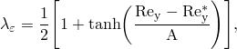

where  defines the width of the blending function. We define a width so 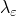 will be within 1% of its far-field value. Given a variation of 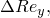 one obtains

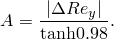

The final blending of  is done through combining the transport and algebraic equations at the discretized level:

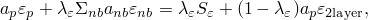

where 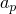 and 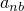 are the diagonal and off-diagonal terms, respectively, and  is the right-hand side of the discrete transport equation. Finally, the blending of the eddy viscosity is conducted in a straightforward way since it only involves two algebraic equations:

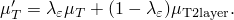

##### Wall functions

The two-layer approach takes care of the near-wall integration of the  equation; however, it does not provide any modeling for the turbulent kinetic energy equation. Therefore, to model the budget of the turbulent kinetic energy at the inner layer correctly, an additional near-wall treatment needs to go into the *k* equation. A hybrid-wall function treatment is implemented to integrate the *k* equation throughout the inner layer. The hybrid wall function uses the law-of-the-wall and equilibrium assumptions to approximate the sources of *k* when the mesh resolution is not fine enough to resolve the inner layer. However, if the mesh is fine enough to resolve the entire inner-layer, the hybrid-wall function recovers the viscous sublayer relations for the *k* sources. The law-of-the-wall and viscous sublayer sources are finally blended to provide a smooth formulation that allows the model to provide accurate solutions irrespective of the mesh's near-wall resolution.

The-law-of-the-wall is a universal velocity profile that wall-bounded flows develop in the absence of pressure gradients. The velocity profile consists of two well-defined regions:

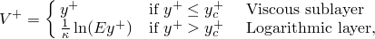

where


  is the wall tangent velocity,  is the kinematic viscosity,  is the density,  is the shear stress at the wall,  is the intersection point of the viscous sublayer and the logarithmic layer,  is the Von Karman constant, and  is the law-of-the-wall's logarithmic constant. The viscous sublayer is the region where momentum transfer is dominated by molecular diffusion; turbulence here is virtually absent. The logarithmic layer or fully turbulent regime establishes the onset of the fully turbulent regime; here momentum transport is fully dominated by turbulent transport relegating molecular diffusion to a second-order effect.

The standard law of the wall profile is limited in its usage. For example, in recirculating flows the turbulent kinetic energy, *k*, becomes zero at separation and reattachment points, where, by definition,  is zero. This singular behavior causes the predicted results to be erroneous. To overcome this, the standard law of the wall is modified based on a new scale for the friction velocity following the method proposed by [Launder and Spalding (1974)](pt03ch06s06aus48.md#usb-ref-launderspalding). The modified friction velocity is given by


 which does not suffer from a singular behavior at flow reattachment, separation, and at points of flow impingement. Correspondingly, the wall distances are re-scaled as follows:


The modified law of the wall reduces to the standard law of the wall under the conditions of uniform wall-shear stress and when the generation and dissipation of turbulent kinetic energy are in balance (i.e., when the turbulence structure is in equilibrium). Under such conditions,  and, thus, .

The wall-shear stress for the modified law of the wall can be evaluated as ([Albets-Chico, et al., 2008](pt03ch06s06aus48.md#usb-ref-albets))

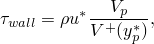

where the subscript *p* denotes the wall element center at which all the quantities of interest are evaluated. Using the wall function the *k* sources are derived to correct the turbulent kinetic energy budget at the inner layer as follows:

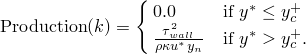

 Following a similar procedure the value of the dissipation rate for *k* is given by

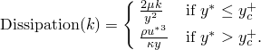

Having defined the sources in the viscous sublayer and logarithmic layer, a blending approach is implemented to provide a smooth transition that allows us to operate on meshes with arbitrary near-wall resolution:

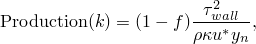

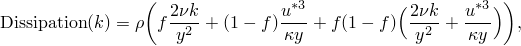

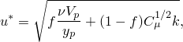

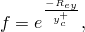

where


The boundary conditions enforced at the wall for both the *k* and  transport equations is a zero flux (i.e., homogeneous Neumann boundary conditions) at the walls.

##### Implementation in the momentum equation

For cases where the mesh resolution is not enough to capture the near-wall gradients, a near-wall model is required to provide the correct wall-shear stress in coarse meshes. The wall shear is obtained from the wall-function approach through an effective edge viscosity:


##### Energy wall functions

The wall-function approach can be extended to the energy equation by using the temperature law-of-the-wall, which is a semi-empirical universal temperature profile obtained in equilibrium wall-bounded flows, when the temperature, *T*, and the wall-normal distance, *y*, are normalized with wall units. The standard temperature wall function is defined as


where  is the intersection point of the viscous-sublayer and the logarithmic layer in the temperature wall-function,  is the wall temperature,  is the Prandtl number,  is the turbulent Prandtl number,  is the wall-heat flux,  is the specific heat coefficient at constant pressure, and  is computed using the [Jayatilleke (1969)](pt03ch06s06aus48.md#usb-ref-jayatilleke) expression:


For the hybrid wall-function approach a continuous temperature wall function proposed by [Kader (1981)](pt03ch06s06aus48.md#usb-ref-kader) is implemented

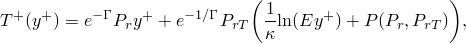

with the blending function defined as


 Finally, the heat flux is obtained from the precomputed  flow properties temperature field and the continuous temperature wall function:


##### Implementation in the energy equation

For cases where the mesh resolution is not enough to capture the near-wall gradients, a near-wall model is required to provide the correct wall-heat flux in coarse meshes. The wall-heat flux is obtained from the wall-function approach through an effective edge heat conductivity:


#### k--omega SST turbulence model

The *k*– SST turbulence model is a two-equation turbulence model that uses a different dissipation parameter than the *k*– turbulence model; namely, the specific energy dissipation rate, 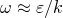 introduced by [Menter in 1994](pt03ch06s06aus48.md#usb-ref-menter). Although  varies even more rapidly than  and takes on very large values near the wall, the model is relatively insensitive to the wall values. One of the most attractive properties of *k*– models is that they can be employed throughout the viscous sublayer without further modification (as would required by *k*– models). However, a weakness of the standard *k*– model is that it is much more sensitive than *k*– to the values of turbulence parameters in the freestream and, hence, to inflow turbulence values.

[Menter (1994)](pt03ch06s06aus48.md#usb-ref-menter) introduced a hybrid model that blends the standard *k*– model near to the wall with a transformed version of the standard *k*– model (into *k*– form) far from the wall. This hybrid model adds an additional cross-diffusion term, in regions away from the wall, to the transport equation for a specific dissipation rate. It is this term that reduces the sensitivity of the model to freestream turbulence values. To complete the *k*– SST model, Menter further added a limiter for turbulent shear stress that prevents excessive shear stress levels in boundary layers. The *k*– SST model essentially contains two sets of coefficients, one for the *k*– part and one for the (transformed) *k*– part. The blending is achieved by functions of two different turbulent Reynolds numbers, which, in turn, require the normal distance from the wall. Abaqus/CFD automatically computes this distance function. The transport equations for the model are

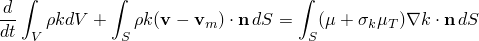

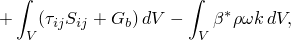

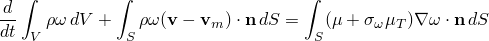

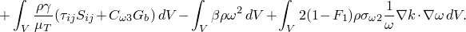

The *k*– SST model coefficients are computed by blending the original *k*– model by [Wilcox (1988)](#usb-ref-wilcox) and the standard *k*– model coefficients:

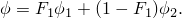

 The blending function is defined as

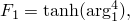

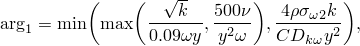

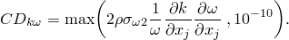

 In the incompressible formulation the Reynolds stresses are closed as


 with the turbulent eddy viscosity computed using the shear-stress transport approach:

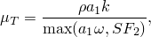

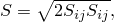

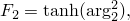

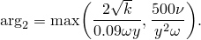

 The *k*– SST model coefficients are shown in [Table 6.6.2--4](pt03ch06s06aus48.md#table-komegaproperties) and [Table 6.6.2--5](pt03ch06s06aus48.md#table-komegaproperties2). In addition, a turbulent Prandtl number, , can be specified.

**Table 6.6.2–4** *k*– SST model coefficients (Wilcox *k*– model).
| 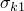 | 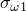 |  |  |  |
| --- | --- | --- | --- | --- |
| 0.5 | 0.5 | 0.075 | 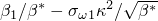 | 0.41 |

**Table 6.6.2–5** *k*– SST model coefficients (standard *k*–).
| 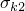 | 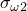 |  |  |  |
| --- | --- | --- | --- | --- |
| 1.0 | 0.856 | 0.0828 | 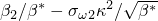 | 0.09 |

| **Input File Usage: ** | Use both of the following options: |
| --- | --- |
|  | ``` [*CFD](../key/key-link.md#usb-kws-hcfd) [*TURBULENCE MODEL](../key/key-link.md#usb-kws-hturbulence), TYPE=KOMEGA SST ``` |

| **Abaqus/CAE Usage: ** | The *k*-- SST turbulence model is not supported in Abaqus/CAE. |
| --- | --- |

##### Wall functions

The *k*– SST model can be integrated throughout the inner-layer of the turbulent boundary layer. However, this requires fine near-wall resolutions. The same model can also be applied using a wall-function approach, in which the near-wall element centroid is located in the logarithmic (fully turbulent) part of the boundary layer. This greatly reduces the mesh refinement requirements and, hence, computational costs, albeit with a potential loss of accuracy.

The conventional wall-function approach is based on the law-of-the-wall, which is a semi-empirical universal velocity profile obtained in equilibrium wall-bounded flows when the flow velocity, , and wall normal distance, , are normalized with the kinematic viscosity, , and friction velocity  (known as viscous units or wall units):


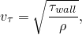

where  is the kinematic viscosity,  is the density,  is the shear stress at the wall,  is the intersection point of the linear and logarithmic velocity profile,  is the Von Karman constant, and  is the law of the wall constant.

In equilibrium conditions the wall-shear stress is approximately equal to the Reynolds stress:

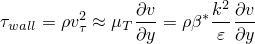

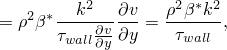

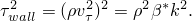

Thus, the friction velocity in equilibrium conditions is shown to be

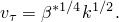

The wall-shear stress can be linearized with the wall function as

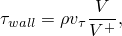

such that the production of the turbulent kinetic energy

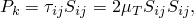

 can be simplified using the wall-function relations

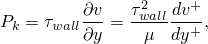

where the gradient of the law-of-the-wall is evaluated in the logarithmic region. Therefore, the final equation is

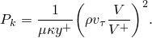

The specific energy dissipation rate is defined as

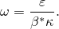

Using the wall-function relations and equilibrium assumption, the value of  can be found as

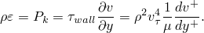

Thus, the value of  is obtained by evaluating the gradient of the law-of-the-wall in the logarithmic region:

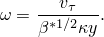

The previous wall-function relationships are valid only in the logarithmic layer, where the near-wall resolution is 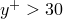. However, since the *k*– model can be implemented throughout the inner layer, it is important to properly handle the fine resolution region 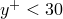. In Abaqus/CFD a hybrid wall-function approach is employed in which the near-wall conditions adjust to their appropriate asymptotic limits for either very fine meshes ( ~ 1) or for wall-function-type meshes (). Appropriate blending functions are used such that for intermediate meshes (the near-wall element centroid is located in the buffer region) the accuracy is not impaired significantly. For completeness, we first state the appropriate relationships for the viscous sublayer:


Having defined the viscous-sublayer and the fully turbulent relations, the blending is accomplished in the following form:


where the blending function is defined as


Here,  is a local Reynolds number, and  is the intersection point of the linear and logarithmic velocity profiles of the law-of-the-wall. 

The hybrid wall-function approach is independent of the near-wall resolution; therefore, the law-of-the-wall  implemented needs to accurately predict the viscous-sublayer, the logarithmic-layer, and the buffer layer (region that connects the viscous and logarithmic zones) since the cell-center adjacent to the wall can be located anywhere within the inner layer. Therefore, a single smooth correlation that reproduces the entire law-of-the-wall proposed by [Reichardt (1951)](pt03ch06s06aus48.md#usb-ref-reichardt) is implemented:


where


##### Implementation in the momentum equation

For cases where the mesh resolution is not enough to capture the near-wall gradients, a near-wall model is required to provide the correct wall-shear stress in coarse meshes. The wall shear is obtained from the wall-function approach through an effective edge viscosity:


##### Energy wall functions

The wall-function approach can be extended to the energy equation by using the temperature law-of-the-wall which is a semi-empirical universal temperature profile obtained in equilibrium wall-bounded flows, when the temperature, *T*, and the wall-normal distance, *y*, are normalized with wall units. The standard temperature wall function is defined as


where  is the intersection point of the viscous-sublayer and logarithmic layer in the temperature wall-function,  is the wall temperature,  is the Prandtl number,  is the turbulent Prandtl number,  is the wall-heat flux,  is the specific heat coefficient at constant pressure, and  is computed using the [Jayatilleke (1969)](pt03ch06s06aus48.md#usb-ref-jayatilleke) expression:


For the hybrid wall-function approach a continuous temperature wall function proposed by [Kader (1981)](pt03ch06s06aus48.md#usb-ref-kader) is implemented


with the blending function defined as


 Finally, the heat flux is obtained from the precomputed  flow properties temperature field and the continuous temperature wall function:


##### Implementation in the energy equation

For cases where the mesh resolution is not enough to capture the near-wall gradients, a near-wall model is required to provide the correct wall-heat flux in coarse meshes. The wall-heat flux is obtained from the wall-function approach through an effective edge heat conductivity:


### Deforming-mesh ALE (for transient analysis only)

Many industrial CFD/FSI/CHT problems involve moving boundaries or deforming geometries. This class of problem includes prescribed boundary motion that induces fluid flow or where the boundary motion is relatively independent of the fluid flow. Abaqus/CFD uses an arbitrary Lagrangian-Eulerian (ALE) formulation and automated mesh deformation method that preserves element size in boundary layers. The ALE and deforming-mesh algorithms are activated automatically for problems that involve a moving boundary prescribed by the user or identified as a moving boundary in an FSI co-simulation. Abaqus/CFD offers two approaches for mesh deformation: implicit and explicit. In both approaches the mesh motion is governed by linear elasticity equations. For the implicit approach the algorithm is similar to the static stress analysis procedure in Abaqus/Standard. To avoid extra memory allocation for solving the linear elasticity equations, the matrix-free iteration strategy is used. For the explicit approach the algorithm is similar to explicit dynamic analysis in Abaqus/Explicit. Abaqus/CFD also offers distortion control in the explicit approach to prevent elements from inverting or distorting excessively in fluid mesh movement (see ["Controlling the solution accuracy and mesh quality in a deforming-mesh analysis with Abaqus/CFD " in "Commonly used control parameters," Section 7.2.2](pt03ch07s02aus50.md#usb-anl-aconvergecontrol-fsi)).

To properly control the mesh motion during a simulation, it is the user’s responsibility to prescribe appropriate displacement conditions on the boundary of the computational mesh. 

### Porous media flows (for transient analysis only)

Flows through fluid-saturated porous media occur in a wide range of industrial and environmental applications. Such flows can be isothermal (no heat transfer) or non-isothermal in nature. Examples include packed-bed heat exchangers, heat pipes, thermal insulation, petroleum reservoirs, nuclear waste repositories, geothermal engineering, thermal management of electronic devices, metal alloy casting, and flow past porous scaffolds in bioreactors.

#### Isothermal flows

For isothermal flows in porous media, many studies are usually carried out using the Darcy flow model, which is an empirical law for creeping flow through an infinitely extended uniform medium. However, non-Darcian effects such as fluid inertial effects are quite important for certain applications. The model implemented in Abaqus/CFD is based on the volume-averaged Darcy-Brinkman-Forchheimer equations that account for both Darcian and inertial non-Darcian effects. The following assumptions are made in deriving the governing equations:
- the porosity of the medium does not vary with time or the time scale of variation of the porosity is considered to be much larger than the dominant time scales of the fluid motion; and
- the permeability of the porous medium is isotropic and dependent only on the porosity of the medium.

Based on the above assumptions, the volume-averaged mass conservation and the Darcy-Brinkman-Forchheimer momentum equations governing the flow of an incompressible fluid in a fluid-saturated porous media can be written as follows ([Nield and Bejan, 2010](pt03ch06s06aus48.md#usb-ref-nield)): 


where 


is the extrinsic average or the superficial velocity vector, where the average is taken over a representative volume incorporating both the solid (matrix) and the fluid phases; 


is the intrinsic average of the pressure (average taken only over the fluid-phase); 


is the density of the fluid; 


is the viscosity of the fluid;


is the porosity (volume fraction of the fluid phase) of the porous medium; and 


is the permeability of the porous medium.

The second term on the right-hand side of the momentum equation is the Brinkman term accounting for the presence of solid boundaries, the third term represents the Darcy drag term (linear in velocity), and the last term represents the inertial (quadratic in velocity) or the Forchheimer drag. The parameter  is the inertial drag coefficient (also referred to as the form drag coefficient). Based on Ergun's equation ([Nield and Bejan, 2010](pt03ch06s06aus48.md#usb-ref-nield)), , where  is a constant that is set to a default value of . The porous drag forces (namely, the Darcy and Forchheimer drag forces) are activated for a prescribed element set by specifying them as distributed loads (see ["Specifying porous drag body force load in Abaqus/CFD" in "Distributed loads," Section 34.4.3](pt07ch34s04aus122.md#usb-prc-ploaddistributed-porousdrag)).

Thus, the porous media flow problem requires the specification of the porosity, , and the permeability, , of the porous medium. The default value of  can also be changed in the material property definition (see ["Permeability," Section 26.6.2](pt05ch26s06abm64.md)). For the case of turbulent flow within a porous medium, the fluid viscosity  includes the contribution of both the molecular and the turbulent eddy viscosities.

For conjugate flows involving domains consisting of both pure fluid regions and fluid-saturated porous media, the pure fluid porosity is set to a value of 1 by default.

#### Permeability-porosity relationships

The permeability of a porous medium is generally a function of the physical properties of the interconnected pore system such as porosity and tortuosity. Determination of the appropriate permeability-porosity relationship requires a detailed knowledge of the size distribution and spatial arrangement of the pore channels in the porous medium. The permeability-porosity relation can be specified directly in Abaqus/CFD using the material property definition.

Another permeability-porosity relation supported in Abaqus/CFD is the widely accepted Carman-Kozeny model. This relation is given as follows:


 where  represents the Carman-Kozeny constant and  represents the average radius of the porous particles/fibers.

#### Limitations

- While turbulence can be activated for a porous media flow problem, a rigorous volume-averaging procedure has not been implemented in Abaqus/CFD to account for turbulence transport within the porous media. The equations governing the transport of the turbulence variables are solved by neglecting the effects of the presence of porous medium. In other words, the porous medium remains transparent (fully open) to the transport of turbulence variables.
- When the arbitrary Lagrangian-Eulerian (ALE) and deforming mesh algorithms are activated for a porous flow problem, changes in the porosity of the medium associated with large mesh/domain deformations are not taken into account. The model is strictly valid only for the case of undeformable porous media.

#### Non-isothermal flows (heat transfer)

The following assumptions are made in the implementation of the volume-averaged energy equation for porous media in Abaqus/CFD:
- The medium is isotropic.
- Radiative effects, viscous dissipation, and work done by the changes in pressure are negligible.
- Local thermal equilibrium is valid (i.e., solid and fluid phase temperatures are the same).
- No net heat transfer takes place between the different phases in the porous media.

Based on the above assumptions, the effective energy equation for the porous medium can be given as follows ([Nield and Bejan, 2010](pt03ch06s06aus48.md#usb-ref-nield)):


 where 


 and


Here,  is the extrinsic average or the superficial velocity vector, and  is the temperature. The subscripts , , and  denote the fluid phase, solid (matrix) phase, and effective medium, respectively.  is the specific heat capacity at constant pressure,  is the thermal conductivity, and  is the effective heat production per unit volume or the heat source (). For the case of turbulent heat transfer within a porous medium, the fluid conductivity  includes the contribution of both the molecular and turbulent eddy conductivities.

As seen from the above equation, the porous media heat transfer problem requires the specification of the following input:
- the thermal properties of the solid (matrix) phase: the density, ; the conductivity, ; and the specific heat capacity, ; and
- the thermal properties of the fluid (matrix) phase: the molecular conductivity, ; and specific heat capacity, , apart from the specification of other fluid properties such as the density, , viscosity, , and permeability, .

### Linear equation solvers

The solution methods for the momentum and auxiliary transport equations in Abaqus/CFD rely on scalable parallel preconditioned Krylov solvers. The pressure, pressure-increment, and distance function equations are solved with user-selectable Krylov solvers and a robust algebraic multigrid preconditioner. A set of preselected default convergence criteria and iteration limits are prescribed for all linear equation solvers. The default solver settings should provide computationally efficient and robust solutions across a spectrum of CFD problems. Full access to diagnostic information, convergence criteria, and optional solvers is provided. In practice, the pressure-increment equation may be the most sensitive linear system and could require user intervention based on knowledge of the specific flow problem. 

| **Input File Usage: ** | Use the following option to specify parameters for solving the momentum transport equations: |
| --- | --- |
|  | ``` [*MOMENTUM EQUATION SOLVER](../key/key-link.md#usb-kws-hmomentumequationsolver) ``` Use the following option to specify parameters for solving the pressure equation: ``` [*PRESSURE EQUATION SOLVER](../key/key-link.md#usb-kws-hpressureequationsolver) ``` Use the following option to specify parameters for solving the energy transport equations: ``` [*ENERGY EQUATION SOLVER](../key/key-link.md#usb-kws-henergyequationsolver) ``` Use the following option to specify parameters for solving other transport equations, such as the turbulence transport equations: ``` [*TRANSPORT EQUATION SOLVER](../key/key-link.md#usb-kws-htransportequationsolver) ``` |

#### Convergence criteria and diagnostics

Iterative solvers compute an approximate solution to a given set of equations; therefore, convergence criteria are required to determine if the solution is acceptable. While default settings should be adequate for most problems, you can modify the convergence criteria. In addition, convergence history output is available that may be useful to help advanced users tune the solvers for performance or robustness. For the algebraic multigrid preconditioner, diagnostic information (such as the number of grids, grid sparsity, and largest eigenvalue and condition number estimates) is available upon request. The diagnostic information for the algebraic multigrid preconditioner is printed every time the preconditioner is computed.

##### Specifying convergence criteria

The linear convergence limit (also commonly referred to as the convergence tolerance), the frequency of convergence checking, and the maximum number of iterations can be set. The iterative solver will stop when the relative residual norm of the system of equations and the relative correction of the solution norm fall below the convergence limit.

| **Input File Usage: ** | Use the following options to specify convergence criteria for the momentum and auxiliary transport equations: |
| --- | --- |
|  | ``` [*MOMENTUM EQUATION SOLVER](../key/key-link.md#usb-kws-hmomentumequationsolver) *max iterations, frequency check, convergence limit* [*TRANSPORT EQUATION SOLVER](../key/key-link.md#usb-kws-htransportequationsolver) *max iterations, frequency check, convergence limit* [*PRESSURE EQUATION SOLVER](../key/key-link.md#usb-kws-hpressureequationsolver) *max iterations, frequency check, convergence limit* ``` |

| **Abaqus/CAE Usage: ** | Step module: **Create Step**: **General**: **Flow**; **Solvers** tabbed page: **Momentum Equation**, **Pressure Equation**, or **Transport Equation** tabbed page; enter values for **Iteration limit**, **Convergence checking frequency**, and **Linear convergence limit** |
| --- | --- |

##### Accessing convergence output

You can monitor the convergence of the iterative solver by accessing convergence output. When you activate the convergence output, the current relative residual norm and the relative solution correction norm are output each time the convergence is checked.

| **Input File Usage: ** | Use the following options to write convergence output to the log file for the linear equation solvers: |
| --- | --- |
|  | ``` [*MOMENTUM EQUATION SOLVER](../key/key-link.md#usb-kws-hmomentumequationsolver), CONVERGENCE=ON [*TRANSPORT EQUATION SOLVER](../key/key-link.md#usb-kws-htransportequationsolver), CONVERGENCE=ON [*PRESSURE EQUATION SOLVER](../key/key-link.md#usb-kws-hpressureequationsolver), CONVERGENCE=ON ``` |

| **Abaqus/CAE Usage: ** | Step module: **Create Step**: **General**: **Flow**; **Solvers** tabbed page: **Momentum Equation**, **Pressure Equation**, or **Transport Equation** tabbed page; toggle on **Include convergence output** |
| --- | --- |

##### Accessing diagnostic information

Diagnostic output is useful only for the algebraic multigrid preconditioner. For other preconditioners, only a solver initialization message is printed for diagnostic output. For the algebraic multigrid preconditioner, the number of grids, grid sparsity, and largest eigenvalue and condition number estimates are output each time the preconditioner is computed.

| **Input File Usage: ** | Use the following option to write diagnostic output to the log file for the pressure equation solver using the algebraic multigrid preconditioner: |
| --- | --- |
|  | ``` [*PRESSURE EQUATION SOLVER](../key/key-link.md#usb-kws-hpressureequationsolver), TYPE=AMG, DIAGNOSTICS=ON ``` |

| **Abaqus/CAE Usage: ** | Step module: **Create Step**: **General**: **Flow**; **Solvers** tabbed page: **Pressure Equation** tabbed page; toggle on **Include diagnostic output** |
| --- | --- |

#### Specifying a solver for the pressure equation

Three solver types are available for the solving the pressure equation. The default AMG solver uses an algebraic multigrid preconditioner and offers the choice of three Krylov solvers: conjugate gradient, bi-conjugate gradient stabilized, and flexible generalized minimal residual. The SSORCG solver uses a symmetric successive over-relaxation preconditioner and conjugate gradient Krylov solver. The DSCG solver uses a diagonally scaled preconditioner and conjugate gradient Krylov solver. The AMG solver provides many additional options that are intended for advanced usage and in cases where convergence difficulties are encountered.

| **Input File Usage: ** | Use one of the following options to specify the solver type: |
| --- | --- |
|  | ``` [*PRESSURE EQUATION SOLVER](../key/key-link.md#usb-kws-hpressureequationsolver), TYPE=AMG (default) [*PRESSURE EQUATION SOLVER](../key/key-link.md#usb-kws-hpressureequationsolver), TYPE=SSORCG [*PRESSURE EQUATION SOLVER](../key/key-link.md#usb-kws-hpressureequationsolver), TYPE=DSCG ``` |

| **Abaqus/CAE Usage: ** | Use the following option to specify the AMG solver: |
| --- | --- |
|  | Step module: **Create Step**: **General**: **Flow**; **Solvers** tabbed page: **Pressure Equation** tabbed page: **Solver options**: **Use analysis defaults** Use the following option to specify the SSORCG solver: Step module: **Create Step**: **General**: **Flow**; **Solvers** tabbed page: **Pressure Equation** tabbed page: **Solver options**: **Specify**, **Preconditioner Type**: **Symmetric successive over-relaxation** The DSCG solver is not supported in Abaqus/CAE. |

##### Specifying the complexity level

For the AMG solver, you can choose from three preset levels or you can specify the Krylov solver and smoother settings directly. The presets are provided for convenience. Preset level 1 is primarily intended for use with meshes with good element aspect ratios and in some cases may provide a performance benefit over the default preset level 2. Preset level 3 is intended for problems that encounter convergence difficulties, which typically have elements with high aspect ratios or highly distorted elements.

| **Input File Usage: ** | Preset level 1 corresponds to the following: |
| --- | --- |
|  | ``` [*PRESSURE EQUATION SOLVER](../key/key-link.md#usb-kws-hpressureequationsolver), TYPE=AMG 250, 2, 105 CHEBYCHEV, 2, 2, CG V ``` Preset level 2 (default) corresponds to the following: ``` [*PRESSURE EQUATION SOLVER](../key/key-link.md#usb-kws-hpressureequationsolver), TYPE=AMG 250, 2, 105 ICC, 1, 1, CG V ``` Preset level 3 corresponds to the following: ``` [*PRESSURE EQUATION SOLVER](../key/key-link.md#usb-kws-hpressureequationsolver), TYPE=AMG 250, 2, 105 ICC, 2, 2, BCGS V ``` |

| **Abaqus/CAE Usage: ** | Step module: **Create Step**: **General**: **Flow**; **Solvers** tabbed page: **Pressure Equation** tabbed page: **Solver options**: **Specify**, **Preconditioner Type**: **Algebraic multi-grid** |
| --- | --- |
|  | Use one of the following options to choose a preset complexity level: **Complexity Level**: **Preset**: **1**, **2**, or **3** Use the following option to specify the Krylov solver and smoother settings directly: **Complexity Level**: **User defined** |

##### Specifying the solver type

Three Krylov solver options are provided for the AMG solver. The default conjugate gradient solver is the fastest; however, in some cases where convergence difficulties are observed, the bi-conjugate gradient stabilized or flexible generalized minimal residual solvers are recommended. These two solvers are more robust but computationally more expensive than the conjugate gradient solver.

| **Input File Usage: ** | Use the following option to specify the Krylov solver type: |
| --- | --- |
|  | ``` [*PRESSURE EQUATION SOLVER](../key/key-link.md#usb-kws-hpressureequationsolver), TYPE=AMG *first data line* , , , *solver type* ``` where *solver type* is CG for the conjugate gradient solver (default), BCGS for the bi-conjugate gradient squared solver, and FGMRES for the flexible generalized minimum residual solver. |

| **Abaqus/CAE Usage: ** | Step module: **Create Step**: **General**: **Flow**; **Solvers** tabbed page: **Pressure Equation** tabbed page: **Solver options**: **Specify**, **Preconditioner Type**: **Algebraic multi-grid** |
| --- | --- |
|  | Use one of the following options to specify the Krylov solver: **Solver Type**: **Conjugate gradient**, **Bi-conjugate gradient, stabilized**, or **Flexible generalized minimal residual** |

##### Specifying the residual smoother settings

You can choose between incomplete factorization and polynomial residual smoothers that are used within the AMG preconditioner. While incomplete factorization is computationally more expensive than polynomial smoothing, in many cases this cost is amortized by fast convergence and robustness. Polynomial smoothing is recommended for problems with a very good mesh quality (i.e., no skewed or large aspect ratio elements). The number of pre- and postsmoothing sweeps can also be specified. It is recommended that you apply the same number of pre- and postsweeps. For the polynomial smoother, a minimum of two pre- and postsweeps are recommended.

| **Input File Usage: ** | Use the following option to specify the residual smoother settings: |
| --- | --- |
|  | ``` [*PRESSURE EQUATION SOLVER](../key/key-link.md#usb-kws-hpressureequationsolver), TYPE=AMG *first data line* *smoother*, *pre-smoothing sweeps*, *postsmoothing sweeps* ``` |

| **Abaqus/CAE Usage: ** | Step module: **Create Step**: **General**: **Flow**; **Solvers** tabbed page: **Pressure Equation** tabbed page: **Solver options**: **Specify**, **Preconditioner Type**: **Algebraic multi-grid**, **Residual Smoother**: **Incomplete factorization** or **Polynomial**, **Pre-sweeps**: select number, **Post-sweeps**: select number |
| --- | --- |

### Time incrementation

Abaqus/CFD uses second-order time-accurate integration by default, where all diffusive terms, advective terms, and body forces are integrated with the trapezoidal rule (Crank-Nicolson method). The default method is “second-order accurate” in that truncation errors within a time increment are proportional to the time increment squared, thus they decrease by a factor of four if the time increment is halved. You can individually select alternative time integrators for each of these terms. A fully implicit advection treatment is also available, which is particularly useful for quickly advancing toward steady-state solutions.

#### Time increment size control

By default, Abaqus/CFD uses an automatic time incrementation algorithm that continually adjusts the time increment size to satisfy the Courant-Friedrichs-Lewy (CFL) stability condition for advection. The default value, CFL=0.45, guarantees the solution's stability. You can further limit the automatically computed time increment size by specifying a maximum value. You can also specify an initial time increment size. This value is automatically decreased as necessary to satisfy a maximum initial CFL value of 0.45 based on the starting conditions of the flow.

Alternatively, you can select fixed time incrementation and specify the time increment size. In this case the time increment size remains constant throughout the step, but stability is not guaranteed.

| **Input File Usage: ** | Use the following option to specify automatic time incrementation (default): |
| --- | --- |
|  | ``` [*CFD](../key/key-link.md#usb-kws-hcfd), INCREMENTATION=FIXED CFL *time increment, time period, scale factor, suggested CFL, check increment*, *max allowable time increment* *divergence tolerance*, , , ,  ``` Use the following option to specify fixed time step incrementation: ``` [*CFD](../key/key-link.md#usb-kws-hcfd), INCREMENTATION=FIXED STEP SIZE *time increment, time period*, *divergence tolerance*, , , ,  ``` For both options above,  can be set to 0.5 for the Crank-Nicolson method (default), 0.6667 for the Galerkin method, or 1 for the first-order backward-Euler method. |

| **Abaqus/CAE Usage: ** | Use the following options to specify automatic time incrementation: |
| --- | --- |
|  | Step module: **Create Step**: **General**: **Flow**; **Basic** tabbed page: enter a value for **Time period**; **Incrementation** tabbed page: **Type**: **Automatic (Fixed CFL)**; enter values for **Initial time increment**, **Maximum CFL number**, **Increment adjustment frequency**, **Time step growth scale factor**, **Divergence tolerance** Use the following option to specify fixed time step incrementation: Step module: **Create Step**: **General**: **Flow**; **Basic** tabbed page: enter a value for **Time period**; **Incrementation** tabbed page: **Type**: **Fixed**, enter values for **Time increment** and **Divergence tolerance** Use the following options to specify the time integration method for viscous/diffusive terms, boundary conditions, and advective terms: **Viscous**, **Load/Boundary condition**, or **Advective**: **Trapezoid (1/2)**, **Galerkin (2/3)**, or **Backward-Euler (1)** |

#### Time-accurate analysis

The time integration parameters are all set by default to , which produces a second order–accurate semi-implicit method suitable for time-accurate transient analysis. When automatic time incrementation is used, you should specify CFL  to maintain stability and time accuracy.

#### Steady-state solution using the transient solver

In analyses where the goal is to reach a steady-state solution, the fully implicit (backward-Euler) method can be activated by setting all time integration parameters to . This method is unconditionally stable, allowing you to specify large CFL values to significantly increase the time increment size. Strict guidelines for selecting the maximum allowable CFL number are not available, and this maximum value may vary for different flows and meshes. CFL values of 10 or more have been used successfully for some analyses where only the final result is of interest.

### Steady-state analysis using the steady-state solver

In Abaqus/CFD the steady-state solver is implemented using a second-order accurate SIMPLE-based algorithm. The nonlinear transport equations are solved sequentially for a specified number of iterations. It is up to the user to manually terminate the steady-state iterations.

#### Nonlinear convergence criteria

For the SIMPLE algorithm employed in Abaqus/CFD, the convergence behavior of the coupled nonlinear transport equations along with the pressure correction equation relies on the under-relaxation of the solution updates during successive iterations. Typically, this requires the specification of under-relaxation factors for the momentum, pressure correction, and other scalar transport equations such as temperature, turbulence, etc.

#### Specifying the number of iterations and under-relaxation factors

Abaqus/CFD solves the nonlinear transport equations sequentially for a specified number of iterations. The default is 10000.

| **Input File Usage: ** | Use the following options to specify the number of nonlinear iterations: |
| --- | --- |
|  | ``` [*CFD](../key/key-link.md#usb-kws-hcfd), INCOMPRESSIBLE NAVIER STOKES, STEADY STATE *number of nonlinear iterations* ``` The under-relaxation factors are specified as the last data on the first data line of the corresponding linear equation solvers. Use the following options to specify the under-relaxation factors: ``` [*MOMENTUM EQUATION SOLVER](../key/key-link.md#usb-kws-hmomentumequationsolver) *data for all linear convergence criteria, under-relaxation factor* [*TRANSPORT EQUATION SOLVER](../key/key-link.md#usb-kws-htransportequationsolver) *data for all linear convergence criteria, under-relaxation factor* [*PRESSURE EQUATION SOLVER](../key/key-link.md#usb-kws-hpressureequationsolver) *data for all linear convergence criteria, under-relaxation factor* [*ENERGY EQUATION SOLVER](../key/key-link.md#usb-kws-henergyequationsolver) *data for all linear convergence criteria, under-relaxation factor* ``` |

### Monitoring output variables

Abaqus/CFD provides a number of output variables that are useful for monitoring the health of a calculation and are good indicators for situations where the flow has reached a steady-state condition. These variables are written to the status (`.sta`) file and can be examined as the analysis job is executing. The RMS divergence output variable is useful for determining if a calculation is proceeding normally. Values of the RMS divergence output variable that are O(1) can indicate that the problem is incorrectly specified or that the calculation has become unstable. The global kinetic energy (KE) provides a good indicator for when the flow has reached a steady state; i.e., when the kinetic energy asymptotically approaches a constant value, the flow is typically achieving a steady-state condition where the velocities and pressure do not vary in time. Alternatively, the global kinetic energy can indicate a steady periodic or chaotic flow situation as well.

### Initial conditions

Initial conditions for the density, velocity, temperature, turbulent eddy viscosity, turbulent kinetic energy, and dissipation rate can be specified (see ["Initial conditions in Abaqus/CFD," Section 34.2.2](pt07ch34s02aus117.md)). If the density is omitted, the specified material density is used for incompressible flow simulations.

For a well-posed incompressible flow problem, the initial velocity must satisfy the boundary conditions and the imposed divergence-free condition; i.e., the solvability conditions. Abaqus/CFD automatically uses the user-defined boundary conditions and tests the specified velocity initial conditions to be sure the solvability conditions are satisfied. If they are not, the initial velocity is projected onto a divergence-free subspace, yielding initial conditions that define a well-posed incompressible Navier-Stokes problem. Therefore, in some circumstances, user-specified velocity initial conditions may be overridden with velocity conditions that satisfy solvability.

### Boundary conditions

Boundary conditions for velocity, temperature, pressure, and eddy viscosity can be defined (see ["Boundary conditions in Abaqus/CFD," Section 34.3.2](pt07ch34s03aus119.md)). During the analysis prescribed boundary conditions can be varied using an amplitude definition (see ["Amplitude curves," Section 34.1.2](pt07ch34s01aus115.md)). All amplitude definitions except smooth step and solution-dependent amplitudes are available. By default, all boundary conditions are applied instantaneously. Velocity and pressure boundary conditions can be specified via user subroutines (see ["SMACfdUserPressureBC," Section 1.3.1 of the Abaqus User Subroutines Reference Guide](../sub/sub-link.md#sub-rtn-ucfdpressure), and ["SMACfdUserVelocityBC," Section 1.3.2 of the Abaqus User Subroutines Reference Guide](../sub/sub-link.md#sub-rtn-ucfdvelocity)).

Displacement and velocity boundary conditions at FSI interfaces are prescribed automatically by the definition of a co-simulation region; therefore, you should not prescribe these conditions at an FSI interface. Similarly, you should not define the temperature at a CHT interface; the temperature is prescribed automatically by the definition of a co-simulation region. For more information, see ["Preparing an Abaqus analysis for co-simulation," Section 17.2.1](pt04ch17s02aus98.md).

The specification of no-slip/no-penetration boundary conditions at walls requires the specification of the turbulent eddy viscosity and normal-distance function, which is handled automatically by Abaqus/CAE.

#### Hydrostatic pressure condition

In incompressible flows, the pressure is known only within an arbitrary additive constant value or the hydrostatic pressure. In many practical situations, the pressure at an outflow boundary may be prescribed, which, in effect, sets the hydrostatic pressure level. In cases where there is no pressure prescribed, it is necessary to set the hydrostatic pressure level at a minimum of one node in the mesh.

The fluid reference pressure can be used to specify the hydrostatic pressure level. When there are no prescribed pressure boundary conditions, the fluid reference pressure establishes the hydrostatic pressure level and makes the pressure-increment equation non-singular. If pressure boundary conditions are prescribed in addition to the reference pressure level, the reference pressure simply adjusts the output pressures according to the specified pressure level. For more information, see ["Specifying a fluid reference pressure" in "Concentrated loads," Section 34.4.2](pt07ch34s04aus121.md#usb-prc-ploadgeneral-refpressure).

### Loads

The loading types for Abaqus/CFD include applied heat flux, volumetric heat-generation sources, general body forces, and gravity loading. Gravity loading defines the gravity vector used with a Boussinesq-type body force in buoyancy driven flow (see ["Specifying gravity loading" in "Distributed loads," Section 34.4.3](pt07ch34s04aus122.md#usb-prc-ploaddistributed-gravity)). Gravity loading can be used only in conjunction with the energy equation and is ignored if used without the energy equation. During the analysis prescribed loads can be varied using an amplitude definition (see ["Amplitude curves," Section 34.1.2](pt07ch34s01aus115.md)). All amplitude definitions except smooth step and solution-dependent amplitudes are available. 

### Material options

Material definitions in Abaqus/CFD follow the Abaqus conventions but also present several material properties specific to fluid dynamics. In Abaqus/CFD the typical material properties include viscosity, constant-pressure specific heat, density, and coefficient of thermal expansion. The thermal expansion is used with a Boussinesq-type body force in buoyancy driven flow. 

In contrast to Abaqus/Standard and Abaqus/Explicit, which use the constant-volume specific heat, the constant-pressure specific heat is required when the energy equation is used for thermal-flow problems. For problems involving an ideal gas, you can optionally specify constant-volume specific heat and the ideal gas constant.

### Elements

Abaqus/CFD supports the following element types: the 8-node hexahedral element, FC3D8; the 6-node triangular prism element, FC3D6; the 5-node pyramid element, FC3D5; and the 4-node tetrahedral element, FC3D4 (see ["Fluid (continuum) elements," Section 28.2.1](pt06ch28s02alm02.md)). 

### Output

The output available from Abaqus/CFD for an incompressible fluid dynamic analysis includes both nodal and surface field data and element and surface time-history data. For the nodal and element output, the preselected field and history data include velocity (V), temperature (TEMP), pressure (PRESSURE), and turbulent eddy viscosity (TURBNU). In addition, preselected field data include displacement (U). Preselected data are not available for surface output.

In addition to the preselected output, you can request several derived and auxiliary variables. All of the output variable identifiers are outlined in ["Abaqus/CFD output variable identifiers," Section 4.2.3](pt02ch04s02cbv01.md).

### Input file template

```
[*HEADING](../key/key-link.md#usb-kws-mheading)
…
[*NODE](../key/key-link.md#usb-kws-mnode)
…
[*ELEMENT](../key/key-link.md#usb-kws-melement), TYPE=FC3D4
…
[*MATERIAL](../key/key-link.md#usb-kws-mmaterial), NAME=matname
[*CONDUCTIVITY](../key/key-link.md#usb-kws-mconductivity)
*Data lines to define the thermal conductivity*
[*DENSITY](../key/key-link.md#usb-kws-mdensity)
*Data lines to define the fluid density*
[*SPECIFIC HEAT](../key/key-link.md#usb-kws-mspecificheat), TYPE=CONSTANT PRESSURE
*Data lines to define the specific heat*
[*VISCOSITY](../key/key-link.md#usb-kws-mviscosity)
*Data lines to define the fluid viscosity*
[*INITIAL CONDITIONS](../key/key-link.md#usb-kws-minitialcond), TYPE=TEMPERATURE, ELEMENT AVERAGE
*Data lines to prescribe initial temperatures at the elements*
[*INITIAL CONDITIONS](../key/key-link.md#usb-kws-minitialcond), TYPE=VELX, ELEMENT AVERAGE
*Data lines to prescribe initial x-velocity at the elements*
[*INITIAL CONDITIONS](../key/key-link.md#usb-kws-minitialcond), TYPE=VELY, ELEMENT AVERAGE
*Data lines to prescribe initial y-velocity at the elements*
[*INITIAL CONDITIONS](../key/key-link.md#usb-kws-minitialcond), TYPE=VELY, ELEMENT AVERAGE
*Data lines to prescribe initial y-velocity at the elements*
…
[*AMPLITUDE](../key/key-link.md#usb-kws-mamplitude), NAME=velxamp, DEFINITION=TABULAR
*Data lines to define amplitude curve to be used for inlet x-velocity*
**
[*STEP](../key/key-link.md#usb-kws-hstep)
** Incompressible flow example
[*CFD](../key/key-link.md#usb-kws-hcfd), INCOMPRESSIBLE NAVIER STOKES, INCREMENTATION=FIXED CFL
*Data lines to define incrementation*
**
** Boundary conditions
**
[*FLUID BOUNDARY](../key/key-link.md#usb-kws-hfluidboundary), TYPE=SURFACE
*inlet_surface*, VELX, *value for x-velocity*
*inlet_surface*, VELY, *value for y-velocity*
*inlet_surface*, VELZ, *value for z-velocity*
**
[*FLUID BOUNDARY](../key/key-link.md#usb-kws-hfluidboundary), TYPE=SURFACE
*temperature_surface*, TEMP, *value for temperature*
** 
[*FLUID BOUNDARY](../key/key-link.md#usb-kws-hfluidboundary), TYPE=SURFACE
*outlet_surface*, P, *value for pressure*
**
** Field output
**
[*OUTPUT](../key/key-link.md#usb-kws-houtput), FIELD, TIME INTERVAL=*interval for field output*
[*ELEMENT OUTPUT](../key/key-link.md#usb-kws-helementoutput)
PRESSURE, TEMP, TURBNU, V
[*NODE OUTPUT](../key/key-link.md#usb-kws-hnodeoutput)
PRESSURE, TEMP, TURBNU, V
**
** History output
**
[*OUTPUT](../key/key-link.md#usb-kws-houtput), HISTORY, FREQUENCY=*interval for history output*
[*ELEMENT OUTPUT](../key/key-link.md#usb-kws-helementoutput), ELSET=*element set for history output*, FREQUENCY=SURFACE
…
[*END STEP](../key/key-link.md#usb-kws-hendstep)
```

#### Additional references

- Albets-Chico, X., C. D. Perez-Segarra, A. Olivia, and J. Bredberg, "Analysis of Wall-Function Approaches using Two-Equation Turbulence Models," International Journal of Heat and Mass Transfer, vol. 51 4940--4957, 2008.
- Casey, M., and T. Wintergerste, *ERCOFTAC Special Interest Group on "Quality and Trust in Industrial CFD", *European Research Community on Flow, Turbulence and Combustion (ERCOFTAC), 2000.
- Chen, H. C., and V. C. Patel, "Near-Wall Turbulence Models for Complex Flows Including Separation," AIAA Journal, vol. 26, no.6 641--648, 1988.
- Craft, T. J., A. V. Gerasimov, H. Iacovides, and B. E. Launder, "Progress in the Generalization of Wall-Function Treatments," International Journal of Heat and Fluid Flow, vol. 23 148--160, 2002.
- Durbin, P. A., "Limiters and wall treatments in applied turbulence modeling," Fluid Dynamics research, vol. 41 1--17, 2009.
- Jayatilleke, C. L., "The Influence of Prandtl Number and Surface Roughness on the Resistance of the Laminar Sub-Layer to Momentum and Heat Transfer," Progress in Heat and Mass Transfer, vol. 1 193--330, 1969.
- Jongen, T., "Simulation and Modeling of Turbulent Incompressible Flows," Ph.D. Thesis Lausanne EPFL, 1998.
- Kader, B., "Temperature and Concentration Profiles in Fully Turbulent Boundary Layers," International Journal of Heat and Mass Transfer, vol. 24, no.9 1541--1544, 1981.
- Launder, B. E., and D. B. Spalding, "The Numerical Computation of Turbulent Flows," Computer Methods in Applied Mechanics and Engineering, vol. 3 269--289, 1974.
- Menter, F. R., "Influence of Freestream Values on *k*-- Turbulence Model Predictions," AIAA Journal, vol. 30, no.6 1657--1659, 1992.
- Menter, F. R., "Two-Equation Eddy-Viscosity Turbulence Models for Engineering Application," AIAA Journal, vol. 32, no.8 1598--1605, 1994.
- Nield, D.A., and A. Bejan, *Convection in Porous Media, *Springer, New York, Third, 2010.
- Reichardt, H., "Vollstandige Darstellung der turbulenten Geschwindigkeitsverteilung in glatten Leitungen," Zeitschrift fr Angewandte Mathematik und Mechanik (ZAMM), vol. 31 208--219, 1951.
- Shih, T. H., W. W. Liou, A. Shabbir, Z. Yang, and J. Zhu, "A New *k*-- Eddy Viscosity Model for High Reynolds Number Turbulent Flows," Computers and Fluids, vol. 24, no.3 227--238, 1995.
- Wilcox, D. C., "Reassessment of the Scale-Determining Equation for Advanced Turbulence Models," AIAA Journal, vol. 26, no.11 1299--1310, 1988.
- Yakhot, V., S. A. Orszag, S. Thangam, T. B. Gatski, and C. G. Speziale, "Development of Turbulence Models for Shear Flows by a Double Expansion Technique," Physics of Fluids A, vol. 4, no.7 1510--1520, 1992.


