# 6.7.3 Coupled thermal-electrical analysis


**Products: **Abaqus/Standard  Abaqus/CAE  

##### **References**

- ["Defining an analysis," Section 6.1.2](pt03ch06s01abo05.md)
- ["Electromagnetic analysis procedures," Section 6.7.1](pt03ch06s07abo10.md)
- ["Electrical conductivity," Section 26.5.1](pt05ch26s05abm61.md)
- [*COUPLED THERMAL-ELECTRICAL](../key/key-link.md#usb-kws-hthermalelectric)
- [*JOULE HEAT FRACTION](../key/key-link.md#usb-kws-mjouleheatfrac)
- ["Specifying a joule heat fraction," Section 12.10.4 of the Abaqus/CAE User's Guide](../usi/usi-link.md#usi-prp-thermal-jouleheatfraction)
- ["Configuring a fully coupled, simultaneous heat transfer and electrical procedure" in "Configuring general analysis procedures," Section 14.11.1 of the Abaqus/CAE User's Guide](../usi/usi-link.md#usi-sim-configure-coupledheatelectric)

### Overview

Coupled thermal-electrical problems:
- are those in which coupling between the electrical potential and temperature fields make it necessary to solve both fields simultaneously;
- require the use of coupled thermal-electrical elements, although pure heat transfer elements can also be used in the model;
- can include a specification of the fraction of electrical energy that will be released as heat;
- can include thermal interactions such as gap radiation, gap conductance, and heat generation between surfaces (see ["Thermal contact properties," Section 37.2.1](pt09ch37s02aus174.md));
- can include cavity radiation effects (see ["Cavity radiation," Section 41.1.1](pt09ch41s01aus187.md));
- can include electrical interactions such as electrical current flowing across surfaces (see ["Electrical contact properties," Section 37.3.1](pt09ch37s03aus175.md));
- allow for transient or steady-state thermal solutions and for steady-state electrical solutions; and
- can be linear or nonlinear.

### Coupled thermal-electrical analysis

Joule heating arises when the energy dissipated by an electrical current flowing through a conductor is converted into thermal energy. Abaqus/Standard provides a fully coupled thermal-electrical procedure for analyzing this type of problem: the coupled thermal-electrical equations are solved simultaneously for both temperature and electrical potential at the nodes.

The capability includes the analysis of the electrical problem, the thermal problem, and the coupling between the two problems. Coupling arises from two sources: temperature-dependent electrical conductivity and internal heat generation, which is a function of the electrical current density. The thermal part of the problem can include heat conduction and heat storage (["Thermal properties: overview," Section 26.2.1](pt05ch26s02abo23.md)) as well as cavity radiation effects (["Cavity radiation," Section 41.1.1](pt09ch41s01aus187.md)). Forced convection caused by fluid flowing through the mesh is not considered.

The thermal-electrical equations are unsymmetric; therefore, the unsymmetric solver is invoked automatically if you request coupled thermal-electrical analysis. For problems where coupling between the thermal and electrical solutions is weak or where a pure electrical conduction analysis is required for the entire model, the unsymmetric terms resulting from the interfield coupling may be small or zero. In these problems you can invoke the less costly symmetric storage and solution scheme by solving the thermal and electrical equations separately. The separated technique uses the symmetric solver by default. The thermal-electrical solution schemes are discussed below.

The theoretical basis of coupled thermal-electrical analysis is described in detail in ["Coupled thermal-electrical analysis," Section 2.12.1 of the Abaqus Theory Guide](../stm/stm-link.md#stm-anl-jouleheating).

### Governing electric field equation

The electric field in a conducting material is governed by Maxwell's equation of conservation of charge. Assuming steady-state direct current, the equation reduces to 

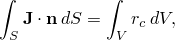

where *V* is any control volume whose surface is *S*,  is the outward normal to *S*,  is the electrical current density (current per unit area), and  is the internal volumetric current source per unit volume.

The flow of electrical current is described by Ohm's law: 

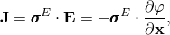

where

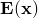

is the electrical field intensity, defined as the negative of the gradient of the electrical potential 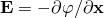,


is the electrical potential,

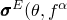)

is the electrical conductivity matrix,


is the temperature, and

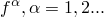

are predefined field variables.

Using Ohm's law in the conservation equation, written in variational form, provides the governing equation of the finite element model: 

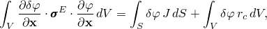

where 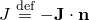 is the current density entering the control volume across *S*.

#### Defining the electrical conductivity

The electrical conductivity, , can be isotropic, orthotropic, or fully anisotropic (see ["Electrical conductivity," Section 26.5.1](pt05ch26s05abm61.md)). Ohm's law assumes that the electrical conductivity is independent of the electrical field, . The coupled thermal-electrical problem is nonlinear when the electrical conductivity depends on temperature.

### Specifying the amount of thermal energy generated due to electrical current

Joule's law describes the rate of electrical energy, , dissipated by current flowing through a conductor as 


The amount of this energy released as internal heat within the body is , where  is an energy conversion factor. You specify  in the material definition. It is assumed that all the electrical energy is converted into heat () if you do not include the joule heat fraction in the material description. The fraction given can include a unit conversion factor, if required.

| **Input File Usage: ** | ``` [*JOULE HEAT FRACTION](../key/key-link.md#usb-kws-mjouleheatfrac) ``` |
| --- | --- |

| **Abaqus/CAE Usage: ** | Property module: material editor: ****Thermal****Joule Heat Fraction**** |
| --- | --- |

### Steady-state analysis

Steady-state analysis provides the steady-state solution directly. Steady-state thermal analysis means that the internal energy term (the specific heat term) in the governing heat transfer equation is omitted. Only direct current is considered in the electrical problem, and it is assumed that the system has negligible capacitance. (Electrical transient effects are so rapid that they can be neglected.)

| **Input File Usage: ** | ``` [*COUPLED THERMAL-ELECTRICAL](../key/key-link.md#usb-kws-hthermalelectric), STEADY STATE ``` |
| --- | --- |

| **Abaqus/CAE Usage: ** | Step module: **Create Step**: **General**: **Coupled thermal-electric**: **Basic**: **Response: Steady state** |
| --- | --- |

#### Assigning a "time" scale to the analysis

A steady-state analysis has no intrinsic physically meaningful time scale. Nevertheless, you can assign a “time” scale to the analysis step, which is often convenient for output identification and for specifying prescribed temperatures, electrical potential, and fluxes (heat flux and current density) with varying magnitudes. Thus, when steady-state analysis is chosen, you specify a “time” period and “time” incrementation parameters for the step; Abaqus/Standard then increments through the step accordingly.

Any fluxes or boundary condition changes to be applied during a steady-state step should be given using appropriate amplitude references to specify their “time” variations (["Amplitude curves," Section 34.1.2](pt07ch34s01aus115.md)). If fluxes and boundary conditions are specified for the step without amplitude references, they are assumed to change linearly with “time” during the step—from their magnitudes at the end of the previous step (or zero, if this is the beginning of the analysis) to their newly specified magnitudes at the end of this step (see ["Defining an analysis," Section 6.1.2](pt03ch06s01abo05.md)).

### Transient analysis

Alternatively, the thermal portion of the coupled thermal-electrical problem can be considered transient. As in steady-state analysis, electrical transient effects are neglected. See ["Uncoupled heat transfer analysis," Section 6.5.2](pt03ch06s05at18.md), for a more detailed description of the heat transfer capability in Abaqus/Standard.

| **Input File Usage: ** | ``` [*COUPLED THERMAL-ELECTRICAL](../key/key-link.md#usb-kws-hthermalelectric) ``` |
| --- | --- |

| **Abaqus/CAE Usage: ** | Step module: **Create Step**: **General**: **Coupled thermal-electric**: **Basic**: **Response: Transient** |
| --- | --- |

#### Time incrementation

Time integration in the transient heat transfer problem is done with the same backward Euler method used in uncoupled heat transfer analysis. This method is unconditionally stable for linear problems. You can specify the time increments directly, or Abaqus can select them automatically based on a user-prescribed maximum nodal temperature change in an increment. Automatic time incrementation is generally preferred.

##### Automatic incrementation

The time increment size can be selected automatically based on a user-prescribed maximum allowable nodal temperature change in an increment, . Abaqus/Standard will restrict the time increments to ensure that these values are not exceeded at any node (except nodes with boundary conditions) during any increment of the analysis (see ["Time integration accuracy in transient problems," Section 7.2.4](pt03ch07s02aus52.md)).

| **Input File Usage: ** | ``` [*COUPLED THERMAL-ELECTRICAL](../key/key-link.md#usb-kws-hthermalelectric), DELTMX= ``` |
| --- | --- |

| **Abaqus/CAE Usage: ** | Step module: **Create Step**: **General**: **Coupled thermal-electric**: **Basic**: **Response: Transient**; **Incrementation**: **Type: Automatic**: **Max. allowable temperature change per increment:**  |
| --- | --- |

##### Fixed incrementation

If you select fixed time incrementation and do not specify , fixed time increments equal to the user-specified initial time increment, , will then be used throughout the analysis.

| **Input File Usage: ** | ``` [*COUPLED THERMAL-ELECTRICAL](../key/key-link.md#usb-kws-hthermalelectric)  ``` |
| --- | --- |

| **Abaqus/CAE Usage: ** | Step module: **Create Step**: **General**: **Coupled thermal-electric**: **Basic**: **Response: Transient**; **Incrementation**: **Type: Fixed**: **Increment size:**  |
| --- | --- |

##### Spurious oscillations due to small time increments

In transient heat transfer analysis with second-order elements there is a relationship between the minimum usable time increment and the element size. A simple guideline is 


where  is the time increment,  is the density, *c* is the specific heat, *k* is the thermal conductivity, and  is a typical element dimension (such as the length of a side of an element). If time increments smaller than this value are used in a mesh of second-order elements, spurious oscillations can appear in the solution, in particular in the vicinity of boundaries with rapid temperature changes. These oscillations are nonphysical and may cause problems if temperature-dependent material properties are present. In transient analyses using first-order elements the heat capacity terms are lumped, which eliminates such oscillations but can lead to locally inaccurate solutions for small time increments. If smaller time increments are required, a finer mesh should be used in regions where the temperature changes rapidly.

There is no upper limit on the time increment size (the integration procedure is unconditionally stable) unless nonlinearities cause convergence problems.

#### Ending a transient analysis

By default, a transient analysis will end when the specified time period has been completed. Alternatively, you can specify that the analysis should continue until steady-state conditions are reached. Steady state is defined by the temperature change rate; when the temperature changes at a rate that is less than the user-specified rate (given as part of the step definition), the analysis terminates.

| **Input File Usage: ** | Use the following option to end the analysis when the time period is reached: |
| --- | --- |
|  | ``` [*COUPLED THERMAL-ELECTRICAL](../key/key-link.md#usb-kws-hthermalelectric), END=PERIOD (default) ``` Use the following option to end the analysis based on the temperature change rate: ``` [*COUPLED THERMAL-ELECTRICAL](../key/key-link.md#usb-kws-hthermalelectric), END=SS ``` |

| **Abaqus/CAE Usage: ** | Step module: **Create Step**: **General**: **Coupled thermal-electric**: **Basic**: **Response: Transient**; **Incrementation**: **End step when temperature change is less than** |
| --- | --- |

### Fully coupled solution schemes

Abaqus/Standard offers an exact as well as an approximate implementation of Newton's method for coupled thermal-electrical analysis.

#### Exact implementation

An exact implementation of Newton's method involves a nonsymmetric Jacobian matrix as is illustrated in the following matrix representation of the coupled equations:

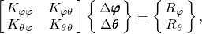

where 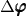 and  are the respective corrections to the incremental electrical potential and temperature,  are submatrices of the fully coupled Jacobian matrix, and 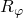 and  are the electrical and thermal residual vectors, respectively.

Solving this system of equations requires the use of the unsymmetric matrix storage and solution scheme. Furthermore, the electrical and thermal equations must be solved simultaneously. The method provides quadratic convergence when the solution estimate is within the radius of convergence of the algorithm. The exact implementation is used by default.

#### Approximate implementation

Some problems require a fully coupled analysis in the sense that the electrical and thermal solutions evolve simultaneously, but with a weak coupling between the two solutions. In other words, the components in the off-diagonal submatrices 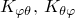 are small compared to the components in the diagonal submatrices 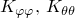. For these problems a less costly solution may be obtained by setting the off-diagonal submatrices to zero, so that we obtain an approximate set of equations:

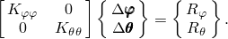

As a result of this approximation the electrical and thermal equations can be solved separately, with fewer equations to consider in each subproblem. The savings due to this approximation, measured as solver time per iteration, will be of the order of a factor of two, with similar significant savings in solver storage of the factored stiffness matrix. Further, in situations without strong thermal loading due to cavity radiation, the subproblems may be fully symmetric or approximated as symmetric, so that the less costly symmetric storage and solution scheme can be used. The solver time savings for a symmetric solution is an additional factor of two. Unless you explicitly select the unsymmetric solver for the step (["Defining an analysis," Section 6.1.2](pt03ch06s01abo05.md)), the symmetric solver will be used with this separated technique.

This modified form of Newton's method does not affect solution accuracy since the fully coupled effect is considered through the residual vector  at each increment in time. However, the rate of convergence is no longer quadratic and depends strongly on the magnitude of the coupling effect, so more iterations are generally needed to achieve equilibrium than with the exact implementation of Newton's method. When the coupling is significant, the convergence rate becomes very slow and may prohibit the attainment of a solution. In such cases the exact implementation of Newton's method is required. In cases where it is possible to use this approximation, the convergence in an increment will depend strongly on the quality of the first guess to the incremental solution, which you can control by selecting the extrapolation method used for the step (see ["Defining an analysis," Section 6.1.2](pt03ch06s01abo05.md)).

| **Input File Usage: ** | Use the following option to specify a separated solution scheme: |
| --- | --- |
|  | ``` [*SOLUTION TECHNIQUE](../key/key-link.md#usb-kws-hsolutiontech), TYPE=SEPARATED ``` |

| **Abaqus/CAE Usage: ** | Step module: **Create Step**: **General**: **Coupled thermal-electric**: **Other**: **Solution technique: Separated** |
| --- | --- |

### Uncoupled electric conduction and heat transfer analysis

The coupled thermal-electrical procedure can also be used to perform uncoupled electric conduction analysis for the whole model or just part of the model (using coupled thermal-electrical elements). Uncoupled electrical analysis is available by omitting the thermal properties from the material description, in which case only the electric potential degrees of freedom are activated in the element and all heat transfer effects are ignored. If heat transfer effects are ignored in the entire model, you should invoke the separated solution technique described above. Use of this technique will then invoke the symmetric storage and solution scheme, which is an exact representation of a purely electrical problem.

Similarly, coupled thermal-electrical elements can be used in an uncoupled heat transfer analysis (["Uncoupled heat transfer analysis," Section 6.5.2](pt03ch06s05at18.md)), in which case all electric conduction effects are ignored. This feature is useful if a thermal-electrical analysis is followed by a pure heat conduction analysis. A typical example is a welding process, where the electric current is applied instantaneously, followed by a cooldown period during which no electrical effects need to be considered. The symmetric solver is activated by default in an uncoupled heat transfer analysis.

### Cavity radiation

Cavity radiation can be activated in a heat transfer step. This feature involves interacting heat transfer between all of the facets of the cavity surface, dependent on the facet temperatures, facet emissivities, and the geometric view factors between each facet pair. When the thermal emissivity is a function of temperature or field variables, you can specify the maximum allowable emissivity change during an increment in addition to the maximum temperature change to control the time incrementation. See ["Cavity radiation," Section 41.1.1](pt09ch41s01aus187.md), for more information.

| **Input File Usage: ** | Use the following option in the step definition to activate cavity radiation: |
| --- | --- |
|  | ``` [*RADIATION VIEW FACTOR](../key/key-link.md#usb-kws-hradviewfactor) ``` Use the following option to specify the maximum allowable emissivity change: ``` [*HEAT TRANSFER](../key/key-link.md#usb-kws-hheattrans), MXDEM=*max_delta_emissivity* ``` |

| **Abaqus/CAE Usage: ** | You can specify the maximum allowable emissivity change for a heat transfer step. |
| --- | --- |
|  | Step module: **Create Step**: **General**: **Heat transfer**: **Incrementation**: **Max. allowable emissivity change per increment** |

### Initial conditions

By default, the initial temperature of all nodes is zero. You can specify nonzero initial temperatures or field variables (see ["Initial conditions in Abaqus/Standard and Abaqus/Explicit," Section 34.2.1](pt07ch34s02aus116.md)). Since only steady-state electrical currents are considered, the initial value of the electrical potential is not relevant.

### Boundary conditions

Boundary conditions can be used to prescribe the electrical potential,  (degree of freedom 9), and the temperature,  (degree of freedom 11), at the nodes. See ["Boundary conditions in Abaqus/Standard and Abaqus/Explicit," Section 34.3.1](pt07ch34s03aus118.md).

Boundary conditions can be specified as functions of time by referring to amplitude curves (see ["Amplitude curves," Section 34.1.2](pt07ch34s01aus115.md)).

A boundary without any prescribed boundary conditions corresponds to an insulated surface.

### Loads

Both thermal and electrical loads can be applied in a coupled thermal-electrical analysis.

#### Applying thermal loads

The following types of thermal loads can be prescribed in a coupled thermal-electrical analysis, as described in ["Thermal loads," Section 34.4.4](pt07ch34s04aus123.md):
- Concentrated heat fluxes.
- Body fluxes and distributed surface fluxes.
- Average-temperature radiation conditions.
- Convective film conditions and radiation conditions.

#### Applying electrical loads

The following types of electrical loads can be prescribed, as described in ["Electromagnetic loads," Section 34.4.5](pt07ch34s04aus124.md):
- Concentrated current.
- Distributed surface current densities and body current densities.

### Predefined fields

Predefined temperature fields are not allowed in coupled thermal-electrical analyses. Boundary conditions should be used instead to specify temperatures, as described above.

Other predefined field variables can be specified in a coupled thermal-electrical analysis. These values affect only field-variable-dependent material properties, if any. See ["Predefined fields," Section 34.6.1](pt07ch34s06aus128.md).

### Material options

Both thermal and electrical properties are active in coupled thermal-electrical analyses. If thermal properties are omitted, an uncoupled electrical analysis will be performed.

All mechanical behavior material models (such as elasticity and plasticity) are ignored in a coupled thermal-electrical analysis.

#### Thermal material properties

For the heat transfer portion of the analysis, the thermal conductivity must be defined (see ["Conductivity," Section 26.2.2](pt05ch26s02abm55.md)). The specific heat must also be defined for transient heat transfer problems (see ["Specific heat," Section 26.2.3](pt05ch26s02abm56.md)). If changes in internal energy due to phase changes are important, latent heat can be defined (see ["Latent heat," Section 26.2.4](pt05ch26s02abm57.md)). Thermal expansion coefficients (["Thermal expansion," Section 26.1.2](pt05ch26s01abm52.md)) are not meaningful in a coupled thermal-electrical analysis since deformation of the structure is not considered. Internal heat generation can be specified (see ["Uncoupled heat transfer analysis," Section 6.5.2](pt03ch06s05at18.md)).

#### Electrical material properties

For the electrical portion of the analysis, the electrical conductivity must be defined (see ["Electrical conductivity," Section 26.5.1](pt05ch26s05abm61.md)). The electrical conductivity can be a function of temperature and user-defined field variables. The fraction of electrical energy dissipated as heat can also be defined, as explained above.

### Elements

The simultaneous solution in a coupled thermal-electrical analysis requires the use of elements that have both temperature (degree of freedom 11) and electrical potential (degree of freedom 9) as nodal variables. The finite element model can also include pure heat transfer elements (so that a pure heat transfer analysis is provided for that part of the model) and coupled thermal-electrical elements for which no thermal properties are given (so that a pure electrical conduction solution is provided for that part of the model).

Coupled thermal-electrical elements are available in Abaqus/Standard in one dimension, two dimensions (planar and axisymmetric), and three dimensions. See ["Choosing the appropriate element for an analysis type," Section 27.1.3](pt06ch27s01aus112.md).

### Output

The following output variables can be used to request output relating to the electric conduction solution:

Element integration point variables:

| EPG | Magnitude and components of the electrical potential gradient vector, 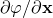. |
| --- | --- |

| EPGM | Magnitude of the electrical potential gradient vector. |
| --- | --- |

| EPG*n* | Component *n* of the electrical potential gradient vector (*n*=1, 2, 3). |
| --- | --- |

| ECD | Magnitude and components of the electrical current density vector, *J*. |
| --- | --- |

| JENER | Electrical energy dissipated due to flow of current, 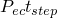. |
| --- | --- |

Whole element variables:

| ECURS | Distributed applied electrical current. |
| --- | --- |

| NCURS | Electrical current at nodes due to electric conduction. |
| --- | --- |

| ELJD | Total electrical energy dissipated due to flow of current, 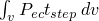. |
| --- | --- |

Nodal variables:

| EPOT | Electrical potential, . |
| --- | --- |

| RECUR | Reactive electrical current. |
| --- | --- |

| CECUR | Concentrated applied electrical current. |
| --- | --- |

Whole model variables:

| ALLJD | Electrical energy summed over the model. |
| --- | --- |

Surface interaction variables (see ["Electrical contact properties," Section 37.3.1](pt09ch37s03aus175.md)):

| ECD | Electrical current density. |
| --- | --- |

| ECDA | ECD multiplied by area. |
| --- | --- |

| ECDT | Time integrated ECD. |
| --- | --- |

| ECDTA | Time integrated ECDA. |
| --- | --- |

| SJD | Heat flux per unit area generated by the electrical current. |
| --- | --- |

| SJDA | SJD multiplied by area. |
| --- | --- |

| SJDT | Time integrated SJD. |
| --- | --- |

| SJDTA | Time integrated SJDA. |
| --- | --- |

| WEIGHT | Heat distribution between interface surfaces, *f*. |
| --- | --- |

#### Considerations for steady-state coupled thermal-electrical analysis

 In a steady-state coupled thermal-electrical analysis the electrical energy dissipated due to flow of electrical current at an integration point (output variable JENER) is computed using the following relationship:   


where  denotes the electrical energy dissipated due to flow of electrical current and  is the current step time. In the above relationship it is assumed that the rate of the electrical energy dissipation, , has a constant value in the step that is equal to the value currently computed.

The output variable JENER and the derived output variables ELJD and ALLJD contain the values of electrical energies dissipated in the current step only. Similarly, the contribution from the electrical current flow to the output variable ALLWK includes only the external work performed in the current step.

### Input file template

```
[*HEADING](../key/key-link.md#usb-kws-mheading)
…
[*MATERIAL](../key/key-link.md#usb-kws-mmaterial), NAME=*mat1*
[*CONDUCTIVITY](../key/key-link.md#usb-kws-mconductivity)
*Data lines to define thermal conductivity*
[*ELECTRICAL CONDUCTIVITY](../key/key-link.md#usb-kws-melectricconduct)
*Data lines to define electrical conductivity*
[*JOULE HEAT FRACTION](../key/key-link.md#usb-kws-mjouleheatfrac)
*Data lines to define the fraction of electric energy released as heat*
**
[*STEP](../key/key-link.md#usb-kws-hstep)
[*COUPLED THERMAL-ELECTRICAL](../key/key-link.md#usb-kws-hthermalelectric)
*Data line to define incrementation and steady state*
[*BOUNDARY](../key/key-link.md#usb-kws-hboundary)
*Data lines to define boundary conditions on electrical potential and
temperature degrees of freedom*
[*CECURRENT](../key/key-link.md#usb-kws-hcecurrent)
*Data lines to define concentrated currents*
[*DECURRENT](../key/key-link.md#usb-kws-hdecurrent) and/or [*DSECURRENT](../key/key-link.md#usb-kws-hdsecurrent)
*Data lines to define distributed current densities*
[*CFLUX](../key/key-link.md#usb-kws-hcflux) and/or [*DFLUX](../key/key-link.md#usb-kws-hdflux) and/or [*DSFLUX](../key/key-link.md#usb-kws-hdsflux)
*Data lines to define thermal loading*
[*FILM](../key/key-link.md#usb-kws-hfilm) and/or [*SFILM](../key/key-link.md#usb-kws-hsfilm) and/or [*RADIATE](../key/key-link.md#usb-kws-hradiate) and/or [*SRADIATE](../key/key-link.md#usb-kws-hsradiate)
*Data lines to define convective film and radiation conditions*
…
[*CONTACT PRINT](../key/key-link.md#usb-kws-hcontactprint) or [*CONTACT FILE](../key/key-link.md#usb-kws-hcontactfile)
*Data lines to request output of surface interaction variables*
[*END STEP](../key/key-link.md#usb-kws-hendstep)
```


