# 6.7.5 Eddy current analysis


**Products: **Abaqus/Standard  Abaqus/CAE  

##### **References**

- ["Mapping thermal and magnetic loads," Section 3.2.25](pt01ch03s02abx25.md)
- ["Electromagnetic analysis procedures," Section 6.7.1](pt03ch06s07abo10.md)
- ["Electrical conductivity," Section 26.5.1](pt05ch26s05abm61.md)
- ["Magnetic permeability," Section 26.5.3](pt05ch26s05abm63.md)
- ["Electromagnetic loads," Section 34.4.5](pt07ch34s04aus124.md)
- ["Predefined loads for sequential coupling," Section 16.1.3](pt04ch16s01aus97.md)
- [*ELECTROMAGNETIC](../key/key-link.md#usb-kws-helectromagnetic)
- [*D EM POTENTIAL](../key/key-link.md#usb-kws-hdempotential)
- [*DECURRENT](../key/key-link.md#usb-kws-hdecurrent)
- [*DSECURRENT](../key/key-link.md#usb-kws-hdsecurrent)
- [*MOTION](../key/key-link.md#usb-kws-hmotion)
- ["UDECURRENT," Section 1.1.24 of the Abaqus User Subroutines Reference Guide](../sub/sub-link.md#sub-rtn-uudecurrent)
- ["UDEMPOTENTIAL," Section 1.1.25 of the Abaqus User Subroutines Reference Guide](../sub/sub-link.md#sub-rtn-uudempotential)
- ["UDSECURRENT," Section 1.1.27 of the Abaqus User Subroutines Reference Guide](../sub/sub-link.md#sub-rtn-uudsecurrent)
- ["Configuring a time-harmonic electromagnetic analysis" in "Configuring linear perturbation analysis procedures," Section 14.11.2 of the Abaqus/CAE User's Guide](../usi/usi-link.md#usi-sim-configure-timeharm-em)
- ["Defining a magnetic vector potential boundary condition," Section 16.10.17 of the Abaqus/CAE User's Guide](../usi/usi-link.md#usi-lbi-bceditors-magvectorpotential)

### Overview

Eddy current problems:
- involve coupling between electric and magnetic fields, which are solved for simultaneously;
- solve Maxwell's equations describing electromagnetic phenomena under the low-frequency assumption that neglects the effects of displacement currents;
- require the use of electromagnetic elements in the whole domain;
- require that magnetic permeability is specified in the whole domain and electrical conductivity is specified in the conducting regions;
- allow for both time-harmonic and transient electromagnetic solutions;
- allow predefined conductor translation and rotation;
- calculate as output variables, rate of Joule heating and intensity of magnetic body forces associated with eddy currents, and these output variables can be transferred from a time-harmonic electromagnetic solution to drive a subsequent heat transfer, coupled temperature-displacement, or stress/displacement analysis, thereby allowing for the coupling of electromagnetic fields with thermal and/or mechanical fields in a sequentially coupled manner; and
- can be solved using continuum elements in two- and three-dimensional space.

### Eddy current analysis

Eddy currents are generated in a metal workpiece when it is placed within a time-varying magnetic field. Joule heating arises when the energy dissipated by the eddy currents flowing through the workpiece is converted into thermal energy. This heating mechanism is usually referred to as induction heating; the induction cooker is an example of a device that uses this mechanism. The time-varying magnetic field is usually generated by a coil that is placed close to the workpiece. The coil carries either a known amount of total current or an unknown amount of current under a known potential (voltage) difference. The current in the coil is assumed to be alternating at a known frequency for a time-harmonic eddy current analysis but may have an arbitrary variation in time for a transient eddy current analysis.

The time-harmonic eddy current analysis procedure is based on the assumption that a time-harmonic excitation with a certain frequency results in a time-harmonic electromagnetic response with the same frequency everywhere in the domain. In other words, both the electric and the magnetic fields oscillate at the same frequency as that of the alternating current in the coil. The transient eddy current analysis does not make any assumption regarding the time-variation of the current in the coil; in fact any arbitrary time variation can be specified, and the electric and magnetic fields follow from the solution to Maxwell's equations in the time domain.

The eddy current analysis provides output, such as Joule heat dissipation or magnetic body force intensity, that can be transferred, from a time-harmonic eddy current analysis only, to drive a subsequent heat transfer, coupled temperature-displacement, or stress/displacement analysis. This allows for modeling the interactions of the electromagnetic fields with thermal and/or mechanical fields in a sequentially coupled manner. See ["Mapping thermal and magnetic loads," Section 3.2.25](pt01ch03s02abx25.md), and ["Predefined loads for sequential coupling," Section 16.1.3](pt04ch16s01aus97.md), for details.

Electromagnetic elements must be used to model the response of all the regions in an eddy current analysis including the coil, the workpiece, and the space in between and surrounding them. To obtain accurate solutions, the outer boundary of the space (surrounding the coil and the workpiece) being modeled must be at least a few characteristic length scales away from the device on all sides.

The electromagnetic elements use an element edge-based interpolation of the fields instead of the standard node-based interpolation. The user-defined nodes only define the geometry of the elements; and the degrees of freedom of the element are not associated with these nodes, which has implications for applying boundary conditions (see ["Boundary conditions](pt03ch06s07at24.md#usb-anl-aeddycurrent-bc)” below).

### Governing field equations

The electric and magnetic fields are governed by Maxwell's equations describing electromagnetic phenomena. The formulation is based on the low-frequency assumption, which neglects the displacement current correction term in Ampere's law. This assumption is appropriate when the wavelength of the electromagnetic waves corresponding to the excitation frequency is large compared to typical length scales over which the response is computed. In the following discussion, the governing equations are written for a linear medium.

#### Time-harmonic analysis

It is convenient to introduce a magnetic vector potential, , such that the magnetic flux density vector . The solution procedure seeks a time-harmonic electromagnetic response, 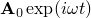, with frequency  radians/sec when the system is subjected to a time-harmonic excitation of the same frequency; for example, through an impressed oscillating volume current density, 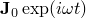. In the preceding expressions the vectors  and  represent the amplitudes of the magnetic vector potential and applied volume current density vector, respectively, while the exponential factors (with ) represent the corresponding phases. Under these assumptions, Maxwell's equations in the absence of conductor motion reduce to 

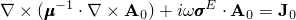

in terms of the amplitudes of the field quantities, 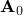 and 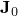; the magnetic permeability tensor,  ; and the electrical conductivity tensor, . The magnetic permeability relates the magnetic flux density, , to the magnetic field, , through a constitutive equation of the form: , while the electrical conductivity relates the volume current density, , and the electric field, , by Ohm's law: 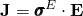.

The variational form of the above equation is

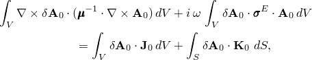

where 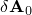 represents the variation of the magnetic vector potential, and 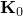 represents the applied tangential surface current density, if any, at the external surfaces.

Abaqus/Standard solves the variational form of Maxwell's equations for the in-phase (real) and out-of-phase (imaginary) components of the magnetic vector potential. The other field quantities are derived from the magnetic vector potential.

#### Transient analysis

It is convenient to introduce a magnetic vector potential, , assumed to be a function of spatial position and time, such that the magnetic flux density vector . The solution procedure seeks a time-dependent electromagnetic response, 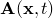, when the system is subjected to a time-dependent excitation; for example, through an impressed distribution of volume current density, 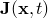. Under these assumptions, Maxwell's equations in the absence of conductor motion reduce to 

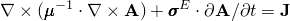

in terms of the field quantities,  and ; the magnetic permeability tensor,  ; and the electrical conductivity tensor, . The magnetic permeability relates the magnetic flux density, , to the magnetic field, , through a constitutive equation of the form: , while the electrical conductivity relates the volume current density, , and the electric field, , by Ohm's law: .

The variational form of the above equation is

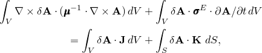

where  represents the variation of the magnetic vector potential, and  represents the applied tangential surface current density, if any, at the external surfaces.

Abaqus/Standard solves the variational form of Maxwell's equations for the components of the magnetic vector potential. The other field quantities are derived from the magnetic vector potential.

#### Predefined conductor motion

Electric fields induced in a conductor have two parts: the first part due to the changing magnetic flux (Faraday’s law of induction), which is already accounted for in the formulation above, and the second part due to the motion of the conductor in the magnetic field. The second part modifies the governing equation as follows (shown only for a transient procedure, although the capability is available for the time-harmonic procedure as well):

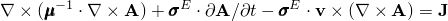

 in terms of the prescribed velocity of motion . You can prescribe both translational and rotational velocity of motion. The formulation assumes that the conductor is uniform in the direction of motion; in other words, it does not have any geometric features in the direction of motion.

Conductor motion results in unsymmetric contributions toward the element operator. By default, the unsymmetric storage and solution scheme is used with conductor motion.

#### Defining the magnetic behavior

The magnetic behavior of the electromagnetic medium can be linear or nonlinear. However, only linear magnetic behavior is available for time-harmonic eddy current analysis. Linear magnetic behavior is characterized by a magnetic permeability tensor that is assumed to be independent of the magnetic field. It is defined through direct specification of the absolute magnetic permeability tensor, , which can be isotropic, orthotropic, or fully anisotropic (see ["Magnetic permeability," Section 26.5.3](pt05ch26s05abm63.md)). The magnetic permeability can also depend on temperature and/or predefined field variables. For a time-harmonic eddy current analysis, the magnetic permeability can also depend on frequency.

Nonlinear magnetic behavior, which is available only for transient eddy current analysis, is characterized by magnetic permeability that depends on the strength of the magnetic field. The nonlinear magnetic material model in Abaqus is suitable for ideally soft magnetic materials characterized by a monotonically increasing response in B–H space, where B and H refer to the strengths of the magnetic flux density vector and the magnetic field vector, respectively. Nonlinear magnetic behavior is defined through direct specification of one or more B–H curves that provide B as a function of H and, optionally, temperature and/or predefined field variables, in one or more directions. Nonlinear magnetic behavior can be isotropic, orthotropic, or transversely isotropic (which is a special case of the more general orthotropic behavior).

#### Defining the electrical conductivity

The electrical conductivity, , can be isotropic, orthotropic, or fully anisotropic (see ["Electrical conductivity," Section 26.5.1](pt05ch26s05abm61.md)). The electrical conductivity can also depend on temperature and/or predefined field variables. For a time-harmonic eddy current analysis, the electrical conductivity can also depend on frequency. Ohm's law assumes that the electrical conductivity is independent of the electrical field, .

### Time-harmonic analysis

The eddy current analysis procedure provides the time-harmonic solution directly at a given excitation frequency. You can specify one or more excitation frequencies, one or more frequency ranges, or a combination of excitation frequencies and ranges.

| **Input File Usage: ** | ``` [*ELECTROMAGNETIC](../key/key-link.md#usb-kws-helectromagnetic), LOW FREQUENCY, TIME HARMONIC *lower_freq1, upper_freq1, num_pts1* *lower_freq2, upper_freq2, num_pts2* ... *single_freq1* *single_freq2* ... ``` |
| --- | --- |
|  | For example, the following input illustrates the simplest case of specifying excitation at a single frequency: ``` [*ELECTROMAGNETIC](../key/key-link.md#usb-kws-helectromagnetic), LOW FREQUENCY, TIME HARMONIC *single_freq1* ``` |

| **Abaqus/CAE Usage: ** | Step module: **Create Step**: **Linear perturbation**: **Electromagnetic, Time harmonic**; enter data in table, and add rows as necessary |
| --- | --- |

### Transient analysis

The eddy current analysis procedure provides the transient solution to a given arbitrary time-dependent excitation.

| **Input File Usage: ** | ``` [*ELECTROMAGNETIC](../key/key-link.md#usb-kws-helectromagnetic), LOW FREQUENCY, TRANSIENT ``` |
| --- | --- |

| **Abaqus/CAE Usage: ** | A transient eddy current analysis is not supported in Abaqus/CAE. |
| --- | --- |

#### Time incrementation

Time integration in the transient eddy current analysis is done with the backward Euler method. This method is unconditionally stable for linear problems but may lead to inaccuracies if time increments are too large. The resulting system of equations can be nonlinear in general, and Abaqus/Standard uses Newton's method to solve the system. The solution usually is obtained as a series of increments, with iterations to obtain equilibrium within each increment. Increments must sometimes be kept small to ensure accuracy of the time integration procedure. The choice of increment size is also a matter of computational efficiency: if the increments are too large, more iterations are required. Furthermore, Newton's method has a finite radius of convergence; too large an increment can prevent any solution from being obtained because the initial state is too far away from the equilibrium state that is being sought—it is outside the radius of convergence. Thus, there is an algorithmic restriction on the increment size. 

##### Automatic incrementation

In most cases the default automatic incrementation scheme is preferred because it will select increment sizes based on computational efficiency. However, you must ensure that the time increments are such that the time integration results in an accurate solution. Abaqus/Standard does not have any built in checks to ensure integration accuracy.

| **Input File Usage: ** | ``` [*ELECTROMAGNETIC](../key/key-link.md#usb-kws-helectromagnetic), LOW FREQUENCY, TRANSIENT ``` |
| --- | --- |

| **Abaqus/CAE Usage: ** | A transient eddy current analysis is not supported in Abaqus/CAE. |
| --- | --- |

##### Direct incrementation

Direct user control of the increment size is also provided; if you have considerable experience with a particular problem, you may be able to select a more economical approach.

| **Input File Usage: ** | ``` [*ELECTROMAGNETIC](../key/key-link.md#usb-kws-helectromagnetic), LOW FREQUENCY, TRANSIENT, DIRECT ``` |
| --- | --- |

| **Abaqus/CAE Usage: ** | A transient eddy current analysis is not supported in Abaqus/CAE. |
| --- | --- |

### Ill-conditioning in eddy current analyses with electrically nonconductive regions

In an eddy current analysis it is very common that large portions of the model consist of electrically nonconductive regions, such as air and/or a vacuum. In such cases it is well known that the associated stiffness matrix can be very ill-conditioned; i.e., it can have many singularities ([Br, 1999](pt03ch06s07at24.md#ref-usb-biro)). Abaqus uses a special iterative solution technique to prevent the ill-conditioned matrix from negatively impacting the computed electric and magnetic fields. The default implementation works well for many problems. However, there can be situations in which the default numerical scheme fails to converge or results in a noisy solution. In such cases adding a “small” amount of artificial electrical conductivity to the nonconductive domain may help regularize the problem and allow Abaqus to converge to the correct solution. The artificial electrical conductivity should be chosen such that the electromagnetic waves propagating through these regions undergo little modification and, in particular, do not experience the sharp exponential decay that is typical when such fields impinge upon a real conductor. It is recommended that you set the artificial conductivity to be about five to eight orders of magnitude less than that of any of the conductors in the model.

As an alternative to specifying electrical conductivity in the nonconductive domain, Abaqus also provides a stabilization scheme to help mitigate the effects of the ill-conditioning. You can provide input to this stabilization algorithm by specifying the stabilization factor, which is assumed to be 1.0 by default if the stabilization scheme is used. Higher values of the stabilization factor lead to more stabilization, while lower values of the stabilization factor lead to less stabilization.

| **Input File Usage: ** | Use the following to use stabilization in a time-harmonic procedure: |
| --- | --- |
|  | ``` [*ELECTROMAGNETIC](../key/key-link.md#usb-kws-helectromagnetic), LOW FREQUENCY, TIME HARMONIC, STABILIZATION=*stabilization factor* ``` Use the following to use stabilization in a transient procedure: ``` [*ELECTROMAGNETIC](../key/key-link.md#usb-kws-helectromagnetic), LOW FREQUENCY, TRANSIENT, STABILIZATION=*stabilization factor* ``` |

| **Abaqus/CAE Usage: ** | The default stabilization factor cannot be modified in Abaqus/CAE. |
| --- | --- |

### Prescribed conductor motion

You can specify conductor motion by prescribing the direction and magnitude of the translational or rotational velocity vector over an element set representing the conductor. Only a single conductor motion is allowed in a step.

| **Input File Usage: ** | Use the following to prescribe a translational velocity: |
| --- | --- |
|  | ``` [*MOTION](../key/key-link.md#usb-kws-hmotion), ELEMENT, TRANSLATION ``` Use the following to prescribe a rotational velocity: ``` [*MOTION](../key/key-link.md#usb-kws-hmotion), ELEMENT, ROTATION ``` |

| **Abaqus/CAE Usage: ** | Specifying conductor motion is not supported in Abaqus/CAE. |
| --- | --- |

### Initial conditions

Initial values of temperature and/or predefined field variables can be specified. These values affect only temperature and/or field-variable-dependent material properties, if any. Initial conditions on the electric and/or magnetic fields cannot be specified in an eddy current analysis.

### Boundary conditions

Electromagnetic elements use an element edge-based interpolation of the fields. The degrees of freedom of the element are not associated with the user-defined nodes, which only define the geometry of the element. Consequently, the standard node-based method of specifying boundary conditions cannot be used with electromagnetic elements. The method used for specifying boundary conditions for electromagnetic elements is described in the following paragraphs.

Boundary conditions in Abaqus typically refer to what are traditionally known as Dirichlet-type boundary conditions in the literature, where the values of the primary variable are known on the whole boundary or on a portion of the boundary. The alternative, Neumann-type boundary conditions, refer to situations where the values of the conjugate to the primary variable are known on portions of the boundary. In Abaqus Neumann-type boundary conditions are represented as surface loads in the finite-element formulation.

For electromagnetic boundary value problems, Dirichlet boundary conditions on an enclosing surface must be specified as , where  is the outward normal to the surface, as discussed in this section. Neumann boundary conditions must be specified as the surface current density vector, , as discussed in ["Loads](pt03ch06s07at24.md#usb-anl-aeddycurrent-loads)” below.

In Abaqus Dirichlet boundary conditions are specified as magnetic vector potential, , on (element-based) surfaces that represent symmetry planes and/or external boundaries in the model; Abaqus computes  for the representative surfaces. In applications where the electromagnetic fields are driven by a current-carrying coil that is close to the workpiece, the model may span a domain that is up to 10 times the characteristic length scale associated with the coil/workpiece assembly. In such cases, the electromagnetic fields are assumed to have decayed sufficiently in the far-field, and the value of the magnetic vector potential can be set to zero in the far-field boundary. On the other hand, in applications such as one where a conductor is embedded in a uniform (but varying time-harmonically in a time-harmonic eddy current analysis or with a more general time variation in a transient eddy current analysis) far-field magnetic field, it may be necessary to specify nonzero values of the magnetic vector potential on some portions of the external boundary. In this case an alternative method to model the same physical phenomena is to specify the corresponding unique value of surface current density, , on the far-field boundary (see ["Loads](pt03ch06s07at24.md#usb-anl-aeddycurrent-loads)” below).  can be computed based on known values of the far-field magnetic field.

A surface without any prescribed boundary condition corresponds to a surface with zero surface currents, or no loads.

 Nonuniform boundary conditions can be defined with user subroutine [`UDEMPOTENTIAL`](../sub/sub-link.md#sub-xsl-udempotential). 

#### Prescribing boundary conditions in a time-harmonic eddy current analysis

In a time-harmonic eddy current analysis the boundary conditions are assumed to be time harmonic and are applied simultaneously to both the real and imaginary parts of the magnetic vector potential. It is not possible to specify Dirichlet boundary conditions on the real parts and Neumann boundary conditions on the imaginary parts and vice versa. Abaqus automatically restrains both the real and imaginary parts even if only one part is prescribed explicitly. The unspecified part is assumed to have a magnitude of zero.

When you prescribe the boundary condition on an element-based surface for a time-harmonic eddy current analysis (see ["Element-based surface definition," Section 2.3.2](pt01ch02s03aus17.md)), you must specify the surface name, the region type label (S), the boundary condition type label, an optional orientation name, the magnitude of the real part of the boundary condition, the direction vector for the real part of the boundary condition, the magnitude of the imaginary part of the boundary condition, and the direction vector for the imaginary part of the boundary condition. The optional orientation name defines the local coordinate system in which the components of the magnetic vector potential are defined. By default, the components are defined with respect to the global directions. The specified direction vector components are normalized by Abaqus and, thus, do not contribute to the magnitude of the boundary condition. 

During a time-harmonic eddy current analysis, frequency-dependent boundary conditions can be prescribed as described in ["Frequency-dependent boundary conditions in a time-harmonic eddy current analysis](pt03ch06s07at24.md#usb-anl-aeddycurrent-freqdepbc)” below.

| **Input File Usage: ** | Use the following option in a time-harmonic eddy current analysis to define both the real (in-phase) and imaginary (out-of-phase) parts of the boundary condition on element-based surfaces: |
| --- | --- |
|  | ``` [*D EM POTENTIAL](../key/key-link.md#usb-kws-hdempotential) *surface name, S, bc type label, orientation, magnitude of real part, direction vector of real part, magnitude of imaginary part, direction vector of imaginary part* ``` where the boundary condition type label (*bc type label*) can be MVP for a uniform boundary condition or MVPNU for a nonuniform boundary condition. |

| **Abaqus/CAE Usage: ** | Load module: **Create Boundary Condition**: choose **Electrical/Magnetic** for the **Category** and **Magnetic vector potential** for the **Types for Selected Step**; **Distribution**: **Uniform** or **User-defined**; *real components + imaginary components* |
| --- | --- |

#### Prescribing boundary conditions in a transient eddy current analysis

The method of specification of the boundary condition for a transient eddy current analysis is substantially similar to that of the time-harmonic eddy current analysis, except that the concepts of real and imaginary are not relevant any more. In this case you specify the magnitude of the magnetic vector potential, followed by its direction vector. The specified direction vector components are normalized by Abaqus and, thus, do not contribute to the magnitude of the boundary condition. 

During a transient eddy current analysis, prescribed boundary conditions can be varied using an amplitude definition (see ["Amplitude curves," Section 34.1.2](pt07ch34s01aus115.md)). 

| **Input File Usage: ** | Use the following option in a transient eddy current analysis to define the boundary condition on element-based surfaces: |
| --- | --- |
|  | ``` [*D EM POTENTIAL](../key/key-link.md#usb-kws-hdempotential) *surface name, S, bc type label, orientation, magnitude, direction vector* ``` where the boundary condition type label (*bc type label*) can be MVP for a uniform boundary condition or MVPNU for a nonuniform boundary condition. |

| **Abaqus/CAE Usage: ** | Transient eddy current analysis is not supported in Abaqus/CAE. |
| --- | --- |

#### Frequency-dependent boundary conditions in a time-harmonic eddy current analysis

An amplitude definition can be used to specify the amplitude of a boundary condition as a function of frequency (["Amplitude curves," Section 34.1.2](pt07ch34s01aus115.md)).

| **Input File Usage: ** | Use both of the following options: |
| --- | --- |
|  | ``` [*AMPLITUDE](../key/key-link.md#usb-kws-mamplitude), NAME=*name* [*D EM POTENTIAL](../key/key-link.md#usb-kws-hdempotential), AMPLITUDE=*name* ``` |

| **Abaqus/CAE Usage: ** | Load or Interaction module: **Create Amplitude**: **Name**: *amplitude_name*Load module: **Create Boundary Condition**: choose **Electrical/Magnetic** for the **Category** and **Magnetic vector potential** for the **Types for Selected Step**; **Amplitude**: *amplitude_name* |
| --- | --- |

### Loads

The following types of electromagnetic loads can be applied in an eddy current analysis (see ["Prescribing electromagnetic loads for eddy current and/or magnetostatic analyses" in "Electromagnetic loads," Section 34.4.5](pt07ch34s04aus124.md#usb-prc-electromag-eddy), for details):
- Element-based distributed volume current density vector: 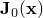 in a time-harmonic eddy current analysis, and  in a transient eddy current analysis
- Surface-based distributed surface current density vector: 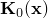 in a time-harmonic eddy current analysis, and 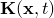 in a transient eddy current analysis

All loads in a time-harmonic eddy current analysis are assumed to be time-harmonic with the excitation frequency. During a transient eddy current analysis all loads can be varied using an amplitude definition (see ["Amplitude curves," Section 34.1.2](pt07ch34s01aus115.md)).

Nonuniform loads can be specified using user subroutines [`UDECURRENT`](../sub/sub-link.md#sub-xsl-udecurrent) and [`UDSECURRENT`](../sub/sub-link.md#sub-xsl-udsecurrent).

#### Frequency-dependent loading in a time-harmonic eddy current analysis

In a time-harmonic eddy current analysis, an amplitude definition can be used to specify the amplitude of a load as a function of frequency (["Amplitude curves," Section 34.1.2](pt07ch34s01aus115.md)).

### Predefined fields

Predefined temperature and field variables can be specified in an eddy current analysis. These values affect only temperature and/or field-variable-dependent material properties, if any. See ["Predefined fields," Section 34.6.1](pt07ch34s06aus128.md).

### Material options

Magnetic material behavior (see ["Magnetic permeability," Section 26.5.3](pt05ch26s05abm63.md)) must be specified everywhere in the model. Only linear magnetic behavior is supported in a time-harmonic eddy current analysis, but nonlinear magnetic behavior is also supported in a transient eddy current analysis. Linear magnetic behavior can be defined by specifying the magnetic permeability directly, while nonlinear magnetic behavior is defined in terms of one or more B–H curves. Electrical conductivity (see ["Electrical conductivity," Section 26.5.1](pt05ch26s05abm61.md)) must be specified in conductor regions. All other material properties are ignored in an eddy current analysis. 

Both magnetic permeability and electrical conductivity can be functions of frequency, predefined temperature, and field variables in a time-harmonic eddy current analysis. In a transient eddy current analysis, all material behavior can be functions of predefined temperature and/or field variables.

Permanent magnets (see ["Magnetic permeability," Section 26.5.3](pt05ch26s05abm63.md)) can be included in a transient eddy current analysis.

### Elements

Electromagnetic elements must be used to model all regions in an eddy current analysis. Unlike conventional finite elements, which use node-based interpolation, these elements use edge-based interpolation with the tangential components of the magnetic vector potential along element edges serving as the primary degrees of freedom.

Electromagnetic elements are available in Abaqus/Standard in two dimensions (planar only) and three dimensions (see ["Choosing the appropriate element for an analysis type," Section 27.1.3](pt06ch27s01aus112.md)). The planar elements are formulated in terms of an in-plane magnetic vector potential, thereby the magnetic flux density and magnetic field vectors only have an out-of-plane component. The electric field and the current density vectors are in-plane for the planar elements.

### Output

Eddy current analysis provides output only to the output database (`.odb`) file (see ["Output to the output database," Section 4.1.3](pt02ch04s01aus40.md)). Output to the data (`.dat`) file and to the results (`.fil`) file is not available. For the first four vector quantities listed below (which are derived from the magnetic vector potential and the constitutive equations) and the applied volume current density vector, the magnitude and components of the real and imaginary parts are output in a time-harmonic eddy current procedure.

Element centroidal variables:

| EMB | Magnitude and components of the magnetic flux density vector, . |
| --- | --- |

| EMH | Magnitude and components of the magnetic field vector, . |
| --- | --- |

| EME | Magnitude and components of the electric field vector, . |
| --- | --- |

| EMCD | Magnitude and components of the eddy current density vector, 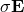, in conducting regions. |
| --- | --- |

| EMCDA | Magnitude and components of the applied volume current density vector. |
| --- | --- |

| EMBF | Magnetic body force intensity vector (force per unit volume per unit time) due to flow of current. |
| --- | --- |

| EMBFC | Complex magnetic body force intensity vector (real and imaginary parts of the force per unit volume) due to flow of current. Only available in a time-harmonic eddy current analysis. |
| --- | --- |

| EMJH | Rate of Joule heating (amount of heat per unit volume per unit time) due to flow of current. |
| --- | --- |

| TEMP | Temperature at the centroid of the element. For a time-harmonic eddy current analysis, this value represents the temperature that is used for evaluating the temperature-dependent material properties. |
| --- | --- |

Whole element variables:

| ELJD | Total rate of Joule heating (amount of heat per unit time) due to flow of current in an element. |
| --- | --- |

| EVOL | Element volume. |
| --- | --- |

Whole model variables:

| ALLJD | Rate of Joule heating (amount of heat per unit time) summed over the model or an element set. |
| --- | --- |

### Input file template

The following is an input file template that makes use of linear magnetic material behavior in a time-harmonic eddy current analysis:

```
[*HEADING](../key/key-link.md#usb-kws-mheading)
…
[*MATERIAL](../key/key-link.md#usb-kws-mmaterial), NAME=*mat1*
[*MAGNETIC PERMEABILITY](../key/key-link.md#usb-kws-mmagpermeability)
*Data lines to define magnetic permeability*
[*ELECTRICAL CONDUCTIVITY](../key/key-link.md#usb-kws-melectricconduct)
*Data lines to define electrical conductivity in the conductor region*
**
[*STEP](../key/key-link.md#usb-kws-hstep)
[*ELECTROMAGNETIC](../key/key-link.md#usb-kws-helectromagnetic), LOW FREQUENCY, TIME HARMONIC
*Data line to specify excitation frequencies*
[*D EM POTENTIAL](../key/key-link.md#usb-kws-hdempotential)
*Data lines to define boundary conditions on magnetic vector potential*
[*DECURRENT](../key/key-link.md#usb-kws-hdecurrent)
*Data lines to define element-based distributed volume current density vector*
[*DSECURRENT](../key/key-link.md#usb-kws-hdsecurrent)
*Data lines to define surface-based distributed surface current density vector*
[*OUTPUT](../key/key-link.md#usb-kws-houtput), FIELD or HISTORY 
*Data lines to request element-based output*
[*ENERGY OUTPUT](../key/key-link.md#usb-kws-henergyoutput)
*Data line to request whole model Joule heat dissipation output*
[*END STEP](../key/key-link.md#usb-kws-hendstep)
```

The following is an input file template that makes use of nonlinear magnetic material behavior in a transient eddy current analysis:

```
[*HEADING](../key/key-link.md#usb-kws-mheading)
…
[*MATERIAL](../key/key-link.md#usb-kws-mmaterial), NAME=*mat1*
[*MAGNETIC PERMEABILITY](../key/key-link.md#usb-kws-mmagpermeability), NONLINEAR
[*NONLINEAR BH](../key/key-link.md#usb-kws-mnonlinearbh), DIR=*direction*
*Data lines to define nonlinear B-H curve*
[*ELECTRICAL CONDUCTIVITY](../key/key-link.md#usb-kws-melectricconduct)
*Data lines to define electrical conductivity in the conductor region*
**
[*STEP](../key/key-link.md#usb-kws-hstep)
[*ELECTROMAGNETIC](../key/key-link.md#usb-kws-helectromagnetic), LOW FREQUENCY, TRANSIENT
[*D EM POTENTIAL](../key/key-link.md#usb-kws-hdempotential)
*Data lines to define boundary conditions on magnetic vector potential*
[*DECURRENT](../key/key-link.md#usb-kws-hdecurrent)
*Data lines to define element-based distributed volume current density vector*
[*DSECURRENT](../key/key-link.md#usb-kws-hdsecurrent)
*Data lines to define surface-based distributed surface current density vector*
[*OUTPUT](../key/key-link.md#usb-kws-houtput), FIELD or HISTORY 
*Data lines to request element-based output*
[*ENERGY OUTPUT](../key/key-link.md#usb-kws-henergyoutput)
*Data line to request whole model Joule heat dissipation output*
[*END STEP](../key/key-link.md#usb-kws-hendstep)
```

#### Additional reference

- Br, O., "Edge Element Formulation of Eddy Current Problems," Computer Methods in Applied Mechanics and Engineering, vol. 169, pp. 391--405, 1999.


