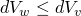
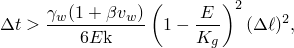
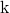
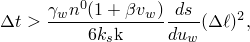
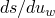
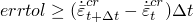

# 6.8.1 Coupled pore fluid diffusion and stress analysis


**Products: **Abaqus/Standard  Abaqus/CAE  

##### **References**

- ["Defining an analysis," Section 6.1.2](pt03ch06s01abo05.md)
- ["Pore fluid flow properties," Section 26.6.1](pt05ch26s06abo24.md)
- [*SOILS](../key/key-link.md#usb-kws-hsoils)
- ["Defining pore fluid expansion" in "Defining a fluid-filled porous material," Section 12.12.3 of the Abaqus/CAE User's Guide](../usi/usi-link.md#usi-prp-other-porefluid-expansion)
- ["Configuring an effective stress analysis for fluid-filled porous media" in "Configuring general analysis procedures," Section 14.11.1 of the Abaqus/CAE User's Guide](../usi/usi-link.md#usi-sim-configure-soils)

### Overview

A coupled pore fluid diffusion/stress analysis:
- is used to model single phase, partially or fully saturated fluid flow through porous media;
- can be performed in terms of either total pore pressure or excess pore pressure by including or excluding the pore fluid weight;
- requires the use of pore pressure elements with associated pore fluid flow properties defined;
- can, optionally, also model heat transfer due to conduction in the soil skeleton and the pore fluid, and convection due to the flow of the pore fluid, through the use of coupled temperature--pore pressure displacement elements;
- can be transient or steady-state;
- can be linear or nonlinear; and
- can include pore pressure contact between bodies (see ["Pore fluid contact properties," Section 37.4.1](pt09ch37s04aus176.md)).

### Typical applications

Some of the more common coupled pore fluid diffusion/stress (and, optionally, thermal) analysis problems that can be analyzed with Abaqus/Standard are:

**Saturated flow**: Soil mechanics problems generally involve fully saturated flow, since the solid is fully saturated with ground water. Typical examples of saturated flow include consolidation of soils under foundations and excavation of tunnels in saturated soil.

**Partially saturated flow**: Partially saturated flow occurs when the wetting liquid is absorbed into or exsorbed from the medium by capillary action. Irrigation and hydrology problems generally include partially saturated flow.

**Combined flow**: Combined fully saturated and partially saturated flow occurs in problems such as seepage of water through an earth dam, where the position of the phreatic surface (the boundary between fully saturated and partially saturated soil) is of interest.

**Moisture migration**: Although not normally associated with soil mechanics, moisture migration problems can also be solved using the coupled pore fluid diffusion/stress procedure. These problems may involve partially saturated flow in polymeric materials such as paper towels and sponge-like materials; in the biomedical industry they may also involve saturated flow in hydrated soft tissues.

**Combined heat transfer and pore fluid flow**: In some applications, such as a source of heat buried in soil, it is important to model the coupling between the mechanical deformation, pore fluid flow, and heat transfer. In such problems the difference in the thermal expansion coefficients between the soil and the pore fluid often plays an important role in determining the rate of diffusion of the pore fluid and heat from the source.

### Flow through porous media

A porous medium is modeled in Abaqus/Standard by a conventional approach that considers the medium as a multiphase material and adopts an effective stress principle to describe its behavior. The porous medium modeling provided considers the presence of two fluids in the medium. One is the “wetting liquid,” which is assumed to be relatively (but not entirely) incompressible. Often the other is a gas, which is relatively compressible. An example of such a system is soil containing ground water. When the medium is partially saturated, both fluids exist at a point; when it is fully saturated, the voids are completely filled with the wetting liquid. The elementary volume, , is made up of a volume of grains of solid material, ; a volume of voids, ; and a volume of wetting liquid, , that is free to move through the medium if driven. In some systems (for example, systems containing particles that absorb the wetting liquid and swell in the process) there may also be a significant volume of trapped wetting liquid, .

The porous medium is modeled by attaching the finite element mesh to the solid phase; fluid can flow through this mesh. The mechanical part of the model is based on the effective stress principle defined in ["Effective stress principle for porous media," Section 2.8.1 of the Abaqus Theory Guide](../stm/stm-link.md#stm-anl-poreffstress).

The model also uses a continuity equation for the mass of wetting fluid in a unit volume of the medium. This equation is described in ["Continuity statement for the wetting liquid phase in a porous medium," Section 2.8.4 of the Abaqus Theory Guide](../stm/stm-link.md#stm-anl-porcontstate). It is written with pore pressure (the average pressure in the wetting fluid at a point in the porous medium) as the basic variable (degree of freedom 8 at the nodes). The conjugate flux variable is the volumetric flow rate at the node, . The porous medium is partially saturated when the pore liquid pressure, , is negative.

### Coupled flow and heat transfer through porous media

Optionally, heat transfer due to conduction in the soil skeleton and pore fluid, as well as convection in the pore fluid, can also be modeled. This capability represents an enhancement to the basic pore fluid flow capabilities discussed in the earlier paragraphs and requires the use of coupled temperature–pore pressure elements that have temperature as an additional degree of freedom (degree of freedom 11 at the nodes) in addition to the pore pressure and the displacement components. When you use the coupled temperature–pore pressure elements, Abaqus solves the heat transfer equation in addition to and in a fully coupled manner with the continuity equation and the mechanical equilibrium equations. Only linear brick, first-order axisymmetric, and second-order modified tetrahedrons are available for modeling coupled heat transfer with pore fluid flow and mechanical deformation. 

### Total and excess pore fluid pressure

The coupled pore fluid diffusion/stress analysis capability can provide solutions either in terms of total or “excess” pore fluid pressure. The excess pore fluid pressure at a point is the pore fluid pressure in excess of the hydrostatic pressure required to support the weight of pore fluid above the elevation of the material point. The difference between total and excess pore pressure is relevant only for cases in which gravitational loading is important; for example, when the loading provided by the hydrostatic pressure in the pore fluid is large or when effects like “wicking” (transient capillary suction of liquid into a dry column) are being studied. Total pore pressure solutions are provided when the gravity distributed load is used to define the gravity load on the model. Excess pore pressure solutions are provided in all other cases; for example, when gravity loading is defined with body force distributed loads.

### Steady-state analysis

Steady-state coupled pore pressure/effective stress analysis assumes that there are no transient effects in the wetting liquid continuity equation; that is, the steady-state solution corresponds to constant wetting liquid velocities and constant volume of wetting liquid per unit volume in the continuum. Thus, for example, thermal expansion of the liquid phase has no effect on the steady-state solution: it is a transient effect. Therefore, the time scale chosen during steady-state analysis is relevant only to rate effects in the constitutive model used for the porous medium (excluding creep and viscoelasticity, which are disabled in steady-state analysis).

Mechanical loads and boundary conditions can be changed gradually over the step by referring to an amplitude curve to accommodate possible geometric nonlinearities in the response.

The steady-state coupled equations are strongly unsymmetric; therefore, the unsymmetric matrix solution and storage scheme is used automatically for steady-state analysis steps (see ["Defining an analysis," Section 6.1.2](pt03ch06s01abo05.md)).

If heat transfer is modeled using the coupled temperature–pore pressure elements, the steady-state solution neglects all transient effects in the heat transfer equation and provides only the steady-state temperature distribution.

| **Input File Usage: ** | ``` [*SOILS](../key/key-link.md#usb-kws-hsoils) ``` |
| --- | --- |

| **Abaqus/CAE Usage: ** | Step module: **Create Step**: **General**: **Soils**: **Basic**: **Pore fluid response: Steady state** |
| --- | --- |

#### Incrementation

You can specify a fixed time increment size in a coupled pore fluid diffusion/stress analysis, or Abaqus/Standard can select the time increment size automatically. Automatic incrementation is recommended because the time increments in a typical diffusion analysis can increase by several orders of magnitude during the simulation. If you do not activate automatic incrementation, fixed time increments will be used.

| **Input File Usage: ** | Use the following option to activate automatic incrementation in steady-state analysis: |
| --- | --- |
|  | ``` [*SOILS](../key/key-link.md#usb-kws-hsoils), UTOL=*any arbitrary nonzero value* ``` The solution does not depend on the value specified for UTOL; this value is simply a flag for automatic incrementation. |

| **Abaqus/CAE Usage: ** | Step module: **Create Step**: **General**: **Soils**: **Basic**: **Pore fluid response: Steady state**; **Incrementation**: **Type: Automatic** |
| --- | --- |

### Transient analysis

In a transient coupled pore pressure/effective stress analysis the backward difference operator is used to integrate the continuity equation and the heat transfer equation (if heat transfer is modeled): this operator provides unconditional stability so that the only concern with respect to time integration is accuracy. You can provide the time increments, or they can be selected automatically.

The coupled partially saturated flow equations are strongly unsymmetric, so the unsymmetric solver is used automatically if you request partially saturated analysis (by including absorption/exsorption behavior in the material definition). The unsymmetric solver is also activated automatically when gravity distributed loading is used during a soils consolidation analysis.

For fully saturated flow analyses in which finite-sliding coupled pore pressure-displacement contact is modeled using contact pairs, certain contributions to the model's stiffness matrix are unsymmetric. Using the unsymmetric solver can sometimes improve convergence in such cases since Abaqus does not automatically do so.

For fully saturated flow analyses in which heat transfer is also modeled, the contributions to the model's stiffness matrix arising from convective heat transfer due to pore fluid flow are unsymmetric. Using the unsymmetric solver can sometimes improve convergence in such cases since Abaqus does not automatically do so.

#### Spurious oscillations due to small time increments

The integration procedure used in Abaqus/Standard for consolidation analysis introduces a relationship between the minimum usable time increment and the element size, as shown below for fully saturated and partially saturated flows. If time increments smaller than these values are used, spurious oscillations may appear in the solution (except for partially saturated cases when linear elements or modified triangular elements are used; in these cases Abaqus/Standard uses a special integration scheme for the wetting liquid storage term to avoid the problem). These nonphysical oscillations may cause problems if pressure-sensitive plasticity is used to model the porous medium and may lead to convergence difficulties in partially saturated analyses. If the problem requires analysis with smaller time increments than the relationships given below allow, a finer mesh is required. Generally there is no upper limit on the time step except accuracy, since the integration procedure is unconditionally stable unless nonlinearities cause convergence problems.

##### Fully saturated flow

A simple guideline that can be used for the minimum usable time increment in the case of fully saturated flow is 



where


is the time increment,


is the specific weight of the wetting liquid,

*E*

is the Young's modulus of the soil,



is the permeability of the soil (see ["Permeability," Section 26.6.2](pt05ch26s06abm64.md)),


is the magnitude of the velocity of the pore fluid,


is the velocity coefficient in Forchheimer's flow law ( in the case of Darcy flow),


is the bulk modulus of the solid grains (see ["Porous bulk moduli," Section 26.6.3](pt05ch26s06abm65.md)), and


is a typical element dimension.

##### Partially saturated flow

In partially saturated flow cases the corresponding guideline for the minimum time increment is 



where

*s*

is the saturation;


is the permeability-saturation relationship;



is the rate of change of saturation with respect to pore pressure (see ["Sorption," Section 26.6.4](pt05ch26s06abm66.md));


is the initial porosity of the material; and the other parameters are as defined for the case of fully saturated flow.

#### Fixed incrementation

If you choose fixed time incrementation, fixed time increments equal to the size of the user-specified initial time increment, , will be used. Fixed incrementation is not generally recommended because the time increments in a typical diffusion analysis can increase over several orders of magnitude during the simulation; automatic incrementation is usually a better choice.

| **Input File Usage: ** | ``` [*SOILS](../key/key-link.md#usb-kws-hsoils), CONSOLIDATION  ``` |
| --- | --- |

| **Abaqus/CAE Usage: ** | Step module: **Create Step**: **General**: **Soils**: **Basic**: **Pore fluid response: Transient consolidation**; **Incrementation**: **Type: Fixed**, **Increment size:**  |
| --- | --- |

#### Automatic incrementation

If you choose automatic time incrementation, you must specify two (three if heat transfer is also modeled) tolerance parameters.

The accuracy of the time integration of the flow continuity equations is governed by the maximum wetting liquid pore pressure change, , allowed in an increment. Abaqus/Standard restricts the time increments to ensure that this value is not exceeded at any node (except nodes with boundary conditions) during any increment in the analysis.

If heat transfer is modeled, the accuracy of time integration is also governed by the maximum temperature change, , allowed in an increment. Abaqus/Standard restricts the time increments to ensure that this value is not exceeded at any node (except nodes with boundary conditions) during any increment of the analysis.

The accuracy of the integration of the time-dependent (creep) material behavior is governed by the maximum strain rate change allowed at any point during an increment, , as described in ["Rate-dependent plasticity: creep and swelling," Section 23.2.4](pt05ch23s02abm20.md).

| **Input File Usage: ** | If heat transfer is not modeled: |
| --- | --- |
|  | ``` [*SOILS](../key/key-link.md#usb-kws-hsoils), CONSOLIDATION, UTOL=, , CETOL=*errtol* ``` If heat transfer is modeled: ``` [*SOILS](../key/key-link.md#usb-kws-hsoils), CONSOLIDATION, UTOL=, DELTMX=, CETOL=*errtol* ``` |

| **Abaqus/CAE Usage: ** | Step module: **Create Step**: **General**: **Soils**: **Basic**: **Pore fluid response: Transient consolidation**; **Incrementation**: **Type: Automatic**, **Max. pore pressure change per increment:** , **Creep/swelling/viscoelastic strain error tolerance:** *errtol* |
| --- | --- |
|  | Specifying the maximum temperature change per increment is not supported in Abaqus/CAE. |

#### Ending a transient analysis

Transient soils analysis can be terminated by completing a specified time period, or it can be continued until steady-state conditions are reached. By default, the analysis will end when the given time period has been completed. Alternatively, you can specify that the analysis will end when steady state is reached or the time period ends, whichever comes first. When heat transfer is not modeled, steady state is defined by a maximum permitted rate of change of pore pressure with time: when all pore pressures are changing at less than the user-defined rate, the analysis terminates. However, with heat transfer included, the analysis terminates only when both the pore pressure and temperature are changing at less than the user-defined rates.

| **Input File Usage: ** | Use the following option to end the analysis when the time period is reached: |
| --- | --- |
|  | ``` [*SOILS](../key/key-link.md#usb-kws-hsoils), CONSOLIDATION, END=PERIOD (default) ``` Use the following option to end the analysis based on the pore pressure and, if heat transfer is modeled, temperature change rate: ``` [*SOILS](../key/key-link.md#usb-kws-hsoils), CONSOLIDATION, END=SS ``` |

| **Abaqus/CAE Usage: ** | Step module: **Create Step**: **General**: **Soils**: **Basic**: **Pore fluid response: Transient consolidation**; **Incrementation**: **End step when pore pressure change rate is less than** |
| --- | --- |
|  | If heat transfer is modeled, directly specifying the temperature change rate to define steady state is not supported in Abaqus/CAE. |

#### Neglecting creep during a transient analysis

You can specify that creep or viscoelastic response should be neglected during a consolidation analysis, even if creep or viscoelastic material properties have been defined.

| **Input File Usage: ** | ``` [*SOILS](../key/key-link.md#usb-kws-hsoils), CONSOLIDATION, CREEP=NONE ``` |
| --- | --- |

| **Abaqus/CAE Usage: ** | Step module: **Create Step**: **General**: **Soils**: **Basic**: **Pore fluid response: Transient consolidation**, toggle off **Include creep/swelling/viscoelastic behavior** |
| --- | --- |

#### Unstable problems

Some types of analyses may develop local instabilities, such as surface wrinkling, material instability, or local buckling. In such cases it may not be possible to obtain a quasi-static solution, even with the aid of automatic incrementation. Abaqus/Standard offers the option to stabilize this class of problems by applying damping throughout the model in such a way that the viscous forces introduced are sufficiently large to prevent instantaneous buckling or collapse but small enough not to affect the behavior significantly while the problem is stable. The available automatic stabilization schemes are described in detail in ["Automatic stabilization of unstable problems" in "Solving nonlinear problems," Section 7.1.1](pt03ch07s01aus49.md#usb-anl-anonlineareqns-stabilize-over).

### Optional modeling of coupled heat transfer

When coupled temperature–pore pressure elements are used, heat transfer is modeled in these elements by default. However, you may optionally choose to switch off heat transfer within these elements during some steps in the analysis. This feature may be helpful in reducing computation time during certain phases in the analysis when heat transfer is not an important part of the overall physics of the problem.

| **Input File Usage: ** | Use the following option either during a transient or a steady-state procedure to suppress heat transfer modeling: |
| --- | --- |
|  | ``` [*SOILS](../key/key-link.md#usb-kws-hsoils), CONSOLIDATION, HEAT=NO ``` |

| **Abaqus/CAE Usage: ** | Switching off the heat transfer part of the physics is not supported in Abaqus/CAE. |
| --- | --- |

### Units

In coupled problems where two or more different fields are being solved, you must be careful when choosing the units of the problem. If the choice of units is such that the numbers generated by the equations for the different fields differ by many orders of magnitude, the precision on some computers may be insufficient to resolve the numerical ill-conditioning of the coupled equations. Therefore, choose units that avoid badly conditioned matrices. For example, consider using units of Mpascal instead of pascal for the stress equilibrium equations to reduce the disparity between the magnitudes of the stress equilibrium equations and the pore flow continuity equations.

### Initial conditions

Initial conditions can be applied as defined in ["Initial conditions in Abaqus/Standard and Abaqus/Explicit," Section 34.2.1](pt07ch34s02aus116.md).

#### Defining initial pore fluid pressures

Initial values of pore fluid pressures, , can be defined at the nodes.

| **Input File Usage: ** | ``` [*INITIAL CONDITIONS](../key/key-link.md#usb-kws-minitialcond), TYPE=PORE PRESSURE ``` |
| --- | --- |

| **Abaqus/CAE Usage: ** | Load module: **Create Predefined Field**: **Step: Initial**: choose **Other** for the **Category** and **Pore pressure** for the **Types for Selected Step** |
| --- | --- |

#### Defining initial void ratios

Initial values of the void ratio, *e*, can be given at the nodes. The void ratio is defined as the ratio of the volume of voids to the volume of solid material (see ["Effective stress principle for porous media," Section 2.8.1 of the Abaqus Theory Guide](../stm/stm-link.md#stm-anl-poreffstress)). The evolution of void ratio is governed by the deformation of the different phases of the material, as discussed in detail in ["Constitutive behavior in a porous medium," Section 2.8.3 of the Abaqus Theory Guide](../stm/stm-link.md#stm-anl-porconstbehav).

| **Input File Usage: ** | ``` [*INITIAL CONDITIONS](../key/key-link.md#usb-kws-minitialcond), TYPE=RATIO ``` |
| --- | --- |

| **Abaqus/CAE Usage: ** | Load module: **Create Predefined Field**: **Step: Initial**: choose **Other** for the **Category** and **Void ratio** for the **Types for Selected Step** |
| --- | --- |

#### Defining initial saturation

Initial saturation values, *s*, can be given at the nodes. Saturation is defined as the ratio of wetting fluid volume to void volume (see ["Effective stress principle for porous media," Section 2.8.1 of the Abaqus Theory Guide](../stm/stm-link.md#stm-anl-poreffstress)).

| **Input File Usage: ** | ``` [*INITIAL CONDITIONS](../key/key-link.md#usb-kws-minitialcond), TYPE=SATURATION ``` |
| --- | --- |

| **Abaqus/CAE Usage: ** | Load module: **Create Predefined Field**: **Step: Initial**: choose **Other** for the **Category** and **Saturation** for the **Types for Selected Step** |
| --- | --- |

#### Defining initial stresses

An initial (effective) stress field can be specified (see ["Initial conditions in Abaqus/Standard and Abaqus/Explicit," Section 34.2.1](pt07ch34s02aus116.md)).

Most geotechnical problems begin from a geostatic state, which is a steady-state equilibrium configuration of the undisturbed soil or rock body under geostatic loading and usually includes both horizontal and vertical components. It is important to establish these initial conditions correctly so that the problem begins from an equilibrium state. The geostatic procedure can be used to verify that the user-defined initial stresses are indeed in equilibrium with the given geostatic loads and boundary conditions (see ["Geostatic stress state," Section 6.8.2](pt03ch06s08at27.md)).

| **Input File Usage: ** | Use one of the following options: |
| --- | --- |
|  | ``` [*INITIAL CONDITIONS](../key/key-link.md#usb-kws-minitialcond), TYPE=STRESS [*INITIAL CONDITIONS](../key/key-link.md#usb-kws-minitialcond), TYPE=STRESS, GEOSTATIC ``` |

| **Abaqus/CAE Usage: ** | Load module: **Create Predefined Field**: **Step: Initial**: choose **Mechanical** for the **Category** and **Stress** or **Geostatic stress** for the **Types for Selected Step** |
| --- | --- |

#### Defining initial temperature

Initial temperature values can be defined at the nodes.

| **Input File Usage: ** | ``` [*INITIAL CONDITIONS](../key/key-link.md#usb-kws-minitialcond), TYPE=TEMPERATURE ``` |
| --- | --- |

| **Abaqus/CAE Usage: ** | Load module: **Create Predefined Field**: **Step: Initial**: choose **Other** for the **Category** and **Temperature** for the **Types for Selected Step** |
| --- | --- |

### Boundary conditions

Boundary conditions can be applied to displacement degrees of freedom 1–6 and to pore pressure degree of freedom 8 (["Boundary conditions in Abaqus/Standard and Abaqus/Explicit," Section 34.3.1](pt07ch34s03aus118.md)). In addition, boundary conditions can also be applied to temperature degree of freedom 11 if heat transfer is modeled using coupled temperature–pore pressure elements. During the analysis prescribed boundary conditions can be varied by referring to an amplitude curve (["Amplitude curves," Section 34.1.2](pt07ch34s01aus115.md)). If no amplitude reference is given, the default variation of a boundary condition in a coupled pore fluid diffusion/stress analysis step is as defined in ["Defining an analysis," Section 6.1.2](pt03ch06s01abo05.md).

If the pore pressure is prescribed with a boundary condition, fluid is assumed to enter and leave through the node as needed to maintain the prescribed pressure. Likewise, if the temperature is prescribed with a boundary condition, heat is assumed to enter and leave through the node as needed to maintain the prescribed temperature.

### Loads

The following loading types can be prescribed in a coupled pore fluid diffusion/stress analysis:
- Concentrated nodal forces can be applied to the displacement degrees of freedom (1--6); see ["Concentrated loads," Section 34.4.2](pt07ch34s04aus121.md).
- Distributed pressure forces or body forces can be applied; see ["Distributed loads," Section 34.4.3](pt07ch34s04aus122.md). The distributed load types available with particular elements are described in [Part VI, "Elements](pt06.md)." The magnitude and direction of gravitational loading are usually defined by using the gravity distributed load type.
- Pore fluid flow is controlled as described in ["Pore fluid flow," Section 34.4.7](pt07ch34s04aus126.md).

If heat transfer is modeled, the following types of thermal loading can also be prescribed (["Thermal loads," Section 34.4.4](pt07ch34s04aus123.md)). These loads are not supported in Abaqus/CAE during a coupled thermal pore pressure/stress analysis.
- Concentrated heat fluxes.
- Body fluxes and distributed surface fluxes.
- Convective film conditions and radiation conditions; film properties can be made a function of temperature.

### Predefined fields

The following predefined fields can be prescribed, as described in ["Predefined fields," Section 34.6.1](pt07ch34s06aus128.md):
- For a coupled pore fluid diffusion/stress analysis that does not model heat transfer and uses regular pore pressure elements, temperature is not a degree of freedom and nodal temperatures can be specified. Any difference between the applied and initial temperatures will cause thermal strain if a thermal expansion coefficient is given for the material (["Thermal expansion," Section 26.1.2](pt05ch26s01abm52.md)). The specified temperature also affects temperature-dependent material properties, if any.
- Predefined temperature fields are not allowed in coupled pore fluid diffusion/stress analysis that also models heat transfer. Boundary conditions should be used instead to specify temperatures, as described earlier.
- The values of user-defined field variables can be specified; these values affect only field-variable-dependent material properties, if any.

### Material options

Any of the mechanical constitutive models available in Abaqus/Standard can be used to model the porous material.

In problems formulated in terms of total pore pressure, you must include the density of the dry material in the material definition (see ["Density," Section 21.2.1](pt05ch21s02abm01.md)).

You can use a permeability material property to define the specific weight of the wetting liquid, ; the permeability, , and its dependence on the void ratio, *e*, and saturation, ; and the flow velocity,  (see ["Permeability," Section 26.6.2](pt05ch26s06abm64.md)).

You can define the compressibility of the solid grains and of the permeating fluid in both fully and partially saturated flow problems (see ["Elastic behavior of porous materials," Section 22.3.1](pt05ch22s03abm05.md)). If you do not specify the porous bulk moduli, the materials are assumed to be fully incompressible.

For partially saturated flow you must define the porous medium's absorption/exsorption behavior (see ["Sorption," Section 26.6.4](pt05ch26s06abm66.md)).

Gel swelling (["Swelling gel," Section 26.6.5](pt05ch26s06abm67.md)) and volumetric moisture swelling of the solid skeleton (["Moisture swelling," Section 26.6.6](pt05ch26s06abm68.md)) can be included in partially saturated cases. These effects are usually associated with modeling of moisture migration in polymeric systems rather than with geotechnical systems.

#### Thermal properties if heat transfer is modeled

In problems that model heat transfer, the thermal conductivity for either the solid material or the permeating fluid, or more commonly for both phases, must be defined. Only isotropic conductivity can be specified for the pore fluid. The specific heat and density of the phases must also be defined for transient heat transfer problems. Latent heat for the phases can be defined if changes in internal energy due to phase changes are important. See ["Thermal properties: overview," Section 26.2.1](pt05ch26s02abo23.md), for details on defining thermal properties in Abaqus. Examples of problems that model fully coupled heat transfer along with pore fluid diffusion and mechanical deformation can be found in ["Consolidation around a cylindrical heat source," Section 1.15.7 of the Abaqus Benchmarks Guide](../bmk/bmk-link.md#bmk-anl-consolidationheatsource), and ["Permafrost thawing--pipeline interaction," Section 10.1.6 of the Abaqus Example Problems Guide](../exa/exa-link.md#exa-soi-buriedpipepermafrost).

The thermal properties can be defined separately for the solid material and the permeating fluid.

| **Input File Usage: ** | To define the conductivity, specific heat, density, and latent heat of the permeating fluid, use the following options: |
| --- | --- |
|  | ``` [*CONDUCTIVITY](../key/key-link.md#usb-kws-mconductivity), TYPE=ISO, PORE FLUID [*SPECIFIC HEAT](../key/key-link.md#usb-kws-mspecificheat), PORE FLUID [*LATENT HEAT](../key/key-link.md#usb-kws-mlatentheat), PORE FLUID [*DENSITY](../key/key-link.md#usb-kws-mdensity), PORE FLUID ``` To define the conductivity, specific heat, density, and latent heat of the solid material, use the following options: ``` [*EXPANSION](../key/key-link.md#usb-kws-mexpansion), TYPE=ISO or ORTHO or ANISO [*SPECIFIC HEAT](../key/key-link.md#usb-kws-mspecificheat) [*DENSITY](../key/key-link.md#usb-kws-mdensity) [*LATENT HEAT](../key/key-link.md#usb-kws-mlatentheat) ``` |

| **Abaqus/CAE Usage: ** | Defining the thermal properties and the density of the permeating fluid is not supported in Abaqus/CAE. |
| --- | --- |
|  | To define the conductivity, specific heat, density, and latent heat of the solid material, use the following options: Property module: material editor: ****Thermal****Conductivity****: **Type**: **Isotropic******Thermal****Specific Heat********General****Density********Thermal****Latent Heat**** |

#### Thermal expansion

Thermal expansion can be defined separately for the solid material and for the permeating fluid. In such a case you should repeat the expansion material property, with the necessary parameters, to define the different thermal expansion effects (see ["Thermal expansion," Section 26.1.2](pt05ch26s01abm52.md)). Thermal expansion will be active only in a consolidation (transient) analysis.

| **Input File Usage: ** | To define the thermal expansion of the permeating fluid: |
| --- | --- |
|  | ``` [*EXPANSION](../key/key-link.md#usb-kws-mexpansion), TYPE=ISO, PORE FLUID ``` To define the thermal expansion of the solid material: ``` [*EXPANSION](../key/key-link.md#usb-kws-mexpansion), TYPE=ISO or ORTHO or ANISO ``` |

| **Abaqus/CAE Usage: ** | To define the thermal expansion of the permeating fluid: |
| --- | --- |
|  | Property module: material editor: ****Other****Pore Fluid****Pore Fluid Expansion**** To define the thermal expansion of the solid material: Property module: material editor: ****Mechanical****Expansion**** |

### Elements

The analysis of flow through porous media in Abaqus/Standard is available for plane strain, axisymmetric, and three-dimensional problems. The modeling of coupled heat transfer effects is available only for axisymmetric and three-dimensional problems. Continuum pore pressure elements are provided for modeling fluid flow through a deforming porous medium in a coupled pore fluid diffusion/stress analysis. These elements have pore pressure degree of freedom 8 in addition to displacement degrees of freedom 1–3. Heat transfer through the porous medium can also be modeled using continuum coupled temperature–pore pressure elements. These elements have temperature degree of freedom 11 in addition to pore pressure degree of freedom 8 and displacement degrees of freedom 1–3. Stress/displacement elements can be used in parts of the model without pore fluid flow. See ["Choosing the appropriate element for an analysis type," Section 27.1.3](pt06ch27s01aus112.md), for more information.

### Output

The element output available for a coupled pore fluid diffusion/stress analysis includes the usual mechanical quantities such as (effective) stress; strain; energies; and the values of state, field, and user-defined variables. In addition, the following quantities associated with pore fluid flow are available:

| VOIDR | Void ratio, *e*. |
| --- | --- |

| POR | Pore pressure, . |
| --- | --- |

| SAT | Saturation, *s*. |
| --- | --- |

| GELVR | Gel volume ratio, . |
| --- | --- |

| FLUVR | Total fluid volume ratio, . |
| --- | --- |

| FLVEL | Magnitude and components of the pore fluid effective velocity vector, . |
| --- | --- |

| FLVELM | Magnitude, , of the pore fluid effective velocity vector. |
| --- | --- |

| FLVEL*n* | Component *n* of the pore fluid effective velocity vector (*n*=1, 2, 3). |
| --- | --- |

If heat transfer is modeled, the following element output variables associated with heat transfer are also available:

| HFL | Magnitude and components of the heat flux vector. |
| --- | --- |

| HFL*n* | Component *n* of the heat flux vector (*n*=1, 2, 3). |
| --- | --- |

| HFLM | Magnitude of the heat flux vector. |
| --- | --- |

| TEMP | Integration point temperatures. |
| --- | --- |

The nodal output available includes the usual mechanical quantities such as displacements, reaction forces, and coordinates. In addition, the following quantities associated with pore fluid flow are available: 

| CFF | Concentrated fluid flow at a node. |
| --- | --- |

| POR | Pore pressure at a node. |
| --- | --- |

| RVF | Reaction fluid volume flux due to prescribed pressure. This flux is the rate at which fluid volume is entering or leaving the model through the node to maintain the prescribed pressure boundary condition. A positive value of RVF indicates that fluid is entering the model. |
| --- | --- |

| RVT | Reaction total fluid volume (computed only in a transient analysis). This value is the time integrated value of RVF. |
| --- | --- |

If heat transfer is modeled, the following nodal output variables associated with heat transfer are also available:

| NT | Nodal point temperatures. |
| --- | --- |

| RFL | Reaction flux values due to prescribed temperature. |
| --- | --- |

| RFL*n* | Reaction flux value *n* at a node (*n*=11, 12, …). |
| --- | --- |

| CFL | Concentrated flux values. |
| --- | --- |

| CFL*n* | Concentrated flux value *n* at a node (*n*=11, 12, …). |
| --- | --- |

All of the output variable identifiers are outlined in ["Abaqus/Standard output variable identifiers," Section 4.2.1](pt02ch04s02abv01.md).

### Input file template

```
[*HEADING](../key/key-link.md#usb-kws-mheading)
…
***********************************
**
** Material definition
**
***********************************
[*MATERIAL](../key/key-link.md#usb-kws-mmaterial), NAME=soil
*Data lines to define mechanical properties of the solid material*
…
[*EXPANSION](../key/key-link.md#usb-kws-mexpansion)
*Data lines to define the thermal expansion coefficient of the solid grains*
[*EXPANSION](../key/key-link.md#usb-kws-mexpansion), TYPE=ISO, PORE FLUID
*Data lines to define the thermal expansion coefficient of the permeating fluid*
[*PERMEABILITY](../key/key-link.md#usb-kws-mpermeabil), SPECIFIC= 
*Data lines to define permeability, , as a function of the void ratio, *e**
[*PERMEABILITY](../key/key-link.md#usb-kws-mpermeabil), TYPE=SATURATION
*Data lines to define the dependence of permeability on saturation,* 
[*PERMEABILITY](../key/key-link.md#usb-kws-mpermeabil), TYPE=VELOCITY
*Data lines to define the velocity coefficient,*  
[*POROUS BULK MODULI](../key/key-link.md#usb-kws-mporousbulkmod)
*Data line to define the bulk moduli of the solid grains and the permeating fluid*
[*SORPTION](../key/key-link.md#usb-kws-msorption), TYPE=ABSORPTION
*Data lines to define absorption behavior*
[*SORPTION](../key/key-link.md#usb-kws-msorption), TYPE=EXSORPTION
*Data lines to define exsorption behavior*
[*SORPTION](../key/key-link.md#usb-kws-msorption), TYPE=SCANNING
*Data lines to define scanning behavior (between absorption and exsorption)*
[*GEL](../key/key-link.md#usb-kws-mgel)
*Data line to define gel behavior in partially saturated flow*
[*MOISTURE SWELLING](../key/key-link.md#usb-kws-mmoistureswell)
*Data lines to define moisture swelling strain as a function of saturation
in partially saturated flow*
[*CONDUCTIVITY](../key/key-link.md#usb-kws-mconductivity)
*Data lines to define thermal conductivity of the solid grains if heat transfer is modeled*
[*CONDUCTIVITY](../key/key-link.md#usb-kws-mconductivity),TYPE=ISO, PORE FLUID
*Data lines to define thermal conductivity of the permeating fluid if heat transfer is modeled*
[*SPECIFIC HEAT](../key/key-link.md#usb-kws-mspecificheat)
*Data lines to define specific heat of the solid grains if transient heat transfer is modeled*
[*SPECIFIC HEAT](../key/key-link.md#usb-kws-mspecificheat),PORE FLUID
*Data lines to define specific heat of the permeating fluid if transient heat transfer is modeled*
[*DENSITY](../key/key-link.md#usb-kws-mdensity)
*Data lines to define density of the solid grains if transient heat transfer is modeled*
[*DENSITY](../key/key-link.md#usb-kws-mdensity),PORE FLUID
*Data lines to define density of the permeating fluid if transient heat transfer is modeled*
[*LATENT HEAT](../key/key-link.md#usb-kws-mlatentheat)
*Data lines to define latent heat of the solid grains if phase change due to temperature change
 is modeled*
[*LATENT HEAT](../key/key-link.md#usb-kws-mlatentheat),PORE FLUID
*Data lines to define latent heat of the permeating fluid if phase change due to temperature change
is modeled*
…
***********************************
**
** Boundary conditions and initial conditions
**
***********************************
[*BOUNDARY](../key/key-link.md#usb-kws-hboundary)
*Data lines to specify zero-valued boundary conditions*
[*INITIAL CONDITIONS](../key/key-link.md#usb-kws-minitialcond), TYPE=STRESS, GEOSTATIC
*Data lines to specify initial stresses*
[*INITIAL CONDITIONS](../key/key-link.md#usb-kws-minitialcond), TYPE=PORE PRESSURE
*Data lines to define initial values of pore fluid pressures*
[*INITIAL CONDITIONS](../key/key-link.md#usb-kws-minitialcond), TYPE=RATIO
*Data lines to define initial values of the void ratio*
[*INITIAL CONDITIONS](../key/key-link.md#usb-kws-minitialcond), TYPE=SATURATION
*Data lines to define initial saturation*
[*INITIAL CONDITIONS](../key/key-link.md#usb-kws-minitialcond), TYPE=TEMPERATURE
*Data lines to define initial saturation*
[*AMPLITUDE](../key/key-link.md#usb-kws-mamplitude), NAME=name
*Data lines to define amplitude variations*
***********************************
**
** Step 1: Optional step to ensure an equilibrium
** geostatic stress field
**
***********************************
[*STEP](../key/key-link.md#usb-kws-hstep)
[*GEOSTATIC](../key/key-link.md#usb-kws-hgeostatic)
[*CLOAD](../key/key-link.md#usb-kws-hcload) and/or [*DLOAD](../key/key-link.md#usb-kws-hdload) and/or [*TEMPERATURE](../key/key-link.md#usb-kws-htemperature) and/or [*FIELD](../key/key-link.md#usb-kws-hfield)
*Data lines to specify mechanical loading*
[*FLOW](../key/key-link.md#usb-kws-hflow) and/or [*SFLOW](../key/key-link.md#usb-kws-hsflow) and/or [*DFLOW](../key/key-link.md#usb-kws-hdflow) and/or [*DSFLOW](../key/key-link.md#usb-kws-hdsflow)
*Data lines to specify pore fluid flow*
[*CFLUX](../key/key-link.md#usb-kws-hcflux) and/or [*DFLUX](../key/key-link.md#usb-kws-hdflux)
*Data lines to define concentrated and/or distributed heat fluxes if heat transfer is modeled*
[*BOUNDARY](../key/key-link.md#usb-kws-hboundary)
*Data lines to specify displacements or pore pressures*
[*END STEP](../key/key-link.md#usb-kws-hendstep)
***********************************
**
** Step 2: Coupled pore diffusion/stress analysis step
**
***********************************
[*STEP](../key/key-link.md#usb-kws-hstep) (,NLGEOM)
** Use NLGEOM to include geometric nonlinearities
[*SOILS](../key/key-link.md#usb-kws-hsoils)
*Data line to define incrementation*
[*CLOAD](../key/key-link.md#usb-kws-hcload) and/or [*DLOAD](../key/key-link.md#usb-kws-hdload) and/or [*DSLOAD](../key/key-link.md#usb-kws-hdsload)
*Data lines to specify mechanical loading*
[*FLOW](../key/key-link.md#usb-kws-hflow) and/or [*SFLOW](../key/key-link.md#usb-kws-hsflow) and/or [*DFLOW](../key/key-link.md#usb-kws-hdflow) and/or [*DSFLOW](../key/key-link.md#usb-kws-hdsflow)
*Data lines to specify pore fluid flow*
[*CFLUX](../key/key-link.md#usb-kws-hcflux) and/or [*DFLUX](../key/key-link.md#usb-kws-hdflux)
*Data lines to define concentrated and/or distributed heat fluxes if heat transfer is modeled*
[*FILM](../key/key-link.md#usb-kws-hfilm)
*Data lines referring to film property table if heat transfer is modeled* 
[*BOUNDARY](../key/key-link.md#usb-kws-hboundary)
*Data lines to specify displacements, pore pressures, or temperatures*
[*END STEP](../key/key-link.md#usb-kws-hendstep)
```


