# 6.9.1 Mass diffusion analysis


**Products: **Abaqus/Standard  Abaqus/CAE  

##### **References**

- ["Defining an analysis," Section 6.1.2](pt03ch06s01abo05.md)
- [*MASS DIFFUSION](../key/key-link.md#usb-kws-hmassdiff)
- ["Configuring a mass diffusion procedure" in "Configuring general analysis procedures," Section 14.11.1 of the Abaqus/CAE User's Guide](../usi/usi-link.md#usi-sim-configure-massdiffusion)
- ["Creating and modifying prescribed conditions," Section 16.4 of the Abaqus/CAE User's Guide](../usi/usi-link.md#usi-lbi-edit-editors)
- ["Defining a concentrated concentration flux," Section 16.9.33 of the Abaqus/CAE User's Guide](../usi/usi-link.md#usi-lbi-loadeditors-concconcflux)
- ["Defining a body concentration flux," Section 16.9.35 of the Abaqus/CAE User's Guide](../usi/usi-link.md#usi-lbi-loadeditors-bodyconcflux)
- ["Defining a surface concentration flux," Section 16.9.34 of the Abaqus/CAE User's Guide](../usi/usi-link.md#usi-lbi-loadeditors-surfconcflux)

### Overview

A mass diffusion analysis:
- models the transient or steady-state diffusion of one material through another, such as the diffusion of hydrogen through a metal;
- requires the use of mass diffusion elements; and
- can be used to model temperature and/or pressure-driven mass diffusion.

### Governing equations

The governing equations for mass diffusion are an extension of Fick's equations: they allow for nonuniform solubility of the diffusing substance in the base material and for mass diffusion driven by gradients of temperature and pressure. The basic solution variable (used as the degree of freedom at the nodes of the mesh) is the “normalized concentration” (often also referred to as the “activity” of the diffusing material), , where *c* is the mass concentration of the diffusing material and *s* is its solubility in the base material. Therefore, when the mesh includes dissimilar materials that share nodes, the normalized concentration is continuous across the interface between the different materials.

For example, a diatomic gas that dissociates during diffusion can be described using Sievert's law: 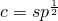, where *p* is the partial pressure of the diffusing gas. Combining Sievert's law with the definition of normalized concentration given earlier, 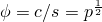. Equilibrium requires the partial pressure to be continuous across an interface, so normalized concentration will be continuous as well. If an expression other than Sievert's law defines the relationship between concentration and partial pressure for a diffusing material, solubility should be defined accordingly.

The diffusion problem is defined from the requirement of mass conservation for the diffusing phase: 

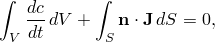

where *V* is any volume whose surface is *S*,  is the outward normal to *S*,  is the flux of concentration of the diffusing phase, and  is the concentration flux leaving *S*.

Diffusion is assumed to be driven by the gradient of a general chemical potential, which gives the behavior 

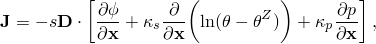

where 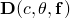 is the diffusivity; 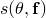 is the solubility; 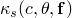 is the “Soret effect” factor, providing diffusion because of temperature gradient;  is the temperature;  is the value of absolute zero on the temperature scale being used;  is the pressure stress factor, providing diffusion driven by the gradient of the equivalent pressure stress, ;  is stress; and  are any predefined field variables.

Whenever *D*, , or  depends on concentration, the problem becomes nonlinear and the system of equations becomes nonsymmetric. In practical cases the dependence on concentration is quite strong, so the nonsymmetric matrix storage and solution scheme is invoked automatically when a mass diffusion analysis is performed (see ["Defining an analysis," Section 6.1.2](pt03ch06s01abo05.md)).

### Fick's law

Mass diffusion behavior is often described by Fick's law (Crank, 1956): 

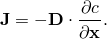

Fick's law is offered in Abaqus/Standard as a special case of the general chemical potential relation. To establish the relationship between Fick's law and the general chemical potential, we write Fick's law as 

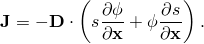

In most practical cases 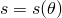, and we can write 

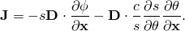

The two terms in this equation describe the normalized concentration and temperature-driven diffusion, respectively. The normalized concentration-driven diffusion term is identical to that given in the general relation. The temperature-driven diffusion term in Fick's law is recovered in the general relation if 

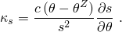

This conversion is done automatically in Abaqus/Standard when you request Fick's law (see ["Diffusivity," Section 26.4.1](pt05ch26s04abm59.md)).

An extended form of Fick's law can also be chosen by specifying a nonzero value for : 

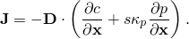

In this case Abaqus/Standard will still define  automatically as discussed earlier.

### Units

The units of concentration are commonly given as parts per million (*P*). On the basis of the applicability of Sievert's law to the mass diffusion, the units of solubility are 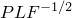, where *F* is force and *L* is length. The units of the Soret effect factor are 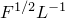. The units of the pressure stress factor are 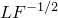, and the units of equivalent pressure stress are . The diffusivity, , has units of 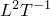, where *T* is time. The concentration flux, , then has units of 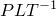; and the concentration volumetric flux, 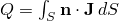, has units of 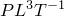.

### Steady-state analysis

Steady-state mass diffusion analysis provides the steady-state solution directly: the rate of change of concentration with respect to time is omitted from the governing diffusion equation in steady-state analysis. In nonlinear cases iteration may be necessary to achieve a converged solution.

Since the rate term is removed from the governing equations, the steady-state problem has no intrinsic physically meaningful time scale; nevertheless, you may assign a “time” scale to the analysis step. This time scale is often convenient for output identification and for specifying prescribed normalized concentrations and fluxes with varying magnitudes. Thus, when steady-state analysis is chosen, you specify a “time” increment and a “time” period for the step; Abaqus/Standard then increments through the step accordingly. If a steady-state analysis step is to be followed by a transient analysis step and total time is used in amplitude definitions (["Amplitude curves," Section 34.1.2](pt07ch34s01aus115.md)), the time period should be defined to be negligibly small in the steady-state step. For more details on time scales and time stepping, see ["Defining an analysis," Section 6.1.2](pt03ch06s01abo05.md).

| **Input File Usage: ** | ``` [*MASS DIFFUSION](../key/key-link.md#usb-kws-hmassdiff), STEADY STATE ``` |
| --- | --- |

| **Abaqus/CAE Usage: ** | Step module: **Create Step**: **General**: **Mass diffusion**: **Basic**: **Response: Steady state** |
| --- | --- |

### Transient analysis

Time integration in transient diffusion analysis is done with the backward Euler method (also referred to as the modified Crank-Nicholson operator). This method is unconditionally stable for linear problems.

Automatic or fixed time incrementation can be used for transient analysis. The automatic time incrementation scheme is generally preferred because the response is usually simple diffusion: the rate of change of normalized concentration varies widely during the step and requires different time increments to maintain accuracy in the time integration.

#### Spurious oscillations due to small time increments

In transient mass diffusion analysis with second-order elements there is a relationship between the minimum usable time step and the element size. A simple guideline is 

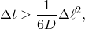

where  is the time increment, *D* is the diffusivity, and 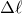 is a typical element dimension (such as the length of a side of an element). If time increments smaller than this value are used, spurious oscillations can appear in the solution. Abaqus/Standard provides no check on the initial time increment defined for a mass diffusion analysis; you must ensure that the given value does not violate the above criterion.

In transient analysis using first-order elements the solubility terms are lumped, which eliminates such oscillations but can lead to locally inaccurate solutions for small time increments. If smaller time increments are required, a finer mesh should be used in regions where the normalized concentration changes occur. 

Generally there is no upper limit on the time increment because the integration procedure is unconditionally stable unless nonlinearities cause numerical problems.

#### Automatic incrementation

The automatic time incrementation scheme for mass diffusion problems is based on the user-specified maximum normalized concentration change allowed at any node during an increment, 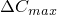.

| **Input File Usage: ** | ``` [*MASS DIFFUSION](../key/key-link.md#usb-kws-hmassdiff), DCMAX= ``` |
| --- | --- |

| **Abaqus/CAE Usage: ** | Step module: **Create Step**: **General**: **Mass diffusion**: **Basic**: **Response: Transient**; **Incrementation**: **Type: Automatic**: **Max. allowable normalized concentration change:**  |
| --- | --- |

#### Fixed time incrementation

If you choose fixed time incrementation, fixed time increments equal to the size of the user-specified initial time increment, 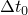, will be used.

| **Input File Usage: ** | ``` [*MASS DIFFUSION](../key/key-link.md#usb-kws-hmassdiff)  ``` |
| --- | --- |

| **Abaqus/CAE Usage: ** | Step module: **Create Step**: **General**: **Mass diffusion**: **Basic**: **Response: Transient**; **Incrementation**: **Type: Fixed**, **Increment size:**  |
| --- | --- |

#### Ending a transient analysis

Transient mass diffusion analysis can be terminated by completing a specified time period, or it can be continued until steady-state conditions are reached. By default, the analysis will end when the given time period has been completed. Alternatively, you can specify that the analysis will end when steady state is reached or the time period ends, whichever comes first. Steady state is defined as the point in time when all normalized concentrations change at less than a user-defined rate.

| **Input File Usage: ** | Use the following option to end the analysis when the time period is reached: |
| --- | --- |
|  | ``` [*MASS DIFFUSION](../key/key-link.md#usb-kws-hmassdiff), END=PERIOD (default) ``` Use the following option to end the analysis based on the concentration change rate: ``` [*MASS DIFFUSION](../key/key-link.md#usb-kws-hmassdiff), END=SS ``` |

| **Abaqus/CAE Usage: ** | Step module: **Create Step**: **General**: **Mass diffusion**: **Basic**: **Response: Transient**; **Incrementation**: **Type: Automatic**: **End step when normalized concentration change rate is less than** |
| --- | --- |

### Initial conditions

An initial normalized concentration of the diffusing material at specific nodes that belong to mass diffusion elements can be defined (["Initial conditions in Abaqus/Standard and Abaqus/Explicit," Section 34.2.1](pt07ch34s02aus116.md)). For an analysis in which mass diffusion is driven by gradients of temperature and/or pressure (["Diffusivity," Section 26.4.1](pt05ch26s04abm59.md)), the initial temperature and pressure stress fields in a model can also be defined.

| **Input File Usage: ** | Use the following options: |
| --- | --- |
|  | ``` [*INITIAL CONDITIONS](../key/key-link.md#usb-kws-minitialcond), TYPE=CONCENTRATION for initial concentrations [*INITIAL CONDITIONS](../key/key-link.md#usb-kws-minitialcond), TYPE=TEMPERATURE for initial temperatures [*INITIAL CONDITIONS](../key/key-link.md#usb-kws-minitialcond), TYPE=PRESSURE STRESS for initial equivalent pressure stress ``` |

| **Abaqus/CAE Usage: ** | Load module: **Create Predefined Field**: **Step: Initial**: choose **Other** for the **Category** and **Temperature** for the **Types for Selected Step** |
| --- | --- |
|  | Initial concentration and equivalent pressure stress are not supported in Abaqus/CAE. |

### Boundary conditions

Boundary conditions can be applied to nodal degree of freedom 11 in any mass diffusion element to prescribe values of normalized concentration (["Boundary conditions in Abaqus/Standard and Abaqus/Explicit," Section 34.3.1](pt07ch34s03aus118.md)). Such values can be specified as functions of time.

Any boundary condition changes to be applied during a mass diffusion step should be given in the respective step using appropriate amplitude definitions to specify their “time” variations (["Amplitude curves," Section 34.1.2](pt07ch34s01aus115.md)). If boundary conditions are specified for the step without amplitude references, they are assumed to change either linearly with “time” during the step or instantly at the start of the step, according to the user-specified or default time variation associated with the step (see ["Defining an analysis," Section 6.1.2](pt03ch06s01abo05.md)).

### Loads

Concentration fluxes are the only loads that can be applied in a mass diffusion analysis step.

| **Input File Usage: ** | Use the following option to specify a concentrated concentration flux at a node: |
| --- | --- |
|  | ``` [*CFLUX](../key/key-link.md#usb-kws-hcflux) *node number or node set name*, *degree of freedom*, *concentrated flux magnitude* ``` Use the following option to specify a distributed concentration flux acting on entire elements (body flux) or just on element faces (surface flux): ``` [*DFLUX](../key/key-link.md#usb-kws-hdflux) *element number or element set name*, BF or S*n*, *distributed flux magnitude* ``` |

| **Abaqus/CAE Usage: ** | Use the following input to define a concentrated concentration flux at a node: |
| --- | --- |
|  | Load module: **Create Load**: choose **Mass diffusion** for the **Category** and **Concentrated concentration flux** for the **Types for Selected Step**: select region: **Magnitude**: *concentrated flux magnitude* Use the following input to define a distributed concentration flux acting on entire elements (body flux) or just on element faces (surface flux): Load module: **Create Load**: choose **Mass diffusion** for the **Category** and **Body concentration flux** or **Surface concentration flux** for the **Types for Selected Step**: **Distribution**: **Uniform** or select an analytical field, **Magnitude**: *distributed flux magnitude* |

#### Modifying or removing concentration fluxes

Concentrated or distributed concentration fluxes can be added, modified, or removed as described in ["Applying loads: overview," Section 34.4.1](pt07ch34s04aus120.md).

#### Specifying time-dependent concentration fluxes

The magnitude of a concentrated or a distributed concentration flux can be controlled by referring to an amplitude curve (see ["Amplitude curves," Section 34.1.2](pt07ch34s01aus115.md)). If different magnitude variations are needed for different fluxes, the flux definitions can be repeated, with each referring to its own amplitude curve.

#### Defining nonuniform distributed concentration fluxes in a user subroutine

To define nonuniform distributed concentration fluxes, the variation of the flux magnitude throughout a step can be defined in user subroutine [`DFLUX`](../sub/sub-link.md#sub-xsl-dflux). If a reference flux magnitude is specified directly, it will be ignored. As a result, any amplitude reference in the flux definition is also ignored.

| **Input File Usage: ** | Use the following option to define a nonuniform distributed concentration body flux: |
| --- | --- |
|  | ``` [*DFLUX](../key/key-link.md#usb-kws-hdflux) *element number or element set*, BFNU ``` Use the following option to define a nonuniform distributed concentration surface flux: ``` [*DFLUX](../key/key-link.md#usb-kws-hdflux) *element number or element set*, S*n*NU ``` |

| **Abaqus/CAE Usage: ** | Use the following input to define a nonuniform distributed concentration body flux: |
| --- | --- |
|  | Load module: **Create Load**: choose **Mass diffusion** for the **Category** and **Body concentration flux** for the **Types for Selected Step**: select region: **Distribution: User-defined** Use the following input to define a nonuniform distributed concentration surface flux: Load module: **Create Load**: choose **Mass diffusion** for the **Category** and **Surface concentration flux** for the **Types for Selected Step**: select region: **Distribution: User-defined** |

### Predefined fields

Predefined temperatures, equivalent pressure stresses, and field variables can be specified in a mass diffusion analysis.

#### Prescribing temperatures

Temperatures are applied to nodes in temperature-driven mass diffusion analyses by defining a temperature field; absolute zero on the temperature scale used is defined as described in ["Specifying the value of absolute zero" in "Thermal loads," Section 34.4.4](pt07ch34s04aus123.md#usb-prc-pthermal-abszero). Alternatively, the temperature field can be obtained from a previous heat transfer analysis. Time-dependent temperature variations are possible with either approach.

A simple interface is provided that uses the Abaqus/Standard results file from the heat transfer analysis to define the temperature field at different times in the mass diffusion analysis. Abaqus/Standard assumes that the nodes in the mass diffusion analysis have the same numbers as the nodes in the previous heat transfer analysis. Values in the results file are ignored at nodes that exist in the heat transfer analysis but not in the mass diffusion analysis, and the temperatures at nodes that did not exist in the heat transfer analysis will not be set by reading the results file.

For specific details on prescribing temperatures, see ["Predefined temperature" in "Predefined fields," Section 34.6.1](pt07ch34s06aus128.md#usb-prc-pfields-temp).

#### Prescribing equivalent pressure stresses

Equivalent pressure stress values can be given at nodes by specifying them directly as a predefined field in the mass diffusion analysis or indirectly by reading the equivalent pressure stresses from the results file of a previous stress/displacement, fully coupled temperature-displacement, or fully coupled thermal-electrical-structural analysis. Regardless of the manner in which they are specified, pressures should be entered according to the Abaqus convention that equivalent pressure stresses are positive when they are compressive.

A simple interface is provided that uses the Abaqus/Standard results file from a mechanical analysis to define the equivalent pressure stresses at different times in the mass diffusion analysis. Abaqus/Standard assumes that the nodes in the mass diffusion analysis have the same numbers as the nodes in the previous mechanical analysis. Values in the results file are ignored at nodes that exist in the mechanical analysis but not in the mass diffusion analysis, and the pressures at nodes that did not exist in the mechanical analysis will not be set by reading the results file.

For specific details on prescribing equivalent pressure stresses, see ["Predefined pressure stress" in "Predefined fields," Section 34.6.1](pt07ch34s06aus128.md#usb-prc-pfields-pressstress).

#### Specifying predefined field variables

You can specify values of predefined field variables during a mass diffusion analysis. These values affect only field-variable-dependent material properties, if any. See ["Predefined field variables" in "Predefined fields," Section 34.6.1](pt07ch34s06aus128.md#usb-prc-pfields-fieldvariables).

### Material options

Both diffusivity (["Diffusivity," Section 26.4.1](pt05ch26s04abm59.md)) and solubility (["Solubility," Section 26.4.2](pt05ch26s04abm60.md)) must be defined in a mass diffusion analysis. Optionally, a Soret effect factor and a pressure stress factor can be defined to introduce mass diffusion caused by temperature and pressure gradients, respectively. The use of Fick's law also introduces temperature-driven mass diffusion since a Soret effect factor is calculated automatically.

### Elements

Mass diffusion analysis can be performed using only the two-dimensional, three-dimensional, and axisymmetric solid elements that are included in the Abaqus/Standard heat transfer/mass diffusion element library.

### Output

In addition to the standard output identifiers available in Abaqus/Standard (["Abaqus/Standard output variable identifiers," Section 4.2.1](pt02ch04s02abv01.md)), the following variables have special meaning in mass diffusion analyses:

Element integration point variables:

| CONC | Mass concentration. |
| --- | --- |

| ISOL | Amount of solute at the integration point, calculated as the product of the mass concentration and the integration point volume. |
| --- | --- |

| MFL | Magnitude and components of the concentration flux vector (excluding the terms due to pressure and temperature gradients). |
| --- | --- |

| MFLM | Magnitude of the concentration flux vector. |
| --- | --- |

| MFL*n* | Component *n* of the concentration flux vector (*n* = 1, 2, 3). |
| --- | --- |

| TEMP | Magnitude of the applied temperature field. |
| --- | --- |

Whole element variables:

| ESOL | Amount of solute in the element, calculated as the sum of ISOL over all the element integration points. |
| --- | --- |

| NFLUX | Fluxes at the nodes of the element caused by mass diffusion in the element. |
| --- | --- |

| FLUXS | Distributed mass flux applied to an element. |
| --- | --- |

Whole or partial model variables:

| SOL | Amount of solute in the model or specified element set, calculated as the sum of ESOL over all the elements in the model or set. |
| --- | --- |

Nodal variables:

| CFL | All concentrated flux values. |
| --- | --- |

| CFL*n* | Concentrated flux value *n* at a node (*n* = 11). |
| --- | --- |

| NNC | All normalized concentration values at a node. |
| --- | --- |

| NNC*n* | Normalized concentration degree of freedom *n* at a node (*n* = 11). |
| --- | --- |

| RFL | All reaction flux values (conjugate to normalized concentration). |
| --- | --- |

| RFL*n* | Reaction flux value *n* at a node (*n* = 11) (conjugate to normalized concentration). |
| --- | --- |

### Input file template

The following template is representative of a three-step mass diffusion analysis. The first step establishes an initial steady-state concentration distribution of a diffusing material. In the second step equivalent pressure stresses are read from a fully coupled temperature-displacement analysis and the transient mass diffusion response is obtained for the case of mechanical loading of the body. In the final step a temperature field is read from a fully coupled temperature-displacement analysis and the transient mass diffusion response is calculated for the case of heating and cooling the body in which diffusion occurs. An example problem that follows this template is ["Thermo-mechanical diffusion of hydrogen in a bending beam," Section 1.10.1 of the Abaqus Benchmarks Guide](../bmk/bmk-link.md#bmk-anl-thermomechdiffusion).

```
[*HEADING](../key/key-link.md#usb-kws-mheading)
…
[*MATERIAL](../key/key-link.md#usb-kws-mmaterial),NAME=*mat1*
[*SOLUBILITY](../key/key-link.md#usb-kws-msolubility)
*Data lines to define solubility*
[*DIFFUSIVITY](../key/key-link.md#usb-kws-mdiffusivity)
*Data lines to define diffusivity*
[*KAPPA](../key/key-link.md#usb-kws-mkappa),TYPE=TEMP
*Data lines to define diffusion driven by temperature gradients*
[*KAPPA](../key/key-link.md#usb-kws-mkappa),TYPE=PRESS
*Data lines to define diffusion driven by gradients of equivalent pressure stress*
[*INITIAL CONDITIONS](../key/key-link.md#usb-kws-minitialcond),TYPE=TEMPERATURE
*Data lines to define an initial temperature field*
[*INITIAL CONDITIONS](../key/key-link.md#usb-kws-minitialcond),TYPE=CONCENTRATION
*Data lines to define initial nodal values of normalized concentration*
[*INITIAL CONDITIONS](../key/key-link.md#usb-kws-minitialcond),TYPE=PRESSURE STRESS
*Data lines to define initial nodal values of equivalent pressure stress*
[*AMPLITUDE](../key/key-link.md#usb-kws-mamplitude),NAME=*name*
*Data lines to define amplitude variations*
**
[*STEP](../key/key-link.md#usb-kws-hstep)
Step 1 - steady-state solution
[*MASS DIFFUSION](../key/key-link.md#usb-kws-hmassdiff),STEADY STATE
*Data line to define incrementation*
[*BOUNDARY](../key/key-link.md#usb-kws-hboundary)
*Data lines to prescribe nodal values of normalized concentration*
[*EL FILE](../key/key-link.md#usb-kws-helfile)
*Data lines to define element integration output to the results file*
[*NODE FILE](../key/key-link.md#usb-kws-hnodefile)
*Data lines to define nodal output to the results file*
[*END STEP](../key/key-link.md#usb-kws-hendstep)
**
[*STEP](../key/key-link.md#usb-kws-hstep)
Step 2 - transient analysis driven by pressure stress gradients
[*MASS DIFFUSION](../key/key-link.md#usb-kws-hmassdiff),DCMAX=*dcmax*,END=SS
*Data line to define incrementation*
[*BOUNDARY](../key/key-link.md#usb-kws-hboundary)
*Data lines to prescribe nodal values of normalized concentration*
[*PRESSURE STRESS](../key/key-link.md#usb-kws-hpressure),FILE=*name*
[*EL FILE](../key/key-link.md#usb-kws-helfile)
*Data lines to define element integration output to the results file*
[*NODE FILE](../key/key-link.md#usb-kws-hnodefile)
*Data lines to define nodal output to the results file*
[*END STEP](../key/key-link.md#usb-kws-hendstep)
**
[*STEP](../key/key-link.md#usb-kws-hstep)
Step 3 - transient analysis driven by temperature gradients
[*MASS DIFFUSION](../key/key-link.md#usb-kws-hmassdiff),DCMAX=*dcmax*,END=SS
*Data line to define incrementation*
[*BOUNDARY](../key/key-link.md#usb-kws-hboundary)
*Data lines to prescribe nodal values of normalized concentration*
[*TEMPERATURE](../key/key-link.md#usb-kws-htemperature),FILE=*name*
[*EL FILE](../key/key-link.md#usb-kws-helfile)
*Data lines to define element integration output to the results file*
[*NODE FILE](../key/key-link.md#usb-kws-hnodefile)
*Data lines to define nodal output to the results file*
[*END STEP](../key/key-link.md#usb-kws-hendstep)
```

#### Additional reference

- Crank, J., *The Mathematics of Diffusion, *Clarendon Press, Oxford, 1956.


