# 6.10.1 Acoustic, shock, and coupled acoustic-structural analysis


**Products: **Abaqus/Standard  Abaqus/Explicit  Abaqus/CAE  

##### **References**

- ["Acoustic medium," Section 26.3.1](pt05ch26s03abm58.md)
- ["Acoustic and shock loads," Section 34.4.6](pt07ch34s04aus125.md)
- ["Initial conditions in Abaqus/Standard and Abaqus/Explicit," Section 34.2.1](pt07ch34s02aus116.md)
- ["ALE adaptive meshing: overview," Section 12.2.1](pt04ch12s02abo14.md)
- ["Steady-state transport analysis," Section 6.4.1](pt03ch06s04at17.md)
- [*ACOUSTIC FLOW VELOCITY](../key/key-link.md#usb-kws-hacousticflowvelocity)
- [*ACOUSTIC WAVE FORMULATION](../key/key-link.md#usb-kws-macousticwaveform)
- [*ADAPTIVE MESH](../key/key-link.md#usb-kws-hadaptivemesh)
- [*BEAM FLUID INERTIA](../key/key-link.md#usb-kws-mbeamfluidinertia)
- [*CONWEP CHARGE PROPERTY](../key/key-link.md#usb-kws-mconwepchargeproperty)
- [*IMPEDANCE](../key/key-link.md#usb-kws-himpedance)
- [*IMPEDANCE PROPERTY](../key/key-link.md#usb-kws-mimpedanceprop)
- [*INCIDENT WAVE](../key/key-link.md#usb-kws-hincidentwave)
- [*INCIDENT WAVE INTERACTION](../key/key-link.md#usb-kws-hincidentwaveinteraction)
- [*INITIAL CONDITIONS](../key/key-link.md#usb-kws-minitialcond)
- [*SIMPEDANCE](../key/key-link.md#usb-kws-hsimpedance)
- [*TIE](../key/key-link.md#usb-kws-mtie)
- ["Defining an acoustic pressure boundary condition," Section 16.10.19 of the Abaqus/CAE User's Guide](../usi/usi-link.md#usi-lbi-bceditors-accousticpressure)
- ["Creating the submodel boundary condition," Section 38.4 of the Abaqus/CAE User's Guide](../usi/usi-link.md#usi-adv-submodeling-bc)

### Overview

Analyses performed using acoustic elements, an acoustic medium, and a dynamic procedure can simulate a variety of engineering phenomena including low-amplitude wave phenomena involving fluids such as air and water and “shock” analysis involving higher amplitude waves in fluids interacting with structures.

An acoustic analysis:
- is used to model sound propagation, emission, and radiation problems;
- can include incident wave loading to model effects such as underwater explosion (UNDEX) on structures interacting with fluids, airborne blast loading on structures, or sound waves impinging on a structure;
- in Abaqus/Explicit can include fluid undergoing cavitation when the absolute pressure drops to a limit value;
- is performed using one of the dynamic analysis procedures (["Dynamic analysis procedures: overview," Section 6.3.1](pt03ch06s03abo07.md));
- can be used to model an acoustic medium alone, as in the study of the natural frequencies of vibration of a cavity containing an acoustic fluid;
- can be used to model a coupled acoustic-structural system, as in the study of the noise level in a vehicle;
- can be used to model the sound transmitted through a coupled acoustic-structural system;
- requires the use of acoustic elements and, for coupled acoustic-structural analysis, a surface-based interaction using a tie constraint or, in Abaqus/Standard, acoustic interface elements;
- can be used to obtain the scattered wave solution directly under incident wave loading when the mechanical behavior of the fluid is linear;
- can be used to obtain a total wave solution (sum of the incident and the scattered waves) by selecting the total wave formulation, particularly when nonlinear fluid behavior such as cavitation is present in the acoustic medium;
- can be used to model problems where the acoustic medium interacts with a structure subjected to large static deformation;
- in Abaqus/Standard can be used with symmetric model generation (["Symmetric model generation," Section 10.4.1](pt04ch10s04aus63.md)) and symmetric results transfer (["Transferring results from a symmetric mesh or a partial three-dimensional mesh to a full three-dimensional mesh," Section 10.4.2](pt04ch10s04aus64.md));
- in Abaqus/Standard can be used with steady-state transport (["Steady-state transport analysis," Section 6.4.1](pt03ch06s04at17.md)) and an acoustic flow velocity (["*ACOUSTIC FLOW VELOCITY," Section 1.1 of the Abaqus Keywords Reference Guide](../key/key-link.md#usb-kws-hacousticflowvelocity)) to model acoustic perturbations of a moving fluid;
- in Abaqus/Standard can include a coupled structural-acoustic substructure that was previously defined (["Defining substructures," Section 10.1.2](pt04ch10s01aus59.md));
- can be used to model both interior problems, where a structure surrounds one or more acoustic cavities, and exterior problems, where a structure is located in a fluid medium extending to infinity; and
- is applicable to any vibration or dynamic problem in a medium where the effects of shear stress are negligible.

A shock analysis:- is used to model blast effects on structures;
- often requires double precision to avoid roundoff error when Abaqus/Explicit is used;
- may include acoustic elements to model the effects of fluid inertia and compressibility;
- may include virtual mass effects to model the effect of an incompressible fluid interacting with a pipe structure;
- is performed using one of the dynamic analysis procedures (["Dynamic analysis procedures: overview," Section 6.3.1](pt03ch06s03abo07.md));
- can be used to model both interior problems, where a structure surrounds one or more fluid cavities, and exterior problems, where a structure is located in a fluid medium extending to infinity; and
- in Abaqus/Explicit can include air blast loading on structures using the CONWEP model.

### Procedures available for acoustic analysis

Acoustic elements model the propagation of acoustic waves and are active only in dynamic analysis procedures. They are most commonly used in the following procedures:
- Direct solution, steady-state, harmonic analysis. See ["Direct-solution steady-state dynamic analysis," Section 6.3.4](pt03ch06s03at09.md).
- Frequency analysis. See ["Natural frequency extraction," Section 6.3.5](pt03ch06s03at10.md).
- Subspace-based steady-state dynamic analysis. See ["Subspace-based steady-state dynamic analysis," Section 6.3.9](pt03ch06s03at14.md).
- Explicit dynamic analysis. See ["Explicit dynamic analysis," Section 6.3.3](pt03ch06s03at08.md).

 Acoustic analysis can also be performed using:- Direct time integration analysis. See ["Implicit dynamic analysis using direct integration," Section 6.3.2](pt03ch06s03at07.md).
- Complex frequency analysis. See ["Natural frequency extraction," Section 6.3.5](pt03ch06s03at10.md).
- Mode-based transient dynamic analysis. See ["Transient modal dynamic analysis," Section 6.3.7](pt03ch06s03at12.md).
- Mode-based steady-state dynamic analysis. See ["Mode-based steady-state dynamic analysis," Section 6.3.8](pt03ch06s03at13.md).
- Dynamic fully coupled temperature-displacement analysis. See ["Fully coupled thermal-stress analysis," Section 6.5.3](pt03ch06s05at19.md).

In general, analysis with acoustic elements should be thought of as small-displacement linear perturbation analysis, in which the strain in the acoustic elements is strictly (or overwhelmingly) volumetric and small. In many applications the base state for the linear perturbation is simply ignored: for solid structures interacting with air or water, the initial stress (if any) in the air or water has negligible physical effect on the acoustic waves. Most engineering acoustic analyses, transient or steady state, are of this type. 

An important exception is when the acoustic perturbation occurs in a gas or liquid with high-speed underlying flow. If the magnitude of the flow velocity is significant compared to the speed of sound in the fluid (i.e., the Mach number is much greater than zero), the propagation of waves is facilitated in the direction of flow and impeded in the direction against the flow. This phenomenon is the source of the well-known “Doppler effect.” In Abaqus/Standard underlying flow effects are prescribed for nodes making up acoustic elements by specifying an acoustic flow velocity.

Acoustic elements can be used in a static analysis, but all acoustic effects will be ignored. A typical example is the air cavity in a tire/wheel assembly. In such a simulation the tire is subjected to inflation, rim mounting, and footprint loads prior to the coupled acoustic-structural analysis in which the acoustic response of the air cavity is determined. See ["Defining ALE adaptive mesh domains in Abaqus/Standard," Section 12.2.6](pt04ch12s02aus82.md), and ["ALE adaptive meshing and remapping in Abaqus/Standard," Section 12.2.7](pt04ch12s02aus83.md), for more information.

Acoustic elements also can be used in a substructure generation procedure to generate coupled structural-acoustic substructures. Only structural degrees of freedom can be retained. The retained eigenmodes must be selected when an acoustic-structural substructure is generated. In a static analysis involving a substructure containing acoustic elements, the results will differ from the results obtained in an equivalent static analysis without substructures. The reason is that the acoustic-structural coupling is taken into account in the substructure (leading to hydrostatic contributions of the acoustic fluid), while the coupling is ignored in a static analysis without substructures. More details on coupled structural-acoustic substructures can be found in ["Defining substructures," Section 10.1.2](pt04ch10s01aus59.md).

A volumetric drag coefficient, , can be defined to simulate fluid velocity-dependent pressure amplitude losses. These occur, for example, when the acoustic medium flows through a porous matrix that causes some resistance (see ["Acoustic medium," Section 26.3.1](pt05ch26s03abm58.md)), such as a sound-deadening material like fiberglass insulation. For direct time integration dynamic analysis we assume there are no significant spatial discontinuities in the quantity , where  is the density of the fluid (acoustic medium), and that the volumetric drag is small at acoustic-structural boundaries. These assumptions, which can limit the applicability of the analysis, are discussed further in ["Coupled acoustic-structural medium analysis," Section 2.9.1 of the Abaqus Theory Guide](../stm/stm-link.md#stm-anl-acouststruct).

The direct-solution steady-state dynamic harmonic response procedure is advantageous for acoustic-structural sound propagation problems, because the gradient of  need not be small and because acoustic-structural coupling and damping are not restricted in this formulation. If there is no damping or if damping can be neglected, factoring a real-only matrix can reduce computational time significantly; see ["Direct-solution steady-state dynamic analysis," Section 6.3.4](pt03ch06s03at09.md), for details.

Some fluid-solid interaction analyses involve long-duration dynamic effects that more closely resemble structural dynamic analysis than wave propagation; that is, the important dynamics of the structure occur at a time scale that is long compared to the compressional wave speed of the solid medium and the acoustic wave speed of the fluid. Equivalently, in such cases, disturbances of interest in the structure propagate very slowly in comparison to waves in the fluid and compressional waves in the structure. In such instances, modeling of the structure using beams is common. When these structural elements interact with a surrounding fluid, the important fluid effect is due to motions associated with incompressible flow (see ["Loading due to an incident dilatational wave field," Section 6.3.1 of the Abaqus Theory Guide](../stm/stm-link.md#stm-ldc-undexloads)). These motions result in a perceived inertia added to the structural beam; therefore, this case is usually referred to as the “virtual mass approximation.” For this case Abaqus allows you to modify the inertia properties of beam and pipe elements, as described below. Loads on the structure associated with incident waves in the fluid can be accommodated under this approximation as well.

#### Natural frequency extraction

Abaqus can compute both real and complex eigensolutions for purely acoustic or structural-acoustic systems, with or without damping. Exterior acoustic problems may also be solved.

##### Selecting an eigensolver

In a coupled acoustic-structural model, real-valued coupled modes are extracted by default using the Lanczos eigenfrequency extraction procedure. Coupling may be suppressed in the frequency extraction step; in this case the structural elements behave as though the interface with the acoustic elements were free (as though this surface were “in vacuo”), and the acoustic elements behave as though the boundary with the structural elements were rigid. Extracting the coupled acoustic-structural modes is also available for the AMS eigensolver.

Structural-acoustic coupling is ignored if the subspace iteration eigensolver is used. 

When applying the AMS eigensolver to a coupled structural-acoustic model, Abaqus by default projects and stores the acoustic coupling matrix during the natural frequency extraction, for later use in coupled forced response analyses. The structural and acoustic regions are not actually coupled during the eigenanalysis; Abaqus solves the two regions separately but computes and stores the projected coupling operator for use in subsequent steady-state dynamic steps. Only structural-acoustic coupling defined using tied contact is supported. You can suppress this coupling if desired. Damping due to acoustic volumetric drag is also projected by default during an eigenanalysis and is restored by default in subsequent steady-state dynamic steps. Projecting and storing the acoustic coupling matrix during the natural frequency extraction is also available for the Lanczos eigensolver based on the SIM architecture.

##### Damping and inertia effects in an acoustic natural frequency extraction

Since damping is not taken into account in real-valued modal extraction, the volumetric drag effect is not considered, except for its small contribution to any nonreflecting boundaries (see ["Coupled acoustic-structural medium analysis," Section 2.9.1 of the Abaqus Theory Guide](../stm/stm-link.md#stm-anl-acouststruct)). The damping contributions due to any impedance boundary conditions (element-based or surface-based) or acoustic infinite elements are not included in an eigenfrequency extraction step, but the contributions to the acoustic element mass and stiffness matrices are included. Similarly, the (symmetrized) stiffness and mass contributions of acoustic infinite elements are included in an eigenfrequency extraction step, but the damping effects are neglected.

Modal analysis of damped and radiating acoustic systems can be performed in Abaqus as well. Using the complex eigenvalue extraction procedure, the damping contributions of acoustic infinite elements, nonreflecting impedance conditions, and general impedance layers are restored to the element operators.

If an underlying flow field is defined for the acoustic region by specifying an acoustic flow velocity, the natural frequencies and modes are affected. However, in real-valued frequency extraction only the acoustic element mass and stiffness matrices contribute to the solution. Since the formulation for acoustics in the presence of a flow field requires a complex part in the element operator (damping matrix), the real-valued procedure can include the effects of flow only to a limited degree. The complex frequency procedure in Abaqus/Standard includes the damping matrix contribution and is, therefore, required when modes of a system with moving fluid are sought. The complex frequency procedure can be used only following the Lanczos real-valued frequency procedure.

Virtual mass effects defined for beams by adding inertia (["Additional inertia due to immersion in fluid" in "Beam section behavior," Section 29.3.5](pt06ch29s03alm10.md#usb-elm-ebeamsectionbehavior-fluidinertia)) are included in modal analysis: their effect is simply to add inertia to a beam element. 

##### Interpreting the extracted modes in a coupled structural-acoustic natural frequency analysis

While all the modes extracted in a coupled Lanczos structural-acoustic natural frequency analysis include the effects of fluid-solid interaction, some of them may have predominantly structural contributions while others may have predominantly acoustic contributions. Coupled structural-acoustic eigenmodes can be categorized as follows:
- Most generally, an individual mode may exhibit participation in both the fluid and the solid media; this is referred to as a "coupled mode."
- Second, there are the "structural resonance" modes. These are modes corresponding to the eigenmodes of the structure without the presence of the acoustic fluid. The presence of the acoustic fluid has a relatively small effect on these eigenfrequencies and the mode shapes.
- Third, there are the "acoustic cavity resonance" modes. These are nonzero eigenfrequency coupled modes that have a significant contribution in the resulting dynamics of the acoustic pressure in mode-based dynamic procedures.
- Fourth, if insufficient boundary conditions are specified on the structural part of a model, the frequency extraction procedure will extract rigid body modes. These modes have zero eigenfrequencies (sometimes they appear as either small positive or even negative eigenvalues). However, if sufficient structural degrees of freedom are constrained, these rigid body modes disappear.
- Finally, there are the singular acoustic modes, which have zero eigenfrequencies and constant acoustic pressure; they are mathematically analogous to structural rigid body modes. The structural part of the singular acoustic modes corresponds to the quasi-static structural response to constant pressure in unconstrained acoustic regions. These eigenmodes are predominantly acoustic and are important in representing the (low-frequency) acoustic response in mode-based analysis in the presence of acoustic loads, in the same way that rigid body modes are important in the representation of structural motion. As is true for the structural rigid body modes, if a sufficient number of constrained acoustic degrees of freedom is specified (one degree of freedom 8 per acoustic region is enough), the singular acoustic modes will disappear. In models with only one unconstrained acoustic region (the most common case) only one singular acoustic mode will be computed. In general there are as many singular acoustic modes as there are independent unconstrained acoustic regions. If these modes are present, they are always reported first by the Lanczos eigensolver; and a note at the bottom of the eigenfrequency table in the data file provides information about the number of singular acoustic modes.

The generalized masses and effective masses can help distinguish between the various types of modes and can be used to assess which modes are important for subsequent mode-based analyses. In addition, the acoustic contribution to the generalized masses is reported as a fraction for each eigenmode. The closer the value of this fraction is to unity, the more pronounced is the acoustic component of this eigenmode. An acoustic effective mass is also computed for each eigenmode. This scalar quantity is scaled such that when all eigenmodes in a model are extracted, the sum of all acoustic effective masses is equal to 1.0 (minus the contributions from nodes with restrained acoustic degrees of freedom). The acoustic effective mass can be compared between different modes: the higher the acoustic effective mass, the more important (typically) the mode is for accurate representation of the acoustic pressure. For example, the fluid cavity acoustic resonance modes will have larger acoustic effective masses compared to the other modes.

#### Modal superposition procedures

In Abaqus acoustic domains are handled quite similarly to solid and structural domains. Real-valued eigenmodes, resulting from a previous real-valued eigenfrequency extraction procedure with or without coupling effects included, are used as a basis for modal solutions. The mode-based steady-state dynamic procedure is the most computationally efficient alternative to compute the steady-state response of structural-acoustic systems. Structural-acoustic coupling and damping effects in these analyses depend on the type of modal procedure and the eigensolver that was used to compute the eigenfrequencies.

##### Structural-acoustic coupling in modal analyses using the Lanczos eigensolver without the SIM architecture

If coupled modes are computed using the Lanczos eigensolver, both the mode-based and subspace projection steady-state dynamic procedures will include structural-acoustic coupled effects. If uncoupled Lanczos modes are computed, coupling can be restored only by using subspace projection. It is sufficient to project at a single frequency (constant subspace) to resolve the acoustic coupling for all frequencies.

##### Acoustic medium damping in modal analyses using the Lanczos eigensolver without the SIM architecture

In subspace-based steady-state dynamic analysis, acoustic medium damping and structural material damping are considered, and the structural-acoustic interaction, infinite element, and impedance boundary terms are also included. 

Acoustic medium damping is not considered in the procedures that base the response prediction directly on the system's eigenmodes, such as transient modal dynamic analysis or the mode-based steady-state dynamic procedure. These methods should, therefore, be used with caution for problems with impedance boundary conditions. Modal damping can be used in these procedures (["Material damping," Section 26.1.1](pt05ch26s01abm51.md)) to model material damping and volumetric drag effects; however, modal damping usually cannot be used to model the fluid-solid coupling or the impedance boundary effects accurately.

##### Structural-acoustic coupling and damping in modal analyses using the subspace iteration eigensolver

The subspace iteration eigensolver neglects the effects of structural-acoustic coupling; therefore, coupling effects are not included in subsequent modal procedures.

As with analyses using the Lanczos eigensolver, acoustic medium damping and structural material damping are considered in subsequent subspace-based steady-state dynamic procedures, but these damping effects are not considered in subsequent transient modal or mode-based steady-state dynamic procedures.

##### Structural-acoustic coupling and damping in modal analyses using the AMS eigensolver or the Lanczos eigensolver based on the SIM architecture

The structural-acoustic modes, extracted using the AMS eigensolver or the Lanczos eigensolver, can be used in modal analyses using the SIM architecture. When uncoupled modes are computed using the AMS eigensolver or the Lanczos eigensolver based on the SIM architecture with projection of the structural-acoustic coupling specified, the coupling and acoustic damping operators are projected and stored during the natural frequency extraction. Subsequent coupled forced response analyses using modal steady-state dynamics automatically restore the effects of structural-acoustic coupling and damping by automatically using these projected matrices; if the matrices were not projected, the steady-state dynamic step would not include these effects. A mode-based steady-state dynamic step cannot use unsymmetric damping, such as from acoustic flow velocity or infinite element effects. To take these effects into account, a subspace-based steady-state dynamic analysis should be used. 

### Defining translational or rotational underlying flow velocity in Abaqus/Standard

As described above, acoustic analysis in Abaqus/Standard can be performed as a linear perturbation of a high-speed flow field. The flow velocity field affects the propagation of acoustic waves in the medium through the effect of the flow velocity on the speed of the wave propagation. Waves travel faster along the direction of the local flow vector and are correspondingly impeded in the direction against the flow direction. It is sufficient for you to define the velocity field in the affected acoustic region; the accelerations do not play a role in the formulation.

You specify the flow in the acoustic finite element region as history data within a dynamic linear perturbation step. The flow field can be described either by direct input of the velocity components or by defining rotating motion associated with a reference frame. In the former case, each node in the acoustic region where flow occurs is assigned a Cartesian velocity defined by specifying the components of the velocity vector, . In the latter case, the rotational velocity for the nodes in the acoustic region is defined by specifying the magnitude of an angular rotation velocity, , and the position and orientation of the axis of rotation in the current configuration. The position and orientation of the axis are applied at the beginning of the step and remain fixed during the step.

The specified underlying flow is active only for acoustic finite elements; other elements with acoustic degrees of freedom, such as acoustic infinite and interface elements, are unaffected by the specified flow velocity. The effect of underlying flow on the acoustic finite elements depends also on the procedure used: the effects are present only in frequency-domain dynamic procedures and natural frequency extraction. For complex-valued procedures, such as complex frequency extraction and steady-state dynamics, the presence of underlying flow affects the acoustic finite element stiffness matrices and adds a significant contribution to the element damping matrix. For real-valued procedures, such as eigenfrequency extraction and steady-state dynamics analysis in which a real-only system matrix is factored, the presence of underlying flow affects only the acoustic finite element stiffness matrices; the damping matrix is ignored. Consequently, the effect of flow on the acoustic field is fully realized only in complex-valued procedures.

For rotating systems, solid and acoustic materials are treated differently in Abaqus. Flow of solid material through a mesh may induce significant deformation and is handled by using steady-state transport; subsequent linear perturbation steps are analyzed about this deformed state (see ["Steady-state transport analysis," Section 6.4.1](pt03ch06s04at17.md)). Flow of material through an acoustic mesh is handled entirely within linear perturbation steps by specifying an acoustic flow velocity; a preliminary nonlinear steady-state transport analysis is not required. For coupled acoustic-structural systems undergoing rotation, such as tires, the model may be subjected to a steady-state transport step, which deforms the solid medium, followed by linear perturbation dynamic steps. The effect of the rotation of the solid is included in the linear perturbation steps in this case; to include the effect of the rotation of the acoustic fluid, specify an acoustic flow velocity in the linear perturbation steps.

| **Input File Usage: ** | Use the following option to define a translating fluid velocity: |
| --- | --- |
|  | ``` [*ACOUSTIC FLOW VELOCITY](../key/key-link.md#usb-kws-hacousticflowvelocity), TRANSLATION ``` Use the following option to define a rotating fluid velocity: ``` [*ACOUSTIC FLOW VELOCITY](../key/key-link.md#usb-kws-hacousticflowvelocity), ROTATION ``` |

| **Abaqus/CAE Usage: ** | Acoustic flow velocity is not supported in Abaqus/CAE. |
| --- | --- |

### Updating the acoustic domain during a large-displacement Abaqus/Standard analysis

By default, the acoustic-structural coupling calculations are based on the original configuration of the fluid domain. However, acoustic elements can also be used in an analysis where the structural domain experiences large deformation prior to the coupled analysis. A typical example is the interior cavity of a tire subjected to structural loads such as inflation, rim mounting, and footprint pressure.

The acoustic elements in Abaqus do not have displacement degrees of freedom and, therefore, cannot model the deformation of the fluid when the structure undergoes large deformation. Abaqus/Standard solves the problem of computing the current configuration of the acoustic domain by periodically creating a new acoustic mesh. The new mesh uses the same topology (elements and connectivity) throughout the simulation, but the nodal locations are adjusted so that the acoustic domain conforms to the structural domain on the boundary.

A new acoustic mesh is computed when adaptive meshing is specified and nonlinear geometric effects are considered in any non-perturbation Abaqus/Standard analysis procedure in which acoustic effects are ignored. 

The adaptive meshing features for acoustic analysis are described in detail in ["Defining ALE adaptive mesh domains in Abaqus/Standard," Section 12.2.6](pt04ch12s02aus82.md), and ["ALE adaptive meshing and remapping in Abaqus/Standard," Section 12.2.7](pt04ch12s02aus83.md).

### Initial conditions

In Abaqus/Standard the initial acoustic static pressure (hydrostatic or ambient) is not modeled by the acoustic formulation and cannot be specified as an initial condition.

In Abaqus/Explicit the initial acoustic pressure corresponding to the initial static equilibrium (hydrostatic or ambient) can be specified (see ["Initial conditions in Abaqus/Standard and Abaqus/Explicit," Section 34.2.1](pt07ch34s02aus116.md)) and is meaningful only when the acoustic fluid is capable of undergoing cavitation. In problems with possible fluid cavitation the initial acoustic static pressure is taken into account in the cavitation condition; i.e., the sum of the dynamic and static acoustic pressures needs to drop to the cavitation pressure limit for the cavitation to occur. The specified acoustic static pressure is used only in the cavitation condition and does not apply any static loads to the acoustic or structural meshes at their common wetted interface. In addition, the acoustic static pressure is not included in the nodal acoustic pressure degree of freedom.

The initial temperature and field variable values can be specified (["Initial conditions in Abaqus/Standard and Abaqus/Explicit," Section 34.2.1](pt07ch34s02aus116.md)) for the direct time integration dynamic, explicit dynamic, dynamic fully coupled temperature-displacement, and mode-based transient dynamic analysis procedures. Changes in these variables during the analysis will affect any temperature-dependent or field-variable-dependent acoustic medium properties.

### Boundary conditions

The various boundary conditions that can be applied to an acoustic medium are described below. These include acoustic domain boundaries with stationary rigid walls or symmetry planes, prescribed pressure values such as a free surface with zero dynamic pressure, specified impedance (see ["Acoustic and shock loads," Section 34.4.6](pt07ch34s04aus125.md)), and structural interfaces such as the interface with a ship or a submarine. The radiating (nonreflecting) boundary condition for exterior problems (such as a structure vibrating in an acoustic medium of infinite extent) is implemented as a special case of the impedance boundary condition (see ["Acoustic and shock loads," Section 34.4.6](pt07ch34s04aus125.md)). On any given part of the acoustic domain boundary only one boundary condition type should be applied, except for the combination of the impedance boundary condition and the acoustic-structural interface condition.

#### Boundary with a stationary rigid wall or a symmetry plane

The default boundary condition for an acoustic medium is a boundary with a stationary rigid wall or a symmetry plane. The “force” conjugate to pressure in the acoustics formulation in Abaqus is the normal pressure gradient at the surface divided by the mass density; dimensionally this is equal to a force per unit mass. In the absence of volumetric drag this force per unit mass is equal to the inward acceleration of the acoustic medium. The conjugate variable at a node on the surface is the inward volume acceleration, which is the integral of the inward acceleration of the acoustic medium evaluated over the surface area associated with the node. A “traction-free” surface (one with no boundary conditions, no applied loads, no surface impedance conditions, and no interface elements) is a surface normal to which the acoustic medium undergoes no motion and, thus, corresponds to a rigid, stationary surface adjacent to the fluid. A symmetry plane for the acoustic medium is another “traction-free” surface.

#### Prescribed pressure

The basic variable in the acoustic medium is pressure (degree of freedom 8). Therefore, this variable can be prescribed at any node in the acoustic model by applying a boundary condition (["Boundary conditions in Abaqus/Standard and Abaqus/Explicit," Section 34.3.1](pt07ch34s03aus118.md)). Setting the pressure to zero represents a “free surface,” where the pressure does not vary because of the motion of the surface (to account for surface motion effects, see the discussion of impedance below). Prescribing a nonzero value for the pressure represents a sound source.

An amplitude variation can be used to specify the value of the pressure. In a steady-state analysis you can specify both the in-phase (real) part of the pressure (default) and the out-of-phase (imaginary) part of the pressure.

| **Input File Usage: ** | Use either of the following options to define the real (in-phase) part of the boundary condition: |
| --- | --- |
|  | ``` [*BOUNDARY](../key/key-link.md#usb-kws-hboundary) [*BOUNDARY](../key/key-link.md#usb-kws-hboundary), REAL ``` Use the following option to define the imaginary (out-of-phase) part of the boundary condition: ``` [*BOUNDARY](../key/key-link.md#usb-kws-hboundary), IMAGINARY ``` |

| **Abaqus/CAE Usage: ** | Load module: **Create Boundary Condition**: choose **Other** for the **Category** and **Acoustic pressure** for the **Types for Selected Step**: select regions: **Magnitude**: *real (in-phase) part*** + ***imaginary (out-of-phase) * *part* **i** |
| --- | --- |

#### Boundary with a structure

If the acoustic medium is adjacent to a structure, there will be a transfer of momentum and energy between the media at the boundary. The pressure field modeled with acoustic elements creates a normal surface traction on the structure, and the acceleration field modeled with structural elements creates the natural forcing term at the fluid boundary (for details, see ["Coupled acoustic-structural medium analysis," Section 2.9.1 of the Abaqus Theory Guide](../stm/stm-link.md#stm-anl-acouststruct)).

The surface-based coupling procedure and the user-defined acoustic interface elements differ slightly in their theoretical implementation. In essence, the interface elements computed internally by the surface-based procedure are discrete point elements computed at the nodes of the slave surface. A user-defined acoustic interface element, on the other hand, distributes coupling effects across all of its nodes. Generally, the results obtained using the two coupling methods will be very similar, but the difference in discretization at the coupling boundary may create small differences in results.

##### Defining acoustic-structural coupling with user-defined acoustic interface elements

In Abaqus/Standard, if the structural and acoustic meshes share nodes at the boundary, lining this boundary with acoustic-structural interface elements (see ["Acoustic interface element library," Section 32.13.2](pt06ch32s13ael44.md)) will enforce the required physical coupling condition. The interface element normals must point into the acoustic medium, which forces continuity of the normal accelerations of the acoustic medium and of the structure at the boundary and ensures that the pressure of the acoustic elements is applied to the structure. Displacements can also be prescribed at such a boundary.

##### Defining acoustic-structural coupling using a surface-based coupling procedure

Alternatively, a surface-based procedure can be used to enforce the coupling; in Abaqus/Explicit the surface-based procedure is the only available method. This method requires that the structural and acoustic meshes use separate nodes. You define surfaces on the structural and fluid meshes and define the interaction between the two meshes using a surface-based tie constraint (see ["Mesh tie constraints," Section 35.3.1](pt08ch35s03aus132.md)). No additional element definitions are required.

The slave surface, the first of the two surfaces specified for the tie constraint, must be element-based; whereas the master surface can be either element- or node-based. A surface based on rigid element types (R3D4, etc.) or an analytical rigid surface cannot be used as a master surface; instead, use a deformable surface made rigid.

For surface-based tie constraints Abaqus automatically computes the region of influence for each internally generated acoustic-structural interface element. If the user-defined slave surface overhangs the master surface significantly, the regions of influence may include parts of the overhang. Consequently, the overhanging part of the slave surface may exhibit nonphysical coupled degrees of freedom: displacements if the slave surface is acoustic and acoustic pressures if the slave surface is solid or structural. These nonphysical results on the overhang do not affect the remainder of the solution, and it should be understood that they are not meaningful.

| **Input File Usage: ** | Use the following option in an analysis with the fluid mesh surface as the slave: |
| --- | --- |
|  | ``` [*TIE](../key/key-link.md#usb-kws-mtie), NAME=*fluidslave* *fluid_surf, struct_surface* ``` Use the following option in an analysis with the solid mesh surface as the slave: ``` [*TIE](../key/key-link.md#usb-kws-mtie), NAME=*solidslave* *struct_surf, fluid_surf* ``` |

| **Abaqus/CAE Usage: ** | Interaction module: **Create Constraint**: **Tie** |
| --- | --- |

##### Coupling surfaces to structures using acoustic infinite elements

Acoustic infinite elements may form surfaces that can be coupled to structures by using a tie constraint in two different ways. The acoustic infinite element surface may consist of the base (first) facets of the acoustic infinite elements; in this case this surface should be tied to a topologically similar structural surface. The acoustic infinite element edges may also be used to define surfaces (see ["Mesh tie constraints," Section 35.3.1](pt08ch35s03aus132.md)), which can be tied to solid elements. This approach couples the semi-infinite sides of acoustic infinite elements to solid elements.

##### Mesh refinement

Although the meshes may be nodally nonconforming at the tied surfaces, mesh refinement affects the accuracy of the coupled solution. In acoustic-solid problems the mesh refinement depends on the wave speeds in the two media. The mesh for the medium with the lower wave speed should generally be more refined and, therefore, should be the slave surface. If the details of the wave field in the vicinity of the fluid-solid interface are important, the meshes should be of equally high refinement, with the refinement corresponding to the lower wave speed medium. In this case the choice of the master surface is arbitrary. An exception is the case where the acoustic medium must be updated to follow the structure during a large-deformation analysis. In such a case the slave surface must be defined on the acoustic domain. Another exception is the case of fluids coupled to both sides of shell or beam elements (as described below).

##### Solving the structural system sequentially using the submodeling technique

In some applications the normal surface traction on the structure created by the acoustic fluid may be negligible compared to other forces in the structural system. For example, a metal motor housing may radiate sound into the surrounding air, but the reaction pressure of the air on the motor may be insignificant to the dynamics of the housing. In these cases the submodeling technique (see ["Submodeling: overview," Section 10.2.1](pt04ch10s02aus60.md)) can be used to solve the system sequentially; that is, the structural analysis (uncoupled from the fluid) is followed by the acoustic analysis (driven by the structure). Usually, this decoupling of the analysis reduces computational cost. The structural system plays the role of the “global” model, and the acoustic fluid is the submodel. The structural displacements on the boundary of the acoustic fluid must be saved to the results file in the global analysis. Since Abaqus interpolates the fields between the global and submodels, acoustic-structural interface elements can be used. They should be applied to the fluid boundary to be driven by the global structural model.

| **Input File Usage: ** | Use the following options in the global (structural) analysis to be followed by a submodeling analysis: |
| --- | --- |
|  | ``` [*NSET](../key/key-link.md#usb-kws-mnset), NSET=*solid_boundary_driving_the_fluid* [*NODE FILE](../key/key-link.md#usb-kws-hnodefile), NSET=*solid_boundary_driving_the_fluid* U ``` Use the following options in the subsequent submodeling (fluid) analysis that uses acoustic interface elements on the fluid boundary to be driven: ``` [*NSET](../key/key-link.md#usb-kws-mnset), NSET=*fluid_boundary_to_be_driven* [*SUBMODEL](../key/key-link.md#usb-kws-msubmodel), EXTERIOR TOLERANCE=*tolerance* *fluid_boundary_to_be_driven* [*BOUNDARY](../key/key-link.md#usb-kws-hboundary), SUBMODEL, STEP=1 *fluid_boundary_to be_driven*, 1, 3, ``` |

| **Abaqus/CAE Usage: ** | Use the following input in the submodeling (fluid) analysis that uses an acoustic interface on the fluid boundary to be driven: |
| --- | --- |
|  | Load module: **Create Boundary Condition**: choose **Other** for the **Category** and **Submodel** for the **Types for Selected Step**: select regions for *fluid_boundary_to _be_driven*: **Exterior tolerance**: **relative**: *tolerance*; **Degrees of freedom**: 1, 3; **Global step number**: 1 |

##### Defining acoustic-structural coupling on both sides of a beam or shell

In Abaqus/Standard there are two alternatives available for modeling a beam (in two dimensions) or shell interacting with fluid on both sides: a surface-based procedure and an element-based procedure. In Abaqus/Explicit the surface-based procedure must be used.

Use of the surface-based procedure is straightforward. Two surfaces must be defined on the beam or shell: one on the SPOS side and one on the SNEG side. Each surface is then coupled to the fluid using a tie constraint. At least one of the two surfaces on the beam or shell must be a master surface.

In Abaqus/Standard, if the same nodes are used for the fluid and the beam or shell, acoustic interface elements must be used in the following manner to define acoustic-structural coupling on both sides of a beam or shell element:

1. Define a second set of nodes coincident with the beam or shell nodes, and constrain the motions of the two sets of nodes together using a PIN-type MPC (["General multi-point constraints," Section 35.2.2](pt08ch35s02aus130.md)).
2. Use the first set of nodes to line one side of the beam or shell elements with acoustic interface elements (with the normals of the acoustic interface elements pointing into the fluid).
3. Use the second set of nodes to line the other side of the beam or shell elements with acoustic interface elements (with the normals pointing into the fluid on the opposite side of the structure, as in Step 2).
4. The acoustic elements on the first side of the beam or shell elements should be defined using the first set of nodes, and the acoustic elements on the second side of the beam or shell elements should be defined using the second set of nodes.

##### Defining the virtual mass effect (fluid-structural coupling) for beam and pipe elements

In Abaqus virtual mass effects on submerged Timoshenko beam elements can be modeled by specifying additional inertia for the beam. The virtual mass effects are specified as part of the section definition of the beam.

1. Define the beam section (["Using a beam section integrated during the analysis to define the section behavior," Section 29.3.6](pt06ch29s03alm11.md), or ["Using a general beam section to define the section behavior," Section 29.3.7](pt06ch29s03alm12.md)), any additional internal inertia (["Adding inertia to the beam section behavior for Timoshenko beams" in "Beam section behavior," Section 29.3.5](pt06ch29s03alm10.md#usb-elm-ebeamsectionbehavior-addinertia)), and the beam material properties.
2. Define the virtual mass effect (["Additional inertia due to immersion in fluid" in "Beam section behavior," Section 29.3.5](pt06ch29s03alm10.md#usb-elm-ebeamsectionbehavior-fluidinertia)).
3. If the model is to be loaded using an incident wave (["Incident wave loading due to external sources" in "Acoustic and shock loads," Section 34.4.6](pt07ch34s04aus125.md#usb-prc-pacoustic-incidentwave)), define a surface or surfaces on the beam elements.

### Loads

The following types of loading can be prescribed in an acoustic analysis, as described in ["Acoustic and shock loads," Section 34.4.6](pt07ch34s04aus125.md): 
- Concentrated pressure-conjugate loading.
- An impedance condition that specifies the relationship between the pressure of the acoustic medium and the normal motion at the boundary (either element-based or surface-based). Such a condition is applied, for example, to include the effect of small-amplitude "sloshing" in a gravity field or to include the effect of a compressible, possibly dissipative, lining (such as a carpet) between the acoustic medium and a fixed, rigid wall or a structure. This type of condition can also be applied to edge facets of acoustic infinite elements.
- Nonreflecting radiation conditions on acoustic boundaries (either element-based or surface-based). An impedance can be defined to select the appropriate radiating boundary condition taking the radiating surface shape into consideration.
- Incident wave loading such as that caused by an underwater explosion or a sound field. Since this type of loading is usually applied in conjunction with semi-infinite acoustic regions, two alternative modeling formulations are available in Abaqus. A total pressure-based formulation is provided when the incident wave loading is applied to the exterior of a semi-infinite acoustic mesh. This formulation must be used to handle the incident wave loading when the acoustic medium is capable of cavitation, rendering the fluid material behavior nonlinear. The scattered pressure formulation is typically used when cavitation is not part of the fluid mechanical behavior and when the loads are applied to fluid-solid interfaces. Sound transmission loss and acoustic scattering problems usually fall into the latter category. For both formulations, when incident wave loading is applied to a given surface, a mathematical jump occurs between the pressures on both sides of the surface because the side from which the incident pressure arrives is implicitly a region of scattered pressure. This jump is handled automatically when the incident wave load is applied to a surface with a nonreflecting impedance condition and when the incident wave load is applied to a fluid-solid interface. However, if the incident wave load is applied to a surface lying between acoustic finite or infinite elements, the jump will not be modeled properly because pressures are continuous between acoustic elements. For this case, low-mass and low-stiffness membrane, shell, or surface elements should be interposed between the acoustic elements to permit the jump in pressure to exist. Incident wave loading can be applied in time-harmonic problems, using the direct solution steady-state dynamics and the subspace-based, steady-state dynamic procedures. You can define individual spherical or planar sources emitting waves, or you can use the deterministic diffuse field model in Abaqus. In the former case, usage is quite similar to transient analysis: the defined sources correspond to distinct sound sources. The latter case models the sound field incident on a surface exposed to a reverberant chamber: the field is assumed to be equivalent to a number of plane waves arriving from directions distributed on a hemisphere. Only the scattered wave formulation is supported when using incident wave loading in steady-state dynamics. See ["Acoustic and shock loads," Section 34.4.6](pt07ch34s04aus125.md), for several examples of incident wave loading.
- Loading due to an incident shock wave caused by an air explosion. Although this type of wave is highly nonlinear and complex, the pressure loading due to the shock wave can be calculated readily from empirical data provided by the CONWEP model available in Abaqus/Explicit. The main advantage of this model is that the loading is applied directly to the structure subject to the blast; there is no need to include the fluid medium in the computational domain. In the CONWEP model, empirical data for two types of waves are available: spherical waves for explosions in mid-air and hemispherical waves for explosions at ground level in which ground effects are included. The CONWEP model does not account for effects of shadowing by intervening objects. In addition, it does not account for effects due to confinement and, thereby, excludes incorporation of any reflecting surfaces in the analysis. The model does account for the angle of incident of the blast wave; see ["Acoustic and shock loads," Section 34.4.6](pt07ch34s04aus125.md), for incorporation of the incident angle in the pressure load calculation.

### Predefined fields

 The following predefined fields can be specified in an acoustic analysis, as described in ["Predefined fields," Section 34.6.1](pt07ch34s06aus128.md): 
- Although temperature is not a degree of freedom in acoustic elements, nodal temperatures can be specified. The specified temperature affects temperature-dependent material properties.
- The values of user-defined field variables can be specified. These values affect field-variable-dependent material properties.

### Material options

Only the acoustic medium material model (["Acoustic medium," Section 26.3.1](pt05ch26s03abm58.md)) is valid for use in an acoustic analysis. The structure in a coupled acoustic-structural analysis can be modeled using any material model. Since acoustic analyses are always performed using a dynamic procedure, the structure's density (["Density," Section 21.2.1](pt05ch21s02abm01.md)) should usually be defined.

Porous materials are often modeled using an acoustic formulation when the dilatational waves in the porous medium dominate the shear effects. A large number of models exist for this category of phenomenon. In Abaqus, two categories of models are available for porous media modeled with acoustic elements: phenomenological models and general frequency-dependent models. Phenomenological models describe the dynamic characteristics using material data related to the porous structure, such as porosity itself, tortuosity, etc. Alternatively, you can specify the dynamic properties directly for the material; usually, this is done using a table of frequency-dependent data. See ["Acoustic medium," Section 26.3.1](pt05ch26s03abm58.md), for details on specifying acoustic materials in Abaqus.

When the acoustic medium is capable of cavitation and the analysis includes incident wave loading, a total pressure-based formulation must be used. Either the default scattered wave formulation or the total wave formulation can be used if the cavitation is absent or the problem has no incident wave loading.

For beam elements using the virtual mass approximation, the relevant data are specified as part of the beam section definition.

### Elements

Abaqus provides a set of elements for modeling an acoustic medium undergoing small pressure changes. In addition, Abaqus/Standard provides interface elements to couple these acoustic elements to a structural model (see ["Choosing the appropriate element for an analysis type," Section 27.1.3](pt06ch27s01aus112.md)). If interface elements are used, only direct-solution steady-state harmonic (linear) response analysis (["Direct-solution steady-state dynamic analysis," Section 6.3.4](pt03ch06s03at09.md)) and transient response analysis (["Implicit dynamic analysis using direct integration," Section 6.3.2](pt03ch06s03at07.md)) can be performed.

In Abaqus/Standard the second-order acoustic elements are generally considerably more accurate than first-order acoustic elements for a given number of degrees of freedom. The acoustic elements in Abaqus/Explicit are limited to first-order interpolations.

Acoustic elements cannot be used together with hydrostatic fluid elements.

With the CONWEP model provided in Abaqus/Explicit, the analysis must be three-dimensional. The loading surface must be comprised of solid, shell, or membrane elements only. In addition, CONWEP loading cannot be applied to acoustic elements.

#### Exterior problems

We often need to model an exterior problem, such as a structure vibrating in an acoustic medium of infinite extent. Impedance-type radiation boundary conditions can be used to model the motions of waves out of the mesh. In addition, Abaqus provides acoustic infinite elements for this class of problems.

##### Impedance-type radiation conditions

In this case acoustic elements are used to model the region between the structure and a simple geometric surface (located away from the structure), and a radiating (nonreflecting) boundary condition is applied at that surface. The radiating boundary conditions are approximate, so that the error in an exterior acoustic analysis is controlled not only by the usual finite element discretization error but also by the error in the approximate radiation condition. In Abaqus the radiation boundary conditions converge to the exact condition in the limit as they become infinitely distant from the radiating structure. In practice, these radiation conditions provide accurate results when the distance between the surface and the structure is at least one-half of the longest characteristic or responsive structural wavelength. 

For details, see ["Acoustic and shock loads," Section 34.4.6](pt07ch34s04aus125.md).

##### Acoustic infinite elements

Acoustic infinite elements are provided for modeling exterior problems (["Infinite elements," Section 28.3.1](pt06ch28s03alm03.md)). These elements have surface topology: line and quadratic segments in two-dimensional and axisymmetric problems and triangles and quadrilaterals in three-dimensional problems. Generally, the acoustic infinite elements are defined on a terminating surface of a region of acoustic finite elements. The infinite element formulation is considerably more accurate than the impedance-type radiation boundary conditions in cases where the wave field impinging on the terminating surface has many complex features. The radiation boundary conditions are relatively simple, equivalent to a “zeroth-order” infinite element; the acoustic infinite elements implemented in Abaqus are of variable order, up to ninth.

Acoustic infinite elements can be coupled directly to structural surfaces by using a surface-based tie constraint: this may provide adequate accuracy in some applications. In general cases the acoustic infinite elements are defined on the terminating surface of the acoustic finite element mesh. The diameter of the acoustic finite element mesh can be considerably smaller, for a given solution accuracy, than is the case when using radiation boundary conditions.

The nodal connectivity on the acoustic infinite element defines the element's surface topology. To complete the element formulation, the surface topology must be mapped into the infinite domain. This mapping requires a reference point, given in the element section property definition. The reference point serves to define a characteristic length used in the coordinate mapping. In the ideal case of acoustic radiation from a spherical surface, the correct placement of the reference point is the center of the sphere. In general, the acoustic infinite elements produce the most accurate results when the reference node is located near the center of the region enclosed by the infinite elements.

Nodal normal vectors are required for an accurate mapping of the infinite domain. The nodal normal vectors must point into the infinite domain and are used to define the portion of the infinite domain treated by a particular infinite element. To cover the infinite domain without overlap, each node attached to an infinite element must have a unique normal. The nodal normal vectors are specified or calculated as follows.

User-specified alternative nodal normals (["Normal definitions at nodes," Section 2.1.4](pt01ch02s01aus08.md)) are ignored for acoustic infinite elements and, therefore, cannot be used to define normal directions for acoustic elements. Over the element's surface topology, the normal vectors must be divergent; that is, the area mapped (in two dimensions) or the volume mapped (in three dimensions) must increase with distance into the infinite domain. To ensure this criteria, the normal vectors at each acoustic infinite element node are defined to lie along the vector between that node and the reference point given in the element section property definition. See ["Infinite elements," Section 28.3.1](pt06ch28s03alm03.md), for more information.

#### Mesh refinement

Inadequate mesh refinement is the most common source of difficulties in acoustic and vibration analysis. For reasonable accuracy, at least six representative internodal intervals of the acoustic mesh should fit into the shortest acoustic wavelength present in the analysis; accuracy improves substantially if ten or more internodal intervals are used at the shortest wavelength. In steady-state analyses the shortest wavelength will occur in the medium with the lowest speed of sound, at the highest frequency analyzed. In transient analyses the shortest wavelength present is more difficult to determine before an analysis: it is reasonable to estimate this wavelength using the highest frequency present in the loads or prescribed boundary conditions. 

An “internodal interval” is defined as the distance from a node to its nearest neighbor in an element; that is, the element size for a linear element or half of the element size for a quadratic element. At a fixed internodal interval, quadratic elements are more accurate than linear elements. The level of refinement chosen for the acoustic medium should be reflected in the solid medium as well: the solid mesh should be sufficiently refined to accurately model flexural, compressional, and shear waves.

The level of mesh refinement required depends on the application. Any finite element discretization of a domain in which waves propagate introduces a certain amount of error per wavelength. In meshes that are small in terms of wavelengths, relatively coarse (for example, six internodal intervals per wavelength) meshes may be adequate. For meshes that contain many wavelengths at the frequency of interest, the per-wavelength finite element discretization error accumulates, generally necessitating greater levels of refinement. In these larger meshes the accumulated per-wavelength error may be present throughout the mesh if refinement is inadequate.

The acoustic wavelength decreases with increasing frequency, so there is an upper frequency limit for a given mesh. Let 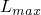 represent the maximum internodal interval of an element in a mesh, 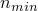 the number of internodal intervals we desire per acoustic wavelength (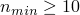 is recommended),  the cyclical frequency of excitation, and 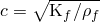 the speed of sound, where  is the bulk modulus of the acoustic medium and  is its density. The requirements are then expressed as 

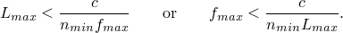

The above expressions can be used to estimate the maximum allowable element length if the frequency is given or the maximum frequency for which a given mesh size is valid. For example, in air at room temperature, 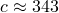 meters per second. The following table gives some values for maximum internodal distances to model given maximum frequencies  accurately:

| Maximum Frequency of Interest,  | Maximum Internodal Interval, , 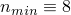 | Maximum Internodal Interval, , 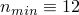 |
| --- | --- | --- |
| 100 Hz | < 430 mm | < 286 mm |
| 500 Hz | < 86 mm | < 57 mm |
| 1000 Hz | < 43 mm | <29mm |
| 20 kHz | < 2.1 mm | < 1.4mm |

For exterior problems the accuracy of an analysis also depends on the accuracy of the absorbing boundary condition. As mentioned above, the absorbing boundary impedance conditions implemented in Abaqus are used with a standoff thickness  of acoustic finite elements between the acoustic sources and the radiating boundary. Since the approximate radiation conditions converge to the exact condition in the limit of infinite standoff, a greater standoff thickness improves the accuracy of the solution. The standoff thickness  is expressed as 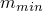 wavelengths at the minimum frequency to be analyzed: 

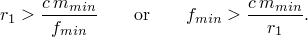

Continuing the example using the properties of air, we can calculate the recommended minimum standoff thicknesses corresponding to a specified minimum frequency of interest, using 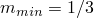:

| Minimum Frequency of Interest,  | Radiation Boundary Standoff,  |
| --- | --- |
| 100 Hz | > 1140 mm |
| 500 Hz | > 230 mm |
| 1000 Hz | > 114 mm |
| 20 kHz | > 5.7 mm |

The computational requirements for an exterior problem thus depend on both the radiation boundary standoff and the internodal distance. The number of nodes *N* in a model depends on the volume of the mesh, controlled by  and the spatial dimension *d*, and the mesh density, controlled by . The exact number of nodes depends on the details of the model, but the expression 

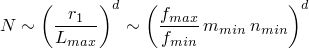

indicates the size of the model with respect to the ratio of the maximum to minimum frequencies in a given analysis. Because the mesh size for an exterior problem exhibits such strong dependence on the bandwidth, 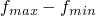, you can control the size of an analysis by splitting the band. For example, if the overall frequency range of interest is 100 to 10000 Hz, a single spherical mesh covering this band in three dimensions has size

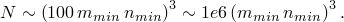

However, splitting the problem into two bands, 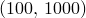 and 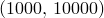, and creating an exterior mesh for each band, results in two analyses of size 

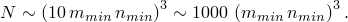

In coupled acoustic-structural systems there usually exist different wave speeds for the fluid and solid media. In the region of the acoustic-structural interface, the wave phenomena in both media may exhibit length scales characteristic of the slower medium; that is, the length scale of the wave dynamics may be as short as the shorter wavelength, corresponding to the lower wave speed. This result follows from the fact that the two media are coupled at the boundary. The region near the acoustic-structural interface where these effects are important is usually no thicker than the shorter wavelength.

For example, in an analysis involving water interacting with rubber, the wave speed in the rubber may be much lower than that of water. A finite element mesh used to model this problem in detail would require refinement down to six (or more) nodes per shorter wavelength, on both sides of the interface. On the water side (faster, longer wavelength) accuracy will probably not be compromised significantly if this region of high refinement extends no further into the water than one short wavelength. Of course, in some analyses the effects in the vicinity of the interface may be unimportant. Then, the two meshes can be refined only so far as to represent their own characteristic wavelengths accurately.

### Output

Nodal output variable POR (pressure magnitude at the nodes of the acoustic elements) is available for an acoustic medium (in Abaqus/CAE this output variable is called PAC). When the scattered wave formulation (default) is used with incident wave loading, output variable POR represents only the scattered pressure response of the model and does not include the incident wave loading itself. When the total wave formulation is used, output variable POR represents the total dynamic acoustic pressure, which includes contributions from both incident and scattered waves as well as the dynamic effects of fluid cavitation. For either formulation output variable POR does not include the acoustic static pressure.

In Abaqus/Explicit an additional nodal output variable PABS (the absolute pressure, equal to the sum of POR and the acoustic static pressure) is available. When the dynamic effects of fluid cavitation are of interest, you can specify the acoustic static pressure in an acoustic analysis that uses the total wave formulation. If the acoustic static pressure is not specified in an acoustic region, it is assumed to be large; thus precluding cavitation in that region.

For general steps, including implicit and explicit dynamic steps, no energy quantities are computed for acoustic elements. Consequently, these elements will not contribute to the total energy balance.

#### Steady-state dynamic output

For steady-state dynamic analysis POR is complex and can be displayed in several forms in the Visualization module of Abaqus/CAE. The phase angle (PPOR) is available as output to the data (`.dat`) and results (`.fil`) files.

Several additional secondary quantities are available for multidimensional acoustic finite elements in direct-solution steady-state dynamic or subspace-based steady-state dynamic analysis. The “sound pressure level” is defined as:

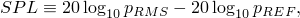

where 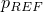 is defined as a physical constant in the model (see ["Defining the reference pressure](pt03ch06s10at29.md#usb-anl-aacoustic-refpress)” below), and the 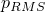 is computed from the complex-valued acoustic pressure  at any point using the formula:

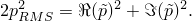

The acoustic particle velocity at any material point is

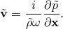

The acoustic intensity vector, a measure of the rate of flow of energy at a material point, is

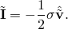

In an acoustic medium the stress tensor is simply the acoustic pressure times the identity tensor, so this expression simplifies to

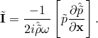

The hats denote complex conjugation. The real part of the intensity is referred to as the “active intensity,” and the imaginary part is the “reactive intensity.” The acoustic pressure gradient is also available for acoustic finite elements in steady-state dynamic analysis. 

In steady-state dynamic analysis, additional nodal output quantities are available for acoustic infinite elements. 

PINF denotes the complex pressure coefficients of the infinite element shape functions. These coefficients can be used to visualize the exterior acoustic field (i.e., within the volume of the acoustic infinite elements) using scripting in the Visualization module of Abaqus/CAE; see ["Using infinite elements to compute and view the results of an acoustic far-field analysis," Section 9.10.11 of the Abaqus Scripting User's Guide](../cmd/cmd-link.md#cmd-odb-intro-exa-acoustic-farfield-pyc). INFN is the normal vector used by the acoustic infinite element to define the element volume. INFR denotes the radius used for the element at that node, and INFC denotes the element cosine; that is, the minimum dot product between the nodal normal vector and the acoustic infinite element facet normal vectors attached to that node. See ["Acoustic infinite elements," Section 3.3.2 of the Abaqus Theory Guide](../stm/stm-link.md#stm-elm-acousticinfinite), for more complete descriptions of these quantities. INFN, INFR, INFC are useful in debugging a model using acoustic infinite elements; consequently, it is sometimes valuable to perform a steady-state dynamics, direct analysis on a model to visualize this information. 

For steady-state dynamic steps, energy quantities are available for acoustic elements. These elements contribute to the total energy balance in steady-state dynamics.

##### Defining the reference pressure

You must define the reference pressure, , used to compute the sound pressure level; there is no default value for the reference pressure.

| **Input File Usage: ** | ``` [*PHYSICAL CONSTANTS](../key/key-link.md#usb-kws-mphysicalconsts), SPL REFERENCE PRESSURE= ``` |
| --- | --- |

| **Abaqus/CAE Usage: ** | You cannot define a reference pressure in Abaqus/CAE. |
| --- | --- |

### Input file template

The following is an example of the step definition for a direct-solution steady-state dynamic acoustic analysis that looks for the response of a model at six frequencies ranging linearly from 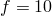 to 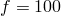 cycles/time. The pressure at node set `INPUT` (nodes at the boundary) is prescribed to have an in-phase component of 3.0 and an out-of-phase component of 4.0 (i.e., a complex value of 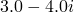). An in-phase inward volume acceleration of 40.0 is specified at node 10.

On the surface `LINER1` an impedance is defined based on the impedance property named `CARPET1`. On the second face of all of the elements in element set `PAD`, another surface impedance based on `CARPET1` is defined. On the fourth face of all of the elements in element set `END`, the default plane wave boundary condition is specified.

Printed output of pressure magnitude and phase is requested for node set `OUTPUT`. Acoustic pressure and displacement are written to the output database. All output is written once for each of the six excitation frequencies.

```
[*HEADING](../key/key-link.md#usb-kws-mheading)
…
[*SURFACE](../key/key-link.md#usb-kws-msurface), NAME=LINER1
 10, S3
[*IMPEDANCE PROPERTY](../key/key-link.md#usb-kws-mimpedanceprop), NAME=CARPET1
*Data describing impedance properties as a function of frequency*
**
[*STEP](../key/key-link.md#usb-kws-hstep)
[*STEADY STATE DYNAMICS](../key/key-link.md#usb-kws-hsteadystdyn), DIRECT
 10, 100, 6
[*SIMPEDANCE](../key/key-link.md#usb-kws-hsimpedance), PROPERTY=CARPET1
 LINER1,
**
[*IMPEDANCE](../key/key-link.md#usb-kws-himpedance), PROPERTY=CARPET1
 PAD, I2
 [*IMPEDANCE](../key/key-link.md#usb-kws-himpedance)
 END, I4
** Apply complex pressure at node set INPUT
[*BOUNDARY](../key/key-link.md#usb-kws-hboundary), REAL
 INPUT, 8, 8, 3.
[*BOUNDARY](../key/key-link.md#usb-kws-hboundary), IMAGINARY
 INPUT, 8, 8, -4.
** Apply an in-phase inward volume acceleration at node 10
[*CLOAD](../key/key-link.md#usb-kws-hcload)
 10, 8, 40.
** Output requests
[*NODE PRINT](../key/key-link.md#usb-kws-hnodeprint), NSET=OUTPUT, TOTALS=YES
 POR, PPOR
[*OUTPUT](../key/key-link.md#usb-kws-houtput), FIELD 
[*NODE OUTPUT](../key/key-link.md#usb-kws-hnodeoutput)
U, PU, POR
[*END STEP](../key/key-link.md#usb-kws-hendstep)
```

The following is a template of the step definition for an Abaqus/Explicit acoustic analysis. On the surface `SURF` an impedance is defined based on the impedance property named `IPROP`. In addition, impedance is defined on elements or element sets.

```
[*HEADING](../key/key-link.md#usb-kws-mheading)
…
[*ELEMENT](../key/key-link.md#usb-kws-melement), TYPE=AC2D4R
…
** 
[*SURFACE](../key/key-link.md#usb-kws-msurface), NAME=SURF 
*Data line to define surface*
[*IMPEDANCE PROPERTY](../key/key-link.md#usb-kws-mimpedanceprop), NAME=IPROP 
*Data describing impedance properties*
** 
[*STEP](../key/key-link.md#usb-kws-hstep)
[*DYNAMIC](../key/key-link.md#usb-kws-hdynamic), EXPLICIT or [*DYNAMIC TEMPERATURE-DISPLACEMENT](../key/key-link.md#usb-kws-hexpdynamicthermal), EXPLICIT
*Data line to define incrementation*
[*SIMPEDANCE](../key/key-link.md#usb-kws-hsimpedance), PROPERTY=IPROP
 SURF, 
** 
[*IMPEDANCE](../key/key-link.md#usb-kws-himpedance)
*Data lines to define impedance on elements or element sets*
[*CLOAD](../key/key-link.md#usb-kws-hcload)
*Data line to define acoustic loads*
[*FIELD](../key/key-link.md#usb-kws-hfield)
*Data line to define field variable values*
[*END STEP](../key/key-link.md#usb-kws-hendstep)
```

The following template is representative of a coupled acoustic-structural shock problem using the preferred interface for applying incident wave loading (see ["Incident wave loading due to external sources" in "Acoustic and shock loads," Section 34.4.6](pt07ch34s04aus125.md#usb-prc-pacoustic-incidentwave)):

```
[*HEADING](../key/key-link.md#usb-kws-mheading)
…
[*ELEMENT](../key/key-link.md#usb-kws-melement), TYPE=…, ELSET=ACOUSTIC
*Data lines to define acoustic elements*
[*ELEMENT](../key/key-link.md#usb-kws-melement), TYPE=…, ELSET=SOLID
*Data lines to define solid elements*
[*ELEMENT](../key/key-link.md#usb-kws-melement), TYPE=…, ELSET=BEAM
*Data lines to define beam elements*
[*BEAM SECTION](../key/key-link.md#usb-kws-mbeamsection),ELSET=BEAM,MATERIAL=... 
*Data lines to define the beam stiffness section properties*
[*BEAM FLUID INERTIA](../key/key-link.md#usb-kws-mbeamfluidinertia)
*Data line to define the beam virtual mass property*
[*SURFACE](../key/key-link.md#usb-kws-msurface), NAME=IW_LOAD_ACOUSTIC
*Data lines to define the acoustic surface loaded by the incident wave*
[*SURFACE](../key/key-link.md#usb-kws-msurface), NAME=IW_LOAD_SOLID
*Data lines to define the solid surface loaded by the incident wave*
[*SURFACE](../key/key-link.md#usb-kws-msurface), NAME=IW_LOAD_BEAM 
*Data lines to define the beam surface loaded by the incident wave*
[*SURFACE](../key/key-link.md#usb-kws-msurface), NAME=TIE_ACOUSTIC
*Data lines to define the acoustic surface interface with the solid mesh*
[*SURFACE](../key/key-link.md#usb-kws-msurface), NAME=TIE_SOLID
*Data lines to define the solid surface interface with the acoustic mesh*
[*INCIDENT WAVE INTERACTION PROPERTY](../key/key-link.md#usb-kws-mincidentwaveinteractionproperty), NAME=IWPROP, TYPE=SPHERE
*Data lines to define a spherical incident wave field*
[*UNDEX CHARGE PROPERTY](../key/key-link.md#usb-kws-mundexchargeproperty)
*Data lines to define the underwater explosion parameters*
** Tie the acoustic mesh to the solid mesh
[*TIE](../key/key-link.md#usb-kws-mtie), NAME=COUPLING
TIE_ACOUSTIC, TIE_SOLID
[*STEP](../key/key-link.md#usb-kws-hstep)
[*DYNAMIC](../key/key-link.md#usb-kws-hdynamic), EXPLICIT or [*DYNAMIC](../key/key-link.md#usb-kws-hdynamic)
** Load the acoustic surface
[*INCIDENT WAVE INTERACTION](../key/key-link.md#usb-kws-hincidentwaveinteraction), PROPERTY=IWPROP
IW_LOAD_ACOUSTIC, *source node*, *standoff node*, *reference magnitude*
** Load the solid surface
[*INCIDENT WAVE INTERACTION](../key/key-link.md#usb-kws-hincidentwaveinteraction), PROPERTY=IWPROP
IW_LOAD_SOLID, *source node*, *standoff node*, *reference magnitude*
** Load the beam surface
[*INCIDENT WAVE INTERACTION](../key/key-link.md#usb-kws-hincidentwaveinteraction), PROPERTY=IWPROP
IW_LOAD_BEAM, *source node*, *standoff node*, *reference magnitude*
[*END STEP](../key/key-link.md#usb-kws-hendstep)
```

The following template is representative of a coupled acoustic-structural shock problem using the alternative interface for applying incident wave loading:

```
[*HEADING](../key/key-link.md#usb-kws-mheading)
…
[*ELEMENT](../key/key-link.md#usb-kws-melement), TYPE=…, ELSET=ACOUSTIC
*Data lines to define acoustic elements*
[*ELEMENT](../key/key-link.md#usb-kws-melement), TYPE=…, ELSET=SOLID
*Data lines to define solid elements*
[*ELEMENT](../key/key-link.md#usb-kws-melement), TYPE=…, ELSET=BEAM
*Data lines to define beam elements*
[*BEAM SECTION](../key/key-link.md#usb-kws-mbeamsection),ELSET=BEAM,MATERIAL=... 
*Data lines to define the beam stiffness section properties*
[*BEAM FLUID INERTIA](../key/key-link.md#usb-kws-mbeamfluidinertia)
*Data line to define the beam virtual mass property*
[*SURFACE](../key/key-link.md#usb-kws-msurface), NAME=IW_LOAD_ACOUSTIC
*Data lines to define the acoustic surface loaded by the incident wave*
[*SURFACE](../key/key-link.md#usb-kws-msurface), NAME=IW_LOAD_SOLID
*Data lines to define the solid surface loaded by the incident wave*
[*SURFACE](../key/key-link.md#usb-kws-msurface), NAME=IW_LOAD_BEAM 
*Data lines to define the beam surface loaded by the incident wave*
[*SURFACE](../key/key-link.md#usb-kws-msurface), NAME=TIE_ACOUSTIC
*Data lines to define the acoustic surface interface with the solid mesh*
[*SURFACE](../key/key-link.md#usb-kws-msurface), NAME=TIE_SOLID
*Data lines to define the solid surface interface with the acoustic mesh*
[*INCIDENT WAVE PROPERTY](../key/key-link.md#usb-kws-mincidentwaveproperty), NAME=IWPROP, TYPE=SPHERE
*Data lines to define a spherical incident wave field*
[*INCIDENT WAVE FLUID PROPERTY](../key/key-link.md#usb-kws-mincidentwavefluid)
*Data lines to define the fluid properties for the incident wave field*
[*AMPLITUDE](../key/key-link.md#usb-kws-mamplitude), DEFINITION=BUBBLE, NAME=PRESSUREVTIME
*Data lines to define the underwater explosion parameters*
** Tie the acoustic mesh to the solid mesh
[*TIE](../key/key-link.md#usb-kws-mtie), NAME=COUPLING
TIE_ACOUSTIC, TIE_SOLID
[*STEP](../key/key-link.md#usb-kws-hstep)
[*DYNAMIC](../key/key-link.md#usb-kws-hdynamic) or [*DYNAMIC](../key/key-link.md#usb-kws-hdynamic), EXPLICIT
** Load the acoustic surface
[*INCIDENT WAVE](../key/key-link.md#usb-kws-hincidentwave), PRESSURE AMPLITUDE=PRESSUREVTIME, 
PROPERTY=IWPROP
IW_LOAD_ACOUSTIC, {amplitude}
** Load the solid surface and the beam surface
[*INCIDENT WAVE](../key/key-link.md#usb-kws-hincidentwave), PRESSURE AMPLITUDE=PRESSUREVTIME, 
PROPERTY=IWPROP
IW_LOAD_SOLID, {amplitude}
IW_LOAD_BEAM, {amplitude}
[*END STEP](../key/key-link.md#usb-kws-hendstep)
```

The following template is representative of a coupled acoustic-structural sound transmission problem using the preferred interface for applying incident wave loading (see ["Incident wave loading due to external sources" in "Acoustic and shock loads," Section 34.4.6](pt07ch34s04aus125.md#usb-prc-pacoustic-incidentwave)):

```
[*HEADING](../key/key-link.md#usb-kws-mheading)
…
[*ELEMENT](../key/key-link.md#usb-kws-melement), TYPE=…, ELSET=ACOUSTIC
*Data lines to define acoustic elements*
[*ELEMENT](../key/key-link.md#usb-kws-melement), TYPE=…, ELSET=SOLID
*Data lines to define solid elements*
[*SURFACE](../key/key-link.md#usb-kws-msurface), NAME=IW_LOAD_ACOUSTIC
*Data lines to define the acoustic surface loaded by the incident wave*
[*SURFACE](../key/key-link.md#usb-kws-msurface), NAME=IW_LOAD_SOLID
*Data lines to define the solid surface loaded by the incident wave*
[*SURFACE](../key/key-link.md#usb-kws-msurface), NAME=TIE_ACOUSTIC
*Data lines to define the acoustic surface interface with the solid mesh*
[*SURFACE](../key/key-link.md#usb-kws-msurface), NAME=TIE_SOLID
*Data lines to define the solid surface interface with the acoustic mesh*
[*INCIDENT WAVE INTERACTION PROPERTY](../key/key-link.md#usb-kws-mincidentwaveinteractionproperty), NAME=FIRST, TYPE=SPHERE
*Data lines to define a spherical incident wave field*
[*INCIDENT WAVE INTERACTION PROPERTY](../key/key-link.md#usb-kws-mincidentwaveinteractionproperty), NAME=SECOND, TYPE=PLANE
*Data lines to define a planar incident wave field*
** Tie the acoustic mesh to the solid mesh
[*TIE](../key/key-link.md#usb-kws-mtie), NAME=COUPLING
TIE_ACOUSTIC, TIE_SOLID
[*STEP](../key/key-link.md#usb-kws-hstep)
[*STEADY STATE DYNAMICS](../key/key-link.md#usb-kws-hsteadystdyn), DIRECT or SUBSPACE PROJECTION
** Define the load on the acoustic and solid surfaces due to
** the first loading case:
[*LOAD CASE](../key/key-link.md#usb-kws-hloadcase), NAME=FIRST_SOURCE
** Load the acoustic surface: define the real part at the
** standoff point
[*INCIDENT WAVE INTERACTION](../key/key-link.md#usb-kws-hincidentwaveinteraction), PROPERTY=FIRST, REAL
IW_LOAD_ACOUSTIC, *first source node*, *first standoff node*, *reference magnitude*
** Load the acoustic surface: define the imaginary part at the
** standoff point
[*INCIDENT WAVE INTERACTION](../key/key-link.md#usb-kws-hincidentwaveinteraction), PROPERTY=FIRST, IMAGINARY
IW_LOAD_ACOUSTIC, *first source node*, *first standoff node*, *reference magnitude*
** Load the solid surface: define the real part at the 
** standoff point
[*INCIDENT WAVE INTERACTION](../key/key-link.md#usb-kws-hincidentwaveinteraction), PROPERTY=FIRST, REAL
IW_LOAD_SOLID, *first source node*, *first standoff node*, *reference magnitude*
** Load the solid surface: define the imaginary part at the 
** standoff point
[*INCIDENT WAVE INTERACTION](../key/key-link.md#usb-kws-hincidentwaveinteraction), PROPERTY=FIRST, IMAGINARY
IW_LOAD_SOLID, *first source node*, *first standoff node*, *reference magnitude*
[*END LOAD CASE](../key/key-link.md#usb-kws-hendloadcase) 
** Define the load on the acoustic and solid surfaces due to 
** the next loading case:
[*LOAD CASE](../key/key-link.md#usb-kws-hloadcase), NAME=SECOND_SOURCE
** Load the acoustic surface: define the real part at the 
** standoff point
[*INCIDENT WAVE INTERACTION](../key/key-link.md#usb-kws-hincidentwaveinteraction), PROPERTY=SECOND, REAL
IW_LOAD_ACOUSTIC, *second source node*, *second standoff node*, *reference magnitude*
** Load the acoustic surface: define the imaginary part at the
** standoff point
[*INCIDENT WAVE INTERACTION](../key/key-link.md#usb-kws-hincidentwaveinteraction), PROPERTY=SECOND, IMAGINARY
IW_LOAD_ACOUSTIC, *second source node*, *second standoff node*, *reference magnitude*
** Load the solid surface: define the real part at the 
** standoff point
[*INCIDENT WAVE INTERACTION](../key/key-link.md#usb-kws-hincidentwaveinteraction), PROPERTY=SECOND, REAL
IW_LOAD_SOLID, *second source node*, *second standoff node*, *reference magnitude*
** Load the solid surface: define the imaginary part at the
** standoff point
[*INCIDENT WAVE INTERACTION](../key/key-link.md#usb-kws-hincidentwaveinteraction), PROPERTY=SECOND, IMAGINARY
IW_LOAD_SOLID, *second source node*, *second standoff node*, *reference magnitude*
[*END LOAD CASE](../key/key-link.md#usb-kws-hendloadcase) 
[*END STEP](../key/key-link.md#usb-kws-hendstep)
```


