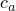
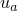
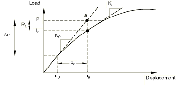
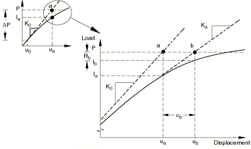
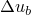
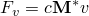
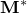
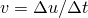

# 7.1.1 Solving nonlinear problems


**Products: **Abaqus/Standard  Abaqus/CAE  

##### **References**

- ["Convergence and time integration criteria: overview," Section 7.2.1](pt03ch07s02abo11.md)
- ["Commonly used control parameters," Section 7.2.2](pt03ch07s02aus50.md)
- ["Convergence criteria for nonlinear problems," Section 7.2.3](pt03ch07s02aus51.md)
- ["Time integration accuracy in transient problems," Section 7.2.4](pt03ch07s02aus52.md)
- ["Configuring general analysis procedures," Section 14.11.1 of the Abaqus/CAE User's Guide](../usi/usi-link.md#usi-sim-configure-general)

### Overview

Solving nonlinear problems in Abaqus/Standard involves:
- a combination of incremental and iterative procedures;
- using the Newton method to solve the nonlinear equations;
- determining convergence;
- defining loads as a function of time; and
- choosing suitable time increments automatically.

Some static problems may become unstable because of severe nonlinearity. Abaqus/Standard offers a set of automatic stabilization mechanisms to handle such problems.

### The solution of nonlinear problems

The nonlinear load-displacement curve for a structure is shown in [Figure 7.1.1--1](pt03ch07s01aus49.md#anonlineareqns-nonlin-load-disp). 

**Figure 7.1.1–1** Nonlinear load-displacement curve.


The objective of the analysis is to determine this response. In a nonlinear analysis the solution cannot be calculated by solving a single system of linear equations, as would be done in a linear problem. Instead, the solution is found by specifying the loading as a function of time and incrementing time to obtain the nonlinear response. Therefore, Abaqus/Standard breaks the simulation into a number of *time increments* and finds the approximate equilibrium configuration at the end of each time increment. Using the Newton method, it often takes Abaqus/Standard several iterations to determine an acceptable solution to each time increment.

#### Steps, increments, and iterations

- The time history for a simulation consists of one or more *steps*. You define the steps, which generally consist of an analysis procedure, loading, and output requests. Different loads, boundary conditions, analysis procedures, and output requests can be used in each step. For example: Step 1: Hold a plate between rigid jaws. Step 2: Add loads to deform the plate. Step 3: Find the natural frequencies of the deformed plate.
- An *increment* is part of a step. In nonlinear analyses each step is broken into increments so that the nonlinear solution path can be followed. You suggest the size of the first increment, and Abaqus/Standard automatically chooses the size of the subsequent increments. At the end of each increment the structure is in (approximate) equilibrium and results are available for writing to the restart, data, results, or output database files.
- An *iteration* is an attempt at finding an equilibrium solution in an increment. If the model is not in equilibrium at the end of the iteration, Abaqus/Standard tries another iteration. With every iteration the solution that Abaqus/Standard obtains should be closer to equilibrium; however, sometimes the iteration process may diverge---subsequent iterations may move away from the equilibrium state. In that case Abaqus/Standard may terminate the iteration process and attempt to find a solution with a smaller increment size.

### Convergence

Consider the external forces, *P*, and the internal (nodal) forces, *I*, acting on a body (see [Figure 7.1.1--2](pt03ch07s01aus49.md#anonlineareqns-int-ext-loads)(a) and [Figure 7.1.1--2](pt03ch07s01aus49.md#anonlineareqns-int-ext-loads)(b), respectively). The internal loads acting on a node are caused by the stresses in the elements that are attached to that node.

**Figure 7.1.1–2** Internal and external loads on a body.


For the body to be in equilibrium, the net force acting at every node must be zero. Therefore, the basic statement of equilibrium is that the internal forces, *I*, and the external forces, *P*, must balance each other: 


The nonlinear response of a structure to a small load increment, , is shown in [Figure 7.1.1--3](pt03ch07s01aus49.md#anonlineareqns-1st-iteration). Abaqus/Standard uses the structure's tangent stiffness, , which is based on its configuration at , and  to calculate a *displacement correction*, , for the structure. Using , the structure's configuration is updated to .

**Figure 7.1.1–3** First iteration in an increment.



Abaqus/Standard then calculates the structure's internal forces, , in this updated configuration. The difference between the total applied load, *P*, and  can now be calculated as 


where  is the *force residual* for the iteration.

If  is zero at every degree of freedom in the model, point *a* in [Figure 7.1.1--3](pt03ch07s01aus49.md#anonlineareqns-1st-iteration) would lie on the load-deflection curve and the structure would be in equilibrium. In a nonlinear problem  will never be exactly zero, so Abaqus/Standard compares it to a tolerance value. If  is less than this force residual tolerance at all nodes, Abaqus/Standard accepts the solution as being in equilibrium. By default, this tolerance value is set to 0.5% of an average force in the structure, averaged over time. Abaqus/Standard automatically calculates this spatially and time-averaged force throughout the simulation. You can change this, and all other such tolerances, by specifying solution controls (see ["Convergence criteria for nonlinear problems," Section 7.2.3](pt03ch07s02aus51.md)).

If  is less than the current tolerance value, *P* and  are considered to be in equilibrium and  is a valid equilibrium configuration for the structure under the applied load. However, before Abaqus/Standard accepts the solution, it also checks that the last displacement correction, , is small relative to the total incremental displacement, . If  is greater than a fraction (1% by default) of the incremental displacement, Abaqus/Standard performs another iteration. Both convergence checks must be satisfied before a solution is said to have *converged* for that time increment.

If the solution from an iteration is not converged, Abaqus/Standard performs another iteration to try to bring the internal and external forces into balance. First, Abaqus/Standard forms the new stiffness, , for the structure based on the updated configuration, . This stiffness, together with the residual , determines another displacement correction, , that brings the system closer to equilibrium (point *b* in [Figure 7.1.1--4](pt03ch07s01aus49.md#anonlineareqns-2nd-iteration)).

**Figure 7.1.1–4** Second iteration.



Abaqus/Standard calculates a new force residual, , using the internal forces from the structure's new configuration, . Again, the largest force residual at any degree of freedom, , is compared against the force residual tolerance, and the displacement correction for the second iteration, , is compared to the increment of displacement, . If necessary, Abaqus/Standard performs further iterations. For more details on convergence in Abaqus/Standard, see ["Convergence criteria for nonlinear problems," Section 7.2.3](pt03ch07s02aus51.md).

For each iteration in a nonlinear analysis Abaqus/Standard forms the model's stiffness matrix and solves a system of equations. Therefore, the computational cost of each iteration is close to the cost of conducting a complete linear analysis, making the computational expense of a nonlinear analysis potentially many times greater than the cost of a linear analysis. Since it is possible with Abaqus/Standard to save results at each converged increment, the amount of output data available from a nonlinear simulation can also be much greater than that available from a linear analysis of the same geometry.

### Automatic incrementation control

By default, Abaqus/Standard automatically adjusts the size of the time increments to solve nonlinear problems efficiently. You need to suggest only the size of the first increment in each step of the simulation, after which Abaqus/Standard automatically adjusts the size of the increments. If you do not provide a suggested initial increment size, Abaqus/Standard will attempt to apply all of the loads defined in the step in a single increment. For highly nonlinear problems Abaqus/Standard will have to reduce the increment size repeatedly to obtain a solution, resulting in wasted CPU time. It is advantageous to provide a reasonable initial increment size because only in mildly nonlinear problems can all of the loads in a step be applied in a single increment.

The number of iterations needed to find a converged solution for a time increment will vary depending on the degree of nonlinearity in the system. With the default incrementation control, the procedure works as follows. If the solution has not converged within 16 iterations or if the solution appears to diverge, Abaqus/Standard abandons the increment and starts again with the increment size set to 25% of its previous value. It then attempts to find a converged solution with this smaller time increment. If the solution still fails to converge, Abaqus/Standard reduces the increment size again. This process is continued until a solution is found. If the time increment becomes smaller than the minimum you defined or more than 5 attempts are needed, Abaqus/Standard stops the analysis.

If the increment converges in fewer than 5 iterations, this indicates that the solution is being found fairly easily. Therefore, Abaqus/Standard automatically increases the increment size by 50% if 2 consecutive increments require fewer than 5 iterations to obtain a converged solution.

While the default automatic incrementation control is suitable for most analyses, you can change all the defaults when necessary by specifying solution controls; see ["Commonly used control parameters," Section 7.2.2](pt03ch07s02aus50.md), and ["Time integration accuracy in transient problems," Section 7.2.4](pt03ch07s02aus52.md).

### Automatic stabilization of unstable problems

Nonlinear static problems can be unstable. Such instabilities may be of a geometrical nature, such as buckling, or of a material nature, such as material softening. If the instability manifests itself in a global load-displacement response with a negative stiffness, the problem can be treated as a buckling or collapse problem as described in ["Unstable collapse and postbuckling analysis," Section 6.2.4](pt03ch06s02at03.md). However, if the instability is localized, there will be a local transfer of strain energy from one part of the model to neighboring parts, and global solution methods may not work. This class of problems has to be solved either dynamically or with the aid of (artificial) damping; for example, by using dashpots. 

Abaqus/Standard provides an automatic mechanism for stabilizing unstable quasi-static problems through the automatic addition of volume-proportional damping to the model. The applied damping factors can be constant over the duration of a step, or they can vary with time to account for changes over the course of a step. The latter, adaptive approach is typically preferred.

#### Automatic stabilization of static problems with a constant damping factor

Automatic stabilization with a constant damping factor is triggered by including automatic stabilization in any nonlinear quasi-static procedure. Viscous forces of the form 



are added to the global equilibrium equations 


where  is an artificial mass matrix calculated with unity density, *c* is a damping factor,  is the vector of nodal velocities, and  is the increment of time (which may or may not have a physical meaning in the context of the problem being solved).

For the case of static stabilization the mass matrix for Timoshenko beams is always calculated assuming isotropic rotary inertia, regardless of the type of rotary inertia specified for the beam section definition (["Rotary inertia for Timoshenko beams" in "Beam section behavior," Section 29.3.5](pt06ch29s03alm10.md#usb-elm-ebeamsectionbehavior-rotinertia)).

Automatic stabilization does not carry over automatically to subsequent steps. It needs to be declared for any step in which you want it to be active. Abaqus/Standard recalculates new values for the damping factor, based on the declared damping intensity and on the solution of the first increment of the step. Therefore, unless you specify the same damping factor directly (see ["Directly specifying the damping factor](pt03ch07s01aus49.md#usb-anl-anonlineareqns-damping)” below), an analysis with an unstable step may produce slightly different results from the same analysis with the original step split into two steps. Moreover, if the instabilities in the model have not subsided by the end of a step, viscous forces may be terminated abruptly or modified at the beginning of subsequent steps, potentially causing convergence difficulties if automatic stabilization is not used in the subsequent step. If such a situation arises, it is recommended that the problem be restarted with the damping factor set equal to the value chosen by Abaqus/Standard (or to the value you specified) in the previous step. This value is printed in the message (`.msg`) file for the previous step. If it is necessary to have an accurate static equilibrium solution after an instability has occurred (and the model's behavior has returned to a stable regime), the step with automatic stabilization can be followed by a step without such stabilization.

##### Calculating the damping factor based on the dissipated energy fraction

It is assumed that the problem is stable at the beginning of the step and that instabilities may develop in the course of the step. While the model is stable, viscous forces and, therefore, the viscous energy dissipated are very small. Thus, the additional artificial damping has no effect. If a local region goes unstable, the local velocities increase and, consequently, part of the strain energy then released is dissipated by the applied damping. Abaqus/Standard can, if necessary, reduce the time increment to permit the process to occur without the unstable response causing very large displacements. Abaqus/Standard calculates and prints to the message file the damping factor, *c*, based on the solution of the first increment of a step. In most applications the first increment of the step is stable without the need to apply damping. The damping factor is then determined in such a way that the dissipated energy for a given increment with characteristics similar to the first increment is a small fraction of the extrapolated strain energy. The fraction is called the *dissipated energy fraction* and has a default value of 2.0  104. If the default value for the dissipated energy fraction is used, the adaptive automatic stabilization scheme discussed in the next section will be activated automatically by default in the step.

Alternatively, you can specify the non-default dissipated energy fraction for automatic stabilization directly.

| **Input File Usage: ** | Use any of the following options to specify a nondefault dissipated energy fraction: |
| --- | --- |
|  | ``` [*COUPLED TEMPERATURE-DISPLACEMENT](../key/key-link.md#usb-kws-hcouptempdisp), STABILIZE=*dissipated energy fraction* [*SOILS](../key/key-link.md#usb-kws-hsoils), STABILIZE=*dissipated energy fraction* [*STATIC](../key/key-link.md#usb-kws-hstatic), STABILIZE=*dissipated energy fraction* [*STEADY STATE TRANSPORT](../key/key-link.md#usb-kws-hsteadystatetransport), STABILIZE=*dissipated energy fraction* [*VISCO](../key/key-link.md#usb-kws-hvisco), STABILIZE=*dissipated energy fraction* ``` |

| **Abaqus/CAE Usage: ** | Step module: **Create Step**: **General**: *any valid step type*: **Basic**: select **Specify dissipated energy fraction** from the **Automatic stabilization** field |
| --- | --- |

##### Considerations when the first increment is unstable or singular

There are cases where the first increment is either unstable or singular (due to a rigid body mode). In such cases it is not possible to obtain a solution to the first increment without applying some damping. Therefore, some damping is already applied during the first increment. The damping factor used for the initial increment is chosen such that the average element damping matrix component, divided by the step time, is equal to the average element stiffness matrix component multiplied by the dissipated energy fraction. If the calculated strain energy change in this increment indicates that the solution without damping is stable, the damping factor is recalculated based upon the energy method described previously. However, if the strain energy change indicates that the solution is unstable or singular, the initially calculated damping factor is maintained, and a warning message is issued indicating that the amount of damping applied may not be appropriate. In many cases the amount of damping may actually be rather large, which can affect the solution in ways that are not desirable. Therefore, if the above mentioned warning message is issued, check the viscous forces (VF) and compare them with the expected nodal forces to make sure that the viscous forces do not dominate the solution. If necessary, follow the stabilized step with another step in which stabilization is not used or with a step in which a much smaller damping factor is used.

##### Directly specifying the damping factor

You can also specify the damping factor directly. Unfortunately, it is generally quite difficult to make a reasonable estimate for the damping factor unless a value is known from the output of previous runs; the damping factor depends not only on the amount of damping but also on mesh size and material behavior.

| **Input File Usage: ** | Use any of the following options to specify the damping factor directly: |
| --- | --- |
|  | ``` [*COUPLED TEMPERATURE-DISPLACEMENT](../key/key-link.md#usb-kws-hcouptempdisp), STABILIZE, FACTOR=*damping factor* [*SOILS](../key/key-link.md#usb-kws-hsoils), STABILIZE, FACTOR=*damping factor* [*STATIC](../key/key-link.md#usb-kws-hstatic), STABILIZE, FACTOR=*damping factor* [*STEADY STATE TRANSPORT](../key/key-link.md#usb-kws-hsteadystatetransport), STABILIZE, FACTOR=*damping factor* [*VISCO](../key/key-link.md#usb-kws-hvisco), STABILIZE, FACTOR=*damping factor* ``` |

| **Abaqus/CAE Usage: ** | Step module: **Create Step**: **General**: **Coupled temp-displacement**, **Soils**, **Static, General**, or **Visco**: **Basic**: select **Specify damping factor** from the **Automatic stabilization** field |
| --- | --- |

#### Adaptive automatic stabilization scheme

As discussed above, the automatic stabilization scheme with a constant damping factor typically works well to subside instabilities and to eliminate rigid body modes without having a major effect on the solution. However, there is no guarantee that the value of the damping factor is optimal or even suitable in some cases.  This is particularly true for thin shell models, in which the damping factor may be too high when a poor estimation of the extrapolated strain energy is made during the first increment. For such models you may have to increase the damping factor if the convergence behavior is problematic or to decrease the damping factor if it distorts the solution. The former case would require you to rerun the analysis with a larger damping factor, while the latter case would require you to perform postanalysis comparison of the energy dissipated by viscous damping (ALLSD) to the total strain energy (ALLIE). Therefore, obtaining an optimal value for the damping factor is a manual process requiring trial and error until a converged solution is obtained and the dissipated stabilization energy is sufficiently small.

The adaptive automatic stabilization scheme, in which the damping factor can vary spatially and with time,  provides an effective alternative approach. In this case the damping factor is controlled by the convergence history and the ratio of the energy dissipated by viscous damping to the total strain energy. If the convergence behavior is problematic because of instabilities or rigid body modes, Abaqus/Standard automatically increases the damping factor. For example, the damping factor may increase if an analysis takes extra severe discontinuity or equilibrium iterations per increment or requires time increment cutbacks.    On the other hand, Abaqus/Standard may reduce the damping factor automatically if instabilities and rigid body modes subside.

The ratio of the energy dissipated by viscous damping to the total strain energy is limited by an accuracy tolerance that you specify. Such an accuracy tolerance is imposed on the global level for the whole model. If the ratio of the energy dissipated by viscous damping to the total strain energy for the whole model exceeds the accuracy tolerance, the damping factor at each individual element is adjusted to ensure that the ratio of the stabilization energy to the strain energy is less than the accuracy tolerance on both the global and local element level. The stabilization energy always increases, while the strain energy may decrease. Therefore, Abaqus/Standard restricts the ratio of the incremental value of the stabilization energy to the incremental value of the strain energy for each increment to ensure that this value has not exceeded the accuracy tolerance if the ratio of the total stabilization energy to the total strain energy exceeds the accuracy tolerance. The accuracy tolerance is a targeted value and can be exceeded in some situations, such as when there is rigid body motion or when significant non-local instability occurs.

The default accuracy tolerance used by the adaptive automatic stabilization scheme is 0.05. The default tolerance is suitable for most applications, but you have the option of specifying a nondefault accuracy tolerance if necessary. If the accuracy tolerance is set equal to zero, the adaptive automatic stabilization scheme is not activated and the automatic stabilization scheme with a constant damping factor will be used in the step.

 If the accuracy tolerance is not specified but the dissipated energy fraction with the default value of 2.0  104 is used, the adaptive automatic damping algorithm will be activated automatically with an accuracy tolerance of 0.05.

| **Input File Usage: ** | Use any of the following options to activate adaptive automatic stabilization with the default stabilization energy tolerance: |
| --- | --- |
|  | ``` [*COUPLED TEMPERATURE-DISPLACEMENT](../key/key-link.md#usb-kws-hcouptempdisp), STABILIZE [*SOILS](../key/key-link.md#usb-kws-hsoils), STABILIZE [*STATIC](../key/key-link.md#usb-kws-hstatic), STABILIZE [*STEADY STATE TRANSPORT](../key/key-link.md#usb-kws-hsteadystatetransport), STABILIZE [*VISCO](../key/key-link.md#usb-kws-hvisco), STABILIZE ``` Use any of the following options to activate adaptive automatic stabilization with a nondefault stabilization energy tolerance: ``` [*COUPLED TEMPERATURE-DISPLACEMENT](../key/key-link.md#usb-kws-hcouptempdisp), STABILIZE, ALLSDTOL=*accuracy tolerance* [*SOILS](../key/key-link.md#usb-kws-hsoils), STABILIZE, ALLSDTOL=*accuracy tolerance* [*STATIC](../key/key-link.md#usb-kws-hstatic), STABILIZE, ALLSDTOL=*accuracy tolerance* [*STEADY STATE TRANSPORT](../key/key-link.md#usb-kws-hsteadystatetransport), STABILIZE, ALLSDTOL=*accuracy tolerance* [*VISCO](../key/key-link.md#usb-kws-hvisco), STABILIZE, ALLSDTOL=*accuracy tolerance* ``` |

| **Abaqus/CAE Usage: ** | Step module: **Create Step**: **General**: **Coupled temp-displacement**, **Soils**, **Static, General**, or **Visco**: **Basic**: select an **Automatic stabilization** method: toggle on **Use adaptive stabilization with max. ratio of stabilization to strain energy:** *accuracy tolerance* |
| --- | --- |

##### Default value of the initial damping factor

By default, the initial value of the damping factor is typically equal to the value that would be used for automatic stabilization with a constant damping factor (see ["Calculating the damping factor based on the dissipated energy fraction](pt03ch07s01aus49.md#usb-anl-anonlineareqns-dissipated)” above). In some cases additional factors that are considered with adaptive automatic stabilization cause some differences in the initial damping factor.

##### Specifying the initial damping factor directly

Alternatively, you can specify the initial damping factor directly. The damping factor is adjusted based on the convergence history and the accuracy tolerance through the step.

| **Input File Usage: ** | Use any of the following options to specify the initial damping factor directly with the default stabilization energy tolerance: |
| --- | --- |
|  | ``` [*COUPLED TEMPERATURE-DISPLACEMENT](../key/key-link.md#usb-kws-hcouptempdisp), STABILIZE, FACTOR=*damping factor*, ALLSDTOL [*SOILS](../key/key-link.md#usb-kws-hsoils), STABILIZE, FACTOR=*damping factor*, ALLSDTOL [*STATIC](../key/key-link.md#usb-kws-hstatic), STABILIZE, FACTOR=*damping factor*, ALLSDTOL [*STEADY STATE TRANSPORT](../key/key-link.md#usb-kws-hsteadystatetransport), STABILIZE, FACTOR=*damping factor*, ALLSDTOL [*VISCO](../key/key-link.md#usb-kws-hvisco), STABILIZE, FACTOR=*damping factor*, ALLSDTOL ``` |

| **Abaqus/CAE Usage: ** | Step module: **Create Step**: **General**: **Coupled temp-displacement**, **Soils**, **Static, General**, or **Visco**: **Basic**: from the **Automatic stabilization** field, select **Specify damping factor:** *damping factor*: toggle on **Use adaptive stabilization with max. ratio of stabilization to strain energy:** *maximum ratio* |
| --- | --- |

##### Propagating the damping factors from the immediately preceding general step into the current step

Adaptive automatic stabilization provides an option to propagate the damping factors from the immediately preceding general step to the subsequent steps. The default is to not propagate the damping factors from the results of the preceding general step. In this case Abaqus recalculates the initial damping factors based on the declared dissipated energy faction and on the solution of the first increment of the step, or you can specify the initial damping factors directly.

| **Input File Usage: ** | Use any of the following options to indicate that the damping factors in the current step are propagated from the immediately preceding general step: |
| --- | --- |
|  | ``` [*COUPLED TEMPERATURE-DISPLACEMENT](../key/key-link.md#usb-kws-hcouptempdisp), STABILIZE, ALLSDTOL, CONTINUE=YES [*SOILS](../key/key-link.md#usb-kws-hsoils), STABILIZE, ALLSDTOL, CONTINUE=YES [*STATIC](../key/key-link.md#usb-kws-hstatic), STABILIZE, ALLSDTOL, CONTINUE=YES [*STEADY STATE TRANSPORT](../key/key-link.md#usb-kws-hsteadystatetransport), STABILIZE, ALLSDTOL, CONTINUE=YES [*VISCO](../key/key-link.md#usb-kws-hvisco), STABILIZE, ALLSDTOL, CONTINUE=YES ``` |

| **Abaqus/CAE Usage: ** | Step module: **Create Step**: **General**: **Coupled temp-displacement**, **Soils**, **Static, General**, or **Visco**: **Basic**: select **Use damping factors from previous general step** from the **Automatic stabilization** field: **Use adaptive stabilization with max. ratio of stabilization to strain energy:** *accuracy tolerance* |
| --- | --- |

#### Ensuring that an accurate solution is obtained with automatic stabilization

Whenever automatic stabilization is applied to a problem, check the following to ensure that accurate solutions are obtained:
- For a damping factor calculated using the dissipated energy fraction, check the factor printed to the message (`.msg`) file at the end of the first increment to ensure that a reasonable amount of damping is applied. Unfortunately, the damping factor is problem dependent; therefore, you must rely on experience from previous runs.
- Compare the viscous forces (VF) with the overall forces in the analysis, and ensure that the viscous forces are relatively small compared with the overall forces in the model.
- Compare the viscous damping energy (ALLSD) with the total strain energy (ALLIE), and ensure that the ratio does not exceed the dissipated energy fraction or any reasonable amount. The viscous damping energy may be large if the structure undergoes a large amount of motion.

The automated procedure of computing damping factors works well for many applications. However, there are cases where the computed damping factor is either too small, thus not controlling the instability, or too high, thus leading to inaccurate results. These problems are more likely to occur when using a constant damping factor—the damping factor is computed in the first increment, which may not be representative of behavior in the rest of the step. For example, consider a sequentially coupled thermal-stress analysis in which a mechanical analysis reads temperatures from a previous transient thermal analysis. Typically the thermal analysis exhibits a diffusive process, where rapid changes in temperature occurs early in the analysis and minor changes in temperature occur once steady state is reached. In such a case Abaqus will compute the extrapolated strain energy based on the temperatures corresponding to the time of the first increment (in this case there may be a significant change in temperature for the first increment), thus yielding a larger then expected extrapolated strain energy. This in turn leads to a damping factor that is too large, resulting in inaccurate results. 

If one of the automatic stabilization methods is not working appropriately, you can try using the other automatic stabilization method; the adaptive stabilization scheme is generally preferred. Alternatively, you can try directly specifying the damping factor.


