# 7.2.2 Commonly used control parameters


**Products: **Abaqus/Standard  Abaqus/CFD  Abaqus/CAE  

##### **References**

- ["Convergence and time integration criteria: overview," Section 7.2.1](pt03ch07s02abo11.md)
- [*CONTROLS](../key/key-link.md#usb-kws-hcontrols)
- ["Customizing general solution controls," Section 14.15.1 of the Abaqus/CAE User's Guide](../usi/usi-link.md#usi-sim-other-gencontrols)

### Overview

Solution control parameters can be used to control:
- nonlinear equation solution accuracy;
- time increment adjustment; and
- FSI stabilization and mesh distortion in an Abaqus/CFD to Abaqus/Standard or to Abaqus/Explicit co-simulation.

These solution control parameters need not be changed for most analyses. In difficult cases, however, the solution procedure may not converge with the default controls or may use an excessive number of increments and iterations. After it has been established that such problems are not due to modeling errors, it may be useful to change certain control parameters.

This section presents a brief synopsis of the more important solution control parameters, together with a description of the circumstances in which they can be used effectively.

Values given for the solution control parameters remain in effect for the remainder of the analysis or until they are reset. You can restore all solution control parameters to their default values (see ["Convergence and time integration criteria: overview," Section 7.2.1](pt03ch07s02abo11.md)).

### Terminology

In this section the word “flux” means the variable whose discretized equilibrium is being sought and for which the equilibrium equations may be nonlinear: force, moment, heat flux, concentration volumetric flux, or pore liquid volumetric flux. The word “field” refers to the basic variables of the system, such as the components of the displacement in a continuum stress analysis or temperature in a heat transfer analysis. The superscript  refers to one such type of equation. The fields and corresponding fluxes available in Abaqus/Standard are listed in ["Convergence criteria for nonlinear problems," Section 7.2.3](pt03ch07s02aus51.md).

### Defining tolerances for field equations

Solution control parameters can be used to define tolerances for field equations. You can select the type of equation for which the solution control parameters are being defined, as shown in [Table 7.2.2--1](pt03ch07s02aus50.md#table-aconvergecontrol-field-eq). The default tolerances can be reset if the analysis does not require high accuracy in the convergence criteria. 

**Table 7.2.2–1** Selecting the field equation.
| Equilibrium equation | Input file | Abaqus/CAE | DOF |
| --- | --- | --- | --- |
| All active fields | FIELD=GLOBAL | **Apply to all applicable fields** | all |
| Force and bimoment | FIELD=DISPLACEMENT | **Displacement** | 1, 2, 3, 7 |
| Moment | FIELD=ROTATION | **Rotation** | 4, 5, 6 |
| Heat transfer | FIELD=TEMPERATURE | **Temperature** | 11, 12, 13, ... |
| Hydrostatic fluid | FIELD=HYDROSTATIC FLUID PRESSURE | **Hydrostatic Fluid Pressure** | 8 |
| Pore fluid pressure | FIELD=PORE FLUID PRESSURE | **Pore Fluid Pressure** | 8 |
| Mass diffusion | FIELD=CONCENTRATION | **Concentration** | 11 |
| Electrical conduction | FIELD=ELECTRICAL POTENTIAL | **Electrical Potential** | 9 |
| Mechanism analysis (connector elements with material flow degree of freedom) | FIELD=MATERIAL FLOW | **Unsupported** | 10 |
| Analysis containing C3D4H elements (all materials, except compressible hyperelastic elastomers and elastomeric foams). | FIELD=PRESSURE LAGRANGE MULTIPLIER | **Unsupported** | N/A |
| Analysis containing C3D4H elements with compressible hyperelastic or hyperfoam materials. | FIELD=VOLUMETRIC LAGRANGE MULTIPLIER | **Unsupported** | N/A |

The most significant solution control parameters for field equation tolerances—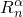, 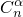, , and —may have to be modified in cases where the residuals are large relative to the fluxes or in cases where the incremental solution is essentially zero.

| **Input File Usage: ** | ``` [*CONTROLS](../key/key-link.md#usb-kws-hcontrols), PARAMETERS=FIELD, FIELD=*field* ``` |
| --- | --- |

| **Abaqus/CAE Usage: ** | Step module: ****Other****General Solution Controls****Edit****: toggle on **Specify**: **Field Equations**: **Apply to all applicable fields** or **Specify individual fields**: *field* |
| --- | --- |

#### Modifying the residual control

 is the convergence criterion for the ratio of the largest residual to the corresponding average flux norm, , for convergence.  is defined in ["Convergence criteria for nonlinear problems," Section 7.2.3](pt03ch07s02aus51.md). The default value is  = 5  103, which is rather strict by engineering standards but in all but exceptional cases will guarantee an accurate solution to complex nonlinear problems. The value for this ratio can be increased to a larger number if some accuracy can be sacrificed for computational speed.

#### Modifying the solution correction control

 is the convergence criterion for the ratio of the largest solution correction to the largest corresponding incremental solution value. The default value is  = 102. In addition to sufficiently small residuals, Abaqus/Standard requires that the largest correction to the solution value be small in comparison to the largest corresponding incremental solution value. Some analyses may not require such accuracy, thus permitting this ratio to be increased.

#### Specifying the average flux

 is the value of average flux used by Abaqus/Standard for checking residuals. The default value is the time average flux calculated by Abaqus/Standard, as defined in ["Convergence criteria for nonlinear problems," Section 7.2.3](pt03ch07s02aus51.md). You may, however, define a constant value, , for the average flux, in which case 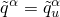 throughout the step.

You may wish to use absolute tolerances for your residual checks. The absolute tolerance value is then equal to the product of the average flux, , and the ratio . To avoid testing the magnitude of the solution correction, you can set  to 1.0.

#### Modifying the initial time average flux

 is the initial value of the time average flux for the current step. The default value is the time average flux from the previous step or 102 if this is Step 1. Redefining  is sometimes helpful when a coupled problem is analyzed and some of the fields in the problem are not active in the first step; for example, if a static step is carried out before a fully coupled thermal-stress step.

Redefinition of  can also be useful if the first step is essentially a null step; for example, in a contact problem before any contact occurs, the initial fluxes (forces) generated are zero. In such cases  should be given as a typical flux magnitude that will occur when field  first becomes active.

The initial value of  is retained until an iteration is completed for which 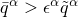, at which time we redefine 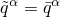. The criterion for zero flux compared to  is 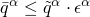 (see ["Convergence criteria for nonlinear problems," Section 7.2.3](pt03ch07s02aus51.md)).

If you specify the average flux, , directly, the value given for  is ignored.

#### Abaqus/Standard output

The controls in effect for an analysis are listed in the data (`.dat`) and message (`.msg`) files. Nondefault controls are marked by ***. For example, specifying the following controls:

| Field Equation |  |  | 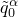 | 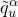 | 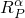 | 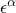 |
| --- | --- | --- | --- | --- | --- | --- |
| Displacement | 0.01 | 1.0 | 10.0 | -- | -- | 1.E4 |
| Rotation | 0.02 | 2.0 | 20.0 | 2.E3 | -- | -- |

would result in the following output: 
```
CONVERGENCE TOLERANCE PARAMETERS FOR FORCE
*** CRIT. FOR RESIDUAL FORCE FOR A NONLINEAR PROBLEM       1.000E-02
*** CRITERION FOR DISP. CORRECTION IN A NONLINEAR PROBLEM       1.00
*** INITIAL VALUE OF TIME AVERAGE FORCE                         10.0
    AVERAGE FORCE IS TIME AVERAGE FORCE
    ALT. CRIT. FOR RESIDUAL FORCE FOR A NONLINEAR PROBLEM  2.000E-02
*** CRIT. FOR ZERO FORCE RELATIVE TO TIME AVRG. FORCE      1.000E-04
    CRIT. FOR DISP. CORRECTION WHEN THERE IS ZERO FLUX     1.000E-03
    CRIT. FOR RESIDUAL FORCE WHEN THERE IS ZERO FLUX       1.000E-08
    FIELD CONVERSION RATIO                                      1.00
CONVERGENCE TOLERANCE PARAMETERS FOR MOMENT
 *** CRIT. FOR RESIDUAL MOMENT FOR A NONLINEAR PROBLEM     2.000E-02
 *** CRIT. FOR ROTATION CORRECTION IN A NONLINEAR PROBLEM       2.00
 *** INITIAL VALUE OF TIME AVERAGE MOMENT                       20.0
 *** USER DEFINED VALUE OF AVERAGE MOMENT NORM             2.000E+03
     ALT. CRIT. FOR RESID. MOMENT FOR A NONLINEAR PROBLEM  2.000E-02
     CRIT. FOR ZERO MOMENT RELATIVE TO TIME AVRG. MOMENT   1.000E-05
     CRIT. FOR ROTATION CORRECTION WHEN ZERO FLUX          1.000E-03
     CRIT. FOR RESIDUAL MOMENT WHEN ZERO FLUX              1.000E-08
     FIELD CONVERSION RATIO                                     1.00
```

### Controlling the time incrementation scheme

Solution control parameters can be used to alter both the convergence control algorithm and the time incrementation scheme. The time incrementation parameters 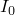 and 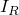 are the most significant since they have a direct effect on convergence. They may have to be modified if convergence is (initially) nonmonotonic or if convergence is nonquadratic.

Nonmonotonic convergence may occur if various nonlinearities interact; for example, the combination of friction, nonlinear material behavior, and geometric nonlinearity may lead to nonmonotonically decreasing residuals.

Nonquadratic convergence will occur if the Jacobian is not exact, which may occur for complex material models. It may also occur if the Jacobian is nonsymmetric but the symmetric equation solver is used. In that case the unsymmetric equation solver should be specified for the step (see ["Defining an analysis," Section 6.1.2](pt03ch06s01abo05.md)).

| **Input File Usage: ** | ``` [*CONTROLS](../key/key-link.md#usb-kws-hcontrols), PARAMETERS=TIME INCREMENTATION ``` |
| --- | --- |

| **Abaqus/CAE Usage: ** | Step module: ****Other****General Solution Controls****Edit****: toggle on **Specify**: **Time Incrementation** |
| --- | --- |

#### Specifying the equilibrium iteration for a residual check

 is the number of equilibrium iterations after which the check is made that the residuals are not increasing in two consecutive iterations. The default value is 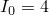. If the initial convergence is nonmonotonic, it may be necessary to increase this value.

#### Specifying the equilibrium iteration for a logarithmic rate of convergence check

 is the number of equilibrium iterations after which the logarithmic rate of convergence check begins. The default value is 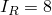. In cases where convergence is nonquadratic and this cannot be corrected by using the unsymmetric equation solver for the step, the logarithmic convergence check should be eliminated by setting this parameter to a high value.

#### Avoiding premature cutbacks in difficult analyses

Sometimes it is useful to increase both  and . For example, in a difficult analysis involving both friction and the concrete material model, it may be helpful to set 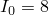 and 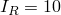 to avoid premature cutbacks of the time increment. These two parameters can be raised to more appropriate values for severely discontinuous problems by increasing them individually.

#### Automatically setting the time incrementation parameters

You can automatically set the parameters described above to the values  and . In this case any values that you specified previously for  and  are overridden. However, if  and  are specified multiple times in a step with different solution control settings, the last definition will be used.

| **Input File Usage: ** | ``` [*CONTROLS](../key/key-link.md#usb-kws-hcontrols), ANALYSIS=DISCONTINUOUS ``` |
| --- | --- |

| **Abaqus/CAE Usage: ** | Step module: ****Other****General Solution Controls****Edit****: toggle on **Specify**: **Time Incrementation**: **Discontinuous analysis** |
| --- | --- |

#### Improving solution efficiency in a problem that involves a high coefficient of friction

The solution efficiency can sometimes be improved in an analysis that involves a high coefficient of friction by automatically setting the time incrementation parameters and using the unsymmetric equation solver.

#### Abaqus/Standard output

The controls in effect for an analysis are listed in the data (`.dat`) and message (`.msg`) files. Nondefault controls are marked by **. For example, specifying the time incrementation parameters =7 and =10 would result in the following output: 

```
TIME INCREMENTATION CONTROL PARAMETERS:
 *** FIRST EQUIL. ITERATION FOR CONSECUTIVE DIVERGENCE CHECK       7
 *** EQUIL. ITER. AT WHICH LOG. CONVERGENCE RATE CHECK BEGINS     10
     EQUIL. ITER. AFTER WHICH ALTERNATE RESIDUAL IS USED           9
     MAXIMUM EQUILIBRIUM ITERATIONS ALLOWED                       16
     EQUIL. ITERATION COUNT FOR CUT-BACK IN NEXT INCREMENT        10
     MAX EQUIL. ITERS IN TWO INCREMENTS FOR TIME INC. INCREASE     4
     MAXIMUM ITERATIONS FOR SEVERE DISCONTINUITIES                12
     MAXIMUM CUT-BACKS ALLOWED IN AN INCREMENT                     5
     MAX DISCON. ITERS IN TWO INCS FOR TIME INC. INCREASE          6
     CUT-BACK FACTOR AFTER DIVERGENCE                          0.250
     CUT-BACK FACTOR FOR TOO SLOW CONVERGENCE                  0.500
     CUT-BACK FACTOR AFTER TOO MANY EQUILIBRIUM ITERATIONS     0.750
```

### Activating the "line search" algorithm

In strongly nonlinear problems the Newton algorithms used in Abaqus/Standard may sometimes diverge during equilibrium iteration. The line search algorithm (discussed in ["Improving the efficiency of the solution by using the line search algorithm" in "Convergence criteria for nonlinear problems," Section 7.2.3](pt03ch07s02aus51.md#usb-anl-aconvergcriteria-linesearch)) detects these situations automatically and applies a scale factor to the computed solution correction, which helps to prevent divergence. The line search algorithm is particularly useful when the quasi-Newton method (see ["Solution method" in "Convergence criteria for nonlinear problems," Section 7.2.3](pt03ch07s02aus51.md#usb-anl-aconvergcriteria-solutionmethod)) is used.

By default, the line search algorithm is enabled only during steps where the quasi-Newton method is used. Set the maximum number of line search iterations, 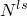, to a reasonable value (such as 5) to activate the line search procedure or to zero to forcibly deactivate the line search.

| **Input File Usage: ** | ``` [*CONTROLS](../key/key-link.md#usb-kws-hcontrols), PARAMETERS=LINE SEARCH  ``` |
| --- | --- |

| **Abaqus/CAE Usage: ** | Step module: ****Other****General Solution Controls****Edit****: toggle on **Specify**: **Line Search Control**:  |
| --- | --- |

### Defining tolerances for constraint equations

Solution control parameters can be used to set tolerances for constraint equations. You can set strain compatibility tolerances for hybrid elements, displacement and rotation compatibility tolerances for distributing coupling constraints (specified as surface-based constraints or using DCOUP2D/DCOUP3D elements), and compatibility tolerances for softened contact. See ["Convergence criteria for nonlinear problems," Section 7.2.3](pt03ch07s02aus51.md), for details.

### Controlling the solution accuracy in direct cyclic analysis

Solution control parameters can be used in direct cyclic analysis to specify when to impose the periodicity conditions and to set tolerances for stabilized state and plastic ratchetting detections.

| **Input File Usage: ** | ``` [*CONTROLS](../key/key-link.md#usb-kws-hcontrols), TYPE=DIRECT CYCLIC , , , ,  ``` |
| --- | --- |

| **Abaqus/CAE Usage: ** | Step module: ****Other****General Solution Controls****Edit****: toggle on **Specify**: **Direct Cyclic**: 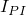, , , , 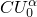 |
| --- | --- |

#### Imposing the periodicity condition

You can specify the iteration number at which the periodicity condition is first imposed, . The default value is  = 1, in which case the periodicity condition is imposed for all iterations from the beginning of an analysis. This solution control parameter rarely needs to be reset from its default value.

#### Defining tolerances for stabilized state and plastic ratchetting detections

You can specify the stabilized state detection criteria,  and .  is the maximum allowable ratio of the largest residual coefficient on any terms in the Fourier series to the corresponding average flux norm, and  is the maximum allowable ratio of the largest correction to the displacement coefficient on any terms in the Fourier series to the largest displacement coefficient. The default values are  = 5  103 and  = 5  103. The solution converges to a stabilized state if both these criteria are satisfied.

If plastic ratchetting occurs, the shape of the stress-strain curves remains unchanged but the mean value of the plastic strain over a cycle continues to shift from one iteration to the next. In that case it is desirable to use separate tolerances for the constant term in the Fourier series to detect the plastic ratchetting.

You can also specify the plastic ratchetting detection criteria,  and .  is the maximum allowable ratio of the largest residual coefficient on the constant term in the Fourier series to the corresponding average flux norm, and  is the maximum allowable ratio of the largest correction to the displacement coefficient on the constant term in the Fourier series to the largest displacement coefficient. The default values are  = 5  103 and  = 5  103. Plastic ratchetting is expected if the residual coefficients and the corrections to the displacement coefficients on any of the periodic terms are within the tolerances set by  and , respectively, but the maximum residual coefficient on the constant term and the maximum correction to the displacement coefficient on the constant term exceed the tolerances set by  and , respectively.

#### Abaqus/Standard output

The controls in effect for an analysis are listed in the data (`.dat`) and message (`.msg`) files. Nondefault controls are marked by **. For example, specifying the following controls:

|  |  |  |  |  |
| --- | --- | --- | --- | --- |
| 5 | 1.0E4 | 1.0E4 | 1.0E4 | 1.E4 |

would result in the following output: 
```
STABILIZED STATE AND PLASTIC RATCHETTING DETECTION
PARAMETERS FOR FORCE 
** CRIT. FOR RESI. COEFF. ON ANY FOURIER TERMS            1.0E-04
** CRIT. FOR CORR. TO DISP. COEFF. ON ANY FOURIER TERMS   1.0E-04
** CRIT. FOR RESI. COEFF. ON CONSTANT FOURIER TERM        1.0E-04
** CRIT. FOR CORR. TO DISP. COEFF. ON CONST. FOURIER TERM 1.0E-04

PERIODICITY CONDITION CONTROL PARAMETER:
** ITERATION NUMBER AT WHICH PERIODICITY CONDITION
** STARTS TO IMPOSE                                             5

```

### Controlling the solution accuracy and mesh quality in a deforming-mesh analysis with Abaqus/CFD

Solution control parameters can be used to control the mesh motion and to maintain the mesh quality in deforming-mesh problems involving moving boundaries or deforming geometries. They can also be used to control FSI stabilization when performing Abaqus/CFD to Abaqus/Standard or to Abaqus/Explicit co-simulation. 

#### Controlling mesh smoothing and FSI stabilization

When the implicit algorithm (default) for mesh smoothing is used, you can specify the number of iterations before performing a convergence check, the maximum number of iterations, the FSI penalty scale factor, the solid/fluid density ratio, the linear convergence criterion, and the stiffness scale factor to control mesh motion and FSI stabilization.

The implicit algorithm uses the matrix-free, iteration method to solve the pseudo-elastic problem. The number of iterations and the linear convergence criterion control accuracy when solving the linear elasticity equations during the ALE process for FSI or deforming-mesh problems. Reducing the number of iterations or relaxing the linear convergence criterion can help reduce computational time. Similarly, increasing the number of iterations or the linear convergence criterion can help to ensure that the mesh quality remains good. The stiffness scale factor can be used to scale the elastic stiffness. Decreasing the elastic stiffness produces an ALE mesh with more local deformation.

When the explicit algorithm for mesh smoothing is used, you can specify the minimum number of mesh smoothing increments, the maximum number of mesh smoothing increments, the FSI penalty scale factor, the solid/fluid density ratio, and the stiffness scale factor to control the mesh motion and FSI stabilization. 

The minimum and maximum number of mesh smoothing increments controls the number of mesh smoothing steps taken during the ALE process for FSI or deforming-mesh problems. Reducing the minimum and maximum number of mesh smoothing increments can help reduce computational time. Similarly, increasing the minimum/maximum number of smoothing increments helps to ensure that the mesh quality remains good and avoids potential element collapse during the evolution of a deforming-mesh problem. 

The FSI penalty scale factor is used to control FSI stabilization and has a default value of 1.0. Increasing this parameter in increments of 0.1 may be necessary for extremely flexible structures in high-density fluids when the structural accelerations are high. 

 The solid/fluid density ratio is also used to control FSI stabilization. By default, the solid/fluid density ratio is ignored if its value is not specified. When multiple solid-fluid interfaces are present, you should choose the smallest solid/fluid density ratio.

| **Input File Usage: ** | Use one of the following options to control the mesh smoothing or FSI stabilization: |
| --- | --- |
|  | ``` [*CONTROLS](../key/key-link.md#usb-kws-hcontrols), TYPE=FSI, MESH SMOOTHING=IMPLICIT *number of iterations before convergence check, maximum number of iterations, FSI penalty scale factor, solid/fluid density ratio, stiffness scale factor, linear convergence criterion* ``` ``` [*CONTROLS](../key/key-link.md#usb-kws-hcontrols), TYPE=FSI, MESH SMOOTHING=EXPLICIT *minimum number of mesh smoothing increments, maximum number of mesh smoothing increments, FSI penalty scale factor, solid/fluid density ratio, stiffness scale factor* ``` |

| **Abaqus/CAE Usage: ** | Controlling FSI stabilization in an Abaqus/CFD to Abaqus/Standard or to Abaqus/Explicit co-simulation is not supported in Abaqus/CAE. |
| --- | --- |

#### Controlling mesh distortion

Similar to the distortion control used in Abaqus/Explicit (see ["Section controls," Section 27.1.4](pt06ch27s01aus113.md), for details), Abaqus/CFD offers distortion control to prevent elements from inverting or distorting excessively in fluid mesh movement when the explicit mesh smoothing algorithm is used. By default, distortion control is turned off during the co-simulation and ignored if the implicit mesh smoothing algorithm is used.

| **Input File Usage: ** | Use the following option to deactivate distortion control (default) when the implicit mesh smoothing algorithm is used: |
| --- | --- |
|  | ``` [*CONTROLS](../key/key-link.md#usb-kws-hcontrols), TYPE=FSI, MESH SMOOTHING=EXPLICIT,DISTORTION CONTROL=OFF ``` Use the following option to activate distortion control: ``` [*CONTROLS](../key/key-link.md#usb-kws-hcontrols), TYPE=FSI, MESH SMOOTHING=EXPLICIT,DISTORTION CONTROL=ON ``` |

| **Abaqus/CAE Usage: ** | Controlling mesh distortion in an Abaqus/CFD to Abaqus/Standard or to Abaqus/Explicit co-simulation is not supported in Abaqus/CAE. |
| --- | --- |


