# 7.2.3 Convergence criteria for nonlinear problems


**Products: **Abaqus/Standard  Abaqus/CAE  

**Warning:**The information in this section is provided for users who may wish to adjust the convergence criteria for the solution of nonlinear systems. In most cases these criteria need not be adjusted.

##### **References**

- ["Convergence and time integration criteria: overview," Section 7.2.1](pt03ch07s02abo11.md)
- [*CONTROLS](../key/key-link.md#usb-kws-hcontrols)
- ["Customizing general solution controls," Section 14.15.1 of the Abaqus/CAE User's Guide](../usi/usi-link.md#usi-sim-other-gencontrols)

### Overview

In nonlinear problems the governing balance equations must be solved iteratively. This section describes:
- the solution method for nonlinear problems (Newton's method);
- the field equations that can be solved by Abaqus/Standard;
- the criteria used to establish convergence of each iteration during the solution;
- "severe discontinuity" iterations; and
- the line search algorithm, which can be used to improve the robustness of the Newton method.

### Solution method

Where possible, Abaqus/Standard uses Newton's method to solve nonlinear problems. In some cases it uses an exact implementation of Newton's method, in the sense that the Jacobian of the system is defined exactly, and quadratic convergence is obtained when the estimate of the solution is within the radius of convergence of the algorithm. In other cases the Jacobian is approximated so that the iterative method is not an exact Newton method. For example, some material and surface interface models (such as nonassociated flow plasticity models or Coulomb friction) create a nonsymmetric Jacobian matrix, but you may choose to approximate this matrix by its symmetric part.

Many problems exhibit discontinuous behavior. A common example is contact: at a particular point on a surface, the contact constraint is either present or absent. Another (usually less severe) example is strain reversal in plasticity at a point where the material is yielding.

#### Specifying the quasi-Newton method

You can choose to use the quasi-Newton technique for a particular step (described in ["Quasi-Newton solution technique," Section 2.2.2 of the Abaqus Theory Guide](../stm/stm-link.md#stm-anl-quasinewtsol)) instead of the standard Newton method for solving nonlinear equations.

The quasi-Newton technique can save substantial computational cost in some cases by reducing the number of times the Jacobian matrix is factorized. Generally it is most successful when the system is large and many iterations are needed per increment or when the stiffness matrix is not changing much from iteration to iteration (such as in a dynamic analysis using implicit time integration or in a small-displacement analysis with local plasticity). It can be used only for symmetric systems of equations; therefore, it cannot be used when the unsymmetric solver is specified for a step (see ["Defining an analysis," Section 6.1.2](pt03ch06s01abo05.md)), nor can it be used for procedures that always produce an unsymmetric system of equations, such as ["Fully coupled thermal-stress analysis," Section 6.5.3](pt03ch06s05at19.md), and ["Abaqus/Aqua analysis," Section 6.11.1](pt03ch06s11at30.md). In addition, it cannot be used for a static Riks procedure (see ["Unstable collapse and postbuckling analysis," Section 6.2.4](pt03ch06s02at03.md)).

The quasi-Newton method works well in combination with the line search method (see ["Improving the efficiency of the solution by using the line search algorithm](pt03ch07s02aus51.md#usb-anl-aconvergcriteria-linesearch)). Line searches help to prevent divergence of equilibrium iterations resulting from the inexact Jacobian produced by the quasi-Newton method. The line search method is activated by default for steps that use the quasi-Newton method. You can override this action by specifying line search controls.

You can specify the number of quasi-Newton iterations allowed before the kernel matrix is reformed. The default number of iterations is 8. Additional matrix reformations may occur automatically during the iteration process depending on the convergence behavior. Since quadratic convergence is not expected during quasi-Newton iterations, the logarithmic rate of convergence check is not applied during the time incrementation. Furthermore, the iteration count used in the time incrementation is a weighted sum of quasi-Newton iterations, with the weight factor depending on whether or not a kernel matrix has been reformed.

| **Input File Usage: ** | ``` [*SOLUTION TECHNIQUE](../key/key-link.md#usb-kws-hsolutiontech), TYPE=QUASI-NEWTON, REFORM KERNEL=*n* ``` |
| --- | --- |

| **Abaqus/CAE Usage: ** | Step module: step editor: **Other**: **Solution technique: Quasi-Newton**, **Number of iterations allowed before the kernel matrix is reformed:** *n* |
| --- | --- |

#### Specifying the separated method

Alternatively, you can choose to use the separated technique instead of the standard Newton method for solving nonlinear equations for fully coupled thermal-stress and coupled thermal-electrical procedures.

The separated technique (described in ["Fully coupled thermal-stress analysis," Section 6.5.3](pt03ch06s05at19.md), and ["Coupled thermal-electrical analysis," Section 6.7.3](pt03ch06s07at22.md)) approximates the Jacobian by eliminating interfield coupling terms and can save substantial computational cost in cases where there is relatively weak coupling between the fields.

| **Input File Usage: ** | ``` [*SOLUTION TECHNIQUE](../key/key-link.md#usb-kws-hsolutiontech), TYPE=SEPARATED ``` |
| --- | --- |

| **Abaqus/CAE Usage: ** | Step module: step editor: **Other**: **Solution technique: Separated** |
| --- | --- |

### Field equations

Field equations can be modeled separately or fully coupled. Some fields in Abaqus/Standard can only have linear response. Each field is discretized by using basic nodal variables (the degrees of freedom at the nodes of the finite element model) such as the components of the displacement in a continuum stress analysis problem. Each field has a conjugate “flux.”

#### Available fields and their conjugate fluxes

The fields and conjugate fluxes available in Abaqus/Standard are as follows:

| Basic problem | Field | Conjugate flux |
| --- | --- | --- |
| Stress analysis: | Displacement, ; | Force, ; |
| Force equilibrium | Warping, *w* | Bimoment, *W* |
| Structural stress analysis: | Rotation,  | Moment,  |
| Moment equilibrium |  |  |
| Heat transfer analysis | Temperature,  | Heat flux, *q* |
| Acoustic analysis (linear only) | Acoustic pressure, *u* | Rate of change of fluid volumetric flux |
| Pore liquid flow analysis | Pore liquid pressure, *u* | Pore liquid volumetric flux, *q* |
| Hydrostatic fluid modeling | Fluid pressure, *p* | Fluid volume, *V* |
| Mass diffusion analysis | Normalized concentration,  | Mass concentration volumetric flux, *Q* |
| Piezoelectric analysis | Electrical potential,  | Electrical charge, *q* |
| Electric conduction analysis | Electrical potential,  | Electrical current, *J* |
| Mechanism analysis (connector elements with material flow degree of freedom) | Material flow | Material flux |
| Analysis containing C3D4H elements (all materials, except compressible hyperelastic elastomers and elastomeric foams). | Pressure Lagrange multiplier | Volumetric flux |
| Analysis containing C3D4H elements with compressible hyperelastic or hyperfoam materials. | Volumetric Lagrange multiplier | Pressure flux |

#### Constraint equations

In some cases the problem also involves constraint equations. In Abaqus/Standard the following constraints are included by using Lagrange multipliers:

| Problem | Constraint variable | Constraint |
| --- | --- | --- |
| Hybrid solid (except C3D4H elements) | Pressure stress | Volumetric strain compatibility |
| Hybrid beam | Axial force | Axial strain compatibility |
| Hybrid beam | Transverse shear force | Transverse shear strain compatibility |
| Distributing coupling | Force | Coupling displacement compatibility |
| Distributing coupling | Moment | Coupling rotation compatibility |
| Contact | Normal pressure | Surface penetration |
| Contact with Lagrange friction | Shear stress | Relative shear sliding |

If the penalty method is used, the contact Lagrange multipliers may not be present.

#### Solving coupled field equations

In a general problem several (possibly nonlinear) coupled field equations of types 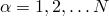 must be solved and several different (possibly nonlinear) constraints of type 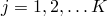 must be satisfied simultaneously. For example, in a structural problem in which hybrid beam elements are used, 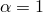 might represent the displacement field and the equilibrium equations for the conjugate force and 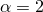 might represent the rotation field and the equilibrium equations for the conjugate moment, while 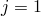 represents axial strain compatibility and 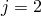 represents transverse shear strain compatibility.

### Controlling the accuracy of the solution

The default solution control parameters defined in Abaqus/Standard are designed to provide reasonably optimal solution of complex problems involving combinations of nonlinearities as well as efficient solution of simpler nonlinear cases. However, the most important consideration in the choice of the control parameters is that any solution accepted as “converged” is a close approximation to the exact solution of the nonlinear equations. In this context “close approximation” is interpreted rather strictly by engineering standards when the default value is used, as described below.

You can reset many solution control parameters related to the tolerances used for field equations. If you define less strict convergence criteria, results may be accepted as converged when they are not sufficiently close to the exact solution of the system. Use caution when resetting solution control parameters. Lack of convergence is often due to modeling issues, which should be resolved before changing the accuracy controls.

You can select the type of equation for which the solution control parameters are being defined; for example, you can redefine the default controls for the displacement field and warping degree of freedom equilibrium equations only. By default, the solution control parameters will apply to all active fields in the model. See ["Defining tolerances for field equations" in "Commonly used control parameters," Section 7.2.2](pt03ch07s02aus50.md#usb-anl-aconvergecontrol-fields), for details.

| **Input File Usage: ** | ``` [*CONTROLS](../key/key-link.md#usb-kws-hcontrols), PARAMETERS=FIELD, FIELD=*field* , , , , , , ,  , ,  ``` |
| --- | --- |

| **Abaqus/CAE Usage: ** | Step module: ****Other****General Solution Controls****Edit****: toggle on **Specify**: **Field Equations**: **Apply to all applicable fields** or **Specify individual fields**: *field* |
| --- | --- |

#### Terminology

Each field, , that is active in the problem is tested for convergence of the field equations. The following measures are used in deciding if an increment has converged:

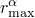

The largest residual in the balance equation for field .

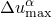

The largest change in a nodal variable of type  in the increment.

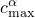

The largest correction to any nodal variable of type  provided by the current Newton iteration.

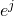

The largest error in a constraint of type *j*. 

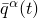

The instantaneous magnitude of the flux for field  at time *t*, averaged over the entire model (spatial average flux). This average is by default defined by the fluxes that the elements apply to their nodes and any externally defined fluxes:

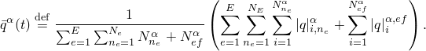

Here, *E* is the number of elements in the model,  is the number of nodes in element *e*, 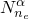 is the number of degrees of freedom of type  at node 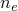 of element *e*, 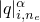 is the magnitude of the total flux component that element *e* applies at its *i*th degree of freedom of type  at its th node at time *t*, 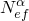 is the number of external fluxes for field  (depends on element type, loading type, and number of loads applied to an element), and 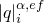 is the magnitude of the *i*th external flux for field .

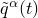

An overall time-averaged value of the typical flux for field  so far during this step including the current increment. Normally,  is defined as 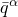 averaged over all the increments in the step in which  is nonzero. The  for the current increment is recalculated after every iteration of the current increment.

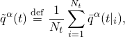

where 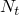 is the total number of increments so far in the step, including the current increment, in which 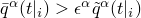. Here 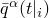 is the value of  at increment *i* and  is a small number. The default for  is 105, but in rare cases, you can change this default.

Alternatively, you can define a value for the average flux in the step, . In this case, 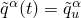 throughout the step.

At the start of the step,  is normally the value from the previous step (except for Step 1, when 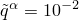 by default). Alternatively, you can define an initial value for the time average flux, , as described in ["Modifying the initial time average flux" in "Commonly used control parameters," Section 7.2.2](pt03ch07s02aus50.md#usb-anl-aconvergecontrol-fields-qinit).  retains its initial value until an iteration is completed for which , at which time we redefine . (If  is defined, the value defined for  is ignored.)

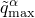

The time-averaged value of the largest flux corresponding to the field  during this step, excluding the current increment.

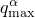

The largest flux corresponding to the field  during the current iteration.

#### Average flux

The time-averaged value of the flux () is computed from the spatial average of the flux () at various instants in time. In some situations where only a small part of the model is *active* (the fluxes over the rest of the model are zero or very small), the spatial average of a flux over the entire model can be very small when compared to the spatial average over the active part of the model. Over a period of time this can result in a small value for the time-averaged value of the flux and in turn may lead to a convergence criterion that is very strict by engineering standards. To avoid such an excessively strict convergence criterion, Abaqus/Standard uses an algorithm to determine the active parts of a model at any given instant.

During an iteration any flux 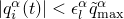 is treated as inactive, and the corresponding degree of freedom is also marked inactive.  is the time-averaged value of the largest flux in the model during the current step. The default value of 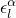 is 105; you can redefine this parameter.

At the end of an iteration the largest flux in the model during the current iteration () is compared with the time-averaged value of the largest flux (). If 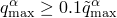, the spatial average is computed over only the active parts of the model; if 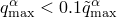, all inactive parts of the model are reclassified as active and the spatial average is computed over the entire model. The appropriate spatial average of the flux obtained in this manner is then used to compute the time-averaged flux  that is used in the convergence criterion. Setting 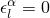 forces the spatial averages of a flux to be always computed over the entire model.

If you specify a value for the average flux in the step, ,  throughout the step.

#### Residuals

Most nonlinear engineering calculations will be sufficiently accurate if the error in the residuals is less than 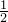%. Therefore, Abaqus/Standard normally uses 

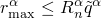

as the residual check, where you can define  (it is 0.005 by default). If this inequality is satisfied, convergence is accepted if the largest correction to the solution, , is also small compared to the largest incremental change in the corresponding solution variable, ,


or if the magnitude of the largest correction to the solution that would occur with one more iteration, estimated as

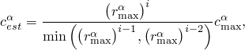

satisfies the same criterion:

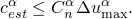

You can define ; the default value is 102.

The superscripts *i*, , and 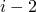 refer to the iteration number, and 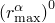 refers to the largest residual in field  at the start of the first iteration of the increment. See ["Commonly used control parameters," Section 7.2.2](pt03ch07s02aus50.md), for more details on specifying .

#### Zero flux

In some cases there may be zero flux in the equations of type  anywhere in the model during some increments. Zero flux is defined as 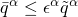, where, as discussed earlier,  has a default value of 105 and the solution for field  is accepted if 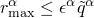. If not,  is compared to , and convergence for field  is accepted when 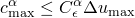. The default value of 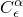 is 103; you can redefine this parameter.

#### Negligible response in some fields

Cases may arise where more than one field is active in the model yet there is negligible response in some of the fields in some increments. If some type of physical conversion factor, , exists between active fields  and ,  in the above paragraph can be replaced by 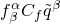 for those particular increments where  is deemed too small (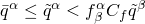) to be used realistically as part of the convergence criteria for field . An example of  is a characteristic length to convert between force and moment.

Here,  is a factor calculated by Abaqus/Standard based on the problem definition and the fields involved and 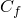 is a field conversion ratio that you can define. The default value for  is 1.0. Currently, this concept is used only for converting between the fields associated with forces and moments, when  represents a characteristic element length.

#### Linear increments

Linear cases do not require more than one equilibrium iteration per increment. If 

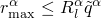

for all , the increment is considered to be linear.

You can define 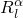; it is intended to be very small. The default value of  is 108. Any case that passes such a stringent comparison of the largest residual with the average flux magnitude in each field is considered linear and does not require further iteration. If this requirement is satisfied at some iteration after the first, the solution is accepted without any check on the size of the correction to the solution.

#### Nonquadratic convergence

In some cases quadratic convergence of the iterations is not possible because the Jacobian of the Newton scheme is approximated. If after 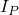 iterations the convergence rate is only linear, Abaqus/Standard uses a looser tolerance, 

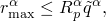

as the residual check. This tolerance modification is not applied when the quasi-Newton method is used, since it is normal for this method to require a larger number of iterations to converge.

You can define 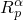, which is 2  102 by default. You can also define  (by default, ; see ["Controlling iteration](pt03ch07s02aus51.md#usb-anl-aconvergcriteria-iteration)”).

Convergence also requires that 


Iteration continues until both criteria are satisfied for all active fields or the increment is abandoned.

When the active field is the displacement, the convergence criterion requiring the largest displacement correction to be small relative to the maximum displacement increment () is ignored when the maximum displacement increment itself is very small, as defined by , where  is the characteristic element length. The default value for  is 108; you can redefine this parameter.

### Controlling iteration

Each increment of a nonlinear solution will usually be solved by multiple equilibrium iterations. The number of iterations may become excessive, in which case the increment size should be reduced and the increment attempted again. On the other hand, if successive increments are solved with a minimum number of iterations, the increment size may be increased. You can specify a number of time incrementation control parameters; some of them are described in this section, while the remainder are described in ["Time integration accuracy in transient problems," Section 7.2.4](pt03ch07s02aus52.md).

| **Input File Usage: ** | ``` [*CONTROLS](../key/key-link.md#usb-kws-hcontrols), PARAMETERS=TIME INCREMENTATION , , , , , , , , , , , ,  , , , , , , ,  , , , , , , ,   ``` |
| --- | --- |

| **Abaqus/CAE Usage: ** | Step module: ****Other****General Solution Controls****Edit****: toggle on **Specify**: **Time Incrementation**; click **More** to see additional data tables |
| --- | --- |

#### Reattempting an increment because of trouble with element or material calculations

Abaqus/Standard may have trouble with the element calculations because of excessive distortion in large-displacement problems or because of very large plastic strain increments. If this occurs and automatic time incrementation has been chosen, the increment will be attempted again with a time increment of  times the current time increment, where you can define . By default, . If fixed time stepping has been chosen, the analysis will terminate with an error message.

#### Reattempting a diverging increment

Sometimes the increment is too large for the solution to converge at all—the initial state is outside the “radius of convergence” of the Newton method. This condition can be detected by observing the behavior of the largest residuals, . In some cases these will not decrease from iteration to iteration throughout an iteration sequence that leads to convergence, but we assume that, if they fail to decrease over two consecutive iterations, the iterations should be abandoned. Thus, if 


where *i* is the iteration counter, the iterations are abandoned. This check is first made after  iterations following a solution discontinuity. You can define ; it must be at least 3. The default value of  is 4. If fixed time stepping has been chosen, the analysis will terminate with an error message.

With automatic time stepping the increment is begun again, using a time increment of  times the previous attempt, where you can define . By default, . This subdivision continues until a successful time increment is found or the minimum time increment allowed has failed, in which case the job ends with an error message. Using the line search algorithm with  sometimes helps in such cases (see ["Improving the efficiency of the solution by using the line search algorithm](pt03ch07s02aus51.md#usb-anl-aconvergcriteria-linesearch)”).

#### Reattempting an increment when too many equilibrium iterations are required

In case quadratic convergence cannot be obtained, the logarithmic rate of convergence, 


will often be maintained throughout the iteration process. This rate can be established during the early iterations. If convergence has not been achieved after  or more iterations following a solution discontinuity, if automatic time incrementation has been selected, and if the slowest convergence rate over all fields  suggests that more than  total iterations subsequent to the last solution discontinuity are expected to be required, the increment is begun again with a time increment of  times the one abandoned. If fixed time incrementation has been chosen, the iterations are continued; but if convergence is not achieved within  iterations after the last solution discontinuity in the increment, the analysis will terminate with an error message.

You can define the values of , , and . By default, , , and =0.5.

#### Increasing or reducing the size of the time increment for efficiency

When automatic time incrementation is chosen, the effectiveness of the nonlinear equation solution is used in the selection of the next time increment (in addition to the time integration accuracy criteria discussed in ["Time integration accuracy in transient problems," Section 7.2.4](pt03ch07s02aus52.md)). If no more than  iterations are required in two consecutive increments, the time increment may be increased by a factor of . If an increment converges but takes more than  iterations, the next time increment is reduced to  times the current time increment. You can define the values of , , , and . By default, , , , and .

#### Extrapolation

At each increment after the first increment of a nonlinear analysis step Abaqus/Standard estimates the solution to the increment by extrapolating the solution from the previous increment (or increments). By default, 100% linear extrapolation is used (1% for the Riks method). Extrapolation is abandoned if 


where  is the proposed new time increment, and  is the last successful time increment. You can define the value of ; it is 0.1 by default.

You can turn this extrapolation scheme off for a particular step—see ["Defining an analysis," Section 6.1.2](pt03ch06s01abo05.md).

### Convergence of strain constraints in hybrid elements

Strain constraint convergence in “hybrid” elements is checked by comparing the largest error in each strain constraint, , with an absolute tolerance for the corresponding error, . The magnitudes of these errors are reported in the message (`.msg`) file after each iteration as “compatibility errors.” For example, the volumetric compatibility error is a measure of the accuracy with which the incompressibility constraint is satisfied. Since nonlinearity in constraint equations is generally reflected in the field equations in the same problem, no attempt is made to estimate convergence rates in these constraint equations: we assume that the measures of convergence rate in the field equations are sufficient.

You can define the  (, , and ). By default, all of the  = 105.

| **Input File Usage: ** | ``` [*CONTROLS](../key/key-link.md#usb-kws-hcontrols), PARAMETERS=CONSTRAINTS , ,  ``` |
| --- | --- |

| **Abaqus/CAE Usage: ** | Step module: ****Other****General Solution Controls****Edit****: toggle on **Specify**: **Constraint Equations** |
| --- | --- |

### Severe discontinuity iterations

Abaqus/Standard distinguishes between regular, equilibrium iterations (in which the solution varies smoothly) and severe discontinuity iterations (SDIs) in which abrupt changes in stiffness occur. By default, Abaqus/Standard will continue to iterate until the severe discontinuities are sufficiently small (or no severe discontinuities occur) and the equilibrium (flux) tolerances are satisfied. For more information on the criteria used for the severe discontinuity checks, see ["Severe discontinuities in Abaqus/Standard" in "Defining an analysis," Section 6.1.2](pt03ch06s01abo05.md#usb-anl-aover-sdiconvert). Alternatively, Abaqus/Standard will continue to iterate until no severe discontinuities occur and the equilibrium (flux) tolerances are satisfied. This more traditional method can cause convergence difficulties if the contact conditions are only weakly determined and contact “chattering” occurs or if a large number of severe discontinuity iterations are required to settle the contact conditions.

You can define the contact and slip compatibility tolerance, the soft contact compatibility tolerance for low pressure, and the contact force error tolerance.

| **Input File Usage: ** | ``` [*CONTROLS](../key/key-link.md#usb-kws-hcontrols), PARAMETERS=CONSTRAINTS , , , ,  , , ,  ``` |
| --- | --- |

| **Abaqus/CAE Usage: ** | Step module: ****Other****General Solution Controls****Edit****: toggle on **Specify**: **Constraint Equations** |
| --- | --- |
|  | Defining the contact force error tolerance is not supported in Abaqus/CAE. |

#### Severe discontinuity iterations in implicit dynamic analysis

In implicit dynamic analysis, the average time of all contact changes in the increment is estimated and the time incrementation is interrupted to solve impact equations at that time. With augmented Lagrange or penalty constraint enforcement methods or with softened contact, no contact constraints are imposed when impact equations are solved. However, if the contact constraints are not satisfied within given tolerances, a severe discontinuity iteration is forced. See ["Intermittent contact/impact," Section 2.4.2 of the Abaqus Theory Guide](../stm/stm-link.md#stm-anl-intercontact), for details on intermittent contact in dynamic problems.

#### Controlling the number of severe discontinuity iterations

By default, Abaqus applies sophisticated criteria involving changes in penetration, changes in the residual force, and the number of severe discontinuities from one iteration to the next to determine whether iteration should be continued or terminated. Hence, it is in principle not necessary to limit the number of severe discontinuity iterations. This makes it possible to run contact problems that require large numbers of contact changes without having to change the control parameters. It is still possible to set a limit, ,  for the maximum number of severe discontinuity iterations; by default, , which in practice should always be more than the actual number of iterations in an increment.

| **Input File Usage: ** | ``` [*CONTROLS](../key/key-link.md#usb-kws-hcontrols), PARAMETERS=TIME INCREMENTATION , , , , , , , , , ,  ``` |
| --- | --- |

| **Abaqus/CAE Usage: ** | Step module: ****Other****General Solution Controls****Edit****: toggle on **Specify**: **Time Incrementation**; click **More** to see additional data tables |
| --- | --- |

#### Controlling the number of severe discontinuity iterations when severe discontinuities always force iterations

In this case a limit, , is placed on the number of iterations caused by severe discontinuities in an increment. If more than  iterations are required for severe discontinuities, the increment is started over with a time increment size of  times the abandoned increment size (for automatic time incrementation). If fixed time incrementation was chosen, the analysis terminates with an error message. You can define the values of  and . By default,  and .

| **Input File Usage: ** | ``` [*CONTROLS](../key/key-link.md#usb-kws-hcontrols), PARAMETERS=TIME INCREMENTATION , , , , , ,  , , , ,  ``` |
| --- | --- |

| **Abaqus/CAE Usage: ** | Step module: ****Other****General Solution Controls****Edit****: toggle on **Specify**: **Time Incrementation**; click **More** to see additional data tables |
| --- | --- |

### Improving the efficiency of the solution by using the line search algorithm

Abaqus/Standard provides the option of including a “line search” algorithm. The purpose of the line search is to improve the robustness of the Newton or quasi-Newton methods. By default, the line search is active only for steps that use the quasi-Newton method. During equilibrium iterations where residuals are large, the line search algorithm scales the correction to the solution by a line search scale factor, . An iterative process is used to find the value of   that minimizes the component of the residual vector in the direction of the correction vector; this component is called , where *j* is the line search iteration number. Each line search iteration requires one pass through the Abaqus/Standard element loop but does not require any operations using the global stiffness matrix.

It is usually sufficient to determine   only to modest accuracy. There are several controls used to limit this accuracy. A maximum of  line search iterations are performed. There is a limit on the allowable range of : 


The line search ceases when 


where  is evaluated before the first equilibrium iteration. The residual reduction factor at which the line search ceases, , is typically set to a rather loose tolerance. The line search algorithm will also cease when the change in  provided by a line search iteration is less than  times .

You can define the values of , , , , and . By default,  = 0 with the Newton method, and =5 with the quasi-Newton method.  Set  to a nonzero value to activate the line search algorithm or to zero to forcibly deactivate line search. Default values for the additional line search parameters are  = 1.0,  = 0.0001,  = 0.25, and  = 0.10. These defaults are chosen to achieve modest accuracy for the line search scale factor, while minimizing the additional cost of line search iterations. More agressive line searching can be beneficial in some simulations, especially when many nonlinear iterations and/or cutbacks are needed to resolve sharp discontinuities in the solution. In these cases you could try allowing more line search iterations (=10) and requiring more accuracy in the line search scale factor ( =0.01). This may result in more line search iterations but fewer nonlinear iterations and cutbacks and an overall reduction in solution cost.

| **Input File Usage: ** | ``` [*CONTROLS](../key/key-link.md#usb-kws-hcontrols), PARAMETERS=LINE SEARCH , , , ,  ``` |
| --- | --- |

| **Abaqus/CAE Usage: ** | Step module: ****Other****General Solution Controls****Edit****: toggle on **Specify**: **Line Search Control** |
| --- | --- |


