# 7.2.4 Time integration accuracy in transient problems


**Products: **Abaqus/Standard  Abaqus/CAE  

##### **References**

- ["Convergence and time integration criteria: overview," Section 7.2.1](pt03ch07s02abo11.md)
- ["Implicit dynamic analysis using direct integration," Section 6.3.2](pt03ch06s03at07.md)
- ["Uncoupled heat transfer analysis," Section 6.5.2](pt03ch06s05at18.md)
- ["Coupled pore fluid diffusion and stress analysis," Section 6.8.1](pt03ch06s08at26.md)
- ["Rate-dependent plasticity: creep and swelling," Section 23.2.4](pt05ch23s02abm20.md)
- [*CONTROLS](../key/key-link.md#usb-kws-hcontrols)
- ["Customizing general solution controls," Section 14.15.1 of the Abaqus/CAE User's Guide](../usi/usi-link.md#usi-sim-other-gencontrols)

### Overview

Abaqus/Standard usually uses automatic time stepping schemes for the solution of transient problems. Factors influencing the increment size for transient problems include convergence aspects related to the degree of geometric, material, and contact nonlinearity (which also influence non-transient problems and are discussed in ["Convergence criteria for nonlinear problems," Section 7.2.3](pt03ch07s02aus51.md)) and the ability of the time integration operator to accurately resolve variations in the accelerations, velocities, and displacements over an increment. This section discusses tolerance parameters and adjustments to the time increment size related to the latter aspect.

### Time incrementation parameters and adjustment criteria

[Table 7.2.4--1](pt03ch07s02aus52.md#usb-anl-aautomaticinc-tolerance) lists tolerance parameters available for specific analysis procedures. Descriptions of time integrators for the transient procedure types and, in the case of implicit dynamics, discussion of additional factors influencing the time increment size related to accuracy of time integration are provided in the respective sections referenced in [Table 7.2.4--1](pt03ch07s02aus52.md#usb-anl-aautomaticinc-tolerance).

**Table 7.2.4–1** Time integration accuracy measures for various procedures.
| Procedure | Accuracy measure 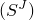 | Tolerance 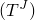 |
| --- | --- | --- |
| Implicit dynamics (["Implicit dynamic analysis using direct integration," Section 6.3.2](pt03ch06s03at07.md)) | Half-increment residual | Half-increment residual tolerance |
| Transient heat transfer analysis (["Uncoupled heat transfer analysis," Section 6.5.2](pt03ch06s05at18.md)) | Temperature increment,  |  |
| Consolidation analysis (["Coupled pore fluid diffusion and stress analysis," Section 6.8.1](pt03ch06s08at26.md)) | Pore pressure increment, 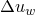 |  |
| Creep and viscoelastic material behavior (["Rate-dependent plasticity: creep and swelling," Section 23.2.4](pt05ch23s02abm20.md)) | 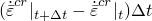 | Creep tolerance |

In any transient analysis where automatic time incrementation is used, some of these tolerances, 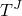, 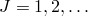, will be active. Corresponding measures of the integration accuracy, 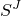, will be calculated for each increment in the step. Abaqus/Standard will use these values to adjust the time incrementation using the criteria described in this section. The smallest time increment required by all criteria is used if more than one accuracy measure is active.

#### Reducing the time increment size

If 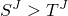 for any control, *J*, that is active in the step, the time increment  is too large to satisfy that time integration accuracy requirement. The increment is, therefore, begun again with a time increment of

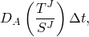

where you can define the value of 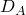. By default,  = 0.85.

| **Input File Usage: ** | ``` [*CONTROLS](../key/key-link.md#usb-kws-hcontrols), PARAMETERS=TIME INCREMENTATION *first data line* , , ,  ``` |
| --- | --- |

| **Abaqus/CAE Usage: ** | Step module: ****Other****General Solution Controls****Edit****: toggle on **Specify**: **Time Incrementation**; click **More** to see additional data tables |
| --- | --- |

#### Increasing the time increment size

If at the current time increment, ,

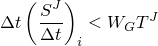

for all *J* in each of  consecutive increments, *i*, and if no cut-back has occurred within those increments because of nonlinearity, the next time increment will be increased to

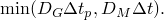

You can define the values of , 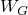, and 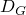. By default,  = 3,  = 0.75, and  = 0.8. 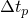 is the proposed new time increment, which is defined as

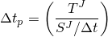

for transient heat transfer and transient mass diffusion problems and which is defined as

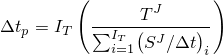

 for other transient problems.

A limit, , is placed on the time increment increase factor. The default value of  depends on the type of analysis:
- 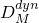 = 1.25 for dynamic analysis
- 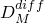 = 2.0 for diffusion-dominated processes: creep, transient heat transfer, coupled temperature-displacement, soils consolidation, and transient mass diffusion
-  = 1.5 for all other cases

You can redefine  for each analysis type.

If the problem is nonlinear, the time increment may be restricted by the rate of convergence of the nonlinear equations. The time incrementation controls used with nonlinear problems are described in ["Convergence criteria for nonlinear problems," Section 7.2.3](pt03ch07s02aus51.md).

| **Input File Usage: ** | ``` [*CONTROLS](../key/key-link.md#usb-kws-hcontrols), PARAMETERS=TIME INCREMENTATION , , , , , , , , ,  , , , , , , ,  , , ,  ``` |
| --- | --- |

| **Abaqus/CAE Usage: ** | Step module: ****Other****General Solution Controls****Edit****: toggle on **Specify**: **Time Incrementation**; click **More** to see additional data tables |
| --- | --- |

### Avoiding small changes to the time increment size during implicit integration procedures

In linear transient problems when Abaqus/Standard uses implicit integration, the system of equations must be reformed and decomposed whenever the time increment changes even though the stiffness matrix does not change. Therefore, to reduce the number of increments at which the system matrix changes, Abaqus/Standard makes use of the factor 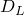, where 

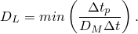

The definition of  results in the following inequality between the proposed and the current time increments: 

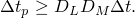

Based on this inequality the time increment is allowed to increase only when its value computed by the criteria described earlier in this section, or computed using the value of `PNEWDT` specified in certain user subroutines ([`UMAT`](../sub/sub-link.md#sub-xsl-umat), for example), is greater than or equal to 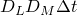. The default value of  is 1.0, but you can redefine it to be a smaller number. Reducing  to a value less than 1.0 allows the time increment to increase by a factor that is smaller than , thereby forcing a time increment change, even if the change is small. Otherwise, the solution continues with the same .

| **Input File Usage: ** | ``` [*CONTROLS](../key/key-link.md#usb-kws-hcontrols), PARAMETERS=TIME INCREMENTATION *first data line* *second data line* , , , ,  ``` |
| --- | --- |

| **Abaqus/CAE Usage: ** | Step module: ****Other****General Solution Controls****Edit****: toggle on **Specify**: **Time Incrementation**; click **More** to see additional data tables |
| --- | --- |


