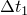

# 9.1.1 Restarting an analysis


**Products: **Abaqus/Standard  Abaqus/Explicit  Abaqus/CFD  Abaqus/CAE  

##### **References**

- ["Output," Section 4.1.1](pt02ch04s01aus38.md)
- [*RESTART](../key/key-link.md#usb-kws-mrestart)
- ["Restarting an analysis," Section 19.6 of the Abaqus/CAE User's Guide](../usi/usi-link.md#usi-ana-restart)

### Overview

When you run an analysis, you can write the model definition and state to the files required for restart. 

Scenarios for using the restart capability include:

**Continuing an interrupted run**: If an analysis is interrupted by a computer malfunction, the Abaqus restart analysis capability allows the analysis to complete as originally defined.

**Continuing with additional steps**: After viewing results from a successful analysis, you may decide to append steps to the load history.

**Changing an analysis**: Sometimes, having viewed the results of the previous analysis, you may want to restart the analysis from an intermediate point and change the remaining load history data in some manner. In addition, you may want to add additional steps to the load history if the previous analysis completed successfully.

["Output," Section 4.1.1](pt02ch04s01aus38.md), describes the process of obtaining results output from an Abaqus/Standard restart file.

### Writing restart files

If you want to be able to restart an analysis, you must request restart output. This output will be written to files that can be used to restart the analysis. If you do not request that restart data be written, restart files will not be created in Abaqus/Standard, while in Abaqus/Explicit and Abaqus/CFD a state file will be created with results at only the beginning and end of each step.

In Abaqus/Standard these files are the restart (*job-name*`.res`; file size limited to 16 gigabytes), analysis database (`.mdl` and `.stt`), part (`.prt`), output database (`.odb`), and linear dynamics and substructure database (`.sim`) files. In Abaqus/Explicit these files are the restart (*job-name*`.res`; file size limited to 16 gigabytes), analysis database (`.abq`, `.mdl`, `.pac`, and `.stt`), part (`.prt`), selected results (`.sel`), and output database (`.odb`) files. In Abaqus/CFD these files are the restart and analysis database (*job-name*`.sim`) and output database (`.odb`) files. These files, collectively referred to as the restart files, allow an analysis to be completed up to a certain point in a particular run and restarted and continued in a subsequent run. The output database file only needs to contain the model data; results data are not required and can be suppressed.

You can control the amount of data written to the restart files, as described below. The amount of data written to the restart file can be changed from step to step if you include the restart request in each step definition.

Restart information is not written during the following linear perturbation steps:
- ["Static stress analysis," Section 6.2.2](pt03ch06s02at01.md) (perturbation)
- ["Eigenvalue buckling prediction," Section 6.2.3](pt03ch06s02at02.md)
- ["Direct-solution steady-state dynamic analysis," Section 6.3.4](pt03ch06s03at09.md)
- ["Complex eigenvalue extraction," Section 6.3.6](pt03ch06s03at11.md)
- ["Transient modal dynamic analysis," Section 6.3.7](pt03ch06s03at12.md)
- ["Mode-based steady-state dynamic analysis," Section 6.3.8](pt03ch06s03at13.md)
- ["Subspace-based steady-state dynamic analysis," Section 6.3.9](pt03ch06s03at14.md)
- ["Response spectrum analysis," Section 6.3.10](pt03ch06s03at15.md)
- ["Random response analysis," Section 6.3.11](pt03ch06s03at16.md)
- ["Eddy current analysis," Section 6.7.5](pt03ch06s07at24.md)

| **Input File Usage: ** | Use the following option to request that restart data be written for an analysis: |
| --- | --- |
|  | ``` [*RESTART](../key/key-link.md#usb-kws-mrestart), WRITE ``` The [*RESTART](../key/key-link.md#usb-kws-mrestart), WRITE option can be used as either model data or history data. |

| **Abaqus/CAE Usage: ** | Step module: ****Output****Restart Requests**** |
| --- | --- |
|  | In Abaqus/CAE restart requests are always associated with a particular step; you cannot define a restart request for the entire analysis. Restart requests are created by default for every step; restart requests for Abaqus/Standard and Abaqus/CFD steps have a default frequency of 0, while restart requests for Abaqus/Explicit steps have a default number of intervals of 1. |

#### Controlling the frequency of output to the restart files

You can specify the frequency at which data will be written to the Abaqus/Standard restart file and the Abaqus/Explicit and Abaqus/CFD state files. The variables to be written cannot be specified; a complete set of data is written each time. Therefore, the restart files can be quite large unless you control the frequency with which restart information is written. If restart information is requested for an Abaqus/Standard analysis at exact time intervals, Abaqus/Standard will obtain a solution each time data are written. In this case if the frequency of output to the restart file is high, the number of increments and, consequently, the computational cost of the analysis may increase considerably.

##### Specifying the frequency of output to the Abaqus/Standard restart file in increments

By default, Abaqus/Standard will write data to the restart file after each increment at which the increment number is exactly divisible by a user-specified frequency value, *N*, and at the end of each step of the analysis (regardless of the increment number at that time). In a direct cyclic or a low-cycle fatigue analysis Abaqus/Standard will write data to the restart file only at the end of a loading cycle; therefore, Abaqus/Standard will write data to the restart file after each iteration (or cycle in a low-cycle fatigue analysis) at which the iteration number (or cycle number in a low-cycle fatigue analysis) is exactly divisible by *N* and at the end of each step of the analysis.

| **Input File Usage: ** | ``` [*RESTART](../key/key-link.md#usb-kws-mrestart), WRITE, FREQUENCY=*N* ``` |
| --- | --- |
|  | By default, *N*=1. |

| **Abaqus/CAE Usage: ** | Step module: ****Output****Restart Requests****: enter *N* in the **Frequency** column for each step |
| --- | --- |
|  | By default, *N*=0 (no restart information is written). |

##### Specifying the frequency of output to the Abaqus/Standard restart file in time intervals

Abaqus/Standard can divide the step into a user-specified number of time intervals, *n*, and write the results at the end of each interval, for a total of *n* points for the step. If *n* is specified, by default data will be written to the results file at the exact times calculated by dividing the step into *n* equal intervals. Alternatively, you can choose to write the information at the increment ending immediately after the time dictated by each interval.

You can specify the frequency of restart output in time intervals only for the procedures listed in [Table 9.1.1--1](pt04ch09s01aus53.md#usb-anl-arestart-stdtimepointprocedures). In addition, this capability is not supported for linear perturbation analyses.

| **Input File Usage: ** | Use the following option to request results at the exact time intervals: |
| --- | --- |
|  | ``` [*RESTART](../key/key-link.md#usb-kws-mrestart), WRITE, NUMBER INTERVAL=*n*, TIME MARKS=YES ``` Use the following option to request results at the increments ending immediately after each time interval: ``` [*RESTART](../key/key-link.md#usb-kws-mrestart), WRITE, NUMBER INTERVAL=*n*, TIME MARKS=NO ``` |

| **Abaqus/CAE Usage: ** | Step module: ****Output****Restart Requests****: enter *n* in the **Intervals** column; toggle on the **Time Marks** column for each step if you want the results written at the exact time intervals |
| --- | --- |

**Table 9.1.1–1** List of Abaqus/Standard procedures that support restart at time intervals.
| Procedure | Time incrementation | Restart at exact time intervals | Restart at approximate time intervals |
| --- | --- | --- | --- |
| ["Static stress analysis," Section 6.2.2](pt03ch06s02at01.md) (except if the Riks method is used) | Automatic |  |  |
| Fixed | --- |  |
| ["Implicit dynamic analysis using direct integration," Section 6.3.2](pt03ch06s03at07.md) | Automatic |  |  |
| Fixed | --- |  |
| ["Uncoupled heat transfer analysis," Section 6.5.2](pt03ch06s05at18.md) (except if you specify that the analysis end when steady state is reached) | Automatic |  |  |
| Fixed | --- |  |
| ["Mass diffusion analysis," Section 6.9.1](pt03ch06s09at28.md) (except if you specify that the analysis end when steady state is reached) | Automatic |  |  |
| Fixed | --- |  |
| ["Coupled pore fluid diffusion and stress analysis," Section 6.8.1](pt03ch06s08at26.md) (except if you specify that the analysis end when steady state is reached) | Automatic |  |  |
| Fixed | --- |  |
| ["Fully coupled thermal-stress analysis," Section 6.5.3](pt03ch06s05at19.md) | Automatic |  |  |
| Fixed | --- |  |
| ["Fully coupled thermal-electrical-structural analysis," Section 6.7.4](pt03ch06s07at23.md) | Automatic |  |  |
| Fixed | --- |  |
| ["Coupled thermal-electrical analysis," Section 6.7.3](pt03ch06s07at22.md) (except if you specify that the analysis end when steady state is reached) | Automatic |  |  |
| Fixed | --- |  |
| ["Steady-state transport analysis," Section 6.4.1](pt03ch06s04at17.md) | Automatic |  |  |
| Fixed | --- |  |
| ["Subspace-based steady-state dynamic analysis," Section 6.3.9](pt03ch06s03at14.md) | Fixed | --- |  |
| ["Quasi-static analysis," Section 6.2.5](pt03ch06s02at04.md) | Automatic |  |  |
| Fixed | --- |  |

##### Time incrementation

 If the output frequency is specified in terms of the number of intervals, Abaqus/Standard will adjust the time increments to ensure that data are written at the exact time points specified. In some cases Abaqus may use a time increment smaller than the minimum time increment allowed in the step in the increment directly before a time point. However, Abaqus will not violate the minimum time increment allowed for consolidation, transient mass diffusion, transient heat transfer, transient couple thermal-electrical, transient coupled temperature-displacement, and transient coupled thermal-electrical-structural analyses. For these procedures if a time increment smaller than the minimum time increment is required, Abaqus will use the minimum time increment allowed in the step and will write restart data at the first increment after the time point.

When the output frequency is specified in terms of the number of intervals, the number of increments necessary to complete the analysis might increase, which might adversely affect performance.

##### Specifying the frequency of output to the Abaqus/Explicit state file

Abaqus/Explicit will divide the step into a user-specified number of time intervals, *n*, and write the results at the beginning of the step and at the end of each interval, for a total of *n*+1 points for the step. By default, the results will be written to the state file at the increment ending immediately after the time dictated by each interval. Alternatively, you can choose to write the results at the exact times calculated by dividing the step into *n* equal intervals. Results are always written at the end of the step, so it is not necessary to request results at the exact time intervals if results are required only at the end of a step.

If a problem precludes the analysis from continuing to completion, such as if an element becomes excessively distorted, Abaqus/Explicit will attempt to save the last completed increment in the state file.

| **Input File Usage: ** | Use the following option to request results at the increments ending immediately after each time interval: |
| --- | --- |
|  | ``` [*RESTART](../key/key-link.md#usb-kws-mrestart), WRITE, NUMBER INTERVAL=*n*, TIME MARKS=NO ``` Use the following option to request results at the exact time intervals: ``` [*RESTART](../key/key-link.md#usb-kws-mrestart), WRITE, NUMBER INTERVAL=*n*, TIME MARKS=YES ``` By default, *n*=1. |

| **Abaqus/CAE Usage: ** | Step module: ****Output****Restart Requests****: enter *n* in the **Intervals** column; toggle on the **Time Marks** column for each step if you want the results written at the exact time intervals |
| --- | --- |
|  | By default, *n*=1. |

##### Specifying the frequency of output to the Abaqus/CFD state file in increments

Abaqus/CFD will write data to the restart file after each increment at which the increment number is exactly divisible by a user-specified frequency value, *N*, and at the end of each step of the analysis (regardless of the increment number at that time). 

| **Input File Usage: ** | ``` [*RESTART](../key/key-link.md#usb-kws-mrestart), WRITE, FREQUENCY=*N* ``` |
| --- | --- |
|  | By default, *N*=1. |

| **Abaqus/CAE Usage: ** | Step module: ****Output****Restart Requests****: enter *N* in the **Frequency** column for each step |
| --- | --- |
|  | By default, *N*=0 (no restart information is written). |

##### Specifying the frequency of output to the Abaqus/CFD state file in time intervals

Abaqus/CFD will divide the step into a user-specified number of time intervals, *n*, and write the results at the beginning of the step and at the end of each interval, for a total of *n*+1 points for the step. By default, the results will be written to the state file at the increment ending immediately after the time dictated by each interval. 

If a problem precludes the analysis from continuing to completion, such as if the solution does not converge, Abaqus/CFD will attempt to save the last completed increment in the state file.

| **Input File Usage: ** | ``` [*RESTART](../key/key-link.md#usb-kws-mrestart), WRITE, NUMBER INTERVAL=*n* ``` |
| --- | --- |

| **Abaqus/CAE Usage: ** | Step module: ****Output****Restart Requests****: enter *n* in the **Intervals** column |
| --- | --- |
|  | By default, *n*=0. |

##### Synchronizing restart information written in a co-simulation

Restart output must be synchronized between co-simulation analyses for a co-simulation restart to be successful. To achieve this synchronization, it is recommended that you request that restart data are written at a specified number of time intervals, *n*. In this case Abaqus/Standard, Abaqus/Explicit, and Abaqus/CFD will write restart information at the co-simulation target time immediately after the time dictated by each interval. If you specify the frequency of output for restart data in increments, it is very difficult to synchronize the writing of restart information, and the restart analysis may start from two different time points, possibly leading to an imbalance. 

| **Input File Usage: ** | Use the following option to synchronize restart information written in a co-simulation: |
| --- | --- |
|  | ``` [*RESTART](../key/key-link.md#usb-kws-mrestart), WRITE, NUMBER INTERVAL=*n* ``` When using the NUMBER INTERVAL parameter for a co-simulation, the TIME MARKS parameter on the [*RESTART](../key/key-link.md#usb-kws-mrestart) option is always set to NO. |

| **Abaqus/CAE Usage: ** | Step module: ****Output****Restart Requests****: enter *n* in the **Intervals** column |
| --- | --- |

#### Controlling the precision of output to the Abaqus/Explicit state file

  By default, Abaqus/Explicit writes to the state file in double precision when the analysis is run in double precision. Alternatively, you can choose to write data to the state file in single precision if you want to reduce the size of the state file. This option may cause noisy results between step boundaries or for the first step of a restart analysis. If Abaqus/Explicit is run in single precision, this control parameter is ignored and single precision is always used.

| **Input File Usage: ** | ``` [*RESTART](../key/key-link.md#usb-kws-mrestart), WRITE, SINGLE ``` |
| --- | --- |

| **Abaqus/CAE Usage: ** | Single precision state file output is not supported by Abaqus/CAE. |
| --- | --- |

#### Overlaying results in the restart files

For an Abaqus/Standard or Abaqus/Explicit analysis, you can specify that only one increment (or one iteration in the case of a direct cyclic analysis) per step should be retained in the Abaqus/Standard restart file or Abaqus/Explicit state file, thus minimizing the size of the files. As the data are written, they overlay the data from the previous increment (or iteration), if any, written for the same step. You can specify whether or not the data should be overlaid for each step individually. Since in Abaqus/Explicit the results are written by default only at the end of the step, it is recommended to overlay the data in conjunction with specifying a number of time intervals at which data are written; in this way the data in the restart file are advanced as dictated by the number of intervals used.

To protect you from losing data if your system crashes, when Abaqus/Standard writes a frame from a given increment, it does not strictly overwrite the frame from the last saved increment. Instead, it always keeps a reserve frame and only frees a given saved frame for overwriting when the next frame is secured on the file. This reserve frame is not deleted unless the space is required for later increments. This process produces a bonus frame in the last step of an analysis if overlaying is occurring in that step and if the analysis completes successfully; users will observe that the penultimate restart frame is also retained for the last step, even though overlay is being used.

The advantage of overlaying the restart data is that it minimizes the space required to store the restart files.

| **Input File Usage: ** | Use the following option in Abaqus/Standard: |
| --- | --- |
|  | ``` [*RESTART](../key/key-link.md#usb-kws-mrestart), WRITE, OVERLAY ``` Use the following option in Abaqus/Explicit: ``` [*RESTART](../key/key-link.md#usb-kws-mrestart), WRITE, OVERLAY, NUMBER INTERVAL=*n* ``` |

| **Abaqus/CAE Usage: ** | Step module: ****Output****Restart Requests****: click to check the **Overlay** column for each step |
| --- | --- |

### Restarting an analysis

You restart (continue) an analysis by specifying that the restart or state, analysis database, and part files created by the original analysis be read into the new analysis. The restart files must be saved upon completion of the first job. In Abaqus/Explicit the package (`.pac`) file and the selected results (`.sel`) file are also used for restarting an analysis and must be saved upon completion of the first job. Since restart files can be very large, sufficient disk space must be provided (in Abaqus/Standard the analysis input file processor estimates the space that is required for the restart file).

You can specify the point at which the analysis is continued in the new run, as discussed below.

An analysis cannot be restarted from the linear perturbation steps listed in ["Writing restart files](pt04ch09s01aus53.md#usb-anl-arestart-writing).”

In addition, if an Abaqus/Standard or Abaqus/Explicit analysis is terminated abruptly by an operating system command or due to a power failure, it is unlikely that the job can be recovered or restarted. In this situation, files that are open during the analysis process are not closed properly, which may result in loss of data and incomplete files.

| **Input File Usage: ** | Use the following option to restart an analysis: |
| --- | --- |
|  | ``` [*RESTART](../key/key-link.md#usb-kws-mrestart), READ ``` When the READ parameter is included, the [*RESTART](../key/key-link.md#usb-kws-mrestart) option must appear as model data. It is normally the first option in the input file after the [*HEADING](../key/key-link.md#usb-kws-mheading) option. |

| **Abaqus/CAE Usage: ** | Job module: job editor: toggle on **Restart** as the **Job Type** |
| --- | --- |

#### Identifying the analysis to be restarted

In an Abaqus/Standard restart analysis you must specify the name of the restart file that contains the specified step and increment, iteration (for a direct cyclic analysis), or cycle (for a low-cycle fatigue analysis). In an Abaqus/Explicit or an Abaqus/CFD restart analysis you must specify the name of the state file that contains the specified step and interval.

Abaqus issues an error message if the step and increment, iteration, cycle, or interval number at which restart is requested do not exist in the specified restart or state file.

| **Input File Usage: ** | Enter the following input on the command line: |
| --- | --- |
|  | **abaqus** **job**=*job-name* **oldjob**=`*oldjob-name*` |

| **Abaqus/CAE Usage: ** | Any module: ****Model****Edit Attributes*****model_name*****: **Restart**: toggle on **Read data from job** and enter the *oldjob-name* |
| --- | --- |

#### Specifying the restart point

You can specify the point (step and increment, iteration, cycle, or interval) in the previous analysis from which to restart. Truncating a step in the previous analysis when you restart is discussed below.

##### Specifying the restart point for an Abaqus/Standard analysis (except when restarting from a direct cyclic or a low-cycle fatigue analysis)

An Abaqus/Standard analysis restarted from any analysis other than a direct cyclic or a low-cycle fatigue analysis will continue the analysis immediately after the user-specified step and increment. If you do not specify a step or increment, the analysis will restart at the last available step and increment found in the restart file.

| **Input File Usage: ** | ``` [*RESTART](../key/key-link.md#usb-kws-mrestart), READ, STEP=*step*, INC=*increment* ``` |
| --- | --- |

| **Abaqus/CAE Usage: ** | Any module: ****Model****Edit Attributes*****model_name*****: **Restart**: toggle on **Read data from job**, **Step name:** *step*, toggle on **Restart from increment, interval, iteration, or cycle**, and enter the *increment* |
| --- | --- |

##### Specifying the restart point for an Abaqus/Standard analysis restarted from a direct cyclic analysis

An Abaqus/Standard analysis restarted from a previous direct cyclic analysis can be restarted only from the end of a loading cycle. In this case you should specify the step and iteration number at which the new analysis will be resumed.

In a direct cyclic analysis that has not reached a stabilized cycle upon restart, you can increase the number of iterations or Fourier terms, thus allowing continuation of an analysis (see ["Direct cyclic analysis," Section 6.2.6](pt03ch06s02at05.md)).

| **Input File Usage: ** | ``` [*RESTART](../key/key-link.md#usb-kws-mrestart), READ, STEP=*step*, ITERATION=*iteration* ``` |
| --- | --- |

| **Abaqus/CAE Usage: ** | Any module: ****Model****Edit Attributes*****model_name*****: **Restart**: toggle on **Read data from job**, **Step name:** *step*, toggle on **Restart from increment, interval, iteration, or cycle**, and enter the *iteration* |
| --- | --- |

##### Specifying the restart point for an Abaqus/Standard analysis restarted from a low-cycle fatigue analysis

An Abaqus/Standard analysis restarted from a previous low-cycle fatigue analysis can be restarted only from the end of a loading cycle. In this case you should specify the step and cycle number at which the new analysis will be resumed.

| **Input File Usage: ** | ``` [*RESTART](../key/key-link.md#usb-kws-mrestart), READ, STEP=*step*, CYCLE=*cycle* ``` |
| --- | --- |

| **Abaqus/CAE Usage: ** | Any module: ****Model****Edit Attributes*****model_name*****: **Restart**: toggle on **Read data from job**, **Step name:** *step*, toggle on **Restart from increment, interval, iteration, or cycle**, and enter the *cycle* |
| --- | --- |

##### Specifying the restart point for an Abaqus/Explicit analysis

An Abaqus/Explicit restart analysis will continue the analysis immediately after the user-specified step and interval. You must specify the step from which an Abaqus/Explicit restart analysis will continue. If you do not specify an interval from which to restart or that the current step should be terminated at a specified interval, the analysis is restarted from the last interval available in the state file for the specified step.

| **Input File Usage: ** | ``` [*RESTART](../key/key-link.md#usb-kws-mrestart), READ, STEP=*step*, INTERVAL=*interval* ``` |
| --- | --- |

| **Abaqus/CAE Usage: ** | Any module: ****Model****Edit Attributes*****model_name*****: **Restart**: toggle on **Read data from job**, **Step name:** *step*, toggle on **Restart from increment, interval, iteration, or cycle**, and enter the *interval* |
| --- | --- |

##### Specifying the restart point for an Abaqus/CFD analysis

An Abaqus/CFD restart analysis will continue the analysis immediately after the user-specified step and increment. You must specify the step and increment from which an Abaqus/CFD restart analysis will continue. If you do not specify a step or increment, an error message will be issued.

| **Input File Usage: ** | ``` [*RESTART](../key/key-link.md#usb-kws-mrestart), READ, STEP=*step*, INC=*increment* ``` |
| --- | --- |

| **Abaqus/CAE Usage: ** | Any module: ****Model****Edit Attributes*****model_name*****: **Restart**: toggle on **Read data from job**, **Step name:** *step*, toggle on **Restart from increment, interval, iteration, or cycle**, and enter the *increment* |
| --- | --- |

#### Continuing an analysis without changes

To continue an analysis without changes, only the steps subsequent to the step at which restart is being made should be defined in the restart analysis. All other information has been saved to the restart files. This feature cannot be used for an Abaqus analysis that uses the co-simulation technique and cannot be used for an Abaqus/CFD analysis.

##### Continuing an Abaqus/Standard analysis without changes

In Abaqus/Standard, in cases where restart is being performed simply to continue a long step (which might have been terminated because the time limit for the job was exceeded, for example), the data for the restart run may simply consist of the request to read restart data from another analysis.

| **Input File Usage: ** | ``` [*RESTART](../key/key-link.md#usb-kws-mrestart), READ ``` |
| --- | --- |

| **Abaqus/CAE Usage: ** | Any module: ****Model****Edit Attributes*****model_name*****: **Restart**: toggle on **Read data from job** |
| --- | --- |

##### Continuing an Abaqus/Explicit analysis without changes

In Abaqus/Explicit, in cases where restart is being performed simply to continue a long step (which might have been terminated because a CPU time limit was exceeded, for example), do not use a restart analysis; instead, use a recover analysis. In this case no data are needed (unless user subroutines are being used).

| **Input File Usage: ** | Enter the following input on the command line: |
| --- | --- |
|  | **abaqus** **job**=*job-name* **recover** |

| **Abaqus/CAE Usage: ** | Job module: job editor: toggle on **Recover (Explicit)** as the **Job Type** |
| --- | --- |

#### Truncating a step

You can truncate an analysis step prior to its completion when you restart the analysis. For example, by default, if the previous analysis is an Abaqus/Standard procedure and you specify that the restart point is Step *p*, the restart analysis will restart from the last saved increment of Step *p* and continue the step to completion. However, if you specify that the restart point is increment *n* of Step *p* and that the step should be terminated before restart, the restart analysis will restart from increment *n* of Step *p*, end Step *p* at that point, and continue with newly defined steps. In this case the step from which the analysis is being restarted will be truncated at the time of restart, regardless of the step end time that had been given in the previous analysis. Thus, the step is considered to be completed even though all of the loading may not have been applied. Continuation of the analysis will be defined by history data provided in the restart run.

When you truncate an analysis step in an Abaqus/Explicit restart analysis, you must specify the interval after which the analysis should be restarted. When you truncate an analysis step in an Abaqus/CFD restart analysis, you must specify the increment after which the analysis should be restarted.

If the step from which the restart is being made completed normally, you can truncate the step to restart within the step so that you can request additional output, write to the restart file with a higher frequency, etc. In Abaqus/Explicit it may be necessary to truncate an analysis step when an unforeseen event occurs within a step; for example, if contact surface definitions require modification due to unforeseen displacements. If the step from which the restart is being made completed normally and the restart is being made from the last increment, iteration, or interval, truncating the analysis step will have no effect.

If the restart is being made from a job that was truncated by the operating system (for example, because of insufficient disk space, run-time limit exceeded, etc.), you will usually not choose to truncate the analysis step, so that the old step will first be completed before a new step—if any exists—is started. If restart is being made from the end of a step that terminated prematurely inside Abaqus (for example, because it ran out of increments or it failed to converge), you must truncate the step and include a new step definition. If you do not truncate the step, Abaqus will try to continue the old step upon restart and will terminate the analysis in the same manner as before.

| **Input File Usage: ** | Use the following option in Abaqus/Standard to restart from any analysis step other than a direct cyclic step: |
| --- | --- |
|  | ``` [*RESTART](../key/key-link.md#usb-kws-mrestart), READ, STEP=*p*, INC=*n*, END STEP ``` Use the following option in Abaqus/Standard to restart from a direct cyclic analysis step: ``` [*RESTART](../key/key-link.md#usb-kws-mrestart), READ, STEP=*p*, ITERATION=*n*, END STEP ``` Use the following option in Abaqus/Standard to restart from a low-cycle fatigue analysis step: ``` [*RESTART](../key/key-link.md#usb-kws-mrestart), READ, STEP=*p*, CYCLE=*n*, END STEP ``` Use the following option in Abaqus/Explicit: ``` [*RESTART](../key/key-link.md#usb-kws-mrestart), READ, STEP=*p*, INTERVAL=*n*, END STEP ``` |

| **Abaqus/CAE Usage: ** | Any module: ****Model****Edit Attributes*****model_name*****: **Restart**: toggle on **Read data from job**; **Step name:** *step*; toggle on **Restart from increment, interval, iteration, or cycle**, enter the *increment*, *interval*, *iteration*, or *cycle*; and toggle on **and terminate the step at this point** |
| --- | --- |

##### Amplitude references

Care should be taken if loads and boundary conditions refer to amplitude curves (["Amplitude curves," Section 34.1.2](pt07ch34s01aus115.md)). If the amplitude is given in terms of total time, the loads and boundary conditions will continue to be applied according to the amplitude definition. However, if the amplitude is given in terms of step time (default), the loads and boundary conditions will be held constant at their values at the time the step is terminated.

Temperatures, field variables, and mass flow rates applied in the old step will remain in the new step if they are not redefined. If an amplitude curve was not specified, these quantities will continue to be applied according to the default amplitude for the procedure.

##### Automatic stabilization in Abaqus/Standard

In Abaqus/Standard care should be exercised when automatic stabilization is active at the point at which a step is truncated. This may happen either in the middle of quasi-static procedures using automatic stabilization (see ["Solving nonlinear problems," Section 7.1.1](pt03ch07s01aus49.md)) or during contact analyses using automatic viscous damping (see ["Adjusting contact controls in Abaqus/Standard," Section 36.3.6](pt09ch36s03aus150.md)). In such cases viscous forces may be present, which will not be carried over to the subsequent step, therefore causing convergence difficulties.

In the case of quasi-static procedures using automatic stabilization it is recommended that the stabilization continue to be enforced during the following step and that you specify the damping factor directly, using the last value printed out by Abaqus/Standard in the message file. In the case of automatic viscous damping in a contact pair when contact has not yet been fully established, it is recommended that the damping be applied again, although there is no guarantee that the amount of damping applied will be the same as in the original step.

##### Choosing the initial time increment for an Abaqus/Standard restart analysis

In Abaqus/Standard take care in choosing the time period and initial time increment for the new step if the previous step was truncated. In transient analyses the initial time increment for the new step should be similar to the time increment that was used at the point of restart in the old step. In quasi-static analyses choose the initial time increment of the new step so that the increments in loads or prescribed boundary conditions are similar to those at the point of restart in the old step.

In a nonlinear analysis the increment of load applied in the first increment of the restart run should be similar to that applied in the last converged increment of the previous run. Let


= the load to be applied in the first increment of the restart run,


= the remaining load to be applied in the restart run,


= the initial time increment for the restart run, and


= the total step time for the first step of the restart run.

The following equation can then be used to determine the initial time increment for the restart run: 


##### Example

Suppose an Abaqus/Standard job stopped running because it reached the maximum number of increments specified for the step. The original input file was as follows: 

```
[*HEADING](../key/key-link.md#usb-kws-mheading)
 …
[*STEP](../key/key-link.md#usb-kws-hstep), INC=4
[*STATIC](../key/key-link.md#usb-kws-hstatic), DIRECT
 0.1, 1.0
[*CLOAD](../key/key-link.md#usb-kws-hcload)
 1, 2, 20.0
[*RESTART](../key/key-link.md#usb-kws-mrestart), WRITE, FREQUENCY=2
[*END STEP](../key/key-link.md#usb-kws-hendstep)
```

This run ended at Step 1, increment 4 with a load of 8.0 applied. The following input file could be used to restart this job and to complete the loading: 

```
[*HEADING](../key/key-link.md#usb-kws-mheading)
[*RESTART](../key/key-link.md#usb-kws-mrestart), READ, STEP=1, INC=4, END STEP
[*STEP](../key/key-link.md#usb-kws-hstep), INC=120
[*STATIC](../key/key-link.md#usb-kws-hstatic), DIRECT
 0.1, 0.6
[*CLOAD](../key/key-link.md#usb-kws-hcload)
 1, 2, 20.0
[*END STEP](../key/key-link.md#usb-kws-hendstep)
```

Notice that the concentrated load applied is the same as in the previous step.

In this example assume that a load increment of 2.0 was applied in the last converged increment of the previous run. Therefore, the initial time increment for the restart run is chosen such that the load increment applied during the first increment is also 2.0. The remaining load to be applied in the restart run is 12.0 (20.0 total  8.0 applied in the previous run). Substitution into the equation for the initial time increment yields  = /6. The step time for the first step of the restarted job, , is chosen to be 0.6 so that the total accumulated time is 1.0 when the applied load is 20.0 (at the end of the step). Thus, the initial time increment for the restart run, , is set equal to 0.1.

#### Supplying additional data in the restart analysis

It is possible to define steps subsequent to the step at which restart is being made. It is also possible to supply new amplitude definitions, new surfaces, new node sets, and new element sets during the restart analysis. Existing sets cannot be modified.

In Abaqus/Standard additional surfaces defined in the model part of a restart analysis have the restriction that they can be referenced only from surface-based loading definitions (see ["Loads," Section 34.4](pt07ch34s04.md)) or output requests for user-defined surface sections (see ["Output to the data and results files," Section 4.1.2](pt02ch04s01aus39.md)).

##### Example

For example, suppose a one-step Abaqus/Explicit job stopped prior to completion because a CPU time limit was exceeded and you have decided that a second step should be added with new boundary condition definitions. The following input file could be used to restart this job, complete the remaining part of Step 1, and complete Step 2: 

```
[*HEADING](../key/key-link.md#usb-kws-mheading)
[*RESTART](../key/key-link.md#usb-kws-mrestart), READ, STEP=1
**
** This defines Step 2
**
[*STEP](../key/key-link.md#usb-kws-hstep)
[*DYNAMIC](../key/key-link.md#usb-kws-hdynamic), EXPLICIT
 , .003
[*BOUNDARY](../key/key-link.md#usb-kws-hboundary), OP=NEW
 …
[*END STEP](../key/key-link.md#usb-kws-hendstep)
```

#### Continuation of optional history data in restart analyses

The rules governing the continuation of optional analysis history data—loading, boundary conditions, output controls, and auxiliary controls (see ["Defining a model in Abaqus," Section 1.3.1](pt01ch01s03aus03.md))—are the same for the steps defined in the restart analysis and the original analysis. For a discussion of the rules governing the continuation of optional history data, see ["Defining an analysis," Section 6.1.2](pt03ch06s01abo05.md).

#### Prescribing predefined fields in the restart analysis

It is possible to prescribe predefined fields (see ["Predefined fields," Section 34.6.1](pt07ch34s06aus128.md)) in the restart analysis.

To specify predefined temperatures or field variables in an Abaqus/Standard restart analysis, the corresponding predefined field must have been specified in the original analysis as initial temperatures or field variables (["Initial conditions in Abaqus/Standard and Abaqus/Explicit," Section 34.2.1](pt07ch34s02aus116.md)) or as predefined temperatures or field variables (["Predefined fields," Section 34.6.1](pt07ch34s06aus128.md)).

#### Restarting with user subroutines

User subroutines are not written to the Abaqus/Standard restart file or to the Abaqus/Explicit state file. Therefore, if the original analysis contained any user subroutines, these subroutines must be included again in the restart run or when recovering additional results output from restart data (see ["Recovering additional results output from restart data in Abaqus/Standard" in "Output," Section 4.1.1](pt02ch04s01aus38.md#usb-out-ooutput-postoutput)). These subroutines can be modified on restart; however, modifications should be made with caution because they may invalidate the solution from which the restart is being made.

### Simultaneously reading and writing a restart file

You can continue a previous analysis as a restart analysis and write the results from the restart analysis to a new restart file or state file. For example, if the previous analysis is an Abaqus/Explicit procedure and in the current analysis you specify that the restart point is Step *p* and the restart output frequency is *n*, the analysis will be restarted from the last saved interval of Step *p* and restart states will be written in subsequent steps based on the new value of *n*.

To discontinue the writing of a restart file in Abaqus/Standard when you are restarting a previous analysis, specify a restart output frequency of 0; if you do not specify a frequency, the file will continue to be written at the frequency defined for the previous analysis.

#### The new restart file

Restart files can be very large for large models or for jobs involving many restart increments (unless you choose to overlay the restart data—see ["Overlaying results in the restart files](pt04ch09s01aus53.md#usb-anl-arestart-overlay)”). Therefore, the previous restart file is not copied to the beginning of the new restart file when a job is restarted: only the data at restart increments requested in the current run are saved to the new restart file. However, if an eigenfrequency extraction step (["Natural frequency extraction," Section 6.3.5](pt03ch06s03at10.md)) is restarted and additional eigenvalues are requested, the new restart file will contain those eigenvalues that converged during the first run as well as the additional eigenvalues.

#### Example: Abaqus/Standard

Suppose an Abaqus/Standard job stopped running because it ran out of disk space. The last complete information for an increment in the restart file is from Step 2, increment 4. The following two-line input file could be used to restart this job and continue writing the restart file: 

```
[*HEADING](../key/key-link.md#usb-kws-mheading)
[*RESTART](../key/key-link.md#usb-kws-mrestart), READ, STEP=2, INC=4, WRITE
```

#### Example: Abaqus/Explicit

Suppose you stopped an Abaqus/Explicit job because too much output was being generated. The last information in the state file is from Step 2, Interval 4 at a time of .004. Step 2 has a time period of .010 and restart results were requested at 10 intervals. The following input file could be used to restart this job and redefine the remainder of the step with reduced output requests: 

```
[*HEADING](../key/key-link.md#usb-kws-mheading)
[*RESTART](../key/key-link.md#usb-kws-mrestart), READ, END STEP, STEP=2, INTERVAL=4
[*STEP](../key/key-link.md#usb-kws-hstep)
[*DYNAMIC](../key/key-link.md#usb-kws-hdynamic), EXPLICIT
 , .006
[*RESTART](../key/key-link.md#usb-kws-mrestart), WRITE, NUMBER INTERVAL=2
[*END STEP](../key/key-link.md#usb-kws-hendstep)
```

### Continuation of output upon restart

When you restart an analysis, Abaqus creates a new output database file (*job-name*`.odb`) and a new results file (*job-name*`.fil`; this file is not created in Abaqus/CFD) and writes output data to those files according to the criteria described below.

#### Output database (`.odb`) files

The Abaqus output database file (*job-name*`.odb`) contains results that can be used for postprocessing in Abaqus/CAE. By default, the output database file is not made continuous across restarts; Abaqus creates a new output database file each time a job is run. You can combine *X–Y* data extracted from multiple output database files in the Visualization module of Abaqus/CAE. Alternatively, you can also join field and history results from an original analysis and a restart analysis by running the **abaqus** **restartjoin** execution procedure. For more information, see ["Joining output database (`.odb`) files from restarted analyses," Section 3.2.21](pt01ch03s02abx21.md).

#### Results (`.fil`) files

The Abaqus results file created in Abaqus/Standard and Abaqus/Explicit (*job-name*`.fil`) contains user-specified results that can be used for postprocessing in external postprocessing packages. In Abaqus/Explicit results are also written to the selected results file (*job-name*`.sel`), which is then converted to the results file for postprocessing. See ["Output," Section 4.1.1](pt02ch04s01aus38.md), for details.

Upon restart Abaqus/Standard will copy the information from the old results file into the results file for the new job up to the restart point and begin writing the new results to the new file following that point. Abaqus/Explicit will copy the information from the old selected results file into the selected results file for the new job up to the restart point and begin writing the new results to the new file following that point.

If the old results file is not provided, Abaqus/Standard will continue the analysis, writing the results of the restart analysis only to the new results file. Therefore, you will have segments of the analysis results in different files, which should be avoided in most cases since postprocessing programs assume that the results are in a single continuous file. You can merge such segmented results files, if necessary, by using the **abaqus** **append** execution procedure (["Joining results (`.fil`) files," Section 3.2.14](pt01ch03s02abx14.md)).

### Restart compatibility

A restart analysis in Abaqus/Standard can use the restart files generated from the same or any previous maintenance delivery of the same general release. For example, if the original analysis is executed with the Abaqus 6.14-3 maintenance delivery, all subsequent Abaqus 6.14 maintenance deliveries can be used to launch the restart analysis. Restart is not compatible between general releases (for example, between Abaqus 6.13 and Abaqus 6.14).

In Abaqus/Explicit and Abaqus/CFD the original analysis and the restart analysis must use precisely the same release. For example, if the original analysis is executed with the Abaqus 6.14-3 maintenance delivery, only this exact release can be used to launch the restart analysis.

A restart analysis in Abaqus and a recover analysis in Abaqus/Explicit must be run on a computer that is binary compatible with the computer used to generate the restart files.


