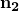

# 9.2.1 Transferring results between Abaqus analyses: overview


**Products: **Abaqus/Standard  Abaqus/Explicit  Abaqus/CAE  

##### **References**

- ["Transferring results between Abaqus/Explicit and Abaqus/Standard," Section 9.2.2](pt04ch09s02aus55.md)
- ["Transferring results from one Abaqus/Standard analysis to another," Section 9.2.3](pt04ch09s02aus56.md)
- ["Transferring results from one Abaqus/Explicit analysis to another," Section 9.2.4](pt04ch09s02aus57.md)
- [*IMPORT](../key/key-link.md#usb-kws-mimport)
- [*IMPORT ELSET](../key/key-link.md#usb-kws-mimportelset)
- [*IMPORT NSET](../key/key-link.md#usb-kws-mimportnset)
- [*IMPORT CONTROLS](../key/key-link.md#usb-kws-mimportcontrols)
- [*INSTANCE](../key/key-link.md#usb-kws-minstance)
- ["Transferring results between Abaqus analyses," Section 16.6 of the Abaqus/CAE User's Guide](../usi/usi-link.md#usi-lbi-import)

### Overview

Abaqus provides the capability to import a deformed mesh and its associated material state from Abaqus/Standard into Abaqus/Explicit and vice versa. This capability is particularly useful in manufacturing problems; for example, the entire sheet metal forming process (which requires an initial preloading, forming, and subsequent springback) can be analyzed. In this case the initial preloading can be simulated with Abaqus/Standard using a static procedure and the subsequent forming process can be simulated with Abaqus/Explicit. Finally, the springback analysis can be performed with Abaqus/Standard.

Abaqus also provides the capability to transfer desired results and model information from an Abaqus/Standard analysis to a new Abaqus/Standard analysis or from an Abaqus/Explicit analysis to a new Abaqus/Explicit analysis, where additional model definitions may be specified before the analysis is continued. For example, during an assembly process an analyst may first be interested in the local behavior of a particular component but later is concerned with the behavior of the assembled product. In this case the local behavior can first be analyzed in an Abaqus/Standard or Abaqus/Explicit analysis. Subsequently, the model information and results from this analysis can be transferred to a second Abaqus/Standard or Abaqus/Explicit analysis, where additional model definitions for the other components can be specified, and the behavior of the entire product can then be analyzed.

For this capability to work, the same release of Abaqus/Explicit and Abaqus/Standard must be run on computers that are binary compatible. In addition, transfer of model and results can only be requested from one previous analysis; transfer from multiple analyses is not supported.

### Saving the analysis results

The restart files from the original analysis contain the analysis results that are transferred from Abaqus/Standard or Abaqus/Explicit. Obtaining restart files is described in more detail in ["Writing restart files" in "Restarting an analysis," Section 9.1.1](pt04ch09s01aus53.md#usb-anl-arestart-writing); brief summaries are provided below. By default, Abaqus/Standard does not write any restart information and Abaqus/Explicit writes results at the beginning and end of each step.

#### Saving results from Abaqus/Standard

If the results are to be imported from an Abaqus/Standard analysis, the results from the original Abaqus/Standard job must be written to the restart (`.res`), analysis database (`.mdl` and `.stt`), part (`.prt`), and output database (`.odb`) files.

You can specify the increments at which restart information will be written. Restart information is always written at the end of a step in addition to the requested increments whenever you request restart data in Abaqus/Standard.

| **Input File Usage: ** | ``` [*RESTART](../key/key-link.md#usb-kws-mrestart), WRITE, FREQUENCY=*n* ``` |
| --- | --- |

| **Abaqus/CAE Usage: ** | Step module: ****Output****Restart Requests****: enter *n* in the **Frequency** column for each step |
| --- | --- |

#### Saving results from Abaqus/Explicit

If the results are to be imported from an Abaqus/Explicit analysis, the results from the original Abaqus/Explicit job must be written to the state (`.abq`) file at the time when transfer of the state of the deformed body is required. The state (`.abq`), restart (`.res`), analysis database (`.stt`), package (`.pac`), part (`.prt`), and output database (`.odb`) files will be used for importing the results from Abaqus/Explicit.

You can specify whether the results are to be written at the exact time dictated by the specified time interval, *n*, during a step of an Abaqus/Explicit analysis or at the increment ending after the time dictated by the specified time interval. Results are always written at the end of a step, so it is not necessary to request results at the exact time intervals if results will be read only from the end of a step.

| **Input File Usage: ** | Use the following option to request results at the increments ending immediately after each time interval: |
| --- | --- |
|  | ``` [*RESTART](../key/key-link.md#usb-kws-mrestart), WRITE, NUMBER INTERVAL=*n*, TIME MARKS=NO ``` Use the following option to request results at the exact time intervals: ``` [*RESTART](../key/key-link.md#usb-kws-mrestart), WRITE, NUMBER INTERVAL=*n*, TIME MARKS=YES ``` |

| **Abaqus/CAE Usage: ** | Step module: ****Output****Restart Requests****: enter *n* in the **Number Interval** column; click to check the **Time Marks** column for each step if you want the results written at the exact time intervals |
| --- | --- |

### Specifying the transfer of model data and results

The import capability is used to transfer model data and results from one analysis to another. The following sections describe how to specify the import request. You can import element sets from models that are not defined as assemblies of part instances, or you can import part instances from models that are defined as assemblies of part instances. In Abaqus/CAE you can import model data and results only from models that are defined as assemblies of part instances.

Although elements of different types, (such as C3D4, C3D6, C3D8R, etc.) can be specified in the same element set used in a section definition, the maximum number of element types is limited to three if the model is to be used in an import analysis.

#### Specifying the transfer of model data and results for models that are not defined as assemblies of part instances

You can import element sets from a previous analysis to specify the transfer of model data and results for models that are not defined as assemblies of part instances. This import capability is illustrated in ["Springback of two-dimensional draw bending," Section 1.5.1 of the Abaqus Example Problems Guide](../exa/exa-link.md#exa-sta-springback), and ["Axisymmetric forming of a circular cup," Section 1.3.7 of the Abaqus Example Problems Guide](../exa/exa-link.md#exa-sta-axiform).

Each element set to be imported must have been defined in the original analysis. You can import any element set, including nested element sets and those with overlapping elements. An imported element set can also be a subset of another imported element set. The elements in these sets as well as the element set definitions are imported. Even though an element may be included in multiple imported elements sets, each element is imported only once in the import analysis. You cannot use element sets that are internal to the original analysis.

| **Input File Usage: ** | Use the following option to import element sets from a previous analysis: |
| --- | --- |
|  | ``` [*IMPORT](../key/key-link.md#usb-kws-mimport) *list of element sets that are to be imported* ``` For example, the following input imports the element set definitions for BLANK1 and BLANK2 in addition to the elements and element set definition for BLANK: Original analysis ``` [*SHELL SECTION](../key/key-link.md#usb-kws-mshellsection), MATERIAL=STEEL1, ELSET=BLANK1 .00082, 5 [*SHELL SECTION](../key/key-link.md#usb-kws-mshellsection), MATERIAL=STEEL2, ELSET=BLANK2 .00082, 5 [*ELSET](../key/key-link.md#usb-kws-melset), ELSET=BLANK BLANK1, BLANK2 ``` Import analysis ``` [*IMPORT](../key/key-link.md#usb-kws-mimport) BLANK ``` To prevent any ambiguity regarding element and node definitions, the [*IMPORT](../key/key-link.md#usb-kws-mimport) option must be specified before any options that define additional model data in the input file. In addition, the [*IMPORT](../key/key-link.md#usb-kws-mimport) option can be specified only once. |

| **Abaqus/CAE Usage: ** | In Abaqus/CAE you can import model data and results only from models that are defined as assemblies of part instances. |
| --- | --- |

#### Specifying the transfer of model data and results for models that are defined as assemblies of part instances

You can import part instances from a previous analysis to specify the transfer of model data and results for models that are defined as assemblies of part instances. If you import more than one part instance, the part instances must be from the same output database (`.odb`) file and all import parameters must be the same for each imported part instance. Each instance name that you specify must be the same as the instance name in the original analysis. Only sets that are defined within the imported instance will be imported. Sets defined at the assembly level must be redefined in the import analysis. New set definitions and surface definitions can be added upon import. You cannot assign new sections, material orientations, normals, or beam orientations to the imported part instance.

| **Input File Usage: ** | Use the following options to import a part instance from a previous analysis: |
| --- | --- |
|  | ``` [*INSTANCE](../key/key-link.md#usb-kws-minstance), INSTANCE=*instance-name* * Additional set and surface definitions (optional)* [*IMPORT](../key/key-link.md#usb-kws-mimport) [*END INSTANCE](../key/key-link.md#usb-kws-mendinstance) ``` |

| **Abaqus/CAE Usage: ** | In Abaqus/CAE you can import model data and results only from models that are defined as assemblies of part instances. |
| --- | --- |
|  | Load module: **Create Predefined Field**: **Step: Initial**: choose **Other** for the **Category** and **Initial State** for the **Types for Selected Step**: select the instances to which the initial state should be assigned |

#### Identifying the analysis from which the data will be obtained

You must specify the name of the job from which the model and results data will be obtained. 

| **Input File Usage: ** | For all models you can enter the following input on the command line: |
| --- | --- |
|  | ``` `abaqus` `job`=*job-name* `oldjob`=`*oldjob-name*` ``` If the **oldjob** parameter is omitted, Abaqus will prompt for the job name (see ["Abaqus/Standard, Abaqus/Explicit, and Abaqus/CFD execution," Section 3.2.2](pt01ch03s02abx02.md)) even if the current job is an Abaqus/Explicit analysis that uses the recover option to restart from the last available step and increment in the state file. Alternatively, for models defined as assemblies of part instances, you can use the following option: ``` [*INSTANCE](../key/key-link.md#usb-kws-minstance), LIBRARY=*oldjob-name* ``` If you import more than one part instance, the *oldjob-name* specified by the LIBRARY parameter must be the same for each imported part instance. If the job name is specified on the command line using the **oldjob** option, the command line specification will take precedence over the LIBRARY parameter. |

| **Abaqus/CAE Usage: ** | In Abaqus/CAE you can import model data and results only from models that are defined as assemblies of part instances. |
| --- | --- |
|  | Load module: **Create Predefined Field**: **Step: Initial**: choose **Other** for the **Category** and **Initial State** for the **Types for Selected Step**: **Job name:** *output-database-name* |

#### Importing model data

Element property definitions of imported elements can be redefined only if the reference configuration is updated (see ["Updating the reference configuration](pt04ch09s02aus54.md#usb-anl-atransferoverview-update)”) and the material state is not imported (see ["Importing the material state](pt04ch09s02aus54.md#usb-anl-atransferoverview-state)”). In this case the material orientation definitions (["Orientations," Section 2.2.5](pt01ch02s02aus15.md)), hourglass stiffness but not hourglass control definitions, and transverse shear stiffness definitions (in the case of shell elements) of the imported elements can also be redefined.

For other reference configuration and material state combinations, the information required to define the section for each imported element will be imported from the original analysis. Material orientations cannot be redefined in the import analysis; orientation names cannot be reused in the import analysis. For imported elements, the material orientations will be transferred from the original analysis. Transverse shear stiffness for imported shell elements cannot be redefined; the values will be transferred from the original analysis. Hourglass stiffness for the imported elements cannot be redefined in an Abaqus/Standard import analysis; the default values will be used. The section control definitions (kinematic formulation, order of accuracy in the element formulation, and hourglass control approach) to be used for imported elements cannot be redefined (see ["Transferring results between Abaqus/Explicit and Abaqus/Standard," Section 9.2.2](pt04ch09s02aus55.md), for details).

Only nodes associated with the imported elements are imported. New nodes can be defined in the import analysis.

Nodes or elements that use the same numbers as nodes or elements being imported can be defined provided that the reference configuration is updated, the material state is not imported, and the import is not done from an instance library. The new definitions will overwrite the imported definitions. If the reference configuration is not updated, new nodes or elements cannot use the imported node and element numbers irrespective of whether or not the material state is imported.

During results transfer from an Abaqus/Standard analysis to another Abaqus/Standard analysis or from an Abaqus/Explicit to another Abaqus/Explicit analysis, the coordinates of imported nodes can be modified from their imported values by respecifying the nodal definitions if the reference configuration is updated and the material state is not imported. This modification of the coordinates of imported nodes is not allowed during transfer of results from Abaqus/Explicit to Abaqus/Standard or vice versa.

#### Importing model data defined by a distribution

While transferring results from one Abaqus/Standard analysis to another Abaqus/Standard analysis, most element or material properties defined by a distribution (see ["Distribution definition," Section 2.8.1](pt01ch02s08aus26.md)) are imported along with the elements. The only exceptions are spatially varying thicknesses and orientation angles defined on the layers of composite shells and solids; in this case Abaqus issues an error message during input file preprocessing.

While transferring results from an Abaqus/Explicit analysis to an Abaqus/Standard analysis, the only spatially varying element properties defined by a distribution that can be imported are shell thicknesses and section orientations for shell and solid elements. If any other element or material properties are defined with a distribution, Abaqus issues an error message during input file preprocessing.

While transferring results from an Abaqus/Standard analysis to an Abaqus/Explicit analysis or from an Abaqus/Explicit analysis to another Abaqus/Explicit analysis, the only spatially varying element properties defined by a distribution that can be imported are shell thicknesses, section orientations for shell and solid elements, orientation angles defined for shell sections on the layers of composite shells, and section stiffness matrices specified directly for general shell sections. If any other element or material properties are defined with a distribution, Abaqus issues an error message during input file preprocessing.

Section and material properties of imported elements can be redefined with distributions only if the reference configuration is updated (see ["Updating the reference configuration](pt04ch09s02aus54.md#usb-anl-atransferoverview-update)”) and the material state is not imported (see ["Importing the material state](pt04ch09s02aus54.md#usb-anl-atransferoverview-state)”). In this case the material orientation definitions (["Orientations," Section 2.2.5](pt01ch02s02aus15.md)), hourglass stiffness but not hourglass control definitions, and transverse shear stiffness definitions (in the case of shell elements) of the imported elements can also be redefined. 

#### Importing results from an Abaqus/Standard analysis (other than a direct cyclic analysis)

If the results are imported from an Abaqus/Standard analysis, you can specify the step and increment in the restart file for which the results are to be imported. By default, the results written at the end of the analysis are imported.

| **Input File Usage: ** | ``` [*IMPORT](../key/key-link.md#usb-kws-mimport), STEP=*step*, INCREMENT=*increment* ``` |
| --- | --- |
|  | For models that are defined as assemblies of part instances, the [*IMPORT](../key/key-link.md#usb-kws-mimport) option must appear within a part instance definition. |

| **Abaqus/CAE Usage: ** | In Abaqus/CAE you can import model data and results only from models that are defined as assemblies of part instances. |
| --- | --- |
|  | Load module: **Create Predefined Field**: **Step: Initial**: choose **Other** for the **Category** and **Initial State** for the **Types for Selected Step**: select instances: **Step**: select **Specify**: *step* and **Frame**: select **Specify**: *increment* |

#### Importing results from an Abaqus/Standard direct cyclic analysis

If the results are imported from a direct cyclic analysis, you can specify the step and iteration number in the restart file for which the results are to be imported. By default, the results written at the end of the analysis are imported.

| **Input File Usage: ** | ``` [*IMPORT](../key/key-link.md#usb-kws-mimport), STEP=*step*, ITERATION=*iteration* ``` |
| --- | --- |
|  | For models that are defined as assemblies of part instances, the [*IMPORT](../key/key-link.md#usb-kws-mimport) option must appear within a part instance definition. |

| **Abaqus/CAE Usage: ** | In Abaqus/CAE you can import model data and results only from models that are defined as assemblies of part instances. |
| --- | --- |
|  | Load module: **Create Predefined Field**: **Step: Initial**: choose **Other** for the **Category** and **Initial State** for the **Types for Selected Step**: select instances: **Step**: select **Specify**: *step* and **Frame**: select **Specify**: *iteration* |

#### Importing results from an Abaqus/Explicit analysis

If the results are imported from an Abaqus/Explicit analysis, you can specify the step and interval in the state file for which the results are to be imported. By default, the results written at the end of the analysis are imported.

| **Input File Usage: ** | ``` [*IMPORT](../key/key-link.md#usb-kws-mimport), STEP=*step*, INTERVAL=*interval* ``` |
| --- | --- |
|  | For models that are defined as assemblies of part instances, the [*IMPORT](../key/key-link.md#usb-kws-mimport) option must appear within a part instance definition. |

| **Abaqus/CAE Usage: ** | In Abaqus/CAE you can import model data and results only from models that are defined as assemblies of part instances. |
| --- | --- |
|  | Load module: **Create Predefined Field**: **Step: Initial**: choose **Other** for the **Category** and **Initial State** for the **Types for Selected Step**: select instances: **Step**: select **Specify**: *step* and **Frame**: select **Specify**: *interval* |

#### Updating the reference configuration

Once the current model configuration of an Abaqus analysis is imported into Abaqus/Explicit or Abaqus/Standard, the analysis can be continued with or without updating the reference configuration to be the imported configuration. If the reference configuration is not updated to be the imported configuration, the displacements and strains are reported as total values relative to the original reference configuration and will, hence, be continuous. If the reference configuration is updated to be the imported configuration, displacements and strains reported in the import analysis are the total values relative to the updated reference configuration. This choice is useful if results need to be displayed relative to the imported configuration, such as may be desirable in springback analysis. The reference configuration cannot be updated if the imported analysis is geometrically linear.

The choice of whether or not to update the reference configuration can influence strain-free nodal adjustments associated with contact initialization in Abaqus/Standard. Strain-free adjustments can be used to resolve penetrations or gaps that exist in the reference configuration in Abaqus/Standard, so prior displacements are not considered by the strain-free adjustment algorithm upon import if the reference configuration is not updated. Strain-free nodal adjustments in Abaqus/Explicit are based on the current configuration rather than the reference configuration, so these adjustments are not sensitive to whether the reference configuration is updated in Abaqus/Explicit. Further details on strain-free adjustments are provided in ["Default contact initialization method" in "Controlling initial contact status in Abaqus/Standard," Section 36.2.4](pt09ch36s02aus142.md#usb-cni-agenlcontinitializationstd-default); ["Controlling initial contact status in Abaqus/Standard," Section 36.2.4](pt09ch36s02aus142.md); ["Controlling initial contact status for general contact in Abaqus/Explicit," Section 36.4.4](pt09ch36s04aus158.md); and ["Adjusting initial surface positions and specifying initial clearances for contact pairs in Abaqus/Explicit," Section 36.5.4](pt09ch36s05aus163.md).

If connector elements are imported, the configuration can be updated provided that the state is not imported. 

When hyperelastic materials are imported, the configuration must be updated if the state is not imported. 

| **Input File Usage: ** | Use the following option to specify that the reference configuration is to be updated to the imported configuration: |
| --- | --- |
|  | ``` [*IMPORT](../key/key-link.md#usb-kws-mimport), STEP=*step*, UPDATE=YES ``` Use the following option to specify that the reference configuration should not be updated to the imported configuration: ``` [*IMPORT](../key/key-link.md#usb-kws-mimport), STEP=*step*, UPDATE=NO ``` For models that are defined as assemblies of part instances, the [*IMPORT](../key/key-link.md#usb-kws-mimport) option must appear within a part instance definition. |

| **Abaqus/CAE Usage: ** | In Abaqus/CAE you can import model data and results only from models that are defined as assemblies of part instances. |
| --- | --- |
|  | Load module: **Create Predefined Field**: **Step: Initial**: choose **Other** for the **Category** and **Initial State** for the **Types for Selected Step**: toggle **Update reference configuration** on or off |

#### Importing the material state

You can specify whether or not the associated material state should be imported. If you choose to import the material state, the following are imported:
- stresses;
- equivalent plastic strains;
- back stresses for the kinematic hardening models;
- user-defined state variables;
- damage-related state variables for the concrete damaged plasticity model;
- damage-related state-variables for traction-separation response with cohesive elements;
- damage-related state variables for ductile metals;
- damage-related state variables for fiber-reinforced composites;
- maximum deviatoric strain energy density during deformation history for Mullins effect;
- internal strains and stresses for viscoelastic material models; and
- connector state variables such as plastic strains, frictional slip, and damage state.

Thus, the state is imported correctly for further analysis only for the following:- linear elasticity,
- Mises plasticity (including the kinematic hardening models),
- extended Drucker-Prager plasticity,
- crushable foam plasticity,
- Mohr-Coulomb plasticity,
- critical state (clay) plasticity,
- cast iron plasticity,
- concrete damaged plasticity,
- hyperelasticity (including Mullins effect),
- hyperfoam,
- viscoelasticity,
- traction-separation response with damage for cohesive elements,
- damage for ductile metals,
- damage for fiber-reinforced composites,
- connector behavior,
- materials defined in user subroutines [`UMAT`](../sub/sub-link.md#sub-xsl-umat) and [`VUMAT`](../sub/sub-link.md#sub-xsl-vumat), and
- materials defined using the parallel rheological framework for nonlinear viscoelastic-elastoplastic behavior.

 For all other material models only stresses will be imported. No other state variables will be imported.

If the material behavior is defined in a user subroutine, you must ensure that the [`UMAT`](../sub/sub-link.md#sub-xsl-umat) and [`VUMAT`](../sub/sub-link.md#sub-xsl-vumat) are consistent.

If connector elements are imported, the state can be imported provided that the configuration is not updated. 

When hyperelastic materials are imported, the state must be imported if the configuration is not updated. 

| **Input File Usage: ** | Use the following option to specify that the material state should be imported: |
| --- | --- |
|  | ``` [*IMPORT](../key/key-link.md#usb-kws-mimport), STATE=YES ``` Use the following option to specify that the material state should not be imported: ``` [*IMPORT](../key/key-link.md#usb-kws-mimport), STATE=NO ``` For models that are defined as assemblies of part instances, the [*IMPORT](../key/key-link.md#usb-kws-mimport) option must appear within a part instance definition. |

| **Abaqus/CAE Usage: ** | In Abaqus/CAE you can import model data and results only from models that are defined as assemblies of part instances. Abaqus/CAE always imports the material state. If you want to import only the deformed mesh, you can import an orphan mesh from a selected step and increment of an output database; see ["What kinds of files can be imported and exported from Abaqus/CAE?," Section 10.1.1 of the Abaqus/CAE User's Guide](../usi/usi-link.md#usi-imp-concepts-whatkind). |
| --- | --- |

#### Defining constraints upon import

Most constraints (such as multi-point constraints and surface-based tie constraints) are not imported from the original analysis and must be redefined in the import analysis. Using the reference configuration of the original analysis without update ensures identical reproduction of these constraints in the import analysis. 

 If a new constraint is defined in the import analysis, it is important to ensure that the constraint is not in violation either in the reference configuration or in the starting configuration of the import analysis. These two configurations are one and the same for newly introduced nodes. If a new constraint involves nodes of the original analysis, it is appropriate to update the reference configuration for the import analysis (see ["Updating the reference configuration](pt04ch09s02aus54.md#usb-anl-atransferoverview-update)” for more information). 

In an  Abaqus/Standard analysis with adaptive meshing and acoustic-to-structure tie constraints, the structural as well as the acoustic nodes may move from their initial positions. When such acoustic and structure meshes are imported from Abaqus/Standard into Abaqus/Explicit without updating the reference configuration, the acoustic elements at the interface may appear distorted when viewed in the undeformed plot mode in the Visualization module of Abaqus/CAE. This distortion appears because the reference configuration for the acoustic nodes is updated automatically while the configuration for the non-acoustic nodes is not. The deformed plot at time=0 displays the correct mesh.

#### Importing element set and node set definitions

All element set and node set definitions associated with the imported elements are imported by default. For models that are not defined as assemblies of part instances, you can also selectively import only specified element set or node set definitions. This capability provides a convenient way of selectively reusing the element or node sets defined in the original analysis. However, any members of such sets that do not belong to the imported elements are removed from the specified sets.

For example, suppose three element sets—`SHELL3D`, `MEMB`, and `ALL`—are defined in the original analysis. Element set `ALL` contains all of the elements in element sets `SHELL3D` and `MEMB`, as well as other elements. You choose to import only the element sets `SHELL3D` and `MEMB` (i.e., the elements in these sets as well as the element set definitions). In addition, you selectively import the element set definition `ALL` (but not the elements in this set). If element 100 belongs to element set `ALL` but not to either element set `SHELL3D` or element set `MEMB`, it will not be imported and will be removed from the list of elements belonging to element set `ALL`. The imported element set definitions are processed before any node or element definitions; therefore, even if element 100 is subsequently redefined in the import analysis, it will not belong to element set `ALL` (unless it is explicitly assigned to element set `ALL` in the import analysis).

Only node and element sets defined in the original or previous import analysis are available for importing. New sets defined during a restart run cannot be imported.

| **Input File Usage: ** | Use either or both of the following options immediately following the [*IMPORT](../key/key-link.md#usb-kws-mimport) option to import selected element or node set definitions: |
| --- | --- |
|  | ``` [*IMPORT ELSET](../key/key-link.md#usb-kws-mimportelset) [*IMPORT NSET](../key/key-link.md#usb-kws-mimportnset) ``` For models that are defined as assemblies of part instances, you cannot selectively import element and node set definitions. All element and node set definitions are imported automatically. |

| **Abaqus/CAE Usage: ** | In Abaqus/CAE you can import model data and results only from models that are defined as assemblies of part instances. You cannot selectively import element and node set definitions in Abaqus/CAE. All element and node set definitions are imported automatically. |
| --- | --- |

#### Specifying a tolerance for shell normals in the updated configuration

When the imported configuration is updated upon import, the mesh discretization may not satisfy the mesh geometry checks imposed in Abaqus/Explicit or Abaqus/Standard to evaluate whether or not a mesh is reasonable. In the case of highly warped shell elements it is possible that the normal at the center of the element that is calculated from the midsurface interpolation may differ from the normal that is interpolated from the rotated normals at the nodes. If the difference exceeds the tolerance specified, the analysis will terminate. This suggests that a fine mesh may be required to model areas of high curvature change to achieve a successful analysis.

The unit normal computed from the midsurface interpolation, , and that predicted by the interpolation of the rotated normals at the nodes, , must satisfy the condition: 


where you can specify the tolerance, . If you do not specify a tolerance value, a default value of  = 0.1 is used.

| **Input File Usage: ** | If you update the reference configuration to be the imported configuration, you can specify a tolerance for error checking on shell normals: |
| --- | --- |
|  | ``` [*IMPORT CONTROLS](../key/key-link.md#usb-kws-mimportcontrols), NORMAL TOL= ``` |

| **Abaqus/CAE Usage: ** | The shell normal tolerance is not supported in Abaqus/CAE. |
| --- | --- |


