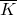
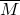
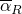
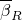

# 10.1.1 Using substructures


**Products: **Abaqus/Standard  Abaqus/CAE  

##### **References**

- ["Defining substructures," Section 10.1.2](pt04ch10s01aus59.md)
- [*SLOAD](../key/key-link.md#usb-kws-hsload)
- [*SUBSTRUCTURE PATH](../key/key-link.md#usb-kws-hsubpath)
- [*SUBSTRUCTURE PROPERTY](../key/key-link.md#usb-kws-msubprop)

### Overview

Substructures:
- allow a collection of elements to be grouped together and all but the retained degrees of freedom eliminated on the basis of linear response within the group;
- are used in the same manner as any of the standard element types in the Abaqus element library once created as described in ["Defining substructures," Section 10.1.2](pt04ch10s01aus59.md);
- can be used in stress/displacement and in coupled acoustic-structural analyses;
- have linear response but allow for large translations and large rotations;
- are particularly useful in cases where identical pieces appear several times in a structure (such as the teeth of a gear) since a single substructure can be used repeatedly;
- can be translated, rotated with respect to the global system, and reflected in a plane when they are used;
- are connected to the rest of the model by the retained degrees of freedom at the retained nodes;
- may contain a set of internal load cases and boundary conditions that can be activated and scaled;
- can include dynamic effects by including retained eigenmodes; and
- appear to the rest of the model as a stiffness, optional mass, damping, and a set of scalable load vectors.

### Substructures

Substructures are collections of elements from which the internal degrees of freedom have been eliminated. Retained nodes and degrees of freedom are those that will be recognized externally at the usage level (when the substructure is used in an analysis), and they are defined during generation of the substructure. Factors that determine how many and which nodes and degrees of freedom should be retained are discussed below and in ["Defining substructures," Section 10.1.2](pt04ch10s01aus59.md).

#### Substructures versus superelements

In the finite element literature substructures are also referred to as *superelements*. In earlier releases of Abaqus a distinction was made between substructures and superelements. The term “substructure” was used when it was needed to make clear that results were recovered within the substructure. Otherwise, both terms were used interchangeably. To avoid confusion, the term “superelement” will no longer be used.

#### Why use substructures?

There are a number of good reasons to use substructures.

##### Computational advantages

- System matrices (stiffness, mass) are small as a result of substructuring. Subsequent to the creation of the substructure, only the retained degrees of freedom and the associated reduced stiffness (and mass) matrix are used in the analysis until it is necessary to recover the solution internal to the substructure.
- Efficiency is improved when the same substructure is used multiple times. The stiffness calculation and substructure reduction are done only once; however, the substructure itself can be used many times, resulting in a significant savings in computational effort.
- Substructuring can isolate possible changes outside substructures to save time during reanalysis. During the design process large portions of the structure will often remain unchanged; these portions can be isolated in a substructure to save the computational effort involved in forming the stiffness of that part of the structure.
- In a problem with local nonlinearities, such as a model that includes interfaces with possible separation or contact, the iterations to resolve these local nonlinearities can be made on a very much reduced number of degrees of freedom if the substructure capability is used to condense the model down to just those degrees of freedom involved in the local nonlinearity.

##### Organizational advantages

- Substructuring provides a systematic approach to complex analyses. The design process often begins with independent analyses of naturally occurring substructures. Therefore, it is efficient to perform the final design analysis with the use of substructure data obtained during these independent analyses.
- Substructure libraries allow analysts to share substructures. In large design projects large groups of engineers must often conduct analyses using the same structures. Substructure libraries provide a clean and simple way of sharing structural information.
- Many practical structures are so large and complex that a finite element model of the complete structure places excessive demands on available computational resources. Such a large linear problem can be solved by building the model, substructure by substructure, and stacking these level by level until the whole structure is complete and then recovering the displacements and stresses locally, as required.

### Valid procedures

Substructures can be used without restriction in the following procedures:
- ["Static stress analysis," Section 6.2.2](pt03ch06s02at01.md)
- ["Implicit dynamic analysis using direct integration," Section 6.3.2](pt03ch06s03at07.md)
- ["Direct-solution steady-state dynamic analysis," Section 6.3.4](pt03ch06s03at09.md)
- ["Natural frequency extraction," Section 6.3.5](pt03ch06s03at10.md)
- ["Complex eigenvalue extraction," Section 6.3.6](pt03ch06s03at11.md)
- ["Mode-based steady-state dynamic analysis," Section 6.3.8](pt03ch06s03at13.md)

Substructures can also be used in the following procedures, but recovery of eliminated degrees of freedom is not supported:- ["Transient modal dynamic analysis," Section 6.3.7](pt03ch06s03at12.md)
- ["Response spectrum analysis," Section 6.3.10](pt03ch06s03at15.md)
- ["Random response analysis," Section 6.3.11](pt03ch06s03at16.md)

#### Using substructures in static analysis

Substructuring introduces no additional approximation in linear static structural analysis: the substructure is an exact representation of the linear, static behavior of its members. The principal drawback to the use of substructures in stress/displacement analyses is that a substructure's stiffness matrix is fully populated (no zero terms) and, therefore, may be very large if the substructure has a large number of retained degrees of freedom. This, in turn, may mean that the wavefront of the model within which substructures are used may be large, thus leading to long computer times to solve the equations.

This difficulty can often be avoided by choosing the substructure's boundaries carefully or by reusing several smaller substructures rather than a single larger substructure. In some cases it is possible to take advantage of the fact that Abaqus/Standard allows individual degrees of freedom to be retained, rather than the whole set of degrees of freedom at a node. For example, in contact problems without friction only the displacement component normal to the surface need be retained for the contact solution. Nodal transformations can be helpful in orienting the displacement components at surface nodes for this purpose (see ["Transformed coordinate systems," Section 2.1.5](pt01ch02s01aus09.md)). 

In a static analysis involving a substructure containing acoustic elements, the results will differ from the results obtained in an equivalent static analysis without substructures. The acoustic-structural coupling is taken into account in the substructure (leading to hydrostatic contributions of the acoustic fluid), while the coupling is ignored in a static analysis without substructures.

#### Using substructures in dynamic analysis

Substructures introduce approximations in dynamic analysis. The default approach to the dynamic representation of a substructure is to reduce its mass and damping matrix with the same transformation as is used for its stiffness matrix, which is known as “Guyan reduction.” This approach assumes that the response between the eliminated and retained degrees of freedom is correctly represented by the static modes only. This representation may not be accurate if dynamic modes within the substructure are important. The dynamic representation may be improved for Guyan reduction by retaining additional physical degrees of freedom that are not required to connect the substructure to the rest of the model. For example, if the substructure is a plate or a beam, some transverse displacements (and, perhaps, in-surface rotation components) might be included as retained degrees of freedom for this purpose. For more details regarding Guyan reduction, see ["Substructuring and substructure analysis," Section 2.14.1 of the Abaqus Theory Guide](../stm/stm-link.md#stm-anl-superelements).

“Dynamic mode addition” can be used as an alternative to Guyan reduction. This approach involves adding generalized degrees of freedom associated with the eigenmodes extracted for the substructure, with all of the physical retained degrees of freedom automatically constrained. This improves dynamic behavior, but it introduces the additional cost of extracting the eigenmodes for the constrained substructure. For more details regarding dynamic mode addition, see ["Substructuring and substructure analysis," Section 2.14.1 of the Abaqus Theory Guide](../stm/stm-link.md#stm-anl-superelements).

The reduction methods can be applied simultaneously to different substructures within the same structure. Definition of the reduced mass matrix is discussed further in ["Defining substructures," Section 10.1.2](pt04ch10s01aus59.md).

#### Using substructures in geometrically nonlinear stress/displacement analysis

Substructures may undergo large motions if geometric nonlinearities are considered in a particular stress/displacement analysis (see ["Static stress analysis procedures: overview," Section 6.2.1](pt03ch06s02abo06.md)). Abaqus/Standard will account for the large rigid body rotations and translations of the substructure. However, the substructure is assumed to undergo small (linear elastic) deformations at all times during the geometrically nonlinear analysis. An equivalent rigid body rotation for each substructure is computed during each equilibrium iteration using the retained nodes of the substructure. The substructure's mass, damping, stiffness matrix (including the retained eigenmodes), and force vectors are then rotated appropriately using the equivalent rigid body rotation. Appropriate (rotated) linear perturbation displacements (strain-inducing displacements relative to the rotating reference configuration) are used to compute the internal force associated with the substructure. Degrees of freedom at a node should not be retained selectively if the substructure is to be used in geometrically nonlinear analysis. Coupled acoustic-structural substructures should not be used in geometrically nonlinear analyses.

#### Comparison with component mode synthesis

The component mode synthesis method has been developed to permit the structure to be subdivided into components (substructures), with most of the analysis being done on the smaller components to develop an approximate model for the entire structure. 

The substructures in Abaqus/Standard are, in fact, a particular case of the component mode synthesis method extended to allow for large rotations and translations of the substructure (component) in the geometrically nonlinear analysis. The component mode synthesis method is based on the assumption that the small deformations of a substructure can be modeled using a collection of modes. The most frequently used modes in the literature are typically referred to as follows:
- constraint modes, which are static shapes obtained by giving each retained degree of freedom in the substructure a unit displacement while holding all other retained degrees of freedom fixed;
- fixed-interface normal modes, which are obtained by fixing the retained degrees of freedom and computing the eigenmodes of the substructure;
- free-interface normal modes, which are obtained by computing the eigenmodes of the substructure with free (not fixed) retained degrees of freedom; and
- mixed-interface normal modes, which are obtained by fixing a part of the retained degrees of freedom and computing the eigenmodes of the substructure.

The constraint modes are precisely the static modes (see ["Substructuring and substructure analysis," Section 2.14.1 of the Abaqus Theory Guide](../stm/stm-link.md#stm-anl-superelements)) used by Abaqus/Standard. You include these modes in the substructure's representation by specifying the degrees of freedom that are to be retained (see ["Defining the retained degrees of freedom" in "Defining substructures," Section 10.1.2](pt04ch10s01aus59.md#usb-anl-asuperelementdef-retaineddofs)). The fixed-interface, free-interface, or mixed-interface normal modes are the eigenmodes extracted in the eigenfrequency extraction step at the generation level, and these modes represent particular cases of substructure dynamic modes allowed in Abaqus  (see ["Defining the generalized degrees of freedom" in "Defining substructures," Section 10.1.2](pt04ch10s01aus59.md#usb-anl-asuperelementdef-generalizeddofs)). You include the dynamic modes in the substructure's representation by selecting the eigenmodes to be used.

### Including substructures in a model

When a substructure is used in a model, it is assigned an element number and defined by nodes just like any other element.

Use an element definition (["Element definition," Section 2.2.1](pt01ch02s02aus11.md)) with a substructure identifier to include substructures in the definition of another substructure (nested substructure) or in an analysis model. The substructure can be read from a substructure library. A maximum of 500 libraries can be accessed to read substructure data within a given analysis.

In the element definition you define the substructure's element number at the usage level and assign node numbers to the substructure's retained nodes. More than one substructure can be defined per element definition.

Once a substructure has been introduced by an element definition, it is treated like any other element in the model, except that its response can be linear only (although it can be used as a part of a model that includes nonlinear effects, including large displacements). 

Using substructures requires that the substructure database be available. All the files generated for a substructure including the `.sup` and `.sim` files and/or the `.prt`, `.stt`, and `.mdl` files must be available.

| **Input File Usage: ** | Use the following option to include one or more substructures in a model: |
| --- | --- |
|  | ``` [*ELEMENT](../key/key-link.md#usb-kws-melement), TYPE=Z*n* ``` |

| **Abaqus/CAE Usage: ** | Use the following option to include one substructure in a model: |
| --- | --- |
|  | All modules: ****File****Import****Part****: **File Filter**: **Substructure** Repeat the import process for each substructure that you want to include in the model. |

### Ordering of the substructure nodes on the usage level

The node numbers that are used when a substructure is created and the node numbers that are associated with the substructure when it is used are entirely independent. The ordering of the retained nodes when the substructure is used can be defined in two different ways:

1. The nodes can be provided in the same order that they were listed in the substructure definition. In this case you must prevent the sorting of the retained nodes when you specify the retained degrees of freedom (see ["Preventing the degrees of freedom from being sorted" in "Defining substructures," Section 10.1.2](pt04ch10s01aus59.md#usb-anl-asuperelementdef-retaineddofs-nosort)). Duplicate nodes are not combined if the retained nodes are not sorted. Therefore, if the same nodes are specified more than once in the list of retained degrees of freedom to retain different degrees of freedom, the corresponding nodes at the usage level must appear the same number of times.
2. The substructure nodes must be specified in the same order as the retained nodes sorted into ascending numerical order according to their numbers used within the substructure. This approach is the default when you specify the retained degrees of freedom.

In either case you must ensure that the nodes match up properly whenever a substructure is used.

#### Reading the substructure definition from a substructure library

You can read the substructure definition from a substructure library.

| **Input File Usage: ** | ``` [*ELEMENT](../key/key-link.md#usb-kws-melement), TYPE=Z*n*, FILE=*substructure_library_name* ``` |
| --- | --- |

| **Abaqus/CAE Usage: ** | Substructure libraries are not supported in Abaqus/CAE. |
| --- | --- |

#### Interpreting the model output in the data file

If model definition data are written to the data file (["Controlling the amount of analysis input file processor information written to the data file" in "Output," Section 4.1.1](pt02ch04s01aus38.md#usb-out-ooutput-data-control)), substructure instances are identified in the data (`.dat`) file by the substructure identifier followed by an F and two digits that indicate the substructure library number. The full name of the substructure library associated with this number is also contained in the model output.

### Defining the substructure's properties

You associate a property definition with each substructure in the model. The property definition serves the following purposes:

1. It defines any translation, rotation, and reflection of the substructure at the usage level.
2. It allows a tolerance to be set to ensure that the coordinates of the usage level nodes match the coordinates of the nodes used to generate the substructure.
3. It controls using various sources of substructure damping in the dynamic analysis at the usage level.

| **Input File Usage: ** | ``` [*SUBSTRUCTURE PROPERTY](../key/key-link.md#usb-kws-msubprop), ELSET=*name* ``` |
| --- | --- |

| **Abaqus/CAE Usage: ** | Use the following options to define translation and rotation of the substructure: |
| --- | --- |
|  | Assembly module: ****Instance****Translate**** or ****Instance****Rotate**** Reflection of the substructure is not supported in Abaqus/CAE. Use the following option to apply constraints that connect the retained nodes with the usage level nodes: Interaction module: ****Constraint****Create**** |

#### Translating, rotating, and reflecting a substructure

Translation, rotation, and/or reflection (in that order) of a substructure can be specified in a substructure property definition.

Specify a translation by giving a translation vector. Specify a rotation by giving two points, *a* and *b*, defining a rotation axis plus a right-handed angular rotation around that axis. Specify a reflection by giving three non-colinear points in the reflection plane.

A translation does not affect the substructure's stiffness or mass: the principal reason to apply a translation is to enable the tolerance check on nodal coordinates as discussed later. Rotation and/or reflection of a substructure affect the substructure's stiffness and mass. The substructure load case definitions are rotated and/or reflected in the same way as the substructure's stiffness and mass; therefore, all loads within substructure load cases are applied in the local directions associated with the substructure when it was created.

For distributed loads (for example, pressure loading of a surface) this application is precisely what is desired. However, distributed body forces in coordinate directions (BX, BY, BZ) are applied in the substructure's local directions instead of in the global directions, which may not be what is needed. Similarly, distributed loadings that depend on position (for example, hydrostatic pressure or centrifugal loads) are based on the substructure's local coordinates and not on the substructure position during usage. Be careful to ensure that loading of a rotated or shifted substructure is correct for its usage.

Whenever a substructure is translated, rotated, and/or reflected, the degrees of freedom at any retained nodes are with respect to the coordinate directions at the usage level. Therefore, if all of the degrees of freedom of a node are not retained or if a two-dimensional substructure is used in a three-dimensional model with rotation out of the *x*–*y* plane, additional degrees of freedom may be activated due to rotation and/or reflection. Be careful to check the validity of the substructure usage in such cases.

#### Setting a tolerance on the substructure nodes

One difficulty with using large substructures is ensuring that the retained nodes in the substructure are connected to the correct nodes on the usage level (after substructure translation, rotation, and/or reflection, if applicable). Therefore, Abaqus/Standard checks that the coordinates of the retained nodes match the coordinates of the corresponding nodes on the usage level. A substructure does not require any coordinates on the usage level because it consists only of a stiffness matrix, a mass matrix, and a number of load cases. Nevertheless, it is usually a good check of a model's validity to verify that the substructure and the model into which it is introduced are geometrically consistent.

To check the coordinates, you can set a tolerance on the distance between usage level nodes and the corresponding substructure nodes. This tolerance indicates the largest deviation allowable before a warning is issued. If you do not specify this tolerance, the default is to use a tolerance of 104 times the largest overall dimension within the substructure. If you specify a tolerance of 0.0, the position of the retained nodes is not checked.

The geometric check is based on the coordinates of the retained nodes after translation, rotation, and/or reflection of the substructure at the usage level; motions of these nodes that occur as a result of geometrically nonlinear preloading during generation of the substructure are not considered in this check. 

| **Input File Usage: ** | ``` [*SUBSTRUCTURE PROPERTY](../key/key-link.md#usb-kws-msubprop), ELSET=*name*, POSITION TOL=*tolerance* ``` |
| --- | --- |

| **Abaqus/CAE Usage: ** | Assembly module: ****Instance****Translate**** and ****Instance****Rotate**** |
| --- | --- |

#### Defining substructure damping

Abaqus allows you to choose a particular source of damping for a substructure, to add several sources, or to exclude the damping effects for a substructure at the usage level.

##### Sources of substructure damping

 You can choose to model the damping of a substructure at the usage stage by using the condensed viscous damping matrix, , and the condensed structural damping matrix, , computed during the generation stage and stored on the substructure data base. Alternatively, you can use stiffness and mass proportional damping factors to create a substructure damping matrix using the condensed stiffness and mass matrices,  and , respectively. You can also request that both damping sources be combined or exclude the effects of damping altogether at the usage level.

| **Input File Usage: ** | Use the following option to control the sources of the substructure damping: |
| --- | --- |
|  | ``` [*DAMPING CONTROLS](../key/key-link.md#usb-kws-hdampingcontrols), VISCOUS=*viscousDampingSource*, STRUCTURAL=*structuralDampingSource* ``` |

| **Abaqus/CAE Usage: ** | Use the following option to control the sources of the substructure damping: |
| --- | --- |
|  | Step module: **Create Step**: **Linear perturbation**: **Substructure generation**: **Damping** tabbed page |

##### Controlling the sources of viscous damping

 In the general case the substructure viscous damping is defined by the following matrix: 


| **Input File Usage: ** | To activate only the generated condensed viscous damping matrix of the substructure (the first term on the right hand side), use the following option: |
| --- | --- |
|  | ``` [*DAMPING CONTROLS](../key/key-link.md#usb-kws-hdampingcontrols), VISCOUS=ELEMENT ``` To activate only the Rayleigh viscous damping, use the following option: ``` [*DAMPING CONTROLS](../key/key-link.md#usb-kws-hdampingcontrols), VISCOUS=FACTOR ``` To activate the combined generated and Rayleigh viscous damping matrix, use the following option: ``` [*DAMPING CONTROLS](../key/key-link.md#usb-kws-hdampingcontrols), VISCOUS=COMBINED ``` To exclude the effects of viscous damping altogether at the usage level, use the following option: ``` [*DAMPING CONTROLS](../key/key-link.md#usb-kws-hdampingcontrols), VISCOUS=NONE ``` |

| **Abaqus/CAE Usage: ** | To activate only the generated condensed viscous damping matrix of the substructure (the first term on the right hand side), use the following option: |
| --- | --- |
|  | Step module: **Create Step**: **Linear perturbation**: **Substructure generation**: **Damping** tabbed page: **Viscous damping**: **Element** To activate only the Rayleigh viscous damping, use the following option: Step module: **Create Step**: **Linear perturbation**: **Substructure generation**: **Damping** tabbed page: **Viscous damping**: **Factor** To activate the combined generated and Rayleigh viscous damping matrix, use the following option: Step module: **Create Step**: **Linear perturbation**: **Substructure generation**: **Damping** tabbed page: **Viscous damping**: **Combined** To exclude the effects of viscous damping altogether at the usage level, use the following option: Step module: **Create Step**: **Linear perturbation**: **Substructure generation**: **Damping** tabbed page: **Viscous damping**: **None** |

##### Controlling the sources of structural damping

 In the general case the substructure structural damping is defined by the following matrix: 


| **Input File Usage: ** | To activate only the generated condensed structural damping matrix of the substructure (the first term on the right hand side), use the following option: |
| --- | --- |
|  | ``` [*DAMPING CONTROLS](../key/key-link.md#usb-kws-hdampingcontrols), STRUCTURAL=ELEMENT ``` To activate only the stiffness proportional structural damping matrix, use the following option: ``` [*DAMPING CONTROLS](../key/key-link.md#usb-kws-hdampingcontrols), STRUCTURAL=FACTOR ``` To activate the combined generated and stiffness proportional structural damping matrix, use the following option: ``` [*DAMPING CONTROLS](../key/key-link.md#usb-kws-hdampingcontrols), STRUCTURAL=COMBINED ``` To exclude the structural damping matrix, use the following option: ``` [*DAMPING CONTROLS](../key/key-link.md#usb-kws-hdampingcontrols), STRUCTURAL=NONE ``` |

| **Abaqus/CAE Usage: ** | To activate only the generated condensed structural damping matrix of the substructure (the first term on the right hand side), use the following option: |
| --- | --- |
|  | Step module: **Create Step**: **Linear perturbation**: **Substructure generation**: **Damping** tabbed page: **Structural damping**: **Element** To activate only the stiffness proportional structural damping matrix, use the following option: Step module: **Create Step**: **Linear perturbation**: **Substructure generation**: **Damping** tabbed page: **Structural damping**: **Factor** To activate the combined generated and stiffness proportional structural damping matrix, use the following option: Step module: **Create Step**: **Linear perturbation**: **Substructure generation**: **Damping** tabbed page: **Structural damping**: **Combined** To exclude the structural damping matrix, use the following option: Step module: **Create Step**: **Linear perturbation**: **Substructure generation**: **Damping** tabbed page: **Structural damping**: **None** |

##### Defining damping ratios

By default, the Rayleigh damping ratios,  and , and the structural damping ratio, , used to define stiffness proportional and mass proportional damping for a substructure are zeros.

| **Input File Usage: ** | Use the following options to define the values of the substructure damping ratios at the usage level: |
| --- | --- |
|  | ``` [*DAMPING](../key/key-link.md#usb-kws-mdamping), ALPHA=, BETA=, STRUCTURAL= ``` |

| **Abaqus/CAE Usage: ** | Use the following option to define the values of the substructure damping ratios at the usage level: |
| --- | --- |
|  | Step module: **Create Step**: **Linear perturbation**: **Substructure generation**: **Damping** tabbed page: **Alpha**: : **Beta**: : **Structural**:  |

##### Defining damping for modal dynamic analysis

To define damping for linear dynamic analysis based on the structure's modes, specify modal damping when using the substructure. The damping in each eigenmode can be given as a fraction of the critical damping. Alternatively, Rayleigh damping can be defined. Composite modal damping cannot be used inside substructures.

See ["Transient modal dynamic analysis," Section 6.3.7](pt03ch06s03at12.md), for more information about the modal damping procedure.

| **Input File Usage: ** | Use the following option to define the damping in each eigenmode as a fraction of the critical damping: |
| --- | --- |
|  | ``` [*MODAL DAMPING](../key/key-link.md#usb-kws-hmodaldamp), VISCOUS=FRACTION OF CRITICAL DAMPING ``` Use the following option to define Rayleigh damping: ``` [*MODAL DAMPING](../key/key-link.md#usb-kws-hmodaldamp), VISCOUS=RAYLEIGH ``` |

| **Abaqus/CAE Usage: ** | Modal damping for substructures is not supported in Abaqus/CAE. |
| --- | --- |

### Defining kinematic constraints and transformations

All kinematic boundary conditions, MPCs, and transformations can be applied to retained degrees of freedom at the usage level. These specifications can be changed from step to step in the usual way. In this respect substructures and their retained nodes act in an identical manner to regular elements and their nodes.

#### Defining transformations at retained nodes

If a nodal transformation (["Transformed coordinate systems," Section 2.1.5](pt01ch02s01aus09.md)) is used during substructure generation at a retained node, the transformations are built into the substructure. This creates an inconsistency when the substructure node is attached to a standard Abaqus element since Abaqus/Standard uses the retained degrees of freedom directly without checking their directions. Therefore, it is suggested that this situation be avoided.

If a nodal transformation must be used, the resulting inconsistency can be resolved by retaining all degrees of freedom at the node and applying a linear constraint equation (["Linear constraint equations," Section 35.2.1](pt08ch35s02aus129.md)) as follows. At any point where such a transformed substructure node is attached to a global model, define two coincident nodes on the usage level, *P* and *Q*, for example. Use node *P* for the substructure at the usage level (defined with an element definition); the local directions of the degrees of freedom are already built in at this node. Use node *Q* for all standard Abaqus elements attached to this point. Use a local transformation at node *Q* to transform the degrees of freedom to the same local directions that are built-in for node *P*. Now use a linear constraint equation to equate the individual degrees of freedom at nodes *P* and *Q*.

### Applying loads to a substructure

Loads or boundary conditions that are to be applied to a substructure within an analysis (at the usage level) must be specified during the substructure generation step by defining a substructure load case or by requesting that the substructure's gravity load vectors be calculated (see ["Defining substructure load cases for subsequent loading in an analysis" in "Defining substructures," Section 10.1.2](pt04ch10s01aus59.md#usb-anl-asuperelementdef-loads)). A load case can be made up of any combination of loadings and nonzero boundary conditions, and multiple load cases can be defined for any given substructure.

When you activate load cases created for a substructure, you specify the element number or element set name of the substructures, the associated substructure load case names, and the scaling multipliers for the specified substructure load case loads and/or boundary conditions. To reproduce the loading conditions defined during substructure generation exactly, use a magnitude of 1.0.

Boundary conditions specified during a substructure's generation are always present, whether the substructure load case that they are part of is active or not. They are effectively built into the substructure and can only be scaled if desired but not removed. See ["Defining substructures," Section 10.1.2](pt04ch10s01aus59.md), for further information about defining boundary conditions in substructures.

| **Input File Usage: ** | Use the following option to activate a substructure load case: |
| --- | --- |
|  | ``` [*SLOAD](../key/key-link.md#usb-kws-hsload) ``` |

| **Abaqus/CAE Usage: ** | Use the following option to activate a substructure load case: |
| --- | --- |
|  | Load module: load editor: **Category**: **Mechanical**: **Types for Selected Step**: **Substructure load** |

#### Modifying or removing load cases

By default, substructure loads are applied as modifications of existing loads or in addition to any loads previously defined. You can remove all previously defined loads and, optionally, specify new loads when you activate a load case. Boundary conditions cannot be removed.

| **Input File Usage: ** | Use the following option to modify load cases: |
| --- | --- |
|  | ``` [*SLOAD](../key/key-link.md#usb-kws-hsload), OP=MOD ``` Use the following option to remove load cases: ``` [*SLOAD](../key/key-link.md#usb-kws-hsload), OP=NEW ``` |

| **Abaqus/CAE Usage: ** | Use the following option to modify load cases: |
| --- | --- |
|  | Load module: **Load Case Manager**: click **Edit** Use the following option to remove load cases: Load module: **Load Case Manager**: click **Delete** |

#### Specifying time-dependent load cases

The magnitude of substructure loads can be varied with time by referring to an amplitude definition (["Amplitude curves," Section 34.1.2](pt07ch34s01aus115.md)).

| **Input File Usage: ** | Use the following options to define time-dependent load cases: |
| --- | --- |
|  | ``` [*AMPLITUDE](../key/key-link.md#usb-kws-mamplitude), NAME=*amplitude* [*SLOAD](../key/key-link.md#usb-kws-hsload), AMPLITUDE=*amplitude* ``` |

| **Abaqus/CAE Usage: ** | Use the following options to define time-dependent load cases: |
| --- | --- |
|  | Load module: amplitude editor: **Create Amplitude**: **Amplitude**: *amplitude* Load module: load editor: **Category**: **Mechanical**: **Types for Selected Step**: **Substructure load**: **Amplitude**: *amplitude* |

#### Load cases in geometrically nonlinear analyses

All substructure loads and boundary conditions are applied in a local system associated with the substructure. Since this local system rotates with the substructure when large motions are present, these loads and boundary conditions will rotate as well. As a consequence, you should be careful when using substructure loads in geometrically nonlinear analyses to ensure that the loading is in the appropriate direction at the usage level. This situation is similar to rotating the substructure via a substructure property definition. 

#### Gravity loading

A distributed load definition can be used to apply gravity loading to a substructure with a user-defined magnitude, scaled by an amplitude definition, and acting in a specifed direction. To enable gravity loading for a substructure, you must request the calculation of the substructure's gravity load vectors during the substructure generation step (see ["Gravity loading" in "Defining substructures," Section 10.1.2](pt04ch10s01aus59.md#usb-anl-asuperelementdef-loads-grav)). In this case gravity loading should not be defined as part of a substructure load case.

| **Input File Usage: ** | Use the following option to define gravity loading: |
| --- | --- |
|  | ``` [*DLOAD](../key/key-link.md#usb-kws-hdload), AMPLITUDE=*amplitude* *element set or element number*, GRAV, *magnitude, direction* ``` |

| **Abaqus/CAE Usage: ** | Load module: **Create Load**: choose **Mechanical** for the **Category** and **Gravity** for the **Types for Selected Step** |
| --- | --- |

### Obtaining output of results within a substructure

You can obtain output within substructures used in static, dynamic, eigenfrequency extraction, and steady-state and transient modal dynamic analyses. The recovery of output is not possible for substructures used in response spectrum and random response analyses. Output within a substructure does not include the displacements, stresses, etc. resulting from the preload deformation of a substructure.

Output within substructures is available in the data (`.dat`) file, in the results (`.fil`) file, and in output database (`.odb`) files. Separate output database files are created for each substructure using the naming convention `*inputfile-name*_*substructure-number*.odb`. If a substructure contains a nested substructure, a file called `*inputfile-name*_*substructure-number*_*nested-substructure-number*.odb` is created containing the output for the nested substructure. The **abaqus substructurecombine** execution procedure can combine model and results data from two substructure output databases into a single output database. For more information, see ["Combining output from substructures," Section 3.2.22](pt01ch03s02abx22.md).

Recovery of the solution within substructures requires that the information for recovering the data within a substructure be available from the `.sup`, `.sim`, `.prt`, `.stt`, and `.mdl` files.

Output is organized substructure by substructure: you direct Abaqus/Standard to go inside a particular substructure and then request output for that substructure. Results can be recovered within nested multilevel substructures only if the substructure libraries for all substructures in the chain are available.

Substructure output requests are most easily pictured by thinking of substructures as “levels” of detailed modeling. At the global (top) level we have the analysis model (for example, an airplane). Dropping down from this level to the first substructure level, we have the main components of the model defined as substructures (wings, stabilizer, fuselage, etc.). Dropping down to the second substructure level, we have other substructures (flaps, tanks, floors, etc.), which, in turn, may contain third level substructures (spars, stringers, etc.), and so on. To obtain output, you move down and back up through these various levels using substructure paths, similar to the way you navigate a tree structure for file directories. Each substructure path definition consists of entering into a substructure at the next level down or leaving the current substructure and moving up one level in the tree.

At the start of the output requests, Abaqus/Standard is at the global model level. You must always enter and leave a substructure consistently, so that after a set of substructure output requests Abaqus/Standard is left at the global model level. You must return to the global level (outside all substructures) before the end of the step definition.

If you enter and leave in the same substructure path definition, the effect is to leave the substructure and enter another substructure at the same level.

#### Entering a substructure for output

To enter a particular substructure for output, you identify the substructure by the element number *n* chosen for it in the model. All subsequent output requests are for output within that substructure and must be given in terms of its internal node and element numbers (the node and element numbers used when the substructure was created).

| **Input File Usage: ** | ``` [*SUBSTRUCTURE PATH](../key/key-link.md#usb-kws-hsubpath), ENTER ELEMENT=*n* ``` |
| --- | --- |

| **Abaqus/CAE Usage: ** | Step module: field output request editor: **Domain**: **Substructure**: click  and select substructure sets |
| --- | --- |

#### Leaving a substructure after obtaining output

After you have obtained output for a substructure, you must return to the level of the model of which the substructure forms a part, thus indicating the end of the output requests for variables within that substructure.

| **Input File Usage: ** | ``` [*SUBSTRUCTURE PATH](../key/key-link.md#usb-kws-hsubpath), LEAVE ``` |
| --- | --- |

| **Abaqus/CAE Usage: ** | Step module: field output request editor: **Domain**: **Substructure**: click  and select substructure sets |
| --- | --- |

#### Obtaining output if substructures are nested

You must enter several substructures if substructures are used at multiple levels and output is required several levels down. Nesting of substructures is not supported in Abaqus/CAE.

##### Example: obtaining output within nested substructures

For example, suppose that a model includes several substructures at two levels. Printed output of stress components is required in some elements within two substructures at the second level, as well as printed output of the displacements at some of the nodes of one of the first-level substructures. (Recall that “first-level” refers to substructures used directly in the analysis model; “second-level” substructures are used as components of first-level substructures.)

The data might be as follows:

```
[*SUBSTRUCTURE PATH](../key/key-link.md#usb-kws-hsubpath), ENTER ELEMENT=*N*
** *This option takes us into element number N, which must be a substructure.*
[*SUBSTRUCTURE PATH](../key/key-link.md#usb-kws-hsubpath), ENTER ELEMENT=*M*
** *We now drop down into element number M of this substructure.*
** *M is the element number used for this substructure when N was created.*
** *M must refer to a substructure.*[*EL PRINT](../key/key-link.md#usb-kws-helprint), ELSET=A1
S
** *This option requests stress output in element set A1 of this substructure.*
** *This element set must have been defined during the creation of substructure M.*
[*SUBSTRUCTURE PATH](../key/key-link.md#usb-kws-hsubpath), LEAVE
** *This option takes us back up into first-level substructure N.*
[*SUBSTRUCTURE PATH](../key/key-link.md#usb-kws-hsubpath), ENTER ELEMENT=*P*
** *This option takes us down into element P, which must again be a substructure in element N.*
[*EL PRINT](../key/key-link.md#usb-kws-helprint), ELSET=A1
S
** *This option requests the printing of stress output in element set A1. It is possible that*
** *this is the same set of elements in the same substructure as was used in the request above*
** *because substructures M and P may both be copies of the same substructure.*
** *However, the stresses will presumably be different because they represent the same*
** *component in different locations in the model.*
[*SUBSTRUCTURE PATH](../key/key-link.md#usb-kws-hsubpath), LEAVE
** *Back to N.*
[*SUBSTRUCTURE PATH](../key/key-link.md#usb-kws-hsubpath), LEAVE
** *We are now back at the global level.*
[*SUBSTRUCTURE PATH](../key/key-link.md#usb-kws-hsubpath), ENTER ELEMENT=*R*
** *Enter element R at the global level: this element is the substructure in which we want*
** *to print the displacements.*
[*NODE PRINT](../key/key-link.md#usb-kws-hnodeprint), NSET=FLANGE
U
** *This option prints the displacements at all nodes in node set *
** FLANGE *of the substructure.*
** *Again,* FLANGE * must have been defined when the substructure was*
** *created.*
[*SUBSTRUCTURE PATH](../key/key-link.md#usb-kws-hsubpath), LEAVE
** *Back to the global level.*
```

#### Interpreting nodal variable output

The nodal displacements within the substructure do not include the displacements resulting from the preload deformation if it exists.

If a substructure is rotated and/or reflected, nodal variables are output relative to the global coordinate system of the analysis. In a geometrically nonlinear analysis, the nodal displacements will include the large motions associated with the translation and rotation of the substructure in addition to the small-strain displacements. If a nodal transformation (["Transformed coordinate systems," Section 2.1.5](pt01ch02s01aus09.md)) has been used, nodal output will be in either the local or the global directions, depending on the nodal output request (see ["Output to the data and results files," Section 4.1.2](pt02ch04s01aus39.md)). If a nodal transformation has been used during substructure generation, the transformed directions are rotated with the substructure.

#### Interpreting element variable output

Element output variables within a substructure do not include the values of the variable resulting from the preload deformation if it exists.

Element variables in continuum elements are output relative to the global coordinate system of the analysis model or in the local (material) coordinate system if one has been used (["Orientations," Section 2.2.5](pt01ch02s02aus15.md)). Element output for structural elements is always given with respect to the element coordinate system used during substructure generation. Integration point coordinates and local material directions (see ["Output to the data and results files," Section 4.1.2](pt02ch04s01aus39.md)) are given with respect to the global coordinate system.

Element quantities associated with nonlinear preload response (plastic strains, creep strains, etc.) can be output during a substructure recovery. Since the response in a substructure during its usage is entirely linear, these quantities, which are part of the base state, do not change from the values computed during the preload.

If a substructure was reflected, the element connectivities of continuum elements written to the substructure instance output database are adjusted so as not to violate the Abaqus convention for counterclockwise element numbering.

You cannot directly obtain the element output for the element centroidal values or the element output at the element nodes when you recover results within substructures. This output data can be calculated from the substructure-related data in the output database file using commands in the Abaqus Scripting Interface. 

#### Interpreting results written to the results file

Results within substructures can be written to the results file. Substructure path records are inserted in the results file to indicate the switch into a substructure: all records following such a record belong to the substructure defined on that record until the next substructure path record appears in the file.

Requests for output to the results file will cause Abaqus/Standard to write the definitions of elements and nodes at the global level and within all substructures in the model to the file. As with the results records themselves, these records for nodes and elements within substructures will be preceded and followed by substructure path records to indicate that they belong to that substructure.

Node and element numbers within each substructure are local to that substructure, so that the same node and element numbers may appear in several substructures and in the global level model. In such a case the substructure path records must be used to identify the location of a particular node or element within the model. If you can ensure that node and element numbers are unique throughout the entire model, including all substructures, the substructure path records in the results file can be ignored.

### Visualizing substructure results

While Abaqus/CAE does not support substructures directly, you can view substructure results by combining all of the substructure instance output database (`.odb`) files into a single file. See ["Combining output from substructures," Section 3.2.22](pt01ch03s02abx22.md), for details. 

You can also load and view each individual substructure instance output database (`.odb`) file separately in Abaqus/CAE.

### Substructure library compatibility

A substructure usage analysis can use the substructure libraries generated from the same or any previous maintenance delivery of the same general release. For example, if a substructure is generated with the Abaqus 6.14-3 maintenance delivery, it can be used in all subsequent Abaqus 6.14 maintenance deliveries. The substructure library is not compatible between general releases (for example, between Abaqus 6.13 and Abaqus 6.14).

A substructure usage analysis must be run on a computer that is binary compatible with the computer used to generate the substructure library.

### Input file template

The following template can be used to generate a substructure:

```
[*HEADING](../key/key-link.md#usb-kws-mheading)
…
[*NODE](../key/key-link.md#usb-kws-mnode),NSET=N1
*Data lines to define the nodes.*
…
[*NSET](../key/key-link.md#usb-kws-mnset),NSET=N3
*Data lines to define the node set members.*
…
[*ELEMENT](../key/key-link.md#usb-kws-melement), TYPE=CPE8, ELSET=E1
*Data lines to define the elements that make up the substructure.*
…
[*ELSET](../key/key-link.md#usb-kws-melset),ELSET=E3
*Data lines to define the element set members.*
…
[*SOLID SECTION](../key/key-link.md#usb-kws-msolidsection), ELSET=E1, MATERIAL=M1
[*MATERIAL](../key/key-link.md#usb-kws-mmaterial), NAME=M1
[*ELASTIC](../key/key-link.md#usb-kws-melastic)
30.E6, 0.3
[*DENSITY](../key/key-link.md#usb-kws-mdensity)
0.0007324
[*STEP](../key/key-link.md#usb-kws-hstep)
[*FREQUENCY](../key/key-link.md#usb-kws-hfrequency)
*Data line to specify the number of modes (  m). The [*FREQUENCY](../key/key-link.md#usb-kws-hfrequency) option*
*is required if modes are requested using the [*SELECT EIGENMODES](../key/key-link.md#usb-kws-hselecteigenmodes) option.*
[*END STEP](../key/key-link.md#usb-kws-hendstep)
[*STEP](../key/key-link.md#usb-kws-hstep)
[*STATIC](../key/key-link.md#usb-kws-hstatic)
…
*Options to define a linear or nonlinear static preload.*
…
[*END STEP](../key/key-link.md#usb-kws-hendstep)
[*STEP](../key/key-link.md#usb-kws-hstep)
[*SUBSTRUCTURE GENERATE](../key/key-link.md#usb-kws-ssubgenerate), TYPE=Z101, OVERWRITE, MASS MATRIX=YES,
VISCOUS DAMPING MATRIX=YES, STRUCTURAL DAMPING MATRIX=YES,
RECOVERY MATRIX=YES, NSET=N3, ELSET=E3
[*RETAINED NODAL DOFS](../key/key-link.md#usb-kws-sretainnodaldofs)
*Data lines to define the retained degrees of freedom.*
[*SELECT EIGENMODES](../key/key-link.md#usb-kws-hselecteigenmodes), GENERATE
1, *m*, 1
[*SUBSTRUCTURE LOAD CASE](../key/key-link.md#usb-kws-ssubloadcase), NAME=BOUND
[*BOUNDARY](../key/key-link.md#usb-kws-hboundary)
*Data lines to define the boundary conditions.*
[*SUBSTRUCTURE LOAD CASE](../key/key-link.md#usb-kws-ssubloadcase), NAME=LOADS
[*CLOAD](../key/key-link.md#usb-kws-hcload)
*Data lines to define concentrated loading.*
[*DLOAD](../key/key-link.md#usb-kws-hdload)
*Data lines to define distributed loading.*
[*END STEP](../key/key-link.md#usb-kws-hendstep)
```

The following template can be used to define substructure instances:

```
[*HEADING](../key/key-link.md#usb-kws-mheading)
…
[*ELEMENT](../key/key-link.md#usb-kws-melement), TYPE=Z101, ELSET=E2
*Data line to define the element.*
[*SUBSTRUCTURE PROPERTY](../key/key-link.md#usb-kws-msubprop), ELSET=E2
[*BOUNDARY](../key/key-link.md#usb-kws-hboundary)
…
[*RESTART](../key/key-link.md#usb-kws-mrestart), WRITE
[*STEP](../key/key-link.md#usb-kws-hstep)
[*STATIC](../key/key-link.md#usb-kws-hstatic)
…
[*BOUNDARY](../key/key-link.md#usb-kws-hboundary)
…
[*SLOAD](../key/key-link.md#usb-kws-hsload)
E2, LOADS, *scale factor*
[*SUBSTRUCTURE PATH](../key/key-link.md#usb-kws-hsubpath), ENTER ELEMENT=*n*
[*EL PRINT](../key/key-link.md#usb-kws-helprint)
S,
[*NODE PRINT](../key/key-link.md#usb-kws-hnodeprint)
U,
[*SUBSTRUCTURE PATH](../key/key-link.md#usb-kws-hsubpath), LEAVE
[*END STEP](../key/key-link.md#usb-kws-hendstep)
[*STEP](../key/key-link.md#usb-kws-hstep)
[*DYNAMIC](../key/key-link.md#usb-kws-hdynamic)
…
[*BOUNDARY](../key/key-link.md#usb-kws-hboundary)
…
[*SUBSTRUCTURE PATH](../key/key-link.md#usb-kws-hsubpath), ENTER ELEMENT=*n*
[*EL PRINT](../key/key-link.md#usb-kws-helprint)
S,
[*NODE PRINT](../key/key-link.md#usb-kws-hnodeprint)
U, V
[*SUBSTRUCTURE PATH](../key/key-link.md#usb-kws-hsubpath), LEAVE
[*END STEP](../key/key-link.md#usb-kws-hendstep)
```


