# 10.2.2 Node-based submodeling


**Products: **Abaqus/Standard  Abaqus/Explicit  Abaqus/CAE  

##### **References**

- ["Submodeling: overview," Section 10.2.1](pt04ch10s02aus60.md)
- [*SUBMODEL](../key/key-link.md#usb-kws-msubmodel)
- [*BOUNDARY](../key/key-link.md#usb-kws-hboundary)
- [Chapter 38, "Submodeling," of the Abaqus/CAE User's Guide](../usi/usi-link.md#usi-adv-submodeling)

### Overview

The following types of node-based submodeling are available: 
- Same-to-same (e.g., solid-to-solid, shell-to-shell);
- Shell-to-solid; and
- Acoustic-to-structure.

These submodel types support the following nodal-driven variables: - Displacement,
- Rotation,
- Temperature,
- Pore pressure, and
- Acoustic pressure.

### Performing a node-based submodeling analysis

For an overview of submodeling that includes some details common to both node-based and surface-based submodeling, see ["Submodeling: overview," Section 10.2.1](pt04ch10s02aus60.md).

Your submodel analysis is driven, either partly or completely, from the results obtained from a global model analysis. The results from the global model are interpolated onto the nodes on the appropriate parts of the boundary of the submodel (see [Figure 10.2.2--1](pt04ch10s02aus61.md#asubmodel-global)). Thus, the response at the boundary of the local region is defined by the solution for the global model. The driven nodes and any loads applied to the local region determine the solution in the submodel.

**Figure 10.2.2–1** The global model.

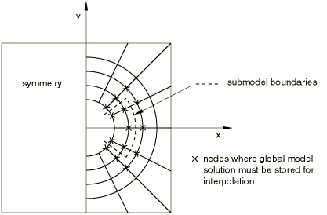

#### Different types of node-based submodeling

Three different techniques are available for nodal-based submodeling.

##### Solid-to-solid submodeling

The linear or nonlinear response of a global solid model can be used to drive the submodel response of a solid submodel. The driven variables can be displacements or temperatures.

##### Shell-to-solid submodeling

The linear or nonlinear response of a global shell model can be used to drive the submodel response of a solid submodel. The driven variables are displacements, which are determined from global model displacements and rotations.

##### Acoustic submodeling

The linear or nonlinear response of a global, structural model can be used to drive the acoustic response of a fluid region of any size if the forces exerted on the structure by the fluid are small. This is often the case for metal structures in air, building interiors, or for sound propagation from a liquid to air. In the case of a liquid and a gas, no special procedures need be followed; the pressure degrees of freedom couple straightforwardly. In the case of a structure driving a fluid, you must ensure that the degrees of freedom to be driven in the submodel exist among the global model results. Several alternatives exist. A thin layer of fluid elements, with the same properties as the submodel fluid, can be added to the global model; this element set and its nodes can then be used to drive the submodel in the usual manner. Alternatively, you can create acoustic interface elements on the surface of the submodel and drive the corresponding nodes with the structural nodes (see ["Fully and sequentially coupled acoustic-structural analysis of a muffler," Section 9.1.1 of the Abaqus Example Problems Guide](../exa/exa-link.md#exa-aco-muffler)).

In problems where the fluid exerts large pressures on the structure, the mechanical response of the structure may be of interest. Acoustic-to-structure submodeling can be used in such problems. The submodel in these problems is a part of the structural component of the global model. The acoustic pressure obtained from solving a coupled acoustic-structural global analysis is used to drive the submodel on the surface it shares with the fluid medium. Other boundaries of the submodel may be driven using the displacements of the structural component of the global model via solid-to-solid submodeling. The acoustic-to-structure submodel analysis solves an uncoupled structural force-displacement problem. The acoustic pressure from the global model is interpolated to the submodel driven nodes. The tributary area and the outward normal associated with the driven node are used to convert the interpolated acoustic pressure to a concentrated load acting at that location (see ["Miscellaneous submodeling tests," Section 3.8.17 of the Abaqus Verification Guide](../ver/ver-link.md#ver-prc-submodelmisc)).

### Saving the results from the global model

The results from the global analysis must be saved at all nodes required for the interpolation of the driven variables to the boundary of the submodel (see [Figure 10.2.2--1](pt04ch10s02aus61.md#asubmodel-global)). The results (`.fil`) file or the output database (`.odb`) file can be used for this purpose.

#### Saving the results to the results file

In each step of the global model whose solution will be used to drive the submodel, write the nodal results for all driven variables to the results file (see ["Output to the data and results files," Section 4.1.2](pt02ch04s01aus39.md)). These results must be written in the global coordinate system of the model. The submodel can refer only to a global model results file that is from a binary compatible platform.

When the global model is run in Abaqus/Explicit and results file output is requested, the results are written to the selected results (`.sel`) file; this file needs to be converted into a results (`.fil`) file using the **convert** option (see ["Abaqus/Standard, Abaqus/Explicit, and Abaqus/CFD execution," Section 3.2.2](pt01ch03s02abx02.md)). 

| **Input File Usage: ** | ``` [*NODE FILE](../key/key-link.md#usb-kws-hnodefile) (In Abaqus/Standard GLOBAL=NO should not be used on the [*NODE FILE](../key/key-link.md#usb-kws-hnodefile) option.) ``` |
| --- | --- |

| **Abaqus/CAE Usage: ** | You cannot write output to the results file in Abaqus/CAE. |
| --- | --- |

#### Saving the results to the output database

In each step of the global model whose solution will be used to drive the submodel, write the nodal results for all driven variables to the output database (see ["Output to the output database," Section 4.1.3](pt02ch04s01aus40.md)). Unlike the results file, nodal output to the output database is always written in the global directions. The output database can be transferred to any platform since it is binary neutral.

| **Input File Usage: ** | Use both of the following options: |
| --- | --- |
|  | ``` [*OUTPUT](../key/key-link.md#usb-kws-houtput), FIELD [*NODE OUTPUT](../key/key-link.md#usb-kws-hnodeoutput) ``` |

| **Abaqus/CAE Usage: ** | Step module: ****Output****Field Output Requests****Create**** |
| --- | --- |

##### Saving results with higher precision

By default, the nodal output to the output database is written using single precision, which may not be sufficient for certain classes of problems; for example, submodels undergoing large rigid body motions (consider also surface-based submodeling in these cases—see ["Surface-based submodeling," Section 10.2.3](pt04ch10s02aus62.md)). For such analyses request the nodal output to the fullest possible precision (see ["Abaqus/Standard, Abaqus/Explicit, and Abaqus/CFD execution," Section 3.2.2](pt01ch03s02abx02.md)).

| **Input File Usage: ** | **abaqus** **job**=*global_model_input_file* **output_precision**=`full` |
| --- | --- |

| **Abaqus/CAE Usage: ** | Job module: **Create Job**: **Precision**: **Nodal output precision**: **Full** |
| --- | --- |

#### Saving results from a global model with a physical time scale

If the global analysis in Abaqus/Standard involves a physical time scale and the results file is to be used in the submodel analysis, request that the results file output be written at the beginning of the step (the zero increment) for all steps in the global analysis (see ["Output," Section 4.1.1](pt02ch04s01aus38.md)). Abaqus will then have the complete solution history (including the solution state at the beginning of a step) from which a submodel may be driven. If the zero increment results are not requested, incorrect results will be obtained if the step time in the submodel is less than the step time of the first increment on the results file. Instead of interpolating between the results at the start of the step and the results of the first increment on the results file, Abaqus will simply use the results of the first increment as long as the submodel step time is less than the step time of the first increment on the results file. The zero increment request is not required in Abaqus/Explicit, because the results are always written to the results file at the beginning of each step. Similarly, the results will always be correctly interpolated when using the output database to transfer the results from the global model to the submodel, because the zero increment is always written to the output database.

| **Input File Usage: ** | ``` [*FILE FORMAT](../key/key-link.md#usb-kws-hfileformat), ZERO INCREMENT ``` |
| --- | --- |

| **Abaqus/CAE Usage: ** | You cannot write output to the results file in Abaqus/CAE. |
| --- | --- |

#### Referring to the global model results from the submodel analysis

You must define the source of the global solution results. Provide the name of the global results file or output database file; the file extension is optional. If the file extension is omitted, Abaqus will correctly choose the extension if only the results file or the output database file exists. If the file extension is omitted and both results and output database files exist, the results file will be used.

| **Input File Usage: ** | **abaqus** **job**=*submodel_input_file* **globalmodel**=`*global_results_file*` or `*global_output_database*` |
| --- | --- |

| **Abaqus/CAE Usage: ** | Any module: ****Model****Edit Attributes*****submodel*****: **Submodel**: **Read data from job**: `*global_results_file*` or `*global_output_database*` |
| --- | --- |

### Specifying the driven nodes in the submodel

Specifying the driven nodes does not activate the driven variables: they must be activated by specifying the appropriate submodel boundary conditions.

All nodes of the submodel where variables will be driven in any step (see [Figure 10.2.2--2](pt04ch10s02aus61.md#asubmodel-mag)) must be specified as driven nodes since the list of nodes cannot be extended subsequent to its initial definition (even at restart). However, variables at the nodes given do not have to be driven in all steps: the choice of which variables are driven in a particular step is made as part of a submodel boundary condition definition, as discussed later.

**Figure 10.2.2–2** The magnified submodel.


| **Input File Usage: ** | ``` [*SUBMODEL](../key/key-link.md#usb-kws-msubmodel) *list of nodes or node set labels or, for acoustic-to-structure submodeling, the name of an element-based structural surface* ``` |
| --- | --- |
|  | The [*SUBMODEL](../key/key-link.md#usb-kws-msubmodel) option must be included in the model definition portion of the input file for the submodel analysis. Multiple [*SUBMODEL](../key/key-link.md#usb-kws-msubmodel) options are allowed; however, in this case you must ensure that the driven nodes specified on the data line of one option are separate and distinct from the nodes specified on the data lines of all the other options. |

| **Abaqus/CAE Usage: ** | Load module: **Create Boundary Condition**: choose **Other** for the **Category** and **Submodel** for the **Types for Selected Step**: select region |
| --- | --- |

#### Specifying the driven nodes in shell-to-solid submodeling

In shell-to-solid submodeling, the submodel is made up of solid elements and replaces a region where conventional shell elements are used in the global model. In this case Abaqus expects that all the driven nodes on the submodel belong to solid elements and are driven from a global model region that is entirely made up of shell elements. The boundary where the submodel is driven is a set of surfaces in the submodel but is a set of lines in the shell reference surface in the global model, as shown in [Figure 10.2.2--3](pt04ch10s02aus61.md#asubmodel-shell-solid). The dashed line  on the shell model is replaced by the shaded surfaces of the solid element submodel.

**Figure 10.2.2–3** Shell-to-solid submodeling.

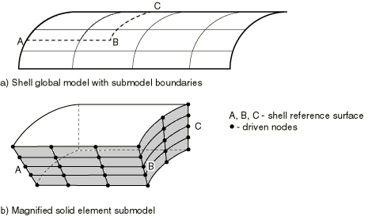

Whenever shell-to-solid submodeling is used, you must define the maximum shell thickness in the global model, given in the units used for the models. If a shell offset is defined in the global model, the shell thickness must be set equal to twice the maximum distance from the top or bottom shell surface to the shell reference surface.

| **Input File Usage: ** | ``` [*SUBMODEL](../key/key-link.md#usb-kws-msubmodel), SHELL TO SOLID, SHELL THICKNESS=*thickness* ``` |
| --- | --- |
|  | If more than one [*SUBMODEL](../key/key-link.md#usb-kws-msubmodel) option is used, the SHELL TO SOLID parameter must be included on every option. |

| **Abaqus/CAE Usage: ** | Any module: ****Model****Edit Attributes*****submodel*****: **Submodel**: **Shell global model drives a solid submodel** Load module: **Create Boundary Condition**: choose **Other** for the **Category** and **Submodel** for the **Types for Selected Step**: select region: **Shell thickness:** *thickness* |
| --- | --- |

#### Specifying the driven nodes in acoustic-to-structure submodeling

The global analysis for acoustic-to-structure submodeling problems is performed as a coupled acoustic-structural analysis. The acoustic nodal pressures from the global analysis must be written to the results file for the acoustic mesh in contact with the structural surface of interest. In the submodel analysis acoustic pressures from the global analysis drive the user-specified structural surface of interest. The driven nodes for the submodel are the nodes lying on the specified surface. Only element-based surfaces are allowed in acoustic-to-structure submodeling.

| **Input File Usage: ** | ``` [*SUBMODEL](../key/key-link.md#usb-kws-msubmodel), ACOUSTIC TO STRUCTURE, ABSOLUTE EXTERIOR TOLERANCE=*value* ``` |
| --- | --- |

| **Abaqus/CAE Usage: ** | Acoustic-to-structure submodeling is not supported in Abaqus/CAE. |
| --- | --- |

#### Specifying driven nodes for shells with acoustic pressures on both sides

In certain problems the acoustic pressure may act on both sides of a shell structure. [Figure 10.2.2--4](pt04ch10s02aus61.md#acoustic-solid-global) shows a section of a global model consisting of a shell structure that is sandwiched between two acoustic media. 

**Figure 10.2.2–4** A cross-section of the acoustic-to-structure global model with acoustic regions on both sides of the shell.

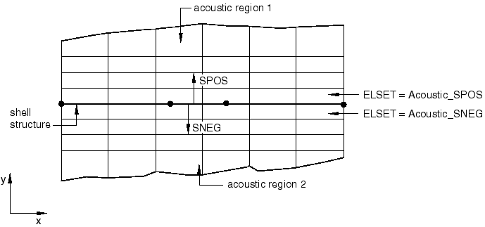

Separate element sets consisting of acoustic elements on the positive and negative sides of the shell are defined, respectively. The nodal pressures for nodes attached to elements in these sets are written to the selected results file. [Figure 10.2.2--5](pt04ch10s02aus61.md#acoustic-solid-submodel) shows the submodel that consists only of the refined shell structure. 

**Figure 10.2.2–5** The acoustic-to-structure submodel with acoustic pressure on both sides of the shell.

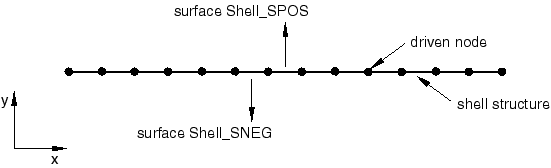

Two separate surfaces are defined on the SPOS and SNEG sides, respectively. To apply the acoustic pressure from the global analysis on each side of the shell correctly, you must specify the surface name along with the corresponding acoustic element set.

| **Input File Usage: ** | ``` [*SUBMODEL](../key/key-link.md#usb-kws-msubmodel), ACOUSTIC TO STRUCTURE, GLOBAL ELSET=*Acoustic_SPOS* *Shell_SPOS* ``` |
| --- | --- |
|  | ``` [*SUBMODEL](../key/key-link.md#usb-kws-msubmodel), ACOUSTIC TO STRUCTURE, GLOBAL ELSET=*Acoustic_SNEG* *Shell_SNEG* ``` |

| **Abaqus/CAE Usage: ** | Acoustic-to-structure submodeling is not supported in Abaqus/CAE. |
| --- | --- |

#### Defining geometric tolerances

A geometric tolerance is used to define how far a boundary node in the submodel can lie outside the exterior surface of the global model, as that surface is interpolated in the global, undeformed finite element model. By default, nodes in the submodel must lie within a distance calculated by multiplying the average element size in the global model by 0.05. You can change the tolerance, which is useful in cases where submodel driven nodes lie to a greater extent outside the global model exterior surface. Tolerances larger than this default value, however, may result in significantly greater computation times and lower accuracy in the driven solution for driven nodes significantly outside the global model exterior surface.

You can define the geometric tolerance as a fraction of the size of the average element in the global model or as an absolute distance in the length units chosen for the model. If both tolerances are defined, Abaqus uses the tighter tolerance.

| **Input File Usage: ** | Use the following option to define the geometric tolerance as an absolute distance: |
| --- | --- |
|  | ``` [*SUBMODEL](../key/key-link.md#usb-kws-msubmodel), ABSOLUTE EXTERIOR TOLERANCE=*tolerance* ``` Use the following option to define the geometric tolerance as a fraction of the size of the average element in the global model: ``` [*SUBMODEL](../key/key-link.md#usb-kws-msubmodel), EXTERIOR TOLERANCE=*tolerance* ``` |

| **Abaqus/CAE Usage: ** | Load module: **Create Boundary Condition**: choose **Other** for the **Category** and **Submodel** for the **Types for Selected Step**: select region: **Exterior tolerance: absolute:** or **relative:** *tolerance* |
| --- | --- |

##### The exterior tolerance in solid-to-solid submodeling

The exterior tolerance for a solid-to-solid submodel analysis is indicated by the shaded region in [Figure 10.2.2--6](pt04ch10s02aus61.md#asubmodel-ext-tol-solid-solid). If the distance between the driven nodes and the free surface of the global model falls within the specified tolerance, the solution variables from the global model are extrapolated to the submodel.

**Figure 10.2.2–6** The exterior tolerance in solid-to-solid submodeling.


##### The exterior tolerance in shell-to-shell submodeling

In a shell-to-shell submodel analysis Abaqus checks whether the driven nodes of the submodel lie sufficiently close to the reference surface of the shell elements in the global model. To simplify calculations, the closest point in the global model is calculated as the intersection of a line drawn through the node on the submodel with the reference surface of the shell in the global model. The direction of the line is normal to a flat surface approximation to each shell element. The normal to the flat surface is the average of the normals at the nodes of the shell element. The distance checked against the specified exterior tolerance is shown in [Figure 10.2.2--7](pt04ch10s02aus61.md#asubmodel-shell-shell).

**Figure 10.2.2–7** Flat surface approximation in shell-to-shell submodeling.

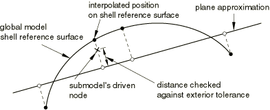

##### The exterior tolerance in shell-to-solid submodeling

For shell-to-solid submodeling Abaqus uses two kinds of tolerances to determine the relationship between the submodel and the global model. First, the closest point on the shell reference surface of the global model is determined. This point, the “image node,” is shown in [Figure 10.2.2--8](pt04ch10s02aus61.md#asubmodel-ext-tol-shell-solid). The user-specified exterior tolerance is used to check if the image node lies within the domain of the global model. Then the distance, , between the driven node and its image is checked; if the distance is less than half the value of the specified shell thickness plus the exterior tolerance, it is accepted. This check is only approximate if the global model has varying shell thickness or if the shell reference surface is offset from the midsurface.

**Figure 10.2.2–8** The exterior tolerance in shell-to-solid submodeling.


#### Permitting driven nodes to be excluded from submodeling

In some cases (such as when your submodel geometry is more detailed than the global model in regions near a free surface) you may specify driven nodes that Abaqus will find, even when accounting for the search tolerance, to be outside the region of the global model elements. By default, these cases result in an error message. In solid-to-solid submodeling you can, however, specify that Abaqus ignore driven nodes that cannot be found. Use this option with caution and always evaluate the list of nodes that are labeled as not found. Most cases where Abaqus finds driven nodes to lie outside the global model reflect a modeling error and use of the intersection only option may lead to incorrect results in these cases.

| **Input File Usage: ** | Use the following option to specify that Abaqus ignore driven nodes that cannot be found in the global model elements: |
| --- | --- |
|  | ``` [*SUBMODEL](../key/key-link.md#usb-kws-msubmodel), INTERSECTION ONLY *list of nodes or node set labels* ``` The driven nodes ignored through the use of the INTERSECTION ONLY parameter are then ignored in all subsequent submodel boundary condition references. |

### Defining the driven variables in the submodel

The actual driven variables are defined in any step as a submodel boundary condition. The boundary conditions are “driven variables” obtained from the results or output database file of the global analysis.

The degrees of freedom on the driven nodes of the submodel must exist at the forcing nodes of the global model. In a problem involving an acoustic fluid submodel driven by a structural global model, for example, acoustic interface elements should be created on the submodel's driven boundary with the structure.

For solid-to-solid and shell-to-shell submodeling specify the individual degrees of freedom to be driven. In most cases all components of the solution variables (displacements, rotations, temperatures, etc.) at these nodes are driven by the global solution, although you may choose to drive only some components at any of the driven nodes. For shell-to-solid submodeling the driven degrees of freedom are chosen automatically based on a user-specified zone around the shell reference surface, as explained later.

Abaqus/Explicit does not admit jumps in displacement and rotation boundary conditions (see ["Prescribed displacement" in "Boundary conditions in Abaqus/Standard and Abaqus/Explicit," Section 34.3.1](pt07ch34s03aus118.md#usb-prc-pboundary-prescribed-disp)); any jumps in the driven displacements and rotations will be ignored.

It is not recommended to have all the variables at all the nodes in the submodel driven by the global solution.

For acoustic-to-structure submodeling, the loads due to acoustic pressure acting at the driven nodes of the submodel are activated by specifying pressure (degree of freedom 8) along with the driven node set.

Only one submodel boundary condition can be specified in each step of the analysis.

| **Input File Usage: ** | ``` [*BOUNDARY](../key/key-link.md#usb-kws-hboundary), SUBMODEL ``` |
| --- | --- |

| **Abaqus/CAE Usage: ** | Load module: **Create Boundary Condition**: choose **Other** for the **Category** and **Submodel** for the **Types for Selected Step**: select region: **Degrees of freedom:** *degrees of freedom* |
| --- | --- |

#### Specifying the step number from the global analysis

You specify the step of the global model history that is to be used for the driven variables in the current submodel analysis step. When the global solution is obtained from the results file, the zero increment is included if it was requested in the global analysis (see ["Output," Section 4.1.1](pt02ch04s01aus38.md)).

In a general analysis step or a direct-solution steady-state dynamic analysis step, Abaqus calculates the amplitudes for the driven variables as functions of time or frequency from the results of the global model.

| **Input File Usage: ** | ``` [*BOUNDARY](../key/key-link.md#usb-kws-hboundary), SUBMODEL, STEP=*step* ``` |
| --- | --- |

| **Abaqus/CAE Usage: ** | Load module: **Create Boundary Condition**: choose **Other** for the **Category** and **Submodel** for the **Types for Selected Step**: select region: **Global step number:** *step* |
| --- | --- |

##### Scaling the global time period to the submodel time period

The global analysis and submodel analysis can have different time steps. You can scale the time variable of the driven nodes from the global analysis to the step time of the submodel analysis. This technique is useful when the analyses are static or quasi-static in nature; the use of this technique in dynamic analyses with significant inertial effects is not recommended. If the same step time is used in both the global model and the submodel, the time scale has no effect. The time scale cannot be specified in frequency domain analyses or in linear perturbation steps.

Abaqus will determine the values that the driven variables will follow throughout the step in the submodel analysis by using the points in time at which the global solution results or output database file was written. When the time variable of the driven nodes of the global analysis is scaled and if the step time is different from the submodel step time, the points in time of the driven variables are scaled to the submodel step time.

| **Input File Usage: ** | ``` [*BOUNDARY](../key/key-link.md#usb-kws-hboundary), SUBMODEL, STEP=*step*, TIMESCALE ``` |
| --- | --- |

| **Abaqus/CAE Usage: ** | Load module: **Create Boundary Condition**: choose **Other** for the **Category** and **Submodel** for the **Types for Selected Step**: select region: **Scale time period of global step to time period of submodel step** |
| --- | --- |

##### Scaling the magnitude of driven variables

For displacement-based submodeling the magnitude values of driven variables are obtained by multiplying the displacement history as obtained from the global analysis by a scaling parameter. You can scale the driven variables by setting the scaling parameter in the definition of the submodel boundary conditions. This technique is useful in scaling the submodel boundary conditions in a multiple-step analysis without rerunning the global model. It can be used in Abaqus/Standard and Abaqus/Explicit for the same-to-same and shell-to-solid cases except for acoustic-to-structure submodeling.

| **Input File Usage: ** | ``` [*BOUNDARY](../key/key-link.md#usb-kws-hboundary), SUBMODEL, STEP=*step*, SCALE=*scalarValue* ``` |
| --- | --- |

| **Abaqus/CAE Usage: ** | Load module: **Create Boundary Condition**: choose **Other** for the **Category** and **Submodel** for the **Types for Selected Step**: select region: **Scale:** *scale* |
| --- | --- |

#### Modifying the set of driven variables

You can modify the submodel boundary condition to add new variables to the list of driven variables, you can remove variables from the driven variable set, and you can reintroduce them later (see ["Boundary conditions in Abaqus/Standard and Abaqus/Explicit," Section 34.3.1](pt07ch34s03aus118.md)). New nodes cannot be added to the total set of driven nodes defined for the submodel; this set of driven nodes is a fixed part of the model definition.

| **Input File Usage: ** | Use one of the following options: |
| --- | --- |
|  | ``` [*BOUNDARY](../key/key-link.md#usb-kws-hboundary), SUBMODEL, OP=MOD [*BOUNDARY](../key/key-link.md#usb-kws-hboundary), SUBMODEL, OP=NEW ``` |

| **Abaqus/CAE Usage: ** | Load module: boundary condition editor: **Degrees of freedom** |
| --- | --- |

#### Automatically selecting the driven variables in shell-to-solid submodeling

For shell-to-solid submodeling the driven degrees of freedom at the driven nodes are chosen automatically, depending on the distance between the driven node and the global model shell reference surface. All displacement components are driven at nodes that lie on the reference surface or within a “center zone,” as shown in [Figure 10.2.2--9](pt04ch10s02aus61.md#asubmodel-center-zone). The size of the center zone is specified as part of the submodel boundary condition definition, as described below. For nodes that lie further away from the reference surface, only the displacement components parallel to the shell reference surface are driven. At least one layer of nodes in the submodel must be within the center zone; if no nodes are found this close to the reference surface, Abaqus issues an error message.

**Figure 10.2.2–9** Center zone choice in shell-to-solid submodeling.


##### Specifying the size of the center zone in shell-to-solid submodeling

The center zone method of prescribing driven variables usually provides a reasonable transfer of the plane stress assumption in the shell model. The width of this zone around the reference surface where all displacement components are driven may be different for various driven nodes or node sets. If you do not provide values for the center zone size, a default value of 10% of the maximum of the specified shell thicknesses is assumed.

For complicated geometries it can be advantageous to assign a different center zone size to different nodes or node sets.

You can view the driven nodes lying inside and outside the center zone in Abaqus/CAE by displaying the model boundary conditions (****View****ODB Display Options****) in the Visualization module.

| **Input File Usage: ** | ``` [*BOUNDARY](../key/key-link.md#usb-kws-hboundary), SUBMODEL, STEP=*step* *nodes*, *center zone size* ``` |
| --- | --- |

| **Abaqus/CAE Usage: ** | Load module: **Create Boundary Condition**: choose **Other** for the **Category** and **Submodel** for the **Types for Selected Step**: select region: **Center zone size:** *center zone size* |
| --- | --- |

##### Transferring transverse shear stresses in shell-to-solid submodeling

Usually it is enough for the layer of nodes closest to the shell reference surface to lie inside the center zone. If a very fine solid mesh is used in the thickness direction and substantial transverse shear stresses are transferred, it may be necessary to make the center zone size large enough that multiple layers of nodes lie inside the zone. However, if the transverse shear stresses at the submodel boundary are high and the submodel is highly refined in the thickness direction, high local stresses may develop since the shear force at the submodel boundary is transferred only at the driven nodes within the center zone. High transverse shear stresses occur only in regions where bending moments vary rapidly; it is better not to locate the submodel boundary in such regions. It is best to locate the submodel boundary in areas of low transverse shear stress in the global model.

### Special considerations

There are several special considerations that are worth noting.

#### Specifying the shell thickness in shell-to-shell submodeling

For shell-to-shell submodeling the shell thickness generally is not changed between the models. You can specify different shell thicknesses if, for example, a local thickness change is being investigated; however, Abaqus does not check the validity of these differences.

#### Limitations in shell-to-solid submodeling

The following limitations and special cases apply to the shell-to-solid capability:
- The global model can contain both solid and shell elements; however, when the shell-to-solid capability is used, all driven nodes must lie within shell elements in the global model. If the driven boundary lies at the border between a solid and a shell region, the driven nodes must be moved a small distance away from the solid region (see [Figure 10.2.2--10](pt04ch10s02aus61.md#asubmodel-shell-solid-lim)). **Figure 10.2.2--10** A limitation of shell-to-solid submodeling. 
- Corners or kinks may exist in global models made of shell elements. At such corners or kinks the shell elements only approximate the distribution of the material away from the midsurface of the shell (see [Figure 10.2.2--11](pt04ch10s02aus61.md#asubmodel-shell-solid-corner)). Because of such approximations, it is not possible to drive a submodel correctly if the driven nodes of the submodel lie within a shell thickness from a corner or a kink. If necessary, use the approach shown in [Figure 10.2.2--11](pt04ch10s02aus61.md#asubmodel-shell-solid-corner). **Figure 10.2.2--11** Shell-to-solid submodeling around corners.  A better approach is to include the corner or kink as part of the submodel and drive it from nodes well away from corners or kinks since they are a source of stress concentration and high stress gradients (see [Figure 10.2.2--12](pt04ch10s02aus61.md#asubmodel-shell-inter)). **Figure 10.2.2--12** Solid submodel of a shell intersection. 
- Temperature degrees of freedom cannot be driven in shell-to-solid submodeling.

#### Alternative to shell-to-solid submodeling

An alternative to shell-to-solid submodeling is the surface-based shell-to-solid coupling capability discussed in ["Shell-to-solid coupling," Section 35.3.3](pt08ch35s03aus134.md). 

### Procedures

Neither the coupled thermal-electrical procedure nor any of the mode-based dynamics procedures can be used on the submodel level. In addition, submodeling cannot be used in conjunction with symmetric model generation or symmetric results transfer. Adaptive meshes should not be used in the global model. However, they can be used in the submodel analysis; Abaqus will always treat the driven nodes in the submodel as Lagrangian nodes.

Both general (possibly nonlinear) and linear perturbation steps can be used in submodeling (see ["General and linear perturbation procedures," Section 6.1.3](pt03ch06s01aus44.md), for a discussion of general and linear perturbation steps).

#### Submodeling in dynamic procedures

The submodeling capability can be used in the dynamic procedures using explicit integration (in Abaqus/Explicit) and in the dynamic procedures using direct integration (in Abaqus/Standard). The following combinations of procedures between the global model and the submodel can be considered: explicit dynamic, implicit dynamic, dynamic coupled thermal-stress, and coupled thermal-stress. In dynamic problems in which inertial forces are significant, the global model and the submodel need to be run for the same step time intervals. 

In Abaqus/Explicit a quasi-static analysis is performed as a dynamic procedure. For this case and for the static analyses performed in Abaqus/Standard, the time step of the global model and submodel can be different. The time variable of the driven nodes from the global analysis must be scaled to the step time of the submodel analysis to match the time variable of the amplitude functions generated at the driven nodes to the step time used in the submodel.

For significantly dynamic problems in Abaqus/Explicit, a sufficiently large number of intervals need to be written to the results or output database file for the global model. Preferably the displacement results for the nodes that are used to drive the submodel should be saved for each increment. This caution is necessary in particular for problems with elastic material properties to avoid possible aliasing (under sampling), which can cause solution distortion in the submodel. These requirements do not apply to quasi-static problems.

##### Interpreting acceleration results

When you drive a submodel boundary with global model displacement results, the displacements are interpreted as a smoothed piecewise linear function in time, similar to how you would apply a displacement boundary condition using a tabular amplitude definition (see ["Using an amplitude definition with boundary conditions" in "Amplitude curves," Section 34.1.2](pt07ch34s01aus115.md#usb-prc-pamplitude-bc)). This smoothed function typically results in displacements and velocities at the driven nodes that agree reasonably with the global model. Acceleration results at the driven boundary, however, are generally not in good agreement with the global model as they reflect the shape of the displacement history smoothing rather than the global model acceleration results (information that is not available from a piecewise linear global-model displacement history). The submodel acceleration results away from the submodel driven nodes are less affected by this smoothing and are typically in good agreement with the global model response.

#### Obtaining a solution at a particular point in time using linear perturbation analysis

In Abaqus/Standard it is possible to study the submodel's linearized response corresponding to a particular point in time in the global solution by using a static, linear perturbation procedure in the submodel analysis. You can select the increment in the global analysis step that is to be used as the basis for calculating the values for the driven variables. If you do not select an increment in a static linear perturbation step, the last increment of the selected step in the global analysis is used as the basis for calculating the values for the driven variables. You cannot select an increment in a general submodel step.

| **Input File Usage: ** | ``` [*BOUNDARY](../key/key-link.md#usb-kws-hboundary), SUBMODEL, STEP=*step*, INC=*increment* ``` |
| --- | --- |

| **Abaqus/CAE Usage: ** | Load module: **Create Boundary Condition**: choose **Other** for the **Category** and **Submodel** for the **Types for Selected Step**: select region: **Global step number**: *step*, **Global increment**: *increment* |
| --- | --- |

#### Submodeling in the frequency domain

The submodeling capability can be used in the frequency domain by using the direct-solution steady-state dynamics procedure. Mode-based steady-state dynamics cannot be used at the submodel level.

The only restriction on the specification of the frequency range in the submodel is that the minimum and maximum frequency should lie within the range of calculated frequencies in the global model. Abaqus will interpolate the solution variables from the global model in the frequency domain, as well as spatially, before applying them to the submodel. The results will be most accurate if the frequencies at which the response in the submodel is requested match the frequencies at which the response was calculated in the global model. This is particularly true in the vicinity of the eigenfrequencies of the global model.

In the global model you must write both the amplitude and the phase of the nodal displacements to the results file so that Abaqus can apply the real and imaginary parts of the solution at the driven nodes in the submodel. If you are using the output database to drive the submodel, you need to request only nodal displacement output since displacement output to the output database includes both real and imaginary parts.

#### Mixing general and linear perturbation steps

It is possible to mix general steps and linear perturbation steps in both the global and the submodel analyses. Abaqus allows general analysis steps to be treated as linear perturbation steps during submodeling, and vice versa.

##### Example: Submodeling with general and linear perturbation steps

For an example of submodeling that uses both general and linear perturbation steps, consider the following situation. The global analysis consists of a static preload—done as a general, nonlinear, analysis step—followed by extraction of the eigenmodes of the preloaded structure, then a step of 5 seconds of modal dynamic response analysis:

```
[*STEP](../key/key-link.md#usb-kws-hstep)
** Apply preload
[*STATIC](../key/key-link.md#usb-kws-hstatic)
 0.1, 1.0
…
** Write out results for nodes needed to
** interpolate to the submodel's boundary
[*NODE FILE](../key/key-link.md#usb-kws-hnodefile), NSET=DETAIL
 U
[*END STEP](../key/key-link.md#usb-kws-hendstep)
[*STEP](../key/key-link.md#usb-kws-hstep)
** Calculate modes and frequencies
[*FREQUENCY](../key/key-link.md#usb-kws-hfrequency)
…
** The [*NODE FILE](../key/key-link.md#usb-kws-hnodefile) option is repeated because
** this is the first linear perturbation step
[*NODE FILE](../key/key-link.md#usb-kws-hnodefile), NSET=DETAIL
 U
[*END STEP](../key/key-link.md#usb-kws-hendstep)
[*STEP](../key/key-link.md#usb-kws-hstep)
** Dynamic response of preloaded system
[*MODAL DYNAMIC](../key/key-link.md#usb-kws-hmodaldyn)
 0.01, 5.0
…
[*END STEP](../key/key-link.md#usb-kws-hendstep)
```
We wish to study the local, possibly nonlinear, response of a part of this model that is so small that we do not need to model dynamic effects locally and can, thus, perform two steps of static analysis:
```
** Define submodel boundary (driven nodes)
[*SUBMODEL](../key/key-link.md#usb-kws-msubmodel)
PERIM
[*STEP](../key/key-link.md#usb-kws-hstep)
** Preload
[*STATIC](../key/key-link.md#usb-kws-hstatic)
 0.1, 1.0
[*BOUNDARY](../key/key-link.md#usb-kws-hboundary), SUBMODEL, STEP=1
…
[*END STEP](../key/key-link.md#usb-kws-hendstep)
[*STEP](../key/key-link.md#usb-kws-hstep)
** Local static response to global dynamic step
[*STATIC](../key/key-link.md#usb-kws-hstatic)
 0.01, 5.0
[*BOUNDARY](../key/key-link.md#usb-kws-hboundary), SUBMODEL, STEP=3
…
[*END STEP](../key/key-link.md#usb-kws-hendstep)
```
It is perfectly acceptable that the submodel analysis requests general, possibly nonlinear, analysis for both steps, while in the global analysis the dynamic step was a linear perturbation step (modal dynamics is always a linear perturbation analysis). It is your responsibility to judge that this use of the submodeling feature is reasonable. For example, suppose that the global analysis were continued with a fourth step of general, nonlinear static response:
```
[*RESTART](../key/key-link.md#usb-kws-mrestart), READ, STEP=3
** Read state at end of initial preload
** (could equally well use [*RESTART](../key/key-link.md#usb-kws-mrestart), READ, STEP=1)
[*STEP](../key/key-link.md#usb-kws-hstep)
** Add more preload
[*STATIC](../key/key-link.md#usb-kws-hstatic)
 0.2, 1.0
…
[*END STEP](../key/key-link.md#usb-kws-hendstep)
```
This fourth general analysis step starts with the state at the end of general analysis Step 1 because the frequency extraction and the modal dynamic steps are both linear perturbation steps. However, if we restart the submodel analysis in the same way, the solution may not be comparable with the global model solution: 
```
[*RESTART](../key/key-link.md#usb-kws-mrestart), READ, STEP=2
** Read state at end of step 2
[*STEP](../key/key-link.md#usb-kws-hstep)
** Add more preload
[*STATIC](../key/key-link.md#usb-kws-hstatic)
 0.2, 1.0
[*BOUNDARY](../key/key-link.md#usb-kws-hboundary), SUBMODEL, STEP=4
…
[*END STEP](../key/key-link.md#usb-kws-hendstep)
```
The second step in the submodel is a general analysis step, to which the response may be nonlinear, thus changing the state of the model. A valid alternative would be to apply the Step 4 response to the submodel immediately after the first step:
```
[*RESTART](../key/key-link.md#usb-kws-mrestart), READ, STEP=1
** Read state at end of preload step
[*STEP](../key/key-link.md#usb-kws-hstep)
** Add more preload
[*STATIC](../key/key-link.md#usb-kws-hstatic)
 0.2, 1.0
[*BOUNDARY](../key/key-link.md#usb-kws-hboundary), SUBMODEL, STEP=4
…
[*END STEP](../key/key-link.md#usb-kws-hendstep)
```

#### Reinterpreting solution variables in the submodel analysis

During general analysis steps Abaqus works in terms of total solution variables such as the displacements, . In linear perturbation steps Abaqus works in terms of the displacement perturbation, , about a base state, . When general analysis steps and linear perturbation steps are reinterpreted in the submodel analysis, the global analysis results are treated as defined in [Table 10.2.2--1](pt04ch10s02aus61.md#table-submodel-sol-vars). 

**Table 10.2.2–1** Reinterpreting solution variables in the submodel analysis.
| Global analysis step basis | Submodel step basis | Global increment specified in definition of submodel boundary condition | Driven variable basis |
| --- | --- | --- | --- |
| General | General | none |  |
| Linear perturbation | General | none |  |
| General | Static, linear perturbation |  | 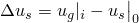 |
| Linear perturbation | Static, linear perturbation |  | 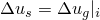 |

In this table

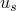

is the current value of a driven variable in the submodel at any time during a general, nonlinear, analysis step;

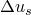

is the value of the perturbation of a driven variable in the submodel during a linear perturbation step;

 and 

are the corresponding values of the same (geometrically interpolated) variable in the global model;


is the “base state” value of the variable during a linear perturbation step in the global analysis;

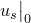

is the “base state” value of the variable during a linear perturbation step in the submodel analysis;

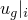

is the value of  at increment *i* of the global analysis step; and

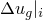

is the value of  at increment *i* of the global analysis step.

#### Mixing general and linear perturbation steps in shell-to-solid submodeling

Additional assumptions must be made for the shell-to-solid case when a general procedure on the global model drives a linear perturbation procedure on the submodel and vice versa. The assumptions depend on the geometric formulation used (linear or nonlinear) and on the procedure combination. For details and governing equations for these cases, see ["Submodeling analysis," Section 2.15.1 of the Abaqus Theory Guide](../stm/stm-link.md#stm-anl-submodeling).

### Initial conditions

The definition of initial conditions should be consistent between the global model and the submodel.

### Boundary conditions

Boundary conditions (other than submodel boundary conditions) prescribed on the degrees of freedom that are driven will replace those prescribed using submodel boundary conditions. When this replacement occurs, Abaqus reports the change in the data file.

A node can be driven from the global model in some steps and have user-prescribed boundary conditions in other steps. In these cases all relevant boundary conditions must be respecified (see ["Boundary conditions in Abaqus/Standard and Abaqus/Explicit," Section 34.3.1](pt07ch34s03aus118.md)).

Any other boundary conditions that are applied in the submodel region should be imposed in the submodel analysis in the usual way. It is your responsibility to apply such prescribed boundary conditions to the submodel correctly so that they correspond to the loading of the global model.

Be careful with submodel boundary nodes that are also on planes of symmetry, where both forms of boundary conditions can be applied. It may be helpful in such cases to apply boundary conditions in a local coordinate system (see ["Transformed coordinate systems," Section 2.1.5](pt01ch02s01aus09.md)). The local coordinate system should be applied only to the boundary conditions that are intended to override the submodel boundary conditions, since the submodel boundary conditions are always output in the global coordinate directions by the global model.

### Loads

Any loads that are applied in the submodel region must be imposed in the submodel analysis in the usual way. It is your responsibility to apply such loads to the submodel correctly so that they correspond to the loading of the global model. See ["Applying loads: overview," Section 34.4.1](pt07ch34s04aus120.md), for an overview of the loads available in Abaqus.

### Predefined fields

The following predefined fields can be specified in a submodeling analysis, as described in ["Predefined fields," Section 34.6.1](pt07ch34s06aus128.md):
- Nodal temperatures can be specified. Any difference between the applied and initial temperatures will cause thermal strain if a thermal expansion coefficient is given for the material (["Thermal expansion," Section 26.1.2](pt05ch26s01abm52.md)). The specified temperature also affects temperature-dependent material properties, if any.
- The values of user-defined field variables can be specified. These values affect only field-variable-dependent material properties, if any.

Abaqus interpolates solution variables onto the submodel driven nodes. It can also interpolate temperatures as field variables (see ["Interpolating data between meshes" in "Predefined fields," Section 34.6.1](pt07ch34s06aus128.md#usb-prc-pfields-tempinterpolate), for details). Other predefined fields will not be interpolated to the nodes of the submodel; they must be available from the input data for all nodes of the submodel where they are required.

Abaqus/Standard provides multiple approaches for cases where a submodel thermal-stress analysis must be performed using temperature solutions from a global heat transfer analysis. 
- Run a heat transfer analysis of the global model, and write the nodal temperatures to the results or output database file. Run a sequentially coupled thermal-stress analysis of the global model. The temperatures obtained from the results or output database file of the global heat transfer analysis are field variables in this case. If the mesh used in the thermal-stress analysis is different from the mesh in the heat transfer analysis, specify that Abaqus/Standard should interpolate the temperature field from the heat transfer analysis mesh to the thermal-stress analysis mesh. Run a thermal-stress analysis of the submodel using the results or output database file for the global thermal-stress analysis to read the driven variables (displacement field) and using the results or output database file from either the global heat transfer analysis or the global thermal-stress analysis to read the temperatures as field variables. In either case the temperature field will have to be interpolated to the current submodel nodes. If interpolation between dissimilar meshes is necessary, the global output database file must be used to read the temperatures. For details, see [Figure 10.2.2--13](pt04ch10s02aus61.md#usb-anl-sub-mesh2) and [Figure 10.2.2--14](pt04ch10s02aus61.md#usb-anl-sub-mesh3). **Figure 10.2.2--13** Sequentially coupled thermal-stress analysis for the global model with only a thermal-stress analysis for the submodel. 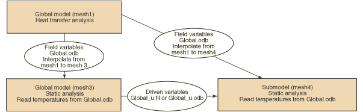 **Figure 10.2.2--14** Sequentially coupled thermal-stress analysis for the global model with only a thermal-stress analysis for the submodel. 
- Run a heat transfer analysis of the global model, and write the nodal temperatures to the results or output database file. Run a sequentially coupled thermal-stress analysis (the global thermal-stress analysis) using the same mesh (mesh1) as the global heat transfer analysis and the temperatures from the results or output database file for the global heat transfer analysis. Next, run a submodel heat transfer analysis using the mesh (mesh2) that is required for the final submodel thermal-stress analysis, and write the nodal temperatures to the results or output database file. Use the temperature solution from the global heat transfer analysis to drive the solution of the submodel heat transfer analysis. Finally, run the submodel thermal-stress analysis using the temperatures (as field variables) obtained from the results or output database file for the submodel heat transfer analysis and the displacements (as driven variables) obtained from the global thermal-stress analysis. See the detailed flow chart in [Figure 10.2.2--15](pt04ch10s02aus61.md#usb-anl-sub-mesh1). **Figure 10.2.2--15** Sequentially coupled thermal-stress analysis for both the global model and submodel. 

### Material options

Any of the material models described in [Part V, "Materials](pt05.md),” can be used in the global and submodel analyses. The material response defined for the submodel may be different from that defined for the global model.

### Elements

The dimensionality of the submodel must be the same as that of the global model: both models must be either two-dimensional or three-dimensional. The following limitations apply:
- The boundary nodes of the submodel must lie within regions of the global model where Abaqus is able to perform spatial interpolation to define the values of the driven variables. Therefore, they must lie within (or, as allowed by the exterior tolerance, near to) two- or three-dimensional geometrically defined elements in the global model. Such geometrically defined elements are: - first- or second-order triangles or quadrilaterals in two dimensions; - first- or second-order triangular or quadrilateral shells; and - first- or second-order tetrahedra, wedges, or bricks in three dimensions.
- When shell elements with five degrees of freedom per node (S4R5, S8R5, STRI65, etc.) are used in the global model, the rotations are not written to the results file or the output database; therefore, only the displacement degrees of freedom can be driven. This restriction suggests that submodeling should not be used with these elements or that the submodel should include a set of narrow elements around its driven edges so that the interpolated displacements at these nodes effectively transfer the rotation. Five degree of freedom shells cannot be used in shell-to-solid submodeling.
- The boundary nodes cannot lie in regions of the global model where there are only one-dimensional elements (beams, trusses, links, axisymmetric shells) since Abaqus does not provide the necessary interpolation of results for such elements.
- The boundary nodes cannot lie in regions of the global model where there are only user elements, substructures, springs, dashpots, etc. since those element types do not allow for geometric interpolation.
- The boundary nodes cannot lie in regions of the global model where there are only axisymmetric solid elements with nonlinear, asymmetric deformation (CAXA elements). The submodeling capability is currently not supported for these elements.
- The reference node associated with generalized plane strain elements (CPEG) cannot be used as a driven boundary node in a submodeling analysis.

### Output

Any of the output normally available within a particular procedure is also available during a submodeling analysis (see ["Abaqus/Standard output variable identifiers," Section 4.2.1](pt02ch04s02abv01.md), and ["Abaqus/Explicit output variable identifiers," Section 4.2.2](pt02ch04s02xbv01.md)).

As described above, nodal output requests to the results file or output database file must be used in the global analysis to save the values of the driven variables at the submodel boundary.

### Input file template

#### Global analysis:

```
[*HEADING](../key/key-link.md#usb-kws-mheading)
…
[*STEP](../key/key-link.md#usb-kws-hstep)
Step 1
[*STATIC](../key/key-link.md#usb-kws-hstatic) (*or* [*DYNAMIC](../key/key-link.md#usb-kws-hdynamic), *etc.*)
*Data line to define step time and control incrementation*
…
[*NODE FILE](../key/key-link.md#usb-kws-hnodefile)
*List of solution variables to be used to drive the submodel*
[*OUTPUT](../key/key-link.md#usb-kws-houtput), FIELD
[*NODE OUTPUT](../key/key-link.md#usb-kws-hnodeoutput)
*List of solution variables to be used to drive the submodel*
[*END STEP](../key/key-link.md#usb-kws-hendstep)
```

#### Submodel analysis:

```
[*HEADING](../key/key-link.md#usb-kws-mheading)
…
[*SUBMODEL](../key/key-link.md#usb-kws-msubmodel), EXTERIOR TOLERANCE=*tolerance*
*List of all nodes to be driven*
**
[*STEP](../key/key-link.md#usb-kws-hstep)
[*STATIC](../key/key-link.md#usb-kws-hstatic) (*or any other allowable procedure*)
*Data line to define step time (must be the same as the step time in the global analysis unless the*
*TIMESCALE parameter is used on the [*BOUNDARY](../key/key-link.md#usb-kws-hboundary) option) and control incrementation*
…
[*BOUNDARY](../key/key-link.md#usb-kws-hboundary), SUBMODEL, STEP=1
*Data lines listing nodes and degrees of freedom to be driven in this step*
…
[*END STEP](../key/key-link.md#usb-kws-hendstep)
```


