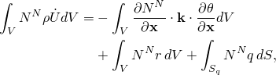
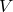
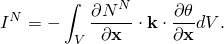
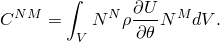
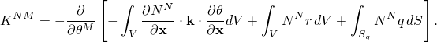

# 10.3.2 Generating thermal matrices


**Product: **Abaqus/Standard  

##### **References**

- ["Element matrix assembly utility," Section 3.2.26](pt01ch03s02abx26.md)
- [*ELEMENT OPERATOR OUTPUT](../key/key-link.md#usb-kws-helementoperatoroutput)

### Overview

Thermal matrix generation:
- allows for the mathematical abstraction of model data such as mesh and material information by generating global or element matrices representing the thermal conductivity, heat capacity, and load at specific times;
- writes matrix data to a binary SIM document that can be further processed by Abaqus; and
- can be used only as part of an uncoupled heat transfer analysis.

### Introduction

A linearized heat transfer finite element model can be summarized in terms of the thermal load vector and thermal matrices that represent the heat capacity and the thermal conductivity. This mathematical abstraction serves various purposes. For example, you can use these matrices to exchange model data with other users, vendors, or software packages without exchanging mesh or material information. You can also use these matrices in techniques such as model order reduction. This abstraction can also be extended to transient nonlinear problems, which can be treated as a series of piecewise linear models constructed from thermal matrix data at discrete times.

Thermal matrix generation occurs in a heat transfer analysis and accounts for all the current boundary conditions, loads, and material response in the model. The generated matrices are stored in a SIM document named `*jobname*THERM*n*.sim`, where *jobname* is the name of the input file or analysis job and *n* is the number of the Abaqus heat transfer step that generates the matrices. 

#### Defining matrix types

The continuous time description of the spatially discretized heat transfer equation (see ["Uncoupled heat transfer analysis," Section 2.11.1 of the Abaqus Theory Guide](../stm/stm-link.md#stm-anl-uncoupledheat)) is



 where  is the temperature field,  are the finite element interpolation functions,  is the material density,  is the material time derivative of the internal energy,  is the (possibly anisotropic) conductivity matrix,  is the prescribed heat flux per unit volume,  is the volume of the domain, and  is the surface on which heat flux per unit area  is either directly prescribed or specified through film and radiation conditions.

The external flux vector  is defined as


The internal flux vector  is defined as



The net flux vector  is defined as the sum of the internal flux vector  and the external flux vector . The heat capacity matrix  is defined as



The thermal conductivity matrix  is defined as



That is, the thermal conductivity matrix is the negated derivative of the net flux vector with respect to the nodal temperature vector  and, hence, includes the effect of temperature-dependent flux conditions such as film and radiation.

#### Specifying the matrix type

You can generate thermal matrices representing the following model features:
- heat capacity
- thermal conductivity
- loads

The thermal conductivity matrix has an unsymmetric contribution if the thermal conductivity property is temperature dependent. This term is taken into account only if the unsymmetric solver has been activated in the step definition (see ["Defining an analysis," Section 6.1.2](pt03ch06s01abo05.md)). 

The load matrix contains either the nodal external flux vector or the net flux vector corresponding to the loading defined in the heat transfer step. 

| **Input File Usage: ** | Use the following option to generate the heat capacity matrix: |
| --- | --- |
|  | ``` [*ELEMENT OPERATOR OUTPUT](../key/key-link.md#usb-kws-helementoperatoroutput), DAMPING ``` Use the following option to generate the thermal conductivity matrix: ``` [*ELEMENT OPERATOR OUTPUT](../key/key-link.md#usb-kws-helementoperatoroutput), STIFFNESS ``` Use the following option to generate the external flux vector: ``` [*ELEMENT OPERATOR OUTPUT](../key/key-link.md#usb-kws-helementoperatoroutput), LOAD, LOADTYPE=EXTERNAL ``` Use the following option to generate the net flux vector: ``` [*ELEMENT OPERATOR OUTPUT](../key/key-link.md#usb-kws-helementoperatoroutput), LOAD, LOADTYPE=NET ``` |

#### Generating matrices for a part of the model

By default, thermal matrices are generated for all supported element types in the model. You can request that Abaqus/Standard generate matrices for a part of the model defined by an element set.

| **Input File Usage: ** | ``` [*ELEMENT OPERATOR OUTPUT](../key/key-link.md#usb-kws-helementoperatoroutput), ELSET=*element set name* ``` |
| --- | --- |

#### Specifying the frequency of matrix generation

By default, thermal matrices are generated for every increment in the step in which it is requested. You can request that Abaqus/Standard generate matrices at a specified frequency.

| **Input File Usage: ** | ``` [*ELEMENT OPERATOR OUTPUT](../key/key-link.md#usb-kws-helementoperatoroutput), FREQUENCY=*output frequency* ``` |
| --- | --- |

#### Generating assembled matrices

By default, thermal matrices are written to the SIM document in element-by-element form. You can write assembled matrices to the SIM document, which is recommended when thermal matrix output is requested for large element sets or at frequent intervals.

| **Input File Usage: ** | ``` [*ELEMENT OPERATOR OUTPUT](../key/key-link.md#usb-kws-helementoperatoroutput), ASSEMBLE ``` |
| --- | --- |

### Initial conditions

Thermal matrix generation occurs in a general analysis procedure. Therefore, the generated matrices include the effect of initial conditions in transient analyses.

### Boundary conditions

 Prescribed temperature boundary conditions are not imposed on the generated thermal matrices and load vector. 

### Loads

All types of loads supported in an uncoupled heat transfer analysis can be used for thermal matrix generation. For more information on applying loads, see ["Applying loads: overview," Section 34.4.1](pt07ch34s04aus120.md). Load types that are functions of temperature (such as film and radiation) contribute additional “load stiffness” terms to the thermal conductivity matrix.

### Predefined fields

All types of predefined fields can be specified for thermal matrix generation. For more information on specifying predefined fields, see ["Predefined fields," Section 34.6.1](pt07ch34s06aus128.md).

### Material options

All types of materials that are available in Abaqus/Standard for uncoupled heat transfer can be used for thermal matrix generation. 

### Elements

Only continuum diffusive heat transfer elements and thermal contact elements are supported for thermal matrix generation. Thermal matrices are written to the SIM document only for supported elements.

### Output

The generated matrices are written to the output SIM document in either element-by-element or assembled form. For efficiency, only nonzero matrix entries are stored in the SIM document. If the matrix is symmetric, only the nonzero entries in the upper triangular portion of the matrix are stored. You can use the matrix assembly utility (["Element matrix assembly utility," Section 3.2.26](pt01ch03s02abx26.md)) to assemble element matrices in the SIM document and/or write assembled matrices to text files.

### Limitations

Constraints that are implemented using the degree-of-freedom elimination technique (such as tie constraints) are not processed for thermal matrix output. In addition, cavity radiation effects are not considered for thermal matrix output.

### Input file template

```
[*HEADING](../key/key-link.md#usb-kws-mheading)
…
**
[*STEP](../key/key-link.md#usb-kws-hstep)
*Options to define an uncoupled heat transfer analysis.*
…
[*BOUNDARY](../key/key-link.md#usb-kws-hboundary)
*Options to define the boundary conditions for the heat transfer step.*
**
[*CFLUX](../key/key-link.md#usb-kws-hcflux) and/or [*DFLUX](../key/key-link.md#usb-kws-hdflux) and/or [*DSFLUX](../key/key-link.md#usb-kws-hdsflux)
*Data lines to define thermal loading*
[*FILM](../key/key-link.md#usb-kws-hfilm) and/or [*SFILM](../key/key-link.md#usb-kws-hsfilm) and/or [*RADIATE](../key/key-link.md#usb-kws-hradiate) and/or [*SRADIATE](../key/key-link.md#usb-kws-hsradiate)
*Data lines to define convective film and radiation conditions*
**
[*ELEMENT OPERATOR OUTPUT](../key/key-link.md#usb-kws-helementoperatoroutput), ASSEMBLE, STIFFNESS, DAMPING, 
LOAD, LOADTYPE=EXTERNAL, FREQUENCY=1
**
*Options to define the output requests for the heat transfer step. *
**
[*END STEP](../key/key-link.md#usb-kws-hendstep)
```


