# 10.4.3 Analysis of models that exhibit cyclic symmetry


**Products: **Abaqus/Standard  Abaqus/CAE  

##### **References**

- ["Natural frequency extraction," Section 6.3.5](pt03ch06s03at10.md)
- ["Mode-based steady-state dynamic analysis," Section 6.3.8](pt03ch06s03at13.md)
- [*CYCLIC SYMMETRY MODEL](../key/key-link.md#usb-kws-mcycsymmodel)
- [*SELECT CYCLIC SYMMETRY MODES](../key/key-link.md#usb-kws-hselectcycsymmodes)
- [*SURFACE](../key/key-link.md#usb-kws-msurface)
- [*TIE](../key/key-link.md#usb-kws-mtie)
- ["Defining cyclic symmetry," Section 15.13.19 of the Abaqus/CAE User's Guide](../usi/usi-link.md#usi-itn-help-cyclicsymmetry)

### Overview

The cyclic symmetry analysis technique in Abaqus/Standard:
- makes it possible to analyze the behavior of a 360 structure with cyclic symmetry based on a model of a repetitive sector;
- can determine the response to cyclic symmetric loading in static, quasi-static, and heat transfer analyses;
- can calculate all eigenfrequencies and eigenmodes of the 360 structure with the block Lanczos eigenfrequency extraction procedure;
- can determine the response to loading corresponding to a given cyclic symmetry mode in modal-based steady-state dynamic analysis; and
- does not require that matched meshes be used on the symmetry surfaces.

### Introduction

Structures that exhibit cyclic symmetry provide the analyst with an opportunity to model an entire 360 structure at considerably reduced computational expense by analyzing only a single repetitive sector of the model. Typically, this is the smallest sector that can be identified, although this is not necessary. For example, if a structure consists of 16 repetitive sectors it is possible to use a 45 model containing two repetitive sectors. The sectors are numbered in the counterclockwise direction to the axis of cyclic symmetry (as described further below). Of course this is less efficient than using a 22.5 model with one sector. There is no restriction that the meshes on the two symmetry surfaces of a repetitive sector match in any way.

There are two basic cases that must be considered in such an analysis: a model that has a cyclic symmetric initial state and a cyclic symmetric response, and a model with a cyclic symmetric initial state but a nonsymmetric response. The cyclic symmetry capability in Abaqus/Standard provides for linear and nonlinear analysis of cyclic symmetric structures with cyclic symmetric response. The condition that the structure be cyclic symmetric holds throughout the analysis, so in a loading step it is not possible to have any nonsymmetric deformation in the structure at any time. Therefore, only cyclic symmetric loads can be applied for this situation.

Analysis of cyclic symmetric structures that exhibit nonsymmetric response requires additional consideration. Such an analysis can be performed only in a linear perturbation step, since the nonsymmetric deformation invalidates the assumption of a cyclic symmetric “base state” for any subsequent step in a general nonlinear analysis. The full response of an entire cyclic symmetric structure, such as the structure illustrated in [Figure 10.4.3--1](pt04ch10s04at34.md#acyclicsym-general-sym), can be represented as a linear combination of several independent basic responses, each of which corresponds to some *k*-fold cyclic symmetry mode. 

**Figure 10.4.3–1** Cyclic symmetric structure.


The cyclic symmetry mode number, which is sometimes also referred to as the “nodal diameter,” indicates the number of waves along the circumference in a basic response. [Figure 10.4.3--2](pt04ch10s04at34.md#acyclicsym-0-fold), [Figure 10.4.3--3](pt04ch10s04at34.md#acyclicsym-1-fold), and [Figure 10.4.3--4](pt04ch10s04at34.md#acyclicsym-2-fold) illustrate basic responses corresponding to the 0-, 1-, and 2-fold modes (nodal diameters 0, 1, and 2) in a cyclic symmetric structure containing four repetitive sectors. A full linear perturbation analysis can be performed by solving a sequence of corresponding linear analyses for a symmetric single sector. Cyclic symmetric boundary conditions (associated with various cyclic symmetry modes) on the single sector give rise to Hermitian stiffness and mass matrices (complex matrices with symmetric real parts and skew-symmetric imaginary parts). The *k*th linear analysis in the sequence is performed using symmetry conditions that correspond to the *k*-fold cyclic symmetry mode of the structural response. For a structure exhibiting *N*-fold cyclic symmetry, only  (*N* even) or  (*N* odd) such analyses are required. This results in a solution for the response of the entire structure at a relatively low computational expense.

**Figure 10.4.3–2** Response corresponding to the 0-fold cyclic symmetry mode.

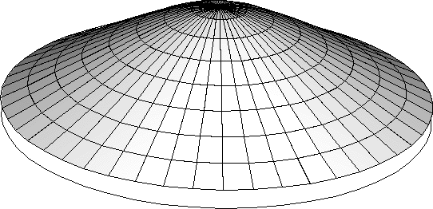

**Figure 10.4.3–3** Response corresponding to the 1-fold cyclic symmetry mode.


**Figure 10.4.3–4** Response corresponding to the 2-fold cyclic symmetry mode.

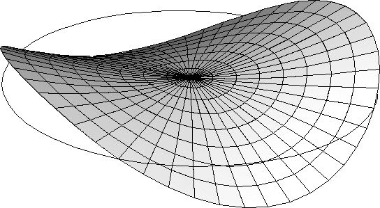

To perform a general linear analysis of a cyclic symmetric structure, the external forces should be represented as a linear combination of basic loads, each of which corresponds to a symmetry mode and excites a structural response corresponding to the same mode. In static analysis a capability to define loads on any mode other than the 0-fold mode has not yet been implemented. As the response of the 0-fold mode preserves cyclic symmetry, analysis of this type of structure can be done in a general nonlinear step, as well as in a linear perturbation step (as described above). For the same reason, such a step can be used as a preload step for a cyclic symmetric linear perturbation step.

Extraction of a nonsymmetrical response for a cyclic symmetric structure is currently available only for eigenfrequency extraction analysis (["Natural frequency extraction," Section 6.3.5](pt03ch06s03at10.md)) using the block Lanczos method and for frequency domain, modal-based steady-state dynamic analysis (["Mode-based steady-state dynamic analysis," Section 6.3.8](pt03ch06s03at13.md)). Natural frequencies corresponding to both symmetric and nonsymmetric eigenmodes can be extracted for a specific cyclic symmetry mode, for a group of cyclic symmetry modes, or for all cyclic symmetry modes. They can be used within the subsequent steady-state dynamic analysis. The eigenmodes onto which the solution is projected are chosen as described in ["Selecting the modes and specifying damping" in "Mode-based steady-state dynamic analysis," Section 6.3.8](pt03ch06s03at13.md#usb-anl-asteadystdyn-selecteigen-damping).

In a steady-state modal-based dynamic analysis, concentrated, distributed, and surface loads can be defined as projected onto a specific cyclic symmetry mode. Within the same steady-state dynamics step all applied loads have to be given as projected onto the same cyclic symmetry mode. This limitation implies that the specified cyclic symmetry mode must be the same for all loads within the given steady-state dynamics step.

### Defining a cyclic symmetric model

Define the mesh for a single sector of the model, the so called “datum sector.” Specify the number of sectors, *n*, in the 360 model. Define the axis of symmetry by specifying the coordinates (in the global coordinate system) of two points lying on the axis. The axis direction is from the first point to the second point, and the sectors are numbered counterclockwise around the axis, with the datum sector as sector number 1. For a two-dimensional model only a single point needs to be given on the axis. The axis direction is assumed to be in the positive *z*-direction; hence, the sectors are numbered counterclockwise in the *x*–*y* plane.

| **Input File Usage: ** | ``` [*CYCLIC SYMMETRY MODEL](../key/key-link.md#usb-kws-mcycsymmodel), N=*n* ``` |
| --- | --- |
|  | In a model defined in terms of an assembly of part instances, the [*CYCLIC SYMMETRY MODEL](../key/key-link.md#usb-kws-mcycsymmodel) option must appear within the model definition (see ["Defining an assembly," Section 2.10.1](pt01ch02s10aus28.md)). |

| **Abaqus/CAE Usage: ** | Interaction module: ****Interaction****Create****: **Cyclic symmetry**: **Total number of sectors**: *n* |
| --- | --- |

#### Applying cyclic symmetry constraints

To apply the cyclic symmetry constraints, you must define one or more pairs of corresponding surfaces on each side of the datum sector (see ["Surfaces: overview," Section 2.3.1](pt01ch02s03aus16.md)). You can then apply the cyclic symmetry constraints between the pairs of corresponding surfaces using a cyclic symmetry surface-based tie constraint (see ["Defining tied contact in Abaqus/Standard," Section 36.3.7](pt09ch36s03aus151.md)). The first surface of each pair specified in the tie constraint definition is the slave surface, and all degrees of freedom of the nodes in the surface will be eliminated by internally generated multi-point constraints. The second surface of each pair is a master surface. If more than one pair of slave/master surfaces is defined, the rotation direction from the slave surface to the master surface must be the same for all pairs (i.e., clockwise or counterclockwise).

| **Input File Usage: ** | Use the following options to apply a cyclic symmetry constraint between two surfaces: |
| --- | --- |
|  | ``` [*SURFACE](../key/key-link.md#usb-kws-msurface), NAME=*master* [*SURFACE](../key/key-link.md#usb-kws-msurface), NAME=*slave* [*TIE](../key/key-link.md#usb-kws-mtie), CYCLIC SYMMETRY, NAME=*cyclic* *slave, master* ``` |

| **Abaqus/CAE Usage: ** | Interaction module: ****Interaction****Create****: **Cyclic symmetry**: click **Surface** in the prompt area |
| --- | --- |

##### Using mismatched surface meshes

In the case of mismatched surface meshes, as shown in [Figure 10.4.3--5](pt04ch10s04at34.md#acyclicsym-mismatching), the finer mesh should typically be the slave surface. Mismatched meshes may cause some local inaccuracies in the stress field. The magnitude of the inaccuracies depends on the degree of mismatch between the meshes as well as on the element type used: the inaccuracies are typically most pronounced for second-order (modified) tetrahedral elements. Hence, if mismatched surface meshes are used, it is recommended that the sector boundaries be chosen in areas where accuracy of the local stress field is not critical.

**Figure 10.4.3–5** Cyclic symmetry surfaces with mismatched nodes.


For shells the cyclic symmetry condition has to be applied to the nodes on the edges of the shell elements. Currently cyclic symmetry is not supported for element-based surfaces defined on the edges of shells. Therefore, if mismatched meshes are used for shell elements, an element-based surface should be defined on the top or bottom of the shell elements adjacent to the edges that form the master surface. A node-based surface can be defined on the edge that forms the slave surface.

##### Applying node-to-node cyclic symmetry constraints

In the case of matched meshes, either surface can be chosen as the slave surface. If the surfaces have matched meshes, as shown in [Figure 10.4.3--6](pt04ch10s04at34.md#acyclicsym-matching), it is possible to use a node-based master surface to obtain node-to-node cyclic symmetry constraints. The advantage of this is that Abaqus/Standard will adjust the positions of the nodes on the slave surface so that they precisely match the positions of the nodes on the master surface. This yields the most accurate results and minimizes the computational cost. In this case the slave surface will typically be chosen as a node-based surface as well, although computationally it does not matter since in either case a strict node-to-node constraint is applied.

**Figure 10.4.3–6** Cyclic symmetry surfaces with node-to-node matching.


For discrete members (such as trusses or beams) the cyclic symmetry condition can be enforced only using node-based surfaces.

| **Input File Usage: ** | Use the following options to apply a cyclic symmetry constraint between two node-based surfaces: |
| --- | --- |
|  | ``` [*SURFACE](../key/key-link.md#usb-kws-msurface), TYPE=NODE, NAME=*master* [*SURFACE](../key/key-link.md#usb-kws-msurface), TYPE=NODE, NAME=*slave* [*TIE](../key/key-link.md#usb-kws-mtie), CYCLIC SYMMETRY, NAME=*cyclic* *slave, master* ``` |

| **Abaqus/CAE Usage: ** | Interaction module: ****Interaction****Create****: **Cyclic symmetry**: click **Node Region** in the prompt area |
| --- | --- |

#### Applying cyclic symmetry conditions on the symmetry axis

If a node is located on the symmetry axis, special cyclic symmetry constraints must be applied for the 0-fold and 1-fold cyclic symmetry modes; whereas all degrees of freedom must be constrained for the other cyclic symmetry modes. For the 0-fold cyclic symmetry mode the degrees of freedom in the plane orthogonal to the symmetry axis are constrained; for the 1-fold cyclic symmetry mode the degrees of freedom along the symmetry axis are constrained. Abaqus/Standard will create these constraints automatically as long as the node is included in the definition of the slave surface, the master surface, or both the slave and master surfaces.

### Obtaining all eigenfrequencies of a cyclic symmetric structure

The natural frequencies and corresponding eigenmodes of a cyclic symmetric structure can be extracted using the eigenfrequency extraction procedure with the Lanczos eigensolver (see ["Natural frequency extraction," Section 6.3.5](pt03ch06s03at10.md)). No additional information is required for the eigenfrequency extraction procedure. All the natural frequencies are sorted in the conventional (ascending) order. For each natural frequency the cyclic symmetry mode number is reported.

The eigenmodes are written in the order corresponding to natural frequencies to the data (`.dat`), results (`.fil`), and output database (`.odb`) files for the user-specified datum sector only. These modes can be expanded in Abaqus/CAE to the entire structure depending on the cyclic symmetry mode number.

There are two different types of eigenmodes: single and paired. The eigenmodes for 0-fold cyclic symmetry are always single. For even *N* the eigenmodes for the 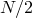-fold cyclic symmetry are also single. The eigenmodes for the remaining 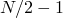 (even *N*) or 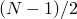 (odd *N*) cyclic symmetry modes are paired. The natural frequencies corresponding to the paired eigenmodes are equal and always appear together in the table of the natural frequencies in the data file. The expansion of the eigenmodes with *k*-fold cyclic symmetry () to the sector  can be done in the following manner:

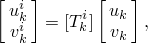

where

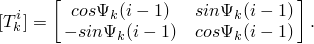

Here  and  are paired eigenmodes corresponding to double natural frequencies on the first (datum) sector and on the *i*th sectors, respectively; and 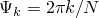.

From the expressions above it is clear that eigenmodes with 0-fold cyclic symmetry are always symmetric; i.e., . Similarly, for even *N* the eigenmodes with 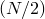-fold cyclic symmetry are single, since 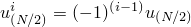.

### Selecting the cyclic symmetry modes

You can select the cyclic symmetry modes for which the eigenfrequency analysis will be performed by specifying the lowest cyclic symmetry mode to be used in the analysis, *nmin*, and the highest cyclic symmetry mode to be used in the analysis, *nmax*. By default, *nmin* is 0. By default, *nmax* is  (even *N*) or  (odd *N*). The value of *nmin* cannot be greater than the value of *nmax*, and the value of *nmax* cannot be greater than the default value. If you do not select the cyclic symmetry modes, all possible cyclic symmetry modes are considered in the analysis. You can choose to use only the even cyclic symmetry modes.

| **Input File Usage: ** | Use the following option to specify the cyclic symmetry modes: |
| --- | --- |
|  | ``` [*SELECT CYCLIC SYMMETRY MODES](../key/key-link.md#usb-kws-hselectcycsymmodes), NMIN=*nmin*, NMAX=*nmax* ``` Use the following option to request only the even cyclic symmetry modes: ``` [*SELECT CYCLIC SYMMETRY MODES](../key/key-link.md#usb-kws-hselectcycsymmodes), EVEN ``` |

| **Abaqus/CAE Usage: ** | Use the following option to specify the cyclic symmetry modes: |
| --- | --- |
|  | Interaction module: ****Interaction****Create****: **Cyclic symmetry**: toggle on **Specified range** and specify the **Lowest nodal diameter** and **Highest nodal diameter** You cannot request only the even cyclic symmetry modes in Abaqus/CAE. |

#### Selecting the cyclic symmetry mode for a steady-state dynamic step

Only a single cyclic mode can be excited in a steady-state dynamic step. You specify the cyclic symmetry mode associated with the loading in the load definition.

| **Input File Usage: ** | Use one of the following options: |
| --- | --- |
|  | ``` [*CLOAD](../key/key-link.md#usb-kws-hcload), CYCLIC MODE=*k*, REAL or IMAGINARY [*DLOAD](../key/key-link.md#usb-kws-hdload), CYCLIC MODE=*k*, REAL or IMAGINARY [*DSLOAD](../key/key-link.md#usb-kws-hdsload), CYCLIC MODE=*k*, REAL or IMAGINARY ``` |

| **Abaqus/CAE Usage: ** | Interaction module: ****Interaction****Create****: **Cyclic symmetry**: **Excited nodal diameter** |
| --- | --- |

### Comparison of the cyclic symmetry analysis technique and MPC type CYCLSYM

MPC type CYCLSYM (["General multi-point constraints," Section 35.2.2](pt08ch35s02aus130.md)) provides a subset of the functionality provided by the cyclic symmetry analysis capability. For an eigenvalue analysis MPC type CYCLSYM will allow extraction of the symmetric (0-fold) modes only. The cyclic symmetry analysis capability allows the use of surfaces (["Surfaces: overview," Section 2.3.1](pt01ch02s03aus16.md)) to define the symmetry surfaces for the model, which enables the use of mismatched meshes on the symmetry surfaces, whereas MPC type CYCLSYM can be applied only on a node-to-node basis.

### Limitations

The following limitations exist:
- A continuation capability is not available for the cyclic symmetry eigenvalue extraction procedure. Each eigenvalue extraction step will not reuse any eigenmodes obtained in the previous eigenvalue extraction steps.
- The specified cyclic symmetry mode must be the same for all loads defined within a given steady-state dynamic step.
- Base motion is not implemented for cyclic symmetry models.
- Cyclic symmetry conditions are applied to the mechanical degrees of freedom in stress/displacement analysis and temperature degrees of freedom in heat transfer analysis. Cyclic symmetry conditions are not applied to acoustic pressure, pore pressure, and electrical degrees of freedom.
- Cavity radiation cannot be used in cyclic symmetric models.

### Initial conditions

All applied initial conditions must be cyclic symmetric.

### Boundary conditions

Only cyclic symmetric boundary conditions can be applied. Boundary conditions cannot be applied to the nodes on the slave cyclic symmetry surface.

### Loads

In static analysis only cyclic symmetric loads can be applied. Coriolis loads cannot be applied, and the effect of the Coriolis load stiffness is not considered in the frequency analysis.

In modal-based steady-state dynamic analysis the loads are defined on the datum sector for a specific cyclic symmetry mode, which is indicated in the loading definition. For the *k*-fold cyclic symmetry mode 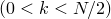 the complex loads  and 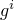 (corresponding to real and imaginary components, respectively) on the sector 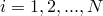 are obtained in the following manner: 


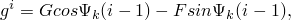

where  and *F* and *G* are real and imaginary components of loads specified for the datum sector, respectively. For the 0-fold cyclic symmetry mode () this type of loading corresponds to a cyclic symmetric load pattern with  and . For  this type of loading is generated when a spatially constant load pattern is applied to a rotating structure (or when a constant load pattern rotates around the structure). For the -fold mode the complex loads on the sector *i* are: 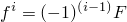 and 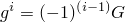.

### Predefined fields

Only cyclic symmetric predefined fields can be applied. Hence, the predefined fields should have the same values at each side of the datum sector.

### Material options

No specific restrictions apply to material models for cyclic symmetry models of general procedures. For the frequency analysis procedure, see the remarks in ["Natural frequency extraction," Section 6.3.5](pt03ch06s03at10.md).

### Elements

Axisymmetric elements should not be used in cyclic symmetry models.

### Output

Nodal displacements and element output variables such as stress, strain, and section force are only available for the datum sector. The mass listed in the data file is computed for the whole model.

In the eigenvalue extraction procedure the following special conditions apply:
- If displacement eigenvector normalization is chosen (the default), the largest displacement entry in each eigenvector on the datum sector is unity. If mass eigenvector normalization is chosen, the eigenvectors are normalized so that the generalized mass computed on the datum sector is unity. See ["Natural frequency extraction," Section 6.3.5](pt03ch06s03at10.md), for details.
- The eigenvalue numbers, cyclic symmetry mode numbers, and corresponding frequencies (in both radians/time and cycles/time) are listed in the data file, along with the generalized masses, composite modal damping factors, participation factors, and modal effective masses. The generalized masses are calculated on the datum sector; composite modal damping factors, participation factors, and modal effective masses are calculated for the entire model.
- You can restrict output to the results and data files by selecting the modes for which output is desired (see ["Output to the data and results files," Section 4.1.2](pt02ch04s01aus39.md)).
- With Abaqus/CAE static displacements and eigenmodes can be displayed for any sector. The results of steady-state, modal-based dynamic analysis can also be animated for any number of sectors, including the entire model.

### Input file template

```
[*HEADING](../key/key-link.md#usb-kws-mheading)
…
**
[*CYCLIC SYMMETRY MODEL](../key/key-link.md#usb-kws-mcycsymmodel), N=*integer*
*N denotes the number of sectors in the entire 360 model.*
…
**
[*SURFACE](../key/key-link.md#usb-kws-msurface), NAME=*name*, TYPE=ELEMENT
[*SURFACE](../key/key-link.md#usb-kws-msurface), NAME=*name*, TYPE=NODE
*Surface description for the slave and master nodes that will be referenced in the [*TIE](../key/key-link.md#usb-kws-mtie) option.*
…
**
[*TIE](../key/key-link.md#usb-kws-mtie), CYCLIC SYMMETRY
*Indicates the internal MPCs that tie the master and slave surfaces
using the cyclic symmetry condition in the cyclic symmetry models only.*
*Data lines to specify surface names that will be tied with this option.*
…
**
[*STEP](../key/key-link.md#usb-kws-hstep) (,NLGEOM)
*If NLGEOM is used, initial stress and preload stiffness effects
will be included in subsequent linear perturbation steps, including the
frequency extraction step*
[*STATIC](../key/key-link.md#usb-kws-hstatic)
...
[*DLOAD](../key/key-link.md#usb-kws-hdload)
*Data lines to specify element or element set, load type, value, (direction).*
...
**
[*END STEP](../key/key-link.md#usb-kws-hendstep)
[*STEP](../key/key-link.md#usb-kws-hstep)
[*FREQUENCY](../key/key-link.md#usb-kws-hfrequency), EIGENSOLVER=LANCZOS
…
[*SELECT CYCLIC SYMMETRY MODES](../key/key-link.md#usb-kws-hselectcycsymmodes), NMAX=*integer*, NMIN=*integer*, EVEN
…
**
[*END STEP](../key/key-link.md#usb-kws-hendstep)
[*STEP](../key/key-link.md#usb-kws-hstep)
[*STEADY STATE DYNAMICS](../key/key-link.md#usb-kws-hsteadystdyn) 
…
[*SELECT EIGENMODES](../key/key-link.md#usb-kws-hselecteigenmodes) 
*Use this option to specify the list of eigenmodes used in the response.*
[*MODAL DAMPING](../key/key-link.md#usb-kws-hmodaldamp) 
*Data lines to specify damping coefficients associated with eigenmodes.*
…
[*CLOAD](../key/key-link.md#usb-kws-hcload), CYCLIC MODE=*integer*, REAL or IMAGINARY
*Data lines to specify node or node set, degree of freedom, value*
[*DLOAD](../key/key-link.md#usb-kws-hdload), CYCLIC MODE=*integer*, REAL or IMAGINARY
*Data lines to specify element or element set, load type, value, (direction)*
…
[*DSLOAD](../key/key-link.md#usb-kws-hdsload), CYCLIC MODE=*integer*, REAL or IMAGINARY
*Data lines to specify element or element set, load type, value, (direction)*
…
**
[*END STEP](../key/key-link.md#usb-kws-hendstep)
```


