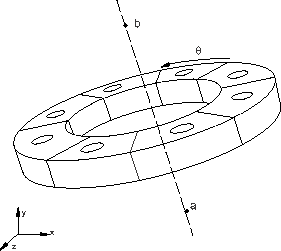
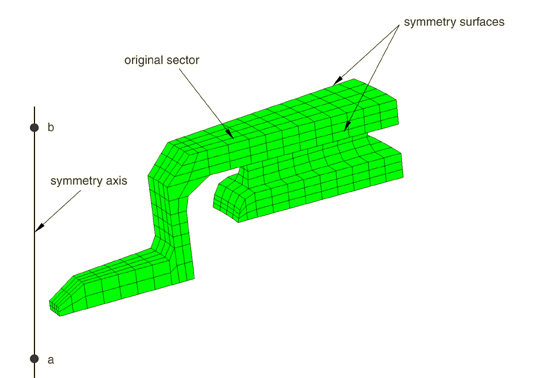
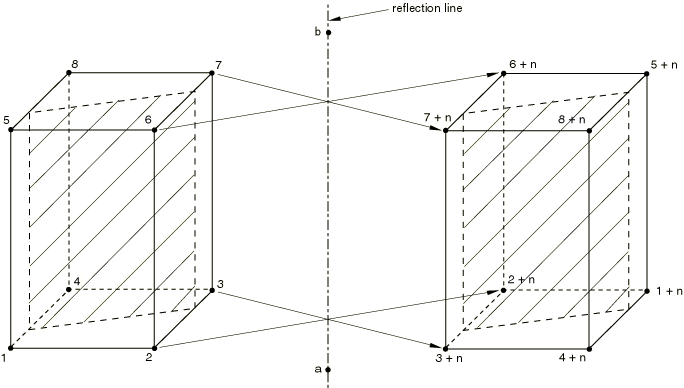
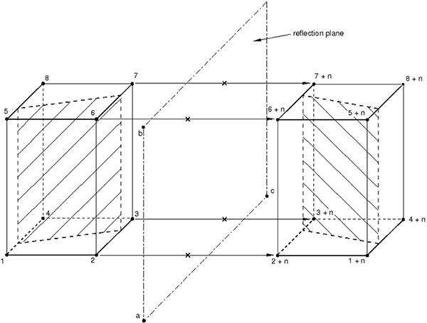

# 10.4.1 Symmetric model generation


**Product: **Abaqus/Standard  

##### **Reference**

- [*SYMMETRIC MODEL GENERATION](../key/key-link.md#usb-kws-maximodelgen)

### Overview

A three-dimensional model can be created in Abaqus/Standard by:
- revolving an axisymmetric model about its axis of revolution;
- revolving a single three-dimensional sector about its axis of symmetry; or
- combining two parts of a symmetric three-dimensional model, where one of the parts is the original model and the other part is obtained by reflecting the original model through either a symmetry line or a symmetry plane.

Abaqus/Standard also provides for the transfer of the solution obtained in the original analysis onto the new model (see ["Transferring results from a symmetric mesh or a partial three-dimensional mesh to a full three-dimensional mesh," Section 10.4.2](pt04ch10s04aus64.md)).

Only stress/displacement, heat transfer, coupled temperature-displacement, and acoustic elements can be used to generate a new model.

### Model generation

The symmetric model generation capability can be used to create a three-dimensional model by revolving an axisymmetric model about its axis of revolution, by revolving a single three-dimensional sector about its axis of symmetry, or by combining two parts of a symmetric model, where one part is the original model and the other part is the original model reflected through a line or a plane. The original model must have been saved to a restart file. The symmetric model generation capability is not available for models defined in terms of an assembly of part instances. Therefore, an element set name or a node set name containing quotation marks is not supported.

An entire three-dimensional model—including nodes, elements, section definitions, material and orientation definitions, rebar, and contact pair definitions—is generated from the original model. Symmetric model generation from a model with general contact is not allowed. You must redefine most types of kinematic constraints (["Kinematic constraints: overview," Section 35.1.1](pt08ch35s01abo32.md)). However, surface-based constraints (["Mesh tie constraints," Section 35.3.1](pt08ch35s03aus132.md)) and embedded element constraints (["Embedded elements," Section 35.4.1](pt08ch35s04aus136.md)) defined in the original model will be generated automatically in the new three-dimensional model. Changes made to the model as part of the history data—element or contact pair removal/reactivation (["Element and contact pair removal and reactivation," Section 11.2.1](pt04ch11s02aus66.md)) or changes to friction properties (["Changing friction properties during an Abaqus/Standard analysis" in "Frictional behavior," Section 37.1.5](pt09ch37s01aus169.md#usb-cni-afriction-change-std))—will not be transferred to the new model. Such changes will have to be redefined in the history data of the new model. All element and node sets defined in the original model will be used in the new model. These sets will contain all of the new elements and nodes that originated from the original sets.

Additional nodes, elements, contact surfaces, etc. can also be defined to create parts of the model that were not specified in the original model. You must ensure that the numbering of these nodes and elements does not conflict with those used by the symmetric model generation capability. You can control the node and element numbering in the new model (as described below for each type of revolved model) so that you can define additional parts of the model without the risk of conflicting element and node labels. The smallest node/element number used in defining additional parts of the new model should be greater than the largest node/element number generated by the symmetric model generation capability.

#### Eliminating duplicate nodes

Duplicate nodes will be generated in certain situations. Such nodes can be eliminated to ensure that the mesh is connected properly. Duplicate nodes can be generated on the axis of revolution of a revolved model, on the connection planes between sectors of a periodic model, and on the connection plane between the two parts of a reflected model. You can specify the tolerance distance, *d*, to be used in the search for duplicate nodes. The default distance is 1.0% of the average element dimension. In some cases a tolerance distance that is smaller than the default value needs to be specified if, for example, the distance between two nodes on one of the connection planes in the original sector of a periodic model is smaller than the default tolerance distance. Closely spaced nodes elsewhere in the model, such as between interface surfaces or on parts of the model that are generated with any of the other model definition options, will not be eliminated.

| **Input File Usage: ** | Use one of the following options to specify the tolerance to be used in the search for duplicate nodes: |
| --- | --- |
|  | ``` [*SYMMETRIC MODEL GENERATION](../key/key-link.md#usb-kws-maximodelgen), PERIODIC, TOLERANCE=*d* [*SYMMETRIC MODEL GENERATION](../key/key-link.md#usb-kws-maximodelgen), REVOLVE, TOLERANCE=*d* [*SYMMETRIC MODEL GENERATION](../key/key-link.md#usb-kws-maximodelgen), REFLECT, TOLERANCE=*d* ``` |

#### Writing the new model definition to an external file

You can specify the name of an external file (without an extension) to which the data for the new model definition will be written. The extension `.axi` will be added to the file name provided. The file can be edited to modify or to extend the model generated by Abaqus/Standard.

| **Input File Usage: ** | Use one of the following options: |
| --- | --- |
|  | ``` [*SYMMETRIC MODEL GENERATION](../key/key-link.md#usb-kws-maximodelgen), PERIODIC, FILE NAME=*name* [*SYMMETRIC MODEL GENERATION](../key/key-link.md#usb-kws-maximodelgen), REVOLVE, FILE NAME=*name* [*SYMMETRIC MODEL GENERATION](../key/key-link.md#usb-kws-maximodelgen), REFLECT, FILE NAME=*name* ``` |

#### Identifying the restart files

The symmetric model generation capability uses the restart (`.res`), analysis database (`.stt` and `.mdl`), and part (`.prt`) files from the old model to generate the new model. The name of the restart files from the old model must be specified when the new analysis is executed by using the **oldjob** parameter in the command for running Abaqus or by answering a request made by the command procedure (see ["Abaqus/Standard, Abaqus/Explicit, and Abaqus/CFD execution," Section 3.2.2](pt01ch03s02abx02.md)).

#### Verifying the new model

It is recommended that you verify the new model carefully before an analysis is performed. The symmetric model generation capability requires only information stored in the restart file during a data check run to generate the new model, which allows you to verify the new model before the analysis of the original model is performed. A data check analysis is performed by using the **datacheck** parameter in the command for running Abaqus (see ["Abaqus/Standard, Abaqus/Explicit, and Abaqus/CFD execution," Section 3.2.2](pt01ch03s02abx02.md)).

### Revolving an axisymmetric cross-section

You can create a three-dimensional model by revolving the cross-section of a two-dimensional axisymmetric model about a symmetry axis starting at a prescribed reference plane, . Both the symmetry axis and reference plane of the new three-dimensional model can be oriented in any direction with respect to the global coordinate system (see [Figure 10.4.1--1](pt04ch10s04aus63.md#ksymm-model-gen-revolve)). A nonuniform discretization in the circumferential direction can be specified.

**Figure 10.4.1–1** Revolving an axisymmetric cross-section.


Specify the coordinates of points *a*, *b*, and *c* shown in [Figure 10.4.1--1](pt04ch10s04aus63.md#ksymm-model-gen-revolve), followed by a list that defines the discretization in the circumferential direction containing the segment angle, number of elements per segment, and the bias ratio of the segment. Several segment angles, each with a different number of element subdivisions and a different bias ratio, can be used to define the complete discretization around the circumference of the revolved model. The endpoint of a cross-section revolved through 360.0 will always be connected to the origin of revolution, , regardless of the value specified for the duplicate node tolerance.

| **Input File Usage: ** | ``` [*SYMMETRIC MODEL GENERATION](../key/key-link.md#usb-kws-maximodelgen), REVOLVE ``` |
| --- | --- |

#### Local orientation system

A local cylindrical orientation system is always used for element output of stress, strain, etc. A default local orientation definition is provided if the material in the original axisymmetric model does not contain an orientation definition. This default orientation is defined with the polar axis of the system along the axis of revolution, with an additional 90.0 rotation about the local 1-direction so that the local axes are 1=radial, 2=axial, and 3=circumferential. If shells or membranes are used, the projections of the local 2- and 3-axes onto the surface of the shell or membrane are taken as the local directions on the surface. This orientation system is always provided, even if an orientation is specified in the original axisymmetric model. However, if the results of the axisymmetric analysis are mapped onto the new three-dimensional model (see ["Transferring results from a symmetric mesh or a partial three-dimensional mesh to a full three-dimensional mesh," Section 10.4.2](pt04ch10s04aus64.md)) and an orientation definition is associated with the material in the original model, the original orientation revolved about the axis of symmetry replaces this default orientation definition.

#### Controlling the new node and element numbering

You can define the increments in numbers between each node and element around the circumference of the three-dimensional model. The numbering starts at the reference cross-section . The reference cross-section uses the same numbering as the original axisymmetric model. The defaults are the largest node and element numbers used in the original axisymmetric model. Control over the numbering allows you to define additional parts of the model without the risk of conflicting element and node labels. Each offset value should be greater than or equal to the maximum node or element label, respectively, used in the original model. When specifying the offset value, care must be taken that the generated node or element does not exceed the maximum value allowed, which is 999,999,999.

| **Input File Usage: ** | ``` [*SYMMETRIC MODEL GENERATION](../key/key-link.md#usb-kws-maximodelgen), REVOLVE, NODE OFFSET=*offset*, ELEMENT OFFSET=*offset* ``` |
| --- | --- |

#### Correspondence between axisymmetric and three-dimensional elements

The element type used in the original two-dimensional model determines the element type in the new three-dimensional model. You can specify whether the new element should be either a general three-dimensional element or a cylindrical element. General and cylindrical elements can be used in the same model.

| **Input File Usage: ** | ``` [*SYMMETRIC MODEL GENERATION](../key/key-link.md#usb-kws-maximodelgen), REVOLVE *coordinates of points a and b* *coordinates of point c* *segment angle, number of elements per segment, bias ratio*, CYLINDRICAL or GENERAL ``` |
| --- | --- |
|  | For example, the following input specifies 4 cylindrical elements in a 300 segment and 10 general elements in a 60 segment: ``` [*SYMMETRIC MODEL GENERATION](../key/key-link.md#usb-kws-maximodelgen), REVOLVE *ax, ay, az, bx, by, bz* *cx, cy, cz* 300.0, 4, 1.0, CYLINDRICAL 60.0, 10, 1.0, GENERAL ``` |

Regular axisymmetric elements (CAX), axisymmetric elements with twist (CGAX), shell elements, membrane elements, rigid elements, and surface elements can be used in the two-dimensional model; however, nonlinear axisymmetric elements (CAXA) cannot be used. A two-dimensional model that contains incompatible mode elements; first-order, reduced-integration, continuum elements; shell elements; or rigid elements cannot be used to generate cylindrical elements. The correspondence between the axisymmetric element type and the equivalent three-dimensional element type (general or cylindrical) is shown in [Table 10.4.1--1](pt04ch10s04aus63.md#table-aaximodelgen-axi-3d).

**Table 10.4.1–1** Correspondence between axisymmetric and three-dimensional (general and cylindrical) element types.
| Axisymmetric element | General three-dimensional element | Cylindrical element |
| --- | --- | --- |
| ACAX3 | AC3D6 |  |
| CAX3 | C3D6 | CCL9 |
| CAX3H | C3D6H | CCL9H |
| CGAX3 | C3D6 | CCL9 |
| CGAX3H | C3D6H | CCL9H |
| CGAX3T | C3D6T |  |
| DCAX3 | DC3D6 |  |
| ACAX4 | AC3D8 |  |
| CAX4 | C3D8 | CCL12 |
| CAX4H | C3D8H | CCL12H |
| CAX4I | C3D8I |  |
| CAX4R | C3D8R |  |
| CAX4RH | C3D8RH |  |
| CGAX4 | C3D8 | CCL12 |
| CGAX4H | C3D8H | CCL12H |
| CGAX4R | C3D8R |  |
| CGAX4RH | C3D8RH |  |
| CAX4T | C3D8T |  |
| CAX4RT | C3D8RT |  |
| CAX4HT | C3D8HT |  |
| CAX4RHT | C3D8RHT |  |
| CGAX4T | C3D8T |  |
| CGAX4RT | C3D8RT |  |
| CGAX4HT | C3D8HT |  |
| CGAX4RHT | C3D8RHT |  |
| DCAX4 | DC3D8 |  |
| DCCAX4 | DCC3D8 |  |
| DCCAX4D | DCC3D8D |  |
| ACAX6 | AC3D15 |  |
| CAX6 | C3D15 | CCL18 |
| CAX6H | C3D15H | CCL18H |
| CGAX6 | C3D15 | CCL18 |
| CGAX6H | C3D15H | CCL18H |
| DCAX6 | DC3D15 |  |
| ACAX8 | AC3D20 |  |
| CAX8 | C3D20 | CCL24 |
| CAX8H | C3D20H | CCL24H |
| CAX8R | C3D20R | CCL24R |
| CAX8RH | C3D20RH | CCL24RH |
| CGAX8 | C3D20 | CCL24 |
| CGAX8H | C3D20H | CCL24H |
| CGAX8R | C3D20R | CCL24R |
| CGAX8RH | C3D20RH | CCL24RH |
| CAX8T | C3D20T |  |
| CAX8RT | C3D20RT |  |
| CAX8HT | C3D20HT |  |
| CAX8RHT | C3D20RHT |  |
| CGAX8T | C3D20T |  |
| CGAX8RT | C3D20RT |  |
| CGAX8HT | C3D20HT |  |
| CGAX8RHT | C3D20RHT |  |
| DCAX8 | DC3D20 |  |
| SAX1 | S4R |  |
| DSAX1 | DS4 |  |
| SAX2 | S8R |  |
| DSAX2 | DS8 |  |
| MAX1 | M3D4R | MCL6 |
| MGAX1 | M3D4R | MCL6 |
| MAX2 | M3D8R | MCL9 |
| MGAX2 | M3D8R | MCL9 |
| RAX2 | R3D4 |  |
| SFMAX1 | SFM3D4R | SFMCL6 |
| SFMGAX1 | SFM3D4R | SFMCL6 |
| SFMAX2 | SFM3D8R | SFMCL9 |
| SFMGAX2 | SFM3D8R | SFMCL9 |

#### Limitations

- First- and second-order elements cannot be used together in the axisymmetric model.
- Nonaxisymmetric elements such as springs, dashpots, beams, and trusses will be ignored in the model generation.
- Only surface-based contact pairs can be revolved. Models using general contact cannot be revolved. Contact conditions modeled with contact elements will be ignored in the model generation.
- A two-dimensional model that includes incompatible mode elements; first-order, reduced-integration, continuum elements; shell elements; or rigid elements cannot be used to generate cylindrical elements.
- Rebar with nonuniform spacing in the radial direction of an axisymmetric element cannot be revolved.
- Most types of kinematic constraints cannot be revolved. However, surface-based constraints (["Mesh tie constraints," Section 35.3.1](pt08ch35s03aus132.md)) and embedded element constraints (["Embedded elements," Section 35.4.1](pt08ch35s04aus136.md)) defined in the original model will be generated automatically in the new three-dimensional model.
- Only stress/displacement, heat transfer, coupled temperature-displacement, and acoustic elements can be revolved.

### Revolving a three-dimensional sector to create a periodic model

You can create a three-dimensional periodic model by revolving a single three-dimensional sector about a symmetry axis. Each generated sector in the periodic model can span the same angle in the circumferential direction, such as in a vented disc, or alternatively, can have a variable angle, such as in a treaded tire. In both cases, each sector always has the same geometry and mesh. Both the symmetry axis and the original three-dimensional sector can be oriented in any direction with respect to the global coordinate system (see [Figure 10.4.1--2](pt04ch10s04aus63.md#ksymm-model-gen-per)). Mismatched surface meshes can be used between sectors. Both open (the structure has end edges) or closed loop periodic structures can be generated. If a closed loop periodic structure needs to be created, the sum of the segment angles over all the sectors must be equal to 360.

**Figure 10.4.1–2** Revolving a three-dimensional sector to form a periodic model.



#### Defining a periodic model with a constant angle

To define a periodic model with a constant angle, you must specify the coordinates of points *a* and *b* shown in [Figure 10.4.1--2](pt04ch10s04aus63.md#ksymm-model-gen-per) to define the symmetry axis. You then define the segment angle,  (in degrees), of the original sector and the number of three-dimensional repetitive sectors, *N*, including the original sector, in the generated periodic model. 

| **Input File Usage: ** | ``` [*SYMMETRIC MODEL GENERATION](../key/key-link.md#usb-kws-maximodelgen), PERIODIC=CONSTANT *coordinates of points a and b* *θ, N* ``` |
| --- | --- |

#### Defining a periodic model with a variable angle

 To define a periodic model with a variable angle, the surfaces on both sides of the original sector must be completely planar. You specify the coordinates of points *a* and *b* shown in [Figure 10.4.1--2](pt04ch10s04aus63.md#ksymm-model-gen-per) to define the symmetry axis. You then define the segment angle,  (in degrees), of the original sector and the number of three-dimensional repetitive sectors, *N*, including the original sector, in the generated periodic model. Next, you specify an additional number of three-dimensional sectors to be generated, *M*, and the angular scaling factor, *f*, in the circumferential direction with respect to the original sector to be applied to these additional sectors. You can define pairs of additional sectors and scaling factors as needed.

| **Input File Usage: ** | ``` [*SYMMETRIC MODEL GENERATION](../key/key-link.md#usb-kws-maximodelgen), PERIODIC=VARIABLE *coordinates of points a and b* *θ, N* *M1, f1* *M2, f2* *Etc.* ``` |
| --- | --- |
|  | For example, the following input creates a 210 three-dimensional model with 7 sectors with the angles of 20, 20, 30, 30, 30, 40, and 40, respectively: ``` [*SYMMETRIC MODEL GENERATION](../key/key-link.md#usb-kws-maximodelgen), PERIODIC=VARIABLE *ax, ay, az, bx, by, bz* 20.0,2 3,1.5 2,2.0 ``` |

#### Applying constraints to symmetric surfaces with mismatched meshes

If the symmetric surfaces in the original sector have precisely matched meshes, as shown in [Figure 10.4.1--3](pt04ch10s04aus63.md#ksymm-model-gen-per-map), any duplicate nodes that are generated will be eliminated automatically to ensure that the mesh is connected properly between the neighboring sectors when revolving the original sector about the symmetry axis to create a periodic model. 

**Figure 10.4.1–3** Surfaces with precisely matching meshes on the original sector.



In all other cases you must define one or more pairs of corresponding surfaces on each side of the original sector (see ["Surfaces: overview," Section 2.3.1](pt01ch02s03aus16.md)) in the original model and specify the pairs of corresponding surfaces in the symmetric model generation definition.

 Optionally, you can also specify the tolerance distance within which nodes on one surface of a sector must lie from the corresponding surface of the neighboring sector to be constrained. Nodes on the surface of the sector that are further away from the corresponding surface of the neighboring sector than this distance are not constrained. The default value for the tolerance distance is 5% or 10% of the typical element size in the surfaces of the original sector, depending on whether node-to-surface or surface-to-surface type constraints are used, respectively.

You can also specify whether surface-to-surface (default) or node-to-surface constraints should be used. Constraints between the automatically generated neighboring pairs of corresponding surfaces are then applied with an automatically generated surface-based tie constraint (["Mesh tie constraints," Section 35.3.1](pt08ch35s03aus132.md)) when revolving the original sector about the symmetry axis to create a periodic model. The first surface of each specified pair is the slave surface, and all degrees of freedom of the nodes in the surface will be eliminated by internally generated multi-point constraints.

| **Input File Usage: ** | Use the following options in the original model: |
| --- | --- |
|  | ``` [*SURFACE](../key/key-link.md#usb-kws-msurface), NAME=*master* [*SURFACE](../key/key-link.md#usb-kws-msurface), NAME=*slave* ``` Use the following option in the new model with a constant angle for each sector: ``` [*SYMMETRIC MODEL GENERATION](../key/key-link.md#usb-kws-maximodelgen), PERIODIC=CONSTANT *ax, ay, az, bx, by, bz* *θ, N* *slave, master, tolerance distance,* SURFACE or NODE ``` Use the following option in the new model with a variable angle for each sector: ``` [*SYMMETRIC MODEL GENERATION](../key/key-link.md#usb-kws-maximodelgen), PERIODIC=VARIABLE *ax, ay, az, bx, by, bz* *θ, N* *M, f* *slave, master, tolerance distance,* SURFACE or NODE ``` |

#### Local orientation system

A local cylindrical orientation system is always used for element output of stress, strain, etc. If an orientation is specified in the original three-dimensional sector (see ["Orientations," Section 2.2.5](pt01ch02s02aus15.md)), the orientation system in the new model is defined by revolving the original orientation system about the symmetry axis. If shells or membranes are used, the projections of the local 2- and 3-axes onto the surface of the shell or membrane are taken as the local directions on the surface. If the material in the original three-dimensional sector does not contain an orientation definition, a default local orientation definition is provided. This default orientation is defined by revolving the global coordinate system in the original model about the axis of symmetry in the new model.

#### Controlling the new node and element numbering

You can define the increments in numbers between each node and element around the circumference of the three-dimensional model. The numbering starts at the original three-dimensional repetitive sector. The original three-dimensional repetitive sector uses the same numbering as the original model. The defaults are the largest node and element numbers used in the original model. Control over the numbering allows you to define additional parts of the model without the risk of conflicting element and node labels. Each offset value should be greater than or equal to the maximum node or element label, respectively, used in the original model. When specifying the offset value, care must be taken that the generated node or element does not exceed the maximum value allowed, which is 999,999,999.

| **Input File Usage: ** | ``` [*SYMMETRIC MODEL GENERATION](../key/key-link.md#usb-kws-maximodelgen), PERIODIC, NODE OFFSET=*offset*, ELEMENT OFFSET=*offset* ``` |
| --- | --- |

#### Limitations

- Only surface-based contact pairs can be revolved. Models using general contact cannot be revolved. Contact conditions modeled with contact elements will be ignored in the model generation.
- Most types of kinematic constraints cannot be revolved. However, surface-based constraints (["Mesh tie constraints," Section 35.3.1](pt08ch35s03aus132.md)) and embedded element constraints (["Embedded elements," Section 35.4.1](pt08ch35s04aus136.md)) defined in the original model will be generated automatically in the new three-dimensional model. One exception is that surface-based ties for enforcing cyclic symmetric constraints are not revolved.
- Surface-based distributed coupling constraints---e.g., couplings (["Coupling constraints," Section 35.3.2](pt08ch35s03aus133.md)), shell-to-solid couplings (["Shell-to-solid coupling," Section 35.3.3](pt08ch35s03aus134.md)), and fasteners (["Mesh-independent fasteners," Section 35.3.4](pt08ch35s03aus135.md))---cannot be revolved and must be redefined.
- Only stress/displacement, heat transfer, coupled temperature-displacement, and acoustic elements can be revolved. Beam and frame elements cannot be revolved.

### Reflecting a partial three-dimensional model

You can create a three-dimensional model by combining two parts of a symmetric three-dimensional model. One of the parts is the original model, and the other part is obtained by reflecting the original model through a symmetry line ([Figure 10.4.1--4](pt04ch10s04aus63.md#ksymm-model-gen-refl-line)) or plane ([Figure 10.4.1--5](pt04ch10s04aus63.md#ksymm-model-gen-refl-plane)).

Specify the coordinates of points *a*, *b*, and (if required) *c* shown in [Figure 10.4.1--4](pt04ch10s04aus63.md#ksymm-model-gen-refl-line) and [Figure 10.4.1--5](pt04ch10s04aus63.md#ksymm-model-gen-refl-plane).

**Figure 10.4.1–4** Reflecting a three-dimensional model through line  with node offset *n*.



**Figure 10.4.1–5** Reflecting a three-dimensional model through a plane  with node offset *n*.



| **Input File Usage: ** | Use one of the following options: |
| --- | --- |
|  | ``` [*SYMMETRIC MODEL GENERATION](../key/key-link.md#usb-kws-maximodelgen), REFLECT=LINE [*SYMMETRIC MODEL GENERATION](../key/key-link.md#usb-kws-maximodelgen), REFLECT=PLANE ``` |

#### Controlling the new node and element numbering

You can specify constants that must be added to the original node and element numbers for numbering the reflected part of the three-dimensional model. The defaults are the maximum node and element numbers used in the original model. Control over the numbering allows you to define additional parts of the model without the risk of conflicting element and node labels.

| **Input File Usage: ** | ``` [*SYMMETRIC MODEL GENERATION](../key/key-link.md#usb-kws-maximodelgen), REFLECT, NODE OFFSET=*offset*, ELEMENT OFFSET=*offset* ``` |
| --- | --- |

#### Limitations

- Only surface-based contact pairs can be reflected. Models using general contact cannot be reflected. Contact conditions modeled with contact elements will be ignored in the model generation.
- You must ensure that master surfaces remain continuous after reflection. A discontinuous surface is created when the surface in the original model does not intersect the connection plane between the two parts of the symmetric structure.
- Rigid surfaces cannot be reflected. The rigid surface definition of the original model is simply repeated in the new model. You must, therefore, specify the complete rigid surface in the original model.
- Most types of kinematic constraints cannot be reflected. However, surface-based constraints (["Mesh tie constraints," Section 35.3.1](pt08ch35s03aus132.md)) and embedded element constraints (["Embedded elements," Section 35.4.1](pt08ch35s04aus136.md)) defined in the original model will be generated automatically in the new three-dimensional model.
- Only stress/displacement, heat transfer, coupled temperature-displacement, and acoustic elements can be reflected.
- Nonaxisymmetric elements such as springs, dashpots, beams, and trusses cannot be reflected.


