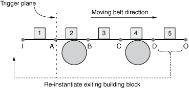

# 10.5.1 Periodic media analysis


**Product: **Abaqus/Explicit  

##### **References**

- [*PERIODIC MEDIA](../key/key-link.md#usb-kws-mperiodicmedia)
- [*MEDIA TRANSPORT](../key/key-link.md#usb-kws-mmediatransport)

### Overview

The periodic media analysis technique in Abaqus/Explicit:
- is a Lagrangian technique that offers an Eulerian-like view into a moving structure;
- can be used to effectively model systems that are repetitive in nature, such as manufacturing processes involving conveyor belts or continuous forming operations;
- leads to significant analysis time speedup when compared to traditional modeling techniques that may require excessively large meshes; and
- requires topologically identical meshed parts to create the model, which can be accomplished via the parts and instances modeling paradigm.

### Introduction

Quite often industrial processes that need to be analyzed involve sections that repeat in a simple pattern and move through a process zone. A prominent example is a conveyor belt with regularly spaced packages, as illustrated schematically in [Figure 10.5.1--1](pt04ch10s05aus65.md#aperiodicmedia-def) and exemplified with a finite element mesh in [Figure 10.5.1--2](pt04ch10s05aus65.md#belt_transport). Continuous forming operations such as metal rolling are also good examples because the deforming material can be broken up into an arbitrary number of identical sections. 

**Figure 10.5.1–1** Schematic representation of periodic media.



**Figure 10.5.1–2** Conveyor belt with packages on top.


 For the sake of clarity we will use the conveyor belt example throughout this discussion to illustrate many of the concepts associated with the periodic media analysis technique. [Figure 10.5.1--1](pt04ch10s05aus65.md#aperiodicmedia-def) shows a conceptual decomposition of the conveyor belt; in reality, the belt is a continuous entity.

Conceptually, the overall model can be decomposed into blocks (topologically identical meshed structures) that are connected together and span the process zone. You create a part that defines a “building block” (the meshed structure that is repeated to model the entire periodic media) and then construct the whole model via a chain of appropriately positioned instances. The periodic media analysis technique provides a simple way to automatically connect these instances together at the front and back ends of adjacent blocks. This technique also provides a convenient way to define loads and boundary conditions that represent the physical system at the unconnected ends of the first and last blocks in the chain. The first block of the chain is referred to as the inlet, and the last block is referred to as the outlet. Finally, when the periodic media moves through the process zone, blocks from the outlet are automatically shuffled to the inlet. The blocks (meshed structures) defined with this technique can interact via contact with other modeling features that are not periodic in nature, such as the rollers depicted in [Figure 10.5.1--1](pt04ch10s05aus65.md#aperiodicmedia-def). 

At the core of the periodic media analysis technique lies the concept of shuffling blocks from the outlet back to the inlet. A dedicated algorithm is used to detect when the inlet has moved too far into the process zone and to shuffle a block from the outlet directly to the inlet. The dashed arrow in [Figure 10.5.1--1](pt04ch10s05aus65.md#aperiodicmedia-def) illustrates the shuffling process. To ensure a smooth transition, the necessary nodal and element state data from the inlet block are stored at the beginning of the current step. When shuffling occurs, the stored nodal and element state data are mapped to the new inlet block and any inlet/outlet loads or boundary conditions are transferred to the newly exposed block ends.

Thus, the periodic media analysis technique offers a convenient way for an Eulerian-like view into the moving repetitive structure. For example, you may be interested in assessing the package dynamics on the belt at a location somewhere between the rollers in both transient and steady-state conditions. You define several blocks around that location, you define contact with the rollers as necessary, and you provide appropriate inlet and outlet loading conditions. The periodic media analysis technique provides a convenient and economical way to create and analyze this system. By re-using elements that have left the process zone via this shuffling process, you can avoid the large meshes at the inlet end required for purely Lagrangian simulations.

### Constructing a periodic media model

The first step in constructing a periodic media model is to identify the portion of the model that constitutes the building block of the repetitive structure. In [Figure 10.5.1--2](pt04ch10s05aus65.md#belt_transport) one square belt patch together with one asymmetrically shaped package on top constitute such a building block. If you string together several blocks, the entire belt with packages can be modeled as shown.

#### Defining a building block

The following requirements must be observed when defining each building block:
- an unsorted element set must be defined to include all elements in the building block, and
- an unsorted node set must be defined to include all nodes in the building block.

To ensure the proper transfer of information as the periodic media advances, these unsorted sets must be topologically identical between all blocks. The easiest way to achieve this requirement is to use the parts and instances modeling paradigm. You define one part corresponding to the building block and define unsorted element and node sets as discussed above. You then instantiate the part as many times as needed with the appropriate translations and rotations to generate the periodic media mesh. Constraints such as ties, couplings, and rigid bodies are allowed within a building block. You must ensure that these constraints are defined in a topologically identical fashion in all blocks.

The periodic media analysis technique connects together these otherwise unconnected blocks to create a continuous model. If structural elements (e.g., shells) are used in the connecting regions of the blocks, the nodes on the edges of these regions are connected to the adjacent regions. If continuum elements are used, the nodes on the faces of these regions are connected. For these constraints to be constructed reliably, the following additional requirements must be observed:
- the nodal arrangements at the front and back connecting ends of blocks must be topologically identical,
- the front and back end nodes of adjacent blocks must be coincident,
- the nodal arrangements at the front and back end of the initial inlet block must have coordinates that differ only by a rigid body translation, and
- two node-based surfaces created using unsorted node sets at the front and back end of each block must be defined.

The node-based surfaces are used to automatically generate node-to-node tie constraints between adjacent blocks such that the whole assembly behaves as a continuous entity. 

| **Input File Usage: ** | Use the following option to define the sequence of blocks using unsorted sets and surfaces as described above: |
| --- | --- |
|  | ``` [*PERIODIC MEDIA](../key/key-link.md#usb-kws-mperiodicmedia), NAME=*name* *elset1*, *nodeset1*, *frontsurf1*, *backsurf1* *elset2*, *nodeset2*, *frontsurf2*, *backsurf2* *...* *elsetn*, *nodesetn*, *frontsurfn*, *backsurfn* ``` Each data line provides the set and surface names associated with a given block. |

#### Applying loads and boundary conditions at media ends

In the schematic belt shown in [Figure 10.5.1--1](pt04ch10s05aus65.md#aperiodicmedia-def), you usually need to apply loads or boundary conditions at both ends of the assembly. At the inlet point I it is often useful to apply a pre-tension load that keeps the belt taut, while at the outlet point O the belt velocity is usually prescribed. As the belt advances and exiting blocks are being shuffled from the outlet to the inlet, the nodes requiring the boundary conditions will change. Therefore, these boundary conditions and loads cannot be prescribed directly at nodes belonging to the block. 

The periodic media analysis technique allows for the application of such loading features via two control nodes that are associated with the current inlet and outlet node-based surfaces. The control nodes are similar to reference nodes used in other features (such as kinematic couplings) and impose automatically defined rigid body–like constraints on the nodes at the extreme ends of the assembly. You apply loads and boundary conditions at these control nodes. A rigid body–like constraint is also imposed on the front end nodes of the inlet block, but no loads or boundary conditions can be applied. When exiting blocks are being shuffled back to the inlet, the control points will enforce these rigid body–like constraints on the new extreme end surfaces and remove the rigid body–like constraints from the previous locations. The process is automatic and fully managed by the periodic media analysis technique.

| **Input File Usage: ** | Use the following option to define control nodes for the inlet and outlet conditions: |
| --- | --- |
|  | ``` [*PERIODIC MEDIA](../key/key-link.md#usb-kws-mperiodicmedia), INLET CONTROL NODE=*node*, OUTLET CONTROL NODE=*node* ``` |

#### Defining the process zone

When the inlet block moves completely into the process zone, the outlet block is shuffled back to the inlet, as the dashed arrow indicates in [Figure 10.5.1--1](pt04ch10s05aus65.md#aperiodicmedia-def). A trigger plane controls the precise timing for when the shuffling occurs. When the nodes located at the current inlet point I cross the trigger plane, the shuffling process is launched. The trigger plane is defined using the coordinates of a (usually) stationary node and the *z*-axis of a user-defined orientation. The local *z*-axis direction points from the inlet toward the process zone.

| **Input File Usage: ** | Use the following option to define the trigger plane via a trigger node and orientation: |
| --- | --- |
|  | ``` [*PERIODIC MEDIA](../key/key-link.md#usb-kws-mperiodicmedia), TRIGGER NODE=*node*, ORIENTATION=*orientation* ``` |

### Activating a periodic media

The shuffling process can be activated on a step-by-step basis. By default, the shuffling process is inactive. In many cases the configuration of the periodic media in the operating condition can be determined only via simulation. This allows any number of analysis steps to be carried out prior to activating the shuffling process. 

The example illustrated in [Figure 10.5.1--2](pt04ch10s05aus65.md#belt_transport) and in ["Media transport," Section 3.25.1 of the Abaqus Verification Guide](../ver/ver-link.md#ver-prc-mediatransport), shows a conveyor belt transporting asymmetrical packages placed initially at regular intervals. In its operating condition the belt will be tensioned. You can pre-stretch the belt assembly in either Abaqus/Standard or Abaqus/Explicit. If the pre-stretch analysis is conducted in Abaqus/Standard, all ties between adjacent blocks as well as boundary conditions at the inlet and outlet ends nodes need to be defined explicitly as the periodic media analysis technique is available only in Abaqus/Explicit. If the pre-stretching step is conducted in Abaqus/Explicit, the shuffling process should remain inactive during the pre-stretching step.

| **Input File Usage: ** | Use the following option to activate or deactivate the periodic media shuffling process: |
| --- | --- |
|  | ``` [*MEDIA TRANSPORT](../key/key-link.md#usb-kws-mmediatransport) *periodic_media_name1*, ACTIVE *periodic_media_name2*, INACTIVE ... ``` |

### Modeling tips

The periodic media analysis technique is a powerful feature; however, you must exercise good engineering judgement when using it. The following comments and recommendations will help you avoid common pitfalls when using this technique:
- The block shuffling process is inherently noisy as chunks of elements are detached at one end and reattached at the other. Although the process uses appropriate material and kinematic states, small shocks are inherent to the process. A small amount of mass proportional damping is recommended to dampen out this excitation.
- The combination of boundary conditions at the inlet control node and any loads applied in the process zone should ensure that the inlet block moves across the trigger plane without a change in direction. In the conveyor belt example, a good modeling practice would be to place a fixed guide roller at least two blocks away from the trigger plane.
- For more complex geometries (such as belts that change direction between rollers or package wrapping analyses when the belt is the wrapping material itself), it may be necessary to start with a straight sequence of blocks and move the belt rollers (which are not part of the periodic media definition) into the desired locations. Contact interaction between the belt and the rollers would deform the belt in the desired configuration. This additional analysis step can greatly simplify the definition of the initial mesh.
- Sometimes it may be necessary to model the process of threading a belt wrapping through rollers, just as in physical reality at the start of a manufacturing process. If this leading segment is followed by periodic blocks that include actual packages, you can attach the periodic media mesh to a regular mesh to execute the threading. The periodic media part of the mesh can then be imported into a separate model without the leading mesh, and the analysis of the periodic media consisting only of the wrapper and packages can be executed.

### Initial conditions

Initial conditions can be specified at all nodes in the periodic media mesh. Velocity initial boundary conditions can be used to minimize the solution time needed to reach a steady-state operating condition. In cases where pre-stretching is required, importing from the prior analysis rather than performing a multistep analysis allows for initial conditions to be applied to the stretched configuration. Since periodic media definitions are not imported, they must be respecified in every analysis in which they are required.

### Boundary conditions

The inlet and outlet control nodes are the only two nodes associated with a periodic media definition at which boundary conditions can be specified. Furthermore, only velocity boundary conditions are permitted. You must not specify boundary conditions at any other node associated with the periodic media mesh. While the periodic media is active and if a steady-state solution is sought, these boundary conditions should be kept constant in both direction and magnitude to mitigate solution noise.

### Loads

Only concentrated loads can be applied to the inlet and outlet control nodes to either drive or stretch the periodic media. While the periodic media is active, these loads should be kept constant in both direction and magnitude. Gravity loads can be applied as desired. Other distributed loads can also be specified; however, you must keep in mind that the loads will travel with the blocks as they are shuffled.

### Material options

All available material models are supported.

### Limitations

Periodic media analyses are subject to the following limitations: 		
- Only membranes, shells, trusses, continuum elements, and rigid elements are allowed within blocks. Rebar layers can also be used, if applicable.
- No explicitly defined constraints are allowed between nodes belonging to different blocks.
- Mass scaling must be defined in the same fashion for all blocks.

 		The periodic media should not be involved in- general contact that defines thermal contact properties or coupled Eulerian-Lagrangian contact or
- contact defined via the contact pair algorithm.

### Input file template

The following example illustrates a model with two periodic media defined:

```
*HEADING
…
*PERIODIC MEDIA, NAME=belt1, INLET CONTROL NODE=10,
OUTLET CONTROL NODE=110, ORIENTATION=ori1, TRIGGER NODE=210
*elset1, nodeset1, frontedgesurf1, backedgesurf1*
*elset2, nodeset1, frontedgesurf2, backedgesurf2*
*elset3, nodeset1, frontedgesurf3, backedgesurf3*
*PERIODIC MEDIA, NAME=belt2, INLET CONTROL NODE=11, 
OUTLET CONTROL NODE=111, ORIENTATION=ori2, TRIGGER NODE=211
*elset1, nodeset1, frontedgesurf1, backedgesurf1*
*elset2, nodeset1, frontedgesurf2, backedgesurf2*
*elset3, nodeset1, frontedgesurf3, backedgesurf3*
*STEP
*DYNAMIC, EXPLICIT
*MEDIA TRANSPORT
belt1, ACTIVE
belt2, INACTIVE
*END STEP
```


